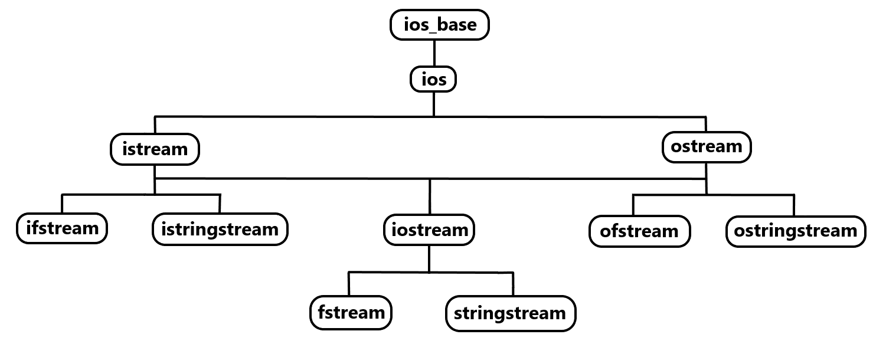
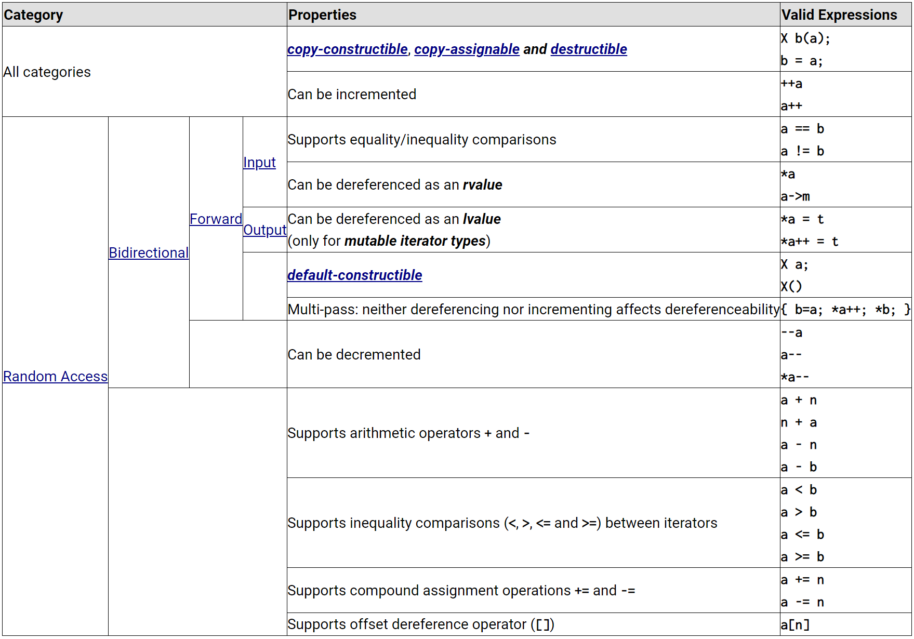

# Table of Contents

- [Table of Contents](#table-of-contents)
- [Online IDE Playground Boilerplate Code](#online-ide-playground-boilerplate-code)
- [Todo](#todo)
- [Algorithms Library](#algorithms-library)
  - [`std::accumulate()`](#stdaccumulate)
  - [`std::equal()`](#stdequal)
  - [`std::fill()`](#stdfill)
  - [`std::find()`](#stdfind)
  - [`std::for_each()`](#stdfor_each)
  - [`std::max_element` + `std::min_element`](#stdmax_element--stdmin_element)
  - [`std::partial_sum()`](#stdpartial_sum)
  - [`std::reduce()`](#stdreduce)
  - [`std::transform()`](#stdtransform)
- [Input/Output (IO) Library](#inputoutput-io-library)
  - [`std::stringstream`](#stdstringstream)
- [Iterators Library](#iterators-library)
  - [Dereferencing Iterator To Get Value](#dereferencing-iterator-to-get-value)
  - [Iterator Adaptors/Generators](#iterator-adaptorsgenerators)
  - [Iterator Operations](#iterator-operations)
  - [Range Access](#range-access)
- [Limits Library](#limits-library)
- [Numerics Library](#numerics-library)
  - [Integer Literal](#integer-literal)
  - [Factor Operations](#factor-operations)
  - [Common Math Functions](#common-math-functions)
- [Regular Expressions (RegEx) Library](#regular-expressions-regex-library)
- [Utilities Library](#utilities-library)
  - [`std::hash`](#stdhash)
    - [Member Functions](#member-functions)
    - [Type Specialisations (CPlusPlus)](#type-specialisations-cplusplus)
    - [Standard Specializations For Basic Types](#standard-specializations-for-basic-types)
    - [Standard Specializations For Library Types](#standard-specializations-for-library-types)
    - [Example](#example)
  - [`std::pair`](#stdpair)
    - [Template Parameters](#template-parameters)
    - [Member Types](#member-types)
    - [Member Objects](#member-objects)
    - [Member Functions](#member-functions-1)
    - [Non-Member Functions](#non-member-functions)
    - [Non-Member Functions](#non-member-functions-1)
    - [Deduction Guide](#deduction-guide)
    - [Example](#example-1)
      - [Destructuring Pair](#destructuring-pair)
  - [`std::tuple`](#stdtuple)
    - [Template Parameters](#template-parameters-1)
    - [Member Functions](#member-functions-2)
    - [Non-Member Functions](#non-member-functions-2)
    - [Helper Classes](#helper-classes)
    - [Deduction Guide](#deduction-guide-1)
    - [Example](#example-2)
- [Strings Library](#strings-library)
  - [`std::string`](#stdstring)
    - [Template Parameters](#template-parameters-2)
    - [Member Types](#member-types-1)
    - [Member Functions](#member-functions-3)
      - [`.compare()`](#compare)
      - [`.substr()`](#substr)
        - [`.substr(i)`](#substri)
        - [`.substr[i, j)`](#substri-j)
        - [`.substr[i, j]`](#substri-j-1)
    - [Constants](#constants)
    - [Non-Member Functions](#non-member-functions-3)
    - [Input/Output](#inputoutput)
    - [Numeric Conversions](#numeric-conversions)
      - [`std::to_string()`](#stdto_string)
    - [Literals](#literals)
    - [Helper Classes](#helper-classes-1)
    - [Deduction Guide](#deduction-guide-2)
    - [Example](#example-3)
- [Smart Pointers](#smart-pointers)
  - [Unique Pointer `std::unique_ptr`](#unique-pointer-stdunique_ptr)
    - [Notes](#notes)
    - [Member Types](#member-types-2)
    - [Member Functions](#member-functions-4)
    - [Non-Member Functions](#non-member-functions-4)
    - [Helper Classes](#helper-classes-2)
    - [Comp6771](#comp6771)
    - [Example](#example-4)
  - [Shared Pointer `std::shared_ptr`](#shared-pointer-stdshared_ptr)
    - [Notes](#notes-1)
    - [Member Types](#member-types-3)
    - [Member Functions](#member-functions-5)
    - [Non-Member Functions](#non-member-functions-5)
    - [Helper Classes](#helper-classes-3)
    - [Comp6771](#comp6771-1)
    - [Example](#example-5)
  - [Weak Pointer `std::weak_ptr`](#weak-pointer-stdweak_ptr)
    - [Notes](#notes-2)
    - [Member Types](#member-types-4)
    - [Member Functions](#member-functions-6)
    - [Non-Member Functions](#non-member-functions-6)
    - [Helper Classes](#helper-classes-4)
    - [Notes](#notes-3)
  - [`.` vs `->` for Dereferencing Smart Pointers](#-vs---for-dereferencing-smart-pointers)
- [Containers Library](#containers-library)
  - [Container Class Templates (Overview)](#container-class-templates-overview)
  - [`std::array`](#stdarray)
    - [Iterator Invalidation](#iterator-invalidation)
    - [Member Types](#member-types-5)
    - [Member Functions](#member-functions-7)
    - [Non-Member Functions](#non-member-functions-7)
    - [Helper Classes](#helper-classes-5)
    - [Deduction Guide](#deduction-guide-3)
    - [Example](#example-6)
  - [`std::vector`](#stdvector)
    - [Specialisations](#specialisations)
    - [Iterator Invalidation](#iterator-invalidation-1)
    - [Member Types](#member-types-6)
    - [Member Functions](#member-functions-8)
    - [Non-Member Functions](#non-member-functions-8)
    - [Deduction Guide](#deduction-guide-4)
    - [Check if element exists in `std::vector`](#check-if-element-exists-in-stdvector)
    - [Example](#example-7)
  - [`std::list`](#stdlist)
    - [Member Types](#member-types-7)
    - [Member Functions](#member-functions-9)
    - [Non-Member Functions](#non-member-functions-9)
    - [Deduction Guide](#deduction-guide-5)
    - [Example](#example-8)
  - [`std::deque`](#stddeque)
    - [Iterator Invalidation](#iterator-invalidation-2)
    - [Member Types](#member-types-8)
    - [Member Functions](#member-functions-10)
    - [Non-Member Functions](#non-member-functions-10)
    - [Deduction Guide](#deduction-guide-6)
    - [Example](#example-9)
  - [`std::map`](#stdmap)
    - [Member Types](#member-types-9)
    - [Member Classes](#member-classes)
    - [Member Functions](#member-functions-11)
    - [Non-Member Functions](#non-member-functions-11)
    - [Deduction Guide](#deduction-guide-7)
    - [Check if element exists in `std::map`](#check-if-element-exists-in-stdmap)
    - [Iterate over Key/Value](#iterate-over-keyvalue)
    - [Example](#example-10)
  - [`std::unordered_map`](#stdunordered_map)
    - [Iterator Invalidation](#iterator-invalidation-3)
    - [Member Types](#member-types-10)
    - [Member Functions](#member-functions-12)
    - [Non-Member Functions](#non-member-functions-12)
    - [Deduction Guide](#deduction-guide-8)
    - [Iterators](#iterators)
    - [Rules on Keys](#rules-on-keys)
    - [Custom Hash Function](#custom-hash-function)
    - [Check If Element Exists In `std::unordered_map`](#check-if-element-exists-in-stdunordered_map)
    - [Iterate over Key/Value](#iterate-over-keyvalue-1)
    - [Example](#example-11)
  - [`std::set`](#stdset)
    - [Member Types](#member-types-11)
    - [Member Functions](#member-functions-13)
    - [Non-Member Functions](#non-member-functions-13)
    - [Deduction Guide](#deduction-guide-9)
    - [Example](#example-12)
  - [`std::unordered_set`](#stdunordered_set)
    - [Iterator Invalidation](#iterator-invalidation-4)
    - [Member Types](#member-types-12)
    - [Member Functions](#member-functions-14)
    - [Non-Member Functions](#non-member-functions-14)
    - [Deduction Guide](#deduction-guide-10)
    - [Example](#example-13)
  - [`std::stack`](#stdstack)
    - [Member Types](#member-types-13)
    - [Member Functions](#member-functions-15)
    - [Member Objects](#member-objects-1)
    - [Non-Member Functions](#non-member-functions-15)
    - [Helper Classes](#helper-classes-6)
    - [Deduction Guide](#deduction-guide-11)
    - [Example](#example-14)
  - [`std::queue`](#stdqueue)
    - [Member Type](#member-type)
    - [Member Functions](#member-functions-16)
    - [Member Objects](#member-objects-2)
    - [Non-Member Functions](#non-member-functions-16)
    - [Helper Classes](#helper-classes-7)
    - [Deduction Guide](#deduction-guide-12)
    - [Example](#example-15)
  - [`std::priority_queue`](#stdpriority_queue)
    - [Member Types](#member-types-14)
    - [Member Functions](#member-functions-17)
    - [Member Objects](#member-objects-3)
    - [Non-Member Functions](#non-member-functions-17)
    - [Helper Classes](#helper-classes-8)
    - [Deduction Guide](#deduction-guide-13)
    - [Custom Comparator](#custom-comparator)
      - [Version 1](#version-1)
      - [Version 2](#version-2)
      - [Version 3](#version-3)
      - [Version 4](#version-4)
    - [Example](#example-16)
- [Miscellaneous](#miscellaneous)
  - [Compiling C++](#compiling-c)
    - [Clang (LLVM)](#clang-llvm)
    - [GCC (G++)](#gcc-g)
  - [Compiler Extensions](#compiler-extensions)
    - [Clangd](#clangd)
    - [CMake](#cmake)
      - [Configuration](#configuration)
      - [Building](#building)
      - [Running](#running)
  - [`.` dot operator vs `->` arrow operator](#-dot-operator-vs---arrow-operator)
    - [Dot (`.`) Operator](#dot--operator)
      - [Dot (`.`) Operator + Pointers](#dot--operator--pointers)
    - [Arrow (`->`) Operator](#arrow---operator)
  - [`()` brackets vs `{}` brackets](#-brackets-vs--brackets)
    - [Initialisations](#initialisations)
      - [Implicit type conversions](#implicit-type-conversions)
      - [Narrowing conversions](#narrowing-conversions)
      - [Aggregate initialisation](#aggregate-initialisation)
      - [Empty initialiser](#empty-initialiser)
        - [Zero (0) initialisation for fundamental types](#zero-0-initialisation-for-fundamental-types)
        - [Default construction for user-defined types](#default-construction-for-user-defined-types)
        - [Value Initialisation for aggregates](#value-initialisation-for-aggregates)
      - [Overload resolution](#overload-resolution)
    - [Object Constructor](#object-constructor)
      - [Parentheses `()` with No Parameters](#parentheses--with-no-parameters)
      - [Curly Braces `{}` with No Parameters](#curly-braces--with-no-parameters)
      - [Parentheses `()` with a Single Parameter](#parentheses--with-a-single-parameter)
      - [Curly Braces `{}` with a Single Parameter](#curly-braces--with-a-single-parameter)
    - [Stateless Function Objects Instantiation](#stateless-function-objects-instantiation)
  - [`auto` keyword](#auto-keyword)
    - [Automatic Type Deduction for Variables](#automatic-type-deduction-for-variables)
    - [`auto` + `const` + `&reference` Quantifiers](#auto--const--reference-quantifiers)
    - [`auto` + Loops](#auto--loops)
    - [`auto` + Function Return Type](#auto--function-return-type)
    - [`auto` + Lambda Expressions](#auto--lambda-expressions)
    - [`auto` + Structured Bindings](#auto--structured-bindings)
    - [`auto` + `decltype`](#auto--decltype)
    - [`auto` + `std::initializer_list`](#auto--stdinitializer_list)
    - [`auto` + Templates](#auto--templates)
  - [`bool` (Boolean) Type](#bool-boolean-type)
  - [Conversions](#conversions)
    - [Convert `string` to `int`](#convert-string-to-int)
    - [Convert `string` to `long long`](#convert-string-to-long-long)
    - [Convert `string` to `double`](#convert-string-to-double)
    - [Convert `int` to `string`](#convert-int-to-string)
  - [Count the Number of Bits Set to 1](#count-the-number-of-bits-set-to-1)
  - [Default Function Parameter Values](#default-function-parameter-values)
  - [Digit Grouping/Separator](#digit-groupingseparator)
  - [East `const` vs `const` West](#east-const-vs-const-west)
    - [Class Member Functions](#class-member-functions)
    - [Constrained `auto` (C++20)](#constrained-auto-c20)
  - [For-Each Loops](#for-each-loops)
  - [Functions](#functions)
    - [Trailing Return Types](#trailing-return-types)
  - [Initialisation](#initialisation)
    - [`int[]` array](#int-array)
    - [`int[][]` array](#int-array-1)
    - [`std::vector`](#stdvector-1)
      - [1D Vector](#1d-vector)
        - [`std::vector<int>`](#stdvectorint)
        - [`std::vector<std::pair<int, std::string>>`](#stdvectorstdpairint-stdstring)
      - [2D Vector](#2d-vector)
        - [`std::vector<std::vector<int>>`](#stdvectorstdvectorint)
        - [Initialise Single ROW of 2D Vector](#initialise-single-row-of-2d-vector)
        - [Initialise Single COLUMN of 2D Vector](#initialise-single-column-of-2d-vector)
        - [Clear/Reset 2D Vector](#clearreset-2d-vector)
        - [`std::vector<std::vector<std::pair<int, std::string>>>`](#stdvectorstdvectorstdpairint-stdstring)
      - [3D Vector](#3d-vector)
        - [`std::vector<std::vector<std::vector<int>>>`](#stdvectorstdvectorstdvectorint)
    - [`std::list`](#stdlist-1)
    - [`std::deque`](#stddeque-1)
    - [`std::set` + `std::unordered_set`](#stdset--stdunordered_set)
    - [`std::map` + `std::unordered_map`](#stdmap--stdunordered_map)
      - [`std::unordered_map.reserve()`](#stdunordered_mapreserve)
    - [`std::stack`](#stdstack-1)
    - [`std::queue`](#stdqueue-1)
    - [`std::priority_queue`](#stdpriority_queue-1)
    - [`std::pair`](#stdpair-1)
  - [Iterators](#iterators-1)
    - [`.` dot operator vs `->` arrow operator](#-dot-operator-vs---arrow-operator-1)
    - [Convert Iterator To Index](#convert-iterator-to-index)
    - [Invalidation](#invalidation)
  - [Lambda Expressions](#lambda-expressions)
    - [Syntax / Parts of a Lambda Expression](#syntax--parts-of-a-lambda-expression)
      - [Capture List](#capture-list)
        - [Capture "all by value/by copy" `[=]`](#capture-all-by-valueby-copy-)
        - [Capture "all by reference" `[&]`](#capture-all-by-reference-)
        - [Capture "by specific variable by value/by copy" `[var1, var2, ...]`](#capture-by-specific-variable-by-valueby-copy-var1-var2-)
        - [Capture "by specific variable by reference" `[&var1, &var2, ...]`](#capture-by-specific-variable-by-reference-var1-var2-)
        - [Make capture "by value/by copy" mutable](#make-capture-by-valueby-copy-mutable)
        - [Capture Class Variable (LeetCode)](#capture-class-variable-leetcode)
        - [Equivalent Captures](#equivalent-captures)
      - [Parameters](#parameters)
      - [Return Type](#return-type)
      - [Function Body](#function-body)
    - [Recursive Lambda Expression Function (auto lambda function) `auto const &self`](#recursive-lambda-expression-function-auto-lambda-function-auto-const-self)
    - [Examples](#examples)
    - [Usage with `std::accumulate()`](#usage-with-stdaccumulate)
    - [Usage with `std::sort()`](#usage-with-stdsort)
  - [LeetCode / Competitive Programming](#leetcode--competitive-programming)
    - [`char` Type](#char-type)
    - [Global Variables](#global-variables)
    - [Header Files (import)](#header-files-import)
    - [Iterators](#iterators-2)
    - [Java Equivalent](#java-equivalent)
    - [`long long` Type](#long-long-type)
    - [Pass by Reference `&`](#pass-by-reference-)
      - [TLE](#tle)
  - [lvalue vs rvalue](#lvalue-vs-rvalue)
    - [Definitions](#definitions)
    - [References](#references)
    - [Conversions](#conversions-1)
    - [Move Semantics](#move-semantics)
    - [Passing new empty `std::vector` as parameter to function](#passing-new-empty-stdvector-as-parameter-to-function)
  - [Null Type](#null-type)
  - [Placement of Identifiers/Operators](#placement-of-identifiersoperators)
    - [NO difference](#no-difference)
    - [Difference](#difference)
  - [Pre/Post-Increment/Decrement (`++i` and `i++`)](#prepost-incrementdecrement-i-and-i)
    - [Pre-Increment (`++i`)](#pre-increment-i)
    - [Post-Increment (`i++`)](#post-increment-i)
    - [Pre-Decrement (`--i`)](#pre-decrement---i)
    - [Post-Decrement (`i--`)](#post-decrement-i--)
  - [References (`&`)](#references-)
  - [Reference (`&`) vs Pointer (`*`)](#reference--vs-pointer-)
    - [Syntax](#syntax)
    - [Initialisation](#initialisation-1)
    - [Nullability](#nullability)
    - [Dereferencing](#dereferencing)
    - [Memory Management](#memory-management)
    - [Function Parameters](#function-parameters)
    - [Objects](#objects)
  - [`std::algorithm` Examples](#stdalgorithm-examples)
    - [`std::fill`](#stdfill-1)
    - [`std::accumulate`](#stdaccumulate-1)
    - [Get index of smallest element in `std::vector`](#get-index-of-smallest-element-in-stdvector)
  - [`std::map` vs `std::unordered_map`](#stdmap-vs-stdunordered_map)
  - [String Manipulation](#string-manipulation)
    - [Split string and store into `std::vector<std::string>`](#split-string-and-store-into-stdvectorstdstring)
    - [String Manipulation (Non-RegEx)](#string-manipulation-non-regex)
    - [String Manipulation (RegEx)](#string-manipulation-regex)
  - [`this` keyword](#this-keyword)
  - [Truthy/Falsy Values](#truthyfalsy-values)
    - [Truthy Values](#truthy-values)
    - [Falsy Values](#falsy-values)
  - [Types](#types)
    - [Number](#number)
      - [Signed vs Unsigned](#signed-vs-unsigned)

# Online IDE Playground Boilerplate Code

[JDoodle Online IDE](https://www.jdoodle.com/online-compiler-c++/)

```cpp
#include <iostream>
#include <bits/stdc++.h>

// using namespace std;

class Solution {
public:
  void hello() {
    std::cout << "Hello World" << "\n";
  }
}

int main() {
  Solution solution;
  solution.hello();
  std::cout << "Hello World" << std::endl;
  return 0;
}
```

# Todo

- const keyword
- `::` keyword
- std::begin()
- std::end()
- std::fill()
- std::accumulate
- std::move()
- std::make_unique()
- unique pointer
- shared pointer
- templates
- variadic templates
- header files
- how to compile
  - a cpp file
  - cpp file + header file
  - cpp project
- cmake
- explain in detail the difference between . and -> operators when used with unique and shared pointers in cpp

# Algorithms Library

- [CPlusPlus](https://cplusplus.com/reference/algorithm/)
  - The header `<algorithm>` defines a collection of functions especially designed to be used on ranges of elements
  - A range is any sequence of objects that can be accessed through iterators or pointers, such as an array or an instance of some of the STL containers. Notice though, that algorithms operate through iterators directly on the values, not affecting in any way the structure of any possible container (it never affects the size or storage allocation of the container)
- [CPPReference](https://en.cppreference.com/w/cpp/algorithm)

  - The algorithms library defines functions for a variety of purposes (e.g. searching, sorting, counting, manipulating) that operate on ranges of elements
  - Note that a range is defined as `[first, last)` where `last` refers to the element **past** the last element to inspect or modify

- Note: Get value from an iterator by with **`auto value = *iter`**

| Return Type                                | `std::algorithm` Method                                       | Parameters                                                                                                       | Definition                                                                                                                                                                                                                                                       |
| ------------------------------------------ | ------------------------------------------------------------- | ---------------------------------------------------------------------------------------------------------------- | ---------------------------------------------------------------------------------------------------------------------------------------------------------------------------------------------------------------------------------------------------------------- |
|                                            | **Non-Modifying Sequence Operations**                         |                                                                                                                  |                                                                                                                                                                                                                                                                  |
| `Iterator`                                 | **`std::adjacent_find()`**                                    | `(ForwardIt first`, `ForwardIt last)`, `BinaryPredicate p` (optional)                                            | Find equal adjacent elements in range (function template)                                                                                                                                                                                                        |
| `bool`                                     | **`std::all_of()`**                                           | `(InputIt first`, `InputIt last)`, `UnaryPredicate p` (optional)                                                 | Test condition on all elements in range (function template)                                                                                                                                                                                                      |
| `bool`                                     | **`std::any_of()`**                                           | `(InputIt first`, `InputIt last)`, `UnaryPredicate p` (optional)                                                 | Test if any element in range fulfills condition (function template)                                                                                                                                                                                              |
| `::difference_type` (signed integral type) | **`std::count()`**                                            | `(InputIt first`, `InputIt last)`, `const T& value`                                                              | Returns the number of iterators it in the range `[first, last)` satisfying the following condition: `*it == value` is `true` <br> Count appearances of value in range (function template) <br> Return Value == `iterator_traits<InputIterator>::difference_type` |
| `::difference_type` (signed integral type) | **`std::count_if()`**                                         | `(InputIt first`, `InputIt last)`, `UnaryPredicate p` (optional)                                                 | Returns number of elements in range satisfying condition (function template) <br> Return Value == `iterator_traits<InputIterator>::difference_type`                                                                                                              |
| `ForwardIterator`                          | **`std::find()`**                                             | `(InputIt first`, `InputIt last)`, `const T& value`                                                              | Returns an iterator to the first element in the range `[first, last)` that satisfies specific criteria (or `last` if there is no such iterator) <br> Find value in range (function template)                                                                     |
| `ForwardIterator`                          | **`std::find_end()`**                                         | `(ForwardIt1 first1`, `ForwardIt1 last1`, `ForwardIt2 first2`, `ForwardIt2 last2)`                               | Find last subsequence in range (function template)                                                                                                                                                                                                               |
| `ForwardIterator`                          | **`std::find_first_of()`**                                    | `(InputIt1 first1`, `InputIt1 last1`, `InputIt2 first2`, `InputIt2 last2)`                                       | Find element from set in range (function template)                                                                                                                                                                                                               |
| `ForwardIterator`                          | **`std::find_if()`**                                          | `(InputIt first`, `InputIt last)`, `UnaryPredicate p` (optional)                                                 | Find element in range (function template)                                                                                                                                                                                                                        |
| `ForwardIterator`                          | **`std::find_if_not()`**                                      | `(InputIt first`, `InputIt last)`, `UnaryPredicate p` (optional)                                                 | Find element in range (negative condition) (function template)                                                                                                                                                                                                   |
| `fn` or `void`                             | **`std::for_each()`**                                         | `(InputIt first`, `InputIt last)`, `UnaryFunction f` (optional)                                                  | Apply function to range (function template)                                                                                                                                                                                                                      |
| `Iterator`                                 | **`std::for_each_n()`**                                       | `(InputIt first`, `Size count)`, `UnaryFunction f` (optional)                                                    | Applies a function object to the first n elements of a sequence (function template)                                                                                                                                                                              |
| `void`                                     | **`std::is_permutation()`**                                   | `(ForwardIt1 first1`, `ForwardIt1 last1`, `ForwardIt2 first2)`, `BinaryPredicate p` (optional)                   | Test whether range is permutation of another (function template)                                                                                                                                                                                                 |
| `std::pair<Iterator,Iterator>`             | **`std::mismatch()`**                                         | `(InputIt1 first1`, `InputIt1 last1`, `InputIt2 first2)`, `BinaryPredicate p` (optional)                         | Returns first position where two ranges differ (function template)                                                                                                                                                                                               |
| `bool`                                     | **`std::none_of()`**                                          | `(InputIt first`, `InputIt last)`, `UnaryPredicate p` (optional)                                                 | Test if no elements fulfill condition (function template)                                                                                                                                                                                                        |
| `Iterator`                                 | **`std::search_n()`**                                         | `(ForwardIt first`, `ForwardIt last`, `Size count`, `const T& value)`                                            | Search range for elements (function template)                                                                                                                                                                                                                    |
| `Iterator`                                 | **`std::search()`**                                           | `(ForwardIt1 first1`, `ForwardIt1 last1`, `ForwardIt2 first2`, `ForwardIt2 last2)`                               | Search range for subsequence (function template)                                                                                                                                                                                                                 |
|                                            | **Modifying Sequence Operations**                             |                                                                                                                  |                                                                                                                                                                                                                                                                  |
| `Iterator`                                 | **`std::copy()`**                                             | `(InputIt first`, `InputIt last`, `OutputIt d_first)`                                                            | Copy range of elements (function template) <br> Returns an Output Iterator to the element in the destination range, one past the last element copied                                                                                                             |
| `Iterator`                                 | **`std::copy_backward()`**                                    | `(BidirIt first`, `BidirIt last`, `BidirIt d_last)`                                                              | Copy range of elements backward (function template)                                                                                                                                                                                                              |
| `Iterator`                                 | **`std::copy_if()`**                                          | `(InputIt first`, `InputIt last`, `OutputIt d_first`, `UnaryPredicate p)`                                        | Copy certain elements of range (function template)                                                                                                                                                                                                               |
| `Iterator`                                 | **`std::copy_n()`**                                           | `(InputIt first`, `Size count`, `OutputIt result)`                                                               | Copy elements (function template)                                                                                                                                                                                                                                |
| `void`                                     | **`std::fill()`**                                             | `(ForwardIt first`, `ForwardIt last`, `const T& value)`                                                          | Fill range with value (function template)                                                                                                                                                                                                                        |
| `Iterator`                                 | **`std::fill_n()`**                                           | `(OutputIt first`, `Size count`, `const T& value)`                                                               | Fill sequence with value (function template)                                                                                                                                                                                                                     |
| `void`                                     | **`std::generate()`**                                         | `(ForwardIt first`, `ForwardIt last`, `Generator gen)`                                                           | Generate values for range with function (function template)                                                                                                                                                                                                      |
| `Iterator`                                 | **`std::generate_n()`**                                       | `(OutputIt first`, `Size count`, `Generator gen)`                                                                | Generate values for sequence with function (function template)                                                                                                                                                                                                   |
| `void`                                     | **`std::iter_swap()`**                                        | `(ForwardIt1 a`, `ForwardIt2 b)`                                                                                 | Exchange values of objects pointed to by two iterators (function template)                                                                                                                                                                                       |
| `rvalue reference &`                       | **`std::move()`**                                             | `(T&& arg)`                                                                                                      | Move range of elements (function template) <br> Return Value = `static_cast<remove_reference<decltype(arg)>::type&&>(arg)`                                                                                                                                       |
| `Iterator`                                 | **`std::move_backward()`**                                    | `(BidirIt first`, `BidirIt last`, `BidirIt d_last)`                                                              | Move range of elements backward (function template)                                                                                                                                                                                                              |
| `void`                                     | **`std::random_shuffle()`**                                   | `(RandomIt first`, `RandomIt last)`                                                                              | Randomly rearrange elements in range (function template)                                                                                                                                                                                                         |
| `Iterator`                                 | **`std::remove()`**                                           | `(ForwardIt first`, `ForwardIt last`, `const T& value)`                                                          | Remove value from range (function template)                                                                                                                                                                                                                      |
| `Iterator`                                 | **`std::remove_copy()`**                                      | `(InputIt first`, `InputIt last`, `OutputIt d_first`, `const T& value)`                                          | Copy range removing value (function template)                                                                                                                                                                                                                    |
| `Iterator`                                 | **`std::remove_copy_if()`**                                   | `(InputIt first`, `InputIt last`, `OutputIt d_first`, `UnaryPredicate p)`                                        | Copy range removing values (function template)                                                                                                                                                                                                                   |
| `Iterator`                                 | **`std::remove_if()`**                                        | `(ForwardIt first`, `ForwardIt last`, `UnaryPredicate p)`                                                        | Remove elements from range (function template)                                                                                                                                                                                                                   |
| `void`                                     | **`std::replace()`**                                          | `(ForwardIt first`, `ForwardIt last`, `const T& old_value`, `const T& new_value)`                                | Replace value in range (function template)                                                                                                                                                                                                                       |
| `Iterator`                                 | **`std::replace_copy()`**                                     | `(InputIt first`, `InputIt last`, `OutputIt d_first`, `const T& old_value`, `const T& new_value)`                | Copy range replacing value (function template)                                                                                                                                                                                                                   |
| `Iterator`                                 | **`std::replace_copy_if()`**                                  | `(InputIt first`, `InputIt last`, `OutputIt d_first`, `UnaryPredicate p`, `const T& new_value)`                  | Copy range replacing value (function template)                                                                                                                                                                                                                   |
| `void`                                     | **`std::replace_if()`**                                       | `(ForwardIt first`, `ForwardIt last`, `UnaryPredicate p`, `const T& new_value)`                                  | Replace values in range (function template)                                                                                                                                                                                                                      |
| `void`                                     | **`std::reverse()`**                                          | `(BidirIt first`, `BidirIt last)`                                                                                | Reverse range (function template)                                                                                                                                                                                                                                |
| `Iterator`                                 | **`std::reverse_copy()`**                                     | `(BidirIt first`, `BidirIt last`, `OutputIt d_first)`                                                            | Copy range reversed (function template)                                                                                                                                                                                                                          |
| `Iterator`                                 | **`std::rotate()`**                                           | `(ForwardIt first`, `ForwardIt middle`, `ForwardIt last)`                                                        | Rotate left the elements in range (function template)                                                                                                                                                                                                            |
| `Iterator`                                 | **`std::rotate_copy()`**                                      | `(ForwardIt first`, `ForwardIt middle`, `ForwardIt last`, `OutputIt d_first)`                                    | Copy range rotated left (function template)                                                                                                                                                                                                                      |
|                                            | **`std::shift_left()`** <br> **`std::shift_right()`** (C++20) | `(ForwardIt first`, `ForwardIt last`, `Distance n)`                                                              | Shifts elements in a range (function template)                                                                                                                                                                                                                   |
| `void`                                     | **`std::shuffle()`**                                          | `(RandomIt first`, `RandomIt last)`                                                                              | Randomly rearrange elements in range using generator (function template)                                                                                                                                                                                         |
| `Iterator`                                 | **`std::swap_ranges()`**                                      | `(ForwardIt1 first1`, `ForwardIt1 last1`, `ForwardIt2 first2)`                                                   | Exchange values of two ranges (function template)                                                                                                                                                                                                                |
| `void`                                     | **`std::swap()`**                                             | `(T& a`, `T& b)`                                                                                                 | Exchange values of two objects (function template)                                                                                                                                                                                                               |
| `Iterator`                                 | **`std::transform()`**                                        | `(InputIt1 first1`, `InputIt1 last1`, `InputIt2 first2`, `OutputIt d_first`, `BinaryOperation binary_op)`        | Transform range (function template) <br> Returns an Output Iterator pointing to the element that follows the last element transformed (written in the result sequence)                                                                                           |
| `Iterator`                                 | **`std::unique()`**                                           | `(ForwardIt first`, `ForwardIt last)`                                                                            | Remove consecutive duplicates in range (function template)                                                                                                                                                                                                       |
| `Iterator`                                 | **`std::unique_copy()`**                                      | `(InputIt first`, `InputIt last`, `OutputIt d_first)`                                                            | Copy range removing duplicates (function template)                                                                                                                                                                                                               |
|                                            | **Partitioning Operations**                                   |                                                                                                                  |                                                                                                                                                                                                                                                                  |
| `void`                                     | **`std::is_partitioned()`**                                   | `(InputIt first`, `InputIt last`, `UnaryPredicate p)`                                                            | Test whether range is partitioned (function template)                                                                                                                                                                                                            |
| `Iterator`                                 | **`std::partition()`**                                        | `(BidirIt first`, `BidirIt last`, `UnaryPredicate p)`                                                            | Partition range in two (function template)                                                                                                                                                                                                                       |
| `std::pair<Iterator,Iterator>`             | **`std::partition_copy()`**                                   | `(InputIt first`, `InputIt last`, `OutputIt1 out_true`, `OutputIt2 out_false`, `UnaryPredicate p)`               | Partition range into two (function template)                                                                                                                                                                                                                     |
| `Iterator`                                 | **`std::partition_point()`**                                  | `(ForwardIt first`, `ForwardIt last`, `UnaryPredicate p)`                                                        | Get partition point (function template)                                                                                                                                                                                                                          |
| `Iterator`                                 | **`std::stable_partition()`**                                 | `(BidirIt first`, `BidirIt last`, `UnaryPredicate p)`                                                            | Partition range in two - stable ordering (function template)                                                                                                                                                                                                     |
|                                            | **Sorting Operations**                                        |                                                                                                                  |                                                                                                                                                                                                                                                                  |
| `bool`                                     | **`std::is_sorted()`**                                        | `(ForwardIt first`, `ForwardIt last)`                                                                            | Check whether range is sorted (function template)                                                                                                                                                                                                                |
| `Iterator`                                 | **`std::is_sorted_until()`**                                  | `(ForwardIt first`, `ForwardIt last)`                                                                            | Find first unsorted element in range (function template)                                                                                                                                                                                                         |
| `void`                                     | **`std::nth_element()`**                                      | `(RandomIt first`, `RandomIt nth`, `RandomIt last)`                                                              | Sort element in range (function template)                                                                                                                                                                                                                        |
| `void`                                     | **`std::partial_sort()`**                                     | `(RandomIt first`, `RandomIt middle`, `RandomIt last)`                                                           | Partially sort elements in range (function template)                                                                                                                                                                                                             |
| `Iterator`                                 | **`std::partial_sort_copy()`**                                | `(InputIt first`, `InputIt last`, `RandomIt result_first`, `RandomIt result_last)`, `Compare comp` (optional)    | Copy and partially sort range (function template)                                                                                                                                                                                                                |
| `void`                                     | **`std::sort()`**                                             | `(RandomIt first`, `RandomIt last)`                                                                              | Sort elements in range (function template)                                                                                                                                                                                                                       |
| `void`                                     | **`std::stable_sort()`**                                      | `(RandomIt first`, `RandomIt last)`                                                                              | Sort elements preserving order of equivalents (function template)                                                                                                                                                                                                |
|                                            | **Binary Search Operations (On Partitioned/Sorted Ranges)**   |                                                                                                                  |                                                                                                                                                                                                                                                                  |
| `bool`                                     | **`std::binary_search()`**                                    | `(ForwardIt first`, `ForwardIt last`, `const T& value)`                                                          | Test if value exists in sorted sequence (function template)                                                                                                                                                                                                      |
| `std::pair<Iterator,Iterator>`             | **`std::equal_range()`**                                      | `(ForwardIt first`, `ForwardIt last`, `const T& value)`                                                          | Get subrange of equal elements (function template)                                                                                                                                                                                                               |
| `Iterator`                                 | **`std::lower_bound()`**                                      | `(ForwardIt first`, `ForwardIt last`, `const T& value)`                                                          | Returns an iterator pointing to the first element in the range `[first,last) >= val` (function template)                                                                                                                                                         |
| `Iterator`                                 | **`std::upper_bound()`**                                      | `(ForwardIt first`, `ForwardIt last`, `const T& value)`                                                          | Returns an iterator pointing to the first element in the range `[first,last) > val` (function template)                                                                                                                                                          |
|                                            | **Merge Operations (Other Operations on Sorted Ranges)**      |                                                                                                                  |                                                                                                                                                                                                                                                                  |
| `Iterator`                                 | **`std::merge()`**                                            | `(InputIt1 first1`, `InputIt1 last1`, `InputIt2 first2`, `InputIt2 last2`, `OutputIt result)`                    | Merge sorted ranges (function template)                                                                                                                                                                                                                          |
| `Iterator`                                 | **`std::inplace_merge()`**                                    | `(BidirIt first`, `BidirIt middle`, `BidirIt last)`                                                              | Merge consecutive sorted ranges (function template)                                                                                                                                                                                                              |
|                                            | **Set Operations (On Sorted Ranges)**                         |                                                                                                                  |                                                                                                                                                                                                                                                                  |
| `bool`                                     | **`std::includes()`**                                         | `(InputIt1 first1`, `InputIt1 last1`, `InputIt2 first2`, `InputIt2 last2)`                                       | Test whether sorted range includes another sorted range (function template)                                                                                                                                                                                      |
| `Iterator`                                 | **`std::set_difference()`**                                   | `(InputIt1 first1`, `InputIt1 last1`, `InputIt2 first2`, `InputIt2 last2`, `OutputIt result)`                    | Difference of two sorted ranges (function template)                                                                                                                                                                                                              |
| `Iterator`                                 | **`std::set_intersection()`**                                 | `(InputIt1 first1`, `InputIt1 last1`, `InputIt2 first2`, `InputIt2 last2`, `OutputIt result)`                    | Intersection of two sorted ranges (function template)                                                                                                                                                                                                            |
| `Iterator`                                 | **`std::set_symmetric_difference()`**                         | `(InputIt1 first1`, `InputIt1 last1`, `InputIt2 first2`, `InputIt2 last2`, `OutputIt result)`                    | Symmetric difference of two sorted ranges (function template)                                                                                                                                                                                                    |
| `Iterator`                                 | **`std::set_union()`**                                        | `(InputIt1 first1`, `InputIt1 last1`, `InputIt2 first2`, `InputIt2 last2`, `OutputIt result)`                    | Union of two sorted ranges (function template)                                                                                                                                                                                                                   |
|                                            | **Heap Operations**                                           |                                                                                                                  |                                                                                                                                                                                                                                                                  |
| `bool`                                     | **`std::is_heap()`**                                          | `(InputIt first`, `InputIt last)`                                                                                | Test if range is heap (function template)                                                                                                                                                                                                                        |
| `Iterator`                                 | **`std::is_heap_until()`**                                    | `(InputIt first`, `InputIt last)`                                                                                | Find first element not in heap order (function template)                                                                                                                                                                                                         |
| `void`                                     | **`std::make_heap()`**                                        | `(RandomIt first`, `RandomIt last)`                                                                              | Make heap from range (function template)                                                                                                                                                                                                                         |
| `void`                                     | **`std::pop_heap()`**                                         | `(RandomIt first`, `RandomIt last)`                                                                              | Pop element from heap range (function template)                                                                                                                                                                                                                  |
| `void`                                     | **`std::push_heap()`**                                        | `(RandomIt first`, `RandomIt last)`                                                                              | Push element into heap range (function template)                                                                                                                                                                                                                 |
| `void`                                     | **`std::sort_heap()`**                                        | `(RandomIt first`, `RandomIt last)`                                                                              | Sort elements of heap (function template)                                                                                                                                                                                                                        |
|                                            | **Min/Max Operations**                                        |                                                                                                                  |                                                                                                                                                                                                                                                                  |
| `&lo` or `&hi` or `&value`                 | **`std::clamp()`**                                            | `(const T& value`, `const T& lo`, `const T& hi)`                                                                 | Clamps a value between a pair of boundary values (function template)                                                                                                                                                                                             |
| Largest Value                              | **`std::max()`**                                              | `(const T& a`, `const T& b)`                                                                                     | Returns the largest value (function template)                                                                                                                                                                                                                    |
| `ForwardIterator`                          | **`std::max_element()`**                                      | `(ForwardIt first`, `ForwardIt last)`                                                                            | Returns an iterator pointing to the largest element in range `[first, last)` (function template)                                                                                                                                                                 |
| Smallest Value                             | **`std::min()`**                                              | `(const T& a`, `const T& b)`                                                                                     | Returns the smallest value (function template)                                                                                                                                                                                                                   |
| `ForwardIterator`                          | **`std::min_element()`**                                      | `(ForwardIt first`, `ForwardIt last)`                                                                            | Returns an iterator pointing to the smallest element in range `[first, last)` (function template)                                                                                                                                                                |
| `std::pair`                                | **`std::minmax()`**                                           | `(const T& a`, `const T& b)`                                                                                     | Returns a pair of the smallest and largest elements (function template)                                                                                                                                                                                          |
| `std::pair`                                | **`std::minmax_element()`**                                   | `(ForwardIt first`, `ForwardIt last)`                                                                            | Returns a pair of the smallest and largest elements in range `[first,last)` (function template)                                                                                                                                                                  |
|                                            | **Comparison Operations**                                     |                                                                                                                  |                                                                                                                                                                                                                                                                  |
| `bool`                                     | **`std::equal()`**                                            | `(InputIt1 first1`, `InputIt1 last1`, `InputIt2 first2)`                                                         | Test whether the elements in two ranges are equal (function template)                                                                                                                                                                                            |
| `bool`                                     | **`std::lexicographical_compare()`**                          | `(InputIt1 first1`, `InputIt1 last1`, `InputIt2 first2`, `InputIt2 last2)`                                       | Lexicographical less-than comparison (function template)                                                                                                                                                                                                         |
|                                            | **`std::lexicographical_compare_three_way()`** (C++20)        | `(InputIt1 first1`, `InputIt1 last1`, `InputIt2 first2`, `InputIt2 last2)`                                       | Compares two ranges using three-way comparison (function template)                                                                                                                                                                                               |
|                                            | **Permutation Operations**                                    |                                                                                                                  |                                                                                                                                                                                                                                                                  |
| `bool`                                     | **`std::next_permutation()`**                                 | `(BidirIt first`, `BidirIt last)`                                                                                | Transform range to next permutation (function template)                                                                                                                                                                                                          |
| `bool`                                     | **`std::prev_permutation()`**                                 | `(BidirIt first`, `BidirIt last)`                                                                                | Transform range to previous permutation (function template)                                                                                                                                                                                                      |
|                                            | **Numeric Operations**                                        |                                                                                                                  |                                                                                                                                                                                                                                                                  |
| Accumulated Value                          | **`std::accumulate()`**                                       | `(InputIt first`, `InputIt last`, `T init)`, `BinaryOp binary_op` (optional)                                     | Accumulate values in range (function template)                                                                                                                                                                                                                   |
|                                            | **`std::adjacent_difference()`**                              | `(InputIt first`, `InputIt last`, `OutputIt d_first)`                                                            | Compute adjacent difference of range (function template)                                                                                                                                                                                                         |
|                                            | **`std::exclusive_scan()`**                                   | `(InputIt first`, `InputIt last`, `OutputIt d_first`, `T init)`                                                  | Similar to `std::partial_sum`, excludes the ith input element from the ith sum (function template)                                                                                                                                                               |
|                                            | **`std::inclusive_scan()`**                                   | `(InputIt first`, `InputIt last`, `OutputIt d_first)`                                                            | Similar to `std::partial_sum`, includes the ith input element in the ith sum (function template)                                                                                                                                                                 |
| Inner Product                              | **`std::inner_product()`**                                    | `(InputIt1 first1`, `InputIt1 last1`, `InputIt2 first2`, `T init)`                                               | Compute cumulative inner product of range (function template)                                                                                                                                                                                                    |
| `void`                                     | **`std::iota()`**                                             | `(ForwardIt first`, `ForwardIt last`, `T value)`                                                                 | Store increasing sequence (function template)                                                                                                                                                                                                                    |
| `Iterator`                                 | **`std::partial_sum()`**                                      | `(InputIt first`, `InputIt last`, `OutputIt d_first)`                                                            | Compute partial sums of range (function template)                                                                                                                                                                                                                |
| Generalised Sum                            | **`std::reduce()`**                                           | `(InputIt first`, `InputIt last`, `T init)`                                                                      | Similar to `std::accumulate`, except out of order (function template)                                                                                                                                                                                            |
|                                            | **`std::transform_exclusive_scan()`**                         | `(InputIt first`, `InputIt last`, `OutputIt d_first`, `BinaryOp binary_op`, `T init)`                            | Applies an invocable, then calculates exclusive scan (function template)                                                                                                                                                                                         |
|                                            | **`std::transform_inclusive_scan()`**                         | `(InputIt first`, `InputIt last`, `OutputIt d_first`, `BinaryOp binary_op)`                                      | Applies an invocable, then calculates inclusive scan (function template)                                                                                                                                                                                         |
|                                            | **`std::transform_reduce()`**                                 | `(InputIt1 first1`, `InputIt1 last1`, `InputIt2 first2`, `T init`, `BinaryOp binary_op1`, `BinaryOp binary_op2)` | Applies an invocable, then reduces out of order (function template)                                                                                                                                                                                              |
|                                            | **Operations on Uninitialized Memory**                        |                                                                                                                  |                                                                                                                                                                                                                                                                  |
|                                            | **`std::construct_at()`** (C++20)                             | `(T* p`, `Args&&... args)`                                                                                       | Creates an object at a given address (function template)                                                                                                                                                                                                         |
|                                            | **`std::uninitialized_copy()`**                               | `(InputIt first`, `InputIt last`, `ForwardIt d_first)`                                                           | Copy block of memory (function template)                                                                                                                                                                                                                         |
|                                            | **`std::uninitialized_copy_n()`**                             | `(InputIt first`, `Size count`, `ForwardIt d_first)`                                                             | Copy block of memory (function template)                                                                                                                                                                                                                         |
|                                            | **`std::uninitialized_fill()`**                               | `(ForwardIt first`, `ForwardIt last`, `const T& value)`                                                          | Fill block of memory (function template)                                                                                                                                                                                                                         |
|                                            | **`std::uninitialized_fill_n()`**                             | `(ForwardIt first`, `Size count`, `const T& value)`                                                              | Fill block of memory (function template)                                                                                                                                                                                                                         |

## `std::accumulate()`

```cpp
// Sum (1)
template<class InputIterator, class T>
T accumulate(InputIterator first, InputIterator last, T init);

// Custom (2)
template<class InputIterator, class T, class BinaryOperation>
T accumulate(InputIterator first, InputIterator last, T init, BinaryOperation binary_op);
```

- [CPlusPlus](https://cplusplus.com/reference/numeric/accumulate/)
- [CPPReference](https://en.cppreference.com/w/cpp/algorithm/accumulate)
  - Computes the sum of the given value init and the elements in the range `[first, last)`

## `std::equal()`

- In the usage of `std::equal(first1, last1, first2, [](){})`
  - Example usage `std::equal(std::begin(nums) + 1, std::end(nums), std::begin(nums), [](int a, int b){ return std::abs(a - b) == 1;})`
- Note there is a DIFFERENCE between `first1` and `first2`

```cpp
template<class InputIterator1, class InputIterator2>
bool equal(InputIterator1 first1, InputIterator1 last1, InputIterator2 first2) {
  while (first1 != last1) {
    if (!(*first1 == *first2)) { // if (!pred(*first1,*first2)) {
      return false;
    }
    ++first1;
    ++first2;
  }
  return true;
}
```

## `std::fill()`

```cpp
template<class ForwardIterator, class T> void std::fill(ForwardIterator first, ForwardIterator last, T const &value);
```

- [CPlusPlus](https://cplusplus.com/reference/algorithm/fill/)
- [CPPReference](https://en.cppreference.com/w/cpp/algorithm/fill)
  - Assigns the given value `value` to the elements in the range `[first, last)`

## `std::find()`

```cpp
template<class InputIterator, class T>
InputIterator find(InputIterator first, InputIterator last, T const &value);
```

- [CPlusPlus](https://cplusplus.com/reference/algorithm/find/)
  - Returns an iterator to the first element in the range `[first,last)` that compares equal to `value`
  - If no such element is found, it returns `last`
    - Note last is normally `std::end()`
- [CPPReference](https://en.cppreference.com/w/cpp/algorithm/find)

  - Returns an iterator to the first element in the range `[first, last)` that satisfies specific criteria (or `last` if there is no such iterator)

- `std::find()` only works on SEQUENTIAL containers
  - `array`
  - `std::vector`
  - `std::deque`
  - `std::list`
  - `std::forward_list`
  - `std::queue`
  - `std::priority_queue`
  - `std::stack`
- **CANNOT call `std::find()`** on ASSOCIATIVE containers (will need to use member function `.find()` if applicable for container)
  - `std::map`
  - `std::unordered_map`
  - `std::set`
  - `std::unordered_set`

## `std::for_each()`

```cpp
template<class InputIterator, class Function> Function std::for_each(InputIterator first, InputIterator last, UnaryFunction fn);
```

- [CPlusPlus](https://cplusplus.com/reference/algorithm/for_each/)
- [CPPReference](https://en.cppreference.com/w/cpp/algorithm/for_each)
  - Applies the given function object `fn` to the result of dereferencing every iterator in the range `[first, last)` in order

## `std::max_element` + `std::min_element`

```cpp
// Default (1)
template<class ForwardIt>
constexpr ForwardIt max_element(ForwardIt first, ForwardIt last);

// Custom (2)
template<class ForwardIt, class Compare>
constexpr ForwardIt max_element(ForwardIt first, ForwardIt last, Compare comp);
```

- `std::max_element`
  - [CPlusPlus](https://cplusplus.com/reference/algorithm/max_element/)
    - Returns an iterator pointing to the element with the largest value in the range `[first,last)`
    - **Returns an iterator that is a pointer** to element with the largest value in the range `[first,last)`
  - [CPPReference](https://en.cppreference.com/w/cpp/algorithm/max_element)
    - Finds the greatest element in the range `[first, last)`
    - By default elements are compared using `operator<`
    - Otherwise elements are compared using the given binary comparison function `comp` **which can be a lambda expression**

```cpp
// Default (1)
template<class ForwardIterator>
ForwardIterator min_element(ForwardIterator first, ForwardIterator last);

// Custom (2)
template<class ForwardIterator, class Compare>
ForwardIterator min_element(ForwardIterator first, ForwardIterator last, Compare comp);
```

- `std::min_element`
  - [CPlusPlus](https://cplusplus.com/reference/algorithm/min_element/)
    - Returns an iterator pointing to the element with the smallest value in the range `[first,last)`
  - [CPPReference](https://en.cppreference.com/w/cpp/algorithm/min_element)
    - Finds the greatest element in the range `[first, last)`
    - By default elements are compared using `operator<`
    - Otherwise elements are compared using the given binary comparison function `comp` **which can be a lambda expression**

**Usage on Primitive Arrays `int[]`**

Explanation of why we do NOT need `.begin()` and `.end()` when passing primitive arrays into functions epxecting iterators

- In C++, when you pass a primitive array (int[], char[], etc.) to a function expecting iterators, the array decays into a pointer to its first element
- Therefore, when you pass `arr` to `std::min_element`, it's as if you're passing a pointer to the first element of the array, and `std::min_element` can treat it as if it were receiving pointers to the beginning and end of a range
- The signature of `std::min_element` is defined as follows:

```cpp
template<class ForwardIterator>
ForwardIterator min_element(ForwardIterator first, ForwardIterator last);
```

- Since `arr` decays into a pointer to its first element, `arr + size` is a pointer that points to one past the end of the array
- This makes it equivalent to providing iterators that define the range `[arr, arr + size)`, which is exactly what `std::min_element `expects

**Example**

```cpp
int main() {
  std::vector<int> vec{4, 1, 6, 2, 9, 7, 8, -11};
  // std::vector<int>::iterator result;

  auto result = std::max_element(vec.begin(), vec.end());
  std::cout << "Max element found at index " << std::distance(vec.begin(), result) << " with value: " << *result << '\n';

  result = std::max_element(vec.begin(), vec.end(), [](int a, int b) { return std::abs(a) < std::abs(b); });
  std::cout << "Absolute max element found at index: " << std::distance(vec.begin(), result) << " with value: " << *result << '\n';
}
```

## `std::partial_sum()`

```cpp
// Sum
template<class InputIterator, class OutputIterator>
OutputIterator std::partial_sum(InputIterator first, InputIterator last, OutputIterator dest_first);

// Custom
template<class InputIterator, class OutputIterator, class BinaryOperation>
OutputIterator std::partial_sum(InputIterator first, InputIterator last, OutputIterator dest_first, BinaryOperation binary_op);
```

- [CPlusPlus](https://cplusplus.com/reference/numeric/partial_sum/)
  - The default operation is to add the elements up, but a different operation can be specified as `binary_op` instead
- [CPPReference](https://en.cppreference.com/w/cpp/algorithm/partial_sum)
  - If `[first, last)` is not empty, computes the partial sums of the elements in its subranges and writes the sums to the range beginning at `dest_first`, both applying `std::move` to their operands on the left hand side

## `std::reduce()`

```cpp
template<class InputIt>
typename std::iterator_traits<InputIt>::value_type
reduce(InputIt first, InputIt last);

template<class InputIt, class T>
T reduce(InputIt first, InputIt last, T init);

template<class InputIt, class T, class BinaryOp>
T reduce(InputIt first, InputIt last, T init, BinaryOp binary_op);
```

-[CPPReference](https://en.cppreference.com/w/cpp/algorithm/reduce)

- Reduces the range `[first, last)`, possibly permuted and aggregated in unspecified manner, along with the initial value `init` over `binary_op`

## `std::transform()`

```cpp
// Unary Operation (1)
template <class InputIterator, class OutputIterator, class UnaryOperation> OutputIterator std::transform(InputIterator first1, InputIterator last1, OutputIterator dest_first, UnaryOperation unary_op);
// Binary Operation (2)
template <class InputIterator1, class InputIterator2, class OutputIterator, class BinaryOperation> OutputIterator std::transform(InputIterator1 first1, InputIterator1 last1, InputIterator2 first2, OutputIterator dest_first, BinaryOperation binary_op);
```

- [CPlusPlus](https://cplusplus.com/reference/algorithm/transform/)
  - Transform Range
  - Applies an operation sequentially to the elements of one (1) or two (2) ranges and stores the result in the range that begins at `dest_first`
  - (1) Unary Operation
    - Applies `unary_op` to each of the elements in the range `[first1,last1)` and stores the value returned by each operation in the range that begins at `dest_first`
  - (2) Binary Operation
    - Applies `binary_op` to each of theCalls binary_op using each of the elements in the range `[first1,last1)` as first argument, and the respective argument in the range that begins at first2 as second argument. The value returned by each call is stored in the range that begins at `dest_first`
- [CPPReference](https://en.cppreference.com/w/cpp/algorithm/transform)
  - `std::transform` applies the given function to a range and stores the result in another range, keeping the original elements order and beginning at `dest_first`
  - (1) The unary operation `unary_op` is applied to the range defined by `[first1, last1)`
  - (3) The binary operation `binary_op` is applied to pairs of elements from two ranges: one defined by `[first1, last1)` and the other beginning at `first2`
  - `unary_op` and `binary_op` must not invalidate any iterators, including the end iterators, or modify any elements of the ranges involved

**Return Value**

- An iterator pointing to the element that follows the last element written in the result sequence
- Output iterator to the element that follows the last element transformed

**Example**

```cpp
int my_op(int i) {
  return (i / 10);
}

int main() {
  std::vector<int> foo;
  std::vector<int> bar;
  // set some values:
  for (int i = 1; i < 6; i++) {
    foo.push_back(i * 10); // foo: 10 20 30 40 50
  }
  bar.resize(foo.size()); // allocate space
  std::transform(foo.begin(), foo.end(), bar.begin(), my_op);
  // bar: 1 2 3 4 5
  // std::plus adds together its two arguments:
  std::transform(foo.begin(), foo.end(), bar.begin(), foo.begin(), std::plus<int>());
  // foo: 11 22 33 44 55
  std::cout << "foo contains:";
  for (std::vector<int>::iterator it = foo.begin(); it != foo.end(); it++) {
    std::cout << ' ' << *it;
  }
  std::cout << '\n';

  return 0;
}

// foo contains: 11 22 33 44 55
```

# Input/Output (IO) Library



- [CPlusPlus](https://cplusplus.com/reference/iolibrary/)
- [CPPReference](https://en.cppreference.com/w/cpp/io)

## `std::stringstream`

- [CPlusPlus](https://cplusplus.com/reference/sstream/stringstream/)
- [CPPReference](https://en.cppreference.com/w/cpp/io/basic_stringstream)

# Iterators Library

- `#include <iterator>`

- [CPlusPlus](https://cplusplus.com/reference/iterator/)

  - An iterator is any object that, pointing to some element in a range of elements (such as an array or a [container](https://cplusplus.com/stl)), has the ability to iterate through the elements of that range using a set of operators (with at least the increment (`++`) and dereference (`*`) operators)
  - The most obvious form of iterator is a pointer: A pointer can point to elements in an array, and can iterate through them using the increment operator (++). But other kinds of iterators are possible. For example, each [container](https://cplusplus.com/stl) type (such as a [list](https://cplusplus.com/list)) has a specific iterator type designed to iterate through its elements
  - Notice that while a pointer is a form of iterator, not all iterators have the same functionality of pointers; Depending on the properties supported by iterators, they are classified into five different categories:

    |                     |        |                      |        |                            |        |                            |
    | ------------------- | ------ | -------------------- | ------ | -------------------------- | ------ | -------------------------- |
    | **Input Iterator**  | **->** | **Forward Iterator** | **->** | **Bidirectional Iterator** | **->** | **Random Access Iterator** |
    | **Output Iterator** |        |                      |        |                            |        |                            |

  - Input and Output Iterators are the most limited types of iterators: they can perform sequential single-pass input or output operations
  - Forward Iterators have all the functionality of input iterators and -if they are not constant iterators- also the functionality of output iterators, although they are limited to one direction in which to iterate through a range (forward). All standard containers support at least forward iterator types
  - Bidirectional Iterators are like forward iterators but can also be iterated through backwards
  - Random-Access Iterators implement all the functionality of bidirectional iterators, and also have the ability to access ranges non-sequentially: distant elements can be accessed directly by applying an offset value to an iterator without iterating through all the elements in between. These iterators have a similar functionality to standard pointers (pointers are iterators of this category)
  - The properties of each iterator category are:

  

- [CPPReference](https://en.cppreference.com/w/cpp/iterator)
  - Iterators are a generalization of pointers that allow a C++ program to work with different data structures (for example, containers and ranges (since C++20)) in a uniform manner. The iterator library provides definitions for iterators, as well as iterator traits, adaptors, and utility functions
  - Since iterators are an abstraction of pointers, their semantics are a generalization of most of the semantics of pointers in C++. This ensures that every function template that takes iterators works as well with regular pointers
  - Ranges
    - Most of the standard library's algorithmic templates that operate on data structures have interfaces that use ranges
    - Until C++20
      - An iterator j is called reachable from an iterator i if and only if there is a finite sequence of applications of the expression `++i` that makes `i == j`. If `j` is reachable from `i, they refer to elements of the same sequence
      - A range is a pair of iterators that designate the beginning and end of the computation. A range` [i, i)` is an empty range; in general, a range `[i, j)` refers to the elements in the data structure starting with the element pointed to by `i` and up to but not including the element pointed to by `j`
      - Range `[i, j)` is valid if and only if `j` is reachable from `i`

## Dereferencing Iterator To Get Value

```cpp
auto value1 = *iter;

auto value2 = (*iter).field;
auto value3 = iter->field;
```

## Iterator Adaptors/Generators

| Method                                  | Definition                                                                                  |
| --------------------------------------- | ------------------------------------------------------------------------------------------- |
| `std::back_inserter()`                  | Creates a std::back_insert_iterator of type inferred from the argument (function template)  |
| `std::back_insert_iterator()`           | Iterator adaptor for insertion at the end of a container (class template)                   |
| `std::common_iterator()` (C++20)        | Adapts an iterator type and its sentinel into a common iterator type (class template)       |
| `std::counted_iterator()` (C++20)       | Iterator adaptor that tracks the distance to the end of the range (class template)          |
| `std::default_sentinel_t()` (C++20)     | Default sentinel for use with iterators that know the bound of their range (class)          |
| `std::front_inserter()`                 | Creates a std::front_insert_iterator of type inferred from the argument (function template) |
| `std::front_insert_iterator()`          | Iterator adaptor for insertion at the front of a container (class template)                 |
| `std::inserter()`                       | Creates a std::insert_iterator of type inferred from the argument (function template)       |
| `std::insert_iterator()`                | Iterator adaptor for insertion into a container (class template)                            |
| `std::make_move_iterator()`             | Creates a std::move_iterator of type inferred from the argument (function template)         |
| `std::make_reverse_iterator()`          | Creates a std::reverse_iterator of type inferred from the argument (function template)      |
| `std::move_iterator()`                  | Iterator adaptor which dereferences to an rvalue reference (class template)                 |
| `std::move_sentinel()` (C++20)          | Sentinel adaptor for use with std::move_iterator (class template)                           |
| `std::reverse_iterator()`               | Iterator adaptor for reverse-order traversal (class template)                               |
| `std::unreachable_sentinel_t()` (C++20) | Sentinel that always compares unequal to any weakly_incrementable type (class)              |

## Iterator Operations

| Method                          | Definition                                                                                                      |
| ------------------------------- | --------------------------------------------------------------------------------------------------------------- |
| `std::advance`                  | Advances an iterator by given distance (function template)                                                      |
| `std::distance`                 | Returns the distance between two iterators (function template)                                                  |
| `std::next`                     | Increment an iterator (function template)                                                                       |
| `std::prev`                     | Decrement an iterator (function template)                                                                       |
| `std::ranges::advance` (C++20)  | Advances an iterator by given distance or to a given bound (niebloid)                                           |
| `std::ranges::distance` (C++20) | Returns the distance between an iterator and a sentinel, or between the beginning and end of a range (niebloid) |
| `std::ranges::next` (C++20)     | Increment an iterator by a given distance or to a bound (niebloid)                                              |
| `std::ranges::prev` (C++20)     | Decrement an iterator by a given distance or to a bound (niebloid)                                              |

## Range Access

- These non-member functions provide a generic interface for containers, plain arrays, and `std::initializer_list`
  - `std::array`
  - `std::deque`
  - `std::forward_list`
  - `std::iterator`
  - `std::list`
  - `std::map`
  - `std::regex`
  - `std::set`
  - `std::span`
  - `std::string`
  - `std::string_view`
  - `std::unordered_map`
  - `std::unordered_set`
  - `std::vector`

| Method                                            | Definition                                                                              |
| ------------------------------------------------- | --------------------------------------------------------------------------------------- |
| `std::begin()` <br> `std::cbegin()`               | Returns an iterator to the beginning of a container or array (function template)        |
| `std::end()` <br> `std::cend()`                   | Returns an iterator to the end of a container or array (function template)              |
| `std::rbegin()` <br> `std::crbegin()`             | Returns a reverse iterator to the beginning of a container or array (function template) |
| `std::rend()` <br> `std::crend()`                 | Returns a reverse end iterator for a container or array (function template)             |
| `std::size()` (C++17) <br> `std::ssize()` (C++20) | Returns the size of a container or array (function template)                            |
| `std::empty()`                                    | Checks whether the container is empty (function template)                               |
| `std::data()`                                     | Obtains the pointer to the underlying array (function template)                         |

# Limits Library

- `#include <limits>`

- [CPlusPlus](https://cplusplus.com/reference/climits/)
  - Note CPlusPlus values are wrong (outdated)
- [CPPReference1](https://en.cppreference.com/w/cpp/header/climits)
- [CPPReference2](https://en.cppreference.com/w/cpp/types/climits)

- Typically, integers are stored as 4 bytes (32 bits)
- This means that in almost all machines, the maximum integer value will be `2^(31) - 1 = +2147483647`
- The minimum integer value will be `-(2^31) = -2147483648`
- Note:
  - Scientific e notation `en == 10^(n)`
  - Use `double` instead of `long double` because ["the precision offered by long double usually is unnecessary and often entails considerable run-time cost"](https://codeforces.com/blog/entry/60628)

| Macro Constant  | Definition                                                      | Value                                             |
| --------------- | --------------------------------------------------------------- | ------------------------------------------------- |
| `CHAR_BIT`      | Number of bits in the smallest variable that is not a bit field | `8`                                               |
| `SCHAR_MIN`     | Minimum value for a variable of type signed char                | `-128`                                            |
| `SCHAR_MAX`     | Maximum value for a variable of type signed char                | `127`                                             |
| `UCHAR_MAX`     | Maximum value for a variable of type unsigned char              | `255 (0xff)`                                      |
| **`CHAR_MIN`**  | Minimum value for a variable of type char                       | `-128; 0 if unsigned`                             |
| **`CHAR_MAX`**  | Maximum value for a variable of type char                       | `127; 255 if unsigned`                            |
| `MB_LEN_MAX`    | Maximum number of bytes in a multicharacter constant            | `5`                                               |
| `SHRT_MIN`      | Minimum value for a variable of type short                      | `-32768`                                          |
| `SHRT_MAX`      | Maximum value for a variable of type short                      | `32767`                                           |
| `USHRT_MAX`     | Maximum value for a variable of type unsigned short             | `65535 (0xffff)`                                  |
| **`INT_MIN`**   | Minimum value for a variable of type int                        | `-2147483647 - 1`                                 |
| **`INT_MAX`**   | Maximum value for a variable of type int                        | `2147483647`                                      |
| `UINT_MAX`      | Maximum value for a variable of type unsigned int               | `4294967295 (0xffffffff)`                         |
| `LONG_MIN`      | Minimum value for a variable of type long                       | `-2147483647 - 1`                                 |
| `LONG_MAX`      | Maximum value for a variable of type long                       | `2147483647`                                      |
| `ULONG_MAX`     | Maximum value for a variable of type unsigned long              | `4294967295 (0xffffffff)`                         |
| **`LLONG_MIN`** | Minimum value for a variable of type long long                  | `-9,223,372,036,854,775,807 - 1`                  |
| **`LLONG_MAX`** | Maximum value for a variable of type long long                  | `9,223,372,036,854,775,807`                       |
| `ULLONG_MAX`    | Maximum value for a variable of type unsigned long long         | `18,446,744,073,709,551,615 (0xffffffffffffffff)` |

| Macro Constant | Definition                                               | Value           |
| -------------- | -------------------------------------------------------- | --------------- |
| **`DBL_MIN`**  | Minimum representable positive value of type double      | `2.22507e-308`  |
| **`DBL_MAX`**  | Maximum finite representable value of type double        | `1.79769e+308`  |
| `FLT_MIN`      | Minimum representable positive value of type float       | `1.17549e-38`   |
| `FLT_MAX`      | Maximum finite representable value of type float         | `3.40282e+38`   |
| `LDBL_MIN`     | Minimum representable positive value of type long double | `3.3621e-4932`  |
| `LDBL_MAX`     | Maximum finite representable value of type long double   | `1.18973e+4932` |

# Numerics Library

- [CPPReference](https://en.cppreference.com/w/cpp/numeric/)
- [CPlusPlus](https://cplusplus.com/reference/numeric/)

## Integer Literal

- [CPlusPlus](https://cplusplus.com/doc/tutorial/constants/)
- [CPPReference](https://en.cppreference.com/w/cpp/language/integer_literal)

| Suffix       | Type Modifier |
| ------------ | ------------- |
| `u` or `U`   | `unsigned`    |
| `l` or `L`   | `long`        |
| `ll` or `LL` | `long long`   |

## Factor Operations

| Method       | Definition                                                                                            |
| ------------ | ----------------------------------------------------------------------------------------------------- |
| `std::gcd()` | Constexpr function template returning the greatest common divisor of two integers (function template) |
| `std::lcm()` | Constexpr function template returning the least common multiple of two integers (function template)   |

## Common Math Functions

- [CPlusPlus](https://cplusplus.com/reference/cmath/)
- [CPPReference](https://en.cppreference.com/w/cpp/numeric/math)

| Method                                                   | Definition                                                                    |
| -------------------------------------------------------- | ----------------------------------------------------------------------------- |
| Basic Functions                                          |                                                                               |
| `std::abs(int)` <br> `std::labs` <br> `std::llabs()`     | Computes absolute value of an integral value (`\|x\|`) (function)             |
| `std::div(int)` <br> `std::ldiv` <br> `std::lldiv()`     | Computes quotient and remainder of integer division (function)                |
| Exponential Functions                                    |                                                                               |
| `std::exp()` <br> `std::expf()` <br> `std::expl()`       | Returns e raised to the given power (ex) (function)                           |
| `std::exp2()` <br> `std::exp2f()` <br> `std::exp2l()`    | Returns 2 raised to the given power (2x) (function)                           |
| `estd::xpm1()` <br> `std::expm1f()` <br> `std::expm1l()` | Returns e raised to the given power, minus one (e^(x)-1) (function)           |
| `std::log()` <br> `std::logf()` <br> `std::logl()`       | Computes natural (base e) logarithm (ln(x)) (function)                        |
| `std::log10()` <br> `std::log10f()` <br> `std::log10l()` | Computes common (base 10) logarithm (log_10(x)) (function)                    |
| `std::log2()` <br> `std::log2f()` <br> `std::log2l()`    | Base 2 logarithm of the given number (log_2(x)) (function)                    |
| `std::log1p()` <br> `std::log1pf()` <br> `std::log1pl()` | Natural logarithm (to base e) of 1 plus the given number (ln(1+x)) (function) |
| Power Functions                                          |                                                                               |
| `std::pow()` <br> `std::powf()` <br> `std::powl()`       | Raises a number to the given power (x^y) (function)                           |
| `std::sqrt()` <br> `std::sqrtf()` <br> `std::sqrtl()`    | Computes square root (√x)(function)                                           |
| Nearest Integer Floating Point Operations                |                                                                               |
| `std::ceil()` <br> `std::ceilf()` <br> `std::ceill()`    | Nearest integer not `>=` the given value (function)                           |
| `std::floor()` <br> `std::floorf()` <br> `std::floorl()` | Nearest integer not `>` the given value (function)                            |

# Regular Expressions (RegEx) Library

- [CPlusPlus](https://cplusplus.com/reference/regex/)
- [CPPReference](https://en.cppreference.com/w/cpp/regex)

# Utilities Library

## `std::hash`

```cpp
template<class Key>
struct hash;
```

- [CPlusPlus](https://cplusplus.com/reference/functional/hash/)
  - Default hash function object class
  - Unary function object class that defines the default hash function used by the standard library
  - The functional call returns a hash value of its argument: A hash value is a value that depends solely on its argument, returning always the same value for the same argument (for a given execution of a program). The value returned shall have a small likelihood of being the same as the one returned for a different argument (with chances of collision approaching `1/numeric_limits<size_t>::max`)
  - Other function object types can be used as Hash for unordered containers provided they behave as defined above and they are at least copy-constructible, destructible function objects
  - The default hash is a template class that is **NOT defined for `STL Containers`**
- [CPPReference](https://en.cppreference.com/w/cpp/utility/hash)

### Member Functions

| `std::hash` Member Functions | Description                                                  |
| ---------------------------- | ------------------------------------------------------------ |
| (constructor)                | Constructs a hash function object (public member function)   |
| `operator()`                 | Calculates the hash of the argument (public member function) |

### Type Specialisations (CPlusPlus)

| Header           | Types                   |
| ---------------- | ----------------------- |
| `<functional>`   | `bool`                  |
|                  | `char`                  |
|                  | `signed char`           |
|                  | `unsigned char`         |
|                  | `char16_t`              |
|                  | `char32_t`              |
|                  | `wchar_t`               |
|                  | `short`                 |
|                  | `unsigned short`        |
|                  | `int`                   |
|                  | `unsigned int`          |
|                  | `long`                  |
|                  | `unsigned long`         |
|                  | `long long`             |
|                  | `unsigned long long`    |
|                  | `float`                 |
|                  | `double`                |
|                  | `long double`           |
|                  | `T*` (for any type `T`) |
| `<string>`       | `std::string`           |
|                  | `std::wstring`          |
|                  | `std::u16string`        |
|                  | `std::u32string`        |
| `<memory>`       | `std::unique_ptr`       |
|                  | `std::shared_ptr`       |
| `<vector>`       | `std::vector<bool>`     |
| `<bitset>`       | `std::bitset`           |
| `<system_error>` | `std::error_code`       |
| `<typeindex>`    | `std::type_index`       |
| `<thread>`       | `std::thread::id`       |

### Standard Specializations For Basic Types

| `Type`                                        |
| --------------------------------------------- |
| `template<> struct hash<bool>;`               |
| `template<> struct hash<char>;`               |
| `template<> struct hash<signed char>;`        |
| `template<> struct hash<unsigned char>;`      |
| `template<> struct hash<char8_t>;` (C++20)    |
| `template<> struct hash<char16_t>;`           |
| `template<> struct hash<char32_t>;`           |
| `template<> struct hash<wchar_t>;`            |
| `template<> struct hash<short>;`              |
| `template<> struct hash<unsigned short>;`     |
| `template<> struct hash<int>;`                |
| `template<> struct hash<unsigned int>;`       |
| `template<> struct hash<long>;`               |
| `template<> struct hash<long long>;`          |
| `template<> struct hash<unsigned long>;`      |
| `template<> struct hash<unsigned long long>;` |
| `template<> struct hash<float>;`              |
| `template<> struct hash<double>;`             |
| `template<> struct hash<long double>;`        |
| `template<> struct hash<std::nullptr_t>;`     |
| `template<class T> struct hash<T*>;`          |

### Standard Specializations For Library Types

| `std::hash` support for Library Types                                                                                                                                                                                                                                                                                                                             |                                                                          |
| ----------------------------------------------------------------------------------------------------------------------------------------------------------------------------------------------------------------------------------------------------------------------------------------------------------------------------------------------------------------- | ------------------------------------------------------------------------ |
| `std::hash<std::coroutine_handle>` (C++20)                                                                                                                                                                                                                                                                                                                        | Hash support for `std::coroutine_handle` (class template specialization) |
| `std::hash<std::error_code>`                                                                                                                                                                                                                                                                                                                                      | Hash support for `std::error_code` (class template specialization)       |
| `std::hash<std::error_condition>`                                                                                                                                                                                                                                                                                                                                 | Hash support for s`td::error_condition` (class template specialization)  |
| `std::hash<std::stacktrace_entry>` (C++23)                                                                                                                                                                                                                                                                                                                        | Hash support for `std::stacktrace_entry` (class template specialization) |
| `std::hash<std::basic_stacktrace>` (C++23)                                                                                                                                                                                                                                                                                                                        | Hash support for `std::basic_stacktrace` (class template specialization) |
| `std::hash<std::optional>`                                                                                                                                                                                                                                                                                                                                        | Specializes the `std::hash` algorithm (class template specialization)    |
| `std::hash<std::variant>`                                                                                                                                                                                                                                                                                                                                         | Specializes the `std::hash` algorithm (class template specialization)    |
| `std::hash<std::monostate>`                                                                                                                                                                                                                                                                                                                                       | Hash support for `std::monostate` (class template specialization)        |
| `std::hash<std::bitset>`                                                                                                                                                                                                                                                                                                                                          | Hash support for `std::bitset` (class template specialization)           |
| `std::hash<std::unique_ptr>`                                                                                                                                                                                                                                                                                                                                      | Hash support for `std::unique_ptr` (class template specialization)       |
| `std::hash<std::shared_ptr>`                                                                                                                                                                                                                                                                                                                                      | Hash support for `std::shared_ptr` (class template specialization)       |
| `std::hash<std::type_index>`                                                                                                                                                                                                                                                                                                                                      | Hash support for `std::type_index` (class template specialization)       |
| `std::hash<std::string>` <br> `std::hash<std::u8string>` (C++20) <br> `std::hash<std::u16string>` <br> `std::hash<std::u32string>` <br> `std::hash<std::wstring>` <br> `std::hash<std::pmr::string>` <br> `std::hash<std::pmr::u8string>` (C++20) <br> `std::hash<std::pmr::u16string>` <br> `std::hash<std::pmr::u32string>` <br> `std::hash<std::pmr::wstring>` | Hash support for strings (class template specialization)                 |
| `std::hash<std::string_view>` <br> `std::hash<std::wstring_view>` <br> `std::hash<std::u8string_view>` (C++20) <br> `std::hash<std::u16string_view>` <br> `std::hash<std::u32string_view>`                                                                                                                                                                        | Hash support for string views (class template specialization)            |
| `std::hash<std::vector<bool>>`                                                                                                                                                                                                                                                                                                                                    | Hash support for `std::vector<bool>` (class template specialization)     |
| `std::hash<std::filesystem::path>`                                                                                                                                                                                                                                                                                                                                | Hash support for `std::filesystem::path` (class template specialization) |
| `std::hash<std::thread::id>`                                                                                                                                                                                                                                                                                                                                      | Hash support for `std::thread::id` (class template specialization)       |

Note: Additional specializations for `std::pair` and the standard container types, as well as utility functions to compose hashes are available in [`boost::hash`](https://www.boost.org/doc/libs/release/libs/container_hash/doc/html/hash.html#ref)

### Example

Example 1

```cpp
#include <bits/stdc++.h>

struct Person {
  std::string first_name;
  std::string last_name;
  // Since C++20
  // bool operator==(Person const &) const = default;
};

// Before C++20
bool operator==(Person const &lhs, Person const &rhs) {
  return lhs.first_name == rhs.first_name && lhs.last_name == rhs.last_name;
}

// Custom hash can be a standalone function object:
struct MyHash {
  std::size_t operator()(Person const &s) const noexcept {
    std::size_t h1 = std::hash<std::string>{}(s.first_name);
    std::size_t h2 = std::hash<std::string>{}(s.last_name);
    return h1 ^ (h2 << 1); // or use boost::hash_combine
  }
};

// Custom specialization of std::hash can be injected in namespace std
template<>
struct std::hash<Person> {
  std::size_t operator()(Person const &s) const noexcept {
    std::size_t h1 = std::hash<std::string>{}(s.first_name);
    std::size_t h2 = std::hash<std::string>{}(s.last_name);
    return h1 ^ (h2 << 1); // or use boost::hash_combine
  }
};

int main() {
  std::string str = "Meet the new boss...";
  std::size_t str_hash = std::hash<std::string>{}(str);
  std::cout << "hash(" << std::quoted(str) << ") =\n\t" << str_hash << '\n';

  Person obj = {"Eric", "Cartman"};
  // Using the standalone function object
  std::cout << "hash(" << std::quoted(obj.first_name) << ", " << std::quoted(obj.last_name) << ") =\n  " << MyHash{}(obj)
            << " (using MyHash) or\n\t" << std::hash<Person>{}(obj) << " (using injected std::hash<Person> specialization)\n";

  // Custom hash makes it possible to use custom types in unordered containers
  // The example will use the injected std::hash<Person> specialization above, to use MyHash instead, pass it as a second template argument
  std::unordered_set<Person> names = {obj, {"Kenny", "McCormick"}, {"Stan", "Marsh"}};
  for (auto const &s : names) {
    std::cout << std::quoted(s.first_name) << ' ' << std::quoted(s.last_name) << '\n';
  }
}
// hash("Meet the new boss...") =
// 10656026664466977650
// hash("Eric", "Cartman") =
// 10660922971897499836 (using MyHash) or
// 10660922971897499836 (using injected std::hash<Person> specialization)
// "Kenny" "McCormick"
// "Stan" "Marsh"
// "Eric" "Cartman"
```

Example 2

```cpp
#include <bits/stdc++.h>

int main() {
  char chars1[] = "Hello World";
  char chars2[] = "Hello World";
  std::string str1(chars1);
  std::string str2(chars2);

  std::hash<char *> ptr_hash;
  std::hash<std::string> str_hash;

  std::cout << std::boolalpha; // Convert 0 -> false, 1 -> true
  std::cout << "ptr_hash(chars1) == ptr_hash(chars2): " << (ptr_hash(chars1) == ptr_hash(chars2)) << '\n';
  std::cout << "str_hash(str1) == str_hash(str2): " << (str_hash(str1) == str_hash(str2)) << '\n';

  return 0;
}
// ptr_hash(chars1) == ptr_hash(chars2): false
// str_hash(str1) == str_hash(str2): true
```

## `std::pair`

- `#include <pair>`

```cpp
template<
  class T1,
  class T2
> struct pair;
```

- [CPlusPlus](https://cplusplus.com/reference/utility/pair/)
  - This class couples together a pair of values, which may be of different types (T1 and T2). The individual values can be accessed through its public members first and second
  - Pairs are a particular case of [tuple](https://cplusplus.com/tuple)
- [CPPReference](https://en.cppreference.com/w/cpp/utility/pair)
  - `std::pair` is a class template that provides a way to store two heterogeneous objects as a single unit. A pair is a specific case of a `std::tuple` with two elements
  - If neither T1 nor T2 is a possibly cv-qualified class type with non-trivial destructor, or array thereof, the destructor of pair is trivial

### Template Parameters

| Parameter  | Definition                                     |
| ---------- | ---------------------------------------------- |
| `T1`, `T2` | The types of the elements that the pair stores |

### Member Types

| Member Type | Definition |
| ----------- | ---------- |
| first_type  | `T1`       |
| second_type | `T2`       |

### Member Objects

| Member Type | Type |
| ----------- | ---- |
| first       | `T1` |
| second      | `T2` |

### Member Functions

| Return Type  | `std::pair` Method | Definition                                                              |
| ------------ | ------------------ | ----------------------------------------------------------------------- |
|              | (constructor)      | Constructs new pair (public member function)                            |
| `std::pair&` | `operator=`        | Assigns the contents (public member function)                           |
| `void`       | `.swap()`          | Swaps the contents of a pair with another pair (public member function) |

```cpp
int main () {
  std::pair<int,char> p1(10,'a');
  std::pair<int,char> p2(20,'z');
  p1.swap(p2);
  std::cout << "p1 contains: " << p1.first << " and " << p1.second << '\n';
  std::cout << "p2 contains: " << p2.first << " and " << p2.second << '\n';
  return 0;
}
// p1 contains: 20 and z
// p2 contains: 10 and a
```

### Non-Member Functions

| Return Type                                  | Method                                                                                                                                                                                                                         | Definition                                                                       |
| -------------------------------------------- | ------------------------------------------------------------------------------------------------------------------------------------------------------------------------------------------------------------------------------ | -------------------------------------------------------------------------------- |
|                                              | `operator==` <br> `operator!=` (removed in C++20) <br> `operator<` (removed in C++20) <br> `operator<=` (removed in C++20) <br> `operator>` (removed in C++20) <br> `operator>=` (removed in C++20) <br> `operator<=>` (C++20) | Lexicographically compares the values in the pair (function template)            |
| `std::pair`                                  | `std::make_pair()`                                                                                                                                                                                                             | Creates a pair object of type, defined by the argument types (function template) |
| `void`                                       | `std::swap(std::pair)`                                                                                                                                                                                                         | Specializes the std::swap algorithm (function template)                          |
| `T&` (reference to specified member of pair) | `std::get<>(std::pair)`                                                                                                                                                                                                        | Accesses an element of a pair (function template)                                |

Usage of `std::get<>(std::pai)`

```cpp
std::pair<std::string, int> p1 = std::make_pair("Alice", 1);
std::pair<std::string, int> p2 = std::make_pair("Bob", 2);

// Equivalent
std::swap(p1, p2);
// p1.swap(p2);

std::cout << '(' << std::get<0>(p1) << ", " << std::get<1>(p1) << ")\n";
std::cout << '(' << std::get<std::string>(p2) << ", " << std::get<int>(p2) << ")\n";
// (Alice, 1)
// (Bob, 2)
```

### Non-Member Functions

| Method                                           | Definition                                                                        |
| ------------------------------------------------ | --------------------------------------------------------------------------------- |
| `std::tuple_size<std::pair>`                     | Obtains the size of a pair (class template specialization)                        |
| `std::tuple_element<std::pair>`                  | Obtains the type of the elements of pair (class template specialization)          |
| `std::basic_common_reference<std::pair>` (C++23) | Determines the common reference type of two pairs (class template specialization) |
| `std::common_type<std::pair>` (C++23)            | Determines the common type of two pairs (class template specialization)           |

### Deduction Guide

- [Read more](https://en.cppreference.com/w/cpp/utility/pair/deduction_guides)

### Example

```cpp
#include <bits/stdc++.h>
int main() {
  // Create a pair of an integer and a string
  std::pair<std::string, int> pair1 = std::make_pair("Alice", 1);

  // Access the first and second elements of the pair
  std::cout << "First element: " << pair1.first << std::endl;
  std::cout << "Second element: " << pair1.second << std::endl;

  // Modify the values of the elements
  pair1.first = "Bob";
  pair1.second = 2;

  // Use the pair in a range-based for loop
  std::pair<std::string, int> my_array[] = {std::make_pair("Charlie", 3), std::make_pair("Daphne", 4)};
  for (const auto &[first, second] : my_array) {
    std::cout << "(" << first << ", " << second << ")" << std::endl;
  }

  // Create a pair of the same types
  std::pair<std::string, int> pair2 = std::make_pair("Charlie", 2);

  // Compare the two std::pair objects lexicographically, first by comparing their first elements and then by comparing their second elements
  if (pair1 < pair2) {
    std::cout << "pair1 is less than pair2" << std::endl;
  } else {
    std::cout << "pair1 is greater than or equal to pair2" << std::endl;
  }

  // Swap two pairs
  std::pair<std::string, int> pair3 = std::make_pair("Daphne", 3);
  pair1.swap(pair3);
  // std::swap(pair1, pair3);

  // Use the pair in a function
  auto concatenate_pair = [](const std::pair<std::string, int> &p) {
    return p.first + std::to_string(p.second);
  };
  std::cout << "Concatenation of elements in pair1: " << concatenate_pair(pair1) << std::endl;
  std::cout << "Concatenation of elements in pair3: " << concatenate_pair(pair3) << std::endl;

  return 0;
}

// First element: Alice
// Second element: 1
// (Charlie, 3)
// (Daphne, 4)
// pair1 is less than pair2
// Concatenation of elements in pair1: Daphne3
// Concatenation of elements in pair3: Bob2
```

#### Destructuring Pair

```cpp
// Desctructuring Example
std::vector<std::pair<int, int>> directions = {{0, 1}, {0, -1}, {1, 0}, {-1, 0}};
for (auto &[i, j] : directions) {
  int newX = x + i;
  int newY = y + j;
  if (newX >= 0 && newX < grid.size() && newY >= 0 && newY < grid[0].size() && grid[newX][newY] > grid[x][y]) {
    result = std::max(result, 1 + dp(newX, newY, grid));
  }
}
```

## `std::tuple`

- `#include <tuple>`

```cpp
template<class... Types>
class tuple;
```

- [CPlusPlus](https://cplusplus.com/reference/tuple/tuple/)
  - A tuple is an object capable to hold a collection of elements
  - Each element can be of a different type
- [CPPReference](https://en.cppreference.com/w/cpp/utility/tuple)
  - Class template `std::tuple` is a fixed-size collection of heterogeneous values. It is a generalization of `std::pair`
  - If `std::is_trivially_destructible<Ti>::value` is `true` for every Ti in Types, the destructor of tuple is trivial

### Template Parameters

| Parameter  | Definition                                                                   |
| ---------- | ---------------------------------------------------------------------------- |
| `Types...` | The types of the elements that the tuple stores <br> Empty list is supported |

### Member Functions

| Return Type   | Method        | `std::tuple` Definition                                               |
| ------------- | ------------- | --------------------------------------------------------------------- |
|               | (constructor) | Constructs new tuple (public member function)                         |
| `std::tuple&` | `operator=`   | Assigns the contents of one tuple to another (public member function) |
| `void`        | `.swap()`     | Swaps the contents of two tuples (public member function)             |

### Non-Member Functions

| Return Type                          | Method                                                                                                                                                                                                                         | Definition                                                                                          |
| ------------------------------------ | ------------------------------------------------------------------------------------------------------------------------------------------------------------------------------------------------------------------------------ | --------------------------------------------------------------------------------------------------- |
| `tuple`                              | `std::make_tuple()`                                                                                                                                                                                                            | Creates a tuple object of type, defined by the argument types (function template)                   |
|                                      | `std::tie`                                                                                                                                                                                                                     | Creates a tuple of lvalue references or unpacks a tuple into individual objects (function template) |
|                                      | `std::forward_as_tuple`                                                                                                                                                                                                        | Creates a tuple of forwarding references (function template)                                        |
|                                      | `std::tuple_cat`                                                                                                                                                                                                               | Creates a tuple by concatenating any number of tuples (function template)                           |
| `void`                               | `std::swap(std::tuple)`                                                                                                                                                                                                        | Specializes the std::swap algorithm (function template)                                             |
| A reference to a member of the tuple | `std::get<>(std::tuple)`                                                                                                                                                                                                       | Accesses specified element of a tuple (function template)                                           |
|                                      | `operator==` <br> `operator!=` (removed in C++20) <br> `operator<` (removed in C++20) <br> `operator<=` (removed in C++20) <br> `operator>` (removed in C++20) <br> `operator>=` (removed in C++20) <br> `operator<=>` (C++20) | Lexicographically compares the values in the tuple (function template)                              |

### Helper Classes

| Return Type | Method                                           | Definition                                                                                            |
| ----------- | ------------------------------------------------ | ----------------------------------------------------------------------------------------------------- |
|             | `std::tuple_size<std::tuple>`                    | Obtains the size of tuple at compile time (class template specialization)                             |
|             | `std::tuple_element<std::tuple>`                 | Obtains the type of the specified element (class template specialization)                             |
|             | `std::uses_allocator<std::tuple>`                | Specializes the std::uses_allocator type trait (class template specialization)                        |
|             | `std::basic_common_reference<tuple-like>`(C++23) | Determines the common reference type of a tuple and a tuple-like type (class template specialization) |
|             | `std::common_type<tuple-like>`(C++23)            | Determines the common type of a tuple and a tuple-like type (class template specialization)           |
|             | `std::ignore`                                    | Placeholder to skip an element when unpacking a tuple using tie (constant)                            |

### Deduction Guide

- [Read more](https://en.cppreference.com/w/cpp/utility/tuple/deduction_guides)

```cpp
#include <iostream> // std::cout
#include <tuple>    // std::tuple, std::get, std::tie, std::ignore

int main() {
  std::tuple<int, char> foo(10, 'x');
  auto bar = std::make_tuple("test", 3.1, 14, 'y');

  std::get<2>(bar) = 100; // access element

  int myint;
  char mychar;

  std::tie(myint, mychar) = foo;                           // unpack elements
  std::tie(std::ignore, std::ignore, myint, mychar) = bar; // unpack (with ignore)

  mychar = std::get<3>(bar);

  std::get<0>(foo) = std::get<2>(bar);
  std::get<1>(foo) = mychar;

  std::cout << "foo contains: ";
  std::cout << std::get<0>(foo) << ' ';
  std::cout << std::get<1>(foo) << '\n';

  return 0;
}

// foo contains: 100 y
```

### Example

```cpp
#include <bits/stdc++.h>

std::tuple<double, char, std::string> get_student(int id) {
  switch (id) {
    case 0:
      return {3.8, 'A', "Eric Cartman"};
    case 1:
      return {2.9, 'B', "Stan Marsh"};
    case 2:
      return {1.7, 'C', "Kyle Broflovski"};
    case 3:
      return {0.6, 'D', "Kenny McCormick"};
  }

  throw std::invalid_argument("id");
}

int main() {
  auto const student0 = get_student(0);
  std::cout << "Student 0, "
            << "GPA: " << std::get<0>(student0) << ", "
            << "Grade: " << std::get<1>(student0) << ", "
            << "Name: " << std::get<2>(student0) << '\n';

  auto const student1 = get_student(1);
  std::cout << "Student 1, "
            << "GPA: " << std::get<double>(student1) << ", "
            << "Grade: " << std::get<char>(student1) << ", "
            << "Name: " << std::get<std::string>(student1) << '\n';

  double gpa2;
  char grade2;
  std::string name2;
  std::tie(gpa2, grade2, name2) = get_student(2);
  std::cout << "Student 2, "
            << "GPA: " << gpa2 << ", "
            << "Grade: " << grade2 << ", "
            << "Name: " << name2 << '\n';

  // C++17 structured binding:
  auto const [gpa3, grade3, name3] = get_student(3);
  std::cout << "Student 3, "
            << "GPA: " << gpa3 << ", "
            << "Grade: " << grade3 << ", "
            << "Name: " << name3 << '\n';

  auto [_ignore1, _ignore2, name1] = get_student(0);
  std::cout << "Student 0, "
            // << "GPA: " << gpa3 << ", "
            // << "Grade: " << grade3 << ", "
            << "Name: " << name1 << '\n';

  std::tuple<double, char, std::string> randyInfo = std::make_tuple(5.0, 'X', "Randy Marsh");
  std::cout << "Randy, "
            << "GPA: " << std::get<double>(randyInfo) << ", "
            << "Grade: " << std::get<char>(randyInfo) << ", "
            << "Name: " << std::get<std::string>(randyInfo) << '\n';

}

// Student 0, GPA: 3.8, Grade: A, Name: Eric Cartman
// Student 1, GPA: 2.9, Grade: B, Name: Stan Marsh
// Student 2, GPA: 1.7, Grade: C, Name: Kyle Broflovski
// Student 3, GPA: 0.6, Grade: D, Name: Kenny McCormick
// Student 0, Name: Eric Cartman
```

# Strings Library

## `std::string`

- `#include <string>`

- [CPlusPlus - std::basic_string](https://cplusplus.com/reference/string/basic_string/)
  - The basic_string is the generalization of class string for any character type
- [CPlusPlus - std::string](https://cplusplus.com/reference/string/string/)
  - Strings are objects that represent sequences of characters
  - The standard string class provides support for such objects with an interface similar to that of a standard container of bytes, but adding features specifically designed to operate with strings of single-byte characters
  - The string class is an instantiation of the basic_string class template that uses `char` (i.e., bytes) as its character type, with its default char_traits and allocator types (see basic_string for more info on the template)
  - Note that this class handles bytes independently of the encoding used: If used to handle sequences of multi-byte or variable-length characters (such as UTF-8), all members of this class (such as length or size), as well as its iterators, will still operate in terms of bytes (not actual encoded characters)
- [CPPReference - std::basic_string](https://en.cppreference.com/w/cpp/string/basic_string)
  - The class template basic_string stores and manipulates sequences of character-like objects, which are non-array objects of trivial standard-layout type. The class is dependent neither on the character type nor on the nature of operations on that type. The definitions of the operations are supplied via the Traits template parameter - a specialization of std::char_traits or a compatible traits class. Traits::char_type and CharT must name the same type; otherwise the program is ill-formed
  - The elements of a basic_string are stored contiguously, that is, for a basic_string `s`, `&*(s.begin() + n) == &*s.begin() + n` for any `n` in `[0, s.size())`, and `*(s.begin() + s.size())` has value `CharT()` (a null terminator); or, equivalently, a pointer to `s[0]` can be
    passed to functions that expect a pointer to the first element of a null-terminated array of CharT
  - Since C++17
    - `std::basic_string` satisfies the requirements of AllocatorAwareContainer (except that customized construct/destroy are not used for construction/destruction of elements), SequenceContainer and ContiguousContainer
  - Since C++20
    - Member functions of `std::basic_string` are `constexpr`: it is possible to create and use std::string objects in the evaluation of a constant expression
    - However, `std::string` objects generally cannot be `constexpr`, because any dynamically allocated storage must be released in the same evaluation of constant expression

```cpp
template<
  class CharT,
  class Traits = std::char_traits<CharT>,
  class Allocator = std::allocator<CharT>
> class basic_string;
```

```cpp
namespace pmr {
template<
  class CharT,
  class Traits = std::char_traits<CharT>
> using basic_string = std::basic_string<CharT, Traits, std::pmr::polymorphic_allocator<CharT>>;
}
```

- Several typedefs for common character types are provided:

| Type                          | Definition                         |
| ----------------------------- | ---------------------------------- |
| `std::string`                 | `std::basic_string<char>`          |
| `std::wstring`                | `std::basic_string<wchar_t>`       |
| `std::u8string` (C++20)       | `std::basic_string<char8_t>`       |
| `std::u16string` (C++11)      | `std::basic_string<char16_t>`      |
| `std::u32string` (C++11)      | `std::basic_string<char32_t>`      |
| `std::pmr::string` (C++17)    | `std::pmr::basic_string<char>`     |
| `std::pmr::wstring` (C++17)   | `std::pmr::basic_string<wchar_t>`  |
| `std::pmr::u8string` (C++20)  | `std::pmr::basic_string<char8_t>`  |
| `std::pmr::u16string` (C++17) | `std::pmr::basic_string<char16_t>` |
| `std::pmr::u32string` (C++17) | `std::pmr::basic_string<char32_t>` |

### Template Parameters

| Parameter   | Definition                                                   |
| ----------- | ------------------------------------------------------------ |
| `CharT`     | Character type                                               |
| `Traits`    | Traits class specifying the operations on the character type |
| `Allocator` | Allocator type used to allocate internal storage             |

### Member Types

- Several typedefs for common character types are provided:

| `std::string` Member Type | Definition                                                                                                                                                                                              |
| ------------------------- | ------------------------------------------------------------------------------------------------------------------------------------------------------------------------------------------------------- |
| traits_type               | `Traits`                                                                                                                                                                                                |
| value_type                | `CharT`                                                                                                                                                                                                 |
| allocator_type            | `Allocator`                                                                                                                                                                                             |
| size_type                 | `Allocator::size_type` (until C++11) <br> `std::allocator_traits<Allocator>::size_type` (since C++11)                                                                                                   |
| difference_type           | `Allocator::difference_type` (until C++11) <br> `std::allocator_traits<Allocator>::difference_type` (since C++11)                                                                                       |
| reference                 | `value_type&`                                                                                                                                                                                           |
| const_reference           | `const value_type&`                                                                                                                                                                                     |
| pointer                   | `Allocator::pointer` (until C++11) <br> `std::allocator_traits<Allocator>::pointer` (since C++11)                                                                                                       |
| const_pointer             | `Allocator::const_pointer` (until C++11) <br> `std::allocator_traits<Allocator>::const_pointer` (since C++11)                                                                                           |
| iterator                  | LegacyRandomAccessIterator and LegacyContiguousIterator to value_type (until C++20) <br> LegacyRandomAccessIterator, contiguous_iterator, and ConstexprIterator to value_type (since C++20)             |
| const_iterator            | LegacyRandomAccessIterator and LegacyContiguousIterator to const value_type (until C++20) <br> LegacyRandomAccessIterator, contiguous_iterator, and ConstexprIterator to const value_type (since C++20) |
| reverse_iterator          | `std::reverse_iterator<iterator>`                                                                                                                                                                       |
| const_reverse_iterator    | `std::reverse_iterator<const_iterator>`                                                                                                                                                                 |

### Member Functions

| Return Type                                                                     | `std::string` Method             | Definition                                                                                                                                                                                                                                                                                                                                                                                                                              |
| ------------------------------------------------------------------------------- | -------------------------------- | --------------------------------------------------------------------------------------------------------------------------------------------------------------------------------------------------------------------------------------------------------------------------------------------------------------------------------------------------------------------------------------------------------------------------------------- |
|                                                                                 | (constructor)                    | Constructs a basic_string (public member function)                                                                                                                                                                                                                                                                                                                                                                                      |
|                                                                                 | (destructor) `~string()`         | Destroys the string, deallocating internal storage if used (public member function)                                                                                                                                                                                                                                                                                                                                                     |
| `std::string&`                                                                  | `operator=`                      | Assigns values to the string (public member function)                                                                                                                                                                                                                                                                                                                                                                                   |
|                                                                                 | `.assign()`                      | Assign characters to a string (public member function)                                                                                                                                                                                                                                                                                                                                                                                  |
|                                                                                 | `.assign_range`(C++23)           | Assign a range of characters to a string (public member function)                                                                                                                                                                                                                                                                                                                                                                       |
| `allocator_type`                                                                | `.get_allocator()`               | Returns the associated allocator (public member function)                                                                                                                                                                                                                                                                                                                                                                               |
|                                                                                 | **Element Access**               |                                                                                                                                                                                                                                                                                                                                                                                                                                         |
| `T&`                                                                            | `.at()`                          | Accesses the specified character with bounds checking (public member function)                                                                                                                                                                                                                                                                                                                                                          |
| `T&`                                                                            | `operator[]`                     | Accesses the specified character (public member function)                                                                                                                                                                                                                                                                                                                                                                               |
| `T&`                                                                            | `.front()`                       | Accesses the first character (public member function)                                                                                                                                                                                                                                                                                                                                                                                   |
| `T&`                                                                            | `.back()`                        | Accesses the last character (public member function)                                                                                                                                                                                                                                                                                                                                                                                    |
| `T*`                                                                            | `.data()`                        | Returns a pointer to the first character of a string (public member function)                                                                                                                                                                                                                                                                                                                                                           |
| `const CharT*`                                                                  | `.c_str()`                       | Returns a non-modifiable standard C character array version of the string (public member function)                                                                                                                                                                                                                                                                                                                                      |
| `std::basic_string_view<CharT, Traits>`                                         | `operator basic_string_view`     | Returns a non-modifiable string_view into the entire string (public member function)                                                                                                                                                                                                                                                                                                                                                    |
|                                                                                 | **Iterators**                    |                                                                                                                                                                                                                                                                                                                                                                                                                                         |
| `Iterator`                                                                      | `.begin()` <br> `cbegin()`       | Returns an iterator to the beginning (public member function)                                                                                                                                                                                                                                                                                                                                                                           |
| `Iterator`                                                                      | `.end()` <br> `cend()`           | Returns an iterator to the end (public member function)                                                                                                                                                                                                                                                                                                                                                                                 |
| `ReverseIterator`                                                               | `.rbegin()` <br> `crbegin()`     | Returns a reverse iterator to the beginning (public member function)                                                                                                                                                                                                                                                                                                                                                                    |
| `ReverseIterator`                                                               | `.rend()` <br> `crend()`         | Returns a reverse iterator to the end (public member function)                                                                                                                                                                                                                                                                                                                                                                          |
|                                                                                 | **Capacity**                     |                                                                                                                                                                                                                                                                                                                                                                                                                                         |
| `bool`                                                                          | `.empty()`                       | Checks whether the string is empty (public member function)                                                                                                                                                                                                                                                                                                                                                                             |
| `size_type`                                                                     | `.size()` <br> `.length()`       | Returns the number of characters (public member function)                                                                                                                                                                                                                                                                                                                                                                               |
| `size_type`                                                                     | `.max_size()`                    | Returns the maximum number of characters (public member function)                                                                                                                                                                                                                                                                                                                                                                       |
| `void`                                                                          | `.reserve()`                     | Reserves storage (public member function)                                                                                                                                                                                                                                                                                                                                                                                               |
| `size_type`                                                                     | `.capacity()`                    | Returns the number of characters that can be held in currently allocated storage (public member function)                                                                                                                                                                                                                                                                                                                               |
| `void`                                                                          | `.shrink_to_fit()`               | Reduces memory usage by freeing unused memory (public member function)                                                                                                                                                                                                                                                                                                                                                                  |
|                                                                                 | **Operations**                   |                                                                                                                                                                                                                                                                                                                                                                                                                                         |
| `void`                                                                          | `.clear()`                       | Clears the contents (public member function)                                                                                                                                                                                                                                                                                                                                                                                            |
| `*this` <br> `Iterator`                                                         | `.insert()`                      | Inserts characters (public member function)                                                                                                                                                                                                                                                                                                                                                                                             |
|                                                                                 | `.insert_range()`(C++23)         | Inserts a range of characters (public member function)                                                                                                                                                                                                                                                                                                                                                                                  |
| `*this` <br> `Iterator`                                                         | `.erase()`                       | Removes characters (public member function)                                                                                                                                                                                                                                                                                                                                                                                             |
| `void`                                                                          | `.push_back()`                   | Appends a character to the end (public member function)                                                                                                                                                                                                                                                                                                                                                                                 |
| `void`                                                                          | `.pop_back()`                    | Removes the last character (public member function)                                                                                                                                                                                                                                                                                                                                                                                     |
| `*this`                                                                         | `.append()`                      | Appends characters to the end (public member function)                                                                                                                                                                                                                                                                                                                                                                                  |
|                                                                                 | `.append_range()`(C++23)         | Appends a range of characters to the end (public member function)                                                                                                                                                                                                                                                                                                                                                                       |
| `*this`                                                                         | `operator+=()`                   | Appends characters to the end (public member function)                                                                                                                                                                                                                                                                                                                                                                                  |
| `<0` <br> `0` <br> `>0`                                                         | `.compare()`                     | `< 0` if `*this` appears before the character sequence specified by the arguments, in lexicographical order (or all characters match but `*this` is shorter) <br> `0` if both character sequences compare equivalent <br> `> 0` if `*this` appears after the character sequence specified by the arguments, in lexicographical order (or all characters match but `*this` is longer) <br> Compares two strings (public member function) |
| `bool`                                                                          | `.starts_with()`(C++20)          | Checks if the string starts with the given prefix (public member function)                                                                                                                                                                                                                                                                                                                                                              |
| `bool`                                                                          | `.ends_with()`(C++20)            | Checks if the string ends with the given suffix (public member function)                                                                                                                                                                                                                                                                                                                                                                |
| `bool`                                                                          | `.contains()`(C++23)             | Checks if the string contains the given substring or character (public member function)                                                                                                                                                                                                                                                                                                                                                 |
| `*this`                                                                         | `.replace()`                     | Replaces specified portion of a string (public member function)                                                                                                                                                                                                                                                                                                                                                                         |
|                                                                                 | `.replace_with_range()`(C++23)   | Replaces specified portion of a string with a range of characters (public member function)                                                                                                                                                                                                                                                                                                                                              |
| `std::string` (1 arg == `s[pos, s.size())` <br> 2 arg == `s[pos, pos + count)`) | `.substr()`                      | Returns a substring `s.substr(pos) == s[pos, s.size())` or `s.substr(pos, count) == s[pos, pos+count)`. If the requested substring extends past the end of the string, i.e. the `count > (size() - pos)` (e.g. `if count == npos`), the returned substring is `[pos, size())` <br> Returns a substring (public member function)                                                                                                         |
| `size_type` (number of characters copied)                                       | `.copy()`                        | Copies characters (public member function)                                                                                                                                                                                                                                                                                                                                                                                              |
| `void`                                                                          | `.resize()`                      | Changes the number of characters stored (public member function)                                                                                                                                                                                                                                                                                                                                                                        |
| `void`                                                                          | `.resize_and_overwrite()`(C++23) | Changes the number of characters stored and possibly overwrites indeterminate contents via user-provided operation (public member function)                                                                                                                                                                                                                                                                                             |
| `void`                                                                          | `.swap()`                        | Swaps the contents (public member function)                                                                                                                                                                                                                                                                                                                                                                                             |
|                                                                                 | **Search**                       |                                                                                                                                                                                                                                                                                                                                                                                                                                         |
| `int` <br> `std::string::npos`                                                  | `.find()`                        | Finds the first occurrence of the given substring and returns the position of the first character of the found substring or `std::string::npos` if no such substring is found (public member function)                                                                                                                                                                                                                                  |
| `int` <br> `std::string::npos`                                                  | `.rfind()`                       | Find the last occurrence of a substring and returns the position of the first character of the found substring or `std::string::npos` if no such substring is found. Note that this is an offset from the start of the string, not the end (public member function)                                                                                                                                                                     |
| `int` <br> `std::string::npos`                                                  | `.find_first_of()`               | Find first occurrence of characters (public member function)                                                                                                                                                                                                                                                                                                                                                                            |
| `int` <br> `std::string::npos`                                                  | `.find_first_not_of()`           | Find first absence of characters (public member function)                                                                                                                                                                                                                                                                                                                                                                               |
| `int` <br> `std::string::npos`                                                  | `.find_last_of()`                | Find last occurrence of characters (public member function)                                                                                                                                                                                                                                                                                                                                                                             |
| `int` <br> `std::string::npos`                                                  | `.find_last_not_of()`            | Find last absence of characters (public member function)                                                                                                                                                                                                                                                                                                                                                                                |

#### `.compare()`

```cpp
// Compares this string s to str
int compare(basic_string const &str) const noexcept;

// Compares a [pos1, pos1+count1) substring of this string s to str
// If count1 + pos1 > s.size() the substring is [pos1, size())
int compare(size_type pos1, size_type count1, basic_string const &str) const;

// Compares a [pos1, pos1+count1) substring of this string s to a substring [pos2, pos2+count2) of str
// If count1 + pos1 > s.size() the first substring is [pos1, size())
// If count2 + pos2 > str.size() the second substring is [pos2, str.size())
// std::string::npos == maximum length (end of string)
int compare(size_type pos1, size_type count1, basic_string const &str, size_type pos2, size_type count2 = std::string::npos) const;

// Compares this string to the null-terminated character sequence beginning at the character pointed to by s with length Traits::length(s)
int compare(CharT const *s) const;

// Compares a [pos1, pos1+count1) substring of this string to the null-terminated character sequence beginning at the character pointed to by s with length Traits::length(s)
// If count1 + pos1 > s.size() the substring is [pos1, size())
int compare(size_type pos1, size_type count1, CharT const *s) const;

// Compares a [pos1, pos1+count1) substring of this string to the characters in the range [s, s + count2)
// If count1 + pos1 > s.size() the substring is [pos1, size())
// (Note: the characters in the range [s, s + count2) may include null characters)
int compare(size_type pos1, size_type count1, CharT const *s, size_type count2) const;

// Implicitly converts t to a string view sv as if by std::basic_string_view<CharT, Traits> sv = t;, then compares this string to sv
// This overload participates in overload resolution only if std::is_convertible_v<const StringViewLike&, std::basic_string_view<CharT, Traits>> is true and std::is_convertible_v<const StringViewLike&, const CharT*> is false
template<class StringViewLike>
int compare(StringViewLike const &t) const noexcept(/* see below */);

// Implicitly converts t to a string view sv as if by std::basic_string_view<CharT, Traits> sv = t;, then compares a [pos1, pos1+count1) substring of this string s to sv, as if by std::basic_string_view<CharT, Traits>(*this).substr(pos1, count1).compare(sv)
// This overload participates in overload resolution only if std::is_convertible_v<const StringViewLike&, std::basic_string_view<CharT, Traits>> is true and std::is_convertible_v<const StringViewLike&, const CharT*> is false
template<class StringViewLike>
int compare(size_type pos1, size_type count1, StringViewLike const &t) const;

// Implicitly converts t to a string view sv as if by std::basic_string_view<CharT, Traits> sv = t;, then compares a [pos1, pos1+count1) substring of this string s to a substring [pos2, pos2+count2) of sv as if by std::basic_string_view<CharT, Traits>(*this).substr(pos1, count1).compare(sv.substr(pos2, count2))
// This overload participates in overload resolution only if std::is_convertible_v<const StringViewLike&, std::basic_string_view<CharT, Traits>> is true and std::is_convertible_v<const StringViewLike&, const CharT*> is false
template<class StringViewLike>
int compare(size_type pos1, size_type count1, StringViewLike const &t, size_type pos2, size_type count2 = std::string::npos) const;
```

#### `.substr()`

- C++
  - `.substr(pos, count)` returns a substring `s[pos, pos+count)`
- Java
  - `.substring(startIndex, endIndex)` returns a substring `s[startIndex, endIndex)`
- If the requested substring extends past the end of the string, i.e. `count > (size() - pos)` (e.g. if `count == npos`), the returned substring is `[pos, size())`
- Note this is DIFFERENT to Java since the second parameter is NOT the end index but how many indices to include from starting index (first parameter)
- Java Equivalent Functionality provided below

##### `.substr(i)`

```java
// Exclusive of index 'j'
int main() {
  String s = "Hello_World_Hello";
  int i = 6;
  String subStr = s.substring(i);
  // subStr == "World_Hello"
}
```

```cpp
// Exclusive of index 'j'
int main() {
  std::string s = "Hello_World_Hello";
  int i = 6; // size_t i = 6;
  int j = 11; // size_t j = 11;
  std::string sub = s.substr(i);
  // sub == "World_Hello"
}
```

##### `.substr[i, j)`

```java
// Exclusive of index 'j'
int main() {
  String s = "Hello_World_Hello";
  int i = 6;
  int j = 11;
  String sub = s.substring(i, j); // String sub = s.substring(6, 11)
  // sub == "World"
}
```

```cpp
// Exclusive of index 'j'
int main() {
  std::string s = "Hello_World_Hello";
  int i = 6; // size_t i = 6;
  int j = 11; // size_t j = 11;
  // Note: there is NO +1 because we want to count how many indicies to go forward from "pos" (hence excluding pos itself)
  std::string sub = s.substr(i, j - i); // std::string sub = s.substr(6, 11-6) = s.substr(6, 5)
  // sub == "World"
}
```

##### `.substr[i, j]`

```java
// Inclusive of index 'j'
int main() {
String s = "Hello_World_Hello";
int i = 6;
int j = 10;
String sub = s.substring(i, j + 1); // String sub = s.substring(6, 11)
// sub == "World"
}
```

```cpp
// Inclusive of index 'j'
int main() {
  std::string s = "Hello_World_Hello";
  int i = 6; // size_t i = 6;
  int j = 10; // size_t j = 11;
  std::string sub = s.substr(i, j + 1 - i); // std::string sub = s.substr(6, 10-6+1) = s.substr(6, 5)
  // sub == "World"
}
```

- Examples

```cpp
int main() {
  std::string str = "We think in generalities, but we live in details!";
  std::string str2 = str.substr(12, 12);         // Start from index 12 and go 12 positions forward == "generalities"
  std::string::size_type pos = str.find("live"); // Position of "live" in str
  std::string str3 = str.substr(pos);            // Get from "live" to the end
  std::cout << str2 << '-' << str3 << '\n';
  // generalities-live in details!
  return 0;
}
```

```cpp
int main() {
  std::string s = "0123456789abcdefghij";
  // count is npos, returns [pos, size())
  std::string substr1 = s.substr(10);
  std::cout << substr1 << '\n';
  // Output: abcdefghij

  // Both pos and pos+count are within bounds, returns [pos, pos+count)
  std::string substr2 = s.substr(5, 3);
  std::cout << substr2 << '\n';
  // Output: 567

  // Pos is within bounds, pos+count is NOT, returns [pos, size())
  std::string substr4 = s.substr(s.size() - 3, 50);
  // This is effectively equivalent to
  std::string substr5 = s.substr(17, 3);
  // since s.size() == 20, pos == s.size()-3 == 17, and s.size()-pos == 3

  std::cout << substr4 << '\n';
  std::cout << substr5 << '\n';
  // Output: hij
  // Output: hij

  try {
    // Pos is out of bounds, throws
    std::string sub5 = s.substr(s.size() + 3, 50);
    std::cout << sub5 << '\n';
  } catch (const std::out_of_range &e) {
    std::cout << "pos exceeds string size\n";
  }
  // Output: pos exceeds string size
}
```

### Constants

| Constant                     | Definition                                                                                  |
| ---------------------------- | ------------------------------------------------------------------------------------------- |
| `std::string::npos [static]` | Special value <br> The exact meaning depends on the context (public static member constant) |

### Non-Member Functions

| Method                                                                                                                                                                                                                         | Definition                                                           |
| ------------------------------------------------------------------------------------------------------------------------------------------------------------------------------------------------------------------------------ | -------------------------------------------------------------------- |
| `operator+`                                                                                                                                                                                                                    | Concatenates two strings or a string and a char (function template)  |
| `operator==` <br> `operator!=` (removed in C++20) <br> `operator<` (removed in C++20) <br> `operator<=` (removed in C++20) <br> `operator>` (removed in C++20) <br> `operator>=` (removed in C++20) <br> `operator<=>` (C++20) | Lexicographically compares two strings                               |
| `std::swap(std::basic_string)`                                                                                                                                                                                                 | Specializes the `std::swap` algorithm (function template)            |
| `std::erase(std::basic_string)` <br> `std::erase_if(std::basic_string)` (C++20)                                                                                                                                                | Erases all elements satisfying specific criteria (function template) |

### Input/Output

| Method                         | Definition                                                      |
| ------------------------------ | --------------------------------------------------------------- |
| `operator<<` <br> `operator>>` | Performs stream input and output on strings (function template) |
| `std::getline()`               | Read data from an I/O stream into a string (function template)  |

### Numeric Conversions

| Method                                               | Definition                                                         |
| ---------------------------------------------------- | ------------------------------------------------------------------ |
| `std::stoi` <br> `std::stol` <br> `std::stoll`       | Converts a string to a signed integer (function)                   |
| `std::stoul()`<br> `std::stoull()`                   | Converts a string to an unsigned integer (function)                |
| `std::stof()` <br> `std::stod()` <br> `std::stold()` | Converts a string to a floating point value (function)             |
| `std::to_string()`                                   | Converts an integral or floating point value to string (function)  |
| `std::to_wstring()`                                  | Converts an integral or floating point value to wstring (function) |

#### `std::to_string()`

- Note you CANNOT use `std::to_string()` in a function call if the function expects the string as a **reference (&)** i.e. `returnType myFunc(std::string &str) { ... }`
  - Need to first assign a string, then pass that string to the function

```cpp
void func(std::string &s) {
  std::cout << s;
}

int num = 123;

// INVALID
// func(std::to_string(num));

// Valid
std::string s = std::to_string(num);
func(s);
```

### Literals

- Defined in inline namespace `std::literals::string_literals`
- [Read more](https://en.cppreference.com/w/cpp/string/basic_string/operator%22%22s)

| Method                | Definition                                                    |
| --------------------- | ------------------------------------------------------------- |
| `operator""s` (C++14) | Converts a character array literal to basic_string (function) |

### Helper Classes

| Method                                                                                                                                                                                                                                                                                                                                                                                                                            | Definition                                               |
| --------------------------------------------------------------------------------------------------------------------------------------------------------------------------------------------------------------------------------------------------------------------------------------------------------------------------------------------------------------------------------------------------------------------------------- | -------------------------------------------------------- |
| `std::hash<std::string>` (C++11) <br> `std::hash<std::u8string>` (C++20) <br> `std::hash<std::u16string>` (C++11) <br> `std::hash<std::u32string>` (C++11) <br> `std::hash<std::wstring>` (C++11) <br> `std::hash<std::pmr::string>` (C++17) <br> `std::hash<std::pmr::u8string>` (C++20) <br> `std::hash<std::pmr::u16string>` (C++17) <br> `std::hash<std::pmr::u32string>` (C++17) <br> `std::hash<std::pmr::wstring>` (C++17) | Hash support for strings (class template specialization) |

### Deduction Guide

- [Read more](https://en.cppreference.com/w/cpp/string/basic_string/deduction_guides)

```cpp
int main() {
  std::vector<char> v = {'a', 'b', 'c'};
  std::basic_string s(v.begin(), v.end()); // uses explicit deduction guide
}
```

### Example

```cpp
int main() {
  // Create a string object
  std::string str = "Hello, world!";

  // Print the string
  std::cout << str << std::endl;

  // Get the length of the string
  std::cout << "Length: " << str.length() << std::endl;

  // Access individual characters in the string
  std::cout << "First character: " << str[0] << std::endl;
  std::cout << "Last character: " << str[str.length() - 1] << std::endl;

  // Append another string to the original string
  std::string str2 = " How are you?";
  str += str2;
  std::cout << str << std::endl;

  // Compare two strings
  std::string str3 = "hello, world!";
  if (str == str3) {
    std::cout << "Strings are equal" << std::endl;
  } else {
    std::cout << "Strings are not equal" << std::endl;
  }

  // Find a substring within the string
  size_t pos = str.find("world");
  if (pos != std::string::npos) {
    std::cout << "Substring found at position " << pos << std::endl;
  } else {
    std::cout << "Substring not found" << std::endl;
  }

  // Replace a substring within the string
  str.replace(pos, 5, "planet");
  std::cout << str << std::endl;

  // Convert the string to a C-style string
  const char *cstr = str.c_str();
  std::cout << cstr << std::endl;

  return 0;
}
```

# Smart Pointers

- In C++11 and onwards, smart pointers are a way of wrapping unnamed heap objects (i.e. raw pointers) in named stack objects so that the lifetime of that heap object can be more easily managed (in line with RAII)
- Smart pointers enable automatic, exception-safe, object lifetime management
- When you use smart pointers you do NOT need to use the keywords `new` and `delete` to allocate/deallocate memory
  - `new == malloc()`
  - `delete == free()`
  - [Read more](https://en.cppreference.com/w/cpp/memory/new)
- [CPPReference](https://en.cppreference.com/w/cpp/memory)
- [CPlusPlus](https://cplusplus.com/reference/memory/)

```cpp
#include <memory>
```

## Unique Pointer `std::unique_ptr`

```cpp
template<class T, class Deleter = std::default_delete<T>>
class unique_ptr;

template<class T, class Deleter>
class unique_ptr<T[], Deleter>;
```

- [CPPReference](https://en.cppreference.com/w/cpp/memory/unique_ptr)
- `std::unique_ptr` is a smart pointer that owns and manages another object through a pointer and disposes of that object when the `std::unique_ptr` goes out of scope
- The object is disposed of, using the associated deleter when either of the following happens:
  - The managing `std::unique_ptr` object is destroyed
  - The managing `std::unique_ptr` object is assigned another pointer via `operator=` or `reset()`
- The object is disposed of, using a potentially user-supplied deleter by calling `get_deleter()(ptr)`
  - The default deleter uses the `delete` operator, which destroys the object and deallocates the memory
- A `unique_ptr` may alternatively own no object, in which case it is called empty
- There are two versions of `std::unique_ptr`:
  - Manages a single object (e.g. allocated with `new`)
  - Manages a dynamically-allocated array of objects (e.g. allocated with `new[]`)
- [CPlusPlus](https://cplusplus.com/reference/memory/unique_ptr/)
  - Manages the storage of a pointer, providing a limited garbage-collection facility, with little to no overhead over built-in pointers (depending on the deleter used)
  - These objects have the ability of taking ownership of a pointer: once they take ownership they manage the pointed object by becoming responsible for its deletion at some point
  - `std::unique_ptr` objects automatically delete the object they manage (using a deleter) as soon as they themselves are destroyed, or as soon as their value changes either by an assignment operation or by an explicit call to `std::unique_ptr::reset`
  - `std::unique_ptr` objects own their pointer uniquely: no other facility shall take care of deleting the object, and thus no other managed pointer should point to its managed object, since as soon as they have to, `std::unique_ptr` objects delete their managed object without taking into account whether other pointers still point to the same object or not, and thus leaving any other pointers that point there as pointing to an invalid location
  - A `std::unique_ptr` object has two components:
  - A stored pointer: the pointer to the object it manages. This is set on construction, can be altered by an assignment operation or by calling member reset, and can be individually accessed for reading using members get or release
  - A stored deleter: a callable object that takes an argument of the same type as the stored pointer and is called to delete the managed object. It is set on construction, can be altered by an assignment operation, and can be individually accessed using member get_deleter
  - `std::unique_ptr` objects replicate a limited pointer functionality by providing access to its managed object through operators `*` and `->` (for individual objects), or operator [] (for array objects). For safety reasons, they do not support pointer arithmetics, and only support move assignment (disabling copy assignments)

### Notes

- Only non-const `std::unique_ptr` can transfer the ownership of the managed object to another `std::unique_ptr`. If an object's lifetime is managed by a `const std::unique_ptr`, it is limited to the scope in which the pointer was created
- `std::unique_ptr` is commonly used to manage the lifetime of objects, including:
  - Providing exception safety to classes and functions that handle objects with dynamic lifetime, by guaranteeing deletion on both normal exit and exit through exception
  - Passing ownership of uniquely-owned objects with dynamic lifetime into functions
  - Acquiring ownership of uniquely-owned objects with dynamic lifetime from functions
  - As the element type in move-aware containers, such as std::vector, which hold pointers to dynamically-allocated objects (e.g. if polymorphic behavior is desired)
    `std::unique_ptr` may be constructed for an incomplete type T, such as to facilitate the use as a handle in the pImpl idiom. If the default deleter is used, T must be complete at the point in code where the deleter is invoked, which happens in the destructor, move assignment operator, and reset member function of `std::unique_ptr`. (Conversely, `std::shared_ptr` can't be constructed from a raw pointer to incomplete type, but can be destroyed where T is incomplete). Note that if T is a class template specialization, use of `std::unique_ptr` as an operand, e.g. `!p` requires T's parameters to be complete due to ADL
- If T is a derived class of some base B, then `std::unique_ptr<T>` is implicitly convertible to `std::unique_ptr<B>`. The default deleter of the resulting `std::unique_ptr<B>` will use operator delete for B, leading to undefined behavior unless the destructor of B is virtual. Note that `std::shared_ptr` behaves differently: `std::shared_ptr<B>` will use the operator delete for the type T and the owned object will be deleted correctly even if the destructor of B is not virtual
- Unlike std::shared_ptr, std::unique_ptr may manage an object through any custom handle type that satisfies `NullablePointer`. This allows, for example, managing objects located in shared memory, by supplying a `Deleter` that defines typedef `boost::offset_ptr pointer;` or another fancy pointer

### Member Types

| `std::unique_ptr` Member Type | Definition                                                                                                             |
| ----------------------------- | ---------------------------------------------------------------------------------------------------------------------- |
| pointer                       | `std::remove_reference<Deleter>::type::pointer` if that type exists, otherwise `T*`. Must satisfy NullablePointer      |
| element_type                  | `T`, the type of the object managed by this unique_ptr                                                                 |
| deleter_type                  | `Deleter`, the function object or lvalue reference to function or to function object, to be called from the destructor |

### Member Functions

| `std::unique_ptr` Member Functions    | Definition                                                                                      |
| ------------------------------------- | ----------------------------------------------------------------------------------------------- |
| (constructor)                         | Constructs a new unique_ptr (public member function)                                            |
| (destructor)                          | Destructs the managed object if such is present (public member function)                        |
| `operator=`                           | Assigns the unique_ptr (public member function)                                                 |
| Modifiers                             |                                                                                                 |
| `.release()`                          | Returns a pointer to the managed object and releases the ownership (public member function)     |
| `.reset()`                            | Replaces the managed object (public member function)                                            |
| `.swap()`                             | Swaps the managed objects (public member function)                                              |
| Observers                             |                                                                                                 |
| `.get()`                              | Returns a pointer to the managed object (public member function)                                |
| `.get_deleter()`                      | Returns the deleter that is used for destruction of the managed object (public member function) |
| `operator bool`                       | Checks if there is an associated managed object, usage = `if (ptr)` (public member function)    |
| Single-object version `unique_ptr<T>` |                                                                                                 |
| `operator*` <br> `operator->`         | Dereferences pointer to the managed object (public member function)                             |
| Array version `unique_ptr<T[]>`       |                                                                                                 |
| `operator[]`                          | Provides indexed access to the managed array (public member function)                           |

### Non-Member Functions

| `std::unique_ptr` Non-Member functions                                                                                                             | Definition                                                                       |
| -------------------------------------------------------------------------------------------------------------------------------------------------- | -------------------------------------------------------------------------------- |
| `std::make_unique` (C++14) <br> `std::make_unique_for_overwrite` (C++20)                                                                           | Creates a unique pointer that manages a new object (function template)           |
| `operator==` <br> `operator!=` (removed in C++20) <br> `operator<` <br> `operator<=` <br> `operator>` <br> `operator>=` <br> `operator<=>` (C++20) | Compares to another `unique_ptr` or with `nullptr` (function template)           |
| `operator<<(std::unique_ptr)` (C++20)                                                                                                              | Outputs the value of the managed pointer to an output stream (function template) |
| `std::swap(std::unique_ptr)`                                                                                                                       | Specializes the std::swap algorithm (function template)                          |

### Helper Classes

| Helper Classes               | Definition                                                       |
| ---------------------------- | ---------------------------------------------------------------- |
| `std::hash<std::unique_ptr>` | Hash support for std::unique_ptr (class template specialization) |

- In C++, `std::unique_ptr` is a smart pointer that provides automatic memory management for dynamically allocated objects
- It's part of the C++ Standard Library and is defined in the `<memory>` header
- `std::unique_ptr` is designed to manage ownership of a single dynamically allocated object and ensures that the object is properly deallocated when it's no longer needed

**Initialization and Construction**

You can declare and initialize a `std::unique_ptr` in several ways:

```cpp
// Default-constructed, points to nothing
std::unique_ptr<int> ptr1;

// Using std::make_unique (C++14 and later)
std::unique_ptr<int> ptr = std::make_unique<int>(42);

// Using `new` (C++11 and later, but not recommended)
std::unique_ptr<int> ptr(new int(42));

// Using nullptr to create an empty unique_ptr
std::unique_ptr<int> emptyPtr = nullptr;
```

**Exclusive Ownership**

- `std::unique_ptr` enforces exclusive ownership of the object it points to
  - It **CANNOT** be copied, only moved
  - This ensures that only one unique_ptr can own the object at any given time

**Transferring Ownership/Move Semantics**

- Ownership of a `std::unique_ptr` can be transferred using move semantics
- When a `std::unique_ptr` is moved, the ownership of the underlying object is transferred from the source pointer to the destination pointer
  - This helps prevent accidental copies that might lead to double-deletion
  - This helps prevents multiple pointers from pointing to the same object

```cpp
std::unique_ptr<int> ptr1 = std::make_unique<int>(42);
std::unique_ptr<int> ptr2 = std::move(ptr1); // Ownership transferred
```

**Custom Deleters**

- You can specify custom deleters to handle object destruction or resource management
  - This is useful when the default delete operation is insufficient

```cpp
std::unique_ptr<FILE, decltype(&fclose)> file(fopen("file.txt", "r"), fclose);
```

**Null Pointers**

- `std::unique_ptr` can hold a null pointer, indicating that it doesn't own any object:

```cpp
std::unique_ptr<int> nullPtr;
if (!nullPtr) {
  // Handle null pointer case
}
```

**Accessing the Managed Object**

- You can access the managed object using the `.get()` method, which returns a raw pointer to the object
- However, it's important to note that using the raw pointer obtained from `.get()` after the `std::unique_ptr` has gone out of scope can lead to undefined behavior, as the memory might have been deallocated

```cpp
// Obtain raw pointer
int* rawPtr = ptr1.get();
// auto rawPtr = ptr1.get();
```

- You can access the object pointed to by a unique_ptr using the dereference operator (`*`) or the arrow operator (`->`):

```cpp
int value = *ptr2;
int value = (*ptr3).printValue();
int value = ptr3->printValue();
```

**Automatic Deallocation /Resetting and Releasing**

- You can reset a `std::unique_ptr` to point to a new object or to a null pointer using the `.reset()` method
- You can also release the ownership without deallocating the object using the `.release()` method
- When a `std::unique_ptr` goes out of scope or is explicitly reset, it automatically calls the destructor of the managed object and deallocates the memory it owns
- This automatic deallocation ensures that the memory is properly released, helping to prevent memory leaks

```cpp
destPtr.reset(); // Releases ownership and calls destructor
```

**Conversion and Casting**

- `std::unique_ptr` supports conversion to other smart pointer types like `std::shared_ptr` or `std::weak_ptr`

**Disadvantages**

- No Shared Ownership: Unlike `std::shared_ptr`, which allows multiple pointers to share ownership of an object, `std::unique_ptr` only supports exclusive ownership
  - This can be a limitation in scenarios where shared ownership is needed
- Are "move" only objects and CANNOT be "copied": `std::unique_ptr` instances cannot be copied
  - This is why we **CANNOT** store `std::unique_ptr` inside a `std::vector` i.e. CANNOT do `std::vector<std::vector<std::unique_ptr<std::unordered_map<int>>>>`
  - This causes issues when you want to share ownership between different parts of your code or in some scenarios where copying is necessary (such as resizing a `std::vector`)
- Custom Deleters Complexity: While custom deleters provide flexibility, they can also introduce complexity, especially when dealing with complex cleanup logic
- Manual Memory Management for Arrays: When using `std::unique_ptr` for managing arrays, you need to specify the appropriate array-delete custom deleter or use `std::default_delete<T[]>`
  - This introduces some manual management overhead
- Syntax Overhead: Compared to raw pointers, the syntax for using std::unique_ptr can be a bit more verbose, especially when creating and manipulating instances

### Comp6771

A unique pointer is an abstraction that takes _unique_ ownership of a heap resource. When constructed with an initial heap object to manage, the unique pointer is the sole object who owns the managed resource, with all other access to it coming from raw pointers acting as observers. This forms the common usage pattern with unique pointers: dominion over the resource is established by the unique pointer, which is then held by some object, and any additional references to the underlying heap value are via raw observer pointers

```cpp
// my_up now owns the heap resources associated with the string "hello"
auto up = std::make_unique<std::string>("hello");

// use make_unique when constructing them, it's better practice than the alternative
// with explicit use of `new`: prone to issues regarding use of unnamed temporaries
auto up = std::unique_ptr<std::string>(new std::string("hello"));

// we can get a raw pointer to the underlying value, a so-called observer
// p_raw will be a std::string*
auto p = up.get();

// we can access the actual value pointed to using operator* and operator->
auto v = *up;

// We can also relinquish ownership of the resource, and other stuff too
// r will now be a std::string*
auto r = up.release();
```

Since they are unique, these types of pointers are not copy-constructible/assignable (as these are explicitly `delete`d)

Once a unique pointer goes out of scope, its destructor is called. Naturally, when this destructor is called, its managed heap resource is destroyed. A consequence is that any observer pointers to a unique pointer that goes out of scope will thus point to garbage memory, so some care has to be taken when

### Example

```cpp
#include <bits/stdc++.h>

int main() {
  std::unique_ptr<int> uniquePtr(new int(42)); // Creating a unique_ptr
  // Access the managed object
  int value = *uniquePtr;
  // Transfer ownership using move semantics
  std::unique_ptr<int> anotherPtr = std::move(uniquePtr);
  // Resetting the pointer (releasing ownership)
  anotherPtr.reset();
  return 0; // uniquePtr goes out of scope, deallocating the memory
}
```

```cpp
#include <bits/stdc++.h>

// Custom deleter function
struct CustomDeleter {
  void operator()(int *ptr) const {
    std::cout << "Custom deleter called for: " << *ptr << std::endl;
    delete ptr;
  }
};

int main() {
  // Creating a unique_ptr using make_unique
  std::unique_ptr<int> ptr1 = std::make_unique<int>(42);
  std::cout << "ptr1: " << *ptr1 << std::endl;

  // Transfer ownership using move
  std::unique_ptr<int> ptr2 = std::move(ptr1);
  if (!ptr1) {
    std::cout << "ptr1 is empty after move" << std::endl;
  }
  std::cout << "ptr2: " << *ptr2 << std::endl;

  // Creating a unique_ptr with a custom deleter
  std::unique_ptr<int, CustomDeleter> ptr3(new int(99));

  // Using the custom deleter
  ptr3.reset(); // Custom deleter called for: 99

  // Creating an array of integers with a custom deleter
  std::unique_ptr<int[], CustomDeleter> ptrArray(new int[5]{1, 2, 3, 4, 5});

  // Accessing elements of the array
  for (int i = 0; i < 5; ++i) {
    std::cout << "ptrArray[" << i << "]: " << ptrArray[i] << std::endl;
  }
  // Custom deleter called for each element when ptrArray goes out of scope

  // Using a lambda function as a deleter
  std::unique_ptr<int, std::function<void(int *)>> ptrLambda(new int(123), [](int *p) {
    std::cout << "Lambda deleter called for: " << *p << std::endl;
    delete p;
  });

  // Resetting the unique_ptr
  ptrLambda.reset(); // Lambda deleter called for: 123

  return 0;
}

// ptr1: 42
// ptr1 is empty after move
// ptr2: 42
// Custom deleter called for: 99
// ptrArray[0]: 1
// ptrArray[1]: 2
// ptrArray[2]: 3
// ptrArray[3]: 4
// ptrArray[4]: 5
// Lambda deleter called for: 123
// Custom deleter called for: 1
```

```cpp
#include <bits/stdc++.h>

class MyClass {
public:
  MyClass(int val)
  : value(val) {
    std::cout << "Constructor called. Value: " << value << std::endl;
  }

  int getValue() {
    return value;
  }

  ~MyClass() {
    std::cout << "Destructor called. Value: " << value << std::endl;
  }

private:
  int value;
};

int main() {
  // Creating a std::unique_ptr using std::make_unique
  std::unique_ptr<MyClass> uniquePtr1 = std::make_unique<MyClass>(10);

  // Accessing the object using the arrow operator
  int value = uniquePtr1->getValue();

  // Transferring ownership to another std::unique_ptr
  std::unique_ptr<MyClass> uniquePtr2 = std::move(uniquePtr1);

  // Check if a std::unique_ptr is valid (not null)
  if (uniquePtr2) {
    std::cout << "uniquePtr2 is valid." << std::endl;
  }

  // Release ownership and make the std::unique_ptr null
  uniquePtr2.reset();

  // Check if a std::unique_ptr is null
  if (!uniquePtr2) {
    std::cout << "uniquePtr2 is null." << std::endl;
  }

  // Creating an array using std::make_unique (C++14 and later)
  std::unique_ptr<int[]> arrayPtr = std::make_unique<int[]>(5);
  for (int i = 0; i < 5; ++i) {
    arrayPtr[i] = i * 2;
  }

  // Custom deleter function
  std::unique_ptr<MyClass, void (*)(MyClass *)> customPtr(new MyClass(42), [](MyClass *ptr) {
    std::cout << "Custom deleter called for value: " << ptr->getValue() << std::endl;
    delete ptr;
  });

  // Using std::unique_ptr in a factory function
  auto createObject = [](int val) -> std::unique_ptr<MyClass> {
    return std::make_unique<MyClass>(val);
  };

  std::unique_ptr<MyClass> factoryPtr = createObject(100);

  return 0;
}

// Constructor called. Value: 10
// uniquePtr2 is valid
// Destructor called. Value: 10
// uniquePtr2 is null
// Constructor called. Value: 42
// Constructor called. Value: 100
// Destructor called. Value: 100
// Custom deleter called for value: 42
// Destructor called. Value: 42
```

## Shared Pointer `std::shared_ptr`

```cpp
template<class T>
class shared_ptr;
```

- [CPPReference](https://en.cppreference.com/w/cpp/memory/shared_ptr)
  - `std::shared_ptr` is a smart pointer that retains shared ownership of an object through a pointer. Several `std::shared_ptr` objects may own the same object. The object is destroyed and its memory deallocated when either of the following happens:
    - The last remaining `std::shared_ptr` owning the object is destroyed;
    - The last remaining `std::shared_ptr` owning the object is assigned another pointer via operator= or reset()
  - The object is destroyed using delete-expression or a custom deleter that is supplied to `std::shared_ptr` during construction
  - A `std::shared_ptr` can share ownership of an object while storing a pointer to another object. This feature can be used to point to member objects while owning the object they belong to. The stored pointer is the one accessed by get(), the dereference and the comparison operators. The managed pointer is the one passed to the deleter when use count reaches zero
  - A `std::shared_ptr` may also own no objects, in which case it is called empty (an empty `std::shared_ptr` may have a non-null stored pointer if the aliasing constructor was used to create it)
  - All specializations of `std::shared_ptr` meet the requirements of CopyConstructible, CopyAssignable, and LessThanComparable and are contextually convertible to bool
  - All member functions (including copy constructor and copy assignment) can be called by multiple threads on different instances of `std::shared_ptr` without additional synchronization even if these instances are copies and share ownership of the same object. If multiple threads of execution access the same instance of `std::shared_ptr` without synchronization and any of those accesses uses a non-const member function of `std::shared_ptr` then a data race will occur; the `std::shared_ptr` overloads of atomic functions can be used to prevent the data race
- [CPlusPlus](https://cplusplus.com/reference/memory/shared_ptr/)
  - Manages the storage of a pointer, providing a limited garbage-collection facility, possibly sharing that management with other objects
  - Objects of `std::shared_ptr` types have the ability of taking ownership of a pointer and share that ownership: once they take ownership, the group of owners of a pointer become responsible for its deletion when the last one of them releases that ownership
  - `std::shared_ptr` objects release ownership on the object they co-own as soon as they themselves are destroyed, or as soon as their value changes either by an assignment operation or by an explicit call to `std::shared_ptr`::reset. Once all `std::shared_ptr` objects that share ownership over a pointer have released this ownership, the managed object is deleted (normally by calling ::delete, but a different deleter may be specified on construction)
  - `std::shared_ptr` objects can only share ownership by copying their value: If two `std::shared_ptr` are constructed (or made) from the same (non-shared_ptr) pointer, they will both be owning the pointer without sharing it, causing potential access problems when one of them releases it (deleting its managed object) and leaving the other pointing to an invalid location
  - Additionally, `std::shared_ptr` objects can share ownership over a pointer while at the same time pointing to another object. This ability is known as aliasing (see constructors), and is commonly used to point to member objects while owning the object they belong to. Because of this, a `std::shared_ptr` may relate to two pointers:
  - A stored pointer, which is the pointer it is said to point to, and the one it dereferences with operator `*`
  - An owned pointer (possibly shared), which is the pointer the ownership group is in charge of deleting at some point, and for which it counts as a use
  - Generally, the stored pointer and the owned pointer refer to the same object, but alias `std::shared_ptr` objects (those constructed with the alias constructor and their copies) may refer to different objects
  - A `std::shared_ptr` that does not own any pointer is called an empty `std::shared_ptr`. A `std::shared_ptr` that points to no object is called a null `std::shared_ptr` and shall not be dereferenced. Notice though that an empty `std::shared_ptr` is not necessarily a null `std::shared_ptr`, and a null `std::shared_ptr` is not necessarily an empty `std::shared_ptr`
  - `std::shared_ptr` objects replicate a limited pointer functionality by providing access to the object they point to through operators `*` and `->`. For safety reasons, they do not support pointer arithmetics
  - A related class, weak_ptr, is able to share pointers with `std::shared_ptr` objects without owning them

### Notes

- The ownership of an object can only be shared with another `std::shared_ptr` by copy constructing or copy assigning its value to another `std::shared_ptr`
  - Constructing a new `std::shared_ptr` using the raw underlying pointer owned by another `std::shared_ptr` leads to undefined behavior
- `std::shared_ptr` may be used with an incomplete type `T`. However, the constructor from a raw pointer (`template<class Y> shared_ptr(Y*)`) and the `template<class Y> void reset(Y*)` member function may only be called with a pointer to a complete type (note that std::unique_ptr may be constructed from a raw pointer to an incomplete type)
- The T in `std::shared_ptr<T>` may be a function type: in this case it manages a pointer to function, rather than an object pointer. This is sometimes used to keep a dynamic library or a plugin loaded as long as any of its functions are referenced:

```cpp
void del(void (*)()) {}

void fun() {}

int main() {
  std::shared_ptr<void()> ee(fun, del);
  (*ee)();
}
```

### Member Types

| `std::shared_ptr` Member Type | Definition                                                     |
| ----------------------------- | -------------------------------------------------------------- |
| element_type                  | `T` (until C++17) <br> `std::remove_extent_t<T>` (since C++17) |
| weak_type (since C++17)       | `std::weak_ptr<T>`                                             |

### Member Functions

| `std::shared_ptr` Member Functions | Definition                                                                                                    |
| ---------------------------------- | ------------------------------------------------------------------------------------------------------------- |
| (constructor)                      | Constructs a new shared_ptr (public member function)                                                          |
| (destructor)                       | Destructs the owned object if no more shared_ptrs link to it (public member function)                         |
| `operator=`                        | Assigns the shared_ptr (public member function)                                                               |
| Modifiers                          |                                                                                                               |
| `.reset()`                         | Replaces the managed object (public member function)                                                          |
| `.swap()`                          | Swaps the managed objects (public member function)                                                            |
| Observers                          |                                                                                                               |
| `.get()`                           | Returns a pointer to the managed object (public member function)                                              |
| `operator*` <br> `operator->`      | Dereferences the stored pointer (public member function)                                                      |
| `operator[]`                       | Provides indexed access to the stored array (public member function)                                          |
| `.use_count`                       | Returns the number of shared_ptr objects referring to the same managed object (public member function)        |
| `.unique` (until C++20)            | Checks whether the managed object is managed only by the current shared_ptr instance (public member function) |
| `operator bool`                    | Checks if the stored pointer is not null (public member function)                                             |
| `.owner_before`                    | Provides owner-based ordering of shared pointers (public member function)                                     |

### Non-Member Functions

| `std::shared_ptr` Non-Member functions                                                                                                                                                                                         | Definition                                                                                                   |
| ------------------------------------------------------------------------------------------------------------------------------------------------------------------------------------------------------------------------------ | ------------------------------------------------------------------------------------------------------------ |
| `make_shared` <br> `make_shared_for_overwrite` (C++20)                                                                                                                                                                         | Creates a shared pointer that manages a new object (function template)                                       |
| `allocate_shared` <br> `allocate_shared_for_overwrite` (C++20)                                                                                                                                                                 | Creates a shared pointer that manages a new object allocated using an allocator (function template)          |
| `static_pointer_cast` <br> `dynamic_pointer_cast` <br> `const_pointer_cast` <br> `reinterpret_pointer_cast`                                                                                                                    | Applies static_cast, dynamic_cast, const_cast, or reinterpret_cast to the stored pointer (function template) |
| `get_deleter`                                                                                                                                                                                                                  | Returns the deleter of specified type, if owned (function template)                                          |
| `operator==` <br> `operator!=` (removed in C++20) <br> `operator<` (removed in C++20) <br> `operator<=` (removed in C++20) <br> `operator>` (removed in C++20) <br> `operator>=` (removed in C++20) <br> `operator<=>` (C++20) | Compares to another shared_ptr or with `nullptr` (function template)                                         |
| `operator<<(std::shared_ptr)` (C++20)                                                                                                                                                                                          | Outputs the value of the managed pointer to an output stream (function template)                             |
| `std::swap(std::shared_ptr)`                                                                                                                                                                                                   | Specializes the std::swap algorithm (function template)                                                      |

### Helper Classes

| Helper Classes                         | Definition                                                       |
| -------------------------------------- | ---------------------------------------------------------------- |
| `std::atomic<std::shared_ptr>` (C++20) | Atomic shared pointer (class template specialization)            |
| `std::hash<std::shared_ptr>`           | Hash support for std::shared_ptr (class template specialization) |

```cpp
int main() {
  auto p = std::make_shared<int>(42);
  std::weak_ptr w{p};    // explicit deduction guide is used in this case
  std::shared_ptr p2{w}; // explicit deduction guide is used in this case
}
```

`std::shared_ptr` is a smart pointer class in C++ that provides shared ownership of dynamically allocated objects
It allows multiple `std::shared_ptr` instances to point to the same object, and the object will be automatically deallocated when the last `std::shared_ptr` pointing to it goes out of scope

**Initialization and Construction**

- You can create a `std::shared_ptr` in several ways:

```cpp
std::shared_ptr<int> ptr1;  // Default-constructed, points to nothing
std::shared_ptr<int> ptr2(new int(42));  // Points to a dynamically allocated int
std::shared_ptr<int> ptr3 = std::make_shared<int>(42);  // Using make_shared for efficiency
std::shared_ptr<int> ptr4 = ptr2;  // Shared ownership, both ptr2 and ptr4 point to the same int
```

**Shared Ownership**

- `std::shared_ptr` maintains a reference count of the number of `std::shared_ptr` instances that point to the same object
- When the reference count drops to zero, the object is automatically deallocated. This prevents memory leaks

**Reference Counting**

- The reference count is maintained internally by `std::shared_ptr`
  - You can access it using the `.use_count()` method:

```cpp
int count = ptr2.use_count();  // Returns the number of shared_ptr instances pointing to the object
```

**Copy Semantics**

- When you assign or copy `std::shared_ptr` instances, the reference count increases, reflecting shared ownership of the object

**Custom Deleters**

- You can specify custom deleters to handle object destruction or resource management
  - This is useful when the default delete operation is insufficient

```cpp
std::shared_ptr<FILE> file(fopen("file.txt", "r"), fclose);
```

**Null Pointers**

- `std::shared_ptr` can hold a null pointer, indicating that it does NOT point to any object:

```cpp
std::shared_ptr<int> nullPtr;
if (!nullPtr) {
  // Handle null pointer case
}
```

**Accessing Object**

- You can access the object pointed to by a `std::shared_ptr` using the dereference operator `*` or the arrow operator `->`:

```cpp
int value = *ptr2;
int value = (*ptr3).printValue();
int value = ptr3->printValue();
```

**Resetting and Releasing**

- You can reset a `std::shared_ptr` to point to a new object or to a null pointer using the `reset()` method
  - You can also release the ownership without deallocating the object using the `release()` method

**Weak Pointers**

- `std::weak_ptr` is a companion class that allows observing an object owned by one or more `std::shared_ptr` instances without affecting their reference count
  - This helps prevent cyclic dependencies and memory leaks

**Conversion and Casting**

- `std::shared_ptr` supports conversion to other smart pointer types like `std::unique_ptr` or `std::weak_ptr`

**Custom Allocators**

- C++17 introduced the ability to use custom memory allocators with `std::shared_ptr`

**Thread Safety**

- `std::shared_ptr` is thread-safe for reference count manipulation, making it suitable for use in multi-threaded environments

### Comp6771

A shared pointer is an abstraction that allows ownership of an object to be shared across multiple pointers, instead of uniquely owned by one pointer. This essentially acts as a reference-counted pointer, in that the underlying heap resource is only ever destroyed once the number of shared pointers which point to it hits 0, allowing some pointers to come and go without leading to the demise of that heap object. (This reference count is updated atomically to allow use in concurrent situations.)

A shared pointer is used in much the same way as a unique pointer, except that you obviously cannot relinquish ownership of the resource, and that we can view the active reference count for the heap resource

```c++
// sp1 is now one of the shared pointers to the string "hello"
auto sp1 = std::make_shared<std::string>("hello");

// can access the underlying value by operator*
auto v = *sp1;

{
  // we make more shared pointers by copy-constructing another shared pointer
  // this adds 1 to the reference count of all shared pointers to that resource
  auto sp2 = sp1;
  auto sp3 = sp2;

  // we can view the reference count at any time
  auto rc = sp1.use_count(); // = sp2.use_count() = sp3.use_count() too
}

// sp2 and sp3 are now destroyed, but the heap object remains until sp1 is destroyed
```

Because not all accesses of a value necessarily need to be responsible for the object itself, we can create an analogue of "observers" by using `std::weak_ptr` (weak pointers)
These do not contribute to the reference count of that heap resource, but if usage of the resource is required (perhaps only temporarily), it must be converted to a `std::shared_ptr` (shared pointer). Otherwise, all one can do with a `std::weak_ptr` weak pointer is check whether the shared pointer's managed resource is there or not

```cpp
// wp is now a weak pointer to sp1
auto wp = std::weak_ptr<std::string>(sp1);

// if pointer is expired, then the heap resource is gone
if (wp.expired()) {
  // nothing we can do with wp now safely
}

// on the other hand, if it does exist, to get access to it, we must get a "lock" on it first
// (i.e. get a shared pointer to the resource)
else {
  auto sp = wp.lock();
  // free to use the resource safely now, and this reference will be cleaned up
  // when sp goes out of scope
}

// from a weak pointer, you can view the reference count
auto rc = wp.use_count();
```

### Example

```cpp
#include <bits/stdc++.h>

class MyClass {
public:
  MyClass(int val)
  : value(val) {
    std::cout << "MyClass constructor called with value: " << value << std::endl;
  }

  void printValue() {
    std::cout << "Value: " << value << std::endl;
  }

  ~MyClass() {
    std::cout << "MyClass destructor called with value: " << value << std::endl;
  }

private:
  int value;
};

int main() {
  // Creating shared pointers using std::make_shared
  std::shared_ptr<MyClass> sharedPtr1 = std::make_shared<MyClass>(10);
  std::shared_ptr<MyClass> sharedPtr2 = std::make_shared<MyClass>(20);

  // Using shared pointers
  sharedPtr1->printValue();
  sharedPtr2->printValue();

  // Creating shared pointers from existing pointers
  std::shared_ptr<MyClass> sharedPtr3(sharedPtr1);

  // Checking use count
  std::cout << "sharedPtr1 use count: " << sharedPtr1.use_count() << std::endl;
  std::cout << "sharedPtr2 use count: " << sharedPtr2.use_count() << std::endl;
  std::cout << "sharedPtr3 use count: " << sharedPtr3.use_count() << std::endl;

  // Resetting shared pointers
  sharedPtr1.reset(); // Releases ownership of the object

  std::cout << "After resetting sharedPtr1:" << std::endl;
  std::cout << "sharedPtr2 use count: " << sharedPtr2.use_count() << std::endl;
  std::cout << "sharedPtr3 use count: " << sharedPtr3.use_count() << std::endl;

  // Comparing shared pointers
  std::cout << "sharedPtr2 == sharedPtr3: " << (sharedPtr2 == sharedPtr3) << std::endl;

  // Using weak pointers
  std::weak_ptr<MyClass> weakPtr = sharedPtr3;
  if (auto lockedPtr = weakPtr.lock()) {
    std::cout << "Weak pointer is valid" << std::endl;
    lockedPtr->printValue();
  } else {
    std::cout << "Weak pointer is expired" << std::endl;
  }

  // Resetting the last shared pointer
  sharedPtr3.reset();

  if (weakPtr.expired()) {
    std::cout << "Weak pointer is expired" << std::endl;
  }

  return 0;
}

// MyClass constructor called with value: 10
// MyClass constructor called with value: 20
// Value: 10
// Value: 20
// sharedPtr1 use count: 2
// sharedPtr2 use count: 1
// sharedPtr3 use count: 2
// After resetting sharedPtr1:
// sharedPtr2 use count: 1
// sharedPtr3 use count: 1
// sharedPtr2 == sharedPtr3: 0
// Weak pointer is valid
// Value: 10
// MyClass destructor called with value: 10
// Weak pointer is expired
// MyClass destructor called with value: 20
```

## Weak Pointer `std::weak_ptr`

```cpp
template<class T>
class weak_ptr;
```

- [CPPReference](https://en.cppreference.com/w/cpp/memory/weak_ptr)
- `std::weak_ptr` is a smart pointer that holds a non-owning ("weak") reference to an object that is managed by `std::shared_ptr`
  - It **MUST** be converted to `std::shared_ptr` in order to access the referenced object
- `std::weak_ptr` models temporary ownership: when an object needs to be accessed only if it exists, and it may be deleted at any time by someone else, `std::weak_ptr` is used to track the object, and it is converted to `std::shared_ptr` to assume temporary ownership
  - If the original `std::shared_ptr` is destroyed at this time, the object's lifetime is extended until the temporary `std::shared_ptr` is destroyed as well
- Another use for `std::weak_ptr` is to break reference cycles formed by objects managed by `std::shared_ptr`
  - If such cycle is orphaned (i.e., there are no outside shared pointers into the cycle), the shared_ptr reference counts cannot reach zero and the memory is leaked
  - To prevent this, one of the pointers in the cycle can be made weak
- [CPlusPlus](https://cplusplus.com/reference/memory/weak_ptr/)

### Notes

### Member Types

| `std::weak_ptr` Member Type | Definition                                       |
| --------------------------- | ------------------------------------------------ |
| element_type                | `T` (until C++17) <br> `std::remove_extent_t<T>` |

### Member Functions

| `std::weak_ptr` Member Functions | Definition                                                                               |
| -------------------------------- | ---------------------------------------------------------------------------------------- |
| (constructor)                    | Constructs a new weak_ptr (public member function)                                       |
| (destructor)                     | Destructs the managed object if such is present (public member function)                 |
| `operator=`                      | Assigns the weak_ptr (public member function)                                            |
| Modifiers                        |                                                                                          |
| `.reset()`                       | Releases the ownership of the managed object (public member function)                    |
| `.swap()`                        | Swaps the managed objects (public member function)                                       |
| Observers                        |                                                                                          |
| `.use_count`                     | Returns the number of shared_ptr objects that manage the object (public member function) |
| `.expired`                       | Checks whether the referenced object was already deleted (public member function)        |
| `.lock`                          | Creates a shared_ptr that manages the referenced object (public member function)         |
| `.owner_before`                  | Provides owner-based ordering of weak pointers (public member function)                  |

### Non-Member Functions

| `std::weak_ptr` Non-Member functions | Definition                                              |
| ------------------------------------ | ------------------------------------------------------- |
| `std::swap(std::weak_ptr)`           | Specializes the std::swap algorithm (function template) |

### Helper Classes

| Helper Classes                       | Definition                                          |
| ------------------------------------ | --------------------------------------------------- |
| `std::atomic<std::weak_ptr>` (C++20) | Atomic weak pointer (class template specialization) |

### Notes

- Like `std::shared_ptr`, a typical implementation of `std::weak_ptr` stores two pointers:
- A pointer to the control block; and
- The stored pointer of the `std::shared_ptr` it was constructed from
- A separate stored pointer is necessary to ensure that converting a `std::shared_ptr` to `std::weak_ptr` and then back works correctly, even for aliased shared_ptrs
  - It is NOT possible to access the stored pointer in a `std::weak_ptr` without locking it into a `std::shared_ptr`

```cpp
int main() {
  auto p = std::make_shared<int>(42);
  std::weak_ptr w{p}; // explicit deduction guide is used in this case
}
```

## `.` vs `->` for Dereferencing Smart Pointers

```cpp
#include <bits/stdc++.h>

class MyClass {
public:
  MyClass(int val)
  : value(val) {}

  void printValue() const {
    std::cout << "Value = " << value << std::endl;
  }

private:
  int value;
};

int main() {
  // Creating unique_ptr
  std::unique_ptr<MyClass> uniquePtr = std::make_unique<MyClass>(42);

  // Using * with unique_ptr
  (*uniquePtr).printValue(); // Dereferencing using *
  uniquePtr->printValue();   // Dereferencing using ->

  // Transfer ownership
  std::unique_ptr<MyClass> anotherPtr = std::move(uniquePtr);

  // Creating shared_ptr
  std::shared_ptr<MyClass> sharedPtr = std::make_shared<MyClass>(99);

  // Using * with shared_ptr
  (*sharedPtr).printValue(); // Dereferencing using *
  sharedPtr->printValue();   // Dereferencing using ->

  // Shared ownership
  std::shared_ptr<MyClass> sharedPtr2 = sharedPtr;

  // Resetting pointers
  uniquePtr.reset(); // uniquePtr becomes nullptr
  sharedPtr.reset(); // sharedPtr becomes nullptr

  // Creating objects with raw pointers
  MyClass *rawPtr = new MyClass(77);
  rawPtr->printValue();
  delete rawPtr;

  // Using * with raw pointers
  MyClass obj(55);
  MyClass *rawPtr2 = &obj;
  (*rawPtr2).printValue(); // Dereferencing using *
  rawPtr2->printValue();   // Dereferencing using ->

  return 0;
}

// Value = 42
// Value = 42
// Value = 99
// Value = 99
// Value = 77
// Value = 55
// Value = 55
```

```cpp
#include <bits/stdc++.h>

class MyClass {
public:
  MyClass(int value)
  : value(value) {
    std::cout << "Constructing MyClass with value: " << value << std::endl;
  }

  ~MyClass() {
    std::cout << "Destructing MyClass with value: " << value << std::endl;
  }

  int getValue() {
    return value;
  }

private:
  int value;
};

int main() {
  // Creating shared_ptr instances using std::make_shared
  std::shared_ptr<MyClass> ptr1 = std::make_shared<MyClass>(10);
  std::shared_ptr<MyClass> ptr2 = std::make_shared<MyClass>(20);

  // Using shared_ptr member functions
  ptr1->getValue();
  ptr2->getValue();

  // Copying shared_ptr instances
  std::shared_ptr<MyClass> ptr3 = ptr1; // Reference count increased to 2

  // Comparing shared_ptr instances
  bool areEqual = (ptr1 == ptr2); // false
  std::cout << "Are ptr1 and ptr2 equal? " << std::boolalpha << areEqual << std::endl;

  // Using shared_ptr with custom deleter
  auto customDeleter = [](MyClass *ptr) {
    std::cout << "Custom deleter called for MyClass with value: " << ptr->getValue() << std::endl;
    delete ptr;
  };
  std::shared_ptr<MyClass> ptr4(new MyClass(30), customDeleter);

  // Resetting shared_ptr instances
  ptr1.reset(); // Reference count decreased to 1
  ptr2.reset(); // Reference count decreased to 0, object is deleted

  // Using shared_ptr with arrays
  std::shared_ptr<int[]> arrayPtr = std::make_shared<int[]>(5); // Creates an array of 5 integers

  // Creating shared_ptr without using make_shared
  std::shared_ptr<MyClass> ptr5 = std::shared_ptr<MyClass>(new MyClass(40));

  return 0;
}

// Constructing MyClass with value: 10
// Constructing MyClass with value: 20
// Are ptr1 and ptr2 equal? false
// Constructing MyClass with value: 30
// Destructing MyClass with value: 20
// Constructing MyClass with value: 40
// Destructing MyClass with value: 40
// Custom deleter called for MyClass with value: 30
// Destructing MyClass with value: 30
// Destructing MyClass with value: 10
```

```cpp
#include <bits/stdc++.h>

class MyClass {
public:
  MyClass(int val)
  : value(val) {
    std::cout << "Constructor called with value: " << value << std::endl;
  }

  ~MyClass() {
    std::cout << "Destructor called for value: " << value << std::endl;
  }

  int getValue() {
    return value;
  }

private:
  int value;
};

int main() {
  // Creating shared pointers using std::make_shared
  std::shared_ptr<MyClass> ptr1 = std::make_shared<MyClass>(1);
  std::shared_ptr<MyClass> ptr2 = std::make_shared<MyClass>(2);

  // Assigning shared pointers
  std::shared_ptr<MyClass> ptr3 = ptr1;

  // Accessing the object and calling member function
  int v1 = ptr1->getValue();
  int v2 = ptr2->getValue();
  int v3 = ptr3->getValue();

  // Checking use_count
  std::cout << "ptr1 use_count: " << ptr1.use_count() << std::endl;
  std::cout << "ptr2 use_count: " << ptr2.use_count() << std::endl;
  std::cout << "ptr3 use_count: " << ptr3.use_count() << std::endl;

  // Resetting shared pointers
  ptr1.reset();
  ptr2.reset();

  // Check if pointers are still valid
  if (ptr1) {
    std::cout << "ptr1 is valid." << std::endl;
  } else {
    std::cout << "ptr1 is nullptr." << std::endl;
  }

  // Using std::shared_ptr with arrays
  std::shared_ptr<int[]> intArrayPtr = std::make_shared<int[]>(5);
  for (int i = 0; i < 5; ++i) {
    intArrayPtr[i] = i * 10;
  }
  for (int i = 0; i < 5; ++i) {
    std::cout << "intArrayPtr[" << i << "] = " << intArrayPtr[i] << std::endl;
  }

  // Creating a shared pointer with custom deleter
  std::shared_ptr<MyClass> customPtr(new MyClass(100), [](MyClass *ptr) {
    std::cout << "Custom deleter called for MyClass with value: " << ptr->getValue() << std::endl;
    delete ptr;
  });

  return 0;
}

// Constructor called with value: 1
// Constructor called with value: 2
// ptr1 use_count: 2
// ptr2 use_count: 1
// ptr3 use_count: 2
// Destructor called for value: 2
// ptr1 is nullptr
// intArrayPtr[0] = 0
// intArrayPtr[1] = 10
// intArrayPtr[2] = 20
// intArrayPtr[3] = 30
// intArrayPtr[4] = 40
// Constructor called with value: 100
// Custom deleter called for MyClass with value: 100
// Destructor called for value: 100
// Destructor called for value: 1
```

# Containers Library

- [CPlusPlus](https://cplusplus.com/reference/stl/)

## Container Class Templates (Overview)

| Container                            | Definition                          |
| ------------------------------------ | ----------------------------------- |
| **Sequential Containers**            |                                     |
| **`std::array`**                     | Array class (class template)        |
| **`std::vector`**                    | Vector (class template)             |
| **`std::list`**                      | List (class template)               |
| **`std::forward_list`**              | Forward List (class template)       |
| **`std::deque`**                     | Double Ended Queue (class template) |
| **Container Adaptors**               |                                     |
| **`std::stack`**                     | LIFO Stack (class template)         |
| **`std::queue`**                     | FIFO Queue (class template)         |
| **`std::priority_queue`**            | Priority Queue (class template)     |
| **Associative Containers**           |                                     |
| **`std::map`**                       | Map (class template)                |
| **`std::multimap`**                  | Multiple-Key Map (class template)   |
| **`std::set`**                       | Set (class template)                |
| **`std::multiset`**                  | Multiple-Key Set (class template)   |
| **Unordered Associative Containers** |                                     |
| **`std::unordered_map`**             | Unordered Map (class template)      |
| **`std::unordered_multimap`**        | Unordered Multimap (class template) |
| **`std::unordered_set`**             | Unordered Set (class template)      |
| **`std::unordered_multiset`**        | Unordered Multiset (class template) |

- [**`std::array`**](#stdarray)
- [**`std::vector`**](#stdvector)
- [**`std::list`**](#stdlist)
- [**`std::deque`**](#stddeque)
- [**`std::stack`**](#stdstack)
- [**`std::queue`**](#stdqueue)
- [**`std::priority_queue`**](#stdpriority_queue)
- [**`std::map`**](#stdmap)
- [**`std::unordered_map`**](#stdunordered_map)
- [**`std::set`**](#stdset)
- [**`std::unordered_set`**](#stdunordered_set)

## `std::array`

- `#include <array>`

- [CPlusPlus](https://cplusplus.com/reference/array/array/)
  - Arrays are fixed-size sequence containers: they hold a specific number of elements ordered in a strict linear sequence
  - Internally, an array does not keep any data other than the elements it contains (not even its size, which is a template parameter, fixed on compile time). It is as efficient in terms of storage size as an ordinary array declared with the language's bracket syntax (`[]`). This class merely adds a layer of member and global functions to it, so that arrays can be used as standard containers
  - Unlike the other standard containers, arrays have a fixed size and do not manage the allocation of its elements through an allocator: they are an aggregate type encapsulating a fixed-size array of elements. Therefore, they cannot be expanded or contracted dynamically (see vector for a similar container that can be expanded)
  - Zero-sized arrays are valid, but they should not be dereferenced (members front, back, and data)
  - Unlike with the other containers in the Standard Library, swapping two array containers is a linear operation that involves swapping all the elements in the ranges individually, which generally is a considerably less efficient operation. On the other side, this allows the iterators to elements in both containers to keep their original container association
  - Another unique feature of array containers is that they can be treated as [tuple](https://cplusplus.com/tuple) objects: The `<array>` header overloads the get function to access the elements of the array as if it was a tuple, as well as specialized tuple_size and tuple_element types
- [CPPReference](https://en.cppreference.com/w/cpp/container/array)
  - `std::array` is a container that encapsulates fixed size arrays
  - This container is an aggregate type with the same semantics as a struct holding a C-style array `T[N]` as its only non-static data member. Unlike a C-style array, it doesn't decay to `T*` automatically. As an aggregate type, it can be initialized with aggregate-initialization given at most N initializers that are convertible to T: `std::array<int, 3> a = {1,2,3};`
  - The struct combines the performance and accessibility of a C-style array with the benefits of a standard container, such as knowing its own size, supporting assignment, random access iterators, etc
  - `std::array` satisfies the requirements of Container and ReversibleContainer except that default-constructed array is not empty and that the complexity of swapping is linear, satisfies the requirements of ContiguousContainer and partially satisfies the requirements of SequenceContainer
  - There is a special case for a zero-length array (N == 0). In that case, `array.begin() == array.end()`, which is some unique value. The effect of calling `front()` or `back()` on a zero-sized array is undefined
  - An array can also be used as a tuple of N elements of the same type

```cpp
template<
  class T,
  std::size_t N
> struct array;
```

### Iterator Invalidation

- As a rule, iterators to an array are never invalidated throughout the lifetime of the array
- One should take note, however, that during swap, the iterator will continue to point to the same array element, and will thus change its value

### Member Types

| Member Type            | Definition                                                                                                                                                                                                                                                                                                                   |
| ---------------------- | ---------------------------------------------------------------------------------------------------------------------------------------------------------------------------------------------------------------------------------------------------------------------------------------------------------------------------- |
| value_type             | `T`                                                                                                                                                                                                                                                                                                                          |
| size_type              | `std::size_t`                                                                                                                                                                                                                                                                                                                |
| difference_type        | `std::ptrdiff_t`                                                                                                                                                                                                                                                                                                             |
| reference              | `value_type&`                                                                                                                                                                                                                                                                                                                |
| const_reference        | `const value_type&`                                                                                                                                                                                                                                                                                                          |
| pointer                | `value_type*`                                                                                                                                                                                                                                                                                                                |
| const_pointer          | `const value_type*`                                                                                                                                                                                                                                                                                                          |
| iterator               | LegacyRandomAccessIterator and LegacyContiguousIterator to value_type (until C++17) <br> LegacyRandomAccessIterator and LegacyContiguousIterator that is a LiteralType to value_type (since C++17) (until C++20) <br> LegacyRandomAccessIterator, contiguous_iterator, and ConstexprIterator to value_type (since C++20)     |
| const_iterator         | LegacyRandomAccessIterator and LegacyContiguousIterator to const value_type <br> LegacyRandomAccessIterator and LegacyContiguousIterator that is a LiteralType to const value_type (since C++17) (until C++20) <br> LegacyRandomAccessIterator, contiguous_iterator, and ConstexprIterator to const value_type (since C++20) |
| reverse_iterator       | `std::reverse_iterator<iterator>`                                                                                                                                                                                                                                                                                            |
| const_reverse_iterator | `std::reverse_iterator<const_iterator>`                                                                                                                                                                                                                                                                                      |

### Member Functions

| Return Type | `std::array` Method                     | Definition                                                                                                                                                                           |
| ----------- | --------------------------------------- | ------------------------------------------------------------------------------------------------------------------------------------------------------------------------------------ |
|             | **Implicitly-Defined Member Functions** |                                                                                                                                                                                      |
|             | (constructor) (implicitly declared)     | Initializes the array following the rules of aggregate initialization (note that default initialization may result in indeterminate values for non-class T) (public member function) |
|             | (destructor) (implicitly declared)      | Destroys every element of the array (public member function)                                                                                                                         |
|             | `operator=` (implicitly declared)       | Overwrites every element of the array with the corresponding element of another array (public member function)                                                                       |
|             | **Element Access**                      |                                                                                                                                                                                      |
| `T&`        | `.at()`                                 | Access specified element with bounds checking (public member function)                                                                                                               |
| `T&`        | `operator[]`                            | Access specified element (public member function)                                                                                                                                    |
| `T&`        | `.front()`                              | Access the first element (public member function)                                                                                                                                    |
| `T&`        | `.back()`                               | Access the last element (public member function)                                                                                                                                     |
| `T*`        | `.data()`                               | Direct access to the underlying array (public member function)                                                                                                                       |
|             | **Iterators**                           |                                                                                                                                                                                      |
| `Iterator`  | `.begin()` <br> `.cbegin()`             | Returns an iterator to the beginning (public member function)                                                                                                                        |
| `Iterator`  | `.end()` <br> `.cend()`                 | Returns an iterator to the end (public member function)                                                                                                                              |
| `Iterator`  | `.rbegin()` <br> `.crbegin()`           | Returns a reverse iterator to the beginning (public member function)                                                                                                                 |
| `Iterator`  | `.rend()` <br> `.crend()`               | Returns a reverse iterator to the end (public member function)                                                                                                                       |
|             | **Capacity**                            |                                                                                                                                                                                      |
| `bool`      | `.empty()`                              | Checks whether the container is empty (public member function)                                                                                                                       |
| `size_type` | `.size()`                               | Returns the number of elements (public member function)                                                                                                                              |
| `size_type` | `.max_size()`                           | Returns the maximum possible number of elements (public member function)                                                                                                             |
|             | **Operations**                          |                                                                                                                                                                                      |
| `void`      | `.fill()`                               | Fill the container with specified value (public member function)                                                                                                                     |
| `void`      | `.swap()`                               | Swaps the contents (public member function)                                                                                                                                          |

### Non-Member Functions

| Method                                                                                                                                                                                                                         | Definition                                                              |
| ------------------------------------------------------------------------------------------------------------------------------------------------------------------------------------------------------------------------------ | ----------------------------------------------------------------------- |
| `operator==` <br> `operator!=` (removed in C++20) <br> `operator<` (removed in C++20) <br> `operator<=` (removed in C++20) <br> `operator>` (removed in C++20) <br> `operator>=` (removed in C++20) <br> `operator<=>` (C++20) | Lexicographically compares the values in the array (function template)  |
| `std::get(std::array)`                                                                                                                                                                                                         | Accesses an element of an array (function template)                     |
| `std::swap(std::array)`                                                                                                                                                                                                        | Specializes the `std::swap` algorithm (function template)               |
| `to_array` (C++20)                                                                                                                                                                                                             | Creates a `std::array` object from a built-in array (function template) |

### Helper Classes

| Method                           | Definition                                                                |
| -------------------------------- | ------------------------------------------------------------------------- |
| `std::tuple_size<std::array>`    | Obtains the size of an array (class template specialization)              |
| `std::tuple_element<std::array>` | Obtains the type of the elements of array (class template specialization) |

### Deduction Guide

- [Read more](https://en.cppreference.com/w/cpp/container/array/deduction_guides)

```cpp
int main() {
  int const x = 10;
  std::array a{1, 2, 3, 5, x}; // OK, creates std::array<int, 5>
  assert(a.back() == x);
  //  std::array b{1, 2u}; // Error, all arguments must have same type
  //  std::array<short> c{3, 2, 1}; // Error, wrong number of template args
  std::array c(std::to_array<short>({3, 2, 1})); // C++20 alternative, creates std::array<short, 3>
}
```

### Example

```cpp
int main() {
  // Initializing an array of size 5 with default value of 0
  std::array<int, 5> arr1 {};

  // Initializing an array of size 3 with given values
  std::array<int, 3> arr2 {1, 2, 3};

  // Accessing elements using the [] operator
  std::cout << arr2[0] << ", " << arr2[1] << ", " << arr2[2] << std::endl;

  // Accessing elements using the at() method
  std::cout << arr2.at(0) << ", " << arr2.at(1) << ", " << arr2.at(2) << std::endl;

  // Accessing the first element using the front() method
  std::cout << "First element: " << arr2.front() << std::endl;

  // Accessing the last element using the back() method
  std::cout << "Last element: " << arr2.back() << std::endl;

  // Checking if array is empty using the empty() method
  std::cout << "Is arr1 empty? " << (arr1.empty() ? "Yes" : "No") << std::endl;

  // Checking the size of an array using the size() method
  std::cout << "Size of arr1: " << arr1.size() << std::endl;

  // Copying one array to another using the = operator
  arr1 = arr2;

  // Iterating over an array using a ranged for loop
  for (auto& num : arr1) {
    std::cout << num << " ";
  }
  std::cout << std::endl;

  // Creating a new array by slicing an existing array using the data() method
  std::array<int, 2> arr3 {arr2.data(), 2};

  // Creating a new array by copying a portion of an existing array using the fill() method
  std::array<int, 3> arr4 {};
  arr2.fill(2);
  std::copy_n(arr2.begin(), 3, arr4.begin());

  // Comparing two arrays using the == and != operators
  std::cout << "arr1 == arr2? " << (arr1 == arr2 ? "Yes" : "No") << std::endl;
  std::cout << "arr2 != arr3? " << (arr2 != arr3 ? "Yes" : "No") << std::endl;

  // Sorting an array using the std::sort algorithm from the <algorithm> library
  std::sort(arr2.begin(), arr2.end());

  return 0;
}
```

```cpp
int main() {
  // construction uses aggregate initialization
  std::array<int, 3> a1{{1, 2, 3}}; // double-braces required in C++11 prior to
                                    // the CWG 1270 revision (not needed in C++11
                                    // after the revision and in C++14 and beyond)

  std::array<int, 3> a2 = {1, 2, 3}; // double braces never required after =

  std::array<std::string, 2> a3 = {std::string("a"), "b"};

  // container operations are supported
  std::sort(a1.begin(), a1.end());
  std::reverse_copy(a2.begin(), a2.end(), std::ostream_iterator<int>(std::cout, " "));

  std::cout << '\n';

  // ranged for loop is supported
  for (auto const &s : a3) {
    std::cout << s << ' ';
  }

  // deduction guide for array creation (since C++17)
  [[maybe_unused]] std::array a4{3.0, 1.0, 4.0}; // -> std::array<double, 3>
}

// 3 2 1
// a b
```

## `std::vector`

- `#include <vector>`
- [CPlusPlus](https://cplusplus.com/reference/vector/vector/)
  - Vectors are sequence containers representing arrays that can change in size
  - Just like arrays, vectors use contiguous storage locations for their elements, which means that their elements can also be accessed using offsets on regular pointers to its elements, and just as efficiently as in arrays. But unlike arrays, their size can change dynamically, with their storage being handled automatically by the container
  - Internally, vectors use a dynamically allocated array to store their elements. This array may need to be reallocated in order to grow in size when new elements are inserted, which implies allocating a new array and moving all elements to it. This is a relatively expensive task in terms of processing time, and thus, vectors do not reallocate each time an element is added to the container
  - Instead, vector containers may allocate some extra storage to accommodate for possible growth, and thus the container may have an actual capacity greater than the storage strictly needed to contain its elements (i.e., its size). Libraries can implement different strategies for growth to balance between memory usage and reallocations, but in any case, reallocations should only happen at logarithmically growing intervals of size so that the insertion of individual elements at the end of the vector can be provided with amortized constant time complexity (see push_back)
  - Therefore, compared to arrays, vectors consume more memory in exchange for the ability to manage storage and grow dynamically in an efficient way
  - Compared to the other dynamic sequence containers (deques, lists and forward_lists), vectors are very efficient accessing its elements (just like arrays) and relatively efficient adding or removing elements from its end. For operations that involve inserting or removing elements at positions other than the end, they perform worse than the others, and have less consistent iterators and references than lists and forward_lists
- [CPPReference](https://en.cppreference.com/w/cpp/container/vector)
  - The elements are stored contiguously, which means that elements can be accessed not only through iterators, but also using offsets to regular pointers to elements. This means that a pointer to an element of a vector may be passed to any function that expects a pointer to an element of an array
  - The storage of the vector is handled automatically, being expanded as needed. Vectors usually occupy more space than static arrays, because more memory is allocated to handle future growth. This way a vector does not need to reallocate each time an element is inserted, but only when the additional memory is exhausted. The total amount of allocated memory can be queried using capacity() function. Extra memory can be returned to the system via a call to `shrink_to_fit()`
  - Reallocations are usually costly operations in terms of performance. The reserve() function can be used to eliminate reallocations if the number of elements is known beforehand
  - The complexity (efficiency) of common operations on vectors is as follows:
    - Random access - constant O(1)
    - Insertion or removal of elements at the end - amortized constant O(1)
    - Insertion or removal of elements - linear in the distance to the end of the vector O(n)
  - `std::vector` (for T other than `bool`) meets the requirements of Container, AllocatorAwareContainer, SequenceContainer, ContiguousContainer and ReversibleContainer
  - Since C++20
    - Member functions of `std::vector` are constexpr: it is possible to create and use `std::vector` objects in the evaluation of a constant expression
    - However, `std::vector` objects generally cannot be constexpr, because any dynamically allocated storage must be released in the same evaluation of constant expression

```cpp
// std::vector is a sequence container that encapsulates dynamic size arrays
template<
  class T,
  class Allocator = std::allocator<T>
> class vector;
```

```cpp
// std::pmr::vector is an alias template that uses a polymorphic allocator
namespace pmr {
  template< class T >
  using vector = std::vector<T, std::pmr::polymorphic_allocator<T>>;
}
```

### Specialisations

- The standard library provides a specialization of std::vector for the type bool, which may be optimized for space efficiency

| Specialisation | Definition                                                     |
| -------------- | -------------------------------------------------------------- |
| `vector<bool>` | Space-efficient dynamic bitset (class template specialization) |

### Iterator Invalidation

| Operations                           | Invalidated                                                                                                          |
| ------------------------------------ | -------------------------------------------------------------------------------------------------------------------- |
| All read only operations             | Never                                                                                                                |
| `.swap()`, `std::swap`               | `.end()`                                                                                                             |
| `.clear()`, `operator=`, `.assign()` | Always                                                                                                               |
| `.reserve()`, `.shrink_to_fit()`     | If the vector changed capacity, all of them. If not, none                                                            |
| `.erase()`                           | Erased elements and all elements after them (including `.end()`)                                                     |
| `.push_back()`, `.emplace_back()`    | If the vector changed capacity, all of them. If not, only `.end()`                                                   |
| `.insert()`, `.emplace()`            | If the vector changed capacity, all of them. If not, only those at or after the insertion point (including `.end()`) |
| `.resize()`                          | If the vector changed capacity, all of them. If not, only `.end()` and any elements erased                           |
| `.pop_back()`                        | The element erased and `.end()`                                                                                      |

### Member Types

| `std::vector` Member Type | Definition                                                                                                                                                                                                            |
| ------------------------- | --------------------------------------------------------------------------------------------------------------------------------------------------------------------------------------------------------------------- |
| value_type                | `T`                                                                                                                                                                                                                   |
| allocator_type            | `Allocator`                                                                                                                                                                                                           |
| size_type                 | Unsigned integer type (usually `std::size_t`)                                                                                                                                                                         |
| difference_type           | Signed integer type (usually `std::ptrdiff_t`)                                                                                                                                                                        |
| reference                 | `value_type&`                                                                                                                                                                                                         |
| const_reference           | `const value_type&`                                                                                                                                                                                                   |
| pointer                   | `Allocator::pointer` (until C++11) <br> `std::allocator_traits<Allocator>::pointer` (since C++11)                                                                                                                     |
| const_pointer             | `Allocator::const_pointer` (until C++11) <br> `std::allocator_traits<Allocator>::const_pointer` (since C++11)                                                                                                         |
| iterator                  | `LegacyRandomAccessIterator` and `LegacyContiguousIterator` to `value_type` (until C++20) <br> `LegacyRandomAccessIterator`, `contiguous_iterator`, and `ConstexprIterator` to `value_type` (since C++20)             |
| const_iterator            | `LegacyRandomAccessIterator` and `LegacyContiguousIterator` to `const value_type` (until C++20) <br> `LegacyRandomAccessIterator`, `contiguous_iterator`, and `ConstexprIterator` to `const value_type` (since C++20) |
| reverse_iterator          | `std::reverse_iterator<iterator>`                                                                                                                                                                                     |
| const_reverse_iterator    | `std::reverse_iterator<const_iterator>`                                                                                                                                                                               |

### Member Functions

| Return Type       | `std::vector` Method          | Definition                                                                                                                                                                                                                                                            |
| ----------------- | ----------------------------- | --------------------------------------------------------------------------------------------------------------------------------------------------------------------------------------------------------------------------------------------------------------------- |
|                   | (constructor)                 | Constructs the vector (public member function)                                                                                                                                                                                                                        |
|                   | (destructor) `~vector()`      | Destructs the vector (public member function)                                                                                                                                                                                                                         |
| `std::vector&`    | `operator=`                   | Assigns values to the container (public member function)                                                                                                                                                                                                              |
| `void`            | `.assign()`                   | Assigns values to the container (public member function)                                                                                                                                                                                                              |
|                   | `.assign_range()` (C++23)     | Assigns a range of values to the container (public member function)                                                                                                                                                                                                   |
| `allocator_type`  | `.get_allocator()`            | Returns the associated allocator (public member function)                                                                                                                                                                                                             |
|                   | **Element Access**            |                                                                                                                                                                                                                                                                       |
| `T&`              | `.at()`                       | Access specified element with bounds checking (public member function)                                                                                                                                                                                                |
| `T&`              | `operator[]`                  | Access specified element (public member function)                                                                                                                                                                                                                     |
| `T&`              | `.front()`                    | Access the first element (public member function)                                                                                                                                                                                                                     |
| `T&`              | `.back()`                     | Access the last element (public member function)                                                                                                                                                                                                                      |
| `T*`              | `.data()`                     | Direct access to the underlying array (public member function)                                                                                                                                                                                                        |
|                   | **Iterators**                 |                                                                                                                                                                                                                                                                       |
| `Iterator`        | `.begin()` <br> `.cbegin()`   | Returns an iterator to the beginning (public member function)                                                                                                                                                                                                         |
| `Iterator`        | `.end()` <br> `.cend()`       | Returns an iterator to the end (public member function)                                                                                                                                                                                                               |
| `ReverseIterator` | `.rbegin()` <br> `.crbegin()` | Returns a reverse iterator to the beginning (public member function)                                                                                                                                                                                                  |
| `ReverseIterator` | `.rend()` <br> `.crend()`     | Returns a reverse iterator to the end (public member function)                                                                                                                                                                                                        |
|                   | **Capacity**                  |                                                                                                                                                                                                                                                                       |
| `bool`            | `.empty()`                    | Checks whether the container is empty (public member function)                                                                                                                                                                                                        |
| `size_type`       | `.size()`                     | Returns the number of elements (public member function)                                                                                                                                                                                                               |
| `size_type`       | `.max_size()`                 | Returns the maximum possible number of elements (public member function)                                                                                                                                                                                              |
| `void`            | `.reserve()`                  | Reserves storage (public member function)                                                                                                                                                                                                                             |
| `size_type`       | `.capacity()`                 | Returns the number of elements that can be held in currently allocated storage (public member function)                                                                                                                                                               |
| `void`            | `.shrink_to_fit()`            | Reduces memory usage by freeing unused memory (public member function)                                                                                                                                                                                                |
|                   | **Modifiers**                 |                                                                                                                                                                                                                                                                       |
| `void`            | `.clear()`                    | Clears the contents (public member function)                                                                                                                                                                                                                          |
| `Iterator`        | `.insert()`                   | Inserts elements BEFORE the specified iterator location in the container (public member function)                                                                                                                                                                     |
|                   | `.insert_range()` (C++23)     | Inserts a range of elements (public member function)                                                                                                                                                                                                                  |
| `Iterator`        | `.emplace()`                  | Constructs new element in-place (using `args` as the arguments for its **constructor**) and inserts it BEFORE specified iterator location `pos` in the container (public member function)                                                                             |
| `Iterator`        | `.erase()`                    | Erases elements (public member function) <br> Returns an iterator pointing to the new location of the element that followed the last element erased by the function call <br> This is the container `.end()` if the operation erased the last element in the sequence |
| `void`            | `.push_back()`                | Adds an element to the end (public member function)                                                                                                                                                                                                                   |
| `T&`              | `.emplace_back()`             | Constructs an element in-place at the end (using `args` as the arguments for its **constructor**) (public member function)                                                                                                                                            |
| `void`            | `.pop_back()`                 | Removes the last element (public member function)                                                                                                                                                                                                                     |
|                   | `.append_range()` (C++23)     | Adds a range of elements to the end (public member function)                                                                                                                                                                                                          |
| `void`            | `.resize()`                   | Changes the number of elements stored and **initializes any newly added elements to the specified default value** (i.e. CANNOT use `.resize()` to CLEAR a `std::vector`) (public member function)                                                                     |
| `void`            | `.swap()`                     | Swaps the contents (public member function)                                                                                                                                                                                                                           |

**`.insert()`**

```cpp
// Inserts `value` BEFORE `pos`
iterator insert(const_iterator pos, T const &value)

// Inserts `value` BEFORE `pos`
iterator insert(const_iterator pos, T &&value)

// Inserts `count` copies of `value` BEFORE `pos`
iterator insert(const_iterator pos, size_type count, T const &value)

// Inserts elements from the range `[first, last)` BEFORE `pos`; behavior is UNDEFINED if `first` and `last` are iterators into `*this`
template<class InputIt>
iterator insert(const_iterator pos, InputIt first, InputIt last)

// Inserts elements from initializer list `ilist` BEFORE `pos`
iterator insert(const_iterator pos, std::initializer_list<T> ilist)
```

**`.emplace()`**

```cpp
// Constructs new element in-place (using `args` as the arguments for its constructor) using `args` and inserts a new element into the container BEFORE `pos`
template<class... Args>
iterator emplace(const_iterator pos, Args&&... args) // (until C++20)

template<class... Args>
constexpr iterator emplace(const_iterator pos, Args&&... args) // (since C++20)
```

**`.erase()`**

- Remove element at index in `std::vector`

```cpp
// Removes the element at `pos`
iterator erase(const_iterator pos); // (until C++20)
constexpr iterator erase(const_iterator pos); // (since C++20)

// Removes the elements in the range [first, last)
iterator erase(const_iterator first, const_iterator last); // (until C++20)
constexpr iterator erase(const_iterator first,const_iterator last ); // (since C++20)
```

- [CPlusPlus](https://cplusplus.com/reference/vector/vector/erase/)
  - Erase elements
  - Removes from the vector either a single element (position) or a range of elements `[first,last)`
  - This effectively reduces the container size by the number of elements removed, which are destroyed
  - Because vectors use an array as their underlying storage, erasing elements in positions other than the vector end causes the container to relocate all the elements after the segment erased to their new positions. This is generally an inefficient operation compared to the one performed for the same operation by other kinds of sequence containers (such as list or forward_list)
- [CPPReference](https://en.cppreference.com/w/cpp/container/list/erase)

  - Erases the specified elements from the container
  - (1) Removes the element at pos
  - (2) Removes the elements in the range `[first, last)`
  - Invalidates iterators and references at or after the point of the erase, including the end() iterator
  - The iterator pos must be valid and dereferenceable. Thus the end() iterator (which is valid, but is not dereferenceable) cannot be used as a value for pos
  - The iterator first does not need to be dereferenceable if first == last: erasing an empty range is a no-op

- `.erase()` Return Value

  - An iterator pointing to the new location of the element that followed the last element erased by the function call
  - This is the container `.end()` if the operation erased the last element in the sequence

- Example

  ```cpp
  int main() {
    std::vector<int> vec;
    // set some values (from 1 to 10)
    for (int i = 1; i <= 10; i++) {
      vec.push_back(i);
    }
    // Erase the element at index 5
    vec.erase(vec.begin() + 5);
    // Erase the first 3 elements at indices (0, 1, 2)
    vec.erase(vec.begin(), vec.begin() + 3);
    std::cout << "vec contains:";
    for (auto num : vec) {
      std::cout << ' ' << vec[i];
    }
    std::cout << '\n';
    return 0;
  }
  // 4 5 7 8 9 10
  ```

**`.resize()`**

```cpp
void resize(size_type n); // (until C++20)
constexpr void resize(size_type n); // (since C++20)

void resize(size_type n, const value_type& value); // (until C++20)
constexpr void resize(size_type n, const value_type& value); // (since C++20)
```

- [CPlusPlus](https://cplusplus.com/reference/vector/vector/resize/)
  - Resizes the container so that it contains `n` elements
  - If `n` is `<` than the current container size, the content is reduced to its first n elements, removing those beyond (and destroying them)
  - If `n` is `>` than the current container size, the content is expanded by inserting at the end as many elements as needed to reach a size of `n`
    - If `value` is specified, the new elements are initialized as copies of `value`, otherwise, they are default value-initialized
  - If `n` is also `>` the current container capacity, an automatic reallocation of the allocated storage space takes place
  - Notice that this function changes the actual content of the container by inserting or erasing elements from it
- [CPPReference](https://en.cppreference.com/w/cpp/container/vector/resize)

  - Resizes the container to contain `n` elements, does nothing if `n == vec.size()`
  - If the current size is `> n`, the container is reduced to its first `n` elements
  - If the current size is `< n`:
    - (1) Additional default-inserted elements are appended
    - (2) Additional copies of `value` are appended

- Example

  ```cpp
  int main() {
    std::vector<int> vec;
    for (int i = 1; i < 10; i++) {
      vec.push_back(i);
    }
    vec.resize(5);
    vec.resize(8, 99);
    vec.resize(12);

    std::cout << "vec contains:";
    for (int i = 0; i < vec.size(); i++) {
      std::cout << ' ' << vec[i];
    }
    std::cout << '\n';

    return 0;
  }
  // myvector contains: 1 2 3 4 5 99 99 99 0 0 0 0
  ```

### Non-Member Functions

| Method                                                                                                                                                                                                                         | Definition                                                              |
| ------------------------------------------------------------------------------------------------------------------------------------------------------------------------------------------------------------------------------ | ----------------------------------------------------------------------- |
| `operator==` <br> `operator!=` (removed in C++20) <br> `operator<` (removed in C++20) <br> `operator<=` (removed in C++20) <br> `operator>` (removed in C++20) <br> `operator>=` (removed in C++20) <br> `operator<=>` (C++20) | Lexicographically compares the values in the vector (function template) |
| `std::swap(std::vector)`                                                                                                                                                                                                       | Specializes the `std::swap` algorithm (function template)               |
| `std::erase(std::vector)` <br> `std::erase_if(std::vector)` (C++20)                                                                                                                                                            | Erases all elements satisfying specific criteria (function template)    |

### Deduction Guide

- [Read more](https://en.cppreference.com/w/cpp/container/vector/deduction_guides)

```cpp
int main() {
  std::vector<int> v = {1, 2, 3, 4, 5};

  // uses explicit deduction guide to deduce std::vector<int>
  std::vector x(v.begin(), v.end());

  // deduces std::vector<std::vector<int>::iterator>
  // first phase of overload resolution for list-initialization selects the candidate
  // synthesized from the initializer-list constructor; second phase is not performed and
  // deduction guide has no effect
  std::vector y{v.begin(), v.end()};
}
```

### Check if element exists in `std::vector`

- Use `std::find()`

```cpp
if (std::find(vec.begin(), vec.end(), target) != vec.end()) {
  // vec contains target
} else {
  // vec does NOT contain target
}
```

### Example

```cpp
int main() {
  // Initializing an empty vector of integers
  std::vector<int> vec1 {};

  // Initializing a vector of integers with 3 elements
  std::vector<int> vec2 {1, 2, 3};

  // Adding elements to the back of the vector using push_back()
  vec1.push_back(4);
  vec1.push_back(5);

  // Accessing elements using the [] operator
  std::cout << "vec2[0]: " << vec2[0] << std::endl;

  // Accessing elements using the at() method
  std::cout << "vec2.at(1): " << vec2.at(1) << std::endl;

  // Accessing the first element using the front() method
  std::cout << "vec2.front(): " << vec2.front() << std::endl;

  // Accessing the last element using the back() method
  std::cout << "vec2.back(): " << vec2.back() << std::endl;

  // Checking if vector is empty using the empty() method
  std::cout << "Is vec1 empty? " << (vec1.empty() ? "Yes" : "No") << std::endl;

  // Checking the size of a vector using the size() method
  std::cout << "Size of vec2: " << vec2.size() << std::endl;

  // Copying one vector to another using the = operator
  vec1 = vec2;

  // Note you cannot print a std::vector<int> object directly
  // Iterating over a vector using a ranged for loop
  for (auto& i : vec1) {
    std::cout << i << " ";
  }
  std::cout << std::endl;

  // Creating a new vector by slicing an existing vector using the iterators
  std::vector<int> vec3 {vec2.begin() + 1, vec2.end()};

  // Creating a new vector by copying a portion of an existing vector using the copy_n() method
  std::vector<int> vec4 {};
  std::copy_n(vec2.begin(), 2, std::back_inserter(vec4));

  // Sorting a vector using the std::sort algorithm from the <algorithm> library
  std::sort(vec2.begin(), vec2.end());

  // Removing the last element from a vector using pop_back()
  vec1.pop_back();

  // Inserting elements at a specific position using insert()
  vec1.insert(vec1.begin() + 1, 6);
  vec1.insert(vec1.end(), {7, 8, 9});

  // Removing elements at a specific position using erase()
  vec1.erase(vec1.begin() + 2);
  vec1.erase(vec1.begin() + 1, vec1.begin() + 3);

  // Clearing all elements from a vector using clear()
  vec1.clear();

  // Resizing a vector using resize()
  vec2.resize(5);
  vec2.resize(10, 0);

  return 0;
}
```

```cpp
int main() {
  // Create a vector containing integers
  std::vector<int> vec = {7, 5, 16, 8};

  // Add two more integers to vector
  vec.push_back(25);
  vec.push_back(13);

  // Print out the vector
  std::cout << "vec = { ";
  for (int n : vec) {
    std::cout << n << ", ";
  }
  std::cout << "}; \n";
}

// vec = { 7, 5, 16, 8, 25, 13, };
```

## `std::list`

- `#include <list>`

- [CPlusPlus](https://cplusplus.com/reference/list/list/)
  - Lists are sequence containers that allow constant time insert and erase operations anywhere within the sequence, and iteration in both directions
  - List containers are implemented as doubly-linked lists; Doubly linked lists can store each of the elements they contain in different and unrelated storage locations. The ordering is kept internally by the association to each element of a link to the element preceding it and a link to the element following it
  - They are very similar to `std::forward_list`: The main difference being that forward_list objects are single-linked lists, and thus they can only be iterated forwards, in exchange for being somewhat smaller and more efficient
  - Compared to other base standard sequence containers (array, vector and deque), lists perform generally better in inserting, extracting and moving elements in any position within the container for which an iterator has already been obtained, and therefore also in algorithms that make intensive use of these, like sorting algorithms
  - The main drawback of lists and forward_lists compared to these other sequence containers is that they lack direct access to the elements by their position; For example, to access the sixth element in a list, one has to iterate from a known position (like the beginning or the end) to that position, which takes linear time in the distance between these. They also consume some extra memory to keep the linking information associated to each element (which may be an important factor for large lists of small-sized elements)
- [CPPReference](https://en.cppreference.com/w/cpp/container/list)
  - `std::list` is a container that supports constant time insertion and removal of elements from anywhere in the container. Fast random access is not supported. It is usually implemented as a doubly-linked list. Compared to std::forward_list this container provides bidirectional iteration capability while being less space efficient
  - Adding, removing and moving the elements within the list or across several lists does not invalidate the iterators or references. An iterator is invalidated only when the corresponding element is deleted
  - `std::list` meets the requirements of Container, AllocatorAwareContainer, SequenceContainer and ReversibleContainer

```cpp
template<
  class T,
  class Allocator = std::allocator<T>
> class list;
```

```cpp
namespace pmr {
  template <class T>
  using list = std::list<T, std::pmr::polymorphic_allocator<T>>;
}
```

### Member Types

| `std::list` Member Type | Definition                                                                                                  |
| ----------------------- | ----------------------------------------------------------------------------------------------------------- |
| value_type              | `T`                                                                                                         |
| allocator_type          | `Allocator`                                                                                                 |
| size_type               | Unsigned integer type (usually `std::size_t`)                                                               |
| difference_type         | Signed integer type (usually `std::ptrdiff_t`)                                                              |
| reference               | `value_type&`                                                                                               |
| const_reference         | `const value_type&`                                                                                         |
| pointer                 | Allocator::pointer (until C++11) <br> `std::allocator_traits<Allocator>::pointer` (since C++11)             |
| const_pointer           | Allocator::const_pointer (until C++11) <br> `std::allocator_traits<Allocator>::const_pointer` (since C++11) |
| iterator                | LegacyBidirectionalIterator to value_type                                                                   |
| const_iterator          | LegacyBidirectionalIterator to const value_type                                                             |
| reverse_iterator        | `std::reverse_iterator<iterator>`                                                                           |
| const_reverse_iterator  | `std::reverse_iterator<const_iterator>`                                                                     |

### Member Functions

| Return Type                                           | `std::list` Method              | Definition                                                                                                                                                                                                                                                            |
| ----------------------------------------------------- | ------------------------------- | --------------------------------------------------------------------------------------------------------------------------------------------------------------------------------------------------------------------------------------------------------------------- |
|                                                       | (constructor)                   | Constructs the list (public member function)                                                                                                                                                                                                                          |
|                                                       | (destructor) `~list()`          | Destructs the list (public member function)                                                                                                                                                                                                                           |
| `std::list&`                                          | `operator=`                     | Assigns values to the container (public member function)                                                                                                                                                                                                              |
| `void`                                                | `.assign()`                     | Assigns values to the container (public member function)                                                                                                                                                                                                              |
|                                                       | `.assign_range()` (C++23)       | Assigns a range of values to the container (public member function)                                                                                                                                                                                                   |
| `allocator_type`                                      | `.get_allocator()`              | Returns the associated allocator (public member function)                                                                                                                                                                                                             |
|                                                       | **Element Access**              |                                                                                                                                                                                                                                                                       |
| `T&`                                                  | `.front()`                      | Access the first element (public member function)                                                                                                                                                                                                                     |
| `T&`                                                  | `.back()`                       | Access the last element (public member function)                                                                                                                                                                                                                      |
|                                                       | **Iterators**                   |                                                                                                                                                                                                                                                                       |
| `Iterator`                                            | `.begin()` <br> `.cbegin()`     | Returns an iterator to the beginning (public member function)                                                                                                                                                                                                         |
| `Iterator`                                            | `.end()` <br> `.cend()`         | Returns an iterator to the end (public member function)                                                                                                                                                                                                               |
| `ReverseIterator`                                     | `.rbegin()` <br> `.crbegin()`   | Returns a reverse iterator to the beginning (public member function)                                                                                                                                                                                                  |
| `ReverseIterator`                                     | `.rend()` <br> `.crend()`       | Returns a reverse iterator to the end (public member function)                                                                                                                                                                                                        |
|                                                       | **Capacity**                    |                                                                                                                                                                                                                                                                       |
| `bool`                                                | `.empty()`                      | Checks whether the container is empty (public member function)                                                                                                                                                                                                        |
| `size_type`                                           | `.size()`                       | Returns the number of elements (public member function)                                                                                                                                                                                                               |
| `size_type`                                           | `.max_size()`                   | Returns the maximum possible number of elements (public member function)                                                                                                                                                                                              |
|                                                       | **Modifiers**                   |                                                                                                                                                                                                                                                                       |
| `void`                                                | `.clear()`                      | Clears the contents (public member function)                                                                                                                                                                                                                          |
| `Iterator`                                            | `.insert()` <br>                | Inserts elements BEFORE the specified iterator location in the container (public member function)                                                                                                                                                                     |
|                                                       | `.insert_range()` (C++23)       | Inserts a range of elements (public member function)                                                                                                                                                                                                                  |
| `Iterator`                                            | `.emplace()`                    | Constructs new element in-place (using `args` as the arguments for its **constructor**) and inserts it BEFORE specified iterator location `pos` in the container (public member function)                                                                             |
| `Iterator`                                            | `.erase()`                      | Erases elements (public member function) <br> Returns an iterator pointing to the new location of the element that followed the last element erased by the function call <br> This is the container `.end()` if the operation erased the last element in the sequence |
| `void`                                                | `.push_back()`                  | Adds an element to the end (public member function)                                                                                                                                                                                                                   |
| `void`                                                | `.emplace_back()`               | Constructs an element in-place at the end (using `args` as the arguments for its **constructor**) (public member function)                                                                                                                                            |
|                                                       | `.append_range()` (C++23)       | Adds a range of elements to the end (public member function)                                                                                                                                                                                                          |
| `void`                                                | `.push_front()`                 | Inserts an element to the beginning (public member function)                                                                                                                                                                                                          |
| `void`                                                | `.emplace_front()`              | Constructs an element in-place at the beginning (public member function)                                                                                                                                                                                              |
|                                                       | `.prepend_range()` (C++23)      | Adds a range of elements to the beginning (public member function)                                                                                                                                                                                                    |
| `void`                                                | `.pop_back()`                   | Removes the last element (public member function)                                                                                                                                                                                                                     |
| `void`                                                | `.pop_front()`                  | Removes the first element (public member function)                                                                                                                                                                                                                    |
| `void`                                                | `.resize()`                     | Changes the number of elements stored (public member function)                                                                                                                                                                                                        |
| `void`                                                | `.swap()`                       | Swaps the contents (public member function)                                                                                                                                                                                                                           |
|                                                       | **Operations**                  |                                                                                                                                                                                                                                                                       |
| `void`                                                | `.merge()`                      | Merges two sorted lists (public member function)                                                                                                                                                                                                                      |
| `void`                                                | `.splice()`                     | Moves elements from another list (public member function)                                                                                                                                                                                                             |
| `void` <br> `numRemoved` (number of elements removed) | `.remove()` <br> `.remove_if()` | Removes elements satisfying specific criteria (public member function)                                                                                                                                                                                                |
| `void`                                                | `.reverse()`                    | Reverses the order of the elements (public member function)                                                                                                                                                                                                           |
| `void` <br> `numRemoved` (number of elements removed) | `.unique()`                     | Removes consecutive duplicate elements (public member function)                                                                                                                                                                                                       |
| `void`                                                | `.sort()`                       | Sorts the elements (public member function)                                                                                                                                                                                                                           |

### Non-Member Functions

| Method                                                                                                                                                                                                                         | Definition                                                            |
| ------------------------------------------------------------------------------------------------------------------------------------------------------------------------------------------------------------------------------ | --------------------------------------------------------------------- |
| `operator==` <br> `operator!=` (removed in C++20) <br> `operator<` (removed in C++20) <br> `operator<=` (removed in C++20) <br> `operator>` (removed in C++20) <br> `operator>=` (removed in C++20) <br> `operator<=>` (C++20) | Lexicographically compares the values in the list (function template) |
| `std::swap(std::list)`                                                                                                                                                                                                         | Specializes the `std::swap` algorithm (function template)             |
| `std::erase(std::list)` <br> `std::erase_if(std::list)` (C++20)                                                                                                                                                                | Erases all elements satisfying specific criteria (function template)  |

### Deduction Guide

- [Read more](https://en.cppreference.com/w/cpp/container/list/deduction_guides)

```cpp
int main() {
  std::vector<int> v = {1, 2, 3, 4};

  // uses explicit deduction guide to deduce std::list<int>
  std::list x(v.begin(), v.end());

  // deduces std::list<std::vector<int>::iterator>
  // first phase of overload resolution for list-initialization selects the candidate
  // synthesized from the initializer-list constructor; second phase is not performed and
  // deduction guide has no effect
  std::list y{v.begin(), v.end()};
}
```

### Example

```cpp
int main() {
  // Create a list of integers
  std::list<int> list;

  // Add elements to the back of the list
  list.push_back(1);
  list.push_back(2);
  list.push_back(3);

  // Add elements to the front of the list
  list.push_front(0);
  list.push_front(-1);

  // Print the elements of the list using an iterator
  std::cout << "List elements: ";
  for (auto it = list.begin(); it != list.end(); it++) {
    std::cout << *it << " ";
  }
  std::cout << std::endl;

  // Access elements of the list
  std::cout << "Front element: " << list.front() << std::endl;
  std::cout << "Back element: " << list.back() << std::endl;

  // Insert an element at a specific position
  std::list<int>::iterator it = list.begin();
  ++it; // Point the iterator to the second element
  list.insert(it, 10);

  // Remove the first element of the list
  list.pop_front();

  // Remove the last element of the list
  list.pop_back();

  // Print the elements of the list using a range-based for loop
  std::cout << "List elements after pop operations: ";
  for (int x : list) {
    std::cout << x << " ";
  }
  std::cout << std::endl;

  // Resize the list
  list.resize(5);

  // Print the elements of the list after resize
  std::cout << "List elements after resize: ";
  for (int x : list) {
    std::cout << x << " ";
  }
  std::cout << std::endl;

  // Reverse the order of elements in the list
  list.reverse();

  // Print the elements of the list after reverse
  std::cout << "List elements after reverse: ";
  for (int x : list) {
    std::cout << x << " ";
  }
  std::cout << std::endl;

  // Sort the elements of the list in ascending order
  list.sort();

  // Print the elements of the list after sort
  std::cout << "List elements after sort: ";
  for (int x : list) {
    std::cout << x << " ";
  }
  std::cout << std::endl;

  // Clear the list
  list.clear();

  // Print the size of the list after clear
  std::cout << "Size of list after clear: " << list.size() << std::endl;

  return 0;
}
```

```cpp
int main() {
  // Create a list containing integers
  std::list<int> l = {7, 5, 16, 8};

  // Add an integer to the front of the list
  l.push_front(25);
  // Add an integer to the back of the list
  l.push_back(13);

  // Insert an integer before 16 by searching
  auto it = std::find(l.begin(), l.end(), 16);
  if (it != l.end())
    l.insert(it, 42);

  // Print out the list
  std::cout << "l = { ";
  for (int n : l)
    std::cout << n << ", ";
  std::cout << "};\n";
}
// l = { 25, 7, 5, 42, 16, 8, 13, };
```

## `std::deque`

- `#include <deque>`

- [CPlusPlus](https://cplusplus.com/reference/deque/deque/)
  - Double-ended queues are sequence containers with dynamic sizes that can be expanded or contracted on both ends (either its front or its back)
  - Specific libraries may implement deques in different ways, generally as some form of dynamic array. But in any case, they allow for the individual elements to be accessed directly through random access iterators, with storage handled automatically by expanding and contracting the container as needed
  - Therefore, they provide a functionality similar to vectors, but with efficient insertion and deletion of elements also at the beginning of the sequence, and not only at its end. But, unlike vectors, deques are not guaranteed to store all its elements in contiguous storage locations: accessing elements in a deque by offsetting a pointer to another element causes undefined behavior
  - Both vectors and deques provide a very similar interface and can be used for similar purposes, but internally both work in quite different ways: While vectors use a single array that needs to be occasionally reallocated for growth, the elements of a deque can be scattered in different chunks of storage, with the container keeping the necessary information internally to provide direct access to any of its elements in constant time and with a uniform sequential interface (through iterators). Therefore, deques are a little more complex internally than vectors, but this allows them to grow more efficiently under certain circumstances, especially with very long sequences, where reallocations become more expensive
  - For operations that involve frequent insertion or removals of elements at positions other than the beginning or the end, deques perform worse and have less consistent iterators and references than lists and forward lists
- [CPPReference](https://en.cppreference.com/w/cpp/container/deque)
  - `std::deque` (double-ended queue) is an indexed sequence container that allows fast insertion and deletion at both its beginning and its end. In addition, insertion and deletion at either end of a deque never invalidates pointers or references to the rest of the elements
  - As opposed to `std::vector`, the elements of a deque are not stored contiguously: typical implementations use a sequence of individually allocated fixed-size arrays, with additional bookkeeping, which means indexed access to deque must perform two pointer dereferences, compared to vector's indexed access which performs only one
  - The storage of a deque is automatically expanded and contracted as needed. Expansion of a deque is cheaper than the expansion of a `std::vector` because it does not involve copying of the existing elements to a new memory location. On the other hand, deques typically have large minimal memory cost; a deque holding just one element has to allocate its full internal array (e.g. 8 times the object size on 64-bit libstdc++; 16 times the object size or 4096 bytes, whichever is larger, on 64-bit libc++)
  - The complexity (efficiency) of common operations on deques is as follows:
    - Random access - constant O(1)
    - Insertion or removal of elements at the end or beginning - constant O(1)
    - Insertion or removal of elements - linear O(n)
  - `std::deque` meets the requirements of Container, AllocatorAwareContainer, SequenceContainer and ReversibleContainer

```cpp
template<
  class T,
  class Allocator = std::allocator<T>
> class deque;
```

```cpp
namespace pmr {
  template< class T >
  using deque = std::deque<T, std::pmr::polymorphic_allocator<T>>;
}
```

### Iterator Invalidation

| Operations                                                                                                                        | Invalidated                                                                                                                                                                                                                                                                                                                                                                                       |
| --------------------------------------------------------------------------------------------------------------------------------- | ------------------------------------------------------------------------------------------------------------------------------------------------------------------------------------------------------------------------------------------------------------------------------------------------------------------------------------------------------------------------------------------------- |
| All read only operations                                                                                                          | Never                                                                                                                                                                                                                                                                                                                                                                                             |
| `.swap()`, `std::swap`                                                                                                            | The past-the-end iterator may be invalidated (implementation defined)                                                                                                                                                                                                                                                                                                                             |
| `.shrink_to_fit()`, `.clear()`, `.insert()`, `.emplace()`, `.push_front()`, `.push_back()`, `.emplace_front()`, `.emplace_back()` | Always                                                                                                                                                                                                                                                                                                                                                                                            |
| `.erase()`                                                                                                                        | If erasing at begin - only erased elements <br> If erasing at end - only erased elements and the past-the-end iterator <br> Otherwise - all iterators are invalidated <br> It is unspecified when the past-the-end iterator is invalidated <br> The past-the-end iterator is also invalidated unless the erased elements are at the beginning of the container and the last element is not erased |
| `.resize()`                                                                                                                       | If the new size is smaller than the old one : only erased elements and the past-the-end iterator <br> If the new size is bigger than the old one : all iterators are invalidated <br> Otherwise - none iterators are invalidated                                                                                                                                                                  |
| `.pop_front()`, `.pop_back()`                                                                                                     | To the element erased <br> The past-the-end iterator may be invalidated (implementation defined) is also invalidated                                                                                                                                                                                                                                                                              |

- Invalidation Notes
  - When inserting at either end of the deque, references are not invalidated by insert and emplace
  - push_front, push_back, emplace_front and emplace_back do not invalidate any references to elements of the deque
  - When erasing at either end of the deque, references to non-erased elements are not invalidated by erase, pop_front and pop_back
  - A call to resize with a smaller size does not invalidate any references to non-erased elements
  - A call to resize with a bigger size does not invalidate any references to elements of the deque

### Member Types

| `std::deque` Member Type | Definition                                                                                                  |
| ------------------------ | ----------------------------------------------------------------------------------------------------------- |
| value_type               | `T`                                                                                                         |
| allocator_type           | `Allocator`                                                                                                 |
| size_type                | Unsigned integer type (usually `std::size_t`)                                                               |
| difference_type          | Signed integer type (usually `std::ptrdiff_t`)                                                              |
| reference                | `value_type&`                                                                                               |
| const_reference          | `const value_type&`                                                                                         |
| pointer                  | Allocator::pointer (until C++11) <br> `std::allocator_traits<Allocator>::pointer` (since C++11)             |
| const_pointer            | Allocator::const_pointer (until C++11) <br> `std::allocator_traits<Allocator>::const_pointer` (since C++11) |
| iterator                 | LegacyRandomAccessIterator to value_type                                                                    |
| const_iterator           | LegacyRandomAccessIterator to const value_type                                                              |
| reverse_iterator         | `std::reverse_iterator<iterator>`                                                                           |
| const_reverse_iterator   | `std::reverse_iterator<const_iterator>`                                                                     |

### Member Functions

| Return Type       | `std::deque` Method           | Definition                                                                                                                                                                                                                                                            |
| ----------------- | ----------------------------- | --------------------------------------------------------------------------------------------------------------------------------------------------------------------------------------------------------------------------------------------------------------------- |
|                   | (constructor)                 | Constructs the deque (public member function)                                                                                                                                                                                                                         |
|                   | (destructor) `~deque()`       | Destructs the deque (public member function)                                                                                                                                                                                                                          |
| `std::deque&`     | `operator=`                   | Assigns values to the container (public member function)                                                                                                                                                                                                              |
| `void`            | `.assign()`                   | Assigns values to the container (public member function)                                                                                                                                                                                                              |
|                   | `.assign_range()` (C++23)     | Assigns a range of values to the container (public member function)                                                                                                                                                                                                   |
| `allocator_type`  | `.get_allocator()`            | Returns the associated allocator (public member function)                                                                                                                                                                                                             |
|                   | **Element Access**            |                                                                                                                                                                                                                                                                       |
| `T&`              | `.at()`                       | Access specified element with bounds checking (public member function)                                                                                                                                                                                                |
| `T&`              | `operator[]`                  | Access specified element (public member function)                                                                                                                                                                                                                     |
| `T&`              | `.front()`                    | Access the first element (public member function)                                                                                                                                                                                                                     |
| `T&`              | `.back()`                     | Access the last element (public member function)                                                                                                                                                                                                                      |
|                   | **Iterators**                 |                                                                                                                                                                                                                                                                       |
| `Iterator`        | `.begin()` <br> `.cbegin()`   | Returns an iterator to the beginning (public member function)                                                                                                                                                                                                         |
| `Iterator`        | `.end()` <br> `.cend()`       | Returns an iterator to the end (public member function)                                                                                                                                                                                                               |
| `ReverseIterator` | `.rbegin()` <br> `.crbegin()` | Returns a reverse iterator to the beginning (public member function)                                                                                                                                                                                                  |
| `ReverseIterator` | `.rend()` <br> `.crend()`     | Returns a reverse iterator to the end (public member function)                                                                                                                                                                                                        |
|                   | **Capacity**                  |                                                                                                                                                                                                                                                                       |
| `bool`            | `.empty()`                    | Checks whether the container is empty (public member function)                                                                                                                                                                                                        |
| `size_type`       | `.size()`                     | Returns the number of elements (public member function)                                                                                                                                                                                                               |
| `size_type`       | `.max_size()`                 | Returns the maximum possible number of elements (public member function)                                                                                                                                                                                              |
| `void`            | `.shrink_to_fit()`            | Reduces memory usage by freeing unused memory (public member function)                                                                                                                                                                                                |
|                   | **Modifiers**                 |                                                                                                                                                                                                                                                                       |
| `void`            | `.clear()`                    | Clears the contents (public member function)                                                                                                                                                                                                                          |
| `Iterator`        | `.insert()`                   | Inserts elements BEFORE the specified iterator location in the container (public member function)                                                                                                                                                                     |
|                   | `.insert_range()` (C++23)     | Inserts a range of elements (public member function)                                                                                                                                                                                                                  |
| `Iterator`        | `.emplace()`                  | Constructs new element in-place (using `args` as the arguments for its **constructor**) and inserts it BEFORE specified iterator location `pos` in the container (public member function)                                                                             |
| `Iterator`        | `.erase()`                    | Erases elements (public member function) <br> Returns an iterator pointing to the new location of the element that followed the last element erased by the function call <br> This is the container `.end()` if the operation erased the last element in the sequence |
| `void`            | `.push_back()`                | Adds an element to the end (public member function)                                                                                                                                                                                                                   |
| `void`            | `.emplace_back()`             | Constructs an element in-place at the end (using `args` as the arguments for its **constructor**) (public member function)                                                                                                                                            |
|                   | `.append_range()` (C++23)     | Adds a range of elements to the end (public member function)                                                                                                                                                                                                          |
| `void`            | `.push_front()`               | Inserts an element to the beginning (public member function)                                                                                                                                                                                                          |
| `void`            | `.emplace_front()`            | Constructs an element in-place at the beginning (public member function)                                                                                                                                                                                              |
|                   | `.prepend_range()` (C++23)    | Adds a range of elements to the beginning (public member function)                                                                                                                                                                                                    |
| `void`            | `.pop_back()`                 | Removes the last element (public member function)                                                                                                                                                                                                                     |
| `void`            | `.pop_front()`                | Removes the first element (public member function)                                                                                                                                                                                                                    |
| `void`            | `.resize()`                   | Changes the number of elements stored (public member function)                                                                                                                                                                                                        |
| `void`            | `.swap()`                     | Swaps the contents (public member function)                                                                                                                                                                                                                           |

### Non-Member Functions

| Method                                                                                                                                                                                                                         | Definition                                                             |
| ------------------------------------------------------------------------------------------------------------------------------------------------------------------------------------------------------------------------------ | ---------------------------------------------------------------------- |
| `operator==` <br> `operator!=` (removed in C++20) <br> `operator<` (removed in C++20) <br> `operator<=` (removed in C++20) <br> `operator>` (removed in C++20) <br> `operator>=` (removed in C++20) <br> `operator<=>` (C++20) | Lexicographically compares the values in the deque (function template) |
| `std::swap(std::deque)`                                                                                                                                                                                                        | Specializes the `std::swap` algorithm (function template)              |
| `std::erase(std::deque)` <br> `std::erase_if(std::deque)` (C++20)                                                                                                                                                              | Erases all elements satisfying specific criteria (function template)   |

### Deduction Guide

- [Read more](https://en.cppreference.com/w/cpp/container/deque/deduction_guides)

```cpp
int main() {
  std::vector<int> v = {1, 2, 3, 4, 5};

  // uses explicit deduction guide to deduce std::deque<int>
  std::deque x(v.begin(), v.end());

  // deduces std::deque<std::vector<int>::iterator>
  // first phase of overload resolution for list-initialization selects the candidate
  // synthesized from the initializer-list constructor; second phase is not performed and
  // deduction guide has no effect
  std::deque y{v.begin(), v.end()};
}
```

### Example

```cpp
int main() {
  std::deque<std::vector<int>> dq;

  // dq.push_back({1, 2});
  // dq.push_back({3, 4});

  dq.emplace_back({1, 2});
  dq.emplace_back({3, 4});

  dq.emplace_back(std::vector<int> {5, 6});
  dq.emplace_back(std::vector<int> {7, 8});
}
```

```cpp
int main() {
  // Create a deque of integers
  std::deque<int> deque;

  // Add elements to the back of the deque
  deque.push_back(1);
  deque.push_back(2);
  deque.push_back(3);

  // Add elements to the front of the deque
  deque.push_front(0);
  deque.push_front(-1);

  // Print the elements of the deque using an iterator
  std::cout << "Deque elements: ";
  for (auto it = deque.begin(); it != deque.end(); it++) {
    std::cout << *it << " ";
  }
  std::cout << std::endl;

  // Access elements of the deque
  std::cout << "Front element: " << deque.front() << std::endl;
  std::cout << "Back element: " << deque.back() << std::endl;

  // Insert an element at a specific position
  std::deque<int>::iterator it = deque.begin() + 2;
  deque.insert(it, 10);

  // Remove the first element of the deque
  deque.pop_front();

  // Remove the last element of the deque
  deque.pop_back();

  // Print the elements of the deque using a range-based for loop
  std::cout << "Deque elements after pop operations: ";
  for (int x : deque) {
    std::cout << x << " ";
  }
  std::cout << std::endl;

  // Resize the deque
  deque.resize(5);

  // Print the elements of the deque after resize
  std::cout << "Deque elements after resize: ";
  for (int x : deque) {
    std::cout << x << " ";
  }
  std::cout << std::endl;

  // Clear the deque
  deque.clear();

  // Print the size of the deque after clear
  std::cout << "Size of deque after clear: " << deque.size() << std::endl;

  return 0;
}
```

```cpp
int main() {
  // Create a deque containing integers
  std::deque<int> d = {1, 2, 3, 4, 5};

  // Add an integer to the beginning and end of the deque
  d.push_front(13);
  d.push_back(25);

  // Iterate and print values of deque
  for (int num : d) {
    std::cout << num << ' ';
  }
}
// 13 7 5 16 8 25
```

## `std::map`

- `#include <map>`

- [CPlusPlus](https://cplusplus.com/reference/map/map/)
  - Maps are associative containers that store elements formed by a combination of a key value and a mapped value, following a specific order
  - In a map, the key values are generally used to sort and uniquely identify the elements, while the mapped values store the content associated to this key. The types of key and mapped value may differ, and are grouped together in member type value_type, which is a [pair](https://cplusplus.com/pair) type combining both:
    - `typedef pair<const Key, T> value_type;`
  - Internally, the elements in a map are always sorted by its key following a specific strict weak ordering criterion indicated by its internal [comparison object](https://cplusplus.com/map::key_comp) (of type Compare)
  - map containers are generally slower than unordered_map containers to access individual elements by their key, but they allow the direct iteration on subsets based on their order
  - The mapped values in a map can be accessed directly by their corresponding key using the bracket operator (`operator[]`)
  - Maps are typically implemented as binary search trees
- [CPPReference](https://en.cppreference.com/w/cpp/container/map)
  - `std::map` is a sorted associative container that contains key-value pairs with unique keys. Keys are sorted by using the comparison function Compare. Search, removal, and insertion operations have logarithmic complexity. Maps are usually implemented as red-black trees
  - Everywhere the standard library uses the Compare requirements, uniqueness is determined by using the equivalence relation. In imprecise terms, two objects a and b are considered equivalent (not unique) if neither compares less than the other: `!comp(a, b) && !comp(b, a)`
  - `std::map` meets the requirements of Container, AllocatorAwareContainer, AssociativeContainer and ReversibleContainer

```cpp
template<
  class Key,
  class T,
  class Compare = std::less<Key>,
  class Allocator = std::allocator<std::pair<const Key, T>>
> class map;
```

```cpp
namespace pmr {
template<
  class Key,
  class T,
  class Compare = std::less<Key>
> using map = std::map<Key, T, Compare, std::pmr::polymorphic_allocator<std::pair<const Key, T>>>;
}
```

### Member Types

| `std::map` Member Type | Definition                                                                                                                                                                                                                                                                                                             |
| ---------------------- | ---------------------------------------------------------------------------------------------------------------------------------------------------------------------------------------------------------------------------------------------------------------------------------------------------------------------- |
| key_type               | `Key`                                                                                                                                                                                                                                                                                                                  |
| mapped_type            | `T`                                                                                                                                                                                                                                                                                                                    |
| value_type             | `std::pair<const Key, T>` &nbsp; [Doc 1](https://cplusplus.com/reference/utility/pair/), [Doc 2](https://en.cppreference.com/w/cpp/utility/pair)                                                                                                                                                                       |
| size_type              | Unsigned integer type (usually `std::size_t`)                                                                                                                                                                                                                                                                          |
| difference_type        | Signed integer type (usually `std::ptrdiff_t`)                                                                                                                                                                                                                                                                         |
| key_compare            | Compare                                                                                                                                                                                                                                                                                                                |
| allocator_type         | Allocator                                                                                                                                                                                                                                                                                                              |
| reference              | `value_type&`                                                                                                                                                                                                                                                                                                          |
| const_reference        | `const value_type&`                                                                                                                                                                                                                                                                                                    |
| pointer                | `std::allocator_traits<Allocator>::pointer`                                                                                                                                                                                                                                                                            |
| const_pointer          | `std::allocator_traits<Allocator>::const_pointer`                                                                                                                                                                                                                                                                      |
| iterator               | LegacyForwardIterator to `value_type`                                                                                                                                                                                                                                                                                  |
| const_iterator         | LegacyForwardIterator to `const value_type`                                                                                                                                                                                                                                                                            |
| reverse_iterator       | `std::reverse_iterator<iterator>`                                                                                                                                                                                                                                                                                      |
| const_reverse_iterator | `std::reverse_iterator<const_iterator>`                                                                                                                                                                                                                                                                                |
| node_type              | A specialization of node handle representing a container node                                                                                                                                                                                                                                                          |
| insert_return_type     | Type describing the result of inserting a node_type, a specialization of <br> `template<class Iter, class NodeType>` <br> `struct /*unspecified*/ {` <br> &nbsp; `Iter position;` <br> &nbsp; `bool inserted;` <br> &nbsp; `NodeType node;` <br> `};` <br> instantiated with template arguments iterator and node_type |

### Member Classes

| Member Type     | Definition                                  |
| --------------- | ------------------------------------------- |
| `value_compare` | Compares objects of type value_type (class) |

- Note `value_compare` is DIFFERENT to `value_comp`
  - [value_compare](https://en.cppreference.com/w/cpp/container/map/value_compare)
  - [value_comp - cpluscplus](https://cplusplus.com/reference/map/map/value_comp/)
  - [value_comp - cppreference](https://en.cppreference.com/w/cpp/container/map/value_comp)

### Member Functions

| Return Type                                                                                         | `std::map` Method             | Parameters                                                        | Definition                                                                                                                                                                                                                                                                                         |
| --------------------------------------------------------------------------------------------------- | ----------------------------- | ----------------------------------------------------------------- | -------------------------------------------------------------------------------------------------------------------------------------------------------------------------------------------------------------------------------------------------------------------------------------------------- |
|                                                                                                     | (constructor)                 |                                                                   | Constructs the map (public member function)                                                                                                                                                                                                                                                        |
|                                                                                                     | (destructor) `~map()`         |                                                                   | Destructs the map (public member function)                                                                                                                                                                                                                                                         |
| `std::map&`                                                                                         | `operator=`                   |                                                                   | Assigns values to the container (public member function)                                                                                                                                                                                                                                           |
| `allocator_type`                                                                                    | `.get_allocator()`            |                                                                   | Returns the associated allocator (public member function)                                                                                                                                                                                                                                          |
|                                                                                                     | **Element Access**            |                                                                   |                                                                                                                                                                                                                                                                                                    |
| `T&`                                                                                                | `.at()`                       |                                                                   | Access specified element with bounds checking (public member function)                                                                                                                                                                                                                             |
| `T&`                                                                                                | `operator[]`                  |                                                                   | Access or insert specified element (public member function)                                                                                                                                                                                                                                        |
|                                                                                                     | **Iterators**                 |                                                                   |                                                                                                                                                                                                                                                                                                    |
| `Iterator`                                                                                          | `.begin()` <br> `.cbegin()`   |                                                                   | Returns an iterator to the beginning (public member function)                                                                                                                                                                                                                                      |
| `Iterator`                                                                                          | `.end()` <br> `.cend()`       |                                                                   | Returns an iterator to the end (public member function)                                                                                                                                                                                                                                            |
| `ReverseIterator`                                                                                   | `.rbegin()` <br> `.crbegin()` |                                                                   | Returns a reverse iterator to the beginning (public member function)                                                                                                                                                                                                                               |
| `ReverseIterator`                                                                                   | `.rend()` <br> `.crend()`     |                                                                   | Returns a reverse iterator to the end (public member function)                                                                                                                                                                                                                                     |
|                                                                                                     | **Capacity**                  |                                                                   |                                                                                                                                                                                                                                                                                                    |
| `bool`                                                                                              | `.empty()`                    |                                                                   | Checks whether the container is empty (public member function)                                                                                                                                                                                                                                     |
| `size_type`                                                                                         | `.size()`                     |                                                                   | Returns the number of elements (public member function)                                                                                                                                                                                                                                            |
| `size_type`                                                                                         | `.max_size()`                 |                                                                   | Returns the maximum possible number of elements (public member function)                                                                                                                                                                                                                           |
|                                                                                                     | **Modifiers**                 |                                                                   |                                                                                                                                                                                                                                                                                                    |
| `void`                                                                                              | `.clear()`                    |                                                                   | Clears the contents (public member function)                                                                                                                                                                                                                                                       |
| `std::pair<Iterator, bool>` <br> `Iterator` <br> `void` <br> `insert_return_type` <br> `std::end()` | `.insert()`                   |                                                                   | Inserts elements or nodes (public member function)                                                                                                                                                                                                                                                 |
| `std::pair<Iterator, bool>` <br> `Iterator`                                                         | `.insert_range()` (C++23)     |                                                                   | Inserts a range of elements (public member function)                                                                                                                                                                                                                                               |
| `std::pair<Iterator, bool>` <br> `Iterator`                                                         | `.insert_or_assign()`         | `(Key&& k, Value&& v)`, `(const_iterator it, Key &&k, Value &&v)` | Inserts an element or assigns to the current element if the key already exists (public member function)                                                                                                                                                                                            |
| `std::pair<Iterator, bool>` (bool == successful insertion)                                          | `.emplace()`                  |                                                                   | Constructs new element in-place (using `args` as the arguments for its **constructor**) and inserts it BEFORE specified iterator location `pos` in the container (public member function)                                                                                                          |
| `std::pair<Iterator, bool>` (bool == successful insertion)                                          | `.emplace_hint()`             |                                                                   | Constructs elements in-place using a hint (public member function)                                                                                                                                                                                                                                 |
| `std::pair<Iterator, bool>` (bool == successful insertion)                                          | `.try_emplace()`              |                                                                   | Inserts in-place if the key does not exist, does nothing if the key exists (public member function)                                                                                                                                                                                                |
| `Iterator` <br> `(0 or 1)` (number of elements removed)                                             | `.erase()`                    |                                                                   | Removes from the map container either a single element (at pos or with key equivalent to `key`) or a range of elements `[first,last)` <br> Erases elements (public member function) <br> Returns an (1-3) `Iterator` following the last removed element or (4) Number of elements removed (0 or 1) |
| `void`                                                                                              | `.swap()`                     |                                                                   | Swaps the contents (public member function)                                                                                                                                                                                                                                                        |
| `node_type` (node handle)                                                                           | `.extract()`                  |                                                                   | Extracts nodes from the container (public member function)                                                                                                                                                                                                                                         |
| `void`                                                                                              | `.merge()`                    |                                                                   | Splices nodes from another container (public member function)                                                                                                                                                                                                                                      |
|                                                                                                     | **Lookup**                    |                                                                   |                                                                                                                                                                                                                                                                                                    |
| `size_type`                                                                                         | `.count()`                    |                                                                   | Returns the number of elements matching specific key (public member function)                                                                                                                                                                                                                      |
| `Iterator`                                                                                          | `.find()`                     |                                                                   | Returns an iterator to the element, if value is found, or past-the-end iterator `.end()` otherwise <br> Finds element with specific key (public member function)                                                                                                                                   |
| `bool`                                                                                              | `.contains()` (C++20)         |                                                                   | Checks if the container contains element with specific key (public member function)                                                                                                                                                                                                                |
| `std::pair<Iterator, Iterator>`                                                                     | `.equal_range()`              |                                                                   | Returns range of elements matching a specific key (public member function)                                                                                                                                                                                                                         |
| `Iterator`                                                                                          | `.lower_bound()`              |                                                                   | Returns an iterator to the first element `>=` the given key, note `it->first == key` and `it->second == value` or `std::end(map) == map.end()` (public member function)                                                                                                                            |
| `Iterator`                                                                                          | `.upper_bound()`              |                                                                   | Returns an iterator to the first element `>` the given key, note `it->first == key` and `it->second == value` or `std::end(map) == map.end()` (public member function)                                                                                                                             |
|                                                                                                     | **Observers**                 |                                                                   |                                                                                                                                                                                                                                                                                                    |
| `key_compare` (key comparison function)                                                             | `.key_comp()`                 |                                                                   | Returns the function that compares keys (public member function)                                                                                                                                                                                                                                   |
| `std::map::value_compare` (key comparison function)                                                 | `.value_comp()`               |                                                                   | Returns the function that compares keys in objects of type value_type (public member function)                                                                                                                                                                                                     |

- **DO NOT USE .lower_bound()** to find `floorEntry()` (`<=`) or to go backwards (only use it to go forwards)
- We use `.upper_bound()` for BOTH `.floorEntry()` and `.ceilingEntry()` functionalities
  - The reason is because `.lower_bound()` returns an iterator to an element that is GREATER THAN OR EQUAL TO `>=` the given key
    - Hence there are 3 iterator return possibilities:
      1. Returns an iterator to element EQUIVALENT (`==`) to the given key
      2. Returns an iterator to first element GREATER THAN `>` the given key if there is NOT an equivalent key
         - Note: Returned iterator could point to `std::end(map) == map.end()` if given key is GREATER THAN `>` largest key in the `std::map` (i.e. if no such element in `std::map` is `>=` to the given key)
      3. Returns an iterator to `std::begin(map) == map.begin()` (pointer to FIRST ELEMENT in the `std::map`) if the given key is LESS THAN OR EQUAL TO `<=` the smallest key in the `std::map` (i.e. all elements in `std::map` are GREATER THAN OR EQUAL TO `>=` the given key)
    - This causes a lot of ambiguity on how to find first element `<=` given key
      - Do we decrement the iterator or not since `it` may point to equivalent key, or first key greater than given key (such as `std::end(map) == map.end()`)
  - `.upper_bound()` returns an iterator to an element that is GREATER THAN `>` the given key
    - Hence there are only 2 iterator return possibilities:
      1. Returns an iterator to first element GREATER THAN `>` the given key
         - Note: Returned iterator could point to `std::end(map) == map.end()` if given key is GREATER THAN `>` largest key in the `std::map` (i.e. if no such element in `std::map` is GREATER THAN `>`the given key)
      2. Returns an iterator to `std::begin(map) == map.begin()` (pointer to FIRST ELEMENT in the `std::map`) if the given key is LESS THAN `<` the smallest key in the `std::map` (i.e. all elements in `std::map` are GREATER THAN `>` the given key)
    - This **STRICTLY GREATER THAN `>`** condition by `.upper_bound()` solves ALL our problems because we can find BOTH the first element LESS THAN OR EQUAL TO `<=` and the first element GREATER THAN OR EQUAL TO `>=` given key by decrementing the iterator `it--` AFTER FIRST checking it does NOT equal to `std::begin(map) == map.begin()`
      - `auto it = treeMap.lower_bound(key); if (it == map.begin()) { it--; }`
        - `it` now points to first element >= given key
      - `auto it = treeMap.upper_bound(key); if (it == map.begin()) { it--; }`
        - `it` now points to first element <= given key
  - Note:
    - If given key is LESS THAN `<` smallest key in the map, `.upper_bound()` will return `std::begin(map) == map.begin()` which points to the FIRST element in the `std::map`
    - This means we CANNOT decrement the iterator `it` anymore
  - Examples
    - 2926.maximum-balanced-subsequence-sum
    - 975.odd-even-jump

```cpp
std::map<int, int> treeMap;

// It is preferable to add this so that after decrementing "it" (it--) it->second will always give a valid value
// treeMap[INT_MIN] = 0;

//------------------------------------------------------------------------------
// .floorEntry() (<=)
//------------------------------------------------------------------------------
auto it = treeMap.upper_bound(nums[i]);
if (it != treeMap.begin()) {
  it--;
}
// "it" now points to first element >= given key
auto key = it->first;
auto val = it->second;
//------------------------------------------------------------------------------
// .ceilingEntry() (>=)
//------------------------------------------------------------------------------
auto it = treeMap.upper_bound(nums[i]);
if (it != treeMap.begin()) {
  it--;
}
// "it" now points to first element <= given key
auto key = it->first;
auto val = it->second;
```

### Non-Member Functions

| Method                                                                                                                                                                                                                         | Definition                                                           |
| ------------------------------------------------------------------------------------------------------------------------------------------------------------------------------------------------------------------------------ | -------------------------------------------------------------------- |
| `operator==` <br> `operator!=` (removed in C++20) <br> `operator<` (removed in C++20) <br> `operator<=` (removed in C++20) <br> `operator>` (removed in C++20) <br> `operator>=` (removed in C++20) <br> `operator<=>` (C++20) | Lexicographically compares the values in the map (function template) |
| `std::swap(std::map)`                                                                                                                                                                                                          | Specializes the `std::swap` algorithm (function template)            |
| `std::erase_if(std::map)` (C++20)                                                                                                                                                                                              | Erases all elements satisfying specific criteria (function template) |

### Deduction Guide

[Read more](https://en.cppreference.com/w/cpp/container/map/deduction_guides)

```cpp
int main() {
  // std::map m1 = {{"foo", 1}, {"bar", 2}}; // Error: braced-init-list has no type;
  // cannot deduce pair<Key, T> from
  // {"foo", 1} or {"bar", 2}

  std::map m1 = {std::pair{"foo", 2}, {"bar", 3}}; // guide #2
  std::map m2(m1.begin(), m1.end());               // guide #1
}
```

### Check if element exists in `std::map`

- Note CANNOT use `std::find()` use `.find()` method instead
- Prefer to use `.count(key) > 0` over `.find(key) != .end()`
  - `.count()` might be faster than `.find()`

```cpp
std::map<std::string, int> map;
if (map.count(elem) > 0) {
  // ...
}
```

```cpp
std::map<std::string, int> map;
if (map.find(elem) != map.end()) {
  // ...
}
```

### Iterate over Key/Value

```cpp
// Key-Value Pair
for (auto &kvp : map) {
  auto key = kvp.first;
  auto value = kvp.second;
}
```

```cpp
// Iterator
for (auto it : map.begin(); it != map.end(); it++) {
  auto &key = it->first;
  auto &value = it->second;
}
```

```cpp
std::map<int, std::vector<std::pair<int, int>>> map;
for (int i = 0; i < m; ++i) {
  for (int j = 0; j < n; ++j) {
    map[grid[i][j]].emplace_back(std::make_pair(i, j));
  }
}
for (auto &[k, v] : map) {
  for (auto &[i, j] : v) {
    dp[i][j] = 1 + std::max(rowMax[i], colMax[j]);
  }
}
```

```cpp
for (auto &value : map[key]) {
  //...
}
```

### Example

```cpp
int main() {
  // Create a map with string keys and integer values
  std::map<std::string, int> map;

  // Add elements to the map using the [] operator
  map["John"] = 25;
  map["Alice"] = 20;
  map["Bob"] = 30;

  // Print the elements of the map using an iterator
  std::cout << "Map elements: ";
  for (auto it = map.begin(); it != map.end(); it++) {
    std::cout << "{" << it->first << ", " << it->second << "} ";
  }
  std::cout << std::endl;

  // Access elements of the map using the [] operator
  std::cout << "Age of John: " << map["John"] << std::endl;

  // Check if a key exists in the map (method 1)
  std::string key = "Leopold";
  if (map.count(key) > 0) {
    std::cout << key << " exists in the map." << std::endl;
  } else {
    std::cout << key << " does NOT exist in the map." << std::endl;
  }
  // Check if a key exists in the map (method 2)
  if (map.find(key) != map.end()) {
    std::cout << key << " exists in the map." << std::endl;
  } else {
    std::cout << key << " does NOT exist in the map." << std::endl;
  }

  // Insert an element into the map
  map.insert(std::make_pair("Charlie", 35));

  // Remove an element from the map using the key
  key = "Bob";
  map.erase(key);

  // Print the key-value pairs of the map using a range-based for loop (method 1)
  std::cout << "Print key value pairs of map: ";
  for (auto const& [key, value] : map) {
    std::cout << "{" << key << ", " << value << "} ";
  }
  std::cout << std::endl;
  // Print the key-value pairs of the map using a range-based for loop (method 2)
  for (auto const& kvp : map) {
    std::cout << "{" << kvp.first << ", " << kvp.second << "} ";
  }
  std::cout << std::endl;

  // Get the size of the map
  std::cout << "Size of map: " << map.size() << std::endl;

  // Clear the map
  map.clear();

  // Check if the map is empty
  if (map.empty()) {
    std::cout << "Map is empty." << std::endl;
  } else {
    std::cout << "Map is not empty." << std::endl;
  }

  return 0;
}
```

```cpp
void print_map(std::string_view comment, const std::map<std::string, int> &m) {
  std::cout << comment;
  // iterate using C++17 facilities
  for (auto const &[key, value] : m) {
    std::cout << '[' << key << "] = " << value << "; ";
  }

  // C++11 alternative:
  //  for (auto const& kvp : m) {
  //      std::cout << kvp.first << " = " << kvp.second << "; ";
  // }

  // C++98 alternative
  //  for (std::map<std::string, int>::const_iterator it = m.begin(); it != m.end(); it++) {
  //      std::cout << it->first << " = " << it->second << "; ";
  // }

  std::cout << '\n';
}

int main() {
  // Create a map of three (string, int) pairs
  std::map<std::string, int> m{{"CPU", 10}, {"GPU", 15}, {"RAM", 20}};

  print_map("1) Initial map: ", m);

  m["CPU"] = 25; // update an existing value
  m["SSD"] = 30; // insert a new value
  print_map("2) Updated map: ", m);

  // using operator[] with non-existent key always performs an insert
  std::cout << "3) m[UPS] = " << m["UPS"] << '\n';
  print_map("4) Updated map: ", m);

  m.erase("GPU");
  print_map("5) After erase: ", m);

  std::erase_if(m, [](auto const &pair) {
    return pair.second > 25;
  });
  print_map("6) After erase: ", m);
  std::cout << "7) m.size() = " << m.size() << '\n';

  m.clear();
  std::cout << std::boolalpha << "8) Map is empty: " << m.empty() << '\n';
}

// 1) Initial map: [CPU] = 10; [GPU] = 15; [RAM] = 20;
// 2) Updated map: [CPU] = 25; [GPU] = 15; [RAM] = 20; [SSD] = 30;
// 3) m[UPS] = 0
// 4) Updated map: [CPU] = 25; [GPU] = 15; [RAM] = 20; [SSD] = 30; [UPS] = 0;
// 5) After erase: [CPU] = 25; [RAM] = 20; [SSD] = 30; [UPS] = 0;
// 6) After erase: [CPU] = 25; [RAM] = 20; [UPS] = 0;
// 7) m.size() = 3
// 8) Map is empty: true
```

## `std::unordered_map`

- `#include <unordered_map>`

- [CPlusPlus](https://cplusplus.com/reference/unordered_map/unordered_map/)
  - Unordered maps are associative containers that store elements formed by the combination of a key value and a mapped value, and which allows for fast retrieval of individual elements based on their keys
  - In an unordered_map, the key value is generally used to uniquely identify the element, while the mapped value is an object with the content associated to this key. Types of key and mapped value may differ
  - Internally, the elements in the unordered_map are not sorted in any particular order with respect to either their key or mapped values, but organized into buckets depending on their hash values to allow for fast access to individual elements directly by their key values (with a constant average time complexity on average)
  - unordered_map containers are faster than map containers to access individual elements by their key, although they are generally less efficient for range iteration through a subset of their elements
  - Unordered maps implement the direct access operator (`operator[]`) which allows for direct access of the mapped value using its key value as argument
  - Iterators in the container are at least forward iterators
- [CPPReference](https://en.cppreference.com/w/cpp/container/unordered_map)
  - Unordered map is an associative container that contains key-value pairs with unique keys. Search, insertion, and removal of elements have average constant-time complexity
  - Internally, the elements are not sorted in any particular order, but organized into buckets. Which bucket an element is placed into depends entirely on the hash of its key. Keys with the same hash code appear in the same bucket. This allows fast access to individual elements, since once the hash is computed, it refers to the exact bucket the element is placed into
  - Two keys are considered equivalent if the map's key equality predicate returns true when passed those keys. If two keys are equivalent, the hash function must return the same value for both keys

```cpp
template<
  class Key,
  class T,
  class Hash = std::hash<Key>,
  class KeyEqual = std::equal_to<Key>,
  class Allocator = std::allocator< std::pair<const Key, T> >
> class unordered_map;
```

```cpp
namespace pmr {
template <
  class Key,
  class T,
  class Hash = std::hash<Key>,
  class KeyEqual = std::equal_to<Key>
> using unordered_map = std::unordered_map<Key, T, Hash, KeyEqual, std::pmr::polymorphic_allocator<std::pair<const Key,T>>>;
}
```

### Iterator Invalidation

| Operations                                                 | Invalidated                    |
| ---------------------------------------------------------- | ------------------------------ |
| All read only operations, swap, `std::swap`                | **Never**                      |
| `.clear()`, `.rehash()`, `.reserve()`, `operator()`=       | **Always**                     |
| `.insert()`, `.emplace()`, `.emplace_hint()`, `operator[]` | **Only if causes rehash**      |
| `.erase()`                                                 | **Only to the element erased** |

- Notes
  - The swap functions do not invalidate any of the iterators inside the container, but they do invalidate the iterator marking the end of the swap region
  - References and pointers to either key or data stored in the container are only invalidated by erasing that element, even when the corresponding iterator is invalidated

### Member Types

| `std::unordered_map` Member Type | Definition                                                                                                                                                                                                                                                                                                             |
| -------------------------------- | ---------------------------------------------------------------------------------------------------------------------------------------------------------------------------------------------------------------------------------------------------------------------------------------------------------------------- |
| key_type                         | `Key`                                                                                                                                                                                                                                                                                                                  |
| mapped_type                      | `T`                                                                                                                                                                                                                                                                                                                    |
| value_type                       | `std::pair<const Key, T>` &nbsp; [Doc 1](https://cplusplus.com/reference/utility/pair/), [Doc 2](https://en.cppreference.com/w/cpp/utility/pair)                                                                                                                                                                       |
| size_type                        | Unsigned integer type (usually `std::size_t`)                                                                                                                                                                                                                                                                          |
| difference_type                  | Signed integer type (usually `std::ptrdiff_t`)                                                                                                                                                                                                                                                                         |
| hasher                           | Hash                                                                                                                                                                                                                                                                                                                   |
| key_equal                        | KeyEqual                                                                                                                                                                                                                                                                                                               |
| allocator_type                   | Allocator                                                                                                                                                                                                                                                                                                              |
| reference                        | `value_type&`                                                                                                                                                                                                                                                                                                          |
| const_reference                  | `const value_type&`                                                                                                                                                                                                                                                                                                    |
| pointer                          | `std::allocator_traits<Allocator>::pointer`                                                                                                                                                                                                                                                                            |
| const_pointer                    | `std::allocator_traits<Allocator>::const_pointer`                                                                                                                                                                                                                                                                      |
| iterator                         | LegacyForwardIterator to `value_type`                                                                                                                                                                                                                                                                                  |
| const_iterator                   | LegacyForwardIterator to `const value_type`                                                                                                                                                                                                                                                                            |
| local_iterator                   | An iterator type whose category, value, difference, pointer and reference types are the same as iterator. This iterator can be used to iterate through a single bucket but not across buckets                                                                                                                          |
| const_local_iterator             | An iterator type whose category, value, difference, pointer and reference types are the same as const_iterator. This iterator can be used to iterate through a single bucket but not across buckets                                                                                                                    |
| node_type                        | A specialization of node handle representing a container node                                                                                                                                                                                                                                                          |
| insert_return_type               | Type describing the result of inserting a node_type, a specialization of <br> `template<class Iter, class NodeType>` <br> `struct /*unspecified*/ {` <br> &nbsp; `Iter position;` <br> &nbsp; `bool inserted;` <br> &nbsp; `NodeType node;` <br> `};` <br> instantiated with template arguments iterator and node_type |

### Member Functions

| Return Type                                                                                         | `std::unordered_map` Method                   | Definition                                                                                                                                                                                                                                                                                                   |
| --------------------------------------------------------------------------------------------------- | --------------------------------------------- | ------------------------------------------------------------------------------------------------------------------------------------------------------------------------------------------------------------------------------------------------------------------------------------------------------------ |
|                                                                                                     | (constructor)                                 | Constructs the unordered_map (public member function)                                                                                                                                                                                                                                                        |
|                                                                                                     | (destructor) `~unordered_map()`               | Destructs the unordered_map (public member function)                                                                                                                                                                                                                                                         |
| `std::unordered_map&`                                                                               | `operator=`                                   | Assigns values to the container (public member function)                                                                                                                                                                                                                                                     |
| `allocator_type`                                                                                    | `.get_allocator()`                            | Returns the associated allocator (public member function)                                                                                                                                                                                                                                                    |
|                                                                                                     | **Iterators**                                 |                                                                                                                                                                                                                                                                                                              |
| `Iterator`                                                                                          | `.begin()` <br> `.cbegin()`                   | Returns an iterator to the beginning (public member function)                                                                                                                                                                                                                                                |
| `Iterator`                                                                                          | `.end()` <br> `.cend()`                       | Returns an iterator to the end (public member function)                                                                                                                                                                                                                                                      |
|                                                                                                     | **Capacity**                                  |                                                                                                                                                                                                                                                                                                              |
| `bool`                                                                                              | `.empty()`                                    | Checks whether the container is empty (public member function)                                                                                                                                                                                                                                               |
| `size_type`                                                                                         | `.size()`                                     | Returns the number of elements (i.e. number of keys) (public member function)                                                                                                                                                                                                                                |
| `size_type`                                                                                         | `.max_size()`                                 | Returns the maximum possible number of elements (public member function)                                                                                                                                                                                                                                     |
|                                                                                                     | **Modifiers**                                 |                                                                                                                                                                                                                                                                                                              |
| `void`                                                                                              | `.clear()`                                    | Clears the contents (public member function)                                                                                                                                                                                                                                                                 |
| `std::pair<Iterator, bool>` <br> `Iterator` <br> `void` <br> `insert_return_type` <br> `std::end()` | `.insert()`                                   | Inserts elements or nodes (public member function)                                                                                                                                                                                                                                                           |
|                                                                                                     | `.insert_range()` (C++23)                     | Inserts a range of elements (public member function)                                                                                                                                                                                                                                                         |
| `std::pair<Iterator, bool>` <br> `Iterator`                                                         | `.insert_or_assign()`                         | Inserts an element or assigns to the current element if the key already exists (public member function)                                                                                                                                                                                                      |
| `std::pair<Iterator, bool>` (bool == successful insertion)                                          | `.emplace()`                                  | Constructs new element in-place (using `args` as the arguments for its **constructor**) and inserts it BEFORE specified iterator location `pos` in the container (public member function)                                                                                                                    |
| `std::pair<Iterator, bool>` (bool == successful insertion)                                          | `.emplace_hint()`                             | Constructs elements in-place using a hint (public member function)                                                                                                                                                                                                                                           |
| `std::pair<Iterator, bool>` (bool == successful insertion)                                          | `.try_emplace()`                              | Inserts in-place if the key does not exist, does nothing if the key exists (public member function)                                                                                                                                                                                                          |
| `Iterator` <br> `(0 or 1)` (number of elements removed)                                             | `.erase()`                                    | Removes from the unordered_map container either a single element (at pos or with key equivalent to `key`) or a range of elements `[first,last)` <br> Erases elements (public member function) <br> Returns an (1-3) `Iterator` following the last removed element or (4) Number of elements removed (0 or 1) |
| `void`                                                                                              | `.swap()`                                     | Swaps the contents (public member function)                                                                                                                                                                                                                                                                  |
| `node_type` (node handle)                                                                           | `.extract()`                                  | Extracts nodes from the container (public member function)                                                                                                                                                                                                                                                   |
| `void`                                                                                              | `.merge()`                                    | Splices nodes from another container (public member function)                                                                                                                                                                                                                                                |
|                                                                                                     | **Lookup**                                    |                                                                                                                                                                                                                                                                                                              |
| `T&`                                                                                                | `.at()`                                       | Access specified element with bounds checking (public member function)                                                                                                                                                                                                                                       |
| `T&`                                                                                                | `operator[]`                                  | Access or insert specified element (public member function)                                                                                                                                                                                                                                                  |
| `size_type`                                                                                         | `.count()`                                    | Returns the number of elements matching specific key (public member function)                                                                                                                                                                                                                                |
| `Iterator`                                                                                          | `.find()`                                     | Returns an iterator to the element, if value is found, or past-the-end iterator `.end()` otherwise <br>Finds element with specific key (public member function)                                                                                                                                              |
| `bool`                                                                                              | `.contains()` (C++20)                         | Checks if the container contains element with specific key (public member function)                                                                                                                                                                                                                          |
| `std::pair<Iterator, Iterator>`                                                                     | `.equal_range()`                              | Returns range of elements matching a specific key (public member function)                                                                                                                                                                                                                                   |
|                                                                                                     | **Bucket Interface**                          |                                                                                                                                                                                                                                                                                                              |
| `Iterator`                                                                                          | `.begin(size_type)` <br> `.cbegin(size_type)` | Returns an iterator to the beginning of the specified bucket (public member function)                                                                                                                                                                                                                        |
| `Iterator`                                                                                          | `.end(size_type)` <br> `.cend(size_type)`     | Returns an iterator to the end of the specified bucket (public member function)                                                                                                                                                                                                                              |
| `size_type`                                                                                         | `.bucket_count()`                             | Returns the number of buckets (public member function)                                                                                                                                                                                                                                                       |
| `size_type`                                                                                         | `.max_bucket_count()`                         | Returns the maximum number of buckets (public member function)                                                                                                                                                                                                                                               |
| `size_type`                                                                                         | `.bucket_size()`                              | Returns the number of elements in specific bucket (public member function)                                                                                                                                                                                                                                   |
| `size_type`                                                                                         | `.bucket()`                                   | Returns the index of the bucket for specific key (public member function)                                                                                                                                                                                                                                    |
|                                                                                                     | **Hash Policy**                               |                                                                                                                                                                                                                                                                                                              |
| `float`                                                                                             | `.load_factor()`                              | Returns average number of elements per bucket (public member function)                                                                                                                                                                                                                                       |
| `float` <br> `void`                                                                                 | `.max_load_factor()`                          | Manages maximum average number of elements per bucket (public member function)                                                                                                                                                                                                                               |
| `void`                                                                                              | `.rehash()`                                   | Reserves at least the specified number of buckets and regenerates the hash table (public member function)                                                                                                                                                                                                    |
| `void`                                                                                              | `.reserve()`                                  | Reserves space for at least the specified number of elements and regenerates the hash table (public member function)                                                                                                                                                                                         |
|                                                                                                     | **Observers**                                 |                                                                                                                                                                                                                                                                                                              |
| `hasher` (hash function)                                                                            | `.hash_function()`                            | Returns function used to hash the keys (public member function)                                                                                                                                                                                                                                              |
| `key_equal` (key comparison function)                                                               | `.key_eq()`                                   | Returns the function used to compare keys for equality (public member function)                                                                                                                                                                                                                              |

**`.reserve()`**

- Reserves space for at least the specified number of elements and regenerates the hash table
- Trick/Hack if you do **NOT** want rehashing to occur which would invalidate all existing iterators
- Example
  - See 1125.smallest-sufficient-team

```cpp
std::unordered_map<int, std::vector<int>> dp;
dp.reserve(1 << n); // Reserve space in advance to avoid hash collisions (which will invalidate all existing iterators)
```

### Non-Member Functions

| Method                                            | Definition                                                           |
| ------------------------------------------------- | -------------------------------------------------------------------- |
| `operator==` <br> `operator!=` (removed in C++20) | Compares the values in the unordered_map (function template)         |
| `std::swap(std::unordered_map)`                   | Specializes the `std::swap` algorithm (function template)            |
| `std::erase_if(std::unordered_map)` (C++20)       | Erases all elements satisfying specific criteria (function template) |

### Deduction Guide

- [Read more](https://en.cppreference.com/w/cpp/container/unordered_map/deduction_guides)

```cpp
int main() {
  // std::unordered_map m1 = {{"foo", 1}, {"bar", 2}}; // Error: braced-init-list has no type
  // cannot deduce pair<Key, T> from
  // {"foo", 1} or {"bar", 2}
  std::unordered_map m1 = {std::pair{"foo", 2}, {"bar", 3}}; // guide #2
  std::unordered_map m2(m1.begin(), m1.end());               // guide #1
}
```

### Iterators

- Iterators to elements of unordered_map containers access to both the **key** and the **mapped value**
  - For this, the class defines what is called its `value_type`, which is a [pair](https://cplusplus.com/pair) class with its first value corresponding to the const version of the **key** type (template parameter **Key**) and its second value corresponding to the **mapped value** (template parameter **T**):
- Iterators of a unordered_map container point to elements of this `value_type`
  - Thus, for an iterator called it that points to an element of a map, its key and mapped value can be accessed respectively with:

```cpp
// unordered_map<int, vector<int>> map;
// auto it = std::begin(map);
// auto it = map.begin();
unordered_map<Key,T>::iterator it;
(*it).first;  // the key value (of type Key)
(*it).second; // the mapped value (of type T)
(*it);        // the "element value" (of type pair<const Key,T>)

// Any other direct access operator, such as -> or [] can also be used
it->first;  // == (*it).first   (the key value)
it->second; // == (*it).second  (the mapped value)
```

### Rules on Keys

- **`std::unordered_map` requires its keys to be HASHABLE**

  - If running into issues can use `std::map` instead at the cost of runtime performance

- `std::vector<T>` is NOT hashable by default hence CANNOT use `std::vector<T>` as KEY of `std::unordered_map` (unless we specifiy our own custom hash function)
- `std::pair<T, T>` is NOT hashable by default hence CANNOT use `std::pair<T, T>` as KEY of `std::unordered_map` (unless we specifiy our own custom hash function)
- `std::tuple<T, T, T>` is NOT hashable by default hence CANNOT use `std::tuple<T, T, T>` as KEY of `std::unordered_map` (unless we specifiy our own custom hash function)

### Custom Hash Function

```cpp
#include <bits/stdc++.h>

struct PairHash {
  template<class T1, class T2>
  std::size_t operator()(std::pair<T1, T2> const &p) const {
    auto h1 = std::hash<T1>{}(p.first);
    auto h2 = std::hash<T2>{}(p.second);

    // Can also multiply hashes together or (multiply each hash by large prime number and then add together)
    return h1 ^ h2;
    // return h1 ^ (h2 << 1);
    // return h1 + (h2 << 1);
  }
};

struct TupleHash {
  template<class T1, class T2, class T3>
  std::size_t operator()(std::tuple<T1, T2, T3> const &tup) const {
    auto h1 = std::hash<T1>{}(std::get<0>(tup));
    auto h2 = std::hash<T2>{}(std::get<1>(tup));
    auto h3 = std::hash<T3>{}(std::get<2>(tup));

    // Can also multiply hashes together or (multiply each hash by large prime number and then add together)
    return h1 ^ h2 ^ h3;
    // return h1 ^ (h2 << 1) ^ (h3 << 2);
    // return h1 + (h2 << 1) + (h3 << 2);
  }
};

int main() {
  std::unordered_map<std::pair<int, int>, int, PairHash> map1;
  std::unordered_map<std::pair<std::string, int>, int, PairHash> map2;
  std::unordered_map<std::tuple<int, int, int>, int, TupleHash> map3;

  // Example usage
  map1[{1, 2}] = 3;
  map2[{"Hello World", 1}] = 2;
  map3[{1, 2, 3}] = 4;

  return 0;
}
```

### Check If Element Exists In `std::unordered_map`

- Note CANNOT use `std::find()` use `.find()` method instead

```cpp
std::unordered_map<std::string, int> map;
if (map.count(elem) > 0) {
  // ...
}
```

```cpp
std::unordered_map<std::string, int> map;
if (map.find(elem) != map.end()) {
  // ...
}
```

### Iterate over Key/Value

```cpp
// Key-Value Pair
for (auto &kvp : map) {
  auto key = kvp.first;
  auto value = kvp.second;
}
```

```cpp
// Iterator
for (auto it : map.begin(); it != map.end(); it++) {
  auto &key = it->first;
  auto &value = it->second;
}
```

```cpp
std::map<int, std::vector<std::pair<int, int>>> map;
for (int i = 0; i < m; ++i) {
  for (int j = 0; j < n; ++j) {
    map[grid[i][j]].emplace_back(std::make_pair(i, j));
  }
}
for (auto &[k, v] : map) {
  for (auto &[i, j] : v) {
    dp[i][j] = 1 + std::max(rowMax[i], colMax[j]);
  }
}
```

```cpp
for (auto &value : map[key]) {
  //...
}
```

### Example

```cpp
int main() {
  // Create an unordered_map with string keys and integer values
  std::unordered_map<std::string, int> map;

  // Add elements to the map using the [] operator
  map["John"] = 25;
  map["Alice"] = 20;
  map["Bob"] = 30;

  // Print the elements of the map using an iterator
  std::cout << "Map elements: ";
  for (auto it = map.begin(); it != map.end(); it++) {
    std::cout << "{" << it->first << ", " << it->second << "} ";
  }
  std::cout << std::endl;

  // Access elements of the map using the [] operator
  std::cout << "Age of John: " << map["John"] << std::endl;

  // Check if a key exists in the map (method 1)
  std::string key = "Leopold";
  if (map.count(key) > 0) {
    std::cout << key << " exists in the map." << std::endl;
  } else {
    std::cout << key << " does NOT exist in the map." << std::endl;
  }
  // Check if a key exists in the map (method 2)
  if (map.find(key) != map.end()) {
    std::cout << key << " exists in the map." << std::endl;
  } else {
    std::cout << key << " does NOT exist in the map." << std::endl;
  }

  // Insert an element into the map
  map.insert(std::make_pair("Charlie", 35));

  // Remove an element from the map using the key
  key = "Bob";
  map.erase(key);

  // Print the key-value pairs of the map using a range-based for loop (method 1)
  std::cout << "Print key value pairs of map: ";
  for (auto const& [key, value] : map) {
    std::cout << "{" << key << ", " << value << "} ";
  }
  std::cout << std::endl;
  // Print the key-value pairs of the map using a range-based for loop (method 2)
  for (auto const& kvp : map) {
    std::cout << "{" << key << ", " << value << "} ";
  }
  std::cout << std::endl;

  // Get the size of the map
  std::cout << "Size of map: " << map.size() << std::endl;

  // Clear the map
  map.clear();

  // Check if the map is empty
  if (map.empty()) {
    std::cout << "Map is empty." << std::endl;
  } else {
    std::cout << "Map is not empty." << std::endl;
  }

  return 0;
}
```

```cpp
int main() {
  // Create an unordered_map of three strings (that map to strings)
  std::unordered_map<std::string, std::string> unorderedMap = {{"RED", "#FF0000"}, {"GREEN", "#00FF00"}, {"BLUE", "#0000FF"}};

  // Helper lambda function to print key-value pairs
  auto print_key_value_pair = [](auto const &key, auto const &value) {
    std::cout << "Key:[" << key << "] Value:[" << value << "]\n";
  };

  std::cout << "Iterate and print key-value pairs of unordered_map, being explicit with their types:\n";
  for (const std::pair<const std::string, std::string> &kvp : unorderedMap) {
    print_key_value_pair(kvp.first, kvp.second);
  }

  std::cout << "\nIterate and print key-value pairs using C++17 structured binding:\n";
  for (auto const &[key, value] : unorderedMap) {
    print_key_value_pair(key, value);
  }

  // Add two new entries to the unordered_map
  unorderedMap["BLACK"] = "#000000";
  unorderedMap["WHITE"] = "#FFFFFF";

  std::cout << "\nOutput values by key:\n The HEX of color RED is:[" << unorderedMap["RED"] << "]\n The HEX of color BLACK is:[" << unorderedMap["BLACK"] << "]\n\n";

  std::cout << "Use operator[] with non-existent key to insert a new key-value pair:\n";
  print_key_value_pair("new_key", unorderedMap["new_key"]);

  std::cout << "\nIterate and print key-value pairs, using `auto`; \nnew_key is now one of the keys in the map:\n";
  for (auto const &kvp : unorderedMap) {
    print_key_value_pair(kvp.first, kvp.second);
  }
}

// Iterate and print key-value pairs of unordered_map, being
// explicit with their types:
// Key:[BLUE] Value:[#0000FF]
// Key:[GREEN] Value:[#00FF00]
// Key:[RED] Value:[#FF0000]

// Iterate and print key-value pairs using C++17 structured binding:
// Key:[BLUE] Value:[#0000FF]
// Key:[GREEN] Value:[#00FF00]
// Key:[RED] Value:[#FF0000]

// Output values by key:
// The HEX of color RED is:[#FF0000]
// The HEX of color BLACK is:[#000000]

// Use operator[] with non-existent key to insert a new key-value pair:
// Key:[new_key] Value:[]

// Iterate and print key-value pairs, using `auto`;
// new_key is now one of the keys in the map:
// Key:[new_key] Value:[]
// Key:[WHITE] Value:[#FFFFFF]
// Key:[BLACK] Value:[#000000]
// Key:[BLUE] Value:[#0000FF]
// Key:[GREEN] Value:[#00FF00]
// Key:[RED] Value:[#FF0000]
```

## `std::set`

- `#include <set>`

- [CPlusPlus](https://cplusplus.com/reference/set/set/)
  - Sets are containers that store unique elements following a specific order
  - In a set, the value of an element also identifies it (the value is itself the key, of type T), and each value must be unique. The value of the elements in a set cannot be modified once in the container (the elements are always const), but they can be inserted or removed from the container
  - Internally, the elements in a set are always sorted following a specific strict weak ordering criterion indicated by its internal comparison object (of type Compare)
  - set containers are generally slower than unordered_set containers to access individual elements by their key, but they allow the direct iteration on subsets based on their order
  - Sets are typically implemented as binary search trees
- [CPPReference](https://en.cppreference.com/w/cpp/container/set)
  - `std::set` is an associative container that contains a sorted set of unique objects of type Key. Sorting is done using the key comparison function Compare. Search, removal, and insertion operations have logarithmic complexity. Sets are usually implemented as red-black trees
  - Everywhere the standard library uses the Compare requirements, uniqueness is determined by using the equivalence relation. In imprecise terms, two objects `a` and `b` are considered equivalent if neither compares less than the other: `!comp(a, b) && !comp(b, a)`
  - `std::set` meets the requirements of Container, AllocatorAwareContainer, AssociativeContainer and ReversibleContainer

```cpp
template<
  class Key,
  class Compare = std::less<Key>,
  class Allocator = std::allocator<Key>
> class set;
```

```cpp
namespace pmr {
template<
  class Key,
  class Compare = std::less<Key>
> using set = std::set<Key, Compare, std::pmr::polymorphic_allocator<Key>>;
}
```

### Member Types

| `std::set` Member Type | Definition                                                                                                                                                                                                                                                                                                             |
| ---------------------- | ---------------------------------------------------------------------------------------------------------------------------------------------------------------------------------------------------------------------------------------------------------------------------------------------------------------------- |
| key_type               | `Key`                                                                                                                                                                                                                                                                                                                  |
| value_type             | `Key`                                                                                                                                                                                                                                                                                                                  |
| size_type              | Unsigned integer type (usually `std::size_t`)                                                                                                                                                                                                                                                                          |
| difference_type        | Signed integer type (usually `std::ptrdiff_t`)                                                                                                                                                                                                                                                                         |
| key_compare            | Compare                                                                                                                                                                                                                                                                                                                |
| value_compare          | Compare                                                                                                                                                                                                                                                                                                                |
| allocator_type         | Allocator                                                                                                                                                                                                                                                                                                              |
| reference              | `value_type&`                                                                                                                                                                                                                                                                                                          |
| const_reference        | `const value_type&`                                                                                                                                                                                                                                                                                                    |
| pointer                | Allocator::pointer (until C++11) <br> `std::allocator_traits<Allocator>::pointer` (since C++11)                                                                                                                                                                                                                        |
| const_pointer          | Allocator::const_pointer (until C++11) <br> `std::allocator_traits<Allocator>::const_pointer` (since C++11)                                                                                                                                                                                                            |
| iterator               | Constant LegacyBidirectionalIterator to value_type                                                                                                                                                                                                                                                                     |
| const_iterator         | LegacyBidirectionalIterator to const value_type                                                                                                                                                                                                                                                                        |
| reverse_iterator       | `std::reverse_iterator<iterator>`                                                                                                                                                                                                                                                                                      |
| const_reverse_iterator | `std::reverse_iterator<const_iterator>`                                                                                                                                                                                                                                                                                |
| node_type              | A specialization of node handle representing a container node                                                                                                                                                                                                                                                          |
| insert_return_type     | Type describing the result of inserting a node_type, a specialization of <br> `template<class Iter, class NodeType>` <br> `struct /*unspecified*/ {` <br> &nbsp; `Iter position;` <br> &nbsp; `bool inserted;` <br> &nbsp; `NodeType node;` <br> `};` <br> instantiated with template arguments iterator and node_type |

### Member Functions

| Return Type                                                                                         | `std::set` Method             | Definition                                                                                                                                                                                                                                                                                         |
| --------------------------------------------------------------------------------------------------- | ----------------------------- | -------------------------------------------------------------------------------------------------------------------------------------------------------------------------------------------------------------------------------------------------------------------------------------------------- |
|                                                                                                     | (constructor)                 | Constructs the set (public member function)                                                                                                                                                                                                                                                        |
|                                                                                                     | (destructor) `~set()`         | Destructs the set (public member function)                                                                                                                                                                                                                                                         |
| `std::set&`                                                                                         | `operator=()`                 | Assigns values to the container (public member function)                                                                                                                                                                                                                                           |
| `allocator_type`                                                                                    | `get_allocator()`             | Returns the associated allocator (public member function)                                                                                                                                                                                                                                          |
|                                                                                                     | **Iterators**                 |                                                                                                                                                                                                                                                                                                    |
| `Iterator`                                                                                          | `begin()` <br> `.cbegin()`    | Returns an iterator to the beginning (public member function)                                                                                                                                                                                                                                      |
| `Iterator`                                                                                          | `.end()` <br> `.cend()`       | Returns an iterator to the end (public member function)                                                                                                                                                                                                                                            |
| `ReverseIterator`                                                                                   | `.rbegin()` <br> `.crbegin()` | Returns a reverse iterator to the beginning (public member function)                                                                                                                                                                                                                               |
| `ReverseIterator`                                                                                   | `.rend()` <br> `.crend()`     | Returns a reverse iterator to the end (public member function)                                                                                                                                                                                                                                     |
|                                                                                                     | **Capacity**                  |                                                                                                                                                                                                                                                                                                    |
| `bool`                                                                                              | `.empty()`                    | Checks whether the container is empty (public member function)                                                                                                                                                                                                                                     |
| `size_type`                                                                                         | `.size()`                     | Returns the number of elements (public member function)                                                                                                                                                                                                                                            |
| `size_type`                                                                                         | `.max_size()`                 | Returns the maximum possible number of elements (public member function)                                                                                                                                                                                                                           |
|                                                                                                     | **Modifiers**                 |                                                                                                                                                                                                                                                                                                    |
| `void`                                                                                              | `.clear()`                    | Clears the contents (public member function)                                                                                                                                                                                                                                                       |
| `std::pair<Iterator, bool>` <br> `Iterator` <br> `void` <br> `insert_return_type` <br> `std::end()` | `.insert()`                   | Inserts elements or nodes (public member function)                                                                                                                                                                                                                                                 |
|                                                                                                     | `.insert_range()` (C++23)     | Inserts a range of elements (public member function)                                                                                                                                                                                                                                               |
| `std::pair<Iterator, bool>` (bool == successful insertion)                                          | `.emplace()`                  | Constructs new element in-place (using `args` as the arguments for its **constructor**) and inserts it BEFORE specified iterator location `pos` in the container (public member function)                                                                                                          |
| `std::pair<Iterator, bool>` (bool == successful insertion)                                          | `.emplace_hint()`             | Constructs elements in-place using a hint (public member function)                                                                                                                                                                                                                                 |
| `Iterator` <br> `(0 or 1 or numRemoved)` (number of elements removed)                               | `.erase()`                    | Removes from the set container either a single element (at pos or with key equivalent to `key`) or a range of elements `[first,last)` <br> Erases elements (public member function) <br> Returns an (1-3) `Iterator` following the last removed element or (4) Number of elements removed (0 or 1) |
| `void`                                                                                              | `.swap()`                     | Swaps the contents (public member function)                                                                                                                                                                                                                                                        |
| `node_type` (node handle)                                                                           | `.extract()`                  | Extracts nodes from the container (public member function)                                                                                                                                                                                                                                         |
| `void`                                                                                              | `.merge()`                    | Splices nodes from another container (public member function)                                                                                                                                                                                                                                      |
|                                                                                                     | **Lookup**                    |                                                                                                                                                                                                                                                                                                    |
| `size_type`                                                                                         | `.count()`                    | Returns the number of elements matching specific key (public member function)                                                                                                                                                                                                                      |
| `Iterator`                                                                                          | `.find()`                     | Returns an iterator to the element, if value is found, or past-the-end iterator `.end()` otherwise <br> Finds element with specific key (public member function)                                                                                                                                   |
| `bool`                                                                                              | `.contains()` (C++20)         | Checks if the container contains element with specific key (public member function)                                                                                                                                                                                                                |
| `std::pair<Iterator, Iterator>`                                                                     | `.equal_range()`              | Returns range of elements matching a specific key (public member function)                                                                                                                                                                                                                         |
| `Iterator`                                                                                          | `.lower_bound()`              | Returns an iterator to the first element `>=` the given key (public member function)                                                                                                                                                                                                               |
| `Iterator`                                                                                          | `.upper_bound()`              | Returns an iterator to the first element `>` the given key (public member function)                                                                                                                                                                                                                |
|                                                                                                     | **Observers**                 |                                                                                                                                                                                                                                                                                                    |
| `key_compare` (key comparison function)                                                             | `.key_comp()`                 | Returns the function that compares keys (public member function)                                                                                                                                                                                                                                   |
| `std::set::value_compare` (key comparison function)                                                 | `.value_comp()`               | Returns the function object that compares the values. It is the same as key_comp (public member function)                                                                                                                                                                                          |

### Non-Member Functions

| Method                                                                                                                                                                                                                         | Definition                                                           |
| ------------------------------------------------------------------------------------------------------------------------------------------------------------------------------------------------------------------------------ | -------------------------------------------------------------------- |
| `operator==` <br> `operator!=` (removed in C++20) <br> `operator<` (removed in C++20) <br> `operator<=` (removed in C++20) <br> `operator>` (removed in C++20) <br> `operator>=` (removed in C++20) <br> `operator<=>` (C++20) | Lexicographically compares the values in the set (function template) |
| `std::swap(std::set)`                                                                                                                                                                                                          | Specializes the `std::swap` algorithm (function template)            |
| `std::erase_if(std::set)` (C++20)                                                                                                                                                                                              | Erases all elements satisfying specific criteria (function template) |

### Deduction Guide

- [Read more](https://en.cppreference.com/w/cpp/container/set/deduction_guides)

```cpp
int main() {
  std::set s = {1, 2, 3, 4};       // guide #2 deduces std::set<int>
  std::set s2(s.begin(), s.end()); // guide #1 deduces std::set<int>
}
```

### Example

```cpp
int main() {
  // Create a set of integers
  std::set<int> set;

  // Add elements to the set using the insert() function
  set.insert(10);
  set.insert(20);
  set.insert(30);

  // Print the elements of the set using an iterator
  std::cout << "Set elements: ";
  for (auto it = set.begin(); it != set.end(); it++) {
    std::cout << *it << " ";
  }
  std::cout << std::endl;

  // Check if an element exists in the set
  int element = 20;
  // if (set.find(element) != set.end()) {
  if (set.count(element) > 0) {
    std::cout << element << " exists in the set." << std::endl;
  } else {
    std::cout << element << " does NOT exist in the set." << std::endl;
  }

  // Remove an element from the set using the erase() function
  element = 30;
  set.erase(element);

  // Print the elements of the set using a range-based for loop
  std::cout << "Set elements after erase operation: ";
  for (const auto &value : set) {
    std::cout << value << " ";
  }
  std::cout << std::endl;

  // Get the size of the set
  std::cout << "Size of set: " << set.size() << std::endl;

  // Clear the set
  set.clear();

  // Check if the set is empty
  if (set.empty()) {
    std::cout << "Set is empty." << std::endl;
  } else {
    std::cout << "Set is not empty." << std::endl;
  }

  return 0;
}
```

## `std::unordered_set`

- `#include <unordered_set>`

- [CPlusPlus](https://cplusplus.com/reference/unordered_set/unordered_set/)
  - Unordered sets are containers that store unique elements in no particular order, and which allow for fast retrieval of individual elements based on their value
  - In an unordered_set, the value of an element is at the same time its key, that identifies it uniquely. Keys are immutable, therefore, the elements in an unordered_set cannot be modified once in the container - they can be inserted and removed, though
  - Internally, the elements in the unordered_set are not sorted in any particular order, but organized into buckets depending on their hash values to allow for fast access to individual elements directly by their values (with a constant average time complexity on average)
  - unordered_set containers are faster than set containers to access individual elements by their key, although they are generally less efficient for range iteration through a subset of their elements
  - Iterators in the container are at least forward iterators
- [CPPReference](https://en.cppreference.com/w/cpp/container/unordered_set)

  - Unordered set is an associative container that contains a set of unique objects of type Key. Search, insertion, and removal have average constant-time complexity
  - Internally, the elements are not sorted in any particular order, but organized into buckets. Which bucket an element is placed into depends entirely on the hash of its value. This allows fast access to individual elements, since once a hash is computed, it refers to the exact bucket the element is placed into
  - Container elements may not be modified (even by non const iterators) since modification could change an element's hash and corrupt the container
  - `std::unordered_set` meets the requirements of Container, AllocatorAwareContainer, UnorderedAssociativeContainer

- Notes
  - The member types iterator and const_iterator may be aliases to the same type. This means defining a pair of function overloads using the two types as parameter types may violate the [One Definition Rule](https://en.cppreference.com/w/cpp/language/definition#One_Definition_Rule). Since iterator is convertible to const_iterator, a single function with a const_iterator as parameter type will work instead

```cpp
template<
  class Key,
  class Hash = std::hash<Key>,
  class KeyEqual = std::equal_to<Key>,
  class Allocator = std::allocator<Key>
> class unordered_set;
```

```cpp
namespace pmr {
template< class Key,
  class Hash = std::hash<Key>,
  class Pred = std::equal_to<Key> >
using unordered_set = std::unordered_set<Key, Hash, Pred, std::pmr::polymorphic_allocator<Key>>;
}
```

### Iterator Invalidation

| Operations                                         | Invalidated                |
| -------------------------------------------------- | -------------------------- |
| All read only operations, `.swap()`, `std::swap`   | Never                      |
| `.clear()`, `.rehash()`, `.reserve()`, `operator=` | Always                     |
| `.insert()`, `.emplace()`, `.emplace_hint()`       | Only if causes rehash      |
| `.erase()`                                         | Only to the element erased |

- Notes
  - The swap functions do not invalidate any of the iterators inside the container, but they do invalidate the iterator marking the end of the swap region
  - References and pointers to data stored in the container are only invalidated by erasing that element, even when the corresponding iterator is invalidated
  - After container move assignment, unless elementwise move assignment is forced by incompatible allocators, references, pointers, and iterators (other than the end iterator) to moved-from container remain valid, but refer to elements that are now in `*this`

### Member Types

| Member Type          | Definition                                                                                                                                                                                                                                                                                                             |
| -------------------- | ---------------------------------------------------------------------------------------------------------------------------------------------------------------------------------------------------------------------------------------------------------------------------------------------------------------------- |
| key_type             | `Key`                                                                                                                                                                                                                                                                                                                  |
| value_type           | `Key`                                                                                                                                                                                                                                                                                                                  |
| size_type            | Unsigned integer type (usually `std::size_t`)                                                                                                                                                                                                                                                                          |
| difference_type      | Signed integer type (usually `std::ptrdiff_t`)                                                                                                                                                                                                                                                                         |
| hasher               | Hash                                                                                                                                                                                                                                                                                                                   |
| key_equal            | KeyEqual                                                                                                                                                                                                                                                                                                               |
| allocator_type       | Allocator                                                                                                                                                                                                                                                                                                              |
| reference            | `value_type&`                                                                                                                                                                                                                                                                                                          |
| const_reference      | `const value_type&`                                                                                                                                                                                                                                                                                                    |
| pointer              | Allocator::pointer (until C++11) <br> `std::allocator_traits<Allocator>::pointer` (since C++11)                                                                                                                                                                                                                        |
| const_pointer        | Allocator::const_pointer (until C++11) <br> `std::allocator_traits<Allocator>::const_pointer` (since C++11)                                                                                                                                                                                                            |
| iterator             | Constant LegacyBidirectionalIterator to value_type                                                                                                                                                                                                                                                                     |
| const_iterator       | LegacyBidirectionalIterator to const value_type                                                                                                                                                                                                                                                                        |
| local_iterator       | An iterator type whose category, value, difference, pointer and reference types are the same as iterator. This iterator can be used to iterate through a single bucket but not across buckets                                                                                                                          |
| const_local_iterator | An iterator type whose category, value, difference, pointer and reference types are the same as const_iterator. This iterator can be used to iterate through a single bucket but not across buckets                                                                                                                    |
| node_type            | A specialization of node handle representing a container node                                                                                                                                                                                                                                                          |
| insert_return_type   | Type describing the result of inserting a node_type, a specialization of <br> `template<class Iter, class NodeType>` <br> `struct /*unspecified*/ {` <br> &nbsp; `Iter position;` <br> &nbsp; `bool inserted;` <br> &nbsp; `NodeType node;` <br> `};` <br> instantiated with template arguments iterator and node_type |

### Member Functions

| Return Type                                                                                         | `std::unordered_set` Method                   | Definition                                                                                                                                                                                                                                                                                                   |
| --------------------------------------------------------------------------------------------------- | --------------------------------------------- | ------------------------------------------------------------------------------------------------------------------------------------------------------------------------------------------------------------------------------------------------------------------------------------------------------------ |
|                                                                                                     | (constructor)                                 | Constructs the unordered_set (public member function)                                                                                                                                                                                                                                                        |
|                                                                                                     | (destructor) `~unordered_set()`               | Destructs the unordered_set (public member function)                                                                                                                                                                                                                                                         |
| `std::unordered_set&`                                                                               | `operator=()`                                 | Assigns values to the container (public member function)                                                                                                                                                                                                                                                     |
| `allocator_type`                                                                                    | `.get_allocator()`                            | Returns the associated allocator (public member function)                                                                                                                                                                                                                                                    |
|                                                                                                     | **Iterators**                                 |                                                                                                                                                                                                                                                                                                              |
| `Iterator`                                                                                          | `.begin()` <br> `.cbegin()`                   | Returns an iterator to the beginning (public member function)                                                                                                                                                                                                                                                |
| `Iterator`                                                                                          | `.end()` <br> `.cend()`                       | Returns an iterator to the end (public member function)                                                                                                                                                                                                                                                      |
|                                                                                                     | **Capacity**                                  |                                                                                                                                                                                                                                                                                                              |
| `bool`                                                                                              | `.empty()`                                    | Checks whether the container is empty (public member function)                                                                                                                                                                                                                                               |
| `size_type`                                                                                         | `.size()`                                     | Returns the number of elements (public member function)                                                                                                                                                                                                                                                      |
| `size_type`                                                                                         | `.max_size()`                                 | Returns the maximum possible number of elements (public member function)                                                                                                                                                                                                                                     |
|                                                                                                     | **Modifiers**                                 |                                                                                                                                                                                                                                                                                                              |
| `void`                                                                                              | `.clear()`                                    | Clears the contents (public member function)                                                                                                                                                                                                                                                                 |
| `std::pair<Iterator, bool>` <br> `Iterator` <br> `void` <br> `insert_return_type` <br> `std::end()` | `.insert()`                                   | Inserts elements or nodes (public member function)                                                                                                                                                                                                                                                           |
|                                                                                                     | `.insert_range` (C++23)                       | Inserts a range of elements (public member function)                                                                                                                                                                                                                                                         |
| `std::pair<Iterator, bool>` (bool == successful insertion)                                          | `.emplace()`                                  | Constructs new element in-place (using `args` as the arguments for its **constructor**) and inserts it BEFORE specified iterator location `pos` in the container (public member function)                                                                                                                    |
| `std::pair<Iterator, bool>` (bool == successful insertion)                                          | `.emplace_hint()`                             | Constructs elements in-place using a hint (public member function)                                                                                                                                                                                                                                           |
| `Iterator` <br> `(0 or 1 or numRemoved)` (number of elements removed)                               | `.erase()`                                    | Removes from the unordered_set container either a single element (at pos or with key equivalent to `key`) or a range of elements `[first,last)` <br> Erases elements (public member function) <br> Returns an (1-3) `Iterator` following the last removed element or (4) Number of elements removed (0 or 1) |
| `void`                                                                                              | `.swap()`                                     | Swaps the contents (public member function)                                                                                                                                                                                                                                                                  |
| `node_type` (node handle)                                                                           | `.extract()`                                  | Extracts nodes from the container (public member function)                                                                                                                                                                                                                                                   |
| `void`                                                                                              | `.merge()`                                    | Splices nodes from another container (public member function)                                                                                                                                                                                                                                                |
|                                                                                                     | **Lookup**                                    |                                                                                                                                                                                                                                                                                                              |
| `size_type`                                                                                         | `.count()`                                    | Returns the number of elements matching specific key (public member function)                                                                                                                                                                                                                                |
| `Iterator`                                                                                          | `.find()`                                     | Returns an iterator to the element, if value is found, or past-the-end iterator `.end()` otherwise <br> Finds element with specific key (public member function)                                                                                                                                             |
| `bool`                                                                                              | `.contains()` (C++20)                         | Checks if the container contains element with specific key (public member function)                                                                                                                                                                                                                          |
| `std::pair<Iterator, Iterator>`                                                                     | `.equal_range()`                              | Returns range of elements matching a specific key (public member function)                                                                                                                                                                                                                                   |
|                                                                                                     | **Bucket Interface**                          |                                                                                                                                                                                                                                                                                                              |
| `Iterator`                                                                                          | `.begin(size_type)` <br> `.cbegin(size_type)` | Returns an iterator to the beginning of the specified bucket (public member function)                                                                                                                                                                                                                        |
| `Iterator`                                                                                          | `.end(size_type)` <br> `.cend(size_type)`     | Returns an iterator to the end of the specified bucket (public member function)                                                                                                                                                                                                                              |
| `size_type`                                                                                         | `.bucket_count()`                             | Returns the number of buckets (public member function)                                                                                                                                                                                                                                                       |
| `size_type`                                                                                         | `.max_bucket_count()`                         | Returns the maximum number of buckets (public member function)                                                                                                                                                                                                                                               |
| `size_type`                                                                                         | `.bucket_size()`                              | Returns the number of elements in specific bucket (public member function)                                                                                                                                                                                                                                   |
| `size_type`                                                                                         | `.bucket()`                                   | Returns the index of the bucket for specific key (public member function)                                                                                                                                                                                                                                    |
|                                                                                                     | **Hash Policy**                               |                                                                                                                                                                                                                                                                                                              |
| `float`                                                                                             | `.load_factor()`                              | Returns average number of elements per bucket (public member function)                                                                                                                                                                                                                                       |
| `float` <br> `void`                                                                                 | `.max_load_factor()`                          | Manages maximum average number of elements per bucket (public member function)                                                                                                                                                                                                                               |
| `void`                                                                                              | `.rehash()`                                   | Reserves at least the specified number of buckets and regenerates the hash table (public member function)                                                                                                                                                                                                    |
| `void`                                                                                              | `.reserve()`                                  | Reserves space for at least the specified number of elements and regenerates the hash table (public member function)                                                                                                                                                                                         |
|                                                                                                     | **Observers**                                 |                                                                                                                                                                                                                                                                                                              |
| `key_compare` (key comparison function)                                                             | `.hash_function()`                            | Returns function used to hash the keys (public member function)                                                                                                                                                                                                                                              |
| `std::set::value_compare` (key comparison function)                                                 | `.key_eq()`                                   | Returns the function used to compare keys for equality (public member function)                                                                                                                                                                                                                              |

### Non-Member Functions

| Method                                            | Definition                                                           |
| ------------------------------------------------- | -------------------------------------------------------------------- |
| `operator==` <br> `operator!=` (removed in C++20) | Compares the values in the unordered_set (function template)         |
| `std::swap(std::unordered_set)`                   | Specializes the `std::swap` algorithm (function template)            |
| `std::erase_if(std::unordered_set)` (C++20)       | Erases all elements satisfying specific criteria (function template) |

### Deduction Guide

[Read more](https://en.cppreference.com/w/cpp/container/unordered_set/deduction_guides)

```cpp
int main() {
  std::unordered_set s = {1, 2, 3, 4};       // guide #2 deduces std::unordered_set<int>
  std::unordered_set s2(s.begin(), s.end()); // guide #1 deduces std::unordered_set<int>
}
```

### Example

```cpp
int main() {
  // Create an unordered_set of integers
  std::unordered_set<int> set;

  // Add elements to the set using the insert() function
  set.insert(10);
  set.insert(20);
  set.insert(30);

  // Print the elements of the set using a range-based for loop
  std::cout << "Set elements: ";
  for (const auto& value : set) {
    std::cout << value << " ";
  }
  std::cout << std::endl;

  // Check if an element exists in the set
  int element = 20;
  // if (set.find(element) != set.end()) {
  if (set.count(element) > 0) {
    std::cout << element << " exists in the set." << std::endl;
  } else {
    std::cout << element << " does not exist in the set." << std::endl;
  }

  // Remove an element from the set using the erase() function
  element = 30;
  set.erase(element);

  // Print the elements of the set using an iterator
  std::cout << "Set elements after erase operation: ";
  for (auto it = set.begin(); it != set.end(); it++) {
    std::cout << *it << " ";
  }
  std::cout << std::endl;

  // Get the size of the set
  std::cout << "Size of set: " << set.size() << std::endl;

  // Clear the set
  set.clear();

  // Check if the set is empty
  if (set.empty()) {
    std::cout << "Set is empty." << std::endl;
  } else {
    std::cout << "Set is not empty." << std::endl;
  }

  return 0;
}
```

## `std::stack`

- `#include <stack>`

- [CPlusPlus](https://cplusplus.com/reference/stack/stack)
  - Stacks are a type of container adaptor, specifically designed to operate in a LIFO context (last-in first-out), where elements are inserted and extracted only from one end of the container
  - stacks are implemented as container adaptors, which are classes that use an encapsulated object of a specific container class as its underlying container, providing a specific set of member functions to access its elements. Elements are pushed/popped from the "back" of the specific container, which is known as the top of the stack
  - The underlying container may be any of the standard container class templates or some other specifically designed container class. The container shall support the following operations:
    - `.empty()`
    - `.size()`
    - `.back()`
    - `.push_back()`
    - `.pop_back()`
  - The standard container classes `std::vector`, `std::deque` and `std::list` fulfill these requirements. By default, if no container class is specified for a particular stack class instantiation, the standard container deque is used
- [CPPReference](https://en.cppreference.com/w/cpp/container/stack)
  - The `std::stack` class is a container adaptor that gives the programmer the functionality of a stack - specifically, a LIFO (last-in, first-out) data structure
  - The class template acts as a wrapper to the underlying container - only a specific set of functions is provided. The stack pushes and pops the element from the back of the underlying container, known as the top of the stack

```cpp
template<
  class T,
  class Container = std::deque<T>
> class stack;
```

### Member Types

| Member Type     | Definition                   |
| --------------- | ---------------------------- |
| container_type  | Container                    |
| value_type      | `Container::value_type`      |
| size_type       | `Container::size_type`       |
| reference       | `Container::reference`       |
| const_reference | `Container::const_reference` |

### Member Functions

| Return Type | `std::stack` Method     | Definition                                                                                                                  |
| ----------- | ----------------------- | --------------------------------------------------------------------------------------------------------------------------- |
|             | (constructor)           | Constructs the stack (public member function)                                                                               |
|             | (destructor) `~stack()` | Destructs the stack (public member function)                                                                                |
|             | `operator=()`           | Assigns values to the container adaptor (public member function)                                                            |
|             | **Element Access**      |                                                                                                                             |
| `T&`        | `.top()`                | Accesses the top element (public member function)                                                                           |
|             | **Capacity**            |                                                                                                                             |
| `bool`      | `.empty()`              | Checks whether the underlying container is empty (public member function)                                                   |
| `size_type` | `.size()`               | Returns the number of elements (public member function)                                                                     |
|             | **Modifiers**           |                                                                                                                             |
| `void`      | `.push()`               | Inserts element at the top (public member function)                                                                         |
| `decltype`  | `.emplace()`            | Constructs new element in-place (using `args` as the arguments for its **constructor**) at the top (public member function) |
|             | `.push_range()` (C++23) | Inserts a range of elements at the top (public member function)                                                             |
| `void`      | `.pop()`                | Removes the top element (public member function)                                                                            |
| `void`      | `.swap()`               | Swaps the contents (public member function)                                                                                 |

### Member Objects

| Member Object | Definition                                         |
| ------------- | -------------------------------------------------- |
| `Container` c | The underlying container (protected member object) |

### Non-Member Functions

| Method                                                                                                                                                                                                                         | Definition                                                             |
| ------------------------------------------------------------------------------------------------------------------------------------------------------------------------------------------------------------------------------ | ---------------------------------------------------------------------- |
| `operator==` <br> `operator!=` (removed in C++20) <br> `operator<` (removed in C++20) <br> `operator<=` (removed in C++20) <br> `operator>` (removed in C++20) <br> `operator>=` (removed in C++20) <br> `operator<=>` (C++20) | Lexicographically compares the values in the stack (function template) |
| `std::swap(std::stack)`                                                                                                                                                                                                        | Specializes the `std::swap` algorithm (function template)              |

### Helper Classes

| Class                             | Definition                                                                       |
| --------------------------------- | -------------------------------------------------------------------------------- |
| `std::uses_allocator<std::stack>` | Specializes the `std::uses_allocator` type trait (class template specialization) |

### Deduction Guide

[Read more](https://en.cppreference.com/w/cpp/container/stack/deduction_guides)

```cpp
int main() {
  std::vector<int> v = {1, 2, 3, 4};
  std::stack s{v}; // guide #1 deduces std::stack<int, vector<int>>
}
```

### Example

```cpp
int main() {
  // Create a stack of integers
  std::stack<int> stack;

  // Push elements onto the stack using the push() function
  stack.push(10);
  stack.push(20);
  stack.push(30);

  // Get the size of the stack using the size() function
  std::cout << "Size of stack: " << stack.size() << std::endl;

  // Check if the stack is empty using the empty() function
  if (stack.empty()) {
    std::cout << "Stack is empty." << std::endl;
  } else {
    std::cout << "Stack is not empty." << std::endl;
  }

  // Access the top element of the stack using the top() function
  std::cout << "Top element of stack: " << stack.top() << std::endl;

  // Pop elements from the stack using the pop() function
  stack.pop();

  // Print the elements of the stack using a while loop and top() function
  std::cout << "Stack elements: ";
  while (!stack.empty()) {
    std::cout << stack.top() << " ";
    stack.pop();
  }
  std::cout << std::endl;

  return 0;
}
```

```cpp
int main() {
  std::stack<std::vector<int>> stack;

  // Push some vectors onto the stack
  stack.push({1, 2});
  stack.push({3, 4});
  stack.push({5, 6});

  // Check the size of the stack
  std::cout << "Size of stack: " << stack.size() << std::endl;

  // Access the top vector
  std::vector<int>& topVector = stack.top();

  // Modify the top vector
  topVector.push_back(7);
  std::cout << stack.top()[0] << " ";
  std::cout << stack.top()[1] << " ";
  std::cout << stack.top()[2] << std::endl;

  stack.pop();

  std::cout << stack.top()[0] << " ";
  std::cout << stack.top()[1] << std::endl;

  stack.pop();

  while (!stack.empty()) {
    for (auto& num : stack.top()) {
      std::cout << num << " ";
    }
    std::cout << std::endl;
    stack.pop();
  }
  std::cout << std::endl;

  return 0;
}

// Size of stack: 3
// 5 6 7
// 3 4
// 1 2
```

## `std::queue`

- `#include <queue>`

- [CPlusPlus](https://cplusplus.com/reference/queue/queue)
  - queues are a type of container adaptor, specifically designed to operate in a FIFO context (first-in first-out), where elements are inserted into one end of the container and extracted from the other
  - queues are implemented as containers adaptors, which are classes that use an encapsulated object of a specific container class as its underlying container, providing a specific set of member functions to access its elements. Elements are pushed into the "back" of the specific container and popped from its "front"
  - The underlying container may be one of the standard container class template or some other specifically designed container class. This underlying container shall support at least the following operations:
    - `.empty()`
    - `.size()`
    - `.front()`
    - `.back()`
    - `.push_back()`
    - `.pop_front()`
  - The standard container classes deque and list fulfill these requirements. By default, if no container class is specified for a particular queue class instantiation, the standard container deque is used
- [CPPReference](https://en.cppreference.com/w/cpp/container/queue)
  - The `std::queue` class is a container adaptor that gives the programmer the functionality of a queue - specifically, a FIFO (first-in, first-out) data structure
  - The class template acts as a wrapper to the underlying container - only a specific set of functions is provided. The queue pushes the elements on the back of the underlying container and pops them from the front

```cpp
template<
  class T,
  class Container = std::deque<T>
> class queue;
```

### Member Type

| `std::queue` Member Type | Definition                   |
| ------------------------ | ---------------------------- |
| container_type           | `Container`                  |
| value_type               | `Container::value_type`      |
| size_type                | `Container::size_type`       |
| reference                | `Container::reference`       |
| const_reference          | `Container::const_reference` |

### Member Functions

| Return Type   | `std::queue` Method     | Definition                                                                                                                  |
| ------------- | ----------------------- | --------------------------------------------------------------------------------------------------------------------------- |
|               | (constructor)           | Constructs the queue (public member function)                                                                               |
|               | (destructor) `~queue()` | Destructs the queue (public member function)                                                                                |
| `std::queue&` | `operator=`             | Assigns values to the container adaptor (public member function)                                                            |
|               | **Element Access**      |                                                                                                                             |
| `T&`          | `.front()`              | Access the first element (public member function)                                                                           |
| `T&`          | `.back()`               | Access the last element (public member function)                                                                            |
|               | **Capacity**            |                                                                                                                             |
| `bool`        | `.empty()`              | Checks whether the underlying container is empty (public member function)                                                   |
| `size_type`   | `.size()`               | Returns the number of elements (public member function)                                                                     |
|               | **Modifiers**           |                                                                                                                             |
| `void`        | `.push()`               | Inserts element at the end (public member function)                                                                         |
| `decltype`    | `.emplace()`            | Constructs new element in-place (using `args` as the arguments for its **constructor**) at the end (public member function) |
|               | `.push_range()` (C++23) | Inserts a range of elements at the end (public member function)                                                             |
| `void`        | `.pop()`                | Removes the first element (public member function)                                                                          |
| `void`        | `.swap()`               | Swaps the contents (public member function)                                                                                 |

### Member Objects

| Member Object | Definition                                         |
| ------------- | -------------------------------------------------- |
| `Container` c | The underlying container (protected member object) |

### Non-Member Functions

| Method                                                                                                                                                                                                                         | Definition                                                             |
| ------------------------------------------------------------------------------------------------------------------------------------------------------------------------------------------------------------------------------ | ---------------------------------------------------------------------- |
| `operator==` <br> `operator!=` (removed in C++20) <br> `operator<` (removed in C++20) <br> `operator<=` (removed in C++20) <br> `operator>` (removed in C++20) <br> `operator>=` (removed in C++20) <br> `operator<=>` (C++20) | Lexicographically compares the values in the queue (function template) |
| `std::swap(std::queue)`                                                                                                                                                                                                        | Specializes the `std::swap` algorithm (function template)              |

### Helper Classes

| Class                             | Definition                                                                       |
| --------------------------------- | -------------------------------------------------------------------------------- |
| `std::uses_allocator<std::queue>` | Specializes the `std::uses_allocator` type trait (class template specialization) |

### Deduction Guide

[Read more](https://en.cppreference.com/w/cpp/container/queue/deduction_guides)

```cpp
int main() {
  std::vector<int> v = {1, 2, 3, 4};
  std::queue s{v}; // guide #1 deduces std::queue<int, vector<int>>
}
```

### Example

```cpp
int main() {
  // Create a queue of integers
  std::queue<int> q;

  // Push elements onto the back of the queue using the push() function
  q.push(10);
  q.push(20);
  q.push(30);

  // Get the size of the queue using the size() function
  std::cout << "Size of queue: " << q.size() << std::endl;

  // Check if the queue is empty using the empty() function
  if (q.empty()) {
    std::cout << "Queue is empty." << std::endl;
  } else {
    std::cout << "Queue is not empty." << std::endl;
  }

  // Access the front and back elements of the queue using the front() and back() functions
  std::cout << "Front element of queue: " << q.front() << std::endl;
  std::cout << "Back element of queue: " << q.back() << std::endl;

  // Pop elements from the front of the queue using the pop() function
  q.pop();

  // Print the elements of the queue using a while loop and front() function
  std::cout << "Queue elements: ";
  while (!q.empty()) {
    std::cout << q.front() << " ";
    q.pop();
  }
  std::cout << std::endl;

  return 0;
}
```

## `std::priority_queue`

- `#include <priority_queue>`

- [CPlusPlus](https://cplusplus.com/reference/queue/priority_queue/)
  - Priority queues are a type of container adaptors, specifically designed such that its first element is always the greatest of the elements it contains, according to some strict weak ordering criterion
  - This context is similar to a heap, where elements can be inserted at any moment, and only the max heap element can be retrieved (the one at the top in the priority queue)
  - Priority queues are implemented as container adaptors, which are classes that use an encapsulated object of a specific container class as its underlying container, providing a specific set of member functions to access its elements. Elements are popped from the "back" of the specific container, which is known as the top of the priority queue
  - The underlying container may be any of the standard container class templates or some other specifically designed container class. The container shall be accessible through random access iterators and support the following operations:
    - `.empty()`
    - `.size()`
    - `.front()`
    - `.push_back()`
    - `.pop_back()`
  - The standard container classes vector and deque fulfill these requirements. By default, if no container class is specified for a particular priority_queue class instantiation, the standard container vector is used
    - **`std::vector<T>` is the UNDERLYING container used to implement std::priority_queue**
      - **This becomes important when defining custom comparators for std::priority_queue**
  - Support of random access iterators is required to keep a heap structure internally at all times. This is done automatically by the container adaptor by automatically calling the algorithm functions make_heap, push_heap and pop_heap when needed
- [CPPReference](https://en.cppreference.com/w/cpp/container/priority_queue)
  - A priority queue is a container adaptor that provides constant time lookup of the largest (by default) element, at the expense of logarithmic insertion and extraction
  - A user-provided Compare can be supplied to change the ordering, e.g. using `std::greater<T>` would cause the smallest element to appear as the top()
  - Working with a priority_queue is similar to managing a heap in some random access container, with the benefit of not being able to accidentally invalidate the heap

```cpp
template<
  class T,
  class Container = std::vector<T>,
  class Compare = std::less<typename Container::value_type>
> class priority_queue;
```

### Member Types

| Member Type     | Definition                   |
| --------------- | ---------------------------- |
| container_type  | Container                    |
| value_compare   | Compare                      |
| value_type      | `Container::value_type`      |
| size_type       | `Container::size_type`       |
| reference       | `Container::reference`       |
| const_reference | `Container::const_reference` |

### Member Functions

| Return Type           | `std::priority_queue` Method   | Definition                                                                                                                                          |
| --------------------- | ------------------------------ | --------------------------------------------------------------------------------------------------------------------------------------------------- |
|                       | (constructor)                  | Constructs the priority_queue (public member function)                                                                                              |
|                       | (destructor) `~priority_queue` | Destructs the priority_queue (public member function)                                                                                               |
| `std::priority_queue` | `operator=`                    | Assigns values to the container adaptor (public member function)                                                                                    |
|                       | **Element Access**             |                                                                                                                                                     |
| `T&`                  | `.top()`                       | Accesses the top element (public member function)                                                                                                   |
|                       | **Capacity**                   |                                                                                                                                                     |
| `bool`                | `.empty()`                     | Checks whether the underlying container is empty (public member function)                                                                           |
| `size_type`           | `.size()`                      | Returns the number of elements (public member function)                                                                                             |
|                       | **Modifiers**                  |                                                                                                                                                     |
| `void`                | `.push()`                      | Inserts element and sorts the underlying container (public member function)                                                                         |
| `void`                | `.emplace()`                   | Constructs new element in-place (using `args` as the arguments for its **constructor**) and sorts the underlying container (public member function) |
|                       | `.push_range()` (C++23)        | Inserts a range of elements and sorts the underlying container (public member function)                                                             |
| `void`                | `.pop()`                       | Removes the top element (public member function)                                                                                                    |
| `void`                | `.swap()`                      | Swaps the contents (public member function)                                                                                                         |

### Member Objects

| Member Object  | Definition                                               |
| -------------- | -------------------------------------------------------- |
| `Container` c  | The underlying container (protected member object)       |
| `Compare` comp | The comparison function object (protected member object) |

### Non-Member Functions

| Method                           | Definition                                              |
| -------------------------------- | ------------------------------------------------------- |
| `std::swap(std::priority_queue)` | Specializes the std::swap algorithm (function template) |

### Helper Classes

| Helper Class                               | Definition                                                                     |
| ------------------------------------------ | ------------------------------------------------------------------------------ |
| `std::uses_allocator<std::priority_queue>` | Specializes the std::uses_allocator type trait (class template specialization) |

### Deduction Guide

- [Read more](https://en.cppreference.com/w/cpp/container/priority_queue/deduction_guides)

```cpp
int main() {
  const std::vector<int> v = {1, 2, 3, 4};
  std::priority_queue pq1{std::greater<int>{}, v}; // deduces std::priority_queue<
                                                   //   int, std::vector<int>,
                                                   //   std::greater<int>>
  for (; !pq1.empty(); pq1.pop()) {
    std::cout << pq1.top() << ' ';
  }
  std::cout << '\n';

  std::priority_queue pq2{v.begin(), v.end()}; // deduces std::priority_queue<int>

  for (; !pq2.empty(); pq2.pop()) {
    std::cout << pq2.top() << ' ';
  }
  std::cout << '\n';
}
// 1 2 3 4
// 4 3 2 1
```

### Custom Comparator

- Note that comparators are **REVERSED** for **std::priority_queue**
  - I.e. `a < b` becomes `a > b`

> [CPlusPlus](https://en.cppreference.com/w/cpp/container/priority_queue):
>
> **Compare**:
>
> A binary predicate that takes two elements (of type T) as arguments and returns a bool
>
> The expression `comp(a,b)`, where `comp` is an object of this type and `a` and `b` are elements in the container, shall return `true` if `a` is considered to go before `b` in the strict weak ordering the function defines
>
> The priority_queue uses this function to maintain the elements sorted in a way that preserves heap properties (i.e., that the element POPPED FIRST is the LAST according to this strict weak ordering)
>
> This can be a function pointer or a function object, and defaults to `less<T>`, which returns the same as applying the less-than operator `(a<b)`

> [CPPReference](https://en.cppreference.com/w/cpp/container/priority_queue):
>
> **Compare**:
>
> Note that the Compare parameter is defined such that it returns true if its first argument comes before its second argument in a weak ordering
>
> But because the priority queue **outputs LARGEST elements FIRST**, the elements that "come before" are actually output **LAST**
>
> That is, the **FRONT** of the queue contains the **"LAST"** element according to the weak ordering imposed by Compare

#### Version 1

```cpp
// std::priority_queue<T, Container<T>, decltype(cmpFunc)> pq(cmpFunc);
// T == The type of the elements in the priority queue
// Container == The underlying container for the priority queue (which is normally std::vector<T>)
// decltype(cmp) == The type of the custom comparator function, which is inferred using the decltype keyword
auto cmpFunc = [](){};
std::priority_queue<T, std::vector<T>, decltype(cmpFunc)> pq(cmpFunc);
```

#### Version 2

```cpp
struct Person {
  std::string name;
  int age;
};

struct MyComparator {
  bool operator()(const Person &p1, const Person &p2) const {
    return p1.age < p2.age;
  }
};

std::priority_queue<Person, std::vector<Person>, MyComparator> pq;
```

#### Version 3

```cpp
struct Person {
  std::string name;
  int age;
};

class MyCmp {
public:
  bool operator()(auto const &a, auto const &b) const {
    return a.age < b.age;
  }
};

std::priority_queue<Person, std::vector<Person>, MyCmp> pq;
```

#### Version 4

C++20 Only (requires `-std=c++20` compile option)

```cpp
// Note: Remember that inequalities are FLIPPED for std::priority_queue (so this is will be a min-heap)
std::priority_queue<int, std::vector<int>, decltype([](int a, int b) { return a > b; })> pq;
```

### Example

```cpp
template<typename Q>
void printPQ(std::string_view name, Q pq) {
  // Note: pq is passed by value because there is no way to traverse
  // priority_queue's content without erasing the queue
  for (; !pq.empty(); pq.pop()) {
    std::cout << pq.top() << ' ';
  }
  std::cout << '\n';
}

int main() {
  auto const data = {1, 8, 5, 6, 3, 4, 0, 9, 7, 2};

  // The FRONT of the pq contains the LAST element according to the weak ordering imposed by Compare

  //-----------------------------Max Priority Queue-----------------------------
  // Method 1 (by default uses the std::less<T> so largest elements will be at front of pq)
  std::priority_queue<int> maxPQ1;
  for (int num : data) {
    maxPQ1.push(num);
  }
  printPQ("maxPQ1", maxPQ1); // maxPQ1: 9 8 7 6 5 4 3 2 1 0
  // Method 2
  std::priority_queue<int, std::vector<int>, std::less<int>> maxPQ2;
  for (int num : data) {
    maxPQ2.push(num);
  }
  printPQ("maxPQ2", maxPQ2); // maxPQ2: 9 8 7 6 5 4 3 2 1 0

  //-----------------------------Min Priority Queue-----------------------------
  // Method 1
  // std::greater<int> makes the max priority queue act as a min priority queue
  std::priority_queue<int, std::vector<int>, std::greater<int>> minPQ1(data.begin(), data.end());
  printPQ("minPQ1", minPQ1); // minPQ1:  0 1 2 3 4 5 6 7 8 9
  // Method 2
  std::priority_queue minPQ2(data.begin(), data.end(), std::greater<int>());
  printPQ("minPQ2", minPQ2); // minPQ2:  0 1 2 3 4 5 6 7 8 9
  // Method 3 (custom struct)
  struct lessThan {
    bool operator()(int const l, int const r) const {
      return l > r;
    }
  };
  lessThan comp
  std::priority_queue minPQ3(data.begin(), data.end(), comp);
  std::priority_queue minPQ4(data.begin(), data.end(), lessThan{});
  printPQ("minPQ3", minPQ3); // minPQ3:  0 1 2 3 4 5 6 7 8 9
  printPQ("minPQ4", minPQ4); // minPQ4:  0 1 2 3 4 5 6 7 8 9
  // Method 4 (lambda)
  auto cmp = [](int left, int right) {
    return left > right;
  };
  std::priority_queue<int, std::vector<int>, decltype(cmp)> minPQ5(cmp);
  for (int n : data) {
    minPQ5.push(n);
  }
  printPQ("minPQ5", minPQ5); // minPQ5:  0 1 2 3 4 5 6 7 8 9
}
```

```cpp
struct Person {
  std::string name;
  int age;
};

int main() {
  auto cmp = [](const Person &p1, const Person &p2) {
    return p1.name < p2.name;
  };

  // auto cmp = [](const Person &p1, const Person &p2) {
  //   return p1.age < p2.age;
  // };

  // std::priority_queue<Person, std::vector<Person>, std::function<bool(const Person&, const Person&)>> pq([](const Person& p1, const Person& p2){ return p1.name < p2.name; });
  std::priority_queue<Person, std::vector<Person>, decltype(cmp)> pq(cmp);
  pq.push({"Alice", 1});
  pq.push({"Bob", 5});
  pq.push({"Charlie", 3});

  while (!pq.empty()) {
    std::cout << pq.top().name << " " << pq.top().age << std::endl;
    pq.pop();
  }

  return 0;
}
```

```cpp
struct Person {
  std::string name;
  int age;
};

struct PersonAgeComparator {
  bool operator()(const Person &p1, const Person &p2) const {
    return p1.age < p2.age;
  }
};

int main() {
  std::priority_queue<Person, std::vector<Person>, PersonAgeComparator> pq;
  pq.push({"Alice", 1});
  pq.push({"Bob", 5});
  pq.push({"Charlie", 3});

  while (!pq.empty()) {
    std::cout << pq.top().name << " " << pq.top().age << std::endl;
    pq.pop();
  }

  return 0;
}
// Bob 5
// Charlie 3
// Alice 1
```

```cpp
int main() {
  // Descending order by default (due to reversal of comparator a < b
  // i.e. the FRONT of the queue contains the LAST element according to the weak ordering imposed by Compare
  // Create a priority queue of doubles with a custom comparator
  // Note: comparators are REVERSED for std::priority_queue
  auto cmp = [](std::vector<int> const &a, std::vector<int> const &b) {
    return a[0] == b[0] ? a[1] > b[1] : a[0] > b[0]; // Ascending order (due to reversal)
  };
  // std::vector<int> == The type of the elements in the priority queue
  // std::vector<std::vector<int>> == The underlying container for the priority queue
  // decltype(cmp) == The type of the custom comparator function, which is inferred using the decltype keyword
  std::priority_queue<std::vector<int>, std::vector<std::vector<int>>, decltype(cmp)> pq(cmp);

  // Push elements onto the priority queue using the push() function
  pq.push({7, 8});
  pq.push({11, 12});
  pq.push({5, 6});
  pq.push({1, 2});
  pq.push({3, 4});
  pq.push({9, 10});

  // Print the elements of the priority queue using a while loop and top() function
  std::cout << "pq elements: ";
  while (!.empty()) {
    std::cout << '(' << pq.top()[0] << ',' << pq.top()[1] << ')' << " ";
    pq.pop();
  }
  std::cout << std::endl;

  return 0;
}
// pq elements: (1,2) (3,4) (5,6) (7,8) (9,10) (11,12)
```

# Miscellaneous

## Compiling C++

### Clang (LLVM)

- `clang`
- `clang-16`
- `clang++`
- `clang++-16`

```sh
clang++ -std=c++20 test.cpp -o test
clang++ -std=c++20 -Wall test.cpp -o test
clang++ -std=c++20 -Wall -Wextra test.cpp -o test
clang++ -std=c++20 -Wall -Wextra -Werror test.cpp -o test
clang++ -std=c++20 -Wall -Wextra -pedantic -Werror test.cpp -o test

# Optimisation
clang++ -std=c++20 -O -Wall -Wextra test.cpp -o test # -O == -O1
clang++ -std=c++20 -O2 -Wall -Wextra test.cpp -o test # Used by LeetCode
clang++ -std=c++20 -O3 -Wall -Wextra test.cpp -o test

# Debugging
clang++ -std=c++20 -g -Wall -Wextra test.cpp -o test # Default = Level 2
clang++ -std=c++20 -g3 -Wall -Wextra test.cpp -o test # Highest

# Address Sanitizer
clang++ -std=c++20 -fsanitize=address -Wall -Wextra test.cpp -o test # LeetCode Compiler Flags
clang++ -std=c++20 -fsanitize=address -fno-omit-frame-pointer -Wall -Wextra test.cpp -o test
```

### GCC (G++)

- `g++`
- `g++-12`

```sh
g++-12 -std=c++20 test.cpp -o test
g++-12 -std=c++20 -Wall test.cpp -o test
g++-12 -std=c++20 -Wall -Wextra test.cpp -o test
g++-12 -std=c++20 -Wall -Wextra -Werror test.cpp -o test
g++-12 -std=c++20 -Wall -Wextra -pedantic -Werror test.cpp -o test

# Optimisation
g++-12 -std=c++20 -O -Wall -Wextra test.cpp -o test # -O == -O1
g++-12 -std=c++20 -O2 -Wall -Wextra test.cpp -o test # Used by LeetCode
g++-12 -std=c++20 -O3 -Wall -Wextra test.cpp -o test

# Debugging
g++-12 -std=c++20 -g -Wall -Wextra test.cpp -o test # Default = Level 2
g++-12 -std=c++20 -g3 -Wall -Wextra test.cpp -o test # Highest

# Address Sanitizer
g++-12 -std=c++20 -fsanitize=address -Wall -Wextra test.cpp -o test # LeetCode Compiler Flags
g++-12 -std=c++20 -fsanitize=address -fno-omit-frame-pointer -Wall -Wextra test.cpp -o test
```

By default if NO output file name is given (`-o` is NOT specified), g++ will name the output file `a.out`

```sh
g++ source.cpp
./a.out
```

```sh
g++ source.cpp -o outputName
./outputName
```

```sh
g++ source.cpp -o test
./test < input.txt
```

## Compiler Extensions

### Clangd

- Need to create a clang-format file and paste it somewhere
- Note that this extension sets `"C_Cpp.intelliSenseEngine": "disabled"` in settings.json
  - Need to set this back to "default" when not using `clangd` extension

### CMake

#### Configuration

- `CMake: Select a Kit`
  - Select `Comp6671`
- `CMake: Configure`

#### Building

- `CMake: Build Target`
  - Select file you want to build
- `CMake: Clean`
- `CMake: Clean Rebuild`

#### Running

- `CMake: Set Debug Target`
  - Select file you want to build
- `CMake: Run Without Debugging`

## `.` dot operator vs `->` arrow operator

- In C++, the `.` (dot) and `->` (arrow) operators are used to access members of a class or struct
  - They are used to reference member variables and member functions of objects or pointers to objects
  - However, they are used in different contexts and with different types of variables

### Dot (`.`) Operator

- The dot (`.`) operator is used to access members of an object when the object is **NOT a pointer**
  - It is used with **objects** and **references to objects**
  - When accessing members with the dot operator, the object itself is used to directly access the members

```cpp
class MyClass {
public:
  int num;
  void func() {
    //...
  }
};

MyClass obj;
obj.num = 123;  // Accessing member variable using dot operator
obj.func();   // Accessing member function using dot operator

MyClass refObj = &obj;
refObj.num = 456;
```

#### Dot (`.`) Operator + Pointers

- When using the pointers with the dot (`.`) operator, we need to first **dereference** the pointer using the `*` operator, which gives us the object `obj`, and then we can use the dot (`.`) operator to access its members
- Need to explictly dereference pointer in brackets because the dot (`.`) operator has higher precendence than the pointer dereference operator (`*`) , and without explicit dereferencing, the dot (`.`) operator would be applied to the pointer itself, resulting in a syntax error

```cpp
class MyClass {
public:
  int num;
  void func() {
    // function body
  }
};

MyClass obj;        // Create an object of MyClass
MyClass* ptr = &obj; // Create a pointer to MyClass and initialise it with the address of obj
// Accessing members of obj directly using dot (.) operator
obj.num = 42;
obj.func();
// Accessing members of obj through ptr using dot (.) operator with dereferencing
(*ptr).num = 42;
(*ptr).func();
```

### Arrow (`->`) Operator

- The arrow (`->`) operator is used to access members of an object **when the object is a pointer**
  - It is used with pointers to objects
  - When accessing members with the arrow operator, the pointer to the object is used to indirectly access the members

```cpp
class MyClass {
public:
  int num;
  void myFunc() {
    // function body
  }
};

MyClass* ptrObj = new MyClass(); // Create a pointer to an object of MyClass
pObj->num = 123;  // Accessing member variable using arrow operator
pObj->func();   // Accessing member function using arrow operator
```

## `()` brackets vs `{}` brackets

### Initialisations

#### Implicit type conversions

- When using parentheses for initialisation, C++ allows for implicit conversions from one type to another
  - For example, if you have a constructor that takes an integer argument, you can pass a floating-point value as an argument and it will be implicitly converted to an integer
- However, when using braces for initialisation, implicit conversions are not allowed
- This means that brace initialisation is more restrictive in terms of type conversions and can potentially prevent unintended conversions

```cpp
int a(5.5);  // Implicit narrowing conversion from double to int
int b{5.5};  // Error: narrowing conversion from double to int
```

#### Narrowing conversions

- Parentheses allow for narrowing conversions, which means that values may be truncated or lost during the initialisation process
- For example, if you initialise an integer with a floating-point value using parentheses, the fractional part will be truncated
- Braces do NOT allow narrowing conversions, and if a narrowing conversion is attempted, the compiler will produce a warning or an error

#### Aggregate initialisation

- Braces are used for aggregate initialisation, which allows you to initialise arrays, structures, and classes with a sequence of values enclosed in braces
- This feature is NOT available with parentheses
- With braces, you can also use designated initialisers to specify which members of a structure or class are initialised

#### Empty initialiser

- With braces, you can use an empty initialiser (`{}`) to zero-initialise an object, whereas with parentheses, an empty initialiser is treated as a function declaration
  - For example, `int x{}`; will zero-initialise x to 0, whereas `int x();` declares a function named x that takes no arguments and returns an int

##### Zero (0) initialisation for fundamental types

- When using parentheses for initialisation, C++ performs zero initialisation for fundamental types, such as int, float, double, etc
- This means that the variable will be initialised to zero or a zero-equivalent value
- In example below, the variable x is not actually initialised to zero, but instead, it is declared as a function that takes no arguments and returns an int
  - This is known as a function declaration, NOT an initialisation
  ```cpp
  int x();  // x is NOT initialised to zero!
  ```
- On the other hand, when using braces for initialisation, C++ performs zero initialisation for fundamental types as well as user-defined types
  - For example:
  ```cpp
  int y{};  // y is initialised to zero
  ```

##### Default construction for user-defined types

- When using parentheses for initialisation, C++ performs default construction for user-defined types, such as classes with constructors
- This means that the default constructor of the class will be called, which may or may not initialise the object to a specific value
- In the example below, the variable obj is not actually initialised by the default constructor of MyClass, but instead, it is declared as a function that takes no arguments and returns a MyClass object
  - This is a function declaration, not an initialisation

```cpp
class MyClass {
public:
  MyClass() {
    // Custom constructor implementation
  }
};

MyClass obj();  // obj is NOT initialised by default constructor!
```

- On the other hand, when using braces for initialisation, C++ performs default construction for user-defined types as well
  - In example below, the variable obj is default-constructed using braces, which calls the default constructor of MyClass and initialises the object to its default state

```cpp
class MyClass {
public:
  MyClass() {
    // Custom constructor implementation
  }
};

MyClass obj{};  // obj is default-constructed
```

##### Value Initialisation for aggregates

- When using braces for initialisation, C++ performs value initialisation for aggregates, which includes arrays, structs, and classes without user-defined constructors
- This means that each element or member of the aggregate will be initialised to zero or a zero-equivalent value
- For example
- Using braces `{}` for initialisation initialises the array elements and struct members to zero using value initialisation
- Using parentheses `()` for empty initialisation, however, does NOT perform value initialisation for aggregates
  - Instead, it may result in uninitialised variables or objects with undefined values

```cpp
int arr[3]{};  // Array elements are initialised to zero

struct Point {
  int x;
  int y;
};

Point p{};  // Struct members are initialised to zero
```

#### Overload resolution

- When using parentheses for initialisation, C++ performs overload resolution based on the number and types of arguments passed
- However, when using braces for initialisation, C++ prefers to use constructors that take an initialiser list as an argument, if available
  - This can result in different behavior when resolving overloaded constructors

### Object Constructor

- `()` with no parameters is a function declaration, not an object creation, and is not recommended for object construction
- `{}` with no parameters creates objects with default initialisation
- `()` with a single parameter allows for type conversions when calling the constructor
- `{}` with a single parameter requires an exact match of types between the argument and the constructor's parameter, with no type conversions allowed

#### Parentheses `()` with No Parameters

- This syntax declares a function named obj that takes no parameters and returns an object of type Type. It does not create an object of type Type
- This is known as a function declaration, not an object creation, and it may not behave as expected if you intend to create an object of Type
- Therefore, using `()` with no parameters for object constructors is NOT recommended, as it can lead to unexpected behavior

```cpp
Type obj();  // Parentheses used with no parameters
```

#### Curly Braces `{}` with No Parameters

- This syntax creates an object of type Type with default construction
- If Type is a class type, the default constructor of Type will be called to initialise the object
- If Type is a built-in type, such as int or float, the object will be value-initialised, which initialises it with the default value for that type (e.g., 0 for int and 0.0 for float)
- Therefore, using `{}` with no parameters for object constructors is preferred for creating objects with default initialisation

```cpp
Type obj{};  // Curly braces used with no parameters
```

#### Parentheses `()` with a Single Parameter

- This syntax calls the constructor of Type that takes a single argument of type compatible with arg and creates an object of type Type
- The argument `arg` is passed to the constructor and used to initialise the object
- If there is no constructor that takes a single argument of compatible type, a compilation error will occur
- Type conversions may be applied to the argument arg to match the constructor's parameter type
- Therefore, using `()` with a single parameter for object constructors is used for creating objects with explicit initialisation using a specific constructor

```cpp
Type obj(arg);  // Parentheses used with a single parameter
```

#### Curly Braces `{}` with a Single Parameter

- This syntax calls the constructor of Type that takes a single argument of type compatible with arg and creates an object of type Type
- The argument `arg` is passed to the constructor and used to initialise the object
- If there is no constructor that takes a single argument of compatible type, a compilation error will occur
- Unlike with `()`, NO type conversions are allowed with `{}` for single-parameter constructors, which means that the argument arg must be of exactly the same type as the constructor's parameter
  - Unlike with parentheses `()`, the use of curly braces does NOT allow for implicit type conversions
  - The constructor must exactly match the type of arg, otherwise a compilation error will occur
- Therefore, using `{}` with a single parameter for object constructors is used for creating objects with explicit initialisation with strict type checking

```cpp
Type obj{arg};  // Curly braces used with a single parameter
```

### Stateless Function Objects Instantiation

- Stateless function objects, such as `std::hash` or `std::less`, are function objects that do NOT have any internal state or member variables
  - These function objects are typically used as generic function objects for algorithms or containers in the C++ Standard Library
- Stateless function objects can be instantiated using both parentheses (`()`) and curly braces (`{}`), but there are some differences:

  - Parentheses (`()`) invoke the default constructor of the function object directly
    - If the function object does NOT have a default constructor, a compilation error will occur
    - For example, if `std::hash` had a deleted or private default constructor, both `std::hash<std::string> hashFunc1;` and `std::hash<std::string> hashFunc2();` would result in a compilation error
  - Curly braces (`{}`) also invoke the default constructor of the function object, but they allow for more flexibility
    - If the function object does NOT have a default constructor, the curly braces (`{}`) will try to aggregate initialise the function object with an empty initialiser list, which may still work if the function object has other constructors that can take an empty initialiser list or if the function object is an aggregate type
    - For example, `std::hash` is an aggregate type, so `std::hash<std::string> hashFunc3{};` would still work even if std::hash did not have a default constructor

```cpp
// Stateless function object instantiation using parentheses
std::hash<std::string> hashFunc1;  // Default constructor
std::hash<std::string> hashFunc2();

// Stateless function object instantiation using curly braces
std::hash<std::string> hashFunc3{};  // Default constructor
```

- Equivalent usage
  - `std::hash<std::string>{}(s)` creates a temporary `std::hash` function object for the `std::string` type using the curly braces `{}`, and then calls the function object with the string `s` argument using parentheses `()`, which correctly generates the hash code for the string `s`

```cpp
std::string s = "Hello World";

std::hash<std::string> hashFunc1;
int hashCode = hashFunc1(string);

std::hash<std::string> hashFunc2();
int hashCode2 = hashFunc2(string);

int hashCode3 = std::hash<std::string>{}(s);
```

## `auto` keyword

- Automatic Type Inference
- The `auto` keyword is a type specifier that is used to let the compiler automatically deduce the data type of a variable from its initialiser
  - Type inference which allows the compiler to determine the appropriate type of a variable based on its usage and assignment

### Automatic Type Deduction for Variables

```cpp
auto w = 123;   // w is deduced as int
auto x = 3.14; // x is deduced as double
auto y = "hello"; // y is deduced as const char*
auto z = {1, 2, 3, 4, 5};  // z is std::initializer_list<int>

auto &ref = x; // ref is deduced as int& (reference to x)
auto const &cref = y; // cref is deduced as const double& (const reference to y)
auto *ptr = &z; // ptr is deduced as const char* (pointer to z)
```

### `auto` + `const` + `&reference` Quantifiers

```cpp
const auto a = 42; // a is a const int
auto &b = a; // b is a reference to a const int
auto c = b; // c is an int
```

### `auto` + Loops

- Can use `auto` to automatically infer the type of the variable
- The `auto` keyword is extremely useful when dealing with for-each loops, especially with containers of complex types

```cpp
// for (int &num : nums) {
for (auto &num : nums) {
  //...
}
```

```cpp
std::vector<std::string> names = {"Alice", "Bob", "Charlie"};
for (auto name : names) {
  std::cout << name << std::endl;
}
```

```cpp
std::vector<int> vec = {1, 2, 3, 4, 5};
for(auto i = 0; i < vec.size(); i++) {
  //...
}
```

**`auto` + STL Iterators**

```cpp
std::vector<int> vec = {1, 2, 3, 4, 5};
for(auto it = vec.begin(); it != vec.end(); it++) {
  //...
}
```

### `auto` + Function Return Type

- Since C++14, auto can be used to deduce the type of the return value of a function
- The compiler deduces the return type based on the type of the expression in the return statement

```cpp
auto add(int a, int b) {
  return a + b;
}
```

### `auto` + Lambda Expressions

- The auto keyword is also used in lambda functions to specify the return type of the function when it's not obvious from the body of the lambda

```cpp
auto add = [](auto x, auto y) { return x + y; };
auto result = add(2, 3);
```

### `auto` + Structured Bindings

- Since C++17, auto can be used to declare multiple variables initialized from a tuple, pair, struct or array
- Here `auto& [key, value]` is a structured binding declaration, where key is automatically deduced to be `std::string` and value is `int`
- Note: Care should be taken while using auto as it might not always deduce the type you expect, especially when dealing with references or when auto-deduction results in a proxy type, like when dealing with `std::vector<bool>`

```cpp
std::unordered_map<std::string, int> map = {{"Alice", 1}, {"Bob", 2}};
for (const auto& [key, value] : map) {
  std::cout << key << ": " << value << std::endl;
}
```

### `auto` + `decltype`

- The decltype(auto) type specifier, introduced in C++14, deduces the type of the variable the same as auto does, but also takes into account the value category of the expression
- Here `decltype(auto) y` is `int`, NOT `int&`, because `x` is an lvalue but not a lvalue reference

```cpp
int x = 1;
decltype(auto) y = x;
```

### `auto` + `std::initializer_list`

- When `auto` is used with `{}` (braces), it deduces the type as `std::initializer_list<T>`

```cpp
auto x = {1, 2, 3, 4, 5}; // type of x is std::initializer_list<int>
```

### `auto` + Templates

```cpp
template <typename T>
auto add(T t, T u) -> T {
  return t + u;
}
```

## `bool` (Boolean) Type

```cpp
bool b1 = true;
bool b2 = false;
```

## Conversions

### Convert `string` to `int`

```cpp
std::string str = "123";
int num = std::stoi(str);
```

### Convert `string` to `long long`

```cpp
std::string str = "1234567890123456789";
int num = std::stoll(str);
```

### Convert `string` to `double`

```cpp
std::string str = "123.456";
int num = std::stod(str);
```

### Convert `int` to `string`

```cpp
int num = 123
std::string str = std::to_string(num);
```

## Count the Number of Bits Set to 1

```cpp
// int numBitsSet = std::popcount(currMask); // C++20
int numBitsSet = __builtin_popcount(currMask); // Requires GCC
```

**Manual**

```cpp
int numBitsSet = 0;
while (currMask > 0) {
  numBitsSet += (currMask & 1) == 1 ? 1 : 0;
  currMask >> 1;
}
```

## Default Function Parameter Values

- C++ supports default function parameter values

```cpp
void dfs(int currNode, int parentNode = -1) {
  //...
}
```

## Digit Grouping/Separator

```cpp
int mod = 1e9 + 7;
int mod = 1'000'000'007;
int mod = std::pow(10, 9) + 7;
```

## East `const` vs `const` West

- [Read more](https://hackingcpp.com/cpp/design/east_vs_west_const.html)

**SAME**

- `int i = 1;`
- `int &r = i;`
- `int *p = &i;`

| East `const`                                                     | `const` West                                                     |
| ---------------------------------------------------------------- | ---------------------------------------------------------------- |
| **What is LEFT of `const` is constant**                          | No consistency                                                   |
| `int const c = 1;`                                               | `const int c = 1;`                                               |
| `int const& cr = i;`                                             | `const int& cr = i;`                                             |
| (pointer) to (const int) <br> `int const *pc = &i;`              | (pointer) to (const int) <br> `const int *pc = &i;`              |
| (const pointer) to (int) <br> `int *const cp = &i;`              | (const pointer) to (int) <br> `int *const cp = &i;`              |
| (const pointer) to (const int) <br> `int const *const cpc = &i;` | (const pointer) to (const int) <br> `const int *const cpc = &i;` |

### Class Member Functions

**NO difference between "east" and "west" const, but more consistency with "EAST" const (what is LEFT of `const` is constant)**

```cpp
// Only callable on const values
void MyClass::foo() const;
// Only callable on const lvalues C++11
void MyClass::bar() const&;
```

### Constrained `auto` (C++20)

```cpp
#include <concepts>
using std::regular;
// type of 'a' must be "regular"
regular auto   a = f();
regular auto&  b = f();
regular auto&& c = f();
```

| East `const`                            | `const` West                         |
| --------------------------------------- | ------------------------------------ |
| **What is LEFT of `const` is constant** | No consistency                       |
| `regular auto const  v = f();`          | `const regular auto  v = f();`       |
| `regular auto const& w = f();`          | `const regular auto& w = f();`       |
| `regular auto const* x = f();`          | `const regular auto* x = f();`       |
| `regular auto *const y = f();`          | `regular auto *const y = f();`       |
| `regular auto const*const z = f();`     | `const regular auto *const z = f();` |

## For-Each Loops

- Tips:
  - Use `auto`
  - Use references `&` to avoid expensive value initialisation (value copying) of variables

```cpp
// for (int &num : nums) {
for (auto &num : nums) {
  //...
}
```

## Functions

4 different ways to write functions in C++

```cpp
// Java Style
int add(int x, int y) {
  return x + y;
}

// auto
auto add(int x, int y) {
  return x + y;
}

// Trailing Return Type syntax (preferred method)
auto add(int x, int y) -> int {
  return x + y;
}

// Lambda Expression (note you can define a lambda expression INSIDE a function and use it)
auto add = [](int x, int y) { return x + y; };
auto add = [](int x, int y) { x + y; };
auto add = [](int x, int y) -> int {
  return x + y;
};
```

### Trailing Return Types

Dependent Types in Templates

- In template metaprogramming, the return type of a function might depend on the types of its arguments, which are not known until the template is instantiated
- In this case, trailing return types are necessary

```cpp
template <typename T, typename U>
auto add(T t, U u) -> decltype(t + u) {
  return t + u;
}
```

## Initialisation

Usage of following containers normally starts off as **empty** (we insert elements into them); therefore we do **NOT** need to initialise (in function body) after declaring it at the top of a class for the following containers

- `std::list`/`std::forward_list`
- `std::deque`
- `std::map`/`std::unordered_map`
- `std::set`/`std::unordered_set`
- `std::stack`
- `std::queue`
- `std::priority_queue`

  ```cpp
  class Solution {
  public:
    std::unordered_map<int, std::vector<int>>> graph;

    void myFunction(int a, int b) {
      graph[a].push_back(b);
    }
  }
  ```

Usage of `std::vector` normally does **NOT** stat off as empty (we expect all values to be initialised to `0` or `-1`, and do not want to call `.push_back()` or `.emplace_back()`); therefore we **DO** need to initialise (in function body) after declaration

- However the opposite is true (i.e. usage of `std::vector` as empty) when `std::vector` is used as an inner container for `std::unordered_map<int, std::vector<int>` or `std::pair<int, std::vector<int>`

  - In this opposite case, we do NOT need to initialise the `std::vector` as it will be automatically initialised to be empty and can straight away call `.push_back()` or `.emplace_back()` on it

- `std::vector`

```cpp
class Solution {
public:
  std::vector<std::vector<int>> list;

  void myFunction(int a, int b) {
    list = std::vector<std::vector<int>>(5, std::vector<int>(5, -1));
    if (list[a][b] == -1) {
      list[a][b] = 5;
    }
  }
};

int main() {
  Solution s;
  s.myFunction(1, 2);
  std::cout << s.list[1][2];
}
// 5
```

### `int[]` array

- Note: There is **NO** way to declare an `int[]` array in C++ without knowing initial size (unless you use pointers)
  - I.e. MUST declare and initialise in ONE step
  - NO equivalent of Java's declaration of `int[] array;` and then `this.array = new int[n];`
- Note: Using `int arr[n];` does **NOT** initialise array to `0`
  - The values in the array will contain whatever happened to be in memory at that location (i.e. random numbers)
- Note: If using variable array sizes such as `n`, it is best to use `std::vector<int>(n, 0)` and NOT use `int arr[n] + memset()` since it leads to strange issues and is common cause of errors
- Note: Only use `int[]` when you know limits and can hardcode those sizes in, do NOT do `int n = nums.size()` and use `n` as a size (use `std::vector<int>()`) instead

```cpp
int arr[5] = {1, 2 ,3, 4, 5};
```

```cpp
// Initialise to 0
// Note: int arr[n] = {}; does NOT work since the inputted sizes CANNOT be variables (i.e. int n = s.size() and using 'n' as inputted size), need to use memset method below
int arr[5] = {};
```

- Note: `int arr[5] = {0};`
  - Is INCORRECT since it initialises first value to 0 and rest is default value initialised and 0 happens to be the default value

```cpp
// Initialise to -1
int arr[5];
std::fill(std::begin(arr), std::end(arr), -1);
```

```cpp
// Initialise to -1
int arr[5];
memset(arr, -1, sizeof(arr));
```

```cpp
// Only supported by clang compiler (not gcc or g++)
int arr[10] = {[0] = 0, [1 ... 9] = -1}
```

```cpp
// Initialises FIRST element to -1 and the REST to 0
int arr1[5]{-1};
int arr2[5] = {-1};
```

### `int[][]` array

- Note: There is **NO** way to declare an `int[][]` array in C++ without knowing initial size (unless you use pointers)
  - I.e. MUST declare and initialise in ONE step
  - NO equivalent of Java's declaration of `int[][] array;` and then `this.array = new int[m][n];`
- Note: Using `int arr[m][n];` does **NOT** initialise array to `0`
  - The values in the array will contain whatever happened to be in memory at that location (i.e. random numbers)
- Note: If using variable array sizes such as `m` and `n`, it is best to use `std::vector<int>(m, std::vector<int>(n, 0))` and NOT use `int arr[m][n] + memset()` since it leads to strange issues and is common cause of errors
- Note: Only use `int[][]` when you know limits and can hardcode those sizes in, do NOT do `int m = nums.size(), n = nums[0].size()` and use `m, n` as sizes (use `std::vector<int>()`) instead

```cpp
int arr[5][2] = {{1, 2} {3, 4}, {5, 6}, {7, 8}, {9, 10}};
```

```cpp
// Initialise to 0
// Note: int arr[n][n] = {}; does NOT work since the inputted sizes CANNOT be variables (i.e. int n = s.size() and using 'n' as inputted size), need to use memset method below
int arr1[5][5] = {};
```

- Note: `int arr[5][5] = {0};`
  - Is INCORRECT since it initialises first value to 0 and rest is default value initialised and 0 happens to be the default value

```cpp
// Initialise to -1
int arr[5][5];
memset(arr, -1, sizeof(arr));
```

```cpp
// Initialise to -1
int arr[5][5];
for (auto& row : arr) {
  std::fill(row.begin(), row.end(), -1);
}
```

```cpp
// Initialise to -1
int arr[5][5];
std::for_each(std::begin(arr), std::end(arr), [](auto &row) {
  std::fill(std::begin(row), std::end(row), -1);
});
```

```cpp
// Initialise to -1
std::for_each(arr.begin(), arr.end(), [](auto& row) {
  std::for_each(row.begin(), row.end(), [](int& val) {
    val = -1;
  });
});
```

### `std::vector`

#### 1D Vector

- `vec.push_back()` **constructs** an object of the vector's value type and **copies** it into the vector
  - `.push_back()` constructs a new object by copying the provided argument, and then moves that object into the vector
- `vec.emplace_back()` **constructs** a new object **in place** at the end of the vector
  - `.emplace_back()` avoids creating a temporary object and copying it into the vector
- The difference between the two methods is most noticeable when working with objects that are expensive to copy or move
  - E.g. if you have a vector of strings, using `.push_back()` to add a new string to the end of the vector involves creating a new string object and copying the contents of the argument into it
    - This can be expensive, especially if the string is large
    - Using `.emplace_back()`, on the other hand, constructs the new string object directly within the vector using the arguments provided, which can be faster

##### `std::vector<int>`

```cpp
// Initialise with a default-constructed vector of a given size:
std::vector<int> vec(n); // Creates a vector of size n with all elements initialized to 0
```

```cpp
// Initialise with a given size and default value:
std::vector<int> vec(n, -1); // Creates a vector of size n with all elements initialized to -1
```

```cpp
// Initialise with a default-constructed vector of a given size:
std::vector<int> vec;
vec = std::vector<int>(n, -1); // Creates a vector of size n with all elements initialized to -1
```

```cpp
std::vector<int> vec;
vec.resize(n); // Initialised to 0
```

```cpp
std::vector<int> vec;
vec.resize(n, -1); // Initialised to 0
```

```cpp
std::vector<int> vec(n);
std::fill(vec.begin(), vec.end(), -1);
```

```cpp
// Initialise with a list of values:
std::vector<int> vec1 {1, 2, 3, 4, 5};
std::vector<int> vec2 = {1, 2, 3, 4, 5};
```

```cpp
// Default constructor (no initialisation)
std::vector<int> vec;
// vec.push_back(1);
// vec.push_back(2);
// vec.push_back(3);
vec.emplace_back(1);
vec.emplace_back(2);
vec.emplace_back(3);
// vec now contains {1, 2, 3}
```

```cpp
// Uniform initialisation / Value initialisation constructor
std::vector<int> vec{};
// vec.push_back(1);
// vec.push_back(2);
// vec.push_back(3);
vec.emplace_back(1);
vec.emplace_back(2);
vec.emplace_back(3);
// vec now contains {1, 2, 3}
```

```cpp
// Initialise with a range of values using iterators:
int arr[] = {1, 2, 3, 4, 5};
std::vector<int> vec(arr, arr + 5); // Creates a vector with elements from arr[0] to arr[4]
```

```cpp
// Initialise with another vector:
std::vector<int> vec1 = {1, 2, 3};
std::vector<int> vec2(vec1); // Creates a copy of vec1
```

```cpp
// Initialise with a lambda expression
std::vector<int> vec(n);
std::iota(vec.begin(), vec.end(), 1); // Creates a vector with values 1 to 5
```

```cpp
// Initialise with a range of values using std::copy
int arr[] = {1, 2, 3, 4, 5};
std::vector<int> vec;
std::copy(arr, arr + 5, std::back_inserter(vec)); // creates a vector with elements from arr[0] to arr[4]
```

```cpp
// Initialize with a range of values using std::transform
std::vector<int> vec = {1, 2, 3, 4, 5};
std::transform(vec.begin(), vec.end(), vec.begin(), [](int x) { return x * 2; }); // multiplies each element by 2
```

```cpp
// Initialise with a range of values using std::generate
std::vector<int> vec(n);
int value = 1;
std::generate(vec.begin(), vec.end(), [&value]() { return value++; }); // creates a vector with values 1 to 5
```

##### `std::vector<std::pair<int, std::string>>`

```cpp
std::vector<std::pair<int, std::string>> vec;
// vec.push_back(std::make_pair(1, "one"));
// vec.push_back(std::make_pair(2, "two"));
vec.emplace_back(std::make_pair(1, "one"));
vec.emplace_back(std::make_pair(2, "two"));
```

```cpp
std::vector<std::pair<int, std::string>> vec = {{1, "one"}, {2, "two"}};
```

```cpp
std::vector<std::pair<int, std::string>> vec{{1, "one"}, {2, "two"}};
```

```cpp
std::vector<std::pair<int, std::string>> vec(n);
vec[0] = {1, "one"};
vec[1] = {2, "two"};
```

```cpp
std::vector<std::pair<int, std::string>> vec;
vec.resize(n);
vec[0] = {1, "one"};
vec[1] = {2, "two"};
```

#### 2D Vector

##### `std::vector<std::vector<int>>`

```cpp
std::vector<std::vector<int>> vec(dim1, std::vector<int>(dim2, -1));
```

```cpp
std::vector<std::vector<int>> vec;
vec = std::vector<std::vector<int>>(dim1, std::vector<int>(dim2, -1));
```

```cpp
// Note: CANNOT use .resize() to reset all values in std::vector
std::vector<std::vector<int>> vec;
vec.resize(dim1, std::vector<int>(dim2, -1));
```

```cpp
// Note: Can also use .assign() to reset all values in std::vector
std::vector<std::vector<int>> vec;
vec.assign(dim1, std::vector<int>(dim2, -1));
```

```cpp
std::vector<std::vector<int>> vec1 {{1, 2}, {3, 4}, {5, 6}};
std::vector<std::vector<int>> vec2 = {{1, 2}, {3, 4}, {5, 6}};
std::vector<std::pair<int, int>> vec3 = {{1, 2}, {3, 4}, {5, 6}};
```

```cpp
std::vector<std::vector<int>> vec;
// vec.push_back(std::vector<int>{1, 2, 3});
// vec.push_back(std::vector<int>{4, 5, 6});
vec.emplace_back(std::vector<int>{1, 2, 3});
vec.emplace_back(std::vector<int>{4, 5, 6});
```

```cpp
std::vector<std::vector<int>> vec;
vec.resize(dim1, std::vector<int>(dim2));
for (auto& row : vec) {
  std::fill(std::begin(row), std::end(row), -1);
}
```

```cpp
std::vector<std::vector<int>> vec;
vec.resize(dim1, std::vector<int>(dim2));
std::for_each(std::begin(vec), std::end(vec), [&](std::vector<int>& row) {
  std::fill(std::begin(row), std::end(row), -1);
});
```

```cpp
// Creates a 2d std::vector<std::vector<int>> with 'n' EMPTY rows
std::vector<std::vector<int>> vec(n);
// for (int i = 0; i < n; i++) {
//   for (int j = 0; j < n; j++) {
//     vec[i].emplace_back(1);
//   }
// }
// 1 1 1
// 1 1 1
// 1 1 1
```

##### Initialise Single ROW of 2D Vector

```cpp
// 2d vector of size m * n
int m = 10;
int n = 10;
std::vector<std::vector<int>> dp(m, std::vector<int>(n, 0));
// Fill ROW 0
std::fill(dp[0].begin(), dp[0].end(), 1);
```

##### Initialise Single COLUMN of 2D Vector

```cpp
// 2d vector of size m * n
int m = 10;
int n = 10;
std::vector<std::vector<int>> dp(m, std::vector<int>(n, 0));
// Fill COLUMN 0
int targetCol = 0;
std::for_each(matrix.begin(), matrix.end(), [&targetCol](std::vector<int>& row) { // Can either capture `targetCol` by reference or by value/by copy
  row[targetCol] = 1;
});
```

##### Clear/Reset 2D Vector

- Note: `.resize()` **ONLY initializes any newly added elements to the specified default value** (i.e. CANNOT use `.resize()` to CLEAR a `std::vector`)

```cpp
std::vector<std::vector<int>> memo(m, std::vector<int>(n, -1));

// Method 1 (std::for_each + lambda function)
std::for_each(memo.begin(), memo.end(), [](std::vector<int> &row) { std::fill(row.begin(), row.end(), -1); });
// Method 2 (for each loop)
for (auto& row : memo) {
  std::fill(row.begin(), row.end(), -1);
}
// Method 3 (re-assignment)
memo = std::vector<std::vector<int>>(m, std::vector<int>(n, -1));
```

##### `std::vector<std::vector<std::pair<int, std::string>>>`

```cpp
std::vector<std::vector<std::pair<int, std::string>>> vec(n);
// vec[0].push_back(std::make_pair(1, "one"));
// vec[1].push_back(std::make_pair(2, "two"));
vec[0].emplace_back(std::make_pair(1, "one"));
vec[1].emplace_back(std::make_pair(2, "two"));
```

```cpp
std::vector<std::vector<std::pair<int, std::string>>> vec = {
  {{1, "one"}, {2, "two"}},
  {{3, "three"}, {4, "four"}}
  {{5, "five"}, {6, "six"}}
};
```

```cpp
std::vector<std::vector<std::pair<int, std::string>>> vec;
// Create inner list of 'n' std::vector containers
for (int i = 0; i < n; i++) {
  vec.emplace_back();
}
// vec[0].push_back(std::make_pair(1, "one"));
// vec[1].push_back(std::make_pair(2, "two"));
vec[0].emplace_back(std::make_pair(1, "one"));
vec[1].emplace_back(std::make_pair(2, "two"));
// std::cout << vec[0][0].second;
// std::cout << vec[1][0].second;
```

```cpp
std::vector<std::vector<std::pair<int, std::string>>> vec;
vec.resize(dim1, std::vector<std::pair<int, std::string>>(dim2, {-1, "default"}));
vec[0][0] = {1, "one"};
vec[1][1] = {2, "two"};
```

```cpp
std::vector<std::vector<std::pair<int, std::string>>> vec(dim1, std::vector<std::pair<int, std::string>>(dim2));
vec[0][0] = {1, "one"};
vec[1][1] = {2, "two"};
```

#### 3D Vector

##### `std::vector<std::vector<std::vector<int>>>`

```cpp
std::vector<std::vector<std::vector<int>>> vec(dim1, std::vector<std::vector<int>>(dim2, std::vector<int>(dim3, -1)));
```

```cpp
std::vector<std::vector<std::vector<int>>> vec;
vec = std::vector<std::vector<std::vector<int>>>(dim1, std::vector<std::vector<int>>(dim2, std::vector<int>(dim3, -1)));
```

```cpp
std::vector<std::vector<std::vector<int>>> vec;
vec.resize(dim1, std::vector<std::vector<int>>(dim2, std::vector<int>(dim3, -1)));
```

```cpp
std::vector<std::vector<std::vector<int>>> vec = {
  {{1, 2}, {3, 4}},
  {{5, 6}, {7, 8}}
  {{9, 10}, {11, 12}}
};
```

### `std::list`

- **`std::list<std::pair<int, std::string>>`**

```cpp
std::list<std::pair<int, std::string>> list;
// list.push_back(std::make_pair(1, "one"));
list.emplace_back(std::make_pair(1, "one"));
// list.push_back(std::make_pair(2, "two"));
list.emplace_back(std::make_pair(2, "two"));
// list.push_back(std::make_pair(3, "three"));
list.emplace_back(std::make_pair(3, "three"));
```

```cpp
std::list<std::pair<int, std::string>> list = {
  {1, "one"},
  {2, "two"},
  {3, "three"}
};
```

### `std::deque`

```cpp
std::deque<std::vector<int>> deque;
// deque.push_back({1, 2});
// deque.push_back({3, 4});
deque.emplace_back({1, 2});
deque.emplace_back({3, 4});
```

```cpp
std::deque<std::vector<int>> deque = { {1, 2}, {3, 4}, {5, 6} };
```

```cpp
// Create deque of size 'n', where each element is an empty std::vector
std::deque<std::vector<int>> deque(n);
```

```cpp
// Create deque of size 'm'
// All 'm' indices each contain a std::vector of size 'n' initialised to -1
std::deque<std::vector<int>> deque(m, std::vector<int>(n, -1))
```

### `std::set` + `std::unordered_set`

```cpp
// Default constructor
std::unordered_set<int> set;
set.insert(1);
set.insert(2);
set.emplace(3);
set.emplace(4);
```

```cpp
// Initialiser List
std::unordered_set<int> set = {1, 2, 3, 4, 5};
```

```cpp
// Range Constructor
std::vector<int> vec = {1, 2, 3, 4, 5};
std::unordered_set<int> set(vec.begin(), vec.end());
```

```cpp
// Copy Constructor
std::unordered_set<int> set1 = {1, 2, 3, 4, 5};
std::unordered_set<int> set2(set1);
```

### `std::map` + `std::unordered_map`

```cpp
std::map<int, std::vector<int>> map;
```

```cpp
std::map<int, std::vector<int>> map = {
  std::make_pair(1, std::vector<int>{11, 111}),
  std::make_pair(2, std::vector<int>{22, 222}),
  std::make_pair(3, std::vector<int>{33, 333})
};
```

```cpp
std::map<int, std::vector<int>> map = {
  {1, {11, 111}},
  {2, {22, 222}},
  {3, {33, 333}}
};
```

```cpp
// Create an empty map
std::unordered_map<int, int> map1;
std::unordered_map<int, std::string> map2;
std::unordered_map<int, std::vector<int>> map3;
map3[1].push_back(2);
```

```cpp
// Initialiser List
std::unordered_map<int, std::string> map = {{1, "one"}, {2, "two"}, {3, "three"}, {4, "four"}, {5, "five"}};
```

```cpp
// Copy Initialisation
std::unordered_map<int, std::string> map1 = {{1, "one"}, {2, "two"}, {3, "three"}, {4, "four"}, {5, "five"}};
std::unordered_map<int, std::string> map2 = map1;
```

```cpp
// Range Initialisation
std::vector<std::pair<int, std::string>> vec = {{1, "one"}, {2, "two"}, {3, "three"}, {4, "four"}, {5, "five"}};
std::unordered_map<int, std::string> map(vec.begin(), vec.end());
```

#### `std::unordered_map.reserve()`

- Reserves space for at least the specified number of elements and regenerates the hash table
- Trick/Hack if you do **NOT** want rehashing to occur which would invalidate all existing iterators

```cpp
std::unordered_map<int, std::vector<int>> dp;
dp.reserve(1 << n); // Reserve space in advance to avoid hash collisions (which will invalidate all existing iterators)
```

### `std::stack`

```cpp
std::stack<int> stack;
```

```cpp
std::stack<int> stack({1, 2, 3, 4, 5});
// std::stack<int> stack{1, 2, 3, 4, 5}; // Only available in C++20 onwards
```

### `std::queue`

```cpp
std::queue<int, std::deque<int>> queue;
```

```cpp
std::queue<int> q({1, 2, 3, 4, 5});
// std::queue<int> q{1, 2, 3, 4, 5}; // Only available in C++20 onwards
```

### `std::priority_queue`

- Note `std::priority_queue<int[]>` is **NOT** supported use `std::priority_queue<std::pair<int, int>>` or `std::priority_queue<std::vector<int>>` instead

**Implicit**

```cpp
// Default Comparator uses std::less<T> which becomes reversed to become std::greater<T> hence MAX heap
std::priority_queue<std::vector<int>> pq;
```

```cpp
// Default Comparator = MAX heap based on the first element of pair (pair.first) [default comparator uses std::less<T> is reversed to become std::greater<T>]
std::priority_queue<std::pair<int, int>> pq;
```

**Comparison Function**

```cpp
auto cmp = [](const std::vector<int>& a, const std::vector<int>& b) {
  return a[0] == b[0] ? a[1] < b[1] : a[0] < b[0];
};
std::priority_queue<std::vector<int>, std::vector<std::vector<int>>, decltype(cmp)> pq(cmp);
```

```cpp
// Custom lambda comparator (Min heap based on the sum of pair elements)
// auto cmp = [](auto a, auto b) { return (a.first + a.second) > (b.first + b.second); };
auto cmp = [](std::pair<int, int> const &a, std::pair<int, int> const &b) {
  return (a.first + a.second) > (b.first + b.second);
};
std::priority_queue<std::pair<int, int>, std::vector<std::pair<int, int>>, decltype(cmp)> customHeap(cmp);
```

**Struct**

```cpp
struct MyComparator {
  auto operator()(const std::vector<int>& a, const std::vector<int>& b) const {
    return a[0] == b[0] ? a[1] < b[1] : a[0] < b[0];
  }
};
std::priority_queue<std::vector<int>, std::vector<std::vector<int>>, MyComparator> pq;
```

```cpp
// MIN Heap (based on the FIRST element of pair)
//----------------------------------------------
struct CompareFirst {
  bool operator()(std::pair<int, int> const &a, std::pair<int, int> const &b) const {
    return a.first > b.first;
  }
};
std::priority_queue<std::pair<int, int>, std::vector<std::pair<int, int>>, CompareFirst> minHeapFirst;

// MAX Heap (based on the SECOND element of pair)
//-----------------------------------------------
struct CompareSecond {
  bool operator()(std::pair<int, int> const &a, std::pair<int, int> const &b) const {
    return a.second < b.second;
  }
};
std::priority_queue<std::pair<int, int>, std::vector<std::pair<int, int>>, CompareSecond> maxHeapSecond;
```

**Inline Lambda**

```cpp
// Only available in C++20 onwards
std::priority_queue<std::vector<int>, std::vector<std::vector<int>>, [](const std::vector<int>& a, const std::vector<int>& b) {
  return a[0] == b[0] ? a[1] < b[1] : a[0] < b[0];
}> pq;
```

```cpp
// Only available in C++20 onwards
std::priority_queue<std::pair<int, int>, std::vector<std::pair<int, int>>, [](auto const &a, auto const &b) {
  return (a.first * a.second) < (b.first * b.second);
}> pq;
```

### `std::pair`

```cpp
std::pair<int, std::string> pair(1, "hello");
// std::cout << pair.first << ', ' << pair.second;
```

```cpp
std::pair<int, std::string> pair{2, "world"};
// std::cout << pair.first << ', ' << pair.second;
```

```cpp
std::pair <std::string,double> pair;
pair = std::make_pair(1, "hello");
// std::cout << pair.first << ', ' << pair.second;
```

```cpp
std::pair<int, std::string> pair = std::make_pair(3, "universe");
// std::cout << pair.first << ', ' << pair.second;
```

## Iterators

- **Iterator = Generalised Pointer**
- Dereference Iterator To Get Value Iterator Points To: `auto val = *it`
- Access members with:
  - `(*iter).memberVariable` or `iter->memberVariable`
  - `(*iter).memberFunc()` or `iter->memberFunc()`

### `.` dot operator vs `->` arrow operator

- In C++, iterators are objects that provide a way to access the elements of a container such as an array, a vector, or a list
  - The dot operator (`.`) is used to access the members of an object, but it cannot be used with iterators returned by the `.begin()` function because iterators are NOT objects, they are pointers or objects that behave like pointers
- When an iterator is dereferenced using the `*` operator, it returns a reference to the element that the iterator is pointing to
  - For example, if we have a vector `vec` and an iterator `it = vec.begin()`, we can access the first element of vec using `*it`
- However, if we try to use the dot operator (`.`) to access the members of the element, such as `it.size()`, we will get a compilation error
  - This is because the dot operator is used to access the members of an object, and the element that the iterator is pointing to is NOT an object, but a value
- To access the members of the element, we need to dereference the iterator first and then use the dot operator (`.`) on the result
  - For example, if `vec` is a vector of objects that have a member function `.size()`, we can access the size of the first element using the expression `(*it).size()` or alternatively, we can use the arrow operator `it->size()`

```cpp
std::vector<std::vector<int>> vec = {{1, 2}, {3, 4}, {5, 6}, {7, 8}, {9, 10}};
// std::vector<std::vector<int>>::iter = vec.begin();
auto iter2 = vec.begin();
for (; iter != vec.end(); iter++) {
  std::cout << iter->size();
  // std::vector<int>& inner_vec = *iter;
  // for (int elem : inner_vec) {
  //   std::cout << elem << ' ';
  // }
}
```

### Convert Iterator To Index

```cpp
std::vector<int> nums = {1, 2, 3, 4, 5, 6, 7, 8, 9, 10, 11, 12, 13, 14, 15};
int prev = 4;
int j = std::upper_bound(nums.begin(), nums.end(), prev) - nums.begin();
if (j < b.size()) {
  int next = nums[j];
}
```

```cpp
std::vector<int> nums = {1, 2, 3, 4, 5, 6, 7, 8, 9, 10, 11, 12, 13, 14, 15};
int prev = 4;
auto iter = std::upper_bound(nums.begin(), nums.end(), prev);
if (iter != b.end()) {
  int next = *iter;
}
```

### Invalidation

- `std::map<int,vector<int>>` CANNOT be replaced by `std::unordered_map<int, vector<int>>` because in the code below, if rehashing occurs due to the insertion, **all iterators are INVALIDATED**
- [Read more](https://leetcode.com/problems/smallest-sufficient-team/discuss/334832/c%2B%2B-dp-bitmask-solution-with-algorithm)

```cpp
if (dp.find(comb) == dp.end() || dp[comb].size() > 1 + dp[it->first].size()) {
  dp[comb]=it->second;
  dp[comb].push_back(i);
}
```

## Lambda Expressions

- Lambda expressions are a feature introduced in C++11 that allows you to create small, anonymous functions (also known as "closures") directly in your code
  - Lambda expressions provide a concise way to define function objects, which are objects that behave like functions
  - They are useful in situations where you need to pass a function as an argument to another function, or when you want to create a short, throwaway function for a specific purpose

### Syntax / Parts of a Lambda Expression

- Brackets go from ordered to messy `[](){}`

```cpp
[captureList] (parameters) -> returnType {
  // Function Body
}
```

#### Capture List

- The **capture list** is used to capture variables from the surrounding scope, making them available for use in the lambda expression
- You specify the capture list using square brackets `[]`
- Note capture list can be empty `[]`

##### Capture "all by value/by copy" `[=]`

- **By value**: `[=]` captures all variables from the surrounding scope **by value/copy**
- Any changes made to the captured variables inside the lambda expression do NOT affect the original variables in the surrounding scope

```cpp
int x = 1;
int y = 2;

auto lambda = [=]() {
  std::cout << "Captured all values by value/by copy: " << "x = " << x << ", y = " << y << std::endl;
  std::cout << "Captured x: " << x << std::endl;
  std::cout << "Captured y: " << y << std::endl;
  // x = 3; // NOT allowed
  // y = 4; // NOT allowed
};

lambda();
```

##### Capture "all by reference" `[&]`

- **By reference**: `[&]` captures all variables from the surrounding scope **by reference**
- Any changes made to the captured variables inside the lambda expression will affect the original variables in the surrounding scope

```cpp
int x = 1;
int y = 2;

auto lambda = [&]() {
  std::cout << "Captured all values by reference: " << "x = " << x << ", y = " << y << std::endl;
  std::cout << "Captured x: " << x << std::endl;
  std::cout << "Captured y: " << y << std::endl;
  x = 3; // Modifying x
  y = 4; // Modifying y
};

lambda(); // Captured x: 1, Captured y: 2
std::cout << "Updated x: " << x << std::endl; // Updated x: 3
std::cout << "Updated y: " << y << std::endl; // Updated y: 4
```

##### Capture "by specific variable by value/by copy" `[var1, var2, ...]`

- **By specific variable**: `[var1, var2, ...]` captures specific variables from the surrounding scope by value
- Any changes made to the captured variables inside the lambda do not affect the original variables outside the lambda

```cpp
int x = 1;
int y = 2;
auto lambda = [x, y]() {
  std::cout << "Captured x by value/by copy: " << x << std::endl;
  std::cout << "Captured y by value/by copy: " << y << std::endl;
  // x = 3; // NOT allowed
  // y = 4; // NOT allowed
};

lambda();
```

##### Capture "by specific variable by reference" `[&var1, &var2, ...]`

- **By specific variable by reference**: `[&var1, &var2, ...]` captures specific variables from the surrounding scope by reference
- Any changes made to the captured variables inside the lambda directly affect the original variables outside the lambda

```cpp
int x = 1;
int y = 2;
auto lambda = [&x, &y]() {
  std::cout << "Captured x by reference: " << x << std::endl;
  std::cout << "Captured y by reference: " << y << std::endl;
  x = 3;
  y = 4;
};

lambda();
std::cout << "Updated x: " << x << std::endl; // Updated x: 3
std::cout << "Updated y: " << y << std::endl; // Updated y: 4
```

##### Make capture "by value/by copy" mutable

- Can use the **`mutable`** keyword with a lambda to allow modifying captured variables even when capturing by value
- Without the `mutable` keyword, the lambda would NOT be able to modify the captured variable

```cpp
int x = 123;

auto lambda = [=]() mutable {
  x = 456; // Modifying x, even when capturing by value
};

lambda();
std::cout << "Updated x: " << x << std::endl; // Updated x: 456
```

##### Capture Class Variable (LeetCode)

Use `&var = this->var`

```cpp
class Solution {
public:
  std::set<int> treeSet;

  int myFunc(std::vector<int> nums) {
    std::for_each(nums.begin(), nums.end(), [&treeSet = this->treeSet](int num) { treeSet.insert(num); });
    //...
  }
};
```

##### Equivalent Captures

- Example, if apple lambda body accesses the external variable `apple` by reference and the external variable `banana` by value, then the following capture clauses are equivalent:

```cpp
// Equivalent
[&apple, banana](){};
[banana, &apple](){};
[&, banana](){};
[=, &apple](){};
```

#### Parameters

- The parameters are a comma-separated list of parameters that the lambda expression takes
  - The parameters are similar to function parameters, and you can specify their types explicitly or let the compiler deduce the types

#### Return Type

- The return type specifies the return type of the lambda expression
  - If the lambda expression does NOT return a value, you can use void or omit the return type
  - If the lambda expression has a single return statement and the return type can be deduced from that statement, you can also omit the return type
  - The return type can be omitted or `auto`

#### Function Body

- The function body contains the code that makes up the body of the lambda expression
  - It can include any valid C++ code, including expressions, statements, and even other lambda expressions
- Note the keyword `return` can be omitted in the function body if and only if the return type can be deduced by the compiler

```cpp
auto add = [](int x, int y) -> int {
  return x + y;
};

int result = add(123, 456); // Call the lambda expression like a regular function
std::cout << "Result: " << result << std::endl; // Result: 579
```

```cpp
auto lambda1 = [](int a, int b) { return a + b; };
auto lambda2 = [](int a, int b) { a + b; };
```

### Recursive Lambda Expression Function (auto lambda function) `auto const &self`

- Note: Lambda expression functions/inline functions are SLOWER than normal functions in Leetcode
- Lambda Functions, or Lambda Expressions, are a feature of C++ introduced in C++11

  - They are essentially anonymous, inline functions that you can define on the spot where they're needed
  - A lambda function can be stored in a variable and passed around like any other object

- A recursive lambda is a lambda function that calls itself

  - It is a little tricky to do in C++ because at the point of the lambda's definition, its name is not yet available for it to call itself by name, unlike normal named functions
  - The way around this is to capture the lambda itself by reference in the capture list, so that it can use itself inside its own body

- However, in C++11, since the lambda has not been defined yet at the time of its capture, you can't directly capture it by reference

  - You need to use `std::function`, which can hold any callable target — function pointers, function objects, or lambdas
  - Here's an example of a recursive lambda in C++11 using `std::function`:

- Lambda Expression **Return Type** MUST be specified
- If you use `std::function<returnType(parameterTypes)> f = [](){};` then you do NOT need to capture lambda itself by reference in parameters (i.e. `auto &self`)
- If you use `auto f = [](auto &self){};`, then you DO need to capture lambda itself by reference in parameters (i.e. `auto &self`)

```cpp
// std::function<returnType(parameterTypes)>
std::function<int(int, int)> add = [](int a, int b) -> int { return a + b; };
```

```cpp
int main() {
  // std::function<returnType(parameterTypes)> f = [&](){}
  // std::function<int(int)> factorial = [&](int i) -> int {
  std::function<int(int)> factorial = [&factorial](int i) -> int {
    return i == 0 ? 1 : i * factorial(i - 1);
  };

  std::cout << factorial(5); // Outputs 120
  return 0;
}
```

```cpp
class Solution {
public:
  std::vector<std::vector<int>> memo;

  int strangePrinter(std::string s) {
    memo.resize(s.length(), std::vector<int>(s.length(), -1));
    for (int i = 0; i < s.length(); i++) {
      memo[i][i] = 1;
    }

    std::function<int(int, int)> dp = [&](int l, int r) -> int {
      if (l < 0 || l >= s.size() || r < 0 || r >= s.size() || l > r) {
        return 0;
      }
      if (memo[l][r] != -1) {
        return memo[l][r];
      }
      memo[l][r] = s[r] == s[r - 1] ? dp(l, r - 1) : 1 + dp(l, r - 1);
      for (int i = l; i < r; i++) {
        if (s[i] == s[r]) {
          memo[l][r] = std::min(memo[l][r], dp(l, i) + dp(i + 1, r - 1));
        }
      }
      return memo[l][r];
    };

    return dp(0, s.size() - 1);
  }
};
```

- Starting from C++14, you can use generalized lambda captures which allows a lambda to capture itself, thus recursive lambda can be done without `std::function`:

```cpp
int main() {
  auto factorial = [](auto &self, int i) -> int {
    return i == 0 ? 1 : i * self(self, i - 1);
  };

  std::cout << factorial(factorial, 5); // Outputs 120
  return 0;
}
```

- The `auto const &self` parameter in the lambda function is a mechanism to enable the lambda function to call itself, i.e. to be recursive
  - This mechanism is called a y-combinator or a recursive lambda, and it is a workaround in C++ to make lambda functions capable of recursion
- In general, C++ lambda functions can't directly call themselves because their names aren't defined until after their bodies
  - Therefore, recursion using lambda functions is not as straightforward as with named functions or methods
- Here, `self` is used as an argument that refers to the lambda function itself, and thus makes recursion possible
  - When calling the self lambda inside the body, you have to provide the lambda function itself as the first argument `self(self, childNode, parentNode)`
  - This is a form of indirect recursion, where the recursion occurs via a call through a function parameter

```cpp
#include <bits/stdc++.h>

class Solution {
public:
  int myFunc(int n, std::vector<std::vector<int>> &edges, std::vector<int> &weight) {
    long long result = 0;
    // Create 2d vector with 'n' EMPTY rows
    std::vector<std::vector<int>> graph(n);
    for (auto e : edges) {
      graph[e[0]].push_back(e[1]);
      graph[e[1]].push_back(e[0]);
    }
    std::vector<int> subtreeSum(n, 0);

    // Lambda expression function
    auto dfs = [&](auto const &self, int currNode, int parentNode) -> long long {
      long long maxChildPathSum = 0;
      for (auto childNode : graph[currNode]) {
        if (childNode == parentNode) {
          continue;
        }
        maxChildPathSum = std::max(maxChildPathSum, self(self, childNode, currNode));
      }
      return subtreeSum[currNode] = weight[currNode] + maxChildPathSum;
    };
    dfs(dfs, 0, -1);
  }
}
```

### Examples

```cpp
class Solution {
public:
  int main() {
    std::vector<int> nums = {10, 3, 5, 8, 11, 1, 7};

    // Sort the vector in descending order using a lambda expression
    // std::sort(nums.rbegin(), nums.rend()); // Hacky way
    std::sort(nums.begin(), nums.end(), [](int a, int b) {
      return a > b;
      // return b < a // can also do
    });
  }
};
```

```cpp
auto myConcatenate = [](const std::string& str1, const std::string& str2) -> auto {
  return str1 + str2;
};

std::string result = myConcatenate("Hello, ", "World!"); // Call the lambda expression like a regular function
std::cout << "Result: " << result << std::endl; // Result: Hello, World!
```

### Usage with `std::accumulate()`

```cpp
#include <iostream>
#include <bits/stdc++.h>

int main() {
  // Create a vector of integers
  std::vector<int> nums = {1, 2, 3, 4, 5};
  // Use std::accumulate with a lambda expression
  // acc = Accumulated sum
  // val = Current value from the range
  int sum = std::accumulate(nums.begin(), nums.end(), 0, [](int acc, int val) {
    // Return the updated sum
    return acc + val;
  });
  std::cout << "Sum: " << sum << std::endl;
  return 0;
}
```

```cpp
#include <bits/stdc++.h>

int main() {
  std::vector<int> nums = {1, -2, 3, -4, 5, -6, 7, -8, 9, -10};
  int sum = std::accumulate(nums.begin(), nums.end(), 0, [](int accumulator, int element) {
    return element > 0 ? accumulator + element : accumulator;
  });
  std::cout << "Sum of positive nums: " << sum << "\n";
  return 0;
}
```

### Usage with `std::sort()`

```cpp
class Solution {
public:
  int myFunc(std::vector<std::vector<int>> &arr) {
    // Implicit/Default behaviour
    // for (auto &row : arr) {
    //   std::sort(std::begin(row), std::end(row));
    // }
    // std::sort(std::begin(arr), std::end(arr));

    // Explicit
    for (auto &row : arr) {
      std::sort(std::begin(row), std::end(row), [](int a, int b) { return a < b; });
    }
    // for (auto &row : arr) {
    //   std::sort(std::begin(row), std::end(row), [](auto a, auto b) { return a < b; });
    // }
    std::sort(std::begin(arr), std::end(arr), [](std::vector<int> &a, std::vector<int> &b) {
      if (a[0] != b[0]) {
        return a[0] < b[0];
      }
      if (a[1] != b[1]) {
        return a[1] < b[1];
      }
      return a[2] < b[2];
    });
    // std::sort(std::begin(arr), std::end(arr), [](auto &a, auto &b) {
    //   if (a[0] != b[0]) {
    //     return a[0] < b[0];
    //   }
    //   if (a[1] != b[1]) {
    //     return a[1] < b[1];
    //   }
    //   return a[2] < b[2];
    // });
  }
};
```

## LeetCode / Competitive Programming

### `char` Type

- Sometimes `char` (-127 to 128) types are used instead/in-place of `int` types because we only need small range of (-127 to 128)
- This behaviour should be **avoided**, use `int` instead
- Follow the `Character` interface usage behaviour of Java where `Character` is only used for characters such as `'a'` and not for ints

### Global Variables

```cpp
class Solution {
public:
  std::vector<std::string> words;
  std::vector<int> score;

  int dfs(int i, std::vector<int> &count) {
    if (i >= words.size()) {
      return 0;
    }
    int skipCurrWord = dfs(i + 1, count);
    int wordScore = 0;
    bool isValid = true;
    std::vector<int> newCount(std::begin(count), std::end(count));
    for (auto ch : words[i]) {
      newCount[ch - 'a']--;
      if (newCount[ch - 'a'] < 0) {
        isValid = false;
      }
      wordScore += score[ch - 'a'];
    }
    return std::max(skipCurrWord, isValid ? (wordScore + dfs(i + 1, newCount)) : 0);
  }

  int maxScoreWords(std::vector<std::string> &words, std::vector<char> &letters, std::vector<int> &score) {
     this->words = words;
    this->score = score;
    std::vector<int> count(26);
    for (auto ch : letters) {
      count[ch - 'a']++;
    }
    return dfs(0, count);
  }
};
```

### Header Files (import)

```cpp
#include <bits/stdc++.h>
// using namespace std;
```

- Example Format
  - See 2581.count-number-of-possible-root-nodes

### Iterators

- `std::map<int,vector<int>>` cannot be replaced by `std::unordered_map<int, vector<int>>` because in the code below, if rehashing occurs due to the insertion, **all iterators are INVALIDATED**
- [Read more](https://leetcode.com/problems/smallest-sufficient-team/discuss/334832/c%2B%2B-dp-bitmask-solution-with-algorithm)

```cpp
if (dp.find(comb) == dp.end() || dp[comb].size() > 1 + dp[it->first].size()) {
  dp[comb]=it->second;
  dp[comb].push_back(i);
}
```

### Java Equivalent

Note that similar to Java, we only need to use `this->` if there is ambiguity between local (argument) variables and member variables

```java
class Solution {
  int[] nums;
  int[][] memo;

  public int function(int[] a) {
    this.nums = a;
    this.memo = new int[a.length+1];
    for (int[] row : memo) {
      Arrays.fill(row, -1);
    }
    subFunction();
  }

  public int subFunction() {
    for (int num : nums) {
      System.out.println(num);
    }
  }
}
```

In C++, you **CANNOT** have a member variable that is a reference and is assigned later
A reference must be initialized when it is declared (declared and initialized at SAME time), so you CANNOT have a class member that is a reference and assign it in a member function later

```cpp
class Solution {
public:
  std::vector<int> nums;
  std::vector<std::vector<int>> memo;

  // Note: We do NOT include access modifier infront of function name
  int function(std::vector<int>& a) {
    this->nums = a; // Our global variable "arr" is COPY-CONSTRUCTED
    memo.resize(a.size() + 1, std::vector<int>(a.size() + 1, -1));
    subFunction();
  }

  int subFunction() {
    for (auto &num : nums) {
      std::cout << num << '\n';
    }
  }
}; // <-- NOTE THE ';' character here
```

Need to **PASS BY REFERENCE** if we do NOT want to copy construct containers

```cpp
class Solution {
public:
  std::vector<std::vector<int>> memo;

  // Note: We do NOT include access modifier infront of function name
  int function(std::vector<int>& a) {
    memo.resize(a.size() + 1, std::vector<int>(a.size() + 1, -1));
    subFunction(a);
  }

  int subFunction(std::vector<int>& nums) { // Note: Make sure to use PASS BY REFERENCE (&) otherwise we will have to copy construct the container each time we call the subFunction
    for (auto &num : nums) {
      std::cout << num << '\n';
    }
  }
}; // <-- Note: The ';' character here
```

Can also use **pointers** if we do NOT want to copy construct containers

```cpp
class Solution {
public:
  std::vector<int> *arr;

  int myFunc(std::vector<int> &nums) {
    this->arr = &nums;
    for (auto &num : *myVec) {
      //...
    }
  }
};
```

If `nums` was `int[]` instead of `std::vector<int>`

```cpp
class Solution {
public:
  int* arr;

  int myFunc(int[] nums) {
    this->arr = nums;
    for (auto i = 0; i < nums.size(); i++) {
      // std::cout << nums[i];
    }
  }
};
```

### `long long` Type

- `long long == long long int` (the `int` is optional)
- Operations on `int` are NOT promoted to `long long` even if target variable is of type `long long`
- Need to add `1LL` into operation

```cpp
int main() {
  int a = 1000000;
  int b = 1000000;

  // long long c = a * b; // INVALID
  long long c = 1LL * a * b;

  // long long d = 1 << 40; // INVALID
  long long d = 1LL << 40;
}
```

### Pass by Reference `&`

- Remember to always **pass by reference** `&` and **NOT** pass by value, **when passing variables to functions** (such as containers) **to avoid TLE** (if you choose to NOT have global variables)
- Also remember to **loop over** keys/values of container **by reference**
  - `for (auto &value : container)`

```cpp
class Solution {
public:
  int dfs(int i, std::vector<int> &count, std::vector<std::string> &words, std::vector<int> &score) {
    if (i >= words.size()) {
      return 0;
    }
    int skipCurrWord = dfs(i+1, count, words, score);
    int wordScore = 0;
    bool isValid = true;
    std::vector<int> newCount(std::begin(count), std::end(count));
    for (auto ch : words[i]) {
      newCount[ch - 'a']--;
      if (newCount[ch - 'a'] < 0) {
        isValid = false;
      }
      wordScore += score[ch - 'a'];
    }
    return std::max(skipCurrWord, isValid ? (wordScore + dfs(i+1, newCount, words, score)) : 0);
  }

  int maxScoreWords(std::vector<std::string> &words, std::vector<char> &letters, std::vector<int> &score) {
    std::vector<int> count(26);
    for (auto ch : letters) {
      count[ch - 'a']++;
    }
    return dfs(0, count, words, score);
  }
};
```

#### TLE

- Interestingly **passing containers by reference** is **faster** then **creating global containers** and can help avoid TLE
  - **This is because glboal containers need to be copy constructed**
- These two code snippets are both implementations of the same class and functionality in C++
  - The first version of the code uses local variables and function parameters while the second uses class member variables
- The first version (Code 1) might be faster due to reduced memory overhead compared to the second version (Code 2)
  - The difference in speed is due to the use of class member variables in Code 2, which introduces additional memory overhead
- Here are some specifics:

  1. Memory allocation and deallocation: In Code 2, `requiredQuantity` and `counts` are class member variables
     - They live as long as the object of the class `Solution` lives
     - This means that memory for these variables is allocated when the object is created and deallocated when the object is destroyed
     - On the other hand, in Code 1, `requiredQuantity` and `counts` are local variables, so the memory for these variables is allocated at the start of the function and deallocated at the end of the function
     - This could make Code 1 faster if the function is called multiple times, as it avoids the overhead of memory allocation and deallocation
  2. Passing arguments to functions: In Code 1, the counts and `requiredQuantity` vectors are passed by reference to the `canAssign` function
     - This is faster than accessing them as member variables in Code 2 because passing by reference avoids the overhead of looking up the member variables

- **FASTER**

```cpp
#include <bits/stdc++.h>

class Solution {
public:

  bool canDistribute(std::vector<int> &nums, std::vector<int> &requiredQuantity) {
    std::unordered_map<int, int> numToOccurence;
    for (auto &num : nums) {
      numToOccurence[num] += 1;
    }
    std::vector<int> counts;
    for (auto &kv : numToOccurence) {
      counts.push_back(kv.second);
    }
    std::sort(requiredQuantity.begin(), requiredQuantity.end(), [](int a, int b) { return a > b; });
    std::sort(counts.begin(), counts.end(), [](int a, int b) { return a > b; });
    return canAssign(0, counts, requiredQuantity);
  }

  bool canAssign(int i, std::vector<int> &counts, std::vector<int> &requiredQuantity) {
    if (i == requiredQuantity.size()) {
      return true;
    }

    for (int j = 0; j < counts.size(); j++) {
      if (counts[j] >= requiredQuantity[i]) {
        counts[j] -= requiredQuantity[i];
        if (canAssign(i + 1, counts, requiredQuantity)) {
          return true;
        }
        counts[j] += requiredQuantity[i];
      }
    }
    return false;
  }
};
```

- **SLOWER**

```cpp
#include <bits/stdc++.h>

class Solution {
public:
  std::vector<int> requiredQuantity;
  std::vector<int> counts;

  bool canDistribute(std::vector<int> &nums, std::vector<int> &requiredQuantity) {
    this->requiredQuantity = requiredQuantity;
    std::unordered_map<int, int> numToOccurence;
    for (auto &num : nums) {
      numToOccurence[num] += 1;
    }
    for (auto &kv : numToOccurence) {
      counts.push_back(kv.second);
    }
    // std::sort(requiredQuantity.rbegin(), requiredQuantity.rend());
    std::sort(this->requiredQuantity.begin(), this->requiredQuantity.end(), [](int a, int b) { return a > b; });
    std::sort(counts.begin(), counts.end(), [](int a, int b) { return a > b; });
    return canAssign(0);
  }

  bool canAssign(int i) {
    if (i == requiredQuantity.size()) {
      return true;
    }

    for (int j = 0; j < counts.size(); j++) {
      if (counts[j] >= requiredQuantity[i]) {
        counts[j] -= requiredQuantity[i];
        if (canAssign(i + 1)) {
          return true;
        }
        counts[j] += requiredQuantity[i];
      }
    }
    return false;
  }
};
```

## lvalue vs rvalue

### Definitions

**Lvalue (Left Value):**

- Represents an object with a persistent identity (memory location)
- Typically refers to variables, objects with a name and a memory location
- Can appear on the LHS of an assignment operator (`=`)
- You can take the address of an lvalue using the address-of operator (`&`)
- Examples

  - Variables (e.g. `int x = 42;`)
  - Array elements (e.g. `arr[0]`)
  - Dereferenced pointers (e.g. ` int* ptr`)
  - Functions that return references (e.g. `int& getReference() {...}`)

```cpp
int x = 42;  // 'x' is an lvalue
int* ptr = &x;  // Valid: taking the address of an lvalue
```

**Rvalue (Right Value):**

- Represents a temporary or disposable value (i.e. values/variables created inside functions)
- Typically refers to temporary results of expressions, literals, or unnamed temporaries
- Can appear on the RHS of an assignment operator (`=`)
- Examples:

  - Literals (e.g. `42`, `"hello"`)
  - Temporary values (e.g. the result of an expression like `2 + 3` or `x + y`)
  - Functions that return values (e.g. `getTempObject()`)

```cpp
int x = 2 + 3;  // '2 + 3' is an rvalue
// int* ptr = &(2 + 3);  // Error: Cannot take the address of an rvalue
```

### References

**Lvalue References (`&`):**

- Binds to lvalues (single ampersand `&`)
- Allows creating aliases for existing objects
- Enables modification of the referred object through the reference

```cpp
int x = 10;
int& lvalueRef = x;  // lvalue reference to 'x'
```

**Rvalue References (`&&`):**

- Introduced for `std::move` semantics
- Binds to rvalues (double ampersand `&&`)
- Used to identify and work with temporary objects efficiently

```cpp
int x = 10;
int&& rvalueRef = x + 5;  // rvalue reference to the result of 'x + 5'
int&& rref = 2 + 3; // '2 + 3' is an rvalue, 'rref' is an rvalue reference
```

### Conversions

**Lvalue-to-Rvalue Conversion:**

- Occurs when an lvalue is used in a context where an rvalue is expected
- Involves fetching the value stored in the memory location referred to by the lvalue

```cpp
int a = 42;
int b = a;  // Lvalue-to-rvalue conversion
```

**Rvalue-to-Lvalue Conversion:**

- Generally not allowed because rvalues don't have a persistent memory location
- However, certain operations, like taking the address (`&`) of an rvalue, may result in an implicit conversion

```cpp
int getValue() {
  return 42;
}

int* ptr = &getValue();  // Rvalue-to-lvalue conversion (taking the address)
```

### Move Semantics

- Utilizes rvalue references (`&&`) to enable efficient transfer of resources (e.g., ownership of dynamically allocated memory) from one object to another
- Reduces the need for expensive deep copying, improving performance

```cpp
std::vector<int> getSourceVector() {
  std::vector<int> temp = {1, 2, 3};
  return temp;  // Move semantics efficiently transfers ownership of 'temp'
}

std::vector<int> dest1 = getSourceVector();  // 'destVector' takes ownership
std::vector<int> dest2 = std::move(getSourceVector());  // Efficient move, no unnecessary copying
```

### Passing new empty `std::vector` as parameter to function

- To invoke/call the function `traverse(int currNode, int currDepth, std::vector<int> &currPath)` you **CANNOT** write
  - `traverse(0, 0, std::vector<int>())`
  - `traverse(0, 0, std::vector<int>{})`
  - `traverse(0, 0, new std::vector<int>())`
- The issue here is that the `traverse()` function parameter `std::vector<int> &currPath` is a **non-const lvalue reference**, which means it expects an actual variable (**lvalue**) that can be modified
- However, when you pass `std::vector<int>()`, it creates a temporary object (**rvalue**) since it is NOT assigned to a variable, and you CANNOT bind a **non-const lvalue reference** to a temporary object (**rvalue**)
- Solution/Fix/Workaround: `traverse(0, 0, std::vector<int>() = {})`
- This quirk is a common cause of errors in LeetCode

```cpp
class TreeAncestor {
public:
  std::vector<std::vector<int>> ithParent;
  std::vector<int> levels;
  std::vector<std::vector<int>> tree;

  void traverse(int currNode, int currDepth, std::vector<int> &currPath) {
    levels[currNode] = currDepth;
    for (int p = 1; p <= currPath.size(); p <<= 1) {
      ithParent[currNode].push_back(currPath[currPath.size() - p]);
    }
    currPath.push_back(currNode);
    for (auto child : tree[currNode]) {
      traverse(child, currDepth + 1, currPath);
    }
    currPath.pop_back();
  }

  TreeAncestor(int n, std::vector<int> &parent) {
    this->tree.resize(n, std::vector<int>());
    ithParent = std::vector<std::vector<int>>(n);
    levels = std::vector<int>(n);
    for (auto i = 1; i < n; i++) {
      tree[parent[i]].push_back(i);
    }
    traverse(0, 0, std::vector<int>() = {}); // <-- HERE
  }

  int getKthAncestor(int node, int k) {
    if (k == 0) {
      return node;
    }
    if (levels[node] < k) {
      return -1;
    }
    int l = 1;
    int pos = 0;
    while ((l << 1) <= k) {
      l <<= 1;
      pos++;
    }
    return getKthAncestor(ithParent[node][pos], k - l);
  }
};
```

## Null Type

- In C++, there is **NO** "`null` type" and instead has a special value called **`nullptr`** that represents a null pointer
  - The `nullptr` keyword was introduced in C++11 to provide a better alternative to the C-style NULL macro, which is a preprocessor macro that evaluates to an integer zero

## Placement of Identifiers/Operators

### NO difference

```cpp
int num = 4
int& ref1 = num;
int &ref2 = num;
ref1++; // increments num to 5
ref2++; // increments num to 6
std::cout << num << std::endl;
// Output: 6
```

### Difference

```cpp
// Declares `a` as an `int&` and `b` as an `int`
int& a, b; // == `int &a, b` == `int &a; int b`;
```

```cpp
int const* a; // pointer to const int
int* const a; // const pointer to int
```

- **Trick is to read from RIGHT to LEFT**
  - **`*`** = pointer
  - **`const`** = const
- **`int const* a;`** declares a pointer variable `a` that can point to an integer, but the integer it points to is `const` and CANNOT be modified through `a`

  - I.e. `a` is a non-const pointer to a const integer
  - Example

    ```cpp
    int a = 1;
    int b = 2;
    int const* c = &a; // `c` points to const int `a`
    *c = 3; // COMPILE ERROR: CANNOT modify const int `a`
    c = &b; // Valid: `c` can be made to point to a different const int (point to a different address)
    ```

- **`int* const a;`** declares a pointer variable `a` that is itself `const`, meaning it cannot be modified to point to a different address

  - However, the integer it points to is NOT const and can be modified through a
  - I.e. `a` is a const pointer to a non-const integer
  - Example

    ```cpp
    int a = 1;
    int b = 2;
    int* const c = &a; // `c` is a const pointer to non-const int `a`
    *c = 3; // Valid: `a` can be modified through `c`
    c = &b; // COMPILE ERROR: const pointer CANNOT be modified to point to a different address
    ```

## Pre/Post-Increment/Decrement (`++i` and `i++`)

### Pre-Increment (`++i`)

- Increment value AND **return updated value**

### Post-Increment (`i++`)

- Increment value BUT **return original value**

```cpp
auto it = set.lower_bound(num);
set.erase(it++); // Increment iterator "it" BUT return/pass original value to .erase()
```

```cpp
std::map<int, long long> map;
auto it = map.upper_bound(nums[i] - i);

// VALID
for (; it != std::end(map) && sum >= it->second;) {
  map.erase(it++);
}
// VALID EQUIVALENT
for (; it != std::end(map) && sum >= it->second;) {
  auto eraseIt = it;
  ++it;
  map.erase(eraseIt);
}
// CANNOT DO (since iterator is invalidated once it is .erase() is called on it)
// for (; it != std::end(map) && sum >= it->second;) {
//   map.erase(it);
//   it++;
// }
```

### Pre-Decrement (`--i`)

- Decrement value AND **return updated value**

### Post-Decrement (`i--`)

- Decrement value BUT **return original value**

## References (`&`)

- Note: We must PASS BY REFERENCE `&` if we want to modify a pointer within a function (cannot PASS BY VALUE)
  - Calling `func(MyClass *&MyObject)` is call by reference, we can change `MyObject` which is reference to a pointer
  - But if we do `func(MyClass *MyObject)` we CANNOT change `MyObject` because it is call by value (`func()` just makes a copy of the pointer `MyObject`)

```cpp
// Takes a pointer to int (but makes a copy of the pointer)
void pass_by_value(int *p) {
  p = new int;
}

// Takes a reference pointer to int (does NOT a copy of the pointer)
void pass_by_reference(int *&p) {
  p = new int;
}

int main() {
  int *p1 = nullptr;
  int *p2 = nullptr;
  pass_by_value(p1);     // p1 will still be nullptr after this call
  pass_by_reference(p2); // p2's value is changed to point to the newly allocate memory
  return 0;
}
```

```cpp
void dfs(TreeNode *&node, int depth) {
  if (node == nullptr) {
    return;
  }
  node = newNode(depth);
  dfs(node->left, depth + 1);
  dfs(node->right, depth + 1);
}

// Equivalent
TreeNode *dfs(TreeNode *node, int depth) {
  if (node == nullptr) {
    return nullptr;
  }
  node = newNode(depth);
  node->left = dfs(node->left, depth + 1);
  node->right = dfs(node->right, depth + 1);
  return node;
}
```

- Examples
  - 1110.delete-nodes-and-return-forest

## Reference (`&`) vs Pointer (`*`)

- References are non-null, require initialisation at declaration, cannot be reassigned, and do not require manual memory management
- Pointers can be null, require manual memory management, support pointer arithmetic, can be reassigned

### Syntax

- References are declared using the ampersand (`&`) symbol
- Pointers are declared using the asterisk (`*`) symbol

```cpp
int x = 123;
int& ref = x; // reference to x
int* ptr = &x; // pointer to x
```

### Initialisation

- References MUST be initialised upon declaration and CANNOT be re-assigned to refer to a different object after initialisation
- Pointers can be declared WITHOUT initialisation and can be re-assigned to point to different objects at any time

```cpp
int x = 123;
int y = 456;

// Valid
int& ref = x;
ref = y; // Equivalent of doing `x = y` (ref is still a reference to x; we are reassigning the value of variable x to be y and NOT rebinding the reference ref)
std::cout << "ref: " << ref << std::endl; // prints "ref: 456"
std::cout << "x: " << x << std::endl; // prints "x: 456"

// Valid
int* ptr;
ptr = &x; // ptr points to x (assignment)
```

### Nullability

- References cannot be null, meaning they must always refer to a valid object
- Pointers can be assigned a null value ()`nullptr`) to indicate that they do not currently point to any valid object
  - This makes pointers more flexible for scenarios where an object may not always exist or may need to be dynamically allocated

```cpp
int* ptr = nullptr; // pointer initialised to null
```

### Dereferencing

- References are automatically dereferenced, meaning that when accessing the reference, the actual object it refers to is accessed directly
- Pointers, on the other hand, need to be explicitly dereferenced using the asterisk (`*`) operator to access the object they point to

```cpp
int x = 123;
int& ref = x;
int* ptr = &x;

// Value of x is directly accessed through ref
int a = ref; // a = 123
// Value of x is accessed through dereferencing ptr
int b = *ptr; // b = 123
```

### Memory Management

- References do not require memory management, as they are simply aliases to existing objects and do not have their own memory address
- Pointers can be used to dynamically allocate memory using the `new` operator, and it is the programmer's responsibility to properly deallocate the memory using the `delete` operator to avoid memory leaks

```cpp
int* ptr = new int; // dynamic memory allocation
*ptr = 123; // value assigned to dynamically allocated memory
delete ptr; // dynamic memory deallocation
```

### Function Parameters

- References are often used in function parameters to pass arguments by reference, allowing the function to directly modify the original objects
- Pointers require explicit dereferencing and may be null, whereas references cannot be null

```cpp
void modifyByReference(int& ref) {
  ref = 456; // directly modifies the original object
  // ref++;
}

void modifyByPointer(int* ptr) {
  *ptr = 789; // dereferences and modifies the object pointed to by ptr
  // (*ptr)++;
}

int x = 123;
modifyByReference(x); // x is directly modified
modifyByPointer(&x); // address of x is passed as a pointer
```

### Objects

```cpp
// Reference
class MyClass {
public:
  int myVar;
  void myMethod() {
    //...
  }
};

MyClass obj;
obj.myVar = 123; // Access member variable using object
obj.myMethod(); // Access member function using object

MyClass &ref = obj; // Create a reference to the object
ref.myVar = 456;     // Access member variable using reference
ref.myMethod();     // Access member function using reference
```

```cpp
// Pointer
class MyClass {
public:
  int myVar;
  void myMethod() {
    //...
  }
};

MyClass obj;
obj.myVar = 123; // Access member variable using object
obj.myMethod(); // Access member function using object

MyClass *ptr = &obj; // Create a pointer to the object
ptr->myVar = 456;     // Access member variable using pointer and arrow (->) operator
ptr->myMethod();     // Access member function using pointer and arrow (->) operator
```

## `std::algorithm` Examples

### `std::fill`

```cpp
class Solution {
public:
  int myFunc(int n) {
    int arr[n] = {};
    std::fill(std::begin(arr), std::end(arr), -1);

    std::vector<std::vector<int>> vec(n, std::vector<int>(n, -1));
    std::fill(vec[0].begin(), vec[0].end(), 0);
  }
};
```

### `std::accumulate`

```cpp
class Solution {
public:
  int distinctSubseqII(std::string s) {
    long dp[26] = {0};
    long mod = 1e9 + 7;
    for (char &c : s) {
      dp[c - 'a'] = std::accumulate(std::begin(dp), std::end(dp), 1L) % mod;
    }
    return std::accumulate(std::begin(dp), std::end(dp), 0L) % mod;
  }
};
```

```cpp
class Solution {
public:
  int knightDialer(int n) {
    int mod = 1'000'000'007;
    std::vector<std::vector<int>> graph = {{4, 6}, {6, 8}, {7, 9}, {4, 8}, {0, 3, 9}, {}, {0, 1, 7}, {2, 6}, {1, 3}, {2, 4}};
    std::vector<std::vector<long long>> dp(n + 1, std::vector<long long>(10, 0));
    // Base case for phone numbers of length 1
    std::fill(dp[1].begin(), dp[1].end(), 1);
    for (int i = 2; i < n + 1; i++) {
      for (int j = 0; j < 10; j++) {
        for (int nei : graph[j]) {
          dp[i][j] += dp[i - 1][nei];
        }
        dp[i][j] %= mod;
      }
    }
    int result = std::accumulate(dp[n].begin(), dp[n].end(), 0, [mod](int a, int b) {
      return (a + b) % mod;
    });
    return result;
  }
};
```

### Get index of smallest element in `std::vector`

```cpp
int main() {
  std::vector<int> vec = {5, 2, 7, 1, 9, 3};
  auto minNum = std::min_element(vec.begin(), vec.end());
  auto minNumIndex = std::distance(vec.begin(), minNum);
  std::cout << "The smallest element is " << *minNum << " at index " << minNumIndex << std::endl;
  return 0;
}
```

## `std::map` vs `std::unordered_map`

- `std::unordered_map` requires keys to be hashable (hence CANNOT use `std::vector`, `std::pair`, `std::tuple` as key without defining custom hash function)
- `std::map` does NOT have this requirement

**`std::map`**

- Implemented using Red Black Tree (balanced binary search tree)
  - It is NOT a hash table, so it **does NOT require that the key is hashable**
  - However, it requires that the key support `<`, `>`, or `==` operations
- Therefore can use `std::vector<int>` or `std::pair<int, int>` as key
- Is ordered

**`std::unordered_map`**

- Implemented using associative containers (buckets) that determines placement of elements (key-value pairs) by the **hash of its key**
  - **Requires key is hashable** (requires availability of hash function for the key)
    - Such function does NOT exist for `std::vector` in standard implementation
- Therefore **cannot** use `std::vector<int>` or `std::pair<int, int>` as key
  - Need to implement own custom hash function for `std::vector<int>` or `std::pair<int, int>`
- Is unordered
  - Requires use of `.reserve()` to prevent resizing from invalidating all existing iterators

## String Manipulation

### Split string and store into `std::vector<std::string>`

```cpp
#include <bits/stdc++.h>
#include <regex>

// Function to split a string using std::stringstream
std::vector<std::string> splitUsingStringStream(std::string const &str) {
  std::vector<std::string> result;
  std::stringstream ss(str);
  std::string token;
  while (std::getline(ss, token, ',')) {
    // if (token == " ") { continue; }
    result.push_back(token);
  }

  return result;
}

// Function to split a string using std::find and substr
std::vector<std::string> splitUsingFind(std::string const &str) {
  std::vector<std::string> result;
  int start = 0;
  int end = 0;
  while ((end = str.find(',', start)) != std::string::npos) {
    result.push_back(str.substr(start, end - start));
    start = end + 1;
  }
  // result.push_back(str.substr(start));
  return result;
}

std::vector<std::string> splitUsingIterator(std::string const &str) {
  std::vector<std::string> result;
  auto iter = str.begin();
  while (iter != str.end()) {
    auto commaPos = std::find(iter, str.end(), ',');
    result.emplace_back(iter, commaPos);
    if (commaPos == str.end()) {
      break;
    }
    iter = std::next(commaPos);
  }

  return result;
}

std::vector<std::string> splitUsingRegex(std::string const &str) {
  std::vector<std::string> result;
  std::regex pattern(",");
  std::sregex_token_iterator iter(str.begin(), str.end(), pattern, -1);
  std::sregex_token_iterator end;
  // auto end = std::sregex_token_iterator();

  for (; iter != end; iter++) {
    result.push_back(*iter);
    // result.push_back(iter->str());
  }
  // while (iter != end) {
  //   result.push_back(*iter);
  //   // result.push_back(iter->str());
  //   iter++;
  // }
  // std::for_each(iter, end, [&str, &result](std::string const &match) { result.push_back(match); });

  // result.insert(result.end(), iter, end);
  return result;
}

int main() {
  std::string inputString = "apple,pear,plum,peach,lychee,strawberry,pineapple,watermelon,orange,banana,grape,mango,durian,";
  // Using std::stringstream
  std::vector<std::string> result1 = splitUsingStringStream(inputString);
  // Using std::find + .substr()
  std::vector<std::string> result2 = splitUsingFind(inputString);
  // Using std::find + iterators
  std::vector<std::string> result3 = splitUsingIterator(inputString);
  // Using std::remove_copy_if
  std::vector<std::string> result4 = splitUsingRegex(inputString);

  std::cout << "Method 1 result:";
  for (auto const &word : result1) {
    std::cout << " " << word;
  }
  std::cout << '\n';

  std::cout << "Method 2 result:";
  for (auto const &word : result2) {
    std::cout << " " << word;
  }
  std::cout << '\n';

  std::cout << "Method 3 result:";
  for (auto const &word : result3) {
    std::cout << " " << word;
  }
  std::cout << '\n';

  std::cout << "Method 4 result:";
  for (auto const &word : result4) {
    std::cout << " " << word;
  }
  std::cout << '\n';

  return 0;
}
```

### String Manipulation (Non-RegEx)

```cpp
int i = 1;
int j = 2;
std::string s = std::to_string(i) + '_' + std::to_string(j);
```

```cpp
// String Manipulation (Non-RegEx)
//--------------------------------
int main() {
  std::string str = "Hello, World!";

  // Access and modify a character
  std::cout << "Character at index 7: " << str[7] << '\n'; // Using operator[]
  str[7] = 'w';
  std::cout << "Modified string: " << str << '\n';

  // Concatenate strings
  std::string str2 = " How are you?";
  str += str2; // Using operator+=
  std::cout << "Concatenated string: " << str << '\n';

  // Get length of the string
  std::cout << "String length: " << str.length() << '\n'; // .length() or .size()

  // Substring
  std::string sub = str.substr(3, 5);
  std::cout << "Substring: " << sub << '\n';

  // Find substring or character
  std::cout << "'are' is at: " << str.find("are") << '\n'; // .find()
  std::cout << "'z' is at: " << str.find('z') << '\n';     // returns std::string::npos if not found

  // Replace substring
  str.replace(str.find("world"), 5, "everyone");
  std::cout << "Replaced string: " << str << '\n';

  // Insert into string
  str.insert(0, "Hey, ");
  std::cout << "String after insertion: " << str << '\n';

  // Erase part of string
  str.erase(0, 5); // removes the first 5 characters
  std::cout << "String after erasure: " << str << '\n';

  // Convert to uppercase
  std::transform(str.begin(), str.end(), str.begin(), ::toupper);
  std::cout << "Uppercased string: " << str << '\n';

  // Convert to lowercase
  std::transform(str.begin(), str.end(), str.begin(), ::tolower);
  std::cout << "Lowercased string: " << str << '\n';

  // Compare strings
  std::string str3 = "hello, world! how are you?";
  if (str == str3) {
    std::cout << "Strings are equal\n"; // Using operator==
  }

  // Swap strings
  std::string str4 = "another string";
  str.swap(str4);
  std::cout << "Swapped string: " << str << '\n'; // .swap()

  // Clear string
  str.clear(); // .clear()
  std::cout << "String after clear: " << str << '\n';

  // Check if string is empty
  if (str.empty()) {
    std::cout << "String is empty\n"; // .empty()
  }

  return 0;
}

int main() {
  // Append characters to the string
  std::string str1 = "Hello";
  str1.push_back('!');
  std::cout << "String after push_back: " << str1 << '\n';

  // Remove the last character from the string
  str1.pop_back();
  std::cout << "String after pop_back: " << str1 << '\n';

  // Resize a string
  str1.resize(3);
  std::cout << "Resized string: " << str1 << '\n';

  // Convert a number to a string
  int num = 123;
  std::stringstream ss;
  ss << num;
  std::string str2;
  ss >> str2;
  std::cout << "Number converted to string: " << str2 << '\n';

  // Convert a string to a number
  str2 = "456";
  ss.clear(); // Clear the stringstream
  ss << str2;
  ss >> num;
  std::cout << "String converted to number: " << num << '\n';

  // Get a C-style string
  char const *cstr = str1.c_str();
  std::cout << "C-style string: " << cstr << '\n';

  // Shrink to fit
  str1.shrink_to_fit();
  std::cout << "Capacity after shrink_to_fit: " << str1.capacity() << '\n';

  // Check if a string starts with another string (C++20)
  std::string str3 = "Hello, World!";
  if (str3.starts_with("Hello")) {
    std::cout << "String starts with 'Hello'\n";
  }

  // Check if a string ends with another string (C++20)
  if (str3.ends_with("!")) {
    std::cout << "String ends with '!'\n";
  }

  return 0;
}

int main() {
  // Use an iterator to traverse a string
  std::string str1 = "Hello, World!";
  std::cout << "String: ";
  for (std::string::iterator it = str1.begin(); it != str1.end(); it++) {
    std::cout << *it;
  }
  std::cout << '\n';

  // Use a reverse iterator to traverse a string in reverse
  std::cout << "Reversed string: ";
  for (std::string::reverse_iterator it = str1.rbegin(); it != str1.rend(); it++) {
    std::cout << *it;
  }
  std::cout << '\n';

  // Use std::for_each to traverse a string
  std::cout << "String with std::for_each: ";
  std::for_each(str1.begin(), str1.end(), [](char c) { std::cout << c; });
  std::cout << '\n';

  // Find first and last occurrence of a character
  size_t first = str1.find_first_of('o');
  size_t last = str1.find_last_of('o');
  std::cout << "First 'o' at: " << first << ", last 'o' at: " << last << '\n';

  // Find first and last non-matching character
  first = str1.find_first_not_of("Hello");
  last = str1.find_last_not_of("Hello");
  std::cout << "First non-'Hello' at: " << first << ", last non-'Hello' at: " << last << '\n';

  // Reverse a string using std::reverse
  std::reverse(str1.begin(), str1.end());
  std::cout << "Reversed string with std::reverse: " << str1 << '\n';

  // Copy string to a char array (buffer)
  char buffer[50];
  std::copy(str1.begin(), str1.end(), buffer);
  buffer[str1.size()] = '\0'; // Null-terminate the buffer
  std::cout << "Buffer: " << buffer << '\n';

  return 0;
}
```

### String Manipulation (RegEx)

```cpp
// String Manipulation RegEx
//--------------------------
int main() {
  // Define a string
  std::string str = "The quick brown fox jumps over the lazy dog.";

  // 1. Simple regex match
  std::regex e1("fox");
  if (std::regex_search(str, e1)) {
    std::cout << "Match found for 'fox'\n";
  }

  // 2. Match using quantifier
  std::regex e2("\\b\\w{5}\\b"); // Matches any 5-letter word
  std::smatch match;
  if (std::regex_search(str, match, e2)) {
    std::cout << "5-letter word found: " << match.str() << '\n';
  }

  // 3. Find all matches
  std::regex e3("\\b\\w{4,5}\\b"); // Matches any 4-5 letter word
  auto words_begin = std::sregex_iterator(str.begin(), str.end(), e3);
  auto words_end = std::sregex_iterator();
  std::cout << "4-5 letter words found: ";
  for (std::sregex_iterator i = words_begin; i != words_end; i++) {
    std::cout << i->str() << " ";
  }
  std::cout << '\n';

  // 4. Replace
  std::string replaced = std::regex_replace(str, std::regex("fox"), "cat");
  std::cout << "Replaced string: " << replaced << '\n';

  // 5. Split string using regex
  std::regex e4("\\s+"); // Split by space
  std::sregex_token_iterator iter(str.begin(), str.end(), e4, -1);
  std::sregex_token_iterator end;
  std::cout << "Split string: ";
  for (; iter != end; iter++) {
    std::cout << "[" << *iter << "] ";
  }
  std::cout << '\n';

  return 0;
}

int main() {
  std::string str = "John Doe, john.doe@example.com, (555) 123-4567";

  // 6. Grouping: Extract name, email, and phone number from a string
  std::regex e6("(\\w+ \\w+), ([\\w\\.]+@\\w+\\.com), \\((\\d{3})\\) (\\d{3}-\\d{4})");
  std::smatch match;
  if (std::regex_search(str, match, e6)) {
    std::cout << "Name: " << match[1] << '\n';
    std::cout << "Email: " << match[2] << '\n';
    std::cout << "Phone: " << match[3] << "-" << match[4] << '\n';
  }

  // 7. Lookahead and lookbehind assertions: Find a word followed by '@example.com'
  std::regex e7("\\b(\\w+)(?=@example\\.com)");
  if (std::regex_search(str, match, e7)) {
    std::cout << "User name in the email address: " << match[1] << '\n';
  }

  // 8. Case-insensitive matching
  std::regex e8("john", std::regex_constants::icase);
  if (std::regex_search(str, e8)) {
    std::cout << "Case-insensitive match found for 'john'\n";
  }

  return 0;
}
```

## `this` keyword

```cpp
class Solution {
public:
  std::vector<int> nums;
  void myFunc(std::vector<int> &nums) {
    //...
  }
}
```

- In C++, the dot operator `.` is used to access members of an object, while the arrow operator `->` is used to access members of an object through a pointer
- In the provided code `this.nums = nums`, `this` is a pointer to the current object of the Solution class, and `nums` is a member variable of the class
  - To access nums through the pointer `this`, you need to use the arrow operator, like this: `this->nums`
- Using the dot operator instead, as in `this.nums`, is a syntax error and will result in a compilation error

## Truthy/Falsy Values

### Truthy Values

- The following values are considered truthy, meaning they evaluate to `true` in a boolean context:

  - Non-Zero integers (integers > 0)
  - Non-Null pointers
  - Non-Empty C-style strings (arrays of characters)
  - Non-Empty `std::string` objects
  - Boolean `true` (`true` keyword)

### Falsy Values

- The following values are considered falsy or "untruthy," meaning they evaluate to false in a boolean context:
  - Zero integers (0, 0L, 0LL, 0.0, 0.0f, etc.)
  - Null pointers `nullptr`
  - Empty C-style strings (arrays of characters)
  - Empty std::string objects
  - Boolean `false` (`false` keyword)

```cpp
#include <iostream>
#include <bits/stdc++.h>

int main() {
  // Truthy Values
  int num = 4096;
  int* ptr = &num;
  char chars[] = "Hello";
  std::string str = "World";
  bool flag = true;

  if (num) {
    std::cout << "num is truthy\n";
  }
  if (ptr) {
    std::cout << "ptr is truthy\n";
  }
  if (chars[0]) {
    std::cout << "chars is truthy\n";
  }
  if (!str.empty()) {
    std::cout << "str is truthy\n";
  }
  if (flag) {
    std::cout << "flag is truthy\n";
  }

  // Falsy Values
  int zero = 0;
  int* nullPtr = nullptr;
  char emptyStr[] = "";
  std::string emptyStr = "";
  bool flag2 = false;

  if (zero == 0) {
    std::cout << "zero is untruthy\n";
  }
  if (!nullPtr) {
    std::cout << "nullPtr is untruthy\n";
  }
  if (emptyStr[0] == '\0') {
    std::cout << "emptyStr is untruthy\n";
  }
  if (emptyStr.empty()) {
    std::cout << "emptyStr is untruthy\n";
  }
  if (!flag2) {
    std::cout << "flag2 is untruthy\n";
  }

  return 0;
}
```

## Types

### Number

- `1 byte == 8 bits`

| Integer Type    | Definition        |
| --------------- | ----------------- |
| **`char`**      | 1 byte = 8 bits   |
| **`int`**       | 4 bytes = 32 bits |
| **`long long`** | 8 bytes = 64 bits |

| Decimal Type | Definition        |
| ------------ | ----------------- |
| **`float`**  | 4 bytes = 32 bits |
| **`double`** | 8 bytes = 64 bits |

#### Signed vs Unsigned

- Signed Integer = Positive + 0 + Negative
- Unsigned Integer = Positive + 0

- **Signed Integers**:

  - Signed integers represent both positive and negative values, including zero
  - They use the most significant bit (MSB) (the bit furthest to the left) to represent the sign, where 0 indicates a positive value and 1 indicates a negative value
  - The remaining bits are used to represent the magnitude of the value
  - For example, a signed 8-bit integer (signed char) can represent values from -128 to 127
    - The binary representation of -128 is 1000 0000, where the MSB is 1 indicating a negative value, and the magnitude is represented by the remaining 7 bits
    - Similarly, the binary representation of 127 is 0111 1111, where the MSB is 0 indicating a positive value, and the magnitude is represented by the remaining 7 bits

- **Unsigned Integer**:

  - Unsigned integers represent only non-negative values, including zero
  - They do NOT use any bit to represent the sign, and all bits are used to represent the magnitude of the value
  - As a result, unsigned integers can represent a larger range of positive values compared to signed integers of the same size
  - For example, an unsigned 8-bit integer (unsigned char) can represent values from 0 to 255. The binary representation of 0 is 0000 0000, and the binary representation of 255 is 1111 1111. Since there is no sign bit, all 8 bits are used to represent the magnitude of the value

- [IBM Resource](https://www.ibm.com/docs/en/aix/7.2?topic=types-single-precision-floating-point)
