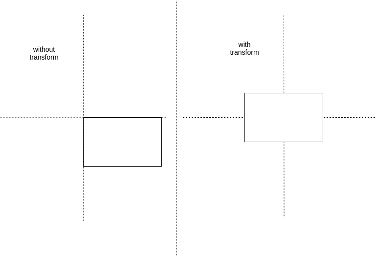

# Table of Contents

- [Table of Contents](#table-of-contents)
- [Centering in CSS](#centering-in-css)

# Centering in CSS

- Need BOTH `position: absolute; top: 50%; left: 50%` and `transform: translate(-50%, -50%);`
- https://medium.com/front-end-weekly/absolute-centering-in-css-ea3a9d0ad72e

```css
.parent {
  position: relative;
}
.child {
  position: absolute;
  top: 50%;
  left: 50%;
  transform: translate(-50%, -50%);
}
```


