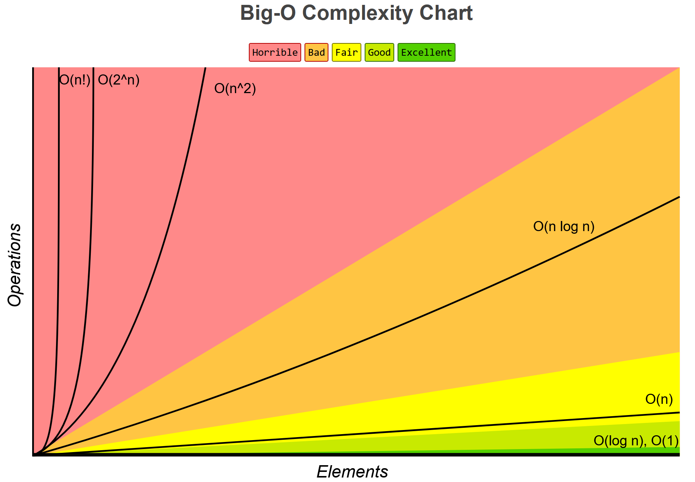
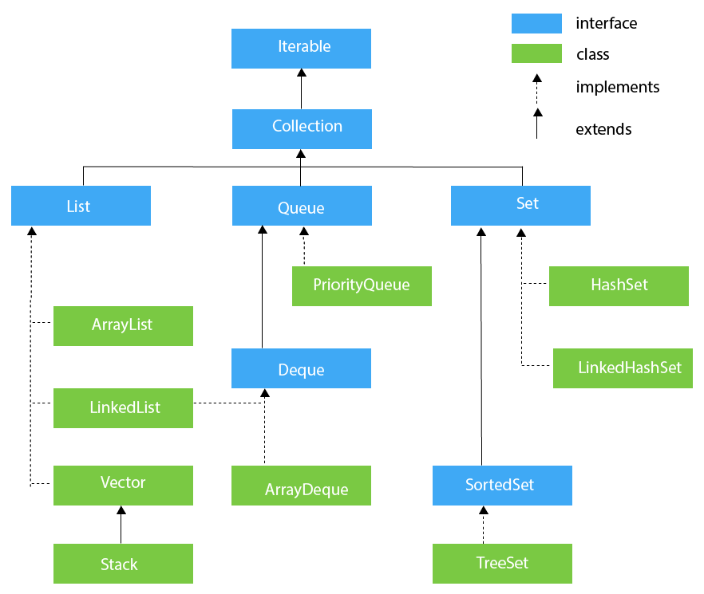
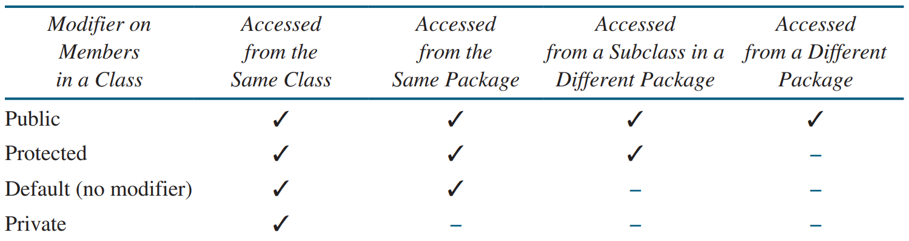

# Table of Contents

- [Table of Contents](#table-of-contents)
- [Resources](#resources)
  - [Official Documentation (Docs)](#official-documentation-docs)
  - [Tutorials](#tutorials)
- [Online IDE Playground Boilerplate Code](#online-ide-playground-boilerplate-code)
- [Compile Java File](#compile-java-file)
- [Run Java Program (Compiled File)](#run-java-program-compiled-file)
- [Big O Cheatsheet](#big-o-cheatsheet)
- [Sorting Algorithm Complexities](#sorting-algorithm-complexities)
- [Collections Complexities](#collections-complexities)
  - [List](#list)
  - [Map](#map)
  - [Queue](#queue)
  - [Set](#set)
- [Java Frameworks](#java-frameworks)
- [Java Reserved Keywords](#java-reserved-keywords)
- [Java Default Values](#java-default-values)
- [Java Primitive Types \& Values](#java-primitive-types--values)
  - [Java Primitive Data Type to Wrapper Class Conversion](#java-primitive-data-type-to-wrapper-class-conversion)
- [`Character` Class Methods](#character-class-methods)
  - [Methods](#methods)
- [`Integer` Class](#integer-class)
  - [Fields](#fields)
  - [Methods](#methods-1)
- [`Math` Class](#math-class)
  - [Fields](#fields-1)
  - [Methods](#methods-2)
- [`String` Class](#string-class)
  - [Constructor](#constructor)
  - [Methods](#methods-3)
  - [Double Quotes `""` vs Single Quotes `''`](#double-quotes--vs-single-quotes-)
  - [Array of Strings (`String[]`) Initialisation](#array-of-strings-string-initialisation)
  - [String Comparison](#string-comparison)
  - [String Regex](#string-regex)
    - [Count Number Of Matches For A Regex](#count-number-of-matches-for-a-regex)
  - [String Manipulation](#string-manipulation)
  - [Sorting Strings](#sorting-strings)
- [`StringBuilder` Class](#stringbuilder-class)
  - [Constructor](#constructor-1)
  - [Methods](#methods-4)
- [`Arrays` Class](#arrays-class)
  - [Methods](#methods-5)
  - [Array Size + Default Values](#array-size--default-values)
  - [Array Initialisation](#array-initialisation)
  - [Array Initialiser](#array-initialiser)
  - [Copying Arrays](#copying-arrays)
    - [`.arraycopy()`](#arraycopy)
    - [`.copyOf()`, `.copyOfRange()`](#copyof-copyofrange)
    - [`.clone()`](#clone)
- [`Collection` (Interface)](#collection-interface)
- [`Collections` (Class)](#collections-class)
  - [`List` (Interface)](#list-interface)
    - [List Initialisation](#list-initialisation)
      - [`.add()`](#add)
      - [`Arrays.asList()`](#arraysaslist)
      - [`List.of()`](#listof)
      - [Copy Constructor](#copy-constructor)
      - [2D List Initialisation](#2d-list-initialisation)
    - [Copying Lists](#copying-lists)
      - [Copy Constructor](#copy-constructor-1)
      - [`.addAll()`](#addall)
      - [`Collections.copy()`](#collectionscopy)
      - [`List.copyOf()`](#listcopyof)
    - [`ArrayList` (Class)](#arraylist-class)
      - [Constructor](#constructor-2)
      - [Methods](#methods-6)
    - [`LinkedList` (Class)](#linkedlist-class)
      - [Constructor](#constructor-3)
      - [Methods](#methods-7)
    - [`Vector` (Class)](#vector-class)
      - [Constructor](#constructor-4)
      - [Methods](#methods-8)
      - [`Stack` (Class)](#stack-class)
        - [Constructor](#constructor-5)
        - [Methods](#methods-9)
  - [`Queue` (Interface)](#queue-interface)
    - [Methods](#methods-10)
    - [`PriorityQueue` (Class)](#priorityqueue-class)
      - [Constructor](#constructor-6)
      - [Methods](#methods-11)
    - [`Deque` (Interface)](#deque-interface)
      - [First Element (Head)](#first-element-head)
      - [Last Element (Tail)](#last-element-tail)
      - [Queue vs Deque Methods](#queue-vs-deque-methods)
      - [Stack vs Deque methods](#stack-vs-deque-methods)
      - [Methods](#methods-12)
      - [`ArrayDeque` (Class)](#arraydeque-class)
        - [Constructor](#constructor-7)
        - [Methods](#methods-13)
  - [`Set` (Interface)](#set-interface)
    - [Methods](#methods-14)
    - [`HashSet` (Class)](#hashset-class)
      - [Constructor](#constructor-8)
      - [Methods](#methods-15)
      - [`LinkedHashSet` (Class)](#linkedhashset-class)
        - [Constructor](#constructor-9)
        - [Methods](#methods-16)
    - [`SortedSet` (Interface)](#sortedset-interface)
      - [Methods](#methods-17)
      - [`TreeSet` (Class)](#treeset-class)
        - [Constructor](#constructor-10)
        - [Methods](#methods-18)
- [`Map` (Interface)](#map-interface)
  - [Methods](#methods-19)
  - [`HashMap` (Class)](#hashmap-class)
    - [Constructor](#constructor-11)
    - [Methods](#methods-20)
      - [Initialise HashMap](#initialise-hashmap)
      - [Get Value of HashMap](#get-value-of-hashmap)
    - [`LinkedHashMap` (Class)](#linkedhashmap-class)
      - [Constructor](#constructor-12)
      - [Methods](#methods-21)
  - [`SortedMap` (Interface)](#sortedmap-interface)
    - [Methods](#methods-22)
    - [`TreeMap` (Class)](#treemap-class)
      - [Constructor](#constructor-13)
      - [Methods](#methods-23)
  - [`Map.Entry` (Interface)](#mapentry-interface)
    - [Methods](#methods-24)
  - [`AbstractMap` (Class)](#abstractmap-class)
    - [Constructor](#constructor-14)
    - [Methods](#methods-25)
- [`Comparable` (Interface)](#comparable-interface)
  - [Methods](#methods-26)
- [`Comparator` (Interface)](#comparator-interface)
  - [Methods](#methods-27)
- [Generics](#generics)
  - [Wildcards (`*`)](#wildcards-)
    - [Upper Bounded Wildcards](#upper-bounded-wildcards)
    - [Lower Bounded Wildcards](#lower-bounded-wildcards)
    - [Unbounded Wildcards](#unbounded-wildcards)
- [`Iterator` (Interface)](#iterator-interface)
  - [Methods](#methods-28)
- [Method Reference `::` Operator](#method-reference--operator)
  - [Static Method References](#static-method-references)
  - [Instance Method References of a Specific/Particular Object](#instance-method-references-of-a-specificparticular-object)
  - [Instance Method References of an Arbitrary Object of a Specific/Particular Type](#instance-method-references-of-an-arbitrary-object-of-a-specificparticular-type)
  - [Constructor References](#constructor-references)
- [`Record` Class](#record-class)
- [`Stream` Package](#stream-package)
  - [Map-Reduce Transformation](#map-reduce-transformation)
  - [Non-Interference](#non-interference)
  - [Reduction Operations](#reduction-operations)
  - [Mutable Reduction](#mutable-reduction)
  - [Stream Package Classes](#stream-package-classes)
  - [`Collectors` Class](#collectors-class)
    - [Methods](#methods-29)
  - [`IntStream` Interface](#intstream-interface)
    - [Methods](#methods-30)
    - [`OptionalInt` Class](#optionalint-class)
      - [Methods](#methods-31)
  - [`DoubleStream` Interface](#doublestream-interface)
    - [Methods](#methods-32)
    - [`OptionalDouble` Class](#optionaldouble-class)
      - [Methods](#methods-33)
  - [`LongStream` Interface](#longstream-interface)
    - [`OptionalLong` Class](#optionallong-class)
  - [`Stream<T>` Interface](#streamt-interface)
    - [Methods](#methods-34)
    - [Examples](#examples)
- [`System` (Class)](#system-class)
  - [Nested Classes](#nested-classes)
  - [Fields](#fields-2)
  - [Methods](#methods-35)
- [Truthy/Falsy Values](#truthyfalsy-values)
- [Miscellaneous](#miscellaneous)
  - [Access Modifiers (Method Visibility)](#access-modifiers-method-visibility)
  - [Ascii Codes](#ascii-codes)
  - [Boolean](#boolean)
  - [`Calendar` Class](#calendar-class)
  - [Comparing Objects (Comparison)](#comparing-objects-comparison)
  - [Convert `char[]` to `String`](#convert-char-to-string)
  - [Convert `String` to `char[]`](#convert-string-to-char)
  - [Convert `String` to `int`](#convert-string-to-int)
  - [Convert `int` to `String`](#convert-int-to-string)
  - [Convert `int[]` to `List<Integer>`](#convert-int-to-listinteger)
  - [Convert `int[][]` to `List<List<Integer>>`](#convert-int-to-listlistinteger)
  - [Convert `int[][]` to `List<int[]>`](#convert-int-to-listint)
  - [Convert `int[][]` to `List<List<Integer>>`](#convert-int-to-listlistinteger-1)
  - [Convert `List<Integer>` to `int[]`](#convert-listinteger-to-int)
  - [Convert `List<Integer>` to `Integer[]`](#convert-listinteger-to-integer)
  - [Count the Number of Bits Set to 1](#count-the-number-of-bits-set-to-1)
  - [Date Class (Deprecated)](#date-class-deprecated)
  - [Default Type Initialisation](#default-type-initialisation)
  - [Diamond Operator `<>`](#diamond-operator-)
    - [Interesting case where we OMIT diamond operator](#interesting-case-where-we-omit-diamond-operator)
  - [For-Each Loop](#for-each-loop)
  - [Function Return Values](#function-return-values)
  - [Graph](#graph)
    - [Unweighted + Undirected](#unweighted--undirected)
    - [Weighted + Undirected](#weighted--undirected)
  - [HashMap](#hashmap)
  - [Wildcard Imports](#wildcard-imports)
  - [Initialisation](#initialisation)
    - [`int[]`](#int)
    - [`int[][]`](#int-1)
    - [`List<Integer>`](#listinteger)
    - [`List<List<Integer>>`](#listlistinteger)
    - [`List<Integer>[]`](#listinteger-1)
  - [`int` vs `Integer`](#int-vs-integer)
  - [`List<Integer>` vs `Set<Integer>`](#listinteger-vs-setinteger)
  - [Literals in Java](#literals-in-java)
  - [`long` Type](#long-type)
  - [Numeric Data Types](#numeric-data-types)
  - [`Pair<T, T>` + `Tuple<T, T, T>` Custom Implementation](#pairt-t--tuplet-t-t-custom-implementation)
    - [Workaround 1](#workaround-1)
    - [Workaround 2](#workaround-2)
    - [Workaround 3](#workaround-3)
    - [Workaround 4](#workaround-4)
    - [Workaround 5](#workaround-5)
    - [Custom Implementation](#custom-implementation)
  - [Pre/Post-Increment/Decrement (`++i` and `i++`)](#prepost-incrementdecrement-i-and-i)
    - [Pre-Increment (`++i`)](#pre-increment-i)
    - [Post-Increment (`i++`)](#post-increment-i)
    - [Pre-Decrement (`--i`)](#pre-decrement---i)
    - [Post-Decrement (`i--`)](#post-decrement-i--)
  - [Printing](#printing)
  - [Random Class](#random-class)
    - [Constructor](#constructor-15)
    - [Methods](#methods-36)
  - [Sorting Using Lambda Expression (Custom Comparator)](#sorting-using-lambda-expression-custom-comparator)
    - [Return Type](#return-type)
    - [PriorityQueue](#priorityqueue)
    - [Examples](#examples-1)
    - [Sort `int[]` Array in Descending Order](#sort-int-array-in-descending-order)
  - [Streams for Competitive Coding](#streams-for-competitive-coding)
  - [Ternary Operators `(boolExp ? trueClause : falseClause)`](#ternary-operators-boolexp--trueclause--falseclause)
  - [`var` keyword](#var-keyword)
  - [visited hack](#visited-hack)
- [Zipping Collections (`.zip()`)](#zipping-collections-zip)

# Resources

## Official Documentation (Docs)

- [Java 8](https://docs.oracle.com/javase/8/docs/api/)
- [Java 11](https://docs.oracle.com/en/java/javase/11/docs/api/index.html)
- [Java 17](https://docs.oracle.com/en/java/javase/17/docs/api/index.html)
- [Java 21](https://docs.oracle.com/en/java/javase/21/docs/api/index.html)

## Tutorials

- [Java Tutorial](https://docs.oracle.com/javase/tutorial/)
  - [Getting Started](https://docs.oracle.com/javase/tutorial/getStarted/index.html)
  - [Learning the Java Language](https://docs.oracle.com/javase/tutorial/java/index.html)
  - [Essential Java Classes](https://docs.oracle.com/javase/tutorial/essential/index.html)
  - [Collections](https://docs.oracle.com/javase/tutorial/collections/index.html)
  - [Date-Time APIs](https://docs.oracle.com/javase/tutorial/datetime/index.html)
  - [Deployment](https://docs.oracle.com/javase/tutorial/deployment/index.html)
  - [Preparation for Java Programming Language Certification](https://docs.oracle.com/javase/tutorial/extra/certification/index.html)

# Online IDE Playground Boilerplate Code

[JDoodle Online IDE](https://www.jdoodle.com/online-java-compiler/)

```java
import java.util.*;
import java.util.regex.*;
import java.util.stream.*;

// import java.io.*;
// import java.math.*;
// import java.security.*;
// import java.text.*;
// import java.util.*;
// import java.util.concurrent.*;
// import java.util.function.*;
// import java.util.regex.*;
// import java.util.stream.*;
// import static java.util.stream.Collectors.joining;
// import static java.util.stream.Collectors.toList;

public class MyClass {
  public static void main(String args[]) {
    System.out.println("Hello World");
  }
}
```

# Compile Java File

```sh
javac File.java
```

# Run Java Program (Compiled File)

```sh
java File
```

# Big O Cheatsheet

- [Read more](https://www.bigocheatsheet.com/)



# Sorting Algorithm Complexities

| Algorithm      | Best       | Average      | Worst        | Space Complexity |
| -------------- | ---------- | ------------ | ------------ | ---------------- |
| Bubble Sort    | O(N)       | O(N^2)       | O(N^2)       | O(1)             |
| Bucket Sort    | O(N+K)     | O(N+K)       | O(N^2)       | O(N)             |
| Counting Sort  | O(N+K)     | O(N+K)       | O(N+K)       | O(K)             |
| Cubesort       | O(N)       | O(N log N)   | O(N log N)   | O(N)             |
| Heapsort       | O(N log N) | O(N log N)   | O(N log N)   | O(1)             |
| Insertion Sort | O(N)       | O(N^2)       | O(N^2)       | O(1)             |
| Merge Sort     | O(N log N) | O(N log N)   | O(N log N)   | O(N)             |
| Quicksort      | O(N log N) | O(N log N)   | O(N^2)       | O(log N)         |
| Radix Sort     | O(NK)      | O(NK)        | O(NK)        | O(N+K)           |
| Selection Sort | O(N^2)     | O(N^2)       | O(N^2)       | O(1)             |
| Shell Sort     | O(N log N) | O(N log^2 N) | O(N log^2 N) | O(1)             |
| Timsort        | O(N)       | O(N log N)   | O(N log N)   | O(N)             |
| Tree Sort      | O(N log N) | O(N log N)   | O(N^2)       | O(N)             |

# Collections Complexities

## List

| List                 | Add  | Remove | Get  | Contains | Next | Data Structure |
| -------------------- | ---- | ------ | ---- | -------- | ---- | -------------- |
| ArrayList            | O(1) | O(N)   | O(1) | O(N)     | O(1) | Array          |
| LinkedList           | O(1) | O(1)   | O(N) | O(N)     | O(1) | Linked List    |
| CopyOnWriteArrayList | O(N) | O(N)   | O(1) | O(N)     | O(1) | Array          |

## Map

| Map                   | Get      | ContainsKey | Remove | Next     | Data Structure           |
| --------------------- | -------- | ----------- | ------ | -------- | ------------------------ |
| HashMap               | O(1)     | O(1)        | O(N)   | O(H/N)   | Hash Table               |
| TreeMap               | O(log N) | O(log N)    | O(N)   | O(log N) | Red-black tree           |
| ConcurrentHashMap     | O(1)     | O(1)        | O(N)   | O(H/N)   | Hash Tables              |
| ConcurrentSkipListMap | O(log N) | O(log N)    | O(N)   | O(1)     | Skip List                |
| EnumMap               | O(1)     | O(1)        | O(N)   | O(1)     | Array                    |
| IdentityHashMap       | O(1)     | O(1)        | O(N)   | O(H/N)   | Array                    |
| LinkedHashMap         | O(1)     | O(1)        | O(N)   | O(1)     | Hash Table + Linked List |
| WeakHashMap           | O(1)     | O(1)        | O(N)   | O(H/N)   | Hash Table               |

## Queue

| Queue                 | Offer    | Peek | Poll     | Remove | Size | Data Structure |
| --------------------- | -------- | ---- | -------- | ------ | ---- | -------------- |
| ArrayDequeue          | O(1)     | O(1) | O(1)     | O(N)   | O(1) | Linked List    |
| LinkedList            | O(1)     | O(1) | O(1)     | O(1)   | O(1) | Array          |
| PriorityQueue         | O(log N) | O(1) | O(log N) | O(N)   | O(1) | Binary Heap    |
| ArrayBlockingQueue    | O(1)     | O(1) | O(1)     | O(N)   | O(1) | Array          |
| ConcurrentLinkedQueue | O(1)     | O(1) | O(1)     | O(N)   | O(N) | Linked List    |
| DelayQueue            | O(log N) | O(1) | O(log N) | O(N)   | O(1) | Binary Heap    |
| LinkedBlockingQueue   | O(1)     | O(1) | O(1)     | O(N)   | O(1) | Linked List    |
| PriorityBlockingQueue | O(log N) | O(1) | O(log N) | O(N)   | O(1) | Binary Heap    |
| SynchronousQueue      | O(1)     | O(1) | O(1)     | O(N)   | O(1) | None!          |

## Set

| Set                   | Add      | Remove   | Contains | Next     | Size | Data Structure           |
| --------------------- | -------- | -------- | -------- | -------- | ---- | ------------------------ |
| EnumSet               | O(1)     | O(1)     | O(1)     | O(1)     | O(1) | Bit Vector               |
| HashSet               | O(1)     | O(1)     | O(1)     | O(H/N)   | O(1) | Hash Table               |
| LinkedHashSet         | O(1)     | O(1)     | O(1)     | O(1)     | O(1) | Hash Table + Linked List |
| TreeSet               | O(log N) | O(log N) | O(log N) | O(log N) | O(1) | Red-black tree           |
| ConcurrentSkipListSet | O(log N) | O(log N) | O(log N) | O(1)     | O(N) | Skip List                |
| CopyOnWriteArraySet   | O(N)     | O(N)     | O(N)     | O(1)     | O(1) | Array                    |

# Java Frameworks

```java
// ----
// List
// ----
List<Integer> list = new ArrayList<>();

// -----
// Queue
// -----
// JavaDocs recommends to use "ArrayDeque" class and NOT "LinkedList" class for a Queue implementation
// JavaDocs ArrayDeque: "This class is likely to be faster than Stack when used as a Stack, and faster than LinkedList when used as a Queue"
Queue<Integer> q = new ArrayDeque<>();

// --------------------
// PriorityQueue (Heap)
// --------------------
PriorityQueue<Integer> pq = new PriorityQueue<>();

// --------------------------
// Deque (Double Ended Queue)
// --------------------------
Deque<Integer> dq = new ArrayDeque<>();

// -----
// Stack
// -----
// JavaDocs recommends to use "ArrayDeque" class and NOT "Stack" class for a Stack implementation
// JavaDocs ArrayDeque: "This class is likely to be faster than Stack when used as a Stack, and faster than LinkedList when used as a Queue"
Deque<Integer> stack = new ArrayDeque<>();

// ---
// Set
// ---
Set<Integer> set = new HashSet<>();

// ----------
// Sorted Set
// ----------
Set<Integer> treeSet = new TreeSet<>();
SortedSet<Integer> treeSet = new TreeSet<>();

// ---
// Map
// ---
Map<Integer, List<Integer>> map = new HashMap<>();

// ----------
// Sorted Map
// ----------
Map<Integer, List<Integer>> treeMap = new TreeMap<>();
SortedMap<Integer, List<Integer>> treeMap = new TreeMap<>();
```




# Java Reserved Keywords

- Java has a set of keywords that are reserved words that cannot be used as variables, methods, classes, or any other identifiers:

| Keyword        | Definition                                                                                                                                                                                                                                                                                                    |
| -------------- | ------------------------------------------------------------------------------------------------------------------------------------------------------------------------------------------------------------------------------------------------------------------------------------------------------------- |
| `abstract`     | A non-access modifier. Used for classes and methods: An abstract class cannot be used to create objects (to access it, it must be inherited from another class). An abstract method can only be used in an abstract class, and it does not have a body. The body is provided by the subclass (inherited from) |
| `assert`       | For debugging                                                                                                                                                                                                                                                                                                 |
| `boolean`      | A data type that can only store true and false values                                                                                                                                                                                                                                                         |
| `break`        | Breaks out of a loop or a switch block                                                                                                                                                                                                                                                                        |
| `byte`         | A data type that can store whole numbers from -128 and 127                                                                                                                                                                                                                                                    |
| `case`         | Marks a block of code in switch statements                                                                                                                                                                                                                                                                    |
| `catch`        | Catches exceptions generated by try statements                                                                                                                                                                                                                                                                |
| `char`         | A data type that is used to store a single character                                                                                                                                                                                                                                                          |
| `class`        | Defines a class                                                                                                                                                                                                                                                                                               |
| `continue`     | Continues to the next iteration of a loop                                                                                                                                                                                                                                                                     |
| `const`        | Defines a constant. Not in use - use final instead                                                                                                                                                                                                                                                            |
| `default`      | Specifies the default block of code in a switch statement                                                                                                                                                                                                                                                     |
| `do`           | Used together with while to create a do-while loop                                                                                                                                                                                                                                                            |
| `double`       | A data type that can store whole numbers from 1.7e-308 to 1.7e+308                                                                                                                                                                                                                                            |
| `else`         | Used in conditional statements                                                                                                                                                                                                                                                                                |
| `enum`         | Declares an enumerated (unchangeable) type                                                                                                                                                                                                                                                                    |
| `exports`      | Exports a package with a module. New in Java 9                                                                                                                                                                                                                                                                |
| `extends`      | Extends a class (indicates that a class is inherited from another class)                                                                                                                                                                                                                                      |
| `final`        | A non-access modifier used for classes, attributes and methods, which makes them non-changeable (impossible to inherit or override)                                                                                                                                                                           |
| `finally`      | Used with exceptions, a block of code that will be executed no matter if there is an exception or not                                                                                                                                                                                                         |
| `float`        | A data type that can store whole numbers from 3.4e-038 to 3.4e+038                                                                                                                                                                                                                                            |
| `for`          | Create a for loop                                                                                                                                                                                                                                                                                             |
| `goto`         | Not in use, and has no function                                                                                                                                                                                                                                                                               |
| `if`           | Makes a conditional statement                                                                                                                                                                                                                                                                                 |
| `implements`   | Implements an interface                                                                                                                                                                                                                                                                                       |
| `import`       | Used to import a package, class or interface                                                                                                                                                                                                                                                                  |
| `instanceof`   | Checks whether an object is an instance of a specific class or an interface                                                                                                                                                                                                                                   |
| `int`          | A data type that can store whole numbers from -2147483648 to 2147483647                                                                                                                                                                                                                                       |
| `interface`    | Used to declare a special type of class that only contains abstract methods                                                                                                                                                                                                                                   |
| `long`         | A data type that can store whole numbers from -9223372036854775808 to 9223372036854775808                                                                                                                                                                                                                     |
| `module`       | Declares a module. New in Java 9                                                                                                                                                                                                                                                                              |
| `native`       | Specifies that a method is not implemented in the same Java source file (but in another language)                                                                                                                                                                                                             |
| `new`          | Creates new objects                                                                                                                                                                                                                                                                                           |
| `package`      | Declares a package                                                                                                                                                                                                                                                                                            |
| `private`      | An access modifier used for attributes, methods and constructors, making them only accessible within the declared class                                                                                                                                                                                       |
| `protected`    | An access modifier used for attributes, methods and constructors, making them accessible in the same package and subclasses                                                                                                                                                                                   |
| `public`       | An access modifier used for classes, attributes, methods and constructors, making them accessible by any other class                                                                                                                                                                                          |
| `requires`     | Specifies required libraries inside a module. New in Java 9                                                                                                                                                                                                                                                   |
| `return`       | Finished the execution of a method, and can be used to return a value from a method                                                                                                                                                                                                                           |
| `short`        | A data type that can store whole numbers from -32768 to 32767                                                                                                                                                                                                                                                 |
| `static`       | A non-access modifier used for methods and attributes. Static methods/attributes can be accessed without creating an object of a class                                                                                                                                                                        |
| `strictfp`     | Restrict the precision and rounding of floating point calculations                                                                                                                                                                                                                                            |
| `super`        | Refers to superclass (parent) objects                                                                                                                                                                                                                                                                         |
| `switch`       | Selects one of many code blocks to be executed                                                                                                                                                                                                                                                                |
| `synchronized` | A non-access modifier, which specifies that methods can only be accessed by one thread at a time                                                                                                                                                                                                              |
| `this`         | Refers to the current object in a method or constructor                                                                                                                                                                                                                                                       |
| `throw`        | Creates a custom error                                                                                                                                                                                                                                                                                        |
| `throws`       | Indicates what exceptions may be thrown by a method                                                                                                                                                                                                                                                           |
| `transient`    | A non-accesss modifier, which specifies that an attribute is not part of an object's persistent state                                                                                                                                                                                                         |
| `try`          | Creates a try...catch statement                                                                                                                                                                                                                                                                               |
| `var`          | Declares a variable. New in Java 10                                                                                                                                                                                                                                                                           |
| `void`         | Specifies that a method should not have a return value                                                                                                                                                                                                                                                        |
| `volatile`     | Indicates that an attribute is not cached thread-locally, and is always read from the "main memory"                                                                                                                                                                                                           |
| `while`        | Creates a while loop                                                                                                                                                                                                                                                                                          |
| `true`         | Literals cannot be used as identifiers                                                                                                                                                                                                                                                                        |
| `false`        | Literals cannot be used as identifiers                                                                                                                                                                                                                                                                        |
| `null`         | Literals cannot be used as identifiers                                                                                                                                                                                                                                                                        |

# Java Default Values

| Data Type            | Default Value |
| -------------------- | ------------- |
| `byte`               | `0`           |
| `short`              | `0`           |
| `int`                | `0`           |
| `long`               | `0L`          |
| `float`              | `0.0f`        |
| `double`             | `0.0d`        |
| `char`               | `'\u0000'`    |
| `String`, any Object | `null`        |
| `boolean`            | `false`       |

# Java Primitive Types & Values

Primitive values do not share state with other primitive values.

The numeric types are the integral types and the floating-point types.

The integral types are:

- `byte` = 8-bit
- `short` = 16-bit
- `int` = 32-bit
- `long` = 64-bit signed two's-complement integers
- `char` = 16-bit unsigned integers representing UTF-16 code unit

The floating-point types are

- `float` = 32-bit IEEE 754 binary32 floating-point numbers
- `double` = 64-bit IEEE 754 binary64 floating-point numbers

The `boolean` type has exactly two values:

- `true`
- `false`

Ranges:

- `byte` range = `[-128, 127]`,
- `short` range = `[-32768, 32767]`,
- `int` range = `[-2147483648, 2147483647]`,
- `long` range = `[-9223372036854775808, 9223372036854775807]`,
- `char` range = `['\u0000', '\uffff']` i.e. `[0, 65535]`

- [Read more](https://docs.oracle.com/javase/specs/jls/se17/html/jls-4.html#jls-4.2)

## Java Primitive Data Type to Wrapper Class Conversion

| Primitive Data Type | Corresponding Wrapper Class |
| ------------------- | --------------------------- |
| `boolean`           | `Boolean`                   |
| `byte`              | `Byte`                      |
| `char`              | `Character`                 |
| `double`            | `Double`                    |
| `float`             | `Float`                     |
| `int`               | `Integer`                   |
| `long`              | `Long`                      |
| `short`             | `Short`                     |

# `Character` Class Methods

- [Read more](https://docs.oracle.com/en/java/javase/17/docs/api/java.base/java/lang/Character.html)

## Methods

- **Condensed**

| Return Type      | `Character` Method                   | Description                                                    |
| ---------------- | ------------------------------------ | -------------------------------------------------------------- |
| `static boolean` | `Character.isDigit(char ch)`         | Returns true if the specified character is a digit             |
| `static boolean` | `Character.isLetter(char ch)`        | Returns true if the specified character is a letter            |
| `static boolean` | `Character.isLetterOrDigit(char ch)` | Returns true if the specified character is a letter or digit   |
| `static boolean` | `Character.isLowerCase(char ch)`     | Returns true if the specified character is a lowercase letter  |
| `static boolean` | `Character.isUpperCase(char ch)`     | Returns true if the specified character is an uppercase letter |
| `static char`    | `Character.toLowerCase(char ch)`     | Returns the lowercase of the specified character               |
| `static char`    | `Character.toUpperCase(char ch)`     | Returns the uppercase of the specified character               |

- **Full**

| Return Type                                | `Character` Method                                                                             | Description                                                                                                                                                                     |
| ------------------------------------------ | ---------------------------------------------------------------------------------------------- | ------------------------------------------------------------------------------------------------------------------------------------------------------------------------------- |
| `static int`                               | `Character.charCount(int codePoint)`                                                           | Determines the number of char values needed to represent the specified character (Unicode code point)                                                                           |
| `char`                                     | `.charValue()`                                                                                 | Returns the value of this Character object                                                                                                                                      |
| `static int`                               | `Character.codePointAt(char[] a, int index)`                                                   | Returns the code point at the given index of the char array                                                                                                                     |
| `static int`                               | `Character.codePointAt(char[] a, int index, int limit)`                                        | Returns the code point at the given index of the char array, where only array elements with index `<` limit can be used                                                         |
| `static int`                               | `Character.codePointAt(CharSequence seq, int index)`                                           | Returns the code point at the given index of the CharSequence                                                                                                                   |
| `static int`                               | `Character.codePointBefore(char[] a, int index)`                                               | Returns the code point preceding the given index of the char array                                                                                                              |
| `static int`                               | `Character.codePointBefore(char[] a, int index, int start)`                                    | Returns the code point preceding the given index of the char array, where only array elements with index `>=` start can be used                                                 |
| `static int`                               | `Character.codePointBefore(CharSequence seq, int index)`                                       | Returns the code point preceding the given index of the CharSequence                                                                                                            |
| `static int`                               | `Character.codePointCount(char[] a, int offset, int count)`                                    | Returns the number of Unicode code points in a subarray of the char array argument                                                                                              |
| `static int`                               | `Character.codePointCount(CharSequence seq, int beginIndex, int endIndex)`                     | Returns the number of Unicode code points in the text range of the specified char sequence                                                                                      |
| `static int`                               | `Character.codePointOf(String name)`                                                           | Returns the code point value of the Unicode character specified by the given Unicode character name                                                                             |
| `static int`                               | `Character.compare(char x, char y)`                                                            | Compares two char values numerically                                                                                                                                            |
| `int`                                      | `.compareTo(Character anotherCharacter)`                                                       | Compares two Character objects numerically                                                                                                                                      |
| `Optional<DynamicConstantDesc<Character>>` | `.describeConstable()`                                                                         | Returns an Optional containing the nominal descriptor for this instance                                                                                                         |
| `static int`                               | `Character.digit(char ch, int radix)`                                                          | Returns the numeric value of the character ch in the specified radix                                                                                                            |
| `static int`                               | `Character.digit(int codePoint, int radix)`                                                    | Returns the numeric value of the specified character (Unicode code point) in the specified radix                                                                                |
| `boolean`                                  | `.equals(Object obj)`                                                                          | Compares this object against the specified object                                                                                                                               |
| `static char`                              | `Character.forDigit(int digit, int radix)`                                                     | Determines the character representation for a specific digit in the specified radix                                                                                             |
| `static byte`                              | `Character.getDirectionality(char ch)`                                                         | Returns the Unicode directionality property for the given character                                                                                                             |
| `static byte`                              | `Character.getDirectionality(int codePoint)`                                                   | Returns the Unicode directionality property for the given character (Unicode code point)                                                                                        |
| `static String`                            | `Character.getName(int codePoint)`                                                             | Returns the Unicode name of the specified character codePoint, or `null` if the code point is unassigned                                                                        |
| `static int`                               | `Character.getNumericValue(char ch)`                                                           | Returns the int value that the specified Unicode character represents                                                                                                           |
| `static int`                               | `Character.getNumericValue(int codePoint)`                                                     | Returns the int value that the specified character (Unicode code point) represents                                                                                              |
| `static int`                               | `Character.getType(char ch)`                                                                   | Returns a value indicating a character's general category                                                                                                                       |
| `static int`                               | `Character.getType(int codePoint)`                                                             | Returns a value indicating a character's general category                                                                                                                       |
| `int`                                      | `.hashCode()`                                                                                  | Returns a hash code for this Character; equal to the result of invoking charValue()                                                                                             |
| `static int`                               | `Character.hashCode(char value)`                                                               | Returns a hash code for a char value; compatible with Character.hashCode()                                                                                                      |
| `static char`                              | `Character.highSurrogate(int codePoint)`                                                       | Returns the leading surrogate (a high surrogate code unit) of the surrogate pair representing the specified supplementary character (Unicode code point) in the UTF-16 encoding |
| `static boolean`                           | `Character.isAlphabetic(int codePoint)`                                                        | Determines if the specified character (Unicode code point) is alphabetic                                                                                                        |
| `static boolean`                           | `Character.isBmpCodePoint(int codePoint)`                                                      | Determines whether the specified character (Unicode code point) is in the Basic Multilingual Plane (BMP)                                                                        |
| `static boolean`                           | `Character.isDefined(char ch)`                                                                 | Determines if a character is defined in Unicode                                                                                                                                 |
| `static boolean`                           | `Character.isDefined(int codePoint)`                                                           | Determines if a character (Unicode code point) is defined in Unicode                                                                                                            |
| `static boolean`                           | `Character.isDigit(char ch)`                                                                   | Determines if the specified character is a digit                                                                                                                                |
| `static boolean`                           | `Character.isDigit(int codePoint)`                                                             | Determines if the specified character (Unicode code point) is a digit                                                                                                           |
| `static boolean`                           | `Character.isHighSurrogate(char ch)`                                                           | Determines if the given char value is a Unicode high-surrogate code unit (also known as leading-surrogate code unit)                                                            |
| `static boolean`                           | `Character.isIdentifierIgnorable(char ch)`                                                     | Determines if the specified character should be regarded as an ignorable character in a Java identifier or a Unicode identifier                                                 |
| `static boolean`                           | `Character.isIdentifierIgnorable(int codePoint)`                                               | Determines if the specified character (Unicode code point) should be regarded as an ignorable character in a Java identifier or a Unicode identifier                            |
| `static boolean`                           | `Character.isIdeographic(int codePoint)`                                                       | Determines if the specified character (Unicode code point) is a CJKV (Chinese, Japanese, Korean and Vietnamese) ideograph, as defined by the Unicode Standard                   |
| `static boolean`                           | `Character.isISOControl(char ch)`                                                              | Determines if the specified character is an ISO control character                                                                                                               |
| `static boolean`                           | `Character.isISOControl(int codePoint)`                                                        | Determines if the referenced character (Unicode code point) is an ISO control character                                                                                         |
| `static boolean`                           | `Character.isJavaIdentifierPart(char ch)`                                                      | Determines if the specified character may be part of a Java identifier as other than the first character                                                                        |
| `static boolean`                           | `Character.isJavaIdentifierPart(int codePoint)`                                                | Determines if the character (Unicode code point) may be part of a Java identifier as other than the first character                                                             |
| `static boolean`                           | `Character.isJavaIdentifierStart(char ch)`                                                     | Determines if the specified character is permissible as the first character in a Java identifier                                                                                |
| `static boolean`                           | `Character.isJavaIdentifierStart(int codePoint)`                                               | Determines if the character (Unicode code point) is permissible as the first character in a Java identifier                                                                     |
| `static boolean`                           | `Character.isJavaLetter(char ch)`                                                              | Deprecated. Replaced by isJavaIdentifierStart(char).                                                                                                                            |
| `static boolean`                           | `Character.isJavaLetterOrDigit(char ch)`                                                       | Deprecated. Replaced by isJavaIdentifierPart(char).                                                                                                                             |
| `static boolean`                           | `Character.isLetter(char ch)`                                                                  | Determines if the specified character is a letter                                                                                                                               |
| `static boolean`                           | `Character.isLetter(int codePoint)`                                                            | Determines if the specified character (Unicode code point) is a letter                                                                                                          |
| `static boolean`                           | `Character.isLetterOrDigit(char ch)`                                                           | Determines if the specified character is a letter or digit                                                                                                                      |
| `static boolean`                           | `Character.isLetterOrDigit(int codePoint)`                                                     | Determines if the specified character (Unicode code point) is a letter or digit                                                                                                 |
| `static boolean`                           | `Character.isLowerCase(char ch)`                                                               | Determines if the specified character is a lowercase character                                                                                                                  |
| `static boolean`                           | `Character.isLowerCase(int codePoint)`                                                         | Determines if the specified character (Unicode code point) is a lowercase character                                                                                             |
| `static boolean`                           | `Character.isLowSurrogate(char ch)`                                                            | Determines if the given char value is a Unicode low-surrogate code unit (also known as trailing-surrogate code unit)                                                            |
| `static boolean`                           | `Character.isMirrored(char ch)`                                                                | Determines whether the character is mirrored according to the Unicode specification                                                                                             |
| `static boolean`                           | `Character.isMirrored(int codePoint)`                                                          | Determines whether the specified character (Unicode code point) is mirrored according to the Unicode specification                                                              |
| `static boolean`                           | `Character.isSpace(char ch)`                                                                   | Deprecated. Replaced by isWhitespace(char).                                                                                                                                     |
| `static boolean`                           | `Character.isSpaceChar(char ch)`                                                               | Determines if the specified character is a Unicode space character                                                                                                              |
| `static boolean`                           | `Character.isSpaceChar(int codePoint)`                                                         | Determines if the specified character (Unicode code point) is a Unicode space character                                                                                         |
| `static boolean`                           | `Character.isSupplementaryCodePoint(int codePoint)`                                            | Determines whether the specified character (Unicode code point) is in the supplementary character range                                                                         |
| `static boolean`                           | `Character.isSurrogate(char ch)`                                                               | Determines if the given char value is a Unicode surrogate code unit                                                                                                             |
| `static boolean`                           | `Character.isSurrogatePair(char high, char low)`                                               | Determines whether the specified pair of char values is a valid Unicode surrogate pair                                                                                          |
| `static boolean`                           | `Character.isTitleCase(char ch)`                                                               | Determines if the specified character is a titlecase character                                                                                                                  |
| `static boolean`                           | `Character.isTitleCase(int codePoint)`                                                         | Determines if the specified character (Unicode code point) is a titlecase character                                                                                             |
| `static boolean`                           | `Character.isUnicodeIdentifierPart(char ch)`                                                   | Determines if the specified character may be part of a Unicode identifier as other than the first character                                                                     |
| `static boolean`                           | `Character.isUnicodeIdentifierPart(int codePoint)`                                             | Determines if the specified character (Unicode code point) may be part of a Unicode identifier as other than the first character                                                |
| `static boolean`                           | `Character.isUnicodeIdentifierStart(char ch)`                                                  | Determines if the specified character is permissible as the first character in a Unicode identifier                                                                             |
| `static boolean`                           | `Character.isUnicodeIdentifierStart(int codePoint)`                                            | Determines if the specified character (Unicode code point) is permissible as the first character in a Unicode identifier                                                        |
| `static boolean`                           | `Character.isUpperCase(char ch)`                                                               | Determines if the specified character is an uppercase character                                                                                                                 |
| `static boolean`                           | `Character.isUpperCase(int codePoint)`                                                         | Determines if the specified character (Unicode code point) is an uppercase character                                                                                            |
| `static boolean`                           | `Character.isValidCodePoint(int codePoint)`                                                    | Determines whether the specified code point is a valid Unicode code point value                                                                                                 |
| `static boolean`                           | `Character.isWhitespace(char ch)`                                                              | Determines if the specified character is white space according to Java                                                                                                          |
| `static boolean`                           | `Character.isWhitespace(int codePoint)`                                                        | Determines if the specified character (Unicode code point) is white space according to Java                                                                                     |
| `static char`                              | `Character.lowSurrogate(int codePoint)`                                                        | Returns the trailing surrogate (a low surrogate code unit) of the surrogate pair representing the specified supplementary character (Unicode code point) in the UTF-16 encoding |
| `static int`                               | `Character.offsetByCodePoints(char[] a, int start, int count, int index, int codePointOffset)` | Returns the index within the given char subarray that is offset from the given index by codePointOffset code points                                                             |
| `static int`                               | `Character.offsetByCodePoints(CharSequence seq, int index, int codePointOffset)`               | Returns the index within the given char sequence that is offset from the given index by codePointOffset code points                                                             |
| `static char`                              | `Character.reverseBytes(char ch)`                                                              | Returns the value obtained by reversing the order of the bytes in the specified char value                                                                                      |
| `static char[]`                            | `Character.toChars(int codePoint)`                                                             | Converts the specified character (Unicode code point) to its UTF-16 representation stored in a char array                                                                       |
| `static int`                               | `Character.toChars(int codePoint, char[] dst, int dstIndex)`                                   | Converts the specified character (Unicode code point) to its UTF-16 representation                                                                                              |
| `static int`                               | `Character.toCodePoint(char high, char low)`                                                   | Converts the specified surrogate pair to its supplementary code point value                                                                                                     |
| `static char`                              | `Character.toLowerCase(char ch)`                                                               | Converts the character argument to lowercase using case mapping information from the UnicodeData file                                                                           |
| `static int`                               | `Character.toLowerCase(int codePoint)`                                                         | Converts the character (Unicode code point) argument to lowercase using case mapping information from the UnicodeData file                                                      |
| `String`                                   | `.toString()`                                                                                  | Returns a String object representing this Character's value                                                                                                                     |
| `static String`                            | `Character.toString(char c)`                                                                   | Returns a String object representing the specified char                                                                                                                         |
| `static String`                            | `Character.toString(int codePoint)`                                                            | Returns a String object representing the specified character (Unicode code point)                                                                                               |
| `static char`                              | `Character.toTitleCase(char ch)`                                                               | Converts the character argument to titlecase using case mapping information from the UnicodeData file                                                                           |
| `static int`                               | `Character.toTitleCase(int codePoint)`                                                         | Converts the character (Unicode code point) argument to titlecase using case mapping information from the UnicodeData file                                                      |
| `static char`                              | `Character.toUpperCase(char ch)`                                                               | Converts the character argument to uppercase using case mapping information from the UnicodeData file                                                                           |
| `static int`                               | `Character.toUpperCase(int codePoint)`                                                         | Converts the character (Unicode code point) argument to uppercase using case mapping information from the UnicodeData file                                                      |
| `static Character`                         | `Character.valueOf(char c)`                                                                    | Returns a Character instance representing the specified char value                                                                                                              |

# `Integer` Class

- [Read more](https://docs.oracle.com/en/java/javase/17/docs/api/java.base/java/lang/Integer.html)

## Fields

| Return Type                   | `Integer` Field     | Definition                                                                         |
| ----------------------------- | ------------------- | ---------------------------------------------------------------------------------- |
| `static final int`            | `Integer.BYTES`     | The number of bytes used to represent an int value in two's complement binary form |
| `static final int`            | `Integer.MAX_VALUE` | A constant holding the maximum value an int can have, 231-1                        |
| `static final int`            | `Integer.MIN_VALUE` | A constant holding the minimum value an int can have, -231                         |
| `static final int`            | `Integer.SIZE`      | The number of bits used to represent an int value in two's complement binary form  |
| `static final Class<Integer>` | `Integer.TYPE`      | The Class instance representing the primitive type int                             |

## Methods

| Return Type      | `Integer` Method                                                                    | Description                                                                                                                                                                                                         |
| ---------------- | ----------------------------------------------------------------------------------- | ------------------------------------------------------------------------------------------------------------------------------------------------------------------------------------------------------------------- |
| `static int`     | `Integer.bitCount(int i)`                                                           | Returns the number of one-bits in the two's complement binary representation of the specified int value                                                                                                             |
| `byte`           | `.byteValue()`                                                                      | Returns the value of this Integer as a byte after a narrowing primitive conversion                                                                                                                                  |
| `static int`     | `Integer.compare(int x, int y)`                                                     | Compares two int values numerically, returns `< 0` if `x < y`, `0` if `x == y`, `> 0` if `x > y` (The value returned is identical to what would be returned by: `Integer.valueOf(x).compareTo(Integer.valueOf(y))`) |
| `int`            | `.compareTo(Integer anotherInteger)`                                                | Compares two Integer objects numerically                                                                                                                                                                            |
| `static int`     | `Integer.compareUnsigned(int x, int y)`                                             | Compares two int values numerically treating the values as unsigned                                                                                                                                                 |
| `static Integer` | `Integer.decode(String nm)`                                                         | Decodes a String into an Integer                                                                                                                                                                                    |
| `Optional`       | `.describeConstable()`                                                              | Returns an Optional containing the nominal descriptor for this instance, which is the instance itself                                                                                                               |
| `static int`     | `Integer.divideUnsigned(int dividend, int divisor)`                                 | Returns the unsigned quotient of dividing the first argument by the second where each argument and the result is interpreted as an unsigned value                                                                   |
| `double`         | `doubleValue()`                                                                     | Returns the value of this Integer as a double after a widening primitive conversion                                                                                                                                 |
| `boolean`        | `.equals(Object obj)`                                                               | Compares this object to the specified object                                                                                                                                                                        |
| `float`          | `.floatValue()`                                                                     | Returns the value of this Integer as a float after a widening primitive conversion                                                                                                                                  |
| `static Integer` | `Integer.getInteger(String nm)`                                                     | Determines the integer value of the system property with the specified name                                                                                                                                         |
| `static Integer` | `Integer.getInteger(String nm, int val)`                                            | Determines the integer value of the system property with the specified name                                                                                                                                         |
| `static Integer` | `Integer.getInteger(String nm, Integer val)`                                        | Returns the integer value of the system property with the specified name                                                                                                                                            |
| `int`            | `.hashCode()`                                                                       | Returns a hash code for this Integer                                                                                                                                                                                |
| `static int`     | `Integer.hashCode(int value)`                                                       | Returns a hash code for an int value; compatible with Integer.hashCode()                                                                                                                                            |
| `static int`     | `Integer.highestOneBit(int i)`                                                      | Returns an int value with at most a single one-bit, in the position of the highest-order (""leftmost"") one-bit in the specified int value                                                                          |
| `int`            | `.intValue()`                                                                       | Returns the value of this Integer as an int                                                                                                                                                                         |
| `long`           | `.longValue()`                                                                      | Returns the value of this Integer as a long after a widening primitive conversion                                                                                                                                   |
| `static int`     | `Integer.lowestOneBit(int i)`                                                       | Returns an int value with at most a single one-bit, in the position of the lowest-order (""rightmost"") one-bit in the specified int value                                                                          |
| `static int`     | `Integer.max(int a, int b)`                                                         | Returns the greater of two int values as if by calling Math.max                                                                                                                                                     |
| `static int`     | `Integer.min(int a, int b)`                                                         | Returns the smaller of two int values as if by calling Math.min                                                                                                                                                     |
| `static int`     | `Integer.numberOfLeadingZeros(int i)`                                               | Returns the number of zero bits preceding the highest-order (""leftmost"") one-bit in the two's complement binary representation of the specified int value                                                         |
| `static int`     | `Integer.numberOfTrailingZeros(int i)`                                              | Returns the number of zero bits following the lowest-order (""rightmost"") one-bit in the two's complement binary representation of the specified int value                                                         |
| `static int`     | `Integer.parseInt(CharSequence s, int beginIndex, int endIndex, int radix)`         | Parses the CharSequence argument as a signed int in the specified radix, beginning at the specified beginIndex and extending to endIndex - 1                                                                        |
| `static int`     | `Integer.parseInt(String s)`                                                        | Parses the string argument as a signed decimal integer                                                                                                                                                              |
| `static int`     | `Integer.parseInt(String s, int radix)`                                             | Parses the string argument as a signed integer in the radix specified by the second argument                                                                                                                        |
| `static int`     | `Integer.parseUnsignedInt(CharSequence s, int beginIndex, int endIndex, int radix)` | Parses the CharSequence argument as an unsigned int in the specified radix, beginning at the specified beginIndex and extending to endIndex - 1                                                                     |
| `static int`     | `Integer.parseUnsignedInt(String s)`                                                | Parses the string argument as an unsigned decimal integer                                                                                                                                                           |
| `static int`     | `Integer.parseUnsignedInt(String s, int radix)`                                     | Parses the string argument as an unsigned integer in the radix specified by the second argument                                                                                                                     |
| `static int`     | `Integer.remainderUnsigned(int dividend, int divisor)`                              | Returns the unsigned remainder from dividing the first argument by the second where each argument and the result is interpreted as an unsigned value                                                                |
| `Integer`        | `.resolveConstantDesc(MethodHandles.Lookup lookup)`                                 | Resolves this instance as a ConstantDesc, the result of which is the instance itself                                                                                                                                |
| `static int`     | `Integer.reverse(int i)`                                                            | Returns the value obtained by reversing the order of the bits in the two's complement binary representation of the specified int value                                                                              |
| `static int`     | `Integer.reverseBytes(int i)`                                                       | Returns the value obtained by reversing the order of the bytes in the two's complement representation of the specified int value                                                                                    |
| `static int`     | `Integer.rotateLeft(int i, int distance)`                                           | Returns the value obtained by rotating the two's complement binary representation of the specified int value left by the specified number of bits                                                                   |
| `static int`     | `Integer.rotateRight(int i, int distance)`                                          | Returns the value obtained by rotating the two's complement binary representation of the specified int value right by the specified number of bits                                                                  |
| `short`          | `.shortValue()`                                                                     | Returns the value of this Integer as a short after a narrowing primitive conversion                                                                                                                                 |
| `static int`     | `Integer.signum(int i)`                                                             | Returns the signum function of the specified int value                                                                                                                                                              |
| `static int`     | `Integer.sum(int a, int b)`                                                         | Adds two integers together as per the + operator                                                                                                                                                                    |
| `static String`  | `Integer.toBinaryString(int i)`                                                     | Returns a string representation of the integer argument as an unsigned integer in base 2                                                                                                                            |
| `static String`  | `Integer.toHexString(int i)`                                                        | Returns a string representation of the integer argument as an unsigned integer in base 16                                                                                                                           |
| `static String`  | `Integer.toOctalString(int i)`                                                      | Returns a string representation of the integer argument as an unsigned integer in base 8                                                                                                                            |
| `String`         | `.toString()`                                                                       | Returns a String object representing this Integer's value                                                                                                                                                           |
| `static String`  | `Integer.toString(int i)`                                                           | Returns a String object representing the specified integer                                                                                                                                                          |
| `static String`  | `Integer.toString(int i, int radix)`                                                | Returns a string representation of the first argument in the radix specified by the second argument                                                                                                                 |
| `static long`    | `Integer.toUnsignedLong(int x)`                                                     | Converts the argument to a long by an unsigned conversion                                                                                                                                                           |
| `static String`  | `Integer.toUnsignedString(int i)`                                                   | Returns a string representation of the argument as an unsigned decimal value                                                                                                                                        |
| `static String`  | `Integer.toUnsignedString(int i, int radix)`                                        | Returns a string representation of the first argument as an unsigned integer value in the radix specified by the second argument                                                                                    |
| `static Integer` | `Integer.valueOf(int i)`                                                            | Returns an Integer instance representing the specified int value                                                                                                                                                    |
| `static Integer` | `Integer.valueOf(String s)`                                                         | Returns an Integer object holding the value of the specified String                                                                                                                                                 |
| `static Integer` | `Integer.valueOf(String s, int radix)`                                              | Returns an Integer object holding the value extracted from the specified String when parsed with the radix given by the second argument                                                                             |

# `Math` Class

- [Read more](https://docs.oracle.com/en/java/javase/17/docs/api/java.base/java/lang/Math.html)

## Fields

| Return Type           | `Integer` Field | Definition                                                                                                       |
| --------------------- | --------------- | ---------------------------------------------------------------------------------------------------------------- |
| `static final double` | `Math.E`        | The double value that is closer than any other to e (Euler's number), the base of the natural logarithms         |
| `static final double` | `Math.PI`       | The double value that is closer than any other to pi, the ratio of the circumference of a circle to its diameter |

## Methods

| Return Type     | `Math` Method                                    | Description                                                                                                                                                                                     |
| --------------- | ------------------------------------------------ | ----------------------------------------------------------------------------------------------------------------------------------------------------------------------------------------------- |
| `static double` | `Math.abs(double a)`                             | Returns the absolute value of a double value                                                                                                                                                    |
| `static float`  | `Math.abs(float a)`                              | Returns the absolute value of a float value                                                                                                                                                     |
| `static int`    | `Math.abs(int a)`                                | Returns the absolute value of an int value                                                                                                                                                      |
| `static long`   | `Math.abs(long a)`                               | Returns the absolute value of a long value                                                                                                                                                      |
| `static int`    | `Math.absExact(int a)`                           | Returns the mathematical absolute value of an int value if it is exactly representable as an int, throwing ArithmeticException if the result overflows the positive int range                   |
| `static long`   | `Math.absExact(long a)`                          | Returns the mathematical absolute value of an long value if it is exactly representable as an long, throwing ArithmeticException if the result overflows the positive long range                |
| `static double` | `Math.acos(double a)`                            | Returns the arc cosine of a value; the returned angle is in the range 0.0 through pi                                                                                                            |
| `static int`    | `Math.addExact(int x, int y)`                    | Returns the sum of its arguments, throwing an exception if the result overflows an int                                                                                                          |
| `static long`   | `Math.addExact(long x, long y)`                  | Returns the sum of its arguments, throwing an exception if the result overflows a long                                                                                                          |
| `static double` | `Math.asin(double a)`                            | Returns the arc sine of a value; the returned angle is in the range -pi/2 through pi/2                                                                                                          |
| `static double` | `Math.atan(double a)`                            | Returns the arc tangent of a value; the returned angle is in the range -pi/2 through pi/2                                                                                                       |
| `static double` | `Math.atan2(double y, double x)`                 | Returns the angle theta from the conversion of rectangular coordinates (x, y) to polar coordinates (r, theta)                                                                                   |
| `static double` | `Math.cbrt(double a)`                            | Returns the cube root of a double value                                                                                                                                                         |
| `static double` | `Math.ceil(double a)`                            | Returns the smallest (closest to negative infinity) double value that is `>=` the argument and is equal to a mathematical integer                                                               |
| `static double` | `Math.copySign(double magnitude, double sign)`   | Returns the first floating-point argument with the sign of the second floating-point argument                                                                                                   |
| `static float`  | `Math.copySign(float magnitude, float sign)`     | Returns the first floating-point argument with the sign of the second floating-point argument                                                                                                   |
| `static double` | `Math.cos(double a)`                             | Returns the trigonometric cosine of an angle                                                                                                                                                    |
| `static double` | `Math.cosh(double x)`                            | Returns the hyperbolic cosine of a double value                                                                                                                                                 |
| `static int`    | `Math.decrementExact(int a)`                     | Returns the argument decremented by one, throwing an exception if the result overflows an int                                                                                                   |
| `static long`   | `Math.decrementExact(long a)`                    | Returns the argument decremented by one, throwing an exception if the result overflows a long                                                                                                   |
| `static double` | `Math.exp(double a)`                             | Returns Euler's number `e` raised to the power of a double value                                                                                                                                |
| `static double` | `Math.expm1(double x)`                           | Returns `e^(x) -1`                                                                                                                                                                              |
| `static double` | `Math.floor(double a)`                           | Returns the largest (closest to positive infinity) double value that is `<=` to the argument and is equal to a mathematical integer                                                             |
| `static int`    | `Math.floorDiv(int x, int y)`                    | Returns the largest (closest to positive infinity) int value that is `<=` to the algebraic quotient                                                                                             |
| `static long`   | `Math.floorDiv(long x, int y)`                   | Returns the largest (closest to positive infinity) long value that is `<=` to the algebraic quotient                                                                                            |
| `static long`   | `Math.floorDiv(long x, long y)`                  | Returns the largest (closest to positive infinity) long value that is `<=` to the algebraic quotient                                                                                            |
| `static int`    | `Math.floorMod(int x, int y)`                    | Returns the floor modulus of the int arguments                                                                                                                                                  |
| `static int`    | `Math.floorMod(long x, int y)`                   | Returns the floor modulus of the long and int arguments                                                                                                                                         |
| `static long`   | `Math.floorMod(long x, long y)`                  | Returns the floor modulus of the long arguments                                                                                                                                                 |
| `static double` | `Math.fma(double a, double b, double c)`         | Returns the fused multiply add of the three arguments; that is, returns the exact product of the first two arguments summed with the third argument and then rounded once to the nearest double |
| `static float`  | `Math.fma(float a, float b, float c)`            | Returns the fused multiply add of the three arguments; that is, returns the exact product of the first two arguments summed with the third argument and then rounded once to the nearest float  |
| `static int`    | `Math.getExponent(double d)`                     | Returns the unbiased exponent used in the representation of a double                                                                                                                            |
| `static int`    | `Math.getExponent(float f)`                      | Returns the unbiased exponent used in the representation of a float                                                                                                                             |
| `static double` | `Math.hypot(double x, double y)`                 | Returns sqrt(x^2 +y^2) without intermediate overflow or underflow                                                                                                                               |
| `static double` | `Math.IEEEremainder(double f1, double f2)`       | Computes the remainder operation on two arguments as prescribed by the IEEE 754 standard                                                                                                        |
| `static int`    | `Math.incrementExact(int a)`                     | Returns the argument incremented by one, throwing an exception if the result overflows an int                                                                                                   |
| `static long`   | `Math.incrementExact(long a)`                    | Returns the argument incremented by one, throwing an exception if the result overflows a long                                                                                                   |
| `static double` | `Math.log(double a)`                             | Returns the natural logarithm (base e) of a double value                                                                                                                                        |
| `static double` | `Math.log10(double a)`                           | Returns the base 10 logarithm of a double value                                                                                                                                                 |
| `static double` | `Math.log1p(double x)`                           | Returns the natural logarithm of the sum of the argument and 1                                                                                                                                  |
| `static double` | `Math.max(double a, double b)`                   | Returns the greater of two double values                                                                                                                                                        |
| `static float`  | `Math.max(float a, float b)`                     | Returns the greater of two float values                                                                                                                                                         |
| `static int`    | `Math.max(int a, int b)`                         | Returns the greater of two int values                                                                                                                                                           |
| `static long`   | `Math.max(long a, long b)`                       | Returns the greater of two long values                                                                                                                                                          |
| `static double` | `Math.min(double a, double b)`                   | Returns the smaller of two double values                                                                                                                                                        |
| `static float`  | `Math.min(float a, float b)`                     | Returns the smaller of two float values                                                                                                                                                         |
| `static int`    | `Math.min(int a, int b)`                         | Returns the smaller of two int values                                                                                                                                                           |
| `static long`   | `Math.min(long a, long b)`                       | Returns the smaller of two long values                                                                                                                                                          |
| `static int`    | `Math.multiplyExact(int x, int y)`               | Returns the product of the arguments, throwing an exception if the result overflows an int                                                                                                      |
| `static long`   | `Math.multiplyExact(long x, int y)`              | Returns the product of the arguments, throwing an exception if the result overflows a long                                                                                                      |
| `static long`   | `Math.multiplyExact(long x, long y)`             | Returns the product of the arguments, throwing an exception if the result overflows a long                                                                                                      |
| `static long`   | `Math.multiplyFull(int x, int y)`                | Returns the exact mathematical product of the arguments                                                                                                                                         |
| `static long`   | `Math.multiplyHigh(long x, long y)`              | Returns as a long the most significant 64 bits of the 128-bit product of two 64-bit factors                                                                                                     |
| `static int`    | `Math.negateExact(int a)`                        | Returns the negation of the argument, throwing an exception if the result overflows an int                                                                                                      |
| `static long`   | `Math.negateExact(long a)`                       | Returns the negation of the argument, throwing an exception if the result overflows a long                                                                                                      |
| `static double` | `Math.nextAfter(double start, double direction)` | Returns the floating-point number adjacent to the first argument in the direction of the second argument                                                                                        |
| `static float`  | `Math.nextAfter(float start, double direction)`  | Returns the floating-point number adjacent to the first argument in the direction of the second argument                                                                                        |
| `static double` | `Math.nextDown(double d)`                        | Returns the floating-point value adjacent to d in the direction of negative infinity                                                                                                            |
| `static float`  | `Math.nextDown(float f)`                         | Returns the floating-point value adjacent to f in the direction of negative infinity                                                                                                            |
| `static double` | `Math.nextUp(double d)`                          | Returns the floating-point value adjacent to d in the direction of positive infinity                                                                                                            |
| `static float`  | `Math.nextUp(float f)`                           | Returns the floating-point value adjacent to f in the direction of positive infinity                                                                                                            |
| `static double` | `Math.pow(double a, double b)`                   | Returns the value of the first argument raised to the power of the second argument                                                                                                              |
| `static double` | `Math.random()`                                  | Returns a double value with a positive sign, `>=` 0.0 and `<` 1.0                                                                                                                               |
| `static double` | `Math.rint(double a)`                            | Returns the double value that is closest in value to the argument and is equal to a mathematical integer                                                                                        |
| `static long`   | `Math.round(double a)`                           | Returns the closest long to the argument, with ties rounding to positive infinity                                                                                                               |
| `static int`    | `Math.round(float a)`                            | Returns the closest int to the argument, with ties rounding to positive infinity                                                                                                                |
| `static double` | `Math.scalb(double d, int scaleFactor)`          | Returns `d x 2^scaleFactor` rounded as if performed by a single correctly rounded floating-point multiply                                                                                       |
| `static float`  | `Math.scalb(float f, int scaleFactor)`           | Returns `f x 2^scaleFactor` rounded as if performed by a single correctly rounded floating-point multiply                                                                                       |
| `static double` | `Math.signum(double d)`                          | Returns the signum function of the argument; zero if the argument is zero, 1.0 if the argument is `>` zero, -1.0 if the argument is `<` zero                                                    |
| `static float`  | `Math.signum(float f)`                           | Returns the signum function of the argument; zero if the argument is zero, 1.0f if the argument is `>` zero, -1.0f if the argument is `<` zero                                                  |
| `static double` | `Math.sin(double a)`                             | Returns the trigonometric sine of an angle                                                                                                                                                      |
| `static double` | `Math.sinh(double x)`                            | Returns the hyperbolic sine of a double value                                                                                                                                                   |
| `static double` | `Math.sqrt(double a)`                            | Returns the correctly rounded positive square root of a double value                                                                                                                            |
| `static int`    | `Math.subtractExact(int x, int y)`               | Returns the difference of the arguments, throwing an exception if the result overflows an int                                                                                                   |
| `static long`   | `Math.subtractExact(long x, long y)`             | Returns the difference of the arguments, throwing an exception if the result overflows a long                                                                                                   |
| `static double` | `Math.tan(double a)`                             | Returns the trigonometric tangent of an angle                                                                                                                                                   |
| `static double` | `Math.tanh(double x)`                            | Returns the hyperbolic tangent of a double value                                                                                                                                                |
| `static double` | `Math.toDegrees(double angrad)`                  | Converts an angle measured in radians to an approximately equivalent angle measured in degrees                                                                                                  |
| `static int`    | `Math.toIntExact(long value)`                    | Returns the value of the long argument, throwing an exception if the value overflows an int                                                                                                     |
| `static double` | `Math.toRadians(double angdeg)`                  | Converts an angle measured in degrees to an approximately equivalent angle measured in radians                                                                                                  |
| `static double` | `Math.ulp(double d)`                             | Returns the size of an ulp of the argument                                                                                                                                                      |
| `static float`  | `Math.ulp(float f)`                              | Returns the size of an ulp of the argument                                                                                                                                                      |

# `String` Class

- CANNOT index into a string `s[i]`, you MUST use `s.charAt(i)`
- Compare strings with **`.equals()`** and NOT `==`
- A `String` object is **IMMUTABLE**

  - Its contents cannot be changed (i.e. cannot change character at specified index)
  - However we can reassign `String` variables
  - Note that `+=` is overloaded to concatenate two strings together, creating a new `String` object which is then reassigned back to original `String ` variable
    ```java
    String s = "Java";
    // Valid
    s += "C++";
    ```

- Examples

```java
"hello".toUpperCase();
String message = "Hello" + "World";
message.toLowerCase();
```

- [Read more](https://docs.oracle.com/en/java/javase/17/docs/api/java.base/java/lang/String.html)

## Constructor

| `String` Constructor                                               | Description                                                                                                                                                                                |
| ------------------------------------------------------------------ | ------------------------------------------------------------------------------------------------------------------------------------------------------------------------------------------ |
| `String()`                                                         | Initializes a newly created String object so that it represents an empty character sequence                                                                                                |
| `String(byte[] bytes)`                                             | Constructs a new String by decoding the specified array of bytes using the platform's default charset                                                                                      |
| `String(byte[] bytes, int offset, int length)`                     | Constructs a new String by decoding the specified subarray of bytes using the platform's default charset                                                                                   |
| `String(byte[] bytes, int offset, int length, String charsetName)` | Constructs a new String by decoding the specified subarray of bytes using the specified charset                                                                                            |
| `String(byte[] bytes, int offset, int length, Charset charset)`    | Constructs a new String by decoding the specified subarray of bytes using the specified charset                                                                                            |
| `String(byte[] bytes, String charsetName)`                         | Constructs a new String by decoding the specified array of bytes using the specified charset                                                                                               |
| `String(byte[] bytes, Charset charset)`                            | Constructs a new String by decoding the specified array of bytes using the specified charset                                                                                               |
| `String(char[] value)`                                             | Allocates a new String so that it represents the sequence of characters currently contained in the character array argument                                                                |
| `String(char[] value, int offset, int count)`                      | Allocates a new String that contains characters from a subarray of the character array argument                                                                                            |
| `String(int[] codePoints, int offset, int count)`                  | Allocates a new String that contains characters from a subarray of the Unicode code point array argument                                                                                   |
| `String(String original)`                                          | Initializes a newly created String object so that it represents the same sequence of characters as the argument; in other words, the newly created string is a copy of the argument string |
| `String(StringBuffer buffer)`                                      | Allocates a new string that contains the sequence of characters currently contained in the string buffer argument                                                                          |
| `String(StringBuilder builder)`                                    | Allocates a new string that contains the sequence of characters currently contained in the string builder argument                                                                         |

## Methods

| Return Type     | `String` Method                                                                       | Description                                                                                                                                                                                 |
| --------------- | ------------------------------------------------------------------------------------- | ------------------------------------------------------------------------------------------------------------------------------------------------------------------------------------------- |
| `char`          | `.charAt(int index)`                                                                  | Returns the char value at the specified index                                                                                                                                               |
| `IntStream`     | `.chars()`                                                                            | Returns a stream of int zero-extending the char values from this sequence                                                                                                                   |
| `int`           | `.codePointAt(int index)`                                                             | Returns the character (Unicode code point) at the specified index                                                                                                                           |
| `int`           | `.codePointBefore(int index)`                                                         | Returns the character (Unicode code point) before the specified index                                                                                                                       |
| `int`           | `.codePointCount(int beginIndex, int endIndex)`                                       | Returns the number of Unicode code points in the specified text range of this String                                                                                                        |
| `IntStream`     | `.codePoints()`                                                                       | Returns a stream of code point values from this sequence                                                                                                                                    |
| `int`           | `.compareTo(String anotherString)`                                                    | Compares two strings lexicographically                                                                                                                                                      |
| `int`           | `.compareToIgnoreCase(String str)`                                                    | Compares two strings lexicographically, ignoring case differences                                                                                                                           |
| `String`        | `.concat(String str)`                                                                 | Concatenates the specified string to the end of this string                                                                                                                                 |
| `boolean`       | `.contains(CharSequence s)`                                                           | Returns true if and only if this string contains the specified sequence of char values                                                                                                      |
| `boolean`       | `.contentEquals(CharSequence cs)`                                                     | Compares this string to the specified CharSequence                                                                                                                                          |
| `boolean`       | `.contentEquals(StringBuffer sb)`                                                     | Compares this string to the specified StringBuffer                                                                                                                                          |
| `static String` | `String.copyValueOf(char[] data)`                                                     | Equivalent to `valueOf(char[])`                                                                                                                                                             |
| `static String` | `String.copyValueOf(char[] data, int offset, int count)`                              | Equivalent to `valueOf(char[], int, int)`                                                                                                                                                   |
| `Optional`      | `.describeConstable()`                                                                | Returns an Optional containing the nominal descriptor for this instance, which is the instance itself                                                                                       |
| `boolean`       | `.endsWith(String suffix)`                                                            | Tests if this string ends with the specified suffix                                                                                                                                         |
| `boolean`       | `.equals(Object anObject)`                                                            | Compares this string to the specified object                                                                                                                                                |
| `boolean`       | `.equalsIgnoreCase(String anotherString)`                                             | Compares this String to another String, ignoring case considerations                                                                                                                        |
| `static String` | `String.format(String format, Object... args)`                                        | Returns a formatted string using the specified format string and arguments                                                                                                                  |
| `static String` | `String.format(Locale l, String format, Object... args)`                              | Returns a formatted string using the specified locale, format string, and arguments                                                                                                         |
| `String`        | `.formatted(Object... args)`                                                          | Formats using this string as the format string, and the supplied arguments                                                                                                                  |
| `byte[]`        | `.getBytes()`                                                                         | Encodes this String into a sequence of bytes using the platform's default charset, storing the result into a new byte array                                                                 |
| `void`          | `.getBytes(int srcBegin, int srcEnd, byte[] dst, int dstBegin)`                       | Deprecated. This method does not properly convert characters into bytes.                                                                                                                    |
| `byte[]`        | `.getBytes(String charsetName)`                                                       | Encodes this String into a sequence of bytes using the named charset, storing the result into a new byte array                                                                              |
| `byte[]`        | `.getBytes(Charset charset)`                                                          | Encodes this String into a sequence of bytes using the given charset, storing the result into a new byte array                                                                              |
| `void`          | `.getChars(int srcBegin, int srcEnd, char[] dst, int dstBegin)`                       | Copies characters from this string into the destination character array                                                                                                                     |
| `int`           | `.hashCode()`                                                                         | Returns a hash code for this string                                                                                                                                                         |
| `String`        | `.indent(int n)`                                                                      | Adjusts the indentation of each line of this string based on the value of n, and normalizes line termination characters                                                                     |
| `int`           | `.indexOf(int ch)`                                                                    | Returns the index within this string of the first occurrence of the specified character                                                                                                     |
| `int`           | `.indexOf(int ch, int fromIndex)`                                                     | Returns the index within this string of the first occurrence of the specified character, starting the search at the specified index                                                         |
| `int`           | `.indexOf(String str)`                                                                | Returns the index within this string of the first occurrence of the specified substring                                                                                                     |
| `int`           | `.indexOf(String str, int fromIndex)`                                                 | Returns the index within this string of the first occurrence of the specified substring, starting at the specified index                                                                    |
| `String`        | `.intern()`                                                                           | Returns a canonical representation for the string object                                                                                                                                    |
| `boolean`       | `.isBlank()`                                                                          | Returns true if the string is empty or contains only white space codepoints, otherwise false                                                                                                |
| `boolean`       | `.isEmpty()`                                                                          | Returns true if, and only if, length() is `0`                                                                                                                                               |
| `static String` | `String.join(CharSequence delimiter, CharSequence... elements)`                       | Returns a new String composed of copies of the CharSequence elements joined together with a copy of the specified delimiter                                                                 |
| `static String` | `String.join(CharSequence delimiter, Iterable elements)`                              | Returns a new String composed of copies of the CharSequence elements joined together with a copy of the specified delimiter                                                                 |
| `int`           | `.lastIndexOf(int ch)`                                                                | Returns the index within this string of the last occurrence of the specified character                                                                                                      |
| `int`           | `.lastIndexOf(int ch, int fromIndex)`                                                 | Returns the index within this string of the last occurrence of the specified character, searching backward starting at the specified index                                                  |
| `int`           | `.lastIndexOf(String str)`                                                            | Returns the index within this string of the last occurrence of the specified substring                                                                                                      |
| `int`           | `.lastIndexOf(String str, int fromIndex)`                                             | Returns the index within this string of the last occurrence of the specified substring, searching backward starting at the specified index                                                  |
| `int`           | **`.length()`**                                                                       | Returns the length of this string                                                                                                                                                           |
| `Stream`        | `.lines()`                                                                            | Returns a stream of lines extracted from this string, separated by line terminators                                                                                                         |
| `boolean`       | `.matches(String regex)`                                                              | Tells whether or not this string matches the given regular expression                                                                                                                       |
| `int`           | `.offsetByCodePoints(int index, int codePointOffset)`                                 | Returns the index within this String that is offset from the given index by codePointOffset code points                                                                                     |
| `boolean`       | `.regionMatches(boolean ignoreCase, int toffset, String other, int ooffset, int len)` | Tests if two string regions are equal                                                                                                                                                       |
| `boolean`       | `.regionMatches(int toffset, String other, int ooffset, int len)`                     | Tests if two string regions are equal                                                                                                                                                       |
| `String`        | `.repeat(int count)`                                                                  | Returns a string whose value is the concatenation of this string repeated count times                                                                                                       |
| `String`        | `.replace(char oldChar, char newChar)`                                                | Returns a string resulting from replacing all occurrences of oldChar in this string with newChar                                                                                            |
| `String`        | `.replace(CharSequence target, CharSequence replacement)`                             | Replaces each substring of this string that matches the literal target sequence with the specified literal replacement sequence                                                             |
| `String`        | `.replaceAll(String regex, String replacement)`                                       | Replaces each substring of this string that matches the given regular expression with the given replacement                                                                                 |
| `String`        | `.replaceFirst(String regex, String replacement)`                                     | Replaces the first substring of this string that matches the given regular expression with the given replacement                                                                            |
| `String`        | `.resolveConstantDesc(MethodHandles.Lookup lookup)`                                   | Resolves this instance as a ConstantDesc, the result of which is the instance itself                                                                                                        |
| `String[]`      | `.split(String regex)`                                                                | Splits this string around matches of the given regular expression                                                                                                                           |
| `String[]`      | `.split(String regex, int limit)`                                                     | Splits this string around matches of the given regular expression                                                                                                                           |
| `boolean`       | `.startsWith(String prefix)`                                                          | Tests if this string starts with the specified prefix                                                                                                                                       |
| `boolean`       | `.startsWith(String prefix, int toffset)`                                             | Tests if the substring of this string beginning at the specified index starts with the specified prefix                                                                                     |
| `String`        | `.strip()`                                                                            | Returns a string whose value is this string, with all leading and trailing white space removed                                                                                              |
| `String`        | `.stripIndent()`                                                                      | Returns a string whose value is this string, with incidental white space removed from the beginning and end of every line                                                                   |
| `String`        | `.stripLeading()`                                                                     | Returns a string whose value is this string, with all leading white space removed                                                                                                           |
| `String`        | `.stripTrailing()`                                                                    | Returns a string whose value is this string, with all trailing white space removed                                                                                                          |
| `CharSequence`  | `.subSequence(int beginIndex, int endIndex)`                                          | Returns a character sequence that is a subsequence of this sequence                                                                                                                         |
| `String`        | `.substring(int beginIndex)`                                                          | Returns a string that is a substring of this string of the range `[beginIndex, s.length())`                                                                                                 |
| `String`        | `.substring(int beginIndex, int endIndex)`                                            | Returns a string that is a substring of this string of the range `[beginIndex, endIndex)`                                                                                                   |
| `char[]`        | `.toCharArray()`                                                                      | Converts this string to a new character array                                                                                                                                               |
| `String`        | `.toLowerCase()`                                                                      | Converts all of the characters in this String to lower case using the rules of the default locale                                                                                           |
| `String`        | `.toLowerCase(Locale locale)`                                                         | Converts all of the characters in this String to lower case using the rules of the given Locale                                                                                             |
| `String`        | `.toString()`                                                                         | This object (which is already a string!)                                                                                                                                                    |
| `String`        | `.toUpperCase()`                                                                      | Converts all of the characters in this String to upper case using the rules of the default locale                                                                                           |
| `String`        | `.toUpperCase(Locale locale)`                                                         | Converts all of the characters in this String to upper case using the rules of the given Locale                                                                                             |
| `<R> R`         | `.transform(Function f)`                                                              | This method allows the application of a function to this string                                                                                                                             |
| `String`        | `.translateEscapes()`                                                                 | Returns a string whose value is this string, with escape sequences translated as if in a string literal                                                                                     |
| `String`        | `.trim()`                                                                             | Returns a string whose value is this string, with all leading and trailing space removed, where space is defined as any character whose codepoint is `<=` to 'U+0020' (the space character) |
| `static String` | `String.valueOf(boolean b)`                                                           | Returns the string representation of the boolean argument                                                                                                                                   |
| `static String` | `String.valueOf(char c)`                                                              | Returns the string representation of the char argument                                                                                                                                      |
| `static String` | `String.valueOf(char[] data)`                                                         | Returns the string representation of the char array argument                                                                                                                                |
| `static String` | `String.valueOf(char[] data, int offset, int count)`                                  | Returns the string representation of a specific subarray of the char array argument                                                                                                         |
| `static String` | `String.valueOf(double d)`                                                            | Returns the string representation of the double argument                                                                                                                                    |
| `static String` | `String.valueOf(float f)`                                                             | Returns the string representation of the float argument                                                                                                                                     |
| `static String` | `String.valueOf(int i)`                                                               | Returns the string representation of the int argument                                                                                                                                       |
| `static String` | `String.valueOf(long l)`                                                              | Returns the string representation of the long argument                                                                                                                                      |
| `static String` | `String.valueOf(Object obj)`                                                          | Returns the string representation of the Object argument                                                                                                                                    |

## Double Quotes `""` vs Single Quotes `''`

- Use SINGLE quotes for literal **chars**
- Use DOUBLE quotes for literal **Strings**
- They CANNOT be interchanged

```java
char c = 'a';
String s = "hello";
```

## Array of Strings (`String[]`) Initialisation

- String[] names can be initialised in many ways

```java
String[] a = {};
String[] b = new String[0];
String[] c = new String[] {};
```

- Arrays in java are fixed in length, so why does Java allow arrays of size 0 then?
  - A case where a zero length array can be useful:
    - To return an array containing all of the elements in a list:
      - `<T> T[ ] toArray(T[ ] a)`
      - **A zero length array can be used to pass the TYPE of the array into this method**
      - For example:
        - `ClassA[ ] result = list.toArray(new ClassA[0]);`
        - `String[] stringArray = stringList.toArray(new String[0]);`
          - [Java Docs](<https://docs.oracle.com/en/java/javase/17/docs/api/java.base/java/util/Collection.html#toArray()>)
      - A zero length array is still an instance of Object which holds zero elements
- Read more
  - [Reference 1](https://stackoverflow.com/questions/18136437/whats-the-use-of-new-string0-in-toarraynew-string0#:~:text=It's%20to%20provide%20a%20type,prevent%20any%20compile%2Dtime%20ambiguity.&text=Show%20activity%20on%20this%20post.,-To%20add%20some)
  - [Reference 2](https://stackoverflow.com/questions/60041230/what-does-new-boolean0-or-new-string0-in-java-evaluate-to)
  - [Reference 3](https://stackoverflow.com/questions/4612471/why-does-java-allow-arrays-of-size-0)

## String Comparison

- Compare strings with **`.equals()`** and NOT `==`

| Return Type | `String` Method                           | Description                                                          |
| ----------- | ----------------------------------------- | -------------------------------------------------------------------- |
| `int`       | `.compareTo(String anotherString)`        | Compares two strings lexicographically                               |
| `int`       | `.compareToIgnoreCase(String str)`        | Compares two strings lexicographically, ignoring case differences    |
| `boolean`   | `.equals(Object anObject)`                | Compares this string to the specified object                         |
| `boolean`   | `.equalsIgnoreCase(String anotherString)` | Compares this String to another String, ignoring case considerations |

```java
String s1 = "hello";
String s2 = "hello";
String s3 = "Hello";

boolean a = s1.equals(s2); // True
boolean b = s1.equalsIgnoreCase(s3); // False

// .compareTo()
// 0 if a == b
// +ve if a > b (alphabetically)
// -ve if a < b (alphabetically)
return s1.compareTo(s2);
```

## String Regex

- **IMPORTANT IMPORT** `import java.util.regex.*`
  - Packages are organized in a tree, but import is NOT recursive
  - Importing `java.util.*` only imports classes in `java.util`, but not classes from sub-packages
  - That is why `java.util.regex.Matcher` and `java.util.regex.Pattern` are NOT imported with the line `import java.util.*`

| Return Type | `String` Method                                   | Description                                                                                                      |
| ----------- | ------------------------------------------------- | ---------------------------------------------------------------------------------------------------------------- |
| `boolean`   | `.matches(String regex)`                          | Tells whether or not this string matches the given regular expression                                            |
| `String`    | `.replaceAll(String regex, String replacement)`   | Replaces each substring of this string that matches the given regular expression with the given replacement      |
| `String`    | `.replaceFirst(String regex, String replacement)` | Replaces the first substring of this string that matches the given regular expression with the given replacement |
| `String[]`  | `.split(String regex)`                            | Splits this string around matches of the given regular expression                                                |
| `String[]`  | `.split(String regex, int limit)`                 | Splits this string around matches of the given regular expression                                                |

- Read more
  - [Regex Docs](https://docs.oracle.com/en/java/javase/17/docs/api/java.base/java/util/regex/package-summary.html)
  - [Matcher Docs](https://docs.oracle.com/en/java/javase/17/docs/api/java.base/java/util/regex/Matcher.html)
  - [Pattern Docs](https://docs.oracle.com/en/java/javase/17/docs/api/java.base/java/util/regex/Pattern.html)
  - [Example 1](https://www.vogella.com/tutorials/JavaRegularExpressions/article.html)

### Count Number Of Matches For A Regex

- **Do NOT allow overlapping matches**

```java
// import java.util.regex.Matcher;
// import java.util.regex.Pattern;
import java.util.regex.*;
// Do NOT allow overlapping matches
class Solution {
  public static void main(String[] args) {
    String inputString = "The quick brown fox jumps over the lazy dog";
    String regex = "\\b\\w+\\b"; // matches words

    // regex -> pattern
    Pattern pattern = Pattern.compile(regex);
    // inputString -> matcher
    Matcher matcher = pattern.matcher(inputString);

    // int numMatches = 0;
    // while (matcher.find()) {
    //   numMatches++;
    // }
    int numMatches = matcher.results().count();

    System.out.println("Number of matches = " + numMatches);
  }
}
```

- **ALLOW overlapping matches**
  - Have to search for a match at index of `start of last match + 1` as follows:

```java
// import java.util.regex.Matcher;
// import java.util.regex.Pattern;
import java.util.regex.*;
// ALLOW overlapping matches
// aaaa
// aa
//  aa
//   aa
class Solution {
  public static void main(String[] args) {
    String inputString = "The quick brown fox jumps over the lazy dog";
    String regex = "\\b\\w+\\b"; // matches words

    // regex -> pattern
    Pattern pattern = Pattern.compile(regex);
    // inputString -> matcher
    Matcher matcher = pattern.matcher(inputString);

    int numMatches = 0;
    int i = 0;
    while (matcher.find(i)) {
      numMatches++;
      i = matcher.start() + 1;
    }

    System.out.println("Number of matches = " + numMatches);
  }
}
```

- Example 3

```java
class Solution {
  public int minimumSteps(List<String> moves) {
    int steps = 0;
    for (String move : moves) {
      if (move.matches("^[a-z].*")) {
        steps++;
      } else if (move.equals("../")) {
        steps--;
      }
    }

    return steps;
  }
}
```

## String Manipulation

- Can use `String newStr = oldStr + "hello";`

| Return Type | `String` Method                                           | Description                                                                                                                                                                                 |
| ----------- | --------------------------------------------------------- | ------------------------------------------------------------------------------------------------------------------------------------------------------------------------------------------- |
| `String`    | `.replace(char oldChar, char newChar)`                    | Returns a string resulting from replacing all occurrences of oldChar in this string with newChar                                                                                            |
| `String`    | `.replace(CharSequence target, CharSequence replacement)` | Replaces each substring of this string that matches the literal target sequence with the specified literal replacement sequence                                                             |
| `String`    | `.replaceAll(String regex, String replacement)`           | Replaces each substring of this string that matches the given regular expression with the given replacement                                                                                 |
| `String`    | `.replaceFirst(String regex, String replacement)`         | Replaces the first substring of this string that matches the given regular expression with the given replacement                                                                            |
| `String[]`  | `.split(String regex)`                                    | Splits this string around matches of the given regular expression                                                                                                                           |
| `String[]`  | `.split(String regex, int limit)`                         | Splits this string around matches of the given regular expression                                                                                                                           |
| `String`    | `.strip()`                                                | Returns a string whose value is this string, with all leading and trailing white space removed                                                                                              |
| `String`    | `.stripIndent()`                                          | Returns a string whose value is this string, with incidental white space removed from the beginning and end of every line                                                                   |
| `String`    | `.stripLeading()`                                         | Returns a string whose value is this string, with all leading white space removed                                                                                                           |
| `String`    | `.stripTrailing()`                                        | Returns a string whose value is this string, with all trailing white space removed                                                                                                          |
| `String`    | `.substring(int beginIndex)`                              | Returns a string that is a substring of this string of the range `[beginIndex, s.length())`                                                                                                 |
| `String`    | `.substring(int beginIndex, int endIndex)`                | Returns a string that is a substring of this string of the range `[beginIndex, endIndex)`                                                                                                   |
| `char[]`    | `.toCharArray()`                                          | Converts this string to a new character array                                                                                                                                               |
| `String`    | `.toLowerCase()`                                          | Converts all of the characters in this String to lower case using the rules of the default locale                                                                                           |
| `String`    | `.toUpperCase()`                                          | Converts all of the characters in this String to upper case using the rules of the default locale                                                                                           |
| `String`    | `.trim()`                                                 | Returns a string whose value is this string, with all leading and trailing space removed, where space is defined as any character whose codepoint is `<=` to 'U+0020' (the space character) |

```java
String s = "Hello World 123";
String[] sList = s.split(" ");
int num = Integer.valueOf(sList[2]);
```

## Sorting Strings

- There is NO built in method to sort `Strings` because `Strings` are IMMUTABLE in java

```java
// Sort String
public String sort(String s) {
  char[] temp = s.toCharArray();
  Arrays.sort(temp);
  return new String(temp);
  // return temp.toString();
}
```

# `StringBuilder` Class

- [Read More](https://docs.oracle.com/en/java/javase/17/docs/api/java.base/java/lang/StringBuilder.html)

```java
class Solution {
  public int stringBuilder() {
    StringBuilder sb = new StringBuilder();
    StringBuilder sb2 = new StringBuilder("Hello World");
  }
}
```

## Constructor

| `StringBuilder` Constructor       | Description                                                                                                     |
| --------------------------------- | --------------------------------------------------------------------------------------------------------------- |
| `StringBuilder()`                 | Constructs a string builder with no characters in it and an initial capacity of 16 characters                   |
| `StringBuilder(int capacity)`     | Constructs a string builder with no characters in it and an initial capacity specified by the capacity argument |
| `StringBuilder(CharSequence seq)` | Constructs a string builder that contains the same characters as the specified CharSequence                     |
| `StringBuilder(String str)`       | Constructs a string builder initialised to the contents of the specified string                                 |

## Methods

| Return Type     | `StringBuilder` Method                                          | Description                                                                                                                                |
| --------------- | --------------------------------------------------------------- | ------------------------------------------------------------------------------------------------------------------------------------------ |
| `StringBuilder` | `.append(boolean b)`                                            | Appends the string representation of the boolean argument to the sequence                                                                  |
| `StringBuilder` | `.append(char c)`                                               | Appends the string representation of the char argument to this sequence                                                                    |
| `StringBuilder` | `.append(char[] str)`                                           | Appends the string representation of the char array argument to this sequence                                                              |
| `StringBuilder` | `.append(char[] str, int offset, int len)`                      | Appends the string representation of a subarray of the char array argument to this sequence                                                |
| `StringBuilder` | `.append(double d)`                                             | Appends the string representation of the double argument to this sequence                                                                  |
| `StringBuilder` | `.append(float f)`                                              | Appends the string representation of the float argument to this sequence                                                                   |
| `StringBuilder` | `.append(int i)`                                                | Appends the string representation of the int argument to this sequence                                                                     |
| `StringBuilder` | `.append(long lng)`                                             | Appends the string representation of the long argument to this sequence                                                                    |
| `StringBuilder` | `.append(CharSequence s)`                                       | Appends the specified character sequence to this Appendable                                                                                |
| `StringBuilder` | `.append(CharSequence s, int start, int end)`                   | Appends a subsequence of the specified CharSequence to this sequence                                                                       |
| `StringBuilder` | `.append(Object obj)`                                           | Appends the string representation of the Object argument                                                                                   |
| `StringBuilder` | `.append(String str)`                                           | Appends the specified string to this character sequence                                                                                    |
| `StringBuilder` | `.append(StringBuffer sb)`                                      | Appends the specified StringBuffer to this sequence                                                                                        |
| `StringBuilder` | `.appendCodePoint(int codePoint)`                               | Appends the string representation of the codePoint argument to this sequence                                                               |
| `int`           | `.capacity()`                                                   | Returns the current capacity                                                                                                               |
| `char`          | `.charAt(int index)`                                            | Returns the char value in this sequence at the specified index                                                                             |
| `IntStream`     | `.chars()`                                                      | Returns a stream of int zero-extending the char values from this sequence                                                                  |
| `int`           | `.codePointAt(int index)`                                       | Returns the character (Unicode code point) at the specified index                                                                          |
| `int`           | `.codePointBefore(int index)`                                   | Returns the character (Unicode code point) before the specified index                                                                      |
| `int`           | `.codePointCount(int beginIndex, int endIndex)`                 | Returns the number of Unicode code points in the specified text range of this sequence                                                     |
| `IntStream`     | `.codePoints()`                                                 | Returns a stream of code point values from this sequence                                                                                   |
| `int`           | `.compareTo(StringBuilder another)`                             | Compares two StringBuilder instances lexicographically                                                                                     |
| `StringBuilder` | `.delete(int start, int end)`                                   | Removes the characters in a substring of this sequence                                                                                     |
| `StringBuilder` | `.deleteCharAt(int index)`                                      | Removes the char at the specified position in this sequence                                                                                |
| `void`          | `.ensureCapacity(int minimumCapacity)`                          | Ensures that the capacity is at least equal to the specified minimum                                                                       |
| `void`          | `.getChars(int srcBegin, int srcEnd, char[] dst, int dstBegin)` | Characters are copied from this sequence into the destination character array dst                                                          |
| `int`           | `.indexOf(String str)`                                          | Returns the index within this string of the first occurrence of the specified substring                                                    |
| `int`           | `.indexOf(String str, int fromIndex)`                           | Returns the index within this string of the first occurrence of the specified substring, starting at the specified index                   |
| `StringBuilder` | `.insert(int offset, boolean b)`                                | Inserts the string representation of the boolean argument into this sequence                                                               |
| `StringBuilder` | `.insert(int offset, char c)`                                   | Inserts the string representation of the char argument into this sequence                                                                  |
| `StringBuilder` | `.insert(int offset, char[] str)`                               | Inserts the string representation of the char array argument into this sequence                                                            |
| `StringBuilder` | `.insert(int index, char[] str, int offset, int len)`           | Inserts the string representation of a subarray of the str array argument into this sequence                                               |
| `StringBuilder` | `.insert(int offset, double d)`                                 | Inserts the string representation of the double argument into this sequence                                                                |
| `StringBuilder` | `.insert(int offset, float f)`                                  | Inserts the string representation of the float argument into this sequence                                                                 |
| `StringBuilder` | `.insert(int offset, int i)`                                    | Inserts the string representation of the second int argument into this sequence                                                            |
| `StringBuilder` | `.insert(int offset, long l)`                                   | Inserts the string representation of the long argument into this sequence                                                                  |
| `StringBuilder` | `.insert(int dstOffset, CharSequence s)`                        | Inserts the specified CharSequence into this sequence                                                                                      |
| `StringBuilder` | `.insert(int dstOffset, CharSequence s, int start, int end)`    | Inserts a subsequence of the specified CharSequence into this sequence                                                                     |
| `StringBuilder` | `.insert(int offset, Object obj)`                               | Inserts the string representation of the Object argument into this character sequence                                                      |
| `StringBuilder` | `.insert(int offset, String str)`                               | Inserts the string into this character sequence                                                                                            |
| `int`           | `.lastIndexOf(String str)`                                      | Returns the index within this string of the last occurrence of the specified substring                                                     |
| `int`           | `.lastIndexOf(String str, int fromIndex)`                       | Returns the index within this string of the last occurrence of the specified substring, searching backward starting at the specified index |
| `int`           | `.length()`                                                     | Returns the length (character count)                                                                                                       |
| `int`           | `.offsetByCodePoints(int index, int codePointOffset)`           | Returns the index within this sequence that is offset from the given index by codePointOffset code points                                  |
| `StringBuilder` | `.replace(int start, int end, String str)`                      | Replaces the characters in a substring of this sequence with characters in the specified String                                            |
| `StringBuilder` | `.reverse()`                                                    | Causes this character sequence to be replaced by the reverse of the sequence                                                               |
| `void`          | `.setCharAt(int index, char ch)`                                | The character at the specified index is set to ch                                                                                          |
| `void`          | `.setLength(int newLength)`                                     | Sets the length of the character sequence                                                                                                  |
| `CharSequence`  | `.subSequence(int start, int end)`                              | Returns a new character sequence that is a subsequence of this sequence                                                                    |
| `String`        | `.substring(int beginIndex)`                                    | Returns a new String that contains a subsequence of characters currently contained in this character sequence `[beginIndex, s.length())`   |
| `String`        | `.substring(int beginIndex, int endIndex)`                      | Returns a new String that contains a subsequence of characters currently contained in this sequence `[beginIndex, endIndex)`               |
| `String`        | `.toString()`                                                   | Returns a string representing the data in this sequence                                                                                    |
| `void`          | `.trimToSize()`                                                 | Attempts to reduce storage used for the character sequence                                                                                 |

# `Arrays` Class

## Methods

- `import java.util.Arrays;`
- [Read more](https://docs.oracle.com/en/java/javase/17/docs/api/java.base/java/util/Arrays.html)

| Return Type            | `Arrays` Method                                                                                 | Description                                                                                                                                              |
| ---------------------- | ----------------------------------------------------------------------------------------------- | -------------------------------------------------------------------------------------------------------------------------------------------------------- |
| `static <T> List<T>`   | `Arrays.asList(T... a)`                                                                         | Returns a fixed-size list backed by the specified array                                                                                                  |
| `static int`           | `Arrays.binarySearch(int[] a, int key)`                                                         | Searches the specified array of ints for the specified value using the binary search algorithm                                                           |
| `static int`           | `Arrays.binarySearch(int[] a, int fromIndex, int toIndex, int key)`                             | Searches a range of the specified array of ints for the specified value using the binary search algorithm                                                |
| `static int`           | `Arrays.compare(int[] a, int[] b)`                                                              | Compares two int arrays lexicographically                                                                                                                |
| `static int`           | `Arrays.compare(int[] a, int aFromIndex, int aToIndex, int[] b, int bFromIndex, int bToIndex)`  | Compares two int arrays lexicographically over the specified ranges                                                                                      |
| `static char[]`        | `Arrays.copyOf(char[] original, int newLength)`                                                 | Copies the specified array, truncating or padding with `null` characters (if necessary) so the copy has the specified length                             |
| `static int[]`         | `Arrays.copyOf(int[] original, int newLength)`                                                  | Copies the specified array, truncating or padding with zeros (if necessary) so the copy has the specified length                                         |
| `static char[]`        | `Arrays.copyOfRange(char[] original, int from, int to)`                                         | Copies the specified range of the specified array into a new array                                                                                       |
| `static int[]`         | `Arrays.copyOfRange(int[] original, int from, int to)`                                          | Copies the specified range of the specified array into a new array                                                                                       |
| `static boolean`       | `Arrays.deepEquals(Object[] a1, Object[] a2)`                                                   | Returns true if the two specified arrays are deeply equal to one another                                                                                 |
| `static String`        | `Arrays.deepToString(Object[] a)`                                                               | Returns a string representation of the "deep contents" of the specified array                                                                            |
| `static boolean`       | `Arrays.equals(int[] a, int[] a2)`                                                              | Returns true if the two specified arrays of ints are equal to one another                                                                                |
| `static boolean`       | `Arrays.equals(int[] a, int aFromIndex, int aToIndex, int[] b, int bFromIndex, int bToIndex)`   | Returns true if the two specified arrays of ints, over the specified ranges, are equal to one another                                                    |
| `static void`          | `Arrays.fill(int[] a, int val)`                                                                 | Assigns the specified int value to each element of the specified array of ints                                                                           |
| `static void`          | `Arrays.fill(int[] a, int fromIndex, int toIndex, int val)`                                     | Assigns the specified int value to each element of the specified range of the specified array of ints                                                    |
| `static int`           | `Arrays.mismatch(int[] a, int[] b)`                                                             | Finds and returns the index of the first mismatch between two int arrays, otherwise return -1 if no mismatch is found                                    |
| `static int`           | `Arrays.mismatch(int[] a, int aFromIndex, int aToIndex, int[] b, int bFromIndex, int bToIndex)` | Finds and returns the relative index of the first mismatch between two int arrays over the specified ranges, otherwise return -1 if no mismatch is found |
| `static void`          | `Arrays.sort(int[] a)`                                                                          | Sorts the specified array into ascending numerical order                                                                                                 |
| `static void`          | `Arrays.sort(int[] a, int fromIndex, int toIndex)`                                              | Sorts the specified range of the array into ascending order                                                                                              |
| `static IntStream`     | `Arrays.stream(int[] array)`                                                                    | Returns a sequential IntStream with the specified array as its source                                                                                    |
| `static IntStream`     | `Arrays.stream(int[] array, int startInclusive, int endExclusive)`                              | Returns a sequential IntStream with the specified range of the specified array as its source                                                             |
| `static <T> Stream<T>` | `Arrays.stream(T[] array)`                                                                      | Returns a sequential Stream with the specified array as its source                                                                                       |
| `static <T> Stream<T>` | `Arrays.stream(T[] array, int startInclusive, int endExclusive)`                                | Returns a sequential Stream with the specified range of the specified array as its source                                                                |
| `static String`        | `Arrays.toString(char[] a)`                                                                     | Returns a string representation of the contents of the specified array                                                                                   |
| `static String`        | `Arrays.toString(int[] a)`                                                                      | Returns a string representation of the contents of the specified array                                                                                   |

| Return Type                                     | `Arrays` Method                                                                                             | Description                                                                                                                                                  |
| ----------------------------------------------- | ----------------------------------------------------------------------------------------------------------- | ------------------------------------------------------------------------------------------------------------------------------------------------------------ |
| `static <T> List<T>`                            | `Arrays.asList(T... a)`                                                                                     | Returns a fixed-size list backed by the specified array                                                                                                      |
| `static int`                                    | `Arrays.binarySearch(byte[] a, byte key)`                                                                   | Searches the specified array of bytes for the specified value using the binary search algorithm                                                              |
| `static int`                                    | `Arrays.binarySearch(byte[] a, int fromIndex, int toIndex, byte key)`                                       | Searches a range of the specified array of bytes for the specified value using the binary search algorithm                                                   |
| `static int`                                    | `Arrays.binarySearch(char[] a, char key)`                                                                   | Searches the specified array of chars for the specified value using the binary search algorithm                                                              |
| `static int`                                    | `Arrays.binarySearch(char[] a, int fromIndex, int toIndex, char key)`                                       | Searches a range of the specified array of chars for the specified value using the binary search algorithm                                                   |
| `static int`                                    | `Arrays.binarySearch(double[] a, double key)`                                                               | Searches the specified array of doubles for the specified value using the binary search algorithm                                                            |
| `static int`                                    | `Arrays.binarySearch(double[] a, int fromIndex, int toIndex, double key)`                                   | Searches a range of the specified array of doubles for the specified value using the binary search algorithm                                                 |
| `static int`                                    | `Arrays.binarySearch(float[] a, float key)`                                                                 | Searches the specified array of floats for the specified value using the binary search algorithm                                                             |
| `static int`                                    | `Arrays.binarySearch(float[] a, int fromIndex, int toIndex, float key)`                                     | Searches a range of the specified array of floats for the specified value using the binary search algorithm                                                  |
| `static int`                                    | `Arrays.binarySearch(int[] a, int key)`                                                                     | Searches the specified array of ints for the specified value using the binary search algorithm                                                               |
| `static int`                                    | `Arrays.binarySearch(int[] a, int fromIndex, int toIndex, int key)`                                         | Searches a range of the specified array of ints for the specified value using the binary search algorithm                                                    |
| `static int`                                    | `Arrays.binarySearch(long[] a, int fromIndex, int toIndex, long key)`                                       | Searches a range of the specified array of longs for the specified value using the binary search algorithm                                                   |
| `static int`                                    | `Arrays.binarySearch(long[] a, long key)`                                                                   | Searches the specified array of longs for the specified value using the binary search algorithm                                                              |
| `static int`                                    | `Arrays.binarySearch(short[] a, int fromIndex, int toIndex, short key)`                                     | Searches a range of the specified array of shorts for the specified value using the binary search algorithm                                                  |
| `static int`                                    | `Arrays.binarySearch(short[] a, short key)`                                                                 | Searches the specified array of shorts for the specified value using the binary search algorithm                                                             |
| `static int`                                    | `Arrays.binarySearch(Object[] a, int fromIndex, int toIndex, Object key)`                                   | Searches a range of the specified array for the specified object using the binary search algorithm                                                           |
| `static int`                                    | `Arrays.binarySearch(Object[] a, Object key)`                                                               | Searches the specified array for the specified object using the binary search algorithm                                                                      |
| `static <T> int`                                | `Arrays.binarySearch(T[] a, int fromIndex, int toIndex, T key, Comparator c)`                               | Searches a range of the specified array for the specified object using the binary search algorithm                                                           |
| `static <T> int`                                | `Arrays.binarySearch(T[] a, T key, Comparator c)`                                                           | Searches the specified array for the specified object using the binary search algorithm                                                                      |
| `static int`                                    | `Arrays.compare(boolean[] a, boolean[] b)`                                                                  | Compares two boolean arrays lexicographically                                                                                                                |
| `static int`                                    | `Arrays.compare(boolean[] a, int aFromIndex, int aToIndex, boolean[] b, int bFromIndex, int bToIndex)`      | Compares two boolean arrays lexicographically over the specified ranges                                                                                      |
| `static int`                                    | `Arrays.compare(byte[] a, byte[] b)`                                                                        | Compares two byte arrays lexicographically                                                                                                                   |
| `static int`                                    | `Arrays.compare(byte[] a, int aFromIndex, int aToIndex, byte[] b, int bFromIndex, int bToIndex)`            | Compares two byte arrays lexicographically over the specified ranges                                                                                         |
| `static int`                                    | `Arrays.compare(char[] a, char[] b)`                                                                        | Compares two char arrays lexicographically                                                                                                                   |
| `static int`                                    | `Arrays.compare(char[] a, int aFromIndex, int aToIndex, char[] b, int bFromIndex, int bToIndex)`            | Compares two char arrays lexicographically over the specified ranges                                                                                         |
| `static int`                                    | `Arrays.compare(double[] a, double[] b)`                                                                    | Compares two double arrays lexicographically                                                                                                                 |
| `static int`                                    | `Arrays.compare(double[] a, int aFromIndex, int aToIndex, double[] b, int bFromIndex, int bToIndex)`        | Compares two double arrays lexicographically over the specified ranges                                                                                       |
| `static int`                                    | `Arrays.compare(float[] a, float[] b)`                                                                      | Compares two float arrays lexicographically                                                                                                                  |
| `static int`                                    | `Arrays.compare(float[] a, int aFromIndex, int aToIndex, float[] b, int bFromIndex, int bToIndex)`          | Compares two float arrays lexicographically over the specified ranges                                                                                        |
| `static int`                                    | `Arrays.compare(int[] a, int[] b)`                                                                          | Compares two int arrays lexicographically                                                                                                                    |
| `static int`                                    | `Arrays.compare(int[] a, int aFromIndex, int aToIndex, int[] b, int bFromIndex, int bToIndex)`              | Compares two int arrays lexicographically over the specified ranges                                                                                          |
| `static int`                                    | `Arrays.compare(long[] a, int aFromIndex, int aToIndex, long[] b, int bFromIndex, int bToIndex)`            | Compares two long arrays lexicographically over the specified ranges                                                                                         |
| `static int`                                    | `Arrays.compare(long[] a, long[] b)`                                                                        | Compares two long arrays lexicographically                                                                                                                   |
| `static int`                                    | `Arrays.compare(short[] a, int aFromIndex, int aToIndex, short[] b, int bFromIndex, int bToIndex)`          | Compares two short arrays lexicographically over the specified ranges                                                                                        |
| `static int`                                    | `Arrays.compare(short[] a, short[] b)`                                                                      | Compares two short arrays lexicographically                                                                                                                  |
| `static <T extends Comparable<? super T>> int`  | `Arrays.compare(T[] a, int aFromIndex, int aToIndex, T[] b, int bFromIndex, int bToIndex)`                  | Compares two Object arrays lexicographically over the specified ranges                                                                                       |
| `static <T> int`                                | `Arrays.compare(T[] a, int aFromIndex, int aToIndex, T[] b, int bFromIndex, int bToIndex, Comparator cmp)`  | Compares two Object arrays lexicographically over the specified ranges                                                                                       |
| `static <T extends Comparable<? super T>> int`  | `Arrays.compare(T[] a, T[] b)`                                                                              | Compares two Object arrays, within comparable elements, lexicographically                                                                                    |
| `static <T> int`                                | `Arrays.compare(T[] a, T[] b, Comparator cmp)`                                                              | Compares two Object arrays lexicographically using a specified comparator                                                                                    |
| `static int`                                    | `Arrays.compareUnsigned(byte[] a, byte[] b)`                                                                | Compares two byte arrays lexicographically, numerically treating elements as unsigned                                                                        |
| `static int`                                    | `Arrays.compareUnsigned(byte[] a, int aFromIndex, int aToIndex, byte[] b, int bFromIndex, int bToIndex)`    | Compares two byte arrays lexicographically over the specified ranges, numerically treating elements as unsigned                                              |
| `static int`                                    | `Arrays.compareUnsigned(int[] a, int[] b)`                                                                  | Compares two int arrays lexicographically, numerically treating elements as unsigned                                                                         |
| `static int`                                    | `Arrays.compareUnsigned(int[] a, int aFromIndex, int aToIndex, int[] b, int bFromIndex, int bToIndex)`      | Compares two int arrays lexicographically over the specified ranges, numerically treating elements as unsigned                                               |
| `static int`                                    | `Arrays.compareUnsigned(long[] a, int aFromIndex, int aToIndex, long[] b, int bFromIndex, int bToIndex)`    | Compares two long arrays lexicographically over the specified ranges, numerically treating elements as unsigned                                              |
| `static int`                                    | `Arrays.compareUnsigned(long[] a, long[] b)`                                                                | Compares two long arrays lexicographically, numerically treating elements as unsigned                                                                        |
| `static int`                                    | `Arrays.compareUnsigned(short[] a, int aFromIndex, int aToIndex, short[] b, int bFromIndex, int bToIndex)`  | Compares two short arrays lexicographically over the specified ranges, numerically treating elements as unsigned                                             |
| `static int`                                    | `Arrays.compareUnsigned(short[] a, short[] b)`                                                              | Compares two short arrays lexicographically, numerically treating elements as unsigned                                                                       |
| `static boolean[]`                              | `Arrays.copyOf(boolean[] original, int newLength)`                                                          | Copies the specified array, truncating or padding with false (if necessary) so the copy has the specified length                                             |
| `static byte[]`                                 | `Arrays.copyOf(byte[] original, int newLength)`                                                             | Copies the specified array, truncating or padding with zeros (if necessary) so the copy has the specified length                                             |
| `static char[]`                                 | `Arrays.copyOf(char[] original, int newLength)`                                                             | Copies the specified array, truncating or padding with `null` characters (if necessary) so the copy has the specified length                                 |
| `static double[]`                               | `Arrays.copyOf(double[] original, int newLength)`                                                           | Copies the specified array, truncating or padding with zeros (if necessary) so the copy has the specified length                                             |
| `static float[]`                                | `Arrays.copyOf(float[] original, int newLength)`                                                            | Copies the specified array, truncating or padding with zeros (if necessary) so the copy has the specified length                                             |
| `static int[]`                                  | `Arrays.copyOf(int[] original, int newLength)`                                                              | Copies the specified array, truncating or padding with zeros (if necessary) so the copy has the specified length                                             |
| `static long[]`                                 | `Arrays.copyOf(long[] original, int newLength)`                                                             | Copies the specified array, truncating or padding with zeros (if necessary) so the copy has the specified length                                             |
| `static short[]`                                | `Arrays.copyOf(short[] original, int newLength)`                                                            | Copies the specified array, truncating or padding with zeros (if necessary) so the copy has the specified length                                             |
| `static <T> T[]`                                | `Arrays.copyOf(T[] original, int newLength)`                                                                | Copies the specified array, truncating or padding with nulls (if necessary) so the copy has the specified length                                             |
| `static <T, U> T[]`                             | `Arrays.copyOf(U[] original, int newLength, Class newType)`                                                 | Copies the specified array, truncating or padding with nulls (if necessary) so the copy has the specified length                                             |
| `static boolean[]`                              | `Arrays.copyOfRange(boolean[] original, int from, int to)`                                                  | Copies the specified range of the specified array into a new array                                                                                           |
| `static byte[]`                                 | `Arrays.copyOfRange(byte[] original, int from, int to)`                                                     | Copies the specified range of the specified array into a new array                                                                                           |
| `static char[]`                                 | `Arrays.copyOfRange(char[] original, int from, int to)`                                                     | Copies the specified range of the specified array into a new array                                                                                           |
| `static double[]`                               | `Arrays.copyOfRange(double[] original, int from, int to)`                                                   | Copies the specified range of the specified array into a new array                                                                                           |
| `static float[]`                                | `Arrays.copyOfRange(float[] original, int from, int to)`                                                    | Copies the specified range of the specified array into a new array                                                                                           |
| `static int[]`                                  | `Arrays.copyOfRange(int[] original, int from, int to)`                                                      | Copies the specified range of the specified array into a new array                                                                                           |
| `static long[]`                                 | `Arrays.copyOfRange(long[] original, int from, int to)`                                                     | Copies the specified range of the specified array into a new array                                                                                           |
| `static short[]`                                | `Arrays.copyOfRange(short[] original, int from, int to)`                                                    | Copies the specified range of the specified array into a new array                                                                                           |
| `static <T> T[]`                                | `Arrays.copyOfRange(T[] original, int from, int to)`                                                        | Copies the specified range of the specified array into a new array                                                                                           |
| `static <T, U> T[]`                             | `Arrays.copyOfRange(U[] original, int from, int to, Class newType)`                                         | Copies the specified range of the specified array into a new array                                                                                           |
| `static boolean`                                | `Arrays.deepEquals(Object[] a1, Object[] a2)`                                                               | Returns true if the two specified arrays are deeply equal to one another                                                                                     |
| `static int`                                    | `Arrays.deepHashCode(Object[] a)`                                                                           | Returns a hash code based on the "deep contents" of the specified array                                                                                      |
| `static String`                                 | `Arrays.deepToString(Object[] a)`                                                                           | Returns a string representation of the ""deep contents"" of the specified array                                                                              |
| `static boolean`                                | `Arrays.equals(boolean[] a, boolean[] a2)`                                                                  | Returns true if the two specified arrays of booleans are equal to one another                                                                                |
| `static boolean`                                | `Arrays.equals(boolean[] a, int aFromIndex, int aToIndex, boolean[] b, int bFromIndex, int bToIndex)`       | Returns true if the two specified arrays of booleans, over the specified ranges, are equal to one another                                                    |
| `static boolean`                                | `Arrays.equals(byte[] a, byte[] a2)`                                                                        | Returns true if the two specified arrays of bytes are equal to one another                                                                                   |
| `static boolean`                                | `Arrays.equals(byte[] a, int aFromIndex, int aToIndex, byte[] b, int bFromIndex, int bToIndex)`             | Returns true if the two specified arrays of bytes, over the specified ranges, are equal to one another                                                       |
| `static boolean`                                | `Arrays.equals(char[] a, char[] a2)`                                                                        | Returns true if the two specified arrays of chars are equal to one another                                                                                   |
| `static boolean`                                | `Arrays.equals(char[] a, int aFromIndex, int aToIndex, char[] b, int bFromIndex, int bToIndex)`             | Returns true if the two specified arrays of chars, over the specified ranges, are equal to one another                                                       |
| `static boolean`                                | `Arrays.equals(double[] a, double[] a2)`                                                                    | Returns true if the two specified arrays of doubles are equal to one another                                                                                 |
| `static boolean`                                | `Arrays.equals(double[] a, int aFromIndex, int aToIndex, double[] b, int bFromIndex, int bToIndex)`         | Returns true if the two specified arrays of doubles, over the specified ranges, are equal to one another                                                     |
| `static boolean`                                | `Arrays.equals(float[] a, float[] a2)`                                                                      | Returns true if the two specified arrays of floats are equal to one another                                                                                  |
| `static boolean`                                | `Arrays.equals(float[] a, int aFromIndex, int aToIndex, float[] b, int bFromIndex, int bToIndex)`           | Returns true if the two specified arrays of floats, over the specified ranges, are equal to one another                                                      |
| `static boolean`                                | `Arrays.equals(int[] a, int[] a2)`                                                                          | Returns true if the two specified arrays of ints are equal to one another                                                                                    |
| `static boolean`                                | `Arrays.equals(int[] a, int aFromIndex, int aToIndex, int[] b, int bFromIndex, int bToIndex)`               | Returns true if the two specified arrays of ints, over the specified ranges, are equal to one another                                                        |
| `static boolean`                                | `Arrays.equals(long[] a, int aFromIndex, int aToIndex, long[] b, int bFromIndex, int bToIndex)`             | Returns true if the two specified arrays of longs, over the specified ranges, are equal to one another                                                       |
| `static boolean`                                | `Arrays.equals(long[] a, long[] a2)`                                                                        | Returns true if the two specified arrays of longs are equal to one another                                                                                   |
| `static boolean`                                | `Arrays.equals(short[] a, int aFromIndex, int aToIndex, short[] b, int bFromIndex, int bToIndex)`           | Returns true if the two specified arrays of shorts, over the specified ranges, are equal to one another                                                      |
| `static boolean`                                | `Arrays.equals(short[] a, short[] a2)`                                                                      | Returns true if the two specified arrays of shorts are equal to one another                                                                                  |
| `static boolean`                                | `Arrays.equals(Object[] a, int aFromIndex, int aToIndex, Object[] b, int bFromIndex, int bToIndex)`         | Returns true if the two specified arrays of Objects, over the specified ranges, are equal to one another                                                     |
| `static boolean`                                | `Arrays.equals(Object[] a, Object[] a2)`                                                                    | Returns true if the two specified arrays of Objects are equal to one another                                                                                 |
| `static <T> boolean`                            | `Arrays.equals(T[] a, int aFromIndex, int aToIndex, T[] b, int bFromIndex, int bToIndex, Comparator cmp)`   | Returns true if the two specified arrays of Objects, over the specified ranges, are equal to one another                                                     |
| `static <T> boolean`                            | `Arrays.equals(T[] a, T[] a2, Comparator cmp)`                                                              | Returns true if the two specified arrays of Objects are equal to one another                                                                                 |
| `static void`                                   | `Arrays.fill(boolean[] a, boolean val)`                                                                     | Assigns the specified boolean value to each element of the specified array of booleans                                                                       |
| `static void`                                   | `Arrays.fill(boolean[] a, int fromIndex, int toIndex, boolean val)`                                         | Assigns the specified boolean value to each element of the specified range of the specified array of booleans                                                |
| `static void`                                   | `Arrays.fill(byte[] a, byte val)`                                                                           | Assigns the specified byte value to each element of the specified array of bytes                                                                             |
| `static void`                                   | `Arrays.fill(byte[] a, int fromIndex, int toIndex, byte val)`                                               | Assigns the specified byte value to each element of the specified range of the specified array of bytes                                                      |
| `static void`                                   | `Arrays.fill(char[] a, char val)`                                                                           | Assigns the specified char value to each element of the specified array of chars                                                                             |
| `static void`                                   | `Arrays.fill(char[] a, int fromIndex, int toIndex, char val)`                                               | Assigns the specified char value to each element of the specified range of the specified array of chars                                                      |
| `static void`                                   | `Arrays.fill(double[] a, double val)`                                                                       | Assigns the specified double value to each element of the specified array of doubles                                                                         |
| `static void`                                   | `Arrays.fill(double[] a, int fromIndex, int toIndex, double val)`                                           | Assigns the specified double value to each element of the specified range of the specified array of doubles                                                  |
| `static void`                                   | `Arrays.fill(float[] a, float val)`                                                                         | Assigns the specified float value to each element of the specified array of floats                                                                           |
| `static void`                                   | `Arrays.fill(float[] a, int fromIndex, int toIndex, float val)`                                             | Assigns the specified float value to each element of the specified range of the specified array of floats                                                    |
| `static void`                                   | `Arrays.fill(int[] a, int val)`                                                                             | Assigns the specified int value to each element of the specified array of ints                                                                               |
| `static void`                                   | `Arrays.fill(int[] a, int fromIndex, int toIndex, int val)`                                                 | Assigns the specified int value to each element of the specified range of the specified array of ints                                                        |
| `static void`                                   | `Arrays.fill(long[] a, int fromIndex, int toIndex, long val)`                                               | Assigns the specified long value to each element of the specified range of the specified array of longs                                                      |
| `static void`                                   | `Arrays.fill(long[] a, long val)`                                                                           | Assigns the specified long value to each element of the specified array of longs                                                                             |
| `static void`                                   | `Arrays.fill(short[] a, int fromIndex, int toIndex, short val)`                                             | Assigns the specified short value to each element of the specified range of the specified array of shorts                                                    |
| `static void`                                   | `Arrays.fill(short[] a, short val)`                                                                         | Assigns the specified short value to each element of the specified array of shorts                                                                           |
| `static void`                                   | `Arrays.fill(Object[] a, int fromIndex, int toIndex, Object val)`                                           | Assigns the specified Object reference to each element of the specified range of the specified array of Objects                                              |
| `static void`                                   | `Arrays.fill(Object[] a, Object val)`                                                                       | Assigns the specified Object reference to each element of the specified array of Objects                                                                     |
| `static int`                                    | `Arrays.hashCode(boolean[] a)`                                                                              | Returns a hash code based on the contents of the specified array                                                                                             |
| `static int`                                    | `Arrays.hashCode(byte[] a)`                                                                                 | Returns a hash code based on the contents of the specified array                                                                                             |
| `static int`                                    | `Arrays.hashCode(char[] a)`                                                                                 | Returns a hash code based on the contents of the specified array                                                                                             |
| `static int`                                    | `Arrays.hashCode(double[] a)`                                                                               | Returns a hash code based on the contents of the specified array                                                                                             |
| `static int`                                    | `Arrays.hashCode(float[] a)`                                                                                | Returns a hash code based on the contents of the specified array                                                                                             |
| `static int`                                    | `Arrays.hashCode(int[] a)`                                                                                  | Returns a hash code based on the contents of the specified array                                                                                             |
| `static int`                                    | `Arrays.hashCode(long[] a)`                                                                                 | Returns a hash code based on the contents of the specified array                                                                                             |
| `static int`                                    | `Arrays.hashCode(short[] a)`                                                                                | Returns a hash code based on the contents of the specified array                                                                                             |
| `static int`                                    | `Arrays.hashCode(Object[] a)`                                                                               | Returns a hash code based on the contents of the specified array                                                                                             |
| `static int`                                    | `Arrays.mismatch(boolean[] a, boolean[] b)`                                                                 | Finds and returns the index of the first mismatch between two boolean arrays, otherwise return -1 if no mismatch is found                                    |
| `static int`                                    | `Arrays.mismatch(boolean[] a, int aFromIndex, int aToIndex, boolean[] b, int bFromIndex, int bToIndex)`     | Finds and returns the relative index of the first mismatch between two boolean arrays over the specified ranges, otherwise return -1 if no mismatch is found |
| `static int`                                    | `Arrays.mismatch(byte[] a, byte[] b)`                                                                       | Finds and returns the index of the first mismatch between two byte arrays, otherwise return -1 if no mismatch is found                                       |
| `static int`                                    | `Arrays.mismatch(byte[] a, int aFromIndex, int aToIndex, byte[] b, int bFromIndex, int bToIndex)`           | Finds and returns the relative index of the first mismatch between two byte arrays over the specified ranges, otherwise return -1 if no mismatch is found    |
| `static int`                                    | `Arrays.mismatch(char[] a, char[] b)`                                                                       | Finds and returns the index of the first mismatch between two char arrays, otherwise return -1 if no mismatch is found                                       |
| `static int`                                    | `Arrays.mismatch(char[] a, int aFromIndex, int aToIndex, char[] b, int bFromIndex, int bToIndex)`           | Finds and returns the relative index of the first mismatch between two char arrays over the specified ranges, otherwise return -1 if no mismatch is found    |
| `static int`                                    | `Arrays.mismatch(double[] a, double[] b)`                                                                   | Finds and returns the index of the first mismatch between two double arrays, otherwise return -1 if no mismatch is found                                     |
| `static int`                                    | `Arrays.mismatch(double[] a, int aFromIndex, int aToIndex, double[] b, int bFromIndex, int bToIndex)`       | Finds and returns the relative index of the first mismatch between two double arrays over the specified ranges, otherwise return -1 if no mismatch is found  |
| `static int`                                    | `Arrays.mismatch(float[] a, float[] b)`                                                                     | Finds and returns the index of the first mismatch between two float arrays, otherwise return -1 if no mismatch is found                                      |
| `static int`                                    | `Arrays.mismatch(float[] a, int aFromIndex, int aToIndex, float[] b, int bFromIndex, int bToIndex)`         | Finds and returns the relative index of the first mismatch between two float arrays over the specified ranges, otherwise return -1 if no mismatch is found   |
| `static int`                                    | `Arrays.mismatch(int[] a, int[] b)`                                                                         | Finds and returns the index of the first mismatch between two int arrays, otherwise return -1 if no mismatch is found                                        |
| `static int`                                    | `Arrays.mismatch(int[] a, int aFromIndex, int aToIndex, int[] b, int bFromIndex, int bToIndex)`             | Finds and returns the relative index of the first mismatch between two int arrays over the specified ranges, otherwise return -1 if no mismatch is found     |
| `static int`                                    | `Arrays.mismatch(long[] a, int aFromIndex, int aToIndex, long[] b, int bFromIndex, int bToIndex)`           | Finds and returns the relative index of the first mismatch between two long arrays over the specified ranges, otherwise return -1 if no mismatch is found    |
| `static int`                                    | `Arrays.mismatch(long[] a, long[] b)`                                                                       | Finds and returns the index of the first mismatch between two long arrays, otherwise return -1 if no mismatch is found                                       |
| `static int`                                    | `Arrays.mismatch(short[] a, int aFromIndex, int aToIndex, short[] b, int bFromIndex, int bToIndex)`         | Finds and returns the relative index of the first mismatch between two short arrays over the specified ranges, otherwise return -1 if no mismatch is found   |
| `static int`                                    | `Arrays.mismatch(short[] a, short[] b)`                                                                     | Finds and returns the index of the first mismatch between two short arrays, otherwise return -1 if no mismatch is found                                      |
| `static int`                                    | `Arrays.mismatch(Object[] a, int aFromIndex, int aToIndex, Object[] b, int bFromIndex, int bToIndex)`       | Finds and returns the relative index of the first mismatch between two Object arrays over the specified ranges, otherwise return -1 if no mismatch is found  |
| `static int`                                    | `Arrays.mismatch(Object[] a, Object[] b)`                                                                   | Finds and returns the index of the first mismatch between two Object arrays, otherwise return -1 if no mismatch is found                                     |
| `static <T> int`                                | `Arrays.mismatch(T[] a, int aFromIndex, int aToIndex, T[] b, int bFromIndex, int bToIndex, Comparator cmp)` | Finds and returns the relative index of the first mismatch between two Object arrays over the specified ranges, otherwise return -1 if no mismatch is found  |
| `static <T> int`                                | `Arrays.mismatch(T[] a, T[] b, Comparator cmp)`                                                             | Finds and returns the index of the first mismatch between two Object arrays, otherwise return -1 if no mismatch is found                                     |
| `static void`                                   | `Arrays.parallelPrefix(double[] array, int fromIndex, int toIndex, DoubleBinaryOperator op)`                | Performs parallelPrefix(double[], DoubleBinaryOperator) for the given subrange of the array                                                                  |
| `static void`                                   | `Arrays.parallelPrefix(double[] array, DoubleBinaryOperator op)`                                            | Cumulates, in parallel, each element of the given array in place, using the supplied function                                                                |
| `static void`                                   | `Arrays.parallelPrefix(int[] array, int fromIndex, int toIndex, IntBinaryOperator op)`                      | Performs parallelPrefix(int[], IntBinaryOperator) for the given subrange of the array                                                                        |
| `static void`                                   | `Arrays.parallelPrefix(int[] array, IntBinaryOperator op)`                                                  | Cumulates, in parallel, each element of the given array in place, using the supplied function                                                                |
| `static void`                                   | `Arrays.parallelPrefix(long[] array, int fromIndex, int toIndex, LongBinaryOperator op)`                    | Performs parallelPrefix(long[], LongBinaryOperator) for the given subrange of the array                                                                      |
| `static void`                                   | `Arrays.parallelPrefix(long[] array, LongBinaryOperator op)`                                                | Cumulates, in parallel, each element of the given array in place, using the supplied function                                                                |
| `static <T> void`                               | `Arrays.parallelPrefix(T[] array, int fromIndex, int toIndex, BinaryOperator op)`                           | Performs parallelPrefix(Object[], BinaryOperator) for the given subrange of the array                                                                        |
| `static <T> void`                               | `Arrays.parallelPrefix(T[] array, BinaryOperator op)`                                                       | Cumulates, in parallel, each element of the given array in place, using the supplied function                                                                |
| `static void`                                   | `Arrays.parallelSetAll(double[] array, IntToDoubleFunction generator)`                                      | Set all elements of the specified array, in parallel, using the provided generator function to compute each element                                          |
| `static void`                                   | `Arrays.parallelSetAll(int[] array, IntUnaryOperator generator)`                                            | Set all elements of the specified array, in parallel, using the provided generator function to compute each element                                          |
| `static void`                                   | `Arrays.parallelSetAll(long[] array, IntToLongFunction generator)`                                          | Set all elements of the specified array, in parallel, using the provided generator function to compute each element                                          |
| `static <T> void`                               | `Arrays.parallelSetAll(T[] array, IntFunction generator)`                                                   | Set all elements of the specified array, in parallel, using the provided generator function to compute each element                                          |
| `static void`                                   | `Arrays.parallelSort(byte[] a)`                                                                             | Sorts the specified array into ascending numerical order                                                                                                     |
| `static void`                                   | `Arrays.parallelSort(byte[] a, int fromIndex, int toIndex)`                                                 | Sorts the specified range of the array into ascending numerical order                                                                                        |
| `static void`                                   | `Arrays.parallelSort(char[] a)`                                                                             | Sorts the specified array into ascending numerical order                                                                                                     |
| `static void`                                   | `Arrays.parallelSort(char[] a, int fromIndex, int toIndex)`                                                 | Sorts the specified range of the array into ascending numerical order                                                                                        |
| `static void`                                   | `Arrays.parallelSort(double[] a)`                                                                           | Sorts the specified array into ascending numerical order                                                                                                     |
| `static void`                                   | `Arrays.parallelSort(double[] a, int fromIndex, int toIndex)`                                               | Sorts the specified range of the array into ascending numerical order                                                                                        |
| `static void`                                   | `Arrays.parallelSort(float[] a)`                                                                            | Sorts the specified array into ascending numerical order                                                                                                     |
| `static void`                                   | `Arrays.parallelSort(float[] a, int fromIndex, int toIndex)`                                                | Sorts the specified range of the array into ascending numerical order                                                                                        |
| `static void`                                   | `Arrays.parallelSort(int[] a)`                                                                              | Sorts the specified array into ascending numerical order                                                                                                     |
| `static void`                                   | `Arrays.parallelSort(int[] a, int fromIndex, int toIndex)`                                                  | Sorts the specified range of the array into ascending numerical order                                                                                        |
| `static void`                                   | `Arrays.parallelSort(long[] a)`                                                                             | Sorts the specified array into ascending numerical order                                                                                                     |
| `static void`                                   | `Arrays.parallelSort(long[] a, int fromIndex, int toIndex)`                                                 | Sorts the specified range of the array into ascending numerical order                                                                                        |
| `static void`                                   | `Arrays.parallelSort(short[] a)`                                                                            | Sorts the specified array into ascending numerical order                                                                                                     |
| `static void`                                   | `Arrays.parallelSort(short[] a, int fromIndex, int toIndex)`                                                | Sorts the specified range of the array into ascending numerical order                                                                                        |
| `static <T extends Comparable<? super T>> void` | `Arrays.parallelSort(T[] a)`                                                                                | Sorts the specified array of objects into ascending order, according to the natural ordering of its elements                                                 |
| `static <T extends Comparable<? super T>> void` | `Arrays.parallelSort(T[] a, int fromIndex, int toIndex)`                                                    | Sorts the specified range of the specified array of objects into ascending order, according to the natural ordering of its elements                          |
| `static <T> void`                               | `Arrays.parallelSort(T[] a, int fromIndex, int toIndex, Comparator cmp)`                                    | Sorts the specified range of the specified array of objects according to the order induced by the specified comparator                                       |
| `static <T> void`                               | `Arrays.parallelSort(T[] a, Comparator cmp)`                                                                | Sorts the specified array of objects according to the order induced by the specified comparator                                                              |
| `static void`                                   | `Arrays.setAll(double[] array, IntToDoubleFunction generator)`                                              | Set all elements of the specified array, using the provided generator function to compute each element                                                       |
| `static void`                                   | `Arrays.setAll(int[] array, IntUnaryOperator generator)`                                                    | Set all elements of the specified array, using the provided generator function to compute each element                                                       |
| `static void`                                   | `Arrays.setAll(long[] array, IntToLongFunction generator)`                                                  | Set all elements of the specified array, using the provided generator function to compute each element                                                       |
| `static <T> void`                               | `Arrays.setAll(T[] array, IntFunction generator)`                                                           | Set all elements of the specified array, using the provided generator function to compute each element                                                       |
| `static void`                                   | `Arrays.sort(byte[] a)`                                                                                     | Sorts the specified array into ascending numerical order                                                                                                     |
| `static void`                                   | `Arrays.sort(byte[] a, int fromIndex, int toIndex)`                                                         | Sorts the specified range of the array into ascending order                                                                                                  |
| `static void`                                   | `Arrays.sort(char[] a)`                                                                                     | Sorts the specified array into ascending numerical order                                                                                                     |
| `static void`                                   | `Arrays.sort(char[] a, int fromIndex, int toIndex)`                                                         | Sorts the specified range of the array into ascending order                                                                                                  |
| `static void`                                   | `Arrays.sort(double[] a)`                                                                                   | Sorts the specified array into ascending numerical order                                                                                                     |
| `static void`                                   | `Arrays.sort(double[] a, int fromIndex, int toIndex)`                                                       | Sorts the specified range of the array into ascending order                                                                                                  |
| `static void`                                   | `Arrays.sort(float[] a)`                                                                                    | Sorts the specified array into ascending numerical order                                                                                                     |
| `static void`                                   | `Arrays.sort(float[] a, int fromIndex, int toIndex)`                                                        | Sorts the specified range of the array into ascending order                                                                                                  |
| `static void`                                   | `Arrays.sort(int[] a)`                                                                                      | Sorts the specified array into ascending numerical order                                                                                                     |
| `static void`                                   | `Arrays.sort(int[] a, int fromIndex, int toIndex)`                                                          | Sorts the specified range of the array into ascending order                                                                                                  |
| `static void`                                   | `Arrays.sort(long[] a)`                                                                                     | Sorts the specified array into ascending numerical order                                                                                                     |
| `static void`                                   | `Arrays.sort(long[] a, int fromIndex, int toIndex)`                                                         | Sorts the specified range of the array into ascending order                                                                                                  |
| `static void`                                   | `Arrays.sort(short[] a)`                                                                                    | Sorts the specified array into ascending numerical order                                                                                                     |
| `static void`                                   | `Arrays.sort(short[] a, int fromIndex, int toIndex)`                                                        | Sorts the specified range of the array into ascending order                                                                                                  |
| `static void`                                   | `Arrays.sort(Object[] a)`                                                                                   | Sorts the specified array of objects into ascending order, according to the natural ordering of its elements                                                 |
| `static void`                                   | `Arrays.sort(Object[] a, int fromIndex, int toIndex)`                                                       | Sorts the specified range of the specified array of objects into ascending order, according to the natural ordering of its elements                          |
| `static <T> void`                               | `Arrays.sort(T[] a, int fromIndex, int toIndex, Comparator c)`                                              | Sorts the specified range of the specified array of objects according to the order induced by the specified comparator                                       |
| `static <T> void`                               | `Arrays.sort(T[] a, Comparator c)`                                                                          | Sorts the specified array of objects according to the order induced by the specified comparator                                                              |
| `static Spliterator.OfDouble`                   | `Arrays.spliterator(double[] array)`                                                                        | Returns a Spliterator.OfDouble covering all of the specified array                                                                                           |
| `static Spliterator.OfDouble`                   | `Arrays.spliterator(double[] array, int startInclusive, int endExclusive)`                                  | Returns a Spliterator.OfDouble covering the specified range of the specified array                                                                           |
| `static Spliterator.OfInt`                      | `Arrays.spliterator(int[] array)`                                                                           | Returns a Spliterator.OfInt covering all of the specified array                                                                                              |
| `static Spliterator.OfInt`                      | `Arrays.spliterator(int[] array, int startInclusive, int endExclusive)`                                     | Returns a Spliterator.OfInt covering the specified range of the specified array                                                                              |
| `static Spliterator.OfLong`                     | `Arrays.spliterator(long[] array)`                                                                          | Returns a Spliterator.OfLong covering all of the specified array                                                                                             |
| `static Spliterator.OfLong`                     | `Arrays.spliterator(long[] array, int startInclusive, int endExclusive)`                                    | Returns a Spliterator.OfLong covering the specified range of the specified array                                                                             |
| `static <T> Spliterator<T>`                     | `Arrays.spliterator(T[] array)`                                                                             | Returns a Spliterator covering all of the specified array                                                                                                    |
| `static <T> Spliterator<T>`                     | `Arrays.spliterator(T[] array, int startInclusive, int endExclusive)`                                       | Returns a Spliterator covering the specified range of the specified array                                                                                    |
| `static DoubleStream`                           | `Arrays.stream(double[] array)`                                                                             | Returns a sequential DoubleStream with the specified array as its source                                                                                     |
| `static DoubleStream`                           | `Arrays.stream(double[] array, int startInclusive, int endExclusive)`                                       | Returns a sequential DoubleStream with the specified range of the specified array as its source                                                              |
| `static IntStream`                              | `Arrays.stream(int[] array)`                                                                                | Returns a sequential IntStream with the specified array as its source                                                                                        |
| `static IntStream`                              | `Arrays.stream(int[] array, int startInclusive, int endExclusive)`                                          | Returns a sequential IntStream with the specified range of the specified array as its source                                                                 |
| `static LongStream`                             | `Arrays.stream(long[] array)`                                                                               | Returns a sequential LongStream with the specified array as its source                                                                                       |
| `static LongStream`                             | `Arrays.stream(long[] array, int startInclusive, int endExclusive)`                                         | Returns a sequential LongStream with the specified range of the specified array as its source                                                                |
| `static <T> Stream<T>`                          | `Arrays.stream(T[] array)`                                                                                  | Returns a sequential Stream with the specified array as its source                                                                                           |
| `static <T> Stream<T>`                          | `Arrays.stream(T[] array, int startInclusive, int endExclusive)`                                            | Returns a sequential Stream with the specified range of the specified array as its source                                                                    |
| `static String`                                 | `Arrays.toString(boolean[] a)`                                                                              | Returns a string representation of the contents of the specified array                                                                                       |
| `static String`                                 | `Arrays.toString(byte[] a)`                                                                                 | Returns a string representation of the contents of the specified array                                                                                       |
| `static String`                                 | `Arrays.toString(char[] a)`                                                                                 | Returns a string representation of the contents of the specified array                                                                                       |
| `static String`                                 | `Arrays.toString(double[] a)`                                                                               | Returns a string representation of the contents of the specified array                                                                                       |
| `static String`                                 | `Arrays.toString(float[] a)`                                                                                | Returns a string representation of the contents of the specified array                                                                                       |
| `static String`                                 | `Arrays.toString(int[] a)`                                                                                  | Returns a string representation of the contents of the specified array                                                                                       |
| `static String`                                 | `Arrays.toString(long[] a)`                                                                                 | Returns a string representation of the contents of the specified array                                                                                       |
| `static String`                                 | `Arrays.toString(short[] a)`                                                                                | Returns a string representation of the contents of the specified array                                                                                       |
| `static String`                                 | `Arrays.toString(Object[] a)`                                                                               | Returns a string representation of the contents of the specified array                                                                                       |

## Array Size + Default Values

- The size of an array CANNOT be changed after the array is created
- Get size of array using `array.length`
- When an array is created, its elements are assigned the default value of
  - `0` for the numeric primitive data types
  - `\u0000 (null)` for `char` types
  - `false` for `boolean` types

## Array Initialisation

```java
int[] list1 = new int[] {1, 2, 3};
int[][] list2 = new int[][] { {1, 2}, {3, 4}, {5, 6} };
```

## Array Initialiser

- `elementType[] arrayRefVar = { value0, value1, ..., valuek };`

  ```java
  int[] oneDimensional = { 1, 2, 3, 4, 5 };
  int[][] twoDimensional = { {1, 2, 3}, {4, 5, 6}, {7 ,8, 9}, {10, 11, 12} };

  oneDimensional.length = 5;

  twoDimensional.length = 4;
  twoDimensional[0].length = 3;
  ```

- The new operator is not used in the array-initialiser syntax

  - Using an array initialiser, you have to declare, create, and initialise the array all in one statement
  - Splitting it would cause a syntax error

  ```java
  // WRONG
  double[] myList;
  myList = {1.9, 2.9, 3.4, 3.5};
  ```

## Copying Arrays

- `list2 = list1` DOES NOT WORK (only makes `list2` point to `list1`)
- **There are three ways to copy arrays**:
  1. Use a loop to copy individual elements one by one
  2. Use the static `System.arraycopy()` method
     - The `System.arraycopy()` method does not allocate memory space for the target array
     - The target array must have already been created with its memory space allocated
  3. Use the `.clone()` method to copy arrays; (Chapter 13, Abstract Classes and Interfaces)

### `.arraycopy()`

| Return Type   | Method                                                                           | Description                                                                                                                              |
| ------------- | -------------------------------------------------------------------------------- | ---------------------------------------------------------------------------------------------------------------------------------------- |
| `static void` | `System.arraycopy(Object src, int srcPos, Object dest, int destPos, int length)` | Copies an array from the specified source array, beginning at the specified position, to the specified position of the destination array |

```java
int[] sourceArray = {1, 2, 3, 4, 5};
int[] targetArray = new int[sourceArray.length];
System.arraycopy(sourceArray, 0, targetArray, 0, sourceArray.length);
```

### `.copyOf()`, `.copyOfRange()`

- `Arrays.copyOf(array, newLength)`

```java
int[] array = {0, 1, 2, 3, 4, 5};
int arrayLength = array.length;
int[] copiedArray = Arrays.copyOf(array, arrayLength);
// copiedArray = [0, 1, 2, 3, 4, 5]
```

- `Arrays.copyOfRange(array, fromIndex, toIndex)`
  - `fromIndex` is INCLUDED
  - `toIndex` is EXCLUDED

```java
int[] array = {0, 1, 2, 3, 4, 5, 6, 7, 8, 9, 10};
int[] copiedArray = Arrays.copyOfRange(array, 1, 4);
// copiedArray = [1, 2, 3]
```

### `.clone()`

```java
int[] sourceArray = {1, 2, 3, 4, 5};
int[] targetArray = sourceArray.clone();
```

# `Collection` (Interface)

- `import java.util.*;`
- All Known Implementing Classes:
  - **`AbstractCollection`**
  - **`AbstractList`**
  - **`AbstractQueue`**
  - **`AbstractSequentialList`**
  - **`AbstractSet`**
  - **`ArrayBlockingQueue`**
  - **`ArrayDeque`**
  - **`ArrayList`**
  - **`AttributeList`**
  - **`BeanContextServicesSupport`**
  - **`BeanContextSupport`**
  - **`ConcurrentHashMap.KeySetView`**
  - **`ConcurrentLinkedDeque`**
  - **`ConcurrentLinkedQueue`**
  - **`ConcurrentSkipListSet`**
  - **`CopyOnWriteArrayList`**
  - **`CopyOnWriteArraySet`**
  - **`DelayQueue`**
  - **`EnumSet`**
  - **`HashSet`**
  - **`JobStateReasons`**
  - **`LinkedBlockingDeque`**
  - **`LinkedBlockingQueue`**
  - **`LinkedHashSet`**
  - **`LinkedList`**
  - **`LinkedTransferQueue`**
  - **`PriorityBlockingQueue`**
  - **`PriorityQueue`**
  - **`RoleList`**
  - **`RoleUnresolvedList`**
  - **`Stack`**
  - **`SynchronousQueue`**
  - **`TreeSet`**
  - **`Vector`**
- [Read more](https://docs.oracle.com/en/java/javase/17/docs/api/java.base/java/util/Collection.html)

| Return Type              | `Collection` Method                      | Description                                                                                                                                   |
| ------------------------ | ---------------------------------------- | --------------------------------------------------------------------------------------------------------------------------------------------- |
| `boolean`                | `.add(E e)`                              | Ensures that this collection contains the specified element (optional operation)                                                              |
| `boolean`                | `.addAll(Collection<? extends E> c)`     | Adds all of the elements in the specified collection to this collection (optional operation) (union would be `.removeAll()` then `.addAll()`) |
| `void`                   | `.clear()`                               | Removes all of the elements from this collection (optional operation)                                                                         |
| `boolean`                | `.contains(Object o)`                    | Returns true if this collection contains the specified element                                                                                |
| `boolean`                | `.containsAll(Collection<?> c)`          | Returns true if this collection contains all of the elements in the specified collection                                                      |
| `boolean`                | `.equals(Object o)`                      | Compares the specified object with this collection for equality                                                                               |
| `int`                    | `.hashCode()`                            | Returns the hash code value for this collection                                                                                               |
| `boolean`                | `.isEmpty()`                             | Returns true if this collection contains no elements                                                                                          |
| `Iterator<E>`            | `.iterator()`                            | Returns an iterator over the elements in this collection                                                                                      |
| `default Stream<E>`      | `.parallelStream()`                      | Returns a possibly parallel Stream with this collection as its source                                                                         |
| `boolean`                | `.remove(Object o)`                      | Removes a single instance of the specified element from this collection, if it is present (optional operation)                                |
| `boolean`                | `.removeAll(Collection<?> c)`            | Removes all of this collection's elements that are also contained in the specified collection (optional operation)                            |
| `default boolean`        | `.removeIf(Predicate<? super E> filter)` | Removes all of the elements of this collection that satisfy the given predicate                                                               |
| `boolean`                | `.retainAll(Collection<?> c)`            | Retains only the elements in this collection that are contained in the specified collection (optional operation) (intersection)               |
| `int`                    | `.size()`                                | Returns the number of elements in this collection                                                                                             |
| `default Spliterator<E>` | `.spliterator()`                         | Creates a Spliterator over the elements in this collection                                                                                    |
| `default Stream<E>`      | `.stream()`                              | Returns a sequential Stream with this collection as its source                                                                                |
| `Object[]`               | `.toArray()`                             | Returns an array containing all of the elements in this collection                                                                            |
| `default <T> T[]`        | `.toArray(IntFunction<T[]> generator)`   | Returns an array containing all of the elements in this collection, using the provided generator function to allocate the returned array      |
| `<T> T[]`                | `.toArray(T[] a)`                        | Returns an array containing all of the elements in this collection; the runtime type of the returned array is that of the specified array     |

# `Collections` (Class)

- `import java.util.Collections;`
- "Collections" is a utility class
- [Read more](https://docs.oracle.com/en/java/javase/17/docs/api/java.base/java/util/Collections.html)
- [Note that there is also a "Collection" interface class](https://docs.oracle.com/en/java/javase/17/docs/api/java.base/java/util/Collection.html)

| Return Type                                           | `Collections` Method                                                                         | Description                                                                                                                                               |
| ----------------------------------------------------- | -------------------------------------------------------------------------------------------- | --------------------------------------------------------------------------------------------------------------------------------------------------------- |
| `static <T> boolean`                                  | `Collections.addAll(Collection<? super T> c, T... elements)`                                 | Adds all of the specified elements to the specified collection                                                                                            |
| `static <T> Queue<T>`                                 | `Collections.asLifoQueue(Deque<T> deque)`                                                    | Returns a view of a Deque as a Last-in-first-out (Lifo) Queue                                                                                             |
| `static <T> int`                                      | `Collections.binarySearch(List<? extends Comparable<? super T>> list, T key)`                | Searches the specified list for the specified object using the binary search algorithm                                                                    |
| `static <T> int`                                      | `Collections.binarySearch(List<? extends T> list, T key, Comparator<? super T> c)`           | Searches the specified list for the specified object using the binary search algorithm                                                                    |
| `static <E> Collection<E>`                            | `Collections.checkedCollection(Collection<E> c, Class<E> type)`                              | Returns a dynamically typesafe view of the specified collection                                                                                           |
| `static <E> List<E>`                                  | `Collections.checkedList(List<E> list, Class<E> type)`                                       | Returns a dynamically typesafe view of the specified list                                                                                                 |
| `static <K,V> Map<K,V>`                               | `Collections.checkedMap(Map<K,V> m, Class<K> keyType, Class<V> valueType)`                   | Returns a dynamically typesafe view of the specified map                                                                                                  |
| `static <K,V> NavigableMap<K,V>`                      | `Collections.checkedNavigableMap(NavigableMap<K,V> m, Class<K> keyType, Class<V> valueType)` | Returns a dynamically typesafe view of the specified navigable map                                                                                        |
| `static <E> NavigableSet<E>`                          | `Collections.checkedNavigableSet(NavigableSet<E> s, Class<E> type)`                          | Returns a dynamically typesafe view of the specified navigable set                                                                                        |
| `static <E> Queue<E>`                                 | `Collections.checkedQueue(Queue<E> queue, Class<E> type)`                                    | Returns a dynamically typesafe view of the specified queue                                                                                                |
| `static <E> Set<E>`                                   | `Collections.checkedSet(Set<E> s, Class<E> type)`                                            | Returns a dynamically typesafe view of the specified set                                                                                                  |
| `static <K,V> SortedMap<K,V>`                         | `Collections.checkedSortedMap(SortedMap<K,V> m, Class<K> keyType, Class<V> valueType)`       | Returns a dynamically typesafe view of the specified sorted map                                                                                           |
| `static <E> SortedSet<E>`                             | `Collections.checkedSortedSet(SortedSet<E> s, Class<E> type)`                                | Returns a dynamically typesafe view of the specified sorted set                                                                                           |
| `static <T> void`                                     | `Collections.copy(List<? super T> dest, List<? extends T> src)`                              | Copies all of the elements from one list into another                                                                                                     |
| `static boolean`                                      | `Collections.disjoint(Collection<?> c1, Collection<?> c2)`                                   | Returns true if the two specified collections have no elements in common                                                                                  |
| `static <T> Enumeration<T>`                           | `Collections.emptyEnumeration()`                                                             | Returns an enumeration that has no elements                                                                                                               |
| `static <T> Iterator<T>`                              | `Collections.emptyIterator()`                                                                | Returns an iterator that has no elements                                                                                                                  |
| `static final <T> List<T>`                            | `Collections.emptyList()`                                                                    | Returns an empty list (immutable)                                                                                                                         |
| `static <T> ListIterator<T>`                          | `Collections.emptyListIterator()`                                                            | Returns a list iterator that has no elements                                                                                                              |
| `static final <K,V> Map<K,V>`                         | `Collections.emptyMap()`                                                                     | Returns an empty map (immutable)                                                                                                                          |
| `static final <K,V> NavigableMap<K,V>`                | `Collections.emptyNavigableMap()`                                                            | Returns an empty navigable map (immutable)                                                                                                                |
| `static <E> NavigableSet<E>`                          | `Collections.emptyNavigableSet()`                                                            | Returns an empty navigable set (immutable)                                                                                                                |
| `static final <T> Set<T>`                             | `Collections.emptySet()`                                                                     | Returns an empty set (immutable)                                                                                                                          |
| `static final <K,V> SortedMap<K,V>`                   | `Collections.emptySortedMap()`                                                               | Returns an empty sorted map (immutable)                                                                                                                   |
| `static <E> SortedSet<E>`                             | `Collections.emptySortedSet()`                                                               | Returns an empty sorted set (immutable)                                                                                                                   |
| `static <T> Enumeration<T>`                           | `Collections.enumeration(Collection<T> c)`                                                   | Returns an enumeration over the specified collection                                                                                                      |
| `static <T> void`                                     | `Collections.fill(List<? super T> list, T obj)`                                              | Replaces all of the elements of the specified list with the specified element                                                                             |
| `static int`                                          | `Collections.frequency(Collection<?> c, Object o)`                                           | Returns the number of elements in the specified collection equal to the specified object                                                                  |
| `static int`                                          | `Collections.indexOfSubList(List<?> source, List<?> target)`                                 | Returns the starting position of the first occurrence of the specified target list within the specified source list, or -1 if there is no such occurrence |
| `static int`                                          | `Collections.lastIndexOfSubList(List<?> source, List<?> target)`                             | Returns the starting position of the last occurrence of the specified target list within the specified source list, or -1 if there is no such occurrence  |
| `static <T> ArrayList<T>`                             | `Collections.list(Enumeration<T> e)`                                                         | Returns an array list containing the elements returned by the specified enumeration in the order they are returned by the enumeration                     |
| `static <T extends Object & Comparable<? super T>> T` | `Collections.max(Collection<? extends T> coll)`                                              | Returns the maximum element of the given collection, according to the natural ordering of its elements                                                    |
| `static <T> T`                                        | `Collections.max(Collection<? extends T> coll, Comparator<? super T> comp)`                  | Returns the maximum element of the given collection, according to the order induced by the specified comparator                                           |
| `static <T extends Object & Comparable<? super T>> T` | `Collections.min(Collection<? extends T> coll)`                                              | Returns the minimum element of the given collection, according to the natural ordering of its elements                                                    |
| `static <T> T`                                        | `Collections.min(Collection<? extends T> coll, Comparator<? super T> comp)`                  | Returns the minimum element of the given collection, according to the order induced by the specified comparator                                           |
| `static <T> List<T>`                                  | `Collections.nCopies(int n, T o)`                                                            | Returns an immutable list consisting of n copies of the specified object                                                                                  |
| `static <E> Set<E>`                                   | `Collections.newSetFromMap(Map<E,Boolean> map)`                                              | Returns a set backed by the specified map                                                                                                                 |
| `static <T> boolean`                                  | `Collections.replaceAll(List<T> list, T oldVal, T newVal)`                                   | Replaces all occurrences of one specified value in a list with another                                                                                    |
| `static void`                                         | `Collections.reverse(List<?> list)`                                                          | Reverses the order of the elements in the specified list                                                                                                  |
| `static <T> Comparator<T>`                            | `Collections.reverseOrder()`                                                                 | Returns a comparator that imposes the reverse of the natural ordering on a collection of objects that implement the Comparable interface                  |
| `static <T> Comparator<T>`                            | `Collections.reverseOrder(Comparator<T> cmp)`                                                | Returns a comparator that imposes the reverse ordering of the specified comparator                                                                        |
| `static void`                                         | `Collections.rotate(List<?> list, int distance)`                                             | Rotates the elements in the specified list by the specified distance                                                                                      |
| `static void`                                         | `Collections.shuffle(List<?> list)`                                                          | Randomly permutes the specified list using a default source of randomness                                                                                 |
| `static void`                                         | `Collections.shuffle(List<?> list, Random rnd)`                                              | Randomly permute the specified list using the specified source of randomness                                                                              |
| `static <T> Set<T>`                                   | `Collections.singleton(T o)`                                                                 | Returns an immutable set containing only the specified object                                                                                             |
| `static <T> List<T>`                                  | `Collections.singletonList(T o)`                                                             | Returns an immutable list containing only the specified object                                                                                            |
| `static <K,V> Map<K,V>`                               | `Collections.singletonMap(K key, V value)`                                                   | Returns an immutable map, mapping only the specified key to the specified value                                                                           |
| `static <T extends Comparable<? super T>> void`       | `Collections.sort(List<T> list)`                                                             | Sorts the specified list into ascending order, according to the natural ordering of its elements                                                          |
| `static <T> void`                                     | `Collections.sort(List<T> list, Comparator<? super T> c)`                                    | Sorts the specified list according to the order induced by the specified comparator                                                                       |
| `static void`                                         | `Collections.swap(List<?> list, int i, int j)`                                               | Swaps the elements at the specified positions in the specified list                                                                                       |
| `static <T> Collection<T>`                            | `Collections.synchronizedCollection(Collection<T> c)`                                        | Returns a synchronized (thread-safe) collection backed by the specified collection                                                                        |
| `static <T> List<T>`                                  | `Collections.synchronizedList(List<T> list)`                                                 | Returns a synchronized (thread-safe) list backed by the specified list                                                                                    |
| `static <K,V> Map<K,V>`                               | `Collections.synchronizedMap(Map<K,V> m)`                                                    | Returns a synchronized (thread-safe) map backed by the specified map                                                                                      |
| `static <K,V> NavigableMap<K,V>`                      | `Collections.synchronizedNavigableMap(NavigableMap<K,V> m)`                                  | Returns a synchronized (thread-safe) navigable map backed by the specified navigable map                                                                  |
| `static <T> NavigableSet<T>`                          | `Collections.synchronizedNavigableSet(NavigableSet<T> s)`                                    | Returns a synchronized (thread-safe) navigable set backed by the specified navigable set                                                                  |
| `static <T> Set<T>`                                   | `Collections.synchronizedSet(Set<T> s)`                                                      | Returns a synchronized (thread-safe) set backed by the specified set                                                                                      |
| `static <K,V> SortedMap<K,V>`                         | `Collections.synchronizedSortedMap(SortedMap<K,V> m)`                                        | Returns a synchronized (thread-safe) sorted map backed by the specified sorted map                                                                        |
| `static <T> SortedSet<T>`                             | `Collections.synchronizedSortedSet(SortedSet<T> s)`                                          | Returns a synchronized (thread-safe) sorted set backed by the specified sorted set                                                                        |
| `static <T> Collection<T>`                            | `Collections.unmodifiableCollection(Collection<? extends T> c)`                              | Returns an unmodifiable view of the specified collection                                                                                                  |
| `static <T> List<T>`                                  | `Collections.unmodifiableList(List<? extends T> list)`                                       | Returns an unmodifiable view of the specified list                                                                                                        |
| `static <K,V> Map<K,V>`                               | `Collections.unmodifiableMap(Map<? extends K,? extends V> m)`                                | Returns an unmodifiable view of the specified map                                                                                                         |
| `static <K,V> NavigableMap<K,V>`                      | `Collections.unmodifiableNavigableMap(NavigableMap<K,? extends V> m)`                        | Returns an unmodifiable view of the specified navigable map                                                                                               |
| `static <T> NavigableSet<T>`                          | `Collections.unmodifiableNavigableSet(NavigableSet<T> s)`                                    | Returns an unmodifiable view of the specified navigable set                                                                                               |
| `static <T> Set<T>`                                   | `Collections.unmodifiableSet(Set<? extends T> s)`                                            | Returns an unmodifiable view of the specified set                                                                                                         |
| `static <K,V> SortedMap<K,V>`                         | `Collections.unmodifiableSortedMap(SortedMap<K,? extends V> m)`                              | Returns an unmodifiable view of the specified sorted map                                                                                                  |
| `static <T> SortedSet<T>`                             | `Collections.unmodifiableSortedSet(SortedSet<T> s)`                                          | Returns an unmodifiable view of the specified sorted set                                                                                                  |

## `List` (Interface)

- `import java.util.List;`

- [Read more](https://docs.oracle.com/en/java/javase/17/docs/api/java.base/java/util/List.html)

| Return Type           | `List` Method                                                          | Description                                                                                                                                                                         |
| --------------------- | ---------------------------------------------------------------------- | ----------------------------------------------------------------------------------------------------------------------------------------------------------------------------------- |
| `void`                | `.add(int index, E element)`                                           | Inserts the specified element at the specified position in this list (optional operation)                                                                                           |
| `boolean`             | `.add(E e)`                                                            | Appends the specified element to the end of this list (optional operation)                                                                                                          |
| `boolean`             | `.addAll(int index, Collection c)`                                     | Inserts all of the elements in the specified collection into this list at the specified position (optional operation)                                                               |
| `boolean`             | `.addAll(Collection c)`                                                | Appends all of the elements in the specified collection to the end of this list, in the order that they are returned by the specified collection's iterator (optional operation)    |
| `void`                | `.clear()`                                                             | Removes all of the elements from this list (optional operation)                                                                                                                     |
| `boolean`             | `.contains(Object o)`                                                  | Returns true if this list contains the specified element                                                                                                                            |
| `boolean`             | `.containsAll(Collection c)`                                           | Returns true if this list contains all of the elements of the specified collection                                                                                                  |
| `static List`         | `List.copyOf(Collection coll)`                                         | Returns an unmodifiable List containing the elements of the given Collection, in its iteration order                                                                                |
| `boolean`             | `.equals(Object o)`                                                    | Compares the specified object with this list for equality                                                                                                                           |
| `E`                   | `.get(int index)`                                                      | Returns the element at the specified position in this list                                                                                                                          |
| `int`                 | `.hashCode()`                                                          | Returns the hash code value for this list                                                                                                                                           |
| `int`                 | `.indexOf(Object o)`                                                   | Returns the index of the first occurrence of the specified element in this list, or -1 if this list does not contain the element                                                    |
| `boolean`             | `.isEmpty()`                                                           | Returns true if this list contains no elements                                                                                                                                      |
| `Iterator`            | `.iterator()`                                                          | Returns an iterator over the elements in this list in proper sequence                                                                                                               |
| `int`                 | `.lastIndexOf(Object o)`                                               | Returns the index of the last occurrence of the specified element in this list, or -1 if this list does not contain the element                                                     |
| `ListIterator`        | `.listIterator()`                                                      | Returns a list iterator over the elements in this list (in proper sequence)                                                                                                         |
| `ListIterator`        | `.listIterator(int index)`                                             | Returns a list iterator over the elements in this list (in proper sequence), starting at the specified position in the list                                                         |
| `static List`         | `List.of()`                                                            | Returns an unmodifiable list containing zero elements                                                                                                                               |
| `static List`         | `List.of(E e1)`                                                        | Returns an unmodifiable list containing one element                                                                                                                                 |
| `static List`         | `List.of(E... elements)`                                               | Returns an unmodifiable list containing an arbitrary number of elements                                                                                                             |
| `static List`         | `List.of(E e1, E e2)`                                                  | Returns an unmodifiable list containing two elements                                                                                                                                |
| `static List`         | `List.of(E e1, E e2, E e3)`                                            | Returns an unmodifiable list containing three elements                                                                                                                              |
| `static List`         | `List.of(E e1, E e2, E e3, E e4)`                                      | Returns an unmodifiable list containing four elements                                                                                                                               |
| `static List`         | `List.of(E e1, E e2, E e3, E e4, E e5)`                                | Returns an unmodifiable list containing five elements                                                                                                                               |
| `static List`         | `List.of(E e1, E e2, E e3, E e4, E e5, E e6)`                          | Returns an unmodifiable list containing six elements                                                                                                                                |
| `static List`         | `List.of(E e1, E e2, E e3, E e4, E e5, E e6, E e7)`                    | Returns an unmodifiable list containing seven elements                                                                                                                              |
| `static List`         | `List.of(E e1, E e2, E e3, E e4, E e5, E e6, E e7, E e8)`              | Returns an unmodifiable list containing eight elements                                                                                                                              |
| `static List`         | `List.of(E e1, E e2, E e3, E e4, E e5, E e6, E e7, E e8, E e9)`        | Returns an unmodifiable list containing nine elements                                                                                                                               |
| `static List`         | `List.of(E e1, E e2, E e3, E e4, E e5, E e6, E e7, E e8, E e9, E e10)` | Returns an unmodifiable list containing ten elements                                                                                                                                |
| `E`                   | `.remove(int index)`                                                   | Removes the element at the specified position in this list (optional operation)                                                                                                     |
| `boolean`             | `.remove(Object o)`                                                    | Removes the first occurrence of the specified element from this list, if it is present (optional operation)                                                                         |
| `boolean`             | `.removeAll(Collection c)`                                             | Removes from this list all of its elements that are contained in the specified collection (optional operation)                                                                      |
| `default void`        | `.replaceAll(UnaryOperator operator)`                                  | Replaces each element of this list with the result of applying the operator to that element                                                                                         |
| `boolean`             | `.retainAll(Collection c)`                                             | Retains only the elements in this list that are contained in the specified collection (optional operation)                                                                          |
| `E`                   | `.set(int index, E element)`                                           | Replaces the element at the specified position in this list with the specified element (optional operation)                                                                         |
| `int`                 | `.size()`                                                              | Returns the number of elements in this list                                                                                                                                         |
| `default void`        | `.sort(Comparator c)`                                                  | Sorts this list according to the order induced by the specified Comparator                                                                                                          |
| `default Spliterator` | `.spliterator()`                                                       | Creates a Spliterator over the elements in this list                                                                                                                                |
| `List`                | `.subList(int fromIndex, int toIndex)`                                 | Returns a view of the portion of this list between the specified fromIndex, inclusive, and toIndex, exclusive                                                                       |
| `Object[]`            | `.toArray()`                                                           | Returns an array containing all of the elements in this list in proper sequence (from first to last element)                                                                        |
| `T[]`                 | `.toArray(T[] a)`                                                      | Returns an array containing all of the elements in this list in proper sequence (from first to last element); the runtime type of the returned array is that of the specified array |

### List Initialisation

- Initialise 1D `List` and `ArrayList` with:

#### `.add()`

```java
List<String> list1 = new ArrayList<>();
list1.add("Seiko");
list1.add("Citizen");
list1.add("Omega");

List<int[]> list2 = new ArrayList<>();
list2.add(new int[]{ 1, 2 });
list2.add(new int[]{ 3, 4 });
list2.add(new int[]{ 5, 6 });
```

#### `Arrays.asList()`

```java
// Mutable
List<String> list1 = new ArrayList<>(Arrays.asList("Seiko", "Citizen", "Omega"));
List<String> list2 = new ArrayList<>(Arrays.asList(new String[]{ "Seiko", "Citzen", "Omega" }));
List<int[]> list3 = new ArrayList<>(Arrays.asList(new int[]{ 1, 2 }, new int[]{ 3, 4 }, new int[]{ 5, 6 }));

// Immutable
List<String> list4 = Arrays.asList("Seiko", "Citizen", "Omega");
List<String> list5 = Arrays.asList(new String[]{ "Seiko", "Citzen", "Omega" });
List<int[]> list6 = Arrays.asList(new int[]{ 1, 2 }, new int[]{ 3, 4 }, new int[]{ 5, 6 });
```

#### `List.of()`

```java
// Mutable
List<String> list1 = new ArrayList<>(List.of("Seiko", "Citizen", "Omega"));
List<String> list2 = new ArrayList<>(List.of(new String[]{ "Seiko", "Citzen", "Omega" }));
List<int[]> list3 = new ArrayList<>(List.of(new int[]{ 1, 2 }, new int[]{ 3, 4 }, new int[]{ 5, 6 }));

// Immutable
List<String> list4 = List.of("Seiko", "Citizen", "Omega");
List<String> list5 = List.of(new String[]{ "Seiko", "Citzen", "Omega" });
List<int[]> list6 = List.of(new int[]{ 1, 2 }, new int[]{ 3, 4 }, new int[]{ 5, 6 });
```

#### Copy Constructor

```java
List<String> list1 = new ArrayList<>(Arrays.asList("Seiko", "Citizen", "Omega"));
List<String> copy1 = new ArrayList<>(list1);

List<int[]> list2 = new ArrayList<>(List.of(new int[]{ 1, 2 }, new int[]{ 3, 4 }, new int[]{ 5, 6 }));
List<int[]> copy2 = new ArrayList<>(list2);
```

#### 2D List Initialisation

- Mutable

  ```java
  // Mutable
  List<List<Integer>> list1 = new ArrayList<>(List.of(List.of(1, 2), List.of(3, 4), List.of(5, 6)));
  List<List<Integer>> list2 = new ArrayList<>(Arrays.asList(Arrays.asList(1, 2), Arrays.asList(3,4), Arrays.asList(5,6)));
  list1.add(List.of(7,8)); // list1 = [[1, 2], [3, 4], [5, 6], [7, 8]]]
  list2.add(Arrays.asList(9,10)); // list2 = [[1, 2], [3, 4], [5, 6], [9, 10]]
  // Does NOT work because `new ArrayList<>()` constructor expects a single argument
  List<List<Integer>> list2 = new ArrayList<>(Arrays.asList(1, 2), Arrays.asList(3,4), Arrays.asList(5,6));
  ```

- Immutable

  ```java
  // Immutable
  List<List<Integer>> list1 = List.of(List.of(1, 2), List.of(3, 4), List.of(5, 6));
  List<List<Integer>> list2 = Arrays.asList(Arrays.asList(1, 2), Arrays.asList(3,4), Arrays.asList(5,6));
  ```

### Copying Lists

#### Copy Constructor

```java
List<int[]> list = new ArrayList<>(Arrays.asList(new int[]{ 1, 2 }, new int[]{ 3, 4 }, new int[]{ 5, 6 }));
List<int[]> copy = new ArrayList<>(list);
```

#### `.addAll()`

```java
List<int[]> list = new ArrayList<>(Arrays.asList(new int[]{ 1, 2 }, new int[]{ 3, 4 }, new int[]{ 5, 6 }));
List<int[]> copy = new ArrayList<>();
copy.addAll(list);
```

#### `Collections.copy()`

- `Collections.copy(dest, source)`
- If `dest.size() < source.size()` -> ERROR
- If `dest.size() == source.size()` -> All elements will be overwritten
- If `dest.size() > source.size()` -> All indices from `0 -> source.size() - 1` inclusive will be overwritten

```java
List<Integer> source = new ArrayList<>(Arrays.asList(1, 2, 3));
List<Integer> dest = new ArrayList<>(Arrays.asList(4, 5, 6));
Collections.copy(dest, source);
// dest = [1, 2, 3]
```

```java
List<Integer> source = Arrays.asList(1, 2, 3);
List<Integer> dest = Arrays.asList(11, 12, 13, 14, 15);
Collections.copy(dest, source);
// dest = [1, 2, 3, 14, 15]
```

#### `List.copyOf()`

```java
// Immutable
List<int[]> list = new ArrayList<>(Arrays.asList(new int[]{ 1, 2 }, new int[]{ 3, 4 }, new int[]{ 5, 6 }));
List<int[]> copy = List.copyOf(list);
```

### `ArrayList` (Class)

- `import java.util.ArrayList;`
- [Read more](https://docs.oracle.com/en/java/javase/17/docs/api/java.base/java/util/ArrayList.html)

#### Constructor

| `ArrayList` Constructor                | Description                                                                                                                        |
| -------------------------------------- | ---------------------------------------------------------------------------------------------------------------------------------- |
| `ArrayList()`                          | Constructs an empty list with an initial capacity of ten                                                                           |
| `ArrayList(int initialCapacity)`       | Constructs an empty list with the specified initial capacity                                                                       |
| `ArrayList(Collection<? extends E> c)` | Constructs a list containing the elements of the specified collection, in the order they are returned by the collection's iterator |

#### Methods

| Return Type       | `ArrayList` Method                              | Description                                                                                                                                                                         |
| ----------------- | ----------------------------------------------- | ----------------------------------------------------------------------------------------------------------------------------------------------------------------------------------- |
| `void`            | `.add(int index, E element)`                    | Inserts the specified element at the specified position in this list                                                                                                                |
| `boolean`         | `.add(E e)`                                     | Appends the specified element to the end of this list                                                                                                                               |
| `boolean`         | `.addAll(int index, Collection<? extends E> c)` | Inserts all of the elements in the specified collection into this list, starting at the specified position                                                                          |
| `boolean`         | `.addAll(Collection<? extends E> c)`            | Appends all of the elements in the specified collection to the end of this list, in the order that they are returned by the specified collection's Iterator                         |
| `void`            | `.clear()`                                      | Removes all of the elements from this list                                                                                                                                          |
| `Object`          | `.clone()`                                      | Returns a shallow copy of this ArrayList instance                                                                                                                                   |
| `boolean`         | `.contains(Object o)`                           | Returns true if this list contains the specified element                                                                                                                            |
| `void`            | `.ensureCapacity(int minCapacity)`              | Increases the capacity of this ArrayList instance, if necessary, to ensure that it can hold at least the number of elements specified by the minimum capacity argument              |
| `boolean`         | `.equals(Object o)`                             | Compares the specified object with this list for equality                                                                                                                           |
| `void`            | `.forEach(Consumer<? super E> action)`          | Performs the given action for each element of the Iterable until all elements have been processed or the action throws an exception                                                 |
| `E`               | `.get(int index)`                               | Returns the element at the specified position in this list                                                                                                                          |
| `int`             | `.hashCode()`                                   | Returns the hash code value for this list                                                                                                                                           |
| `int`             | `.indexOf(Object o)`                            | Returns the index of the first occurrence of the specified element in this list, or -1 if this list does not contain the element                                                    |
| `boolean`         | `.isEmpty()`                                    | Returns true if this list contains no elements                                                                                                                                      |
| `Iterator<E>`     | `.iterator()`                                   | Returns an iterator over the elements in this list in proper sequence                                                                                                               |
| `int`             | `.lastIndexOf(Object o)`                        | Returns the index of the last occurrence of the specified element in this list, or -1 if this list does not contain the element                                                     |
| `ListIterator<E>` | `.listIterator()`                               | Returns a list iterator over the elements in this list (in proper sequence)                                                                                                         |
| `ListIterator<E>` | `.listIterator(int index)`                      | Returns a list iterator over the elements in this list (in proper sequence), starting at the specified position in the list                                                         |
| `E`               | `.remove(int index)`                            | Removes the element at the specified position in this list                                                                                                                          |
| `boolean`         | `.remove(Object o)`                             | Removes the first occurrence of the specified element from this list, if it is present                                                                                              |
| `boolean`         | `.removeAll(Collection<?> c)`                   | Removes from this list all of its elements that are contained in the specified collection                                                                                           |
| `boolean`         | `.removeIf(Predicate<? super E> filter)`        | Removes all of the elements of this collection that satisfy the given predicate                                                                                                     |
| `protected void`  | `.removeRange(int fromIndex, int toIndex)`      | Removes from this list all of the elements whose index is between fromIndex, inclusive, and toIndex, exclusive                                                                      |
| `boolean`         | `.retainAll(Collection<?> c)`                   | Retains only the elements in this list that are contained in the specified collection                                                                                               |
| `E`               | `.set(int index, E element)`                    | Replaces the element at the specified position in this list with the specified element                                                                                              |
| `int`             | `.size()`                                       | Returns the number of elements in this list                                                                                                                                         |
| `Spliterator<E>`  | `.spliterator()`                                | Creates a late-binding and fail-fast Spliterator over the elements in this list                                                                                                     |
| `List<E>`         | `.subList(int fromIndex, int toIndex)`          | Returns a view of the portion of this list between the specified fromIndex, inclusive, and toIndex, exclusive                                                                       |
| `Object[]`        | `.toArray()`                                    | Returns an array containing all of the elements in this list in proper sequence (from first to last element)                                                                        |
| `<T> T[]`         | `.toArray(T[] a)`                               | Returns an array containing all of the elements in this list in proper sequence (from first to last element); the runtime type of the returned array is that of the specified array |
| `void`            | `.trimToSize()`                                 | Trims the capacity of this ArrayList instance to be the list's current size                                                                                                         |

### `LinkedList` (Class)

- `import java.util.LinkedList;`
- Can be used to implement a **deque, stack**
- [Read more](https://docs.oracle.com/en/java/javase/17/docs/api/java.base/java/util/LinkedList.html)

#### Constructor

| `LinkedList` Constructor                | Description                                                                                                                        |
| --------------------------------------- | ---------------------------------------------------------------------------------------------------------------------------------- |
| `LinkedList()`                          | Constructs an empty list                                                                                                           |
| `LinkedList(Collection<? extends E> c)` | Constructs a list containing the elements of the specified collection, in the order they are returned by the collection's iterator |

#### Methods

| Return Type    | `LinkedList` Method                | Description                                                                                                                                                                         |
| -------------- | ---------------------------------- | ----------------------------------------------------------------------------------------------------------------------------------------------------------------------------------- |
| `void`         | `.add(int index, E element)`       | Inserts the specified element at the specified position in this list                                                                                                                |
| `boolean`      | `.add(E e)`                        | Appends the specified element to the end of this list                                                                                                                               |
| `boolean`      | `.addAll(int index, Collection c)` | Inserts all of the elements in the specified collection into this list, starting at the specified position                                                                          |
| `boolean`      | `.addAll(Collection c)`            | Appends all of the elements in the specified collection to the end of this list, in the order that they are returned by the specified collection's iterator                         |
| `void`         | `.addFirst(E e)`                   | Inserts the specified element at the beginning of this list                                                                                                                         |
| `void`         | `.addLast(E e)`                    | Appends the specified element to the end of this list                                                                                                                               |
| `void`         | `.clear()`                         | Removes all of the elements from this list                                                                                                                                          |
| `Object`       | `.clone()`                         | Returns a shallow copy of this LinkedList                                                                                                                                           |
| `boolean`      | `.contains(Object o)`              | Returns true if this list contains the specified element                                                                                                                            |
| `Iterator`     | `.descendingIterator()`            | Returns an iterator over the elements in this deque in reverse sequential order                                                                                                     |
| `E`            | `.element()`                       | Retrieves, but does not remove, the head (first element) of this list                                                                                                               |
| `E`            | `.get(int index)`                  | Returns the element at the specified position in this list                                                                                                                          |
| `E`            | `.getFirst()`                      | Returns the first element in this list                                                                                                                                              |
| `E`            | `.getLast()`                       | Returns the last element in this list                                                                                                                                               |
| `int`          | `.indexOf(Object o)`               | Returns the index of the first occurrence of the specified element in this list, or -1 if this list does not contain the element                                                    |
| `int`          | `.lastIndexOf(Object o)`           | Returns the index of the last occurrence of the specified element in this list, or -1 if this list does not contain the element                                                     |
| `ListIterator` | `.listIterator(int index)`         | Returns a list-iterator of the elements in this list (in proper sequence), starting at the specified position in the list                                                           |
| `boolean`      | `.offer(E e)`                      | Adds the specified element as the tail (last element) of this list                                                                                                                  |
| `boolean`      | `.offerFirst(E e)`                 | Inserts the specified element at the front of this list                                                                                                                             |
| `boolean`      | `.offerLast(E e)`                  | Inserts the specified element at the end of this list                                                                                                                               |
| `E`            | `.peek()`                          | Retrieves, but does not remove, the head (first element) of this list                                                                                                               |
| `E`            | `.peekFirst()`                     | Retrieves, but does not remove, the first element of this list, or returns `null` if this list is empty                                                                             |
| `E`            | `.peekLast()`                      | Retrieves, but does not remove, the last element of this list, or returns `null` if this list is empty                                                                              |
| `E`            | `.poll()`                          | Retrieves and removes the head (first element) of this list                                                                                                                         |
| `E`            | `.pollFirst()`                     | Retrieves and removes the first element of this list, or returns `null` if this list is empty                                                                                       |
| `E`            | `.pollLast()`                      | Retrieves and removes the last element of this list, or returns `null` if this list is empty                                                                                        |
| `E`            | `.pop()`                           | Removes and returns the first element of this list (i.e. pops an element from the stack represented by this list)                                                                   |
| `void`         | `.push(E e)`                       | Pushes an element onto the stack represented by this list                                                                                                                           |
| `E`            | `.remove()`                        | Retrieves and removes the head (first element) of this list                                                                                                                         |
| `E`            | `.remove(int index)`               | Removes the element at the specified position in this list                                                                                                                          |
| `boolean`      | `.remove(Object o)`                | Removes the first occurrence of the specified element from this list, if it is present                                                                                              |
| `E`            | `.removeFirst()`                   | Removes and returns the first element from this list                                                                                                                                |
| `boolean`      | `.removeFirstOccurrence(Object o)` | Removes the first occurrence of the specified element in this list (when traversing the list from head to tail)                                                                     |
| `E`            | `.removeLast()`                    | Removes and returns the last element from this list                                                                                                                                 |
| `boolean`      | `.removeLastOccurrence(Object o)`  | Removes the last occurrence of the specified element in this list (when traversing the list from head to tail)                                                                      |
| `E`            | `.set(int index, E element)`       | Replaces the element at the specified position in this list with the specified element                                                                                              |
| `int`          | `.size()`                          | Returns the number of elements in this list                                                                                                                                         |
| `Spliterator`  | `.spliterator()`                   | Creates a late-binding and fail-fast Spliterator over the elements in this list                                                                                                     |
| `Object[]`     | `.toArray()`                       | Returns an array containing all of the elements in this list in proper sequence (from first to last element)                                                                        |
| `T[]`          | `.toArray(T[] a)`                  | Returns an array containing all of the elements in this list in proper sequence (from first to last element); the runtime type of the returned array is that of the specified array |

### `Vector` (Class)

- `import java.util.Vector;`
- [Read more](https://docs.oracle.com/en/java/javase/17/docs/api/java.base/java/util/Vector.html)

#### Constructor

| `Vector` Constructor                                 | Description                                                                                                                          |
| ---------------------------------------------------- | ------------------------------------------------------------------------------------------------------------------------------------ |
| `Vector()`                                           | Constructs an empty vector so that its internal data array has size 10 and its standard capacity increment is zero                   |
| `Vector(int initialCapacity)`                        | Constructs an empty vector with the specified initial capacity and with its capacity increment equal to zero                         |
| `Vector(int initialCapacity, int capacityIncrement)` | Constructs an empty vector with the specified initial capacity and capacity increment                                                |
| `Vector(Collection<? extends E> c)`                  | Constructs a vector containing the elements of the specified collection, in the order they are returned by the collection's iterator |

#### Methods

| Return Type      | `Vector` Method                            | Description                                                                                                                                                   |
| ---------------- | ------------------------------------------ | ------------------------------------------------------------------------------------------------------------------------------------------------------------- |
| `void`           | `.add(int index, E element)`               | Inserts the specified element at the specified position in this Vector                                                                                        |
| `boolean`        | `.add(E e)`                                | Appends the specified element to the end of this Vector                                                                                                       |
| `boolean`        | `.addAll(int index, Collection c)`         | Inserts all of the elements in the specified Collection into this Vector at the specified position                                                            |
| `boolean`        | `.addAll(Collection c)`                    | Appends all of the elements in the specified Collection to the end of this Vector, in the order that they are returned by the specified Collection's Iterator |
| `void`           | `.addElement(E obj)`                       | Adds the specified component to the end of this vector, increasing its size by one                                                                            |
| `int`            | `.capacity()`                              | Returns the current capacity of this vector                                                                                                                   |
| `void`           | `.clear()`                                 | Removes all of the elements from this Vector                                                                                                                  |
| `Object`         | `.clone()`                                 | Returns a clone of this vector                                                                                                                                |
| `boolean`        | `.contains(Object o)`                      | Returns true if this vector contains the specified element                                                                                                    |
| `boolean`        | `.containsAll(Collection c)`               | Returns true if this Vector contains all of the elements in the specified Collection                                                                          |
| `void`           | `.copyInto(Object[] anArray)`              | Copies the components of this vector into the specified array                                                                                                 |
| `E`              | `.elementAt(int index)`                    | Returns the component at the specified index                                                                                                                  |
| `Enumeration`    | `.elements()`                              | Returns an enumeration of the components of this vector                                                                                                       |
| `void`           | `.ensureCapacity(int minCapacity)`         | Increases the capacity of this vector, if necessary, to ensure that it can hold at least the number of components specified by the minimum capacity argument  |
| `boolean`        | `.equals(Object o)`                        | Compares the specified Object with this Vector for equality                                                                                                   |
| `E`              | `.firstElement()`                          | Returns the first component (the item at index 0) of this vector                                                                                              |
| `void`           | `.forEach(Consumer action)`                | Performs the given action for each element of the Iterable until all elements have been processed or the action throws an exception                           |
| `E`              | `.get(int index)`                          | Returns the element at the specified position in this Vector                                                                                                  |
| `int`            | `.hashCode()`                              | Returns the hash code value for this Vector                                                                                                                   |
| `int`            | `.indexOf(Object o)`                       | Returns the index of the first occurrence of the specified element in this vector, or -1 if this vector does not contain the element                          |
| `int`            | `.indexOf(Object o, int index)`            | Returns the index of the first occurrence of the specified element in this vector, searching forwards from index, or returns -1 if the element is not found   |
| `void`           | `.insertElementAt(E obj, int index)`       | Inserts the specified object as a component in this vector at the specified index                                                                             |
| `boolean`        | `.isEmpty()`                               | Tests if this vector has no components                                                                                                                        |
| `Iterator`       | `.iterator()`                              | Returns an iterator over the elements in this list in proper sequence                                                                                         |
| `E`              | `.lastElement()`                           | Returns the last component of the vector                                                                                                                      |
| `int`            | `.lastIndexOf(Object o)`                   | Returns the index of the last occurrence of the specified element in this vector, or -1 if this vector does not contain the element                           |
| `int`            | `.lastIndexOf(Object o, int index)`        | Returns the index of the last occurrence of the specified element in this vector, searching backwards from index, or returns -1 if the element is not found   |
| `ListIterator`   | `.listIterator()`                          | Returns a list iterator over the elements in this list (in proper sequence)                                                                                   |
| `ListIterator`   | `.listIterator(int index)`                 | Returns a list iterator over the elements in this list (in proper sequence), starting at the specified position in the list                                   |
| `E`              | `.remove(int index)`                       | Removes the element at the specified position in this Vector                                                                                                  |
| `boolean`        | `.remove(Object o)`                        | Removes the first occurrence of the specified element in this Vector If the Vector does not contain the element, it is unchanged                              |
| `boolean`        | `.removeAll(Collection c)`                 | Removes from this Vector all of its elements that are contained in the specified Collection                                                                   |
| `void`           | `.removeAllElements()`                     | Removes all components from this vector and sets its size to zero                                                                                             |
| `boolean`        | `.removeElement(Object obj)`               | Removes the first (lowest-indexed) occurrence of the argument from this vector                                                                                |
| `void`           | `.removeElementAt(int index)`              | Deletes the component at the specified index                                                                                                                  |
| `boolean`        | `.removeIf(Predicate filter)`              | Removes all of the elements of this collection that satisfy the given predicate                                                                               |
| `protected void` | `.removeRange(int fromIndex, int toIndex)` | Removes from this list all of the elements whose index is between fromIndex, inclusive, and toIndex, exclusive                                                |
| `void`           | `.replaceAll(UnaryOperator operator)`      | Replaces each element of this list with the result of applying the operator to that element                                                                   |
| `boolean`        | `.retainAll(Collection c)`                 | Retains only the elements in this Vector that are contained in the specified Collection                                                                       |
| `E`              | `.set(int index, E element)`               | Replaces the element at the specified position in this Vector with the specified element                                                                      |
| `void`           | `.setElementAt(E obj, int index)`          | Sets the component at the specified index of this vector to be the specified object                                                                           |
| `void`           | `.setSize(int newSize)`                    | Sets the size of this vector                                                                                                                                  |
| `int`            | `.size()`                                  | Returns the number of components in this vector                                                                                                               |
| `Spliterator`    | `.spliterator()`                           | Creates a late-binding and fail-fast Spliterator over the elements in this list                                                                               |
| `List`           | `.subList(int fromIndex, int toIndex)`     | Returns a view of the portion of this List between fromIndex, inclusive, and toIndex, exclusive                                                               |
| `Object[]`       | `.toArray()`                               | Returns an array containing all of the elements in this Vector in the correct order                                                                           |
| `T[]`            | `.toArray(T[] a)`                          | Returns an array containing all of the elements in this Vector in the correct order; the runtime type of the returned array is that of the specified array    |
| `String`         | `.toString()`                              | Returns a string representation of this Vector, containing the String representation of each element                                                          |
| `void`           | `.trimToSize()`                            | Trims the capacity of this vector to be the vector's current size                                                                                             |

#### `Stack` (Class)

- `import java.util.Stack;`
- [Read more](https://docs.oracle.com/en/java/javase/17/docs/api/java.base/java/util/Stack.html)

##### Constructor

| `Stack` Constructor | Description            |
| ------------------- | ---------------------- |
| `Stack()`           | Creates an empty Stack |

##### Methods

| Return Type | `Stack` Method      | Description                                                                                       |
| ----------- | ------------------- | ------------------------------------------------------------------------------------------------- |
| `boolean`   | `.empty()`          | Tests if this stack is empty                                                                      |
| `E`         | `.peek()`           | Looks at the object at the top of this stack without removing it from the stack                   |
| `E`         | `.pop()`            | Removes the object at the top of this stack and returns that object as the value of this function |
| `E`         | `.push(E item)`     | Pushes an item onto the top of this stack                                                         |
| `int`       | `.search(Object o)` | Returns the 1-based position where an object is on this stack                                     |

## `Queue` (Interface)

- `import java.util.Queue;`

- Initialise `Queue` with:

  ```java
  Queue<List<String>> queue = new LinkedList<>();
  queue.offer(Arrays.asList("Seiko", "Omega", "Citizen"));
  ```

- [Read more](https://docs.oracle.com/en/java/javase/17/docs/api/java.base/java/util/Queue.html)

- Summary of Queue Methods

| Operation | Throws Exception | Returns Special Value |
| --------- | ---------------- | --------------------- |
| Insert    | `.add(e)`        | `.offer(e)`           |
| Remove    | `.remove()`      | `.poll()`             |
| Examine   | `.element()`     | `.peek()`             |

### Methods

| Return Type | `Queue` Method | Description                                                                                                                                                                                                                        |
| ----------- | -------------- | ---------------------------------------------------------------------------------------------------------------------------------------------------------------------------------------------------------------------------------- |
| `boolean`   | `.add(E e)`    | Inserts the specified element into this queue if it is possible to do so immediately without violating capacity restrictions, returning true upon success and throwing an IllegalStateException if no space is currently available |
| `E`         | `.element()`   | Retrieves, but does not remove, the head of this queue                                                                                                                                                                             |
| `boolean`   | `.offer(E e)`  | Inserts the specified element into this queue if it is possible to do so immediately without violating capacity restrictions                                                                                                       |
| `E`         | `.peek()`      | Retrieves, but does not remove, the head of this queue, or returns `null` if this queue is empty                                                                                                                                   |
| `E`         | `.poll()`      | Retrieves and removes the head of this queue, or returns `null` if this queue is empty                                                                                                                                             |
| `E`         | `.remove()`    | Retrieves and removes the head of this queue                                                                                                                                                                                       |

### `PriorityQueue` (Class)

- `import java.util.PriorityQueue;`
- Used to implement **heap priority queue**
- [Read more](https://docs.oracle.com/en/java/javase/17/docs/api/java.base/java/util/PriorityQueue.html)
- Heap Data Structures:
  - Binary Heap
  - Binomial Heap
  - Fibonacci Heap
- Note the Java API (Collections Framework) only provides implementations of Binary Heaps

```java
import java.util.*;
class Solution {
  public int myFunction() {
    // MIN Heap
    PriorityQueue<Integer> pq = new PriorityQueue<>((a,b) -> Integer.compare(a, b));
    PriorityQueue<Integer> pq = new PriorityQueue<>((a,b) -> a - b);
    // MAX Heap
    PriorityQueue<Integer> pq = new PriorityQueue<>((a,b) -> Integer.compare(b, a));
    PriorityQueue<Integer> pq = new PriorityQueue<>((a,b) -> b - a);
  }
}
```

#### Constructor

| `PriorityQueue` Constructor                                            | Description                                                                                                                    |
| ---------------------------------------------------------------------- | ------------------------------------------------------------------------------------------------------------------------------ |
| `PriorityQueue()`                                                      | Creates a PriorityQueue with the default initial capacity (11) that orders its elements according to their natural ordering    |
| `PriorityQueue(int initialCapacity)`                                   | Creates a PriorityQueue with the specified initial capacity that orders its elements according to their natural ordering       |
| `PriorityQueue(int initialCapacity, Comparator<? super E> comparator)` | Creates a PriorityQueue with the specified initial capacity that orders its elements according to the specified comparator     |
| `PriorityQueue(Collection<? extends E> c)`                             | Creates a PriorityQueue containing the elements in the specified collection                                                    |
| `PriorityQueue(Comparator<? super E> comparator)`                      | Creates a PriorityQueue with the default initial capacity and whose elements are ordered according to the specified comparator |
| `PriorityQueue(PriorityQueue<? extends E> c)`                          | Creates a PriorityQueue containing the elements in the specified priority queue                                                |
| `PriorityQueue(SortedSet<? extends E> c)`                              | Creates a PriorityQueue containing the elements in the specified sorted set                                                    |

#### Methods

| Return Type         | `PriorityQueue` Method        | Description                                                                                                                                          |
| ------------------- | ----------------------------- | ---------------------------------------------------------------------------------------------------------------------------------------------------- |
| `boolean`           | `.add(E e)`                   | Inserts the specified element into this priority queue                                                                                               |
| `void`              | `.clear()`                    | Removes all of the elements from this priority queue                                                                                                 |
| `Comparator`        | `.comparator()`               | Returns the comparator used to order the elements in this queue, or `null` if this queue is sorted according to the natural ordering of its elements |
| `boolean`           | `.contains(Object o)`         | Returns true if this queue contains the specified element                                                                                            |
| `void`              | `.forEach(Consumer action)`   | Performs the given action for each element of the Iterable until all elements have been processed or the action throws an exception                  |
| `Iterator`          | `.iterator()`                 | Returns an iterator over the elements in this queue                                                                                                  |
| `boolean`           | `.offer(E e)`                 | Inserts the specified element into this priority queue                                                                                               |
| `E`                 | `.peek()`                     | Retrieves, but does not remove, the head of this queue, or returns `null` if this queue is empty                                                     |
| `E`                 | `.poll()`                     | Retrieves and removes the head of this queue, or returns `null` if this queue is empty                                                               |
| `boolean`           | `.remove(Object o)`           | Removes a single instance of the specified element from this queue, if it is present                                                                 |
| `boolean`           | `.removeAll(Collection c)`    | Removes all of this collection's elements that are also contained in the specified collection (optional operation)                                   |
| `boolean`           | `.removeIf(Predicate filter)` | Removes all of the elements of this collection that satisfy the given predicate                                                                      |
| `boolean`           | `.retainAll(Collection c)`    | Retains only the elements in this collection that are contained in the specified collection (optional operation)                                     |
| `int`               | `.size()`                     | Returns the number of elements in this collection                                                                                                    |
| `final Spliterator` | `.spliterator()`              | Creates a late-binding and fail-fast Spliterator over the elements in this queue                                                                     |
| `Object[]`          | `.toArray()`                  | Returns an array containing all of the elements in this queue                                                                                        |
| `T[]`               | `.toArray(T[] a)`             | Returns an array containing all of the elements in this queue; the runtime type of the returned array is that of the specified array."               |

### `Deque` (Interface)

- `import java.util.Deque;`
- [Read more](https://docs.oracle.com/en/java/javase/17/docs/api/java.base/java/util/Deque.html)

#### First Element (Head)

| Operation | Throws Exception | Returns Special Value |
| --------- | ---------------- | --------------------- |
| Insert    | `.addFirst(e)`   | `.offerFirst(e)`      |
| Remove    | `.removeFirst()` | `.pollFirst()`        |
| Examine   | `.getFirst()`    | `.peekFirst()`        |

#### Last Element (Tail)

| Operation | Throws Exception | Returns Special Value |
| --------- | ---------------- | --------------------- |
| Insert    | `.addLast(e)`    | `.offerLast(e)`       |
| Remove    | `.removeLast()`  | `.pollLast()`         |
| Examine   | `.getLast()`     | `.peekLast()`         |

#### Queue vs Deque Methods

| `Queue` Method | Equivalent `Deque` Method |
| -------------- | ------------------------- |
| `.add(e)`      | `.addLast(e)`             |
| `.offer(e)`    | `.offerLast(e)`           |
| `.remove()`    | `.removeFirst()`          |
| `.poll()`      | `.pollFirst()`            |
| `.element()`   | `.getFirst()`             |
| `.peek()`      | `.peekFirst()`            |

#### Stack vs Deque methods

| `Stack` Method | Equivalent `Deque` Method |
| -------------- | ------------------------- |
| `.push(e)`     | `.addFirst(e)`            |
| `.pop()`       | `.removeFirst()`          |
| `.peek()`      | `.getFirst()`             |

#### Methods

| Return Type   | `Deque` Method                       | Description                                                                                                                                                                                                                                                                                             |
| ------------- | ------------------------------------ | ------------------------------------------------------------------------------------------------------------------------------------------------------------------------------------------------------------------------------------------------------------------------------------------------------- |
| `boolean`     | `.add(E e)`                          | Inserts the specified element into the queue represented by this deque (in other words, at the tail of this deque) if it is possible to do so immediately without violating capacity restrictions, returning true upon success and throwing an IllegalStateException if no space is currently available |
| `boolean`     | `.addAll(Collection<? extends E> c)` | Adds all of the elements in the specified collection at the end of this deque, as if by calling addLast(E) on each one, in the order that they are returned by the collection's iterator                                                                                                                |
| `void`        | `.addFirst(E e)`                     | Inserts the specified element at the front of this deque if it is possible to do so immediately without violating capacity restrictions, throwing an IllegalStateException if no space is currently available                                                                                           |
| `void`        | `.addLast(E e)`                      | Inserts the specified element at the end of this deque if it is possible to do so immediately without violating capacity restrictions, throwing an IllegalStateException if no space is currently available                                                                                             |
| `boolean`     | `.contains(Object o)`                | Returns true if this deque contains the specified element                                                                                                                                                                                                                                               |
| `Iterator<E>` | `.descendingIterator()`              | Returns an iterator over the elements in this deque in reverse sequential order                                                                                                                                                                                                                         |
| `E`           | `.element()`                         | Retrieves, but does not remove, the head of the queue represented by this deque (in other words, the first element of this deque)                                                                                                                                                                       |
| `E`           | `.getFirst()`                        | Retrieves, but does not remove, the first element of this deque                                                                                                                                                                                                                                         |
| `E`           | `.getLast()`                         | Retrieves, but does not remove, the last element of this deque                                                                                                                                                                                                                                          |
| `Iterator<E>` | `.iterator()`                        | Returns an iterator over the elements in this deque in proper sequence                                                                                                                                                                                                                                  |
| `boolean`     | `.offer(E e)`                        | Inserts the specified element into the queue represented by this deque (in other words, at the **tail** of this deque) if it is possible to do so immediately without violating capacity restrictions, returning true upon success and false if no space is currently available                         |
| `boolean`     | `.offerFirst(E e)`                   | Inserts the specified element at the front of this deque unless it would violate capacity restrictions                                                                                                                                                                                                  |
| `boolean`     | `.offerLast(E e)`                    | Inserts the specified element at the end of this deque unless it would violate capacity restrictions                                                                                                                                                                                                    |
| `E`           | `.peek()`                            | Retrieves, but does not remove, the head of the queue represented by this deque (in other words, the first element of this deque), or returns `null` if this deque is empty                                                                                                                             |
| `E`           | `.peekFirst()`                       | Retrieves, but does not remove, the first element of this deque, or returns `null` if this deque is empty                                                                                                                                                                                               |
| `E`           | `.peekLast()`                        | Retrieves, but does not remove, the last element of this deque, or returns `null` if this deque is empty                                                                                                                                                                                                |
| `E`           | `.poll()`                            | Retrieves and removes the **head** of the queue represented by this deque (in other words, the first element of this deque), or returns `null` if this deque is empty                                                                                                                                   |
| `E`           | `.pollFirst()`                       | Retrieves and removes the first element of this deque, or returns `null` if this deque is empty                                                                                                                                                                                                         |
| `E`           | `.pollLast()`                        | Retrieves and removes the last element of this deque, or returns `null` if this deque is empty                                                                                                                                                                                                          |
| `E`           | `.pop()`                             | Pops an element from the stack represented by this deque (i.e. at the **head** of this deque)                                                                                                                                                                                                           |
| `void`        | `.push(E e)`                         | Pushes an element onto the stack represented by this deque (in other words, at the **head** of this deque) if it is possible to do so immediately without violating capacity restrictions, throwing an IllegalStateException if no space is currently available                                         |
| `E`           | `.remove()`                          | Retrieves and removes the head of the queue represented by this deque (in other words, the first element of this deque)                                                                                                                                                                                 |
| `boolean`     | `.remove(Object o)`                  | Removes the first occurrence of the specified element from this deque                                                                                                                                                                                                                                   |
| `E`           | `.removeFirst()`                     | Retrieves and removes the first element of this deque                                                                                                                                                                                                                                                   |
| `boolean`     | `.removeFirstOccurrence(Object o)`   | Removes the first occurrence of the specified element from this deque                                                                                                                                                                                                                                   |
| `E`           | `.removeLast()`                      | Retrieves and removes the last element of this deque                                                                                                                                                                                                                                                    |
| `boolean`     | `.removeLastOccurrence(Object o)`    | Removes the last occurrence of the specified element from this deque                                                                                                                                                                                                                                    |
| `int`         | `.size()`                            | Returns the number of elements in this deque                                                                                                                                                                                                                                                            |

#### `ArrayDeque` (Class)

- `import java.util.ArrayDeque;`
- [Read more](https://docs.oracle.com/en/java/javase/17/docs/api/java.base/java/util/ArrayDeque.html)

##### Constructor

| `ArrayDeque` Constructor                | Description                                                                                                                         |
| --------------------------------------- | ----------------------------------------------------------------------------------------------------------------------------------- |
| `ArrayDeque()`                          | Constructs an empty array deque with an initial capacity sufficient to hold 16 elements                                             |
| `ArrayDeque(int numElements)`           | Constructs an empty array deque with an initial capacity sufficient to hold the specified number of elements                        |
| `ArrayDeque(Collection<? extends E> c)` | Constructs a deque containing the elements of the specified collection, in the order they are returned by the collection's iterator |

##### Methods

| Return Type   | `ArrayDeque` Method                | Description                                                                                                                                                                              |
| ------------- | ---------------------------------- | ---------------------------------------------------------------------------------------------------------------------------------------------------------------------------------------- |
| `boolean`     | `.add(E e)`                        | Inserts the specified element at the end of this deque                                                                                                                                   |
| `boolean`     | `.addAll(Collection c)`            | Adds all of the elements in the specified collection at the end of this deque, as if by calling addLast(E) on each one, in the order that they are returned by the collection's iterator |
| `void`        | `.addFirst(E e)`                   | Inserts the specified element at the front of this deque                                                                                                                                 |
| `void`        | `.addLast(E e)`                    | Inserts the specified element at the end of this deque                                                                                                                                   |
| `void`        | `.clear()`                         | Removes all of the elements from this deque                                                                                                                                              |
| `ArrayDeque`  | `.clone()`                         | Returns a copy of this deque                                                                                                                                                             |
| `boolean`     | `.contains(Object o)`              | Returns true if this deque contains the specified element                                                                                                                                |
| `Iterator`    | `.descendingIterator()`            | Returns an iterator over the elements in this deque in reverse sequential order                                                                                                          |
| `E`           | `.element()`                       | Retrieves, but does not remove, the head of the queue represented by this deque                                                                                                          |
| `void`        | `.forEach(Consumer action)`        | Performs the given action for each element of the Iterable until all elements have been processed or the action throws an exception                                                      |
| `E`           | `.getFirst()`                      | Retrieves, but does not remove, the first element of this deque                                                                                                                          |
| `E`           | `.getLast()`                       | Retrieves, but does not remove, the last element of this deque                                                                                                                           |
| `boolean`     | `.isEmpty()`                       | Returns true if this deque contains no elements                                                                                                                                          |
| `Iterator`    | `.iterator()`                      | Returns an iterator over the elements in this deque                                                                                                                                      |
| `boolean`     | `.offer(E e)`                      | Inserts the specified element at the end of this deque                                                                                                                                   |
| `boolean`     | `.offerFirst(E e)`                 | Inserts the specified element at the front of this deque                                                                                                                                 |
| `boolean`     | `.offerLast(E e)`                  | Inserts the specified element at the end of this deque                                                                                                                                   |
| `E`           | `.peek()`                          | Retrieves, but does not remove, the head of the queue represented by this deque, or returns `null` if this deque is empty                                                                |
| `E`           | `.peekFirst()`                     | Retrieves, but does not remove, the first element of this deque, or returns `null` if this deque is empty                                                                                |
| `E`           | `.peekLast()`                      | Retrieves, but does not remove, the last element of this deque, or returns `null` if this deque is empty                                                                                 |
| `E`           | `.poll()`                          | Retrieves and removes the head of the queue represented by this deque (in other words, the first element of this deque), or returns `null` if this deque is empty                        |
| `E`           | `.pollFirst()`                     | Retrieves and removes the first element of this deque, or returns `null` if this deque is empty                                                                                          |
| `E`           | `.pollLast()`                      | Retrieves and removes the last element of this deque, or returns `null` if this deque is empty                                                                                           |
| `E`           | `.pop()`                           | Pops an element from the stack represented by this deque                                                                                                                                 |
| `void`        | `.push(E e)`                       | Pushes an element onto the stack represented by this deque                                                                                                                               |
| `E`           | `.remove()`                        | Retrieves and removes the head of the queue represented by this deque                                                                                                                    |
| `boolean`     | `.remove(Object o)`                | Removes a single instance of the specified element from this deque                                                                                                                       |
| `boolean`     | `.removeAll(Collection c)`         | Removes all of this collection's elements that are also contained in the specified collection (optional operation)                                                                       |
| `E`           | `.removeFirst()`                   | Retrieves and removes the first element of this deque                                                                                                                                    |
| `boolean`     | `.removeFirstOccurrence(Object o)` | Removes the first occurrence of the specified element in this deque (when traversing the deque from head to tail)                                                                        |
| `boolean`     | `.removeIf(Predicate filter)`      | Removes all of the elements of this collection that satisfy the given predicate                                                                                                          |
| `E`           | `.removeLast()`                    | Retrieves and removes the last element of this deque                                                                                                                                     |
| `boolean`     | `.removeLastOccurrence(Object o)`  | Removes the last occurrence of the specified element in this deque (when traversing the deque from head to tail)                                                                         |
| `boolean`     | `.retainAll(Collection c)`         | Retains only the elements in this collection that are contained in the specified collection (optional operation)                                                                         |
| `int`         | `.size()`                          | Returns the number of elements in this deque                                                                                                                                             |
| `Spliterator` | `.spliterator()`                   | Creates a late-binding and fail-fast Spliterator over the elements in this deque                                                                                                         |
| `Object[]`    | `.toArray()`                       | Returns an array containing all of the elements in this deque in proper sequence (from first to last element)                                                                            |
| `T[]`         | `.toArray(T[] a)`                  | Returns an array containing all of the elements in this deque in proper sequence (from first to last element); the runtime type of the returned array is that of the specified array     |

## `Set` (Interface)

- `import java.util.Set;`
- [Read more](https://docs.oracle.com/en/java/javase/17/docs/api/java.base/java/util/Set.html)

### Methods

| Return Type           | `Set` Method                                                          | Description                                                                                                                        |
| --------------------- | --------------------------------------------------------------------- | ---------------------------------------------------------------------------------------------------------------------------------- |
| `boolean`             | `.add(E e)`                                                           | Adds the specified element to this set if it is not already present (optional operation)                                           |
| `boolean`             | `.addAll(Collection c)`                                               | Adds all of the elements in the specified collection to this set if they're not already present (optional operation)               |
| `void`                | `.clear()`                                                            | Removes all of the elements from this set (optional operation)                                                                     |
| `boolean`             | `.contains(Object o)`                                                 | Returns true if this set contains the specified element                                                                            |
| `boolean`             | `.containsAll(Collection c)`                                          | Returns true if this set contains all of the elements of the specified collection                                                  |
| `static Set`          | `Set.copyOf(Collection coll)`                                         | Returns an unmodifiable Set containing the elements of the given Collection                                                        |
| `boolean`             | `.equals(Object o)`                                                   | Compares the specified object with this set for equality                                                                           |
| `int`                 | `.hashCode()`                                                         | Returns the hash code value for this set                                                                                           |
| `boolean`             | `.isEmpty()`                                                          | Returns true if this set contains no elements                                                                                      |
| `Iterator`            | `.iterator()`                                                         | Returns an iterator over the elements in this set                                                                                  |
| `static Set`          | `Set.of()`                                                            | Returns an unmodifiable set containing zero elements                                                                               |
| `static Set`          | `Set.of(E e1)`                                                        | Returns an unmodifiable set containing one element                                                                                 |
| `static Set`          | `Set.of(E... elements)`                                               | Returns an unmodifiable set containing an arbitrary number of elements                                                             |
| `static Set`          | `Set.of(E e1, E e2)`                                                  | Returns an unmodifiable set containing two elements                                                                                |
| `static Set`          | `Set.of(E e1, E e2, E e3)`                                            | Returns an unmodifiable set containing three elements                                                                              |
| `static Set`          | `Set.of(E e1, E e2, E e3, E e4)`                                      | Returns an unmodifiable set containing four elements                                                                               |
| `static Set`          | `Set.of(E e1, E e2, E e3, E e4, E e5)`                                | Returns an unmodifiable set containing five elements                                                                               |
| `static Set`          | `Set.of(E e1, E e2, E e3, E e4, E e5, E e6)`                          | Returns an unmodifiable set containing six elements                                                                                |
| `static Set`          | `Set.of(E e1, E e2, E e3, E e4, E e5, E e6, E e7)`                    | Returns an unmodifiable set containing seven elements                                                                              |
| `static Set`          | `Set.of(E e1, E e2, E e3, E e4, E e5, E e6, E e7, E e8)`              | Returns an unmodifiable set containing eight elements                                                                              |
| `static Set`          | `Set.of(E e1, E e2, E e3, E e4, E e5, E e6, E e7, E e8, E e9)`        | Returns an unmodifiable set containing nine elements                                                                               |
| `static Set`          | `Set.of(E e1, E e2, E e3, E e4, E e5, E e6, E e7, E e8, E e9, E e10)` | Returns an unmodifiable set containing ten elements                                                                                |
| `boolean`             | `.remove(Object o)`                                                   | Removes the specified element from this set if it is present (optional operation)                                                  |
| `boolean`             | `.removeAll(Collection c)`                                            | Removes from this set all of its elements that are contained in the specified collection (optional operation)                      |
| `boolean`             | `.retainAll(Collection c)`                                            | Retains only the elements in this set that are contained in the specified collection (optional operation)                          |
| `int`                 | `.size()`                                                             | Returns the number of elements in this set (its cardinality)                                                                       |
| `default Spliterator` | `.spliterator()`                                                      | Creates a Spliterator over the elements in this set                                                                                |
| `Object[]`            | `.toArray()`                                                          | Returns an array containing all of the elements in this set                                                                        |
| `T[]`                 | `.toArray(T[] a)`                                                     | Returns an array containing all of the elements in this set; the runtime type of the returned array is that of the specified array |

### `HashSet` (Class)

- `import java.util.HashSet;`
- [Read more](https://docs.oracle.com/en/java/javase/17/docs/api/java.base/java/util/HashSet.html)

#### Constructor

| `HashSet` Constructor                            | Description                                                                                                                 |
| ------------------------------------------------ | --------------------------------------------------------------------------------------------------------------------------- |
| `HashSet()`                                      | Constructs a new, empty set; the backing HashMap instance has default initial capacity (16) and load factor (0.75)          |
| `HashSet(int initialCapacity)`                   | Constructs a new, empty set; the backing HashMap instance has the specified initial capacity and default load factor (0.75) |
| `HashSet(int initialCapacity, float loadFactor)` | Constructs a new, empty set; the backing HashMap instance has the specified initial capacity and the specified load factor  |
| `HashSet(Collection<? extends E> c)`             | Constructs a new set containing the elements in the specified collection                                                    |

#### Methods

| Return Type      | `HashSet` Method      | Description                                                                                                                               |
| ---------------- | --------------------- | ----------------------------------------------------------------------------------------------------------------------------------------- |
| `boolean`        | `.add(E e)`           | Adds the specified element to this set if it is not already present                                                                       |
| `void`           | `.clear()`            | Removes all of the elements from this set                                                                                                 |
| `Object`         | `.clone()`            | Returns a shallow copy of this HashSet instance: the elements themselves are not cloned                                                   |
| `boolean`        | `.contains(Object o)` | Returns true if this set contains the specified element                                                                                   |
| `boolean`        | `.isEmpty()`          | Returns true if this set contains no elements                                                                                             |
| `Iterator<E>`    | `.iterator()`         | Returns an iterator over the elements in this set                                                                                         |
| `boolean`        | `.remove(Object o)`   | Removes the specified element from this set if it is present                                                                              |
| `int`            | `.size()`             | Returns the number of elements in this set (its cardinality)                                                                              |
| `Spliterator<E>` | `.spliterator()`      | Creates a late-binding and fail-fast Spliterator over the elements in this set                                                            |
| `Object[]`       | `.toArray()`          | Returns an array containing all of the elements in this collection                                                                        |
| `<T> T[]`        | `.toArray(T[] a)`     | Returns an array containing all of the elements in this collection; the runtime type of the returned array is that of the specified array |

#### `LinkedHashSet` (Class)

- `import java.util.LinkedHashSet;`
- [Read more](https://docs.oracle.com/en/java/javase/17/docs/api/java.base/java/util/LinkedHashSet.html)

##### Constructor

| `LinkedHashSet` Constructor                            | Description                                                                                                    |
| ------------------------------------------------------ | -------------------------------------------------------------------------------------------------------------- |
| `LinkedHashSet()`                                      | Constructs a new, empty linked hash set with the default initial capacity (16) and load factor (0.75)          |
| `LinkedHashSet(int initialCapacity)`                   | Constructs a new, empty linked hash set with the specified initial capacity and the default load factor (0.75) |
| `LinkedHashSet(int initialCapacity, float loadFactor)` | Constructs a new, empty linked hash set with the specified initial capacity and load factor                    |
| `LinkedHashSet(Collection<? extends E> c)`             | Constructs a new linked hash set with the same elements as the specified collection                            |

##### Methods

| Return Type      | `LinkedHashSet` Method | Description                                                                    |
| ---------------- | ---------------------- | ------------------------------------------------------------------------------ |
| `Spliterator<E>` | `.spliterator()`       | Creates a late-binding and fail-fast Spliterator over the elements in this set |

- [Methods declared in class java.util.HashSet](https://docs.oracle.com/en/java/javase/17/docs/api/java.base/java/util/HashSet.html)
  - `.add()`
  - `.clear()`
  - `.clone()`
  - `.contains()`
  - `.isEmpty()`
  - `.iterator()`
  - `.remove()`
  - `.size()`
  - `.toArray()`
  - `.toArray()`
- [Methods declared in class java.util.AbstractSet](https://docs.oracle.com/en/java/javase/17/docs/api/java.base/java/util/AbstractSet.html)
  - `.equals()`
  - `.hashCode()`
  - `.removeAll()`
- [Methods declared in class java.util.AbstractCollection](https://docs.oracle.com/en/java/javase/17/docs/api/java.base/java/util/AbstractCollection.html)
  - `.addAll()`
  - `.containsAll()`
  - `.retainAll()`
  - `.toArray()`
  - `.toArray()`
  - `.toString()`
- [Methods declared in class java.lang.Object](https://docs.oracle.com/en/java/javase/17/docs/api/java.base/java/lang/Object.html)
  - `.finalize()`
  - `.getClass()`
  - `.notify()`
  - `.notifyAll()`
  - `.wait()`
  - `.wait()`
  - `.wait()`
- [Methods declared in interface java.util.Collection](https://docs.oracle.com/en/java/javase/17/docs/api/java.base/java/util/Collection.html)
  - `.parallelStream()`
  - `.removeIf()`
  - `.stream()`
  - `.toArray()`
- [Methods declared in interface java.lang.Iterable](https://docs.oracle.com/en/java/javase/17/docs/api/java.base/java/lang/Iterable.html)
  - `.forEach()`
- [Methods declared in interface java.util.Set](https://docs.oracle.com/en/java/javase/17/docs/api/java.base/java/util/Set.html)
  - `.add()`
  - `.addAll()`
  - `.clear()`
  - `.contains()`
  - `.containsAll()`
  - `.equals()`
  - `.hashCode()`
  - `.isEmpty()`
  - `.iterator()`
  - `.remove()`
  - `.removeAll()`
  - `.retainAll()`
  - `.size()`
  - `.toArray()`
  - `.toArray()`

### `SortedSet` (Interface)

- `import java.util.SortedSet;`
- [Read more](https://docs.oracle.com/en/java/javase/17/docs/api/java.base/java/util/SortedSet.html)

#### Methods

| Return Type              | `SortedSet` Method                    | Description                                                                                                                    |
| ------------------------ | ------------------------------------- | ------------------------------------------------------------------------------------------------------------------------------ |
| `Comparator<? super E>`  | `.comparator()`                       | Returns the comparator used to order the elements in this set, or `null` if this set uses the natural ordering of its elements |
| `E`                      | `.first()`                            | Returns the first (lowest) element currently in this set                                                                       |
| `SortedSet<E>`           | `.headSet(E toElement)`               | Returns a view of the portion of this set whose elements are strictly `<` toElement                                            |
| `E`                      | `.last()`                             | Returns the last (highest) element currently in this set                                                                       |
| `default Spliterator<E>` | `.spliterator()`                      | Creates a Spliterator over the elements in this sorted set                                                                     |
| `SortedSet<E>`           | `.subSet(E fromElement, E toElement)` | Returns a view of the portion of this set whose elements range from fromElement, inclusive, to toElement, exclusive            |
| `SortedSet<E>`           | `.tailSet(E fromElement)`             | Returns a view of the portion of this set whose elements are `>=` fromElement                                                  |

- [Methods declared in interface java.util.Collection](https://docs.oracle.com/en/java/javase/17/docs/api/java.base/java/util/Collection.html)
  - `.parallelStream()`
  - `.removeIf()`
  - `.stream()`
  - `.toArray()`
- [Methods declared in interface java.lang.Iterable](https://docs.oracle.com/en/java/javase/17/docs/api/java.base/java/lang/Iterable.html)
  - `.forEach()`
- [Methods declared in interface java.util.Set](https://docs.oracle.com/en/java/javase/17/docs/api/java.base/java/util/Set.html)
  - `.add()`
  - `.addAll()`
  - `.clear()`
  - `.contains()`
  - `.containsAll()`
  - `.equals()`
  - `.hashCode()`
  - `.isEmpty()`
  - `.iterator()`
  - `.remove()`
  - `.removeAll()`
  - `.retainAll()`
  - `.size()`
  - `.toArray()`
  - `.toArray()`

#### `TreeSet` (Class)

- `import java.util.TreeSet;`
- Use TreeSet to get an **ordered/sorted set** to iterate over
  ```java
  TreeSet<Integer> treeSet = new TreeSet<>((a, b) -> Integer.compare(a, b));
  treeSet.add(5);
  treeSet.add(10);
  treeSet.add(4);
  treeSet.add(2);
  treeSet.add(6);
  for (int num : treeSet) {
    //...
  }
  ```
- [Read more](https://docs.oracle.com/en/java/javase/17/docs/api/java.base/java/util/TreeSet.html)

##### Constructor

| `TreeSet` Constructor                       | Description                                                                                                                             |
| ------------------------------------------- | --------------------------------------------------------------------------------------------------------------------------------------- |
| `TreeSet()`                                 | Constructs a new, empty tree set, sorted according to the natural ordering of its elements                                              |
| `TreeSet(Collection<? extends E> c)`        | Constructs a new tree set containing the elements in the specified collection, sorted according to the natural ordering of its elements |
| `TreeSet(Comparator<? super E> comparator)` | Constructs a new, empty tree set, sorted according to the specified comparator                                                          |
| `TreeSet(SortedSet<E> s)`                   | Constructs a new tree set containing the same elements and using the same ordering as the specified sorted set                          |

##### Methods

| Return Type    | `TreeSet` Method                                                                  | Description                                                                                                                    |
| -------------- | --------------------------------------------------------------------------------- | ------------------------------------------------------------------------------------------------------------------------------ |
| `boolean`      | `.add(E e)`                                                                       | Adds the specified element to this set if it is not already present                                                            |
| `boolean`      | `.addAll(Collection c)`                                                           | Adds all of the elements in the specified collection to this set                                                               |
| `E`            | `.ceiling(E e)`                                                                   | Returns the least element in this set `>=` the given element, or `null` if there is no such element                            |
| `void`         | `.clear()`                                                                        | Removes all of the elements from this set                                                                                      |
| `Object`       | `.clone()`                                                                        | Returns a shallow copy of this TreeSet instance                                                                                |
| `Comparator`   | `.comparator()`                                                                   | Returns the comparator used to order the elements in this set, or `null` if this set uses the natural ordering of its elements |
| `boolean`      | `.contains(Object o)`                                                             | Returns true if this set contains the specified element                                                                        |
| `Iterator`     | `.descendingIterator()`                                                           | Returns an iterator over the elements in this set in descending order                                                          |
| `NavigableSet` | `.descendingSet()`                                                                | Returns a reverse order view of the elements contained in this set                                                             |
| `E`            | `.first()`                                                                        | Returns the first (lowest) element currently in this set                                                                       |
| `E`            | `.floor(E e)`                                                                     | Returns the greatest element in this set `<=` the given element, or `null` if there is no such element                         |
| `SortedSet`    | `.headSet(E toElement)`                                                           | Returns a view of the portion of this set whose elements are strictly `<` toElement                                            |
| `NavigableSet` | `.headSet(E toElement, boolean inclusive)`                                        | Returns a view of the portion of this set whose elements are `<` (or equal to, if inclusive is true) toElement                 |
| `E`            | `.higher(E e)`                                                                    | Returns the least element in this set strictly `>` the given element, or `null` if there is no such element                    |
| `boolean`      | `.isEmpty()`                                                                      | Returns true if this set contains no elements                                                                                  |
| `Iterator`     | `.iterator()`                                                                     | Returns an iterator over the elements in this set in ascending order                                                           |
| `E`            | `.last()`                                                                         | Returns the last (highest) element currently in this set                                                                       |
| `E`            | `.lower(E e)`                                                                     | Returns the greatest element in this set strictly `<` the given element, or `null` if there is no such element                 |
| `E`            | `.pollFirst()`                                                                    | Retrieves and removes the first (lowest) element, or returns `null` if this set is empty                                       |
| `E`            | `.pollLast()`                                                                     | Retrieves and removes the last (highest) element, or returns `null` if this set is empty                                       |
| `boolean`      | `.remove(Object o)`                                                               | Removes the specified element from this set if it is present                                                                   |
| `int`          | `.size()`                                                                         | Returns the number of elements in this set (its cardinality)                                                                   |
| `Spliterator`  | `.spliterator()`                                                                  | Creates a late-binding and fail-fast Spliterator over the elements in this set                                                 |
| `NavigableSet` | `.subSet(E fromElement, boolean fromInclusive, E toElement, boolean toInclusive)` | Returns a view of the portion of this set whose elements range from fromElement to toElement                                   |
| `SortedSet`    | `.subSet(E fromElement, E toElement)`                                             | Returns a view of the portion of this set whose elements range from fromElement, inclusive, to toElement, exclusive            |
| `SortedSet`    | `.tailSet(E fromElement)`                                                         | Returns a view of the portion of this set whose elements are `>=` fromElement                                                  |
| `NavigableSet` | `.tailSet(E fromElement, boolean inclusive)`                                      | Returns a view of the portion of this set whose elements are `>` (or equal to, if inclusive is true) fromElement               |

- [Methods declared in class java.util.AbstractSet](https://docs.oracle.com/en/java/javase/17/docs/api/java.base/java/util/AbstractSet.html)
  - `.equals()`
  - `.hashCode()`
  - `.removeAll()`
- [Methods declared in class java.util.AbstractCollection](https://docs.oracle.com/en/java/javase/17/docs/api/java.base/java/util/AbstractCollection.html)
  - `.addAll()`
  - `.containsAll()`
  - `.retainAll()`
  - `.toArray()`
  - `.toArray()`
  - `.toString()`
- [Methods declared in class java.lang.Object](https://docs.oracle.com/en/java/javase/17/docs/api/java.base/java/lang/Object.html)
  - `.finalize()`
  - `.getClass()`
  - `.notify()`
  - `.notifyAll()`
  - `.wait()`
  - `.wait()`
  - `.wait()`
- [Methods declared in interface java.util.Collection](https://docs.oracle.com/en/java/javase/17/docs/api/java.base/java/util/Collection.html)
  - `.parallelStream()`
  - `.removeIf()`
  - `.stream()`
  - `.toArray()`
- [Methods declared in interface java.lang.Iterable](https://docs.oracle.com/en/java/javase/17/docs/api/java.base/java/lang/Iterable.html)
  - `.forEach()`
- [Methods declared in interface java.util.Set](https://docs.oracle.com/en/java/javase/17/docs/api/java.base/java/util/Set.html)
  - `.containsAll()`
  - `.equals()`
  - `.hashCode()`
  - `.removeAll()`
  - `.retainAll()`
  - `.toArray()`
  - `.toArray()`

# `Map` (Interface)

- `import java.util.Map;`
- [Read more](https://docs.oracle.com/en/java/javase/17/docs/api/java.base/java/util/Map.html)

## Methods

| Return Type        | `Map` Method                                                                                                                       | Description                                                                                                                                                                                  |
| ------------------ | ---------------------------------------------------------------------------------------------------------------------------------- | -------------------------------------------------------------------------------------------------------------------------------------------------------------------------------------------- |
| `void`             | `.clear()`                                                                                                                         | Removes all of the mappings from this map (optional operation)                                                                                                                               |
| `default V`        | `.compute(K key, BiFunction remappingFunction)`                                                                                    | Attempts to compute a mapping for the specified key and its current mapped value (or `null` if there is no current mapping)                                                                  |
| `default V`        | `.computeIfAbsent(K key, Function mappingFunction)`                                                                                | If the specified key is not already associated with a value (or is mapped to null), attempts to compute its value using the given mapping function and enters it into this map unless `null` |
| `default V`        | `.computeIfPresent(K key, BiFunction remappingFunction)`                                                                           | If the value for the specified key is present and non-null, attempts to compute a new mapping given the key and its current mapped value                                                     |
| `boolean`          | `.containsKey(Object key)`                                                                                                         | Returns true if this map contains a mapping for the specified key                                                                                                                            |
| `boolean`          | `.containsValue(Object value)`                                                                                                     | Returns true if this map maps one or more keys to the specified value                                                                                                                        |
| `static Map`       | `Map.copyOf(Map map)`                                                                                                              | Returns an unmodifiable Map containing the entries of the given Map                                                                                                                          |
| `static Map.Entry` | `Map.entry(K k, V v)`                                                                                                              | Returns an unmodifiable Map.Entry containing the given key and value                                                                                                                         |
| `Set>`             | `.entrySet()`                                                                                                                      | Returns a Set view of the mappings contained in this map                                                                                                                                     |
| `boolean`          | `.equals(Object o)`                                                                                                                | Compares the specified object with this map for equality                                                                                                                                     |
| `default void`     | `.forEach(BiConsumer action)`                                                                                                      | Performs the given action for each entry in this map until all entries have been processed or the action throws an exception                                                                 |
| `V`                | `.get(Object key)`                                                                                                                 | Returns the value to which the specified key is mapped, or `null` if this map contains no mapping for the key                                                                                |
| `default V`        | `.getOrDefault(Object key, V defaultValue)`                                                                                        | Returns the value to which the specified key is mapped, or defaultValue if this map contains no mapping for the key                                                                          |
| `int`              | `.hashCode()`                                                                                                                      | Returns the hash code value for this map                                                                                                                                                     |
| `boolean`          | `.isEmpty()`                                                                                                                       | Returns true if this map contains no key-value mappings                                                                                                                                      |
| `Set`              | `.keySet()`                                                                                                                        | Returns a Set view of the keys contained in this map                                                                                                                                         |
| `default V`        | `.merge(K key, V value, BiFunction remappingFunction)`                                                                             | If the specified key is not already associated with a value or is associated with `null`, associates it with the given non-null value                                                        |
| `static Map`       | `Map.of()`                                                                                                                         | Returns an unmodifiable map containing zero mappings                                                                                                                                         |
| `static Map`       | `Map.of(K k1, V v1)`                                                                                                               | Returns an unmodifiable map containing a single mapping                                                                                                                                      |
| `static Map`       | `Map.of(K k1, V v1, K k2, V v2)`                                                                                                   | Returns an unmodifiable map containing two mappings                                                                                                                                          |
| `static Map`       | `Map.of(K k1, V v1, K k2, V v2, K k3, V v3)`                                                                                       | Returns an unmodifiable map containing three mappings                                                                                                                                        |
| `static Map`       | `Map.of(K k1, V v1, K k2, V v2, K k3, V v3, K k4, V v4)`                                                                           | Returns an unmodifiable map containing four mappings                                                                                                                                         |
| `static Map`       | `Map.of(K k1, V v1, K k2, V v2, K k3, V v3, K k4, V v4, K k5, V v5)`                                                               | Returns an unmodifiable map containing five mappings                                                                                                                                         |
| `static Map`       | `Map.of(K k1, V v1, K k2, V v2, K k3, V v3, K k4, V v4, K k5, V v5, K k6, V v6)`                                                   | Returns an unmodifiable map containing six mappings                                                                                                                                          |
| `static Map`       | `Map.of(K k1, V v1, K k2, V v2, K k3, V v3, K k4, V v4, K k5, V v5, K k6, V v6, K k7, V v7)`                                       | Returns an unmodifiable map containing seven mappings                                                                                                                                        |
| `static Map`       | `Map.of(K k1, V v1, K k2, V v2, K k3, V v3, K k4, V v4, K k5, V v5, K k6, V v6, K k7, V v7, K k8, V v8)`                           | Returns an unmodifiable map containing eight mappings                                                                                                                                        |
| `static Map`       | `Map.of(K k1, V v1, K k2, V v2, K k3, V v3, K k4, V v4, K k5, V v5, K k6, V v6, K k7, V v7, K k8, V v8, K k9, V v9)`               | Returns an unmodifiable map containing nine mappings                                                                                                                                         |
| `static Map`       | `Map.of(K k1, V v1, K k2, V v2, K k3, V v3, K k4, V v4, K k5, V v5, K k6, V v6, K k7, V v7, K k8, V v8, K k9, V v9, K k10, V v10)` | Returns an unmodifiable map containing ten mappings                                                                                                                                          |
| `static Map`       | `Map.ofEntries(Map.Entry... entries)`                                                                                              | Returns an unmodifiable map containing keys and values extracted from the given entries                                                                                                      |
| `V`                | `.put(K key, V value)`                                                                                                             | Associates the specified value with the specified key in this map (optional operation)                                                                                                       |
| `void`             | `.putAll(Map m)`                                                                                                                   | Copies all of the mappings from the specified map to this map (optional operation)                                                                                                           |
| `default V`        | `.putIfAbsent(K key, V value)`                                                                                                     | If the specified key is not already associated with a value (or is mapped to `null`) associates it with the given value and returns `null`, else returns the current value                   |
| `V`                | `.remove(Object key)`                                                                                                              | Removes the mapping for a key from this map if it is present (optional operation)                                                                                                            |
| `default boolean`  | `.remove(Object key, Object value)`                                                                                                | Removes the entry for the specified key only if it is currently mapped to the specified value                                                                                                |
| `default V`        | `.replace(K key, V value)`                                                                                                         | Replaces the entry for the specified key only if it is currently mapped to some value                                                                                                        |
| `default boolean`  | `.replace(K key, V oldValue, V newValue)`                                                                                          | Replaces the entry for the specified key only if currently mapped to the specified value                                                                                                     |
| `default void`     | `.replaceAll(BiFunction function)`                                                                                                 | Replaces each entry's value with the result of invoking the given function on that entry until all entries have been processed or the function throws an exception                           |
| `int`              | `.size()`                                                                                                                          | Returns the number of key-value mappings in this map                                                                                                                                         |
| `Collection`       | `.values()`                                                                                                                        | Returns a Collection view of the values contained in this map                                                                                                                                |

## `HashMap` (Class)

- `import java.util.HashMap;`
- [Read more](https://docs.oracle.com/en/java/javase/17/docs/api/java.base/java/util/HashMap.html)

### Constructor

| `HashMap` Constructor                            | Description                                                                                           |
| ------------------------------------------------ | ----------------------------------------------------------------------------------------------------- |
| `HashMap()`                                      | Constructs an empty HashMap with the default initial capacity (16) and the default load factor (0.75) |
| `HashMap(int initialCapacity)`                   | Constructs an empty HashMap with the specified initial capacity and the default load factor (0.75)    |
| `HashMap(int initialCapacity, float loadFactor)` | Constructs an empty HashMap with the specified initial capacity and load factor                       |
| `HashMap(Map<? extends K,? extends V> m)`        | Constructs a new HashMap with the same mappings as the specified Map                                  |

### Methods

| Return Type  | `HashMap` Method                                         | Description                                                                                                                                                                                    |
| ------------ | -------------------------------------------------------- | ---------------------------------------------------------------------------------------------------------------------------------------------------------------------------------------------- |
| `void`       | `.clear()`                                               | Removes all of the mappings from this map                                                                                                                                                      |
| `Object`     | `.clone()`                                               | Returns a shallow copy of this HashMap instance: the keys and values themselves are not cloned                                                                                                 |
| `V`          | `.compute(K key, BiFunction remappingFunction)`          | Attempts to compute a mapping for the specified key and its current mapped value (or `null` if there is no current mapping)                                                                    |
| `V`          | `.computeIfAbsent(K key, Function mappingFunction)`      | If the specified key is not already associated with a value (or is mapped to `null`), attempts to compute its value using the given mapping function and enters it into this map unless `null` |
| `V`          | `.computeIfPresent(K key, BiFunction remappingFunction)` | If the value for the specified key is present and non-null, attempts to compute a new mapping given the key and its current mapped value                                                       |
| `boolean`    | `.containsKey(Object key)`                               | Returns true if this map contains a mapping for the specified key                                                                                                                              |
| `boolean`    | `.containsValue(Object value)`                           | Returns true if this map maps one or more keys to the specified value                                                                                                                          |
| `Set>`       | `.entrySet()`                                            | Returns a Set view of the mappings contained in this map                                                                                                                                       |
| `V`          | `.get(Object key)`                                       | Returns the value to which the specified key is mapped, or `null` if this map contains no mapping for the key                                                                                  |
| `boolean`    | `.isEmpty()`                                             | Returns true if this map contains no key-value mappings                                                                                                                                        |
| `Set`        | `.keySet()`                                              | Returns a Set view of the keys contained in this map                                                                                                                                           |
| `V`          | `.merge(K key, V value, BiFunction remappingFunction)`   | If the specified key is not already associated with a value or is associated with `null`, associates it with the given non-null value                                                          |
| `V`          | `.put(K key, V value)`                                   | Associates the specified value with the specified key in this map                                                                                                                              |
| `void`       | `.putAll(Map m)`                                         | Copies all of the mappings from the specified map to this map                                                                                                                                  |
| `V`          | `.remove(Object key)`                                    | Removes the mapping for the specified key from this map if present                                                                                                                             |
| `int`        | `.size()`                                                | Returns the number of key-value mappings in this map                                                                                                                                           |
| `Collection` | `.values()`                                              | Returns a Collection view of the values contained in this map                                                                                                                                  |

- [Methods declared in class java.util.AbstractMap](https://docs.oracle.com/en/java/javase/17/docs/api/java.base/java/util/AbstractMap.html)
  - `equals, hashCode, toString`
- [Methods declared in class java.lang.Object](https://docs.oracle.com/en/java/javase/17/docs/api/java.base/java/lang/Object.html)
  - `finalize, getClass, notify, notifyAll, wait, wait, wait`
- [Methods declared in interface java.util.Map](https://docs.oracle.com/en/java/javase/17/docs/api/java.base/java/util/Map.html)
  - `equals, forEach, getOrDefault, hashCode, putIfAbsent, remove, replace, replace, replaceAll`

#### Initialise HashMap

- If you only need a single entry `Collections.singletonMap("key", "value")`
- If you need an **IMMUTABLE** map

```java
import java.util.*; // import static java.util.Map.entry;

// This works for up to 10 elements
Map<String, Integer> map1 = Map.of(
  "a", 1,
  "b", 2,
  "c", 3
);

// This works for any number of elements
Map<String, Integer> map2 = Map.ofEntries(
  entry("a", 1),
  entry("b", 2),
  entry("c", 3)
);
```

- If you want the map to be **MUTABLE**

```java
Map<String, Integer> mutableMap1 = new HashMap<>(Map.of("a", 1, "b", 2, "c", 3));
Map<String, Integer> mutableMap2 = new HashMap<>(Map.ofEntries(entry("a", 1),entry("b", 2), entry("c", 3)));
```

#### Get Value of HashMap

```java
class Solution {
  void func(List<List<String>> pairs) {
    Map<String, Set<String>> map = new HashMap<>();
    for (List<String> pair : pairs) {
      // Set<String> set = map.getOrDefault(pair.get(0), new HashSet<>());
      // set.add(pair.get(1));
      // map.put(pair.get(0), set);
      map.computeIfAbsent(pair.get(0), f -> new HashSet<>()).add(pair.get(1));
    }
  }
}
```

### `LinkedHashMap` (Class)

- `import java.util.LinkedHashMap;`
- [Read more](https://docs.oracle.com/en/java/javase/17/docs/api/java.base/java/util/LinkedHashMap.html)

#### Constructor

| Constructor                                                                 | Description                                                                                                                                                                                                                |
| --------------------------------------------------------------------------- | -------------------------------------------------------------------------------------------------------------------------------------------------------------------------------------------------------------------------- |
| `LinkedHashMap()`                                                           | Constructs an empty insertion-ordered LinkedHashMap instance with the default initial capacity (16) and load factor (0.75)                                                                                                 |
| `LinkedHashMap(int initialCapacity)`                                        | Constructs an empty insertion-ordered LinkedHashMap instance with the specified initial capacity and a default load factor (0.75)                                                                                          |
| `LinkedHashMap(int initialCapacity, float loadFactor)`                      | Constructs an empty insertion-ordered LinkedHashMap instance with the specified initial capacity and load factor                                                                                                           |
| `LinkedHashMap(int initialCapacity, float loadFactor, boolean accessOrder)` | Constructs an empty LinkedHashMap instance with the specified initial capacity, load factor and ordering mode (`true` for "access-order", `false` for "insertion-order"). Default is set to `false` i.e. "insertion-order" |
| `LinkedHashMap(Map<? extends K,? extends V> m)`                             | Constructs an insertion-ordered LinkedHashMap instance with the same mappings as the specified map                                                                                                                         |

#### Methods

| Return Type           | `LinkedHashMap` Method                      | Description                                                                                                   |
| --------------------- | ------------------------------------------- | ------------------------------------------------------------------------------------------------------------- |
| `void`                | `.clear()`                                  | Removes all of the mappings from this map                                                                     |
| `boolean`             | `.containsValue(Object value)`              | Returns true if this map maps one or more keys to the specified value                                         |
| `Set<Map.Entry<K,V>>` | `.entrySet()`                               | Returns a Set view of the mappings contained in this map                                                      |
| `V`                   | `.get(Object key)`                          | Returns the value to which the specified key is mapped, or `null` if this map contains no mapping for the key |
| `Set<K>`              | `.keySet()`                                 | Returns a Set view of the keys contained in this map                                                          |
| `protected boolean`   | `.removeEldestEntry(Map.Entry<K,V> eldest)` | Returns true if this map should remove its eldest entry                                                       |
| `Collection<V>`       | `.values()`                                 | Returns a Collection view of the values contained in this map                                                 |

- [Methods declared in class java.util.HashMap](https://docs.oracle.com/en/java/javase/17/docs/api/java.base/java/util/HashMap.html)
  - `clear, clone, compute, computeIfAbsent, computeIfPresent, containsKey, isEmpty, merge, put, putAll, remove, size`
- [Methods declared in class java.util.AbstractMap](https://docs.oracle.com/en/java/javase/17/docs/api/java.base/java/util/AbstractMap.html)
  - `equals, hashCode, toString`
- [Methods declared in class java.lang.Object](https://docs.oracle.com/en/java/javase/17/docs/api/java.base/java/lang/Object.html)
  - `finalize, getClass, notify, notifyAll, wait, wait, wait`
- [Methods declared in interface java.util.Map](https://docs.oracle.com/en/java/javase/17/docs/api/java.base/java/util/Map.html)
  - `compute, computeIfAbsent, computeIfPresent, containsKey, equals, forEach, getOrDefault, hashCode, isEmpty, merge, put, putAll, putIfAbsent, remove, remove, replace, replace, replaceAll, size`

## `SortedMap` (Interface)

- `import java.util.SortedMap;`
- [Read more](https://docs.oracle.com/en/java/javase/17/docs/api/java.base/java/util/SortedMap.html)

### Methods

| Return Type             | `SortedMap` Method            | Description                                                                                                            |
| ----------------------- | ----------------------------- | ---------------------------------------------------------------------------------------------------------------------- |
| `Comparator<? super K>` | `.comparator()`               | Returns the comparator used to order the keys in this map, or `null` if this map uses the natural ordering of its keys |
| `Set<Map.Entry<K,V>>`   | `.entrySet()`                 | Returns a Set view of the mappings contained in this map                                                               |
| `K`                     | `.firstKey()`                 | Returns the first (lowest) key currently in this map                                                                   |
| `SortedMap<K,V>`        | `.headMap(K toKey)`           | Returns a view of the portion of this map whose keys are strictly `<` toKey                                            |
| `Set<K>`                | `.keySet()`                   | Returns a Set view of the keys contained in this map                                                                   |
| `K`                     | `.lastKey()`                  | Returns the last (highest) key currently in this map                                                                   |
| `SortedMap<K,V>`        | `.subMap(K fromKey, K toKey)` | Returns a view of the portion of this map whose keys range from fromKey, inclusive, to toKey, exclusive                |
| `SortedMap<K,V>`        | `.tailMap(K fromKey)`         | Returns a view of the portion of this map whose keys are `>=` fromKey                                                  |
| `Collection<V>`         | `.values()`                   | Returns a Collection view of the values contained in this map                                                          |

- [Methods declared in interface java.util.Map](https://docs.oracle.com/en/java/javase/17/docs/api/java.base/java/util/Map.html)
  - `clear, compute, computeIfAbsent, computeIfPresent, containsKey, containsValue, equals, forEach, get, getOrDefault, hashCode, isEmpty, merge, put, putAll, putIfAbsent, remove, remove, replace, replace, replaceAll, size`

### `TreeMap` (Class)

- `import java.util.TreeMap;`
- **Keys are sorted**
- A Red-Black tree based NavigableMap implementation
- The map is sorted according to the natural ordering of its keys, or by a Comparator provided at map creation time, depending on which constructor is used
- This implementation provides guaranteed `log(n)` time cost for the `.containsKey()`, `get()`, `put()` and `remove()` operations
- [Read more](https://docs.oracle.com/en/java/javase/17/docs/api/java.base/java/util/TreeMap.html)

#### Constructor

| `TreeMap` Constructor                       | Description                                                                                                                    |
| ------------------------------------------- | ------------------------------------------------------------------------------------------------------------------------------ |
| `TreeMap()`                                 | Constructs a new, empty tree map, using the natural ordering of its keys                                                       |
| `TreeMap(Comparator<? super K> comparator)` | Constructs a new, empty tree map, ordered according to the given comparator                                                    |
| `TreeMap(Map<? extends K,? extends V> m)`   | Constructs a new tree map containing the same mappings as the given map, ordered according to the natural ordering of its keys |
| `TreeMap(SortedMap<K,? extends V> m)`       | Constructs a new tree map containing the same mappings and using the same ordering as the specified sorted map                 |

#### Methods

| Return Type    | `TreeMap` Method                                                          | Description                                                                                                                                                                                    |
| -------------- | ------------------------------------------------------------------------- | ---------------------------------------------------------------------------------------------------------------------------------------------------------------------------------------------- |
| `Map.Entry`    | `.ceilingEntry(K key)`                                                    | Returns a key-value mapping associated with the least key `>=` the given key, or `null` if there is no such key                                                                                |
| `K`            | `.ceilingKey(K key)`                                                      | Returns the least key `>=` the given key, or `null` if there is no such key                                                                                                                    |
| `void`         | `.clear()`                                                                | Removes all of the mappings from this map                                                                                                                                                      |
| `Object`       | `.clone()`                                                                | Returns a shallow copy of this TreeMap instance                                                                                                                                                |
| `Comparator`   | `.comparator()`                                                           | Returns the comparator used to order the keys in this map, or `null` if this map uses the natural ordering of its keys                                                                         |
| `V`            | `.compute(K key, BiFunction remappingFunction)`                           | Attempts to compute a mapping for the specified key and its current mapped value (or `null` if there is no current mapping)                                                                    |
| `V`            | `.computeIfAbsent(K key, Function mappingFunction)`                       | If the specified key is not already associated with a value (or is mapped to `null`), attempts to compute its value using the given mapping function and enters it into this map unless `null` |
| `V`            | `.computeIfPresent(K key, BiFunction remappingFunction)`                  | If the value for the specified key is present and non-null, attempts to compute a new mapping given the key and its current mapped value                                                       |
| `boolean`      | `.containsKey(Object key)`                                                | Returns true if this map contains a mapping for the specified key                                                                                                                              |
| `boolean`      | `.containsValue(Object value)`                                            | Returns true if this map maps one or more keys to the specified value                                                                                                                          |
| `NavigableSet` | `.descendingKeySet()`                                                     | Returns a reverse order NavigableSet view of the keys contained in this map                                                                                                                    |
| `NavigableMap` | `.descendingMap()`                                                        | Returns a reverse order view of the mappings contained in this map                                                                                                                             |
| `Set>`         | `.entrySet()`                                                             | Returns a Set view of the mappings contained in this map                                                                                                                                       |
| `Map.Entry`    | `.firstEntry()`                                                           | Returns a key-value mapping associated with the least key in this map, or `null` if the map is empty                                                                                           |
| `K`            | `.firstKey()`                                                             | Returns the first (lowest) key currently in this map                                                                                                                                           |
| `Map.Entry`    | `.floorEntry(K key)`                                                      | Returns a key-value mapping associated with the greatest key `<=` to the given key, or `null` if there is no such key                                                                          |
| `K`            | `.floorKey(K key)`                                                        | Returns the greatest key `<=` to the given key, or `null` if there is no such key                                                                                                              |
| `V`            | `.get(Object key)`                                                        | Returns the value to which the specified key is mapped, or `null` if this map contains no mapping for the key                                                                                  |
| `SortedMap`    | `.headMap(K toKey)`                                                       | Returns a view of the portion of this map whose keys are strictly `<` toKey                                                                                                                    |
| `NavigableMap` | `.headMap(K toKey, boolean inclusive)`                                    | Returns a view of the portion of this map whose keys are `<` (or equal to, if inclusive is true) toKey                                                                                         |
| `Map.Entry`    | `.higherEntry(K key)`                                                     | Returns a key-value mapping associated with the least key strictly `>` the given key, or `null` if there is no such key                                                                        |
| `K`            | `.higherKey(K key)`                                                       | Returns the least key strictly `>` the given key, or `null` if there is no such key                                                                                                            |
| `Set`          | `.keySet()`                                                               | Returns a Set view of the keys contained in this map                                                                                                                                           |
| `Map.Entry`    | `.lastEntry()`                                                            | Returns a key-value mapping associated with the greatest key in this map, or `null` if the map is empty                                                                                        |
| `K`            | `.lastKey()`                                                              | Returns the last (highest) key currently in this map                                                                                                                                           |
| `Map.Entry`    | `.lowerEntry(K key)`                                                      | Returns a key-value mapping associated with the greatest key strictly `<` the given key, or `null` if there is no such key                                                                     |
| `K`            | `.lowerKey(K key)`                                                        | Returns the greatest key strictly `<` the given key, or `null` if there is no such key                                                                                                         |
| `V`            | `.merge(K key, V value, BiFunction remappingFunction)`                    | If the specified key is not already associated with a value or is associated with `null`, associates it with the given non-null value                                                          |
| `NavigableSet` | `.navigableKeySet()`                                                      | Returns a NavigableSet view of the keys contained in this map                                                                                                                                  |
| `Map.Entry`    | `.pollFirstEntry()`                                                       | Removes and returns a key-value mapping associated with the least key in this map, or `null` if the map is empty                                                                               |
| `Map.Entry`    | `.pollLastEntry()`                                                        | Removes and returns a key-value mapping associated with the greatest key in this map, or `null` if the map is empty                                                                            |
| `V`            | `.put(K key, V value)`                                                    | Associates the specified value with the specified key in this map                                                                                                                              |
| `void`         | `.putAll(Map map)`                                                        | Copies all of the mappings from the specified map to this map                                                                                                                                  |
| `V`            | `.remove(Object key)`                                                     | Removes the mapping for this key from this TreeMap if present                                                                                                                                  |
| `int`          | `.size()`                                                                 | Returns the number of key-value mappings in this map                                                                                                                                           |
| `NavigableMap` | `.subMap(K fromKey, boolean fromInclusive, K toKey, boolean toInclusive)` | Returns a view of the portion of this map whose keys range from fromKey to toKey                                                                                                               |
| `SortedMap`    | `.subMap(K fromKey, K toKey)`                                             | Returns a view of the portion of this map whose keys range from fromKey, inclusive, to toKey, exclusive                                                                                        |
| `SortedMap`    | `.tailMap(K fromKey)`                                                     | Returns a view of the portion of this map whose keys are `>=` fromKey                                                                                                                          |
| `NavigableMap` | `.tailMap(K fromKey, boolean inclusive)`                                  | Returns a view of the portion of this map whose keys are `>` (or equal to, if inclusive is true) fromKey                                                                                       |
| `Collection`   | `.values()`                                                               | Returns a Collection view of the values contained in this map                                                                                                                                  |

- [Methods declared in class java.util.AbstractMap](https://docs.oracle.com/en/java/javase/17/docs/api/java.base/java/util/AbstractMap.html)
  - `equals, hashCode, isEmpty, toString`
- [Methods declared in class java.lang.Object](https://docs.oracle.com/en/java/javase/17/docs/api/java.base/java/lang/Object.html)
  - `finalize, getClass, notify, notifyAll, wait, wait, wait`
- [Methods declared in interface java.util.Map](https://docs.oracle.com/en/java/javase/17/docs/api/java.base/java/util/Map.html)
  - `equals, forEach, getOrDefault, hashCode, isEmpty, putIfAbsent, remove, replace, replace, replaceAll`

## `Map.Entry` (Interface)

- `Map.Entry<K,V>`
- `import java.util.*;`
- [Read more](https://docs.oracle.com/en/java/javase/17/docs/api/java.base/java/util/Map.Entry.html)

### Methods

| Return Type                                                             | `Map.Entry` Method                                       | Description                                                                                  |
| ----------------------------------------------------------------------- | -------------------------------------------------------- | -------------------------------------------------------------------------------------------- |
| `static <K extends Comparable<? super K>,V>Comparator<Map.Entry<K,V>>`  | `Map.Entry.comparingByKey()`                             | Returns a comparator that compares Map.Entry in natural order on key                         |
| `static <K,V> Comparator<Map.Entry<K,V>>`                               | `Map.Entry.comparingByKey(Comparator<? super K> cmp)`    | Returns a comparator that compares Map.Entry by key using the given Comparator               |
| `static <K,V extends Comparable<? super V>> Comparator<Map.Entry<K,V>>` | `Map.Entry.comparingByValue()`                           | Returns a comparator that compares Map.Entry in natural order on value                       |
| `static <K,V> Comparator<Map.Entry<K,V>>`                               | `Map.Entry.comparingByValue(Comparator<? super V> cmp)`  | Returns a comparator that compares Map.Entry by value using the given Comparator             |
| `static <K,V> Map.Entry<K,V>`                                           | `Map.Entry.copyOf(Map.Entry<? extends K,? extends V> e)` | Returns a copy of the given Map.Entry                                                        |
| `boolean`                                                               | `.equals(Object o)`                                      | Compares the specified object with this entry for equality                                   |
| `K`                                                                     | `.getKey()`                                              | Returns the key corresponding to this entry                                                  |
| `V`                                                                     | `.getValue()`                                            | Returns the value corresponding to this entry                                                |
| `int`                                                                   | `.hashCode()`                                            | Returns the hash code value for this map entry                                               |
| `V`                                                                     | `.setValue(V value)`                                     | Replaces the value corresponding to this entry with the specified value (optional operation) |

```java
import java.util.*;
class mapEntryExample {
  public static void main(String args[]) {
    Map<Integer, String> map = new HashMap<>();
    map.put(100, "Bob");
    map.put(200, "Alice");
    // Elements can traverse in any order
    for (Map.Entry<Integer, String> kvp : map.entrySet()) {
      System.out.println(kvp.getKey() + " " + kvp.getValue());
    }
  }
}
```

```java
import java.util.*;
class mapEntryExample {
  public static void main(String args[]) {
    Map<Integer, String> map = new HashMap<>();
    map.put(100, "Bob");
    map.put(200, "Alice");
    // Elements can traverse in any order
    for (Map.Entry e : map.entrySet()) {
      System.out.println(e.getKey() + " " + e.getValue());
    }
  }
}
```

## `AbstractMap` (Class)

- `import java.util.AbstractMap;`
- [Read more](https://docs.oracle.com/en/java/javase/17/docs/api/java.base/java/util/AbstractMap.html)

### Constructor

| Modifier       | `AbstractMap` Constructor               | Description                                         |
| -------------- | --------------------------------------- | --------------------------------------------------- |
| `protected`    | `AbstractMap()`                         | Sole constructor                                    |
| `static class` | `AbstractMap.SimpleEntry<K,V>`          | An Entry maintaining a key and a value              |
| `static class` | `AbstractMap.SimpleImmutableEntry<K,V>` | An unmodifiable Entry maintaining a key and a value |

### Methods

| Return Type        | `AbstractMap` Method                      | Description                                                                                                   |
| ------------------ | ----------------------------------------- | ------------------------------------------------------------------------------------------------------------- |
| `void`             | `.clear()`                                | Removes all of the mappings from this map (optional operation)                                                |
| `protected Object` | `.clone()`                                | Returns a shallow copy of this AbstractMap instance: the keys and values themselves are not cloned            |
| `boolean`          | `.containsKey(Object key)`                | Returns true if this map contains a mapping for the specified key                                             |
| `boolean`          | `.containsValue(Object value)`            | Returns true if this map maps one or more keys to the specified value                                         |
| `boolean`          | `.equals(Object o)`                       | Compares the specified object with this map for equality                                                      |
| `V`                | `.get(Object key)`                        | Returns the value to which the specified key is mapped, or `null` if this map contains no mapping for the key |
| `int`              | `.hashCode()`                             | Returns the hash code value for this map                                                                      |
| `boolean`          | `.isEmpty()`                              | Returns true if this map contains no key-value mappings                                                       |
| `Set<K>`           | `.keySet()`                               | Returns a Set view of the keys contained in this map                                                          |
| `V`                | `.put(K key, V value)`                    | Associates the specified value with the specified key in this map (optional operation)                        |
| `void`             | `.putAll(Map<? extends K,? extends V> m)` | Copies all of the mappings from the specified map to this map (optional operation)                            |
| `V`                | `.remove(Object key)`                     | Removes the mapping for a key from this map if it is present (optional operation)                             |
| `int`              | `.size()`                                 | Returns the number of key-value mappings in this map                                                          |
| `String`           | `.toString()`                             | Returns a string representation of this map                                                                   |
| `Collection<V>`    | `.values()`                               | Returns a Collection view of the values contained in this map                                                 |

- [Methods declared in class java.lang.Object](https://docs.oracle.com/en/java/javase/17/docs/api/java.base/java/lang/Object.html)
  - `finalize, getClass, notify, notifyAll, wait, wait, wait`
- [Methods declared in interface java.util.Map](https://docs.oracle.com/en/java/javase/17/docs/api/java.base/java/util/Map.html)
  `- `compute, computeIfAbsent, computeIfPresent, entrySet, forEach, getOrDefault, merge, putIfAbsent, remove, replace, replace, replaceAll`

- Tuple

  ```java
  Deque<Map.Entry<Integer, Integer>> queue = new ArrayDeque<>();
  queue.addFirst(new AbstractMap.SimpleEntry<Integer, Integer>(amount, 0));
  Map.Entry<Integer, Integer> tuple = queue.removeFirst();
  int key = tuple.getKey();
  int value = tuple.getValue();
  ```

  ```java
  // Full code at "314.binary-tree-vertical-order-traversal"
  Map<Integer, ArrayList> columnMap = new HashMap<>();
  Queue<Map.Entry<TreeNode, Integer>> q = new ArrayDeque<>();
  // Queue of tuples/pairs
  q.offer(new AbstractMap.SimpleEntry<TreeNode, Integer>(rootNode, 0));
  while (!q.isEmpty()) {
    Map.Entry<TreeNode, Integer> tuple = q.poll();
    TreeNode currNode = tuple.getKey();
    int currCol = tuple.getValue();

    if (currNode != null) {
      if (!columnMap.containsKey(currCol)) {
        columnMap.put(currCol, new ArrayList<Integer>());
      }
      columnMap.get(currCol).add(currNode.val);

      q.offer(new AbstractMap.SimpleEntry<TreeNode, Integer>(currNode.left, currCol - 1));
      q.offer(new AbstractMap.SimpleEntry<TreeNode, Integer>(currNode.right, currCol + 1));
    }
  }
  ```

# `Comparable` (Interface)

- [Read more](https://docs.oracle.com/en/java/javase/17/docs/api/java.base/java/lang/Comparable.html)

## Methods

| Return Type | `Comparable` Method | Description                                              | Example          |
| ----------- | ------------------- | -------------------------------------------------------- | ---------------- |
| int         | `.compareTo(T o)`   | Compares this object with the specified object for order | `a.compareTo(b)` |

# `Comparator` (Interface)

- `import java.util.*;`
- [Read more](https://docs.oracle.com/en/java/javase/17/docs/api/java.base/java/util/Comparator.html)

## Methods

| Return Type                                                | `Comparator` Method                                                                                       | Description                                                                                                                                            |
| ---------------------------------------------------------- | --------------------------------------------------------------------------------------------------------- | ------------------------------------------------------------------------------------------------------------------------------------------------------ |
| `int`                                                      | `.compare(T o1, T o2)`                                                                                    | Compares its two arguments for order                                                                                                                   |
| `static <T,U extends Comparable<? super U>> Comparator<T>` | `Comparator.comparing(Function<? super T,? extends U> keyExtractor)`                                      | Accepts a function that extracts a Comparable sort key from a type T, and returns a `Comparator<T>` that compares by that sort key                     |
| `static <T,U> Comparator<T>`                               | `Comparator.comparing(Function<? super T,? extends U> keyExtractor, Comparator<? super U> keyComparator)` | Accepts a function that extracts a sort key from a type T, and returns a `Comparator<T>` that compares by that sort key using the specified Comparator |
| `static <T> Comparator<T>`                                 | `Comparator.comparingDouble(ToDoubleFunction<? super T> keyExtractor)`                                    | Accepts a function that extracts a double sort key from a type T, and returns a `Comparator<T>` that compares by that sort key                         |
| `static <T> Comparator<T>`                                 | `Comparator.comparingInt(ToIntFunction<? super T> keyExtractor)`                                          | Accepts a function that extracts an int sort key from a type T, and returns a `Comparator<T>` that compares by that sort key                           |
| `static <T> Comparator<T>`                                 | `Comparator.comparingLong(ToLongFunction<? super T> keyExtractor)`                                        | Accepts a function that extracts a long sort key from a type T, and returns a `Comparator<T>` that compares by that sort key                           |
| `boolean`                                                  | `.equals(Object obj)`                                                                                     | Indicates whether some other object is "equal to" this comparator                                                                                      |
| `static <T extends Comparable<? super T>> Comparator<T>`   | `Comparator.naturalOrder()`                                                                               | Returns a comparator that compares Comparable objects in natural order                                                                                 |
| `static <T> Comparator<T>`                                 | `Comparator.nullsFirst(Comparator<? super T> comparator)`                                                 | Returns a null-friendly comparator that considers `null` to be `<` non-null                                                                            |
| `static <T> Comparator<T>`                                 | `Comparator.nullsLast(Comparator<? super T> comparator)`                                                  | Returns a null-friendly comparator that considers `null` to be `>` non-null                                                                            |
| `default Comparator<T>`                                    | `.reversed()`                                                                                             | Returns a comparator that imposes the reverse ordering of this comparator                                                                              |
| `static <T extends Comparable<? super T>> Comparator<T>`   | `Comparator.reverseOrder()`                                                                               | Returns a comparator that imposes the reverse of the natural ordering                                                                                  |
| `default Comparator<T>`                                    | `.thenComparing(Comparator<? super T> other)`                                                             | Returns a lexicographic-order comparator with another comparator                                                                                       |
| `default <U extends Comparable<? super U>> Comparator<T>`  | `.thenComparing(Function<? super T,? extends U> keyExtractor)`                                            | Returns a lexicographic-order comparator with a function that extracts a Comparable sort key                                                           |
| `default <U> Comparator<T>`                                | `.thenComparing(Function<? super T,? extends U> keyExtractor, Comparator<? super U> keyComparator)`       | Returns a lexicographic-order comparator with a function that extracts a key to be compared with the given Comparator                                  |
| `default Comparator<T>`                                    | `.thenComparingDouble(ToDoubleFunction<? super T> keyExtractor)`                                          | Returns a lexicographic-order comparator with a function that extracts a double sort key                                                               |
| `default Comparator<T>`                                    | `.thenComparingInt(ToIntFunction<? super T> keyExtractor)`                                                | Returns a lexicographic-order comparator with a function that extracts an int sort key                                                                 |
| `default Comparator<T>`                                    | `.thenComparingLong(ToLongFunction<? super T> keyExtractor)`                                              | Returns a lexicographic-order comparator with a function that extracts a long sort key                                                                 |

# Generics

- [Generics Tutorial](https://docs.oracle.com/javase/tutorial/java/generics/index.html)

## Wildcards (`*`)

You can specify an upper bound or a lower bound for a wildcard but you **CANNOT specify both**

### Upper Bounded Wildcards

**`<? extends T>`**

- `List<? extends Number>` specifies that the list can hold instances of `Number` or its SUBTYPES (i.e. `Integer`, `Double`, `Float`)

### Lower Bounded Wildcards

**`<? super T>`**

- `List<? super Integer>` specifies that the list can hold instances of `Integer` or its SUPERTYPES (i.e. `Number`, `Object`)

### Unbounded Wildcards

**`<?>`**

- `List<?>` specifies that the list can hold unknown instances of ANY type (mostly used for `Object` and `null` types)

# `Iterator` (Interface)

- [Read more](https://docs.oracle.com/en/java/javase/17/docs/api/java.base/java/util/Iterator.html)

- An iterator over a collection
- `Iterator` takes the place of `Enumeration` in the Java Collections Framework
- Iterators differ from enumerations in two ways:
  1. **Iterators allow the caller to remove elements from the underlying collection during the iteration with well-defined semantics**
     - Iterators are the solution to concurrent modification error of deleting inside for loops
  2. Method names have been improved
- **Get an iterator with the `.iterator()` method**

## Methods

| Return Type    | `Iterator` Method                               | Description                                                                                                                                                                       |
| -------------- | ----------------------------------------------- | --------------------------------------------------------------------------------------------------------------------------------------------------------------------------------- |
| default `void` | `.forEachRemaining(Consumer<? super E> action)` | Performs the given action for each remaining element until all elements have been processed or the action throws an exception                                                     |
| `boolean`      | `.hasNext()`                                    | Returns true if the iteration/iterator has more elements                                                                                                                          |
| `E`            | `.next()`                                       | Returns the next element in the iteration AND advances the iterator. **Note: Calling `.next()` AUTOMATICALLY advances the ITERATOR and you do NOT need to reassign the iterator** |
| default `void` | `.remove()`                                     | Removes from the underlying collection the last element returned by this iterator (optional operation)                                                                            |

- **Note: You need to call `.next()` FIRST to get `it` to point to first element of collection**
  - Otherwise `.iterator()` just returns an iterator pointing to 1 index BEFORE first element of collection (similar to c++'s `std::end` method which is 1 index AFTER last element in collection))

```java
import java.util.*;

public class TreeSetExample {
  public static void main(String[] args) {
    List<Integer> list = new ArrayList<>();
    list.add(3);
    list.add(2);
    list.add(1);

    Iterator<Integer> it = list.iterator();
    while (it.hasNext() == true) {
      int curr = it.next();
      System.out.println(curr);
    }
    // 3
    // 2
    // 1
  }
}
```

```java
class Solution {
  void deletingInsideLoops() {
    List<String> words = new ArrayList(Arrays.asList("z", "y", "x", "w", "v", "u", "t"));
    Iterator<String> it = words.iterator(); // Note: Also named as `iter`
    while (it.hasNext()) {
      String word = it.next();
      if (word.equals("w")) {
        it.remove();
      }
    }
  }
}
```

# Method Reference `::` Operator

- [Read more](https://docs.oracle.com/javase/tutorial/java/javaOO/methodreferences.html)

- Method references in Java 8 are a special type of lambda expressions
  - They are often used to create simple lambda expressions by referring to an existing method
  - Instead of providing an implementation for a functional interface, you can just point to a method that is already available and that has the method signature compatible with the abstract method of the functional interface
  - It's a way of reusing methods already defined in your code
- A method reference is used in the context of functional interfaces as a compact, easy-to-read alternative to a lambda expression
  - They both have the same purpose: to represent a method that can be passed to another method

Here are the types of method references available in Java:

## Static Method References

- You can refer to static methods in a class
- The syntax for this is `Classname::staticMethodName`

Example 1

```java
Function<String, Integer> stringToInteger = Integer::parseInt;
Integer integer = stringToInteger.apply("123");
```

Example 2

- For example, the Math class has a static method `abs()` (we can refer to this method as follows)
- The `absFunction` is equivalent to the lambda expression `(x) -> Math.abs(x)`

```java
Function<Integer, Integer> absFunction = Math::abs;
System.out.println(absFunction.apply(-10));
```

## Instance Method References of a Specific/Particular Object

- You can refer to a method of a specific object
  - You can also refer to an instance method
  - The instance can be specific or arbitrary
- The syntax for this is `objectReference::instanceMethodName`

Example

- The `supplier` is equivalent to the lambda expression `() -> str.toUpperCase()`

```java
String string = "Hello, World!";
Supplier<String> supplier = string::toUpperCase;
System.out.println(supplier.get());  // Output: HELLO, WORLD!
```

## Instance Method References of an Arbitrary Object of a Specific/Particular Type

- You can refer to a method of an arbitrary object of a certain type (arbitrary instance method and NOT a specific instance)
- The syntax for this is `Classname::methodName`

Example

- **String::length** is equivalent to the lambda `(str) -> str.length()`

```java
Function<String, Integer> lengthFunction = String::length;
System.out.println(lengthFunction.apply("Hello")); // 5
```

## Constructor References

- You can refer to a constructor
- The syntax for this is `Classname::new`

Example 1

- The `stringConstructor` is equivalent to the lambda expression `() -> new String()`

```java
Function<String, String> stringConstructor = String::new;
String string = stringConstructor.apply("Hello, World!");
```

Example 2

- The `supplier` is equivalent to the lambda expression `() -> new ArrayList<String>()`

```java
Supplier<List<String>> supplier = ArrayList::new;
List<String> list = supplier.get();
```

Note:

- Method references are used in the context of functional programming, usually as method parameters where a functional interface is expected. They are syntactic sugar for lambda expressions; they just provide a more readable and concise way to write lambdas that only call an existing method
- It is not necessary for the method reference to refer to a method of the class it's being used in. It can refer to a method in any class, as long as it's accessible and it meets the requirements of the functional interface
- When you're dealing with overloaded methods, Java uses the context to decide which method the method reference refers to. If there's not enough information to decide, you'll have to provide more explicit code (like casting)
- When you're using method references to instance methods (either a specific instance or an arbitrary instance), you can only use them when the method parameters match the parameters of the abstract method in the functional interface. In the case of static methods and constructors, the parameters of the method or constructor must match the parameters of the abstract method when you discard the first parameter
- Method references cannot be used for methods with varargs. You'll have to use a lambda expression in that case
- Method references, like lambda expressions, cannot be used to call methods that throw checked exceptions unless those exceptions are declared in the throws clause of the functional interface's abstract method

Method references in Java offer a more concise, readable way to express simple lambda expressions that just call existing methods
They are particularly useful in the context of functional programming, where methods are often used as parameters to other methods

# `Record` Class

- `Record` is a keyword introduced in Java 14 that helps you create simple, immutable data carrier classes without boilerplate code
- Instantiated with the syntax, `record className(dataType x, dataType y) {}`
- The Java compiler automatically creates:
  - Public constructor
  - `.equals()`, `.hashCode()`, `.toString()` methods
  - Private, final fields
  - Getters for each field

**Using Class with Boilerplate**

```java
import java.util.*;

public class Employee {

  private int id;
  private String name;
  private long salary;
  private Map<String, String> addresses;

  public Employee(int id, String name, long salary, Map<String, String> addresses) {
    super();
    this.id = id;
    this.name = name;
    this.salary = salary;
    this.addresses = addresses;
  }

  public int getId() {
    return id;
  }

  public String getName() {
    return name;
  }

  public long getSalary() {
    return salary;
  }

  public Map<String, String> getAddresses() {
    return addresses;
  }

  @Override
  public int hashCode() {
    final int prime = 31;
    int result = 1;
    result = prime * result + ((addresses == null) ? 0 : addresses.hashCode());
    result = prime * result + id;
    result = prime * result + ((name == null) ? 0 : name.hashCode());
    result = prime * result + (int) (salary ^ (salary >>> 32));
    return result;
  }

  @Override
  public boolean equals(Object obj) {
    if (this == obj) {
      return true;
    }
    if (obj == null) {
      return false;
    }
    if (getClass() != obj.getClass()) {
      return false;
    }
    Employee other = (Employee) obj;
    if (addresses == null) {
      if (other.addresses != null) {
        return false;
      }
    } else if (!addresses.equals(other.addresses)) {
      return false;
    }
    if (id != other.id) {
      return false;
    }
    if (name == null) {
      if (other.name != null) {
        return false;
      }
    } else if (!name.equals(other.name)) {
      return false;
    }
    if (salary != other.salary) {
      return false;
    }
    return true;
  }

  @Override
  public String toString() {
    return "Employee [id=" + id + ", name=" + name + ", salary=" + salary + ", addresses=" + addresses + "]";
  }
}
```

**Using Record**

```java
import java.util.*;
public class RecordTest {
  public static void main(String[] args) {
    record Employee(int id, String name, long salary, Map<String, String> addresses) {}
    Employee e1 = new Employee(99, "Seth", 125000, new HashMap<>());
    Employee e2 = new Employee(99, "Seth", 125000, new HashMap<>());
    // .toString()
    System.out.println(e1);
    // Getters
    System.out.println("Name: " + e1.name());
    System.out.println("ID: " + e1.id());
    // .equals()
    System.out.println(e1.equals(e2));
    // .hashCode()
    System.out.println(e1 == e2);
    assertEquals(e1.hashCode(), e2.hashCode());
  }
}

// Employee[id=10, name=Seth, salary=125000, addresses={}]
// Name: Seth
// ID: 99
// true
// false
```

# `Stream` Package

- [Read more](https://docs.oracle.com/en/java/javase/17/docs/api/java.base/java/util/stream/package-summary.html)

## Map-Reduce Transformation

```java
int sum = widgets.stream()
                 .filter(b -> b.getColor() == RED)
                 .mapToInt(b -> b.getWeight())
                 .sum();
```

## Non-Interference

```java
List<String> l = new ArrayList(Arrays.asList("one", "two"));
Stream<String> sl = l.stream();
l.add("three");
String s = sl.collect(joining(" "));
```

## Reduction Operations

Example 1

```java
int[] nums = new int{ 1, 2, 3, 4, 5, 6, 7, 8, 9, 10 };
int sum1 = 0;
for (int x : numbers) {
  sum1 += x;
}

// Method 1
int sum2 = numbers.stream().reduce(0, (x, y) -> x + y);
// Method 2
int sum3 = numbers.stream().reduce(0, Integer::sum);
```

Example 2

```java
OptionalInt heaviest = widgets.parallelStream()
                              .mapToInt(Widget::getWeight)
                              .max();
```

Example 3

```java
int sumOfWeights = widgets.stream()
                          .reduce(0,
                                  (sum, b) -> sum + b.getWeight(),
                                  Integer::sum);
```

## Mutable Reduction

Example 1

```java
String concatenated = strings.reduce("", String::concat);
```

Example 2

```java
List<String> strings = new ArrayList<>();
for (T element : stream) {
  strings.add(element.toString());
}

// Method 1
List<String> strings = stream.collect(() -> new ArrayList<>(),
                                           (c, e) -> c.add(e.toString()),
                                           (c1, c2) -> c1.addAll(c2));
// Method 2
List<String> strings = stream.map(Object::toString).collect(ArrayList::new, ArrayList::add, ArrayList::addAll);
// Method 3
List<String> strings = stream.map(Object::toString).collect(Collectors.toList());
```

Example 3

```java
Map<Department, Integer> salariesByDept = employees.stream().collect(Collectors.groupingBy(Employee::getDepartment,summingSalaries));
```

## Stream Package Classes

| `Stream` Class                            | Description                                                                                                                                                                                                            |
| ----------------------------------------- | ---------------------------------------------------------------------------------------------------------------------------------------------------------------------------------------------------------------------- |
| `BaseStream<T,S extends BaseStream<T,S>>` | Base interface for streams, which are sequences of elements supporting sequential and parallel aggregate operations                                                                                                    |
| `Collector<T,A,R>`                        | A mutable reduction operation that accumulates input elements into a mutable result container, optionally transforming the accumulated result into a final representation after all input elements have been processed |
| `Collector.Characteristics`               | Characteristics indicating properties of a Collector, which can be used to optimize reduction implementations                                                                                                          |
| `Collectors`                              | Implementations of Collector that implement various useful reduction operations, such as accumulating elements into collections, summarizing elements according to various criteria, etc                               |
| `DoubleStream`                            | A sequence of primitive double-valued elements supporting sequential and parallel aggregate operations                                                                                                                 |
| `DoubleStream.Builder`                    | A mutable builder for a DoubleStream                                                                                                                                                                                   |
| `DoubleStream.DoubleMapMultiConsumer`     | Represents an operation that accepts a double-valued argument and a DoubleConsumer, and returns no result                                                                                                              |
| `IntStream`                               | A sequence of primitive int-valued elements supporting sequential and parallel aggregate operations                                                                                                                    |
| `IntStream.Builder`                       | A mutable builder for an IntStream                                                                                                                                                                                     |
| `IntStream.IntMapMultiConsumer`           | Represents an operation that accepts an int-valued argument and an IntConsumer, and returns no result                                                                                                                  |
| `LongStream`                              | A sequence of primitive long-valued elements supporting sequential and parallel aggregate operations                                                                                                                   |
| `LongStream.Builder`                      | A mutable builder for a LongStream                                                                                                                                                                                     |
| `LongStream.LongMapMultiConsumer`         | Represents an operation that accepts a long-valued argument and a LongConsumer, and returns no result                                                                                                                  |
| `Stream<T>`                               | A sequence of elements supporting sequential and parallel aggregate operations                                                                                                                                         |
| `Stream.Builder<T>`                       | A mutable builder for a Stream                                                                                                                                                                                         |
| `StreamSupport`                           | Low-level utility methods for creating and manipulating streams                                                                                                                                                        |

## `Collectors` Class

- [Read more](https://docs.oracle.com/en/java/javase/17/docs/api/java.base/java/util/stream/Collectors.html)

### Methods

| Return Type                                                      | `Collectors` Method                                                                                                                                                           | Description                                                                                                                                                                                                                                                                                     |
| ---------------------------------------------------------------- | ----------------------------------------------------------------------------------------------------------------------------------------------------------------------------- | ----------------------------------------------------------------------------------------------------------------------------------------------------------------------------------------------------------------------------------------------------------------------------------------------- |
| `static <T> Collector<T,?,Double>`                               | `Collectors.averagingDouble(ToDoubleFunction<? super T> mapper)`                                                                                                              | Returns a Collector that produces the arithmetic mean of a double-valued function applied to the input elements                                                                                                                                                                                 |
| `static <T> Collector<T,?,Double>`                               | `Collectors.averagingInt(ToIntFunction<? super T> mapper)`                                                                                                                    | Returns a Collector that produces the arithmetic mean of an integer-valued function applied to the input elements                                                                                                                                                                               |
| `static <T> Collector<T,?,Double>`                               | `Collectors.averagingLong(ToLongFunction<? super T> mapper)`                                                                                                                  | Returns a Collector that produces the arithmetic mean of a long-valued function applied to the input elements                                                                                                                                                                                   |
| `static <T,A,R,RR> Collector<T,A,RR>`                            | `Collectors.collectingAndThen(Collector<T,A,R> downstream, Function<R,RR> finisher)`                                                                                          | Adapts a Collector to perform an additional finishing transformation                                                                                                                                                                                                                            |
| `static <T> Collector<T,?,Long>`                                 | `Collectors.counting()`                                                                                                                                                       | Returns a Collector accepting elements of type T that counts the number of input elements                                                                                                                                                                                                       |
| `static <T,A,R> Collector<T,?,R>`                                | `Collectors.filtering(Predicate<? super T> predicate, Collector<? super T,A,R> downstream)`                                                                                   | Adapts a Collector to one accepting elements of the same type T by applying the predicate to each input element and only accumulating if the predicate returns true                                                                                                                             |
| `static <T,U,A,R> Collector<T,?,R>`                              | `Collectors.flatMapping(Function<? super T,? extends Stream<? extends U>> mapper, Collector<? super U,A,R> downstream)`                                                       | Adapts a Collector accepting elements of type U to one accepting elements of type T by applying a flat mapping function to each input element before accumulation                                                                                                                               |
| `static <T,K> Collector<T,?,Map<K,List<T>>>`                     | `Collectors.groupingBy(Function<? super T,? extends K> classifier)`                                                                                                           | Returns a Collector implementing a "group by" operation on input elements of type T, grouping elements according to a classification function, and returning the results in a Map                                                                                                               |
| `static <T,K,D,A,M extends Map<K,D>> Collector<T,?,M>`           | `Collectors.groupingBy(Function<? super T,? extends K> classifier, Supplier<M> mapFactory, Collector<? super T,A,D> downstream)`                                              | Returns a Collector implementing a cascaded "group by" operation on input elements of type T, grouping elements according to a classification function, and then performing a reduction operation on the values associated with a given key using the specified downstream Collector            |
| `static <T,K,A,D> Collector<T,?,Map<K,D>>`                       | `Collectors.groupingBy(Function<? super T,? extends K> classifier, Collector<? super T,A,D> downstream)`                                                                      | Returns a Collector implementing a cascaded "group by" operation on input elements of type T, grouping elements according to a classification function, and then performing a reduction operation on the values associated with a given key using the specified downstream Collector            |
| `static <T,K> Collector<T,?,ConcurrentMap<K,List<T>>>`           | `Collectors.groupingByConcurrent(Function<? super T,? extends K> classifier)`                                                                                                 | Returns a concurrent Collector implementing a "group by" operation on input elements of type T, grouping elements according to a classification function                                                                                                                                        |
| `static <T,K,A,D,M extends ConcurrentMap<K,D>> Collector<T,?,M>` | `Collectors.groupingByConcurrent(Function<? super T,? extends K> classifier, Supplier<M> mapFactory, Collector<? super T,A,D> downstream)`                                    | Returns a concurrent Collector implementing a cascaded "group by" operation on input elements of type T, grouping elements according to a classification function, and then performing a reduction operation on the values associated with a given key using the specified downstream Collector |
| `static <T,K,A,D> Collector<T,?,ConcurrentMap<K,D>>`             | `Collectors.groupingByConcurrent(Function<? super T,? extends K> classifier, Collector<? super T,A,D> downstream)`                                                            | Returns a concurrent Collector implementing a cascaded "group by" operation on input elements of type T, grouping elements according to a classification function, and then performing a reduction operation on the values associated with a given key using the specified downstream Collector |
| `static Collector<CharSequence,?,String>`                        | `Collectors.joining()`                                                                                                                                                        | Returns a Collector that concatenates the input elements into a String, in encounter order                                                                                                                                                                                                      |
| `static Collector<CharSequence,?,String>`                        | `Collectors.joining(CharSequence delimiter)`                                                                                                                                  | Returns a Collector that concatenates the input elements, separated by the specified delimiter, in encounter order                                                                                                                                                                              |
| `static Collector<CharSequence,?,String>`                        | `Collectors.joining(CharSequence delimiter, CharSequence prefix, CharSequence suffix)`                                                                                        | Returns a Collector that concatenates the input elements, separated by the specified delimiter, with the specified prefix and suffix, in encounter order                                                                                                                                        |
| `static <T,U,A,R> Collector<T,?,R>`                              | `Collectors.mapping(Function<? super T,? extends U> mapper, Collector<? super U,A,R> downstream)`                                                                             | Adapts a Collector accepting elements of type U to one accepting elements of type T by applying a mapping function to each input element before accumulation                                                                                                                                    |
| `static <T> Collector<T,?,Optional<T>>`                          | `Collectors.maxBy(Comparator<? super T> comparator)`                                                                                                                          | Returns a Collector that produces the maximal element according to a given Comparator, described as an `Optional<T>`                                                                                                                                                                            |
| `static <T> Collector<T,?,Optional<T>>`                          | `Collectors.minBy(Comparator<? super T> comparator)`                                                                                                                          | Returns a Collector that produces the minimal element according to a given Comparator, described as an `Optional<T>`                                                                                                                                                                            |
| `static <T> Collector<T,?,Map<Boolean,List<T>>>`                 | `Collectors.partitioningBy(Predicate<? super T> predicate)`                                                                                                                   | Returns a Collector which partitions the input elements according to a Predicate, and organizes them into a `Map<Boolean, List<T>>`                                                                                                                                                             |
| `static <T,D,A> Collector<T,?,Map<Boolean,D>>`                   | `Collectors.partitioningBy(Predicate<? super T> predicate, Collector<? super T,A,D> downstream)`                                                                              | Returns a Collector which partitions the input elements according to a Predicate, reduces the values in each partition according to another Collector, and organizes them into a `Map<Boolean, D>` whose values are the result of the downstream reduction                                      |
| `static <T> Collector<T,?,Optional<T>>`                          | `Collectors.reducing(BinaryOperator<T> op)`                                                                                                                                   | Returns a Collector which performs a reduction of its input elements under a specified BinaryOperator                                                                                                                                                                                           |
| `static <T> Collector<T,?,T>`                                    | `Collectors.reducing(T identity, BinaryOperator<T> op)`                                                                                                                       | Returns a Collector which performs a reduction of its input elements under a specified BinaryOperator using the provided identity                                                                                                                                                               |
| `static <T,U> Collector<T,?,U>`                                  | `Collectors.reducing(U identity, Function<? super T,? extends U> mapper, BinaryOperator<U> op)`                                                                               | Returns a Collector which performs a reduction of its input elements under a specified mapping function and BinaryOperator                                                                                                                                                                      |
| `static <T> Collector<T,?,DoubleSummaryStatistics>`              | `Collectors.summarizingDouble(ToDoubleFunction<? super T> mapper)`                                                                                                            | Returns a Collector which applies an double-producing mapping function to each input element, and returns summary statistics for the resulting values                                                                                                                                           |
| `static <T> Collector<T,?,IntSummaryStatistics>`                 | `Collectors.summarizingInt(ToIntFunction<? super T> mapper)`                                                                                                                  | Returns a Collector which applies an int-producing mapping function to each input element, and returns summary statistics for the resulting values                                                                                                                                              |
| `static <T> Collector<T,?,LongSummaryStatistics>`                | `Collectors.summarizingLong(ToLongFunction<? super T> mapper)`                                                                                                                | Returns a Collector which applies an long-producing mapping function to each input element, and returns summary statistics for the resulting values                                                                                                                                             |
| `static <T> Collector<T,?,Double>`                               | `Collectors.summingDouble(ToDoubleFunction<? super T> mapper)`                                                                                                                | Returns a Collector that produces the sum of a double-valued function applied to the input elements                                                                                                                                                                                             |
| `static <T> Collector<T,?,Integer>`                              | `Collectors.summingInt(ToIntFunction<? super T> mapper)`                                                                                                                      | Returns a Collector that produces the sum of a integer-valued function applied to the input elements                                                                                                                                                                                            |
| `static <T> Collector<T,?,Long>`                                 | `Collectors.summingLong(ToLongFunction<? super T> mapper)`                                                                                                                    | Returns a Collector that produces the sum of a long-valued function applied to the input elements                                                                                                                                                                                               |
| `static <T,R1,R2,R> Collector<T,?,R>`                            | `Collectors.teeing(Collector<? super T,?,R1> downstream1, Collector<? super T,?,R2> downstream2, BiFunction<? super R1,? super R2,R> merger)`                                 | Returns a Collector that is a composite of two downstream collectors                                                                                                                                                                                                                            |
| `static <T,C extends Collection<T>> Collector<T,?,C>`            | `Collectors.toCollection(Supplier<C> collectionFactory)`                                                                                                                      | Returns a Collector that accumulates the input elements into a new Collection, in encounter order                                                                                                                                                                                               |
| `static <T,K,U> Collector<T,?,ConcurrentMap<K,U>>`               | `Collectors.toConcurrentMap(Function<? super T,? extends K> keyMapper, Function<? super T,? extends U> valueMapper)`                                                          | Returns a concurrent Collector that accumulates elements into a ConcurrentMap whose keys and values are the result of applying the provided mapping functions to the input elements                                                                                                             |
| `static <T,K,U> Collector<T,?,ConcurrentMap<K,U>>`               | `Collectors.toConcurrentMap(Function<? super T,? extends K> keyMapper, Function<? super T,? extends U> valueMapper, BinaryOperator<U> mergeFunction)`                         | Returns a concurrent Collector that accumulates elements into a ConcurrentMap whose keys and values are the result of applying the provided mapping functions to the input elements                                                                                                             |
| `static <T,K,U,M extends ConcurrentMap<K,U>> Collector<T,?,M>`   | `Collectors.toConcurrentMap(Function<? super T,? extends K> keyMapper, Function<? super T,? extends U> valueMapper, BinaryOperator<U> mergeFunction, Supplier<M> mapFactory)` | Returns a concurrent Collector that accumulates elements into a ConcurrentMap whose keys and values are the result of applying the provided mapping functions to the input elements                                                                                                             |
| `static <T> Collector<T,?,List<T>>`                              | `Collectors.toList()`                                                                                                                                                         | Returns a Collector that accumulates the input elements into a new List                                                                                                                                                                                                                         |
| `static <T,K,U> Collector<T,?,Map<K,U>>`                         | `Collectors.toMap(Function<? super T,? extends K> keyMapper, Function<? super T,? extends U> valueMapper)`                                                                    | Returns a Collector that accumulates elements into a Map whose keys and values are the result of applying the provided mapping functions to the input elements                                                                                                                                  |
| `static <T,K,U> Collector<T,?,Map<K,U>>`                         | `Collectors.toMap(Function<? super T,? extends K> keyMapper, Function<? super T,? extends U> valueMapper, BinaryOperator<U> mergeFunction)`                                   | Returns a Collector that accumulates elements into a Map whose keys and values are the result of applying the provided mapping functions to the input elements                                                                                                                                  |
| `static <T,K,U,M extends Map<K,U>> Collector<T,?,M>`             | `Collectors.toMap(Function<? super T,? extends K> keyMapper, Function<? super T,? extends U> valueMapper, BinaryOperator<U> mergeFunction, Supplier<M> mapFactory)`           | Returns a Collector that accumulates elements into a Map whose keys and values are the result of applying the provided mapping functions to the input elements                                                                                                                                  |
| `static <T> Collector<T,?,Set<T>>`                               | `Collectors.toSet()`                                                                                                                                                          | Returns a Collector that accumulates the input elements into a new Set                                                                                                                                                                                                                          |
| `static <T> Collector<T,?,List<T>>`                              | `Collectors.toUnmodifiableList()`                                                                                                                                             | Returns a Collector that accumulates the input elements into an unmodifiable List in encounter order                                                                                                                                                                                            |
| `static <T,K,U> Collector<T,?,Map<K,U>>`                         | `Collectors.toUnmodifiableMap(Function<? super T,? extends K> keyMapper, Function<? super T,? extends U> valueMapper)`                                                        | Returns a Collector that accumulates the input elements into an unmodifiable Map, whose keys and values are the result of applying the provided mapping functions to the input elements                                                                                                         |
| `static <T,K,U> Collector<T,?,Map<K,U>>`                         | `Collectors.toUnmodifiableMap(Function<? super T,? extends K> keyMapper, Function<? super T,? extends U> valueMapper, BinaryOperator<U> mergeFunction)`                       | Returns a Collector that accumulates the input elements into an unmodifiable Map, whose keys and values are the result of applying the provided mapping functions to the input elements                                                                                                         |
| `static <T> Collector<T,?,Set<T>>`                               | `Collectors.toUnmodifiableSet()`                                                                                                                                              | Returns a Collector that accumulates the input elements into an unmodifiable Set                                                                                                                                                                                                                |

- Methods declared in class `java.lang.Object`
  - `.clone()`
  - `.equals()`
  - `.finalize()`
  - `.getClass()`
  - `.hashCode()`
  - `.notify()`
  - `.notifyAll()`
  - `.toString()`
  - `.wait()`
  - `.wait()`
  - `.wait()`

**Examples**

```java
// Accumulate names into a List
List<String> list = people.stream()
                          .map(Person::getName)
                          .collect(Collectors.toList());

// Accumulate names into a TreeSet
Set<String> set = people.stream()
                        .map(Person::getName)
                        .collect(Collectors.toCollection(TreeSet::new));

// Convert elements to strings and concatenate them, separated by commas
String joined = things.stream()
                      .map(Object::toString)
                      .collect(Collectors.joining(", "));

// Compute sum of salaries of employee
int total = employees.stream().collect(Collectors.summingInt(Employee::getSalary));

// Group employees by department
Map<Department, List<Employee>> byDept = employees.stream()
                                                  .collect(Collectors.groupingBy(Employee::getDepartment));

// Compute sum of salaries by department
Map<Department, Integer> totalByDept = employees.stream()
                                                .collect(Collectors.groupingBy(Employee::getDepartment,Collectors.summingInt(Employee::getSalary)));

// Partition students into passing and failing
Map<Boolean, List<Student>> passingFailing = students.stream()
                                                     .collect(Collectors.partitioningBy(s -> s.getGrade() >= PASS_THRESHOLD));
```

## `IntStream` Interface

- [Read more](https://docs.oracle.com/en/java/javase/17/docs/api/java.base/java/util/stream/IntStream.html)

### Methods

| Return Type                | `IntStream` Method                                                                        | Description                                                                                                                                                                                    |
| -------------------------- | ----------------------------------------------------------------------------------------- | ---------------------------------------------------------------------------------------------------------------------------------------------------------------------------------------------- |
| `boolean`                  | `.allMatch(IntPredicate predicate)`                                                       | Returns whether all elements of this stream match the provided predicate                                                                                                                       |
| `boolean`                  | `.anyMatch(IntPredicate predicate)`                                                       | Returns whether any elements of this stream match the provided predicate                                                                                                                       |
| `DoubleStream`             | `.asDoubleStream()`                                                                       | Returns a DoubleStream consisting of the elements of this stream, converted to double                                                                                                          |
| `LongStream`               | `.asLongStream()`                                                                         | Returns a LongStream consisting of the elements of this stream, converted to long                                                                                                              |
| `OptionalDouble`           | `.average()`                                                                              | Returns an OptionalDouble describing the arithmetic mean of elements of this stream, or an empty optional if this stream is empty                                                              |
| `Stream<Integer>`          | `.boxed()`                                                                                | Returns a Stream consisting of the elements of this stream, each boxed to an Integer                                                                                                           |
| `static IntStream.Builder` | `IntStream.builder()`                                                                     | Returns a builder for an IntStream                                                                                                                                                             |
| `<R> R`                    | `.collect(Supplier<R> supplier, ObjIntConsumer<R> accumulator, BiConsumer<R,R> combiner)` | Performs a mutable reduction operation on the elements of this stream                                                                                                                          |
| `static IntStream`         | `IntStream.concat(IntStream a, IntStream b)`                                              | Creates a lazily concatenated stream whose elements are all the elements of the first stream followed by all the elements of the second stream                                                 |
| `long`                     | `.count()`                                                                                | Returns the count of elements in this stream                                                                                                                                                   |
| `IntStream`                | `.distinct()`                                                                             | Returns a stream consisting of the distinct elements of this stream                                                                                                                            |
| `default IntStream`        | `.dropWhile(IntPredicate predicate)`                                                      | Returns, if this stream is ordered, a stream consisting of the remaining elements of this stream after dropping the longest prefix of elements that match the given predicate                  |
| `static IntStream`         | `IntStream.empty()`                                                                       | Returns an empty sequential IntStream                                                                                                                                                          |
| `IntStream`                | `.filter(IntPredicate predicate)`                                                         | Returns a stream consisting of the elements of this stream that match the given predicate                                                                                                      |
| `OptionalInt`              | `.findAny()`                                                                              | Returns an OptionalInt describing some element of the stream, or an empty OptionalInt if the stream is empty                                                                                   |
| `OptionalInt`              | `.findFirst()`                                                                            | Returns an OptionalInt describing the first element of this stream, or an empty OptionalInt if the stream is empty                                                                             |
| `IntStream`                | `.flatMap(IntFunction<? extends IntStream> mapper)`                                       | Returns a stream consisting of the results of replacing each element of this stream with the contents of a mapped stream produced by applying the provided mapping function to each element    |
| `void`                     | `.forEach(IntConsumer action)`                                                            | Performs an action for each element of this stream                                                                                                                                             |
| `void`                     | `.forEachOrdered(IntConsumer action)`                                                     | Performs an action for each element of this stream, guaranteeing that each element is processed in encounter order for streams that have a defined encounter order                             |
| `static IntStream`         | `IntStream.generate(IntSupplier s)`                                                       | Returns an infinite sequential unordered stream where each element is generated by the provided IntSupplier                                                                                    |
| `static IntStream`         | `IntStream.iterate(int seed, IntPredicate hasNext, IntUnaryOperator next)`                | Returns a sequential ordered IntStream produced by iterative application of the given next function to an initial element, conditioned on satisfying the given hasNext predicate               |
| `static IntStream`         | `IntStream.iterate(int seed, IntUnaryOperator f)`                                         | Returns an infinite sequential ordered IntStream produced by iterative application of a function f to an initial element seed, producing a Stream consisting of seed, f(seed), f(f(seed)), etc |
| `IntStream`                | `.limit(long maxSize)`                                                                    | Returns a stream consisting of the elements of this stream, truncated to be no longer than maxSize in length                                                                                   |
| `IntStream`                | `.map(IntUnaryOperator mapper)`                                                           | Returns a stream consisting of the results of applying the given function to the elements of this stream                                                                                       |
| `default IntStream`        | `.mapMulti(IntStream.IntMapMultiConsumer mapper)`                                         | Returns a stream consisting of the results of replacing each element of this stream with multiple elements, specifically zero or more elements                                                 |
| `DoubleStream`             | `.mapToDouble(IntToDoubleFunction mapper)`                                                | Returns a DoubleStream consisting of the results of applying the given function to the elements of this stream                                                                                 |
| `LongStream`               | `.mapToLong(IntToLongFunction mapper)`                                                    | Returns a LongStream consisting of the results of applying the given function to the elements of this stream                                                                                   |
| `<U> Stream<U>`            | `.mapToObj(IntFunction<? extends U> mapper)`                                              | Returns an object-valued Stream consisting of the results of applying the given function to the elements of this stream                                                                        |
| `OptionalInt`              | `.max()`                                                                                  | Returns an OptionalInt describing the maximum element of this stream, or an empty optional if this stream is empty                                                                             |
| `OptionalInt`              | `.min()`                                                                                  | Returns an OptionalInt describing the minimum element of this stream, or an empty optional if this stream is empty                                                                             |
| `boolean`                  | `.noneMatch(IntPredicate predicate)`                                                      | Returns whether no elements of this stream match the provided predicate                                                                                                                        |
| `static IntStream`         | `IntStream.of(int t)`                                                                     | Returns a sequential IntStream containing a single element                                                                                                                                     |
| `static IntStream`         | `IntStream.of(int... values)`                                                             | Returns a sequential ordered stream whose elements are the specified values                                                                                                                    |
| `IntStream`                | `.peek(IntConsumer action)`                                                               | Returns a stream consisting of the elements of this stream, additionally performing the provided action on each element as elements are consumed from the resulting stream                     |
| `static IntStream`         | `IntStream.range(int startInclusive, int endExclusive)`                                   | Returns a sequential ordered IntStream from startInclusive (inclusive) to endExclusive (exclusive) by an incremental step of 1                                                                 |
| `static IntStream`         | `IntStream.rangeClosed(int startInclusive, int endInclusive)`                             | Returns a sequential ordered IntStream from startInclusive (inclusive) to endInclusive (inclusive) by an incremental step of 1                                                                 |
| `int`                      | `.reduce(int identity, IntBinaryOperator op)`                                             | Performs a reduction on the elements of this stream, using the provided identity value and an associative accumulation function, and returns the reduced value                                 |
| `OptionalInt`              | `.reduce(IntBinaryOperator op)`                                                           | Performs a reduction on the elements of this stream, using an associative accumulation function, and returns an OptionalInt describing the reduced value, if any                               |
| `IntStream`                | `.skip(long n)`                                                                           | Returns a stream consisting of the remaining elements of this stream after discarding the first n elements of the stream                                                                       |
| `IntStream`                | `.sorted()`                                                                               | Returns a stream consisting of the elements of this stream in sorted order                                                                                                                     |
| `int`                      | `.sum()`                                                                                  | Returns the sum of elements in this stream                                                                                                                                                     |
| `IntSummaryStatistics`     | `.summaryStatistics()`                                                                    | Returns an IntSummaryStatistics describing various summary data about the elements of this stream                                                                                              |
| `default IntStream`        | `.takeWhile(IntPredicate predicate)`                                                      | Returns, if this stream is ordered, a stream consisting of the longest prefix of elements taken from this stream that match the given predicate                                                |
| `int[]`                    | `.toArray()`                                                                              | Returns an array containing the elements of this stream                                                                                                                                        |

- Methods declared in interface `java.util.stream.BaseStream`
  - `.close()`
  - `.isParallel()`
  - `.iterator()`
  - `.onClose()`
  - `.parallel()`
  - `.sequential()`
  - `.spliterator()`
  - `.unordered()`

### `OptionalInt` Class

- [Read more](https://docs.oracle.com/en/java/javase/17/docs/api/java.base/java/util/OptionalInt.html)

#### Methods

| Return Type                 | `OptionalInt` Method                                         | Description                                                                                                            |
| --------------------------- | ------------------------------------------------------------ | ---------------------------------------------------------------------------------------------------------------------- |
| `static OptionalInt`        | `OptionalInt.empty()`                                        | Returns an empty OptionalInt instance                                                                                  |
| `boolean`                   | `.equals(Object obj)`                                        | Indicates whether some other object is "equal to" this OptionalInt                                                     |
| `int`                       | `.getAsInt()`                                                | If a value is present, returns the value, otherwise throws NoSuchElementException                                      |
| `int`                       | `.hashCode()`                                                | Returns the hash code of the value, if present, otherwise 0 (zero) if no value is present                              |
| `void`                      | `.ifPresent(IntConsumer action)`                             | If a value is present, performs the given action with the value, otherwise does nothing                                |
| `void`                      | `.ifPresentOrElse(IntConsumer action, Runnable emptyAction)` | If a value is present, performs the given action with the value, otherwise performs the given empty-based action       |
| `boolean`                   | `.isEmpty()`                                                 | If a value is not present, returns true, otherwise false                                                               |
| `boolean`                   | `.isPresent()`                                               | If a value is present, returns true, otherwise false                                                                   |
| `static OptionalInt`        | `OptionalInt.of(int value)`                                  | Returns an OptionalInt describing the given value                                                                      |
| `int`                       | `.orElse(int other)`                                         | If a value is present, returns the value, otherwise returns other                                                      |
| `int`                       | `.orElseGet(IntSupplier supplier)`                           | If a value is present, returns the value, otherwise returns the result produced by the supplying function              |
| `int`                       | `.orElseThrow()`                                             | If a value is present, returns the value, otherwise throws NoSuchElementException                                      |
| `<X extends Throwable> int` | `.orElseThrow(Supplier<? extends X> exceptionSupplier)`      | If a value is present, returns the value, otherwise throws an exception produced by the exception supplying function   |
| `IntStream`                 | `.stream()`                                                  | If a value is present, returns a sequential IntStream containing only that value, otherwise returns an empty IntStream |
| `String`                    | `.toString()`                                                | Returns a non-empty string representation of this OptionalInt suitable for debugging                                   |

- Methods declared in class `java.lang.Object`
  - `.clone()`
  - `.finalize()`
  - `.getClass()`
  - `.notify()`
  - `.notifyAll()`
  - `.wait()`
  - `.wait()`
  - `.wait()`

## `DoubleStream` Interface

- [Read more](https://docs.oracle.com/en/java/javase/17/docs/api/java.base/java/util/stream/DoubleStream.html)

### Methods

| Return Type                   | `DoubleStream` Method                                                                        | Description                                                                                                                                                                                       |
| ----------------------------- | -------------------------------------------------------------------------------------------- | ------------------------------------------------------------------------------------------------------------------------------------------------------------------------------------------------- |
| `boolean`                     | `.allMatch(DoublePredicate predicate)`                                                       | Returns whether all elements of this stream match the provided predicate                                                                                                                          |
| `boolean`                     | `.anyMatch(DoublePredicate predicate)`                                                       | Returns whether any elements of this stream match the provided predicate                                                                                                                          |
| `OptionalDouble`              | `.average()`                                                                                 | Returns an OptionalDouble describing the arithmetic mean of elements of this stream, or an empty optional if this stream is empty                                                                 |
| `Stream<Double>`              | `.boxed()`                                                                                   | Returns a Stream consisting of the elements of this stream, boxed to Double                                                                                                                       |
| `static DoubleStream.Builder` | `DoubleStream.builder()`                                                                     | Returns a builder for a DoubleStream                                                                                                                                                              |
| `<R> R`                       | `.collect(Supplier<R> supplier, ObjDoubleConsumer<R> accumulator, BiConsumer<R,R> combiner)` | Performs a mutable reduction operation on the elements of this stream                                                                                                                             |
| `static DoubleStream`         | `DoubleStream.concat(DoubleStream a, DoubleStream b)`                                        | Creates a lazily concatenated stream whose elements are all the elements of the first stream followed by all the elements of the second stream                                                    |
| `long`                        | `.count()`                                                                                   | Returns the count of elements in this stream                                                                                                                                                      |
| `DoubleStream`                | `.distinct()`                                                                                | Returns a stream consisting of the distinct elements of this stream                                                                                                                               |
| `default DoubleStream`        | `.dropWhile(DoublePredicate predicate)`                                                      | Returns, if this stream is ordered, a stream consisting of the remaining elements of this stream after dropping the longest prefix of elements that match the given predicate                     |
| `static DoubleStream`         | `DoubleStream.empty()`                                                                       | Returns an empty sequential DoubleStream                                                                                                                                                          |
| `DoubleStream`                | `.filter(DoublePredicate predicate)`                                                         | Returns a stream consisting of the elements of this stream that match the given predicate                                                                                                         |
| `OptionalDouble`              | `.findAny()`                                                                                 | Returns an OptionalDouble describing some element of the stream, or an empty OptionalDouble if the stream is empty                                                                                |
| `OptionalDouble`              | `.findFirst()`                                                                               | Returns an OptionalDouble describing the first element of this stream, or an empty OptionalDouble if the stream is empty                                                                          |
| `DoubleStream`                | `.flatMap(DoubleFunction<? extends DoubleStream> mapper)`                                    | Returns a stream consisting of the results of replacing each element of this stream with the contents of a mapped stream produced by applying the provided mapping function to each element       |
| `void`                        | `.forEach(DoubleConsumer action)`                                                            | Performs an action for each element of this stream                                                                                                                                                |
| `void`                        | `.forEachOrdered(DoubleConsumer action)`                                                     | Performs an action for each element of this stream, guaranteeing that each element is processed in encounter order for streams that have a defined encounter order                                |
| `static DoubleStream`         | `DoubleStream.generate(DoubleSupplier s)`                                                    | Returns an infinite sequential unordered stream where each element is generated by the provided DoubleSupplier                                                                                    |
| `static DoubleStream`         | `DoubleStream.iterate(double seed, DoublePredicate hasNext, DoubleUnaryOperator next)`       | Returns a sequential ordered DoubleStream produced by iterative application of the given next function to an initial element, conditioned on satisfying the given hasNext predicate               |
| `static DoubleStream`         | `DoubleStream.iterate(double seed, DoubleUnaryOperator f)`                                   | Returns an infinite sequential ordered DoubleStream produced by iterative application of a function f to an initial element seed, producing a Stream consisting of seed, f(seed), f(f(seed)), etc |
| `DoubleStream`                | `.limit(long maxSize)`                                                                       | Returns a stream consisting of the elements of this stream, truncated to be no longer than maxSize in length                                                                                      |
| `DoubleStream`                | `.map(DoubleUnaryOperator mapper)`                                                           | Returns a stream consisting of the results of applying the given function to the elements of this stream                                                                                          |
| `default DoubleStream`        | `.mapMulti(DoubleStream.DoubleMapMultiConsumer mapper)`                                      | Returns a stream consisting of the results of replacing each element of this stream with multiple elements, specifically zero or more elements                                                    |
| `IntStream`                   | `.mapToInt(DoubleToIntFunction mapper)`                                                      | Returns an IntStream consisting of the results of applying the given function to the elements of this stream                                                                                      |
| `LongStream`                  | `.mapToLong(DoubleToLongFunction mapper)`                                                    | Returns a LongStream consisting of the results of applying the given function to the elements of this stream                                                                                      |
| `<U> Stream<U>`               | `.mapToObj(DoubleFunction<? extends U> mapper)`                                              | Returns an object-valued Stream consisting of the results of applying the given function to the elements of this stream                                                                           |
| `OptionalDouble`              | `.max()`                                                                                     | Returns an OptionalDouble describing the maximum element of this stream, or an empty OptionalDouble if this stream is empty                                                                       |
| `OptionalDouble`              | `.min()`                                                                                     | Returns an OptionalDouble describing the minimum element of this stream, or an empty OptionalDouble if this stream is empty                                                                       |
| `boolean`                     | `.noneMatch(DoublePredicate predicate)`                                                      | Returns whether no elements of this stream match the provided predicate                                                                                                                           |
| `static DoubleStream`         | `DoubleStream.of(double t)`                                                                  | Returns a sequential DoubleStream containing a single element                                                                                                                                     |
| `static DoubleStream`         | `DoubleStream.of(double... values)`                                                          | Returns a sequential ordered stream whose elements are the specified values                                                                                                                       |
| `DoubleStream`                | `.peek(DoubleConsumer action)`                                                               | Returns a stream consisting of the elements of this stream, additionally performing the provided action on each element as elements are consumed from the resulting stream                        |
| `double`                      | `.reduce(double identity, DoubleBinaryOperator op)`                                          | Performs a reduction on the elements of this stream, using the provided identity value and an associative accumulation function, and returns the reduced value                                    |
| `OptionalDouble`              | `.reduce(DoubleBinaryOperator op)`                                                           | Performs a reduction on the elements of this stream, using an associative accumulation function, and returns an OptionalDouble describing the reduced value, if any                               |
| `DoubleStream`                | `.skip(long n)`                                                                              | Returns a stream consisting of the remaining elements of this stream after discarding the first n elements of the stream                                                                          |
| `DoubleStream`                | `.sorted()`                                                                                  | Returns a stream consisting of the elements of this stream in sorted order                                                                                                                        |
| `double`                      | `.sum()`                                                                                     | Returns the sum of elements in this stream                                                                                                                                                        |
| `DoubleSummaryStatistics`     | `.summaryStatistics()`                                                                       | Returns a DoubleSummaryStatistics describing various summary data about the elements of this stream                                                                                               |
| `default DoubleStream`        | `.takeWhile(DoublePredicate predicate)`                                                      | Returns, if this stream is ordered, a stream consisting of the longest prefix of elements taken from this stream that match the given predicate                                                   |
| `double[]`                    | `.toArray()`                                                                                 | Returns an array containing the elements of this stream                                                                                                                                           |

- Methods declared in interface `java.util.stream.BaseStream`
  - `.close()`
  - `.isParallel()`
  - `.iterator()`
  - `.onClose()`
  - `.parallel()`
  - `.sequential()`
  - `.spliterator()`
  - `.unordered()`

### `OptionalDouble` Class

- [Read more](https://docs.oracle.com/en/java/javase/17/docs/api/java.base/java/util/OptionalDouble.html)

#### Methods

| Return Type                    | `OptionalDouble` Method                                         | Description                                                                                                                  |
| ------------------------------ | --------------------------------------------------------------- | ---------------------------------------------------------------------------------------------------------------------------- |
| `static OptionalDouble`        | `OptionalDouble.empty()`                                        | Returns an empty OptionalDouble instance                                                                                     |
| `boolean`                      | `.equals(Object obj)`                                           | Indicates whether some other object is "equal to" this OptionalDouble                                                        |
| `double`                       | `.getAsDouble()`                                                | If a value is present, returns the value, otherwise throws NoSuchElementException                                            |
| `int`                          | `.hashCode()`                                                   | Returns the hash code of the value, if present, otherwise 0 (zero) if no value is present                                    |
| `void`                         | `.ifPresent(DoubleConsumer action)`                             | If a value is present, performs the given action with the value, otherwise does nothing                                      |
| `void`                         | `.ifPresentOrElse(DoubleConsumer action, Runnable emptyAction)` | If a value is present, performs the given action with the value, otherwise performs the given empty-based action             |
| `boolean`                      | `.isEmpty()`                                                    | If a value is not present, returns true, otherwise false                                                                     |
| `boolean`                      | `.isPresent()`                                                  | If a value is present, returns true, otherwise false                                                                         |
| `static OptionalDouble`        | `OptionalDouble.of(double value)`                               | Returns an OptionalDouble describing the given value                                                                         |
| `double`                       | `.orElse(double other)`                                         | If a value is present, returns the value, otherwise returns other                                                            |
| `double`                       | `.orElseGet(DoubleSupplier supplier)`                           | If a value is present, returns the value, otherwise returns the result produced by the supplying function                    |
| `double`                       | `.orElseThrow()`                                                | If a value is present, returns the value, otherwise throws NoSuchElementException                                            |
| `<X extends Throwable> double` | `.orElseThrow(Supplier<? extends X> exceptionSupplier)`         | If a value is present, returns the value, otherwise throws an exception produced by the exception supplying function         |
| `DoubleStream`                 | `.stream()`                                                     | If a value is present, returns a sequential DoubleStream containing only that value, otherwise returns an empty DoubleStream |
| `String`                       | `.toString()`                                                   | Returns a non-empty string representation of this OptionalDouble suitable for debugging                                      |

- Methods declared in class `java.lang.Object`
  - `.clone()`
  - `.finalize()`
  - `.getClass()`
  - `.notify()`
  - `.notifyAll()`
  - `.wait()`
  - `.wait()`
  - `.wait()`

## `LongStream` Interface

- [Read more](https://docs.oracle.com/en/java/javase/17/docs/api/java.base/java/util/stream/LongStream.html)

| Return Type                 | `LongStream` Method                                                                        | Description                                                                                                                                                                                     |
| --------------------------- | ------------------------------------------------------------------------------------------ | ----------------------------------------------------------------------------------------------------------------------------------------------------------------------------------------------- |
| `boolean`                   | `.allMatch(LongPredicate predicate)`                                                       | Returns whether all elements of this stream match the provided predicate                                                                                                                        |
| `boolean`                   | `.anyMatch(LongPredicate predicate)`                                                       | Returns whether any elements of this stream match the provided predicate                                                                                                                        |
| `DoubleStream`              | `.asDoubleStream()`                                                                        | Returns a DoubleStream consisting of the elements of this stream, converted to double                                                                                                           |
| `OptionalDouble`            | `.average()`                                                                               | Returns an OptionalDouble describing the arithmetic mean of elements of this stream, or an empty optional if this stream is empty                                                               |
| `Stream<Long>`              | `.boxed()`                                                                                 | Returns a Stream consisting of the elements of this stream, each boxed to a Long                                                                                                                |
| `static LongStream.Builder` | `LongStream.builder()`                                                                     | Returns a builder for a LongStream                                                                                                                                                              |
| `<R> R`                     | `.collect(Supplier<R> supplier, ObjLongConsumer<R> accumulator, BiConsumer<R,R> combiner)` | Performs a mutable reduction operation on the elements of this stream                                                                                                                           |
| `static LongStream`         | `LongStream.concat(LongStream a, LongStream b)`                                            | Creates a lazily concatenated stream whose elements are all the elements of the first stream followed by all the elements of the second stream                                                  |
| `long`                      | `.count()`                                                                                 | Returns the count of elements in this stream                                                                                                                                                    |
| `LongStream`                | `.distinct()`                                                                              | Returns a stream consisting of the distinct elements of this stream                                                                                                                             |
| `default LongStream`        | `.dropWhile(LongPredicate predicate)`                                                      | Returns, if this stream is ordered, a stream consisting of the remaining elements of this stream after dropping the longest prefix of elements that match the given predicate                   |
| `static LongStream`         | `LongStream.empty()`                                                                       | Returns an empty sequential LongStream                                                                                                                                                          |
| `LongStream`                | `.filter(LongPredicate predicate)`                                                         | Returns a stream consisting of the elements of this stream that match the given predicate                                                                                                       |
| `OptionalLong`              | `.findAny()`                                                                               | Returns an OptionalLong describing some element of the stream, or an empty OptionalLong if the stream is empty                                                                                  |
| `OptionalLong`              | `.findFirst()`                                                                             | Returns an OptionalLong describing the first element of this stream, or an empty OptionalLong if the stream is empty                                                                            |
| `LongStream`                | `.flatMap(LongFunction<? extends LongStream> mapper)`                                      | Returns a stream consisting of the results of replacing each element of this stream with the contents of a mapped stream produced by applying the provided mapping function to each element     |
| `void`                      | `.forEach(LongConsumer action)`                                                            | Performs an action for each element of this stream                                                                                                                                              |
| `void`                      | `.forEachOrdered(LongConsumer action)`                                                     | Performs an action for each element of this stream, guaranteeing that each element is processed in encounter order for streams that have a defined encounter order                              |
| `static LongStream`         | `LongStream.generate(LongSupplier s)`                                                      | Returns an infinite sequential unordered stream where each element is generated by the provided LongSupplier                                                                                    |
| `static LongStream`         | `LongStream.iterate(long seed, LongPredicate hasNext, LongUnaryOperator next)`             | Returns a sequential ordered LongStream produced by iterative application of the given next function to an initial element, conditioned on satisfying the given hasNext predicate               |
| `static LongStream`         | `LongStream.iterate(long seed, LongUnaryOperator f)`                                       | Returns an infinite sequential ordered LongStream produced by iterative application of a function f to an initial element seed, producing a Stream consisting of seed, f(seed), f(f(seed)), etc |
| `LongStream`                | `.limit(long maxSize)`                                                                     | Returns a stream consisting of the elements of this stream, truncated to be no longer than maxSize in length                                                                                    |
| `LongStream`                | `.map(LongUnaryOperator mapper)`                                                           | Returns a stream consisting of the results of applying the given function to the elements of this stream                                                                                        |
| `default LongStream`        | `.mapMulti(LongStream.LongMapMultiConsumer mapper)`                                        | Returns a stream consisting of the results of replacing each element of this stream with multiple elements, specifically zero or more elements                                                  |
| `DoubleStream`              | `.mapToDouble(LongToDoubleFunction mapper)`                                                | Returns a DoubleStream consisting of the results of applying the given function to the elements of this stream                                                                                  |
| `IntStream`                 | `.mapToInt(LongToIntFunction mapper)`                                                      | Returns an IntStream consisting of the results of applying the given function to the elements of this stream                                                                                    |
| `<U> Stream<U>`             | `.mapToObj(LongFunction<? extends U> mapper)`                                              | Returns an object-valued Stream consisting of the results of applying the given function to the elements of this stream                                                                         |
| `OptionalLong`              | `.max()`                                                                                   | Returns an OptionalLong describing the maximum element of this stream, or an empty optional if this stream is empty                                                                             |
| `OptionalLong`              | `.min()`                                                                                   | Returns an OptionalLong describing the minimum element of this stream, or an empty optional if this stream is empty                                                                             |
| `boolean`                   | `.noneMatch(LongPredicate predicate)`                                                      | Returns whether no elements of this stream match the provided predicate                                                                                                                         |
| `static LongStream`         | `LongStream.of(long t)`                                                                    | Returns a sequential LongStream containing a single element                                                                                                                                     |
| `static LongStream`         | `LongStream.of(long... values)`                                                            | Returns a sequential ordered stream whose elements are the specified values                                                                                                                     |
| `LongStream`                | `.peek(LongConsumer action)`                                                               | Returns a stream consisting of the elements of this stream, additionally performing the provided action on each element as elements are consumed from the resulting stream                      |
| `static LongStream`         | `LongStream.range(long startInclusive, long endExclusive)`                                 | Returns a sequential ordered LongStream from startInclusive (inclusive) to endExclusive (exclusive) by an incremental step of 1                                                                 |
| `static LongStream`         | `LongStream.rangeClosed(long startInclusive, long endInclusive)`                           | Returns a sequential ordered LongStream from startInclusive (inclusive) to endInclusive (inclusive) by an incremental step of 1                                                                 |
| `long`                      | `.reduce(long identity, LongBinaryOperator op)`                                            | Performs a reduction on the elements of this stream, using the provided identity value and an associative accumulation function, and returns the reduced value                                  |
| `OptionalLong`              | `.reduce(LongBinaryOperator op)`                                                           | Performs a reduction on the elements of this stream, using an associative accumulation function, and returns an OptionalLong describing the reduced value, if any                               |
| `LongStream`                | `.skip(long n)`                                                                            | Returns a stream consisting of the remaining elements of this stream after discarding the first n elements of the stream                                                                        |
| `LongStream`                | `.sorted()`                                                                                | Returns a stream consisting of the elements of this stream in sorted order                                                                                                                      |
| `long`                      | `.sum()`                                                                                   | Returns the sum of elements in this stream                                                                                                                                                      |
| `LongSummaryStatistics`     | `.summaryStatistics()`                                                                     | Returns a LongSummaryStatistics describing various summary data about the elements of this stream                                                                                               |
| `default LongStream`        | `.takeWhile(LongPredicate predicate)`                                                      | Returns, if this stream is ordered, a stream consisting of the longest prefix of elements taken from this stream that match the given predicate                                                 |
| `long[]`                    | `.toArray()`                                                                               | Returns an array containing the elements of this stream                                                                                                                                         |

- Methods declared in interface `java.util.stream.BaseStream`
  - `.close()`
  - `.isParallel()`
  - `.iterator()`
  - `.onClose()`
  - `.parallel()`
  - `.sequential()`
  - `.spliterator()`
  - `.unordered()`

### `OptionalLong` Class

- [Read more](https://docs.oracle.com/en/java/javase/17/docs/api/java.base/java/util/OptionalLong.html)

| Return Type                  | `OptionalLong` Method                                         | Description                                                                                                              |
| ---------------------------- | ------------------------------------------------------------- | ------------------------------------------------------------------------------------------------------------------------ |
| `static OptionalLong`        | `OptionalLong.empty()`                                        | Returns an empty OptionalLong instance                                                                                   |
| `boolean`                    | `.equals(Object obj)`                                         | Indicates whether some other object is "equal to" this OptionalLong                                                      |
| `long`                       | `.getAsLong()`                                                | If a value is present, returns the value, otherwise throws NoSuchElementException                                        |
| `int`                        | `.hashCode()`                                                 | Returns the hash code of the value, if present, otherwise 0 (zero) if no value is present                                |
| `void`                       | `.ifPresent(LongConsumer action)`                             | If a value is present, performs the given action with the value, otherwise does nothing                                  |
| `void`                       | `.ifPresentOrElse(LongConsumer action, Runnable emptyAction)` | If a value is present, performs the given action with the value, otherwise performs the given empty-based action         |
| `boolean`                    | `.isEmpty()`                                                  | If a value is not present, returns true, otherwise false                                                                 |
| `boolean`                    | `.isPresent()`                                                | If a value is present, returns true, otherwise false                                                                     |
| `static OptionalLong`        | `OptionalLong.of(long value)`                                 | Returns an OptionalLong describing the given value                                                                       |
| `long`                       | `.orElse(long other)`                                         | If a value is present, returns the value, otherwise returns other                                                        |
| `long`                       | `.orElseGet(LongSupplier supplier)`                           | If a value is present, returns the value, otherwise returns the result produced by the supplying function                |
| `long`                       | `.orElseThrow()`                                              | If a value is present, returns the value, otherwise throws NoSuchElementException                                        |
| `<X extends Throwable> long` | `.orElseThrow(Supplier<? extends X> exceptionSupplier)`       | If a value is present, returns the value, otherwise throws an exception produced by the exception supplying function     |
| `LongStream`                 | `.stream()`                                                   | If a value is present, returns a sequential LongStream containing only that value, otherwise returns an empty LongStream |
| `String`                     | `.toString()`                                                 | Returns a non-empty string representation of this OptionalLong suitable for debugging                                    |

- Methods declared in class `java.lang.Object`
  - `.clone()`
  - `.finalize()`
  - `.getClass()`
  - `.notify()`
  - `.notifyAll()`
  - `.wait()`
  - `.wait()`
  - `.wait()`

## `Stream<T>` Interface

- [Read more](https://docs.oracle.com/en/java/javase/17/docs/api/java.base/java/util/stream/Stream.html)

### Methods

| Return Type                    | `Stream<T>` Method                                                                              | Description                                                                                                                                                                                                                        |
| ------------------------------ | ----------------------------------------------------------------------------------------------- | ---------------------------------------------------------------------------------------------------------------------------------------------------------------------------------------------------------------------------------- | --- |
| `boolean`                      | `.allMatch(Predicate<? super T> predicate)`                                                     | Returns whether all elements of this stream match the provided predicate                                                                                                                                                           |
| `boolean`                      | `.anyMatch(Predicate<? super T> predicate)`                                                     | Returns whether any elements of this stream match the provided predicate                                                                                                                                                           |
| `static <T> Stream.Builder<T>` | `Stream.builder()`                                                                              | Returns a builder for a Stream                                                                                                                                                                                                     |
| `<R> R`                        | `.collect(Supplier<R> supplier, BiConsumer<R,? super T> accumulator, BiConsumer<R,R> combiner)` | Performs a mutable reduction operation on the elements of this stream                                                                                                                                                              |
| `<R,A> R`                      | `.collect(Collector<? super T,A,R> collector)`                                                  | Performs a mutable reduction operation on the elements of this stream using a Collector                                                                                                                                            |
| `static <T> Stream<T>`         | `Stream.concat(Stream<? extends T> a, Stream<? extends T> b)`                                   | Creates a lazily concatenated stream whose elements are all the elements of the first stream followed by all the elements of the second stream                                                                                     |
| `long`                         | `.count()`                                                                                      | Returns the count of elements in this stream                                                                                                                                                                                       |
| `Stream<T>`                    | `.distinct()`                                                                                   | Returns a stream consisting of the distinct elements (according to Object.equals(Object)) of this stream                                                                                                                           |
| `default Stream<T>`            | `.dropWhile(Predicate<? super T> predicate)`                                                    | Returns, if this stream is ordered, a stream consisting of the remaining elements of this stream after dropping the longest prefix of elements that match the given predicate                                                      |
| `static <T> Stream<T>`         | `Stream.empty()`                                                                                | Returns an empty sequential Stream                                                                                                                                                                                                 |
| `Stream<T>`                    | `.filter(Predicate<? super T> predicate)`                                                       | Returns a stream consisting of the elements of this stream that match the given predicate                                                                                                                                          |
| `Optional<T>`                  | `.findAny()`                                                                                    | Returns an Optional describing some element of the stream, or an empty Optional if the stream is empty                                                                                                                             |
| `Optional<T>`                  | `.findFirst()`                                                                                  | Returns an Optional describing the first element of this stream, or an empty Optional if the stream is empty                                                                                                                       |
| `<R> Stream<R>`                | `.flatMap(Function<? super T,? extends Stream<? extends R>> mapper)`                            | Returns a stream consisting of the results of replacing each element of this stream with the contents of a mapped stream produced by applying the provided mapping function to each element                                        |
| `DoubleStream`                 | `.flatMapToDouble(Function<? super T,? extends DoubleStream> mapper)`                           | Returns an DoubleStream consisting of the results of replacing each element of this stream with the contents of a mapped stream produced by applying the provided mapping function to each element                                 |
| `IntStream`                    | `.flatMapToInt(Function<? super T,? extends IntStream> mapper)`                                 | Returns an IntStream consisting of the results of replacing each element of this stream with the contents of a mapped stream produced by applying the provided mapping function to each element                                    |
| `LongStream`                   | `.flatMapToLong(Function<? super T,? extends LongStream> mapper)`                               | Returns an LongStream consisting of the results of replacing each element of this stream with the contents of a mapped stream produced by applying the provided mapping function to each element                                   |
| `void`                         | `.forEach(Consumer<? super T> action)`                                                          | Performs an action for each element of this stream                                                                                                                                                                                 |
| `void`                         | `.forEachOrdered(Consumer<? super T> action)`                                                   | Performs an action for each element of this stream, in the encounter order of the stream if the stream has a defined encounter order                                                                                               |
| `static <T> Stream<T>`         | `Stream.generate(Supplier<? extends T> s)`                                                      | Returns an infinite sequential unordered stream where each element is generated by the provided Supplier                                                                                                                           |
| `static <T> Stream<T>`         | `Stream.iterate(T seed, Predicate<? super T> hasNext, UnaryOperator<T> next)`                   | Returns a sequential ordered Stream produced by iterative application of the given next function to an initial element, conditioned on satisfying the given hasNext predicate                                                      |
| `static <T> Stream<T>`         | `Stream.iterate(T seed, UnaryOperator<T> f)`                                                    | Returns an infinite sequential ordered Stream produced by iterative application of a function f to an initial element seed, producing a Stream consisting of seed, f(seed), f(f(seed)), etc                                        |
| `Stream<T>`                    | `.limit(long maxSize)`                                                                          | Returns a stream consisting of the elements of this stream, truncated to be no longer than maxSize in length                                                                                                                       |
| `<R> Stream<R>`                | `.map(Function<? super T,? extends R> mapper)`                                                  | Returns a stream consisting of the results of applying the given function to the elements of this stream                                                                                                                           |
| `default <R> Stream<R>`        | `.mapMulti(BiConsumer<? super T,? super Consumer<R>> mapper)`                                   | Returns a stream consisting of the results of replacing each element of this stream with multiple elements, specifically zero or more elements                                                                                     |
| `default DoubleStream`         | `.mapMultiToDouble(BiConsumer<? super T,? super DoubleConsumer> mapper)`                        | Returns a DoubleStream consisting of the results of replacing each element of this stream with multiple elements, specifically zero or more elements                                                                               |
| `default IntStream`            | `.mapMultiToInt(BiConsumer<? super T,? super IntConsumer> mapper)`                              | Returns an IntStream consisting of the results of replacing each element of this stream with multiple elements, specifically zero or more elements                                                                                 |
| `default LongStream`           | `.mapMultiToLong(BiConsumer<? super T,? super LongConsumer> mapper)`                            | Returns a LongStream consisting of the results of replacing each element of this stream with multiple elements, specifically zero or more elements                                                                                 |
| `DoubleStream`                 | `.mapToDouble(ToDoubleFunction<? super T> mapper)`                                              | Returns a DoubleStream consisting of the results of applying the given function to the elements of this stream                                                                                                                     |
| `IntStream`                    | `.mapToInt(ToIntFunction<? super T> mapper)`                                                    | Returns an IntStream consisting of the results of applying the given function to the elements of this stream                                                                                                                       |
| `LongStream`                   | `.mapToLong(ToLongFunction<? super T> mapper)`                                                  | Returns a LongStream consisting of the results of applying the given function to the elements of this stream                                                                                                                       |
| `Optional<T>`                  | `.max(Comparator<? super T> comparator)`                                                        | Returns the maximum element of this stream according to the provided Comparator                                                                                                                                                    |
| `Optional<T>`                  | `.min(Comparator<? super T> comparator)`                                                        | Returns the minimum element of this stream according to the provided Comparator                                                                                                                                                    |
| `boolean`                      | `.noneMatch(Predicate<? super T> predicate)`                                                    | Returns whether no elements of this stream match the provided predicate                                                                                                                                                            |
| `static <T> Stream<T>`         | `Stream.of(T t)`                                                                                | Returns a sequential Stream containing a single element                                                                                                                                                                            |
| `static <T> Stream<T>`         | `Stream.of(T... values)`                                                                        | Returns a sequential ordered stream whose elements are the specified values                                                                                                                                                        |
| `static <T> Stream<T>`         | `Stream.ofNullable(T t)`                                                                        | Returns a sequential Stream containing a single element, if non-null, otherwise returns an empty Stream                                                                                                                            |
| `Stream<T>`                    | `.peek(Consumer<? super T> action)`                                                             | Returns a stream consisting of the elements of this stream, additionally performing the provided action on each element as elements are consumed from the resulting stream                                                         |
| `Optional<T>`                  | `.reduce(BinaryOperator<T> accumulator)`                                                        | Performs a reduction on the elements of this stream, using an associative accumulation function, and returns an Optional describing the reduced value, if any                                                                      |
| `T`                            | `.reduce(T identity, BinaryOperator<T> accumulator)`                                            | Performs a reduction on the elements of this stream, using the provided identity value and an associative accumulation function, and returns the reduced value                                                                     |
| `<U> U`                        | `.reduce(U identity, BiFunction<U,? super T,U> accumulator, BinaryOperator<U> combiner)`        | Performs a reduction on the elements of this stream, using the provided identity, accumulation and combining functions                                                                                                             |
| `Stream<T>`                    | `.skip(long n)`                                                                                 | Returns a stream consisting of the remaining elements of this stream after discarding the first n elements of the stream                                                                                                           |
| `Stream<T>`                    | `.sorted()`                                                                                     | Returns a stream consisting of the elements of this stream, sorted according to natural order                                                                                                                                      |
| `Stream<T>`                    | `.sorted(Comparator<? super T> comparator)`                                                     | Returns a stream consisting of the elements of this stream, sorted according to the provided Comparator                                                                                                                            |
| `default Stream<T>`            | `.takeWhile(Predicate<? super T> predicate)`                                                    | Returns, if this stream is ordered, a stream consisting of the longest prefix of elements taken from this stream that match the given predicate                                                                                    |
| `Object[]`                     | `.toArray()`                                                                                    | Returns an array containing the elements of this stream                                                                                                                                                                            |
| `<A> A[]`                      | `.toArray(IntFunction<A[]> generator)`                                                          | Returns an array containing the elements of this stream, using the provided generator function to allocate the returned array, as well as any additional arrays that might be required for a partitioned execution or for resizing |
| `default List<T>`              | `.toList()`                                                                                     | Accumulates the elements of this stream into a List                                                                                                                                                                                | .   |

- Methods declared in interface `java.util.stream.BaseStream`
  - `.close()`
  - `.isParallel()`
  - `.iterator()`
  - `.onClose()`
  - `.parallel()`
  - `.sequential()`
  - `.spliterator()`
  - `.unordered()`

We can accumulate Stream elements into a List by calling the following methods on a stream:

| Method                                      | Declaration/Signature Type | Guarantees Unmodifiability | Allows `null` | Since   |
| ------------------------------------------- | -------------------------- | -------------------------- | ------------- | ------- |
| `.collect(Collectors.toList())`             | `Collector<? super T ...>` | No                         | Yes           | Java 8  |
| `.collect(Collectors.toUnmodifiableList())` | `Collector<? super T ...>` | Yes                        | No            | Java 10 |
| `.toList()`                                 | `List<T>`                  | Yes                        | Yes           | Java 16 |

Note: It is still preferred to use `.collect(Collectors.toList())` to avoid compilation/casting errors

- Specifics
  - `.collect()` returns type `Collector<? super T, A, R>` (important being `<? super T>`)
  - `.toList()` returns type `Collector<T, ?, List<T>>` (important part by `<T>`)
- TLDR
  - CANNOT change `.collect(Collectors.toList())` to `.toList()`
  - CAN change `.toList()` to `collect(Collectors.toList())`

### Examples

```java
// Convert 2D list to 1D list
public <T> List<T> flattenListOfListsStream(List<List<T>> nestedList) {
  return nestedList.stream()
    .flatMap(Collection::stream)
    .collect(Collectors.toList());
}
```

```java
// Join two Collections
@Test
public void whenJoiningTwoCollections_thenJoined() {
  List<String> list1 = Arrays.asList("Dog", "Cat", "Goat");
  List<String> list2 = Arrays.asList("Cow", "Pig", "Horse");
  List<String> combined = Stream.concat(list1.stream(), list2.stream()).collect(Collectors.toList());
  assertTrue(combined.equals(Arrays.asList("Dog", "Cat", "Goat", "Cow", "Pig", "Horse")));
}
```

```java
// Join two Collections with Filter
@Test
public void whenJoiningTwoCollectionsWithFilter_thenJoined() {
  List<String> list1 = Arrays.asList("Dog", "Cat", "Fox", "Giraffe", "Elephant");
  List<String> list2 = Arrays.asList("Penguin", "Cow", "Horse", "Goat", "Tiger");
  List<String> result = Stream.concat(list1.stream(), list2.stream())
      .filter(e -> e.length() == 3)
      .collect(Collectors.toList());
  assertTrue(result.equals(Arrays.asList("Dog", "Cat", "Fox", "Cow")));
}
```

```java
// Join an Array into a String (Convert Array into String)
@Test
public void whenConvertArrayToString_thenConverted() {
  String[] animalArr = new String[] { "Dog", "Cat", "Fox", "Cow", "Horse" };
  String animalStr = Arrays.stream(animalArr).collect(Collectors.joining(", "));
  assertEquals(animalStr, "Dog, Cat, Fox, Cow, Horse");
}
```

```java
// Join a Collection into a String (Convert List into String)
@Test
public void whenConvertCollectionToString_thenConverted() {
  List<String> animalList = Arrays.asList("Dog", "Cat", "Horse", "Cow");
  String animalStr = animalList.stream().collect(Collectors.joining(", "));
  assertEquals(animalStr, "Dog, Cat, Horse, Cow");
}
```

```java
// Join a Map into a String (Convert Map into String)
@Test
public void whenConvertMapToString_thenConverted() {
  Map<Integer, String> animalMap = new HashMap<>();
  animalMap.put(1, "Dog");
  animalMap.put(2, "Cat");
  animalMap.put(3, "Cow");
  animalMap.put(4, "Horse");
  String animalStr = animalMap.entrySet()
      .stream()
      .map(entry -> entry.getKey() + " = " + entry.getValue())
      .collect(Collectors.joining(", "));
  assertEquals(animalStr, "1 = Dog, 2 = Cat, 3 = Cow, 4 = Horse");
}
```

```java
// Join 2D List into a String (Convert 2D List into String)
@Test
public void whenConvertNestedCollectionToString_thenConverted() {
  List<List<String>> nestedList = new ArrayList<>();
  nestedList.add(Arrays.asList("Dog", "Cat"));
  nestedList.add(Arrays.asList("Cow", "Horse"));
  nestedList.add(Arrays.asList("Fox", "Wolf"));
  nestedList.add(Arrays.asList("Sheep", "Goat"));
  String result = nestedList.stream()
      .map(list -> list.stream()
      .collect(Collectors.joining(",")))
      .collect(Collectors.joining("|"));
  assertEquals(result, "Dog,Cat|Cow,Horse|Fox,Wolf|Sheep,Goat");
}
```

```java
// Handle Null Values when Joining
@Test
public void whenConvertCollectionToStringAndSkipNull_thenConverted() {
  List<String> animals = Arrays.asList("Dog", "Cat", null, "Horse", null, "Cow");
  String result = animals.stream().filter(Objects::nonNull).collect(Collectors.joining(", "));
  assertEquals(result, "Dog, Cat, Horse, Cow");
}
```

```java
// Split List into Two (split list in half)
@Test
public void whenSplitCollectionHalf_thenConverted() {
  List<String> animals = Arrays.asList("Dog", "Cat", "Cow", "Horse", "Goat", "Pig");
  List<String> result1 = new ArrayList<>();
  List<String> result2 = new ArrayList<>();
  AtomicInteger count = new AtomicInteger();
  int mid = Math.round(animals.size() / 2);
  animals.forEach(animal -> {
    int index = count.getAndIncrement();
    if (index < mid) {
      result1.add(animal);
    } else {
      result2.add(animal);
    }
  });
  assertTrue(result1.equals(Arrays.asList("Dog", "Cat", "Cow")));
  assertTrue(result2.equals(Arrays.asList("Horse", "Goat", "Pig")));
}
```

```java
// Split String into Map (Convert String to Map)
@Test
public void whenConvertStringToMap_thenConverted() {
  String animalStr = "1 = Dog, 2 = Cat, 3 = Horse";

  Map<Integer, String> map = Arrays.stream(animalStr.split(", "))
      .map(splitStr -> splitStr.split(" = "))
      .collect(Collectors.toMap(entry -> Integer.parseInt(entry[0]), entry -> entry[1]));
  assertEquals(map.get(1), "Dog");
  assertEquals(map.get(2), "Cat");
  assertEquals(map.get(3), "Horse");
}
```

```java
// Split String with Multiple Separators (Convert String to Map)
@Test
public void whenConvertCollectionToStringMultipleSeparators_thenConverted() {
  String animals = "Dog. , Cat, . Horse. Cow, Pig., Goat., Sheep.Fox,Tiger";
  List<String> result = Arrays.stream(animals.split("[,|.]"))
      .map(String::trim)
      .filter(e -> !e.isEmpty())
      .collect(Collectors.toList());
  System.out.println(result);
  // [Dog, Cat, Horse, Cow, Pig, Goat, Sheep, Fox, Tiger]
  // assertTrue(result.equals(Arrays.asList("Dog", "Cat", "Horse", "Cow", "Pig", "Goat", "Sheep", "Fox", "Tiger")));
}
```

# `System` (Class)

- The System class contains several useful class fields and methods
- It cannot be instantiated
- Among the facilities provided by the System class are standard input, standard output, and error output streams; access to externally defined properties and environment variables; a means of loading files and libraries; and a utility method for quickly copying a portion of an array
- [Read more](https://docs.oracle.com/en/java/javase/17/docs/api/java.base/java/lang/System.html)

## Nested Classes

| Return Type        | `System` Nested Class | Definition                                                                                                                  |
| ------------------ | --------------------- | --------------------------------------------------------------------------------------------------------------------------- |
| `static interface` | `System.Logger`       | System.Logger instances log messages that will be routed to the underlying logging framework the LoggerFinder uses          |
| `static class`     | `System.LoggerFinder` | The LoggerFinder service is responsible for creating, managing, and configuring loggers to the underlying framework it uses |

## Fields

| Return Type                | `System` Field | Definition                         |
| -------------------------- | -------------- | ---------------------------------- |
| `static final PrintStream` | `System.err`   | The "standard" error output stream |
| `static final InputStream` | `System.in`    | The "standard" input stream        |
| `static final PrintStream` | `System.out`   | The "standard" output stream       |

## Methods

| Return Type                 | `System` Method                                                                  | Description                                                                                                                                                                                                              |
| --------------------------- | -------------------------------------------------------------------------------- | ------------------------------------------------------------------------------------------------------------------------------------------------------------------------------------------------------------------------ |
| `static void`               | `System.arraycopy(Object src, int srcPos, Object dest, int destPos, int length)` | Copies an array from the specified source array, beginning at the specified position, to the specified position of the destination array                                                                                 |
| `static String`             | `System.clearProperty(String key)`                                               | Removes the system property indicated by the specified key                                                                                                                                                               |
| `static Console`            | `System.console()`                                                               | Returns the unique Console object associated with the current Java virtual machine, if any                                                                                                                               |
| `static long`               | `System.currentTimeMillis()`                                                     | Returns the current time in milliseconds                                                                                                                                                                                 |
| `static void`               | `System.exit(int status)`                                                        | Terminates the currently running Java Virtual Machine                                                                                                                                                                    |
| `static void`               | `System.gc()`                                                                    | Runs the garbage collector in the Java Virtual Machine                                                                                                                                                                   |
| `static Map<String,String>` | `System.getenv()`                                                                | Returns an unmodifiable string map view of the current system environment                                                                                                                                                |
| `static String`             | `System.getenv(String name)`                                                     | Gets the value of the specified environment variable                                                                                                                                                                     |
| `static System.Logger`      | `System.getLogger(String name)`                                                  | Returns an instance of Logger for the caller's use                                                                                                                                                                       |
| `static System.Logger`      | `System.getLogger(String name, ResourceBundle bundle)`                           | Returns a localizable instance of Logger for the caller's use                                                                                                                                                            |
| `static Properties`         | `System.getProperties()`                                                         | Determines the current system properties                                                                                                                                                                                 |
| `static String`             | `System.getProperty(String key)`                                                 | Gets the system property indicated by the specified key                                                                                                                                                                  |
| `static String`             | `System.getProperty(String key, String def)`                                     | Gets the system property indicated by the specified key                                                                                                                                                                  |
| `static SecurityManager`    | `System.getSecurityManager()`                                                    | Deprecated for removal: This API element is subject to removal in a future version. This method is only useful in conjunction with the Security Manager, which is deprecated and subject to removal in a future release  |
| `static int`                | `System.identityHashCode(Object x)`                                              | Returns the same hash code for the given object as would be returned by the default method hashCode(), whether or not the given object's class overrides hashCode()                                                      |
| `static Channel`            | `System.inheritedChannel()`                                                      | Returns the channel inherited from the entity that created this Java virtual machine                                                                                                                                     |
| `static String`             | `System.lineSeparator()`                                                         | Returns the system-dependent line separator string                                                                                                                                                                       |
| `static void`               | `System.load(String filename)`                                                   | Loads the native library specified by the filename argument                                                                                                                                                              |
| `static void`               | `System.loadLibrary(String libname)`                                             | Loads the native library specified by the libname argument                                                                                                                                                               |
| `static String`             | `System.mapLibraryName(String libname)`                                          | Maps a library name into a platform-specific string representing a native library                                                                                                                                        |
| `static long`               | `System.nanoTime()`                                                              | Returns the current value of the running Java Virtual Machine's high-resolution time source, in nanoseconds                                                                                                              |
| `static void`               | `System.runFinalization()`                                                       | Runs the finalization methods of any objects pending finalization                                                                                                                                                        |
| `static void`               | `System.setErr(PrintStream err)`                                                 | Reassigns the "standard" error output stream                                                                                                                                                                             |
| `static void`               | `System.setIn(InputStream in)`                                                   | Reassigns the "standard" input stream                                                                                                                                                                                    |
| `static void`               | `System.setOut(PrintStream out)`                                                 | Reassigns the "standard" output stream                                                                                                                                                                                   |
| `static void`               | `System.setProperties(Properties props)`                                         | Sets the system properties to the Properties argument                                                                                                                                                                    |
| `static String`             | `System.setProperty(String key, String value)`                                   | Sets the system property indicated by the specified key                                                                                                                                                                  |
| `static void`               | `System.setSecurityManager(SecurityManager sm)`                                  | Deprecated, for removal: This API element is subject to removal in a future version. This method is only useful in conjunction with the Security Manager, which is deprecated and subject to removal in a future release |

- [Methods declared in class java.lang.Object](https://docs.oracle.com/en/java/javase/17/docs/api/java.base/java/lang/Object.html)
  - `.clone()`,`.equals()`,`.finalize()`,`.getClass()`,`.hashCode()`,`.notify()`,`.notifyAll()`,`.toString()`,`.wait()`,`.wait()`,`.wait()`

# Truthy/Falsy Values

- The following values are considered "truthy", meaning they evaluate to `true` in a `boolean` context:

  - Non-Zero integers (int, long, double, float, etc.)
  - Non-Null object references
  - Non-Empty arrays
  - Boolean `true` (`true` keyword)

- The following values are considered "falsy" or "untruthy" meaning they evaluate to `false` in a `boolean` context:
  - Zero integers (0, 0L, 0.0, 0.0f, etc.)
  - Null object references
  - Empty arrays
  - Boolean `false` (`false` keyword)

```java
public class TruthyFalsyDemo {
  public static void main(String[] args) {
    // Truthy Values
    int num = 4096;
    Object obj = new Object();
    int[] array = { 1, 2, 3 };
    boolean flag = true;

    if (num != 0) {
      System.out.println("num is truthy");
    }
    if (obj != null) {
      System.out.println("obj is truthy");
    }
    if (array.length > 0) {
      System.out.println("array is truthy");
    }
    if (flag) {
      System.out.println("flag is truthy");
    }

    // Falsy Values
    int zeroNum = 0;
    Object nullObj = null;
    int[] emptyArray = {};
    boolean flag2 = false;

    if (zeroNum == 0) {
      System.out.println("zero is untruthy");
    }
    if (nullObj == null) {
      System.out.println("nullObj is untruthy");
    }
    if (emptyArray.length == 0) {
      System.out.println("emptyArray is untruthy");
    }
    if (!flag2) {
      System.out.println("falseFlag is untruthy");
    }
  }
}
```

# Miscellaneous

## Access Modifiers (Method Visibility)



## Ascii Codes

| Characters | Code Value in Decimal |
| ---------- | --------------------- |
| '0' to '9' | 48 to 57              |
| 'A' to 'Z' | 65 to 90              |
| 'a' to 'z' | 97 to 122             |

## Boolean

- `true`
- `false`

## `Calendar` Class

- `import java.util.Calendar;`
- [Read more](https://docs.oracle.com/en/java/javase/17/docs/api/java.base/java/util/Calendar.html)

| Return Type               | `Calendar` Method                                                           | Description                                                                                                                 |
| ------------------------- | --------------------------------------------------------------------------- | --------------------------------------------------------------------------------------------------------------------------- |
| `abstract void`           | `.add(int field, int amount)`                                               | Adds or subtracts the specified amount of time to the given calendar field, based on the calendar's rules                   |
| `boolean`                 | `.after(Object when)`                                                       | Returns whether this Calendar represents a time after the time represented by the specified Object                          |
| `boolean`                 | `.before(Object when)`                                                      | Returns whether this Calendar represents a time before the time represented by the specified Object                         |
| `Object`                  | `.clone()`                                                                  | Creates and returns a copy of this object                                                                                   |
| `int`                     | `.compareTo(Calendar anotherCalendar)`                                      | Compares the time values (millisecond offsets from the Epoch) represented by two Calendar objects                           |
| `protected void`          | `.complete()`                                                               | Fills in any unset fields in the calendar fields                                                                            |
| `protected abstract void` | `.computeFields()`                                                          | Converts the current millisecond time value time to calendar field values in fields[]                                       |
| `protected abstract void` | `.computeTime()`                                                            | Converts the current calendar field values in fields[] to the millisecond time value time                                   |
| `boolean`                 | `.equals(Object obj)`                                                       | Compares this Calendar to the specified Object                                                                              |
| `int`                     | `.get(int field)`                                                           | Returns the value of the given calendar field                                                                               |
| `String`                  | `.getCalendarType()`                                                        | Returns the calendar type of this Calendar                                                                                  |
| `String`                  | `.getDisplayName(int field, int style, Locale locale)`                      | Returns the string representation of the calendar field value in the given style and locale                                 |
| `Map<String,Integer>`     | `.getDisplayNames(int field, int style, Locale locale)`                     | Returns a Map containing all names of the calendar field in the given style and locale and their corresponding field values |
| `static Calendar`         | `Calendar.getInstance()`                                                    | Gets a calendar using the default time zone and locale                                                                      |
| `static Calendar`         | `Calendar.getInstance(Locale aLocale)`                                      | Gets a calendar using the default time zone and specified locale                                                            |
| `final Date`              | `.getTime()`                                                                | Returns a Date object representing this Calendar's time value (millisecond offset from the Epoch")                          |
| `long`                    | `.getTimeInMillis()`                                                        | Returns this Calendar's time value in milliseconds                                                                          |
| `TimeZone`                | `.getTimeZone()`                                                            | Gets the time zone                                                                                                          |
| `int`                     | `.getWeekYear()`                                                            | Returns the week year represented by this Calendar                                                                          |
| `void`                    | `.set(int field, int value)`                                                | Sets the given calendar field to the given value                                                                            |
| `final void`              | `.set(int year, int month, int date)`                                       | Sets the values for the calendar fields YEAR, MONTH, and DAY_OF_MONTH                                                       |
| `final void`              | `.set(int year, int month, int date, int hourOfDay, int minute, int second` | Sets the values for the fields YEAR, MONTH, DAY_OF_MONTH, HOUR_OF_DAY, MINUTE, and SECOND                                   |
| `String`                  | `.toString()`                                                               | Return a string representation of this calendar                                                                             |

```java
public class Calendar {
  public static void main(String args[]) {
    Calendar c = Calendar.getInstance();
    System.out.println("The Current Date is: " + c.getTime());
  }
}
```

## Comparing Objects (Comparison)

- Remember to use `.equals()` when comparing for equality and NOT `==`
- `==` tests for reference equality (whether they are the same object), i.e. same pointer to memory address
- `.equals()` tests for value equality (whether they are logically "equal")
  - `Objects.equals()` checks for `null` before calling `.equals()` so you don't have to

```java
// String comparison
String a = "hello";
String b = "hello";
String c = "Hello";

return a.equals(b)
return a.equalsIgnoreCase(b);

// .compareTo()
// 0 if a == b
// +ve if a > b (alphabetically)
// -ve if a < b (alphabetically)
return a.compareTo(b);
```

## Convert `char[]` to `String`

- Use `.toString()` or `new String(chars)`
- WARNING
  - When you call char[].toString(), the method returns a string representation of the char[] array object
  - This representation consists of the type of the array, followed by the memory address of the array object in hexadecimal format
  - It does not return the contents of the array as a string
    ```java
    char[] chars = new char[]{ 'h', 'e', 'l', 'o' };
    System.out.println(chars.toString());
    // [C@15db9742
    ```

```java
char[] chars = new char[]{ 'h', 'e', 'l', 'o' };
String str1 = chars.toString();
String str2 = new String(chars);
```

## Convert `String` to `char[]`

- Use `.toCharArray()`
  - Used to sort characters in string

```java
String s = "hello";
char[] c = s.toCharArray();
```

```java
char[] chars = s.toCharArray()
for (char c : chars) {
  if (Character.isDigit(c)) {
    System.out.println(c + "is a character");
  }
}
```

## Convert `String` to `int`

- Use
  - `Integer.parseInt()` -> Returns `int` primitive value
  - `Integer.valueOf()` -> Returns `Integer` object

```java
String s = "123";
int num = Integer.parseInt(s);
```

```java
String s = "123";
int num = Integer.valueOf(s);
```

## Convert `int` to `String`

- Can also use for `Integer` types

```java
int num = 123;
String s = String.valueOf(num);
```

```java
int num = 123;
String s = Integer.toString(num);
```

```java
int num = 123;
String s = String.format("%d", num);
```

```java
int num = 123;
String s = "" + num;
```

```java
int num1 = 1;
int num2 = 2;
String s = num1 + "_" + num2;
```

```java
int num = 123;
StringBuilder sb = new StringBuilder();
sb.append(num);
String s = sb.toString();
```

## Convert `int[]` to `List<Integer>`

- Note: Using `Arrays.asList()` or `List.of()` on a primitive `int` array does **NOT** work since it will return a `List<int[]>`

- Traditional for() loop

```java
int[] arr = new int[]{ 1, 2, 3, 4, 5 };
List<Integer> list = new ArrayList<>();
for (int num : arr) {
  arr.add(num);
}
```

- Using `forEach()`

```java
int[] arr = {1, 2, 3, 4, 5};
List<Integer> list = new ArrayList<>();
Arrays.stream(arr).forEach(list::add);
```

- Using Java 8 Streams
  - To convert from a stream of primitives to a stream of objects, these classes provide `.boxed()` method that returns a `Stream` consisting of the elements of the given stream, each "boxed" to an object of the corresponding wrapper class.

```java
int[] arr = new int[]{ 1, 2, 3, 4, 5 };
// Method 1
// --------
List<Integer> list1 = Arrays.stream(arr).boxed().collect(Collectors.toList());
List<Integer> list1 = Arrays.stream(arr)  // IntStream
                            .boxed()      // Stream<Integer>
                            .collect(Collectors.toList());
// Method 2
// --------
List<Integer> list2 = IntStream.of(arr).boxed().collect(Collectors.toList());
List<Integer> list2 = IntStream.of(arr)  // IntStream
                               .boxed()  // Stream<Integer>
                               .collect(Collectors.toList());
// Method 3
// --------
List<Integer> list3 = IntStream.of(arr).boxed().collect(Collectors.toCollection(ArrayList::new));
```

- Java 16+ Streams

```java
int[] arr = new int[]{ 1, 2, 3, 4, 5 };
List<Integer> list1 = Arrays.stream(arr).boxed().toList();
List<Integer> list2 = IntStream.of(arr).boxed().toList();
```

## Convert `int[][]` to `List<List<Integer>>`

```java
int[][] matrix = new int[][] { { 1, 2, 3 }, { 4, 5, 6 }, { 7, 8, 9 } };
List<List<Integer>> list = new ArrayList<>();

for(int[] row : matrix) {
  List<Integer> rowList = new ArrayList<>();
  for (int num : row) {
    rowList.add(num);
  }
  list.add(rowList);
}
```

- Using Java 8 Streams
  - To convert from a stream of primitives to a stream of objects, these classes provide `.boxed()` method that returns a `Stream` consisting of the elements of the given stream, each "boxed" to an object of the corresponding wrapper class.

```java
int[][] matrix = { { 1, 2, 3 }, { 4, 5, 6 }, { 7, 8, 9 } };
// Method 1
// --------
List<List<Integer>> list1 = Arrays.stream(matrix).map(row -> Arrays.stream(row).boxed().collect(Collectors.toList())).collect(Collectors.toList());
List<List<Integer>> list1 = Arrays.stream(matrix)
                                 .map(row -> Arrays.stream(row)
                                                   .boxed()
                                                   .collect(Collectors.toList()))
                                 .collect(Collectors.toList());
// Method 2
// --------
List<List<Integer>> list2 = new ArrayList<>();
Arrays.stream(matrix).forEach(row -> {
  List<Integer> rowList = Arrays.stream(row).boxed().collect(Collectors.toList());
  list2.add(rowList);
});
```

## Convert `int[][]` to `List<int[]>`

```java
int[][] nums = new int[][] { {1, 2}, {3, 4}, {5, 6} };
List<int[]> list1 = new ArrayList<>(Arrays.asList(nums));
```

## Convert `int[][]` to `List<List<Integer>>`

```java
int[][] array = {{1, 2, 3}, {4, 5, 6}};
List<List<Integer>> list = new ArrayList<>();
for (int[] innerArray : array) {
  List<Integer> innerList = new ArrayList<>();
  for (int value : innerArray) {
    innerList.add(value);
  }
  list.add(innerList);
}
```

## Convert `List<Integer>` to `int[]`

- Using `.toArray()`

```java
List<Integer> list = Arrays.asList(1, 2, 3, 4, 5);
int[] array = list.stream().mapToInt(i -> i).toArray();
```

- Using a for loop

```java
List<Integer> list = Arrays.asList(1, 2, 3, 4, 5);
int[] array = new int[list.size()];
for (int i = 0; i < list.size(); i++) {
  array[i] = list.get(i);
}
```

- Using the Stream API and the IntStream.of() method:

```java
List<Integer> list = Arrays.asList(1, 2, 3, 4, 5);
int[] array = list.stream().mapToInt(Integer::intValue).toArray();
```

## Convert `List<Integer>` to `Integer[]`

```java
List<Integer> list = Arrays.asList(1, 2, 3, 4, 5);
Integer[] array = list.toArray(new Integer[list.size()]);
```

## Count the Number of Bits Set to 1

```java
int numBitsSet = Integer.bitCount(currMask);
```

**Manual**

```java
int numBitsSet = 0;
while (currMask > 0) {
  numBitsSet += (currMask & 1) == 1 ? 1 : 0;
  currMask >> 1;
}
```

## Date Class (Deprecated)

- `import java.util.Date;`
- [Read more](https://docs.oracle.com/en/java/javase/17/docs/api/java.base/java/util/Date.html)
- Use `import java.time.*;` instead

## Default Type Initialisation

- `char[]` has default values initialised to `'\0'`
- `int[]` has default values initiailsed to `0`
- `boolean[]` has default values initialised to `false`
- All other types (including custom classes) are initialised to `null`
  - `Integer[]` has default values initialised to `null`
  - `String[]` has default values initialised to `null`
- [Read more](https://docs.oracle.com/javase/specs/jls/se17/html/jls-4.html#jls-4.12.5)

## Diamond Operator `<>`

- `<>`
- Also known as angle brackets

### Interesting case where we OMIT diamond operator

- `Map<String, List> map = new HashMap<>();`
- Note how

  - `List<List<String>> result = new ArrayList(map.values());` works
  - `List<List<String>> result = new ArrayList<>(map.values());` does NOT work

  ```java
  class Solution {
    public List<List<String>> groupAnagrams(String[] strings) {
      if (strings.length == 0) {
        return new ArrayList<>();
      }
      Map<String, List> map = new HashMap<>();
      for (String currString : strings) {
        char[] chars = currString.toCharArray();
        Arrays.sort(chars);
        String sortedString = String.valueOf(chars);
        map.computeIfAbsent(sortedString, f -> new ArrayList<>()).add(currString);
      }
      List<List<String>> result = new ArrayList(map.values());
      return result;
      // return new ArrayList(map.values());
    }
  }
  ```

- Solution 1
  - Omit diamond operators
- Solution 2
  - Declare `map` as `Map<String, List<String>> map = new HashMap<>();` instead of `Map<String, List> map = new HashMap<>();`
- Solution 3

  - `List<List<String>> result = new ArrayList<List<String>>(map.values());`

- Explanation
  - `List<List<String>> result = new ArrayList(map.values());` works because ArrayList has a constructor that takes a Collection as an argument and initializes a new ArrayList with the elements of the provided Collection
  - `List<List<String>> result = new ArrayList<>(map.values());` does NOT work because the diamond operator (<>) is only valid when the type of the object being created is being inferred from the context
    - In this case, the context does not provide enough information to infer the type of the object being created, so the compiler cannot determine what type of ArrayList to create
    - In this context, the reason is because `map` is instantiated as `Map<String, List> map` which gives NO context and instead should be instantiated as `Map<String, List<String>> map`
  - In order to fix the error, you can explicitly specify the type of the object being created by using the constructor that takes a Collection as an argument
    - `List<List<String>> result = new ArrayList<List<String>>(map.values());`
  - The diamond operator was introduced in Java 7, it allows the compiler to infer the type of the object being created based on the context
    - It can be used when the type of the object being created is being inferred from the context, which is not the case here

## For-Each Loop

```java
int[][]dp = new int[10][10];
for (int[] arr : dp) {
  Arrays.fill(arr, Integer.MAX_VALUE);
}
```

```java
String[] cars = {"Volvo", "BMW", "Ford", "Mazda"};
for (String car : cars) {
  System.out.println(car);
}
```

## Function Return Values

- Can create helper function that returns `List<int[]>` and then loop over result

```java
class Solution {
  private void solve() {
    for (int[] neighbour : getNeighbours(row, col)) {
      int neighbourRow = neighbour[0];
      int neighbourCol = neighbour[1];
      // if (visited[neighbourRow][neighbourCol]) {
      //   continue;
      // }
      // visited[neighbourRow][neighbourCol] = true;
      // queue.add(new int[] { neighbourRow, neighbourCol });
    }
  }

  private List<int[]> getNeighbours(int row, int col) {
    List<int[]> neighbours = new ArrayList<>();
    for (int i = 0; i < directions.length; i++) {
      int newRow = row + directions[i][0];
      int newCol = col + directions[i][1];
      // if (newRow < 0 || newCol < 0 || newRow >= grid.length || newCol >= grid[0].length || grid[newRow][newCol] != 0) {
      //   continue;
      // }
      neighbours.add(new int[] { newRow, newCol });
    }
    return neighbours;
  }
}
```

## Graph

### Unweighted + Undirected

- To create an unweighted graph data structure either use
  - `Map<Integer, List<Integer>> graph = new HashMap<>();`
    - `Map<Integer, Set<Integer>> graph = new HashMap<>();`
  - `List<List<Integer>> graph = new ArrayList<>();`
    - `List<Set<Integer>> graph = new ArrayList<>();`

```java
class Solution {
  public void formGraph(int n, int[][] edges) {
    Map<Integer, List<Integer>> graph = new HashMap<>();
    for (int[] edge : edges) {
      int u = edge[0];
      int v = edge[1];
      graph.computeIfAbsent(u, f -> new ArrayList<>()).add(v);
      graph.computeIfAbsent(v, f -> new ArrayList<>()).add(u);
      // graph.putIfAbsent(u, new ArrayList<>());
      // graph.putIfAbsent(v, new ArrayList<>());
      // graph.get(u).add(v);
      // graph.get(v).add(u);
    }
  }

  public void traverseGraph(int node) {
    visited.add(node);
    for (int nei : graph.getOrDefault(node, new ArrayList<>())) {
      if (!visited.contains(nei)) {
        traverseGraph(nei);
      }
    }
  }
}
```

```java
class Solution {
  public void formGraph(int n, int[][] edges) {
    List<List<Integer>> graph = new ArrayList<>();
    // If node numbers start from 1->n inclusive then change to <= n
    for (int i = 0; i < n; i++) {
      graph.add(new ArrayList<>());
    }
    for (int[] edge : edges) {
      int u = edge[0];
      int v = edge[1];
      graph.get(u).add(v);
      graph.get(v).add(u);
    }
  }

  public void traverseGraph(int node) {
    visited.add(node);
    for (int nei : graph.get(node)) {
      if (!visited.contains(nei)) {
        traverseGraph(nei);
      }
    }
  }
}
```

### Weighted + Undirected

- To create an weighted graph data structure either use
  - `Map<Integer, List<int[]> graph = new HashMap<>();`
    - `Map<Integer, Set<Integer>> graph = new HashMap<>();`
  - `List<List<Integer>> graph = new ArrayList<>();`
    - `List<Set<Integer>> graph = new ArrayList<>();`

```java
class Solution {
  public void formGraph(int n, int[][] edges) {
    Map<Integer, List<int[]>> graph = new HashMap<>();
    for (int[] edge : edges) {
      int u = edge[0];
      int v = edge[1];
      int weight = edge[2];
      graph.computeIfAbsent(u, f -> new ArrayList<>()).add(new int[] { v, weight });
      graph.computeIfAbsent(v, f -> new ArrayList<>()).add(new int[] { u, weight });
      // graph.putIfAbsent(u, new ArrayList<>());
      // graph.putIfAbsent(v, new ArrayList<>());
      // graph.get(u).add(new int[] { v, weight });
      // graph.get(v).add(new int[] { u, weight });
    }
  }

  public void traverseGraph(int node, int cost) {
    visited.add(node);
    for (int[] nei : graph.getOrDefault(node, new ArrayList<>())) {
      if (!visited.contains(nei[0])) {
        traverseGraph(nei[0], nei[1]);
      }
    }
  }
}
```

```java
class Solution {
  public void formGraph(int n, int[][] edges) {
    List<List<int[]>> graph = new ArrayList<>();
    // If node numbers start from 1->n inclusive then change to <= n
    for (int i = 0; i < n; i++) {
      graph.add(new ArrayList<>());
    }
    for (int[] edge : edges) {
      int u = conn[0];
      int v = conn[1];
      int weight = conn[2];
      graph.get(u).add(new int[] { v, weight });
      graph.get(v).add(new int[] { u, weight });
    }
  }

  public void traverseGraph(int node, int cost) {
    visited.add(node);
    for (int[] nei : graph.get(node)) {
      if (!visited.contains(nei[0])) {
        traverseGraph(nei[0], nei[1]);
      }
    }
  }
}
```

## HashMap

- Remember that `map.put(key, value)` only **creates and initialises** the underlying data structure for a given `key`
  - You are still able to **update** the **contents** of underlying data structure if it is a collection e.g. `int[]`, `List<Integer>`, `Set<Integer>`

```java
Map<Integer, int[]> map1;
map1.put(0, new int[]{1, 2, 3, 4});
int[] values = map1.get(0);
values[0] = 8;
// map1 { 0: [8, 2, 3, 4] }
```

```java
Map<Integer, List<Integer>> map2;
map1.put(0, new ArrayList<>());
List<Integer> values = map2.get(0);
values.add(1);
values.add(2);
values.add(3)
// map2 { 0: [1, 2, 3] }
```

## Wildcard Imports

A wildcard (`*`) import will only import the DIRECT classes within the package and will NOT import the classes in sub-packages inside it

- Thus with an `import java.util.*`, we import classes like `ArrayList`, `HashMap`, `Random` etc
- The `Stream` class actually resides in the sub-package `java.util.stream` and is NOT imported when you `import java.util.*;`
- To import the `Stream` class, we can either do:
  - `import java.util.stream.*;` (all classes within this package) or
  - `import java.util.stream.Stream;`
- [See all packages (direct + indirect) in java.util](https://docs.oracle.com/en/java/javase/17/docs/api/java.base/java/util/package-summary.html)
- [Tutorial on Importing Packages](https://docs.oracle.com/javase/tutorial/java/package/usepkgs.html)

## Initialisation

### `int[]`

```java
// Initialise to 0
int[] arr = new int[10];
```

```java
// Initialise to -1
int[] arr = new int[10];
Arrays.fill(arr, -1);
```

### `int[][]`

```java
// Initialise to 0
int[] arr = new int[10][10];
```

```java
// Initialise to -1
int[] arr = new int[10][10];
for (int[] row : arr) {
  Arrays.fill(row, -1);
}
```

### `List<Integer>`

- **`.add()`**

```java
List<String> list1 = new ArrayList<>();
list1.add("Seiko");
list1.add("Citizen");
list1.add("Omega");

List<int[]> list2 = new ArrayList<>();
list2.add(new int[]{ 1, 2 });
list2.add(new int[]{ 3, 4 });
list2.add(new int[]{ 5, 6 });
```

- **`Arrays.asList()`**

```java
// Mutable
List<String> list1 = new ArrayList<>(Arrays.asList("Seiko", "Citizen", "Omega"));
List<String> list2 = new ArrayList<>(Arrays.asList(new String[]{ "Seiko", "Citzen", "Omega" }));
List<int[]> list3 = new ArrayList<>(Arrays.asList(new int[]{ 1, 2 }, new int[]{ 3, 4 }, new int[]{ 5, 6 }));

// Immutable
List<String> list4 = Arrays.asList("Seiko", "Citizen", "Omega");
List<String> list5 = Arrays.asList(new String[]{ "Seiko", "Citzen", "Omega" });
List<int[]> list6 = Arrays.asList(new int[]{ 1, 2 }, new int[]{ 3, 4 }, new int[]{ 5, 6 });
```

- **`List.of()`**

```java
// Mutable
List<String> list1 = new ArrayList<>(List.of("Seiko", "Citizen", "Omega"));
List<String> list2 = new ArrayList<>(List.of(new String[]{ "Seiko", "Citzen", "Omega" }));
List<int[]> list3 = new ArrayList<>(List.of(new int[]{ 1, 2 }, new int[]{ 3, 4 }, new int[]{ 5, 6 }));

// Immutable
List<String> list4 = List.of("Seiko", "Citizen", "Omega");
List<String> list5 = List.of(new String[]{ "Seiko", "Citzen", "Omega" });
List<int[]> list6 = List.of(new int[]{ 1, 2 }, new int[]{ 3, 4 }, new int[]{ 5, 6 });
```

### `List<List<Integer>>`

```java
List<List<Integer>> list = new ArrayList<>();
int n = 5;
for (int i = 0; i < n; i++) {
  list.add(new ArrayList<>());
  // list.add(new ArrayList<>(new ArrayList<>(Arrays.asList(1, 2, 3))));
  // list.add(new ArrayList<>(new ArrayList<>(List.of(1, 2, 3))));
}
// Note at this point each sublist is EMPTY but INITIALISED
list.get(0).add(123);
```

### `List<Integer>[]`

- Creates an **array of** `List<Integer>` which allows for indexing
  - Note for EACH index you need to initialise an underlying class implementation such as `new ArrayList<>()` or `new LinkedList<>()`
- Note this is NOT recommended
  - Prefer to use `List<List<Integer>>` instead

```java
// Initialise to null
List<Integer>[] arrayList = List[10];
// if (arrayList[0] != null) {
//   arrayList[0] = new ArrayList<>();
// }
// arrayList[0].add(123);
// System.out.println(arrayList[0].get(0));
for (int i = 0; i < 10; i++) {
  arrayList[i] = new ArrayList<>();
}
```

## `int` vs `Integer`

- Arrays of type `int` are initialised to `0`
- Arrays of type `Integer` are initialised to `null`

  ```java
  class Solution {
    Integer[][] memo;
    public int func(int[] nums) {
      this.memo = new Integer[nums.length][nums.length];
      if (memo[i][j] != null) {
        // ...
      }
    }
  }
  ```

  ```java
  class Solution {
    int[][] memo;
    public int func(int[] nums) {
      this.memo = new int[nums.length][nums.length];
      if (memo[i][j] != 0) {
        // ...
      }
    }
  }
  ```

## `List<Integer>` vs `Set<Integer>`

- `Set<Integer>` is FASTER than `List<Integer>`

## Literals in Java

- [Docs](https://docs.oracle.com/javase/specs/jls/se17/html/jls-3.html#jls-IntegerTypeSuffix)

| Suffix     | Type Modifier |
| ---------- | ------------- |
| `l` or `L` | `long`        |
| `f` or `F` | `float`       |
| `d` or `D` | `double`      |

- Ways to express/declare `double` litearl in Java
  - `1.0`, `1d`, `1D`, `1.0d`, `1.0D`, `1.`, `1.d`, `1.D`
  - `(double) 1`

## `long` Type

- Operations on `int` are NOT promoted to `long` even if target variable is of type `long`
- Need to add `1L` into operation

```cpp
int a = 1000000;
int b = 1000000;

// long c = a * b; // INVALID
long c = 1L * a * b;

// long d = 1 << 40; // INVALID
long d = 1L << 40;
```

## Numeric Data Types

- `1 byte == 8 bits`

| Name     | Range                                                           | Storage Size    |
| -------- | --------------------------------------------------------------- | --------------- |
| `byte`   | -2^7 to 2^7 - 1 (-128 to 127)                                   | 8-bit signed    |
| `char`   | (0 to 65,535)                                                   | 16-bit Unicode  |
| `short`  | -2^15 to 2^15 - 1 (-32768 to 32767)                             | 16-bit signed   |
| `int`    | -2^31 to 2^31 - 1 (-2147483648 to 2147483647)                   | 32-bit signed   |
| `long`   | -2^63 to 2^63 - 1 (-9223372036854775808 to 9223372036854775807) | 64-bit signed   |
| `float`  | Negative range: -3.4028235E + 38 to -1.4E -45                   | 32-bit IEEE 754 |
|          | Positive range: 1.4E - 45 to 3.4028235E +38                     |                 |
|          | 6-9 significant digits                                          |                 |
| `double` | Negative range: - 1.7976931348623157E +308 to -4.9E -324        | 64-bit IEEE 754 |
|          | Positive range: 4.9E - 324 to 1.7976931348623157E +308          |                 |
|          | 15-17 significant digits                                        |                 |

## `Pair<T, T>` + `Tuple<T, T, T>` Custom Implementation

### Workaround 1

- Easiest is to use `Map.Entry<Integer, Integer>` and `new AbstractMap.SimpleEntry<>()`
- WARNING `if (set.contains(new AbstractMap.SimpleEntry<>(x, y)))` can result in time limit exceed (TLE)
  - Hence it can sometimes be faster to use `List<HashSet<Integer>>` and check using `if (listSet.get(x).contains(y))` instead
  - See 2581.count-number-of-possible-root-nodes

```java
class Solution {
  private void formGraph(List<List<Integer>> connections) {
    // Bidrectional
    Map<Integer, List<Integer>> graph = new HashMap<>();
    // Directional (singular)
    Map<Map.Entry<Integer, Integer>, Boolean> connDict = new HashMap<>();
    for (List<Integer> edge : connections) {
      // Bidirectional edges
      int u = edge.get(0);
      int v = edge.get(1);
      graph.putIfAbsent(u, new ArrayList<>());
      graph.putIfAbsent(v, new ArrayList<>());
      graph.get(u).add(v);
      graph.get(v).add(u);
      // Make bidirectional connection singular
      int sortedU = Math.min(u, v);
      int sortedV = Math.max(u, v);
      connDict.put(new AbstractMap.SimpleEntry<>(sortedU, sortedV), true);
    }
  }

  public List<List<Integer>> criticalConnections(List<List<Integer>> connections) {
    formGraph(connections);
    List<List<Integer>> result = new ArrayList<>();
    for (Map.Entry<Integer, Integer> conn : this.connDict.keySet()) {
      result.add(new ArrayList<>(Arrays.asList(conn.getKey(), conn.getValue())));
    }
    return result;
  }
}
```

### Workaround 2

- Use `Map<List<Integer>, Integer> map`
- `map.put(new ArrayList<>(Arrays.asList(x, y)), value));`
- `map.put(new ArrayList<>(List.of(x, y)), value));`

### Workaround 3

- You can also implement a pair by converting the numbers to a `String` separated by a comma `,` (to use as a key to the hashmap)

```java
HashMap<String, Integer> map = new HashMap<>();

private int getResults(int i, int j) {
  List<List<Integer>> result = new ArrayList<>();
  for (key : map.entrySet()) {
    String[] parts = key.split(",");
    result.add(new ArrayList<>(Arrays.asList(Integer.parseInt(parts[0]), Integer.parseInt(parts[1]))));
  }
}

private int recurse(int i, int j) {
  String key = i + "," + j;
  if (map.containsKey(key)) { // if (map.containsKey(new String(i + "," + j))) {
    return map.get(key);
  }

  int result = i + j;
  map.put(key, result);
  return result;
}
```

### Workaround 4

- Can use the Java 14 `record` class which automatically generates

  - Private fields
  - Getter and Setter Methods
  - Constructors
  - `.hashCode()`, `.equals()`, and `.toString()` methods

- Notes

  - A `Record` class is `final`, so we CANNOT extend it
  - The `Record` classes implicitly extend `java.lang.Record` class
  - All the fields specified in the record declaration are `final` (hence **immutable**)
  - The record fields are "shallow" immutable and depend on the type
    - For example, we can change the addresses field by accessing it and then making updates to it
  - A single constructor is created with all the fields specified in the record definition
  - The Record class automatically provides accessor methods for the fields
    - The method name is the same as the field name, not like generic and conventional getter methods
    - E.g. `Tuple(int x, int y)`, the "getter" for `x` would just be `.x()`
  - The Record class provides `.hashCode()`, `.equals()`, and `.toString()` implementations too

- Usage
  - Swap `class` with **`record`** infront of your custom class

```java
public class Solution {
  // Note can remove "static" in LeetCode (since it's only needed to run main() function)
  public static record Tuple(int x, int y, String str) {}

  public static void main(String args[]) {
    Tuple t = new Tuple(1, 2, "Hello World");
    System.out.println(t.x);
    System.out.println(t.y);
    System.out.println(t.str);
  }
}
```

### Workaround 5

- Use `List<int[]> pairs` and `pairs.add(new int[]{ nums1[i], nums2[j] });`

### Custom Implementation

- **Note for use with HashMap, the `equals()` and `hashCode` methods MUST be overridden**
- References
  - https://stackoverflow.com/questions/68335692/java8-how-can-i-use-pair-in-hashmap
  - https://www.baeldung.com/java-custom-class-map-key
  - https://www.techiedelight.com/implement-pair-class-java/
  - https://stackoverflow.com/questions/11597386/objects-hash-vs-objects-hashcode-clarification-needed

Example 1

```java
public class Pair<X, Y> {
  public final X x;
  public final Y y;
  private int hashCode;

  public Pair(X x, Y y) {
    this.x = x;
    this.y = y;
    this.hashCode = Objects.hash(x, y);
  }

  public X getKey() {
    return x;
  }

  public Y getValue() {
    return y;
  }

  @Override
  public boolean equals(Object obj) {
    if (obj == this) {
      return true;
    }
    if (obj == null || obj.getClass() != this.getClass()) {
      return false;
    }
    if (!(obj instanceof Pair)) {
      return false;
    }
    Pair<?, ?> that = (Pair<?, ?>) obj;
    return (Objects.equals(this.x, that.x) && Objects.equals(this.y, that.y));
  }

  @Override
  public int hashCode() {
    return this.hashCode;
  }
}
```

Example 2

```java
public class Pair<X, Y> {
  public final X x;
  public final Y y;

  public Pair(X x, Y y) {
    this.x = x;
    this.y = y;
  }

  @Override
  public boolean equals(Object o) {
    if (!(o instanceof Pair)) {
      return false;
    }
    Pair<?, ?> p = (Pair<?, ?>) o;
    return Objects.equals(p.x, x) && Objects.equals(p.y, y);
  }

  @Override
  public int hashCode() {
    return (x == null ? 0 : x.hashCode()) ^ (y == null ? 0 : y.hashCode());
    // return (x == null ? 0 : x.hashCode()) ^ (y == null ? (0 << 1) : (y.hashCode() << 1));
  }

  public static <A, B> Pair<A, B> create(A a, B b) {
    return new Pair<A, B>(a, b);
  }

  // If errors occur with above (uncomment below)
  // public <A, B> Pair<A, B> create(A a, B b) {
  //   return new Pair<A, B>(a, b);
  // }
}
```

Example 3

- If need to use in `static` context, then change `public class Pair` -> `public static class Pair`

```java
// Pair Class
public class Pair<X, Y> {
  private final X x;
  private final Y y;

  public Pair(X x, Y y) {
    this.x = x;
    this.y = y;
  }

  public X getFirst() {
    return x;
  }

  public Y getSecond() {
    return y;
  }

  @Override
  public boolean equals(Object obj) {
    if (this == obj) {
      return true;
    }
    if (obj == null || getClass() != obj.getClass()) {
      return false;
    }
    Pair<?, ?> that = (Pair<?, ?>) obj;
    return Objects.equals(this.x, that.x) && Objects.equals(this.y, that.y);
  }

  @Override
  public int hashCode() {
    return Objects.hash(x, y);
  }
}

// Tuple Class
public class Tuple<X, Y, Z> {
  private final X x;
  private final Y y;
  private final Z z;

  public Tuple(X x, Y y, Z z) {
    this.x = x;
    this.y = y;
    this.z = z;
  }

  public X getFirst() {
    return x;
  }

  public Y getSecond() {
    return y;
  }

  public Z getThird() {
    return z;
  }

  @Override
  public boolean equals(Object obj) {
    if (this == obj) {
      return true;
    }
    if (obj == null || getClass() != obj.getClass()) {
      return false;
    }
    Tuple<?, ?, ?> that = (Tuple<?, ?, ?>) obj;
    return Objects.equals(this.x, that.x) && Objects.equals(this.y, that.y) && Objects.equals(this.z, that.z);
  }

  @Override
  public int hashCode() {
    return Objects.hash(x, y, z);
  }
}
```

```java
class Solution {
  class MyPair {
    TreeNode node;
    Integer path;

    MyPair(TreeNode node, Integer path) {
      this.node = node;
      this.path = path;
    }
  }

  public int pseudoPalindromicPaths(TreeNode root) {
    int result = 0;
    Deque<MyPair> stack = new ArrayDeque<>();
    stack.push(new MyPair(root, 0));
    while (!stack.isEmpty()) {
      MyPair p = stack.pop();
      TreeNode currNode = p.node;
      int currPath = p.path;
      currPath = currPath ^ (1 << currNode.val);
      if (currNode != null) {
        stack.push(new MyPair(currNode.right, currPath));
        stack.push(new MyPair(currNode.left, currPath));
      }
    }
  }
}
```

## Pre/Post-Increment/Decrement (`++i` and `i++`)

### Pre-Increment (`++i`)

- Increment value AND **return updated value**

### Post-Increment (`i++`)

- Increment value BUT **return original value**

```cpp
auto it = set.lower_bound(num);
set.erase(it++); // Increment iteartor "it" BUT return/pass original value to .erase()
```

### Pre-Decrement (`--i`)

- Decrement value AND **return updated value**

### Post-Decrement (`i--`)

- Decrement value BUT **return original value**

## Printing

```java
System.out.print("Print with NO newline");
System.out.println("Print with newline");
System.out.printf("Print with formatting");
```

- Example

  ```java
  if (ch >= 'A' && ch <= 'Z') {
    System.out.println(ch + " is an uppercase letter");
  } else if (ch >= 'a' && ch <= 'z') {
    System.out.println(ch + " is a lowercase letter");
  } else if (ch >= '0' && ch <= '9') {
    System.out.println(ch + " is a numeric character");
  }
  ```

## Random Class

- `import java.util.Random;`
- [Read more](https://docs.oracle.com/en/java/javase/17/docs/api/java.base/java/util/Random.html)

### Constructor

| `Random` Constructor | Description                                                    |
| -------------------- | -------------------------------------------------------------- |
| `Random()`           | Creates a new random number generator                          |
| `Random(long seed)`  | Creates a new random number generator using a single long seed |

### Methods

| Return Type | `Random` Method              | Description                                                                                                                                                                       |
| ----------- | ---------------------------- | --------------------------------------------------------------------------------------------------------------------------------------------------------------------------------- |
| `boolean`   | `Character.isDigit(char ch)` | Returns true if the specified character is a digit                                                                                                                                |
| `void`      | `.nextBytes(byte[] bytes)`   | Generates random bytes and places them into a user-supplied byte array                                                                                                            |
| `double`    | `.nextDouble()`              | Returns the next pseudorandom, uniformly distributed double value between 0.0 and 1.0 from this random number generator's sequence                                                |
| `float`     | `.nextFloat()`               | Returns the next pseudorandom, uniformly distributed float value between 0.0 and 1.0 from this random number generator's sequence                                                 |
| `int`       | `.nextInt()`                 | Returns the next pseudorandom, uniformly distributed int value from this random number generator's sequence                                                                       |
| `int`       | `.nextInt(int bound)`        | Returns a pseudorandom, uniformly distributed int value between 0 (inclusive) and the specified value (exclusive), `[0, bound)`drawn from this random number generator's sequence |
| `long`      | `.nextLong()`                | Returns the next pseudorandom, uniformly distributed long value from this random number generator's sequence                                                                      |
| `void`      | `.setSeed(long seed)`        | Sets the seed of this random number generator using a single long seed                                                                                                            |

```java
public class Random {
  public static void main(String[] args) {
    Random random = new Random();
    Random random2 = new Random(10);
    System.out.println(random.nextInt());
    System.out.println(random.nextInt(10));

    long seed = 95;
    random.setSeed(seed);
  }
}
```

## Sorting Using Lambda Expression (Custom Comparator)

- [Comparable Interface](https://docs.oracle.com/en/java/javase/17/docs/api/java.base/java/lang/Comparable.html)
- [Comparator Interface](https://docs.oracle.com/en/java/javase/17/docs/api/java.base/java/util/Comparator.html)

### Return Type

- The return value will be `-1`, `0` or `1` when the first argument is `less than`, `equal to`, or `greater than` the second argument
- For **ascending** order do `a - b`
  - Return
    - `-1` if `a < b`
    - `0` if `a == b`
    - `1` if `a > b`
- For **descending** order do `b - a`
  - Return
    - `-1` if `a > b`
    - `0` if `a == b`
    - `1` if `a < b`

```java
-1 : a < b
0 : a == b
+1 : a > b
```

### PriorityQueue

```java
import java.util.*;

public class MyClass {
  static class Person {
    String name;
    int age;

    Person(String name, int age) {
      this.name = name;
      this.age = age;
    }
  }

  public static void main(String args[]) {
    PriorityQueue<Person> pq = new PriorityQueue<>((a, b) -> a.name.compareTo(b.name)); // Ascending order
    // PriorityQueue<Person> pq = new PriorityQueue<>((a, b) -> b.name.compareTo(a.name)); // Descending order
    // PriorityQueue<Person> pq = new PriorityQueue<>((a, b) -> Integer.compare(a.age, b.age)); // Ascending order
    // PriorityQueue<Person> pq = new PriorityQueue<>((a, b) -> Integer.compare(b.age, a.age)); // Descending order
    pq.offer(new Person("Bob", 5));
    pq.offer(new Person("Alice", 1));
    pq.offer(new Person("Daphne", 4));
    pq.offer(new Person("Charlie", 3));

    while (!pq.isEmpty()) {
      Person p = pq.poll();
      System.out.println(p.name + " " + p.age);
    }
  }
}
```

### Examples

```java
import java.util.*;
class Solution {
  public int minMeetingRooms(int[][] intervals) { // [[0,30],[5,10],[15,20]]
    // Sort in ascendingOrder based on first value
    Arrays.sort(intervals, (a, b) -> Integer.compare(a[0], b[0]));
    Arrays.sort(intervals, (a, b) -> a[0] - b[0]);
    // Sort in descendingOrder based on first value
    Arrays.sort(intervals, (a, b) -> Integer.compare(b[0], a[0]));
    Arrays.sort(intervals, (a, b) -> b[0] - a[0]);
  }
}
```

- **Note when using a PriorityQueue, it is preferred to keep ALL variables local**

  - I.e. Do **NOT** use a `PriorityQueue<Integer>` to hold indexes to another data structure and use those indexes for comparison

  ```java
  // Do NOT do this
  double probabilities[] = new double[n];
  PriorityQueue<Integer> pq = new PriorityQueue<>((a, b) -> Double.compare(probabilities[b], probabilities[a]));
  ```

  - **Keep the variables LOCAL to PriorityQueue (when variables are used for ordering/comparison)**

  ```java
  // Do this instead
  PriorityQueue<double[]> pq = new PriorityQueue<>((a, b) -> Double.compare(b[1], a[1]));
  PriorityQueue<Map.Entry<Integer, Double>> pq = new PriorityQueue<>((a, b) -> Double.compare(b.getValue(), a.getValue()));
  pq.offer(new double[] { nei.getKey(), probabilities[neiNode] });
  pq.offer(new AbstractMap.SimpleEntry<Integer, Double>(neiNode, probabilities[neiNode]));
  ```

```java
max(g1, g2, (a, b) -> a.getArea() > b.getArea() ? 1 : a.getArea() == b.getArea() ? 0 : -1);

String[] cities = new String[] {"Sydney", "Taipei", "Tokyo", "London", "New York", "Hong Kong"};
Arrays.sort(cities, (a, b) -> { return a.length() - b.length(); });
Arrays.sort(cities,(a, b) -> a.length() - b.length());

// Prefer to use .compareTo() or Integer.compare() instead of (a-b) || (b-a) to avoid integer overflow issues for min/max heap
// Read more https://leetcode.com/problems/sliding-window-median/discuss/96352/Never-create-max-heap-in-java-like-this...
PriorityQueue<Integer> minHeap = new PriorityQueue<>((a, b) -> Integer.compare(a, b));
PriorityQueue<Integer> maxHeap = new PriorityQueue<>((a, b) -> Integer.compare(b, a));
PriorityQueue<Integer> maxHeap = new PriorityQueue<>(Collections.reverseOrder());

PriorityQueue<Double> minHeap = new PriorityQueue<>((a, b) -> Double.compare(a, b));
PriorityQueue<Double> maxHeap = new PriorityQueue<>((a, b) -> Double.compare(b, a));

// Alphabetical Order
PriorityQueue<String> minHeap = new PriorityQueue<>((a, b) -> a.compareTo(b));
// Reverse Alphabetical Order
PriorityQueue<String> maxHeap = new PriorityQueue<>((a, b) -> b.compareTo(a));

Comparator<Integer> cmp = new Comparator<>((a, b) -> {
  if (nums[a] == nums[b]) {
    return Integer.compare(a, b);
  }
  return Integer.compare(nums[a], nums[b]);
});
Comparator<Integer> cmp2 = new Comparator<>() {
  @Override
  public int compare(Integer a, Integer b) {
    if (nums[a] != nums[b]) {
      return Integer.compare(nums[a], nums[b]);
    } else {
      return Integer.compare(a, b);
      // return a.compareTo(b);
    }
  }
};
PriorityQueue<Integer> minHeap = new PriorityQueue<>(cmp);
PriorityQueue<Integer> maxHeap = new PriorityQueue<>(cmp.reversed());
```

### Sort `int[]` Array in Descending Order

- If `arr = int[]`, then `Arrays.sort(arr, (a, b) -> b - a)` and `Arrays.sort(arr, (a, b) -> Integer.compare(b, a));` will **NOT** work
  - `Arrays.sort()` cannot be used directly to sort primitive arrays (i.e. `int`) in descending order
    - If you try to call the Arrays.sort() method by passing reverse Comparator (`Arrays.sort(myArray, Collections.reverseOrder());`) it will throw the error
- Need to do it **manually** (push into max heap and then pop and push elements into an array)
- Read More
  - https://stackoverflow.com/questions/54126952/how-to-sort-integer-array-in-ascending-and-descending-order-using-lambda-only-in
  - https://docs.oracle.com/en/java/javase/17/docs/api/java.base/java/util/stream/IntStream.html#boxed()
  - https://docs.oracle.com/en/java/javase/17/docs/api/java.base/java/util/stream/Stream.html#mapToInt(java.util.function.ToIntFunction)
  - https://docs.oracle.com/en/java/javase/17/docs/api/java.base/java/util/stream/Collectors.html

```java
void reverseArrayInPlace(int[] input) {
  if (input == null || input.length <= 1){
    return input;
  }

  for (int i = 0; i < input.length / 2; i++) {
    int temp = input[i];
    input[i] = input[(input.length - 1) - i];
    input[(input.length - 1) - i] = temp;
  }
}

void reverseArrayInPlace2(int[] input) {
  if (input == null || input.length <= 1){
    return input;
  }

  int middle = input.length / 2;
  int last = input.length - 1;

  for (int i = 0; i < middle; i++) {
    int temp = input[i];
    input[i] = input[last - i];
    input[last - i] = temp;
  }
}
```

```java
int[] array = new int[]{1, 10, 5, 2, 4, 8, 6, 7, 3, 9};
int[] descendingArray = Arrays.stream(array).boxed().sorted(Comparator.reverseOrder()).mapToInt(Integer::intValue).toArray();
int[] ascendingArray = Arrays.stream(array).sorted().toArray();


int[] descendingArray2 = Arrays.stream(array)
                               .boxed()
                               .sorted(Comparator.reverseOrder())
                               .mapToInt(Integer::intValue)
                               .toArray();

int[] ascendingArray2 = Arrays.stream(array)
                              .sorted()
                              .toArray();
```

```java
// Convert the array of primitive int into List of Integers
int[] array = new int[]{1, 10, 5, 2, 4, 8, 6, 7, 3, 9};
List<Integer> descendingList = Arrays.stream(array).boxed().collect(Collectors.toList());
Collections.sort(descendingList, Collections.reverseOrder());
```

## Streams for Competitive Coding

- Somehow Java Streams cost a lot of overhead and usually using a simple for loop results in faster times for competitive programming

## Ternary Operators `(boolExp ? trueClause : falseClause)`

In Java, when using the ternary operator, you need to assign the result to a variable or use it in an expression

- **INVALID Usage**
  - Note: this is allowed in CPP/C++

```java
while(i < word.length()){
  (word.charAt(i) == 'a') ? i++ : ans++;
  (word.charAt(i) == 'b') ? i++ : ans++;
  (word.charAt(i) == 'c') ? i++ : ans++;
}
```

## `var` keyword

- `var` can be used in a local variable declaration instead of the variable's type
- Type inference is used in `var` keyword in which it detects automatically the datatype of a variable based on the surrounding context
- Note you **CANNOT**
  - Use `var` in lamda expressions
  - Use initialise a `var` variable to `null`

```java
Map<String, List<String>> companyToEmployees = new HashMap<>();
for (Map.Entry<String, List<String>> entry: companyToEmployees.entrySet()) {
  List<String> employees= entry.getValue();
}

// Equivalent
var companyToEmployees = new HashMap<String, List<String>>();
for (var entry: companyToEmployees.entrySet()) {
  var employees= entry.getValue();
}
```

## visited hack

- Can utilise the `boolean` return value of the `.add()` method from the Set Interface to check if an element already exists in 'visited'
  - `.add()` returns `true` if specified element did NOT already exist
  - `.add()` returns `false` if specified element ALREADY EXISTS

```java
// Inefficient method
if (newRow >= 0 && newRow < grid.length && newCol >= 0 && newCol < grid[0].length && !visited.contains(newRow + "," + newCol)) {
  pq.offer(new int[] { currDistance + 1, grid[newRow][newCol], newRow, newCol });
  visited.add(newRow + "," + newCol);
}
// Efficient method
if (newRow >= 0 && newRow < grid.length && newCol >= 0 && newCol < grid[0].length && visited.add(newRow + "," + newCol)) {
  pq.offer(new int[] { currDistance + 1, grid[newRow][newCol], newRow, newCol });
}
```

# Zipping Collections (`.zip()`)

```java
import java.util.*;
import java.util.stream.*;

public class MyClass {
  public static void main(String args[]) {
    List<String> names = new ArrayList<>(Arrays.asList("Bob", "Alice", "Tom", "Mia"));
    List<Integer> ages = new ArrayList<>(Arrays.asList(16, 17, 18, 19));
    // Method 1
    List<String> strList1 = IntStream.range(0, Math.min(names.size(), ages.size()))
                                    .mapToObj(i -> names.get(i) + ":" + ages.get(i))
                                    .toList();
    // Method 2
    List<String> strList2 = IntStream.range(0, Math.min(names.size(), ages.size()))
                                    .mapToObj(i -> names.get(i) + ":" + ages.get(i))
                                    .collect(Collectors.toList());
    // Method 3
    List<Map.Entry<String, Integer>> kvpList = IntStream.range(0, names.size())
                                                        .mapToObj(i -> new AbstractMap.SimpleEntry<>(names.get(i), ages.get(i)))
                                                        .collect(Collectors.toList());
  }
}
```
