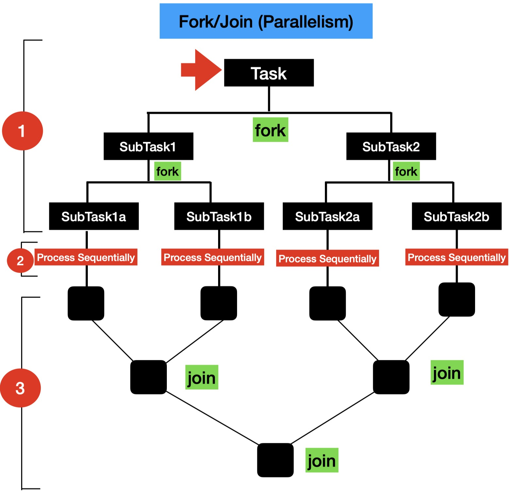
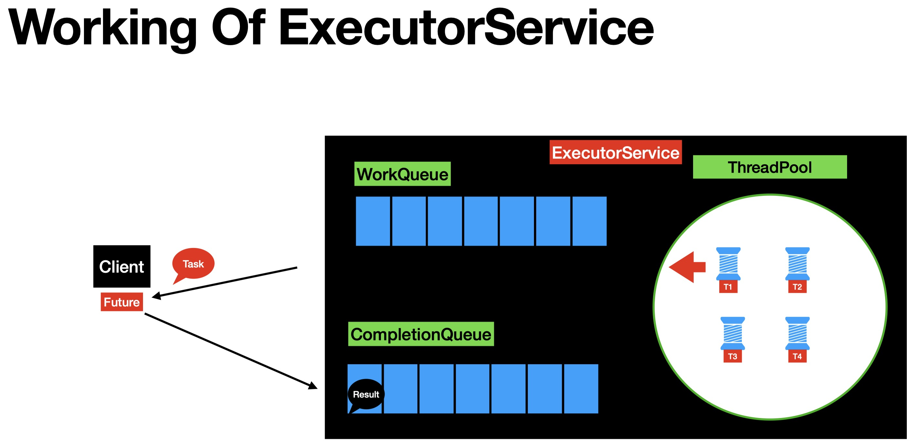
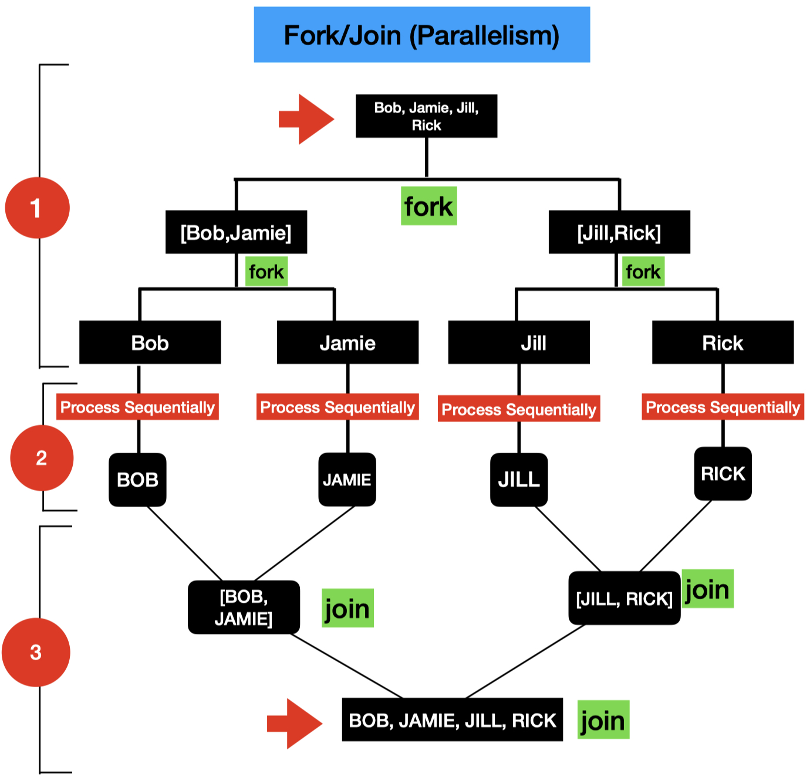
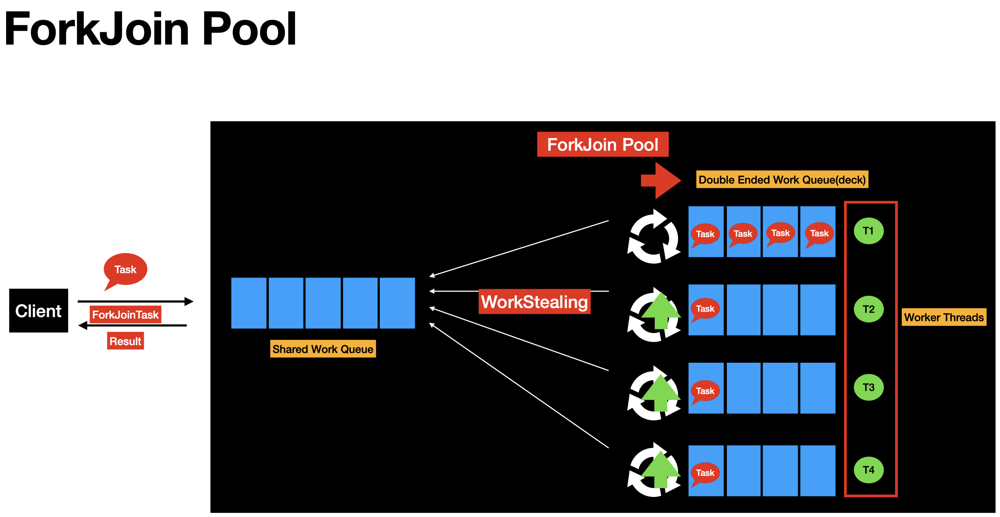
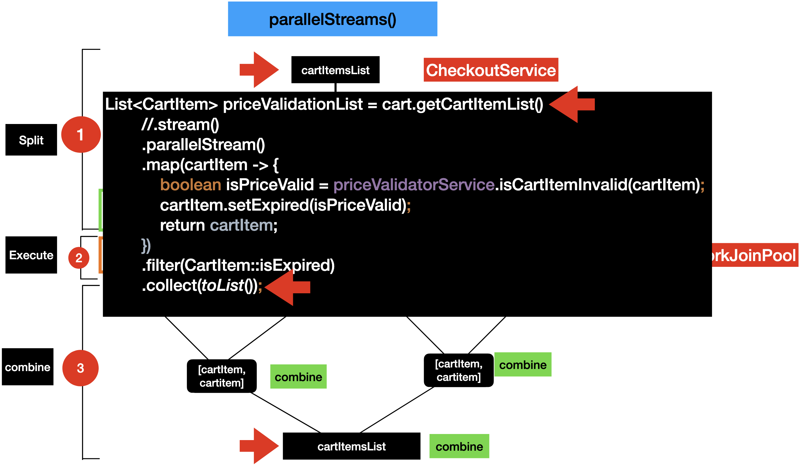
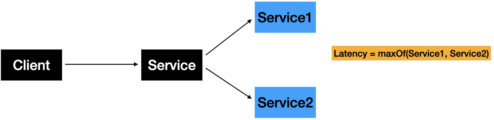

# Table of Contents

- [Table of Contents](#table-of-contents)
- [Parallel \& Asynchronous Coding in Modern Java](#parallel--asynchronous-coding-in-modern-java)
- [Getting Started with Parallel \& Asynchronous Programming](#getting-started-with-parallel--asynchronous-programming)
- [5. Why Parallel and Asynchronous Programming](#5-why-parallel-and-asynchronous-programming)
- [6. Evolution of Concurrency and Parallelism APIs in Java](#6-evolution-of-concurrency-and-parallelism-apis-in-java)
- [7. Concurrency vs Parallelism](#7-concurrency-vs-parallelism)
  - [Concurrency](#concurrency)
  - [Parallelism](#parallelism)
- [Limitations of Threads, Future, ForkJoin](#limitations-of-threads-future-forkjoin)
- [11. Threads and its Limitations](#11-threads-and-its-limitations)
  - [Threads Api](#threads-api)
    - [Thread API Limitations](#thread-api-limitations)
- [12. Intro to ThreadPool/ExecutorService \& Future](#12-intro-to-threadpoolexecutorservice--future)
  - [Thread Pool](#thread-pool)
    - [`Thread` Example](#thread-example)
- [13. `ExecutorService`](#13-executorservice)
  - [Limitations of ExecutorService](#limitations-of-executorservice)
  - [`ExecutorService` Example](#executorservice-example)
- [14. `Fork/Join` Framework](#14-forkjoin-framework)
  - [Data Parallelism vs Task Parallelism](#data-parallelism-vs-task-parallelism)
  - [What is Data Parallelism?](#what-is-data-parallelism)
  - [How does Fork/Join Framework Works ?](#how-does-forkjoin-framework-works-)
  - [`ForkJoinPool`](#forkjoinpool)
    - [Work Stealing](#work-stealing)
  - [ForkJoin Task](#forkjoin-task)
- [16. Streams Api \& Parallel Streams](#16-streams-api--parallel-streams)
  - [Streams Api](#streams-api)
  - [ParallelStreams](#parallelstreams)
  - [Stream vs ParallelStream](#stream-vs-parallelstream)
- [17. Unit Testing ParallelStreams](#17-unit-testing-parallelstreams)
- [19. Sequential/Parallel Functions in Streams API](#19-sequentialparallel-functions-in-streams-api)
  - [`.sequential()` and `.parallel()`](#sequential-and-parallel)
- [23. Parallel Streams](#23-parallel-streams)
- [27. Collect \& Reduce](#27-collect--reduce)
  - [Collect](#collect)
  - [Reduce](#reduce)
- [29. Identify in `reduce()`](#29-identify-in-reduce)
- [30. Parallel Stream Operations \& Poor Performance](#30-parallel-stream-operations--poor-performance)
- [31. Internals of Common ForkJoin Pool](#31-internals-of-common-forkjoin-pool)
- [32. Parallelism \& Threads in Common ForkJoinPool](#32-parallelism--threads-in-common-forkjoinpool)
- [33. Modifying Default parallelism in Parallel Streams](#33-modifying-default-parallelism-in-parallel-streams)
- [34. Parallel Streams Summary](#34-parallel-streams-summary)
  - [When to use Parallel Streams ?](#when-to-use-parallel-streams-)
  - [When to AVOID using Parallel Streams ?](#when-to-avoid-using-parallel-streams-)
- [35. CompletableFuture](#35-completablefuture)
  - [CompletableFuture and Reactive Programming](#completablefuture-and-reactive-programming)
  - [`CompletableFuture` API Methods](#completablefuture-api-methods)
    - [`.supplyAsync()`](#supplyasync)
    - [`.thenAccept()`](#thenaccept)
    - [`.thenApply()`](#thenapply)
    - [`.thenCompose()`](#thencompose)
    - [`.thenCombine()`](#thencombine)
  - [Unit Testing CompletableFuture](#unit-testing-completablefuture)

# Parallel & Asynchronous Coding in Modern Java

https://macquarie.udemy.com/course/parallel-and-asynchronous-programming-in-modern-java/

https://github.com/dilipsundarraj1/parallel-asynchronous-using-java

https://github.com/dilipsundarraj1/parallel-asynchronous-using-java/blob/master/src/main/java/com/learnjava/thread/HelloWorldThreadExample.java

# Getting Started with Parallel & Asynchronous Programming

# 5. Why Parallel and Asynchronous Programming

Goal of Asynchronous and Parallel Programming

- Provide Techniques to improve the performance of the code
  Technology Advancements
  | Hardware | Software |
  | ------------------------------------------------- | ------------------------------------------------------------------------------------------------------------- |
  | Devices or computers comes up with Multiple cores | MicroServices Architecture style |
  | Developer utilises multiple cores | Blocking I/O calls are common in MicroServices Architecture. This also impacts the latency of the application |
  | Apply the Parallel Programming concepts | Apply the Asynchronous Programming concepts |
  | Parallel Streams | CompletableFuture |

# 6. Evolution of Concurrency and Parallelism APIs in Java


# 7. Concurrency vs Parallelism

## Concurrency

> Concurrency is a concept where two or more task can run simultaneously
> Concurrency can be implemented in single or multiple cores
> Concurrency is about correctly and efficiently controlling access to shared resources

In Java, Concurrency is achieved using `Threads`

How the tasks are ran depends on the underlying CPU
Single core = Tasks ran in interleaved fashion
Multicore = Tasks ran simultaneously


In a real application, Threads normally need to interact with one another via `Shared Objects` or `Messaging Queues`

Issues:

- Race Condition
- DeadLocks

Solutions:

- Synchronized Statements/Methods
- Reentrant Locks, Semaphores
- Concurrent Collections
- Conditional Objects and More

Concurrency Example

```java
import static java.lang.Thread.sleep;

public class HelloWorldThreadExample {
  private static String result = ""; // <-- SHARED Object

  private static void hello() {
    sleep(700);
    result = result.concat("Hello");
  }

  private static void world() {
    sleep(600);
    result = result.concat("World");
  }

  public static void main(String[] args) throws InterruptedException {
    Thread helloThread = new Thread(() -> hello());
    Thread worldThread = new Thread(() -> world());
    // Starting the thread
    helloThread.start();
    worldThread.start();
    // Joining the thread (Waiting for the threads to finish)
    helloThread.join();
    worldThread.join();
    // Result
    System.out.println("Result is : " + result);
  }
}
```

## Parallelism

> Parallelism is a concept in which tasks are are running in parallel
> Parallelism can only be implemented on multi-core devices
> Parallelism is about using more resources to access the result faster

Parallelism involves these steps:

1. Decomposing the tasks in to SubTasks(Forking)
2. Execute the subtasks in sequential
3. Joining the results of the tasks(Join)

Whole process is also called `Fork/Join`




```java
public class ParallelismExample1 {
  public static void main(String[] args) {
    List<String> namesList = List.of("Bob", "Jamie", "Jill", "Rick");
    System.out.println("namesList : " + namesList);
    List<String> namesListUpperCase = namesList
      .parallelStream()
      .map(String::toUpperCase)
      .collect(Collectors.toList());
    System.out.println("namesListUpperCase : " + namesListUpperCase);
  }
}
```

# Limitations of Threads, Future, ForkJoin

# 11. Threads and its Limitations

## Threads Api

Threads API got introduced in Java1
Threads are used to offload the blocking tasks as background tasks
Threads allowed the developers to write asynchronous style of code

### Thread API Limitations

- Requires a lot of manual code to introduce asynchronicity
  - Runnable, Thread
  - Require additional properties in Runnable
  - Start and Join the thread
- Low level
- Easy to introduce complexity in to our code

# 12. Intro to ThreadPool/ExecutorService & Future

Limitations Of Thread

- Create, start, join the threads

Threads are expensive

- Threads have their own runtime-stack, memory, registers and more

> Thread Pool was created to solve these problems

## Thread Pool

Thread Pool is a group of threads created and readily available

CPU Intensive Tasks

- ThreadPool Size = No of Cores

I/O task

- ThreadPool Size > No of Cores

What are the benefits of thread pool?

- No need to manually create, start and join the threads
- Achieving Concurrency in your application

### `Thread` Example

```java
package com.learnjava.thread;

import com.learnjava.domain.Product;
import com.learnjava.domain.ProductInfo;
import com.learnjava.domain.Review;
import com.learnjava.service.ProductInfoService;
import com.learnjava.service.ReviewService;
import org.apache.commons.lang3.time.StopWatch;

import static com.learnjava.util.CommonUtil.stopWatch;
import static com.learnjava.util.LoggerUtil.log;

public class ProductServiceUsingThread {
  private ProductInfoService productInfoService;
  private ReviewService reviewService;

  public ProductServiceUsingThread(ProductInfoService productInfoService, ReviewService reviewService) {
    this.productInfoService = productInfoService;
    this.reviewService = reviewService;
  }

  public Product retrieveProductDetails(String productId) throws InterruptedException {
    stopWatch.start();
    ProductInfoRunnable productInfoRunnable = new ProductInfoRunnable(productId);
    ReviewRunnable reviewRunnable = new ReviewRunnable(productId);
    // Create thread
    Thread productInfoThread = new Thread(productInfoRunnable);
    Thread reviewThread = new Thread(reviewRunnable);
    // Start thread
    productInfoThread.start();
    reviewThread.start();
    // Join thread (wait for thread to terminate)
    productInfoThread.join();
    reviewThread.join();
    stopWatch.stop();
    log("Total Time Taken : " + stopWatch.getTime());
    return new Product(productId, productInfoRunnable.productInfo, reviewRunnable.review);
  }

  public static void main(String[] args) throws InterruptedException {
    ProductInfoService productInfoService = new ProductInfoService();
    ReviewService reviewService = new ReviewService();
    ProductServiceUsingThread productService = new ProductServiceUsingThread(productInfoService, reviewService);
    String productId = "ABC123";
    Product product = productService.retrieveProductDetails(productId);
    log("Product is " + product);

  }

  private class ProductInfoRunnable implements Runnable {
    private String productId;
    private ProductInfo productInfo;

    public ProductInfo getProductInfo() {
      return productInfo;
    }

    public ProductInfoRunnable(String productId) {
      this.productId = productId;
    }

    @Override
    public void run() {
      productInfo = productInfoService.retrieveProductInfo(productId);
    }
  }

  private class ReviewRunnable implements Runnable {
    private String productId;
    private Review review;

    public ReviewRunnable(String productId) {
      this.productId = productId;
    }

    public Review getReview() {
      return review;
    }

    @Override
    public void run() {
      review = reviewService.retrieveReviews(productId);
    }
  }
}
```

# 13. `ExecutorService`

Released as part of Java5

ExecutorService in Java is an `Asynchronous Task Execution Engine`

It provides a way to asynchronously execute tasks and provides the results in a much simpler way compared to threads

This enabled coarse-grained task based parallelism in Java



## Limitations of ExecutorService

Designed to Block the Thread

```java
Future<ProductInfo> productInfoFuture = executorService.submit(() -> productInfoService.retrieveProductInfo(productId));
Future<Review> reviewFuture = executorService.submit(() -> reviewService.retrieveReviews(productId));
ProductInfo productInfo = productInfoFuture.get();
Review review = reviewFuture.get();
```

No better way to combine futures

```java
Future<ProductInfo> productInfoFuture = executorService.submit(() -> productInfoService.retrieveProductInfo(productId));
Future<Review> reviewFuture = executorService.submit(() -> reviewService.retrieveReviews(productId));
ProductInfo productInfo = productInfoFuture.get();
Review review = reviewFuture.get();
return new Product(productId, productInfo, review);
```

## `ExecutorService` Example

```java
package com.learnjava.executor;

import com.learnjava.domain.Product;
import com.learnjava.domain.ProductInfo;
import com.learnjava.domain.Review;
import com.learnjava.service.ProductInfoService;
import com.learnjava.service.ReviewService;
import org.apache.commons.lang3.time.StopWatch;

import java.util.concurrent.*;

import static com.learnjava.util.CommonUtil.stopWatch;
import static com.learnjava.util.LoggerUtil.log;

public class ProductServiceUsingExecutor {

  static ExecutorService executorService = Executors.newFixedThreadPool(6);

  private ProductInfoService productInfoService;
  private ReviewService reviewService;

  public ProductServiceUsingExecutor(ProductInfoService productInfoService, ReviewService reviewService) {
    this.productInfoService = productInfoService;
    this.reviewService = reviewService;
  }

  public Product retrieveProductDetails(String productId) throws ExecutionException, InterruptedException, TimeoutException {
    stopWatch.start();

    Future<ProductInfo> productInfoFuture = executorService.submit(() -> productInfoService.retrieveProductInfo(productId));
    Future<Review> reviewFuture = executorService.submit(() -> reviewService.retrieveReviews(productId));

    ProductInfo productInfo = productInfoFuture.get();
    // ProductInfo productInfo = productInfoFuture.get(2, TimeUnit.SECONDS); // https://docs.oracle.com/en/java/javase/21/docs/api/java.base/java/util/concurrent/CompletableFuture.html#get(long,java.util.concurrent.TimeUnit)
    Review review = reviewFuture.get();
    //Review review = reviewFuture.get(2, TimeUnit.SECONDS);

    stopWatch.stop();
    log("Total Time Taken : " + stopWatch.getTime());
    return new Product(productId, productInfo, review);
  }

  public static void main(String[] args) throws ExecutionException, InterruptedException, TimeoutException {

    ProductInfoService productInfoService = new ProductInfoService();
    ReviewService reviewService = new ReviewService();
    ProductServiceUsingExecutor productService = new ProductServiceUsingExecutor(productInfoService, reviewService);
    String productId = "ABC123";
    Product product = productService.retrieveProductDetails(productId);
    log("Product is " + product);
    executorService.shutdown(); // NOTE: Need to explicitly shutdown the executorService
  }
}
```

# 14. `Fork/Join` Framework

- Fork/Join was introduced as part of Java7
- This is an extension of `ExecutorService`
- Fork/Join framework is designed to achieve Data Parallelism
- ExecutorService is designed to achieve Task Based Parallelism

## Data Parallelism vs Task Parallelism

> Data Parallelism = Applies the same operation to different pieces of data simultaneously

- Same task, different data
- Data is divided into chunks
- Each processor performs identical operations on its chunk

> Task Parallelism = Executes different operations (on the same or different data) simultaneously

- Different tasks, possibly different data
- Tasks may be completely independent
- Tasks can hve different execution times
- More complex coordination

## What is Data Parallelism?

- Data Parallelism is a concept where a given Task is recursively split in to SubTasks until it reaches it least possible size and execute those tasks in parallel
- Basically it uses the divide and conquer approach



## How does Fork/Join Framework Works ?

ForkJoin framework has a dedicated pool called `ForkJoinPool` to support Data Parallelism

## `ForkJoinPool`



Double Ended Work Queue

### Work Stealing

Worker threads can examine each other's work queue and share tasks

## ForkJoin Task

ForkJoin Task represents part of the data and its computation

Type of tasks to submit to ForkJoin Pool

- `RecursiveTask` = Task that returns a value
- `RecursiveAction` = Task that does not return a value

# 16. Streams Api & Parallel Streams

## Streams Api

- Streams API got introduced in Java 8
- Streams API is used to process a collection of Objects
- Streams in Java are created by using the `.stream()` method

```java
public List<String> stringTransformUpperCase(List<String> namesList) {
  return namesList
    .stream()
    .map(String::toUpperCase)
    .collect(Collectors.toList());
}
```

## ParallelStreams

- ParallelStreams allows your code to run in parallel
- ParallelStreams are designed to solve Data Parallelism

```java
public List<String> stringTransformUpperCase(List<String> namesList) {
  return namesList
    .parallelStream()
    .map(String::toUpperCase)
    .collect(Collectors.toList());
}
```

## Stream vs ParallelStream

```java
public List<String> stringTransform(List<String> namesList) {
  return namesList
    .stream()
    .map(this::transform)
    .parallel()
    .collect(Collectors.toList());
}
```

```java
public List<String> stringTransform(List<String> namesList) {
  return namesList
    .parallelStream()
    .map(this::transform)
    .sequential()
    .collect(Collectors.toList());
}
```

# 17. Unit Testing ParallelStreams

```java
package com.learnjava.parallelstreams;

import com.learnjava.util.DataSet;
import org.junit.jupiter.api.Test;
import org.junit.jupiter.params.ParameterizedTest;
import org.junit.jupiter.params.provider.ValueSource;

import java.util.List;

import static org.junit.jupiter.api.Assertions.*;

class ParallelismExampleTest {

  ParallelStreamsExample parallelismExample = new ParallelStreamsExample();

  @Test
  void stringTransform() {
    List<String> stringList = parallelismExample.stringTransform(List.of("Bob", "Jamie", "Jill", "Rick"));
    assertEquals(4, stringList.size());
    stringList.forEach((name) -> {
      assertTrue(name.contains("-"));
    });
  }

  @ParameterizedTest
  @ValueSource(booleans = { false, true })
  void stringTransform_1(boolean isParallel) {
    // given
    List<String> inputList = List.of("Bob", "Jamie", "Jill", "Rick");
    // when
    List<String> stringList = parallelismExample.stringTransform_1(inputList, isParallel);
    // then
    assertEquals(4, stringList.size());
    stringList.forEach((name) -> {
      assertTrue(name.contains("-"));
    });
  }
}
```

# 19. Sequential/Parallel Functions in Streams API

## `.sequential()` and `.parallel()`

- Streams API are sequential by default
- `.sequential()` = Executes the stream in sequential
- `.parallel()` = Executes the stream in parallel
- Both the functions() changes the behavior of the whole pipeline

When using `ParallelStreams`, the number of tasks that can be ran in parallel is dictated by the number of processor cores on your machine

```java
System.out.println("no of cores : " + Runtime.getRuntime().availableProcessors());
```

```java
public List<String> stringTransform(List<String> namesList) {
  return namesList
    .stream()
    .map(this::transform)
    .parallel() // <-- HERE: Changes to parallel stream
    .collect(Collectors.toList());
}
```

```java
public List<String> stringTransform(List<String> namesList) {
  return namesList
    .parallelStream()
    .map(this::transform)
    .sequential() // <-- HERE: Changes to sequential stream
    .collect(Collectors.toList());
}
```

# 23. Parallel Streams

`parallelStream()`

**Split**

- Data Source is split in to small data chunks
  - E.g. List Collection split into chunks of elements to size 1
- This is done using Spliterators
  - For `ArrayList`, the Spliterator is `ArrayListSpliterator`

**Execute**

- Data chunks are applied to the Stream Pipeline and the Intermediate operations executed in a `Common ForkJoin Pool`

**Combine**

- Combine the executed results into a final result
- Combine phase in Streams API maps to terminal operations
- Uses collect() and reduce() functions e.g. `collect(toList())`



# 27. Collect & Reduce

## Collect

- Part of Streams API
- Used as a terminal operation in Streams API
- Produces a single result
- Result is produced in a mutable fashion
- Feature rich and used for many different
- use cases
- Example
  - `collect(toList())`
  - `collect(toSet())`
  - `collect(summingDouble(Double::doubleValue))`

## Reduce

- Part of Streams API
- Used as a terminal operation in Streams API
- Produces a single result
- Result is produced in a immutable fashion
- Reduce the computation into a single value
- Sum, Multiplication

# 29. Identify in `reduce()`

```java
public int reduceParallelStream() {
  int sum = List.of(1,2,3,4,5)
    .parallelStream()
    .reduce(0, (x, y) -> x + y); // 0+1, 0+2, 0+3, 0+4, 0+5
  // sum = 15
}
```

# 30. Parallel Stream Operations & Poor Performance

- Stream Operations that perform poor
- Impact of Boxing and UnBoxing when it comes to parallel Streams
- Boxing -> Converting a Primitive Type to Wrapper class equivalent
  - `1 -> new Integer(1)`
- UnBoxing -> Converting a Wrapper class to Primitive equivalent
  - `new Integer(1) -> 1`

```java
int sum = inputStream
  .mapToInt(Integer::intValue) // unboxing
  .sum();
```

# 31. Internals of Common ForkJoin Pool

Common ForkJoin Pool is used by:

- ParallelStreams
- CompletableFuture

Completable Future have options to use a User-defined ThreadPools

Common ForkJoin Pool is shared by the whole process

# 32. Parallelism & Threads in Common ForkJoinPool

Number of parallel threads = Number of cores - 1, since 1 thread is used to call the initial function (main thread)

```java
System.out.println("Number of parallel threads = ForkJoinPool.getCommonPoolParallelism()");
// 11 (on a 12 core machine)
```

# 33. Modifying Default parallelism in Parallel Streams

```java
System.setProperty("java.util.concurrent.ForkJoinPool.common.parallelism", "100");
// or
-Djava.util.concurrent.ForkJoinPool.common.parallelism=100
```

# 34. Parallel Streams Summary

## When to use Parallel Streams ?

Parallel Streams do a lot compared to sequential(default) Streams

Use when the `Split` and `Combine` operations will be faster

- Split
- Execute
- Combine

Computation takes a longer time to complete
Processing lots of data

## When to AVOID using Parallel Streams ?

- Data collection does not spilt or combine very well e.g. `LinkedList`
- Data set is small
- Auto Boxing and Unboxing doesn't perform better
- Stream API operators -> `.iterate()`, `.limit()`

# 35. CompletableFuture

Introduced in Java 8

CompletableFuture is an Asynchronous Reactive Functional Programming API

CompletableFuture allows developers to write Asynchronous Computations in a Functional Style

CompletableFutures API is created to solve the limitations of Future API

## CompletableFuture and Reactive Programming

Responsive:

- Fundamentally Asynchronous
- Call returns immediately and the response will be sent when its available

Resilient:

- Exception or error won't crash the app or code

Elastic:

- Asynchronous Computations normally run in a pool of threads
- Number of of threads can go up or down based on the need

Message Driven:

- Asynchronous computations interact with each through messages in a event-driven style

## `CompletableFuture` API Methods

Factory Methods

- Initiate asynchronous computation

Completion Stage Methods

- Chain asynchronous computation

Exception Methods

- Handle Exceptions in an Asynchronous Computation

### `.supplyAsync()`

- FactoryMethod
- Initiate Asynchronous computation
- Input is **Supplier** Functional Interface
- Returns `CompletableFuture<T>()`

### `.thenAccept()`

- Completion Stage Method
- Chain Asynchronous Computation
- Input is **Consumer** Functional Interface
- Consumes the result of the previous
- Returns `CompletableFuture<Void>`
- Use it at the end of the Asynchronous computation

```java
import java.util.concurrent.CompletableFuture;

import static com.learnjava.util.LoggerUtil.log;

public class HelloWorldService {

  public String helloWorld() {
    Thread.sleep(1000);
    System.out.println("inside helloWorld");
    return "hello world";
  }

  public String hello() {
    Thread.sleep(1000);
    System.out.println("inside hello");
    return "hello";
  }

  public String world() {
    Thread.sleep(1000);
    System.out.println("inside world");
    return " world!";
  }

  public CompletableFuture<String> worldFuture(String input) {
    return CompletableFuture.supplyAsync(() -> {
      Thread.sleep(1000);
      return input + " world!";
    });
  }

}
```

```java
import com.learnjava.service.HelloWorldService;

import java.util.List;
import java.util.concurrent.CompletableFuture;
import java.util.concurrent.ExecutorService;
import java.util.concurrent.Executors;
import java.util.concurrent.TimeUnit;

import static java.util.stream.Collectors.joining;

public class CompletableFutureHelloWorld {

  private HelloWorldService helloWorldService;

  public CompletableFutureHelloWorld(HelloWorldService helloWorldService) {
    this.helloWorldService = helloWorldService;
  }

  public static void main(String[] args) {

    HelloWorldService helloWorldService = new HelloWorldService();
    CompletableFuture.supplyAsync(() -> helloWorldService.helloWorld()) //  run asynchronously in another background thread in the common fork-join pool
      .thenAccept((result) -> {
        System.out.println("result " + result);
      })
      .join(); // block main thread (wait for completion)
    System.out.println("main() done");
  }
}
```

```java
CompletableFuture<String> completableFuture = CompletableFuture.supplyAsync(() -> "Hello");

CompletableFuture<Void> future = completableFuture.thenAccept(s -> System.out.println("Computation returned: " + s));

future.get();
```

### `.thenApply()`

> `.thenApply()` is used if you have a synchronous mapping function

```java
CompletableFuture<Integer> future = CompletableFuture.supplyAsync(() -> 1)
                                                      .thenApply(x -> x+1);
```

> `.thenApply()` method is used when you have a `CompletableFuture` and you want to transform its result
>
> It applies a function to the result and returns a new `CompletableFuture` with the transformed result

```java
CompletableFuture<Integer> future = CompletableFuture.supplyAsync(() -> 5);

CompletableFuture<String> transformedFuture = future.thenApply((result) -> {
  return "Result is: " + result;
});

transformedFuture.thenAccept(System.out::println); // Output: Result is: 5
```

- Used to deal with functions that return a value
- Completion Stage method
- Transform the data from one form to another
- Input is **Function** Functional Interface
- Returns `CompletableFuture<T>`

```java
import com.learnjava.service.HelloWorldService;

import java.util.List;
import java.util.concurrent.CompletableFuture;
import java.util.concurrent.ExecutorService;
import java.util.concurrent.Executors;
import java.util.concurrent.TimeUnit;

import static java.util.stream.Collectors.joining;

public class CompletableFutureHelloWorld {

  private HelloWorldService helloWorldService;

  public CompletableFutureHelloWorld(HelloWorldService helloWorldService) {
    this.helloWorldService = helloWorldService;
  }

  public static void main(String[] args) {

    HelloWorldService helloWorldService = new HelloWorldService();
    CompletableFuture.supplyAsync(() -> helloWorldService.helloWorld()) //  run asynchronously in another background thread in the common fork-join pool
      .thenApply(String::toUpperCase)
      .thenAccept((result) -> {
        System.out.println("result = " + result);
      })
      .join(); // block main thread (wait for completion)
    System.out.println("main() done");
  }

  public CompletableFuture<String> helloWorld() {
    return CompletableFuture.supplyAsync(() -> helloWorldService.helloWorld())//  runs this in a common fork-join pool
      .thenApply(String::toUpperCase);
  }
}
```

### `.thenCompose()`

> `thenCompose()` is used if you have an asynchronous mapping function (i.e. one that returns a `CompletableFuture`)
>
> It will then return a `CompletableFuture` with the result directly, rather than in a nested `CompletableFuture`
>
> `thenCompose()` is analogous to the flatMap which flattens nested futures

```java
CompletableFuture<Integer> future = CompletableFuture.supplyAsync(() -> 1)
                                                     .thenCompose(x -> CompletableFuture.supplyAsync(() -> x+1));
```

> `.thenCompose()` is used for composing two futures where one future depends on the result of another
>
> It is useful when you have an asynchronous function that returns a `CompletableFuture`

```java
import java.util.concurrent.CompletableFuture;

public class MyClass {
  public static void main(String args[]) {
    CompletableFuture<Integer> future = CompletableFuture.supplyAsync(() -> 5);
    CompletableFuture<String> composedFuture = future.thenCompose((result) -> {
        return CompletableFuture.supplyAsync(() -> "Composed result is: " + (result * 2));
    });
    composedFuture.thenAccept(System.out::println); // Output: Composed result is: 10
    // Wait for the composed future to complete
    composedFuture.join(); // `.join()` blocks the main thread & waits for the completion of the async task
  }
}
```

- Used to deal with functions that return a `CompletableFuture`
- Completion Stage method
- Transform the data from one from to another
- Input is Function Functional Interface
- Returns `CompletableFuture<T>`

### `.thenCombine()`

> **Used to Combine Independent Completable Futures (independent Async Tasks)**

- This is a Completion Stage Method
- Takes two arguments
  - CompletionStage
  - BiFunction
- Returns a CompletableFuture



```java
import com.learnjava.service.HelloWorldService;

import java.util.List;
import java.util.concurrent.CompletableFuture;
import java.util.concurrent.ExecutorService;
import java.util.concurrent.Executors;
import java.util.concurrent.TimeUnit;

import static java.util.stream.Collectors.joining;

public class CompletableFutureHelloWorld {

  private HelloWorldService helloWorldService;

  public CompletableFutureHelloWorld(HelloWorldService helloWorldService) {
    this.helloWorldService = helloWorldService;
  }

  public static void main(String[] args) {
  }

  public String helloWorld_2_async_calls() {
    CompletableFuture<String> helloCompletableFuture = CompletableFuture.supplyAsync(() -> helloWorldService.getHelloStr());
    CompletableFuture<String> worldCompletableFuture = CompletableFuture.supplyAsync(() -> helloWorldService.getWorldStr());

    String hellowWorldString = helloCompletableFuture
      .thenCombine(worldCompletableFuture, (h, w) -> h + w) // (first,second)
      .thenApply(String::toUpperCase)
      .join();

    return hellowWorldString;
  }

  public String helloWorld_3_async_calls() {
    CompletableFuture<String> helloCF = CompletableFuture.supplyAsync(() -> helloWorldService.getHelloStr());
    CompletableFuture<String> worldCF = CompletableFuture.supplyAsync(() -> helloWorldService.getWorldStr());
    CompletableFuture<String> helloUniverseCF = CompletableFuture.supplyAsync(() -> {
      Thread.sleep(1000);
      return " hello universe!";
    });

    String resultStr = helloCF
      .thenCombine(worldCF, (h, w) -> h + w) // (first, second)
      .thenCombine(helloUniverseCF, (previous, current) -> previous + current)
      .thenApply(String::toUpperCase)
      .join();

    return resultStr;
  }
}
```

```java
package com.learnjava.completablefuture;

import com.learnjava.service.HelloWorldService;
import org.junit.jupiter.api.Assertions;
import org.junit.jupiter.api.Disabled;
import org.junit.jupiter.api.Test;

import java.util.concurrent.CompletableFuture;
import java.util.concurrent.CompletionException;
import java.util.concurrent.TimeoutException;

import static org.junit.jupiter.api.Assertions.*;

class CompletableFutureHelloWorldTest {

  HelloWorldService hws = new HelloWorldService();
  CompletableFutureHelloWorld cfhw = new CompletableFutureHelloWorld(hws);

  @Test
  void helloWorld_2_async_calls() {
    //given
    //when
    String hw = cfhw.helloWorld_2_async_calls();
    //then
    assertEquals("HELLO WORLD!", hw);
  }

  @Test
  void helloWorld_3_async_calls() {
    //given
    //when
    String hw = cfhw.helloWorld_3_async_calls();
    //then
    assertEquals("HELLO WORLD! HELLO UNIVERSE!", hw);
  }
}
```

## Unit Testing CompletableFuture

```java
package com.learnjava.completablefuture;

import com.learnjava.service.HelloWorldService;
import org.junit.jupiter.api.Assertions;
import org.junit.jupiter.api.Disabled;
import org.junit.jupiter.api.Test;

import java.util.concurrent.CompletableFuture;
import java.util.concurrent.CompletionException;
import java.util.concurrent.TimeoutException;

import static org.junit.jupiter.api.Assertions.*;

class CompletableFutureHelloWorldTest {

  HelloWorldService hws = new HelloWorldService();
  CompletableFutureHelloWorld cfhw = new CompletableFutureHelloWorld(hws);

  @Test
  void helloWorld() {
    // given
    // when
    CompletableFuture<String> completableFuture = cfhw.helloWorld();
    // then
    completableFuture
      .thenAccept(s -> {
        assertEquals("HELLO WORLD", s);
      })
      .join(); // NOTE: This is needed otherwise the test will finish before the async call is complete
  }
}
```
