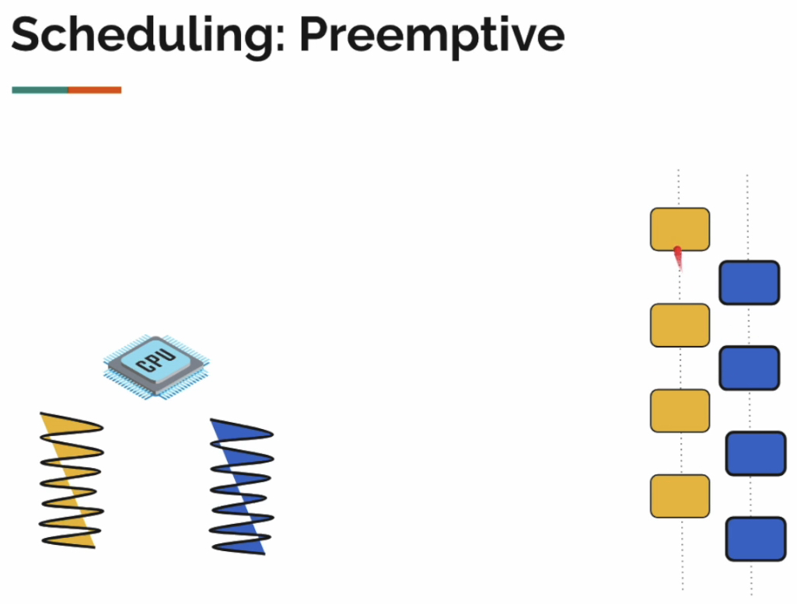
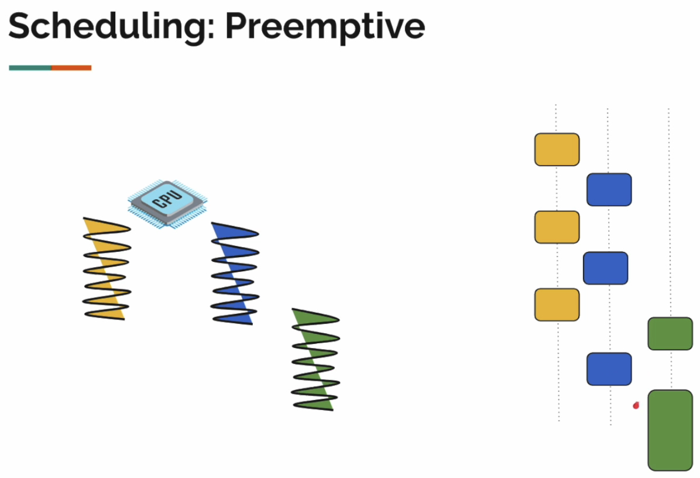
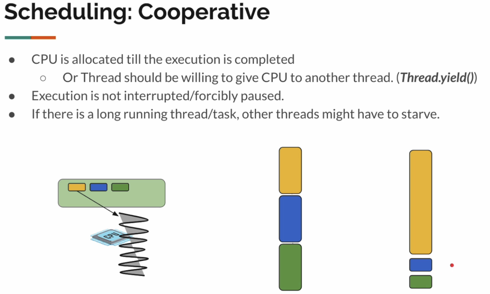
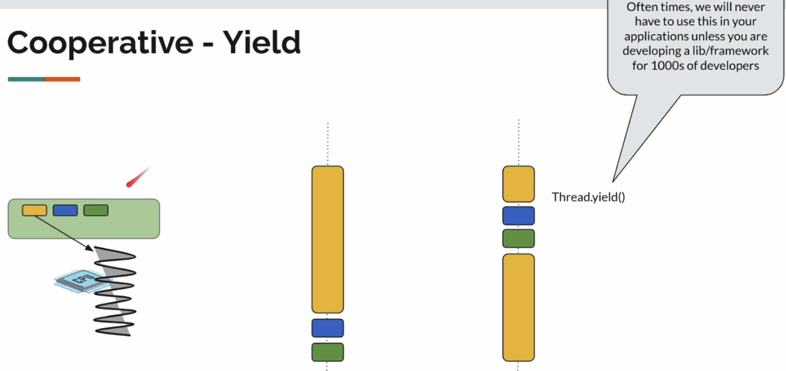
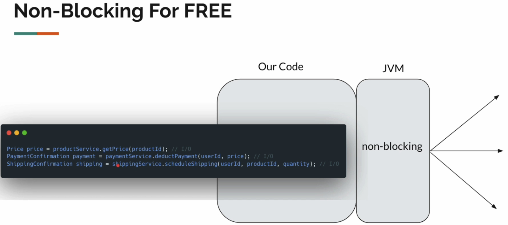

# Table of Contents

- [Table of Contents](#table-of-contents)
- [Intro](#intro)
  - [Threads: The Backbone of Concurrency](#threads-the-backbone-of-concurrency)
  - [How Java Handles Requests](#how-java-handles-requests)
  - [When Requests Go Beyond the Limit](#when-requests-go-beyond-the-limit)
  - [The Problem with Platform Threads](#the-problem-with-platform-threads)
  - [Virtual Threads introduced in Java 21](#virtual-threads-introduced-in-java-21)
- [2. Virutal Threads](#2-virutal-threads)
  - [Process](#process)
  - [Thread](#thread)
  - [Scheduler/CPU/Thread](#schedulercputhread)
  - [Java (Platform) Thread](#java-platform-thread)
  - [Microservice Communication](#microservice-communication)
- [5. Platform Thread Limits Demo/Example](#5-platform-thread-limits-demoexample)
  - [IO using `Thread.sleep`](#io-using-threadsleep)
- [6. Creating Platform Threads using `ThreadBuilder`](#6-creating-platform-threads-using-threadbuilder)
  - [Daemon Virutal Threads](#daemon-virutal-threads)
    - [Creating Daemon Virtual Threads using `ThreadBuilder`](#creating-daemon-virtual-threads-using-threadbuilder)
    - [How to Make Application Wait?](#how-to-make-application-wait)
- [7. Virtual Thread Scaling](#7-virtual-thread-scaling)
  - [Virtual Thread](#virtual-thread)
  - [`Thread.Builder`](#threadbuilder)
  - [Creating Virutal Threads](#creating-virutal-threads)
- [8. How Virtual Threads work Internally](#8-how-virtual-threads-work-internally)
  - [ForkJoinPool](#forkjoinpool)
- [10. Virutal Threads \& Stack Memory](#10-virutal-threads--stack-memory)
  - [Stack Size](#stack-size)
- [12-14. CPU Intensive Tasks](#12-14-cpu-intensive-tasks)
- [15. Virtual Thread - Scheduler Config](#15-virtual-thread---scheduler-config)
- [16. Preemptive vs Cooperative Scheduling Types](#16-preemptive-vs-cooperative-scheduling-types)
  - [Preemptive - OS Scheduling Policy](#preemptive---os-scheduling-policy)
  - [Cooperative](#cooperative)
- [18. How can Virtual Threads help](#18-how-can-virtual-threads-help)
    - [Synchronous Blocking Style Code](#synchronous-blocking-style-code)
    - [Synchronous Non-Blocking Style Code](#synchronous-non-blocking-style-code)
- [19. Concurrency - Synchronisation Basics](#19-concurrency---synchronisation-basics)
  - [Synchronization](#synchronization)
  - [Problem](#problem)
    - [Fix/Solution](#fixsolution)
- [21. Thread Pinning - Java 21 - 23](#21-thread-pinning---java-21---23)
  - [Example](#example)
- [22. Thread Pinning - When \& Why it Matters](#22-thread-pinning---when--why-it-matters)
  - [`synchronized`](#synchronized)
- [23. Diagnosing Pinning: How to Trace](#23-diagnosing-pinning-how-to-trace)
- [24. Fixing Thread Pinning: `ReentrantLock` Solution](#24-fixing-thread-pinning-reentrantlock-solution)
  - [ReentrantLock with No Fairness Policy](#reentrantlock-with-no-fairness-policy)
  - [ReentrantLock with Fairness Policy](#reentrantlock-with-fairness-policy)
- [25. Advanced Creation - Virutal Thread Factory](#25-advanced-creation---virutal-thread-factory)
- [26. Key Thread Methods Review](#26-key-thread-methods-review)
- [27. Virtual Thread Fundamentals Summary](#27-virtual-thread-fundamentals-summary)
- [28. `ExecutorService`](#28-executorservice)
  - [Tasks to SubTasks](#tasks-to-subtasks)
  - [`ExecutorService`](#executorservice)
  - [Virtual Threads](#virtual-threads)
- [29. ExecutorService: The Different Types](#29-executorservice-the-different-types)

https://macquarie.udemy.com/course/java-virtual-thread/

https://github.com/vinsguru/java-virtual-thread-course

# Intro

A process is an independent, executing program with its own dedicated memory space and resources (inter-process communication is typically slow and restrictive)

A thread is a lightweight sub-process, the smallest unit of execution within a process.
Multiple threads within the same process share the same memory space and resources, making communication between them faster and easier, but requiring careful synchronization to avoid conflicts.

## Threads: The Backbone of Concurrency

- Every line of code runs on a thread
- Foundation of Java concurrency model

## How Java Handles Requests

- Each request is assigned to a thread
- Threads execute the request concurrently
- Out of the Box Spring Web with Apache Tomcat provides 200 threads by default (configurable)
  - This means 200 concurrent requests can be handled at once

## When Requests Go Beyond the Limit

- Requests beyond 200 wait in a queue
- Latency increases
- Users experience slower response

## The Problem with Platform Threads

- Platform Threads = OS Threads
- Each Thread needs its own memory stack
- Heavy & Expensive to create
- OS limits how many you can run!
- Not built for large-scale concurrency

```java
Thread thread = new Thread();
```

## Virtual Threads introduced in Java 21

- Lightweight and memory-efficient
- Enable massive concurrency

# 2. Virutal Threads

## Process

> A process is an instance of a computer program

- It includes code, resources allocated by the OS like memory, sockets
- A process can contain one or more threads
- Heavy-weight
  - It is expensive to create and destroy a process


## Thread

> A thead is part of a process.

- A process can contain one or more threads.
- Threads within a process can share the memory space
- OS thread == Kernel thread == Platform Thread == Carrier Thread


## Scheduler/CPU/Thread

Scenario: CPU with 3 threads

Operating system has a `scheduler`

Scheduler assigns the thread to the CPU for execution and will determine how long the thread can execute

Simplified Analogy:

- Modern CPUs can have multiple cores.
- Each core can be seen as a processor.

> Context-Switching is when the scheduler switches between threads for execution

When the scheduler switches from one thread to another, the current thread, execution point and the state it has to be stored so that it can be resumed later from the point where it was stopped.

## Java (Platform) Thread

- Java Thread was introduced ~25 year ago.
- 1 Java Thread = 1 OS Thread
- Note: OS Thread is the unit of scheduling.

When a Java thread executing multiple methods, the OS scheduler will keep switching threads.

So OS has to store the method's local variables and these function call information in the `stack memory`

> Heap memory is where we store objects (that are dynamically created e.g. ArrayList, HashMap)

> Stack memory will contain the local variables, object references and the function call information

The size of the stack memory is determined when the process starts or a thread is created and CANNOT be modified once the thread is created

## Microservice Communication

In the microservices architecture we have many of network calls

So a thread which is doing the request processing in the order service is often times is blocked because of the various network calls.

Problem: The thread is idle until all responses come back

```
              -> user-service     -> database call
order-service -> payment-service  -> database call
              -> shipping-service -> 3rd party api
              -> database call
```


# 5. Platform Thread Limits Demo/Example

## IO using `Thread.sleep`

To simulate slow I/O calls, we will use `Thread.sleep`
Later we would develop application using Spring Boot web.

```java
// InboundOutboundTaskDemo.java
package com.vinsguru.sec01;

import java.util.concurrent.CountDownLatch;

// Demo some blocking operations with both platform and virtual threads
public class InboundOutboundTaskDemo {

  private static final int MAX_PLATFORM = 10_000;
  private static final int MAX_VIRTUAL = 20;

  public static void main(String[] args) throws InterruptedException {
    platformThreadDemo();
  }

  // Create a simple java Platform Thread
  private static void platformThreadDemo() {
    for (int i = 0; i < MAX_PLATFORM; i++) {
      int j = i;
      Thread thread = new Thread(() -> Task.ioIntensive(j));
      thread.start();
    }
  }
}
```

```java
// Task.java
package com.vinsguru.sec01;

import org.slf4j.Logger;
import org.slf4j.LoggerFactory;

import java.time.Duration;

public class Task {

  private static final Logger log = LoggerFactory.getLogger(Task.class);

  public static void ioIntensive(int i) {
    try {
      log.info("starting I/O task {}. Thread Info: {}", i, Thread.currentThread());
      Thread.sleep(Duration.ofSeconds(10));
      log.info("ending I/O task {}. Thread Info: {}", i, Thread.currentThread());
    } catch (InterruptedException e) {
      throw new RuntimeException(e);
    }
  }
}
```

# 6. Creating Platform Threads using `ThreadBuilder`

https://docs.oracle.com/en/java/javase/21/docs/api/java.base/java/lang/Thread.Builder.html

>

```java
package com.vinsguru.sec01;

import java.util.concurrent.CountDownLatch;

// Demo some blocking operations with both platform and virtual threads
public class InboundOutboundTaskDemo {

  private static final int MAX_PLATFORM = 10_000;
  private static final int MAX_VIRTUAL = 20;

  public static void main(String[] args) throws InterruptedException {
    platformThreadDemo();
  }

  // Create Platform Thread using Thread.Builder
  private static void platformThreadDemo() {
    Thread.Builder.OfPlatform builder = Thread.ofPlatform().name("platformThread-", 1);
    for (int i = 0; i < MAX_PLATFORM; i++) {
      int j = i;
      // Thread thread = Thread.Builder.unstarted(Runnable task);
      Thread thread = builder.unstarted(() -> Task.ioIntensive(j));
      thread.start();
    }
  }
}
```

```java
// Task.java
package com.vinsguru.sec01;

import org.slf4j.Logger;
import org.slf4j.LoggerFactory;

import java.time.Duration;

public class Task {

  private static final Logger log = LoggerFactory.getLogger(Task.class);

  public static void ioIntensive(int i) {
    try {
      log.info("starting I/O task {}. Thread Info: {}", i, Thread.currentThread());
      Thread.sleep(Duration.ofSeconds(10));
      log.info("ending I/O task {}. Thread Info: {}", i, Thread.currentThread());
    } catch (InterruptedException e) {
      throw new RuntimeException(e);
    }
  }
}
```

## Daemon Virutal Threads

### Creating Daemon Virtual Threads using `ThreadBuilder`

Daemon Thread = Thread that runs in the background

```java
package com.vinsguru.sec01;

import java.util.concurrent.CountDownLatch;

// Demo some blocking operations with both platform and virtual threads
public class InboundOutboundTaskDemo {

  private static final int MAX_PLATFORM = 10_000;
  private static final int MAX_VIRTUAL = 20;

  public static void main(String[] args) throws InterruptedException {
    platformThreadDemo();
  }

  // Create Platform DAEMON Thread using Thread.Builder
  private static void platformThreadDemo() throws InterruptedException {
    CountDownLatch latch = new CountDownLatch(MAX_PLATFORM);
    Thread.Builder.OfPlatform builder = Thread.ofPlatform().daemon().name("daemon", 1);
    for (int i = 0; i < MAX_PLATFORM; i++) {
      int j = i;
      // Thread thread = Thread.Builder.unstarted(Runnable task);
      Thread thread = builder.unstarted(() -> {
        Task.ioIntensive(j);
        latch.countDown();
      });
      thread.start();
    }
    latch.await();
  }
}
```

```java
// Task.java
package com.vinsguru.sec01;

import org.slf4j.Logger;
import org.slf4j.LoggerFactory;

import java.time.Duration;

public class Task {

  private static final Logger log = LoggerFactory.getLogger(Task.class);

  public static void ioIntensive(int i) {
    try {
      log.info("starting I/O task {}. Thread Info: {}", i, Thread.currentThread());
      Thread.sleep(Duration.ofSeconds(10));
      log.info("ending I/O task {}. Thread Info: {}", i, Thread.currentThread());
    } catch (InterruptedException e) {
      throw new RuntimeException(e);
    }
  }
}
```

### How to Make Application Wait?

- In our Daemon Thread demo, our main thread created ten background threads and it exited immediately.
- It will not wait for daemon threads to complete their task.
- This is how the daemon thread will work.

> Use `CountDownLatch` to force application to wait for background threads to finish

https://docs.oracle.com/en/java/javase/21/docs/api/java.base/java/util/concurrent/CountDownLatch.html


# 7. Virtual Thread Scaling

## Virtual Thread

- `public Thread (Platform Thread)`
  - `abstract BaseVirtualThread`
    - `(package private) VirtualThread`
      - Cannot directly create a virtual thread due to `package private` access (e.g. `new VirutalThread`)

So this is why Java has introduced the `Thread.Builder`, which we have already used to create platform threads

```java
void startThread(Thread thread) {
  thread.start();
}
```

## `Thread.Builder`

https://docs.oracle.com/en/java/javase/21/docs/api/java.base/java/lang/Thread.Builder.html

- `Thread.Builder`
  - `Thread.ofPlatform()`
  - `Thread.ofVirtual()`

```java
Thread createThread(Thread.Builder builder) {
  return builder.unstarted(() -> someTask());
}
```

## Creating Virutal Threads

```java
package com.vinsguru.sec01;

import java.util.concurrent.CountDownLatch;

// Demo some blocking operations with both platform and virtual threads
public class InboundOutboundTaskDemo {

  private static final int MAX_PLATFORM = 10_000;
  private static final int MAX_VIRTUAL = 20;

  public static void main(String[] args) throws InterruptedException {
    virtualThreadDemo();
  }

  // Create Virtual Thread using Thread.Builder
  // - Virtual threads are DAEMON by default
  // - Virtual threads do NOT have any default name
  private static void virtualThreadDemo() throws InterruptedException {
    CountDownLatch latch = new CountDownLatch(MAX_VIRTUAL);
    Thread.Builder.OfPlatform builder = Thread.ofVirtual().name("virtualThread-", 1);
    for (int i = 0; i < MAX_VIRTUAL; i++) {
      int j = i;
      Thread thread = builder.unstarted(() -> {
        Task.ioIntensive(j);
        latch.countDown();
      });
      thread.start();
    }
    latch.await();
  }
}
```

```java
// Task.java
package com.vinsguru.sec01;

import org.slf4j.Logger;
import org.slf4j.LoggerFactory;

import java.time.Duration;

public class Task {

  private static final Logger log = LoggerFactory.getLogger(Task.class);

  public static void ioIntensive(int i) {
    try {
      log.info("starting I/O task {}. Thread Info: {}", i, Thread.currentThread());
      Thread.sleep(Duration.ofSeconds(10));
      log.info("ending I/O task {}. Thread Info: {}", i, Thread.currentThread());
    } catch (InterruptedException e) {
      throw new RuntimeException(e);
    }
  }
}
```

# 8. How Virtual Threads work Internally

- Virtual Threads are simply an illusion provided by Java
  - It will look like a thread
  - It will accept a runnable
  - We can do `thread.start()` / `thread.join()`
  - **But the underlying OS CANNOT see them or schedule them**

- Can think of virtual threads as objects created in the heap
- Virtual threads are not platform threads (nothing is created at the OS level)
- Instead we should start seeing them as task that accepts a runnable (action to be executed)
- When we call `thread.start()`, all thee virtual thread will be added to an internal queue

## ForkJoinPool

`ForkJoinPool` is a specialized implementation of the `ExecutorService` interface in Java designed to efficiently manage and execute tasks, particularly those that can be broken down recursively into smaller tasks.

- Work-Stealing Algorithm
  - Each worker thread in the pool has its own double-ended queue (deque) of tasks.
  - If a thread runs out of tasks in its own queue, it "steals" a task from the tail of another busy thread's queue.
  - This keeps all processor cores active.
- Virtual Thread Scheduler:
  - In modern Java (specifically for Virtual Threads), the ForkJoinPool acts as the carrier pool.
  - It manages a small number of platform threads (OS threads)—usually equal to the number of CPU cores available.
- Carrier Threads:
  - When a virtual thread needs to run, the ForkJoinPool assigns it to one of these platform threads (mounting).
  - When the virtual thread blocks (e.g., waits for I/O), the ForkJoinPool unmounts it and lets the platform thread execute a different virtual thread.
- Parallelism:
  - Unlike standard thread pools, ForkJoinPool is optimized for maximizing CPU usage by ensuring threads are rarely idle, which is why it serves as the underlying engine for Virtual Threads.

The number of threads in the `ForkJoinPool` depends on the number of processors we have in our machine

```java
// Get number of processors on machine
int numProcessors = Runtime.getRuntime().availableProcessors();
```

> Virutal Threads are added to a task queue which are then picked up by Platform Threads to start execution

- When the Platform Thread encounters a blocking call such as `Thread.sleep` or a network call it parks the task (known as `parking`) and take the next task from the queue
- Once the blocking call finishes, then the virtual thread is unparked and put back onto the task queue (to be picked up again for execution by a Platform Thread)
- Since the virtual threads are tiny objects in the heap, and they cannot be directly executed on their own
- Virutal threads are mounted on a carrier/platform thread to execute the task.
- We call this action `mounting`
- Then we will be executing the task as part of the runnable.

```java
// These methods are abstracted by Java to return the names & states of the Virtual Thread (even though they are executed on the Platform/Carrier Thread)
Thead.currentThread().getName();
Thead.currentThread().getState();
```

```java
// https://github.com/openjdk/jdk/blob/master/src/java.base/share/classes/java/lang/VirtualThread.java
/**
 * Mounts this virtual thread onto the current platform thread. On
 * return, the current thread is the virtual thread.
 */
@ChangesCurrentThread
@ReservedStackAccess
private void mount() {
  startTransition(/*mount*/true);
  // We assume following volatile accesses provide equivalent
  // of acquire ordering, otherwise we need U.loadFence() here.

  // sets the carrier thread
  Thread carrier = Thread.currentCarrierThread();
  setCarrierThread(carrier);

  // sync up carrier thread interrupted status if needed
  if (interrupted) {
    carrier.setInterrupt();
  } else if (carrier.isInterrupted()) {
    synchronized (interruptLock) {
      // need to recheck interrupted status
      if (!interrupted) {
        carrier.clearInterrupt();
      }
    }
  }

  // set Thread.currentThread() to return this virtual thread
  carrier.setCurrentThread(this);
}
```


# 10. Virutal Threads & Stack Memory

## Stack Size

> Platform Threads have fixed stack size (e.g. 1MB / 2МB)

- Can be customized upon creation (but immutable after creation)

> Virtual Threads do NOT have fixed stack

- They have resizable stack known as Stack Chunk Object

> When a Platform Thread executes the Virutal Thread's runnable task and encounters a blocking call (e.g. IO or network call), the Platform Thread will transfer all the memory (e.g. method call, object references, stack traces, current context) in its own stack memory into the Virtual Thread's stack memory (`VirutalStack`) and park it


# 12-14. CPU Intensive Tasks

Example: We have 1 cpu with 1 thread that takes `a` seconds for the processor complete.
If we increase the number of threads by a factor of `x`, then the time taken would be `a * x` for the processor to complete.
This is because the scheduler must cycle/switch between all `x` new threads


When we use a virtual thread, we simply create an object/task in the heap

This task is executed by a carrier thread (number of carrier threads = number of processors on the machine)

When we double the task count, we are simply doubling the number of objects/tasks in the heap

The difference between virtual threads and platform threads

- If there is only a single processor and multiple platform threads, then the single processor must continuously switch between the threads
- Parking/unparking only happens during blocking IO calls.
  - Hence if the task is purely CPU intensive, then NO parking/unparking will occur and the carrier thread will execute the tasks to completion (one-by-one)
- This will make it seem like virtual threads are performing faster than platform threads (3.8 seconds compared to 11 seconds), however we must remember that the platform threads are continuously being executed/switched between
- Hence for CPU intensive tasks, there is no difference in time efficiency between platform and virtual threads


# 15. Virtual Thread - Scheduler Config

- Platform Threads are scheduled by the OS Scheduler
- Virtual Threads are scheduled by JVM
  - Dedicated `ForkJoinPool` to schedule Virtual Threads
  - Core pool size = Number of available processors
  - Carrier threads will NOT be blocked during I/O

```
jdk.virtualThreadsScheduler.parallelism=Runtime.getRuntime().availableProcessors();
jdk.virtualThreadsScheduler.maxPoolSize=256;
```

# 16. Preemptive vs Cooperative Scheduling Types

Scheduling Types

- Preemptive
  - This is what your OS scheduler does
  - Used mainly for `platform threads`
- Cooperative
  - Used mainly for `virtual threads`
- Use platform threads for a CPU intensive task instead of virtual threads, because virtual threads are good for IO and not for CPU intensive tasks

## Preemptive - OS Scheduling Policy

- CPU is allocated for a limited time
- OS can forcibly pause a running thread to give CPU to another thread.
- Based on thread-priority, time-slice, availability of ready-to-run threads etc
- Platform threads can have priorities `thread.setPriority(6)`
  - 1 is lowest priority
  - 10 is highest priority
  - 5 is default
- Note:
  - Preemptive scheduling behavior is platform dependent.
  - Virtual Threads have default priority. CANNOT be modified.




## Cooperative

- CPU is allocated till the execution is completed OR Thread should be willing to give CPU to another thread using `Thread.yield()`
- Execution is NOT interrupted/forcibly paused.
- If there is a long running thread/task, other threads might have to starve
- Note: When you call `Thread.yield()` on a `Platform Thread`, it is only a hint to the OS scheduler to allow other threads to run.
  - It does NOT guarantee that the current thread will be paused or that other threads will be scheduled immediately
  - The behavior of `Thread.yield()` can vary depending on the operating system
- However for `Virtual Threads` because the scheduler is the JVM and NOT the OS, the JVM will accept the `Thread.yield()`




```java
import org.slf4j.Logger;
import org.slf4j.LoggerFactory;

import java.time.Duration;

/*
  A simple demo to understand cooperative scheduling
  We will NOT have to use in an actual application
 */

public class CooperativeSchedulingDemo {

  private static final Logger log = LoggerFactory.getLogger(CooperativeSchedulingDemo.class);

  static {
    System.setProperty("jdk.virtualThreadScheduler.parallelism", "1");
    System.setProperty("jdk.virtualThreadScheduler.maxPoolSize", "1");
  }

  public static void main(String[] args) {
    Builder.OfVirtual builder = Thread.ofVirtual();
    Thread t1 = builder.unstarted(() -> demo(1));
    Thread t2 = builder.unstarted(() -> demo(2));
    Thread t3 = builder.unstarted(() -> demo(3));
    t1.start();
    t2.start();
    t3.start();
    mySleep(Duration.ofSeconds(2));

  }

  private static void demo(int threadNumber) {
    log.info("thread-{} started", threadNumber);
    for (int i = 0; i < 10; i++) {
      log.info("thread-{} is printing {}. Thread: {}", threadNumber, i, Thread.currentThread());
      Thread.yield(); // just for demo purposes
    }
    log.info("thread-{} ended", threadNumber);
  }

  public static void mySleep(Duration duration) {
    try {
      Thread.mySleep(duration);
    } catch (InterruptedException e) {
      throw new RuntimeException(e);
    }
  }

}
```

# 18. How can Virtual Threads help

### Synchronous Blocking Style Code

```java
Price price = productService.getPrice(productId); // I/0
PaymentConfirmation payment = paymentService.deductPayment(userId, price); // I/0
ShippingConfirmation shipping = shippingService.scheduleShipping(userId, productId, quantity); // I/0
```

### Synchronous Non-Blocking Style Code

```java
Runnable task = () -> {
  Price price = productService.getPrice(productId);
  PaymentConfirmation payment = paymentService.deductPayment(userId, price);
  ShippingConfirmation shipping = shippingService.scheduleShipping(userId, productId, quantity);
};
// Let the virtual thread execute the task
// During blocking I/0 call, it will be unmounted and next task will be executed
Thread.ofVirtual().start(task);
```



# 19. Concurrency - Synchronisation Basics

## Synchronization

- Mechanism to provide controlled access to shared resources / critical section of code in a multi-threaded environment.
- To prevent race conditions / data corruption
- Note: All the multi-thread related challenges like race conditions, dead-locks etc are still applicable for Virtual Threads.

## Problem

```java
import org.slf4j.Logger;
import org.slf4j.LoggerFactory;

import java.time.Duration;
import java.util.ArrayList;
import java.util.List;

// Virtual Threads are indented for I/O tasks. This is a simple demo to show that race conditions are still applicable.

public class Lec01RaceCondition {

  private static final Logger log = LoggerFactory.getLogger(Lec01RaceCondition.class);
  private static final List<Integer> list = new ArrayList<>();

  public static void main(String[] args) {
    demo(Thread.ofVirtual());
    CommonUtils.sleep(Duration.ofSeconds(2));
    log.info("list size: {}", list.size());
  }

  private static void demo(Thread.Builder builder) {
    for (int i = 0; i < 50; i++) {
      builder.start(() -> {
        log.info("Task started. {}", Thread.currentThread());
        for (int j = 0; j < 200; j++) {
          inMemoryTask();
        }
        log.info("Task ended. {}", Thread.currentThread());
      });
    }
  }

  private static void inMemoryTask() {
    list.add(1);
  }
}
```

### Fix/Solution

```java
import org.slf4j.Logger;
import org.slf4j.LoggerFactory;

import java.time.Duration;
import java.util.ArrayList;
import java.util.List;

// Virtual Threads are indented for I/O tasks. This is a simple demo to show that race conditions are still applicable. How we normally fix it.
public class Lec02Synchronization {

  private static final Logger log = LoggerFactory.getLogger(Lec02Synchronization.class);
  private static final List<Integer> list = new ArrayList<>();
  // private static final List<Integer> list = Collections.synchronizedList(new ArrayList<>()); // <-- HERE (option 1)

  public static void main(String[] args) {
    demo(Thread.ofVirtual());
    CommonUtils.sleep(Duration.ofSeconds(2));
    log.info("list size: {}", list.size());
  }

  private static void demo(Thread.Builder builder) {
    for (int i = 0; i < 50; i++) {
      builder.start(() -> {
        log.info("Task started. {}", Thread.currentThread());
        for (int j = 0; j < 200; j++) {
          inMemoryTask();
        }
        log.info("Task ended. {}", Thread.currentThread());
      });
    }
  }

  private static synchronized void inMemoryTask() { // <-- HERE (option 2)
    list.add(1);
  }

}
```

# 21. Thread Pinning - Java 21 - 23

A Thread Pinning: Java 21 - 23

- A real performance problem existed in Java 21, 22, and 23.
- It was later partially fixed in Java 24
- Many developers did NOT notice it, but it affected scalability

## Example

- The first task is something like updating a shared document.
  - This task involves shared state, so it requires careful updates.
  - So in a real application, this typically means some form of synchronization or locking to ensure correctness.
- The second task is fetching user profile.
  - This one is just a read operation.
  - It does not modify anything so it does not need synchronization.

Now imagnie multiple threads are trying to execute these tasks

```java
// 10 Task 1
synchronized void updateSharedDocument(){}

// IO Task 2
void fetchUserProfile(){}
```

If a virtual thread enters a synchronized method, it cannot be unmounted (known issue in java 21-23)
The JVM will keep that virtual thread mounted to its carrier carrier thread until the synchronized section finishes (this behavior is called pinning)

- Virtual threads are like task
- Say for example we have 10 CPUs -> 10 carrier threads.
- When we launch 50 virtual threads to run `updateSharedDocument` and three virtual threads to run `fetchUserProfile`,
- All 10 carrier threads pick up the `updateSharedDocument` task as soon as we see the `synchronized` keyword
- All 10 carrier threads become blocked now and cannot be unmounted.
- No carrier threads are available to pick up the `fetchUserProfile` task for execution

# 22. Thread Pinning - When & Why it Matters

Pinning is the situation where a virtual thread must stay on its carrier thread and CANNOT be unmounted while executing synchronized or native code.
This prevents the JVM from switching to another virtual thread and reduces scalability
Java24+ fixes thread pinning for `synchronized methods` and `synchronized blocks`
The thread pinning issue is NOT fixed in `native methods` (fix is to continue using platform threads)

```java
// Synchronized Method
public synchronized void ioTask() {
  //...
}

// Synchronized Block
public void ioTask() {
  synchronized (this) {
    //...
  }
}

// JNI
private native void someNativeMethod ();
```

## `synchronized`

synchronized is NOT bad

- `Collections.synchronizedList(new ArrayList<>());`

synchronized + Virtual Thread -> Pinned

- I/0 tasks executed by Virtual Thread causes Virtual Threads to be UNABLE TO BE UNMOUNTED -> affect scaling.

# 23. Diagnosing Pinning: How to Trace

Use: `-Djdk.tracePinnedThreads=full` or `-Djdk.tracePinnedThreads=short`

```java
System.setProperty("jdk.tracePinnedThreads", "short");
```

```java
package com.vinsguru.sec05;

import org.slf4j.Logger;
import org.slf4j.LoggerFactory;

import java.time.Duration;

// Demo: Thread Pinning (relevant in Java 21–23)
public class Lec03ThreadPinning {

  private static final Logger log = LoggerFactory.getLogger(Lec03ThreadPinning.class);

  /*
    Use this to check if virtual threads are getting pinned in your application
    -Djdk.tracePinnedThreads=full
    -Djdk.tracePinnedThreads=short
  */
  static {
    System.setProperty("jdk.tracePinnedThreads", "short");
  }

  static void main(String[] args) {
    demo(Thread.ofVirtual());
    try {
      Thread.sleep(Duration.ofSeconds(15));
    } catch (InterruptedException e) {
      throw new RuntimeException(e);
    }

  }

  private static void demo(Thread.Builder builder) {
    // 50 threads attempting to update the shared document (synchronized, runs sequentially)
    for (int i = 0; i < 50; i++) {
      builder.start(() -> {
        log.info("Update started. {}", Thread.currentThread());
        updateSharedDocument();
        log.info("Update ended. {}", Thread.currentThread());
      });
    }
    // 3 threads fetching user profiles (runs concurrently)
    for (int i = 0; i < 3; i++) {
      builder.start(() -> {
        log.info("Fetch started. {}", Thread.currentThread());
        fetchUserProfile();
        log.info("Fetch ended. {}", Thread.currentThread());
      });
    }

  }

  // IO Task 1 - requires synchronization
  private static synchronized void updateSharedDocument() {
    try {
      Thread.sleep(Duration.ofSeconds(10));
    } catch (InterruptedException e) {
      throw new RuntimeException(e);
    }
  }

  // IO Task 2
  private static void fetchUserProfile() {
    try {
      Thread.sleep(Duration.ofSeconds(1));
    } catch (InterruptedException e) {
      throw new RuntimeException(e);
    }
  }
}
```

# 24. Fixing Thread Pinning: `ReentrantLock` Solution

Works like `synchronized`, but provides more flexibility & control

**fairness** policy: A thread which has been waiting longer will get the chance to acquire the lock

**tryLock** with timeout: max time for a thread to wait to acquire the lock.

```java
// synchronized
public void update() {
  synchronized (this) {
    // critical section
  }
}
```

## ReentrantLock with No Fairness Policy

```java
// ReentrantLock
private Lock lock = new ReentrantLock(); // <-- NO-ARG means fairness policy DISABLED

public void update() {
  lock.lock();
  try {
    // critical section
  } finally {
    lock.unlock();
  }
}
```

## ReentrantLock with Fairness Policy

```java
// ReentrantLock

private Lock lock = new ReentrantLock(true); // <-- TRUE means fairness policy ENABLED

public void update() {
  if (lock.tryLock(200, TimeUnit.MILLISECONDS)) {
    try {
      // critical section
    } finally {
      lock.unlock();
    }
  } else {
    // do something else (skip the task)
  }
}
```

```java
package com.vinsguru.sec05;

import com.vinsguru.util.CommonUtils;
import org.slf4j.Logger;
import org.slf4j.LoggerFactory;

import java.time.Duration;
import java.util.ArrayList;
import java.util.List;
import java.util.concurrent.locks.Lock;
import java.util.concurrent.locks.ReentrantLock;

/*
    Virtual Threads are indented for I/O tasks.
    This is a simple demo to show that race conditions are still applicable.
    Fix using ReentrantLock.
 */
public class Lec04ReentrantLock {

  private static final Logger log = LoggerFactory.getLogger(Lec04ReentrantLock.class);
  private static final Lock lock = new ReentrantLock();
  private static final List<Integer> list = new ArrayList<>();

  static void main(String[] args) {
    demo(Thread.ofVirtual());
    try {
      Thread.sleep(Duration.ofSeconds(2));
    } catch (InterruptedException e) {
      throw new RuntimeException(e);
    }
    log.info("list size: {}", list.size());
  }

  private static void demo(Thread.Builder builder) {
    for (int i = 0; i < 50; i++) {
      builder.start(() -> {
        log.info("Task started. {}", Thread.currentThread());
        for (int j = 0; j < 200; j++) {
          inMemoryTask();
        }
        log.info("Task ended. {}", Thread.currentThread());
      });
    }
  }

  private static void inMemoryTask() {
    try {
      lock.lock();
      list.add(1);
    } finally {
      lock.unlock();
    }
  }
}
```

# 25. Advanced Creation - Virutal Thread Factory

> `Thread.Builder` - It is NOT thread safe

Ok Scenario

- main thread/application uses `thread.builder` to create threads: t1, t2, t3

Problem Scenario

- Each thread t1, t2, t3 wants to use `thread.builder` to create their OWN CHILD threads: `t1.1, t1.2, t2.1, t2.2, t3.1, t3.2`

**Solution: Use factory**

```java
package com.vinsguru.sec06;

import com.vinsguru.util.CommonUtils;
import org.slf4j.Logger;
import org.slf4j.LoggerFactory;

import java.time.Duration;
import java.util.concurrent.ThreadFactory;

public class Lec01ThreadFactory {

  private static final Logger log = LoggerFactory.getLogger(Lec01ThreadFactory.class);

  public static void main(String[] args) {
    ThreadFactory theadFactory = Thread.ofVirtual().name("myThread", 1).factory();
    demo(theadFactory);
    try {
      Thread.sleep(Duration.ofSeconds(3));
    } catch (InterruptedException e) {
      throw new RuntimeException(e);
    }
  }

  /*
    Create few threads
    Each thread creates 1 child thread
    It is a simple demo. In the real life, lets use ExecutorService etc
    Virtual threads are cheap to create.
   */

  private static void demo(ThreadFactory factory) {
    for (int i = 0; i < 30; i++) {
      Thread thread = factory.newThread(() -> {
        log.info("Task started. {}", Thread.currentThread());
        Thread childThread = factory.newThread(() -> {
          log.info("Child task started. {}", Thread.currentThread());
          CommonUtils.sleep(Duration.ofSeconds(2));
          log.info("Child task ended. {}", Thread.currentThread());
        });
        childThread.start();
        log.info("Task ended. {}", Thread.currentThread());
      });
      thread.start();
    }
  }
}
```

# 26. Key Thread Methods Review

```java
package com.vinsguru.sec06;

import com.vinsguru.util.CommonUtils;
import org.slf4j.Logger;
import org.slf4j.LoggerFactory;

import java.time.Duration;

/*
  Quick demo to show few useful thread methods
*/
public class Lec02ThreadMethodsDemo {

  private static final Logger log = LoggerFactory.getLogger(Lec02ThreadMethodsDemo.class);

  public static void main(String[] args) throws InterruptedException {
    join();
    CommonUtils.sleep(Duration.ofSeconds(1));
  }

  /*
      To check if a thread is virtual
   */
  private static void isVirtual() {
    Thread t1 = Thread.ofVirtual().start(() -> CommonUtils.sleep(Duration.ofSeconds(2)));
    Thread t2 = Thread.ofPlatform().start(() -> CommonUtils.sleep(Duration.ofSeconds(2)));
    log.info("Is t1 virtual: {}", t1.isVirtual());
    log.info("Is t2 virtual: {}", t2.isVirtual());
    log.info("Is current thread virtual: {}", Thread.currentThread().isVirtual());
  }

  /*
    To offload multiple time-consuming I/O calls to Virtual threads and wait for them to complete
    Note: We can do better in the actual application which we will develop later.
    It is a simple thread.join() demo
   */
  private static void join() throws InterruptedException {
    Thread t1 = Thread.ofVirtual().start(() -> {
      CommonUtils.sleep(Duration.ofSeconds(2));
      log.info("called product service");
    });
    Thread t2 = Thread.ofVirtual().start(() -> {
      CommonUtils.sleep(Duration.ofSeconds(2));
      log.info("called pricing service");
    });
    t1.join();
    t2.join();
  }

  /*
    To interrupt / stop the thread execution
    in some cases, java will throw interrupted exception, IO exception, socket exception etc
    We can also check if the current thread is interrupted
    Thread.currentThread().isInterrupted() - returns a boolean
    while(!Thread.currentThread().isInterrupted()) {
      // ...
    }
   */
  private static void interrupt() {
    Thread t1 = Thread.ofVirtual().start(() -> {
      CommonUtils.sleep(Duration.ofSeconds(2));
      log.info("called product service");
    });
    log.info("is t1 interrupted: {}", t1.isInterrupted());
    t1.interrupt();
    log.info("is t1 interrupted: {}", t1.isInterrupted());
  }

}
```

# 27. Virtual Thread Fundamentals Summary

Challenges with OS/Platform Threads

- One Platform Thread = One OS Thread
- Expensive to create
- Limited number of platform threads
- Platform threads often sit idle during 1/0 operations, resulting in underutilization

Virtual Thread

- It extends Thread class allowing us to use thread-related methods as usual
- Lightweight and occupy minimal space in the heap. We can create millions of them
- Very cheap to create
- It does NOT replace platform threads
- Ideal for IO Tasks. We get the "non blocking benefits behind the scenes"
- There is NO advantage of virtual threads for compute only tasks

Carrier Threads

- A dedicated ForkJoinPool based on the available number of processors.
- Carrier Thread = Platform Thread

Virtual Thread

- CANNOT be executed directly by OS Scheduler
- They are mounted on Carrier Thread for the execution
  - In-memory computation will keep running until it completes
  - During any blocking IO calls, they will be unmounted from the Carrier Thread
  - Virtual Thread execution context is part of Heap

Virtual Thread

- All the race conditions/dead locks etc are still applicable.
- ThreadBuilder is NOT thread safe. Use ThreadFactory instead
- `.join()`, `.interrupt()`, `.getState()` methods will work as usual

Thread Pinning

Pinning is the situation where a virtual thread must stay on its carrier thread and CANNOT be unmounted while executing synchronized or native code.
This prevents the JVM from switching to another virtual thread and reduces scalability.

# 28. `ExecutorService`

High level concurrency framework

- Thread Management
- Tasks Handling

## Tasks to SubTasks

- Virtual Thread is Cheap
- A task can be divided into multiple smaller subtasks

```
// execute these in parallel to improve the response time
Thread.ofVirtual().start(() -> deltaAirline.getPrice())
Thread.ofVirtual().start(() -> frontierAirline.getPrice())
Thread.ofVirtual().start(() -> southwestAirline.getPrice())
```

## `ExecutorService`

- `Executor` is a Functional Interface
- `ExecutorService` is an interface which extends Executor
- `Executors` - is an utility class with factory methods to create an instance of ExecutorService impl

## Virtual Threads

Virtual Threads are NOT supposed to be pooled!

- Think of Virtual Threads as Tasks
- Virtual Thread is intended to be created on demand and discard once the task is done.

Q: Then what is the use of ExecutorService with Virtual Threads?
A: Thread Per Task creation management!

Do NOT pool Virtual Threads

- A thread pool is a group of preconstructed platform threads that are reused when they become available
  - Some thread pools have a fixed number of threads while others create new threads as needed
- Do NOT pool virtual threads
  - Create a new virtual thread for every application task
  - Virtual threads are short-lived and have shallow call stacks
  - They don't need the additional overhead or the functionality of thread pools

# 29. ExecutorService: The Different Types

| Type                   | Description                                                                                                                                             |
| ---------------------- | ------------------------------------------------------------------------------------------------------------------------------------------------------- |
| Fixed Thread Pool      | A thread pool with dedicated number of threads <br> Usage: A web application with 200 threads                                                           |
| Single Thread Executor | Same as above. A thread pool with single worker thread. Not configurable <br> Usage: To execute tasks sequentially                                      |
| Cached Thread Pool     | Elastic Thread Pool. Create new Thread on demand. Reuse existing thread if available. Idle thread life time is 1 min <br> Usage: Unpredictable workload |
| Scheduled Thread Pool  | Thread pool which can be used to run tasks at regular interval <br> Usage: Call a remote service every minute                                           |
