# Table of Contents

- [Table of Contents](#table-of-contents)
- [Intro](#intro)
  - [Threads: The Backbone of Concurrency](#threads-the-backbone-of-concurrency)
  - [How Java Handles Requests](#how-java-handles-requests)
  - [When Requests Go Beyond the Limit](#when-requests-go-beyond-the-limit)
  - [The Problem with Platform Threads](#the-problem-with-platform-threads)
  - [Virtual Threads introduced in Java 21](#virtual-threads-introduced-in-java-21)
- [2. Virutal Threads](#2-virutal-threads)
  - [Process](#process)
  - [Thread](#thread)
  - [Scheduler/CPU/Thread](#schedulercputhread)
  - [Java (Platform) Thread](#java-platform-thread)
  - [Microservice Communication](#microservice-communication)
- [5. Platform Thread Limits Demo/Example](#5-platform-thread-limits-demoexample)
  - [IO using `Thread.sleep`](#io-using-threadsleep)
- [6. Creating Platform Threads using `ThreadBuilder`](#6-creating-platform-threads-using-threadbuilder)
  - [Daemon Virutal Threads](#daemon-virutal-threads)
    - [Creating Daemon Virtual Threads using `ThreadBuilder`](#creating-daemon-virtual-threads-using-threadbuilder)
    - [How to Make Application Wait?](#how-to-make-application-wait)
- [7. Virtual Thread Scaling](#7-virtual-thread-scaling)
  - [Virtual Thread](#virtual-thread)
  - [`Thread.Builder`](#threadbuilder)
  - [Creating Virutal Threads](#creating-virutal-threads)
- [8. How Virtual Threads work Internally](#8-how-virtual-threads-work-internally)
  - [ForkJoinPool](#forkjoinpool)
- [10. Virutal Threads \& Stack Memory](#10-virutal-threads--stack-memory)
  - [Stack Size](#stack-size)
- [12-14. CPU Intensive Tasks](#12-14-cpu-intensive-tasks)

https://macquarie.udemy.com/course/java-virtual-thread/

https://github.com/vinsguru/java-virtual-thread-course

# Intro

## Threads: The Backbone of Concurrency

- Every line of code runs on a thread
- Foundation of Java concurrency model

## How Java Handles Requests

- Each request is assigned to a thread
- Threads execute the request concurrently
- Out of the Box Spring Web with Apache Tomcat provides 200 threads by default (configurable)
  - This means 200 concurrent requests can be handled at once

## When Requests Go Beyond the Limit

- Requests beyond 200 wait in a queue
- Latency increases
- Users experience slower response

## The Problem with Platform Threads

- Platform Threads = OS Threads
- Each Thread needs its own memory stack
- Heavy & Expensive to create
- OS limits how many you can run!
- Not built for large-scale concurrency

```java
Thread thread = new Thread();
```

## Virtual Threads introduced in Java 21

- Lightweight and memory-efficient
- Enable massive concurrency

# 2. Virutal Threads

## Process

> A process is an instance of a computer program

- It includes code, resources allocated by the OS like memory, sockets
- A process can contain one or more threads
- Heavy-weight
  - It is expensive to create and destroy a process

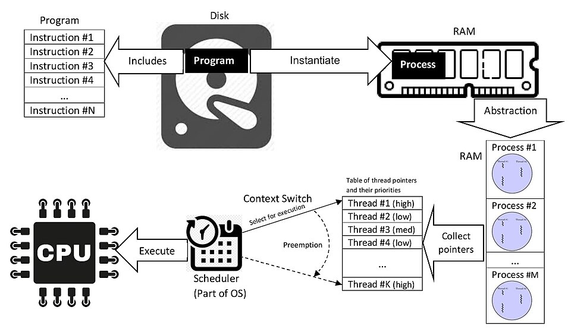

## Thread

> A thead is part of a process.

- A process can contain one or more threads.
- Threads within a process can share the memory space
- OS thread == Kernel thread == Platform Thread == Carrier Thread

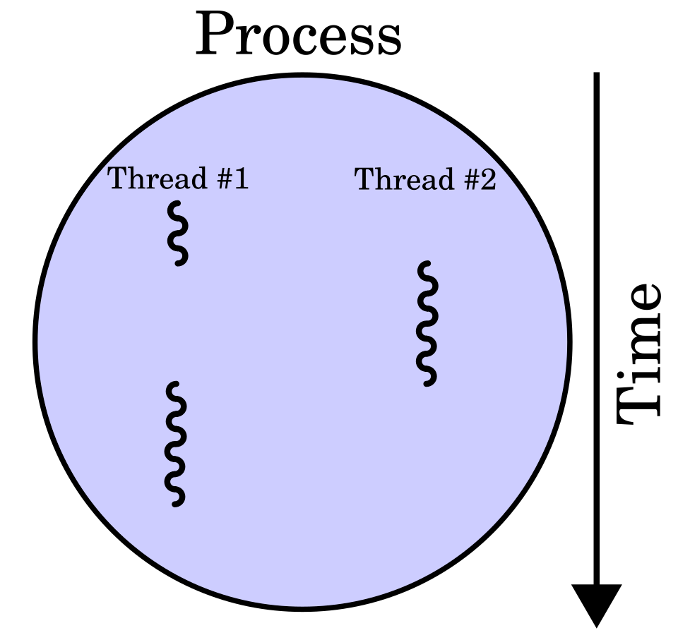

## Scheduler/CPU/Thread

Scenario: CPU with 3 threads

Operating system has a `scheduler`

Scheduler assigns the thread to the CPU for execution and will determine how long the thread can execute

Simplified Analogy:

- Modern CPUs can have multiple cores.
- Each core can be seen as a processor.

> Context-Switching is when the scheduler switches between threads for execution

When the scheduler switches from one thread to another, the current thread, execution point and the state it has to be stored so that it can be resumed later from the point where it was stopped.

## Java (Platform) Thread

- Java Thread was introduced ~25 year ago.
- 1 Java Thread = 1 OS Thread
- Note: OS Thread is the unit of scheduling.

When a Java thread executing multiple methods, the OS scheduler will keep switching threads.

So OS has to store the method's local variables and these function call information in the `stack memory`

> Heap memory is where we store objects (that are dynamically created e.g. ArrayList, HashMap)

> Stack memory will contain the local variables, object references and the function call information

The size of the stack memory is determined when the process starts or a thread is created and CANNOT be modified once the thread is created

## Microservice Communication

In the microservices architecture we have many of network calls

So a thread which is doing the request processing in the order service is often times is blocked because of the various network calls.

Problem: The thread is idle until all responses come back

```
              -> user-service     -> database call
order-service -> payment-service  -> database call
              -> shipping-service -> 3rd party api
              -> database call
```

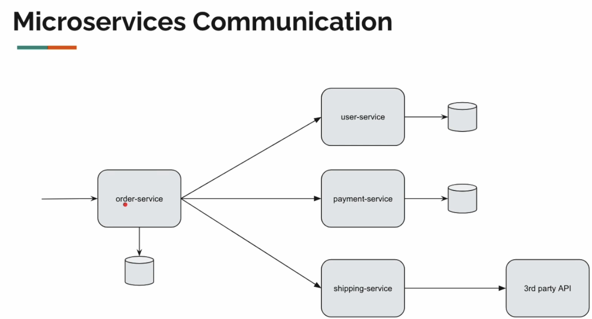

# 5. Platform Thread Limits Demo/Example

## IO using `Thread.sleep`

To simulate slow I/O calls, we will use `Thread.sleep`
Later we would develop application using Spring Boot web.

```java
// InboundOutboundTaskDemo.java
package com.vinsguru.sec01;

import java.util.concurrent.CountDownLatch;

// Demo some blocking operations with both platform and virtual threads
public class InboundOutboundTaskDemo {

  private static final int MAX_PLATFORM = 10_000;
  private static final int MAX_VIRTUAL = 20;

  public static void main(String[] args) throws InterruptedException {
    platformThreadDemo();
  }

  // Create a simple java Platform Thread
  private static void platformThreadDemo() {
    for (int i = 0; i < MAX_PLATFORM; i++) {
      int j = i;
      Thread thread = new Thread(() -> Task.ioIntensive(j));
      thread.start();
    }
  }
}
```

```java
// Task.java
package com.vinsguru.sec01;

import org.slf4j.Logger;
import org.slf4j.LoggerFactory;

import java.time.Duration;

public class Task {

  private static final Logger log = LoggerFactory.getLogger(Task.class);

  public static void ioIntensive(int i) {
    try {
      log.info("starting I/O task {}. Thread Info: {}", i, Thread.currentThread());
      Thread.sleep(Duration.ofSeconds(10));
      log.info("ending I/O task {}. Thread Info: {}", i, Thread.currentThread());
    } catch (InterruptedException e) {
      throw new RuntimeException(e);
    }
  }
}
```

# 6. Creating Platform Threads using `ThreadBuilder`

https://docs.oracle.com/en/java/javase/21/docs/api/java.base/java/lang/Thread.Builder.html

>

```java
package com.vinsguru.sec01;

import java.util.concurrent.CountDownLatch;

// Demo some blocking operations with both platform and virtual threads
public class InboundOutboundTaskDemo {

  private static final int MAX_PLATFORM = 10_000;
  private static final int MAX_VIRTUAL = 20;

  public static void main(String[] args) throws InterruptedException {
    platformThreadDemo();
  }

  // Create Platform Thread using Thread.Builder
  private static void platformThreadDemo() {
    Thread.Builder.OfPlatform builder = Thread.ofPlatform().name("platformThread-", 1);
    for (int i = 0; i < MAX_PLATFORM; i++) {
      int j = i;
      // Thread thread = Thread.Builder.unstarted(Runnable task);
      Thread thread = builder.unstarted(() -> Task.ioIntensive(j));
      thread.start();
    }
  }
}
```

```java
// Task.java
package com.vinsguru.sec01;

import org.slf4j.Logger;
import org.slf4j.LoggerFactory;

import java.time.Duration;

public class Task {

  private static final Logger log = LoggerFactory.getLogger(Task.class);

  public static void ioIntensive(int i) {
    try {
      log.info("starting I/O task {}. Thread Info: {}", i, Thread.currentThread());
      Thread.sleep(Duration.ofSeconds(10));
      log.info("ending I/O task {}. Thread Info: {}", i, Thread.currentThread());
    } catch (InterruptedException e) {
      throw new RuntimeException(e);
    }
  }
}
```

## Daemon Virutal Threads

### Creating Daemon Virtual Threads using `ThreadBuilder`

Daemon Thread = Thread that runs in the background

```java
package com.vinsguru.sec01;

import java.util.concurrent.CountDownLatch;

// Demo some blocking operations with both platform and virtual threads
public class InboundOutboundTaskDemo {

  private static final int MAX_PLATFORM = 10_000;
  private static final int MAX_VIRTUAL = 20;

  public static void main(String[] args) throws InterruptedException {
    platformThreadDemo();
  }

  // Create Platform DAEMON Thread using Thread.Builder
  private static void platformThreadDemo() throws InterruptedException {
    CountDownLatch latch = new CountDownLatch(MAX_PLATFORM);
    Thread.Builder.OfPlatform builder = Thread.ofPlatform().daemon().name("daemon", 1);
    for (int i = 0; i < MAX_PLATFORM; i++) {
      int j = i;
      // Thread thread = Thread.Builder.unstarted(Runnable task);
      Thread thread = builder.unstarted(() -> {
        Task.ioIntensive(j);
        latch.countDown();
      });
      thread.start();
    }
    latch.await();
  }
}
```

```java
// Task.java
package com.vinsguru.sec01;

import org.slf4j.Logger;
import org.slf4j.LoggerFactory;

import java.time.Duration;

public class Task {

  private static final Logger log = LoggerFactory.getLogger(Task.class);

  public static void ioIntensive(int i) {
    try {
      log.info("starting I/O task {}. Thread Info: {}", i, Thread.currentThread());
      Thread.sleep(Duration.ofSeconds(10));
      log.info("ending I/O task {}. Thread Info: {}", i, Thread.currentThread());
    } catch (InterruptedException e) {
      throw new RuntimeException(e);
    }
  }
}
```

### How to Make Application Wait?

- In our Daemon Thread demo, our main thread created ten background threads and it exited immediately.
- It will not wait for daemon threads to complete their task.
- This is how the daemon thread will work.

> Use `CountDownLatch` to force application to wait for background threads to finish

https://docs.oracle.com/en/java/javase/21/docs/api/java.base/java/util/concurrent/CountDownLatch.html

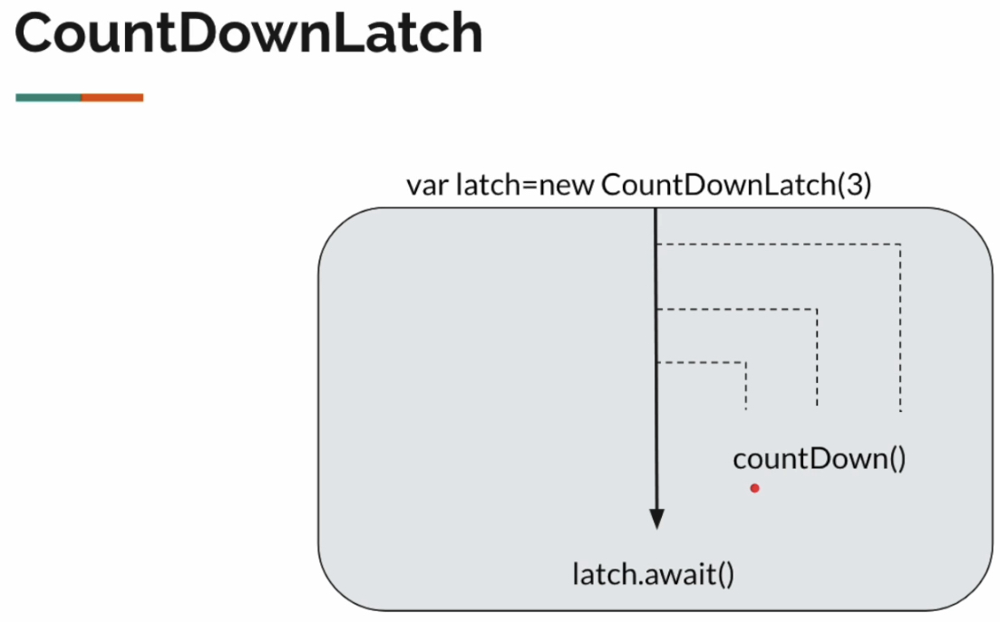

# 7. Virtual Thread Scaling

## Virtual Thread

- `public Thread (Platform Thread)`
  - `abstract BaseVirtualThread`
    - `(package private) VirtualThread`
      - Cannot directly create a virtual thread due to `package private` access (e.g. `new VirutalThread`)

So this is why Java has introduced the `Thread.Builder`, which we have already used to create platform threads

```java
void startThread(Thread thread) {
  thread.start();
}
```

## `Thread.Builder`

https://docs.oracle.com/en/java/javase/21/docs/api/java.base/java/lang/Thread.Builder.html

- `Thread.Builder`
  - `Thread.ofPlatform()`
  - `Thread.ofVirtual()`

```java
Thread createThread(Thread.Builder builder) {
  return builder.unstarted(() -> someTask());
}
```

## Creating Virutal Threads

```java
package com.vinsguru.sec01;

import java.util.concurrent.CountDownLatch;

// Demo some blocking operations with both platform and virtual threads
public class InboundOutboundTaskDemo {

  private static final int MAX_PLATFORM = 10_000;
  private static final int MAX_VIRTUAL = 20;

  public static void main(String[] args) throws InterruptedException {
    virtualThreadDemo();
  }

  // Create Virtual Thread using Thread.Builder
  // - Virtual threads are DAEMON by default
  // - Virtual threads do NOT have any default name
  private static void virtualThreadDemo() throws InterruptedException {
    CountDownLatch latch = new CountDownLatch(MAX_VIRTUAL);
    Thread.Builder.OfPlatform builder = Thread.ofVirtual().name("virtualThread-", 1);
    for (int i = 0; i < MAX_VIRTUAL; i++) {
      int j = i;
      Thread thread = builder.unstarted(() -> {
        Task.ioIntensive(j);
        latch.countDown();
      });
      thread.start();
    }
    latch.await();
  }
}
```

```java
// Task.java
package com.vinsguru.sec01;

import org.slf4j.Logger;
import org.slf4j.LoggerFactory;

import java.time.Duration;

public class Task {

  private static final Logger log = LoggerFactory.getLogger(Task.class);

  public static void ioIntensive(int i) {
    try {
      log.info("starting I/O task {}. Thread Info: {}", i, Thread.currentThread());
      Thread.sleep(Duration.ofSeconds(10));
      log.info("ending I/O task {}. Thread Info: {}", i, Thread.currentThread());
    } catch (InterruptedException e) {
      throw new RuntimeException(e);
    }
  }
}
```

# 8. How Virtual Threads work Internally

- Virtual Threads are simply an illusion provided by Java
  - It will look like a thread
  - It will accept a runnable
  - We can do `thread.start()` / `thread.join()`
  - **But the underlying OS CANNOT see them or schedule them**

- Can think of virtual threads as objects created in the heap
- Virtual threads are not platform threads (nothing is created at the OS level)
- Instead we should start seeing them as task that accepts a runnable (action to be executed)
- When we call `thread.start()`, all thee virtual thread will be added to an internal queue

## ForkJoinPool

`ForkJoinPool` is a specialized implementation of the `ExecutorService` interface in Java designed to efficiently manage and execute tasks, particularly those that can be broken down recursively into smaller tasks.

- Work-Stealing Algorithm
  - Each worker thread in the pool has its own double-ended queue (deque) of tasks.
  - If a thread runs out of tasks in its own queue, it "steals" a task from the tail of another busy thread's queue.
  - This keeps all processor cores active.
- Virtual Thread Scheduler:
  - In modern Java (specifically for Virtual Threads), the ForkJoinPool acts as the carrier pool.
  - It manages a small number of platform threads (OS threads)—usually equal to the number of CPU cores available.
- Carrier Threads:
  - When a virtual thread needs to run, the ForkJoinPool assigns it to one of these platform threads (mounting).
  - When the virtual thread blocks (e.g., waits for I/O), the ForkJoinPool unmounts it and lets the platform thread execute a different virtual thread.
- Parallelism:
  - Unlike standard thread pools, ForkJoinPool is optimized for maximizing CPU usage by ensuring threads are rarely idle, which is why it serves as the underlying engine for Virtual Threads.

The number of threads in the `ForkJoinPool` depends on the number of processors we have in our machine

```java
// Get number of processors on machine
int numProcessors = Runtime.getRuntime().availableProcessors();
```

> Virutal Threads are added to a task queue which are then picked up by Platform Threads to start execution

- When the Platform Thread encounters a blocking call such as `Thread.sleep` or a network call it parks the task (known as `parking`) and take the next task from the queue
- Once the blocking call finishes, then the virtual thread is unparked and put back onto the task queue (to be picked up again for execution by a Platform Thread)
- Since the virtual threads are tiny objects in the heap, and they cannot be directly executed on their own
- Virutal threads are mounted on a carrier/platform thread to execute the task.
- We call this action `mounting`
- Then we will be executing the task as part of the runnable.

```java
// These methods are abstracted by Java to return the names & states of the Virtual Thread (even though they are executed on the Platform/Carrier Thread)
Thead.currentThread().getName();
Thead.currentThread().getState();
```

```java
// https://github.com/openjdk/jdk/blob/master/src/java.base/share/classes/java/lang/VirtualThread.java
/**
 * Mounts this virtual thread onto the current platform thread. On
 * return, the current thread is the virtual thread.
 */
@ChangesCurrentThread
@ReservedStackAccess
private void mount() {
  startTransition(/*mount*/true);
  // We assume following volatile accesses provide equivalent
  // of acquire ordering, otherwise we need U.loadFence() here.

  // sets the carrier thread
  Thread carrier = Thread.currentCarrierThread();
  setCarrierThread(carrier);

  // sync up carrier thread interrupted status if needed
  if (interrupted) {
    carrier.setInterrupt();
  } else if (carrier.isInterrupted()) {
    synchronized (interruptLock) {
      // need to recheck interrupted status
      if (!interrupted) {
        carrier.clearInterrupt();
      }
    }
  }

  // set Thread.currentThread() to return this virtual thread
  carrier.setCurrentThread(this);
}
```

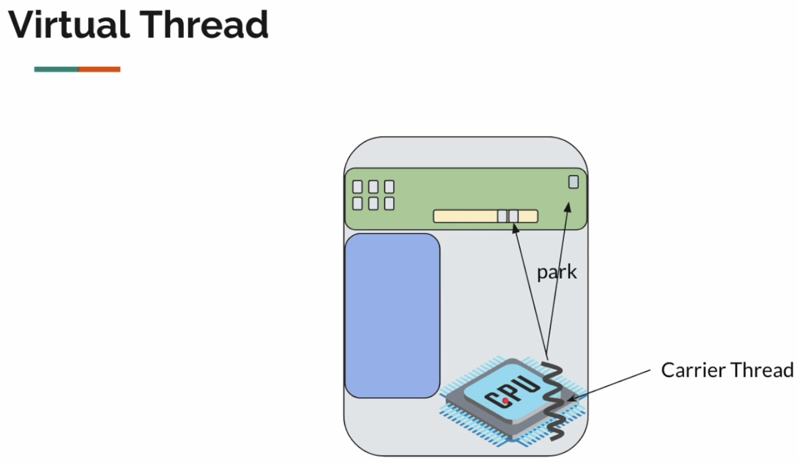
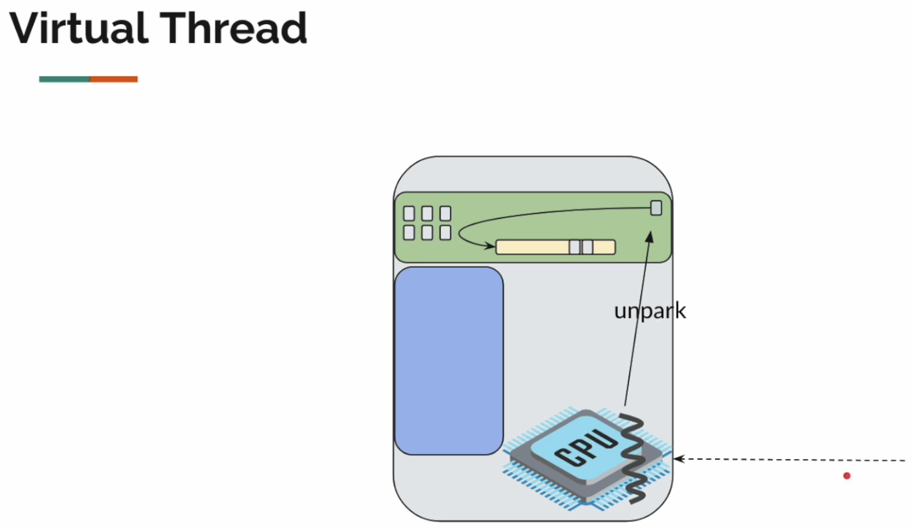

# 10. Virutal Threads & Stack Memory

## Stack Size

> Platform Threads have fixed stack size (e.g. 1MB / 2МB)

- Can be customized upon creation (but immutable after creation)

> Virtual Threads do NOT have fixed stack

- They have resizable stack known as Stack Chunk Object

> When a Platform Thread executes the Virutal Thread's runnable task and encounters a blocking call (e.g. IO or network call), the Platform Thread will transfer all the memory (e.g. method call, object references, stack traces, current context) in its own stack memory into the Virtual Thread's stack memory (`VirutalStack`) and park it

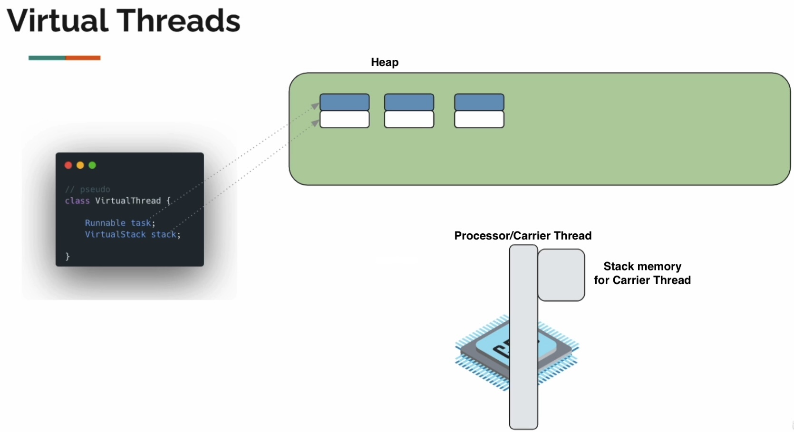
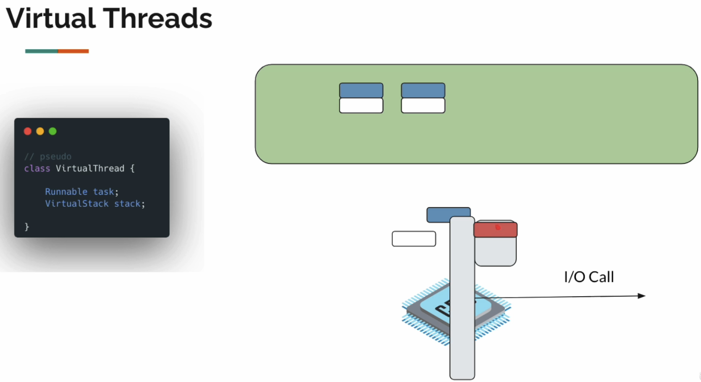
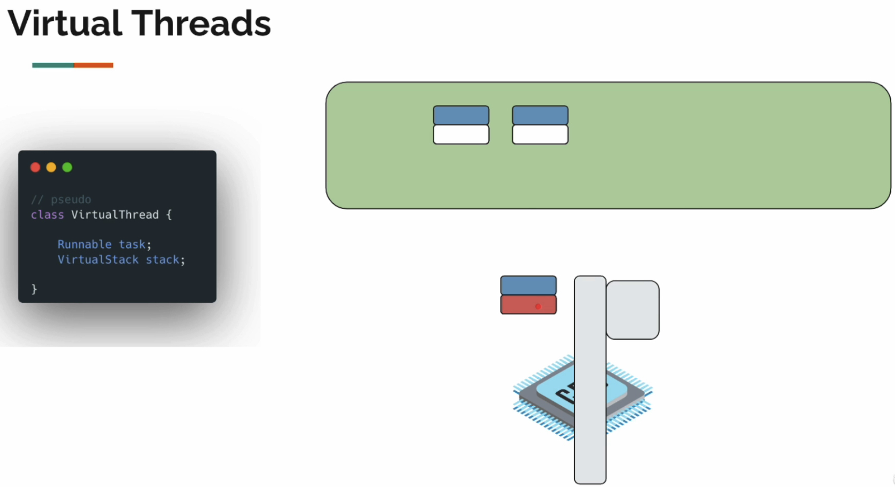
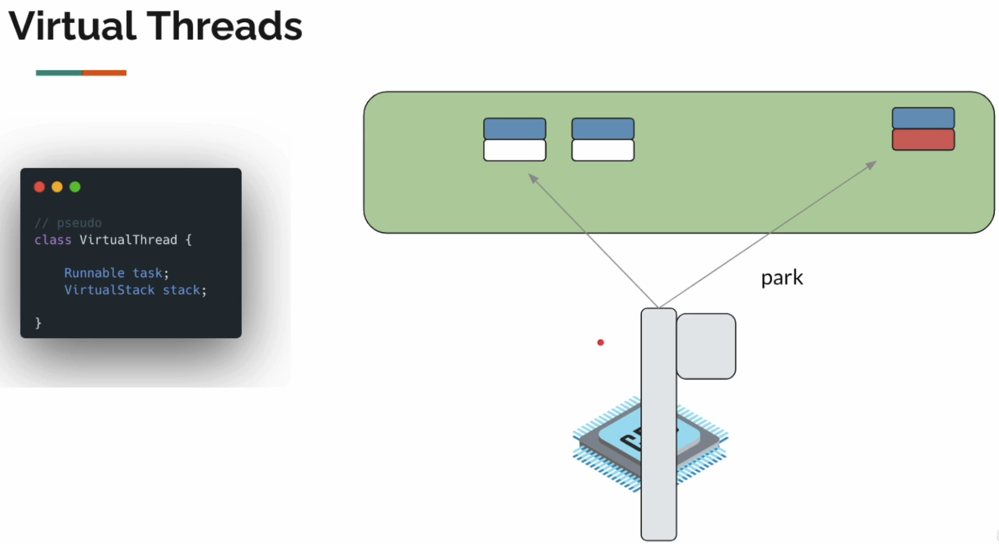
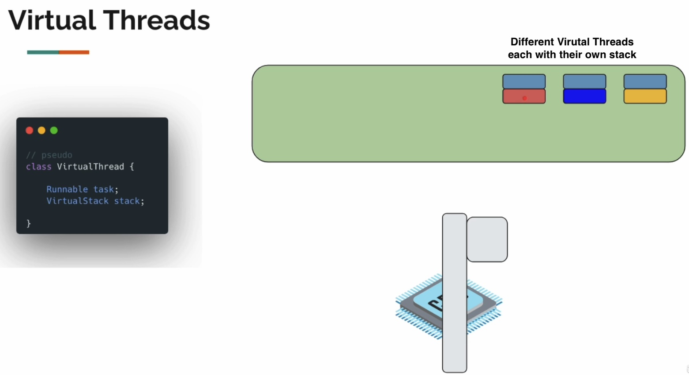
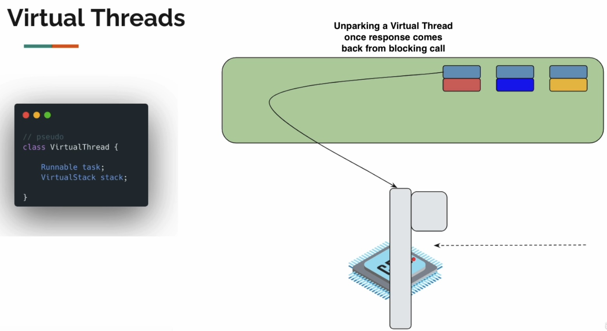

# 12-14. CPU Intensive Tasks

Example: We have 1 cpu with 1 thread that takes `a` seconds for the processor complete.
If we increase the number of threads by a factor of `x`, then the time taken would be `a * x` for the processor to complete.
This is because the scheduler must cycle/switch between all `x` new threads

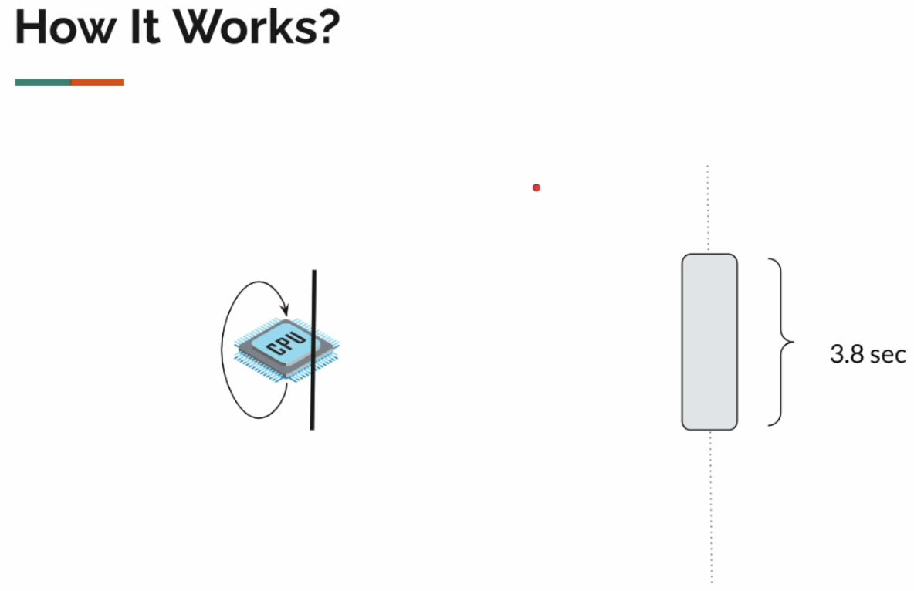
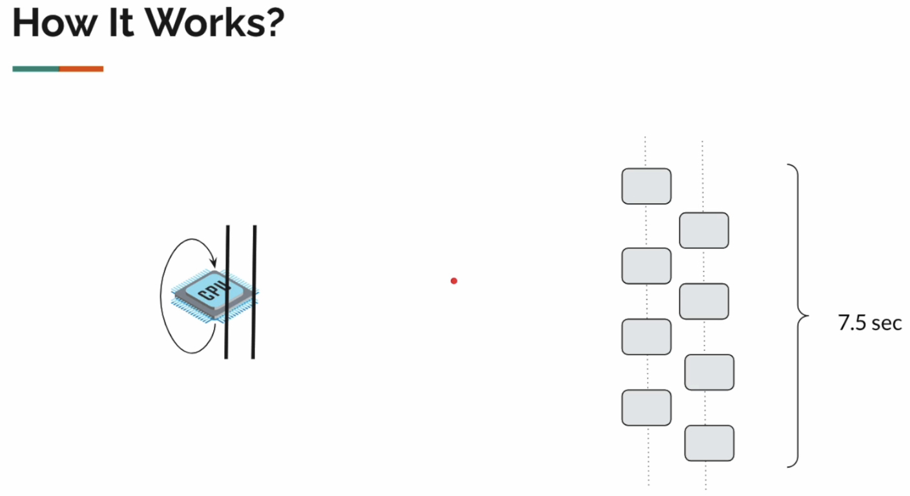
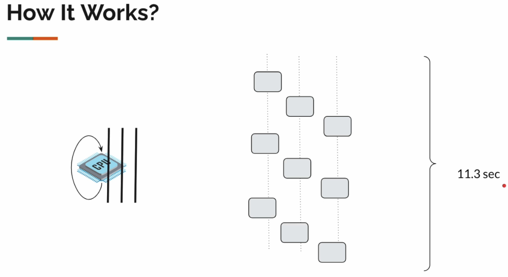

When we use a virtual thread, we simply create an object/task in the heap

This task is executed by a carrier thread (number of carrier threads = number of processors on the machine)

When we double the task count, we are simply doubling the number of objects/tasks in the heap

The difference between virtual threads and platform threads

- If there is only a single processor and multiple platform threads, then the single processor must continuously switch between the threads
- Parking/unparking only happens during blocking IO calls.
  - Hence if the task is purely CPU intensive, then NO parking/unparking will occur and the carrier thread will execute the tasks to completion (one-by-one)
- This will make it seem like virtual threads are performing faster than platform threads (3.8 seconds compared to 11 seconds), however we must remember that the platform threads are continuously being executed/switched between
- Hence for CPU intensive tasks, there is no difference in time efficiency between platform and virtual threads

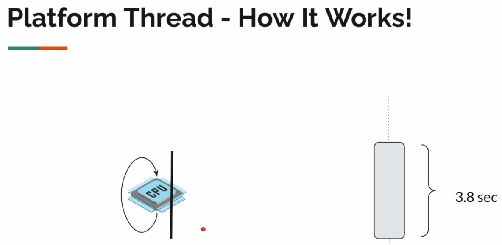
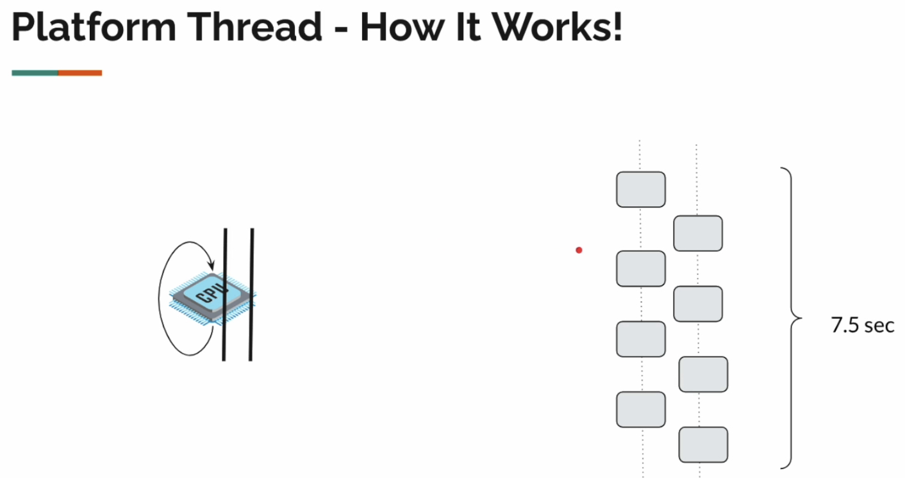
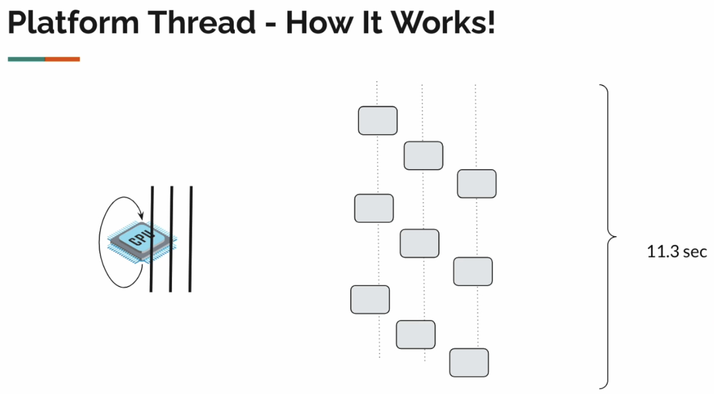
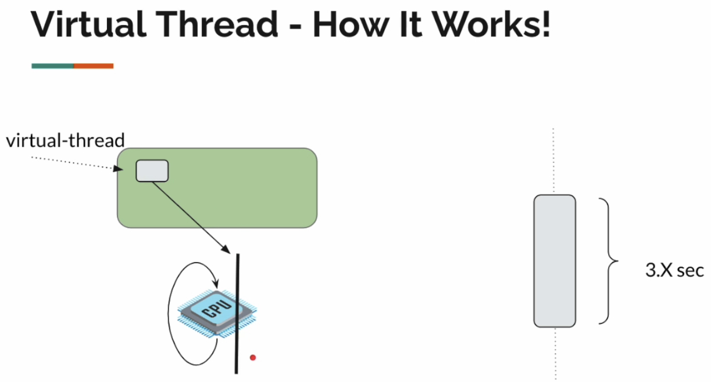
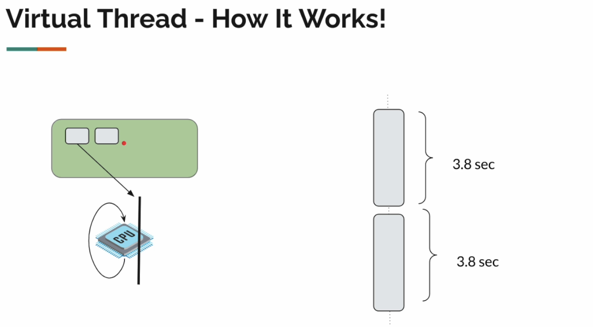
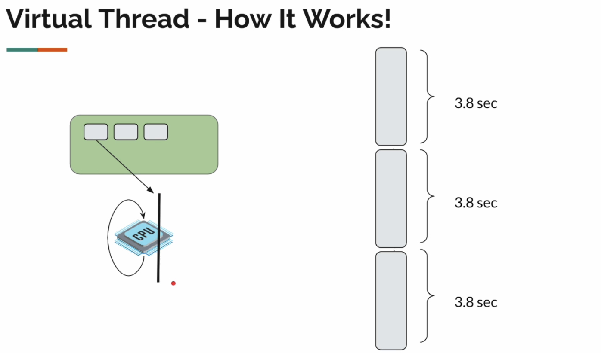
