# Table of Contents

- [Table of Contents](#table-of-contents)
- [Level-Order Traversal](#level-order-traversal)
    - [Step 1](#step-1)
    - [Step 2](#step-2)
    - [Step 3](#step-3)
    - [Step 4](#step-4)
    - [Step 4](#step-4-1)
    - [Step 5](#step-5)
    - [Step 6](#step-6)
    - [Step 7](#step-7)
    - [Step 8](#step-8)
    - [Step 9](#step-9)
    - [Step 10](#step-10)
    - [Step 11](#step-11)
    - [Step 12](#step-12)
    - [Step 13](#step-13)
    - [Step 14](#step-14)
    - [Step 15](#step-15)
    - [Step 16](#step-16)
    - [Step 17](#step-17)

# Level-Order Traversal

- Level-order traversal is to traverse the tree level by level
- Breadth-First Search is an algorithm to traverse or search in data structures like a tree or a graph.

  - The algorithm starts with a root node and visit the node itself first.
  - Then traverse its neighbors, traverse its second level neighbors, traverse its third level neighbors, so on and so forth.

- When we do breadth-first search in a tree, the order of the nodes we visited is in level order.

- Note: in the following animation, the highlighting in red indicates that we return from the visit of the node.
- The order of the visit is indicated on the array right below the binary tree.

### Step 1

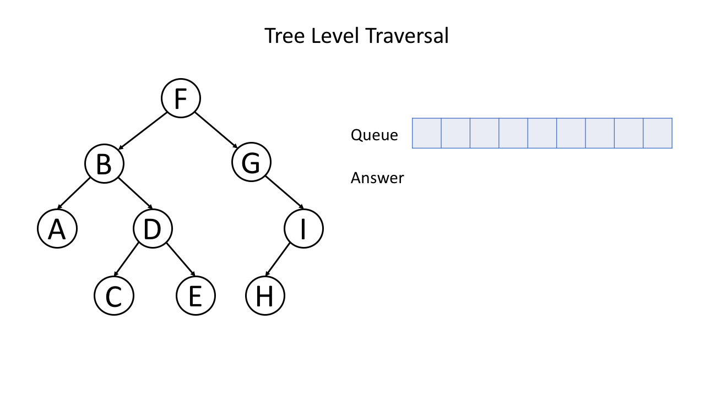

### Step 2

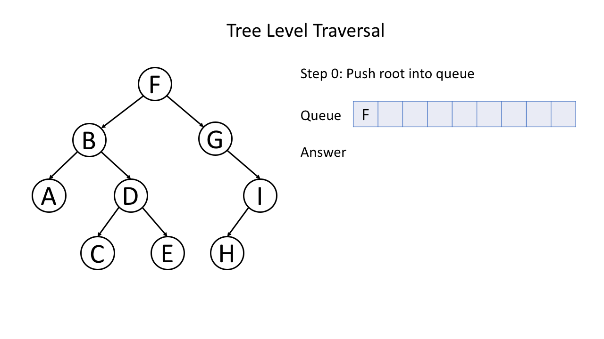

### Step 3

### Step 4

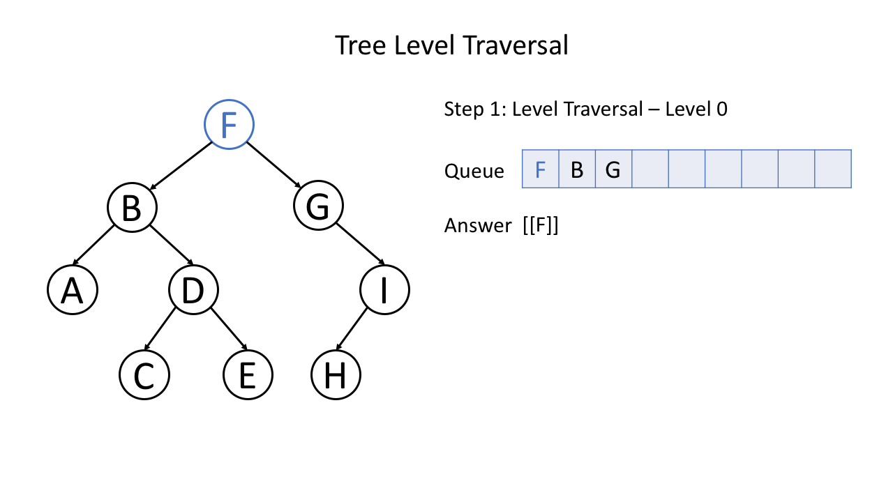

### Step 4

### Step 5

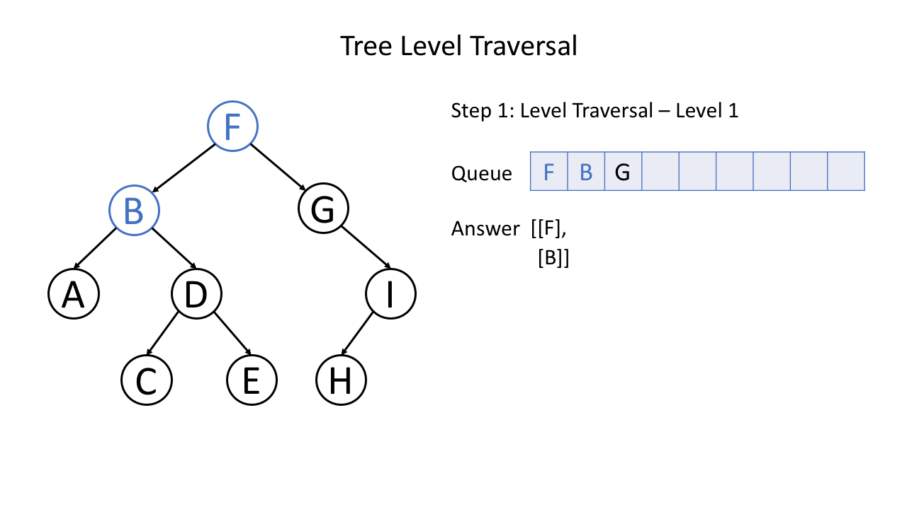

### Step 6

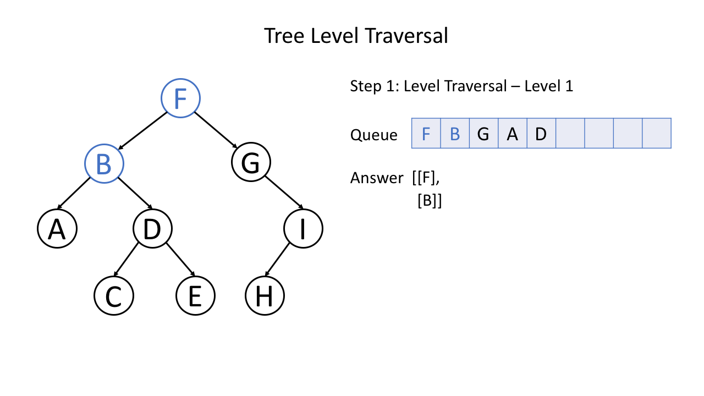

### Step 7

### Step 8

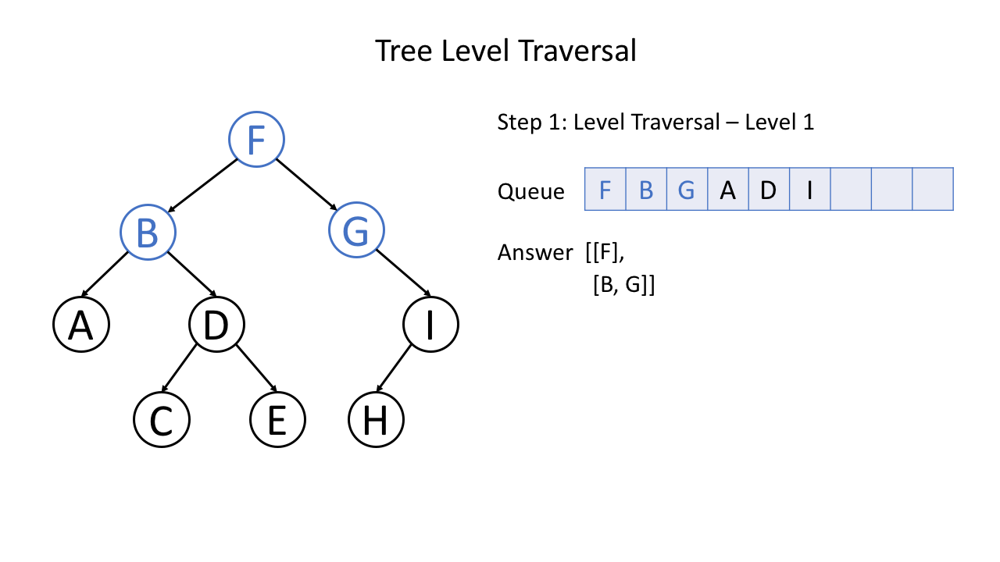

### Step 9

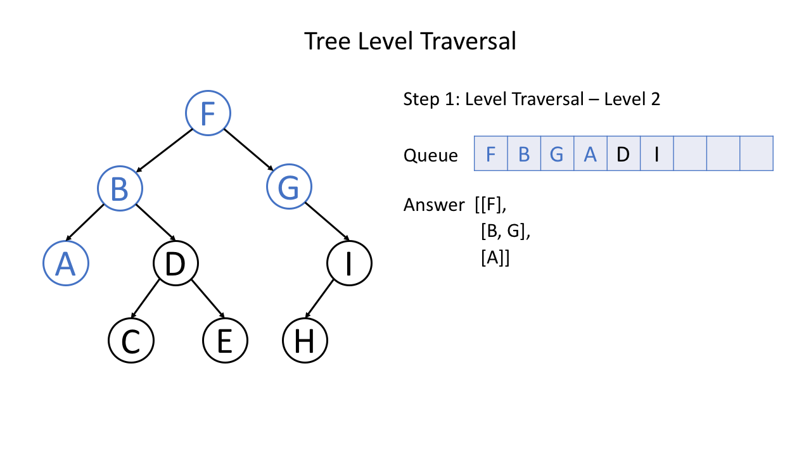

### Step 10

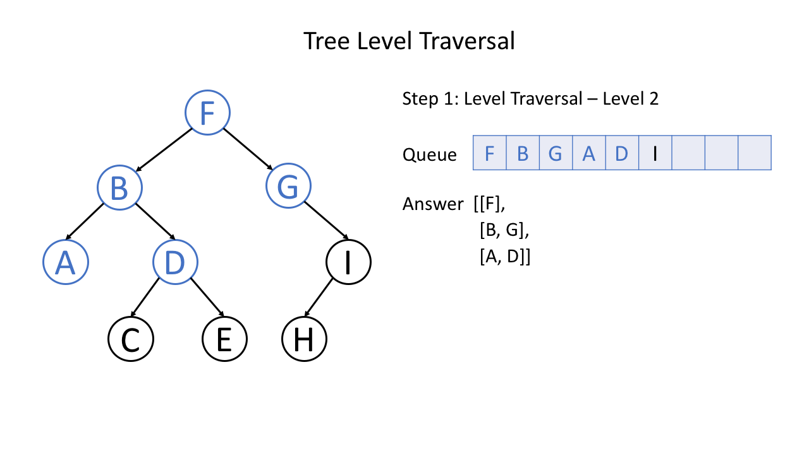

### Step 11

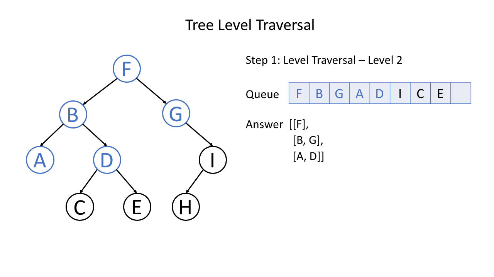

### Step 12

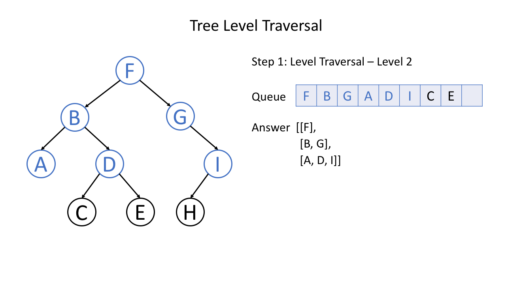

### Step 13

### Step 14

### Step 15

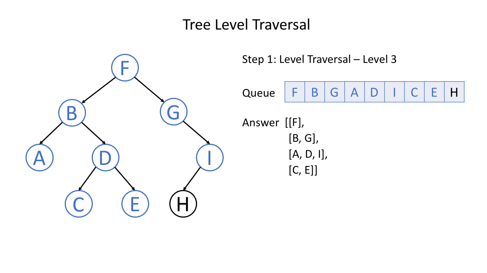

### Step 16

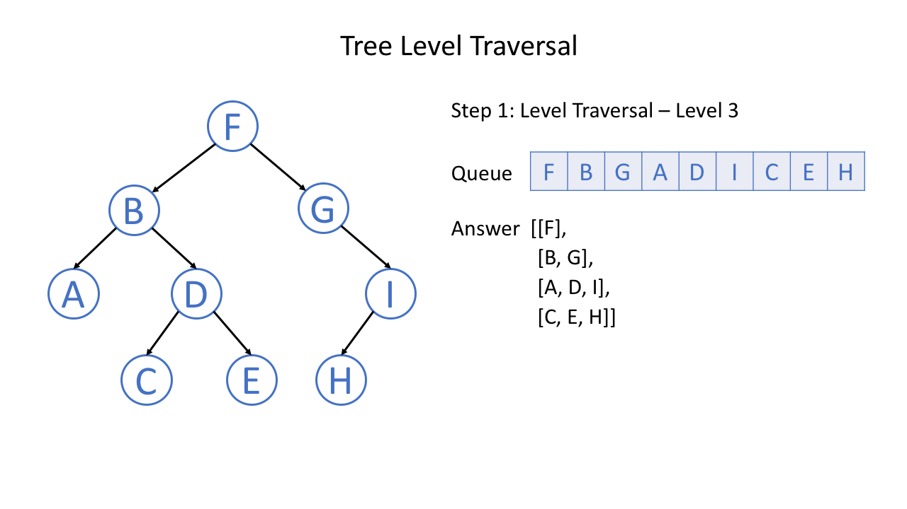

### Step 17

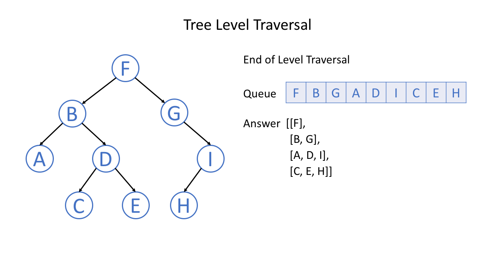
