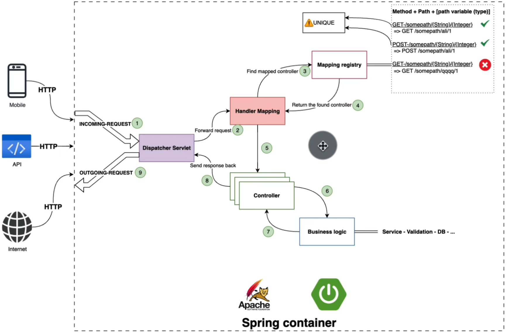
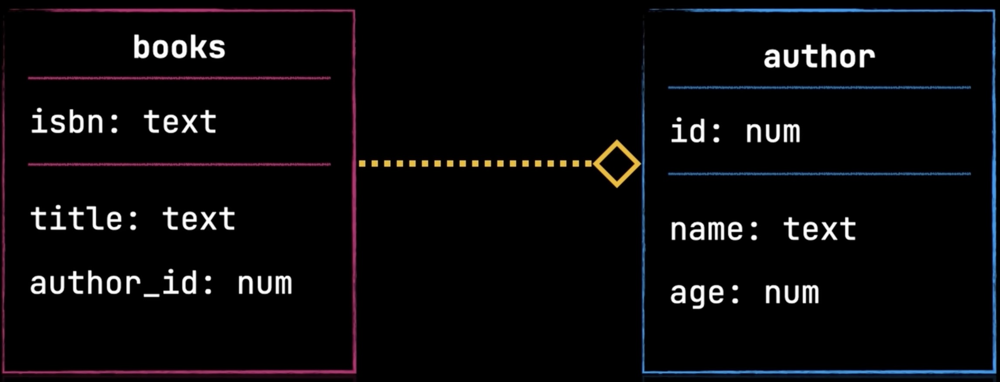
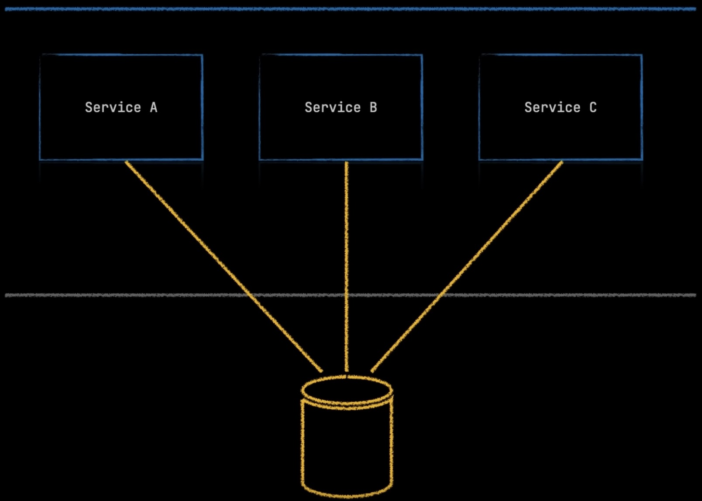
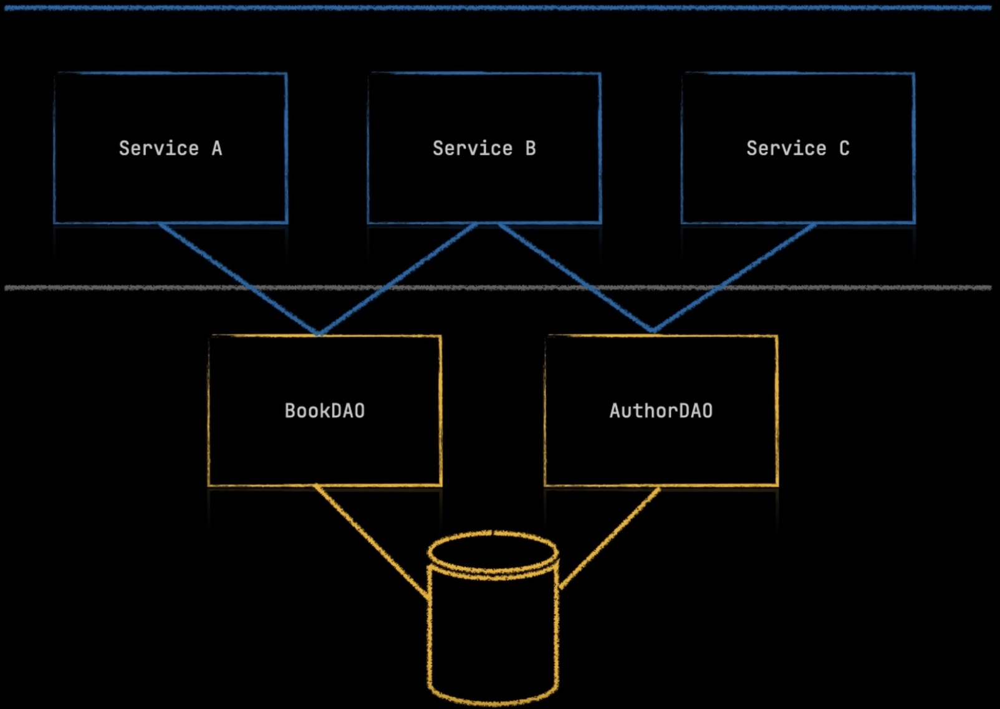
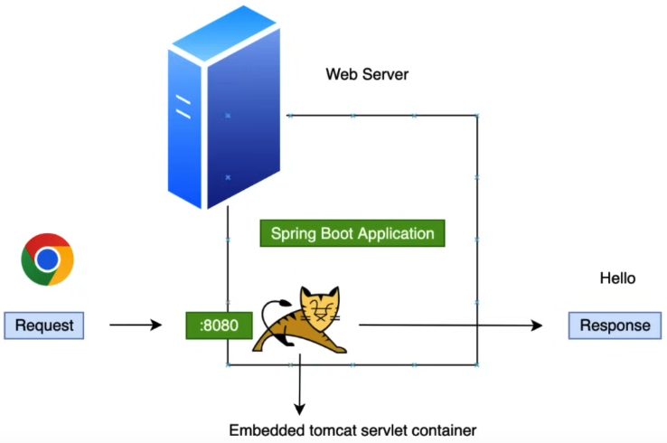
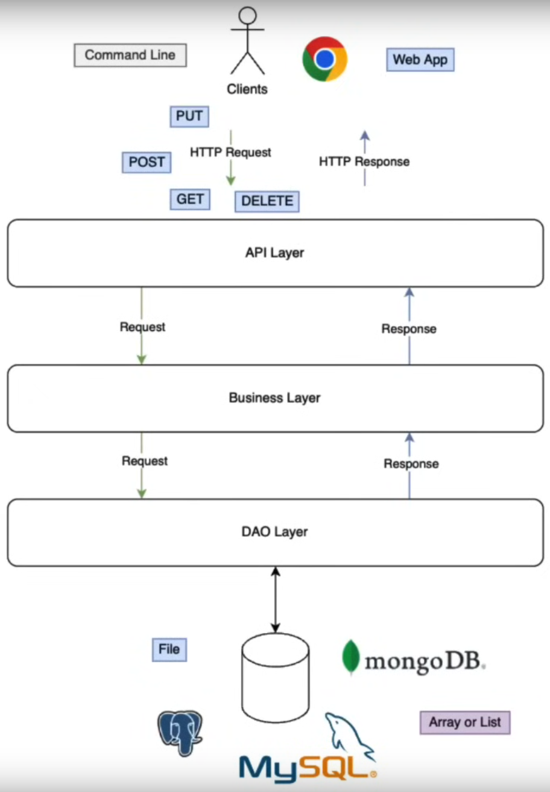
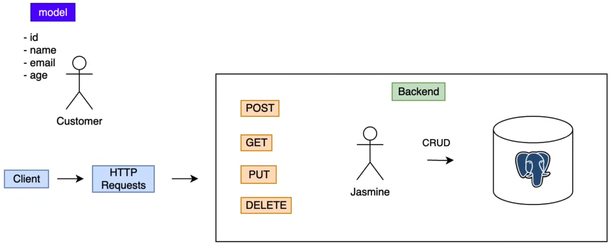
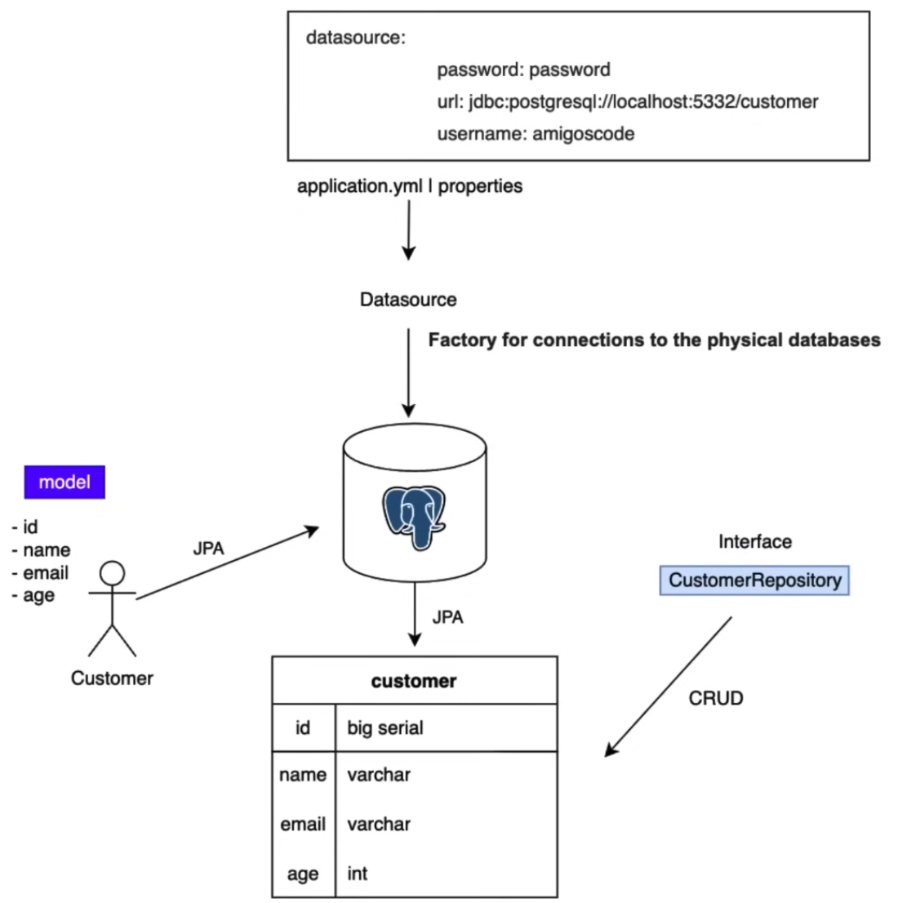

# Table of Contents

- [Table of Contents](#table-of-contents)
- [Official Docs](#official-docs)
  - [Maven](#maven)
  - [Spring Framework](#spring-framework)
  - [Spring Boot](#spring-boot)
  - [Spring HTTP Package (under Spring Framework)](#spring-http-package-under-spring-framework)
  - [Spring WebFlux](#spring-webflux)
  - [Spring Test](#spring-test)
  - [Spring Security](#spring-security)
  - [SpringDoc](#springdoc)
  - [Jackson](#jackson)
  - [Lombok](#lombok)
  - [JUnit5](#junit5)
  - [Mockito](#mockito)
  - [MockWebServer](#mockwebserver)
  - [Reactive Streams](#reactive-streams)
  - [Project Reactor](#project-reactor)
  - [Netty](#netty)
- [Playground](#playground)
  - [Simple Rest API (No DB)](#simple-rest-api-no-db)
- [Resources](#resources)
- [Miscellaneous](#miscellaneous)
  - [Dependency Injection (DI)](#dependency-injection-di)
  - [Inversion of Control (IOC)](#inversion-of-control-ioc)
  - [Annotations/Decorators](#annotationsdecorators)
    - [Class Level Annotations/Decorators](#class-level-annotationsdecorators)
    - [Method Level Annotations/Decorators](#method-level-annotationsdecorators)
      - [`@Bean`](#bean)
    - [`@Component` vs `@Service`](#component-vs-service)
- [HowToDoInJava](#howtodoinjava)
  - [Accessing Properties in Spring Boot (`@Value` + `@ConfigurationProperties`) - HowToDoInJava](#accessing-properties-in-spring-boot-value--configurationproperties---howtodoinjava)
    - [Register Properties Files with `@PropertySource`](#register-properties-files-with-propertysource)
      - [Spring Boot Automatically Loads `application.properties`](#spring-boot-automatically-loads-applicationproperties)
        - [How to Specify Which Spring Profile to Use](#how-to-specify-which-spring-profile-to-use)
      - [Loading Custom Properties Files](#loading-custom-properties-files)
      - [Duplicate Property Resolution](#duplicate-property-resolution)
    - [Inject Property Values with @Value](#inject-property-values-with-value)
      - [Insert a List of Values in an Array/List](#insert-a-list-of-values-in-an-arraylist)
    - [Bind Fields to Property Values with @ConfigurationProperties](#bind-fields-to-property-values-with-configurationproperties)
    - [Validate Property Values](#validate-property-values)
    - [Include Additional Configuration Files](#include-additional-configuration-files)
- [Spring Boot - Bouali Ali](#spring-boot---bouali-ali)
  - [Spring Framework Intro](#spring-framework-intro)
    - [Core Features of Spring Framework](#core-features-of-spring-framework)
    - [Spring Beans - Spring Framework](#spring-beans---spring-framework)
      - [What is a Spring Bean](#what-is-a-spring-bean)
      - [Configuring a Bean using `@Configuration` Annotation/Decorator Example](#configuring-a-bean-using-configuration-annotationdecorator-example)
    - [Spring Component - Spring Framework](#spring-component---spring-framework)
      - [Spring Component Sample](#spring-component-sample)
      - [Bean Naming](#bean-naming)
  - [Dependency Injection](#dependency-injection)
    - [Constructor Injection](#constructor-injection)
    - [`@Qualifier` annotation/decorator](#qualifier-annotationdecorator)
    - [`@Primary` annotation/decorator](#primary-annotationdecorator)
    - [Field Injection](#field-injection)
    - [Method Injection](#method-injection)
    - [Setter Injection](#setter-injection)
    - [Official Recommendation](#official-recommendation)
  - [Bean Scoping](#bean-scoping)
  - [Special Spring Beans](#special-spring-beans)
    - [Environment](#environment)
      - [Environment Abstraction](#environment-abstraction)
      - [Injectable](#injectable)
    - [Bean Profiles](#bean-profiles)
      - [Profile Activation - Programmatically](#profile-activation---programmatically)
      - [Profile Activation - Properties File](#profile-activation---properties-file)
  - [`@Value` Annotation/Decorator](#value-annotationdecorator)
  - [Best Practices](#best-practices)
  - [Spring Initializr](#spring-initializr)
  - [Spring Boot](#spring-boot-1)
  - [IntelliJ Project Setup](#intellij-project-setup)
  - [Create First Bean Class](#create-first-bean-class)
    - [NOT Using Dependency Injection](#not-using-dependency-injection)
    - [Using Dependency Injection](#using-dependency-injection)
      - [Using the `@Component`, `@Service`, `@Repository` Annotations/Decorators](#using-the-component-service-repository-annotationsdecorators)
      - [Splitting Components](#splitting-components)
  - [Bean Naming](#bean-naming-1)
  - [Dependency Injection](#dependency-injection-1)
    - [Constructor Injection](#constructor-injection-1)
    - [Multiple Beans of the Same Type](#multiple-beans-of-the-same-type)
      - [Using `@Qualifier` Annotation/Decorator](#using-qualifier-annotationdecorator)
      - [Using `@Primary` annotation/decorator](#using-primary-annotationdecorator)
    - [Field Injection](#field-injection-1)
    - [Method Injection](#method-injection-1)
    - [Setter Injection](#setter-injection-1)
  - [Spring Special Beans](#spring-special-beans)
    - [Environment Bean](#environment-bean)
    - [Property File - `@PropertySource` Annotation/Decorator](#property-file---propertysource-annotationdecorator)
    - [Multiple Property Files - `@PropertySources` Annotation/Decorator](#multiple-property-files---propertysources-annotationdecorator)
    - [Injecting Values from `application.properties` into Java Class using `@Value` Annotation/Decorator](#injecting-values-from-applicationproperties-into-java-class-using-value-annotationdecorator)
  - [Spring Profiles](#spring-profiles)
    - [Method 1 - Set Active Profile using IntelliJ](#method-1---set-active-profile-using-intellij)
    - [Method 2 - Set Active Profile in `application.properties`](#method-2---set-active-profile-in-applicationproperties)
    - [Method 3 - Set Active Profile using Variables](#method-3---set-active-profile-using-variables)
    - [Make Bean Available for Specific Profile using `@Profile` Annotation/Decorator](#make-bean-available-for-specific-profile-using-profile-annotationdecorator)
    - [Make Class Available for Specific Profile using `@Profile` Annotation/Decorator](#make-class-available-for-specific-profile-using-profile-annotationdecorator)
  - [Spring Rest](#spring-rest)
    - [Overview](#overview)
    - [Resource Design](#resource-design)
      - [API Endpoint](#api-endpoint)
    - [HTTP Methods](#http-methods)
    - [HTTP Response Status Codes](#http-response-status-codes)
    - [`@RestController` Annotation/Decorator](#restcontroller-annotationdecorator)
    - [`@ResponseStatus` Annotation/Decorator](#responsestatus-annotationdecorator)
    - [Simple Example](#simple-example)
    - [Sending Complex Object Example](#sending-complex-object-example)
    - [Customising JSON Fields](#customising-json-fields)
    - [Using Java Records](#using-java-records)
    - [Passing Path Parameters to Method using `@PathVariable` Annotation/Decorator](#passing-path-parameters-to-method-using-pathvariable-annotationdecorator)
    - [Passing Request Parameters to Method using `@RequestParam` Annotation/Decorator](#passing-request-parameters-to-method-using-requestparam-annotationdecorator)
    - [Path Parameters vs Request Parameters](#path-parameters-vs-request-parameters)
  - [Spring Data JPA](#spring-data-jpa)
    - [`@Entity`, `@Id` Annotation/Decorator](#entity-id-annotationdecorator)
    - [`@Table`, `@Column`, `@GeneratedValue` Annotation/Decorator](#table-column-generatedvalue-annotationdecorator)
    - [`JpaRepository` Interface](#jparepository-interface)
    - [`@GetMapping` - Searching for Objects](#getmapping---searching-for-objects)
    - [`@DeleteMapping`](#deletemapping)
    - [Adding Relationships to Entity using `@OnetoOne`, `@OneToMany` Annotation/Decorator](#adding-relationships-to-entity-using-onetoone-onetomany-annotationdecorator)
    - [Adding Relationships to Entity using School Repository](#adding-relationships-to-entity-using-school-repository)
  - [Data Transfer Object (DTO) Pattern](#data-transfer-object-dto-pattern)
  - [Service Layer](#service-layer)
  - [Ways to Organise Repo](#ways-to-organise-repo)
    - [By Feature](#by-feature)
    - [By Layer](#by-layer)
    - [By Business Domain](#by-business-domain)
    - [By Component](#by-component)
  - [Reorganising Repo Folder Structure](#reorganising-repo-folder-structure)
  - [Data Validation](#data-validation)
    - [Catch Exception and Throw Custom Error Message for User](#catch-exception-and-throw-custom-error-message-for-user)
  - [Spring Test](#spring-test-1)
    - [Creating Tests in IntelliJ](#creating-tests-in-intellij)
    - [`@BeforeEach` Annotation/Decorator](#beforeeach-annotationdecorator)
    - [`@AfterEach` Annotation/Decorator](#aftereach-annotationdecorator)
    - [`@BeforeAll` Annotation/Decorator](#beforeall-annotationdecorator)
    - [`AfterAll` Annotation/Decorator](#afterall-annotationdecorator)
    - [StudentMapper Test Example](#studentmapper-test-example)
    - [Test Isolation with Mockito](#test-isolation-with-mockito)
- [Spring Boot - Devtiro](#spring-boot---devtiro)
  - [QuickStart](#quickstart)
    - [Spring Initializr](#spring-initializr-1)
  - [Building the QuickStart App](#building-the-quickstart-app)
  - [Quickstart App Explainer](#quickstart-app-explainer)
  - [Apache Maven (build tool)](#apache-maven-build-tool)
    - [Maven Concepts](#maven-concepts)
      - [mvnw clean](#mvnw-clean)
      - [mvnw default](#mvnw-default)
      - [mvnw site](#mvnw-site)
    - [Maven Project Structure](#maven-project-structure)
    - [Maven Workflow](#maven-workflow)
    - [Maven Spring Boot Plugin](#maven-spring-boot-plugin)
  - [Spring Framework vs Spring Boot](#spring-framework-vs-spring-boot)
    - [Spring App Layers](#spring-app-layers)
      - [Persistence Layer](#persistence-layer)
      - [Service Layer](#service-layer-1)
      - [Presentation Layer](#presentation-layer)
    - [Modularity](#modularity)
  - [Inversion of Control + Dependency Injection](#inversion-of-control--dependency-injection)
  - [Beans](#beans)
    - [Method 1: Via Configuration File](#method-1-via-configuration-file)
    - [Method 2: Via `@Component` Annotation/Decorator](#method-2-via-component-annotationdecorator)
  - [Component Scanning](#component-scanning)
  - [`@SpringBootApplication` Annotation/Decorator](#springbootapplication-annotationdecorator)
  - [`@AutoConfiguration` Annotation/Decorators](#autoconfiguration-annotationdecorators)
  - [Config Files](#config-files)
  - [Environment Variables](#environment-variables)
  - [Configuration Properties](#configuration-properties)
    - [`@ConfigurationProperties` Annotation/Decorator](#configurationproperties-annotationdecorator)
    - [`@Configuration` Annotation/Decorator](#configuration-annotationdecorator)
  - [Database Layers](#database-layers)
  - [Connect to H2 Database (In-Memory DB)](#connect-to-h2-database-in-memory-db)
  - [Connect to PostgreSQL](#connect-to-postgresql)
    - [Starting PostgreSQL Container](#starting-postgresql-container)
    - [Initialise DB Schema](#initialise-db-schema)
  - [JDBCTemplate Setup](#jdbctemplate-setup)
  - [Data Access Objects (DAO)](#data-access-objects-dao)
    - [Setup DAO](#setup-dao)
      - [Integration Test DAO with H2 In-Memory DB](#integration-test-dao-with-h2-in-memory-db)
    - [Creating DAOs (Create/Insert Method)](#creating-daos-createinsert-method)
      - [Author](#author)
      - [Book](#book)
    - [Reading DAOs (Read/Find Method)](#reading-daos-readfind-method)
    - [Read/Find One](#readfind-one)
      - [Author](#author-1)
      - [Book](#book-1)
  - [Integration Test](#integration-test)
  - [Find Many Methods](#find-many-methods)
    - [Author](#author-2)
    - [Book](#book-2)
  - [Update (Full)](#update-full)
    - [Author](#author-3)
    - [Book](#book-3)
  - [Delete](#delete)
    - [Author](#author-4)
    - [Book](#book-4)
  - [Spring Data JPA Setup](#spring-data-jpa-setup)
  - [Create Entities (change domain objects to entities)](#create-entities-change-domain-objects-to-entities)
  - [Hibernate Auto DDL](#hibernate-auto-ddl)
- [Spring Boot 3 - Amigoscode](#spring-boot-3---amigoscode)
  - [Spring Initializr](#spring-initializr-2)
  - [Project Setup](#project-setup)
  - [pom.xml](#pomxml)
  - [Getting Started](#getting-started)
    - [Deleting Default Files](#deleting-default-files)
    - [Starting From Scratch](#starting-from-scratch)
  - [Embedded Web Server (Apache Tomcat)](#embedded-web-server-apache-tomcat)
  - [Configuring Embedded Web Server](#configuring-embedded-web-server)
  - [First API](#first-api)
  - [Annotations/Decorators](#annotationsdecorators-1)
    - [Spring Boot](#spring-boot-2)
    - [`@SpringBootApplication`](#springbootapplication)
      - [`@EnableAutoConfiguration`](#enableautoconfiguration)
    - [Spring](#spring)
      - [`@Bean`](#bean-1)
      - [`@Component`](#component)
      - [`@ComponentScan`](#componentscan)
      - [`@Configuration`](#configuration)
      - [`@Service`](#service)
      - [`@Repository`](#repository)
      - [`@Autowired`](#autowired)
      - [`@Qualifier`](#qualifier)
      - [`@PropertySource`](#propertysource)
    - [Spring Web MVC](#spring-web-mvc)
      - [`@Controller`](#controller)
      - [`@RestController`](#restcontroller)
      - [`@ResponseBody`](#responsebody)
      - [`@RequestBody`](#requestbody)
      - [`@RequestMapping(method=RequestMethod.GET, value="/path")`](#requestmappingmethodrequestmethodget-valuepath)
      - [`@GetMapping(value="/path")`](#getmappingvaluepath)
      - [`@PostMapping(value="/path")`](#postmappingvaluepath)
      - [`@PutMapping(value="/path")`](#putmappingvaluepath)
      - [`@DeleteMapping(value="/path")`](#deletemappingvaluepath)
      - [`@RequestParam(value="name", defaultValue="Hello")`](#requestparamvaluename-defaultvaluehello)
      - [`@PathVariable("placeholderName")`](#pathvariableplaceholdername)
  - [JSON for Java](#json-for-java)
    - [Records](#records)
  - [Java Objects to JSON Objects](#java-objects-to-json-objects)
  - [N Tier Diagram](#n-tier-diagram)
  - [Model](#model)
  - [DB + JPA Overview](#db--jpa-overview)
  - [PostgreSQL + Docker](#postgresql--docker)
  - [Installing PostgreSQL Driver and Spring Data JPA Dependencies](#installing-postgresql-driver-and-spring-data-jpa-dependencies)
- [Spring Boot Unit Testing - Teddy](#spring-boot-unit-testing---teddy)
  - [Repository Unit Tests](#repository-unit-tests)
    - [Pokemon Repository Tests](#pokemon-repository-tests)
    - [Review Repository Tests](#review-repository-tests)
  - [Service Layer Tests](#service-layer-tests)
    - [Pokemon Service Tests](#pokemon-service-tests)
    - [Review Service Tests](#review-service-tests)
  - [Controller Layer Tests](#controller-layer-tests)
    - [Pokemon Controller Tests](#pokemon-controller-tests)
    - [Review Controller Tests](#review-controller-tests)
- [Spring MVC - Teddy](#spring-mvc---teddy)
  - [MVC](#mvc)
    - [Controller Layer](#controller-layer)
    - [Model Layer](#model-layer)
    - [View Layer](#view-layer)
    - [Dispatcher Servlet](#dispatcher-servlet)
- [Spring Boot - Teddy](#spring-boot---teddy)
  - [Intro](#intro)
  - [Spring Initialiser](#spring-initialiser)
  - [File Structure](#file-structure)
  - [Architecture Overview](#architecture-overview)
    - [Spring Core](#spring-core)
    - [Infrastructure](#infrastructure)
    - [Data Access](#data-access)
    - [Web](#web)
    - [Repository Pattern / Dependency Injection / Inversion of Control](#repository-pattern--dependency-injection--inversion-of-control)
  - [Models](#models)
    - [Method 1 (Traditional)](#method-1-traditional)
    - [Method 2 (Lombok)](#method-2-lombok)
  - [Setup Spring Data](#setup-spring-data)
    - [Spring Data JPA](#spring-data-jpa-1)
  - [Controllers](#controllers)
    - [Testing API with Postman](#testing-api-with-postman)
  - [`@PathVariable`](#pathvariable)
  - [`@RequestBody`](#requestbody-1)
  - [JpaRepository + N-Tier Architecture](#jparepository--n-tier-architecture)
    - [Control Flow](#control-flow)
    - [Inheritance Flow](#inheritance-flow)
  - [Services \& Autowired](#services--autowired)
    - [Data Transfer Object (DTO)](#data-transfer-object-dto)
  - [GetAll + Mapping](#getall--mapping)
  - [Exception Handling](#exception-handling)
    - [Per Exception](#per-exception)
    - [Per Controller](#per-controller)
    - [Global Exception Handling](#global-exception-handling)
  - [Detail + Update + Delete Pokemon Endpoints](#detail--update--delete-pokemon-endpoints)
  - [Pagination](#pagination)
  - [One-To-Many Relationships](#one-to-many-relationships)
  - [Query Methods](#query-methods)
    - [Insert Raw SQL](#insert-raw-sql)
    - [Pokemon Project Continued](#pokemon-project-continued)
  - [Detail + Update + Delete Review Endpoints](#detail--update--delete-review-endpoints)
    - [Review Exception](#review-exception)

# Official Docs

## Maven

- [Maven - Guide Index](https://maven.apache.org/guides/index.html)
- [Maven - User Index](https://maven.apache.org/users/index.html)
- [Maven - `Pom` Reference](https://maven.apache.org/pom.html)
- [Maven - `Settings` Reference](https://maven.apache.org/settings.html)
- [Maven - `Plugins` Reference](https://maven.apache.org/plugins/index.html)
- [Maven - Glossary](https://maven.apache.org/glossary.html)
- [GitHub CLI - Maven](https://docs.github.com/en/actions/use-cases-and-examples/building-and-testing/building-and-testing-java-with-maven)

## Spring Framework

- [`Spring Framework`](https://spring.io/projects/spring-framework)
- [`Spring Framework` - Reference](https://docs.spring.io/spring-framework/reference/index.html)
- [`Spring Framework` - JavaDocs](https://docs.spring.io/spring-framework/docs/current/javadoc-api/)
- [`Spring Framework` - javadoc.io](https://javadoc.io/doc/org.springframework)

## Spring Boot

- [`Spring Boot`](https://spring.io/projects/spring-boot)
- [`Spring Boot` - Reference](https://docs.spring.io/spring-boot/docs/current/reference/htmlsingle/)
- [`Spring Boot` - JavaDocs](https://docs.spring.io/spring-boot/api/java/index.html)

## Spring HTTP Package (under Spring Framework)

- [`Spring HTTP` - JavaDocs](https://docs.spring.io/spring-framework/docs/current/javadoc-api/org/springframework/http/package-summary.html)

## Spring WebFlux

- [`Spring WebFlux` - javadoc.io](https://javadoc.io/doc/org.springframework/spring-webflux/latest/index.html)

## Spring Test

- [`Spring Test` - javadoc.io](https://javadoc.io/doc/org.springframework/spring-test/latest/index.html)

## Spring Security

- [`Spring Security`](https://spring.io/projects/spring-security)
- [`Spring Security` - Reference](https://docs.spring.io/spring-security/reference/index.html)
- [`Spring Security` - JavaDocs](https://docs.spring.io/spring-security/site/docs/current/api/)

## SpringDoc

- [`SpringDoc` - javadoc.io](https://javadoc.io/doc/org.springdoc)

## Jackson

- [`jackson-core` - JavaDocs](http://fasterxml.github.io/jackson-core/javadoc/2.5/)
- [`jackson-core` - javadoc.io](https://javadoc.io/doc/com.fasterxml.jackson.core/jackson-core)
- [`jackson-annotations` - JavaDocs](http://fasterxml.github.io/jackson-databind/javadoc/2.5/)
- [`jackson-annotations` - javadoc.io](https://javadoc.io/doc/com.fasterxml.jackson.core/jackson-annotations)
- [`jackson-databind` - JavaDocs](http://fasterxml.github.io/jackson-annotations/javadoc/2.5/)
- [`jackson-databind` - javadoc.io](https://javadoc.io/doc/com.fasterxml.jackson.core/jackson-databind)

## Lombok

- [`Lombok` - ProjectLombok](https://projectlombok.org/features/)
- [`Lombok` - javadoc.io](https://javadoc.io/doc/org.projectlombok/lombok)

## JUnit5

- [`JUnit5` - Reference](https://junit.org/junit5/docs/current/user-guide/)
- [`JUnit5` - JavaDocs](https://junit.org/junit5/docs/current/api/)
- [`JUnit5` - javadoc.io](https://javadoc.io/doc/org.junit.jupiter/junit-jupiter-api/latest/index.html)

## Mockito

- [`Mockito` - JavaDocs](https://javadoc.io/doc/org.mockito/mockito-core/latest/org/mockito/Mockito.html)
- [`MockitoAnnotations` - JavaDocs](https://javadoc.io/doc/org.mockito/mockito-core/latest/org/mockito/MockitoAnnotations.html)
- [Mockito User Guide - GoogleDocs](https://docs.google.com/document/d/15mJ2Qrldx-J14ubTEnBj7nYN2FB8ap7xOn8GRAi24_A/edit)

## MockWebServer

- [`MockWebServer` - JavaDocs](https://square.github.io/okhttp/3.x/mockwebserver/index.html?okhttp3/mockwebserver/MockWebServer.html)
- [`MockWebServer` - javadoc.io](https://www.javadoc.io/doc/com.squareup.okhttp3/mockwebserver/3.14.9/overview-summary.html)

## Reactive Streams

- [`Reactive Streams` - JavaDocs](https://www.reactive-streams.org/reactive-streams-1.0.4-javadoc/org/reactivestreams/package-summary.html)

## Project Reactor

- [Project Reactor](https://projectreactor.io/docs)
- [Project Reactor - `Core` - Reference](https://projectreactor.io/docs/core/release/reference/)
- [Project Reactor - `Core` - JavaDocs](https://projectreactor.io/docs/core/release/api/)
- [Project Reactor - `Core` - javadoc.io](https://javadoc.io/doc/io.projectreactor/reactor-core/latest/index.html)
- [Project Reactor - `Test` - Reference](https://projectreactor.io/docs/core/release/reference/index.html#testing)
- [Project Reactor - `Test` - JavaDocs](https://projectreactor.io/docs/test/release/api/)
- [Project Reactor - `Test` - javadoc.io](https://javadoc.io/doc/io.projectreactor/reactor-test/latest/index.html)
- [Project Reactor - `Extra` - JavaDocs](https://projectreactor.io/docs/extra/release/api/)
- [Project Reactor - `Netty` - Reference](https://projectreactor.io/docs/netty/release/reference/index.html)
- [Project Reactor - `Netty` - JavaDocs](https://projectreactor.io/docs/netty/release/api/)
- [Project Reactor - `Tools` - javadoc.io](https://javadoc.io/doc/io.projectreactor/reactor-tools/latest/index.html)
- [Project Reactor - `StepVerifier` - JavaDocs](https://projectreactor.io/docs/test/release/api/reactor/test/StepVerifier.html)
- [Project Reactor - `StepVerifier` - javadoc.io](https://javadoc.io/doc/io.projectreactor/reactor-test/latest/index.html)
- [Project Reactor - `StepVerifier.Assertions` - JavaDocs](https://projectreactor.io/docs/test/release/api/reactor/test/StepVerifier.Assertions.html)
- [Project Reactor - `StepVerifier.ContextExpectations` - JavaDocs](https://projectreactor.io/docs/test/release/api/reactor/test/StepVerifier.ContextExpectations.html)
- [Project Reactor - `StepVerifier.FirstStep` - JavaDocs](https://projectreactor.io/docs/test/release/api/reactor/test/StepVerifier.FirstStep.html)
- [Project Reactor - `StepVerifier.LastStep` - JavaDocs](https://projectreactor.io/docs/test/release/api/reactor/test/StepVerifier.LastStep.html)
- [Project Reactor - `StepVerifier.Step` - JavaDocs](https://projectreactor.io/docs/test/release/api/reactor/test/StepVerifier.Step.html)

## Netty

Note: Netty 5.X is abandoned

- [`Netty 4` - User Guide](https://netty.io/wiki/user-guide-for-4.x.html)
- [`Netty 4.1` - JavaDocs](https://netty.io/4.1/api/index.html)

# Playground

## Simple Rest API (No DB)

Test with Postman

- URL: GET `http://localhost:8080/api/hello`
- URL: GET `http://localhost:8080/api/users`
- URL: POST `http://localhost:8080/api/users/create`
  - Request Body: Raw JSON `{ "name": "Seth", "age": 22, "skills": ["HTML", "CSS", "ReactJS", "TypeScript", "NextJS"] }`
  - Request Body: Raw JSON `{ "name": "Bob", "age": 23, "skills": ["CPP", "Rust", "Go"] }`

```java
// src/main/java/com/demo/Main.java
package com.demo;

import java.util.*;

import org.springframework.boot.autoconfigure.SpringBootApplication;
import org.springframework.boot.SpringApplication;
import org.springframework.web.bind.annotation.DeleteMapping;
import org.springframework.web.bind.annotation.GetMapping;
import org.springframework.web.bind.annotation.PathVariable;
import org.springframework.web.bind.annotation.PostMapping;
import org.springframework.web.bind.annotation.PutMapping;
import org.springframework.web.bind.annotation.RequestBody;
import org.springframework.web.bind.annotation.RequestMapping;
import org.springframework.web.bind.annotation.RestController;
// import org.springframework.web.bind.annotation.*;

@SpringBootApplication
@RestController
@RequestMapping(value = "/api")
public class Main {
  private List<User> users = new ArrayList<>();

  public static void main(String[] args) {
    SpringApplication.run(Main.class, args);
  }

  @GetMapping("/hello")
  public User hello() {
    return new User("Sam", 22, List.of("Java", "TypeScript", "Go"));
  }

  @GetMapping("/users")
  public List<User> getAllUsers() {
    return users;
  }

  @PostMapping("/users/create")
  public void createUser(@RequestBody User user) {
    users.add(user);
  }

  record User(String name, int age, List<String> skills) {}
}
```

# Resources

- [Spring Boot - Teddy Smith](https://www.youtube.com/playlist?list=PL82C6-O4XrHfX-kHudgC4cPfMy6QPaF-H)
  - [GitHub Repo](https://github.com/teddysmithdev/pokemon-review-springboot)
- [Spring MVC - Teddy Smith](https://www.youtube.com/playlist?list=PL82C6-O4XrHejlASdecIsroNEbZFYo_X1)
  - [GitHub Repo](https://github.com/teddysmithdev/RunGroop-Java)
- [Spring Boot 3 - Amigoscode](https://www.youtube.com/watch?v=-mwpoE0x0JQ)
- [Spring Boot - Amigoscode](https://www.youtube.com/watch?v=9SGDpanrc8U)
- [Spring Boot - Devtiro](https://www.youtube.com/watch?v=Nv2DERaMx-4)

# Miscellaneous

## Dependency Injection (DI)

- Remove the `new` keyword in all classes/code
- Delegate/leave creation and management of objects to frameworks (Spring/Guice/Dagger)
- Objects are created by default as a singleton (meaning if injected into multiple classes, the same instance will be reused and hence greatly benefits horizontal scaling)
- [YouTube Link - Amigoscode](https://www.youtube.com/watch?v=oqYRl06DNHQ)

**BEFORE Dependency Injection**

```java
public class EmailService {
  private final ContactListService contactListService;

  public EmailService() {
    this.contactListService = new ContactListService();
  }

  sendEmail() {
    contactListService.getContacts().forEach(() -> contactListService::send);
  }
}

public class MailChimpEmailService {
  private final ContactListService contactListService;

  public MailChimpEmailService() {
    this.contactListService = new ContactListService();
  }

  sendEmail() {
    contactListService.getContacts().forEach(() -> contactListService::send);
  }
}

public class ContactListService {
  public ContactListService() {
    //...
  }

  public List<Contacts> getContacts() {
    // db operation...
    return ImmutableList.copyOf(...);
  }

  void send(Contact contact) {
    //...
  }
}
```

**AFTER Dependency Injection**

```java
public class EmailService {
  private final ContactListService contactListService;

  @Inject
  public EmailService(ContactListService contactListService) {
    this.contactListService = contactListService;
  }

  sendEmail() {
    contactListService.getContacts().forEach(() -> contactListService::send);
  }
}

public class MailChimpEmailService {
  private final ContactListService contactListService;

  @Inject
  public MailChimpEmailService(ContactListService contactListService) {
    this.contactListService = contactListService;
  }

  sendEmail() {
    contactListService.getContacts().forEach(() -> contactListService::send);
  }
}

@Service
public class ContactListService {
  public ContactListService() {
    //...
  }

  public List<Contacts> getContacts() {
    // db operation...
    return ImmutableList.copyOf(...);
  }

  void send(Contact contact) {
    //...
  }
}
```

## Inversion of Control (IOC)

- Traditional Procedural Programming is where Class A uses methods from Class B i.e. Class A depends on Class B
- Class A would instantiate (have a a copy of) Class B within itself

```java
public class User {
  MySQLDatabase db;

  public User() {
    this.db = new MySQLDatabase();
  }

  public void add(String data) {
    db.persist(data);
  }
}
```

Procedural Programming Flow of Control

```
                                Main
                    ------------|  |------------
                    |                          |
                    v                          v
              High Level Func             High Level Func
                    |                          |
                    v                          v
              Mid Level Func             Mid Level Func
                    |                          |
                    v                          v
```

Structured Inversion of Control (IOC)

- Instead of the user initialising/instantiating another object, the user would use a framework (or higher up dependency) to initialise/instantiate the database instance for the user and pass it to user as a parameter to use
- Therefore the user relinquishes all responsibility of the database object and depend more upon abstractions rather than concrete implementations which promotes loosely coupled architecture and greater flexibility within code

```
                                Main
                                ^  ^
                    ------------|  |------------
                    ^                          ^
                    |                          |
              High Level Func             High Level Func
                    ^                          ^
                    |                          |
              Mid Level Func             Mid Level Func
                    ^                          ^
                    |                          |
```

- Inversion of Control (IOC):

  - Objects do NOT create other objects on which they rely to do their work
  - Instead, they get the objects that they need from an outside source (e.g. a framework or an xml configuration file)

- Dependency Injection (DI):
  - Dependency injection generally means passing a dependent object as a parameter to a method, rather than having the method instantiate/create the dependent object itself
  - What it means in practice is that the method does NOT have a direct dependency on a particular implementation; any implementation that meets the requirements can be passed as a parameter
  - Previously Spring Boot used the `@Autowired` annotation/decorator
  - Currently Spring Boot uses "Constructor-Based Dependency Injection" where we place the required dependencies in the class/object's own constructor (see code below)

```java
// src/main/java/com/demo/Main.java
package com.demo;

import java.util.*;

import org.springframework.boot.autoconfigure.SpringBootApplication;
import org.springframework.boot.SpringApplication;
import org.springframework.web.bind.annotation.*;

@SpringBootApplication
@RestController
@RequestMapping(value = "/api")
public class Main {
  private final UserRepo userRepo;

  public static void main(String[] args) {
    SpringApplication.run(Main.class, args);
  }

  public Main(UserRepo userRepo) { // <-- Constructor-based Dependency Injection HERE
    this.userRepo = userRepo;
  }

  //...
}
```

## Annotations/Decorators

### Class Level Annotations/Decorators

- See `@Component`, `@Service`, `@Repository`, `@Controller` for different stereotypes
- See `@Configuration` for configuration classes

### Method Level Annotations/Decorators

#### `@Bean`

- The `@Bean` annotation/decorator cannot be used at the class level in Spring Framework
  - The `@Bean` annotation/decorator is used on methods to indicate that a method instantiates, configures, and initializes a new object to be managed by the Spring IoC container

### `@Component` vs `@Service`

- `@Component` is a general-purpose annotation that indicates a class is a Spring managed component
  - Spring will automatically detect classes annotated with `@Component` during component scanning and register them as beans in the application context
- `@Service` is a specialization of the `@Component` annotation (its implementation itself is annotated with `@Component`) and is used to annotate classes at the service layer (indicates beans that contain business logic)

# HowToDoInJava

## Accessing Properties in Spring Boot (`@Value` + `@ConfigurationProperties`) - HowToDoInJava

- [Accessing Properties in Spring Boot (`@Value` + `@ConfigurationProperties`) - HowToDoInJava](https://howtodoinjava.com/spring-boot/properties-with-spring-boot/)

### Register Properties Files with `@PropertySource`

The `@PropertySource` annotation is used to register the property files in a Spring application.

#### Spring Boot Automatically Loads `application.properties`

By default, Spring Boot automatically loads the `application.properties` whenever it starts up

We can access the properties defined in application.properties using `@Value` annotation.

Let us assume that we have the following `application.properties` file

```conf
# application.properties
application.name=Demo App
```

```yaml
# application.properties
application:
  name: Demo App
```

If we have to access this property in a Spring `@Component`, we can use the `@Value` annotation

```java
import org.springframework.beans.factory.annotation.Value;
import org.springframework.context.annotation.PropertySource;
import org.springframework.stereotype.Component;

@Component
@PropertySource("classpath:application.properties")
public class AppProperties {
  @Value("${application.name}")
  private String appName;

  // Getter for appName
  public String getAppName() {
    return appName;
  }
}
```

In addition to `application.properties`, **Spring boot automatically loads the profile-specific property file**

- For example, if the active profile is `dev` then Spring boot will load the `application-dev.properties` file along with `application.properties` file.

**Note: If there are any conflicts between values in the two files, then the profile-specific file wins**

- Ideally, we should specify the default values in `application.properties` and override them with profile-specific values in `application-dev.properties` file.

##### How to Specify Which Spring Profile to Use

> 1. In application.properties or application.yml file:

```conf
spring-profiles.active=dev
```

```yaml
spring:
  profiles:
    active: dev
```

> 2. As a command-line argument:

```sh
mvn spring-boot:run -Dspring-boot.run.profiles=dev
```

```sh
java -jar your-application.jar --spring-profiles.active=dev
```

> 3. As an environment variable:

```sh
export SPRING_PROFILES_ACTIVE=dev
```

#### Loading Custom Properties Files

If we want to change which file Spring Boot reads by default then we can use the `spring.config.name` property

```conf
export SPRING_CONFIG_NAME=foo
```

Now when we run the spring boot application, it will load all the properties from `foo.properties` file.

If we have a different properties file or multiple properties files, then we can
explicitly use the `@PropertySources` annotation to specify those property files.

Note: Specifying `application.properties` is optional

```java
import org.springframework.context.annotation.PropertySource;
import org.springframework.context.annotation.PropertySources;
import org.springframework.stereotype.Component;

@Component
@PropertySources({
  @PropertySource("classpath:jms.properties"), // <-- HERE
  @PropertySource("classpath:datasource.properties") // <-- HERE
})
public class AppProperties {
  //...
}
```

Note: By default, `@PropertySource` does NOT load/support YAML/YML files

- "YAML files cannot be loaded by using the @PropertySource or @TestPropertySource annotations. So, in the case that you need to load values that way, you need to use a properties file."

Note: Ensure your custom YAML file is placed in the `src/main/resources` directory:

```java
// YamlPropertySourceFactory.java
import org.springframework.beans.factory.config.YamlPropertiesFactoryBean;
import org.springframework.core.env.PropertiesPropertySource;
import org.springframework.core.env.PropertySource;
import org.springframework.core.io.support.EncodedResource;
import org.springframework.core.io.support.PropertySourceFactory;
import java.io.Exception;
import java.util.Properties;

public class YamlPropertySourceFactory implements PropertySourceFactory {
  @Override
  public PropertySource<?> createPropertySource(String name, EncodedResource encodedResource)
    throws IOException {
    YamlPropertiesFactoryBean factory = new YamlPropertiesFactoryBean();
    factory.setResources(encodedResource.getResource());
    Properties properties = factory.getObject();
    return new PropertiesPropertySource(encodedResource.getResource().getFilename(), properties);
  }
}
```

```java
import org.springframework.context.annotation.PropertySource;
import org.springframework.context.annotation.PropertySources;
import org.springframework.stereotype.Component;
import com.example.config.YamlPropertySourceFactory; // Import custom YamlPropertySourceFactory class here

@Component
@PropertySources({
  @PropertySource(value = "classpath:custom.yml", factory = YamlPropertySourceFactory.class)
})
public class AppProperties {
  //...
}
```

#### Duplicate Property Resolution

Note: If there are two or more properties with the SAME name then the property value will be chosen from the LAST occurrence in the property file.

Duplicate property values do NOT raise any exceptions

### Inject Property Values with @Value

The `@Value` is used at the field or method/constructor parameter level to initialize
the field with a default value expression populated from the property file.

- SpEL (Spring Expression Language) expressions can be used to inject values using `#{systemProperties.myProp}` syntax
- Property values can be injected using `${my.app.myProp}` style property placeholders.

**Note: We can also assign a default value to a property key using `:defaultValue` suffix**

- This helps in preventing the exception when the property key is missing or not found in the properties file.

```java
import org.springframework.beans.factory.annotation.Value;
import org.springframework.context.annotation.PropertySource;
import org.springframework.context.annotation.PropertySources;
import org.springframework.stereotype.Component;

@Component
@PropertySources({
  @PropertySource("classpath:jms.properties"),
  @PropertySource("classpath:datasource.properties")
})
public class AppProperties {
  @Value("${application.name:My App}") // <-- HERE
  private String appName;

  @Value("${spring.datasource.url}") // <-- HERE
  private String datasourceUrl;

  public String getAppName() {
    return appName;
  }

  public String getDatasourceUrl() {
    return datasourceUrl;
  }

  public void setDatasourceUrl(String datasourceUrl) {
    this.datasourceUrl = datasourceUrl;
  }
}
```

#### Insert a List of Values in an Array/List

For reference, the property name and value are:

```conf
# application.properties
app.environments=local,dev,test,prod
```

```yaml
# application.yaml
app:
  environments: local,dev,test,prod
```

**Injecting Values into String[] array is supported**

```java
import org.springframework.beans.factory.annotation.Value;
import org.springframework.stereotype.Component;

@Component
public class AppConfig {

  @Value("${app.environments}") // <-- HERE
  private String[] environments;

  // Getters and setters (optional)
  public String[] getEnvironments() {
    return environments;
  }

  public void setEnvironments(String[] environments) {
    this.environments = environments;
  }
}
```

**To inject these values into a List, we need to use the SpEL syntax**

```java
import org.springframework.beans.factory.annotation.Value;
import org.springframework.stereotype.Component;

@Component
public class AppConfig {

  @Value("#{'${app.environments}'.split(',')}") // <-- HERE
  private String[] environmentList;

  // Getters and setters (optional)
  public String[] getEnvironments() {
    return environmentList;
  }

  public void setEnvironments(String[] environments) {
    this.environmentList = environments;
  }
}
```

### Bind Fields to Property Values with @ConfigurationProperties

The `@ConfigurationProperties` is used to bind the member fields in a bean with the property values defined in a properties file.

- Binding is either performed by calling setters on the annotated class or, if `@ConstructorBinding` is in use, by binding to the constructor parameters.

Note that contrary to `@Value`, SpEL expressions are NOT evaluated since property values are externalized.

For example, suppose we have the following properties in `application.properties` file.

```conf
# application.properties
spring.datasource.url=jdbc:h2:file:C:/temp/test
spring.datasource.username=sa
spring.datasource.password=
spring.datasource.driverClassName=org.h2.Driver
spring.datasource.dialect=org.hibernate.dialect.H2Dialect
```

```yaml
spring:
  datasource:
    url: jdbc:h2:file:C:/temp/test
    username: sa
    password: ''
    driverClassName: org.h2.Driver
    dialect: org.hibernate.dialect.H2Dialect
```

To bind these properties in class fields, we need to **create fields with the exactly same name as the property name**

Note: We must mention the `prefix` (if any)

Note:

```java
import org.springframework.boot.context.properties.ConfigurationProperties;
import org.springframework.stereotype.Component;
import lombok.Getter;
import lombok.Setter;
// import lombok.Data;

// @Data
@Getter
@Setter
@Component
@ConfigurationProperties(prefix = "spring.datasource")
public class DatasourceProps {
  private String url;
  private String username;
  private String password;
  private String driverClassName;
  private String dialect;
}
```

If the above properties are part of a separate file datasource.properties,
then we can use `@PropertySource` to specify the property file name.

```java
import org.springframework.boot.context.properties.ConfigurationProperties;
import org.springframework.context.annotation.PropertySource;
import org.springframework.stereotype.Component;
import lombok.Data;

@Data
@Component
@PropertySource("classpath:datasource.properties")
@ConfigurationProperties(prefix = "spring.datasource")
public class DatasourceProps {
  private String url;
  private String username;
  private String password;
  private String driverClassName;
  private String dialect;
}
```

### Validate Property Values

Start with importing spring-boot-starter-validation module in the project

This module imports the hibernate-validator project that implements the JSR-303 specification.

- https://howtodoinjava.com/hibernate/hibernate-validator-java-bean-validation/
- https://howtodoinjava.com/spring-mvc/spring-bean-validation-example-with-jsr-303-annotations/

```xml
<dependency>
  <groupId>org.springframework.boot</groupId>
  <artifactId>spring-boot-starter-validation</artifactId>
</dependency>
```

For validating the field-property bindings, we can use `@Validated` annotation.

- It is a variant of JSR-303's `@Valid`, supporting the specification of validation groups.

In addition to `@Validated`, we need to apply specific constraints on the fields using the `javax.validation.constraints` annotations.

If any of these validations fail, then the application would fail to start with an `IllegalStateException`

```java
import org.springframework.beans.factory.annotation.Value;
import org.springframework.stereotype.Component;
import org.springframework.validation.annotation.Validated;
import javax.validation.constraints.NotEmpty;
import lombok.Data;

@Data
@Component
@Validated
public class AppProperties {
  @NotEmpty
  @Value("${application.name}")
  private String appName;

  @NotEmpty
  @Value("${spring.datasource.url}")
  private String datasourceUrl;
}
```

### Include Additional Configuration Files

To include additional property files, we can use the `spring.config.import` property within the `application.properties` or `application.yml` file.

Imports are processed as they are discovered, and are treated as additional documents
inserted immediately below the one that declares the import.

For example, we can have the following import statement in `application.properties` file

```conf
application.name=Demo App
spring.config.import=optional:file:./dev.properties
```

```yaml
application:
  name: 'Demo App'

spring:
  config:
    import: 'optional:file:./dev.properties'
```

The above import will try to search and import the `dev.properties` file in the current working directory.

- If the file is found then its values will take precedence over the file that triggered the import.
- If the file is not found then no error is reported.

Note that the position of `spring.config.import` statement in the existing property file does NOT matter.
It will always produce the same result, as discussed above.

If we specify multiple locations then all the locations will be processed in the order that they are defined,
with later imports taking precedence. We can also specify a directory containing multiple property files.

```conf
spring.config.import=classpath:datasource.properties,
                      classpath:mysql-properties.yml,
                      optional:file:./cloud-deployment.properties,
                      classpath:test-properties/
```

```yaml
spring:
  config:
    import:
      - 'classpath:datasource.properties'
      - 'classpath:mysql-properties.yml'
      - 'optional:file:./cloud-deployment.properties'
      - 'classpath:test-properties/'
```

If a directory is imported then loaded files are sorted alphabetically.
If we need a different order, then we should list each location as a separate import.

The `spring.config.import` property can be set using the server startup arguments as well:

```sh
mvn spring-boot:run -Dspring-boot.run.arguments="--spring.config.import=\
  classpath:datasource.properties,\
  classpath:mysql-properties.properties,\
  optional:file:./cloud-deployment.properties,\
  classpath:test-properties/"
```

```sh
java -jar myproject.jar --spring.config.import=\
  classpath:datasource.properties,\
  classpath:mysql-properties.properties,\
  optional:file:./cloud-deployment.properties,\
  classpath:test-properties/
```

# Spring Boot - Bouali Ali

- [Spring Boot & Spring Data JPA - FreeCodeCamp](https://www.youtube.com/watch?v=5rNk7m_zlAg)
- [Spring Boot & Spring Data JPA - BoualiAli](https://www.youtube.com/watch?v=LSPWnwFhpJI)
- [Spring Boot - BoualiAli](https://youtube.com/watch?v=6r-MpAWVw6c)
- [Spring Testing - BoualiAli](https://www.youtube.com/watch?v=uGZQdD9IpQc)
- [Spring Data JPA - BoualiAli](https://www.youtube.com/watch?v=mcl_nibV39s)

## Spring Framework Intro

### Core Features of Spring Framework

- IOC == Inversion of Control == Inversion of Control Container
- AOP == Aspect Oriented Programming
- DAF == Data Access Framework (JDBC, Hibernate, JPA)
- MVC == Spring MVC Framework == Model View Controller

### Spring Beans - Spring Framework

#### What is a Spring Bean

- Spring Bean == An object that is managed by the Spring Framework in a Java application
- Spring Framework creates and manages these beans including their lifecycle, instantiation, configuration
- Spring Beans can be configured using XML, Java annotations or Java code
- Bean life cycle is managed by the Spring container

#### Configuring a Bean using `@Configuration` Annotation/Decorator Example

- `@Configuration` declares a class as a "full" configuration class
  - Note: The class must be `NON-final` and `public`
- `@Bean` declares bean configuration inside configuration class
  - Note: Method must be `NON-final` and `NON-private` (i.e. `public`, `protected` or `package-private` (default no access modifier))

```java
@Configuration
public class AppConfig {
  @Bean
  public PaymentService paymentService(AccountRepository accountRepository) {
    return new PaymentServiceImpl(accountRepository);
  }

  @Bean
  public AccountRepository accountRepository() {
    return new JdbcAccountRepository(dataSource());
  }

  @Bean
  public DataSource dataSource() {
    return ...
  }
}
```

### Spring Component - Spring Framework

- Spring provides component stereotype to classify classes as Spring Components
  - Sub-types are available as a refinement for the standard components
- `@Component` is a general component annotation/decorator indicating that the class should be initialised, configured and managed by Spring (the core container)
  - `@Component` is a general-purpose annotation that indicates a class is a Spring managed component. Spring will automatically detect classes annotated with @Component during component scanning and register them as beans in the application context
- `@Repository`, `@Service`, `@Controller` as a meta annotation/decorator for `@Component` that allows to further refine components
  - `@Service` is a specialization of the @Component annotation (its implementation itself is annotated with @Component) and is used to annotate classes at the service layer (indicates beans that contain business logic)
- For class-level annotations/decorators that contribute to the Spring container, refer to `@Component`, `@Service`, `@Repository`, `@Controller` for different stereotypes, or `@Configuration` for configuration classes

#### Spring Component Sample

- Spring Component contains class-level annotation that marks class as a Spring Component `@Component` decorator/annotation
- Constructor-dependency injection is automatically done using `@Autowired` decorator/annotation by injecting the constructor parameter(s)
- `@Autowired` on Constructor is optional if there is only one constructor

```java
@Component
public class PaymentServiceImpl {
  private final AccountRepository accountRepository;

  @Autowired
  public PaymentServiceImpl(AccountRepository accountRepository) {
    this.accountRepository = accountRepository;
  }
}
```

#### Bean Naming

- The `@Bean` annotation/decorator cannot be used at the class level in Spring Framework
  - The `@Bean` annotation/decorator is used on methods to indicate that a method instantiates, configures, and initializes a new object to be managed by the Spring IoC container
- If NO bean name is specified, Spring will name the bean after its method name
  - E.g. `paymentService` and `accountRepository` are the names of the beans in the code below

```java
@Configuration
public class AppConfig {
  @Bean // Bean name == paymentService
  public PaymentService paymentService(AccountRepository accountRepository) {
    return new PaymentServiceImpl(accountRepository);
  }

  @Bean // Bean name == accountRepository
  public AccountRepository accountRepository() {
    return new JdbcAccountRepository(dataSource());
  }

  @Bean("ds") // Bean name == ds
  public DataSource dataSource() {
    return ...
  }
}
```

## Dependency Injection

1. Constructor Injection (via constructor)
2. Field Injection (via field)
3. Configuration Method (via configuration)
4. Setter Methods Injection (via setter)

### Constructor Injection

- Note: Constructor injection can also be automatically handled with the `@AllArgsConstructor` annotation/decorator on the class from `import lombok.AllArgsConstructor`

```java
@Service
public class DefaultPaymentService {
  private final AccountRepository accountRepository;

  public DefaultPaymentService(AccountRepository accountRepository) {
    this.accountRepository = accountRepository;
  }
}
```

```java
@Repository
public class JdbcAccountRepository implements AccountRepository {
  private final DataSource dataSource;

  public JdbcAccountRepository(DataSource dataSource) {
    this.dataSource = dataSource;
  }
}
```

### `@Qualifier` annotation/decorator

```java
@Configuration
public class ApplicationConfig {

  @Bean
  @Qualifier("primary")
  public AccountRepository primary() {
    return new JdbcAccountRepository(...);
  }

  @Bean
  @Qualifier("secondary")
  public AccountRepository secondary() {
    return new JdbcAccountRepository(...);
  }
}
```

```java
@Service
public class DefaultPaymentService {

  @Autowired
  public DefaultPaymentService(@Qualifier("primary") AccountRepository accountRepository) {
    this.accountRepository = accountRepository;
  }
}
```

### `@Primary` annotation/decorator

```java
@Configuration
public class ApplicationConfig {

  @Bean
  @Primary
  public AccountRepository primary() {
    return new JdbcAccountRepository(...);
  }

  @Bean
  public AccountRepository secondary() {
    return new JdbcAccountRepository(...);
  }
}
```

```java
@Service
public class DefaultPaymentService {

  @Autowired
  public DefaultPaymentService(AccountRepository accountRepository) {
    this.accountRepository = accountRepository;
  }
}
```

### Field Injection

- Field injection allows direct injection into field declaration without constructor or method delegation
- Note: Discouraged since it makes testing of components in isolation more complex, therefore should only be used in test classes

```java
@Service
public class DefaultPaymentService {
  @Autowired
  private AccountRepository accountRepository;
}
```

### Method Injection

- Method injection allows setting one or many dependencies by one method
- Allows for initialisation work if needed while receiving dependencies

```java
@Service
public class DefaultPaymentService {
  @Autowired
  public void configureClass(AccountRepository accountRepository, FeeCalculator feeCalculator) {
    //...
  }
}
```

### Setter Injection

- Setter injection follows Java bean naming convention to inject dependency

```java
@Service
public class DefaultPaymentService {
  @Autowired
  public void setAccountRepository(AccountRepository accountRepository) {
    //...
  }
}
```

### Official Recommendation

- [Spring Docs](https://docs.spring.io/spring-framework/reference/core/beans/dependencies/factory-collaborators.html#:~:text=Constructor%2Dbased%20or%20setter%2Dbased%20DI%3F)
- _"Use constructors for mandatory dependencies and setter methods or configuration methods for optional dependencies"_
- _"The Spring team generally advocates constructor injection"_

## Bean Scoping

- Bean Scope == Refers to the lifecycle of a spring bean and its availability in the context of the application
  - So when a bean is instantiated or looked up, its scope determines its lifecycle and which other beans can interact with it
- Spring provides multiples scopes to register and configure beans and scoping has an impact on the state management of the component
- The "default scope model" is **Singleton == One instance per application context**
  - Shared instance will be accessed by other components (i.e. components must be thread safe)
- Types of Bean Scopes
  - **Singleton** (Default)
    - Only one instance of the bean is created and all requests of that bean will receive the same instance
    - Used for beans that do NOT hold state or where same state needs to be shared by all users/threads
  - **Prototype**
    - A new instance is created each time the bean requested from the container
    - Used for beans that carry specific state to user/thread and thus cannot be shared
  - **Request**
    - Scope is only valid in context of web-aware Spring application context for single HTTP request
    - A new bean is created for each HTTP request
  - **Session**
    - Scope is only valid in context of web-aware Spring application context for a HTTP session
    - A new bean is created for each HTTP session
  - **Application**
    - Scope is only valid in context of web-aware Spring application context for the lifecycle of a servlet context (bean is scoped at application level)
  - **Websocket**
    - Scope is only valid in context of web-aware Spring application context for lifecycle of a web socket (bean is scoped at websocket level)

```java
@Configuration
public class MyConfig {
  @Bean
  @Scope("prototype")
  public Bean1 bean1() {
    //...
  }

  @Bean
  @SessionScope
  public Bean2 bean2() {
    //...
  }
}
```

## Special Spring Beans

### Environment

#### Environment Abstraction

- Spring provides environment abstraction to decouple application code from the environment with support for bean definition profiles that allow different sets of beans depending on the environment e.g. local, dev, cloud, staging, sandbox, prod
- Also helps resolving properties for external sources such as database settings from config file, reading credentials from CLI arguments

#### Injectable

```java
@Configuration
public class ApplicationConfig {
  @Autowired final Environment env;

  @Bean
  public PaymentService paymentService() {
    var profile = Profiles.of("cloud");
    var isOkay = this.environment.acceptsProfiles(profile);
    this.environment.getProperty("data.driver");
    return ...
  }
}
```

### Bean Profiles

- A profile == named logical grouping that may be activated programmatically or set as active through a configuration
- This feature is particularly used when you have beans that should be active or registered and used in certain environments or conditions
- E.g. Different configuration for development, testing, production environments and you want to ensure only certain beans are used for each environment

3 different usage methods

```java
// Spring Component (Component Level)
@Service
@Profile("cloud")
public class DefaultPaymentService implements PaymentService {}
```

```java
// Configuration Class (Configuration Level)
@Configuration
@Profile("cloud")
public class ApplicationConfig {}
```

```java
// Bean Configuration (Bean Level)
@Configuration
public class ApplicationConfig {
  @Bean
  @Profile("cloud")
  public PaymentService paymentService () {
    //...
  }
}
```

#### Profile Activation - Programmatically

```java
public static void main(String[] args) {
  AnnotationConfigApplicationContext applicationContext;
  applicationContext = new ApplicationConfigApplicationContext();
  applicationContext.getEnvironment().setActiveProfiles("cloud");
  applicationContext.scan("com.bouali.sample");
  applicationContext.refresh();

  PaymentService paymentService = applicationContext.getBean(PaymentService.class);
}
```

#### Profile Activation - Properties File

application.yaml

```yaml
spring:
  profiles:
    active: cloud
```

application.properties

```conf
spring.profiles.active=cloud
```

## `@Value` Annotation/Decorator

- `@Value` Annotation/Decorator is used at the field level or method/constructor parameter level for expression driven dependency injection
- Used for injecting values into variables in a class
- These values (i.e. primitives, strings, complex types) can come from properties files or can be hardcoded

```java
@Configuration
@PropertySource("classpath:database.properties")
public class AppConfig {
  @Value("${jdbc.url}")
  private String url;

  @Value("${jdbc.username}")
  private String username;

  @Value("${jdbc.password}")
  private String password;

  @Bean
  public DataSource dataSource() {
    return ...
  }
}
```

Resolving dynamic expression to access other beans or global beans (i.e. systemProperties)

```java
@Component
public class FeeCalculator {c
  private String defaultLocale;

  @Value("#{systemProperties['user.region']}")
  public void setDefaultLocale(String defaultLocale) {
    this.defaultLocale = defaultLocale;
  }
}
```

## Best Practices

- Split configuration classes
  - Split classes based on architecture and simplifies code for readability, maintainability
  - Application context can be constructed with multiple classes
- Import configuration

```java
@Configuration
public class ServiceConfig {
  @Bean
  public PaymentService paymentService () {
    return new //...
  }
}

@Configuration
public class RepositoryConfig {
  @Bean
  public AccountRepository accountRepository () {
    return new //...
  }
}

@Configuration
@Import({ServiceConfig.class, RepositoryConfig.class})
public class AppConfig {
  @Bean
  public DataSource dataSource () {
    //...
  }
}
```

## Spring Initializr

- Project: Maven
- Language: Java
- Spring Boot: Choose latest version WITHOUT "(SNAPSHOT)" suffix
- Packaging: Jar
- Java: Choose LTS version
- Project Metadata:
  - Group: Company
    - `com.meta`
  - Artifact: Project
    - `instagram`
  - Package: Group.Artifact
    - `com.meta.instagram`
- Dependencies
  - Spring Web

## Spring Boot

- Spring based
  - Spring boot is an approach to develop Spring based applications with very little to no configurations
- Starters
  - Spring boot provides a set of starters (pom/gradle build files) that can be used to add required dependencies
- Auto configuration
  - Depending on libraries on its class path, classes are automatically configured
- Comes with
  - Standalone Apps
  - Embedded Server (Tomcat/Jetty)
  - Opinionated Starters (pom/gradle)
  - Auto Configuration of Classes
  - Production Ready Features (metrics, health checks, externalised configurations)
  - No XML Configuration

## IntelliJ Project Setup

```sh
idea project

cd project
idea .
```

- File > Project Structure > Choose Java SDK
- File/Folder Structure

  - `src/main/java` = For all java implementation files
  - `src/main/resources/static` = For static files e.g. html
  - `src/main/resources/application.properties` or `src/main/resources/application.yaml` = Holds properties needed by Spring and custom properties we want to read from our application
  - `src/test` = For all test files
  - `~/pom.xml`
    - `<parent></parent>` tags = This project extends from this parent
    - `<dependencies></dependencies>` tags = Dependencies this project uses
      - Note: You do NOT need to specify `<version></version>` for EACH dependency, since Spring Boot automatically uses latest version for your `<parent></parent>` Spring Boot Version
        - Hence when upgrading Spring Boot version, to update all dependencies, we only need to change the `<version></version>` tag in `<parent></parent>`

- Change ASCII Art
  - [ASCII Art Generator](https://patorjk.com/software/taag/)
  - Create `src/main/resources/banner.txt` and paste ascii text into here

## Create First Bean Class

### NOT Using Dependency Injection

- Note the code below is NOT recommended, since we are NOT utilising dependency injection

```java
// src/main/java/com.sam.example/MyFirstClass.java
package com.sam.example;

public class MyFirstClass {
  public String sayHello() {
    return "Hello from MyFirstClass";
  }
}
```

```java
// src/main/java/com.sam.example/ExampleApplication.java
package com.sam.example;

import org.springframework.boot.SpringApplication;
import org.springframework.boot.autoconfigure.SpringBootApplication;

@SpringBootApplication
public class ExampleApplication {

  public static void main(String[] args) {
    SpringApplication.run(ExampleApplication.class, args);
    MyFirstClass myFirstClass = new MyFirstClass();
    System.out.print(myFirstClass.sayHello());
  }
}
```

### Using Dependency Injection

#### Using the `@Component`, `@Service`, `@Repository` Annotations/Decorators

```java
// src/main/java/com.sam.example/MyFirstClass.java
package com.sam.example;

import org.springframework.stereotype.Component;

@Component
public class MyFirstClass {
  public String sayHello() {
    return "Hello from MyFirstClass";
  }
}
```

```java
// src/main/java/com.sam.example/ExampleApplication.java
package com.sam.example;

import org.springframework.boot.SpringApplication;
import org.springframework.boot.autoconfigure.SpringBootApplication;
import org.springframework.context.ApplicationContext;

@SpringBootApplication
public class ExampleApplication {

  public static void main(String[] args) {
    ApplicationContext ctx = SpringApplication.run(ExampleApplication.class, args);
    MyFirstClass myFirstClass = ctx.getBean(MyFirstClass.class);
    System.out.print(myFirstClass.sayHello());
  }
}
```

#### Splitting Components

```java
// src/main/java/com.sam.example/ApplicationConfig.java
package com.example.demo;

import org.springframework.context.annotation.Bean;
import org.springframework.context.annotation.Configuration;

// @Configuration so Spring will scan class at startup
@Configuration
public class ApplicationConfig {
  @Bean
  public MyFirstClass myFirstBean() {
    return new MyFirstClass();
  }
}
```

```java
// src/main/java/com.sam.example/ExampleApplication.java
package com.sam.example;

import org.springframework.boot.SpringApplication;
import org.springframework.boot.autoconfigure.SpringBootApplication;
import org.springframework.context.ApplicationContext;

@SpringBootApplication
public class ExampleApplication {

  public static void main(String[] args) {
    ApplicationContext ctx = SpringApplication.run(ExampleApplication.class, args);
    MyFirstClass myFirstClass = ctx.getBean(MyFirstClass.class);
    // Use this if annotation in Application.java is @Bean
    // MyFirstClass myFirstClass = ctx.getBean("myFirstBean", MyFirstClass.class);
    // Use this if annotation in Application.java is @Bean("myBean")
    // MyFirstClass myFirstClass = ctx.getBean("myBean", MyFirstClass.class);
    System.out.print(myFirstClass.sayHello());
  }
}
```

## Bean Naming

```java
// src/main/java/com.sam.example/ApplicationConfig.java
package com.example.demo;

import org.springframework.context.annotation.Bean;
import org.springframework.context.annotation.Configuration;

// @Configuration so Spring will scan class at startup
@Configuration
public class ApplicationConfig {
  // @Bean
  @Bean("myBean")
  public MyFirstClass myFirstClass() {
    return new MyFirstClass();
  }
}
```

```java
// src/main/java/com.sam.example/ExampleApplication.java
package com.sam.example;

import org.springframework.boot.SpringApplication;
import org.springframework.boot.autoconfigure.SpringBootApplication;
import org.springframework.context.ApplicationContext;

@SpringBootApplication
public class ExampleApplication {

  public static void main(String[] args) {
    ApplicationContext ctx = SpringApplication.run(ExampleApplication.class, args);

    MyFirstClass myFirstClass = ctx.getBean(MyFirstClass.class);

    // Use this if annotation in Application.java is @Bean
    MyFirstClass myFirstClass = ctx.getBean("myFirstClass", MyFirstClass.class);

    // Use this if annotation in Application.java is @Bean("myBean")
    MyFirstClass myFirstClass = ctx.getBean("myBean", MyFirstClass.class);

    System.out.print(myFirstClass.sayHello());
  }
}
```

## Dependency Injection

- First we extend the bean classes

```java
// src/main/java/com.sam.example/ExampleApplication.java
package com.sam.example;

import org.springframework.boot.SpringApplication;
import org.springframework.boot.autoconfigure.SpringBootApplication;
import org.springframework.context.ApplicationContext;

@SpringBootApplication
public class ExampleApplication {
  public static void main(String[] args) {
    ApplicationContext ctx = SpringApplication.run(ExampleApplication.class, args);
    MyFirstService myFirstService = ctx.getBean(MyFirstService.class);
    System.out.print(myFirstService.tellAStory());
  }
}
```

```java
// src/main/java/com.sam.example/ApplicationConfig.java
package com.sam.example;

import org.springframework.context.annotation.Bean;
import org.springframework.context.annotation.Configuration;

// @Configuration so Spring will scan class at startup
@Configuration
public class ApplicationConfig {
  @Bean
  public MyFirstClass myFirstBean() {
    return new MyFirstClass("First Bean");
  }
}
```

```java
// src/main/java/com.sam.example/MyFirstClass.java
package com.sam.example;

public class MyFirstClass {

  private String myStr;

  public MyFirstClass(String myStr) {
    this.myStr = myStr;
  }

  public String sayHello() {
    return "Hello from MyFirstClass --> myStr = " + myStr;
  }
}
```

```java
// src/main/java/com.sam.example/MyFirstService.java
package com.sam.example;

import org.springframework.stereotype.Service;

@Service
public class MyFirstService {
  private MyFirstClass myFirstClass; // <- HERE is where the problem is (myFirstClass == null)

  public String tellAStory() {
    return "the dependency is saying : " + myFirstClass.sayHello();
  }
}
```

- Debugging in Intellij
  - Place a breakpoint on the line `return "the dependency is saying : " + myFirstClass.sayHello();` in MyFirstService.java
  - Press "Debug 'ExampleApplication'" button (top right)
  - Afterwards can also highlight variable/expression > Right click > Evaluate Expression > Evaluate to view its value

### Constructor Injection

- Note: One Spring enhancement that has been introduced is that we NO longer need to add `@Autowired` annotation/decorator for constructor injection
  - This is because Spring will try to inject anything that is injectable
  - Note: This ONLY works if there is ONE bean of the `MyFirstClass` type
- Note: Constructor injection is recommended by Spring
- Note: Constructor injection can also be automatically handled with the `@AllArgsConstructor` annotation/decorator on the class from `import lombok.AllArgsConstructor`

```java
// src/main/java/com.sam.example/ExampleApplication.java
package com.sam.example;

import org.springframework.boot.SpringApplication;
import org.springframework.boot.autoconfigure.SpringBootApplication;
import org.springframework.context.ApplicationContext;

@SpringBootApplication
public class ExampleApplication {
  public static void main(String[] args) {
    ApplicationContext ctx = SpringApplication.run(ExampleApplication.class, args);
    MyFirstService myFirstService = ctx.getBean(MyFirstService.class);
    System.out.print(myFirstService.tellAStory());
  }
}
```

```java
// src/main/java/com.sam.example/ApplicationConfig.java
package com.sam.example;

import org.springframework.context.annotation.Bean;
import org.springframework.context.annotation.Configuration;

// @Configuration so Spring will scan class at startup
@Configuration
public class ApplicationConfig {
  @Bean
  public MyFirstClass myFirstBean() {
    return new MyFirstClass("First Bean");
  }

  // @Bean
  // public MyFirstClass mySecondBean() {
  //   return new MyFirstClass("Second Bean");
  // }
}
```

```java
// src/main/java/com.sam.example/MyFirstClass.java
package com.sam.example;

public class MyFirstClass {

  private String myStr;

  public MyFirstClass(String myStr) {
    this.myStr = myStr;
  }

  public String sayHello() {
    return "Hello from MyFirstClass --> myStr = " + myStr;
  }
}
```

```java
// src/main/java/com.sam.example/MyFirstService.java
package com.sam.example;

import org.springframework.beans.factory.annotation.Autowired;
import org.springframework.stereotype.Service;

@Service
public class MyFirstService {
  private final MyFirstClass myFirstClass;

  // @Autowired // Note: @Autowired is no longer needed in latest version of Spring Boot
  public MyFirstService(MyFirstClass myFirstClass) {
    this.myFirstClass = myFirstClass;
  }

  public String tellAStory() {
    return "the dependency is saying : " + myFirstClass.sayHello();
  }
}
```

### Multiple Beans of the Same Type

- To have 2 or more beans (multiple beans) of the SAME type, we need to:
  - Mark one of the beans as `@Primary`
  - Use `@Qualifier` annotation/decorator to identify the bean that should be used

#### Using `@Qualifier` Annotation/Decorator

- Note: When we do NOT provide a "bean name" to `@Qualifier`, Spring will use the bean's method as its "bean name"
- Note: Qualifiers (`@Qualifier`) do NOT have be provided on the Bean level
  - Can use pass the "bean name" from `@Bean("insertNameHere")` to `@Qualifier("insertBeanNameHere")`
  - Can also pass the bean's method name to `@Qualifier("insertBeanMethodNameHere")`

**Method 1**

```java
// src/main/java/com.sam.example/ApplicationConfig.java
package com.sam.example;

import org.springframework.beans.factory.annotation.Qualifier;
import org.springframework.context.annotation.Bean;
import org.springframework.context.annotation.Configuration;

// @Configuration so Spring will scan class at startup
@Configuration
public class ApplicationConfig {
  @Bean
  @Qualifier("bean1")
  public MyFirstClass myFirstBean() {
    return new MyFirstClass("First Bean");
  }

  @Bean
  @Qualifier("bean2")
  public MyFirstClass mySecondBean() {
    return new MyFirstClass("Second Bean");
  }
}
```

```java
// src/main/java/com.sam.example/MyFirstService.java
package com.sam.example;

import org.springframework.beans.factory.annotation.Autowired;
import org.springframework.beans.factory.annotation.Qualifier;
import org.springframework.stereotype.Service;

@Service
public class MyFirstService {
  private final MyFirstClass myFirstClass;

  @Autowired
  public MyFirstService(@Qualifier("bean2") MyFirstClass myFirstClass) {
    this.myFirstClass = myFirstClass;
  }

  public String tellAStory() {
    return "the dependency is saying : " + myFirstClass.sayHello();
  }
}
```

**Method 2**

- Note there are 3 methods to use `@Qualifier` annotation/decorator:
  1. Give/annotate our bean with a QUALIFIER name with `@Qualifier("beanName")` and then reference that QUALIFIER name when calling with `@Qualifier("beanName")` [method 1]
  2. Do NOT give our bean with a QUALIFIER name and just reference the bean's method name (default behaviour when bean is NOT given a name [Spring will use bean's method name as its bean name]) when calling it with `@Qualifier("beanMethodName")` [method 2]
  3. Give bean a name using `@Bean("beanName")` and reference it when calling it with `@Qualifier("beanName")` [method 3]

```java
// src/main/java/com.sam.example/MyFirstService.java
package com.sam.example;

import org.springframework.beans.factory.annotation.Autowired;
import org.springframework.beans.factory.annotation.Qualifier;
import org.springframework.stereotype.Service;

@Service
public class MyFirstService {
  @Autowired
  @Qualifier("mySecondBean")
  private MyFirstClass myFirstClass;

  public String tellAStory() {
    return "the dependency is saying : " + myFirstClass.sayHello();
  }
}
```

```java
// src/main/java/com.sam.example/ApplicationConfig.java
package com.sam.example;

import org.springframework.beans.factory.annotation.Qualifier;
import org.springframework.context.annotation.Bean;
import org.springframework.context.annotation.Configuration;
import org.springframework.context.annotation.Primary;

// @Configuration so Spring will scan class at startup
@Configuration
public class ApplicationConfig {
  @Bean
  public MyFirstClass myFirstBean() {
    return new MyFirstClass("First Bean");
  }

  @Bean
  public MyFirstClass mySecondBean() {
    return new MyFirstClass("Second Bean");
  }

  @Bean
  public MyFirstClass myThirdBean() {
    return new MyFirstClass("Third Bean");
  }
}
```

**Method 3**

```java
// src/main/java/com.sam.example/MyFirstService.java
package com.sam.example;

import org.springframework.beans.factory.annotation.Autowired;
import org.springframework.beans.factory.annotation.Qualifier;
import org.springframework.stereotype.Service;

@Service
public class MyFirstService {
  @Autowired
  @Qualifier("bean1")
  private MyFirstClass myFirstClass;

  public String tellAStory() {
    return "the dependency is saying : " + myFirstClass.sayHello();
  }
}
```

```java
// src/main/java/com.sam.example/ApplicationConfig.java
package com.sam.example;

import org.springframework.beans.factory.annotation.Qualifier;
import org.springframework.context.annotation.Bean;
import org.springframework.context.annotation.Configuration;
import org.springframework.context.annotation.Primary;

// @Configuration so Spring will scan class at startup
@Configuration
public class ApplicationConfig {
  @Bean("bean1")
  public MyFirstClass myFirstBean() {
    return new MyFirstClass("First Bean");
  }

  @Bean("bean2")
  public MyFirstClass mySecondBean() {
    return new MyFirstClass("Second Bean");
  }

  @Bean("bean3")
  public MyFirstClass myThirdBean() {
    return new MyFirstClass("Third Bean");
  }
}
```

#### Using `@Primary` annotation/decorator

```java
// src/main/java/com.sam.example/MyFirstService.java
package com.sam.example;

import org.springframework.beans.factory.annotation.Autowired;
import org.springframework.beans.factory.annotation.Qualifier;
import org.springframework.stereotype.Service;

@Service
public class MyFirstService {
  private final MyFirstClass myFirstClass;

  @Autowired
  public MyFirstService(MyFirstClass myFirstClass) {
    this.myFirstClass = myFirstClass;
  }

  public String tellAStory() {
    return "the dependency is saying : " + myFirstClass.sayHello();
  }
}
```

```java
// src/main/java/com.sam.example/ApplicationConfig.java
package com.sam.example;

import org.springframework.beans.factory.annotation.Qualifier;
import org.springframework.context.annotation.Bean;
import org.springframework.context.annotation.Configuration;
import org.springframework.context.annotation.Primary;

// @Configuration so Spring will scan class at startup
@Configuration
public class ApplicationConfig {
  @Bean
  public MyFirstClass myFirstBean() {
    return new MyFirstClass("First Bean");
  }

  @Bean
  public MyFirstClass mySecondBean() {
    return new MyFirstClass("Second Bean");
  }

  @Bean
  @Primary
  public MyFirstClass myThirdBean() {
    return new MyFirstClass("Third Bean");
  }
}
```

### Field Injection

- Note: When we do NOT provide a "bean name" to `@Qualifier`, Spring will use the bean's method as its "bean name"
- Note: Qualifiers (`@Qualifier`) do NOT have be provided on the Bean level
  - Can use pass the "bean name" from `@Bean("insertNameHere")` to `@Qualifier("insertBeanNameHere")`
  - Can also pass the bean's method name to `@Qualifier("insertBeanMethodNameHere")`

```java
// src/main/java/com.sam.example/MyFirstService.java
package com.sam.example;

import org.springframework.beans.factory.annotation.Autowired;
import org.springframework.beans.factory.annotation.Qualifier;
import org.springframework.stereotype.Service;

@Service
public class MyFirstService {
  @Autowired
  // @Qualifier("mySecondBean") // V1
  // @Qualifier("bean2")        // V2
  private MyFirstClass myFirstClass;

  public String tellAStory() {
    return "the dependency is saying : " + myFirstClass.sayHello();
  }
}
```

```java
// src/main/java/com.sam.example/ApplicationConfig.java
package com.sam.example;

import org.springframework.beans.factory.annotation.Qualifier;
import org.springframework.context.annotation.Bean;
import org.springframework.context.annotation.Configuration;
import org.springframework.context.annotation.Primary;

// @Configuration so Spring will scan class at startup
@Configuration
public class ApplicationConfig {
  @Bean
  public MyFirstClass myFirstBean() {
    return new MyFirstClass("First Bean");
  }

  @Bean("bean2")
  public MyFirstClass mySecondBean() {
    return new MyFirstClass("Second Bean");
  }

  @Bean
  @Primary
  public MyFirstClass myThirdBean() {
    return new MyFirstClass("Third Bean");
  }
}
```

### Method Injection

```java
// src/main/java/com.sam.example/MyFirstService.java
package com.sam.example;

import org.springframework.beans.factory.annotation.Autowired;
import org.springframework.beans.factory.annotation.Qualifier;
import org.springframework.stereotype.Service;

@Service
public class MyFirstService {
  private MyFirstClass myFirstClass;

  // Can also name method injectBeans()
  @Autowired
  // public void injectDependencies(@Qualifier("mySecondBean") MyFirstClass myFirstClass) { // <-- Also valid
  public void injectDependencies(@Qualifier("bean1") MyFirstClass myFirstClass) {
    this.myFirstClass = myFirstClass;
  }

  public String tellAStory() {
    return "the dependency is saying : " + myFirstClass.sayHello();
  }
}
```

```java
// src/main/java/com.sam.example/ApplicationConfig.java
package com.sam.example;

import org.springframework.beans.factory.annotation.Qualifier;
import org.springframework.context.annotation.Bean;
import org.springframework.context.annotation.Configuration;
import org.springframework.context.annotation.Primary;

// @Configuration so Spring will scan class at startup
@Configuration
public class ApplicationConfig {
  @Bean("bean1")
  public MyFirstClass myFirstBean() {
    return new MyFirstClass("First Bean");
  }

  @Bean
  public MyFirstClass mySecondBean() {
    return new MyFirstClass("Second Bean");
  }

  @Bean
  public MyFirstClass myThirdBean() {
    return new MyFirstClass("Third Bean");
  }
}
```

### Setter Injection

```java
// src/main/java/com.sam.example/ApplicationConfig.java
package com.sam.example;

import org.springframework.beans.factory.annotation.Qualifier;
import org.springframework.context.annotation.Bean;
import org.springframework.context.annotation.Configuration;
import org.springframework.context.annotation.Primary;

// @Configuration so Spring will scan class at startup
@Configuration
public class ApplicationConfig {
  @Bean("bean1")
  public MyFirstClass myFirstBean() {
    return new MyFirstClass("First Bean");
  }

  @Bean
  public MyFirstClass mySecondBean() {
    return new MyFirstClass("Second Bean");
  }

  @Bean
  public MyFirstClass myThirdBean() {
    return new MyFirstClass("Third Bean");
  }
}
```

```java
// src/main/java/com.sam.example/MyFirstService.java
package com.sam.example;

import org.springframework.beans.factory.annotation.Autowired;
import org.springframework.beans.factory.annotation.Qualifier;
import org.springframework.stereotype.Service;

@Service
public class MyFirstService {
  private MyFirstClass myFirstClass;

  @Autowired
  // public void injectDependencies(@Qualifier("bean1") MyFirstClass myFirstClass) { // <-- Also valid
  public void setMyFirstClass(@Qualifier("mySecondBean") MyFirstClass myFirstClass) {
    this.myFirstClass = myFirstClass;
  }

  public String tellAStory() {
    return "the dependency is saying : " + myFirstClass.sayHello();
  }
}
```

## Spring Special Beans

### Environment Bean

- Environment bean allows us to read environment variables/properties, application.properties/application.yml file, cli arguments

```java
// src/main/java/com.sam.example/MyFirstService.java
package com.sam.example;

import org.springframework.beans.factory.annotation.Autowired;
import org.springframework.beans.factory.annotation.Qualifier;
import org.springframework.core.env.Environment;
import org.springframework.stereotype.Service;

@Service
public class MyFirstService {
  private MyFirstClass myFirstClass;
  private Environment env;

  @Autowired
  public void setMyFirstClass(@Qualifier("mySecondBean") MyFirstClass myFirstClass) {
    this.myFirstClass = myFirstClass;
  }

  @Autowired
  public void setEnv(Environment env) {
    this.env = env;
  }

  public String tellAStory() {
    return "the dependency is saying : " + myFirstClass.sayHello();
  }

  public String getJavaVersion() {
    return env.getProperty("java.version");
  }

  public String getOsName() {
    return env.getProperty("os.name");
  }

  public String readProperty() {
    return env.getProperty("my.custom.property");
  }
}
```

```java
// src/main/java/com.sam.example/ExampleApplication.java
package com.sam.example;

import org.springframework.boot.SpringApplication;
import org.springframework.boot.autoconfigure.SpringBootApplication;
import org.springframework.context.ApplicationContext;

@SpringBootApplication
public class ExampleApplication {
  public static void main(String[] args) {
    ApplicationContext ctx = SpringApplication.run(ExampleApplication.class, args);
    MyFirstService myFirstService = ctx.getBean(MyFirstService.class);
    System.out.println(myFirstService.tellAStory());
    System.out.println(myFirstService.getJavaVersion());
    System.out.println(myFirstService.getOsName());
    System.out.println(myFirstService.readProperty());
  }
}
```

```conf
# src/main/resources/application.properties
spring.application.name=example
my.custom.property=Hello World
```

### Property File - `@PropertySource` Annotation/Decorator

```java
// src/main/java/com.sam.example/MyFirstService.java
package com.sam.example;

import org.springframework.beans.factory.annotation.Autowired;
import org.springframework.beans.factory.annotation.Qualifier;
import org.springframework.beans.factory.annotation.Value;
import org.springframework.context.annotation.PropertySource;
import org.springframework.core.env.Environment;
import org.springframework.stereotype.Service;

@Service
@PropertySource("classpath:custom.properties")
public class MyFirstService {
  private final MyFirstClass myFirstClass;

  @Value("Hello World")
  private String customProperty;

  @Value("123")
  private Integer customPropertyInt;

  @Value("${my.prop}")
  private String customPropertyFromExternalFile;

  @Autowired
  public MyFirstService(@Qualifier("bean1") MyFirstClass myFirstClass) {
    this.myFirstClass = myFirstClass;
  }

  public String tellAStory() {
    return "the dependency is saying : " + myFirstClass.sayHello();
  }

  public String getCustomProperty() {
    return customProperty;
  }

  public Integer getCustomPropertyInt() {
    return customPropertyInt;
  }

  public String getCustomPropertyFromExternalFile() {
    return customPropertyFromExternalFile;
  }
}
```

```conf
# src/main/resources/custom.properties
my.prop=Sam
```

```java
// src/main/java/com.sam.example/ExampleApplication.java
package com.sam.example;

import org.springframework.boot.SpringApplication;
import org.springframework.boot.autoconfigure.SpringBootApplication;
import org.springframework.context.ApplicationContext;

@SpringBootApplication
public class ExampleApplication {
  public static void main(String[] args) {
    ApplicationContext ctx = SpringApplication.run(ExampleApplication.class, args);
    MyFirstService myFirstService = ctx.getBean(MyFirstService.class);
    System.out.println(myFirstService.tellAStory());
    System.out.println(myFirstService.getCustomProperty());
    System.out.println(myFirstService.getCustomPropertyInt());
    System.out.println(myFirstService.getCustomPropertyFromExternalFile());
  }
}
```

### Multiple Property Files - `@PropertySources` Annotation/Decorator

```conf
# src/main/resources/custom.properties
my.prop=Sam
```

```conf
# src/main/resources/custom2.properties
my.prop=Hello Sam
```

```java
// src/main/java/com.sam.example/MyFirstService.java
package com.sam.example;

import org.springframework.beans.factory.annotation.Autowired;
import org.springframework.beans.factory.annotation.Qualifier;
import org.springframework.beans.factory.annotation.Value;
import org.springframework.context.annotation.PropertySource;
import org.springframework.context.annotation.PropertySources;
import org.springframework.core.env.Environment;
import org.springframework.stereotype.Service;

@Service
@PropertySources({
  @PropertySource("classpath:custom.properties"),
  @PropertySource("classpath:custom2.properties")
})
public class MyFirstService {
  private final MyFirstClass myFirstClass;

  @Value("Hello World")
  private String customProperty;

  @Value("123")
  private Integer customPropertyInt;

  @Value("${my.prop}")
  private String customPropertyFromExternalFile;

  @Value("${my.prop.2}")
  private String customPropertyFromExternalFile2;

  @Autowired
  public MyFirstService(@Qualifier("bean1") MyFirstClass myFirstClass) {
    this.myFirstClass = myFirstClass;
  }

  public String tellAStory() {
    return "the dependency is saying : " + myFirstClass.sayHello();
  }

  public String getCustomProperty() {
    return customProperty;
  }

  public Integer getCustomPropertyInt() {
    return customPropertyInt;
  }

  public String getCustomPropertyFromExternalFile() {
    return customPropertyFromExternalFile;
  }

  public String getCustomPropertyFromExternalFile2() {
    return customPropertyFromExternalFile2;
  }
}
```

```java
// src/main/java/com.sam.example/ExampleApplication.java
package com.sam.example;

import org.springframework.boot.SpringApplication;
import org.springframework.boot.autoconfigure.SpringBootApplication;
import org.springframework.context.ApplicationContext;

@SpringBootApplication
public class ExampleApplication {
  public static void main(String[] args) {
    ApplicationContext ctx = SpringApplication.run(ExampleApplication.class, args);
    MyFirstService myFirstService = ctx.getBean(MyFirstService.class);
    System.out.println(myFirstService.tellAStory());
    System.out.println(myFirstService.getCustomProperty());
    System.out.println(myFirstService.getCustomPropertyInt());
    System.out.println(myFirstService.getCustomPropertyFromExternalFile());
    System.out.println(myFirstService.getCustomPropertyFromExternalFile2());
  }
}
```

### Injecting Values from `application.properties` into Java Class using `@Value` Annotation/Decorator

```conf
# src/main/resources/application.properties
spring.application.name=example
my.custom.property.str=Hello World
my.custom.property.int=123
```

```java
// src/main/java/com.sam.example/MyFirstService.java
package com.sam.example;

import org.springframework.beans.factory.annotation.Autowired;
import org.springframework.beans.factory.annotation.Qualifier;
import org.springframework.beans.factory.annotation.Value;
import org.springframework.context.annotation.PropertySource;
import org.springframework.context.annotation.PropertySources;
import org.springframework.core.env.Environment;
import org.springframework.stereotype.Service;

@Service
public class MyFirstService {
  private final MyFirstClass myFirstClass;
  @Value("${my.custom.property.str}")
  private String customPropertyStr;
  @Value("${my.custom.property.int}")
  private Integer customPropertyInt;

  @Autowired
  public MyFirstService(@Qualifier("bean1") MyFirstClass myFirstClass) {
    this.myFirstClass = myFirstClass;
  }

  public String tellAStory() {
    return "the dependency is saying : " + myFirstClass.sayHello();
  }

  public String getCustomPropertyStr() {
    return customPropertyStr;
  }

  public Integer getCustomPropertyInt() {
    return customPropertyInt;
  }
}
```

## Spring Profiles

- Spring Profiles provide a way to segregate parts of your application configuration and make them only available in certain environments
- Spring Profiles can be used to apply certain bean definitions conditionally e.g. different beans might be registered in the dev environment vs prod environment
  - So each profile corresponds to a set of configurations that define how the application should run in a specific environment
- The beans that are part of a profile can be registered in the spring application context only when the profile is active
  - This capability is particularly useful in server scenarios
- Spring profiles can be used for component switching e.g. in memory database for development while using fully managed database in production
- Spring profiles can also be used for toggling features
- Create `application-dev.properties`
- Recommended approach is to store ALL variables/properties in `application.properties` and then OVERRIDE specific variables/properties in respective profiles for specific environments

### Method 1 - Set Active Profile using IntelliJ

- In Intellij > Top Right Corner > Click Down Arrow > Edit Configurations > Edit "Active profiles:" > Enter "dev"

```conf
# src/main/resources/application-dev.properties
my.custom.property.str=Hello World (dev)
my.custom.property.int=321
```

### Method 2 - Set Active Profile in `application.properties`

- Note: The LAST profile listed in `spring.profiles.active` gets activated
  - I.e. Each listed profile overrides values in the previous profile

```conf
# src/main/resources/application.properties
spring.application.name=example
spring.profiles.active=dev,stg # <-- HERE
my.custom.property.str=Hello World
my.custom.property.int=123
```

See spring logs

### Method 3 - Set Active Profile using Variables

```conf
# src/main/resources/application.properties
spring.application.name=example
# spring.profiles.active=dev
my.custom.property.str=Hello World
my.custom.property.int=123
```

```conf
# src/main/resources/application-dev.properties
my.custom.property.str=Hello World (DEV)
my.custom.property.int=321
```

```java
// src/main/java/com.sam.example/ExampleApplication.java
package com.sam.example;

import org.springframework.boot.SpringApplication;
import org.springframework.boot.autoconfigure.SpringBootApplication;
import org.springframework.context.ApplicationContext;

import java.util.Collections;

@SpringBootApplication
public class ExampleApplication {
  public static void main(String[] args) {
    SpringApplication app = new SpringApplication(ExampleApplication.class); // <-- HERE
    app.setDefaultProperties(Collections.singletonMap("spring.profiles.active", "dev")); // <-- HERE
    ApplicationContext ctx = app.run(args); // <-- HERE
    // ApplicationContext ctx = SpringApplication.run(ExampleApplication.class, args);
    MyFirstService myFirstService = ctx.getBean(MyFirstService.class);
    System.out.println(myFirstService.tellAStory());
    System.out.println(myFirstService.getCustomPropertyStr());
    System.out.println(myFirstService.getCustomPropertyInt());
  }
}
```

### Make Bean Available for Specific Profile using `@Profile` Annotation/Decorator

- Make `bean1` only available in `dev` profile/environment

```java
// src/main/java/com.sam.example/ApplicationConfig.java
package com.sam.example;

import org.springframework.beans.factory.annotation.Qualifier;
import org.springframework.context.annotation.Bean;
import org.springframework.context.annotation.Configuration;
import org.springframework.context.annotation.Profile;

// @Configuration so Spring will scan class at startup
@Configuration
public class ApplicationConfig {
  @Bean("bean1")
  @Profile("dev") // <-- HERE
  public MyFirstClass myFirstBean() {
    return new MyFirstClass("First Bean");
  }

  @Bean
  @Profile("stg")
  public MyFirstClass mySecondBean() {
    return new MyFirstClass("Second Bean");
  }

  @Bean
  public MyFirstClass myThirdBean() {
    return new MyFirstClass("Third Bean");
  }
}
```

```java
// src/main/java/com.sam.example/MyFirstService.java
package com.sam.example;

import org.springframework.beans.factory.annotation.Autowired;
import org.springframework.beans.factory.annotation.Qualifier;
import org.springframework.beans.factory.annotation.Value;
import org.springframework.context.annotation.PropertySource;
import org.springframework.context.annotation.PropertySources;
import org.springframework.core.env.Environment;
import org.springframework.stereotype.Service;

@Service
public class MyFirstService {
  private final MyFirstClass myFirstClass;
  @Value("${my.custom.property.str}")
  private String customPropertyStr;
  @Value("${my.custom.property.int}")
  private Integer customPropertyInt;

  @Autowired
  public MyFirstService(@Qualifier("bean1") MyFirstClass myFirstClass) {
    this.myFirstClass = myFirstClass;
  }

  public String tellAStory() {
    return "the dependency is saying : " + myFirstClass.sayHello();
  }

  public String getCustomPropertyStr() {
    return customPropertyStr;
  }

  public Integer getCustomPropertyInt() {
    return customPropertyInt;
  }
}
```

```java
// src/main/java/com.sam.example/ExampleApplication.java
package com.sam.example;

import org.springframework.boot.SpringApplication;
import org.springframework.boot.autoconfigure.SpringBootApplication;
import org.springframework.context.ApplicationContext;

import java.util.Collections;

@SpringBootApplication
public class ExampleApplication {
  public static void main(String[] args) {
    SpringApplication app = new SpringApplication(ExampleApplication.class);
    app.setDefaultProperties(Collections.singletonMap("spring.profiles.active", "dev"));
    ApplicationContext ctx = app.run(args);
    // ApplicationContext ctx = SpringApplication.run(ExampleApplication.class, args);
    MyFirstService myFirstService = ctx.getBean(MyFirstService.class);
    System.out.println(myFirstService.tellAStory());
    System.out.println(myFirstService.getCustomPropertyStr());
    System.out.println(myFirstService.getCustomPropertyInt());
  }
}
```

### Make Class Available for Specific Profile using `@Profile` Annotation/Decorator

- `@Profile` on the class level (whole class will NOT be registered for non-targeted classes)
- All other files are the same

```java
// src/main/java/com.sam.example/ApplicationConfig.java
package com.sam.example;

import org.springframework.beans.factory.annotation.Qualifier;
import org.springframework.context.annotation.Bean;
import org.springframework.context.annotation.Configuration;
import org.springframework.context.annotation.Profile;

// @Configuration so Spring will scan class at startup
@Configuration
@Profile("dev") // <-- HERE
public class ApplicationConfig {
  @Bean("bean1")
  public MyFirstClass myFirstBean() {
    return new MyFirstClass("First Bean");
  }

  @Bean
  public MyFirstClass mySecondBean() {
    return new MyFirstClass("Second Bean");
  }

  @Bean
  public MyFirstClass myThirdBean() {
    return new MyFirstClass("Third Bean");
  }
}
```

## Spring Rest

### Overview

- REST = Representational State Transfer
- CRUD = Create Read Update Delete == GET POST PUT DELETE
- Client-Server Architecture = Client and Server should act independently
- Stateless Communication = Each HTTP request that happens from a client to a server should contain all the necessary information to understand and respond to the request (server should not store any data between requests which keeps each request isolated and independent)
- Cacheable = Allows client to cache responses
  - Responses must implicitly or explicitly define themselves as cacheable to prevent clients from reusing outdated/inappropriate data for further requests
- Layered System = Architecture allows for separated layers (load balancing, security)
- Code on Demand (optional) = Allows server to extend functionality of a client by transferring executable code
- Uniform interface = Simplifies and decouples architecture, enabling each part to evolve independently
  - Identification of resources
  - Manipulation of resources through these representations
  - Self-descriptive messages
  - Hypermedia As The Engine Of Application State (HATEOS)
- URI = Unique Identification of Resources

### Resource Design

#### API Endpoint

- Resources
  - Use **plural nouns** for resources
  - Use **id** when retrieving ONE instance of the resource
  - Template: `CRUD /resourcePlural/id`
  - Example:
    - `GET /accounts`
    - `GET /accounts/1`
- Nested Resources
  - Template: `CRUD /parent/parentId/child/childId`
  - Example: `GET /accounts/1/payments/56`

### HTTP Methods

- GET = Fetch resource
- POST = Create resource
- PUT = Apply FULL update to resource
- DELETE = Delete resource
- PATCH = Apply PARTIAL update to resource
- OPTIONS = Returns HTTP methods that the server supports for the specified URL [used to check functionality/health check of server]
- HEAD = Similar to GET but only returns HEADER of the response (and NOT the body) [used to check if resource exists or has been modified before downloading]

### HTTP Response Status Codes

- **1XX = Informational**
- **2XX = Success**
  - 200 = OK
  - 201 = Created
  - 204 = No Content to be returned
- **3XX = Redirection**
  - 304 = Not Modified (used for caching)
- **4XX = Client Error**
  - 400 = Bad Request (invalid syntax)
  - 401 = Unauthorised (requires user authentication)
  - 403 = Forbidden (does NOT have necessary permissions)
- **5XX = Server Error**
  - 500 = Internal Server Error (server misconfiguration, uncaught exception, service resource issue i.e. memory)
  - 503 = Service Unavailable (maintainence)

### `@RestController` Annotation/Decorator

- The `@RestController` annotation/decorator is used on a CLASS level and denotes that a class is a controller
- The `@RequestMapping` annotations/decorators such as `@GetMapping`, `@PostMapping` are used on METHOD level

Example

```java
@RestController
public class PaymentRestController {
  @PostMapping(value = "/payments")
  public ResponseEntity<PaymentInformation> intiatePayment(@RequestBody PaymentRequest paymentRequest) {
    // Business logic
    // ...
    URI resultLocation = UriComponentsBuilder
      .fromPath("/payments/{id}")
      .buildAndExpand(confirmation.getId())
      .toUri();
    // ResponseEntity.created() returns status code 201
    return ResponseEntity.created(resultLocation).body(confirmation);
  }
}
```

### `@ResponseStatus` Annotation/Decorator

- To specify the response status of a controller method, annotate the method with `@ResponseStatus` annotation/decorator
- Spring only uses `@ResponseStatus` when the marked method does NOT throw/raise an exception and completes successfully

### Simple Example

- Make sure to add the following dependency to the `pom.xml` file

```xml
<dependency>
  <groupId>org.springframework.boot</groupId>
  <artifactId>spring-boot-starter-web</artifactId>
</dependency>y>
```

- SpringBoot naming convention is to use `HttpMethodMapping` i.e. `GetMapping`, `PostMapping`
- `@RequestBody` annotation/decorator is used to mark variables to maps the HttpRequest body to a transfer or domain object, enabling automatic deserialization of the inbound HttpRequest body onto a Java object
- `@RequestBody` annotation/decorator uses the HTTP message convert to convert the HTTP request body into the specified Java object. It can convert text/JSON data from the request body into the Java object
- **`@RequestBody` annotated parameters get linked to the HTTP request body. Parameter values are converted to the declared method argument type using HttpMessageConverters. This annotation indicates a method parameter should be bound to the body of the web request.**
- Test with Postman
  - GET `http:localhost:8080/hello`
  - GET `http:localhost:8080/hello2`
  - POST `http:localhost:8080/post` with JSON request body of `{ "message" : "Sam" }`

```java
// src/main/java/com/same/example/FirstController.java
package com.sam.example;

import org.springframework.web.bind.annotation.RestController;
import org.springframework.http.HttpStatus;
import org.springframework.web.bind.annotation.GetMapping;
import org.springframework.web.bind.annotation.PostMapping;
import org.springframework.web.bind.annotation.RequestBody;
import org.springframework.web.bind.annotation.RequestParam;
import org.springframework.web.bind.annotation.ResponseStatus;

@RestController
public class FirstController {
  @GetMapping("/hello")
  public String getSayHello() {
    return "Hello world (from my first controller)";
  }

  @GetMapping("/hello2")
  @ResponseStatus(HttpStatus.ACCEPTED) // 202
  public String getSayHello2() {
    return "Hello 2";
  }

  @PostMapping("/post")
  public String post(@RequestBody String message) {
    return "Received message of: '" + message + "'";
  }
}
```

```java
// src/main/java/com.sam.example/ExampleApplication.java
package com.sam.example;

import org.springframework.boot.SpringApplication;
import org.springframework.boot.autoconfigure.SpringBootApplication;
import org.springframework.context.ApplicationContext;

@SpringBootApplication
public class ExampleApplication {
  public static void main(String[] args) {
    SpringApplication.run(ExampleApplication.class, args);
  }
}
```

### Sending Complex Object Example

- Note: When debugging in IntelliJ, place a breakpoint ON THE `return` line
- Note: `getters()` and `setters()` methods are REQUIRED for classes/complex objects when using `@RequestBody`
- Test with Postman
  - POST `http:localhost:8080/post-order` with JSON request body of `{ "customerName" : "Sam", "productName": "Macbook Pro", "quantity": 1 }`

```java
// src/main/java/com/sam/example/Order.java
package com.sam.example;

public class Order {
  private String customerName;
  private String productName;
  private int quantity;

  public String getCustomerName() {
    return customerName;
  }

  public void setCustomerName(String customerName) {
    this.customerName = customerName;
  }

  public String getProductName() {
    return productName;
  }

  public void setProductName(String productName) {
    this.productName = productName;
  }

  public int getQuantity() {
    return quantity;
  }

  public void setQuantity(int quantity) {
    this.quantity = quantity;
  }

  @Override
  public String toString() {
    return "Order{ " +
        "customerName='" + customerName + '\'' +
        ", productName='" + productName + '\'' +
        ", quantity=" + quantity +
        " }";
  }
}
```

```java
// src/main/java/com/same/example/FirstController.java
package com.sam.example;

import org.springframework.web.bind.annotation.RestController;
import org.springframework.http.HttpStatus;
import org.springframework.web.bind.annotation.GetMapping;
import org.springframework.web.bind.annotation.PostMapping;
import org.springframework.web.bind.annotation.RequestBody;
import org.springframework.web.bind.annotation.RequestParam;
import org.springframework.web.bind.annotation.ResponseStatus;

@RestController
public class FirstController {
  @GetMapping("/hello")
  public String getSayHello() {
    return "Hello World (from my first controller)";
  }

  @PostMapping("/post")
  public String post(@RequestBody String message) {
    return "Received message: '" + message + "'";
  }

  @PostMapping("/post-order")
  public String post(@RequestBody Order order) {
    return "Received order: '" + order.toString() + "'";
  }
}
```

```java
// src/main/java/com.sam.example/ExampleApplication.java
package com.sam.example;

import org.springframework.boot.SpringApplication;
import org.springframework.boot.autoconfigure.SpringBootApplication;
import org.springframework.context.ApplicationContext;

@SpringBootApplication
public class ExampleApplication {
  public static void main(String[] args) {
    SpringApplication.run(ExampleApplication.class, args);
  }
}
```

### Customising JSON Fields

- Note: This is used for the case when fieldname in JSON representation != fieldname in Java Object
- Use the `@JsonProperty` annotation/decorator to annotate/mark the fields in the Java class
- Test with Postman
  - POST `http:localhost:8080/post-order` with JSON request body of `{ "c-name" : "Sam", "p-name": "Macbook Pro", "quantity": 1 }`

```java
// src/main/java/com/sam/example/Order.java
package com.sam.example;

import com.fasterxml.jackson.annotation.JsonProperty;

public class Order {
  @JsonProperty("c-name")
  private String customerName;
  @JsonProperty("p-name")
  private String productName;
  @JsonProperty("quantity")
  private int quantity;

  public String getCustomerName() {
    return customerName;
  }

  public void setCustomerName(String customerName) {
    this.customerName = customerName;
  }

  public String getProductName() {
    return productName;
  }

  public void setProductName(String productName) {
    this.productName = productName;
  }

  public int getQuantity() {
    return quantity;
  }

  public void setQuantity(int quantity) {
    this.quantity = quantity;
  }

  @Override
  public String toString() {
    return "Order{ " +
        "customerName='" + customerName + '\'' +
        ", productName='" + productName + '\'' +
        ", quantity=" + quantity +
        " }";
  }
}
```

### Using Java Records

- Note: With Java 16: Java Records, NO getters/setters/.toString() methods are required
  - Java Records provide automatic .equals(), .hashCode(), .toString() methods
  - Java Records and their fields are `final` by default and as such CANNOT be used with libraries that require mutable beans
- Test with Postman
  - POST `http:localhost:8080/post-order-record` with JSON request body of `{ "customerName" : "Sam", "productName": "Macbook Pro", "quantity": 1 }`

```java
// src/main/java/com/sam/example/OrderRecord.java
package com.sam.example;

public record OrderRecord(String customerName, String productName, int quantity) {}
```

```java
// src/main/java/com/same/example/FirstController.java
package com.sam.example;

import org.springframework.web.bind.annotation.RestController;
import org.springframework.http.HttpStatus;
import org.springframework.web.bind.annotation.GetMapping;
import org.springframework.web.bind.annotation.PostMapping;
import org.springframework.web.bind.annotation.RequestBody;
import org.springframework.web.bind.annotation.RequestParam;
import org.springframework.web.bind.annotation.ResponseStatus;

@RestController
public class FirstController {
  @GetMapping("/hello")
  public String getSayHello() {
    return "Hello World (from my first controller)";
  }

  @PostMapping("/post")
  public String post(@RequestBody String message) {
    return "Received message: '" + message + "'";
  }

  @PostMapping("/post-order")
  public String post(@RequestBody Order order) {
    return "Received order: '" + order.toString() + "'";
  }

  @PostMapping("/post-order-record")
  public String postRecord(@RequestBody OrderRecord order) {
    return "Received order: '" + order.toString() + "'";
  }
}
```

### Passing Path Parameters to Method using `@PathVariable` Annotation/Decorator

- Note: If NO arguments are passed to `@PathVariable` annotation/decorator, then it will expect the path variable to have the SAME name as the method parameter variable (method 1)
- Test with Postman
  - GET `http://localhost:8080/hello/sam`
  - GET `http://localhost:8080/hello/sam chen`

```java
// src/main/java/com/same/example/FirstController.java
package com.sam.example;

import org.springframework.web.bind.annotation.RestController;
import org.springframework.http.HttpStatus;
import org.springframework.web.bind.annotation.GetMapping;
import org.springframework.web.bind.annotation.PathVariable;
import org.springframework.web.bind.annotation.PostMapping;
import org.springframework.web.bind.annotation.RequestBody;
import org.springframework.web.bind.annotation.RequestParam;
import org.springframework.web.bind.annotation.ResponseStatus;

@RestController
public class FirstController {
  @GetMapping("/hello")
  public String sayHello() {
    return "Hello World (from my first controller)";
  }

  @PostMapping("/post")
  public String post(@RequestBody String message) {
    return "Received message: '" + message + "'";
  }

  @PostMapping("/post-order")
  public String post(@RequestBody Order order) {
    return "Received order: '" + order.toString() + "'";
  }

  @PostMapping("/post-order-record")
  public String postRecord(@RequestBody OrderRecord order) {
    return "Received order: '" + order.toString() + "'";
  }

  @GetMapping("/hello/{username}")
  public String sayHelloUserName(@PathVariable("username") String userName) {
    return "Hello " + userName;
  }
}
```

### Passing Request Parameters to Method using `@RequestParam` Annotation/Decorator

- Test with Postman
  - GET `http://localhost:8080/hello?firstname=sam&lastname=chen`

```java
// src/main/java/com/same/example/FirstController.java
package com.sam.example;

import org.springframework.web.bind.annotation.RestController;
import org.springframework.http.HttpStatus;
import org.springframework.web.bind.annotation.GetMapping;
import org.springframework.web.bind.annotation.PathVariable;
import org.springframework.web.bind.annotation.PostMapping;
import org.springframework.web.bind.annotation.RequestBody;
import org.springframework.web.bind.annotation.RequestParam;
import org.springframework.web.bind.annotation.ResponseStatus;

@RestController
public class FirstController {
  @GetMapping("/test")
  public String sayHello() {
    return "Hello World!";
  }

  @PostMapping("/post")
  public String post(@RequestBody String message) {
    return "Received message: '" + message + "'";
  }

  @PostMapping("/post-order")
  public String post(@RequestBody Order order) {
    return "Received order: '" + order.toString() + "'";
  }

  @PostMapping("/post-order-record")
  public String postRecord(@RequestBody OrderRecord order) {
    return "Received order: '" + order.toString() + "'";
  }

  // http://localhost:8080/hello/sam
  @GetMapping("/hello/{username}")
  public String sayHelloPathParam(@PathVariable("username") String userName) {
    return "Hello " + userName;
  }

  // http://localhost:8080/hello?paramName1=paramValue1&paramName2=paramValue2
  @GetMapping("/hello")
  public String sayHelloRequestParam(@RequestParam("firstname") String firstName, @RequestParam("lastname") String lastName) {
    return "Hello " + firstName + " " + lastName;
  }
}
```

- Note: Adding `@RequestParam` to a URL does NOT make the URL unique
  - Code below will NOT work (INCORRECT/INVALID)

```java
// src/main/java/com/same/example/FirstController.java
package com.sam.example;

import org.springframework.web.bind.annotation.RestController;
import org.springframework.http.HttpStatus;
import org.springframework.web.bind.annotation.GetMapping;
import org.springframework.web.bind.annotation.PathVariable;
import org.springframework.web.bind.annotation.PostMapping;
import org.springframework.web.bind.annotation.RequestBody;
import org.springframework.web.bind.annotation.RequestParam;
import org.springframework.web.bind.annotation.ResponseStatus;

@RestController
public class FirstController {
  @GetMapping("/hello") // <-- HERE (INCORRECT/INVALID since we have duplicate @GetMapping("/hello") below)
  public String sayHello() {
    return "Hello World!";
  }

  // http://localhost:8080/hello?paramName1=paramValue1&paramName2=paramValue2
  @GetMapping("/hello")
  public String sayHelloRequestParam(@RequestParam("firstname") String firstName, @RequestParam("lastname") String lastName) {
    return "Hello " + firstName + " " + lastName;
  }
}
```

### Path Parameters vs Request Parameters

- Use `path` parameters to GET/FETCH exact resource using URI (such as id)
- Use `request` parameters to FILTER resources



## Spring Data JPA

- Adding PostgreSQL database in IntelliJ
  - View > Tool Windows > Database
  - Database > + > Data Source > PostgreSQL > Enter Details > Test Connection
  - URL should be `jdbc:postgresql://localhost:5432/mydb`
  - [DBeaver Database Viewer](https://dbeaver.io/)
- Need to add new dependencies in `~/pom.xml` and then `shift + shift > Reload all Maven projects` in IntelliJ

```xml
<dependency>
	<groupId>org.springframework.boot</groupId>
	<artifactId>spring-boot-starter-data-jpa</artifactId>
</dependency>

<dependency>
	<groupId>org.postgresql</groupId>
	<artifactId>postgresql</artifactId>
  <scope>runtime</scope>
</dependency>
```

- Add URL to `application.yaml`

```yaml
# src/main/resources/application.yaml
spring:
  application:
    name: 'example'
  datasource:
    url: 'jdbc:postgresql://localhost:5432/mydb'
    username: usr
    password: pwd
    driver-class-name: org.postgresql.Driver
```

- Create new database

```
create database mydb
```

### `@Entity`, `@Id` Annotation/Decorator

- `@Entity` annotation/decorator is added ontop of the class
  - An entity represents a table stored in a database
  - Every instance of an entity represents a row in the table (i.e. the fields of an entity are the columns in the table)
- `@Id` annotation/decorator is added ontop of the field to be the PRIMARY KEY

```java
// src/main/java/com/sam/example/Student.java
package com.sam.example;

import jakarta.persistence.Entity;
import jakarta.persistence.Id;

@Entity
public class Student {
  @Id
  private Integer id;
  private String firstName;
  private String lastName;
  private String email;
  private int age;

  public Student() {}

  public Student(String firstName, String lastName, String email, int age) {
    this.firstName = firstName;
    this.lastName = lastName;
    this.email = email;
    this.age = age;
  }
}
```

Update `application.yaml`

```yaml
# src/main/resources/application.yaml
spring:
  application:
    name: 'example'
  datasource:
    url: 'jdbc:postgresql://localhost:5432/postgres'
    username: usr
    password: pwd
    driver-class-name: org.postgresql.Driver
  jpa:
    hibernate:
      ddl-auto: create
    show-sql: true
    properties:
      hibernate:
        format_sql: true
    database: postgresql
    database-platform: org.hibernate.dialect.PostgreSQLDialect
```

### `@Table`, `@Column`, `@GeneratedValue` Annotation/Decorator

- Note: `@GeneratedValue()` can take arguments such as `UUID`
- Note: `@Column` can take argument of `updatable = false`

```java
// src/main/java/com/sam/example/Student.java
package com.sam.example;

import jakarta.persistence.Column;
import jakarta.persistence.Entity;
import jakarta.persistence.GeneratedValue;
import jakarta.persistence.Id;
import jakarta.persistence.Table;

@Entity
@Table(name = "Students")
public class Student {
  @Id
  @GeneratedValue
  private Integer id;
  @Column(name = "firstName", length = 64)
  private String firstName;
  @Column(name = "firstName", length = 64)
  private String lastName;
  @Column(unique = true)
  private String email;
  private int age;

  public Student() {}

  public Student(String firstName, String lastName, String email, int age) {
    this.firstName = firstName;
    this.lastName = lastName;
    this.email = email;
    this.age = age;
  }
}
```

### `JpaRepository` Interface

- TODO: Insert picture at 4:06:50
- Note: We create **INTERFACE** that EXTENDS `JpaRepository`
  - `JpaRepository<ObjectWeAreStoring, PrimaryKeyForTable>`

```java
// src/main/java/com/sam/example/StudentRepository.java
package com.sam.example;

import org.springframework.data.jpa.repository.JpaRepository;

public interface StudentRepository extends JpaRepository<Student, Integer> {}
```

```java
// src/main/java/com/same/example/Controller.java
package com.sam.example;

import org.springframework.web.bind.annotation.RestController;
import org.springframework.http.HttpStatus;
import org.springframework.web.bind.annotation.GetMapping;
import org.springframework.web.bind.annotation.PathVariable;
import org.springframework.web.bind.annotation.PostMapping;
import org.springframework.web.bind.annotation.RequestBody;
import org.springframework.web.bind.annotation.RequestParam;
import org.springframework.web.bind.annotation.ResponseStatus;

@RestController
public class Controller {
  private final StudentRepository studentRepository;

  public Controller(StudentRepository studentRepository) {
    this.studentRepository = studentRepository;
  }

  @GetMapping("/test")
  public String sayHello() {
    return "Hello World!";
  }

  @PostMapping("/students") {
    public Student post(@RequestBody Student student) {
      return studentRepository.save(student);
    }
  }
}
```

- Test with Postman
  - POST `http://localhost:8080/students`
  - Request Body
    ```json
    {
      "firstName": "Seth",
      "lastName": "Chen",
      "email": "sethchen@gmail.com",
      "age": 22
    }
    ```
  - Also check IntelliJ console

### `@GetMapping` - Searching for Objects

```java
// src/main/java/com/sam/example/StudentRepository.java
package com.sam.example;

import org.springframework.data.jpa.repository.JpaRepository;
import java.util.*;

public interface StudentRepository extends JpaRepository<Student, Integer> {
  // Note: Containing is a keyword suffix
  // https://docs.spring.io/spring-data/jpa/reference/jpa/query-methods.html
  List<Student> findAllByFirstNameContaining(String s);
}
```

```java
// src/main/java/com/same/example/Controller.java
package com.sam.example;

import org.springframework.web.bind.annotation.RestController;
import org.springframework.web.bind.annotation.GetMapping;
import org.springframework.web.bind.annotation.PathVariable;
import org.springframework.web.bind.annotation.PostMapping;
import org.springframework.web.bind.annotation.RequestBody;

import java.util.*;

@RestController
public class Controller {
  private final StudentRepository studentRepository;

  public Controller(StudentRepository studentRepository) {
    this.studentRepository = studentRepository;
  }

  @GetMapping("/test")
  public String sayHello() {
    return "Hello World!";
  }

  @PostMapping("/students")
  public Student post(@RequestBody Student student) {
    return studentRepository.save(student);
  }

  @GetMapping("/students")
  public List<Student> findAllStudents() {
    return studentRepository.findAll();
  }

  @GetMapping("/students/id/{id}")
  public Student findStudentById(@PathVariable Integer id) {
    return studentRepository.findById(id).orElse(null);
  }

  @GetMapping("/students/firstname/{firstName}")
  public List<Student> findStudentsByFirstName(@PathVariable String firstName) {
    return studentRepository.findAllByFirstNameContaining(firstName);
  }
}
```

### `@DeleteMapping`

```java
// src/main/java/com/same/example/Controller.java
package com.sam.example;

import org.springframework.web.bind.annotation.RestController;
import org.springframework.http.HttpStatus;
import org.springframework.web.bind.annotation.DeleteMapping;
import org.springframework.web.bind.annotation.GetMapping;
import org.springframework.web.bind.annotation.PathVariable;
import org.springframework.web.bind.annotation.PostMapping;
import org.springframework.web.bind.annotation.RequestBody;
import org.springframework.web.bind.annotation.ResponseStatus;

import java.util.*;

@RestController
public class Controller {
  private final StudentRepository studentRepository;

  public Controller(StudentRepository studentRepository) {
    this.studentRepository = studentRepository;
  }

  @GetMapping("/test")
  public String sayHello() {
    return "Hello World!";
  }

  @PostMapping("/students")
  public Student post(@RequestBody Student student) {
    return studentRepository.save(student);
  }

  @GetMapping("/students")
  public List<Student> findAllStudents() {
    return studentRepository.findAll();
  }

  @GetMapping("/students/{id}")
  public Student findStudentById(@PathVariable Integer id) {
    return studentRepository.findById(id).orElse(null);
  }

  @GetMapping("/students/{firstName}")
  public List<Student> findStudentsByFirstName(@PathVariable String firstName) {
    return studentRepository.findAllByFirstNameContaining(firstName);
  }

  @DeleteMapping("/students/{id}")
  @ResponseStatus(HttpStatus.OK)
  public void delete(@PathVariable Integer id) {
    studentRepository.deleteById(id);
  }
}
```

### Adding Relationships to Entity using `@OnetoOne`, `@OneToMany` Annotation/Decorator

- One to One relationship between `Student` and `StudentProfile`
- Many to One Relationship between `Student` and `School`

```java
// src/main/java/com/sam/example/School.java
package com.sam.example;

import jakarta.persistence.Entity;
import jakarta.persistence.GeneratedValue;
import jakarta.persistence.Id;
import jakarta.persistence.OneToMany;
import java.util.*;

@Entity
public class School {
  @Id
  @GeneratedValue
  private Integer id;
  private String name;
  @OneToMany(mappedBy = "school")
  private List<Student> students;

  public School() {
  }

  public School(String name) {
    this.name = name;
  }

  public Integer getId() {
    return id;
  }

  public void setId(Integer id) {
    this.id = id;
  }

  public String getName() {
    return name;
  }

  public void setName(String name) {
    this.name = name;
  }

  public List<Student> getStudents() {
    return students;
  }

  public void setStudents(List<Student> students) {
    this.students = students;
  }
}
```

```java
// src/main/java/com/sam/example/StudentProfile.java
package com.sam.example;

import jakarta.persistence.Entity;
import jakarta.persistence.Id;
import jakarta.persistence.JoinColumn;
import jakarta.persistence.OneToOne;
import jakarta.persistence.GeneratedValue;

@Entity
public class StudentProfile {
  @Id
  @GeneratedValue
  private Integer id;
  private String bio;
  @OneToOne
  @JoinColumn(name = "student_id") // Note: student_id = foreign key to the Student table
  private Student student;

  public StudentProfile() {
  }

  public StudentProfile(String bio) {
    this.bio = bio;
  }

  public Integer getId() {
    return id;
  }

  public void setId(Integer id) {
    this.id = id;
  }

  public String getBio() {
    return bio;
  }

  public void setBio(String bio) {
    this.bio = bio;
  }
}
```

```java
// src/main/java/com/sam/example/Student.java
package com.sam.example;

import jakarta.persistence.CascadeType;
import jakarta.persistence.Column;
import jakarta.persistence.Entity;
import jakarta.persistence.GeneratedValue;
import jakarta.persistence.Id;
import jakarta.persistence.JoinColumn;
import jakarta.persistence.ManyToOne;
import jakarta.persistence.OneToOne;
import jakarta.persistence.Table;

@Entity
@Table(name = "Students")
public class Student {
  @Id
  @GeneratedValue
  private Integer id;
  @Column(name = "firstName", length = 64)
  private String firstName;
  @Column(name = "firstName", length = 64)
  private String lastName;
  @Column(unique = true)
  private String email;
  private int age;
  @OneToOne(mappedBy = "student", cascade = CascadeType.ALL)
  // Note: mappedBy = "student" is used to specify the NAME of the field in the StudentProfile class that owns the relationship
  // Note: cascade = CascadeType.ALL is used to propagate all operations from Student to StudentProfile (i.e. when Student is deleted then the following associated studentProfile is deleted)
  private StudentProfile studentProfile;
  @ManyToOne
  @JoinColumn(name="school_id")
  private School school;

  public Student() {
  }

  public Student(String firstName, String lastName, String email, int age) {
    this.firstName = firstName;
    this.lastName = lastName;
    this.email = email;
    this.age = age;
  }

  public String getFirstName() {
    return firstName;
  }

  public void setFirstName(String firstName) {
    this.firstName = firstName;
  }

  public String getLastName() {
    return lastName;
  }

  public void setLastName(String lastName) {
    this.lastName = lastName;
  }

  public String getEmail() {
    return email;
  }

  public void setEmail(String email) {
    this.email = email;
  }

  public int getAge() {
    return age;
  }

  public void setAge(int age) {
    this.age = age;
  }

  public StudentProfile getStudentProfile() {
    return studentProfile;
  }

  public void setStudentProfile(StudentProfile studentProfile) {
    this.studentProfile = studentProfile;
  }

  public School getSchool() {
    return school;
  }

  public void setSchool(School school) {
    this.school = school;
  }
}
```

### Adding Relationships to Entity using School Repository

```java
// src/main/java/com/sam/example/StudentProfile.java
package com.sam.example;

import jakarta.persistence.Entity;
import jakarta.persistence.Id;
import jakarta.persistence.JoinColumn;
import jakarta.persistence.OneToOne;
import jakarta.persistence.GeneratedValue;

@Entity
public class StudentProfile {
  @Id
  @GeneratedValue
  private Integer id;
  private String bio;
  @OneToOne
  @JoinColumn(name = "student_id") // Note: student_id = foreign key to the Student table
  private Student student;

  public StudentProfile() {
  }

  public StudentProfile(String bio) {
    this.bio = bio;
  }

  public Integer getId() {
    return id;
  }

  public void setId(Integer id) {
    this.id = id;
  }

  public String getBio() {
    return bio;
  }

  public void setBio(String bio) {
    this.bio = bio;
  }
}
```

```java
// src/main/java/com/sam/example/Student.java
package com.sam.example;

import jakarta.persistence.CascadeType;
import jakarta.persistence.Column;
import jakarta.persistence.Entity;
import jakarta.persistence.GeneratedValue;
import jakarta.persistence.Id;
import jakarta.persistence.JoinColumn;
import jakarta.persistence.ManyToOne;
import jakarta.persistence.OneToOne;
import jakarta.persistence.Table;

@Entity
@Table(name = "Students")
public class Student {
  @Id
  @GeneratedValue
  private Integer id;
  @Column(name = "firstName", length = 64)
  private String firstName;
  @Column(name = "firstName", length = 64)
  private String lastName;
  @Column(unique = true)
  private String email;
  private int age;
  @OneToOne(mappedBy = "student", cascade = CascadeType.ALL)
  // Note: mappedBy = "student" is used to specify the NAME of the field in the StudentProfile class that owns the relationship
  // Note: cascade = CascadeType.ALL is used to propagate all operations from Student to StudentProfile (i.e. when Student is deleted then the following associated studentProfile is deleted)
  private StudentProfile studentProfile;
  @ManyToOne
  @JoinColumn(name = "school_id")
  private School school;

  public Student() {
  }

  public Student(String firstName, String lastName, String email, int age) {
    this.firstName = firstName;
    this.lastName = lastName;
    this.email = email;
    this.age = age;
  }

  public String getFirstName() {
    return firstName;
  }

  public void setFirstName(String firstName) {
    this.firstName = firstName;
  }

  public String getLastName() {
    return lastName;
  }

  public void setLastName(String lastName) {
    this.lastName = lastName;
  }

  public String getEmail() {
    return email;
  }

  public void setEmail(String email) {
    this.email = email;
  }

  public int getAge() {
    return age;
  }

  public void setAge(int age) {
    this.age = age;
  }

  public StudentProfile getStudentProfile() {
    return studentProfile;
  }

  public void setStudentProfile(StudentProfile studentProfile) {
    this.studentProfile = studentProfile;
  }

  public School getSchool() {
    return school;
  }

  public void setSchool(School school) {
    this.school = school;
  }
}
```

```java
// src/main/java/com/same/example/StudentController.java
package com.sam.example;

import org.springframework.web.bind.annotation.RestController;
import org.springframework.http.HttpStatus;
import org.springframework.web.bind.annotation.DeleteMapping;
import org.springframework.web.bind.annotation.GetMapping;
import org.springframework.web.bind.annotation.PathVariable;
import org.springframework.web.bind.annotation.PostMapping;
import org.springframework.web.bind.annotation.RequestBody;
import org.springframework.web.bind.annotation.ResponseStatus;

import java.util.*;

@RestController
public class StudentController {
  private final StudentRepository studentRepository;

  public StudentController(StudentRepository studentRepository) {
    this.studentRepository = studentRepository;
  }

  @GetMapping("/test")
  public String sayHello() {
    return "Hello World!";
  }

  @PostMapping("/students")
  public Student post(@RequestBody Student student) {
    return studentRepository.save(student);
  }

  @GetMapping("/students")
  public List<Student> findAllStudents() {
    return studentRepository.findAll();
  }

  @GetMapping("/students/id/{id}")
  public Student findStudentById(@PathVariable Integer id) {
    return studentRepository.findById(id).orElse(null);
  }

  @GetMapping("/students/firstName/{firstName}")
  public List<Student> findStudentsByFirstName(@PathVariable String firstName) {
    return studentRepository.findAllByFirstNameContaining(firstName);
  }

  @DeleteMapping("/students/{id}")
  @ResponseStatus(HttpStatus.OK)
  public void delete(@PathVariable Integer id) {
    studentRepository.deleteById(id);
  }
}
```

```java
// src/main/java/com/sam/example/StudentRepository.java
package com.sam.example;

import org.springframework.data.jpa.repository.JpaRepository;
import java.util.*;

public interface StudentRepository extends JpaRepository<Student, Integer> {
  // Note: Containing is a keyword suffix
  // https://docs.spring.io/spring-data/jpa/reference/jpa/query-methods.html
  List<Student> findAllByFirstNameContaining(String s);
}
```

```java
// src/main/java/com/sam/example/School.java
package com.sam.example;

import jakarta.persistence.Entity;
import jakarta.persistence.GeneratedValue;
import jakarta.persistence.Id;
import jakarta.persistence.OneToMany;
import java.util.*;

@Entity
public class School {
  @Id
  @GeneratedValue
  private Integer id;
  private String name;
  @OneToMany(mappedBy = "school")
  private List<Student> students;

  public School() {
  }

  public School(String name) {
    this.name = name;
  }

  public Integer getId() {
    return id;
  }

  public void setId(Integer id) {
    this.id = id;
  }

  public String getName() {
    return name;
  }

  public void setName(String name) {
    this.name = name;
  }

  public List<Student> getStudents() {
    return students;
  }

  public void setStudents(List<Student> students) {
    this.students = students;
  }
}
```

```java
// src/main/java/com/sam/example/SchoolController.java
package com.sam.example;

import org.springframework.web.bind.annotation.RestController;
import org.springframework.web.bind.annotation.GetMapping;
import org.springframework.web.bind.annotation.PostMapping;
import org.springframework.web.bind.annotation.RequestBody;
import java.util.*;

@RestController
public class SchoolController {
  private final SchoolRepository schoolRepository;

  public SchoolController(SchoolRepository schoolRepository) {
    this.schoolRepository = schoolRepository;
  }

  @PostMapping("/schools")
  public School create(@RequestBody School school) {
    return schoolRepository.save(school);
  }

  @GetMapping("/schools")
  public List<School> findAll() {
    return schoolRepository.findAll();
  }
}
```

```java
// src/main/java/com/sam/example/SchoolRepository.java
package com.sam.example;

import org.springframework.data.jpa.repository.JpaRepository;

public interface SchoolRepository extends JpaRepository<School, Integer> {}
```

- Test with Postman
  - POST `http://localhost:8080/schools`
  - Request Body
    ```json
    {
      "name": "Pokemon School"
    }
    ```
  - POST `http://localhost:8080/students`
  - Request Body
    ```json
    {
      "firstName": "Seth",
      "lastName": "Chen",
      "email": "sethchen@gmail.com",
      "age": 22,
      "school": { "id": 1 }
    }
    ```
  - GET `http://localhost:8080/students` will result in infinite loop ("could not write json: infinite recursion") because `School` contains `List<Student>` and each `Student` contains a `School`
  - Fix/Solution
    - Use `@JsonManagedReference` annotation/decorator in the parent
      - This indicates parent is in charge of serialising child and prevents child from serialising parent
    - Use `@JsonBackReference` annotation/decorator in the child

```java
// src/main/java/com/sam/example/School.java
package com.sam.example;

import jakarta.persistence.Entity;
import jakarta.persistence.GeneratedValue;
import jakarta.persistence.Id;
import jakarta.persistence.OneToMany;
import java.util.*;

import com.fasterxml.jackson.annotation.JsonManagedReference;

@Entity
public class School {
  @Id
  @GeneratedValue
  private Integer id;
  private String name;
  @OneToMany(mappedBy = "school")
  @JsonManagedReference // Note: This indicates parent is in charge of serialising child and prevents child from serialising parent
  private List<Student> students;

  public School() {
  }

  public School(String name) {
    this.name = name;
  }

  public Integer getId() {
    return id;
  }

  public void setId(Integer id) {
    this.id = id;
  }

  public String getName() {
    return name;
  }

  public void setName(String name) {
    this.name = name;
  }

  public List<Student> getStudents() {
    return students;
  }

  public void setStudents(List<Student> students) {
    this.students = students;
  }
}
```

```java
// src/main/java/com/sam/example/Student.java
package com.sam.example;

import com.fasterxml.jackson.annotation.JsonBackReference;

import jakarta.persistence.CascadeType;
import jakarta.persistence.Column;
import jakarta.persistence.Entity;
import jakarta.persistence.GeneratedValue;
import jakarta.persistence.Id;
import jakarta.persistence.JoinColumn;
import jakarta.persistence.ManyToOne;
import jakarta.persistence.OneToOne;
import jakarta.persistence.Table;

@Entity
@Table(name = "Students")
public class Student {
  @Id
  @GeneratedValue
  private Integer id;
  @Column(name = "firstName", length = 64)
  private String firstName;
  @Column(name = "firstName", length = 64)
  private String lastName;
  @Column(unique = true)
  private String email;
  private int age;
  @OneToOne(mappedBy = "student", cascade = CascadeType.ALL)
  // Note: mappedBy = "student" is used to specify the NAME of the field in the StudentProfile class that owns the relationship
  // Note: cascade = CascadeType.ALL is used to propagate all operations from Student to StudentProfile (i.e. when Student is deleted then the following associated studentProfile is deleted)
  private StudentProfile studentProfile;
  @ManyToOne
  @JoinColumn(name = "school_id")
  @JsonBackReference
  private School school;

  public Student() {
  }

  public Student(String firstName, String lastName, String email, int age) {
    this.firstName = firstName;
    this.lastName = lastName;
    this.email = email;
    this.age = age;
  }

  public String getFirstName() {
    return firstName;
  }

  public void setFirstName(String firstName) {
    this.firstName = firstName;
  }

  public String getLastName() {
    return lastName;
  }

  public void setLastName(String lastName) {
    this.lastName = lastName;
  }

  public String getEmail() {
    return email;
  }

  public void setEmail(String email) {
    this.email = email;
  }

  public int getAge() {
    return age;
  }

  public void setAge(int age) {
    this.age = age;
  }

  public StudentProfile getStudentProfile() {
    return studentProfile;
  }

  public void setStudentProfile(StudentProfile studentProfile) {
    this.studentProfile = studentProfile;
  }

  public School getSchool() {
    return school;
  }

  public void setSchool(School school) {
    this.school = school;
  }
}
```

## Data Transfer Object (DTO) Pattern

- DTO Pattern
- DTO = Data Transfer Object
- Purpose of DTO is to encapsulate and structure data that needs to be transferred between different parts of a system
- DTO typically only includes simple data fields/attributes and lacks behaviour/features/functionality of the model or entity it represents
- TODO: Insert picture at 4:58:21
- Advantages of DTO
  - Data Separation (prevents sensitive data from being exposed)
  - Abstraction
  - Performance Improvements (only send necessary information instead of entire entity)
  - Flexibility (can tailor api response to client, multiple representations for different CRUD methods)
  - Versioning (easier to maintain multiple versions)
- Create `StudentDto.java` record

```java
// src/main/java/com/sam/example/StudentDto.java
package com.sam.example;

public record StudentDto (String firstName, String lastName, String email, Integer schoolId) {}
```

- Refactor/Change `StudentController` to accept `StudentDto` for POST mapping `/students`
  - Also create mapper that maps a `StudentDto` to a `Student`
  - I don't agree with this representation since we create a new school everytime we create a new student

```java
// src/main/java/com/same/example/StudentController.java
package com.sam.example;

import org.springframework.web.bind.annotation.RestController;
import org.springframework.http.HttpStatus;
import org.springframework.web.bind.annotation.DeleteMapping;
import org.springframework.web.bind.annotation.GetMapping;
import org.springframework.web.bind.annotation.PathVariable;
import org.springframework.web.bind.annotation.PostMapping;
import org.springframework.web.bind.annotation.RequestBody;
import org.springframework.web.bind.annotation.ResponseStatus;

import java.util.*;

@RestController
public class StudentController {
  private final StudentRepository studentRepository;

  public StudentController(StudentRepository studentRepository) {
    this.studentRepository = studentRepository;
  }

  private Student toStudent(StudentDto studentDto) {
    Student student = new Student();
    student.setFirstName(studentDto.firstName());
    student.setLastName(studentDto.lastName());
    student.setEmail(studentDto.email());
    School school = new School();
    school.setId(studentDto.schoolId());
    student.setSchool(school);
    return student;
  }

  @GetMapping("/test")
  public String sayHello() {
    return "Hello World!";
  }

  @PostMapping("/students")
  public Student post(@RequestBody StudentDto studentDto) {
    Student student = toStudent(studentDto);
    return studentRepository.save(student);
  }

  @GetMapping("/students")
  public List<Student> findAllStudents() {
    return studentRepository.findAll();
  }

  @GetMapping("/students/id/{id}")
  public Student findStudentById(@PathVariable Integer id) {
    return studentRepository.findById(id).orElse(null);
  }

  @GetMapping("/students/firstName/{firstName}")
  public List<Student> findStudentsByFirstName(@PathVariable String firstName) {
    return studentRepository.findAllByFirstNameContaining(firstName);
  }

  @DeleteMapping("/students/{id}")
  @ResponseStatus(HttpStatus.OK)
  public void delete(@PathVariable Integer id) {
    studentRepository.deleteById(id);
  }
}
```

- Change `application.yaml` > `jpa.hibernate.ddl-auto` to `update` instead of `create-drop`
- Create `StudentResponseDto.java` and refactor/change `StudentController` to RETURN `StudentDto` for POST mapping `/students` and create mapping from `Student` to `StudentResponseDto`

```java
// src/main/java/com/sam/example/StudentResponseDto.java
package com.sam.example;

public record StudentResponseDto(String firstName, String lastName, String email) {}
```

```java
// src/main/java/com/same/example/StudentController.java
package com.sam.example;

import org.springframework.web.bind.annotation.RestController;
import org.springframework.http.HttpStatus;
import org.springframework.web.bind.annotation.DeleteMapping;
import org.springframework.web.bind.annotation.GetMapping;
import org.springframework.web.bind.annotation.PathVariable;
import org.springframework.web.bind.annotation.PostMapping;
import org.springframework.web.bind.annotation.RequestBody;
import org.springframework.web.bind.annotation.ResponseStatus;

import java.util.*;

@RestController
public class StudentController {
  private final StudentRepository studentRepository;

  public StudentController(StudentRepository studentRepository) {
    this.studentRepository = studentRepository;
  }

  private Student toStudent(StudentDto studentDto) {
    Student student = new Student();
    student.setFirstName(studentDto.firstName());
    student.setLastName(studentDto.lastName());
    student.setEmail(studentDto.email());
    School school = new School();
    school.setId(studentDto.schoolId());
    student.setSchool(school);
    return student;
  }

  private StudentResponseDto toStudentResponseDto(Student student) {
    return new StudentResponseDto(student.getFirstName(), student.getLastName(), student.getEmail());
  }

  @GetMapping("/test")
  public String sayHello() {
    return "Hello World!";
  }

  @PostMapping("/students")
  public StudentResponseDto post(@RequestBody StudentDto studentDto) {
    Student student = toStudent(studentDto);
    Student savedStudent = studentRepository.save(student);
    return toStudentResponseDto(savedStudent);
  }

  @GetMapping("/students")
  public List<Student> findAllStudents() {
    return studentRepository.findAll();
  }

  @GetMapping("/students/id/{id}")
  public Student findStudentById(@PathVariable Integer id) {
    return studentRepository.findById(id).orElse(null);
  }

  @GetMapping("/students/firstName/{firstName}")
  public List<Student> findStudentsByFirstName(@PathVariable String firstName) {
    return studentRepository.findAllByFirstNameContaining(firstName);
  }

  @DeleteMapping("/students/{id}")
  @ResponseStatus(HttpStatus.OK)
  public void delete(@PathVariable Integer id) {
    studentRepository.deleteById(id);
  }
}
```

- Create `SchoolDto` record
- Refactor/Update `SchoolController` methods and their return types, create mappers from `SchoolDto` to `School` and vice versa

```java
// src/main/java/com/sam/example/SchoolDto.java
package com.sam.example;

public record SchoolDto(String name) {}
```

```java
// src/main/java/com/sam/example/SchoolController.java
package com.sam.example;

import org.springframework.web.bind.annotation.RestController;
import org.springframework.web.bind.annotation.GetMapping;
import org.springframework.web.bind.annotation.PostMapping;
import org.springframework.web.bind.annotation.RequestBody;
import java.util.*;
import java.util.stream.Collectors;

@RestController
public class SchoolController {
  private final SchoolRepository schoolRepository;

  public SchoolController(SchoolRepository schoolRepository) {
    this.schoolRepository = schoolRepository;
  }

  private School toSchool(SchoolDto schoolDto) {
    return new School(schoolDto.name());
  }

  private SchoolDto toSchoolDto(School school) {
    return new SchoolDto(school.getName());
  }

  @PostMapping("/schools")
  public SchoolDto create(@RequestBody SchoolDto schoolDto) {
    School school = toSchool(schoolDto);
    School savedSchool = schoolRepository.save(school);
    return schoolDto;
  }

  @GetMapping("/schools")
  public List<SchoolDto> findAll() {
    return schoolRepository.findAll().stream().map(this::toSchoolDto).collect(Collectors.toList());
  }
}
```

## Service Layer

- Plays crucial role in separating concerns of handling business logic from presentation layer (controller layer) and data access layer (repository layer)
- Acts as intermediary between the controller and the repository
  - Data validation
  - Provides separation of concerns
    - Controllers are reponsible for handling incoming HTTP requests and providing repsonses
    - Repositories handle data persistence and retrieval
    - Service layer ensures logic are decoupled between layers
- Refactor Mapper implementations methods to `StudentMapper.java`
- Refactor Business Logic to map and save `StudentService.java`
- Refactor `StudentController` to only call `StudentService` for all APIs to return `StudentResponseDto`

```java
// src/main/java/com/sam/example/StudentMapper.java
package com.sam.example;

import org.springframework.stereotype.Service;

@Service
public class StudentMapper {
  public Student toStudent(StudentDto studentDto) {
    Student student = new Student();
    student.setFirstName(studentDto.firstName());
    student.setLastName(studentDto.lastName());
    student.setEmail(studentDto.email());
    School school = new School();
    school.setId(studentDto.schoolId());
    student.setSchool(school);
    return student;
  }

  public StudentResponseDto toStudentResponseDto(Student student) {
    return new StudentResponseDto(student.getFirstName(), student.getLastName(), student.getEmail());
  }
}
```

```java
// src/main/java/com/sam/example/StudentService.java
package com.sam.example;

import org.springframework.stereotype.Service;
import java.util.*;
import java.util.stream.Collectors;

@Service
public class StudentService {
  private final StudentRepository studentRepository;
  private final StudentMapper studentMapper;

  public StudentService(StudentRepository studentRepository, StudentMapper studentMapper) {
    this.studentRepository = studentRepository;
    this.studentMapper = studentMapper;
  }

  public StudentResponseDto saveStudent(StudentDto studentDto) {
    Student student = studentMapper.toStudent(studentDto);
    Student savedStudent = studentRepository.save(student);
    return studentMapper.toStudentResponseDto(savedStudent);
  }

  public List<StudentResponseDto> findAllStudents() {
    return studentRepository.findAll().stream().map(studentMapper::toStudentResponseDto).collect(Collectors.toList());
  }

  public StudentResponseDto findStudentById(Integer id) {
    return studentRepository.findById(id).map(studentMapper::toStudentResponseDto).orElse(null);
  }

  public List<StudentResponseDto> findStudentsByFirstName(String firstName) {
    return studentRepository.findAllByFirstNameContaining(firstName).stream().map(studentMapper::toStudentResponseDto).collect(Collectors.toList());
  }

  public void delete(Integer id) {
    studentRepository.deleteById(id);
  }
}
```

```java
// src/main/java/com/same/example/StudentController.java
package com.sam.example;

import org.springframework.web.bind.annotation.RestController;
import org.springframework.http.HttpStatus;
import org.springframework.web.bind.annotation.DeleteMapping;
import org.springframework.web.bind.annotation.GetMapping;
import org.springframework.web.bind.annotation.PathVariable;
import org.springframework.web.bind.annotation.PostMapping;
import org.springframework.web.bind.annotation.RequestBody;
import org.springframework.web.bind.annotation.ResponseStatus;

import java.util.*;

@RestController
public class StudentController {
  private final StudentService studentService;

  public StudentController(StudentService studentService) {
    this.studentService = studentService;
  }

  @GetMapping("/test")
  public String sayHello() {
    return "Hello World!";
  }

  @PostMapping("/students")
  public StudentResponseDto saveStudent(@RequestBody StudentDto studentDto) {
    return this.studentService.saveStudent(studentDto);
  }

  @GetMapping("/students")
  public List<StudentResponseDto> findAllStudents() {
    return studentService.findAllStudents();
  }

  @GetMapping("/students/id/{id}")
  public StudentResponseDto findStudentById(@PathVariable Integer id) {
    return studentService.findStudentById(id);
  }

  @GetMapping("/students/firstName/{firstName}")
  public List<StudentResponseDto> findStudentsByFirstName(@PathVariable String firstName) {
    return studentService.findStudentsByFirstName(firstName);
  }

  @DeleteMapping("/students/{id}")
  @ResponseStatus(HttpStatus.OK)
  public void delete(@PathVariable Integer id) {
    studentService.delete(id);
  }
}
```

- Refactor `SchoolControlle.java` to use `SchoolService` and `SchoolMapper`

```java
// src/main/java/com/sam/example/SchoolMapper.java
package com.sam.example;

import org.springframework.stereotype.Service;

@Service
public class SchoolMapper {
  public School toSchool(SchoolDto schoolDto) {
    return new School(schoolDto.name());
  }

  public SchoolDto toSchoolDto(School school) {
    return new SchoolDto(school.getName());
  }
}
```

```java
// src/main/java/com/sam/example/SchoolService.java
package com.sam.example;

import org.springframework.stereotype.Service;
import java.util.*;
import java.util.stream.Collectors;

@Service
public class SchoolService {

  private final SchoolRepository schoolRepository;
  private final SchoolMapper schoolMapper;

  public SchoolService(SchoolRepository schoolRepository, SchoolMapper schoolMapper) {
    this.schoolRepository = schoolRepository;
    this.schoolMapper = schoolMapper;
  }

  public SchoolDto create(SchoolDto schoolDto) {
    School school = schoolMapper.toSchool(schoolDto);
    School savedSchool = schoolRepository.save(school);
    return schoolDto;
  }

  public List<SchoolDto> findAll() {
    return schoolRepository.findAll().stream().map(schoolMapper::toSchoolDto).collect(Collectors.toList());
  }
}`
```

```java
// src/main/java/com/sam/example/SchoolController.java
package com.sam.example;

import org.springframework.web.bind.annotation.RestController;
import org.springframework.web.bind.annotation.GetMapping;
import org.springframework.web.bind.annotation.PostMapping;
import org.springframework.web.bind.annotation.RequestBody;
import java.util.*;
import java.util.stream.Collectors;

@RestController
public class SchoolController {
  private final SchoolService schoolService;

  public SchoolController(SchoolService schoolService) {
    this.schoolService = schoolService;
  }

  @PostMapping("/schools")
  public SchoolDto create(@RequestBody SchoolDto schoolDto) {
    return schoolService.create(schoolDto);
  }

  @GetMapping("/schools")
  public List<SchoolDto> findAll() {
    return schoolService.findAll();
  }
}
```

## Ways to Organise Repo

### By Feature

```
com
|
|____myapp
    |
    |____ product
    |
    |____ order
    |
    |____ customer
    |
    |____ payment
```

### By Layer

```
com
|
|____myapp
    |
    |____ controllers
    |
    |____ services
    |
    |____ repositories
    |
    |____ models
    |
    |____ utils
```

### By Business Domain

```
com
|
|____myapp
    |
    |____ patientManagement
    |
    |____ billing
    |
    |____ scheduling
    |
    |____ medicalRecords
```

### By Component

```
com
|
|____myapp
    |
    |____ userComponent
    |    |
    |    |____ controllers
    |    |
    |    |____ services
    |
    |____ productComponent
        |
        |____ controllers
        |
        |____ services
```

## Reorganising Repo Folder Structure

- Create the `school`, `student`, `studentProfile` folders and move respective files into those folders

```java
package com.sam.example;
// # to
package com.sam.example.school;
```

```java
package com.sam.example;
// # to
package com.sam.example.student;
```

- Fix import lines

```java
// src/main/java/com/sam/example/StudentMapper.java
package com.sam.example.student;

import com.sam.example.schoo.School;
```

## Data Validation

- Data Integrity
- Prevent attacks
- Error prevention
- User experinece

- Add spring boot validation dependency and make sure to reload maven projects

```xml
<dependency>
  <groupId>org.springframework.boot</groupId>
  <artifactId>spring-boot-starter-validation</artifactId>
</dependency>
```

- Add validation on the first entry point object that we use to interact with our rest API
  - I.e. For our project the POST `/students/` api path accepts `@RequestBody StudentDto` so we will add data validation to our `StudentDto`
- Add the `@NotEmpty` annotation/decorator to `StudentDto.java`
- Add the `@Valid` annotation/decorator to `StudentController.java`

```java
// src/main/java/com/same/example/StudentController.java
package com.sam.example;

import org.springframework.web.bind.annotation.RestController;

import jakarta.validation.Valid;

import org.springframework.http.HttpStatus;
import org.springframework.web.bind.annotation.DeleteMapping;
import org.springframework.web.bind.annotation.GetMapping;
import org.springframework.web.bind.annotation.PathVariable;
import org.springframework.web.bind.annotation.PostMapping;
import org.springframework.web.bind.annotation.RequestBody;
import org.springframework.web.bind.annotation.ResponseStatus;

import java.util.*;

@RestController
public class StudentController {
  private final StudentService studentService;

  public StudentController(StudentService studentService) {
    this.studentService = studentService;
  }

  @GetMapping("/test")
  public String sayHello() {
    return "Hello World!";
  }

  @PostMapping("/students")
  public StudentResponseDto saveStudent(@Valid @RequestBody StudentDto studentDto) { // <-- HERE
    return this.studentService.saveStudent(studentDto);
  }

  @GetMapping("/students")
  public List<StudentResponseDto> findAllStudents() {
    return studentService.findAllStudents();
  }

  @GetMapping("/students/id/{id}")
  public StudentResponseDto findStudentById(@PathVariable Integer id) {
    return studentService.findStudentById(id);
  }

  @GetMapping("/students/firstName/{firstName}")
  public List<StudentResponseDto> findStudentsByFirstName(@PathVariable String firstName) {
    return studentService.findStudentsByFirstName(firstName);
  }

  @DeleteMapping("/students/{id}")
  @ResponseStatus(HttpStatus.OK)
  public void delete(@PathVariable Integer id) {
    studentService.delete(id);
  }
}
```

```java
// src/main/java/com/sam/example/StudentDto.java
package com.sam.example;

import jakarta.validation.constraints.NotEmpty;

public record StudentDto(@NotEmpty String firstName, @NotEmpty String lastName, @NotEmpty String email, Integer schoolId) {}
```

### Catch Exception and Throw Custom Error Message for User

- We want to catch the `MethodArgumentNotValidException` and return a custom error message for the user
- In `StudentController.java` add the `@ExceptionHandler` annotation/decorator
- For custom error message, pass `message=` to `@NotEmpty` annotation/decorator

```java
// src/main/java/com/same/example/StudentController.java
package com.sam.example;

import org.springframework.web.bind.annotation.RestController;

import jakarta.validation.Valid;

import org.springframework.http.HttpStatus;
import org.springframework.http.ResponseEntity;
import org.springframework.web.bind.MethodArgumentNotValidException;
import org.springframework.web.bind.annotation.DeleteMapping;
import org.springframework.web.bind.annotation.ExceptionHandler;
import org.springframework.web.bind.annotation.GetMapping;
import org.springframework.web.bind.annotation.PathVariable;
import org.springframework.web.bind.annotation.PostMapping;
import org.springframework.web.bind.annotation.RequestBody;
import org.springframework.web.bind.annotation.ResponseStatus;
import org.springframework.validation.FieldError;

import java.util.*;

@RestController
public class StudentController {
  private final StudentService studentService;

  public StudentController(StudentService studentService) {
    this.studentService = studentService;
  }

  @ExceptionHandler(MethodArgumentNotValidException.class)
  public ResponseEntity<?> handleMethodArgumentNotValid(MethodArgumentNotValidException exception) {
    Map<String, String> errors = new HashMap<>();
    exception.getBindingResult().getAllErrors().forEach(error -> {
      String fieldName = ((FieldError) error).getField();
      String errorMessage = error.getDefaultMessage();
      errors.put(fieldName, errorMessage);
    });
    return new ResponseEntity<>(errors, HttpStatus.BAD_REQUEST);
  }

  @GetMapping("/test")
  public String sayHello() {
    return "Hello World!";
  }

  @PostMapping("/students")
  public StudentResponseDto saveStudent(@Valid @RequestBody StudentDto studentDto) {
    return this.studentService.saveStudent(studentDto);
  }

  @GetMapping("/students")
  public List<StudentResponseDto> findAllStudents() {
    return studentService.findAllStudents();
  }

  @GetMapping("/students/id/{id}")
  public StudentResponseDto findStudentById(@PathVariable Integer id) {
    return studentService.findStudentById(id);
  }

  @GetMapping("/students/firstName/{firstName}")
  public List<StudentResponseDto> findStudentsByFirstName(@PathVariable String firstName) {
    return studentService.findStudentsByFirstName(firstName);
  }

  @DeleteMapping("/students/{id}")
  @ResponseStatus(HttpStatus.OK)
  public void delete(@PathVariable Integer id) {
    studentService.delete(id);
  }
}
```

```java
// src/main/java/com/sam/example/StudentDto.java
package com.sam.example;

import jakarta.validation.constraints.NotEmpty;

public record StudentDto(
  @NotEmpty(message="Firstname should NOT be empty") String firstName,
  @NotEmpty(message="Lastname should NOT be empty") String lastName,
  @NotEmpty String email,
  Integer schoolId) {
}
```

- `jakarta.validation` package > `constraints` > View all available validations

## Spring Test

- A Spring Boot application == A Spring ApplicationContext
- Spring Boot provides a `@SpringBootTest` annotation when you need Spring BOot features during test
- In JUnit5, there is NO need to add the equivalent `@ExtendWith(SpringExtension)` annotation/decorator
- Spring Boot's auto-configuration system works well for applications but can sometimes be a little too much for tests
- It often helps to load only the parts of the configuration that are required to test a "part/slice" of the application
- The spring-boot-test-autoconfigure module incudes a number of annotations that can be used to automatically configure such "parts"
- Each slice restricts component scan to appropriate components and loads a very restricted set of auto-configuration classes
- Example
  - `Student.java`, `StudentResponseDto.java` are just classes with NO logic inside (hence NO need to test)
  - `StudentRepository.java`, `StudentMapper.java`

### Creating Tests in IntelliJ

- Go to class file
- Method 1: Right click on class > Generate > Test
- Method 2: Put cursor on name of class > `Command + Shift + T`
- Try to match the folder hierarchies
  - `src/main/java/com/sam/example/student/StudentMapper.java`
  - `src/test/java/com/sam/example/student/StudentMapperTest.java`

### `@BeforeEach` Annotation/Decorator

- `@BeforeEach` annotation/decorator is used to signal that the annotated method should be executed _before each_ `@Test`, `@RepeatedTest`, `@ParameterizedTest`, `@TestFactory`, and `@TestTemplate` _METHOD_ in the current test class
- TLDR: **Runs BEFORE EACH Method**
- Link
  - https://junit.org/junit5/docs/current/api/org.junit.jupiter.api/org/junit/jupiter/api/BeforeEach.html

```java
// src/test/java/com/sam/example/student/StudentMapperTest.java
package com.sam.example.student;

import org.junit.jupiter.api.BeforeEach;
import org.junit.jupiter.api.Test;

public class StudentMapperTest {
  @BeforeEach
  void setUp() {
    //...
  }

  @Test
  public void test1() {
    //...
  }
}
```

### `@AfterEach` Annotation/Decorator

- `@AfterEach` annotation/decorator is used to signal that the annotated method should be executed _after each_ `@Test`, `@RepeatedTest`, `@ParameterizedTest`, `@TestFactory`, and `@TestTemplate` _METHOD_ in the current test class
- TLDR: **Runs AFTER EACH Method**
- Link
  - https://junit.org/junit5/docs/current/api/org.junit.jupiter.api/org/junit/jupiter/api/AfterEach.html

```java
// src/test/java/com/sam/example/student/StudentMapperTest.java
package com.sam.example.student;

import org.junit.jupiter.api.AfterEach;
import org.junit.jupiter.api.Test;

public class StudentMapperTest {
  @AfterEach
  void tearDown() {
    //...
  }

  @Test
  public void test1() {
    //...
  }
}
```

### `@BeforeAll` Annotation/Decorator

- `@BeforeAll` annotation/decorator is used to signal that the annotated method should be executed before all tests in the current test class
- In contrast to `@BeforeEach` methods, `@BeforeAll` methods are only executed once for a given test class
- Normally used to set up global variables, insert data into db
- TLDR: **Runs ONCE before ALL tests in class**
- Link
  - https://junit.org/junit5/docs/current/api/org.junit.jupiter.api/org/junit/jupiter/api/BeforeAll.html

```java
// src/test/java/com/sam/example/student/StudentMapperTest.java
package com.sam.example.student;

import org.junit.jupiter.api.AfterEach;
import org.junit.jupiter.api.BeforeAll;
import org.junit.jupiter.api.BeforeEach;
import org.junit.jupiter.api.Test;

public class StudentMapperTest {

  @BeforeAll
  static void beforeAll() {
    //...
  }

  @Test
  public void test1() {
    //...
  }
}
```

### `AfterAll` Annotation/Decorator

- Link
  - https://junit.org/junit5/docs/current/api/org.junit.jupiter.api/org/junit/jupiter/api/AfterAll.html

```java
// src/test/java/com/sam/example/student/StudentMapperTest.java
package com.sam.example.student;

import org.junit.jupiter.api.AfterAll;
import org.junit.jupiter.api.AfterEach;
import org.junit.jupiter.api.BeforeAll;
import org.junit.jupiter.api.BeforeEach;
import org.junit.jupiter.api.Test;

public class StudentMapperTest {
  @AfterAll
  static void afterAll() {
    //...
  }

  @Test
  public void test1() {
    //...
  }
}
```

**Combining all `@BeforeEach`, `@AfterEach`, `@BeforeAll`, `@AfterAll`**

```java
// src/test/java/com/sam/example/student/StudentMapperTest.java
package com.sam.example.student;

import org.junit.jupiter.api.AfterAll;
import org.junit.jupiter.api.AfterEach;
import org.junit.jupiter.api.BeforeAll;
import org.junit.jupiter.api.BeforeEach;
import org.junit.jupiter.api.Test;

public class StudentMapperTest {

  @BeforeAll
  static void beforeAll() {
    //...
  }

  @AfterAll
  static void afterAll() {
    //...
  }

  @BeforeEach
  void setUp() {
    //...
  }

  @AfterEach
  void tearDown() {
    //...
  }

  @Test
  public void test1() {
    System.out.println("test1");
  }

  @Test
  public void test2() {
    System.out.println("test2");
  }
}
```

### StudentMapper Test Example

```java
// src/test/java/com/sam/example/student/StudentMapperTest.java
package com.sam.example.student;

import org.junit.jupiter.api.AfterAll;
import org.junit.jupiter.api.AfterEach;
// import org.junit.jupiter.api.Assertions;
import org.junit.jupiter.api.BeforeAll;
import org.junit.jupiter.api.BeforeEach;
import org.junit.jupiter.api.Test;

import static org.junit.jupiter.api.Assertions.assertEquals;
import static org.junit.jupiter.api.Assertions.assertNotNull;
import static org.junit.jupiter.api.Assertions.assertThrows;

public class StudentMapperTest {
  private StudentMapper mapper;

  @BeforeEach
  void setUp() {
    this.mapper = new StudentMapper();
  }

  @Test
  public void shouldMapStudentDtoToStudent() {
    StudentDto studentDto = new StudentDto("Seth", "Chen", "sethchen@gmail.com", 1);
    Student student = mapper.toStudent(studentDto);
    // Assertions.assertEquals(dto.firstname(), student.getFirstname());
    assertEquals(studentDto.firstname(), student.getFirstname());
    assertEquals(studentDto.lastname(), student.getLastname());
    assertEquals(studentDto.email(), student.getEmail());
    assertNotNull(student.getSchool());
    assertEquals(studentDto.schoolId(), student.getSchool().getId());
  }

  public void shouldThrowNullPointerExceptionWhenStudentDtoIsNull() {
    NullPointerException exception = assertThrows(NullPointerException.class, () -> mapper.toStudent(null)); // <-- HERE
    assertEquals("StudentDto should NOT be null", exception.getMessage()); // <-- HERE
  }

  @Test
  public void shouldMapStudentToStudentResponseDto() {
    Student student = new Student("Seth", "Chen", "sethchen@gmail.com", 20);
    StudentResponseDto response = mapper.toStudentResponseDto(student);
    assertEquals(response.firstname(), student.getFirstname());
    assertEquals(response.lastname(), student.getLastname());
    assertEquals(response.email(), student.getEmail());
  }
}
```

```java
// src/main/java/com/sam/example/StudentMapper.java
package com.sam.example;

import org.springframework.stereotype.Service;

@Service
public class StudentMapper {
  public Student toStudent(StudentDto studentDto) {
    if (studentDto == null) {
      throw new NullPointerException("StudentDto should NOT be null"); // <-- HERE
    }
    Student student = new Student();
    student.setFirstName(studentDto.firstName());
    student.setLastName(studentDto.lastName());
    student.setEmail(studentDto.email());
    School school = new School();
    school.setId(studentDto.schoolId());
    student.setSchool(school);
    return student;
  }

  public StudentResponseDto toStudentResponseDto(Student student) {
    return new StudentResponseDto(student.getFirstName(), student.getLastName(), student.getEmail());
  }
}
```

### Test Isolation with Mockito

- [Mockito Docs](https://javadoc.io/doc/org.mockito/mockito-core/latest/org/mockito/Mockito.html)
- Mockito = Java Testing Framework that helps you create Mock objects and stub behaviours when writing unit tests
- Especially useful to isolate specific components for testing and in isolation from its dependencies
- Steps
  - Add `@Mock` annotation/decorator to service's dependencies
  - Add `@InjectMocks` annotation/decorator to service ITSELF
  - Add `MockitoAnnotations.openMocks(this);` to start mocks for current test class

```java
// src/test/java/com/sam/example/student/StudentServiceTest.java
package com.sam.example.student;

import static org.junit.jupiter.api.Assertions.assertEquals;

import org.junit.jupiter.api.BeforeEach;
import org.junit.jupiter.api.Test;
import org.mockito.InjectMocks;
import org.mockito.Mock;
import org.mockito.Mockito;
import static org.mockito.Mockito.when;
import static org.mockito.ArgumentMatchers.any;
import static org.mockito.Mockito.verify;
import org.mockito.MockitoAnnotations;

public class StudentServiceTest {
  // Service to test
  @InjectMocks
  private StudentService studentService;
  // Service's dependencies
  @Mock
  private StudentRepository studentRepository;
  @Mock
  private StudentMapper studentMapper;

  @BeforeEach
  void setUp() {
    MockitoAnnotations.openMocks(this);
  }

  @Test
  public void shouldSuccessfullySaveAStudent() {
    StudentDto studentDto = new StudentDto("Seth", "Chen", "sethchen@gmail.com", 1);
    Student student = new Student("Seth", "Chen", "sethchen@gmail.com", 20);
    Student savedStudent = new Student("Seth", "Chen", "sethchen@gmail.com", 20);
    savedStudent.setId(1);
    // Mock the calls in `studentService.saveStudent()`
    // Mockito.when(studentMapper.toStudent(studentDto)).thenReturn(student);
    when(studentMapper.toStudent(studentDto)).thenReturn(student);
    when(repository.save(student)).thenReturn(savedStudent);
    when(studentMapper.toStudentResponseDto(savedStudent)).thenReturn(new StudentResponseDto("Seth", "Chen", "sethchen@gmail.com"))
    StudentResponseDto studentResponseDto = studentService.saveStudent(studentDto);
    assertEquals(studentDto.firstname(), studentResponseDto.firstname());
    assertEquals(studentDto.lastname(), studentResponseDto.lastname());
    assertEquals(studentDto.email(), studentResponseDto.email());
    // Ensure method is invoked only once
    verify(studentMapper, Mockito.times(1)).toStudent(studentDto);
    verify(repository, Mockito.times(1)).save(student);
    verify(studentMapper, Mockito.times(1)).toStudentResponseDto(savedStudent);
  }

  @Test
  public void shouldReturnAllStudents() {
    List<Student> studentList = new ArrayList<>();
    studentList.add(new Student("Seth", "Chen", "sethchen@gmail.com", 20));
    when(studentRespository.findAll()).thenReturn(studentList);
    when(studentMapper.toStudentResponseDto(any(Student.class))).thenReturn(new StudentResponseDto("Seth", "Chen", "sethchen@gmail.com"));
    List<StudentResponseDto> studentResponseDtoList = studentService.findAllStudents();
    assertEquals(studentList.size(), studentResponseDtoList.size());
    verify(repository, Mockito.times(1)).findAll();
  }

  @Test
  public void shouldReturnStudentById() {
    int studentId = 1;
    Student student = new Student("Seth", "Chen", "sethchen@gmail.com", 20);
    when(repository.findById(studentId)).thenReturn(Optional.of(student));
    when(studentMapper.toStudentResponseDto(any(Student.class))).thenReturn(new StudentResponseDto("Seth", "Chen", "sethchen@gmail.com"));
    StudentResponseDto studentResponseDto = studentService.findStudentById(studentId);
    assertEquals(studentResponseDto.firstname(), student.getFirstname());
    assertEquals(studentResponseDto.lastname(), student.getLastname());
    assertEquals(studentResponseDto.email(), student.getEmail());
    verify(repository, Mockito.times(1)).findById(studentId);
  }

  @Test
  public void shouldStudentByName() {
    String studentName = "Seth";
    List<Student> studentList = new ArrayList<>();
    studentList.add(new Student("Seth", "Chen", "sethchen@gmail.com", 20));
    when(repository.findAllByFirstnameContaining(studentName)).thenReturn(studentList);
    when(studentMapper.toStudentResponseDto(any(Student.class))).thenReturn(new StudentResponseDto("Seth", "Chen", "sethchen@gmail.com"));
    List<StudentResponseDto> studentResponseDtoList = studentService.findStudentsByName(studentName);
    assertEquals(studentList.size(), studentResponseDtoList.size());
    verify(repository, Mockito.times(1)).findAllByFirstnameContaining(studentName);
  }
}
```

# Spring Boot - Devtiro

- [YouTube Link](https://www.youtube.com/watch?v=Nv2DERaMx-4)
- [GitHub Repo](https://github.com/devtiro/course-spring-boot)

## QuickStart

### Spring Initializr

- [Spring Initializr](https://start.spring.io/)
  - Spring Initialiser allows you to configure and download a skeleton spring boot project
- Note:

  - Gradle is a build and dependency management tool
  - Kotlin, Groovy are other programming languages

- Config Options:
  - Project = `Maven`
  - Language = `Java`
  - Spring Boot = `3.2.3` (do NOT choose SNAPSHOT)
  - Project Metadata:
  - Group: `com.demo`
  - Artifact: `quickstart`
  - Name: `quickstart`
  - Description: `Demo project for Spring Boot`
  - Package Name: `com.demo.quickstart`
  - Packaging: `jar`
  - Java: `17`
  - Dependencies
  - `Spring Web`

## Building the QuickStart App

- Create `src/main/java/com.demo.quickstart/HelloWorldController.java`
- Paste in the following code below and go to `http://localhost:8080/hello`

```java
// src/main/java/com/devtiro/quickstart/HelloWorldController.java
package com.devtiro.quickstart;

import org.springframework.web.bind.annotation.GetMapping;
import org.springframework.web.bind.annotation.RestController;

@RestController
public class HelloWorldController {

  @GetMapping(path = "/hello")
  public String helloWorld() {
    return "Hello Devtiro!";
  }
}
```

```java
// src/main/java/com/devtiro/quickstart/QuickstartApplication.java
package com.devtiro.quickstart;

import org.springframework.boot.SpringApplication;
import org.springframework.boot.autoconfigure.SpringBootApplication;

@SpringBootApplication
public class QuickstartApplication {

  public static void main(String[] args) {
    SpringApplication.run(QuickstartApplication.class, args);
  }
}
```

## Quickstart App Explainer

- `src/main/java/com/devtiro/quickstart/QuickstartApplication.java` = Entry point to application (can tell by the `main` method and the `@SpringBootApplication` annotation)
- `src/main/resources/application.properties` or `src/main/resources/application.yml` = App configurations -`~/pom.xml` = Used by Maven

## Apache Maven (build tool)

- Apache Maven = A build tool that helps programmers manage their projects and all things they need to build their programs
- Maven knows how to find, find and bundle all project dependencies (dependency management)
- Maven builds and tests our projects as well as package it up
- `./mvnw clean compile`

### Maven Concepts

- `mvnw` == Maven Wrapper
- Maven has 3 phases (lifecycle) with 1 or more goals
  - `clean`
  - `default`
  - `site`
- `~/target` folder/directory is directory that Maven uses to store all processed code (built classes, reports, build artifacts (jar, war files))
  - Remove with `./mvnw clean`

#### mvnw clean

- `clean` === Remove temporary directories and files
  - `pre-clean` - Hook for before cleaning
  - `clean` - Does the actual cleaning
  - `post-clean` - Hook for after cleaning

#### mvnw default

- `default` - Where we build and test (where most useful goals live)
  - `compile` - Compiles code into bytecode
  - `test` - Runs unit tests
  - `package` - Creates a jar/war file
  - `verify` - Runs and checks integration tests
- Note: These goals are run in the order that they are listed
  - Example
    - `./mvnw test` will run both `compile` and `test`
    - `./mvnw package` will run `compile` > `test` > `package`

#### mvnw site

`site` == Where documentation is generated (i.e. javadoc)

### Maven Project Structure

- [Introduction to the Standard Directory Layout Docs](https://maven.apache.org/guides/introduction/introduction-to-the-standard-directory-layout.html)
- `src/main/java` = All Java implementation code
- `src/main/resources` = Folder for any static/configuration/load-in files
  - Contains `application.yml`/`application.properties` file
- `src/test/java` = All Java test code
  - Mirror your `src/main/java` folder structure
- ` src/main/test/resources`
  - Place any TEST-SPECIFIC static/configuration/load-in files here (to overwrite configuration files)
- `~/target` = Built project (compiled jar file) + Any files processed by Maven

### Maven Workflow

- `./mvnw clean compile`
- `./mvnw clean test`
- `./mvnw clean package`
- `./mvnw clean verify`
- Run jar file `java -jar pathToJarFile`
  - `java -jar quickstart-0.0.1-SNAPSHOT.jar`

### Maven Spring Boot Plugin

- Run application
  - `./mvn spring-boot:run`
- Stop application
  - `ctrl + c`

## Spring Framework vs Spring Boot

- Spring Boot is a framework for building Java applications
  - A framework is a chunk of code written on top of a language's core library to solve common problems (i.e. connecting to db, exposing a REST API so different parts of system can communicate)
- "Spring Boot" is built ON-TOP of "Spring Framework"

```
Your App
|
Spring Boot
|
Spring Framework
|
Java Language Core Library
```

### Spring App Layers

```
Presentation
|
Service
|
Persistence
```

#### Persistence Layer

- Persistence Layer handles interactions with our database and expose via interfaces
  - Entities == Java objects which represent our domain and often map to tables in a db
- Use entities to interact with db with the following patterns:
  - Repository Pattern
  - Data Access Objects (DAO)
- Type of functionality exposed by our repositories & dao's would typically be "CRUD"
  - Create
  - Read
  - Update
  - Delete

#### Service Layer

- Service Layer uses all the functionality exposed by the "Persistance Layer" to meet requirements of application
  - This is achieved through a set of interfaces and their implementing classes (referred to as "services")
- The Service Layer's functionality can be complicated or simply pass-through calls to the "Persistence Layer"

#### Presentation Layer

- Presentation Layer takes all the data (from using services in the "Service Layer") and expose them to the user through APIs such as:
  - A REST API (using controllers and their implementations)
  - GraphQL API
  - Websockets API

### Modularity

- Essentially just utilise spring dependencies, put configuration inside proxies file (specifying how to connect to db) and get spring boot to automatically create beans for you

```
Spring Data JPA (Java Objects)
|
Spring JDBC (SQL)
|
Database Driver (e.g. PostgreSQL)
```

## Inversion of Control + Dependency Injection

- Rely on "interfaces" rather than "classes", which makes it easier to swap out sub-classes that a main class depends on
- Left to framework to create concrete classes and inject them where they are needed/declared
- Ownership of objects/dependencies is left to higher classes (i.e. frameworks)
- Hence we do NOT use the `new` keyword
- Note: "Dependency Injection" sits INSIDE "Inversion of Control"

## Beans

- Bean == Beans == Concrete Classes that are injected by a framework
  - **Bean dependencies are declared in the bean's constructor**
- `@Configuration` annotation/decorator
  - Labels a "Configuration Class"
  - Tells Spring to look inside class for `@Bean` annotations/decorators
- `@Bean` annotation declares component is a bean that will be managed by Spring context
- Note: `CommandLineRunner` == Spring Boot CLI Application

### Method 1: Via Configuration File

- Note: Need to create `src/main/java/com/demo/config` folder

```java
// src/main/java/com/devtiro/maven/config/PrinterConfig.java
package com.devtiro.maven.config;

import com.devtiro.maven.services.BluePrinter;
import com.devtiro.maven.services.ColourPrinter;
import com.devtiro.maven.services.GreenPrinter;
import com.devtiro.maven.services.RedPrinter;
import com.devtiro.maven.services.impl.*;
import org.springframework.context.annotation.Bean;
import org.springframework.context.annotation.Configuration;

@Configuration
public class PrinterConfig {

  @Bean
  public BluePrinter bluePrinter() {
    return new SpanishBluePrinter();
  }

  @Bean
  public RedPrinter redPrinter() {
    return new SpanishRedPrinter();
  }

  @Bean
  public GreenPrinter greenPrinter() {
    return new SpanishGreenPrinter();
  }

  @Bean
  public ColourPrinter colourPrinter(BluePrinter bluePrinter, RedPrinter redPrinter, GreenPrinter greenPrinter) {
    return new ColourPrinterImpl(redPrinter, bluePrinter, greenPrinter);
  }
}
```

```java
// src/main/java/con/devtiro/maven/services/RedPrinter.java
package com.devtiro.maven.services;

public interface RedPrinter {
  String print();
}
```

```java
// src/main/java/con/devtiro/maven/services/impl/EnglishRedPrinter.java
package com.devtiro.maven.services.impl;

import com.devtiro.maven.services.RedPrinter;

public class EnglishRedPrinter implements RedPrinter {

  @Override
  public String print() {
    return "red";
  }
}
```

```java
// src/main/java/con/devtiro/maven/services/ColorPrinter.java
package com.devtiro.maven.services;

public interface ColourPrinter {
  String print();
}
```

```java
// src/main/java/con/devtiro/maven/services/impl/ColorPrinterImpl.java
package com.devtiro.maven.services.impl;

import com.devtiro.maven.services.BluePrinter;
import com.devtiro.maven.services.ColourPrinter;
import com.devtiro.maven.services.GreenPrinter;
import com.devtiro.maven.services.RedPrinter;

public class ColourPrinterImpl implements ColourPrinter {
  private RedPrinter redPrinter;
  private BluePrinter bluePrinter;
  private GreenPrinter greenPrinter;

  public ColourPrinterImpl(RedPrinter redPrinter, BluePrinter bluePrinter, GreenPrinter greenPrinter) {
    this.redPrinter = redPrinter;
    this.bluePrinter = bluePrinter;
    this.greenPrinter = greenPrinter;
  }

  @Override
  public String print() {
    return String.join(", ", redPrinter.print(), bluePrinter.print(), greenPrinter.print());
  }
}
```

```java
// src/main/java/com/devtiro/maven/ColorsApplication.java
package com.devtiro.maven;

import com.devtiro.maven.services.ColourPrinter;
import lombok.extern.java.Log;
import org.springframework.boot.CommandLineRunner;
import org.springframework.boot.SpringApplication;
import org.springframework.boot.autoconfigure.SpringBootApplication;

@SpringBootApplication
@Log
public class ColoursApplication implements CommandLineRunner {

  private ColourPrinter colourPrinter;

  public ColoursApplication(ColourPrinter colourPrinter) {
    this.colourPrinter = colourPrinter;
  }

  public static void main(String[] args) {
    SpringApplication.run(ColoursApplication.class, args);
  }

  @Override
  public void run(final String... args) {
    log.info(colourPrinter.print());
  }
}
```

### Method 2: Via `@Component` Annotation/Decorator

- `@Component` annotation/decorator
  - Declares component is a bean that will be managed by Spring context
  - Asks Spring to inject any dependencies the class requires in its constructor (or any other way of declaring dependencies)
  - Add `@Component` on top of the implementing class instead of adding `@Bean` declaration inside a configuration class
- Note:
  - `RedPrinter.java`, `ColorPrinter.java`, `ColorsApplication.java` remains unchanged
- To swap out `EnglishRedPrinter` with `SpanishRedPrinter` in `ColorPrinterImpl.java`
  - All we need to do is REMOVE `@Component` from `EnglishRedPrinter.java` and ADD `@Component` into `SpanishRedPrinter.java`
- The `@Service` annotation/decorator is a more specific version of the `@Component` annotation/decorator which specifies that the component is a "service" bean
  - `@Component` and `@Service` are interchangeable

```java
// src/main/java/com/devtiro/maven/services/impl/EnglishRedPrinter.java
package com.devtiro.maven.services.impl;

import com.devtiro.maven.services.RedPrinter;
import org.springframework.stereotype.Component;

@Component
public class EnglishRedPrinter implements RedPrinter {

  @Override
  public String print() {
    return "red";
  }
}
```

```java
// src/main/java/com/devtiro/maven/services/impl/ColorPrinterImpl.java
package com.devtiro.maven.services.impl;

import com.devtiro.maven.services.BluePrinter;
import com.devtiro.maven.services.ColourPrinter;
import com.devtiro.maven.services.GreenPrinter;
import com.devtiro.maven.services.RedPrinter;
import org.springframework.stereotype.Component;

@Component
public class ColourPrinterImpl implements ColourPrinter {
  private RedPrinter redPrinter;
  private BluePrinter bluePrinter;
  private GreenPrinter greenPrinter;

  public ColourPrinterImpl(RedPrinter redPrinter, BluePrinter bluePrinter, GreenPrinter greenPrinter) {
    this.redPrinter = redPrinter;
    this.bluePrinter = bluePrinter;
    this.greenPrinter = greenPrinter;
  }

  @Override
  public String print() {
    return String.join(", ", redPrinter.print(), bluePrinter.print(), greenPrinter.print());
  }
}
```

## Component Scanning

- Component scanning is a process that starts whenever the application is run
- Spring will look through your project for beans and where beans are needed
  - No dependency example: `EnglishRedPrinter.java`
    - `@Component` scan will create an instance of the class and place it as a bean into the "spring application context" (a global pool of beans that are available for use)
  - Dependency example: `ColorPrinterImpl.java`
    - Has dependencies of `RedPrinter`, `BluePrinter`, `GreenPrinter` as declared as arguments in its constructor
    - "Autowiring" is another term for "Dependency Injection"
- Component scanning starts at a particular point of project hierarchy and works its way down the tree
  - Traditionally would use `@ComponentScan` annotation/decorator to tell Spring the starting point
  - In Spring Boot we use the `@SpringBootApplication` annotation/decorator which implicitly contains the `@ComponentScan` annotation/decorator
    - We will declare `@ComponentScan` at a point in our project and everywhere from that point downwards will be searched by Spring for beans and places where beans are needed/required

## `@SpringBootApplication` Annotation/Decorator

- `@SpringBootApplication` contains
  - `@Configuration`: Identifies configuration class (somewhere that Spring should look for beans during component scanning phase)
  - `@ComponentScan`: From this point in the project hierarchy down, look for beans and places where beans are needed/required
  - `@EnableAutoConfiguration`: Load predefined defaults

## `@AutoConfiguration` Annotation/Decorators

- `@AutoConfiguration` is the process that Spring Boot uses when it starts up to provide the predefined defaults and create all those dependencies
- Spring boot starters are a collection of those dependencies which are there to solve a particular problem
  - One such start is the "Spring Web" dependency
- After creating a demo project with "Spring Initializr" and adding the "Spring Web" dependency
  - Open project and look at the `pom.xml` file
    - Can see `<artifactId>spring-boot-starter-web</artifactId>`
    - `sprint-boot-starter-web` is a collection of dependencies that we need inorder to implement a web project including Spring MVC and the embedded Tomcat = web server application container needed to run the web project
- To find `@AutoConfiguration` go to "External Libraries" in Intellij
  - `External Libraries > Maven: org.springframework.boot:spring-boot-autoconfigure:3.1.1 > spring-boot-autoconfigure-3.1.1.jar > org.springframework.boot.autoconfigure > web`
    - The classes inside this folder will:
      - Look at all the dependencies available in our project (such as ones provided by the spring-boot starters)
      - Create objects with predefined defaults
      - Place resultant beans into the spring application context to be used throughout our application
    - `External Libraries > Maven: org.springframework.boot:spring-boot-autoconfigure:3.1.1 > spring-boot-autoconfigure-3.1.1.jar > org.springframework.boot.autoconfigure > web > servlet > DispatcherServletAutoConfiguration.java`
      - `@ConditionalOnClass` annotation/decorator
        - `@ConditionalOnClass({DispatcherServlet.class})` == When this class (`DispatcherServlet.class`) is available on your class path, the following class (`DispatcherServletAutoConfiguration`) should be instantiated and run
        ```java
        @ConditionalOnClass({DispatcherServlet.class})
        public class DispatcherServletAutoConfiguration {
          //...
        }
        ```
      - `@ConditionalOnBean` == When this bean (`DispatcherServlet.class`) is available, then this particular part of the configuration should be run
        - Note: The inverse is possible as well (`@ConditionalOnMissingBean`)
        ```java
        @ConditionalOnBean(value = {DispatcherServlet.class},name = {"dispatcherServlet"})
        public DispatcherServletRegistrationBean dispatcherServletRegistration(DispatcherServlet dispatcherServlet, WebMvcProperties webMvcProperties, ObjectProvider<MultipartConfigElement> multipartConfig) {herServletRegistrationBean dispatcherServletRegistration(DispatcherServlet dispatcherServlet, WebMvcProperties webMvcProperties, ObjectProvider<MultipartConfigElement> multipartConfig) {
          //...
        }
        ```

## Config Files

- Use config files to change predefined defaults
- Change these defaults with the `src/main/resources/application.properties` file
  - Using a `src/main/resources/application.yml` file also works
- Note: You can also change config for your `src/test` folder by creating an `application.properties` or `application.yml` file
  - E.g. Is to use an in-memory db for tests (done by placing the db in `src/test/resources`)
- Note:
  - `.properties` files use `key=value`
  - `.yaml/.yml` files use indentations
- [Docs Link](https://docs.spring.io/spring-boot/docs/current/reference/html/application-properties.html)

Example of changing server port

```conf
# src/main/resources/application.properties
server.port=8181
```

```yaml
# src/main/resources/application.yml
server:
  port: 8181
```

## Environment Variables

- Spring Boot can load configuration from config files, command line arguments (cli) and from environment variables
- Convert key value pair (`key=value`) to environment variable
  - Make key UPPERCASE
  - Replace delimiters (`.`, `-`) with hyphen (`_`)

```conf
server.port=8181
SERVER_PORT=8181
```

**Method 1 (Intellij)**

- `In top toolbar > Quickstart Application > "Edit Configurations..." > Environment variables`
  - Add `SERVER_PORT=8181`

**Method 2 (CLI)**

- Method 2.1: `SERVER_PORT=8282 ./mvnw spring-boot:run`
- Method 2.2: `export SERVER_PORT=8383` && `./mvnw spring-boot:run`

- Note: Both these methods works when run via jar file

```conf
# Package up application
./mvnw package
cd target
java -jar quickstart-0.0.1-SNAPSHOT.jar
```

## Configuration Properties

- Custom configuration for custom code but loaded in same way as other configuration
- Lombok
  - `@Data` annotation/decorator = Makes it a data class (getters, setters, equals, hashcode generated automatically)

BEFORE Dependency Injection

```java
// src/main/java/com/devtiro/configuration/PizzaApplication.java
package com.devtiro.configuration;

import com.devtiro.configuration.config.PizzaConfig;
import lombok.extern.java.Log;
import org.springframework.boot.CommandLineRunner;
import org.springframework.boot.SpringApplication;
import org.springframework.boot.autoconfigure.SpringBootApplication;

@SpringBootApplication
@Log
public class PizzaApplication implements CommandLineRunner {

  public static void main(String[] args) {
    SpringApplication.run(PizzaApplication.class, args);
  }

  @Override
  public void run(final String... args) {
    final PizzaConfig pizzaConfig = new PizzaConfig("tomato", "mozzarella", "thin");

    log.info(String.format("I want a %s crust pizza, with %s and %s sauce", pizzaConfig.getCrust(), pizzaConfig.getTopping(), pizzaConfig.getSauce()));
  }
}
```

AFTER Dependency Injection

```java
// src/main/java/com/devtiro/configuration/PizzaApplication.java
package com.devtiro.configuration;

import com.devtiro.configuration.config.PizzaConfig;
import lombok.Builder;
import lombok.extern.java.Log;
import org.springframework.boot.CommandLineRunner;
import org.springframework.boot.SpringApplication;
import org.springframework.boot.autoconfigure.SpringBootApplication;

@SpringBootApplication
@Log
public class PizzaApplication implements CommandLineRunner {
  private PizzaConfig pizzaConfig; // <-- Injecting Dependency HERE

  public PizzaApplication(PizzaConfig pizzaConfig) { // <-- Constructor Dependency Injection HERE
    this.pizzaConfig = pizzaConfig;
  }

  public static void main(String[] args) {
    SpringApplication.run(PizzaApplication.class, args);
  }

  @Override
  public void run(final String... args) {
    log.info(String.format("I want a %s crust pizza, with %s and %s sauce", pizzaConfig.getCrust(), pizzaConfig.getTopping(), pizzaConfig.getSauce()));
  }
}
```

### `@ConfigurationProperties` Annotation/Decorator

- `@ConfigurationProperties` annotation/decorator declares class as ConfigurationProperties class
- `@ConfigurationProperties` annotation/decorator has a very important argument: `prefix`
  - This `prefix` is the prefix of the key that spring will look for inside of your configuration properties/yaml file and environment variables

### `@Configuration` Annotation/Decorator

- `@Configuration` annotation/decorator tells Spring to look inside this class for beans

```java
// src/main/java/com/devtiro/configuration/config/PizzaConfig.java
package com.devtiro.configuration.config;

import lombok.AllArgsConstructor;
import lombok.Data;
import lombok.NoArgsConstructor;
import org.springframework.boot.context.properties.ConfigurationProperties;
import org.springframework.context.annotation.Configuration;

@Configuration // <-- HERE
@ConfigurationProperties(prefix = "pizza") // <-- HERE
@AllArgsConstructor
@NoArgsConstructor
@Data
public class PizzaConfig {
  private String sauce;
  private String topping;
  private String crust;
}
```

Note:

- `pizza` matches the prefix we provided in `PizzaConfig.java`
- `sauce`, `topping`, `crust` matches the instance variable names inside `PizzaConfig.java`

```conf
# src/main/resources/application.properties
pizza.sauce=bbq
pizza.topping=chicken
pizza.crust=stuffed
```

- Note: Can also mix and match different methods of configurating properties
  - E.g. Can remove `pizza.sauce=bbq` and add environment variable of `PIZZA_SAUCE=bbq`

## Database Layers

- Lowest layer = Database Driver
  - Allows you to interact with db from Java code
- Next layer = JDBC == Java Database Connectivity
  - Low level API == Allows you to connect to DB and interact with DB via SQL queries
  - Need to manually handle all the mapping to and from Java objects yourself
- Spring JDBC builds ontop of JDBC
  - Provides functionalities such as JDBC template (allows for db interaction via SQL even easier)
- Next layer = JPA = Java Persistence API
  - Allows you to interact with db using Java objects (query using Java objects)
  - JPA handles all the generation of SQL, the mapping to and from Java objects
  - Note: JPA is built ontop of JPBC (so its considered a high-level API)
  - Technically JPA is a specification
  - The actual implementation used by the Spring ecosystem = Hibernate
    - Note: Hibernate may be referred to as an ORM = Object Relational Mapper
      - Maps from SQL to Java Objects and vice versa
- Spring Data JPA builds ontop of JPA

```
Spring Data JPA <-  JPA
                     ^
                     |
Spring JDBC     <-  JDBC
                     ^
                     |
                Database Driver
```

## Connect to H2 Database (In-Memory DB)

- Create demo project/repo using Spring Initializr
  - Project: Maven
  - Language: Java
  - Spring Boot: Latest version (that is NOT SNAPSHOT)
  - Project Metadata
    - Group: com.devtiro
    - Artifact: database
    - Name: database
    - Description: Demo project for connecting to a database
    - Package name: com.devtiro.database
  - Packaging: Jar
  - Java: 17
  - Dependencies: Lombok, H2 Database, JDBC API

Note:

- We get the `log` instance from `@Log` (from Lombok)
- There are auto configures which if they find the H2 in-memory database on the class path, they will automatically create the beans needed in order to connect to the DB
  - We do NOT need to specify the username or password

```java
// src/main/java/com/devtiro/database/DatabaseApplication.java
package com.devtiro.database;

import lombok.extern.java.Log;
import org.springframework.boot.CommandLineRunner;
import org.springframework.boot.SpringApplication;
import org.springframework.boot.autoconfigure.SpringBootApplication;
import org.springframework.jdbc.core.JdbcTemplate;

import javax.sql.DataSource;

@SpringBootApplication
@Log
public class DatabaseApplication implements CommandLineRunner {
  private final DataSource dataSource; // <-- Injecting Dependency HERE

  public DatabaseApplication(final DataSource dataSource) { // <-- Constructor Dependency Injection HERE
    this.dataSource = dataSource;
  }

  public static void main(String[] args) {
    SpringApplication.run(DatabaseApplication.class, args);
  }

  @Override
  public void run(final String... args) {
    log.info("Datasource: " + dataSource.toString());
    final JdbcTemplate restTemplate = new JdbcTemplate(dataSource);
    restTemplate.execute("select 1");
  }
}
```

```conf
# src/main/resources/application.properties
spring.datasource.url=jdbc:h2:mem:testdb # "mem" == "in-memory"
spring.datasource.driverClassName=org.h2.Driver
spring.datasource.username=sa
spring.datasource.password=password
```

## Connect to PostgreSQL

- Create demo project/repo using Spring Initializr
  - Project: Maven
  - Language: Java
  - Spring Boot: Latest version (that is NOT SNAPSHOT)
  - Project Metadata
    - Group: com.devtiro
    - Artifact: database
    - Name: database
    - Description: Demo project for connecting to a database
    - Package name: com.devtiro.database
  - Packaging: Jar
  - Java: 17
  - Dependencies: Lombok, PostgreSQL Driver, JDBC API

Note:

- We get the `log` instance from `@Log` (from Lombok)
- There are auto configures which if they find the H2 in-memory database on the class path, they will automatically create the beans needed in order to connect to the DB
  - We do NOT need to specify the username or password

```java
// src/main/java/com/devtiro/database/DatabaseApplication.java
package com.devtiro.database;

import lombok.extern.java.Log;
import org.springframework.boot.CommandLineRunner;
import org.springframework.boot.SpringApplication;
import org.springframework.boot.autoconfigure.SpringBootApplication;
import org.springframework.jdbc.core.JdbcTemplate;

import javax.sql.DataSource;

@SpringBootApplication
@Log
public class DatabaseApplication implements CommandLineRunner {
  private final DataSource dataSource; // <-- Injecting Dependency HERE

  public DatabaseApplication(final DataSource dataSource) { // <-- Constructor Dependency Injection HERE
    this.dataSource = dataSource;
  }

  public static void main(String[] args) {
    SpringApplication.run(DatabaseApplication.class, args);
  }

  @Override
  public void run(final String... args) {
    log.info("Datasource: " + dataSource.toString());
    final JdbcTemplate restTemplate = new JdbcTemplate(dataSource); // Note: restTemplate == method to interact with DB
    restTemplate.execute("select 1");
  }
}
```

```yml
# src/docker-compose.yml
version: '3.1'

services:
  db:
    image: postgres
    ports:
      - '5432:5432'
    restart: always
    environment:
      POSTGRES_PASSWORD: pwd
```

```conf
# src/main/resources/application.properties
spring.datasource.url=jdbc:postgresql://localhost:5432/postgres
spring.datasource.username=postgres
spring.datasource.password=pwd
spring.datasource.driver-class-name=org.postgresql.Driver
```

### Starting PostgreSQL Container

```
docker-compose up
```

### Initialise DB Schema

- `schema.sql` = Set up the schema (run after connection to db is established)
- `data.sql` = Populating the tables created in `schema.sql`

```sql
-- src/main/resources/schema.sql
DROP TABLE IF EXISTS "widgets";
DROP SEQUENCE IF EXISTS widgets_id_seq;
CREATE SEQUENCE widgets_id_seq INCREMENT 1 MINVALUE 1 MAXVALUE 9223372036854775807 CACHE 1;
CREATE TABLE "widgets" (
  "id" bigint DEFAULT nextval('widgets_id_seq') NOT NULL,
  "name" text,
  "purpose" text,
  CONSTRAINT "widgets_pkey" PRIMARY KEY ("id")
);
```

```sql
-- src/main/resources/data.sql
INSERT INTO widgets (id, name, purpose)
VALUES (1, 'Widget A', 'Used for testing purposes.'),
  (2, 'Widget B', 'Designed for entertainment.'),
  (3, 'Widget C', 'Enhances productivity.'),
  (4, 'Widget D', 'Perfect for outdoor activities.'),
  (5, 'Widget E', 'Improves overall well-being.');
```

- `spring.sql.init.mode=always` == Always RUN `schema.sql` and `data.sql` (use in non-prod only)

```conf
# src/main/resources/application.properties
spring.datasource.url=jdbc:postgresql://localhost:5432/postgres
spring.datasource.username=postgres
spring.datasource.password=pwd
spring.datasource.driver-class-name=org.postgresql.Driver
spring.sql.init.mode=always # <-- HERE
```

- Devtiro uses [DBeaver](https://dbeaver.io/) to view DB
  - Top left hand corner (establish connection to DB)

## JDBCTemplate Setup

- Note:
  - `schema.sql` and `data.sql` have been removed
  - `spring.sql.init.mode=always` has been removed from `src/main/application.properties`
  - `DatabaseApplication` does NOT implement `CommandLineRunner`
- Get `JDBCTemplate` via configuration class approach/method/way
  - Create `src/main/java/com/devtiro/database/config` folder
  - Create `src/main/java/com/devtiro/database/config/DatabaseConfig.java`
    - Add `@Configuration` annotation/decorator to specify this is a configuration class

```java
// src/main/java/com/devtiro/database/DatabaseApplication.java
package com.devtiro.database;

import lombok.extern.java.Log;
import org.springframework.boot.SpringApplication;
import org.springframework.boot.autoconfigure.SpringBootApplication;

@SpringBootApplication
@Log
public class DatabaseApplication {

  public static void main(String[] args) {
    SpringApplication.run(DatabaseApplication.class, args);
  }
}
```

```java
// src/main/java/com/devtiro/database/config/DatabaseConfig.java
package com.devtiro.database.config;

import org.springframework.context.annotation.Bean;
import org.springframework.context.annotation.Configuration;
import org.springframework.jdbc.core.JdbcTemplate;

import javax.sql.DataSource;

@Configuration
public class DatabaseConfig {

  @Bean
  public JdbcTemplate jdbcTemplate(final DataSource dataSource) {
    return new JdbcTemplate(dataSource);
  }
}
```

## Data Access Objects (DAO)

- Consider domain:
  - Author can write many books
  - Books can only have 1 author



- Say for example that there are 3 services in service layer that needed to interact with the DB
  - If we are using JDBC, each of these services would need to know:
    - The structure of the DB
    - How to query it using SQL
    - Deal with conversion to and from Java Object and SQL
  - This results in a lot of duplicate code



- Say for example we took duplicate code and put it into a class corresponding to an entity (i.e. book DAO and author DAO)
  - It would be the responsibility of these DAO classes to know the structure of the database in relation to their specific entity and to handle all the mappings to and from Java Objects and SQL
  - Then each of the services could inject the relevant DAO (could be more than 1 in some cases) and make use of their behaviours via an interface
- DAO allows for separation between service layer and persistence layer and allows for extra modularity for developing + maintaining + testing application



### Setup DAO

- Create `src/main/resources/schema.sql`

```sql
-- src/main/resources/schema.sql
DROP TABLE IF EXISTS "books";
DROP TABLE IF EXISTS "authors";
CREATE TABLE "authors" (
  "id" bigint DEFAULT nextval('authors_id_seq') NOT NULL,
  "name" text,
  "age" integer,
  CONSTRAINT "authors_pkey" PRIMARY KEY ("id")
);
CREATE TABLE "books" (
  "isbn" text NOT NULL,
  "title" text,
  "author_id" bigint,
  CONSTRAINT "books_pkey" PRIMARY KEY ("isbn"),
  CONSTRAINT "fk_author" FOREIGN KEY(author_id) REFERENCES authors(id)
);
```

- Add `spring.sql.init.mode=always` to `src/main/resources/application.properties`

```conf
# src/main/resources/application.properties
spring.datasource.url=jdbc:postgresql://localhost:5432/postgres
spring.datasource.username=postgres
spring.datasource.password=pwd
spring.datasource.driver-class-name=org.postgresql.Driver
spring.sql.init.mode=always # <-- HERE
```

- Create `src/main/java/com/devtiro/database/domain` folder
  - `@Data` (Lombok) generates `.equals()`, `.hashCode()`, `.toString()` methods, getters + setters
  - `@Builder` (Lombok) allows us to use builder pattern
    - E.g. `Widget w1 = Widget.builder().name("foo").id(1).build();` (where `name` and `id` are instances inside class `Widget`)

```java
// src/main/java/com/devtiro/database/domain/Author.java
package com.devtiro.database.domain;

import lombok.AllArgsConstructor;
import lombok.Builder;
import lombok.Data;
import lombok.NoArgsConstructor;

@Data
@AllArgsConstructor
@NoArgsConstructor
@Builder
public class Author {
  private Long id;
  private String name;
  private Integer age;
}
```

```java
// src/main/java/com/devtiro/database/domain/Book.java
package com.devtiro.database.domain;

import lombok.AllArgsConstructor;
import lombok.Builder;
import lombok.Data;
import lombok.NoArgsConstructor;

@Data
@AllArgsConstructor
@NoArgsConstructor
@Builder
public class Book {
  private String isbn;
  private String title;
  private Long authorId;
}
```

- Create `src/main/java/com.devtiro.database/dao` folder (note `.` == nested folder)

```java
// src/main/java/com/devtiro/database/dao/AuthorDao.java
package com.devtiro.database.dao;

public interface AuthorDao {}
```

```java
// src/main/java/com/devtiro/database/dao/BookDao.java
package com.devtiro.database.dao;

public interface BookDao {}
```

- Create `src/main/java/com.devtiro.database/impl` folder (note `.` == nested folder)

```java
// src/main/java/com/devtiro/database/dao/impl/AuthorDaoImpl.java
package com.devtiro.database.dao.impl;

import com.devtiro.database.dao.AuthorDao;
import org.springframework.jdbc.core.JdbcTemplate;

public class AuthorDaoImpl implements AuthorDao {

  private final JdbcTemplate jdbcTemplate;

  public AuthorDaoImpl(final JdbcTemplate jdbcTemplate) {
    this.jdbcTemplate = jdbcTemplate;
  }
}
```

```java
// src/main/java/com/devtiro/database/dao/impl/BookDaoImpl.java
package com.devtiro.database.dao.impl;

import com.devtiro.database.dao.BookDao;
import org.springframework.jdbc.core.JdbcTemplate;

public class BookDaoImpl implements BookDao {

  private final JdbcTemplate jdbcTemplate;

  public BookDaoImpl(final JdbcTemplate jdbcTemplate) {
    this.jdbcTemplate = jdbcTemplate;
  }
}
```

#### Integration Test DAO with H2 In-Memory DB

- Add the following to `~/pom.xml` and make sure `<scope>` is set to `test`
  - Note: Make sure to click the reload the maven project (right hand sidebar > Maven > Click Reload Circle Icon) to refresh Intellij with updated `pom.xml` file

```xml
<dependency>
  <groupId>com.h2database</groupId>
  <artifactId>h2</artifactId>
  <scope>test</scope>
</dependency>
```

- Create `src/test/resources` and `src/test/resources/application.properties`
  - Note: H2 database has a `MODE` property that allows it to emulate/simulate certain dbs such as PostgreSQL

```conf
# src/test/resources/application.properties
spring.datasource.url=jdbc:h2:mem:testdb;MODE=PostgreSQL;DATABASE_TO_LOWER=TRUE;DEFAULT_NULL_ORDERING=HIGH
spring.datasource.username=usr
spring.datasource.password=pwd
spring.datasource.driver-class-name=org.h2.Driver
spring.sql.init.mode=always
```

- Test if simple blank test can run to ensure the H2 database is setup/configured properly
  - Note: The `@SpringBootTest` annotation/decorator

```java
// src/test/java/com/devtiro/database/DatabaseApplicationTests.java
package com.devtiro.database;

import org.junit.jupiter.api.Test;
import org.springframework.boot.test.context.SpringBootTest;

@SpringBootTest
class DatabaseApplicationTests {

  @Test
  void contextLoads() {}
}
```

### Creating DAOs (Create/Insert Method)

- Create
  - `src/test/java/com.devtiro.database/dao/impl` folder
  - `src/test/java/com/devtiro/database/dao/impl/AuthorDaoImplTests.java` for unit tests
  - `src/test/java/com/devtiro/database/dao/impl/BookDaoImplTests.java` for unit tests
- Note:
  - Use `mockito` to mock data
  - By using the Mockito Extension and putting `@InjectMocks` annotation/decorator above the `AuthorDaoImpl` variable and putting `@Mock` on the `JdbcTemplate` variable: before each test is run a new instance of the `AuthorDaoImpl` is created for us and then a mock of the dependencies/collaborators (i.e. the `JdbcTemplate` in this case) is created and then injected into the `AuthorDaoImpl` class
  - `verify()` is Mockito's implementation of `assert()` (i.e. `verify() == assert()`)
    - We want to verify that a certain method (i.e. `update` in this case) is called on the `JdbcTemplate` with a particular set of arguments
    - Quirk of Mockito is that we need to use matches (i.e. `eq()`) instead of the raw values

#### Author

```java
// src/main/java/com/devtiro/database/dao/AuthorDao.java
package com.devtiro.database.dao;

import com.devtiro.database.domain.Author;

public interface AuthorDao {
  void create(Author author);
}
```

```java
// src/main/java/com/devtiro/database/dao/impl/AuthorDaoImpl.java
package com.devtiro.database.dao.impl;

import com.devtiro.database.dao.AuthorDao;
import com.devtiro.database.domain.Author;
import org.springframework.jdbc.core.JdbcTemplate;

public class AuthorDaoImpl implements AuthorDao {

  private final JdbcTemplate jdbcTemplate;

  public AuthorDaoImpl(final JdbcTemplate jdbcTemplate) {
    this.jdbcTemplate = jdbcTemplate;
  }

  @Override
  public void create(Author author) {
    jdbcTemplate.update(
        "INSERT INTO authors (id, name, age) VALUES (?, ?, ?)",
        author.getId(), author.getName(), author.getAge());
  }
}
```

```java
// src/test/java/com/devtiro/database/dao/impl/AuthorDaoImplTests.java
package com.devtiro.database.dao;

import com.devtiro.database.dao.impl.AuthorDaoImpl;
import com.devtiro.database.domain.Author;
import org.junit.jupiter.api.Test;
import org.junit.jupiter.api.extension.ExtendWith;
import org.mockito.InjectMocks;
import org.mockito.Mock;
import org.mockito.junit.jupiter.MockitoExtension;
import org.springframework.jdbc.core.JdbcTemplate;

import static org.mockito.ArgumentMatchers.eq;
import static org.mockito.Mockito.verify;

@ExtendWith(MockitoExtension.class)
public class AuthorDaoImplTests {

  @Mock
  private JdbcTemplate jdbcTemplate;

  @InjectMocks
  private AuthorDaoImpl underTest;

  @Test
  public void testThatCreateAuthorGeneratesCorrectSql() {
    Author author = Author.builder()
        .id(1L)
        .name("Steve Jobs")
        .age(56)
        .build();

    underTest.create(author);

    verify(jdbcTemplate).update(
        eq("INSERT INTO authors (id, name, age) VALUES (?, ?, ?)"),
        eq(1L), eq("Steve Jobs"), eq(56));
  }
}
```

#### Book

```java
// src/main/java/com/devtiro/database/dao/BookDao.java
package com.devtiro.database.dao;

import com.devtiro.database.domain.Book;

public interface BookDao {
  void create(Book book);
}
```

```java
// src/main/java/com/devtiro/database/dao/impl/BookDaoImpl.java
package com.devtiro.database.dao.impl;

import com.devtiro.database.dao.BookDao;
import com.devtiro.database.domain.Book;
import org.springframework.jdbc.core.JdbcTemplate;

public class BookDaoImpl implements BookDao {

  private final JdbcTemplate jdbcTemplate;

  public BookDaoImpl(final JdbcTemplate jdbcTemplate) {
    this.jdbcTemplate = jdbcTemplate;
  }

  @Override
  public void create(Book book) {
    jdbcTemplate.update(
        "INSERT INTO books (isbn, title, author_id) VALUES (?, ?, ?)",
        book.getIsbn(),
        book.getTitle(),
        book.getAuthorId());
  }
}
```

```java
// src/test/java/com/devtiro/database/dao/impl/BookDaoImplTests.java
package com.devtiro.database.dao;

import com.devtiro.database.dao.impl.BookDaoImpl;
import com.devtiro.database.domain.Book;
import org.junit.jupiter.api.Test;
import org.junit.jupiter.api.extension.ExtendWith;
import org.mockito.InjectMocks;
import org.mockito.Mock;
import org.mockito.junit.jupiter.MockitoExtension;
import org.springframework.jdbc.core.JdbcTemplate;

import static org.mockito.ArgumentMatchers.eq;
import static org.mockito.Mockito.verify;

@ExtendWith(MockitoExtension.class)
public class BookDaoImplTests {

  @Mock
  private JdbcTemplate jdbcTemplate;

  @InjectMocks
  private BookDaoImpl underTest;

  @Test
  public void testThatCreateBookGeneratesCorrectSql() {
    Book book = Book.builder()
        .isbn("9780140449266")
        .title("The Count of Monte Cristo")
        .authorId(1L)
        .build();

    underTest.create(book);

    verify(jdbcTemplate).update(
        eq("INSERT INTO books (isbn, title, author_id) VALUES (?, ?, ?)"),
        eq("9780140449266"),
        eq("The Count of Monte Cristo"),
        eq(1L));
  }
}
```

### Reading DAOs (Read/Find Method)

- Typically READ methods are broken up into `readOne` and `readyMany` methods
  - readOne(id) returns SINGLE object or `null`
  - readMany() returns list of all entities or empty list

### Read/Find One

- Note: We wrap our return values in `Optional` for extra type safety
  - If value does NOT exist in db then return value will be `Optional.empty`
- Note: Because we are using JDBC and DAO pattern, we need to handle the conversion to and from SQL and Java Objects ourselves
  - Several methods: row mappers, result extractors, row callback handlers
  - We will use a "row mapper"
- The row mapper is used to convert from a result set (what is returned when we query the db) to a Java object

#### Author

```java
// src/main/java/com/devtiro/database/dao/AuthorDao.java
package com.devtiro.database.dao;

import com.devtiro.database.domain.Author;

import java.util.Optional;

public interface AuthorDao {
  void create(Author author);
  Optional<Author> findOne(long l);
}
```

```java
// src/main/java/com/devtiro/database/dao/impl/AuthorDaoImpl.java
package com.devtiro.database.dao.impl;

import com.devtiro.database.dao.AuthorDao;
import com.devtiro.database.domain.Author;
import com.devtiro.database.domain.Book;
import org.springframework.jdbc.core.JdbcTemplate;
import org.springframework.jdbc.core.RowMapper;

import java.sql.ResultSet;
import java.sql.SQLException;
import java.util.List;
import java.util.Optional;

public class AuthorDaoImpl implements AuthorDao {

  private final JdbcTemplate jdbcTemplate;

  public AuthorDaoImpl(final JdbcTemplate jdbcTemplate) {
    this.jdbcTemplate = jdbcTemplate;
  }

  @Override
  public void create(Author author) {
    jdbcTemplate.update(
        "INSERT INTO authors (id, name, age) VALUES (?, ?, ?)",
        author.getId(), author.getName(), author.getAge());
  }

  @Override
  public Optional<Author> findOne(long authorId) {
    List<Author> results = jdbcTemplate.query(
        "SELECT id, name, age FROM authors WHERE id = ? LIMIT 1",
        new AuthorRowMapper(), authorId);

    return results.stream().findFirst();
  }

  public static class AuthorRowMapper implements RowMapper<Author> {
    @Override
    public Author mapRow(ResultSet rs, int rowNum) throws SQLException {
      return Author.builder()
          .id(rs.getLong("id"))
          .name(rs.getString("name"))
          .age(rs.getInt("age"))
          .build();
    }
  }
}
```

```java
// src/test/java/com/devtiro/database/dao/impl/AuthorDaoImplTests.java
package com.devtiro.database.dao.impl;

import com.devtiro.database.dao.impl.AuthorDaoImpl;
import com.devtiro.database.domain.Author;
import org.junit.jupiter.api.Test;
import org.junit.jupiter.api.extension.ExtendWith;
import org.mockito.ArgumentMatchers;
import org.mockito.InjectMocks;
import org.mockito.Mock;
import org.mockito.junit.jupiter.MockitoExtension;
import org.springframework.jdbc.core.JdbcTemplate;
import org.springframework.jdbc.core.RowMapper;

import static org.hamcrest.Matchers.any;
import static org.mockito.ArgumentMatchers.eq;
import static org.mockito.Mockito.verify;

@ExtendWith(MockitoExtension.class)
public class AuthorDaoImplTests {

  @Mock
  private JdbcTemplate jdbcTemplate;

  @InjectMocks
  private AuthorDaoImpl underTest;

  @Test
  public void testThatCreateAuthorGeneratesCorrectSql() {
    Author author = Author.builder()
        .id(1L)
        .name("Steve Jobs")
        .age(56)
        .build();

    underTest.create(author);

    verify(jdbcTemplate).update(
        eq("INSERT INTO authors (id, name, age) VALUES (?, ?, ?)"),
        eq(1L), eq("Steve Jobs"), eq(56));
  }

  @Test
  public void testThatFindOneGeneratesTheCorrectSql() {
    underTest.findOne(1L);
    verify(jdbcTemplate).query(
        eq("SELECT id, name, age FROM authors WHERE id = ? LIMIT 1"),
        ArgumentMatchers.<AuthorDaoImpl.AuthorRowMapper>any(),
        eq(1L));
  }
}
```

#### Book

```java
// src/main/java/com/devtiro/database/dao/BookDao.java
package com.devtiro.database.dao;

import com.devtiro.database.domain.Book;

import java.util.Optional;

public interface BookDao {
  void create(Book book);
  Optional<Book> find(String isbn);
}
```

```java
// src/main/java/com/devtiro/database/dao/impl/BookDaoImpl.java
package com.devtiro.database.dao.impl;

import com.devtiro.database.dao.BookDao;
import com.devtiro.database.domain.Book;
import org.springframework.jdbc.core.JdbcTemplate;
import org.springframework.jdbc.core.RowMapper;

import java.sql.ResultSet;
import java.sql.SQLException;
import java.util.List;
import java.util.Optional;

public class BookDaoImpl implements BookDao {

  private final JdbcTemplate jdbcTemplate;

  public BookDaoImpl(final JdbcTemplate jdbcTemplate) {
    this.jdbcTemplate = jdbcTemplate;
  }

  @Override
  public void create(Book book) {
    jdbcTemplate.update(
        "INSERT INTO books (isbn, title, author_id) VALUES (?, ?, ?)",
        book.getIsbn(),
        book.getTitle(),
        book.getAuthorId());
  }

  @Override
  public Optional<Book> find(String isbn) {
    List<Book> results = jdbcTemplate.query(
        "SELECT isbn, title, author_id from books WHERE isbn = ? LIMIT 1",
        new BookRowMapper(),
        isbn);
    return results.stream().findFirst();
  }

  public static class BookRowMapper implements RowMapper<Book> {

    @Override
    public Book mapRow(ResultSet rs, int rowNum) throws SQLException {
      return Book.builder()
          .isbn(rs.getString("isbn"))
          .title(rs.getString("title"))
          .authorId(rs.getLong("author_id"))
          .build();
    }

  }
}
```

```java
// src/test/java/com/devtiro/database/dao/impl/BookDaoImplTests.java
package com.devtiro.database.dao.impl;

import com.devtiro.database.dao.impl.BookDaoImpl;
import com.devtiro.database.domain.Book;
import org.junit.jupiter.api.Test;
import org.junit.jupiter.api.extension.ExtendWith;
import org.mockito.ArgumentMatchers;
import org.mockito.InjectMocks;
import org.mockito.Mock;
import org.mockito.junit.jupiter.MockitoExtension;
import org.springframework.jdbc.core.JdbcTemplate;

import static org.mockito.ArgumentMatchers.eq;
import static org.mockito.Mockito.verify;

@ExtendWith(MockitoExtension.class)
public class BookDaoImplTests {

  @Mock
  private JdbcTemplate jdbcTemplate;

  @InjectMocks
  private BookDaoImpl underTest;

  @Test
  public void testThatCreateBookGeneratesCorrectSql() {
    Book book = Book.builder()
        .isbn("9780140449266")
        .title("The Count of Monte Cristo")
        .authorId(1L)
        .build();

    underTest.create(book);

    verify(jdbcTemplate).update(
        eq("INSERT INTO books (isbn, title, author_id) VALUES (?, ?, ?)"),
        eq("9780140449266"),
        eq("The Count of Monte Cristo"),
        eq(1L));
  }

  @Test
  public void testThatFindOneBookGeneratesCorrectSql() {
    underTest.find("9780140449266");
    verify(jdbcTemplate).query(
        eq("SELECT isbn, title, author_id from books WHERE isbn = ? LIMIT 1"),
        ArgumentMatchers.<BookDaoImpl.BookRowMapper>any(),
        eq("9780140449266"));
  }
}
```

## Integration Test

- We will create integration test that runs SQL code against in-memory H2 database in PostgreSQL mode
- Create `src/test/java/com/devtiro/database/dao/impl/AuthorDaoImplIntegrationTests.java` and `src/test/java/com/devtiro/database/dao/impl/BookDaoImplIntegrationTests.java`
- Note: Do NOT have the suffix `IT` when naming your tests because its a convention used by the Maven Failsafe Plugin (integration test which once configured will run in the verify step)
- Note: We use the suffix `IntegrationTests` which will be picked up by the Maven Surefire Plugin (which runs unit tests)
- Create `src/test/java/com/devtiro/database/TestDataUtil.java`
  - Note: A utility class generally follows pattern of being `final`
  - Note: Do NOT want to expose constructor since we will utilise
- Add `@Autowired` annotation/decorator which tells Spring to inject dependencies as declared in the constructor
  - Normally when utilising constructor injection in production code, we can omit `@Autowired` if we only have a single explicit constructor
  - However because this is a test, we need to add `@Autowired`
- Make sure to add `@Component` annotation/decorator ontop of the `AuthorDaoImpl` and `BookDaoImpl` class to declare it as a bean
- Note: The `.isEqualTo()` will use the `.equals()` method of the class

```java
// src/test/java/com/devtiro/database/TestDataUtil.java
package com.devtiro.database;

import com.devtiro.database.domain.Author;
import com.devtiro.database.domain.Book;

public final class TestDataUtil {
  private TestDataUtil() {}

  public static Author createTestAuthor() {
    return Author.builder()
        .id(1L)
        .name("Steve Jobs")
        .age(56)
        .build();
  }

  public static Book createTestBook() {
    return Book.builder()
        .isbn("9780140449266")
        .title("The Count of Monte Cristo")
        .authorId(1L)
        .build();
  }
}
```

```java
// src/test/java/com/devtiro/database/dao/impl/AuthorDaoImplIntegrationTests.java
package com.devtiro.database.dao.impl;

import com.devtiro.database.TestDataUtil;
import com.devtiro.database.domain.Author;
import org.junit.jupiter.api.Test;
import org.junit.jupiter.api.extension.ExtendWith;
import org.springframework.beans.factory.annotation.Autowired;
import org.springframework.boot.test.context.SpringBootTest;
import org.springframework.test.annotation.DirtiesContext;
import org.springframework.test.context.junit.jupiter.SpringExtension;

import java.util.Optional;

import static org.assertj.core.api.Assertions.assertThat;

@SpringBootTest
@ExtendWith(SpringExtension.class)
@DirtiesContext(classMode = DirtiesContext.ClassMode.AFTER_EACH_TEST_METHOD)
public class AuthorDaoImplIntegrationTests {

  private AuthorDaoImpl underTest;

  @Autowired
  public AuthorDaoImplIntegrationTests(AuthorDaoImpl underTest) {
    this.underTest = underTest;
  }

  @Test
  public void testThatAuthorCanBeCreatedAndRecalled() {
    Author author = TestDataUtil.createTestAuthor();
    underTest.create(author);
    Optional<Author> result = underTest.findOne(author.getId());
    assertThat(result).isPresent();
    assertThat(result.get()).isEqualTo(author);
  }
}
```

```java
// src/test/java/com/devtiro/database/dao/impl/BookDaoImplIntegrationTests.java
package com.devtiro.database.dao.impl;

import com.devtiro.database.TestDataUtil;
import com.devtiro.database.dao.AuthorDao;
import com.devtiro.database.domain.Author;
import com.devtiro.database.domain.Book;
import org.junit.jupiter.api.Test;
import org.junit.jupiter.api.extension.ExtendWith;
import org.springframework.beans.factory.annotation.Autowired;
import org.springframework.boot.test.context.SpringBootTest;
import org.springframework.test.annotation.DirtiesContext;
import org.springframework.test.context.junit.jupiter.SpringExtension;

import java.util.Optional;

import static org.assertj.core.api.Assertions.assertThat;

@SpringBootTest
@ExtendWith(SpringExtension.class)
@DirtiesContext(classMode = DirtiesContext.ClassMode.AFTER_EACH_TEST_METHOD)
public class BookDaoImplIntegrationTests {

  private AuthorDao authorDao;
  private BookDaoImpl underTest;

  @Autowired
  public BookDaoImplIntegrationTests(BookDaoImpl underTest, AuthorDao authorDao) {
    this.underTest = underTest;
    this.authorDao = authorDao;
  }

  @Test
  public void testThatBookCanBeCreatedAndRecalled() {
    // Note: We need to add author because of foreign key constraint (where book has a foreign key to an author)
    Author author = TestDataUtil.createTestAuthor();
    authorDao.create(author);
    Book book = TestDataUtil.createTestBook();
    book.setAuthorId(author.getId());
    underTest.create(book);
    Optional<Book> result = underTest.find(book.getIsbn());
    assertThat(result).isPresent();
    assertThat(result.get()).isEqualTo(book);
  }
}
```

## Find Many Methods

- Update interface + implementation
- Update test helper method
- Create unit test
- Create integration test
- The `@DirtiesContext()` annotation/decorator ensures a fresh database for each test (will clean down any changes to the context based on the classmode arguments supplied)
  - `@DirtiesContext(classMode = DirtiesContext.ClassMode.AFTER_EACH_TEST_METHOD)`
  - Need to add `@DirtiesContext()` annotation/decorator ontop of EACH integration test

### Author

```java
// src/main/java/com/devtiro/database/dao/AuthorDao.java
package com.devtiro.database.dao;

import com.devtiro.database.domain.Author;

import java.util.List;
import java.util.Optional;

public interface AuthorDao {
  void create(Author author);

  Optional<Author> findOne(long l);

  List<Author> find();
}
```

```java
// src/main/java/com/devtiro/database/dao/impl/AuthorDaoImpl.java
package com.devtiro.database.dao.impl;

import com.devtiro.database.dao.AuthorDao;
import com.devtiro.database.domain.Author;
import com.devtiro.database.domain.Book;
import org.springframework.jdbc.core.JdbcTemplate;
import org.springframework.jdbc.core.RowMapper;
import org.springframework.stereotype.Component;

import java.sql.ResultSet;
import java.sql.SQLException;
import java.util.List;
import java.util.Optional;

@Component
public class AuthorDaoImpl implements AuthorDao {

  private final JdbcTemplate jdbcTemplate;

  public AuthorDaoImpl(final JdbcTemplate jdbcTemplate) {
    this.jdbcTemplate = jdbcTemplate;
  }

  @Override
  public void create(Author author) {
    jdbcTemplate.update(
        "INSERT INTO authors (id, name, age) VALUES (?, ?, ?)",
        author.getId(), author.getName(), author.getAge());
  }

  @Override
  public Optional<Author> findOne(long authorId) {
    List<Author> results = jdbcTemplate.query(
        "SELECT id, name, age FROM authors WHERE id = ? LIMIT 1",
        new AuthorRowMapper(), authorId);

    return results.stream().findFirst();
  }

  public static class AuthorRowMapper implements RowMapper<Author> {

    @Override
    public Author mapRow(ResultSet rs, int rowNum) throws SQLException {
      return Author.builder()
          .id(rs.getLong("id"))
          .name(rs.getString("name"))
          .age(rs.getInt("age"))
          .build();
    }
  }

  @Override
  public List<Author> find() {
    return jdbcTemplate.query(
        "SELECT id, name, age FROM authors",
        new AuthorRowMapper());
  }
}
```

```java
// src/test/java/com/devtiro/database/dao/impl/AuthorDaoImplTests.java
package com.devtiro.database.dao.impl;

import com.devtiro.database.TestDataUtil;
import com.devtiro.database.domain.Author;
import org.junit.jupiter.api.Test;
import org.junit.jupiter.api.extension.ExtendWith;
import org.mockito.ArgumentMatchers;
import org.mockito.InjectMocks;
import org.mockito.Mock;
import org.mockito.junit.jupiter.MockitoExtension;
import org.springframework.jdbc.core.JdbcTemplate;

import static org.mockito.ArgumentMatchers.eq;
import static org.mockito.Mockito.verify;

@ExtendWith(MockitoExtension.class)
public class AuthorDaoImplTests {

  @Mock
  private JdbcTemplate jdbcTemplate;

  @InjectMocks
  private AuthorDaoImpl underTest;

  @Test
  public void testThatCreateAuthorGeneratesCorrectSql() {
    Author author = TestDataUtil.createTestAuthorA();

    underTest.create(author);

    verify(jdbcTemplate).update(
        eq("INSERT INTO authors (id, name, age) VALUES (?, ?, ?)"),
        eq(1L), eq("Steve Jobs"), eq(56));
  }

  @Test
  public void testThatFindOneGeneratesTheCorrectSql() {
    underTest.findOne(1L);
    verify(jdbcTemplate).query(
        eq("SELECT id, name, age FROM authors WHERE id = ? LIMIT 1"),
        ArgumentMatchers.<AuthorDaoImpl.AuthorRowMapper>any(),
        eq(1L));
  }

  @Test
  public void testThatFindManyGeneratesCorrectSql() {
    underTest.find();
    verify(jdbcTemplate).query(
        eq("SELECT id, name, age FROM authors"),
        ArgumentMatchers.<AuthorDaoImpl.AuthorRowMapper>any());
  }
}
```

```java
// src/test/java/com/devtiro/database/TestDataUtil.java
package com.devtiro.database;

import com.devtiro.database.domain.Author;
import com.devtiro.database.domain.Book;

public final class TestDataUtil {
  private TestDataUtil() {}

  public static Author createTestAuthorA() {
    return Author.builder()
        .id(1L)
        .name("Steve Jobs")
        .age(56)
        .build();
  }

  public static Author createTestAuthorB() {
    return Author.builder()
        .id(2L)
        .name("Thomas Edison")
        .age(44)
        .build();
  }

  public static Author createTestAuthorC() {
    return Author.builder()
        .id(3L)
        .name("Casey Smith")
        .age(24)
        .build();
  }

  public static Book createTestBookA() {
    return Book.builder()
        .isbn("9780140449266")
        .title("The Count of Monte Cristo")
        .authorId(1L)
        .build();
  }

  public static Book createTestBookB() {
    return Book.builder()
        .isbn("978-1-2345-6789-1")
        .title("Beyond the Horizon")
        .authorId(1L)
        .build();
  }

  public static Book createTestBookC() {
    return Book.builder()
        .isbn("978-1-2345-6789-2")
        .title("The Last Ember")
        .authorId(1L)
        .build();
  }
}
```

```java
// src/test/java/com/devtiro/database/dao/impl/AuthorDaoImplIntegrationTests.java
package com.devtiro.database.dao.impl;

import com.devtiro.database.TestDataUtil;
import com.devtiro.database.domain.Author;
import org.junit.jupiter.api.Test;
import org.junit.jupiter.api.extension.ExtendWith;
import org.springframework.beans.factory.annotation.Autowired;
import org.springframework.boot.test.context.SpringBootTest;
import org.springframework.test.annotation.DirtiesContext;
import org.springframework.test.context.junit.jupiter.SpringExtension;

import java.util.List;
import java.util.Optional;

import static org.assertj.core.api.Assertions.assertThat;

@SpringBootTest
@ExtendWith(SpringExtension.class)
@DirtiesContext(classMode = DirtiesContext.ClassMode.AFTER_EACH_TEST_METHOD)
public class AuthorDaoImplIntegrationTests {

  private AuthorDaoImpl underTest;

  @Autowired
  public AuthorDaoImplIntegrationTests(AuthorDaoImpl underTest) {
    this.underTest = underTest;
  }

  @Test
  public void testThatAuthorCanBeCreatedAndRecalled() {
    Author author = TestDataUtil.createTestAuthorA();
    underTest.create(author);
    Optional<Author> result = underTest.findOne(author.getId());
    assertThat(result).isPresent();
    assertThat(result.get()).isEqualTo(author);
  }

  @Test
  public void testThatMultipleAuthorsCanBeCreatedAndRecalled() {
    Author authorA = TestDataUtil.createTestAuthorA();
    underTest.create(authorA);
    Author authorB = TestDataUtil.createTestAuthorB();
    underTest.create(authorB);
    Author authorC = TestDataUtil.createTestAuthorC();
    underTest.create(authorC);

    List<Author> result = underTest.find();
    // assertThat(result).hasSize(3);
    // assertThat(result).containsExactly(authorA, authorB, authorC);
    assertThat(result).hasSize(3).containsExactly(authorA, authorB, authorC);
  }
}
```

### Book

```java
// src/main/java/com/devtiro/database/dao/BookDao.java
package com.devtiro.database.dao;

import com.devtiro.database.domain.Book;

import java.util.List;
import java.util.Optional;

public interface BookDao {
  void create(Book book);

  Optional<Book> findOne(String isbn);

  List<Book> find();
}
```

```java
// src/main/java/com/devtiro/database/dao/BookDaoImpl.java
package com.devtiro.database.dao.impl;

import com.devtiro.database.dao.BookDao;
import com.devtiro.database.domain.Book;
import org.springframework.jdbc.core.JdbcTemplate;
import org.springframework.jdbc.core.RowMapper;
import org.springframework.stereotype.Component;

import java.sql.ResultSet;
import java.sql.SQLException;
import java.util.List;
import java.util.Optional;

@Component
public class BookDaoImpl implements BookDao {

  private final JdbcTemplate jdbcTemplate;

  public BookDaoImpl(final JdbcTemplate jdbcTemplate) {
    this.jdbcTemplate = jdbcTemplate;
  }

  @Override
  public void create(Book book) {
    jdbcTemplate.update(
        "INSERT INTO books (isbn, title, author_id) VALUES (?, ?, ?)",
        book.getIsbn(),
        book.getTitle(),
        book.getAuthorId());
  }

  @Override
  public Optional<Book> findOne(String isbn) {
    List<Book> results = jdbcTemplate.query(
        "SELECT isbn, title, author_id from books WHERE isbn = ? LIMIT 1",
        new BookRowMapper(),
        isbn);
    return results.stream().findFirst();
  }

  public static class BookRowMapper implements RowMapper<Book> {

    @Override
    public Book mapRow(ResultSet rs, int rowNum) throws SQLException {
      return Book.builder()
          .isbn(rs.getString("isbn"))
          .title(rs.getString("title"))
          .authorId(rs.getLong("author_id"))
          .build();
    }

  }

  @Override
  public List<Book> find() {
    return jdbcTemplate.query(
        "SELECT isbn, title, author_id from books",
        new BookRowMapper());
  }
}
```

```java
// src/test/java/com/devtiro/database/dao/impl/BookDaoImplTests.java
package com.devtiro.database.dao.impl;

import com.devtiro.database.TestDataUtil;
import com.devtiro.database.domain.Book;
import org.junit.jupiter.api.Test;
import org.junit.jupiter.api.extension.ExtendWith;
import org.mockito.ArgumentMatchers;
import org.mockito.InjectMocks;
import org.mockito.Mock;
import org.mockito.junit.jupiter.MockitoExtension;
import org.springframework.jdbc.core.JdbcTemplate;

import static org.mockito.ArgumentMatchers.eq;
import static org.mockito.Mockito.verify;

@ExtendWith(MockitoExtension.class)
public class BookDaoImplTests {

  @Mock
  private JdbcTemplate jdbcTemplate;

  @InjectMocks
  private BookDaoImpl underTest;

  @Test
  public void testThatCreateBookGeneratesCorrectSql() {
    Book book = TestDataUtil.createTestBookA();

    underTest.create(book);

    verify(jdbcTemplate).update(
        eq("INSERT INTO books (isbn, title, author_id) VALUES (?, ?, ?)"),
        eq("9780140449266"),
        eq("The Count of Monte Cristo"),
        eq(1L));
  }

  @Test
  public void testThatFindOneBookGeneratesCorrectSql() {
    underTest.findOne("9780140449266");
    verify(jdbcTemplate).query(
        eq("SELECT isbn, title, author_id from books WHERE isbn = ? LIMIT 1"),
        ArgumentMatchers.<BookDaoImpl.BookRowMapper>any(),
        eq("9780140449266"));
  }

  @Test
  public void testThatFindGeneratesCorrectSql() {
    underTest.find();
    verify(jdbcTemplate).query(
        eq("SELECT isbn, title, author_id from books"),
        ArgumentMatchers.<BookDaoImpl.BookRowMapper>any());
  }
}
```

```java
// src/test/java/com/devtiro/database/dao/impl/BookDaoImplIntegrationTests.java
package com.devtiro.database.dao.impl;

import com.devtiro.database.TestDataUtil;
import com.devtiro.database.dao.AuthorDao;
import com.devtiro.database.domain.Author;
import com.devtiro.database.domain.Book;
import org.junit.jupiter.api.Test;
import org.junit.jupiter.api.extension.ExtendWith;
import org.springframework.beans.factory.annotation.Autowired;
import org.springframework.boot.test.context.SpringBootTest;
import org.springframework.test.annotation.DirtiesContext;
import org.springframework.test.context.junit.jupiter.SpringExtension;

import java.util.List;
import java.util.Optional;

import static org.assertj.core.api.Assertions.assertThat;

@SpringBootTest
@ExtendWith(SpringExtension.class)
@DirtiesContext(classMode = DirtiesContext.ClassMode.AFTER_EACH_TEST_METHOD)
public class BookDaoImplIntegrationTests {

    private AuthorDao authorDao;
    private BookDaoImpl underTest;

    @Autowired
    public BookDaoImplIntegrationTests(BookDaoImpl underTest, AuthorDao authorDao) {
        this.underTest = underTest;
        this.authorDao = authorDao;
    }

    @Test
    public void testThatBookCanBeCreatedAndRecalled() {
        Author author = TestDataUtil.createTestAuthorA();
        authorDao.create(author);
        Book book = TestDataUtil.createTestBookA();
        book.setAuthorId(author.getId());
        underTest.create(book);
        Optional<Book> result = underTest.findOne(book.getIsbn());
        assertThat(result).isPresent();
        assertThat(result.get()).isEqualTo(book);
    }

    @Test
    public void testThatMultipleBooksCanBeCreatedAndRecalled() {
        Author author = TestDataUtil.createTestAuthorA();
        authorDao.create(author);

        Book bookA = TestDataUtil.createTestBookA();
        bookA.setAuthorId(author.getId());
        underTest.create(bookA);

        Book bookB = TestDataUtil.createTestBookB();
        bookB.setAuthorId(author.getId());
        underTest.create(bookB);

        Book bookC = TestDataUtil.createTestBookC();
        bookC.setAuthorId(author.getId());
        underTest.create(bookC);

        List<Book> result = underTest.find();
        assertThat(result)
                .hasSize(3)
                .containsExactly(bookA, bookB, bookC);
    }
}
```

## Update (Full)

- Covering full update instead of partial update first

### Author

```java
// src/main/java/com/devtiro/database/dao/AuthorDao.java
package com.devtiro.database.dao;

import com.devtiro.database.domain.Author;

import java.util.List;
import java.util.Optional;

public interface AuthorDao {
  void create(Author author);

  Optional<Author> findOne(long l);

  List<Author> find();

  void update(long id, Author author);
}
```

```java
// src/main/java/com/devtiro/database/dao/impl/AuthorDaoImpl.java
package com.devtiro.database.dao.impl;

import com.devtiro.database.dao.AuthorDao;
import com.devtiro.database.domain.Author;
import com.devtiro.database.domain.Book;
import org.springframework.jdbc.core.JdbcTemplate;
import org.springframework.jdbc.core.RowMapper;
import org.springframework.stereotype.Component;

import java.sql.ResultSet;
import java.sql.SQLException;
import java.util.List;
import java.util.Optional;

@Component
public class AuthorDaoImpl implements AuthorDao {

  private final JdbcTemplate jdbcTemplate;

  public AuthorDaoImpl(final JdbcTemplate jdbcTemplate) {
    this.jdbcTemplate = jdbcTemplate;
  }

  @Override
  public void create(Author author) {
    jdbcTemplate.update(
        "INSERT INTO authors (id, name, age) VALUES (?, ?, ?)",
        author.getId(), author.getName(), author.getAge());
  }

  @Override
  public Optional<Author> findOne(long authorId) {
    List<Author> results = jdbcTemplate.query(
        "SELECT id, name, age FROM authors WHERE id = ? LIMIT 1",
        new AuthorRowMapper(), authorId);

    return results.stream().findFirst();
  }

  public static class AuthorRowMapper implements RowMapper<Author> {

    @Override
    public Author mapRow(ResultSet rs, int rowNum) throws SQLException {
      return Author.builder()
          .id(rs.getLong("id"))
          .name(rs.getString("name"))
          .age(rs.getInt("age"))
          .build();
    }
  }

  @Override
  public List<Author> find() {
    return jdbcTemplate.query(
        "SELECT id, name, age FROM authors",
        new AuthorRowMapper());
  }

  @Override
  public void update(long id, Author author) {
    jdbcTemplate.update(
        "UPDATE authors SET id = ?, name = ?, age = ? WHERE id = ?",
        id, author.getName(), author.getAge(), author.getId());
  }
}
```

```java
// src/test/java/com/devtiro/database/dao/impl/AuthorDaoImplTests.java
package com.devtiro.database.dao.impl;

import com.devtiro.database.TestDataUtil;
import com.devtiro.database.domain.Author;
import org.junit.jupiter.api.Test;
import org.junit.jupiter.api.extension.ExtendWith;
import org.mockito.ArgumentMatchers;
import org.mockito.InjectMocks;
import org.mockito.Mock;
import org.mockito.junit.jupiter.MockitoExtension;
import org.springframework.jdbc.core.JdbcTemplate;

import static org.mockito.ArgumentMatchers.eq;
import static org.mockito.Mockito.verify;

@ExtendWith(MockitoExtension.class)
public class AuthorDaoImplTests {

  @Mock
  private JdbcTemplate jdbcTemplate;

  @InjectMocks
  private AuthorDaoImpl underTest;

  @Test
  public void testThatCreateAuthorGeneratesCorrectSql() {
    Author author = TestDataUtil.createTestAuthorA();

    underTest.create(author);

    verify(jdbcTemplate).update(
        eq("INSERT INTO authors (id, name, age) VALUES (?, ?, ?)"),
        eq(1L), eq("Steve Jobs"), eq(56));
  }

  @Test
  public void testThatFindOneGeneratesTheCorrectSql() {
    underTest.findOne(1L);
    verify(jdbcTemplate).query(
        eq("SELECT id, name, age FROM authors WHERE id = ? LIMIT 1"),
        ArgumentMatchers.<AuthorDaoImpl.AuthorRowMapper>any(),
        eq(1L));
  }

  @Test
  public void testThatFindManyGeneratesCorrectSql() {
    underTest.find();
    verify(jdbcTemplate).query(
        eq("SELECT id, name, age FROM authors"),
        ArgumentMatchers.<AuthorDaoImpl.AuthorRowMapper>any());
  }

  @Test
  public void testThatUpdateGeneratesCorrectSql() {
    Author author = TestDataUtil.createTestAuthorA();
    underTest.update(3L, author);

    verify(jdbcTemplate).update(
        "UPDATE authors SET id = ?, name = ?, age = ? WHERE id = ?",
        1L, "Steve Jobs", 80, 3L);
  }
}
```

```java
// src/test/java/com/devtiro/database/dao/impl/AuthorDaoImplIntegrationTests.java
package com.devtiro.database.dao.impl;

import com.devtiro.database.TestDataUtil;
import com.devtiro.database.domain.Author;
import org.junit.jupiter.api.Test;
import org.junit.jupiter.api.extension.ExtendWith;
import org.springframework.beans.factory.annotation.Autowired;
import org.springframework.boot.test.context.SpringBootTest;
import org.springframework.test.annotation.DirtiesContext;
import org.springframework.test.context.junit.jupiter.SpringExtension;

import java.util.List;
import java.util.Optional;

import static org.assertj.core.api.Assertions.assertThat;

@SpringBootTest
@ExtendWith(SpringExtension.class)
@DirtiesContext(classMode = DirtiesContext.ClassMode.AFTER_EACH_TEST_METHOD)
public class AuthorDaoImplIntegrationTests {

  private AuthorDaoImpl underTest;

  @Autowired
  public AuthorDaoImplIntegrationTests(AuthorDaoImpl underTest) {
    this.underTest = underTest;
  }

  @Test
  public void testThatAuthorCanBeCreatedAndRecalled() {
    Author author = TestDataUtil.createTestAuthorA();
    underTest.create(author);
    Optional<Author> result = underTest.findOne(author.getId());
    assertThat(result).isPresent();
    assertThat(result.get()).isEqualTo(author);
  }

  @Test
  public void testThatMultipleAuthorsCanBeCreatedAndRecalled() {
    Author authorA = TestDataUtil.createTestAuthorA();
    underTest.create(authorA);
    Author authorB = TestDataUtil.createTestAuthorB();
    underTest.create(authorB);
    Author authorC = TestDataUtil.createTestAuthorC();
    underTest.create(authorC);

    List<Author> result = underTest.find();
    assertThat(result)
        .hasSize(3).containsExactly(authorA, authorB, authorC);
  }

  @Test
  public void testThatAuthorCanBeUpdated() {
    Author authorA = TestDataUtil.createTestAuthorA();
    underTest.create(authorA);
    authorA.setName("UPDATED");
    underTest.update(authorA.getId(), authorA);
    Optional<Author> result = underTest.findOne(authorA.getId());
    assertThat(result).isPresent();
    assertThat(result.get()).isEqualTo(authorA);
  }
}
```

### Book

```java
// src/main/java/com/devtiro/database/dao/BookDao.java
package com.devtiro.database.dao;

import com.devtiro.database.domain.Book;

import java.util.List;
import java.util.Optional;

public interface BookDao {
  void create(Book book);

  Optional<Book> findOne(String isbn);

  List<Book> find();

  void update(String isbn, Book book);
}
```

```java
// src/main/java/com/devtiro/database/dao/impl/BookDaoImpl.java
package com.devtiro.database.dao.impl;

import com.devtiro.database.dao.BookDao;
import com.devtiro.database.domain.Book;
import org.springframework.jdbc.core.JdbcTemplate;
import org.springframework.jdbc.core.RowMapper;
import org.springframework.stereotype.Component;

import java.sql.ResultSet;
import java.sql.SQLException;
import java.util.List;
import java.util.Optional;

@Component
public class BookDaoImpl implements BookDao {

  private final JdbcTemplate jdbcTemplate;

  public BookDaoImpl(final JdbcTemplate jdbcTemplate) {
    this.jdbcTemplate = jdbcTemplate;
  }

  @Override
  public void create(Book book) {
    jdbcTemplate.update(
        "INSERT INTO books (isbn, title, author_id) VALUES (?, ?, ?)",
        book.getIsbn(),
        book.getTitle(),
        book.getAuthorId());
  }

  @Override
  public Optional<Book> findOne(String isbn) {
    List<Book> results = jdbcTemplate.query(
        "SELECT isbn, title, author_id from books WHERE isbn = ? LIMIT 1",
        new BookRowMapper(),
        isbn);
    return results.stream().findFirst();
  }

  public static class BookRowMapper implements RowMapper<Book> {

    @Override
    public Book mapRow(ResultSet rs, int rowNum) throws SQLException {
      return Book.builder()
          .isbn(rs.getString("isbn"))
          .title(rs.getString("title"))
          .authorId(rs.getLong("author_id"))
          .build();
    }

  }

  @Override
  public List<Book> find() {
    return jdbcTemplate.query(
        "SELECT isbn, title, author_id from books",
        new BookRowMapper());
  }

  @Override
  public void update(String isbn, Book book) {
    jdbcTemplate.update(
        "UPDATE books SET isbn = ?, title = ?, author_id = ? WHERE isbn = ?",
        book.getIsbn(), book.getTitle(), book.getAuthorId(), isbn);
  }
}
```

```java
// src/test/java/com/devtiro/database/dao/impl/BookDaoImplTests.java
package com.devtiro.database.dao.impl;

import com.devtiro.database.TestDataUtil;
import com.devtiro.database.domain.Book;
import org.junit.jupiter.api.Test;
import org.junit.jupiter.api.extension.ExtendWith;
import org.mockito.ArgumentMatchers;
import org.mockito.InjectMocks;
import org.mockito.Mock;
import org.mockito.junit.jupiter.MockitoExtension;
import org.springframework.jdbc.core.JdbcTemplate;

import static org.mockito.ArgumentMatchers.eq;
import static org.mockito.Mockito.verify;

@ExtendWith(MockitoExtension.class)
public class BookDaoImplTests {

  @Mock
  private JdbcTemplate jdbcTemplate;

  @InjectMocks
  private BookDaoImpl underTest;

  @Test
  public void testThatCreateBookGeneratesCorrectSql() {
    Book book = TestDataUtil.createTestBookA();

    underTest.create(book);

    verify(jdbcTemplate).update(
        eq("INSERT INTO books (isbn, title, author_id) VALUES (?, ?, ?)"),
        eq("978-1-2345-6789-0"),
        eq("The Shadow in the Attic"),
        eq(1L));
  }

  @Test
  public void testThatFindOneBookGeneratesCorrectSql() {
    underTest.findOne("978-1-2345-6789-0");
    verify(jdbcTemplate).query(
        eq("SELECT isbn, title, author_id from books WHERE isbn = ? LIMIT 1"),
        ArgumentMatchers.<BookDaoImpl.BookRowMapper>any(),
        eq("978-1-2345-6789-0"));
  }

  @Test
  public void testThatFindGeneratesCorrectSql() {
    underTest.find();
    verify(jdbcTemplate).query(
        eq("SELECT isbn, title, author_id from books"),
        ArgumentMatchers.<BookDaoImpl.BookRowMapper>any());
  }

  @Test
  public void testThatUpdateGeneratesCorrectSql() {
    Book book = TestDataUtil.createTestBookA();
    underTest.update("978-1-2345-6789-0", book);
    verify(jdbcTemplate).update(
        "UPDATE books SET isbn = ?, title = ?, author_id = ? WHERE isbn = ?",
        "978-1-2345-6789-0", "The Shadow in the Attic", 1L, "978-1-2345-6789-0");
  }
}
```

```java
// src/test/java/com/devtiro/database/dao/impl/BookDaoImplIntegrationTests.java
package com.devtiro.database.dao.impl;

import com.devtiro.database.TestDataUtil;
import com.devtiro.database.dao.AuthorDao;
import com.devtiro.database.domain.Author;
import com.devtiro.database.domain.Book;
import org.junit.jupiter.api.Test;
import org.junit.jupiter.api.extension.ExtendWith;
import org.springframework.beans.factory.annotation.Autowired;
import org.springframework.boot.test.context.SpringBootTest;
import org.springframework.test.annotation.DirtiesContext;
import org.springframework.test.context.junit.jupiter.SpringExtension;

import java.util.List;
import java.util.Optional;

import static org.assertj.core.api.Assertions.assertThat;

@SpringBootTest
@ExtendWith(SpringExtension.class)
@DirtiesContext(classMode = DirtiesContext.ClassMode.AFTER_EACH_TEST_METHOD)
public class BookDaoImplIntegrationTests {

  private AuthorDao authorDao;
  private BookDaoImpl underTest;

  @Autowired
  public BookDaoImplIntegrationTests(BookDaoImpl underTest, AuthorDao authorDao) {
    this.underTest = underTest;
    this.authorDao = authorDao;
  }

  @Test
  public void testThatBookCanBeCreatedAndRecalled() {
    Author author = TestDataUtil.createTestAuthorA();
    authorDao.create(author);
    Book book = TestDataUtil.createTestBookA();
    book.setAuthorId(author.getId());
    underTest.create(book);
    Optional<Book> result = underTest.findOne(book.getIsbn());
    assertThat(result).isPresent();
    assertThat(result.get()).isEqualTo(book);
  }

  @Test
  public void testThatMultipleBooksCanBeCreatedAndRecalled() {
    Author author = TestDataUtil.createTestAuthorA();
    authorDao.create(author);

    Book bookA = TestDataUtil.createTestBookA();
    bookA.setAuthorId(author.getId());
    underTest.create(bookA);

    Book bookB = TestDataUtil.createTestBookB();
    bookB.setAuthorId(author.getId());
    underTest.create(bookB);

    Book bookC = TestDataUtil.createTestBookC();
    bookC.setAuthorId(author.getId());
    underTest.create(bookC);

    List<Book> result = underTest.find();
    assertThat(result)
        .hasSize(3)
        .containsExactly(bookA, bookB, bookC);
  }

  @Test
  public void testThatBookCanBeUpdated() {
    Author author = TestDataUtil.createTestAuthorA();
    authorDao.create(author);

    Book bookA = TestDataUtil.createTestBookA();
    bookA.setAuthorId(author.getId());
    underTest.create(bookA);

    bookA.setTitle("UPDATED");
    underTest.update(bookA.getIsbn(), bookA);

    Optional<Book> result = underTest.findOne(bookA.getIsbn());
    assertThat(result).isPresent();
    assertThat(result.get()).isEqualTo(bookA);
  }
}
```

## Delete

### Author

- We have now implemented DAOs with CRUD behaviour for authors and books

```java
// src/main/java/com/devtiro/database/dao/AuthorDao.java
package com.devtiro.database.dao;

import com.devtiro.database.domain.Author;

import java.util.List;
import java.util.Optional;

public interface AuthorDao {
  void create(Author author);

  Optional<Author> findOne(long l);

  List<Author> find();

  void update(long id, Author author);

  void delete(long id);
}
```

```java
// src/main/java/com/devtiro/database/dao/impl/AuthorDaoImpl.java
package com.devtiro.database.dao.impl;

import com.devtiro.database.dao.AuthorDao;
import com.devtiro.database.domain.Author;
import com.devtiro.database.domain.Book;
import org.springframework.jdbc.core.JdbcTemplate;
import org.springframework.jdbc.core.RowMapper;
import org.springframework.stereotype.Component;

import java.sql.ResultSet;
import java.sql.SQLException;
import java.util.List;
import java.util.Optional;

@Component
public class AuthorDaoImpl implements AuthorDao {

  private final JdbcTemplate jdbcTemplate;

  public AuthorDaoImpl(final JdbcTemplate jdbcTemplate) {
    this.jdbcTemplate = jdbcTemplate;
  }

  @Override
  public void create(Author author) {
    jdbcTemplate.update(
        "INSERT INTO authors (id, name, age) VALUES (?, ?, ?)",
        author.getId(), author.getName(), author.getAge());
  }

  @Override
  public Optional<Author> findOne(long authorId) {
    List<Author> results = jdbcTemplate.query(
        "SELECT id, name, age FROM authors WHERE id = ? LIMIT 1",
        new AuthorRowMapper(), authorId);

    return results.stream().findFirst();
  }

  public static class AuthorRowMapper implements RowMapper<Author> {

    @Override
    public Author mapRow(ResultSet rs, int rowNum) throws SQLException {
      return Author.builder()
          .id(rs.getLong("id"))
          .name(rs.getString("name"))
          .age(rs.getInt("age"))
          .build();
    }
  }

  @Override
  public List<Author> find() {
    return jdbcTemplate.query(
        "SELECT id, name, age FROM authors",
        new AuthorRowMapper());
  }

  @Override
  public void update(long id, Author author) {
    jdbcTemplate.update(
        "UPDATE authors SET id = ?, name = ?, age = ? WHERE id = ?",
        author.getId(), author.getName(), author.getAge(), id);
  }

  @Override
  public void delete(long id) {
    jdbcTemplate.update(
        "DELETE FROM authors where id = ?",
        id);
  }
}
```

```java
// src/test/java/com/devtiro/database/dao/impl/AuthorDaoImplTests.java
package com.devtiro.database.dao.impl;

import com.devtiro.database.TestDataUtil;
import com.devtiro.database.domain.Author;
import org.junit.jupiter.api.Test;
import org.junit.jupiter.api.extension.ExtendWith;
import org.mockito.ArgumentMatchers;
import org.mockito.InjectMocks;
import org.mockito.Mock;
import org.mockito.junit.jupiter.MockitoExtension;
import org.springframework.jdbc.core.JdbcTemplate;

import static org.mockito.ArgumentMatchers.eq;
import static org.mockito.Mockito.verify;

@ExtendWith(MockitoExtension.class)
public class AuthorDaoImplTests {

  @Mock
  private JdbcTemplate jdbcTemplate;

  @InjectMocks
  private AuthorDaoImpl underTest;

  @Test
  public void testThatCreateAuthorGeneratesCorrectSql() {
    Author author = TestDataUtil.createTestAuthorA();

    underTest.create(author);

    verify(jdbcTemplate).update(
        eq("INSERT INTO authors (id, name, age) VALUES (?, ?, ?)"),
        eq(1L), eq("Steve Jobs"), eq(56));
  }

  @Test
  public void testThatFindOneGeneratesTheCorrectSql() {
    underTest.findOne(1L);
    verify(jdbcTemplate).query(
        eq("SELECT id, name, age FROM authors WHERE id = ? LIMIT 1"),
        ArgumentMatchers.<AuthorDaoImpl.AuthorRowMapper>any(),
        eq(1L));
  }

  @Test
  public void testThatFindManyGeneratesCorrectSql() {
    underTest.find();
    verify(jdbcTemplate).query(
        eq("SELECT id, name, age FROM authors"),
        ArgumentMatchers.<AuthorDaoImpl.AuthorRowMapper>any());
  }

  @Test
  public void testThatUpdateGeneratesCorrectSql() {
    Author author = TestDataUtil.createTestAuthorA();
    underTest.update(3L, author);

    verify(jdbcTemplate).update(
        "UPDATE authors SET id = ?, name = ?, age = ? WHERE id = ?",
        1L, "Steve Jobs", 80, 3L);
  }

  @Test
  public void testThatDeleteGeneratesTheCorrectSql() {
    underTest.delete(1L);
    verify(jdbcTemplate).update(
        "DELETE FROM authors where id = ?",
        1L);
  }
}
```

```java
// src/test/java/com/devtiro/database/dao/impl/AuthorDaoImplIntegrationTests.java
package com.devtiro.database.dao.impl;

import com.devtiro.database.TestDataUtil;
import com.devtiro.database.domain.Author;
import org.junit.jupiter.api.Test;
import org.junit.jupiter.api.extension.ExtendWith;
import org.springframework.beans.factory.annotation.Autowired;
import org.springframework.boot.test.context.SpringBootTest;
import org.springframework.test.annotation.DirtiesContext;
import org.springframework.test.context.junit.jupiter.SpringExtension;

import java.util.List;
import java.util.Optional;

import static org.assertj.core.api.Assertions.assertThat;

@SpringBootTest
@ExtendWith(SpringExtension.class)
@DirtiesContext(classMode = DirtiesContext.ClassMode.AFTER_EACH_TEST_METHOD)
public class AuthorDaoImplIntegrationTests {

  private AuthorDaoImpl underTest;

  @Autowired
  public AuthorDaoImplIntegrationTests(AuthorDaoImpl underTest) {
    this.underTest = underTest;
  }

  @Test
  public void testThatAuthorCanBeCreatedAndRecalled() {
    Author author = TestDataUtil.createTestAuthorA();
    underTest.create(author);
    Optional<Author> result = underTest.findOne(author.getId());
    assertThat(result).isPresent();
    assertThat(result.get()).isEqualTo(author);
  }

  @Test
  public void testThatMultipleAuthorsCanBeCreatedAndRecalled() {
    Author authorA = TestDataUtil.createTestAuthorA();
    underTest.create(authorA);
    Author authorB = TestDataUtil.createTestAuthorB();
    underTest.create(authorB);
    Author authorC = TestDataUtil.createTestAuthorC();
    underTest.create(authorC);

    List<Author> result = underTest.find();
    assertThat(result)
        .hasSize(3).containsExactly(authorA, authorB, authorC);
  }

  @Test
  public void testThatAuthorCanBeUpdated() {
    Author authorA = TestDataUtil.createTestAuthorA();
    underTest.create(authorA);
    authorA.setName("UPDATED");
    underTest.update(authorA.getId(), authorA);
    Optional<Author> result = underTest.findOne(authorA.getId());
    assertThat(result).isPresent();
    assertThat(result.get()).isEqualTo(authorA);
  }

  @Test
  public void testThatAuthorCanBeDeleted() {
    Author authorA = TestDataUtil.createTestAuthorA();
    underTest.create(authorA);
    underTest.delete(authorA.getId());
    Optional<Author> result = underTest.findOne(authorA.getId());
    assertThat(result).isEmpty();
  }
}
```

### Book

```java
// src/main/java/com/devtiro/database/dao/BookDao.java
package com.devtiro.database.dao;

import com.devtiro.database.domain.Book;

import java.util.List;
import java.util.Optional;

public interface BookDao {
  void create(Book book);

  Optional<Book> findOne(String isbn);

  List<Book> find();

  void update(String isbn, Book book);

  void delete(String isbn);
}
```

```java
// src/main/java/com/devtiro/database/dao/BookDaoImpl.java
package com.devtiro.database.dao.impl;

import com.devtiro.database.dao.BookDao;
import com.devtiro.database.domain.Book;
import org.springframework.jdbc.core.JdbcTemplate;
import org.springframework.jdbc.core.RowMapper;
import org.springframework.stereotype.Component;

import java.sql.ResultSet;
import java.sql.SQLException;
import java.util.List;
import java.util.Optional;

@Component
public class BookDaoImpl implements BookDao {

  private final JdbcTemplate jdbcTemplate;

  public BookDaoImpl(final JdbcTemplate jdbcTemplate) {
    this.jdbcTemplate = jdbcTemplate;
  }

  @Override
  public void create(Book book) {
    jdbcTemplate.update(
        "INSERT INTO books (isbn, title, author_id) VALUES (?, ?, ?)",
        book.getIsbn(),
        book.getTitle(),
        book.getAuthorId());
  }

  @Override
  public Optional<Book> findOne(String isbn) {
    List<Book> results = jdbcTemplate.query(
        "SELECT isbn, title, author_id from books WHERE isbn = ? LIMIT 1",
        new BookRowMapper(),
        isbn);
    return results.stream().findFirst();
  }

  public static class BookRowMapper implements RowMapper<Book> {

    @Override
    public Book mapRow(ResultSet rs, int rowNum) throws SQLException {
      return Book.builder()
          .isbn(rs.getString("isbn"))
          .title(rs.getString("title"))
          .authorId(rs.getLong("author_id"))
          .build();
    }

  }

  @Override
  public List<Book> find() {
    return jdbcTemplate.query(
        "SELECT isbn, title, author_id from books",
        new BookRowMapper());
  }

  @Override
  public void update(String isbn, Book book) {
    jdbcTemplate.update(
        "UPDATE books SET isbn = ?, title = ?, author_id = ? WHERE isbn = ?",
        book.getIsbn(), book.getTitle(), book.getAuthorId(), isbn);
  }

  @Override
  public void delete(String isbn) {
    jdbcTemplate.update(
        "DELETE FROM books where isbn = ?",
        isbn);
  }
}
```

```java
// src/test/java/com/devtiro/database/dao/impl/BookDaoImplTests.java
package com.devtiro.database.dao.impl;

import com.devtiro.database.TestDataUtil;
import com.devtiro.database.domain.Book;
import org.junit.jupiter.api.Test;
import org.junit.jupiter.api.extension.ExtendWith;
import org.mockito.ArgumentMatchers;
import org.mockito.InjectMocks;
import org.mockito.Mock;
import org.mockito.junit.jupiter.MockitoExtension;
import org.springframework.jdbc.core.JdbcTemplate;

import static org.mockito.ArgumentMatchers.eq;
import static org.mockito.Mockito.verify;

@ExtendWith(MockitoExtension.class)
public class BookDaoImplTests {

  @Mock
  private JdbcTemplate jdbcTemplate;

  @InjectMocks
  private BookDaoImpl underTest;

  @Test
  public void testThatCreateBookGeneratesCorrectSql() {
    Book book = TestDataUtil.createTestBookA();

    underTest.create(book);

    verify(jdbcTemplate).update(
        eq("INSERT INTO books (isbn, title, author_id) VALUES (?, ?, ?)"),
        eq("978-1-2345-6789-0"),
        eq("The Shadow in the Attic"),
        eq(1L));
  }

  @Test
  public void testThatFindOneBookGeneratesCorrectSql() {
    underTest.findOne("978-1-2345-6789-0");
    verify(jdbcTemplate).query(
        eq("SELECT isbn, title, author_id from books WHERE isbn = ? LIMIT 1"),
        ArgumentMatchers.<BookDaoImpl.BookRowMapper>any(),
        eq("978-1-2345-6789-0"));
  }

  @Test
  public void testThatFindGeneratesCorrectSql() {
    underTest.find();
    verify(jdbcTemplate).query(
        eq("SELECT isbn, title, author_id from books"),
        ArgumentMatchers.<BookDaoImpl.BookRowMapper>any());
  }

  @Test
  public void testThatUpdateGeneratesCorrectSql() {
    Book book = TestDataUtil.createTestBookA();
    underTest.update("978-1-2345-6789-0", book);
    verify(jdbcTemplate).update(
        "UPDATE books SET isbn = ?, title = ?, author_id = ? WHERE isbn = ?",
        "978-1-2345-6789-0", "The Shadow in the Attic", 1L, "978-1-2345-6789-0");
  }

  @Test
  public void testThatDeleteGeneratesCorrectSql() {
    underTest.delete("978-1-2345-6789-0");
    verify(jdbcTemplate).update(
        "DELETE FROM books where isbn = ?",
        "978-1-2345-6789-0");
  }
}
```

```java
// src/test/java/com/devtiro/database/dao/impl/BookDaoImplIntegrationTests.java
package com.devtiro.database.dao.impl;

import com.devtiro.database.TestDataUtil;
import com.devtiro.database.dao.AuthorDao;
import com.devtiro.database.domain.Author;
import com.devtiro.database.domain.Book;
import org.junit.jupiter.api.Test;
import org.junit.jupiter.api.extension.ExtendWith;
import org.springframework.beans.factory.annotation.Autowired;
import org.springframework.boot.test.context.SpringBootTest;
import org.springframework.test.annotation.DirtiesContext;
import org.springframework.test.context.junit.jupiter.SpringExtension;

import java.util.List;
import java.util.Optional;

import static org.assertj.core.api.Assertions.assertThat;

@SpringBootTest
@ExtendWith(SpringExtension.class)
@DirtiesContext(classMode = DirtiesContext.ClassMode.AFTER_EACH_TEST_METHOD)
public class BookDaoImplIntegrationTests {

  private AuthorDao authorDao;
  private BookDaoImpl underTest;

  @Autowired
  public BookDaoImplIntegrationTests(BookDaoImpl underTest, AuthorDao authorDao) {
    this.underTest = underTest;
    this.authorDao = authorDao;
  }

  @Test
  public void testThatBookCanBeCreatedAndRecalled() {
    Author author = TestDataUtil.createTestAuthorA();
    authorDao.create(author);
    Book book = TestDataUtil.createTestBookA();
    book.setAuthorId(author.getId());
    underTest.create(book);
    Optional<Book> result = underTest.findOne(book.getIsbn());
    assertThat(result).isPresent();
    assertThat(result.get()).isEqualTo(book);
  }

  @Test
  public void testThatMultipleBooksCanBeCreatedAndRecalled() {
    Author author = TestDataUtil.createTestAuthorA();
    authorDao.create(author);

    Book bookA = TestDataUtil.createTestBookA();
    bookA.setAuthorId(author.getId());
    underTest.create(bookA);

    Book bookB = TestDataUtil.createTestBookB();
    bookB.setAuthorId(author.getId());
    underTest.create(bookB);

    Book bookC = TestDataUtil.createTestBookC();
    bookC.setAuthorId(author.getId());
    underTest.create(bookC);

    List<Book> result = underTest.find();
    assertThat(result)
        .hasSize(3)
        .containsExactly(bookA, bookB, bookC);
  }

  @Test
  public void testThatBookCanBeUpdated() {
    Author author = TestDataUtil.createTestAuthorA();
    authorDao.create(author);

    Book bookA = TestDataUtil.createTestBookA();
    bookA.setAuthorId(author.getId());
    underTest.create(bookA);

    bookA.setTitle("UPDATED");
    underTest.update(bookA.getIsbn(), bookA);

    Optional<Book> result = underTest.findOne(bookA.getIsbn());
    assertThat(result).isPresent();
    assertThat(result.get()).isEqualTo(bookA);
  }

  @Test
  public void testThatBookCanBeDeleted() {
    Author author = TestDataUtil.createTestAuthorA();
    authorDao.create(author);

    Book bookA = TestDataUtil.createTestBookA();
    bookA.setAuthorId(author.getId());
    underTest.create(bookA);

    underTest.delete(bookA.getIsbn());

    Optional<Book> result = underTest.findOne(bookA.getIsbn());
    assertThat(result).isEmpty();
  }
}
```

## Spring Data JPA Setup

- Using now "Spring Data JPA" and "Hibernate"
- Higher level API compared to plain JDBC template approach
- Delete `src/main/resources/schema.sql` file
- Delete `src/main/java/com/devtiro/database/dao` folder
- Delete `src/main/java/com/devtiro/database/config` folder
- Delete `src/test/java/com/devtiro/database/dao` folder
- Create `src/test/java/com/devtiro/database/repositories` folder and move integration tests into that folder
  - Also comment out contents of the integration tests

In `pom.xml` change

```xml
<dependency>
  <groupId>org.springframework.boot</groupId>
  <artifactId>spring-boot-starter-jdbc</artifactId>
</dependency>
```

to

```xml
<dependency>
  <groupId>org.springframework.boot</groupId>
  <artifactId>spring-boot-starter-data-jpa</artifactId>
</dependency>
```

and make sure to click `refresh` in the "Maven" tab in Intellij

- Create `src/main/java/com/devtiro/data/repositories` folder
- Create 2 interfaces
  - `src/main/java/com/devtiro/data/repositories/AuthorRepository.java`
  - `src/main/java/com/devtiro/data/repositories/BookRepository.java`

## Create Entities (change domain objects to entities)

- The `@Entity` annotation/decorator labels an object as an entity that can be used with Spring Data JPA
- The `@Table` annotation/decorator labels which table the entity maps to in the database
- The `@Id` annotation/decorator labels which field is going to be our UID (unique identifier)
- The `@GeneratedValue()` annotation/decorator gets the database to automatically create IDs for us based on sequence strategy
- Note: We made design decision to supply/provide ISBN of book upon instantiation/creation and do NOT use an automatic sequence to generate it
- Note: The `Long authorId` field can be replaced with `Author author` object
  - We add annotations `@ManyToOne(cascade = CascadeType.ALL)`
    - `CascadeType.ALL` = If we get a book back we also retrieve the Author and if we made changes to the book's author, the changes would also be saved to the DB
- The `@JoinColumn()` annotation/decorator specifies the column to join with

```java
// src/main/java/com/devtiro/database/domain/Author.java
package com.devtiro.database.domain;

import jakarta.persistence.*;
import lombok.AllArgsConstructor;
import lombok.Builder;
import lombok.Data;
import lombok.NoArgsConstructor;

@Data
@AllArgsConstructor
@NoArgsConstructor
@Builder
@Entity
@Table(name = "authors")
public class Author {
  @Id
  @GeneratedValue(strategy = GenerationType.SEQUENCE, generator = "author_id_seq")
  private Long id;
  private String name;
  private Integer age;
}
```

```java
// src/main/java/com/devtiro/database/domain/Book.java
package com.devtiro.database.domain;

import jakarta.persistence.*;
import lombok.AllArgsConstructor;
import lombok.Builder;
import lombok.Data;
import lombok.NoArgsConstructor;

@Data
@AllArgsConstructor
@NoArgsConstructor
@Builder
@Entity
@Table(name = "books")
public class Book {
  @Id
  private String isbn;
  private String title;
  @ManyToOne(cascade = CascadeType.ALL)
  @JoinColumn(name = "author_id")
  private Author author;
}
```

## Hibernate Auto DDL

Timestamp: 3:14:00

# Spring Boot 3 - Amigoscode

- [YouTube Link](https://www.youtube.com/watch?v=-mwpoE0x0JQ)

- Official Docs
  - [Spring Boot Docs](https://spring.io/projects/spring-boot)
  - [Spring Boot Reference Documentation](https://docs.spring.io/spring-boot/docs/current/reference/htmlsingle/)
  - [GraalVM](https://www.graalvm.org/)

## Spring Initializr

- [Spring Initializr](https://start.spring.io/)

Config Options

- Project = `Maven`
- Language = `Java`
- Spring Boot = `3.2.3` (do NOT choose SNAPSHOT)
- Project Metadata:
  - Group: `com.demo`
  - Artifact: `spring-boot-example`
  - Name: `spring-boot-example`
  - Description: `Demo project for Spring Boot`
  - Package Name: `com.demo`
  - Packaging: `jar`
  - Java: `17`
- Dependencies
  - `Spring Web`

## Project Setup

- `File > Project Structure > Project Settings > Project > SDK`
  - Make sure SDK version is 17+

## pom.xml

- Dependencies are in `<dependencies></dependencies>`
- `<parent><version>3.0.0</version></parent>` manages versions for dependencies

## Getting Started

### Deleting Default Files

- `src/main/java/com.demo/SpringBootExampleApplication.java`
  - Click on "Run" to make sure application can run successfully (can also right-click on file)
  - Make sure you see `Tomcat started on port(s): 8080...` in terminal
- Afterwards delete the following files:
  - src/main/java/com.demo
  - src/main/java/com
  - src/main/java/resources/static
  - src/main/java/resources/templates
  - src/main/java/resources/application.properties
  - src/test/java/com.demo
  - src/test/java/com
- Go to top right hand corner and click on the dropdown menu > Edit Configurations > DELETE "SpringBootExampleApplication"

### Starting From Scratch

- Structure Folder Overview
  - Java code reside in `src/main/java`
  - Resources files (html) reside in `src/main/resources`
  - Test code reside in `src/test/java`
- Create
  - `src/main/java/com.demo` package (right-click on "java" folder > New > Package)
  - `src/main/java/com.demo/Main.java` class (right-click on "com.demo" > New > Java Class)
    - Shortcut == Enter "main" and press enter (to generate `main` method)
- Note: `com.demo` == `com/demo` (2 nested folders)
- Add `@SpringBootApplication` annotation/decorator to indicate "Main" is a "Spring Boot Application" above `public class Main`
- Add `SpringApplication.run()` inside `main` method

```java
// src/main/java/com/demo/Main.java
package com.demo;

import org.springframework.boot.SpringApplication;
import org.springframework.boot.autoconfigure.SpringBootApplication;

@SpringBootApplication
public class Main {
  public static void main(String[] args) {
    SpringApplication.run(Main.class, args);
  }
}
```

## Embedded Web Server (Apache Tomcat)

- Apache Tomcat (called "Tomcat" for short) is a free and open-source implementation of the Jakarta Servlet, Jakarta Expression Language, and WebSocket technologies
- It provides a "pure Java" HTTP web server environment in which Java code can also run
- Thus it is a Java web application server (although not a full JEE application server)
- [Wikipedia](https://en.wikipedia.org/wiki/Apache_Tomcat)
- 
- TLDR: Each Spring Boot application contains an embedded web server
  - This means anyone can send a request on a given port which the servlet container is listening on (e.g. 8080) and we can process the request and send a response to any given client
- TomCat == Embedded Web Server
  - Alternatives: Jetty, Undertow
- Go to URL: `localhost:8080`
  - Should see "Whitelabel Error Page"

## Configuring Embedded Web Server

- Create `src/main/resources/application.yml` file (can also create `application.properties` if we do NOT want to use yaml)
  - This `application.yml` file allows us to configure aspects of our Spring Boot application (e.g. server)

```yml
# src/main/resources/application.yml
server:
  port: 8080

spring:
  main:
    web-application-type: servlet
    # web-application-type: none # Disable server
```

- [Read more](https://docs.spring.io/spring-boot/docs/current/reference/htmlsingle/#howto.webserver)

## First API

- Add `@RestController` annotation/decorator above `Main` class to allow for rest endpoints to be created and exposed within class
  - Denotes that the annotated class is a controller
- Create `hello()` method within `src/main/java/com.demo/Main.java`
- Add `@GetMapping("/hello")` annotation/decorator above `hello()` method to expose method as a rest endpoint
- Restart server for changes to take effect
- Go to `http://localhost:8080/hello`
- Note: Can also set it as root path with `@GetMapping("/")`

```java
// src/main/java/com/demo/Main.java
package com.demo;

import org.springframework.boot.SpringApplication;
import org.springframework.boot.autoconfigure.SpringBootApplication;
import org.springframework.web.bind.annotation.GetMapping;
import org.springframework.web.bind.annotation.RestController;

@SpringBootApplication
@RestController
public class Main {
  public static void main(String[] args) {
    SpringApplication.run(Main.class, args);
  }

  @GetMapping("/hello")
  public String hello() {
    return "Hello World";
  }
}
```

## Annotations/Decorators

```java
// src/main/java/com/demo/Main.java
package com.demo;

import org.springframework.boot.SpringApplication;
import org.springframework.boot.autoconfigure.EnableAutoConfiguration;
import org.springframework.boot.autoconfigure.SpringBootApplication;
import org.springframework.context.annotation.ComponentScan;
import org.springframework.context.annotation.Configuration;
import org.springframework.web.bind.annotation.GetMapping;
import org.springframework.web.bind.annotation.RestController;

@SpringBootApplication // Note: @SpringBootApplication == Uncommenting the 3 lines below
// @ComponentScan(basePackages = "com.demo") // Note: `@ComponentScan()` also works as well
// @EnableAutoConfiguration
// @Configuration
@RestController
public class Main {
  public static void main(String[] args) {
    SpringApplication.run(Main.class, args);
  }

  @GetMapping("/hello")
  public String hello() {
    return "Hello World";
  }
}
```

### Spring Boot

### `@SpringBootApplication`

- `@SpringBootApplication` is a syntactic sugar for combining other annotations
- `@SpringBootApplication` is `@Configuration`, `@EnableAutoConfiguration` and `@ComponentScan` annotations combined, configured with their default attributes
- We add this annotation just once, to the main class of our application

#### `@EnableAutoConfiguration`

- `@EnableAutoConfiguration` annotation is even better
- It makes Spring guess the configuration based on the JAR files available on the `classpath`
- It can figure out what libraries you use and pre-configure their components automatically for you
- It is how all the spring-boot-starter libraries work, meaning it's a major lifesaver both when you're just starting to work with a library as well as when you know and trust the default config to be reasonable

### Spring

#### `@Bean`

- Each component in your Spring application is called a Bean
- A class is annotated as being such with `@bean`, or another annotation/decorator which inherits from it
- This is what tells the IOC/DI system inside Spring to treat the class as a component within the system, so it can be injected as a dependency, or receive dependency injects into it via `@Autowired` annotation/decorator

#### `@Component`

- If you're developing a spring boot application, one of the first things you'll need to do is annotate your components with the `@Component` annotation/decorator
- This annotation/decorator tells spring that this class is a component and should be managed by the spring container
- In addition to the `@Component` annotation/decorator, you can also use `@Repository`, `@Service`, and `@Controller` annotations
- Each of these annotations has a specific purpose and spring will manage your components accordingly
- For example, the `@Repository` annotation/decorator is used for classes that implement data access objects (DAOs)

#### `@ComponentScan`

- `@ComponentScan` is responsible for telling Spring where to look for components
- This annotation is part of `@SpringBootApplication` which can be found on the main class of any Spring Boot application
- By default, Spring will search within the package that the main class is located, along with all of its child packages
- As such, it is very important to only put components in the same package or a child package
- Insert diagram here

#### `@Configuration`

- Configuration classes are used to create beans, conventionally called `AppConfig`, if you want to have a bean dependent on another bean you must define it inside of a configuration class

#### `@Service`

- Service, unlike the other types of component, offers no special functionality over `@Component` and is instead merely used to further show the intent of the class

#### `@Repository`

- Used on classes that directly access the database (e.g. used in DAO layer)

#### `@Autowired`

- Spring `@Autowired` annotation/decorator is used for automatic injection of beans
- Spring `@Qualifier` annotation/decorator is used in conjunction with `@Autowired` to avoid confusion when we have two or more beans configured for same type

#### `@Qualifier`

- TODO

#### `@PropertySource`

- TODO

### Spring Web MVC

- `@RestController`, `@GetMapping` are annotations that are part of the "Spring Web MVC"

- The Spring Web MVC (model-view-controller) framework provides a very easy way of implementing MVC architecture in our web applications
- The Java language has a low level API called the Servlets API, which allows us to write servlets which are special Java classes for
  handling HTTP requests/responses
  - However, working directly with the servlets API can be clunky when working on large, enterprise grade applications
- Spring MVC abstracts away a lot of the messy details you would have to understand and manage yourself if writing servlets manually
  - Servlet == Process that handles HTTP requests
  - It exposes a custom set of annotations which we apply to our classes and methods to assign their responsibility within the MVC architecture
  - By using annotations to mark the responsibilities of our classes, Spring Web MVC cuts out a lot of boilerplate
  - Creating RESTful services becomes very easy

#### `@Controller`

- Marks the class as a web controller
- A specialisation of the `@component` annotation, which allows Spring to auto-detect implementation classes/beans by scanning the classpath

#### `@RestController`

- The `@RestController` annotation is a convenience syntax for `@Controller` and `@ResponseBody` together
- This indicates that the class is a controller, and that all the methods in the marked class will return a JSON response

#### `@ResponseBody`

- The `@ResponseBody` is a utility annotation that tells Spring to automatically serialize return value(s) of this class' methods into HTTP responses
- When building a JSON endpoint, this is an amazing way to "magically" convert your objects into JSON for easier consumption
- If we use the `@RestController` annotation on our class, we do NOT need this annotation because `@RestController` inherits from it

#### `@RequestBody`

- The `@RequestBody` annotation is used to bind the HTTP request body to a Java object
- The `@RequestBody` annotation is part of the spring framework and is used in conjunction with the Spring MVC Web framework
- The Spring MVC Web framework is a Java-based web application framework that provides a comprehensive set of features for building web applications
- The Spring MVC web framework is based on the Model-View-Controller (MVC) architecture
  - The MVC architecture is a design pattern that separates an application into three components: the model, the view, and the controller
  - The "model" is the data representation
  - The `@RequestBody` annotation is used to bind the HTTP request body to the "controller"
  - The "controller" processes the request and then sends the response back to the "view"
  - The "view" plays the response to the user

#### `@RequestMapping(method=RequestMethod.GET, value="/path")`

- The `@RequestMapping(method=RequestMethod.GET, value="/path")` annotation specifies a method in the controller that should be responsible for serving the HTTP request to the given path, or endpoint
- Spring handles the mechanical details of how this is achieved for you
- You simply specify the method and path parameters on the annotation and Spring will route the requests into the correct action methods
- If you do NOT specify a method value, it will default to GET

#### `@GetMapping(value="/path")`

- An abbreviated form of `@RequestMapping` specifically for HTTP GET requests, which only takes an optional `value` argument and NO `method` argument
- The "Read" in "CRUD"

#### `@PostMapping(value="/path")`

- An abbreviated form of `@RequestMapping` specifically for HTTP POST requests, which only takes an optional `value` argument and NO `method` argument
- The "Create" in "CRUD"

#### `@PutMapping(value="/path")`

- An abbreviated form of `@RequestMapping` specifically for HTTP PUT requests, which only takes an optional `value` argument and NO `method` argument
- The "Update" in "CRUD"

#### `@DeleteMapping(value="/path")`

- An abbreviated form of `@RequestMapping` specifically for HTTP DELETE requests, which only takes an optional `value` argument and NO `method` argument
- The "Delete" in "CRUD"

#### `@RequestParam(value="name", defaultValue="Hello")`

- Naturally, the methods handling the requests might take parameters
- To help you with binding the HTTP parameters into the action method arguments, you can use the `@RequestParam(value="name", defaultValue="Hello")` annotation
- Spring will parse the request parameters and put the appropriate ones into your method arguments

#### `@PathVariable("placeholderName")`

- Another common way to provide information to the backend is to encode it in the URL
- Then you can use the `@PathVariable("placeholderName")` annotation to bring the values from the URL to the method arguments

## JSON for Java

Code Example

- `http://localhost:8080/hello` returns `{"response":"Hello World"}`
  - Notice how the URL returns a JSON response because of the `@RestController` annotation/decorator

```java
// src/main/java/com/demo/Main.java
package com.demo;

import org.springframework.boot.SpringApplication;
import org.springframework.boot.autoconfigure.EnableAutoConfiguration;
import org.springframework.boot.autoconfigure.SpringBootApplication;
import org.springframework.context.annotation.ComponentScan;
import org.springframework.context.annotation.Configuration;
import org.springframework.web.bind.annotation.GetMapping;
import org.springframework.web.bind.annotation.RestController;

@SpringBootApplication
@RestController
public class Main {
  public static void main(String[] args) {
    SpringApplication.run(Main.class, args);
  }

  @GetMapping("/hello")
  public HelloResponse hello() {
    return new HelloResponse("Hello World");
  }

  record HelloResponse(String response) {}
}
```

- The FasterXML Jackson Library (Java JSON Library) is responsible for handling all the conversions between Java Pojos and JSON within our Spring Boot Application
- Inside IntelliJ, go to Projects > External Libraries and find `com.fasterxml.jackson...`
- [GitHub Link](https://github.com/FasterXML/jackson)
- Download ["JSON Viewer" (tulios) Chrome Extension](https://chromewebstore.google.com/detail/json-viewer/gbmdgpbipfallnflgajpaliibnhdgobh)

### Records

```java
// src/main/java/com/demo/Main.java
package com.demo;

import java.util.Objects;

import org.springframework.boot.SpringApplication;
import org.springframework.boot.autoconfigure.EnableAutoConfiguration;
import org.springframework.boot.autoconfigure.SpringBootApplication;
import org.springframework.context.annotation.ComponentScan;
import org.springframework.context.annotation.Configuration;
import org.springframework.web.bind.annotation.GetMapping;
import org.springframework.web.bind.annotation.RestController;

@SpringBootApplication
@RestController
public class Main {
  public static void main(String[] args) {
    SpringApplication.run(Main.class, args);
  }

  @GetMapping("/hello")
  public HelloResponse hello() {
    return new HelloResponse("Hello World");
  }

  // record HelloResponse(String response) {}
  // Note: The line above is equivalent to all the boilerplate code below
  class HelloResponse {
    private final String response;

    HelloResponse(String response) {
      this.response = response;
    }

    public String getResponse() {
      return response;
    }

    @Override
    public String toString() {
      return "HelloResponse{" + "response='" + response + '\'' + '}';
    }

    @Override
    public boolean equals(Object o) {
      if (this == o) {
        return true;
      }
      if (o == null || this.getClass() != o.getClass()) {
        return false;
      }
      HelloResponse that = (HelloResponse) o;
      return Objects.equals(response, that.response);
    }

    @Override
    public int hashCode() {
      return Objects.hash(response);
    }
  }
}
```

## Java Objects to JSON Objects

- URL: `http://localhost:8080/hello`
  - Response: `{"response":"Hello World","favLangs":["Java","Go","TypeScript"],"person":{"name":"Seth","age":28,"savings":90000.0}}`

```java
// src/main/java/com/demo/Main.java
package com.demo;

import java.util.List;

import org.springframework.boot.SpringApplication;
import org.springframework.boot.autoconfigure.EnableAutoConfiguration;
import org.springframework.boot.autoconfigure.SpringBootApplication;
import org.springframework.context.annotation.ComponentScan;
import org.springframework.context.annotation.Configuration;
import org.springframework.web.bind.annotation.GetMapping;
import org.springframework.web.bind.annotation.RestController;

@SpringBootApplication
@RestController
public class Main {
  public static void main(String[] args) {
    SpringApplication.run(Main.class, args);
  }

  @GetMapping("/hello")
  public HelloResponse hello() {
    return new HelloResponse("Hello World", List.of("Java", "Go", "TypeScript"), new Person("Seth", 23, 90_000));
  }

  record Person(String name, int age, double savings) {}

  record HelloResponse(String response, List<String> favLangs, Person person) {}
}
```

## N Tier Diagram



- Note: The DB is normally run on Docker
- N Tier Architecture = Many layers with each layer responsible for one thing

## Model



- Create `src/main/java/com.demo/Customer.java`

```java
// src/main/java/com.demo/Customer.java
package com.demo;

import java.util.Objects;

public class Customer {
  private Integer id;
  private Integer age;
  private String name;
  private String email;

  public Customer(Integer id, Integer age, String name, String email) {
    this.id = id;
    this.age = age;
    this.name = name;
    this.email = email;
  }

  public Customer() {}

  public Integer getId() {
    return id;
  }

  public void setId(Integer id) {
    this.id = id;
  }

  public Integer getAge() {
    return age;
  }

  public void setAge(Integer age) {
    this.age = age;
  }

  public String getName() {
    return name;
  }

  public void setName(String name) {
    this.name = name;
  }

  public String getEmail() {
    return email;
  }

  public void setEmail(String email) {
    this.email = email;
  }

  @Override
  public int hashCode() {
    // final int prime = 31;
    // int result = 1;
    // result = prime * result + ((id == null) ? 0 : id.hashCode());
    // result = prime * result + ((age == null) ? 0 : age.hashCode());
    // result = prime * result + ((name == null) ? 0 : name.hashCode());
    // result = prime * result + ((email == null) ? 0 : email.hashCode());
    // return result;
    return Objects.hash(id, age, name, email);
  }

  @Override
  public boolean equals(Object obj) {
    if (this == obj) {
      return true;
    }
    if (obj == null || getClass() != obj.getClass()) {
      return false;
    }
    Customer other = (Customer) obj;
    return Objects.equals(id, other.id) && Objects.equals(age, other.age) && Objects.equals(name, other.name) && Objects.equals(email, other.email);
  }

  @Override
  public String toString() {
    return "Customer [id=" + id + ", age=" + age + ", name=" + name + ", email=" + email + "]";
  }
}
```

## DB + JPA Overview



- JPA = Jakarta Persistence is a Jakarta EE API specification that describes the management of relational data in enterprise Java applications
  - TLDR = Take Java classes and map into a database table and interact with the database without needing to write SQL
  - [Link 1](https://spring.io/projects/spring-data-jpa)
  - [Link 2](https://en.wikipedia.org/wiki/Jakarta_Persistence)

## PostgreSQL + Docker

- [Download Docker Desktop](https://docs.docker.com/get-docker/)
- Create `~/docker-compose.yml` file in root of project
- Start with `docker compose up -d`
- Check service with `docker compose ps`
- View logs with `docker logs postgres -f` (where "postgres" is the name of the container and `-f` == follow)

```yml
# ~/docker-compose.yml
services:
  db:
    container_name: postgres
    image: postgres
    environment:
      POSTGRES_USER: usr
      POSTGRES_PWD: pwd
      PGDATA: /data/postgres
    volumes:
      - db: /data/postgres
    ports:
      # hostPort:ctnrPort
      - '5332:5432'
    networks:
      - db
    restart: unless-stopped
networks:
  db:
    driver: bridge

volumes:
  db:
```

## Installing PostgreSQL Driver and Spring Data JPA Dependencies

- [PostgreSQL JDBC Driver](https://jdbc.postgresql.org/)
- Open up the `~/pom.xml` file and add the following under the `<dependencies></dependencies>` tags

```xml
<dependency>
  <groupId>org.postgresql</groupId>
  <artifactId>postgresql</artifactId>
  <scope>runtime</scope>
</dependency>
```

- Spring Data JPA allows us to map Java classes to database tables and use class to directly interact with DB without having to write SQL
- [Spring Data JPA](https://spring.io/projects/spring-data-jpa)
- [Spring Data JPA Reference](https://docs.spring.io/spring-data/jpa/reference/jpa.html)
- Open up the `~/pom.xml` file and add the following under the `<dependencies></dependencies>` tags

```xml
<dependency>
  <groupId>org.springframework.boot</groupId>
  <artifactId>spring-boot-starter-data-jpa</artifactId>
</dependency>
```

# Spring Boot Unit Testing - Teddy

- [Teddy Smith - Spring Boot Unit Testing Tutorial (with Mockito)](https://www.youtube.com/playlist?list=PL82C6-O4XrHcg8sNwpoDDhcxUCbFy855E)

## Repository Unit Tests

- Start from repository layer

```
Controller Layer

      |
      v

Service Layer

      |
      v

Repository Layer
```

- Arrange Act Assert (AAA =)
- Behaviour Driven Development (BDD =)
- Add the following dependencies to `pom.xml`

  ```xml
  <dependency>
    <groupId>com.h2database</groupId>
    <artifactId>h2</artifactId>
    <version>2.1.214</version>
    <scope>test</scope>
  </dependency>
  <dependency>
    <groupId>junit</groupId>
    <artifactId>junit</artifactId>
    <scope>test</scope>
  </dependency>
  ```

- Create a test files based upon model (ModelRepositoryTests.java) such as `PokemonRepositoryTests.java`, `ReviewRepositoryTests.java`
- Note: We add the `@Builder` annotation/decorator to the model class in order to use it in our tests

### Pokemon Repository Tests

```java
// src/test/java/com/pokemonreview/api/repository/PokemonRepositoryTests.java
package com.pokemonreview.api.repository;

import com.pokemonreview.api.models.Pokemon;
import org.assertj.core.api.Assertions;
import org.junit.Assert;
import org.junit.jupiter.api.Test;
import org.springframework.beans.factory.annotation.Autowired;
import org.springframework.boot.jdbc.EmbeddedDatabaseConnection;
import org.springframework.boot.test.autoconfigure.jdbc.AutoConfigureTestDatabase;
import org.springframework.boot.test.autoconfigure.orm.jpa.DataJpaTest;

import java.util.List;
import java.util.Optional;

@DataJpaTest // Note: Needed for Spring Framework to pickup tests
@AutoConfigureTestDatabase(connection = EmbeddedDatabaseConnection.H2) // Note: Use in-memory database to store data
public class PokemonRepositoryTests {

  @Autowired
  private PokemonRepository pokemonRepository;

  @Test
  public void PokemonRepository_SaveAll_ReturnSavedPokemon() {
    // Arrange
    Pokemon pokemon = Pokemon.builder().name("pikachu").type("electric").build();
    // Act
    Pokemon savedPokemon = pokemonRepository.save(pokemon);
    // Assert
    Assertions.assertThat(savedPokemon).isNotNull();
    Assertions.assertThat(savedPokemon.getId()).isGreaterThan(0);
  }

  @Test
  public void PokemonRepository_GetAll_ReturnMoreThenOnePokemon() {
    Pokemon pokemon = Pokemon.builder().name("pikachu").type("electric").build();
    Pokemon pokemon2 = Pokemon.builder().name("pikachu").type("electric").build();
    pokemonRepository.save(pokemon);
    pokemonRepository.save(pokemon2);
    List<Pokemon> pokemonList = pokemonRepository.findAll();
    Assertions.assertThat(pokemonList).isNotNull();
    Assertions.assertThat(pokemonList.size()).isEqualTo(2);
  }

  @Test
  public void PokemonRepository_FindById_ReturnPokemon() {
    Pokemon pokemon = Pokemon.builder().name("pikachu").type("electric").build();
    pokemonRepository.save(pokemon);
    // Note: Need the .get() at the end of because of Optional<>
    Pokemon pokemonResult = pokemonRepository.findById(pokemon.getId()).get();
    Assertions.assertThat(pokemonResult).isNotNull();
  }

  @Test
  public void PokemonRepository_FindByType_ReturnPokemonNotNull() {
    Pokemon pokemon = Pokemon.builder().name("pikachu").type("electric").build();
    pokemonRepository.save(pokemon);
    Pokemon pokemonResult = pokemonRepository.findByType(pokemon.getType()).get();
    Assertions.assertThat(pokemonResult).isNotNull();
  }

  @Test
  public void PokemonRepository_UpdatePokemon_ReturnPokemonNotNull() {
    Pokemon pokemon = Pokemon.builder().name("pikachu").type("electric").build();
    pokemonRepository.save(pokemon);
    Pokemon pokemonSave = pokemonRepository.findById(pokemon.getId()).get();
    pokemonSave.setType("Electric");
    pokemonSave.setName("Raichu");
    Pokemon updatedPokemon = pokemonRepository.save(pokemonSave);
    Assertions.assertThat(updatedPokemon.getName()).isNotNull();
    Assertions.assertThat(updatedPokemon.getType()).isNotNull();
  }

  @Test
  public void PokemonRepository_PokemonDelete_ReturnPokemonIsEmpty() {
    Pokemon pokemon = Pokemon.builder().name("pikachu").type("electric").build();
    pokemonRepository.save(pokemon);
    pokemonRepository.deleteById(pokemon.getId());
    Optional<Pokemon> pokemonReturn = pokemonRepository.findById(pokemon.getId());
    Assertions.assertThat(pokemonReturn).isEmpty();
  }
}
```

### Review Repository Tests

```java
package com.pokemonreview.api.repository;

import com.pokemonreview.api.models.Pokemon;
import com.pokemonreview.api.models.Review;
import org.assertj.core.api.Assertions;
import org.junit.jupiter.api.Test;
import org.springframework.beans.factory.annotation.Autowired;
import org.springframework.boot.jdbc.EmbeddedDatabaseConnection;
import org.springframework.boot.test.autoconfigure.jdbc.AutoConfigureTestDatabase;
import org.springframework.boot.test.autoconfigure.orm.jpa.DataJpaTest;

import java.util.List;
import java.util.Optional;

@DataJpaTest
@AutoConfigureTestDatabase(connection = EmbeddedDatabaseConnection.H2)
public class ReviewRepositoryTests {
  private ReviewRepository reviewRepository;

  @Autowired
  public ReviewRepositoryTests(ReviewRepository reviewRepository) {
    this.reviewRepository = reviewRepository;
  }

  @Test
  public void ReviewRepository_SaveAll_ReturnsSavedReview() {
    Review review = Review.builder().title("title").content("content").stars(5).build();
    Review savedReview = reviewRepository.save(review);
    Assertions.assertThat(savedReview).isNotNull();
    Assertions.assertThat(savedReview.getId()).isGreaterThan(0);
  }

  @Test
  public void ReviewRepository_GetAll_ReturnsMoreThenOneReview() {
    Review review = Review.builder().title("title").content("content").stars(5).build();
    Review review2 = Review.builder().title("title").content("content").stars(5).build();
    reviewRepository.save(review);
    reviewRepository.save(review2);
    List<Review> reviewList = reviewRepository.findAll();
    Assertions.assertThat(reviewList).isNotNull();
    Assertions.assertThat(reviewList.size()).isEqualTo(2);
  }

  @Test
  public void ReviewRepository_FindById_ReturnsSavedReview() {
    Review review = Review.builder().title("title").content("content").stars(5).build();
    reviewRepository.save(review);
    Review reviewReturn = reviewRepository.findById(review.getId()).get();
    Assertions.assertThat(reviewReturn).isNotNull();
  }

  @Test
  public void ReviewRepository_UpdateReview_ReturnReview() {
    Review review = Review.builder().title("title").content("content").stars(5).build();
    reviewRepository.save(review);
    Review reviewSave = reviewRepository.findById(review.getId()).get();
    reviewSave.setTitle("newTitle");
    reviewSave.setContent("newContent");
    Review updatedReview = reviewRepository.save(reviewSave);
    Assertions.assertThat(updatedReview.getTitle()).isNotNull();
    Assertions.assertThat(updatedReview.getContent()).isNotNull();
  }

  @Test
  public void ReviewRepository_ReviewDelete_ReturnReviewIsEmpty() {
    Review review = Review.builder().title("title").content("content").stars(5).build();
    reviewRepository.save(review);
    reviewRepository.deleteById(review.getId());
    Optional<Review> reviewReturn = reviewRepository.findById(review.getId());
    Assertions.assertThat(reviewReturn).isEmpty();
  }
}
```

## Service Layer Tests

- Note: This decoration/annotation `@ExtendWith(MockitoExtension.class)` allows for mocking to be brought in
- Note: Remember we do NOT want to touch actual databases

### Pokemon Service Tests

```java
package com.pokemonreview.api.service;

import com.pokemonreview.api.dto.PokemonDto;
import com.pokemonreview.api.dto.PokemonResponse;
import com.pokemonreview.api.models.Pokemon;
import com.pokemonreview.api.repository.PokemonRepository;
import com.pokemonreview.api.service.impl.PokemonServiceImpl;
import org.assertj.core.api.Assertions;
import org.junit.jupiter.api.Test;
import org.junit.jupiter.api.extension.ExtendWith;
import org.mockito.InjectMocks;
import org.mockito.Mock;
import org.mockito.Mockito;
import org.mockito.junit.jupiter.MockitoExtension;
import org.springframework.data.domain.Page;
import org.springframework.data.domain.Pageable;

import java.util.Optional;

import static org.junit.jupiter.api.Assertions.assertAll;
import static org.mockito.Mockito.doNothing;
import static org.mockito.Mockito.when;

@ExtendWith(MockitoExtension.class) // Note: This decoration/annotation allows for mocking
public class PokemonServiceTests {

  @Mock
  private PokemonRepository pokemonRepository;

  @InjectMocks
  private PokemonServiceImpl pokemonService;

  @Test
  public void PokemonService_CreatePokemon_ReturnsPokemonDto() {
    Pokemon pokemon = Pokemon.builder().name("pikachu").type("electric").build();
    PokemonDto pokemonDto = PokemonDto.builder().name("pickachu").type("electric").build();
    when(pokemonRepository.save(Mockito.any(Pokemon.class))).thenReturn(pokemon);
    PokemonDto savedPokemon = pokemonService.createPokemon(pokemonDto);
    Assertions.assertThat(savedPokemon).isNotNull();
  }

  @Test
  public void PokemonService_GetAllPokemon_ReturnsResponseDto() {
    PokemonResponse pokemonReturn = Mockito.mock(PokemonResponse.class);
    Page<Pokemon> pokemons = Mockito.mock(Page.class);
    when(pokemonRepository.findAll(Mockito.any(Pageable.class))).thenReturn(pokemons);
    PokemonResponse savePokemon = pokemonService.getAllPokemon(1, 10);
    Assertions.assertThat(savePokemon).isNotNull();
  }

  @Test
  public void PokemonService_FindById_ReturnPokemonDto() {
    int pokemonId = 1;
    Pokemon pokemon = Pokemon.builder().id(1).name("pikachu").type("electric").type("this is a type").build();
    when(pokemonRepository.findById(pokemonId)).thenReturn(Optional.ofNullable(pokemon));
    PokemonDto pokemonReturn = pokemonService.getPokemonById(pokemonId);
    Assertions.assertThat(pokemonReturn).isNotNull();
  }

  @Test
  public void PokemonService_UpdatePokemon_ReturnPokemonDto() {
    int pokemonId = 1;
    Pokemon pokemon = Pokemon.builder().id(1).name("pikachu").type("electric").type("this is a type").build();
    PokemonDto pokemonDto = PokemonDto.builder().id(1).name("pikachu").type("electric").type("this is a type").build();
    when(pokemonRepository.findById(pokemonId)).thenReturn(Optional.ofNullable(pokemon));
    when(pokemonRepository.save(pokemon)).thenReturn(pokemon);
    PokemonDto updateReturn = pokemonService.updatePokemon(pokemonDto, pokemonId);
    Assertions.assertThat(updateReturn).isNotNull();
  }

  @Test
  public void PokemonService_DeletePokemonById_ReturnVoid() {
    int pokemonId = 1;
    Pokemon pokemon = Pokemon.builder().id(1).name("pikachu").type("electric").type("this is a type").build();
    when(pokemonRepository.findById(pokemonId)).thenReturn(Optional.ofNullable(pokemon));
    doNothing().when(pokemonRepository).delete(pokemon);
    // Note: delete() method returns a void and assertAll() is required to handle the voids
    assertAll(() -> pokemonService.deletePokemonId(pokemonId));
  }
}
```

### Review Service Tests

```java
package com.pokemonreview.api.service;

import com.pokemonreview.api.dto.PokemonDto;
import com.pokemonreview.api.dto.ReviewDto;
import com.pokemonreview.api.models.Pokemon;
import com.pokemonreview.api.models.Review;
import com.pokemonreview.api.repository.PokemonRepository;
import com.pokemonreview.api.repository.ReviewRepository;
import com.pokemonreview.api.service.impl.ReviewServiceImpl;

import org.assertj.core.api.Assertions;
import org.junit.jupiter.api.BeforeEach;
import org.junit.jupiter.api.Test;
import org.junit.jupiter.api.extension.ExtendWith;
import org.mockito.InjectMocks;
import org.mockito.Mock;
import org.mockito.Mockito;
import org.mockito.junit.jupiter.MockitoExtension;

import java.util.Arrays;
import java.util.List;
import java.util.Optional;

import static org.junit.jupiter.api.Assertions.assertAll;
import static org.mockito.Mockito.when;

@ExtendWith(MockitoExtension.class)
public class ReviewServiceTests {
  @Mock
  private ReviewRepository reviewRepository;
  @Mock
  private PokemonRepository pokemonRepository;
  @InjectMocks
  private ReviewServiceImpl reviewService;
  private Pokemon pokemon;
  private Review review;
  private ReviewDto reviewDto;
  private PokemonDto pokemonDto;

  @BeforeEach
  public void init() {
    pokemon = Pokemon.builder().name("pikachu").type("electric").build();
    pokemonDto = PokemonDto.builder().name("pickachu").type("electric").build();
    review = Review.builder().title("title").content("content").stars(5).build();
    reviewDto = ReviewDto.builder().title("review title").content("test content").stars(5).build();
  }

  @Test
  public void ReviewService_CreateReview_ReturnsReviewDto() {
    when(pokemonRepository.findById(pokemon.getId())).thenReturn(Optional.of(pokemon));
    when(reviewRepository.save(Mockito.any(Review.class))).thenReturn(review);
    ReviewDto savedReview = reviewService.createReview(pokemon.getId(), reviewDto);
    Assertions.assertThat(savedReview).isNotNull();
  }

  @Test
  public void ReviewService_GetReviewsByPokemonId_ReturnReviewDto() {
    int reviewId = 1;
    when(reviewRepository.findByPokemonId(reviewId)).thenReturn(Arrays.asList(review));
    List<ReviewDto> pokemonReturn = reviewService.getReviewsByPokemonId(reviewId);
    Assertions.assertThat(pokemonReturn).isNotNull();
  }

  @Test
  public void ReviewService_GetReviewById_ReturnReviewDto() {
    int reviewId = 1;
    int pokemonId = 1;
    review.setPokemon(pokemon);
    when(pokemonRepository.findById(pokemonId)).thenReturn(Optional.of(pokemon));
    when(reviewRepository.findById(reviewId)).thenReturn(Optional.of(review));
    ReviewDto reviewReturn = reviewService.getReviewById(reviewId, pokemonId);
    Assertions.assertThat(reviewReturn).isNotNull();
  }

  @Test
  public void ReviewService_UpdatePokemon_ReturnReviewDto() {
    int pokemonId = 1;
    int reviewId = 1;
    pokemon.setReviews(Arrays.asList(review));
    review.setPokemon(pokemon);
    when(pokemonRepository.findById(pokemonId)).thenReturn(Optional.of(pokemon));
    when(reviewRepository.findById(reviewId)).thenReturn(Optional.of(review));
    when(reviewRepository.save(review)).thenReturn(review);
    ReviewDto updateReturn = reviewService.updateReview(pokemonId, reviewId, reviewDto);
    Assertions.assertThat(updateReturn).isNotNull();
  }

  @Test
  public void ReviewService_DeletePokemonById_ReturnVoid() {
    int pokemonId = 1;
    int reviewId = 1;
    pokemon.setReviews(Arrays.asList(review));
    review.setPokemon(pokemon);
    when(pokemonRepository.findById(pokemonId)).thenReturn(Optional.of(pokemon));
    when(reviewRepository.findById(reviewId)).thenReturn(Optional.of(review));
    // Note: delete() method returns a void and assertAll() is required to handle the voids
    assertAll(() -> reviewService.deleteReview(pokemonId, reviewId));
  }
}
```

## Controller Layer Tests

- MockMVC tool is used to perform CRUD operations (GET, POST, PUT, DELETE)
- `mockMvc.perform(get("/api/pokemon"))`
- `response.andExpect(status.isCreated())`
- Note: Use `.andDo(MockMvcResultHandlers.print())` to print out/console.log return body

### Pokemon Controller Tests

```java
package com.pokemonreview.api.controller;

import com.fasterxml.jackson.databind.ObjectMapper;
import com.pokemonreview.api.controllers.PokemonController;
import com.pokemonreview.api.dto.PokemonDto;
import com.pokemonreview.api.dto.PokemonResponse;
import com.pokemonreview.api.dto.ReviewDto;
import com.pokemonreview.api.models.Pokemon;
import com.pokemonreview.api.models.Review;
import com.pokemonreview.api.service.PokemonService;
import org.hamcrest.CoreMatchers;
import org.junit.jupiter.api.BeforeEach;
import org.junit.jupiter.api.Test;
import org.junit.jupiter.api.extension.ExtendWith;
import org.mockito.ArgumentMatchers;
import org.mockito.junit.jupiter.MockitoExtension;
import org.springframework.beans.factory.annotation.Autowired;
import org.springframework.boot.test.autoconfigure.web.servlet.AutoConfigureMockMvc;
import org.springframework.boot.test.autoconfigure.web.servlet.WebMvcTest;
import org.springframework.boot.test.mock.mockito.MockBean;
import org.springframework.http.MediaType;
import org.springframework.test.web.servlet.MockMvc;
import org.springframework.test.web.servlet.ResultActions;
import org.springframework.test.web.servlet.result.MockMvcResultHandlers;
import org.springframework.test.web.servlet.result.MockMvcResultMatchers;

import java.util.Arrays;

import static org.mockito.BDDMockito.given;
import static org.mockito.Mockito.doNothing;
import static org.mockito.Mockito.when;
import static org.springframework.test.web.servlet.request.MockMvcRequestBuilders.*;

@WebMvcTest(controllers = PokemonController.class) // Allow for Web API Controllers to be use
@AutoConfigureMockMvc(addFilters = false) // Circumvent Spring Security (allow use without tokens)
@ExtendWith(MockitoExtension.class)
public class PokemonControllerTests {
  @Autowired
  private MockMvc mockMvc;

  @MockBean
  private PokemonService pokemonService;

  @Autowired
  private ObjectMapper objectMapper;
  private Pokemon pokemon;
  private Review review;
  private ReviewDto reviewDto;
  private PokemonDto pokemonDto;

  @BeforeEach
  public void init() {
    pokemon = Pokemon.builder().name("pikachu").type("electric").build();
    pokemonDto = PokemonDto.builder().name("pickachu").type("electric").build();
    review = Review.builder().title("title").content("content").stars(5).build();
    reviewDto = ReviewDto.builder().title("review title").content("test content").stars(5).build();
  }

  @Test
  public void PokemonController_CreatePokemon_ReturnCreated() throws Exception {
    given(pokemonService.createPokemon(ArgumentMatchers.any())).willAnswer((invocation -> invocation.getArgument(0)));
    ResultActions response = mockMvc.perform(post("/api/pokemon/create")
        .contentType(MediaType.APPLICATION_JSON)
        .content(objectMapper.writeValueAsString(pokemonDto)));
    response.andExpect(MockMvcResultMatchers.status().isCreated())
        // .andDo(MockMvcResultHandlers.print()); // NOte: This prints out return body
        .andExpect(MockMvcResultMatchers.jsonPath("$.name", CoreMatchers.is(pokemonDto.getName())))
        .andExpect(MockMvcResultMatchers.jsonPath("$.type", CoreMatchers.is(pokemonDto.getType())));
  }

  @Test
  public void PokemonController_GetAllPokemon_ReturnResponseDto() throws Exception {
    PokemonResponse responseDto = PokemonResponse.builder().pageSize(10).last(true).pageNo(1)
        .content(Arrays.asList(pokemonDto)).build();
    when(pokemonService.getAllPokemon(1, 10)).thenReturn(responseDto);
    ResultActions response = mockMvc.perform(get("/api/pokemon")
        .contentType(MediaType.APPLICATION_JSON)
        .param("pageNo", "1")
        .param("pageSize", "10"));
    response.andExpect(MockMvcResultMatchers.status().isOk()).andExpect(
        MockMvcResultMatchers.jsonPath("$.content.size()", CoreMatchers.is(responseDto.getContent().size())));
  }

  @Test
  public void PokemonController_PokemonDetail_ReturnPokemonDto() throws Exception {
    int pokemonId = 1;
    when(pokemonService.getPokemonById(pokemonId)).thenReturn(pokemonDto);
    ResultActions response = mockMvc.perform(get("/api/pokemon/1")
        .contentType(MediaType.APPLICATION_JSON)
        .content(objectMapper.writeValueAsString(pokemonDto)));
    response.andExpect(MockMvcResultMatchers.status().isOk())
        .andExpect(MockMvcResultMatchers.jsonPath("$.name", CoreMatchers.is(pokemonDto.getName())))
        .andExpect(MockMvcResultMatchers.jsonPath("$.type", CoreMatchers.is(pokemonDto.getType())));
  }

  @Test
  public void PokemonController_UpdatePokemon_ReturnPokemonDto() throws Exception {
    int pokemonId = 1;
    when(pokemonService.updatePokemon(pokemonDto, pokemonId)).thenReturn(pokemonDto);
    ResultActions response = mockMvc.perform(put("/api/pokemon/1/update")
        .contentType(MediaType.APPLICATION_JSON)
        .content(objectMapper.writeValueAsString(pokemonDto)));
    response.andExpect(MockMvcResultMatchers.status().isOk())
        .andExpect(MockMvcResultMatchers.jsonPath("$.name", CoreMatchers.is(pokemonDto.getName())))
        .andExpect(MockMvcResultMatchers.jsonPath("$.type", CoreMatchers.is(pokemonDto.getType())));
  }

  @Test
  public void PokemonController_DeletePokemon_ReturnString() throws Exception {
    int pokemonId = 1;
    doNothing().when(pokemonService).deletePokemonId(1);
    ResultActions response = mockMvc.perform(delete("/api/pokemon/1/delete")
        .contentType(MediaType.APPLICATION_JSON));
    response.andExpect(MockMvcResultMatchers.status().isOk());
  }
}
```

### Review Controller Tests

```java
package com.pokemonreview.api.controller;

import com.fasterxml.jackson.databind.ObjectMapper;
import com.pokemonreview.api.controllers.ReviewController;
import com.pokemonreview.api.dto.PokemonDto;
import com.pokemonreview.api.dto.ReviewDto;
import com.pokemonreview.api.models.Pokemon;
import com.pokemonreview.api.models.Review;
import com.pokemonreview.api.service.ReviewService;
import org.hamcrest.CoreMatchers;
import org.junit.jupiter.api.BeforeEach;
import org.junit.jupiter.api.Test;
import org.mockito.ArgumentMatchers;
import org.springframework.beans.factory.annotation.Autowired;
import org.springframework.boot.test.autoconfigure.web.servlet.AutoConfigureMockMvc;
import org.springframework.boot.test.autoconfigure.web.servlet.WebMvcTest;
import org.springframework.boot.test.mock.mockito.MockBean;
import org.springframework.http.MediaType;
import org.springframework.test.web.servlet.MockMvc;
import org.springframework.test.web.servlet.ResultActions;
import org.springframework.test.web.servlet.result.MockMvcResultHandlers;
import org.springframework.test.web.servlet.result.MockMvcResultMatchers;

import java.util.Arrays;

import static org.mockito.BDDMockito.given;
import static org.mockito.Mockito.doNothing;
import static org.mockito.Mockito.when;
import static org.springframework.test.web.servlet.request.MockMvcRequestBuilders.*;

@WebMvcTest(controllers = ReviewController.class)
@AutoConfigureMockMvc(addFilters = false)
public class ReviewControllerTests {
  @Autowired
  private MockMvc mockMvc;
  @MockBean
  private ReviewService reviewService;
  @Autowired
  private ObjectMapper objectMapper;
  private Pokemon pokemon;
  private Review review;
  private ReviewDto reviewDto;
  private PokemonDto pokemonDto;

  @BeforeEach
  public void init() {
    pokemon = Pokemon.builder().name("pikachu").type("electric").build();
    pokemonDto = PokemonDto.builder().name("pickachu").type("electric").build();
    review = Review.builder().title("title").content("content").stars(5).build();
    reviewDto = ReviewDto.builder().title("review title").content("test content").stars(5).build();
  }

  @Test
  public void ReviewController_GetReviewsByPokemonId_ReturnReviewDto() throws Exception {
    int pokemonId = 1;
    when(reviewService.getReviewsByPokemonId(pokemonId)).thenReturn(Arrays.asList(reviewDto));
    ResultActions response = mockMvc.perform(get("/api/pokemon/1/reviews")
        .contentType(MediaType.APPLICATION_JSON)
        .content(objectMapper.writeValueAsString(pokemonDto)));
    response.andExpect(MockMvcResultMatchers.status().isOk())
        .andExpect(MockMvcResultMatchers.jsonPath("$.size()", CoreMatchers.is(Arrays.asList(reviewDto).size())));
  }

  @Test
  public void ReviewController_UpdateReview_ReturnReviewDto() throws Exception {
    int pokemonId = 1;
    int reviewId = 1;
    when(reviewService.updateReview(pokemonId, reviewId, reviewDto)).thenReturn(reviewDto);
    ResultActions response = mockMvc.perform(put("/api/pokemon/1/reviews/1")
        .contentType(MediaType.APPLICATION_JSON)
        .content(objectMapper.writeValueAsString(reviewDto)));
    response.andExpect(MockMvcResultMatchers.status().isOk())
        .andExpect(MockMvcResultMatchers.jsonPath("$.title", CoreMatchers.is(reviewDto.getTitle())))
        .andExpect(MockMvcResultMatchers.jsonPath("$.content", CoreMatchers.is(reviewDto.getContent())))
        .andExpect(MockMvcResultMatchers.jsonPath("$.stars", CoreMatchers.is(reviewDto.getStars())));
  }

  @Test
  public void ReviewController_CreateReview_ReturnReviewDto() throws Exception {
    int pokemonId = 1;
    when(reviewService.createReview(pokemonId, reviewDto)).thenReturn(reviewDto);
    ResultActions response = mockMvc.perform(post("/api/pokemon/1/reviews")
        .contentType(MediaType.APPLICATION_JSON)
        .content(objectMapper.writeValueAsString(reviewDto)));
    response.andExpect(MockMvcResultMatchers.status().isCreated())
        .andExpect(MockMvcResultMatchers.jsonPath("$.title", CoreMatchers.is(reviewDto.getTitle())))
        .andExpect(MockMvcResultMatchers.jsonPath("$.content", CoreMatchers.is(reviewDto.getContent())))
        .andExpect(MockMvcResultMatchers.jsonPath("$.stars", CoreMatchers.is(reviewDto.getStars())));
  }

  @Test
  public void ReviewController_GetReviewId_ReturnReviewDto() throws Exception {
    int pokemonId = 1;
    int reviewId = 1;
    when(reviewService.getReviewById(reviewId, pokemonId)).thenReturn(reviewDto);
    ResultActions response = mockMvc.perform(get("/api/pokemon/1/reviews/1")
        .contentType(MediaType.APPLICATION_JSON));
    response.andExpect(MockMvcResultMatchers.status().isOk())
        .andExpect(MockMvcResultMatchers.jsonPath("$.title", CoreMatchers.is(reviewDto.getTitle())))
        .andExpect(MockMvcResultMatchers.jsonPath("$.content", CoreMatchers.is(reviewDto.getContent())))
        .andExpect(MockMvcResultMatchers.jsonPath("$.stars", CoreMatchers.is(reviewDto.getStars())));
  }

  @Test
  public void ReviewController_DeleteReview_ReturnOk() throws Exception {
    int pokemonId = 1;
    int reviewId = 1;
    doNothing().when(reviewService).deleteReview(pokemonId, reviewId);
    ResultActions response = mockMvc.perform(delete("/api/pokemon/1/reviews/1")
        .contentType(MediaType.APPLICATION_JSON));
    response.andExpect(MockMvcResultMatchers.status().isOk());
  }
}
```

# Spring MVC - Teddy

- [YouTube Link](https://www.youtube.com/playlist?list=PL82C6-O4XrHejlASdecIsroNEbZFYo_X1)
- [GitHub Repo](https://github.com/teddysmithdev/RunGroop-Java)

- Spring MVC is a library within Spring framework that simplifies HTTP requests and responses
- MVC = Model-View-Controller
  - MVC allows the separation of business, presentation, and navigation logic

## MVC

### Controller Layer

- Controller Layer = For URLS `http://localhost:8080
- URLs control navigation, displaying of data

### Model Layer

- Model Layer = Data representation (representation of DB tables)

### View Layer

- View Layer = Webpage (displaying data from DB onto webpage)

### Dispatcher Servlet

- Dispatcher Servlet = Code pattern that handles an incoming HttpRequest, delegates and processes the request
- Requests will first go through a "Dispatcher Servlet" then through a "Handler Mapping" that checks the request of the URL then through a "Controller" which executes and then displays the "View"

```
Dispatcher Servlet -> Handler Mapping -> Controller -> View
```

# Spring Boot - Teddy

- [YouTube Link](https://www.youtube.com/playlist?list=PL82C6-O4XrHfX-kHudgC4cPfMy6QPaF-H)
- [GitHub Repo](https://github.com/teddysmithdev/pokemon-review-springboot)

## Intro

- Benefits
  - Opinionated
  - Established
  - Easy to setup
- Based on "dependency injection" and "inversion of control"
- The whole idea behind Spring is to inject "Objects/Beans" via dependency injection
- Spring focuses on the "plumbing" of enterprise applications so that teams can focus on application-level business logic, without unnecessary ties to specific deployment environments
- Maven = How to manage dependencies in your project (`pom.xml`) (how to get jar files into local pc from centralised cloud repository)

## Spring Initialiser

[Spring Initializr](https://start.spring.io/)

Project Options:

- Project = `Maven`
- Spring Boot = `3.2.3`
  - Do NOT use "SNAPSHOT" (beta versions)
- Project Metadata
  - Group = `com.pokemonreview`
  - Artifact = `api`
  - Name = `api`
  - Description = `Pokemon Review API Course 2022`
  - Package name = `com.pokemonreview.api`
  - Packaging = `Jar`
- Java = `17`
- Dependencies
  - `Spring Web`
  - `Lombok`
  - `Spring Data JPA`
  - `PostgreSQL Driver`

Will get initial error with JPA because database (DB) is not hooked up yet

## File Structure

- src/main/java/com/pokemonreview/api/ApiApplication
- `api/src/main/java` = Application Implementation Files
- `api/src/main/resources` = Static, options, properties
- `api/src/test` = Unit tests
- `api/target/` = Where code is generated
- `api/pom.xml` = Add extra dependencies here
- `/External Libraries` = Location of all jar files
- `/Scratches and Consoles` = Can ignore

## Architecture Overview

### Spring Core

- Insert diagram here

|               | Spring Core |      |      |
| ------------- | ----------- | ---- | ---- |
| Beans/Objects | Context     | Core | SpEL |

- You declare and put beans/objects within your context
- Sprint Context = Bean Box

### Infrastructure

- Insert diagram here

|     | Infrastructure |                 |
| --- | -------------- | --------------- |
| AOP | Aspects        | Instrumentation |

### Data Access

- Insert diagram here

|      | Data Access |     |     |
| ---- | ----------- | --- | --- | ------------ |
| JDBC | JMS         | ORM | OXM | Transactions |

- JPA = Specification for ORM Data Access Layer
- An ORM controls and abstracts verbose code used to access DB
- "Hibernate" ORM is a wrapper/abstraction for JDBC

### Web

- Insert diagram here

|         | Web     |        |     |
| ------- | ------- | ------ | --- |
| Portlet | Servlet | Struts | Web |

- "Spring Web" allows you to build backends and get access to controllers (for MVC)
- "Servlet"

### Repository Pattern / Dependency Injection / Inversion of Control

- Insert diagram here
- Flow Diagram

```
Customer -> Controller -> Service -> Repository -> (SQL)
```

- `www.pokemonapi.com/pokemon`
- HTTP Methods
  - GET
  - POST
  - PUT
  - DELETE
- CRUD = Create Read Update Delete
- Analogy
  - Think of controller as base of tree with many roots
  - Within these roots we are going to be accessing the database DB
- The "controller" will route to a "service"
- The "service" will have logic to control how to access database DB
- The "repository" will have specific methods for CRUD (Create Read Update Delete)
- Quote: "Thin controllers, fat services, fat controllers"

## Models

- Models = POJO (Plain Old Java Object)
- Package = Folder
- Create "models" folder in `src/main/java/com/pokemonreview/api/`

### Method 1 (Traditional)

```java
// src/main/java/com/pokemonreview/api/Pokemon.java
package.com.pokemonreview.api.models;

public class Pokemon {
  private int id;
  private String name;
  private String type;

  public int getId() {
    return id;
  }

  public void setId(int id) {
    this.id = id;
  }

  public String getName() {
    return name;
  }

  public void setName(String name) {
    this.name = name;
  }

  public String getType() {
    return type;
  }

  public void setType(String type) {
    this.type = type;
  }
}
```

```java
// src/main/java/com/pokemonreview/api/Review.java
package.com.pokemonreview.api.models;

public class Review {
  private int id;
  private String title;
  private String content;
  private int stars;

  public int getId() {
    return id;
  }

  public void setId(int id) {
    this.id = id;
  }

  public String getTitle() {
    return title;
  }

  public void setTitle(String title) {
    this.title = title;
  }

  public String getContent() {
    return content;
  }

  public void setContent(String content) {
    this.content = content;
  }

  public int getStars() {
    return stars;
  }

  public void setStars(int stars) {
    this.stars = stars;
  }
}
```

### Method 2 (Lombok)

Utilising Lombok to automatically generate getters and setters

```java
// src/main/java/com/pokemonreview/api/Pokemon.java
package.com.pokemonreview.api.models;

import lombok.Data;

// Getters and Setters automatically generated by lombok
@Data
public class Pokemon {
  private int id;
  private String name;
  private String type;
}
```

```java
// src/main/java/com/pokemonreview/api/Review.java
package.com.pokemonreview.api.models;

import lombok.Data;

// Getters and Setters automatically generated by lombok
@Data
public class Review {
  private int id;
  private String title;
  private String content;
  private int stars;
}
```

## Setup Spring Data

- Download PostgreSQL
- Create DB in Intellij (`shift + shift > Database > Add (+) > Data Source > PostgreSQL`)
- Right click on DB (New > Database)
  - Name = `pokemonapicourse` (leave everything else blank and click OK)
  - Make sure all schemas are shown by right clicking and making sure all schemas are displayed

### Spring Data JPA

- Add annotations/decorators `@` to get Spring Data JPA to automatically create models/tables in the DB
- Also need to add primary key for table
- `@GeneratedValue(strategy = GenerationType.Identity)` prevents JPA from incrementing primary key and gets PostgreSQL DB to handle generating unique ids
- `@Id` = Gets

```java
// src/main/java/com/pokemonreview/api/Pokemon.java
package.com.pokemonreview.api.models;

import javax.persistence.Entity;
import javax.persistence.GeneratedValue;
import javax.persistence.GenerationType;
import javax.persistence.Id;
import lombok.AllArgsConstructor;
import lombok.Data;
import lombok.NoArgsConstructor;


@Data
@AllArgsConstructor
@NoArgsConstructor
@Entity
public class Pokemon {
  @Id
  @GeneratedValue(strategy = GenerationType.Identity)
  private int id;
  private String name;
  private String type;
}
```

```java
// src/main/java/com/pokemonreview/api/Review.java
package.com.pokemonreview.api.models;

import javax.persistence.Entity;
import javax.persistence.GeneratedValue;
import javax.persistence.GenerationType;
import javax.persistence.Id;
import lombok.AllArgsConstructor;
import lombok.Data;
import lombok.NoArgsConstructor;

@Data
@AllArgsConstructor
@NoArgsConstructor
@Entity
public class Review {
  @Id
  @GeneratedValue(strategy = GenerationType.Identity)
  private int id;
  private String title;
  private String content;
  private int stars;
}
```

- After editing your Java files, go to `src/main/resources/application.properties` and add DB address
  - Note: `pokemonapicourse` is the NAME of the DB

```sh
# src/main/resources/application.properties
spring.datasource.url=jdbc:postgresql://localhost:5432/pokemonapicourse
spring.datasource.username=psql
spring.datasource.password=psql
spring.datasource.driver-class-name=org.postgresql.Driver
# Get JPA to automatically create updated tables
spring.jpa.hibernate.ddl-auto=update
# Show JPA SQL commands in terminal
spring.jpa.show-sql=true
```

## Controllers

- Controllers control how the requests are handled in our API
  - This is done by controlling how URLs are accessed
  - Analogy: Controllers == Doorway to perform CRUD operations
- HTTP Methods
  - GET
  - POST
  - PUT
  - DELETE
  - CRUD = Create Read Update Delete
- 2 main APIs for this project
  - `www.pokemonapi.com/pokemon`
  - `www.pokemonapi.com/review`
- Add
  - **`@RestController`**
  - **`@RequestMapping("/api/")`**
    - Note: This will append `/api/` to your base url

```java
// src/main/java/com/pokemonreview/api/controllers/PokemonController.java
package com.pokemonreview.api.controllers;

import com.pokemonreview.api.dto.PokemonDto;
import com.pokemonreview.api.dto.PokemonResponse;
import com.pokemonreview.api.models.Pokemon; // <-- HERE
import com.pokemonreview.api.service.PokemonService;
import org.springframework.beans.factory.annotation.Autowired;
import org.springframework.http.HttpStatus;
import org.springframework.http.ResponseEntity;
import org.springframework.web.bind.annotation.*;

import java.util.List;

@RestController
@RequestMapping("/api/")
public class PokemonController {

  @GetMapping("pokemon")
  public ResponseEntity<List<Pokemon>> getPokemons() {
    List<Pokemon> pokemons = new ArrayList<>();
    pokemons.add(new Pokemon(1, "Squirtle", "Water"));
    pokemons.add(new Pokemon(2, "Pikachu", "Electric"));
    pokemons.add(new Pokemon(3, "Charmander", "Fire"));
    return ResponseEntity.ok(pokemons);
    // return new ResponseEntity<>(pokemons, HttpStatus.OK);
  }
}
```

### Testing API with Postman

- Create "account" with Postman
- Create "workspace"
- Create "collection"
- Create "folder" within collection (by right-clicking on collection)
- Create "request" within folder
  - Make sure to NOT use `https` and use `http` instead
  - URL example: GET `http://localhost:8080/api/pokemon`

## `@PathVariable`

- `@PathVariable` allows you to fetch a resource by URI/id
  - URL example: GET `http://localhost:8080/api/pokemon/1`

## `@RequestBody`

- `@RequestBody` allows you to create resources
  - Request Body example: `{ "id": 1, "name": "Pikachu", "type": "Electric" }`
    - In Postman `Body > raw > JSON` and enter above
    - Note: You do NOT need to enter "id" in request body since we added `@Id` in `class Pokemon` which automatically generates `id` for us
  - URL example: POST `http://localhost:8080/api/pokemon/create`

```java
// src/main/java/com/pokemonreview/api/controllers/PokemonController.java
package com.pokemonreview.api.controllers;

import com.pokemonreview.api.dto.PokemonDto;
import com.pokemonreview.api.dto.PokemonResponse;
import com.pokemonreview.api.models.Pokemon; // <-- HERE
import com.pokemonreview.api.service.PokemonService;
import org.springframework.beans.factory.annotation.Autowired;
import org.springframework.http.HttpStatus;
import org.springframework.http.ResponseEntity;
import org.springframework.web.bind.annotation.*;

import java.util.List;

@RestController
@RequestMapping("/api/")
public class PokemonController {

  @GetMapping("pokemon")
  public ResponseEntity<List<Pokemon>> getPokemons() {
    List<Pokemon> pokemons = new ArrayList<>();
    pokemons.add(new Pokemon(1, "Squirtle", "Water"));
    pokemons.add(new Pokemon(2, "Pikachu", "Electric"));
    pokemons.add(new Pokemon(3, "Charmander", "Fire"));
    return ResponseEntity.ok(pokemons);
    // return new ResponseEntity<>(pokemons, HttpStatus.OK);
  }

  @GetMapping("pokemon/{id}")
  public Pokemon pokemonDetail(@PathVariable int id) {
    return new Pokemon(id, "Pikachu", "Electric");
  }

  @PostMapping("pokemon/create")
  @ResponseStatus(HttpStatus.CREATED)
  public ResponseEntity<Pokemon> createPokemon(@RequestBody Pokemon pokemon) {
    System.out.println(pokemon.getName());
    System.out.println(pokemon.getType());
    return new ResponseEntity<>(pokemon, HttpStatus.CREATED);
  }

  @PutMapping("pokemon/{id}/update")
  public ResponseEntity<Pokemon> updatePokemon(@RequestBody Pokemon pokemon, @PathVariable("id") int pokemonId) {
    System.out.println(pokemon.getName());
    System.out.println(pokemon.getType());
    return ResponseEntity.ok(pokemon);
    // return new ResponseEntity<>(pokemon, HttpStatus.OK);
  }

  @DeleteMapping("pokemon/{id}/delete")
  public ResponseEntity<String> deletePokemon(@PathVariable("id") int pokemonId) {
    System.out.println(pokemonId);
    return ResponseEntity.ok("Pokemon deleted successfully");
    // return new ResponseEntity<>(pokemon, HttpStatus.OK);
  }
}
```

## JpaRepository + N-Tier Architecture

- Repository = For CRUD operations
  - Will automatically create the following methods for you
    - `findAll()`
    - `findAllById()`
    - `saveAll()`
    - `flush()`
    - `saveAndFlush()`
    - `deleteInBatch()`
    - `getOne()`
    - `getById()`

### Control Flow

- Insert diagram here

```
Controllers -> Services -> Repository -> SQL
```

### Inheritance Flow

- Insert diagram here

```
CrudRepository -> PagingAndSortingRepository -> JPARepository
```

- First value in `JpaRepository<>` = Name of entity for repository
- Second value in `JpaRepository<>` = Wrapper class of `id` for entity

```java
// src/main/java/com/pokemonreview/api/repository/PokemonRepository.java
package com.pokemonreview.api.repository;

import com.pokemonreview.api.models.Pokemon;
import org.springframework.data.jpa.repository.JpaRepository;

import java.util.Optional;

public interface PokemonRepository extends JpaRepository<Pokemon, Integer> {
  Optional<Pokemon> findByType(String type);
}
```

## Services & Autowired

- We put the "repository" methods inside our "service" methods
  - E.g. `findAll()` inside `getPokemon()`
- We create a `pokemonService` interface and NOT class
  - This allows us to take the "services" and bring it into the "controllers", in a way that does not depend on the other one (dependency injection)
- Because the "repository" is also an interface we can put our "repository" into our "service"
- Insert diagram here

```java
// src/main/java/com/pokemonreview/api/service/PokemonService.java
package com.pokemonreview.api.service;

import com.pokemonreview.api.dto.PokemonDto;
import com.pokemonreview.api.dto.PokemonResponse;

import java.util.List;

public interface PokemonService {
  PokemonDto createPokemon(PokemonDto pokemonDto);
}
```

- Create `impl` folder (implementation)
- Note: Need to add decorator `@Service` so that spring will register your service
- Right click inside `class PokemonServiceImpl` > Generate > Constructor
- Bring/Inject `PokemonRepository` into `PokemonService` via interface
- Only add decorate `@Autowired` above actual constructor

```java
// src/main/java/com/pokemonreview/api/service/impl/PokemonServiceImpl.java
package com.pokemonreview.api.service.impl;

import com.pokemonreview.api.dto.PokemonDto;
import com.pokemonreview.api.dto.PokemonResponse;
import com.pokemonreview.api.exceptions.PokemonNotFoundException;
import com.pokemonreview.api.models.Pokemon;
import com.pokemonreview.api.repository.PokemonRepository;
import com.pokemonreview.api.service.PokemonService;
import org.springframework.beans.factory.annotation.Autowired;
import org.springframework.data.domain.Page;
import org.springframework.data.domain.PageRequest;
import org.springframework.data.domain.Pageable;
import org.springframework.stereotype.Service;

import java.util.List;
import java.util.stream.Collectors;

@Service
public class PokemonServiceImpl implements PokemonService {
  private PokemonRepository pokemonRepository;

  @Autowired
  public PokemonServiceImpl(PokemonRepository pokemonRepository) {
    this.pokemonRepository = pokemonRepository;
  }

  @Override
  public PokemonDto createPokemon(PokemonDto pokemonDto) {
    Pokemon pokemon = new Pokemon();
    pokemon.setName(pokemonDto.getName());
    pokemon.setType(pokemonDto.getType());

    Pokemon newPokemon = pokemonRepository.save(pokemon);

    PokemonDto pokemonResponse = new PokemonDto();
    pokemonResponse.setId(newPokemon.getId());
    pokemonResponse.setName(newPokemon.getName());
    pokemonResponse.setType(newPokemon.getType());
    return pokemonResponse;
  }
}
```

- Bring/Inject `PokemonService` into Controllers

```java
// src/main/java/com/pokemonreview/api/controllers/PokemonController.java
package com.pokemonreview.api.controllers;

import com.pokemonreview.api.dto.PokemonDto;
import com.pokemonreview.api.dto.PokemonResponse;
import com.pokemonreview.api.models.Pokemon;
import com.pokemonreview.api.service.PokemonService;
import org.springframework.beans.factory.annotation.Autowired;
import org.springframework.http.HttpStatus;
import org.springframework.http.ResponseEntity;
import org.springframework.web.bind.annotation.*;

import java.util.List;

@RestController
@RequestMapping("/api/")
public class PokemonController {

  private PokemonService pokemonService;

  @Autowired
  public PokemonController(PokemonService pokemonService) {
    this.pokemonService = pokemonService;
  }

  @GetMapping("pokemon")
  public ResponseEntity<List<Pokemon>> getPokemons() {
    List<Pokemon> pokemons = new ArrayList<>();
    pokemons.add(new Pokemon(1, "Squirtle", "Water"));
    pokemons.add(new Pokemon(2, "Pikachu", "Electric"));
    pokemons.add(new Pokemon(3, "Charmander", "Fire"));
    return ResponseEntity.ok(pokemons);
    // return new ResponseEntity<>(pokemons, HttpStatus.OK);
  }

  @GetMapping("pokemon/{id}")
  public Pokemon pokemonDetail(@PathVariable int id) {
    return new Pokemon(id, "Pikachu", "Electric");
  }

  @PostMapping("pokemon/create")
  @ResponseStatus(HttpStatus.CREATED)
  public ResponseEntity<PokemonDto> createPokemon(@RequestBody PokemonDto pokemonDto) {
    return new ResponseEntity<>(pokemonService.createPokemon(pokemonDto), HttpStatus.CREATED);
  }

  @PutMapping("pokemon/{id}/update")
  public ResponseEntity<Pokemon> updatePokemon(@RequestBody Pokemon pokemon, @PathVariable("id") int pokemonId) {
    System.out.println(pokemon.getName());
    System.out.println(pokemon.getType());
    return ResponseEntity.ok(pokemon);
    // return new ResponseEntity<>(pokemon, HttpStatus.OK);
  }

  @DeleteMapping("pokemon/{id}/delete")
  public ResponseEntity<String> deletePokemon(@PathVariable("id") int pokemonId) {
    System.out.println(pokemonId);
    return ResponseEntity.ok("Pokemon deleted successfully");
    // return new ResponseEntity<>(pokemon, HttpStatus.OK);
  }
}
```

- Testing with Postman
  - URL example: POST `http://localhost:8080/api/pokemon/create`
  - Request Body: JSON `{ "name": "piplup", "type": "water"}`

### Data Transfer Object (DTO)

- DTOs are commonly used to encapsulate data transferred between the controller and service layers, or between the service layer and the persistence layer
- Need to create a `dto` folder
- Whenever you send/return data, you do NOT always need to send all data fields back (e.g. do not want to send id/primary key/name of data back)
- DTO = Model without all data values/fields to allow for data encapsulation and submitting data securely

```java
// src/main/java/com/pokemonreview/api/dto/PokemonDto.java
package com.pokemonreview.api.dto;

import lombok.AllArgsConstructor;
import lombok.Builder;
import lombok.Data;
import lombok.NoArgsConstructor;

@Data
@Builder
@AllArgsConstructor
@NoArgsConstructor
public class PokemonDto {
  private int id;
  private String name;
  private String type;
}
```

## GetAll + Mapping

- Insert diagram here (4:23)

```java
// src/main/java/com/pokemonreview/api/service/PokemonService.java
package com.pokemonreview.api.service;

import com.pokemonreview.api.dto.PokemonDto;
import com.pokemonreview.api.dto.PokemonResponse;

import java.util.List;

public interface PokemonService {
  PokemonDto createPokemon(PokemonDto pokemonDto);

  List<PokemonDto> getAllPokemon();
}
```

```java
// src/main/java/com/pokemonreview/api/service/impl/PokemonServiceImpl.java
package com.pokemonreview.api.service.impl;

import com.pokemonreview.api.dto.PokemonDto;
import com.pokemonreview.api.dto.PokemonResponse;
import com.pokemonreview.api.exceptions.PokemonNotFoundException;
import com.pokemonreview.api.models.Pokemon;
import com.pokemonreview.api.repository.PokemonRepository;
import com.pokemonreview.api.service.PokemonService;
import org.springframework.beans.factory.annotation.Autowired;
import org.springframework.data.domain.Page;
import org.springframework.data.domain.PageRequest;
import org.springframework.data.domain.Pageable;
import org.springframework.stereotype.Service;

import java.util.List;
import java.util.stream.Collectors;

@Service
public class PokemonServiceImpl implements PokemonService {
  private PokemonRepository pokemonRepository;

  @Autowired
  public PokemonServiceImpl(PokemonRepository pokemonRepository) {
    this.pokemonRepository = pokemonRepository;
  }

  @Override
  public PokemonDto createPokemon(PokemonDto pokemonDto) {
    Pokemon pokemon = new Pokemon();
    pokemon.setName(pokemonDto.getName());
    pokemon.setType(pokemonDto.getType());

    Pokemon newPokemon = pokemonRepository.save(pokemon);

    PokemonDto pokemonResponse = new PokemonDto();
    pokemonResponse.setId(newPokemon.getId());
    pokemonResponse.setName(newPokemon.getName());
    pokemonResponse.setType(newPokemon.getType());
    return pokemonResponse;
  }

  @Override
  public List<PokemonDto> getAllPokemon() {
    // Note: .map() maps over stream; .collect() turns stream into list
    // Pokemon pTest = pokemonRepository.findById(543).orElseThrow(() -> new PokemonNotFoundException("Pokemon could not be found"));
    List<Pokemon> pokemon = pokemonRepository.findAll();
    return pokemon.stream().map(p -> mapToDto(p)).collect(Collectors.toList());
  }

  private PokemonDto mapToDto(Pokemon pokemon) {
    PokemonDto pokemonDto = new PokemonDto();
    pokemonDto.setId(pokemon.getId());
    pokemonDto.setName(pokemon.getName());
    pokemonDto.setType(pokemon.getType());
    return pokemonDto;
  }

  private Pokemon mapToEntity(PokemonDto pokemonDto) {
    Pokemon pokemon = new Pokemon();
    pokemon.setName(pokemonDto.getName());
    pokemon.setType(pokemonDto.getType());
    return pokemon;
  }
}
```

```java
// src/main/java/com/pokemonreview/api/controllers/PokemonController.java
package com.pokemonreview.api.controllers;

import com.pokemonreview.api.dto.PokemonDto;
import com.pokemonreview.api.dto.PokemonResponse;
import com.pokemonreview.api.models.Pokemon;
import com.pokemonreview.api.service.PokemonService;
import org.springframework.beans.factory.annotation.Autowired;
import org.springframework.http.HttpStatus;
import org.springframework.http.ResponseEntity;
import org.springframework.web.bind.annotation.*;

import java.util.List;

@RestController
@RequestMapping("/api/")
public class PokemonController {

  private PokemonService pokemonService;

  @Autowired
  public PokemonController(PokemonService pokemonService) {
    this.pokemonService = pokemonService;
  }

  @GetMapping("pokemon")
  public ResponseEntity<List<PokemonDto>> getPokemons() {
    return new ResponseEntity<>(pokemonService.getAllPokemon(), HttpStatus.OK);
  }

  @GetMapping("pokemon/{id}")
  public Pokemon pokemonDetail(@PathVariable int id) {
    return new Pokemon(id, "Pikachu", "Electric");
  }

  @PostMapping("pokemon/create")
  @ResponseStatus(HttpStatus.CREATED)
  public ResponseEntity<PokemonDto> createPokemon(@RequestBody PokemonDto pokemonDto) {
    return new ResponseEntity<>(pokemonService.createPokemon(pokemonDto), HttpStatus.CREATED);
  }

  @PutMapping("pokemon/{id}/update")
  public ResponseEntity<Pokemon> updatePokemon(@RequestBody Pokemon pokemon, @PathVariable("id") int pokemonId) {
    System.out.println(pokemon.getName());
    System.out.println(pokemon.getType());
    return ResponseEntity.ok(pokemon);
    // return new ResponseEntity<>(pokemon, HttpStatus.OK);
  }

  @DeleteMapping("pokemon/{id}/delete")
  public ResponseEntity<String> deletePokemon(@PathVariable("id") int pokemonId) {
    System.out.println(pokemonId);
    return ResponseEntity.ok("Pokemon deleted successfully");
    // return new ResponseEntity<>(pokemon, HttpStatus.OK);
  }
}
```

## Exception Handling

- Unhandled exceptions will throw a `500` error

### Per Exception

- NOT preferred method of exception handling

```java
@ResponseStatus(value=HttpStatus.NOT_FOUND)
public class NotFoundException extends RuntimeException {
  //...
}

@GetMapping()
public String getAllPokemon() {
  //...
  if (pokemon == null) {
    throw NotFoundException();
  }
}
```

### Per Controller

- NOT preferred method of exception handling

```java
@RequestStatus(HttpStatus.OK)
public String createPokemon() {
  //...
}
```

### Global Exception Handling

- Preferred method of exception handling
- Create "exception" folder in `src/main/java/com/pokemonreview/api` folder
  - `src/main/java/com/pokemonreview/api/exception`
- Test by hitting the `getAllPokemon()` method in `PokemonServiceImpl.java` which corresponds to `@GetMapping("pokemon")` in `PokemonController.java`
  - URL example: GET `http://localhost:8080/api/pokemon`

```java
// src/main/java/com/pokemonreview/api/exceptions/PokemonNotFoundException.java
package com.pokemonreview.api.exceptions;

public class PokemonNotFoundException extends RuntimeException {
  // RuntimeException uses "serialisation"
  private static final long serialVersionUID = 1;

  public PokemonNotFoundException(String message) {
    super(message);
  }
}
```

```java
// src/main/java/com/pokemonreview/api/exceptions/ErrorObject.java
package com.pokemonreview.api.exceptions;

import lombok.Data;

import java.util.Date;

@Data
public class ErrorObject {
  private Integer statusCode;
  private String message;
  private Date timestamp;
}
```

```java
// src/main/java/com/pokemonreview/api/exceptions/GlobalExceptionHandler.java
package com.pokemonreview.api.exceptions;

import org.springframework.http.HttpStatus;
import org.springframework.http.ResponseEntity;
import org.springframework.web.bind.annotation.ControllerAdvice;
import org.springframework.web.bind.annotation.ExceptionHandler;
import org.springframework.web.context.request.WebRequest;

import java.util.Date;

@ControllerAdvice
public class GlobalExceptionHandler {

  @ExceptionHandler(PokemonNotFoundException.class)
  public ResponseEntity<ErrorObject> handlePokemonNotFoundException(PokemonNotFoundException ex, WebRequest request) {
    ErrorObject errorObject = new ErrorObject();
    errorObject.setStatusCode(HttpStatus.NOT_FOUND.value());
    errorObject.setMessage(ex.getMessage());
    errorObject.setTimestamp(new Date());
    return new ResponseEntity<ErrorObject>(errorObject, HttpStatus.NOT_FOUND);
  }
}
```

## Detail + Update + Delete Pokemon Endpoints

- "Detail" Endpoint == `getById()`
- Test with Postman
  - URL: POST `http://localhost:8080/api/pokemon/create`
    - Request Body: JSON `{ "name": "Pikachu", "type": "Electric"}`
    - Request Body: JSON `{ "name": "Charmander", "type": "Fire"}`
    - Request Body: JSON `{ "name": "Squirtle", "type": "Water"}`
    - Request Body: JSON `{ "name": "Bulbasaur", "type": "Grass"}`
  - URL: PUT `http://localhost:8080/api/pokemon/1/update`
    - Request Body: JSON `{ "name": "piplup", "type": "water"}`
    - Remember that we do NOT put "id" property in request body
    - Afterwards URL: GET `http://localhost:8080/api/pokemon/`
  - URL: DELETE `http://localhost:8080/api/pokemon/1/delete`
    - Afterwards URL: GET `http://localhost:8080/api/pokemon/`

```java
// src/main/java/com/pokemonreview/api/service/PokemonService.java
package com.pokemonreview.api.service;

import com.pokemonreview.api.dto.PokemonDto;
import com.pokemonreview.api.dto.PokemonResponse;

import java.util.List;

public interface PokemonService {
  PokemonDto createPokemon(PokemonDto pokemonDto);

  List<PokemonDto> getAllPokemon();

  PokemonDto getPokemonById(int id);

  PokemonDto updatePokemon(PokemonDto pokemonDto, int id);

  void deletePokemonId(int id);
}
```

```java
// src/main/java/com/pokemonreview/api/service/impl/PokemonServiceImpl.java
package com.pokemonreview.api.service.impl;

import com.pokemonreview.api.dto.PokemonDto;
import com.pokemonreview.api.dto.PokemonResponse;
import com.pokemonreview.api.exceptions.PokemonNotFoundException;
import com.pokemonreview.api.models.Pokemon;
import com.pokemonreview.api.repository.PokemonRepository;
import com.pokemonreview.api.service.PokemonService;
import org.springframework.beans.factory.annotation.Autowired;
import org.springframework.data.domain.Page;
import org.springframework.data.domain.PageRequest;
import org.springframework.data.domain.Pageable;
import org.springframework.stereotype.Service;

import java.util.List;
import java.util.stream.Collectors;

@Service
public class PokemonServiceImpl implements PokemonService {
  private PokemonRepository pokemonRepository;

  @Autowired
  public PokemonServiceImpl(PokemonRepository pokemonRepository) {
    this.pokemonRepository = pokemonRepository;
  }

  @Override
  public PokemonDto createPokemon(PokemonDto pokemonDto) {
    Pokemon pokemon = new Pokemon();
    pokemon.setName(pokemonDto.getName());
    pokemon.setType(pokemonDto.getType());
    Pokemon newPokemon = pokemonRepository.save(pokemon);
    PokemonDto pokemonResponse = new PokemonDto();
    pokemonResponse.setId(newPokemon.getId());
    pokemonResponse.setName(newPokemon.getName());
    pokemonResponse.setType(newPokemon.getType());
    return pokemonResponse;
  }

  @Override
  public List<PokemonDto> getAllPokemon() {
    // Note: .map() maps over stream; .collect() turns stream into list
    // Pokemon pTest = pokemonRepository.findById(543).orElseThrow(() -> new PokemonNotFoundException("Pokemon could not be found"));
    List<Pokemon> pokemon = pokemonRepository.findAll();
    return pokemon.stream().map(p -> mapToDto(p)).collect(Collectors.toList());
  }

  @Override
  public PokemonDto getPokemonById(int id) {
    Pokemon pokemon = pokemonRepository.findById(id).orElseThrow(() -> new PokemonNotFoundException("Pokemon could not be found"));
    return mapToDto(pokemon);
  }

  @Override
  public PokemonDto updatePokemon(PokemonDto pokemonDto, int id) {
    Pokemon pokemon = pokemonRepository.findById(id).orElseThrow(() -> new PokemonNotFoundException("Pokemon could not be updated"));
    pokemon.setName(pokemonDto.getName());
    pokemon.setType(pokemonDto.getType());
    Pokemon updatedPokemon = pokemonRepository.save(pokemon);
    return mapToDto(updatedPokemon);
  }

  @Override
  public void deletePokemonId(int id) {
    Pokemon pokemon = pokemonRepository.findById(id).orElseThrow(() -> new PokemonNotFoundException("Pokemon could not be delete"));
    pokemonRepository.delete(pokemon);
  }

  private PokemonDto mapToDto(Pokemon pokemon) {
    PokemonDto pokemonDto = new PokemonDto();
    pokemonDto.setId(pokemon.getId());
    pokemonDto.setName(pokemon.getName());
    pokemonDto.setType(pokemon.getType());
    return pokemonDto;
  }

  private Pokemon mapToEntity(PokemonDto pokemonDto) {
    Pokemon pokemon = new Pokemon();
    pokemon.setName(pokemonDto.getName());
    pokemon.setType(pokemonDto.getType());
    return pokemon;
  }
}
```

```java
// src/main/java/com/pokemonreview/api/controllers/PokemonController.java
package com.pokemonreview.api.controllers;

import com.pokemonreview.api.dto.PokemonDto;
import com.pokemonreview.api.dto.PokemonResponse;
import com.pokemonreview.api.models.Pokemon;
import com.pokemonreview.api.service.PokemonService;
import org.springframework.beans.factory.annotation.Autowired;
import org.springframework.http.HttpStatus;
import org.springframework.http.ResponseEntity;
import org.springframework.web.bind.annotation.*;

import java.util.List;

@RestController
@RequestMapping("/api/")
public class PokemonController {

  private PokemonService pokemonService;

  @Autowired
  public PokemonController(PokemonService pokemonService) {
    this.pokemonService = pokemonService;
  }

  @GetMapping("pokemon")
  public ResponseEntity<List<PokemonDto>> getPokemons() {
    return new ResponseEntity<>(pokemonService.getAllPokemon(), HttpStatus.OK);
  }

  @GetMapping("pokemon/{id}")
  public ResponseEntity<PokemonDto> pokemonDetail(@PathVariable int id) {
    return ResponseEntity.ok(pokemonService.getPokemonById(id));
  }

  @PostMapping("pokemon/create")
  @ResponseStatus(HttpStatus.CREATED)
  public ResponseEntity<PokemonDto> createPokemon(@RequestBody PokemonDto pokemonDto) {
    return new ResponseEntity<>(pokemonService.createPokemon(pokemonDto), HttpStatus.CREATED);
  }

  @PutMapping("pokemon/{id}/update")
  public ResponseEntity<PokemonDto> updatePokemon(@RequestBody PokemonDto pokemonDto, @PathVariable("id") int pokemonId) {
    PokemonDto response = pokemonService.updatePokemon(pokemonDto, pokemonId);
    return new ResponseEntity<>(response, HttpStatus.OK);
  }

  @DeleteMapping("pokemon/{id}/delete")
  public ResponseEntity<String> deletePokemon(@PathVariable("id") int pokemonId) {
    pokemonService.deletePokemonId(pokemonId);
    return new ResponseEntity<>("Pokemon delete", HttpStatus.OK);
  }
}
```

## Pagination

Add `pageNo` and `pageSize` to `getAllPokemon()`

```java
// src/main/java/com/pokemonreview/api/service/PokemonService.java
package com.pokemonreview.api.service;

import com.pokemonreview.api.dto.PokemonDto;
import com.pokemonreview.api.dto.PokemonResponse;

import java.util.List;

public interface PokemonService {
  PokemonDto createPokemon(PokemonDto pokemonDto);

  PokemonResponse getAllPokemon(int pageNo, int pageSize); // <-- HERE

  PokemonDto getPokemonById(int id);

  PokemonDto updatePokemon(PokemonDto pokemonDto, int id);

  void deletePokemonId(int id);
}
```

Use `Pageable` and `PageRequest` in `getAllPokemon()`

```java
// src/main/java/com/pokemonreview/api/service/impl/PokemonServiceImpl.java
package com.pokemonreview.api.service.impl;

import com.pokemonreview.api.dto.PokemonDto;
import com.pokemonreview.api.dto.PokemonResponse;
import com.pokemonreview.api.exceptions.PokemonNotFoundException;
import com.pokemonreview.api.models.Pokemon;
import com.pokemonreview.api.repository.PokemonRepository;
import com.pokemonreview.api.service.PokemonService;
import org.springframework.beans.factory.annotation.Autowired;
import org.springframework.data.domain.Page;
import org.springframework.data.domain.PageRequest;
import org.springframework.data.domain.Pageable;
import org.springframework.stereotype.Service;

import java.util.List;
import java.util.stream.Collectors;

@Service
public class PokemonServiceImpl implements PokemonService {
  private PokemonRepository pokemonRepository;

  @Autowired
  public PokemonServiceImpl(PokemonRepository pokemonRepository) {
    this.pokemonRepository = pokemonRepository;
  }

  @Override
  public PokemonDto createPokemon(PokemonDto pokemonDto) {
    Pokemon pokemon = new Pokemon();
    pokemon.setName(pokemonDto.getName());
    pokemon.setType(pokemonDto.getType());
    Pokemon newPokemon = pokemonRepository.save(pokemon);
    PokemonDto pokemonResponse = new PokemonDto();
    pokemonResponse.setId(newPokemon.getId());
    pokemonResponse.setName(newPokemon.getName());
    pokemonResponse.setType(newPokemon.getType());
    return pokemonResponse;
  }

  @Override
  public List<PokemonDto> getAllPokemon(int pageNo, int pageSize) {
    Pageable pageable = PageRequest.of(pageNo, pageSize); // <-- HERE
    Page<Pokemon> pokemons = pokemonRepository.findAll(pageable);
    // List<Pokemon> listOfPokemon = pokemons.getContent();
    // return listOfPokemon.stream().map(p -> mapToDto(p)).collect(Collectors.toList());
    PokemonResponse pokemonResponse = new PokemonResponse();
    pokemonResponse.setContent(content);
    pokemonResponse.setPageNo(pokemons.getNumber());
    pokemonResponse.setPageSize(pokemons.getSize());
    pokemonResponse.setTotalElements(pokemons.getTotalElements());
    pokemonResponse.setTotalPages(pokemons.getTotalPages());
    pokemonResponse.setLast(pokemons.isLast());
    return pokemonResponse;
  }

  @Override
  public PokemonDto getPokemonById(int id) {
    Pokemon pokemon = pokemonRepository.findById(id).orElseThrow(() -> new PokemonNotFoundException("Pokemon could not be found"));
    return mapToDto(pokemon);
  }

  @Override
  public PokemonDto updatePokemon(PokemonDto pokemonDto, int id) {
    Pokemon pokemon = pokemonRepository.findById(id).orElseThrow(() -> new PokemonNotFoundException("Pokemon could not be updated"));
    pokemon.setName(pokemonDto.getName());
    pokemon.setType(pokemonDto.getType());
    Pokemon updatedPokemon = pokemonRepository.save(pokemon);
    return mapToDto(updatedPokemon);
  }

  @Override
  public void deletePokemonId(int id) {
    Pokemon pokemon = pokemonRepository.findById(id).orElseThrow(() -> new PokemonNotFoundException("Pokemon could not be delete"));
    pokemonRepository.delete(pokemon);
  }

  private PokemonDto mapToDto(Pokemon pokemon) {
    PokemonDto pokemonDto = new PokemonDto();
    pokemonDto.setId(pokemon.getId());
    pokemonDto.setName(pokemon.getName());
    pokemonDto.setType(pokemon.getType());
    return pokemonDto;
  }

  private Pokemon mapToEntity(PokemonDto pokemonDto) {
    Pokemon pokemon = new Pokemon();
    pokemon.setName(pokemonDto.getName());
    pokemon.setType(pokemonDto.getType());
    return pokemon;
  }
}
```

- Create `src/main/java/com/pokemonreview/api/dto/PokemonResponse.java`
- Update `PokemonService.java, PokemonServiceImpl.java, PokemonController.java` correspondingly

```java
// src/main/java/com/pokemonreview/api/dto/PokemonResponse.java
package com.pokemonreview.api.dto;

import lombok.AllArgsConstructor;
import lombok.Builder;
import lombok.Data;
import lombok.NoArgsConstructor;

import java.util.List;

@Data
@NoArgsConstructor
@AllArgsConstructor
@Builder
public class PokemonResponse {
  private List<PokemonDto> content;
  private int pageNo;
  private int pageSize;
  private long totalElements;
  private int totalPages;
  private boolean last;
}
```

```java
// src/main/java/com/pokemonreview/api/controllers/PokemonController.java
package com.pokemonreview.api.controllers;

import com.pokemonreview.api.dto.PokemonDto;
import com.pokemonreview.api.dto.PokemonResponse;
import com.pokemonreview.api.models.Pokemon;
import com.pokemonreview.api.service.PokemonService;
import org.springframework.beans.factory.annotation.Autowired;
import org.springframework.http.HttpStatus;
import org.springframework.http.ResponseEntity;
import org.springframework.web.bind.annotation.*;

import java.util.List;

@RestController
@RequestMapping("/api/")
public class PokemonController {

  private PokemonService pokemonService;

  @Autowired
  public PokemonController(PokemonService pokemonService) {
    this.pokemonService = pokemonService;
  }

  @GetMapping("pokemon")
  public ResponseEntity<PokemonResponse> getPokemons(
      @RequestParam(value = "pageNo", defaultValue = "0", required = false) int pageNo,
      @RequestParam(value = "pageSize", defaultValue = "10", required = false) int pageSize) {
    return new ResponseEntity<>(pokemonService.getAllPokemon(pageNo, pageSize), HttpStatus.OK);
  }

  @GetMapping("pokemon/{id}")
  public ResponseEntity<PokemonDto> pokemonDetail(@PathVariable int id) {
    return ResponseEntity.ok(pokemonService.getPokemonById(id));

  }

  @PostMapping("pokemon/create")
  @ResponseStatus(HttpStatus.CREATED)
  public ResponseEntity<PokemonDto> createPokemon(@RequestBody PokemonDto pokemonDto) {
    return new ResponseEntity<>(pokemonService.createPokemon(pokemonDto), HttpStatus.CREATED);
  }

  @PutMapping("pokemon/{id}/update")
  public ResponseEntity<PokemonDto> updatePokemon(@RequestBody PokemonDto pokemonDto, @PathVariable("id") int pokemonId) {
    PokemonDto response = pokemonService.updatePokemon(pokemonDto, pokemonId);
    return new ResponseEntity<>(response, HttpStatus.OK);
  }

  @DeleteMapping("pokemon/{id}/delete")
  public ResponseEntity<String> deletePokemon(@PathVariable("id") int pokemonId) {
    pokemonService.deletePokemonId(pokemonId);
    return new ResponseEntity<>("Pokemon delete", HttpStatus.OK);
  }
}
```

Test with Postman

- Make sure to insert dummy data into DB first
- URL: GET `http://localhost:8080/api/pokemon?pageNo=0&pageSize=5`

## One-To-Many Relationships

- A "Parent" will have the "1/ONE" relationship `@OneToMany()`
- A "Child" will have the "MANY" relationship `@ManyToOne()`
- ONE Pokemon wil have MANY reviews
- Pokemon
  - id
  - name
  - type
- Review
  - id
  - title
  - content
  - stars
  - pokemon_id
- "Eager loading" = Automatically load relationship (including entire object)
- "Lazy loading" = Load relationship but not entire object

```java
// src/main/java/com/pokemonreview/api/models/Review.java
package com.pokemonreview.api.models;

import lombok.AllArgsConstructor;
import lombok.Builder;
import lombok.Data;
import lombok.NoArgsConstructor;

import javax.persistence.*;

@Data
@AllArgsConstructor
@NoArgsConstructor
@Builder
@Entity
public class Review {
  @Id
  @GeneratedValue(strategy = GenerationType.IDENTITY)
  private int id;
  private String title;
  private String content;
  private int stars;

  @ManyToOne(fetch = FetchType.LAZY)
  @JoinColumn(name = "pokemon_id") // Note: Convention == `entity_`
  private Pokemon pokemon;
}
```

```java
// src/main/java/com/pokemonreview/api/models/Pokemon.java
package com.pokemonreview.api.models;

import lombok.AllArgsConstructor;
import lombok.Builder;
import lombok.Data;
import lombok.NoArgsConstructor;

import javax.persistence.*;
import java.util.ArrayList;
import java.util.List;

@Data
@AllArgsConstructor
@NoArgsConstructor
@Builder
@Entity
public class Pokemon {
  @Id
  @GeneratedValue(strategy = GenerationType.IDENTITY)
  private int id;
  private String name;
  private String type;

  @OneToMany(mappedBy = "pokemon", cascade = CascadeType.ALL, orphanRemoval = true)
  private List<Review> reviews = new ArrayList<Review>();
}
```

## Query Methods

- Abstract method such as `findByPokemonId()` is broken up into `subject` and `predicate` parts

  - E.g.
    - subject = findBy
    - predicate = name

- `findBy`
- `readBy`
- `getBy`
- `queryBy`
- `searchBy`
- `streamBy`
- `existsBy`
- `countBy`
- `and`
- `or`
- `after`
- `before`
- `containing`
- `between`
- `endingWith`
- `exists`
- `false`
- `greaterThan`
- `isIn`
- `isEmpty`
- `like `
- `near`
- `not`

- `First`
- `Top`
- `Distinct`

- `findByTitle`
- `findByTitleIs`
- `findByTitleStartingWith`
- `findByTitleLike`
- `findByTitleLessThan`
- `findByTitleOrStars`

[Spring Docs](https://docs.spring.io/spring-data/jpa/reference/jpa/query-methods.html)

```java
public interface UserRepository extends Repository<User, Long> {
  List<User> findByEmailAddressAndLastname(String emailAddress, String lastname);
}
```

| Keyword              | Sample                                                    | JPQL Snippet                                                      |
| -------------------- | --------------------------------------------------------- | ----------------------------------------------------------------- |
| `Distinct`           | `findDistinctByLastnameAndFirstname`                      | `select distinct ...​ where x.lastname = ?1 and x.firstname = ?2` |
| `And`                | `findByLastnameAndFirstname`                              | `...where x.lastname = ?1 and x.firstname = ?2`                   |
| `Or`                 | `findByLastnameOrFirstname`                               | `...where x.lastname = ?1 or x.firstname = ?2`                    |
| `Is, Equals`         | `findByFirstname,findByFirstnameIs,findByFirstnameEquals` | `...where x.firstname = ?1`                                       |
| `Between`            | `findByStartDateBetween`                                  | `...where x.startDate between ?1 and ?2`                          |
| `LessThan`           | `findByAgeLessThan`                                       | `...where x.age < ?1`                                             |
| `LessThanEqual`      | `findByAgeLessThanEqual`                                  | `...where x.age <= ?1`                                            |
| `GreaterThan`        | `findByAgeGreaterThan`                                    | `...where x.age > ?1`                                             |
| `GreaterThanEqual`   | `findByAgeGreaterThanEqual`                               | `...where x.age >= ?1`                                            |
| `After`              | `findByStartDateAfter`                                    | `...where x.startDate > ?1`                                       |
| `Before`             | `findByStartDateBefore`                                   | `...where x.startDate < ?1`                                       |
| `IsNull, Null`       | `findByAge(Is)Null`                                       | `...where x.age is null`                                          |
| `IsNotNull, NotNull` | `findByAge(Is)NotNull`                                    | `...where x.age not null`                                         |
| `Like`               | `findByFirstnameLike`                                     | `...where x.firstname like ?1`                                    |
| `NotLike`            | `findByFirstnameNotLike`                                  | `...where x.firstname not like ?1`                                |
| `StartingWith`       | `findByFirstnameStartingWith`                             | `...where x.firstname like ?1 (parameter bound with appended %)`  |
| `EndingWith`         | `findByFirstnameEndingWith`                               | `...where x.firstname like ?1 (parameter bound with prepended %)` |
| `Containing`         | `findByFirstnameContaining`                               | `...where x.firstname like ?1 (parameter bound wrapped in %)`     |
| `OrderBy`            | `findByAgeOrderByLastnameDesc`                            | `...where x.age = ?1 order by x.lastname desc`                    |
| `Not`                | `findByLastnameNot`                                       | `...where x.lastname <> ?1`                                       |
| `In`                 | `findByAgeIn(Collection<Age> ages)`                       | `...where x.age in ?1`                                            |
| `NotIn`              | `findByAgeNotIn(Collection<Age> ages)`                    | `...where x.age not in ?1`                                        |
| `TRUE`               | `findByActiveTrue()`                                      | `...where x.active = true`                                        |
| `FALSE`              | `findByActiveFalse()`                                     | `...where x.active = false`                                       |
| `IgnoreCase`         | `findByFirstnameIgnoreCase`                               | `...where UPPER(x.firstname) = UPPER(?1)`                         |

### Insert Raw SQL

```java
@Query("SELECT r FROM Review r")
List<Review> findAll();

@Query("SELECT * FROM Review r WHERE r.title LIKE %?1%")
List<Review> findBYTitleLike(String title);
```

### Pokemon Project Continued

```java
// src/main/java/com/pokemonreview/api/repository/ReviewRepository.java
package com.pokemonreview.api.repository;

import com.pokemonreview.api.models.Review;
import org.springframework.data.jpa.repository.JpaRepository;

import java.util.List;

public interface ReviewRepository extends JpaRepository<Review, Integer> {
  // Note: Can also add _ to tell Spring to search within specific entity (findByPokemon_Id)
  List<Review> findByPokemonId(int pokemonId);
}
```

```java
// src/main/java/com/pokemonreview/api/service/ReviewService.java
package com.pokemonreview.api.service;

import com.pokemonreview.api.dto.ReviewDto;

import java.util.List;

public interface ReviewService {
  ReviewDto createReview(int pokemonId, ReviewDto reviewDto);

  List<ReviewDto> getReviewsByPokemonId(int id);
}
```

```java
// src/main/java/com/pokemonreview/api/service/impl/ReviewServiceImpl.java
package com.pokemonreview.api.service.impl;

import com.pokemonreview.api.dto.ReviewDto;
import com.pokemonreview.api.exceptions.PokemonNotFoundException;
import com.pokemonreview.api.exceptions.ReviewNotFoundException;
import com.pokemonreview.api.models.Pokemon;
import com.pokemonreview.api.models.Review;
import com.pokemonreview.api.repository.PokemonRepository;
import com.pokemonreview.api.repository.ReviewRepository;
import com.pokemonreview.api.service.PokemonService;
import com.pokemonreview.api.service.ReviewService;
import org.springframework.beans.factory.annotation.Autowired;
import org.springframework.stereotype.Service;

import java.util.List;
import java.util.stream.Collectors;

@Service
public class ReviewServiceImpl implements ReviewService {
  private ReviewRepository reviewRepository;
  private PokemonRepository pokemonRepository;

  @Autowired
  public ReviewServiceImpl(ReviewRepository reviewRepository, PokemonRepository pokemonRepository) {
    this.reviewRepository = reviewRepository;
    this.pokemonRepository = pokemonRepository;
  }

  @Override
  public ReviewDto createReview(int pokemonId, ReviewDto reviewDto) {
    Review review = mapToEntity(reviewDto);
    Pokemon pokemon = pokemonRepository.findById(pokemonId).orElseThrow(() -> new PokemonNotFoundException("Pokemon with associated review not found"));
    review.setPokemon(pokemon);
    Review newReview = reviewRepository.save(review);
    return mapToDto(newReview);
  }

  @Override
  public List<ReviewDto> getReviewsByPokemonId(int id) {
    List<Review> reviews = reviewRepository.findByPokemonId(id);
    return reviews.stream().map(review -> mapToDto(review)).collect(Collectors.toList());
  }

  private ReviewDto mapToDto(Review review) {
    ReviewDto reviewDto = new ReviewDto();
    reviewDto.setId(review.getId());
    reviewDto.setTitle(review.getTitle());
    reviewDto.setContent(review.getContent());
    reviewDto.setStars(review.getStars());
    return reviewDto;
  }

  private Review mapToEntity(ReviewDto reviewDto) {
    Review review = new Review();
    review.setId(reviewDto.getId());
    review.setTitle(reviewDto.getTitle());
    review.setContent(reviewDto.getContent());
    review.setStars(reviewDto.getStars());
    return review;
  }
}
```

```java
// src/main/java/com/pokemonreview/api/controllers/ReviewController.java
package com.pokemonreview.api.controllers;

import com.pokemonreview.api.dto.ReviewDto;
import com.pokemonreview.api.service.ReviewService;
import org.springframework.beans.factory.annotation.Autowired;
import org.springframework.http.HttpStatus;
import org.springframework.http.ResponseEntity;
import org.springframework.web.bind.annotation.*;

import java.util.List;

@RestController
@RequestMapping("/api/")
public class ReviewController {

  private ReviewService reviewService;

  @Autowired
  public ReviewController(ReviewService reviewService) {
    this.reviewService = reviewService;
  }

  @PostMapping("/pokemon/{pokemonId}/reviews")
  public ResponseEntity<ReviewDto> createReview(@PathVariable(value = "pokemonId") int pokemonId, @RequestBody ReviewDto reviewDto) {
    return new ResponseEntity<>(reviewService.createReview(pokemonId, reviewDto), HttpStatus.CREATED);
  }

  @GetMapping("/pokemon/{pokemonId}/reviews")
  public List<ReviewDto> getReviewsByPokemonId(@PathVariable(value = "pokemonId") int pokemonId) {
    return reviewService.getReviewsByPokemonId(pokemonId);
  }
}
```

Test with Postman

- URL: GET `http://localhost:8080/api/pokemon/1/reviews

## Detail + Update + Delete Review Endpoints

```java
// src/main/java/com/pokemonreview/api/service/ReviewService.java
package com.pokemonreview.api.service;

import com.pokemonreview.api.dto.ReviewDto;

import java.util.List;

public interface ReviewService {
  ReviewDto createReview(int pokemonId, ReviewDto reviewDto);

  List<ReviewDto> getReviewsByPokemonId(int id);

  ReviewDto getReviewById(int reviewId, int pokemonId);

  ReviewDto updateReview(int pokemonId, int reviewId, ReviewDto reviewDto);

  void deleteReview(int pokemonId, int reviewId);
}
```

```java
// src/main/java/com/pokemonreview/api/service/impl/ReviewServiceImpl.java
package com.pokemonreview.api.service.impl;

import com.pokemonreview.api.dto.ReviewDto;
import com.pokemonreview.api.exceptions.PokemonNotFoundException;
import com.pokemonreview.api.exceptions.ReviewNotFoundException;
import com.pokemonreview.api.models.Pokemon;
import com.pokemonreview.api.models.Review;
import com.pokemonreview.api.repository.PokemonRepository;
import com.pokemonreview.api.repository.ReviewRepository;
import com.pokemonreview.api.service.PokemonService;
import com.pokemonreview.api.service.ReviewService;
import org.springframework.beans.factory.annotation.Autowired;
import org.springframework.stereotype.Service;

import java.util.List;
import java.util.stream.Collectors;

@Service
public class ReviewServiceImpl implements ReviewService {
  private ReviewRepository reviewRepository;
  private PokemonRepository pokemonRepository;

  @Autowired
  public ReviewServiceImpl(ReviewRepository reviewRepository, PokemonRepository pokemonRepository) {
    this.reviewRepository = reviewRepository;
    this.pokemonRepository = pokemonRepository;
  }

  @Override
  public ReviewDto createReview(int pokemonId, ReviewDto reviewDto) {
    Review review = mapToEntity(reviewDto);
    Pokemon pokemon = pokemonRepository.findById(pokemonId).orElseThrow(() -> new PokemonNotFoundException("Pokemon with associated review not found"));
    review.setPokemon(pokemon);
    Review newReview = reviewRepository.save(review);
    return mapToDto(newReview);
  }

  @Override
  public List<ReviewDto> getReviewsByPokemonId(int id) {
    List<Review> reviews = reviewRepository.findByPokemonId(id);
    return reviews.stream().map(review -> mapToDto(review)).collect(Collectors.toList());
  }

  @Override
  public ReviewDto getReviewById(int reviewId, int pokemonId) {
    Pokemon pokemon = pokemonRepository.findById(pokemonId).orElseThrow(() -> new PokemonNotFoundException("Pokemon with associated review not found"));
    Review review = reviewRepository.findById(reviewId).orElseThrow(() -> new ReviewNotFoundException("Review with associated pokemon not found"));
    if (review.getPokemon().getId() != pokemon.getId()) {
      throw new ReviewNotFoundException("This review does not belong to a pokemon");
    }
    return mapToDto(review);
  }

  @Override
  public ReviewDto updateReview(int pokemonId, int reviewId, ReviewDto reviewDto) {
    Pokemon pokemon = pokemonRepository.findById(pokemonId).orElseThrow(() -> new PokemonNotFoundException("Pokemon with associated review not found"));
    Review review = reviewRepository.findById(reviewId).orElseThrow(() -> new ReviewNotFoundException("Review with associated pokemon not found"));
    if (review.getPokemon().getId() != pokemon.getId()) {
      throw new ReviewNotFoundException("This review does not belong to a pokemon");
    }
    review.setTitle(reviewDto.getTitle());
    review.setContent(reviewDto.getContent());
    review.setStars(reviewDto.getStars());
    // Note: .save() will update review (if it exists) or will create and save a new review otherwise
    Review updateReview = reviewRepository.save(review);
    return mapToDto(updateReview);
  }

  @Override
  public void deleteReview(int pokemonId, int reviewId) {
    Pokemon pokemon = pokemonRepository.findById(pokemonId).orElseThrow(() -> new PokemonNotFoundException("Pokemon with associated review not found"));
    Review review = reviewRepository.findById(reviewId).orElseThrow(() -> new ReviewNotFoundException("Review with associated pokemon not found"));
    if (review.getPokemon().getId() != pokemon.getId()) {
      throw new ReviewNotFoundException("This review does not belong to a pokemon");
    }
    reviewRepository.delete(review);
  }

  private ReviewDto mapToDto(Review review) {
    ReviewDto reviewDto = new ReviewDto();
    reviewDto.setId(review.getId());
    reviewDto.setTitle(review.getTitle());
    reviewDto.setContent(review.getContent());
    reviewDto.setStars(review.getStars());
    return reviewDto;
  }

  private Review mapToEntity(ReviewDto reviewDto) {
    Review review = new Review();
    review.setId(reviewDto.getId());
    review.setTitle(reviewDto.getTitle());
    review.setContent(reviewDto.getContent());
    review.setStars(reviewDto.getStars());
    return review;
  }
}
```

```java
// src/main/java/com/pokemonreview/api/controllers/ReviewController.java
package com.pokemonreview.api.controllers;

import com.pokemonreview.api.dto.ReviewDto;
import com.pokemonreview.api.service.ReviewService;
import org.springframework.beans.factory.annotation.Autowired;
import org.springframework.http.HttpStatus;
import org.springframework.http.ResponseEntity;
import org.springframework.web.bind.annotation.*;

import java.util.List;

@RestController
@RequestMapping("/api/")
public class ReviewController {

  private ReviewService reviewService;

  @Autowired
  public ReviewController(ReviewService reviewService) {
    this.reviewService = reviewService;
  }

  @PostMapping("/pokemon/{pokemonId}/reviews")
  public ResponseEntity<ReviewDto> createReview(@PathVariable(value = "pokemonId") int pokemonId, @RequestBody ReviewDto reviewDto) {
    return new ResponseEntity<>(reviewService.createReview(pokemonId, reviewDto), HttpStatus.CREATED);
  }

  @GetMapping("/pokemon/{pokemonId}/reviews")
  public List<ReviewDto> getReviewsByPokemonId(@PathVariable(value = "pokemonId") int pokemonId) {
    return reviewService.getReviewsByPokemonId(pokemonId);
  }

  @GetMapping("/pokemon/{pokemonId}/reviews/{id}")
  public ResponseEntity<ReviewDto> getReviewById(@PathVariable(value = "pokemonId") int pokemonId, @PathVariable(value = "id") int reviewId) {
    ReviewDto reviewDto = reviewService.getReviewById(pokemonId, reviewId);
    return new ResponseEntity<>(reviewDto, HttpStatus.OK);
  }

  @PutMapping("/pokemon/{pokemonId}/reviews/{id}")
  public ResponseEntity<ReviewDto> updateReview(@PathVariable(value = "pokemonId") int pokemonId, @PathVariable(value = "id") int reviewId, @RequestBody ReviewDto reviewDto) {
    ReviewDto updatedReview = reviewService.updateReview(pokemonId, reviewId, reviewDto);
    return new ResponseEntity<>(updatedReview, HttpStatus.OK);
  }

  @DeleteMapping("/pokemon/{pokemonId}/reviews/{id}")
  public ResponseEntity<String> deleteReview(@PathVariable(value = "pokemonId") int pokemonId, @PathVariable(value = "id") int reviewId) {
    reviewService.deleteReview(pokemonId, reviewId);
    return new ResponseEntity<>("Review deleted successfully", HttpStatus.OK);
  }
}
```

Test with Postman

- URL: GET `http://localhost:8080/api/pokemon/1/reviews/1`

- Test with Postman
  - URL: PUT `http://localhost:8080/api/pokemon/1/reviews/1`
    - Request Body: JSON `{ "title": "review 123", "content": "lorem ipsum 123", "stars": 5 }`
    - Remember that we do NOT put "id" property in request body
    - Afterwards URL: GET `http://localhost:8080/api/pokemon/1/reviews`
  - URL: DELETE `http://localhost:8080/api/pokemon/1/reviews/1`
    - Afterwards URL: GET `http://localhost:8080/api/pokemon/reviews/1`

### Review Exception

```java
// src/main/java/com/pokemonreview/api/exceptions/ReviewNotFoundException.java
package com.pokemonreview.api.exceptions;

public class ReviewNotFoundException extends RuntimeException {
  private static final long serialVersionUID = 2;

  public ReviewNotFoundException(String message) {
    super(message);
  }
}
```

```java
// src/main/java/com/pokemonreview/api/exceptions/GlobalExceptionHandler.java
package com.pokemonreview.api.exceptions;

import org.springframework.http.HttpStatus;
import org.springframework.http.ResponseEntity;
import org.springframework.web.bind.annotation.ControllerAdvice;
import org.springframework.web.bind.annotation.ExceptionHandler;
import org.springframework.web.context.request.WebRequest;

import java.util.Date;

@ControllerAdvice
public class GlobalExceptionHandler {

  @ExceptionHandler(PokemonNotFoundException.class)
  public ResponseEntity<ErrorObject> handlePokemonNotFoundException(PokemonNotFoundException ex, WebRequest request) {
    ErrorObject errorObject = new ErrorObject();
    errorObject.setStatusCode(HttpStatus.NOT_FOUND.value());
    errorObject.setMessage(ex.getMessage());
    errorObject.setTimestamp(new Date());
    return new ResponseEntity<ErrorObject>(errorObject, HttpStatus.NOT_FOUND);
  }

  @ExceptionHandler(ReviewNotFoundException.class)
  public ResponseEntity<ErrorObject> handleReviewNotFoundException(ReviewNotFoundException ex, WebRequest request) {
    ErrorObject errorObject = new ErrorObject();
    errorObject.setStatusCode(HttpStatus.NOT_FOUND.value());
    errorObject.setMessage(ex.getMessage());
    errorObject.setTimestamp(new Date());
    return new ResponseEntity<ErrorObject>(errorObject, HttpStatus.NOT_FOUND);
  }
}
```
