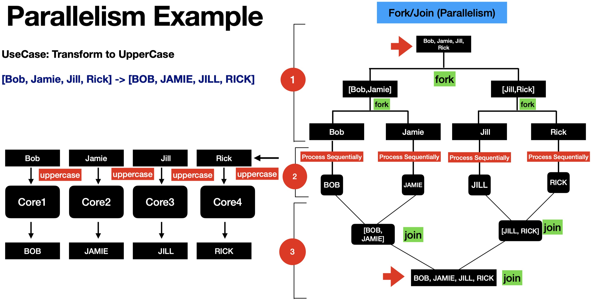

# Table of Contents

- [Table of Contents](#table-of-contents)
- [Multithreading,Parallel \& Asynchronous Coding in Modern Java](#multithreadingparallel--asynchronous-coding-in-modern-java)
- [Getting Started with Parallel \& Asynchronous Programming](#getting-started-with-parallel--asynchronous-programming)
- [5. Why Parallel and Asynchronous Programming](#5-why-parallel-and-asynchronous-programming)
- [6. Evolution of Concurrency and Parallelism APIs in Java](#6-evolution-of-concurrency-and-parallelism-apis-in-java)
- [7. Concurrency vs Parallelism](#7-concurrency-vs-parallelism)
  - [Concurrency](#concurrency)
  - [Parallelism](#parallelism)
- [Limitations of Threads, Future, ForkJoin](#limitations-of-threads-future-forkjoin)
- [11. Threads and its Limitations](#11-threads-and-its-limitations)
  - [Threads Api](#threads-api)
    - [Thread API Limitations](#thread-api-limitations)
- [12. Intro to ThreadPool/ExecutorService \& Future](#12-intro-to-threadpoolexecutorservice--future)
  - [Thread Pool](#thread-pool)
    - [`Thread` Example](#thread-example)
- [13. `ExecutorService`](#13-executorservice)
  - [Limitations of ExecutorService](#limitations-of-executorservice)
  - [`ExecutorService` Example](#executorservice-example)
- [14. `Fork/Join` Framework](#14-forkjoin-framework)

# Multithreading,Parallel & Asynchronous Coding in Modern Java

https://macquarie.udemy.com/course/parallel-and-asynchronous-programming-in-modern-java/

https://github.com/dilipsundarraj1/parallel-asynchronous-using-java

https://github.com/dilipsundarraj1/parallel-asynchronous-using-java/blob/master/src/main/java/com/learnjava/thread/HelloWorldThreadExample.java

# Getting Started with Parallel & Asynchronous Programming

# 5. Why Parallel and Asynchronous Programming

Goal of Asynchronous and Parallel Programming

- Provide Techniques to improve the performance of the code
  Technology Advancements
  | Hardware | Software |
  | ------------------------------------------------- | ------------------------------------------------------------------------------------------------------------- |
  | Devices or computers comes up with Multiple cores | MicroServices Architecture style |
  | Developer utilises multiple cores | Blocking I/O calls are common in MicroServices Architecture. This also impacts the latency of the application |
  | Apply the Parallel Programming concepts | Apply the Asynchronous Programming concepts |
  | Parallel Streams | CompletableFuture |

# 6. Evolution of Concurrency and Parallelism APIs in Java


# 7. Concurrency vs Parallelism

## Concurrency

> Concurrency is a concept where two or more task can run simultaneously
> Concurrency can be implemented in single or multiple cores
> Concurrency is about correctly and efficiently controlling access to shared resources

In Java, Concurrency is achieved using `Threads`

How the tasks are ran depends on the underlying CPU
Single core = Tasks ran in interleaved fashion
Multicore = Tasks ran simultaneously


In a real application, Threads normally need to interact with one another via `Shared Objects` or `Messaging Queues`

Issues:

- Race Condition
- DeadLocks

Solutions:

- Synchronized Statements/Methods
- Reentrant Locks, Semaphores
- Concurrent Collections
- Conditional Objects and More

Concurrency Example

```java
import static java.lang.Thread.sleep;

public class HelloWorldThreadExample {
  private static String result = ""; // <-- SHARED Object

  private static void hello() {
    sleep(700);
    result = result.concat("Hello");
  }

  private static void world() {
    sleep(600);
    result = result.concat("World");
  }

  public static void main(String[] args) throws InterruptedException {
    Thread helloThread = new Thread(() -> hello());
    Thread worldThread = new Thread(() -> world());
    // Starting the thread
    helloThread.start();
    worldThread.start();
    // Joining the thread (Waiting for the threads to finish)
    helloThread.join();
    worldThread.join();
    // Result
    System.out.println("Result is : " + result);
  }
}
```

## Parallelism

> Parallelism is a concept in which tasks are are running in parallel
> Parallelism can only be implemented on multi-core devices
> Parallelism is about using more resources to access the result faster

Parallelism involves these steps:

1. Decomposing the tasks in to SubTasks(Forking)
2. Execute the subtasks in sequential
3. Joining the results of the tasks(Join)

Whole process is also called `Fork/Join`




```java
public class ParallelismExample1 {
  public static void main(String[] args) {
    List<String> namesList = List.of("Bob", "Jamie", "Jill", "Rick");
    System.out.println("namesList : " + namesList);
    List<String> namesListUpperCase = namesList
      .parallelStream()
      .map(String::toUpperCase)
      .collect(Collectors.toList());
    System.out.println("namesListUpperCase : " + namesListUpperCase);
  }
}
```

# Limitations of Threads, Future, ForkJoin

# 11. Threads and its Limitations

## Threads Api

Threads API got introduced in Java1
Threads are used to offload the blocking tasks as background tasks
Threads allowed the developers to write asynchronous style of code

### Thread API Limitations

- Requires a lot of manual code to introduce asynchronicity
  - Runnable, Thread
  - Require additional properties in Runnable
  - Start and Join the thread
- Low level
- Easy to introduce complexity in to our code

# 12. Intro to ThreadPool/ExecutorService & Future

Limitations Of Thread

- Create, start, join the threads

Threads are expensive

- Threads have their own runtime-stack, memory, registers and more

> Thread Pool was created to solve these problems

## Thread Pool

Thread Pool is a group of threads created and readily available

CPU Intensive Tasks

- ThreadPool Size = No of Cores

I/O task

- ThreadPool Size > No of Cores

What are the benefits of thread pool?

- No need to manually create, start and join the threads
- Achieving Concurrency in your application

### `Thread` Example

```java
package com.learnjava.thread;

import com.learnjava.domain.Product;
import com.learnjava.domain.ProductInfo;
import com.learnjava.domain.Review;
import com.learnjava.service.ProductInfoService;
import com.learnjava.service.ReviewService;
import org.apache.commons.lang3.time.StopWatch;

import static com.learnjava.util.CommonUtil.stopWatch;
import static com.learnjava.util.LoggerUtil.log;

public class ProductServiceUsingThread {
  private ProductInfoService productInfoService;
  private ReviewService reviewService;

  public ProductServiceUsingThread(ProductInfoService productInfoService, ReviewService reviewService) {
    this.productInfoService = productInfoService;
    this.reviewService = reviewService;
  }

  public Product retrieveProductDetails(String productId) throws InterruptedException {
    stopWatch.start();
    ProductInfoRunnable productInfoRunnable = new ProductInfoRunnable(productId);
    ReviewRunnable reviewRunnable = new ReviewRunnable(productId);
    // Create thread
    Thread productInfoThread = new Thread(productInfoRunnable);
    Thread reviewThread = new Thread(reviewRunnable);
    // Start thread
    productInfoThread.start();
    reviewThread.start();
    // Join thread (wait for thread to terminate)
    productInfoThread.join();
    reviewThread.join();
    stopWatch.stop();
    log("Total Time Taken : " + stopWatch.getTime());
    return new Product(productId, productInfoRunnable.productInfo, reviewRunnable.review);
  }

  public static void main(String[] args) throws InterruptedException {
    ProductInfoService productInfoService = new ProductInfoService();
    ReviewService reviewService = new ReviewService();
    ProductServiceUsingThread productService = new ProductServiceUsingThread(productInfoService, reviewService);
    String productId = "ABC123";
    Product product = productService.retrieveProductDetails(productId);
    log("Product is " + product);

  }

  private class ProductInfoRunnable implements Runnable {
    private String productId;
    private ProductInfo productInfo;

    public ProductInfo getProductInfo() {
      return productInfo;
    }

    public ProductInfoRunnable(String productId) {
      this.productId = productId;
    }

    @Override
    public void run() {
      productInfo = productInfoService.retrieveProductInfo(productId);
    }
  }

  private class ReviewRunnable implements Runnable {
    private String productId;
    private Review review;

    public ReviewRunnable(String productId) {
      this.productId = productId;
    }

    public Review getReview() {
      return review;
    }

    @Override
    public void run() {
      review = reviewService.retrieveReviews(productId);
    }
  }
}
```

# 13. `ExecutorService`

Released as part of Java5

ExecutorService in Java is an `Asynchronous Task Execution Engine`

It provides a way to asynchronously execute tasks and provides the results in a much simpler way compared to threads

This enabled coarse-grained task based parallelism in Java


## Limitations of ExecutorService

Designed to Block the Thread

```java
Future<ProductInfo> productInfoFuture = executorService.submit(() -> productInfoService.retrieveProductInfo(productId));
Future<Review> reviewFuture = executorService.submit(() -> reviewService.retrieveReviews(productId));
ProductInfo productInfo = productInfoFuture.get();
Review review = reviewFuture.get();
```

No better way to combine futures

```java
Future<ProductInfo> productInfoFuture = executorService.submit(() -> productInfoService.retrieveProductInfo(productId));
Future<Review> reviewFuture = executorService.submit(() -> reviewService.retrieveReviews(productId));
ProductInfo productInfo = productInfoFuture.get();
Review review = reviewFuture.get();
return new Product(productId, productInfo, review);
```

## `ExecutorService` Example

```java
package com.learnjava.executor;

import com.learnjava.domain.Product;
import com.learnjava.domain.ProductInfo;
import com.learnjava.domain.Review;
import com.learnjava.service.ProductInfoService;
import com.learnjava.service.ReviewService;
import org.apache.commons.lang3.time.StopWatch;

import java.util.concurrent.*;

import static com.learnjava.util.CommonUtil.stopWatch;
import static com.learnjava.util.LoggerUtil.log;

public class ProductServiceUsingExecutor {

  static ExecutorService executorService = Executors.newFixedThreadPool(6);

  private ProductInfoService productInfoService;
  private ReviewService reviewService;

  public ProductServiceUsingExecutor(ProductInfoService productInfoService, ReviewService reviewService) {
    this.productInfoService = productInfoService;
    this.reviewService = reviewService;
  }

  public Product retrieveProductDetails(String productId) throws ExecutionException, InterruptedException, TimeoutException {
    stopWatch.start();

    Future<ProductInfo> productInfoFuture = executorService.submit(() -> productInfoService.retrieveProductInfo(productId));
    Future<Review> reviewFuture = executorService.submit(() -> reviewService.retrieveReviews(productId));

    ProductInfo productInfo = productInfoFuture.get();
    // ProductInfo productInfo = productInfoFuture.get(2, TimeUnit.SECONDS); // https://docs.oracle.com/en/java/javase/21/docs/api/java.base/java/util/concurrent/CompletableFuture.html#get(long,java.util.concurrent.TimeUnit)
    Review review = reviewFuture.get();
    //Review review = reviewFuture.get(2, TimeUnit.SECONDS);

    stopWatch.stop();
    log("Total Time Taken : " + stopWatch.getTime());
    return new Product(productId, productInfo, review);
  }

  public static void main(String[] args) throws ExecutionException, InterruptedException, TimeoutException {

    ProductInfoService productInfoService = new ProductInfoService();
    ReviewService reviewService = new ReviewService();
    ProductServiceUsingExecutor productService = new ProductServiceUsingExecutor(productInfoService, reviewService);
    String productId = "ABC123";
    Product product = productService.retrieveProductDetails(productId);
    log("Product is " + product);
    executorService.shutdown(); // NOTE: Need to explicitly shutdown the executorService
  }
}
```

# 14. `Fork/Join` Framework
