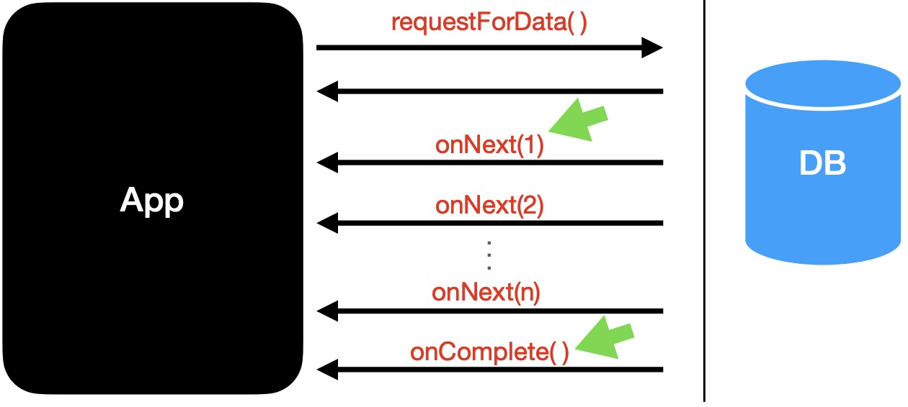
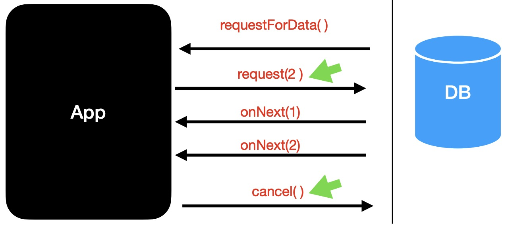
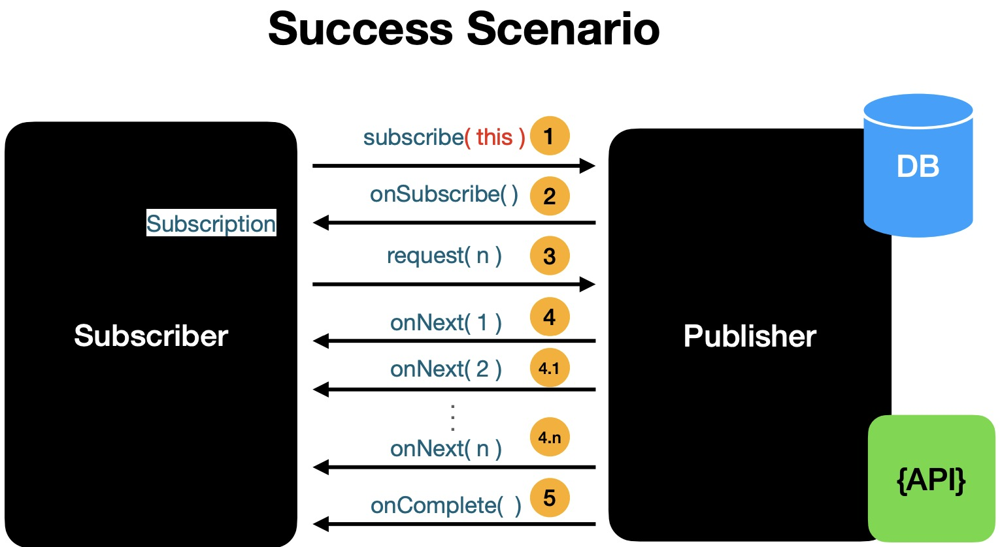
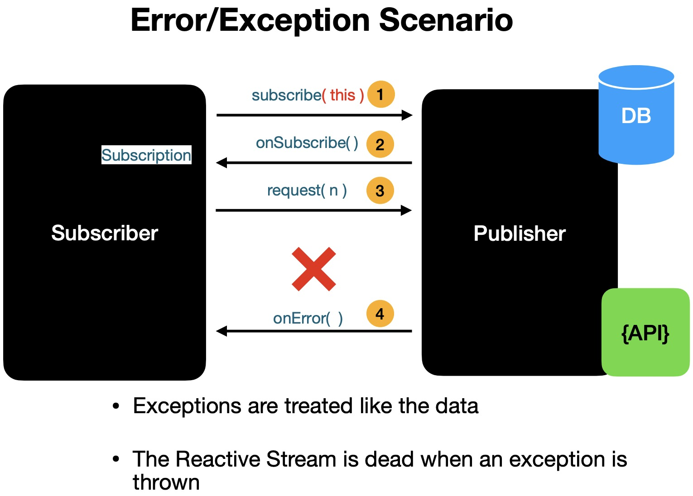
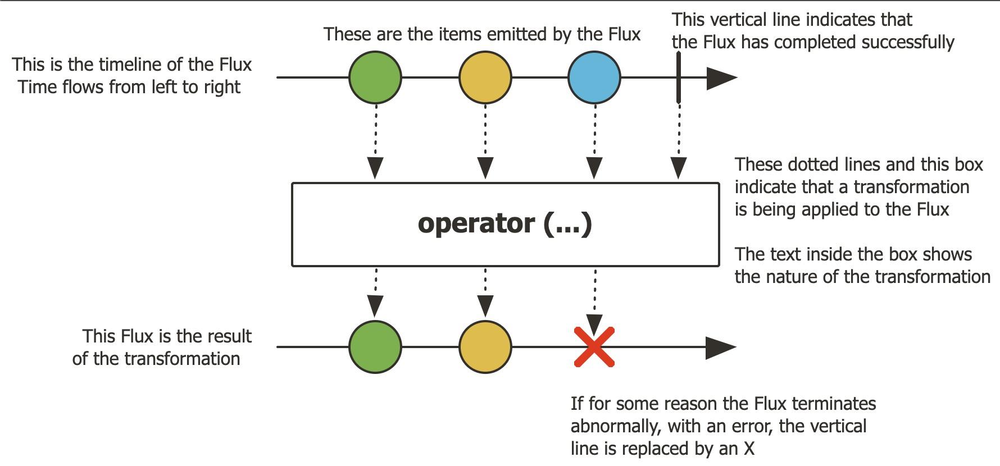
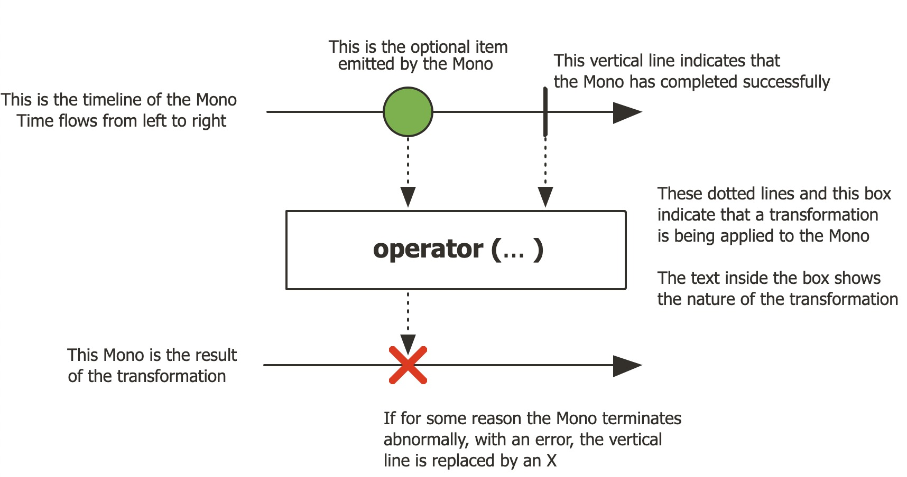

# Table of Contents

- [Table of Contents](#table-of-contents)
- [Reactive Programming using Project Reactor - Pragmatic Code School](#reactive-programming-using-project-reactor---pragmatic-code-school)
  - [Intro to Reactive Programming](#intro-to-reactive-programming)
    - [What is Reactive Programming](#what-is-reactive-programming)
    - [Reactive Application Architecture](#reactive-application-architecture)
    - [Reactive Streams Specification](#reactive-streams-specification)
      - [Publisher](#publisher)
      - [Subscriber](#subscriber)
      - [Subscription](#subscription)
      - [Processor](#processor)
      - [Reactive Streams - How it works together](#reactive-streams---how-it-works-together)
  - [Intro to Project Reactor](#intro-to-project-reactor)
    - [Project Reactor](#project-reactor)
    - [Flux + Mono](#flux--mono)
    - [`Flux` - `[0..N]` elements](#flux---0n-elements)
    - [`Mono` - `[0|1]` elements](#mono---01-elements)
  - [Functional Programming In Java](#functional-programming-in-java)
    - [Project Setup](#project-setup)
    - [Why Functional Programming?](#why-functional-programming)
    - [Example](#example)
  - [Transforming Data using Operators in Project Reactor](#transforming-data-using-operators-in-project-reactor)
    - [Reactive Streams are Immutable](#reactive-streams-are-immutable)
    - [`.map()` Operator](#map-operator)
    - [`.filter() Operator`](#filter-operator)
      - [`.flatMap()` Operator](#flatmap-operator)

# Reactive Programming using Project Reactor - Pragmatic Code School

https://macquarie.udemy.com/course/reactive-programming-in-modern-java-using-project-reactor

https://github.com/dilipsundarraj1/reactive-programming-using-reactor/tree/final

## Intro to Reactive Programming

### What is Reactive Programming

- Reactive Programming = An Asynchronous and Non-Blocking programming paradigm
- Data flows as an Event/Message driven stream
- Functional Style Code
- BackPressure on Data Streams
  - Push-Pull based data flow model
- When to use Reactive Programming?
  - Reactive Programming is suitable for when there is need to build application that can handle high loads and scale

### Reactive Application Architecture

- In API we handle requests using non-blocking style
  - Netty is a non-blocking Server that uses Event Loop Style
- Spring WebFlux uses Netty and Project Reactor for building non-blocking reactive APIs

### Reactive Streams Specification

1. Publisher
2. Subscriber
3. Subscription
4. Processor

#### Publisher

> Publisher = Producer/DataSource (e.g. Database (db), Remote Service)

```java
public interface Publisher<T> {
  public void subscribe(Subscriber <? super T> s);
}
```

#### Subscriber

> Subscriber = Consumer/Caller

```java
public interface Subscriber<T> {

  public void onSubscribe(Subscription s);

  public void onNext(T t); // onNext() = how the data is sent to the caller from the data source

  public void onError(Throwable t);

  public void onComplete(); // onComplete() = how the datasource notifies the caller that there is no more data
}
```



#### Subscription

> Connects the Subscriber and the Publisher

```java
public interface Subscription {
  public void request(long n);

  public void cancel();
}
```



#### Processor

> Processor extends Subscriber and Publisher
>
> Processor can behave as BOTH a Subscriber and Publisher
> Not really used on a day to day basis

```java
public interface Processor<T, R> extends Subscriber<T>, Publisher<R> {}
```

#### Reactive Streams - How it works together




## Intro to Project Reactor

### Project Reactor

- Project Reactor is an implementation of Reactive Streams Specification
- Project Reactor is a Reactive Library
- Spring WebFlux uses Project Reactor by default

Links

- [Project Reactor JavaDocs for Each Module](https://projectreactor.io/docs)
- [Project Reactor Reference Guide](https://projectreactor.io/docs/core/release/reference)

### Flux + Mono

- Flux and Mono are a reactive type that implements the Reactive Streams
- Specification
  - `Flux` and `Mono` are part of the `reactor-core` module
  - `Flux` = A reactive type to represent `0 to N` elements
  - `Mono` = A reactive type to represent `0 to 1` elements

### `Flux` - `[0..N]` elements

https://projectreactor.io/docs/core/release/api/reactor/core/publisher/Flux.html

<!--  -->



### `Mono` - `[0|1]` elements

https://projectreactor.io/docs/core/release/api/reactor/core/publisher/Mono.html

<!--  -->



## Functional Programming In Java

### Project Setup

https://github.com/dilipsundarraj1/reactive-programming-using-reactor/tree/final

### Why Functional Programming?

> Reactive programming uses Functional Programming style of code (e.g. code similar to Java 8 Streams API)
> Functional Programming was introduced in Java 8

Functional Programming is powered by:

- Lambdas
- Method References
- Functional Interfaces

Functional Programming promotes:

- Behaviour Parameterisation
- Immutability
- Conciseness (concise code)

### Example

We always call `.subscribe()` on the Publisher (which emits either a `Mono` or `Flux`)

```java
package com.learnreactiveprogramming.service;

import com.learnreactiveprogramming.exception.ReactorException;
import lombok.extern.slf4j.Slf4j;
import reactor.core.Exceptions;
import reactor.core.publisher.Flux;
import reactor.core.publisher.FluxSink;
import reactor.core.publisher.Mono;
import reactor.core.scheduler.Scheduler;
import reactor.core.scheduler.Schedulers;
import reactor.util.function.Tuple8;

import java.time.Duration;
import java.util.List;
import java.util.Random;
import java.util.concurrent.CompletableFuture;
import java.util.function.Function;

import static com.learnreactiveprogramming.util.CommonUtil.delay;

@Slf4j
public class FluxAndMonoGeneratorService {

  public Flux<String> namesFlux() {
    var namesList = List.of("alex", "ben", "chloe");
    //return Flux.just("alex", "ben", "chloe");
    return Flux.fromIterable(namesList); // coming from a db or remote service

  }

  public Mono<String> namesMono() {
    return Mono.just("alex");
  }

  public static void main(String[] args) {
    FluxAndMonoGeneratorService fluxAndMonoGeneratorService = new FluxAndMonoGeneratorService();
    // Flux
    Flux<String> namesFlux = fluxAndMonoGeneratorService.namesFlux().log();
    namesFlux.subscribe((name) -> {
      System.out.println("Flux Name is : " + name);
    });
    fluxAndMonoGeneratorService.namesFlux().subscribe((name) -> {
      System.out.println("Flux Name is : " + name);
    });
    // Mono
    Mono<String> namesMono = fluxAndMonoGeneratorService.namesMono().log();
    namesMono.subscribe((name) -> {
      System.out.println("Mono Name is : " + name);
    });
    fluxAndMonoGeneratorService.namesMono().subscribe((name) -> {
      System.out.println("Mono Name is : " + name);
    });
  }
}
```

```java
package com.learnreactiveprogramming.service;

import com.learnreactiveprogramming.exception.ReactorException;
import org.junit.jupiter.api.Test;
import reactor.core.publisher.Flux;
import reactor.core.publisher.Mono;
import reactor.core.publisher.Hooks;
import reactor.test.StepVerifier;
import reactor.test.scheduler.VirtualTimeScheduler;
import reactor.tools.agent.ReactorDebugAgent;

import java.time.Duration;
import java.util.List;

class FluxAndMonoGeneratorServiceTest {

  FluxAndMonoGeneratorService fluxAndMonoGeneratorService = new FluxAndMonoGeneratorService();

  @Test
  void namesFluxTest() {
    // Given
    // When
    Flux<String> stringFlux = fluxAndMonoGeneratorService.namesFlux();
    // Then
    StepVerifier.create(stringFlux)
      //.expectNext("alex", "ben", "chloe") // V1
      //.expectNextCount(3) // V2
      .expectNext("alex") // V3
      .expectNextCount(2) // V3
      .verifyComplete();
  }

  @Test
  void namesMonoTest() {
    // Given
    // When
    var stringMono = fluxAndMonoGeneratorService.namesMono();
    // Then
    StepVerifier.create(stringMono)
      .expectNext("alex")
      .verifyComplete();
  }
}
```

## Transforming Data using Operators in Project Reactor

### Reactive Streams are Immutable

```java
package com.learnreactiveprogramming.service;

import com.learnreactiveprogramming.exception.ReactorException;
import lombok.extern.slf4j.Slf4j;
import reactor.core.Exceptions;
import reactor.core.publisher.Flux;
import reactor.core.publisher.FluxSink;
import reactor.core.publisher.Mono;
import reactor.core.scheduler.Scheduler;
import reactor.core.scheduler.Schedulers;
import reactor.util.function.Tuple8;

import java.time.Duration;
import java.util.List;
import java.util.Random;
import java.util.concurrent.CompletableFuture;
import java.util.function.Function;

import static com.learnreactiveprogramming.util.CommonUtil.delay;

@Slf4j
public class FluxAndMonoGeneratorService {

  public Flux<String> namesFlux_immutability() {
    List<String> namesList = List.of("alex", "ben", "chloe");
    //return Flux.just("alex", "ben", "chloe");
    Flux<String> namesFlux = Flux.fromIterable(namesList);
    namesFlux.map(String::toUpperCase); // <-- HERE (note: this will NOT work since .map() on a Flux will return a new Flux)
    // namesFlux = namesFlux.map(String::toUpperCase); // Solution/Fix
    return namesFlux;
  }

  public static void main(String[] args) {
    FluxAndMonoGeneratorService fluxAndMonoGeneratorService = new FluxAndMonoGeneratorService();
    Flux<String> namesFlux = fluxAndMonoGeneratorService.namesFlux().log();
    namesFlux.subscribe((name) -> {
      System.out.println("Name is : " + name);
    });
    Mono<String> namesMono = fluxAndMonoGeneratorService.namesMono().log();
    namesMono.subscribe((name) -> {
      System.out.println("Name is : " + name);
    });
  }
}
```

```java
package com.learnreactiveprogramming.service;

import com.learnreactiveprogramming.exception.ReactorException;
import org.junit.jupiter.api.Test;
import reactor.core.publisher.Hooks;
import reactor.test.StepVerifier;
import reactor.test.scheduler.VirtualTimeScheduler;
import reactor.tools.agent.ReactorDebugAgent;

import java.time.Duration;
import java.util.List;

class FluxAndMonoGeneratorServiceTest {

  FluxAndMonoGeneratorService fluxAndMonoGeneratorService = new FluxAndMonoGeneratorService();

  @Test
  void namesFlux_Immutability() {
    //given
    //when
    Flux<String> stringFlux = fluxAndMonoGeneratorService.namesFlux_immutability()
      .log();
    //then
    StepVerifier.create(stringFlux)
      //.expectNext("ALEX", "BEN", "CHLOE")
      .expectNextCount(3)
      .verifyComplete();
  }
}
```

### `.map()` Operator

```java
package com.learnreactiveprogramming.service;

import com.learnreactiveprogramming.exception.ReactorException;
import lombok.extern.slf4j.Slf4j;
import reactor.core.Exceptions;
import reactor.core.publisher.Flux;
import reactor.core.publisher.FluxSink;
import reactor.core.publisher.Mono;
import reactor.core.scheduler.Scheduler;
import reactor.core.scheduler.Schedulers;
import reactor.util.function.Tuple8;

import java.time.Duration;
import java.util.List;
import java.util.Random;
import java.util.concurrent.CompletableFuture;
import java.util.function.Function;

import static com.learnreactiveprogramming.util.CommonUtil.delay;

@Slf4j
public class FluxAndMonoGeneratorService {

  public Flux<String> namesFlux_map() {
    return Flux.fromIterable(List.of("alex", "ben", "chloe"))
      //.map(s -> s.toUpperCase())
      .map(String::toUpperCase)
      .log();
  }
}
```

```java
package com.learnreactiveprogramming.service;

import com.learnreactiveprogramming.exception.ReactorException;
import org.junit.jupiter.api.Test;
import reactor.core.publisher.Flux;
import reactor.core.publisher.Mono;
import reactor.core.publisher.Hooks;
import reactor.test.StepVerifier;
import reactor.test.scheduler.VirtualTimeScheduler;
import reactor.tools.agent.ReactorDebugAgent;

import java.time.Duration;
import java.util.List;

class FluxAndMonoGeneratorServiceTest {

  FluxAndMonoGeneratorService fluxAndMonoGeneratorService = new FluxAndMonoGeneratorService();

  @Test
  void namesFluxMapTest() {
    // Given
    // When
    Flux<String> stringFlux = fluxAndMonoGeneratorService.namesFlux_map();
    // Then
    StepVerifier.create(stringFlux)
      //.expectNext("ALEX", "BEN", "CHLOE") // V1
      //.expectNextCount(3) // V2
      .expectNext("ALEX") // V3
      .expectNextCount(2) // V3
      .verifyComplete();
  }
}
```

### `.filter() Operator`

```java
package com.learnreactiveprogramming.service;

import com.learnreactiveprogramming.exception.ReactorException;
import lombok.extern.slf4j.Slf4j;
import reactor.core.Exceptions;
import reactor.core.publisher.Flux;
import reactor.core.publisher.FluxSink;
import reactor.core.publisher.Mono;
import reactor.core.scheduler.Scheduler;
import reactor.core.scheduler.Schedulers;
import reactor.util.function.Tuple8;

import java.time.Duration;
import java.util.List;
import java.util.Random;
import java.util.concurrent.CompletableFuture;
import java.util.function.Function;

import static com.learnreactiveprogramming.util.CommonUtil.delay;

@Slf4j
public class FluxAndMonoGeneratorService {

  public Flux<String> namesFlux_map_filter(int stringLength) {
    return Flux.fromIterable(List.of("alex", "ben", "chloe"))
      //.map(s -> s.toUpperCase())
      .map(String::toUpperCase)
      .filter(s -> s.length() > stringLength)
      .map(s -> s.length() + "-" + s)
      .log();
  }
}
```

```java
package com.learnreactiveprogramming.service;

import com.learnreactiveprogramming.exception.ReactorException;
import org.junit.jupiter.api.Test;
import reactor.core.publisher.Flux;
import reactor.core.publisher.Mono;
import reactor.core.publisher.Hooks;
import reactor.test.StepVerifier;
import reactor.test.scheduler.VirtualTimeScheduler;
import reactor.tools.agent.ReactorDebugAgent;

import java.time.Duration;
import java.util.List;

class FluxAndMonoGeneratorServiceTest {

  FluxAndMonoGeneratorService fluxAndMonoGeneratorService = new FluxAndMonoGeneratorService();

  @Test
  void namesMono_map_filter() {
    //given
    int stringLength = 3;
    //when
    var stringMono = fluxAndMonoGeneratorService.namesMono_map_filter(stringLength);
    //then
    StepVerifier.create(stringMono)
      .expectNext("4-ALEX", "5-CHLOE")
      .verifyComplete();
  }
}
```

#### `.flatMap()` Operator

> Transforms one source element to a `Flux` of `1 to N` elements (e.g. `"ALEX" -> Flux.just("A", "L", "E", "X")`)
> Used when the transformation returns a Reactive Type (Flux or Mono)
> `.flatMap()` returns a `Flux<T>`

```java
package com.learnreactiveprogramming.service;

import com.learnreactiveprogramming.exception.ReactorException;
import lombok.extern.slf4j.Slf4j;
import reactor.core.Exceptions;
import reactor.core.publisher.Flux;
import reactor.core.publisher.FluxSink;
import reactor.core.publisher.Mono;
import reactor.core.scheduler.Scheduler;
import reactor.core.scheduler.Schedulers;
import reactor.util.function.Tuple8;

import java.time.Duration;
import java.util.List;
import java.util.Random;
import java.util.concurrent.CompletableFuture;
import java.util.function.Function;

import static com.learnreactiveprogramming.util.CommonUtil.delay;

@Slf4j
public class FluxAndMonoGeneratorService {

  /**
   * @param stringLength
   */
  public Flux<String> namesFlux_flatmap(int stringLength) {
    var namesList = List.of("alex", "ben", "chloe"); // a, l, e , x
    return Flux.fromIterable(namesList)
      //.map(s -> s.toUpperCase())
      .map(String::toUpperCase)
      .filter(s -> s.length() > stringLength)
      // ALEX,CHLOE -> A, L, E, X, C, H, L , O, E
      .flatMap(this::splitString);

  }

  public Flux<String> namesFlux_flatmap_async(int stringLength) {
    var namesList = List.of("alex", "ben", "chloe"); // a, l, e , x
    return Flux.fromIterable(namesList)
      //.map(s -> s.toUpperCase())
      .map(String::toUpperCase)
      .filter(s -> s.length() > stringLength)
      .flatMap(this::splitString_withDelay);

  }

  public Mono<List<String>> namesMono_flatmap(int stringLength) {
    return Mono.just("alex")
      .map(String::toUpperCase)
      .filter(s -> s.length() > stringLength)
      .flatMap(this::splitStringMono); //Mono<List of A, L, E  X>
  }

  public Flux<String> namesMono_flatmapMany(int stringLength) {
    return Mono.just("alex")
      //.map(s -> s.toUpperCase())
      .map(String::toUpperCase)
      .flatMapMany(this::splitString_withDelay);
  }

  private Mono<List<String>> splitStringMono(String s) {
    var charArray = s.split("");
    return Mono.just(List.of(charArray))
      .delayElement(Duration.ofSeconds(1));
  }

  public static void main(String[] args) {

    FluxAndMonoGeneratorService fluxAndMonoGeneratorService = new FluxAndMonoGeneratorService();

    Flux<String> namesFlux = fluxAndMonoGeneratorService.namesFlux().log();

    namesFlux.subscribe((name) -> {
      System.out.println("Name is : " + name);
    });

    Mono<String> namesMono = fluxAndMonoGeneratorService.namesMono().log();

    namesMono.subscribe((name) -> {
      System.out.println("Name is : " + name);
    });
  }
}
```
