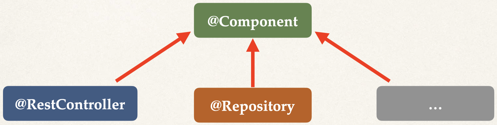
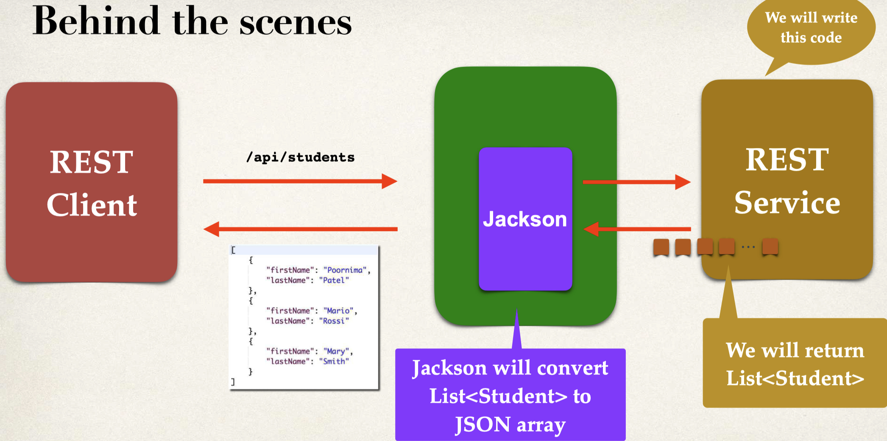

# Table of Contents

- [Table of Contents](#table-of-contents)
- [Links](#links)
  - [Part 1 - Spring Boot 3 Quick Start](#part-1---spring-boot-3-quick-start)
  - [Part 2 - Spring Core](#part-2---spring-core)
  - [Part 3 - Hibernate/JPA CRUD](#part-3---hibernatejpa-crud)
  - [Part 4 - REST CRUD APIs](#part-4---rest-crud-apis)
  - [Part 5 - REST API Security](#part-5---rest-api-security)
  - [Part 6 - Spring MVC](#part-6---spring-mvc)
  - [Part 7 - Spring MVC CRUD](#part-7---spring-mvc-crud)
  - [Part 8 - Spring MVC Security](#part-8---spring-mvc-security)
  - [Part 9 - JPA/Hibernate Advanced Mappings](#part-9---jpahibernate-advanced-mappings)
  - [Part 10 - AOP: Aspect-Oriented Programming](#part-10---aop-aspect-oriented-programming)
- [Spring Boot 3 Quick Start](#spring-boot-3-quick-start)
  - [6 - Spring Boot Initialzr Demo](#6---spring-boot-initialzr-demo)
  - [7 - Create a REST Controller (Spring Boot)](#7---create-a-rest-controller-spring-boot)
  - [8 - Spring Projects](#8---spring-projects)
  - [9 - What is Maven](#9---what-is-maven)
  - [10 - Maven Project Structure](#10---maven-project-structure)
    - [Advantages of Maven](#advantages-of-maven)
  - [11 - Maven Key Concepts](#11---maven-key-concepts)
    - [`pom.xml`](#pomxml)
    - [Project Coordinates](#project-coordinates)
    - [Dependency Coordinates](#dependency-coordinates)
  - [12,13 - Exploring Spring Boot Project Files](#1213---exploring-spring-boot-project-files)
    - [Maven Wrapper files](#maven-wrapper-files)
    - [Maven POM File](#maven-pom-file)
    - [Java Source Code](#java-source-code)
    - [`application.properties`](#applicationproperties)
    - [Static Content](#static-content)
    - [Templates](#templates)
  - [14 - `spring-boot-start-*` Dependencies](#14---spring-boot-start--dependencies)
    - [Spring Boot Starters](#spring-boot-starters)
    - [Spring MVC](#spring-mvc)
    - [Spring Boot Starter Web](#spring-boot-starter-web)
    - [Spring Boot Starters](#spring-boot-starters-1)
    - [How to View Content of Starters](#how-to-view-content-of-starters)
  - [15 - `spring-boot-starter-parent` Dependency](#15---spring-boot-starter-parent-dependency)
    - [Overriding Default Properties](#overriding-default-properties)
    - [Inheriting Parent Version](#inheriting-parent-version)
    - [Default Configuration of Spring Boot Maven Plugin](#default-configuration-of-spring-boot-maven-plugin)
    - [Advantages of `spring-boot-starter-parent`](#advantages-of-spring-boot-starter-parent)
  - [16 - `spring-boot-devtools` Dependency](#16---spring-boot-devtools-dependency)
    - [Development Process](#development-process)
  - [18 - `spring-boot-actuator` Dependency](#18---spring-boot-actuator-dependency)
    - [`actuator/health` Endpoint](#actuatorhealth-endpoint)
    - [Exposing Endpoints](#exposing-endpoints)
    - [Excluding Endpoints](#excluding-endpoints)
    - [`/actuator/info` Endpoint](#actuatorinfo-endpoint)
    - [Get A List of Beans](#get-a-list-of-beans)
    - [Development Process](#development-process-1)
  - [19,20 - Spring Boot Actuator Endpoints](#1920---spring-boot-actuator-endpoints)
  - [21,22 - `spring-boot-starter-security` Dependency - Securing Endpoints](#2122---spring-boot-starter-security-dependency---securing-endpoints)
  - [23-26 - Run Spring Boot from CLI](#23-26---run-spring-boot-from-cli)
  - [27,28 - Injecting Custom Application Properties](#2728---injecting-custom-application-properties)
    - [Development Process](#development-process-2)
  - [29,30 - Spring Boot Properties](#2930---spring-boot-properties)
    - [Logging Properties](#logging-properties)
    - [Web Properties](#web-properties)
    - [Actuator Properties](#actuator-properties)
    - [Security Properties](#security-properties)
    - [Data Properties](#data-properties)
- [Spring Core](#spring-core)
  - [31 - Inversion of Control (IOC)](#31---inversion-of-control-ioc)
    - [Spring Container](#spring-container)
    - [Ways to Configuring Spring Container](#ways-to-configuring-spring-container)
  - [32-37 - Dependency Injection](#32-37---dependency-injection)
    - [Spring AutoWiring](#spring-autowiring)
    - [Constructor Injection](#constructor-injection)
    - [Setter Injection](#setter-injection)
    - [Field Injection](#field-injection)
  - [38 - Component Scanning](#38---component-scanning)
    - [Scan Other Packages](#scan-other-packages)
    - [`@Component` Annotation](#component-annotation)
    - [`@SpringBootApplication` Annotation](#springbootapplication-annotation)
  - [44 - Qualifiers](#44---qualifiers)
    - [`@Qualifier` Annotation](#qualifier-annotation)
    - [`@Primary` Annotation](#primary-annotation)
    - [Mixing `@Primary` and `@Qualifier` Annotations](#mixing-primary-and-qualifier-annotations)
  - [49 - Lazy Initialization](#49---lazy-initialization)
    - [Lazy Initialisation](#lazy-initialisation)
    - [Advantages](#advantages)
    - [Disadvantages](#disadvantages)
    - [Global Lazy Initialisation](#global-lazy-initialisation)
  - [52 - Bean Scopes](#52---bean-scopes)
    - [Default Scope](#default-scope)
    - [Explicitly Specify Bean Scope](#explicitly-specify-bean-scope)
    - [Spring Bean Scopes](#spring-bean-scopes)
    - [Prototype Scope](#prototype-scope)
  - [54 - Bean Lifecycle Methods Annotations](#54---bean-lifecycle-methods-annotations)
    - [Bean Lifecycle](#bean-lifecycle)
    - [Bean Lifecycle Methods / Hooks](#bean-lifecycle-methods--hooks)
  - [57 - `@Bean` Annotation - Configuring Beans with Java Code](#57---bean-annotation---configuring-beans-with-java-code)
    - [Development Process](#development-process-3)
    - [Use Case for `@Bean` Annotation](#use-case-for-bean-annotation)
    - [Real-World Project Example](#real-world-project-example)
      - [Configure AWS S3 Client using `@Bean` annotation](#configure-aws-s3-client-using-bean-annotation)
      - [Inject the S3Client as a Bean](#inject-the-s3client-as-a-bean)
- [Spring Hibernate/JPA](#spring-hibernatejpa)
  - [60 - Hibernate/JPA Overview](#60---hibernatejpa-overview)
    - [What is Hibernate](#what-is-hibernate)
    - [Benefits of Hibernate?](#benefits-of-hibernate)
    - [Object-To-Relational Mapping (ORM)](#object-to-relational-mapping-orm)
    - [Jakarta Persistence API (JPA)](#jakarta-persistence-api-jpa)
    - [Benefits of JPA](#benefits-of-jpa)
  - [61 - Hibernate/JPA and JDBC](#61---hibernatejpa-and-jdbc)
    - [JDBC vs Hibernate vs Spring-Data-JPA](#jdbc-vs-hibernate-vs-spring-data-jpa)
      - [JDBC (Java Database Connectivity)](#jdbc-java-database-connectivity)
      - [Hibernate](#hibernate)
      - [Spring Data JPA](#spring-data-jpa)
    - [Hibernate vs Spring-Data-JPA](#hibernate-vs-spring-data-jpa)
  - [65 - Setting Up Spring Boot Project](#65---setting-up-spring-boot-project)
  - [JPA Query Language (JPQL)](#jpa-query-language-jpql)
  - [68 - JPA Annotations](#68---jpa-annotations)
    - [Entity Class](#entity-class)
    - [Constructors in Java - Refresher](#constructors-in-java---refresher)
    - [Java Annotations](#java-annotations)
    - [`@Column` annotation](#column-annotation)
    - [JPA Identity - Primary Key](#jpa-identity---primary-key)
    - [ID Generation Strategies](#id-generation-strategies)
  - [70 - Saving Java Object with JPA (`EntityManager`)](#70---saving-java-object-with-jpa-entitymanager)
    - [DAO Design Pattern](#dao-design-pattern)
  - [JPA Entity Manager](#jpa-entity-manager)
  - [`EntityManager` vs `JpaRepository`](#entitymanager-vs-jparepository)
    - [`EntityManager`](#entitymanager)
    - [`JpaRepository`](#jparepository)
  - [72 - Saving Java Objects with JPA (`EntityManager`)](#72---saving-java-objects-with-jpa-entitymanager)
    - [`@Transactional` annotation](#transactional-annotation)
    - [`@Repository` annotation](#repository-annotation)
    - [Step 1 - Define DAO Interface](#step-1---define-dao-interface)
    - [Step 2 - Define DAO implementation](#step-2---define-dao-implementation)
    - [Step 3 - Use in MainApplication](#step-3---use-in-mainapplication)
  - [73 - Retreiving Objects with JPA (`EntityManager`)](#73---retreiving-objects-with-jpa-entitymanager)
    - [Step 1 - Define DAO Interface](#step-1---define-dao-interface-1)
    - [Step 2 - Define DAO implementation](#step-2---define-dao-implementation-1)
    - [Step 3 - Use in MainApplication](#step-3---use-in-mainapplication-1)
  - [78 - Querying Objects with JPA (`EntityManager`)](#78---querying-objects-with-jpa-entitymanager)
    - [Retrieving all Students](#retrieving-all-students)
    - [Retrieving Students - `WHERE lastName = 'Doe'`](#retrieving-students---where-lastname--doe)
    - [Retrieving Students using `LIKE` predicate](#retrieving-students-using-like-predicate)
  - [JPQL - Named Parameters](#jpql---named-parameters)
  - [JPQL - `select` clause](#jpql---select-clause)
    - [Step 1 - Define DAO Interface](#step-1---define-dao-interface-2)
    - [Step 2 - Define DAO implementation](#step-2---define-dao-implementation-2)
    - [Step 3 - Use in MainApplication](#step-3---use-in-mainapplication-2)
  - [79 - Updating Objects with JPA (`EntityManager`)](#79---updating-objects-with-jpa-entitymanager)
    - [Step 1 - Define DAO Interface](#step-1---define-dao-interface-3)
    - [Step 2 - Define DAO implementation](#step-2---define-dao-implementation-3)
    - [Step 3 - Use in MainApplication](#step-3---use-in-mainapplication-3)
  - [80 - Deleting Objects with JPA (`EntityManager`)](#80---deleting-objects-with-jpa-entitymanager)
    - [Delete a Student](#delete-a-student)
    - [Delete based on a condition](#delete-based-on-a-condition)
    - [Delete All Students](#delete-all-students)
    - [Step 1 - Define DAO Interface](#step-1---define-dao-interface-4)
    - [Step 2 - Define DAO implementation](#step-2---define-dao-implementation-4)
    - [Step 3 - Use in MainApplication](#step-3---use-in-mainapplication-4)
  - [86 - Create Database Tables from Java Code](#86---create-database-tables-from-java-code)
    - [Configuration](#configuration)
- [Spring Boot REST CRUD Apis](#spring-boot-rest-crud-apis)
  - [91 - JSON Basics](#91---json-basics)
  - [92 - REST over HTTP](#92---rest-over-http)
    - [HTTP Request Message](#http-request-message)
    - [HTTP Response Message](#http-response-message)
    - [MIME Content Types](#mime-content-types)
  - [94 - REST Controller](#94---rest-controller)
    - [Development Process](#development-process-4)
  - [97 - Java JSON Data Binding](#97---java-json-data-binding)
  - [98 - REST POJO (Spring REST Service - Students)](#98---rest-pojo-spring-rest-service---students)
    - [Step 1 - Create Java POJO class for Student](#step-1---create-java-pojo-class-for-student)
    - [Step 2 - Create @RestController](#step-2---create-restcontroller)
  - [101 - REST Path Variables](#101---rest-path-variables)
    - [Step 1 - Add request mapping to Spring REST Service](#step-1---add-request-mapping-to-spring-rest-service)
  - [104 - Exception Handling](#104---exception-handling)
    - [Step 1 - Create custom error response class](#step-1---create-custom-error-response-class)
    - [Step 2 - Create custom student exception](#step-2---create-custom-student-exception)
    - [Step 3 - Update REST service to throw exception](#step-3---update-rest-service-to-throw-exception)
    - [Step 4 - Add exception handler method](#step-4---add-exception-handler-method)
  - [110 - Global Exception Handling](#110---global-exception-handling)
    - [Spring `@ControllerAdvice` Annotation](#spring-controlleradvice-annotation)
    - [Step 1: Create new Exception Handler class with `@ControllerAdvice` annotation](#step-1-create-new-exception-handler-class-with-controlleradvice-annotation)
    - [Step 2: Remove exception handling methods from Controllers](#step-2-remove-exception-handling-methods-from-controllers)
  - [112 - Rest Api Design](#112---rest-api-design)
    - [API Design Process](#api-design-process)
    - [Examples](#examples)
  - [114 - Rest Project](#114---rest-project)
    - [`@Service` Annotation](#service-annotation)
  - [126 - Get Single Employee](#126---get-single-employee)
    - [Sending JSON to Spring REST Controllers](#sending-json-to-spring-rest-controllers)
  - [129. `PATCH` vs `PUT`](#129-patch-vs-put)
    - [Partial Updates - Patch](#partial-updates---patch)
    - [Benefits of PATCH](#benefits-of-patch)
    - [Step 1 - Inject helper class: ObjectMapper](#step-1---inject-helper-class-objectmapper)
    - [Step 2 - Add support for @PatchMapping request method](#step-2---add-support-for-patchmapping-request-method)
    - [Step 3 - Apply patch payload to employee](#step-3---apply-patch-payload-to-employee)
  - [145 - `spring-data-jpa`](#145---spring-data-jpa)
    - [The Problem with using JPA Api](#the-problem-with-using-jpa-api)
      - [Creating DAO](#creating-dao)
    - [Solution - Spring Data JPA](#solution---spring-data-jpa)
    - [`JpaRepository`](#jparepository-1)
    - [Step 1: Extend JpaRepository interface](#step-1-extend-jparepository-interface)
    - [Step 2 - Use Repository](#step-2---use-repository)
    - [Advanced Features](#advanced-features)
  - [138 - `spring-data-rest`](#138---spring-data-rest)
    - [REST Endpoints](#rest-endpoints)
    - [Development Process](#development-process-5)
    - [HATEOAS](#hateoas)
    - [Spring Data REST response using HATEOAS](#spring-data-rest-response-using-hateoas)
    - [Advanced Features](#advanced-features-1)
  - [141 - `spring-data-rest` Configuration, Pagination and Sorting](#141---spring-data-rest-configuration-pagination-and-sorting)
    - [Override path name](#override-path-name)
    - [Pagination](#pagination)
    - [Spring Data REST Configuration](#spring-data-rest-configuration)
  - [143 - OpenApi and Swagger](#143---openapi-and-swagger)
    - [Springdoc](#springdoc)
    - [Documenting REST APIs](#documenting-rest-apis)
    - [Development Process](#development-process-6)
    - [Step 1: Add Maven dependency for Springdoc](#step-1-add-maven-dependency-for-springdoc)

# Links

[Maven Central Repository](https://mvnrepository.com/)

[Maven Central Sonatype](https://central.sonatype.com/)

https://github.com/darbyluv2code/spring-boot-3-spring-6-hibernate-for-beginners

https://github.com/darbyluv2code/spring-boot-4-spring-7-hibernate-for-beginners

https://www.luv2code.com/downloads/udemy-spring-boot-3/spring-boot-3-pdfs.zip

https://www.luv2code.com/downloads/udemy-spring-boot-4/spring-boot-4-pdfs.zip

https://github.com/darbyluv2code/spring-boot-3-spring-6-hibernate-for-beginners/blob/main/11-appendix/course-links.md

## Part 1 - Spring Boot 3 Quick Start

| Name                           | Web Link                                                                                                                   |
| :----------------------------- | :------------------------------------------------------------------------------------------------------------------------- |
| IntelliJ                       | https://www.jetbrains.com/idea/                                                                                            |
| Eclipse                        | https://eclipseide.org/                                                                                                    |
| VS Code                        | https://code.visualstudio.com/                                                                                             |
| NetBeans                       | https://netbeans.apache.org/                                                                                               |
| Spring Website (main)          | https://spring.io/                                                                                                         |
| Spring Framework               | https://spring.io/projects/spring-framework/                                                                               |
| Spring Boot                    | https://spring.io/projects/spring-boot/                                                                                    |
| Spring Quickstart              | https://spring.io/quickstart/                                                                                              |
| Spring Guides                  | https://spring.io/guides/                                                                                                  |
| Spring Initializr              | https://start.spring.io/                                                                                                   |
| Spring Boot Starters           | https://docs.spring.io/spring-boot/docs/current/reference/htmlsingle/#using.build-systems.starters                         |
| Maven                          | https://maven.apache.org/                                                                                                  |
| Spring Boot Actuator Docs      | https://docs.spring.io/spring-boot/docs/current/reference/htmlsingle/#actuator                                             |
| Spring Boot Actuator Endpoints | https://docs.spring.io/spring-boot/docs/current/reference/htmlsingle/#actuator.endpoints                                   |
| Spring Boot Logging            | https://docs.spring.io/spring-boot/docs/current/reference/html/features.html#features.logging                              |
| Spring Boot Common Properties  | https://docs.spring.io/spring-boot/docs/current/reference/html/application-properties.html#appendix.application-properties |
| Install Java on MS Windows     | https://www.luv2code.com/install-java-on-ms-windows                                                                        |

## Part 2 - Spring Core

| Name                              | Web Link                                                                  |
| :-------------------------------- | :------------------------------------------------------------------------ |
| Spring Framework Reference Manual | https://docs.spring.io/spring-framework/reference/index.html              |
| Spring Boot Reference Manual      | https://docs.spring.io/spring-boot/docs/current/reference/html/index.html |

## Part 3 - Hibernate/JPA CRUD

| Name                                      | Web Link                                                         |
| :---------------------------------------- | :--------------------------------------------------------------- |
| Hibernate Object/Relational Mapping (ORM) | https://hibernate.org/orm/                                       |
| Jakarta Persistence API (JPA)             | https://jakarta.ee/specifications/persistence/                   |
| JDBC                                      | https://docs.oracle.com/javase/tutorial/jdbc/overview/index.html |
| MySQL Server Community Edition            | https://www.mysql.com/products/community/                        |
| MySQL Workbench                           | https://www.mysql.com/products/workbench/                        |

## Part 4 - REST CRUD APIs

| Name                                 | Web Link                                                     |
| :----------------------------------- | :----------------------------------------------------------- |
| Jackson JSON Databinding             | https://github.com/FasterXML/jackson-databind                |
| Spring Data JPA Reference Manual     | https://docs.spring.io/spring-data/jpa/reference/            |
| Spring Data REST Reference Manual    | https://docs.spring.io/spring-data/rest/reference/           |
| HATEOAS                              | https://spring.io/projects/spring-hateoas                    |
| Hypertext Application Language (HAL) | https://en.wikipedia.org/wiki/Hypertext_Application_Language |

## Part 5 - REST API Security

| Name                              | Web Link                                                                                  |
| :-------------------------------- | :---------------------------------------------------------------------------------------- |
| Spring Security Reference Manual  | https://docs.spring.io/spring-security/reference/index.html                               |
| Why Use Bcrypt?                   | https://danboterhoven.medium.com/why-you-should-use-bcrypt-to-hash-passwords-af330100b861 |
| Bcrypt Algorithm Analysis         | https://en.wikipedia.org/wiki/Bcrypt                                                      |
| Password Hashing - Best Practices | https://crackstation.net/hashing-security.htm                                             |
| Bcrypt Calculator                 | https://www.bcryptcalculator.com/                                                         |

## Part 6 - Spring MVC

| Name                                           | Web Link                                                                         |
| :--------------------------------------------- | :------------------------------------------------------------------------------- |
| Spring MVC Reference Manual                    | https://docs.spring.io/spring-framework/reference/web/webmvc.html                |
| Thymeleaf                                      | https://www.thymeleaf.org/                                                       |
| Thymeleaf - Creating a Form                    | https://www.thymeleaf.org/doc/tutorials/3.0/thymeleafspring.html#creating-a-form |
| Cascading Style Sheets (CSS)                   | https://developer.mozilla.org/en-US/docs/Learn/CSS                               |
| Bootstrap CSS                                  | https://getbootstrap.com/                                                        |
| Bean Validator Specification                   | https://www.beanvalidation.org                                                   |
| Hibernate Validator (Reference Implementation) | https://hibernate.org/validator/                                                 |

## Part 7 - Spring MVC CRUD

| Name                          | Web Link                                                                |
| :---------------------------- | :---------------------------------------------------------------------- |
| Spring MVC Reference Manual   | https://docs.spring.io/spring-framework/reference/web/webmvc.html       |
| Thymeleaf                     | https://www.thymeleaf.org/                                              |
| Spring Data JPA Query Methods | https://docs.spring.io/spring-data/jpa/reference/jpa/query-methods.html |

## Part 8 - Spring MVC Security

| Name                             | Web Link                                                    |
| :------------------------------- | :---------------------------------------------------------- |
| Spring Security Reference Manual | https://docs.spring.io/spring-security/reference/index.html |

## Part 9 - JPA/Hibernate Advanced Mappings

| Name                                      | Web Link                                       |
| :---------------------------------------- | :--------------------------------------------- |
| Hibernate Object/Relational Mapping (ORM) | https://hibernate.org/orm/                     |
| Jakarta Persistence API (JPA)             | https://jakarta.ee/specifications/persistence/ |

## Part 10 - AOP: Aspect-Oriented Programming

| Name                        | Web Link                                                        |
| :-------------------------- | :-------------------------------------------------------------- |
| Spring AOP Reference Manual | https://docs.spring.io/spring-framework/reference/core/aop.html |
| AspectJ                     | https://eclipse.dev/aspectj/                                    |

# Spring Boot 3 Quick Start

## 6 - Spring Boot Initialzr Demo

https://start.spring.io/

Development Process

1. Configure our project at [Spring Initializr website](https://start.spring.io/)
   - `Language: Java`
   - `Project: Maven`
   - `Spring Boot: X.Y.Z`
     - Note: AVOID the SNAPSHOT versions (which are alpha/beta Spring versions)
   - Project Metadata
     - `Group: com.example` (group = name of company/group)
     - `Artifact: demo` (artifact = name of project)
     - `Name: demo`
     - `Description: Demo project for Spring Boot`
     - `Package name: com.example.demo`
     - `Packaging: Jar`
     - `Java: 21`
   - Dependencies
     - `Spring Web`
2. Generate Project and download the zip file
3. `cd project && idea .`
4. `Shift + Shift > Add Maven Projects`
5. Run as Java Application
6. Tomcat will run on `port 8080`
7. Test with `http://localhost:8080`

## 7 - Create a REST Controller (Spring Boot)

```java
// src/main/java/com/example/demo
package com.example.demo;

import org.springframework.boot.SpringApplication;
import org.springframework.boot.autoconfigure.SpringBootApplication;

@SpringBootApplication
public class MyApplication {
  public static void main(String[] args) {
    SpringApplication.run(MyApplication.class, args);
  }
}
```

```java
// src/main/java/com/example/demo/rest
package com.example.demo.rest;

import org.springframework.web.bind.annotation.GetMapping;
import org.springframework.web.bind.annotation.RestController;

@RestController
public class RestController {
  // Expose the "/" endpoint and return "Hello World"
  @GetMapping("/")
  public String sayHello() {
    return "Hello World!";
  }
}
```

## 8 - Spring Projects

> Spring Projects = Additional Spring modules built-on top of the core Spring Framework

[Full list of Spring Projects](https://spring.io/projects)

Examples

- Spring Cloud
- Spring Data
- Spring Batch
- Spring Security
- Spring Web Services
- Spring LDAP

## 9 - What is Maven

> Maven = A Project Management tool
>
> [Maven Central Repository](https://mvnrepository.com/)
>
> [Maven Central Sonatype](https://central.sonatype.com/)

Most popular use of Maven is for build management and dependencies

When building your Java project, you may need additional JAR files e.g. Spring, Hibernate, Commons Logging, JSON etc

One approach is to download the JAR files from each project web site and manually add the JAR files to your build path / classpath

Maven Approach = Tell Maven the projects you are working with (dependencies) e.g. Spring, Hibernate etc

Maven will go out and download the JAR files for those projects for you and make those JAR files available during compile/run

## 10 - Maven Project Structure

| Directory                  | Description                                                                 |
| -------------------------- | --------------------------------------------------------------------------- |
| `myApp/src/main/java`      | Your Java source code                                                       |
| `myApp/src/main/resources` | Properties / config files used by your app                                  |
| `myApp/src/main/webapp`    | JSP files and web config files, other web assets (images, css, js, etc)     |
| `myApp/src/test`           | Unit testing code and properties                                            |
| `myApp/src/test/java`      |                                                                             |
| `myApp/src/test/resources` |                                                                             |
| `myApp/target`             | Destination directory for compiled code <br> Automatically created by Maven |


### Advantages of Maven

- Dependency Management
- Maven will find JAR files for you
- No more missing JARs
- Building and Running your Project
- No more build path / classpath issues
- Standard directory structure

## 11 - Maven Key Concepts

### `pom.xml`

> `pom.xml` = POM = Project Object Model file

- Project Metadata
  - Project name, version etc
  - Output file type: JAR, WAR
- Dependencies
  - List of projects we depend on Spring, Hibernate
- Plugins
  - Additional custom tasks to run: generate JUnit test reports, etc


```xml
<project ...>
  <modelVersion>4.0.0</modelVersion>
  <groupId>com.example</groupId>
  <artifactId>demo</artifactId>
  <version>1.0.FINAL</version>
  <packaging>jar</packaging>
  <name>demo</name>
  <dependencies>
    <dependency>
      <groupId>org.junit.jupiter</groupId>
      <artifactId>junit-jupiter</artifactId>
      <version>5.9.1</version>
      <scope>test</scope>
    </dependency>
  </dependencies>
  <!-- add plugins for customization -->
</project>
```

### Project Coordinates

```xml
<groupId>com.example</groupId> <!-- City -->
<artifactId>demo</artifactId>  <!-- Street -->
<version>1.0.0-SNAPSHOT</version>   <!-- House Number -->
```

| Name          | Description                                                                                                      |
| ------------- | ---------------------------------------------------------------------------------------------------------------- |
| `Group ID`    | Name of company, group, or organization. <br> Convention is to use reverse domain name: com.example              |
| `Artifact ID` | Name for this project: demo                                                                                      |
| `Version`     | A specific release version like: 1.0.0, 1.1.0 <br> If project is under active development then: `1.0.0-SNAPSHOT` |

### Dependency Coordinates

[Maven Central Repository](https://mvnrepository.com/)

[Maven Central Sonatype](https://central.sonatype.com/)

- `GAV` = Group ID, Artifact ID and Version

```xml
<project ...>

  <dependencies>

    <dependency>
      <groupId>org.springframework</groupId>
      <artifactId>spring-context</artifactId>
      <version>6.0.0</version>
    </dependency>

    <dependency>
      <groupId>org.hibernate.orm</groupId>
      <artifactId>hibernate-core</artifactId>
      <version>6.1.4.Final</version>
    </dependency>

  </dependencies>

</project>
```

## 12,13 - Exploring Spring Boot Project Files

| Directory            | Description                                |
| -------------------- | ------------------------------------------ |
| `src/main/java`      | Your Java source code                      |
| `src/main/resources` | Properties / config files used by your app |
| `src/test/java`      | Unit testing source code                   |

### Maven Wrapper files

- mvnw allows you to run a Maven project
- No need to have Maven installed or present on your path
- If correct version of Maven is NOT found on your computer
- Automatically downloads correct version and runs Maven

Two files are provided

- `mvnw.cmd` for MS Windows = `mvnw clean compile test`
- `mvnw.sh` for Linux/Mac = `./mvnw clean compile test`

If you already have Maven installed previously then you can ignore/delete the mvnw files

```
mvn clean compile test
mvn clean install
```

### Maven POM File

**Spring Boot Maven Plugin**

- Used to package executable jar or war archive
- Can also easily run the app

```xml
<build>
  <plugins>
    <plugin>
      <groupId>org.springframework.boot</groupId>
      <artifactId>spring-boot-maven-plugin</artifactId>
    </plugin>
  </plugins>
</build>
```

```sh
mvn package
mvn spring-boot:run
./mvnw package
./mvnw spring-boot:run
```

### Java Source Code

> Main Spring Boot Application Class (created by Spring Initializr) = `src/main/java/com/example/demo/MyApplication.java`

### `application.properties`

> By default, Spring Boot will load properties from: `src/main/resources/application.properties`

- Created by Spring Initializr
- Initially EMPTY

**Can add Spring Boot properties and/or own custom properties**

```conf
# src/main/resources/application.properties
# Configure server port
server.port=8484
# Configure custom properties
coach.name=Mario
team.name=MariosWorld
```

**Read data from: `application.properties`**

```java
import org.springframework.beans.factory.annotation.Value;
import org.springframework.web.bind.annotation.GetMapping;
import org.springframework.web.bind.annotation.RequestMapping;
import org.springframework.web.bind.annotation.RestController;

@RestController
@RequestMapping("/api")
public class RestController {

  @Value("${coach.name}")
  private String coachName;

  @Value("${team.name}")
  private String teamName;

  @GetMapping("/info")
  public String getInfo() {
    return "Coach: " + coachName + ", Team: " + teamName;
  }
}
```

### Static Content

By default, Spring Boot will load static resources from `/static` directory

Examples of static resources: HTML files, CSS, JavaScript, images, etc

Note: Do NOT use the `src/main/webapp` directory if your application is packaged as a JAR
Although this is a standard Maven directory, it works only with WAR packaging.
It is silently ignored by most build tools if you generate a JAR.

### Templates

Spring Boot includes auto-configuration for following template engines

- Thymeleaf
- FreeMarker
- Mustache

## 14 - `spring-boot-start-*` Dependencies

### Spring Boot Starters

Spring Boot Starters are:

- A curated list of Maven dependencies
- A collection of dependencies grouped together
- Tested and verified by the Spring Development team

### Spring MVC

When building a Spring MVC app, you normally need to import a lot of dependencies:

- spring-webmvc
- hibernate-validator
- thymeleaf

### Spring Boot Starter Web

> Solution: Spring Boot provides: `spring-boot-starter-web`

- It contains a collection of Maven dependencies (compatible versions) which saves developers from having to list all of the individual dependencies (by ensuring you have compatible versions)
- It contains `spring-web`, `spring-webmvc`, `hibernate-validator`, `json`, `tomcat`
- Import this by selecting the `Spring Web` dependency in Spring Initializr

```xml
<dependency>
  <groupId>org.springframework.boot</groupId>
  <artifactId>spring-boot-starter-web</artifactId>
</dependency>
```

### Spring Boot Starters


| Name                           | Description                                                                          |
| ------------------------------ | ------------------------------------------------------------------------------------ |
| `spring-boot-starter-web`      | Building web apps, includes validation, REST. Uses Tomcat as default embedded server |
| `spring-boot-starter-security` | Adding Spring Security support                                                       |
| `spring-boot-starter-data-jpa` | Spring database support with JPA and Hibernate                                       |

| Name                                         | Description                                                                                                                      |
| -------------------------------------------- | -------------------------------------------------------------------------------------------------------------------------------- |
| `spring-boot-starter`                        | Core starter, including auto-configuration support, logging, and YAML                                                            |
| `spring-boot-starter-activemq`               | Starter for JMS messaging using Apache ActiveMQ                                                                                  |
| `spring-boot-starter-amqp`                   | Starter for using Spring AMQP and Rabbit MQ                                                                                      |
| `spring-boot-starter-aop`                    | Starter for aspect-oriented programming with Spring AOP and AspectJ                                                              |
| `spring-boot-starter-artemis`                | Starter for JMS messaging using Apache Artemis                                                                                   |
| `spring-boot-starter-batch`                  | Starter for using Spring Batch                                                                                                   |
| `spring-boot-starter-cache`                  | Starter for using Spring Frameworks caching support                                                                              |
| `spring-boot-starter-cloud-connectors`       | Starter for using Spring Cloud Connectors which simplifies connecting to services                                                |
| `spring-boot-starter-data-cassandra`         | Starter for using Cassandra distributed database with Spring Data Cassandra                                                      |
| `spring-boot-starter-data-couchbase`         | Starter for using Couchbase document-oriented database and Spring Data Couchbase                                                 |
| `spring-boot-starter-data-elasticsearch`     | Starter for using Elasticsearch search and analytics engine with Spring Data Elasticsearch                                       |
| `spring-boot-starter-data-jpa`               | Starter for using Spring Data JPA with Hibernate                                                                                 |
| `spring-boot-starter-data-ldap`              | Starter for using Spring Data LDAP                                                                                               |
| `spring-boot-starter-data-mongodb`           | Starter for using MongoDB document-oriented database and Spring Data MongoDB                                                     |
| `spring-boot-starter-data-neo4j`             | Starter for using Neo4j graph database and Spring Data Neo4j                                                                     |
| `spring-boot-starter-data-r2dbc`             | Starter for using Spring Data R2DBC                                                                                              |
| `spring-boot-starter-data-redis`             | Starter for using Redis key-value data store with Spring Data Redis                                                              |
| `spring-boot-starter-data-solr`              | Starter for using Apache Solr search platform with Spring Data Solr                                                              |
| `spring-boot-starter-freemarker`             | Starter for building MVC web applications using FreeMarker views                                                                 |
| `spring-boot-starter-groovy-templates`       | Starter for building MVC web applications using Groovy Templates views                                                           |
| `spring-boot-starter-hateoas`                | Starter for building hypermedia-based RESTful web application with Spring HATEOAS                                                |
| `spring-boot-starter-integration`            | Starter for using Spring Integration                                                                                             |
| `spring-boot-starter-jdbc`                   | Starter for using JDBC with the HikariCP connection pool                                                                         |
| `spring-boot-starter-jersey`                 | Starter for building RESTful web applications using JAX-RS and Jersey                                                            |
| `spring-boot-starter-jooq`                   | Starter for using jOOQ to access SQL databases                                                                                   |
| `spring-boot-starter-json`                   | Starter for using JSON processing with Jackson                                                                                   |
| `spring-boot-starter-jta-atomikos`           | Starter for JTA transactions using Atomikos                                                                                      |
| `spring-boot-starter-jta-bitronix`           | Starter for JTA transactions using Bitronix                                                                                      |
| `spring-boot-starter-mail`                   | Starter for using Java Mail and Spring Frameworks email sending support                                                          |
| `spring-boot-starter-mustache`               | Starter for building MVC web applications using Mustache views                                                                   |
| `spring-boot-starter-oauth2-client`          | Starter for using Spring Securitys OAuth2/OpenID Connect client features                                                         |
| `spring-boot-starter-oauth2-resource-server` | Starter for using Spring Securitys OAuth2 resource server features                                                               |
| `spring-boot-starter-quartz`                 | Starter for using the Quartz scheduler                                                                                           |
| `spring-boot-starter-rsocket`                | Starter for building RSocket clients and servers                                                                                 |
| `spring-boot-starter-security`               | Starter for using Spring Security                                                                                                |
| `spring-boot-starter-test`                   | Starter for testing Spring Boot applications with libraries including JUnit, Hamcrest, and Mockito                               |
| `spring-boot-starter-thymeleaf`              | Starter for building MVC web applications using Thymeleaf views                                                                  |
| `spring-boot-starter-validation`             | Starter for using Java Bean Validation with Hibernate Validator                                                                  |
| `spring-boot-starter-web`                    | Starter for building web, including RESTful, applications using Spring MVC. Uses Tomcat as the default embedded container        |
| `spring-boot-starter-web-services`           | Starter for using Spring Web Services                                                                                            |
| `spring-boot-starter-webflux`                | Starter for building WebFlux applications using Spring Frameworks Reactive Web support                                           |
| `spring-boot-starter-websocket`              | Starter for building WebSocket applications using Spring Frameworks WebSocket support                                            |
| `spring-boot-starter-actuator`               | Starter for using Spring Boots Actuator which provides production-ready features to help you monitor and manage your application |
| `spring-boot-starter-jetty`                  | Starter for using Jetty as the embedded servlet container                                                                        |
| `spring-boot-starter-tomcat`                 | Starter for using Tomcat as the embedded servlet container                                                                       |
| `spring-boot-starter-undertow`               | Starter for using Undertow as the embedded servlet container                                                                     |

### How to View Content of Starters

> Use the `View Dependency Management` of IDEs

In IntelliJ use: `View > Tool Windows > Maven Projects > Dependencies`

## 15 - `spring-boot-starter-parent` Dependency

`spring-boot-starter-parent` is a special starter parent provided by Spring Boot

It provides Maven defaults such as:

- Default compiler level
- UTF-8 source encoding

```xml
<parent>
  <groupId>org.springframework.boot</groupId>
  <artifactId>spring-boot-starter-parent</artifactId>
  <version>3.3.4</version>
  <relativePath /> <!-- lookup parent from repository -->
</parent>
```

### Overriding Default Properties

To override a default, set as a property

```xml
<properties>
  <java.version>17</java.version>
</properties>
```

### Inheriting Parent Version

For the `spring-boot-starter-*` dependencies we do NOT need to list version as they INHERIT from the PARENT


### Default Configuration of Spring Boot Maven Plugin

`spring-boot-starter-parent` also provides default configuration of the `spring-boot-maven-plugin`

Use `mvn spring-boot:run`

```
<build>
  <plugins>
    <plugin>
      <groupId>org.springframework.boot</groupId>
      <artifactId>spring-boot-maven-plugin</artifactId>
    </plugin>
  </plugins>
</build>
```

### Advantages of `spring-boot-starter-parent`

- Default Maven configuration: Java version, UTF-encoding etc
- Dependency management
- Use version on parent only
- `spring-boot-starter-*` dependencies inherit version from parent
- Default configuration of Spring Boot plugin

## 16 - `spring-boot-devtools` Dependency

spring-boot-devtools: automatically restarts your application when code is updated

```xml
<dependency>
  <groupId>org.springframework.boot</groupId>
  <artifactId>spring-boot-devtools</artifactId>
</dependency>
```

Note: IntelliJ Community Edition does not support DevTools by default (extra configuration required)

- `Preferences > Build, Execution, Deployment > Compiler > Turn ON > Build project automatically`
- `Preferences > Advanced Settings > Turn ON > Allow auto-make to start even if developed application is currently running`

### Development Process

1. Apply IntelliJ configurations
2. Edit `pom.xml` and add `spring-boot-devtools`
   - In IntelliJ click the circle to reload Maven
3. Add new REST endpoint to our app
4. Verify the app is automatically reloaded

## 18 - `spring-boot-actuator` Dependency

[Spring Boot Actuator Docs](https://docs.spring.io/spring-boot/reference/actuator/endpoints.html#page-title)

Problem

- How can I monitor and manage my application?
- How can I check the application health?
- How can I access application metrics?

Solution: `spring-boot-actuator`

- Exposes endpoints to monitor and manage your application
- You easily get DevOps functionality out-of-the-box
- Simply add the dependency to your POM file
- REST endpoints are automatically added to your application

```xml
<dependency>
  <groupId>org.springframework.boot</groupId>
  <artifactId>spring-boot-starter-actuator</artifactId>
</dependency>
```

Automatically exposes endpoints for metrics out-of-the-box
Endpoints are prefixed with: `/actuator`

| Name               | Description                               |
| ------------------ | ----------------------------------------- |
| `/actuator/health` | Health information about your application |

### `actuator/health` Endpoint

- `/actuator/health` checks the status of your application
- Normally used by monitoring apps to see if your app is up or down

### Exposing Endpoints

By default, only `/actuator/health` is exposed

To expose all actuator endpoints over HTTP

```conf
# src/main/resources/application.properties
# Use wildcard "*" to expose all endpoints
# Can also expose individual endpoints with a comma-delimited list
management.endpoints.web.exposure.include=*
```

### Excluding Endpoints

```conf
# src/main/resources/application.properties

# Exclude individual endpoints with a comma-delimited list
management.endpoints.web.exposure.exclude=health,info
```

### `/actuator/info` Endpoint

`actuator/info` gives information about your application

Default is an EMPTY page

To expose `actuator/info` update `application.properties` with your app info

```conf
# src/main/resources/application.properties
management.endpoints.web.exposure.include=health,info
management.info.env.enabled=true
info.app.name=My App
info.app.description=A Spring Boot Application
info.app.version=1.0.0
```

[Spring Boot Endpoints](https://docs.spring.io/spring-boot/reference/actuator/endpoints.html#page-title)

| ID                           | Description                                                                                                                                                  |
| ---------------------------- | ------------------------------------------------------------------------------------------------------------------------------------------------------------ |
| `/actuator/auditevents`      | Exposes audit events information for the current application. Requires an AuditEventRepository bean                                                          |
| `/actuator/beans`            | Displays a complete list of all the Spring beans in your application                                                                                         |
| `/actuator/caches`           | Exposes available caches                                                                                                                                     |
| `/actuator/conditions`       | Shows the conditions that were evaluated on configuration and auto-configuration classes and the reasons why they did or did not match                       |
| `/actuator/configprops`      | Displays a collated list of all @ConfigurationProperties. Subject to sanitization                                                                            |
| `/actuator/env`              | Exposes properties from Springs ConfigurableEnvironment. Subject to sanitization                                                                             |
| `/actuator/flyway`           | Shows any Flyway database migrations that have been applied. Requires one or more Flyway beans                                                               |
| `/actuator/health`           | Shows application health information                                                                                                                         |
| `/actuator/httpexchanges`    | Displays HTTP exchange information (by default, the last 100 HTTP request-response exchanges). Requires an HttpExchangeRepository bean                       |
| `/actuator/info`             | Displays arbitrary application info                                                                                                                          |
| `/actuator/integrationgraph` | Shows the Spring Integration graph. Requires a dependency on spring-integration-core                                                                         |
| `/actuator/loggers`          | Shows and modifies the configuration of loggers in the application                                                                                           |
| `/actuator/liquibase`        | Shows any Liquibase database migrations that have been applied. Requires one or more Liquibase beans                                                         |
| `/actuator/metrics`          | Shows metrics information for the current application                                                                                                        |
| `/actuator/mappings`         | Displays a collated list of all @RequestMapping paths                                                                                                        |
| `/actuator/quartz`           | Shows information about Quartz Scheduler jobs. Subject to sanitization                                                                                       |
| `/actuator/scheduledtasks`   | Displays the scheduled tasks in your application                                                                                                             |
| `/actuator/sessions`         | Allows retrieval and deletion of user sessions from a Spring Session-backed session store. Requires a servlet-based web application that uses Spring Session |
| `/actuator/shutdown`         | Lets the application be gracefully shutdown. Only works when using jar packaging. Disabled by default                                                        |
| `/actuator/startup`          | Shows the startup steps data collected by the ApplicationStartup. Requires the SpringApplication to be configured with a BufferingApplicationStartup         |
| `/actuator/threaddump`       | Performs a thread dump                                                                                                                                       |

If your application is a web application (Spring MVC, Spring WebFlux, or Jersey), you can use the following additional endpoints:

| ID                     | Description                                                                                                                                                                                         |
| ---------------------- | --------------------------------------------------------------------------------------------------------------------------------------------------------------------------------------------------- |
| `/actuator/heapdump`   | Returns a heap dump file. On a HotSpot JVM, an HPROF-format file is returned. On an OpenJ9 JVM, a PHD-format file is returned.                                                                      |
| `/actuator/logfile`    | Returns the contents of the logfile (if the logging.file.name or the logging.file.path property has been set). Supports the use of the HTTP Range header to retrieve part of the log files content. |
| `/actuator/prometheus` | Exposes metrics in a format that can be scraped by a Prometheus server. Requires a dependency on micrometer-registry-prometheus.                                                                    |

### Get A List of Beans

Access via `http://localhost:8080/actuator/beans`

### Development Process

1. Edit `pom.xml` and add `spring-boot-starter-actuator`
2. View actuator endpoints for: `/health`
3. Edit `application.properties` to customize `/info`

## 19,20 - Spring Boot Actuator Endpoints

[Json Viewer Chrome Extension](https://chromewebstore.google.com/detail/json-viewer/efknglbfhoddmmfabeihlemgekhhnabb)

## 21,22 - `spring-boot-starter-security` Dependency - Securing Endpoints

Add `spring-boot-starter-security` Dependency to secure actuator endpoints

```xml
<dependency>
  <groupId>org.springframework.boot</groupId>
  <artifactId>spring-boot-starter-security</artifactId>
</dependency>
```

Default username = `user`
Default password = CHECK_LOG_OUTPUT

Override default user name and generated password

```conf
# src/main/resources/application.properties
spring.security.user.name=usr
spring.security.user.password=pwd
```

## 23-26 - Run Spring Boot from CLI

```sh
java -jar myApp.jar

mvn clean package && mvn spring-boot:run
```

## 27,28 - Injecting Custom Application Properties

### Development Process

1. Define custom properties in application.properties
2. Inject properties into Spring Boot application using @Value

**Can add Spring Boot properties and/or own custom properties**

```conf
# src/main/resources/application.properties
server.port=5432
coach.name=Seth
```

**Read data from: `application.properties`**

```conf
# src/main/resources/application.properties
server.port=5432
# configure server port
server.port=8484
# configure custom properties
coach.name=Mario
team.name=MariosWorld
```

```java
import org.springframework.beans.factory.annotation.Value;
import org.springframework.web.bind.annotation.GetMapping;
import org.springframework.web.bind.annotation.RequestMapping;
import org.springframework.web.bind.annotation.RestController;

@RestController
@RequestMapping("/api")
public class RestController {

  @Value("${coach.name}")
  private String coachName;

  @Value("${team.name}")
  private String teamName;

  @GetMapping("/info")
  public String getInfo() {
    return "Coach: " + coachName + ", Team: " + teamName;
  }
}
```

## 29,30 - Spring Boot Properties

[Spring Boot Properties List](https://docs.spring.io/spring-boot/appendix/application-properties/index.html)

The properties are roughly grouped into the following categories

- Core
- Web
- Security
- Data
- Actuator
- Integration
- DevTools
- Testing

### Logging Properties

```conf
# src/main/resources/application.properties
# Log levels severity mapping (based on package names)
logging.level.org.springframework=DEBUG
logging.level.org.hibernate=TRACE
logging.level.com.example=INFO
# Log file name
logging.file.name=log.log
logging.file.path=/Users/same/Downloads/
```

### Web Properties

```conf
# src/main/resources/application.properties
# HTTP server port
server.port=5432
# Context path of the application
server.servlet.context-path=/api # `/api` in `http://localhost:5432/api/test`
# Default HTTP session time out
server.servlet.session.timeout=15m
```

### Actuator Properties

```conf
# src/main/resources/application.properties
# Endpoints to include by name or wildcard
management.endpoints.web.exposure.include=*
# Endpoints to exclude by name or wildcard
management.endpoints.web.exposure.exclude=beans,mapping
# Base path for actuator endpoints
management.endpoints.web.base-path=/actuator # `/actuator` in `localhost:5432/actuator/health`
```

### Security Properties

```conf
# src/main/resources/application.properties
spring.security.user.name=usr
spring.security.user.password=pwd
```

### Data Properties

```conf
# src/main/resources/application.properties
# JDBC URL of the database
spring.datasource.url=jdbc:mysql://localhost:3306/ecommerce
# Login username of the database
spring.datasource.username=usr
# Login password of the database
spring.datasource.password=pwd
```

# Spring Core

## 31 - Inversion of Control (IOC)

> Inversion of Control = IOC = The approach of outsourcing the construction and management of objects

### Spring Container

Primary functions of Spring Container (Object Factory)

- Create and manage objects (Inversion of Control)
- Inject object dependencies (Dependency Injection)


### Ways to Configuring Spring Container

- XML configuration file (legacy)
- Java Annotations (modern)
- Java Source Code (modern)

## 32-37 - Dependency Injection

> The Dependency Inversion Principle = The client delegates to another service/object the responsibility of providing its dependencies

### Spring AutoWiring

For dependency injection, Spring can use autowiring with the `@Autowired` annotation

- Spring will look for a class that matches by type: class or interface
- Spring will inject it automatically hence it is autowired

**Autowiring Example**

`MyController` needs to use the `Coach` interface

- Injecting a Coach implementation
- Spring will scan files for `@Component` annotations to determine if any files implement the `Coach` interface
- If found (e.g. `SwimCoach`), it will inject them into `MyController`

```
Web Browser -> `/randomworkoutset`      -> MyController -> getRandomWorkoutSet()    -> Coach
            <- "200m Individual Medley" <-              <- "200m Individual Medley" <-
```

```java
// Coach.java
package com.example.demo;

public interface Coach {
  String getRandomWorkoutSet();
}
```

```java
// SwimCoach.java
package com.example.demo;

import org.springframework.stereotype.Component;

@Component
public class SwimCoach implements Coach {
  @Override
  public String getRandomWorkoutSet() {
    return "200m Individual Medley";
  }
}
```

### Constructor Injection

> Use Constructor Injection for REQUIRED/MANDATORY dependencies
>
> Note: Constructor injection can also be automatically handled with the `@AllArgsConstructor` annotation/decorator on the class from `import lombok.AllArgsConstructor`

Development Process

1. Define the dependency interface and class
2. Create Demo REST Controller
3. Create a constructor in your class for injections
4. Add `@GetMapping` for /randomworkoutset

```java
package com.example.demo;

import org.springframework.beans.factory.annotation.Autowired;
import org.springframework.web.bind.annotation.GetMapping;
import org.springframework.web.bind.annotation.RestController;

@RestController
public class DemoController {
  private Coach coach;

  // @Autowired annotation tells Spring to inject a dependency
  // Note: If you only have one constructor then @Autowired on constructor is optional
  @Autowired // <-- HERE (Constructor Injection)
  public DemoController(Coach coach) {
    this.coach = coach;
  }

  @GetMapping("/randomworkoutset")
  public String getRandomWorkoutSet() {
    return coach.getRandomWorkoutSet();
  }
}
```

Behind the Scenes of Constructor Injection

```java
Coach coach = new SwimCoach();
DemoController demoController = new DemoController(coach);
```

### Setter Injection

> Setter Injection = Inject dependencies by calling setter method(s) on your class
>
> Use Setter Injection for OPTIONAL dependencies
>
> If dependency is not provided, your app can provide reasonable default logic

```java
// package com.example.demo;

import org.springframework.beans.factory.annotation.Autowired;
import org.springframework.web.bind.annotation.RestController;

@RestController
public class DemoController {
  private Coach coach;

  @Autowired // <-- HERE (Setter Injection)
  public void setCoach(Coach coach) {
    this.coach = coach;
  }
}
```

Behind the Scenes of Setter Injection

```java
Coach coach = new SwimCoach();
DemoController demoController = new DemoController();
demoController.setCoach(coach);
```

### Field Injection

> Field Injection = Inject dependencies by setting field values on your class directly (even private fields)

```java
package com.example.demo;

import org.springframework.beans.factory.annotation.Autowired;
import org.springframework.web.bind.annotation.GetMapping;
import org.springframework.web.bind.annotation.RestController;

@RestController
public class DemoController {
  @Autowired // <-- HERE (Dependency Injection)
  private Coach coach;

  @GetMapping("/randomworkoutset")
  public String getRandomWorkoutSet() {
    return coach.getRandomWorkoutSet();
  }
}
```

## 38 - Component Scanning

Spring will scan your Java classes for special annotations and automatically register the beans in the Spring container

- `@Component`
- `@Service`
- `@Repository`
- `@Controller`
- `@RestController`
- `@Configuration`

Note: Spring Bean = A regular Java class that is managed by Spring

By default, Spring Boot starts component scanning

- From same package as your **main Spring Boot application**
- Also scans sub-packages recursively

This implicitly defines a base search package

- Allows you to leverage default component scanning
- No need to explicitly reference the base package name

### Scan Other Packages

Explicitly list base packages to scan

```java
package com.example.demo;

import org.springframework.boot.SpringApplication;
import org.springframework.boot.autoconfigure.SpringBootApplication;

@SpringBootApplication(scanBasePackages = {
  "com.example.demo2",
  "com.udemy.spring",
  "org.github.same",
  "unsw.edu.au"
})
public class MainApplication {
  public static void main(String[] args) {
    SpringApplication.run(MainApplication.class, args);
  }
}
```

### `@Component` Annotation

`@Component` marks the class as a Spring Bean AND makes the bean available for dependency injection

- Note: A Spring Bean is just a regular Java class that is managed by Spring

### `@SpringBootApplication` Annotation

The `@SpringBootApplication` annotation is composed of following annotations

| Annotation                 | Description                                                                      |
| -------------------------- | -------------------------------------------------------------------------------- |
| `@EnableAutoConfiguration` | Enables Spring Boot's auto-configuration support                                 |
| `@ComponentScan`           | Enables component scanning of current package and recursively scans sub-packages |
| `@Configuration`           | Able to register extra beans with `@Bean` or import other configuration classes  |

## 44 - Qualifiers

Autowiring

- Injecting a Coach implementation
- Spring will scan @Components
- What if we have multiple classes that implement the Coach interface?
  - `SwimCoach`
  - `TennisCoach`
  - `FrisbeeCoach`
  - `BadmintonCoach`

Solution 1 = `@Qualifier` Annotation

Solution 2 = `@Primary` Annotation

### `@Qualifier` Annotation

> Add `@Qualifier(camelCaseOfTargetClass)` in MAIN class
>
> Note: In the `@Qualifier` annotation we use the **same name as target class BUT USE camelCASE (i.e. FIRST character is lowercase)**

**Constructor Injection**

```java
package com.example.demo.rest;

import com.example.demo.common.Coach;
import org.springframework.beans.factory.annotation.Autowired;
import org.springframework.beans.factory.annotation.Qualifier;

@RestController
public class DemoController {
  private Coach coach;

  @Autowired
  public DemoController(@Qualifier("swimCoach") Coach coach) { // <-- HERE (note: MUST USE camelCase)
    this.coach = coach;
  }

  @GetMapping("/dailyworkout")
  public String getDailyWorkout() {
    return coach.getDailyWorkout();
  }
}
```

**Setter Injection**

```java
package com.example.demo.rest;

import com.example.demo.common.Coach;
import org.springframework.beans.factory.annotation.Autowired;
import org.springframework.beans.factory.annotation.Qualifier;

@RestController
public class DemoController {
  private Coach coach;

  @Autowired
  public void setCoach(@Qualifier("cricketCoach") Coach coach) { // <-- HERE (note: MUST USE camelCase)
    this.coach = coach;
  }

  @GetMapping("/dailyworkout")
  public String getDailyWorkout() {
    return coach.getDailyWorkout();
  }
}
```

### `@Primary` Annotation

> Add `@Primary` annotation in IMPLEMENTATION class
>
> Note: Can only add `@Primary` annotation to ONE IMPLEMENTATION class
>
> Note: If you use the `@Primary` annotation in the IMPLEMENTATION class, then we do NOT need the `@Qualifer` annotation in the MAIN class

```java
package com.example.demo.common;

import org.springframework.context.annotation.Primary;
import org.springframework.stereotype.Component;

@Component
@Primary // <-- HERE
public class TrackCoach implements Coach {
  @Override
  public String getDailyWorkout() {
    return "Run 5km";
  }
}
```

```java
package com.example.demo.rest;

import com.example.demo.common.Coach;
import org.springframework.beans.factory.annotation.Autowired;

@RestController
public class DemoController {
  private Coach coach;

  @Autowired
  public DemoController(Coach coach) {
    this.coach = coach;
  }

  @GetMapping("/dailyworkout")
  public String getDailyWorkout() {
    return coach.getDailyWorkout();
  }
}
```

### Mixing `@Primary` and `@Qualifier` Annotations

> `@Qualifier > @Primary`

If you mix `@Primary` and `@Qualifier` annotation usage, then **`@Qualifier` has HIGHER priority**

## 49 - Lazy Initialization

By default, when your application starts, all beans with annotations `@Component`, `@Service`, `@Repository`, `@Controller`, `@RestController`, `@Configuration` are initialised

- Spring will create an instance of each and make them available

Note: We can prove this by adding println diagnostics to constructors of each bean

```java
package com.example.demo.common;

import org.springframework.context.annotation.Primary;
import org.springframework.stereotype.Component;

@Component
public class CricketCoach implements Coach {
  public CricketCoach() {
    System.out.println("In constructor: " + getClass().getSimpleName());
  }
}
```

### Lazy Initialisation

Instead of creating all beans up front, we can specify lazy initialization

A bean will only be initialized in the following cases:

- It is needed for dependency injection
- Or it is explicitly requested

Achieved by adding the `@Lazy` annotation to a given class

```java
import org.springframework.context.annotation.Lazy;
import org.springframework.stereotype.Component;

@Component
@Lazy
public class TrackCoach implements Coach {
  public TrackCoach() {
    System.out.println("In constructor: " + getClass().getSimpleName());
  }
}
```

### Advantages

- Only create objects as needed
- May help with faster startup time if you have large number of components

### Disadvantages

- If you have web related components like @RestController, not created until requested
- May not discover configuration issues until too late
- Need to make sure you have enough memory for all beans once created

### Global Lazy Initialisation

```conf
# src/main/resources/application.properties
spring.main.lazy-initialization=true
```

All beans are lazy, no beans are created until needed including our DemoController

Once we access REST endpoint /dailyworkout Spring will determine dependencies for DemoController

For dependency resolution Spring creates instance of CricketCoach first then creates instance of DemoController and injects the CricketCoach

## 52 - Bean Scopes

Bean Scope refers to the lifecycle of a bean

- How long does the bean live?
- How many instances are created?
- How is the bean shared?

### Default Scope

Default Bean Scope = Singleton

This means Spring Container creates only ONE instance of the bean, by default

- **Cached in memory**
- **All dependency injections for the bean will reference the SAME bean**

```java
import org.springframework.beans.factory.annotation.Autowired;
import org.springframework.beans.factory.annotation.Qualifier;
import org.springframework.web.bind.annotation.RestController;

@RestController
public class DemoController {
  private Coach coach1;
  private Coach coach2;

  @Autowired
  public DemoController(@Qualifier("cricketCoach") Coach coach1, @Qualifier("cricketCoach") Coach coach2) { // <-- BOTH coach instances point to the SAME CricketCoach BEAN
    this.coach1 = coach1;
    this.coach2 = coach2;
  }
}
```

### Explicitly Specify Bean Scope

```java
import org.springframework.beans.factory.config.ConfigurableBeanFactory;
import org.springframework.context.annotation.Scope;
import org.springframework.stereotype.Component;

@Component
@Scope(ConfigurableBeanFactory.SCOPE_SINGLETON) // <-- HERE
// @Scope(ConfigurableBeanFactory.SCOPE_PROTOTYPE) // <-- HERE
public class SwimCoach implements Coach {
  @Override
  public String getRandomWorkoutSet() {
    return "200m Individual Medley";
  }
}
```

### Spring Bean Scopes

| Scope               | Description                                                 |
| ------------------- | ----------------------------------------------------------- |
| `SCOPE_SINGLETON`   | Create a single shared instance of the bean (DEFAULT SCOPE) |
| `SCOPE_PROTOTYPE`   | Creates a new bean instance for each container request      |
| `SCOPE_REQUEST`     | Scoped to an HTTP web request (only used for web apps)      |
| `SCOPE_SESSION`     | Scoped to an HTTP web session (only used for web apps)      |
| `SCOPE_APPLICATION` | Scoped to a web app ServletContext (only used for web apps) |
| `SCOPE_WEBSOCKET`   | Scoped to a web socket (only used for web apps)             |

### Prototype Scope

> For "PROTOTYPE" scoped beans, Spring does NOT call the destroy method

In contrast to the other scopes, Spring does NOT manage the complete lifecycle of a prototype bean: the container instantiates, configures, and otherwise assembles a prototype object, and hands it to the client, with no further record of that prototype instance.

Thus, although initialization lifecycle callback methods are called on all objects regardless of scope, in the case of prototypes, configured destruction lifecycle callbacks are NOT called.

The client code must clean up prototype-scoped objects and release expensive resources that the prototype bean(s) are holding.

## 54 - Bean Lifecycle Methods Annotations

### Bean Lifecycle


### Bean Lifecycle Methods / Hooks

- You can add custom code during Bean INITIALISATION
  - Calling custom business logic methods
  - Setting up handles to resources (db, sockets, file etc)
- You can add custom code during Bean DESTRUCTION
  - Calling custom business logic method
  - Clean up handles to resources (db, sockets, files etc)

```java
import org.springframework.beans.factory.config.ConfigurableBeanFactory;
import org.springframework.context.annotation.Scope;
import org.springframework.stereotype.Component;
// import javax.annotation.PostConstruct;
// import javax.annotation.PreDestroy;
import jakarta.annotation.PostConstruct;
import jakarta.annotation.PreDestroy;

@Component
@Scope(ConfigurableBeanFactory.SCOPE_SINGLETON)
public class SwimCoach implements Coach {
  @Override
  public String getRandomWorkoutSet() {
    return "200m Individual Medley";
  }

  @PostConstruct // <-- HERE
  public void customStartUpMethod() {
    System.out.println("In customStartUpMethod(): " + getClass().getSimpleName());
  }

  @PreDestroy // <-- HERE
  public void customCleanUpMethod() {
    System.out.println("In customCleanUpMethod(): " + getClass().getSimpleName());
  }
}
```

## 57 - `@Bean` Annotation - Configuring Beans with Java Code

### Development Process

1. Create `@Configuration` class
2. Define `@Bean` method to configure the bean
3. Inject the bean into our controller

```java
package com.example.demo.common;

// Note: There are NO annotations used on this class
public class SwimCoach implements Coach {
  @Override
  public String getRandomWorkoutSet() {
    return "200m Individual Medley";
  }
}
```

```java
package com.example.demo.config;

import com.example.demo.common.Coach;
import com.example.demo.common.SwimCoach;
import org.springframework.context.annotation.Bean;
import org.springframework.context.annotation.Configuration;

@Configuration // <-- HERE (Step 1: create a Java class and annotate as @Configuration)
public class SportConfig {
  @Bean // <-- HERE (Step 2: Define @Bean method to configure the bean) [note: The bean id defaults to the method name]
  // @Bean("swimCoachCustomId")
  public Coach swimCoach() {
    return new SwimCoach();
  }
}
```

```java
package com.example.demo.rest;

import com.example.demo.common.Coach;
import org.springframework.beans.factory.annotation.Autowired;
import org.springframework.beans.factory.annotation.Qualifier;
import org.springframework.web.bind.annotation.GetMapping;
import org.springframework.web.bind.annotation.RestController;

@RestController
public class DemoController {
  private Coach myCoach;

  @Autowired
  public DemoController(@Qualifier("swimCoach") Coach theCoach) { // <-- HERE (Step 3: Inject the bean using the bean id) [note: The bean id defaults to the method name]
  // public DemoController(@Qualifier("swimCoachCustomId") Coach theCoach) {
    System.out.println("In constructor: " + getClass().getSimpleName());
    myCoach = theCoach;
  }
}
```

### Use Case for `@Bean` Annotation

> Make an existing third-party class available to Spring framework

- You may not have access to the source code of third-party class
- However, you would like to use the third-party class as a Spring bean

### Real-World Project Example

- Our project used uses Amazon Simple Storage Service (Amazon S3) to store documents (Amazon S3 is a cloud-based storage system can store PDF documents, images, etc)
- We wanted to use the AWS S3 client as a Spring bean in our app
- The AWS S3 client code is part of AWS SDK

  - We CANNOT modify the AWS SDK source code
  - We CANNOT just add @Component
  - However, we can configure it as a Spring bean using `@Bean` annotation

- We could use the Amazon S3 Client in our Spring application
- The Amazon S3 Client class was not originally annotated with @Component
- However, we configured the S3 Client as a Spring Bean using @Bean
- It is now a Spring Bean and we can inject it into other services of our application

#### Configure AWS S3 Client using `@Bean` annotation

```java
package com.example.demo.config;

import software.amazon.awssdk.auth.credentials.ProfileCredentialsProvider;
import software.amazon.awssdk.regions.Region;
import software.amazon.awssdk.services.s3.S3Client;

@Configuration
public class DocumentsConfig {
  @Bean // <-- HERE
  public S3Client remoteClient() {
    // Create an S3 client to connect to AWS S3
    ProfileCredentialsProvider credentialsProvider = ProfileCredentialsProvider.create();
    Region region = Region.US_EAST_1;
    S3Client s3Client = S3Client.builder()
      .region(region)
      .credentialsProvider(credentialsProvider)
      .build();
    return s3Client;
  }
}
```

#### Inject the S3Client as a Bean

```java
package com.example.demo.services;

import software.amazon.awssdk.services.s3.S3Client;

@Component
public class DocumentsService {
  private S3Client s3Client;

  @Autowired // <-- HERE
  public DocumentsService(S3Client S3Client) {
    this.s3Client = S3Client;
  }

  public void processDocument(Document document) {
    // Get the document input stream and file size
    // Store document in AWS S3
    // Create a put request for the object
    PutObjectRequest putObjectRequest = PutObjectRequest.builder()
      .bucket(bucketName)
      .key(subDirectory + "/" + fileName)
      .acl(ObjectCannedACL.BUCKET_OWNER_FULL_CONTROL).build();
    // Perform the putObject operation to AWS S3 using our autowired bean
    s3Client.putObject(putObjectRequest, RequestBody.fromInputStream(fileInputStream, contentLength));
  }
}
```

# Spring Hibernate/JPA

## 60 - Hibernate/JPA Overview

### What is Hibernate

Hibernate = A framework for persisting / saving Java objects in a database

https://hibernate.org/orm/

**Hibernate is an implementation of the JPA Spec**

### Benefits of Hibernate?

- Hibernate handles all of the low-level SQL
- Minimizes the amount of JDBC code you have to develop
- Hibernate provides the Object-to-Relational Mapping (ORM)

### Object-To-Relational Mapping (ORM)

The developer defines mapping between Java class and database table

ORM = Object to Relational Mapping


### Jakarta Persistence API (JPA)

JPA = Jakarta Persistence API (JPA) (previously known as Java Persistence API)

Standard API for Object-to-Relational-Mapping (ORM)
Only a specification
Defines a set of interfaces
Requires an implementation to be usable

https://www.jcp.org/en/jsr/detail?id=338

https://en.wikipedia.org/wiki/Jakarta_Persistence#Related_technologies


### Benefits of JPA

- By having a standard API, you are not locked to vendor's implementation
- Maintain portable, flexible code by coding to JPA spec (interfaces)
- Can theoretically switch vendor implementations

## 61 - Hibernate/JPA and JDBC

### JDBC vs Hibernate vs Spring-Data-JPA

#### JDBC (Java Database Connectivity)

What it is

- A low-level Java API to interact directly with relational databases.
- Part of the Java Standard Library.

How it works

- You manually:
  - Open connections
  - Write SQL queries
  - Execute statements
  - Handle result sets
  - Manage transactions and resources

```java
Connection conn = dataSource.getConnection();
PreparedStatement ps = conn.prepareStatement(
  "SELECT * FROM users WHERE id = ?"
);
ps.setLong(1, 1L);
ResultSet rs = ps.executeQuery();
```

#### Hibernate

What it is

- A ORM (Object–Relational Mapping) framework
- Implements the JPA specification (but also has extra features)
- Built on top of JDBC

How it works

- Maps Java objects to database tables
- Generates SQL for you
- Manages:
  - Entity state
  - Caching
  - Lazy loading
  - Dirty checking

```java
@Entity
class User {
  @Id
  Long id;
  String name;
}

User user = entityManager.find(User.class, 1L);
```

#### Spring Data JPA

What it is

- A Spring abstraction layer on top of JPA
- Uses a JPA provider (usually Hibernate) underneath
- Focuses on repository pattern

How it works

- You define repository interfaces
- Spring generates implementations at runtime
- Handles CRUD, pagination, sorting automatically

```java
public interface UserRepository extends JpaRepository<User, Long> {
  List<User> findByName(String name);
}
```

### Hibernate vs Spring-Data-JPA

> Hibernate is the engine; Spring Data JPA is the convenience layer that drives it.

Hibernate

- Hibernate is an ORM (Object-Relational Mapping) framework
- It is a JPA provider (implements the JPA specification)
- Handles:
  - Mapping Java objects ↔ database tables
  - SQL generation
  - Caching (1st & 2nd level)
  - Lazy loading, dirty checking, transactions
- **Hibernate does the actual work of talking to the database**

Spring Data JPA

- Spring Data JPA is an abstraction layer on top of JPA
- It is NOT an ORM (Object-Relational Mapping) framework
- It simplifies data access by:
  - Generating repository implementations automatically
  - Reducing boilerplate CRUD code
  - Integrating seamlessly with Spring's transaction management
- **Spring Data JPA makes using JPA (and Hibernate) easier**

| Aspect            | Hibernate                 | Spring Data JPA                   |
| ----------------- | ------------------------- | --------------------------------- |
| Type              | ORM framework             | Data access abstraction           |
| Role              | Maps objects to DB tables | Simplifies repository & DAO layer |
| JPA               | Implements JPA            | Uses JPA                          |
| Boilerplate       | More verbose              | Minimal                           |
| Query Support     | HQL, Criteria, native SQL | JPQL, method names, @Query        |
| Spring dependency | Optional                  | Requires Spring                   |

```
Your Code
  |
  v
Spring Data JPA (Repositories)
  |
  v
JPA Interface (EntityManager Api)
  |
  v
Hibernate (JPA Provider/Implementation)
  |
  v
Database
```

## 65 - Setting Up Spring Boot Project

Spring Boot will automatically configure your data source for you

- Based on entries from Maven pom file
  - JDBC Driver: mysql-connector-j
  - Spring Data (ORM): spring-boot-starter-data-jpa
- DB connection info from application.properties

There is NO need to give JDBC driver class name Spring Boot will automatically detect it based on URL

```conf
spring.datasource.url=jdbc:mysql://localhost:3306/student_tracker
spring.datasource.username=springstudent
spring.datasource.password=springstudent
```

## JPA Query Language (JPQL)

- Query language for retrieving objects
- Similar in concept to SQL (where, like, order by, join, in)
- However, JPQL is based on entity name and entity fields
- All JPQL syntax is based on entity name and entity fields
- This means the the syntax is NOT based on the database table names but on the entity class names

## 68 - JPA Annotations

### Entity Class

Entity Class = Java class that is mapped to a database table

At a minimum, the Entity class

- Must be annotated with `@Entity`
- Must have a public or protected no-argument constructor
- The class can have other constructors

### Constructors in Java - Refresher

- If you do NOT explicitly declare any constructors then Java will automatically generate a no-argument constructor
- If you declare constructors with arguments then Java will NOT automatically generate a no-argument constructor
  - In this case, you have to explicitly declare a no-argument constructor

### Java Annotations

- Step 1: Map class to database table
- Step 2: Map fields to database columns

```java
@Entity
@Table(name = "student")
public class Student {

  @Id
  @Column(name = "id")
  private int id;

  @Column(name = "first_name")
  private String firstName;

}
```

### `@Column` annotation

The use of `@Column` is optional
If not specified, the column name is the same name as Java field
Same applies to `@Table`, database table name is same as the class

### JPA Identity - Primary Key

```java
@Entity
@Table(name = "student")
public class Student {

  @Id
  @GeneratedValue(strategy = GenerationType.IDENTITY) // <-- This means this is automatically generated by the DB itself
  @Column(name = "id")
  private int id;
}
```

### ID Generation Strategies

| Name                      | Description                                                                        |
| ------------------------- | ---------------------------------------------------------------------------------- |
| `GenerationType.AUTO`     | Pick an appropriate strategy for the particular database                           |
| `GenerationType.IDENTITY` | Assign primary keys using database identity column                                 |
| `GenerationType.SEQUENCE` | Assign primary keys using a database sequence                                      |
| `GenerationType.TABLE`    | Assign primary keys using an underlying database table to ensure uniqueness        |
| `GenerationType.UUID`     | Assign primary keys using a globally unique identifier (UUID) to ensure uniqueness |

Define your own CUSTOM generation strategy

- Create implementation of org.hibernate.id.IdentifierGenerator
- Override the method: `public Serializable generate(...)`

## 70 - Saving Java Object with JPA (`EntityManager`)

DAO = Data Access Object

| Methods          |
| ---------------- |
| `.save()`        |
| `.findById()`    |
| `.findAll()`     |
| `.findByField()` |
| `.update()`      |
| `.delete()`      |
| `.deleteAll()`   |

### DAO Design Pattern

```
Book <-- BookDao <-- Main
            ^
            |
        BookDaoImpl
```

```java
package com.journaldev.model;

@Data
public class Book {

  private int isbn;
  private String bookName;

  public Book() {
  }

  public Book(int isbn, String bookName) {
    this.isbn = isbn;
    this.bookName = bookName;
  }
  // getter setter methods...
}
```

```java
package com.journaldev.dao;

import com.journaldev.model.Book;

import java.util.List;

public interface BookDao {

  List<Book> getAllBooks();

  Book getBookByIsbn(int isbn);

  void saveBook(Books book);

  void deleteBook(Books book);
}
```

```java
package com.journaldev.daoimpl;

import com.journaldev.dao.BookDao;
import com.journaldev.model.Book;

import java.util.ArrayList;
import java.util.List;

public class BookDaoImpl implements BookDao {

  // list is working as a database
  private List<Book> books;
  private EntityManager entityManager;

  public BookDaoImpl(EntityManager entityManager) {
    books = new ArrayList<>();
    books.add(new Book(1, "Java"));
    books.add(new Book(2, "Python"));
    books.add(new Book(3, "Android"));
    this.this.entityManager = entityManager;
  }

  @Override
  public List<Book> getAllBooks() {
    return books;
  }

  @Override
  public Book getBookByIsbn(int isbn) {
    return books.get(isbn);
  }

  @Override
  public void saveBook(Book book) {
    books.add(book);
  }

  @Override
  public void deleteBook(Book book) {
    books.remove(book);
  }
}
```

https://www.digitalocean.com/community/tutorials/dao-design-pattern

## JPA Entity Manager

- JPA Entity Manager is the main component for saving/retrieving entities
- Our JPA Entity Manager needs a Data Source
- The Data Source defines database connection info
- JPA Entity Manager and Data Source are automatically created by Spring Boot
  - Based on the file: application.properties (JDBC URL, user id, password, etc)
- We can autowire/inject the JPA Entity Manager into our Student DAO

## `EntityManager` vs `JpaRepository`

> EntityManager = This is the standard interface defined by the Jakarta Persistence API (JPA). It is the low-level API for interacting with the persistence context.
> JpaRepository = This is a Spring Data specific interface that extends `PagingAndSortingRepository` and `CrudRepository`. It is a high-level abstraction built on top of the EntityManager

Note: You can use both `EntityManager` and `JpaRepository` in the same project

### `EntityManager`

> EntityManager = This is the standard interface defined by the Jakarta Persistence API (JPA). It is the low-level API for interacting with the persistence context.

Level: Low-level API
Control: Offers fine-grained control over the persistence context (e.g., detaching entities, flushing manually, clearing the cache)
Usage: You must write the implementation for CRUD operations manually
Flexibility: Essential for complex, dynamic queries or when you need to execute specific JPA lifecycle operations that repositories don't expose directly

```java
@Repository
public class CustomUserRepository {

  @PersistenceContext
  private EntityManager entityManager;

  public User save(User user) {
    entityManager.persist(user);
    return user;
  }

  public User findById(Long id) {
    return entityManager.find(User.class, id);
  }
}
```

### `JpaRepository`

> JpaRepository = This is a Spring Data specific interface that extends `PagingAndSortingRepository` and `CrudRepository`.
> It is a high-level abstraction built on top of the EntityManager

Level: High-level abstraction
Control: Focuses on productivity and standard data access patterns
Usage: Spring automatically generates the implementation at runtime (using a proxy). You simply define an interface
Features: Provides out-of-the-box methods for CRUD, paging, and sorting (`.save()`, `.findAll()`, `.delete()`, etc.) and supports "Query Methods" (generating queries based on method names like `.findByEmail()`)

```java
import org.springframework.data.jpa.repository.JpaRepository;
import org.springframework.data.jpa.repository.Query;
import org.springframework.data.repository.query.Param;
import org.springframework.stereotype.Repository;
import java.util.List;

@Repository
public interface UserRepository extends JpaRepository<User, Long> {
  List<User> findByLastName(String lastName);

  // 1. JPQL Query with named parameters
  // Uses the entity name 'User' and field names
  // JPQL is an object-oriented query language used to query against your JPA entities
  @Query("SELECT u FROM User u WHERE u.email = :email AND u.active = :activeStatus")
  User findUserByEmailAndStatus(@Param("email") String email, @Param("activeStatus") boolean active);

  // 2. Native SQL Query with positional parameters
  // Uses actual database table name 'users' and column names
  @Query(value = "SELECT * FROM users u WHERE u.age > ?1", nativeQuery = true)
  List<User> findUsersOlderThan(int age);

  // 3. Native SQL Query with named parameters
  // Native plain SQL that is specific to your database (query syntax might not work if you switch from one database to another)
  @Query(value = "SELECT * FROM users u WHERE u.first_name = :firstName", nativeQuery = true)
  List<User> findUsersByFirstName(@Param("firstName") String firstName);
}
```

## 72 - Saving Java Objects with JPA (`EntityManager`)

### `@Transactional` annotation

Spring provides an @Transactional annotation
Automatically begins and ends a transaction for your JPA code, no need for you to explicitly do this in your code

```java
import com.luv2code.cruddemo.entity.Student;
import jakarta.persistence.EntityManager;
import org.springframework.beans.factory.annotation.Autowired;
import org.springframework.transaction.annotation.Transactional;

public class StudentDAOImpl implements StudentDAO {

  private EntityManager entityManager;

  @Autowired
  public StudentDAOImpl(EntityManager entityManager) {
    this.entityManager = entityManager;
  }

  @Override
  @Transactional
  public void save(Student theStudent) {
    entityManager.persist(theStudent);
  }
}
```

### `@Repository` annotation

> Spring `@Repository` annotation is used to indicate that the class provides the mechanism for storage, retrieval, search, update and delete operation on objects.
> @Repository's job is to catch persistence-specific exceptions and re-throw them as one of Spring's unified unchecked exceptions.

- Applied to DAO implementations
- Spring will automatically register the DAO implementation (due to component scanning)
- Spring also provides translation of any JDBC related exceptions

Read more

- https://www.digitalocean.com/community/tutorials/spring-repository-annotation



### Step 1 - Define DAO Interface

```java
import com.luv2code.cruddemo.entity.Student;

public interface StudentDAO {
  void save(Student theStudent);
}
```

### Step 2 - Define DAO implementation

```java
import com.luv2code.cruddemo.entity.Student;
import jakarta.persistence.EntityManager;
import org.springframework.beans.factory.annotation.Autowired;
import org.springframework.stereotype.Repository;
import org.springframework.transaction.annotation.Transactional;

@Repository
public class StudentDAOImpl implements StudentDAO {

  private EntityManager entityManager;

  @Autowired
  public StudentDAOImpl(EntityManager entityManager) {
    this.entityManager = entityManager;
  }

  @Override
  @Transactional
  public void save(Student theStudent) {
    entityManager.persist(theStudent);
  }
}
```

### Step 3 - Use in MainApplication

```java
@SpringBootApplication
public class CrudDemoApplication {

  public static void main(String[] args) {
    SpringApplication.run(CrudDemoApplication.class, args);
  }

  @Bean
  // Spring scans its application context for an existing bean of type StudentDAO.
  // If a class implementing StudentDAO is annotated with @Repository or @Component, Spring has already created an instance of it.
  public CommandLineRunner commandLineRunner(StudentDAO studentDAO) { // Inject Student Dao
    return runner -> {
      createStudent(studentDAO);
    };
  }

  private void createStudent(StudentDAO studentDAO) {
    // create the student object System.out.println("Creating new student object...");
    Student student = new Student("Seth", "Chen", "seth@gmail.com");
    // save the student object System.out.println("Saving the student...");
    studentDAO.save(student);
    // display id of the saved student
    System.out.println("Saved student. Generated id: " + student.getId());
  }
}
```

## 73 - Retreiving Objects with JPA (`EntityManager`)

### Step 1 - Define DAO Interface

```java
import com.luv2code.cruddemo.entity.Student;

public interface StudentDAO {
  void save(Student theStudent);
  Student findById(Integer id);
}
```

### Step 2 - Define DAO implementation

```java
import com.luv2code.cruddemo.entity.Student;
import jakarta.persistence.EntityManager;
import org.springframework.beans.factory.annotation.Autowired;
import org.springframework.stereotype.Repository;
import org.springframework.transaction.annotation.Transactional;

@Repository
public class StudentDAOImpl implements StudentDAO {

  private EntityManager entityManager;

  @Autowired
  public StudentDAOImpl(EntityManager entityManager) {
    this.entityManager = entityManager;
  }

  @Override
  @Transactional
  public void save(Student theStudent) {
    entityManager.persist(theStudent);
  }

  @Override
  // No need to add @Transactional since we are doing a query
  public Student findById(Integer id) {
    return entityManager.find(Student.class, id); // id = primary key
  }
}
```

### Step 3 - Use in MainApplication

```java
@SpringBootApplication
public class CrudDemoApplication {

  public static void main(String[] args) {
    SpringApplication.run(CrudDemoApplication.class, args);
  }

  @Bean
  // Spring scans its application context for an existing bean of type StudentDAO.
  // If a class implementing StudentDAO is annotated with @Repository or @Component, Spring has already created an instance of it.
  public CommandLineRunner commandLineRunner(StudentDAO studentDAO) { // Inject Student Dao
    return runner -> {
      createStudent(studentDAO);
      readStudent(studentDao);
    };
  }

  private void createStudent(StudentDAO studentDAO) {
    // create the student object System.out.println("Creating new student object...");
    Student student = new Student("Seth", "Chen", "seth@gmail.com");
    // save the student object System.out.println("Saving the student...");
    studentDAO.save(student);
    // display id of the saved student
    System.out.println("Saved student. Generated id: " + student.getId());
  }

  private void readStudent(StudentDAO studentDAO) {
    // create a student object
    System.out.println("Creating new student object...");
    Student student = new Student("Daffy", "Duck", "daffy@luv2code.com");
    // save the student object
    System.out.println("Saving the student...");
    studentDAO.save(student);
    // display id of the saved student
    System.out.println("Saved student. Generated id: " + student.getId());
    // retrieve student based on the id: primary key
    System.out.println("\nRetrieving student with id: " + student.getId());
    Student myStudent = studentDAO.findById(student.getId());
    System.out.println("Found the student: " + myStudent);
  }
}
```

## 78 - Querying Objects with JPA (`EntityManager`)

> However, JPQL is based on `entity name` and `entity fields`
> All JPQL syntax is based on entity name and entity fields

### Retrieving all Students

Note: `Student` is the `Name of JPA Entity (the class name)` and NOT the name of the database table

```java
TypedQuery<Student> theQuery = entityManager.createQuery("FROM Student", Student.class);
List<Student> students = theQuery.getResultList();
```

### Retrieving Students - `WHERE lastName = 'Doe'`

Note: lastName is the `fieldname` of the `JPA Entity` and NOT the column of the database table

```java
TypedQuery<Student> theQuery = entityManager.createQuery("FROM Student WHERE lastName='Doe'", Student.class);
List<Student> students = theQuery.getResultList();
```

### Retrieving Students using `LIKE` predicate

Matches any email addresses that ends with `gmail.com`

```java
TypedQuery<Student> theQuery = entityManager.createQuery("FROM Student WHERE email LIKE '%gmail.com'", Student.class);
List<Student> students = theQuery.getResultList();
```

## JPQL - Named Parameters

> JPQL Named Parameters are prefixed with a colon
> Analogy: Placeholder that is filled in later

```java
public List<Student> findByLastName(String lastNameStr) {
  TypedQuery<Student> theQuery = entityManager.createQuery("FROM Student WHERE lastName=:myNamedParameter", Student.class);
  theQuery.setParameter("myNamedParameter", lastNameStr);
  return theQuery.getResultList();
}
```

## JPQL - `select` clause

- The query examples so far did not specify a "select" clause
- The Hibernate implementation is lenient and allows Hibernate Query Language (HQL)
- For strict JPQL, the "select" clause is required

- s is an "identification variable" / alias (can be any other name)
- Provides a reference to the Student entity object and NOT the table name
- Useful for when you have complex queries

```java
TypedQuery<Student> theQuery = entityManager.createQuery("select s FROM Student s", Student.class);

TypedQuery<Student> theQuery = entityManager.createQuery("select s FROM Student s WHERE s.email LIKE '%luv2code.com'", Student.class);

TypedQuery<Student> theQuery = entityManager.createQuery("select s FROM Student s WHERE s.lastName=:theData", Student.class);
```

Development Process

1. Add new method to DAO interface
2. Add new method to DAO implementation
3. Update main app

### Step 1 - Define DAO Interface

```java
import com.luv2code.cruddemo.entity.Student;

public interface StudentDAO {
  void save(Student theStudent);
  Student findById(Integer id);
  List<Student> findAll();
}
```

### Step 2 - Define DAO implementation

```java
import com.luv2code.cruddemo.entity.Student;
import jakarta.persistence.EntityManager;
import org.springframework.beans.factory.annotation.Autowired;
import org.springframework.stereotype.Repository;
import org.springframework.transaction.annotation.Transactional;

@Repository
public class StudentDAOImpl implements StudentDAO {

  private EntityManager entityManager;

  @Autowired
  public StudentDAOImpl(EntityManager entityManager) {
    this.entityManager = entityManager;
  }

  @Override
  @Transactional
  public void save(Student theStudent) {
    entityManager.persist(theStudent);
  }

  @Override
  // No need to add @Transactional since we are doing a query
  public Student findById(Integer id) {
    return entityManager.find(Student.class, id); // id = primary key
  }

  @Override
  public List<Student> findAll() {
    TypedQuery<Student> theQuery = entityManager.createQuery("FROM Student", Student.class);
    return theQuery.getResultList();
  }
}
```

### Step 3 - Use in MainApplication

```java
@SpringBootApplication
public class CrudDemoApplication {

  public static void main(String[] args) {
    SpringApplication.run(CrudDemoApplication.class, args);
  }

  @Bean
  // Spring scans its application context for an existing bean of type StudentDAO.
  // If a class implementing StudentDAO is annotated with @Repository or @Component, Spring has already created an instance of it.
  public CommandLineRunner commandLineRunner(StudentDAO studentDAO) { // Inject Student Dao
    return runner -> {
      createStudent(studentDAO);
      queryForStudents(studentDAO);
    };
  }

  private void createStudent(StudentDAO studentDAO) {
    // create the student object System.out.println("Creating new student object...");
    Student student = new Student("Seth", "Chen", "seth@gmail.com");
    // save the student object System.out.println("Saving the student...");
    studentDAO.save(student);
    // display id of the saved student
    System.out.println("Saved student. Generated id: " + student.getId());
  }

  private void queryForStudents(StudentDAO studentDAO) {
    // get list of students
    List<Student> students = studentDAO.findAll();
    // display list of students
    for (Student student : students) {
      System.out.println(student);
    }
  }
}
```

## 79 - Updating Objects with JPA (`EntityManager`)

```java
Student theStudent = entityManager.find(Student.class, 1);
// change first name to "Scooby"
theStudent.setFirstName("Scooby");
entityManager.merge(theStudent);
```

```java
int numRowsUpdated = entityManager.createQuery("UPDATE Student SET lastName='Tester'").executeUpdate();
```

### Step 1 - Define DAO Interface

```java
import com.luv2code.cruddemo.entity.Student;

public interface StudentDAO {
  void save(Student theStudent);
  Student findById(Integer id);
  List<Student> findAll();
  void update(Student theStudent);
}
```

### Step 2 - Define DAO implementation

```java
import com.luv2code.cruddemo.entity.Student;
import jakarta.persistence.EntityManager;
import org.springframework.beans.factory.annotation.Autowired;
import org.springframework.stereotype.Repository;
import org.springframework.transaction.annotation.Transactional;

@Repository
public class StudentDAOImpl implements StudentDAO {

  private EntityManager entityManager;

  @Autowired
  public StudentDAOImpl(EntityManager entityManager) {
    this.entityManager = entityManager;
  }

  @Override
  @Transactional
  public void save(Student theStudent) {
    entityManager.persist(theStudent);
  }

  @Override
  // No need to add @Transactional since we are doing a query
  public Student findById(Integer id) {
    return entityManager.find(Student.class, id); // id = primary key
  }

  @Override
  public List<Student> findAll() {
    TypedQuery<Student> theQuery = entityManager.createQuery("FROM Student", Student.class);
    return theQuery.getResultList();
  }

  @Override
  @Transactional
  public void update(Student theStudent) {
    entityManager.merge(theStudent);
  }
}
```

### Step 3 - Use in MainApplication

```java
@SpringBootApplication
public class CrudDemoApplication {

  public static void main(String[] args) {
    SpringApplication.run(CrudDemoApplication.class, args);
  }

  @Bean
  // Spring scans its application context for an existing bean of type StudentDAO.
  // If a class implementing StudentDAO is annotated with @Repository or @Component, Spring has already created an instance of it.
  public CommandLineRunner commandLineRunner(StudentDAO studentDAO) { // Inject Student Dao
    return runner -> {
      createStudent(studentDAO);
      updateStudent(studentDAO);
    };
  }

  private void createStudent(StudentDAO studentDAO) {
    // create the student object System.out.println("Creating new student object...");
    Student student = new Student("Seth", "Chen", "seth@gmail.com");
    // save the student object System.out.println("Saving the student...");
    studentDAO.save(student);
    // display id of the saved student
    System.out.println("Saved student. Generated id: " + student.getId());
  }

  private void updateStudents(StudentDAO studentDAO) {
    // retrieve student based on the id: primary key
    int studentId = 1;
    System.out.println("Getting student with id: " + studentId);
    Student myStudent = studentDAO.findById(studentId);
    System.out.println("Updating student...");
    // change first name to "Scooby"
    myStudent.setFirstName("Scooby");
    studentDAO.update(myStudent);
    // display updated student
    System.out.println("Updated student: " + myStudent);
  }
}
```

## 80 - Deleting Objects with JPA (`EntityManager`)

### Delete a Student

```java
// retrieve the student
int id = 1;
Student theStudent = entityManager.find(Student.class, id);
// delete the student
entityManager.remove(theStudent);
```

### Delete based on a condition

```java
// Student = Name of JPA Entity (classname)
// lastName = Field of JPA Entity
int numRowsDeleted = entityManager.createQuery("DELETE FROM Student WHERE lastName='Smith'").executeUpdate();
```

### Delete All Students

```java
int numRowsDeleted = entityManager.createQuery("DELETE FROM Student").executeUpdate();
```

### Step 1 - Define DAO Interface

```java
import com.luv2code.cruddemo.entity.Student;

public interface StudentDAO {
  void save(Student theStudent);
  Student findById(Integer id);
  List<Student> findAll();
  void update(Student theStudent);
  void delete(Integer id);
}
```

### Step 2 - Define DAO implementation

```java
import com.luv2code.cruddemo.entity.Student;
import jakarta.persistence.EntityManager;
import org.springframework.beans.factory.annotation.Autowired;
import org.springframework.stereotype.Repository;
import org.springframework.transaction.annotation.Transactional;

@Repository
public class StudentDAOImpl implements StudentDAO {

  private EntityManager entityManager;

  @Autowired
  public StudentDAOImpl(EntityManager entityManager) {
    this.entityManager = entityManager;
  }

  @Override
  @Transactional
  public void save(Student theStudent) {
    entityManager.persist(theStudent);
  }

  @Override
  // No need to add @Transactional since we are doing a query
  public Student findById(Integer id) {
    return entityManager.find(Student.class, id); // id = primary key
  }

  @Override
  public List<Student> findAll() {
    TypedQuery<Student> theQuery = entityManager.createQuery("FROM Student", Student.class);
    return theQuery.getResultList();
  }

  @Override
  @Transactional
  public void update(Student theStudent) {
    entityManager.merge(theStudent);
  }

  @Override
  @Transactional // Add @Transactional since we are performing a delete
  public void delete(Integer id) {
    Student theStudent = entityManager.find(Student.class, id);
    entityManager.remove(theStudent);
  }
}
```

### Step 3 - Use in MainApplication

```java
@SpringBootApplication
public class CrudDemoApplication {

  public static void main(String[] args) {
    SpringApplication.run(CrudDemoApplication.class, args);
  }

  @Bean
  // Spring scans its application context for an existing bean of type StudentDAO.
  // If a class implementing StudentDAO is annotated with @Repository or @Component, Spring has already created an instance of it.
  public CommandLineRunner commandLineRunner(StudentDAO studentDAO) { // Inject Student Dao
    return runner -> {
      createStudent(studentDAO);
      updateStudent(studentDAO);
      deleteStudent(studentDAO);
    };
  }

  private void createStudent(StudentDAO studentDAO) {
    // create the student object System.out.println("Creating new student object...");
    Student student = new Student("Seth", "Chen", "seth@gmail.com");
    // save the student object System.out.println("Saving the student...");
    studentDAO.save(student);
    // display id of the saved student
    System.out.println("Saved student. Generated id: " + student.getId());
  }

  private void updateStudents(StudentDAO studentDAO) {
    // retrieve student based on the id: primary key
    int studentId = 1;
    System.out.println("Getting student with id: " + studentId);
    Student myStudent = studentDAO.findById(studentId);
    System.out.println("Updating student...");
    // change first name to "Scooby"
    myStudent.setFirstName("Scooby");
    studentDAO.update(myStudent);
    // display updated student
    System.out.println("Updated student: " + myStudent);
  }

  private void deleteStudent(StudentDao studentDao) {
    // delete the student
    int studentId = 3;
    System.out.println("Deleting student id: " + studentId);
    studentDAO.delete(studentId);
  }
}
```

## 86 - Create Database Tables from Java Code

- JPA/Hibernate provides an option to automatically create database tables
- Creates tables based on Java code with JPA/Hibernate annotations
- Useful for development and testing
- In Spring Boot configuration file: application.properties

### Configuration

When you run your app, JPA/Hibernate will drop tables then create them
Based on the JPA/Hibernate annotations in your Java code

| Property Value | Property Description                                                                                                |
| -------------- | ------------------------------------------------------------------------------------------------------------------- |
| `none`         | No action will be performed                                                                                         |
| `create`       | Database tables are dropped followed by database tables creation                                                    |
| `create-drop`  | Database tables are dropped followed by database tables creation. On application shutdown, drop the database tables |
| `validate`     | Validate the database tables schema                                                                                 |
| `update`       | Update the database tables schema                                                                                   |

```conf
spring.jpa.hibernate.ddl-auto=create
```

Hibernate will generate and execute this

```sql
create table student (id integer not null auto_increment, email varchar(255), first_name varchar(255), last_name varchar(255), primary key (id))
```

provided you have the following Entity class below

```java
@Entity
@Table(name = "student")
public class Student {

  @Id
  @GeneratedValue(strategy = GenerationType.IDENTITY)
  @Column(name = "id")
  private int id;

  @Column(name = "first_name")
  private String firstName;

  @Column(name = "last_name")
  private String lastName;

  @Column(name = "email")
  private String email;

  // constructors, getters / setters
}
```

# Spring Boot REST CRUD Apis

Business Problem

- Build a client app that provides the weather report for a city
- Need to get weather data from an external service

How will we connect to the Weather Service?

- We can make REST API calls over HTTP
- REST: REpresentational State Transfer
- Lightweight approach for communicating between applications

What is the data format?

- REST applications can use any data format
- Commonly see XML and JSON
- JSON = JavaScript Object Notation

Call Weather Service

- The API documentation gives us the following:
- Pass in the latitude and longitude for your desired location

```http
api.openweathermap.org/data/<apiVersion>/onecall?lat={theLatitude}&lon={theLongitude}
```

## 91 - JSON Basics

- Numbers: no quotes
- String: in double quotes
- Boolean: true, false
- Nested JSON object
- Array
- null

```json
{
  "id": 14,
  "firstName": "Mario",
  "lastName": "Rossi",
  "active": true,
  "address": {
    "street": "100 Main St",
    "city": "Philadelphia",
    "state": "Pennsylvania",
    "zip": "19103",
    "country": "USA"
  }
}
```

```json
{
  "id": 14,
  "firstName": "Mario",
  "lastName": "Rossi",
  "active": true,
  "languages": ["Java", "C#", "Python", "Javascript"],
  "courses": null
}
```

## 92 - REST over HTTP

| HTTP Method | CRUD Operation                           |
| ----------- | ---------------------------------------- |
| POST        | Create a new entity                      |
| GET         | Read a list of entities or single entity |
| PUT         | Update an existing entity                |
| DELETE      | Delete an existing entity                |

### HTTP Request Message

HTTP Request Message contains

- Request line: sThe HTTP command
- Header variables: Request metadata
- Message body: Contents of message

### HTTP Response Message

HTTP Response Message contains

- Response line: Server protocol and status code
- Header variables: Response metadata
- Message body: Contents of message

| Code Range | Description   |                         |
| ---------- | ------------- | ----------------------- |
| 100 - 199  | Informational |                         |
| 200 - 299  | Successful    |                         |
| 300 - 399  | Redirection   |                         |
| 400 - 499  | Client error  |                         |
|            | 401           | Authentication Required |
|            | 404           | File Not Found          |
| 500 - 599  | Server error  |                         |
|            | 500           | Internal Server Error   |

### MIME Content Types

MIME content type = Format of message
Multipurpose Internet Mail-Extension
Basic Syntax: `type/sub-type`
Examples: `text/html`, `text/plain`, `application/json`, `application/xml`

## 94 - REST Controller

```java
package com.luv2code.demo;

import org.springframework.boot.SpringApplication;
import org.springframework.boot.autoconfigure.SpringBootApplication;

@SpringBootApplication
public class DemoApplication {
  public static void main(String[] args) {
    SpringApplication.run(DemoApplication.class, args);
  }
}
```

### Development Process

1. Add Maven dependency for Spring Boot Starter Web

```xml
<!-- Spring Boot Starter Web -->
<dependency>
  <groupId>org.springframework.boot</groupId>
  <artifactId>spring-boot-starter-web</artifactId>
</dependency>
```

2. Create Spring REST Service using @RestController

```java
package com.luv2code.demo.rest;

import org.springframework.web.bind.annotation.GetMapping;
import org.springframework.web.bind.annotation.RequestMapping;
import org.springframework.web.bind.annotation.RestController;

@RestController
@RequestMapping("/test")
public class DemoRestController {

  @GetMapping("/hello") // /test/hello
  public String sayHello() {
    return "Hello World!";
  }
}
```

3. Test with Bruno/Postman

```http
http://localhost:8080/test/hello
```

## 97 - Java JSON Data Binding

Spring uses the Jackson Project behind the scenes

- Jackson handles data binding between JSON and Java POJO
- [Jackson Project](https://github.com/FasterXML/jackson-databind)

Spring and Jackson Support

- When building Spring REST applications
- Spring will automatically handle Jackson Integration
- Happens automatically behind the scenes
- JSON data being passed to REST controller is converted to POJO
- Java object being returned from REST controller is converted to JSON

## 98 - REST POJO (Spring REST Service - Students)

Development Process

1. Create Java POJO class for Student
2. Create Spring REST Service using @RestController

Behind the Scenes



### Step 1 - Create Java POJO class for Student

```java
public class Student {

  private String firstName;
  private String lastName;

  public Student() {
  }

  public Student(String firstName, String lastName) {
    this.firstName = firstName;
    this.lastName = lastName;
  }

  public String getFirstName() {
    return firstName;
  }

  public void setFirstName(String firstName) {
    this.firstName = firstName;
  }

  public String getLastName() {
    return lastName;
  }

  public void setLastName(String lastName) {
    this.lastName = lastName;
  }
}
```

### Step 2 - Create @RestController

```java
@RestController
@RequestMapping("/api")
public class StudentRestController {

  List<Student> theStudents;

  @PostConstruct // @PostConstruct runs only once when the class is initialised
  public void loadData() {
    List<Student> theStudents = new ArrayList<>();
    theStudents.add(new Student("Seth", "Chen"));
    theStudents.add(new Student("Mario", "Rossi"));
    theStudents.add(new Student("Mary", "Smith"));
  }

  @GetMapping("/students")
  public List<Student> getStudents() {
    return theStudents;
  }
}
```

## 101 - REST Path Variables

Retrieve a single student by id

```http
GET /api/students/{studentId}
```

### Step 1 - Add request mapping to Spring REST Service

Bind path variable to method parameter using @PathVariable

```java
@RestController
@RequestMapping("/api")
public class StudentRestController {

  List<Student> theStudents;

  @PostConstruct // @PostConstruct runs only once when the class is initialised
  public void loadData() {
    List<Student> theStudents = new ArrayList<>();
    theStudents.add(new Student("Seth", "Chen"));
    theStudents.add(new Student("Mario", "Rossi"));
    theStudents.add(new Student("Mary", "Smith"));
  }

  @GetMapping("/students")
  public List<Student> getStudents() {
    return theStudents;
  }

  // Endpoint for "api/students/{studentId}" - Return student at index studentId
  @GetMapping("/students/{studentId}")
  public Student getStudent(@PathVariable int studentId) {
    return theStudents.get(studentId);
  }
}
```

## 104 - Exception Handling

Development Process

1. Create a custom error response class
2. Create a custom exception class
3. Update REST service to throw exception if student not found
4. Add an exception handler method using @ExceptionHandler

```json
{
  "status": 404,
  "message": "StudentId 9999 not found",
  "timestamp": 1767166612
}
```

### Step 1 - Create custom error response class

The custom error response class will be sent back to client as JSON
We will define as Java class (POJO)
You can define any custom fields that you want to track
Jackson will handle converting it to JSON

```java
@AllArgsConstructor
@Data
public class StudentErrorResponse {
  private int status;
  private String message;
  private long timeStamp;
}
```

### Step 2 - Create custom student exception

The custom student exception will used by our REST service
In our code, if we can't find student, then we'll throw an exception
Need to define a custom student exception class `StudentNotFoundException`

```java
public class StudentNotFoundException extends RuntimeException {
  // Call super class constructor
  public StudentNotFoundException(String message) {
    super(message);
  }
}
```

### Step 3 - Update REST service to throw exception

```java
@RestController
@RequestMapping("/api")
public class StudentRestController {

  @GetMapping("/students/{studentId}")
  public Student getStudent(@PathVariable int studentId) {
    // check the studentId against list size
    if ((studentId >= theStudents.size()) || (studentId < 0)) {
      throw new StudentNotFoundException("StudentId " + studentId + " not found");
    }
    return theStudents.get(studentId);
  }
}
```

### Step 4 - Add exception handler method

Define exception handler method(s) with `@ExceptionHandler` annotation

- Exception handler will return a `ResponseEntity`
- `ResponseEntity` is a wrapper for the HTTP response object
- `ResponseEntity` provides fine-grained control to specify:
  - HTTP status code, HTTP headers and Response body

```java
package com.luv2code.demo.rest;

import com.luv2code.demo.entity.Student;
import jakarta.annotation.PostConstruct;
import org.springframework.http.HttpStatus;
import org.springframework.http.ResponseEntity;
import org.springframework.web.bind.annotation.*;

import java.util.ArrayList;
import java.util.List;

@RestController
@RequestMapping("/api")
public class StudentRestController {

  private List<Student> theStudents;

  // define @PostConstruct to load the student data only once
  @PostConstruct
  public void loadData() {
    theStudents = new ArrayList<>();
    theStudents.add(new Student("Poornima", "Patel"));
    theStudents.add(new Student("Mario", "Rossi"));
    theStudents.add(new Student("Mary", "Smith"));
  }

  // define endpoint for "/students" - return a list of students
  @GetMapping("/students")
  public List<Student> getStudents() {
    return theStudents;
  }

  // define endpoint or "/students/{studentId}" - return student at index
  @GetMapping("/students/{studentId}")
  public Student getStudent(@PathVariable int studentId) {
    if ((studentId >= theStudents.size()) || (studentId < 0)) {
      throw new StudentNotFoundException("Student id not found - " + studentId);
    }
    return theStudents.get(studentId);
  }

  // Add an exception handler using @ExceptionHandler
  @ExceptionHandler
  public ResponseEntity<StudentErrorResponse> handleException(StudentNotFoundException exc) {
    // create a StudentErrorResponse
    StudentErrorResponse error = new StudentErrorResponse();
    error.setStatus(HttpStatus.NOT_FOUND.value());
    error.setMessage(exc.getMessage());
    error.setTimeStamp(System.currentTimeMillis());
    return new ResponseEntity<>(error, HttpStatus.NOT_FOUND);
  }

  // Add global/catch all exception handler
  @ExceptionHandler
  public ResponseEntity<StudentErrorResponse> handleException(Exception exc) {
    // create a StudentErrorResponse
    StudentErrorResponse error = new StudentErrorResponse();
    error.setStatus(HttpStatus.BAD_REQUEST.value());
    error.setMessage(exc.getMessage());
    error.setTimeStamp(System.currentTimeMillis());
    return new ResponseEntity<>(error, HttpStatus.BAD_REQUEST);
  }
}
```

## 110 - Global Exception Handling

- Exception handler code is only for the specific REST controller
- Can't be reused by other controllers
  - Large projects will have multiple controllers
- Global exception handlers
  - Promotes reuse
  - Centralizes exception handling

### Spring `@ControllerAdvice` Annotation

- `@ControllerAdvice` is similar to an interceptor / filter
- Pre-process requests to controllers
- Post-process responses to handle exceptions
- Perfect for global exception handling

### Step 1: Create new Exception Handler class with `@ControllerAdvice` annotation

```java
package com.luv2code.demo.rest;

import org.springframework.http.HttpStatus;
import org.springframework.http.ResponseEntity;
import org.springframework.web.bind.annotation.ControllerAdvice;
import org.springframework.web.bind.annotation.ExceptionHandler;

@ControllerAdvice
public class StudentRestExceptionHandler {

  // Add exception handling code here
  @ExceptionHandler
  public ResponseEntity<StudentErrorResponse> handleException(StudentNotFoundException exc) {
    // create a StudentErrorResponse
    StudentErrorResponse error = new StudentErrorResponse();
    error.setStatus(HttpStatus.NOT_FOUND.value());
    error.setMessage(exc.getMessage());
    error.setTimeStamp(System.currentTimeMillis());
    return new ResponseEntity<>(error, HttpStatus.NOT_FOUND);
  }

  // Add global handler to catch any exception (catch all)
  @ExceptionHandler
  public ResponseEntity<StudentErrorResponse> handleException(Exception exc) {
    // create a StudentErrorResponse
    StudentErrorResponse error = new StudentErrorResponse();
    error.setStatus(HttpStatus.BAD_REQUEST.value());
    error.setMessage(exc.getMessage());
    error.setTimeStamp(System.currentTimeMillis());
    return new ResponseEntity<>(error, HttpStatus.BAD_REQUEST);
  }
}
```

### Step 2: Remove exception handling methods from Controllers

```java
package com.luv2code.demo.rest;

import com.luv2code.demo.entity.Student;
import jakarta.annotation.PostConstruct;
import org.springframework.http.HttpStatus;
import org.springframework.http.ResponseEntity;
import org.springframework.web.bind.annotation.*;

import java.util.ArrayList;
import java.util.List;

@RestController
@RequestMapping("/api")
public class StudentRestController {

  private List<Student> theStudents;

  //...

  // REMOVE BELOW

  @ExceptionHandler
  public ResponseEntity<StudentErrorResponse> handleException(StudentNotFoundException exc) {
    // create a StudentErrorResponse
    StudentErrorResponse error = new StudentErrorResponse();
    error.setStatus(HttpStatus.NOT_FOUND.value());
    error.setMessage(exc.getMessage());
    error.setTimeStamp(System.currentTimeMillis());
    return new ResponseEntity<>(error, HttpStatus.NOT_FOUND);
  }

  @ExceptionHandler
  public ResponseEntity<StudentErrorResponse> handleException(Exception exc) {
    // create a StudentErrorResponse
    StudentErrorResponse error = new StudentErrorResponse();
    error.setStatus(HttpStatus.BAD_REQUEST.value());
    error.setMessage(exc.getMessage());
    error.setTimeStamp(System.currentTimeMillis());
    return new ResponseEntity<>(error, HttpStatus.BAD_REQUEST);
  }
}
```

## 112 - Rest Api Design

### API Design Process

1. Review API requirements
2. Identify main resource / entity
   - Convention is to use plural form of resource / entity
3. Use HTTP methods to assign action on resource
   - GET, POST, PUT, DELETE

### Examples

[PayPal Invoicing API](https://developer.paypal.com/docs/api/invoicing/)

[GitHub Repositories API](https://developer.github.com/v3/repos/#repositories)

[Salesforce Industries REST API](https://sforce.co/2J40ALH)

## 114 - Rest Project

```sql
CREATE DATABASE  IF NOT EXISTS employee_directory;
USE employee_directory;

-- Table structure for table employee
DROP TABLE IF EXISTS employee;

CREATE TABLE employee (
  id int NOT NULL AUTO_INCREMENT,
  first_name varchar(45) DEFAULT NULL,
  last_name varchar(45) DEFAULT NULL,
  email varchar(45) DEFAULT NULL,
  PRIMARY KEY (id)
);

-- Data for table employee
INSERT INTO employee VALUES
  (1,'Leslie','Andrews','leslie@luv2code.com'),
  (2,'Emma','Baumgarten','emma@luv2code.com'),
  (3,'Avani','Gupta','avani@luv2code.com'),
  (4,'Yuri','Petrov','yuri@luv2code.com'),
  (5,'Juan','Vega','juan@luv2code.com');
```

### `@Service` Annotation

- Specialized Annotation for Services
- `@Service` applied to Service implementations
- Spring will automatically register the Service implementation thanks to component-scanning

## 126 - Get Single Employee

### Sending JSON to Spring REST Controllers

- When sending JSON data to Spring REST Controllers
- For controller to process JSON data, need to set a HTTP request header
- `Content-type: application/json`
- Need to configure REST client to send the correct HTTP request header in Bruno
  - `Body > Raw > JSON (application/json)

## 129. `PATCH` vs `PUT`

### Partial Updates - Patch

For partial updates, need to use HTTP `PATCH`

Comparison

- `PUT`: Replaces the entire resource
- `PATCH`: Modifies only specified parts of resource (partial)

### Benefits of PATCH

Efficiency: Reducing bandwidth by sending only partial changes
Flexibility: Allows multiple partial updates in a single request

However, if you have complex use cases

- Deeply nested JSON entities
- Add, move, remove, copy fields
- Move / manipulate array elements
- Complex transformations / data enrichment

Consider using the below

- [RFC 6902 - JSON Patch](https://www.rfc-editor.org/rfc/rfc6902.html)
- [RFC 7386 - JSON Merge Patch](https://www.rfc-editor.org/rfc/rfc7386.html)
- [json-patch project](https://github.com/java-json-tools/json-patch)

### Step 1 - Inject helper class: ObjectMapper

- ObjectMapper is a helper class in the Jackson library for JSON processing
- ObjectMapper provides following support
  - Converts Java objects to JSON and vice-versa
  - Allows merging of JSON nodes
  - Provides type safety for conversions: Java <-> JSON
- The ObjectMapper is preconfigured by Spring Boot

```java
import com.fasterxml.jackson.databind.ObjectMapper;

@RestController
@RequestMapping("/api")
public class EmployeeRestController {

  private ObjectMapper objectMapper;

  @Autowired
  public EmployeeRestController(EmployeeService theEmployeeService, ObjectMapper theObjectMapper) {
    employeeService = theEmployeeService;
    objectMapper = theObjectMapper;
  }

}
```

### Step 2 - Add support for @PatchMapping request method

```java
// add mapping for PATCH /employees/{employeeId} - patch employee ... partial update
@PatchMapping("/employees/{employeeId}")
public Employee patchEmployee(@PathVariable int employeeId, @RequestBody Map<String, Object> patchPayload) {
  Employee tempEmployee = employeeService.findById(employeeId);
  // throw exception if null
  if (tempEmployee == null) {
    throw new RuntimeException("Employee id not found - " + employeeId);
  }
  // throw exception if request body contains "id" key
  if (patchPayload.containsKey("id")) {
    throw new RuntimeException("Employee id not allowed in request body - " + employeeId);
  }
  Employee patchedEmployee = apply(patchPayload, tempEmployee);
  Employee dbEmployee = employeeService.save(patchedEmployee);
  return dbEmployee;
}
```

### Step 3 - Apply patch payload to employee

```java
private Employee apply(Map<String, Object> patchPayload, Employee tempEmployee) {
  // Convert employee object to a JSON object node
  ObjectNode employeeNode = objectMapper.convertValue(tempEmployee, ObjectNode.class);
  // Convert the patchPayload map to a JSON object node
  ObjectNode patchNode = objectMapper.convertValue(patchPayload, ObjectNode.class);
  // Merge the patch updates into the employee node
  employeeNode.setAll(patchNode);
  return objectMapper.convertValue(employeeNode, Employee.class);
}
```

```java
package com.luv2code.springboot.cruddemo.rest;

import com.fasterxml.jackson.databind.ObjectMapper;
import com.fasterxml.jackson.databind.node.ObjectNode;
import com.luv2code.springboot.cruddemo.entity.Employee;
import com.luv2code.springboot.cruddemo.service.EmployeeService;
import org.springframework.beans.factory.annotation.Autowired;
import org.springframework.web.bind.annotation.*;
import java.util.List;
import java.util.Map;

@RestController
@RequestMapping("/api")
public class EmployeeRestController {
  private EmployeeService employeeService;
  private ObjectMapper objectMapper;

  @Autowired
  public EmployeeRestController(EmployeeService theEmployeeService, ObjectMapper theObjectMapper) {
    employeeService = theEmployeeService;
    objectMapper = theObjectMapper;
  }

  // expose "/employees" and return a list of employees
  @GetMapping("/employees")
  public List<Employee> findAll() {
    return employeeService.findAll();
  }

  // add mapping for GET /employees/{employeeId}
  @GetMapping("/employees/{employeeId}")
  public Employee getEmployee(@PathVariable int employeeId) {
    Employee theEmployee = employeeService.findById(employeeId);
    if (theEmployee == null) {
      throw new RuntimeException("Employee id not found - " + employeeId);
    }
    return theEmployee;
  }

  // add mapping for POST /employees - add new employee
  @PostMapping("/employees")
  public Employee addEmployee(@RequestBody Employee theEmployee) {
    // also just in case they pass an id in JSON ... set id to 0
    // this is to force a save of new item ... instead of update
    theEmployee.setId(0);
    Employee dbEmployee = employeeService.save(theEmployee);
    return dbEmployee;
  }

  // add mapping for PUT /employees - update existing employee
  @PutMapping("/employees")
  public Employee updateEmployee(@RequestBody Employee theEmployee) {
    Employee dbEmployee = employeeService.save(theEmployee);
    return dbEmployee;
  }

  // add mapping for PATCH /employees/{employeeId} - patch employee ... partial update
  @PatchMapping("/employees/{employeeId}")
  public Employee patchEmployee(@PathVariable int employeeId, @RequestBody Map<String, Object> patchPayload) {
    Employee tempEmployee = employeeService.findById(employeeId);
    // throw exception if null
    if (tempEmployee == null) {
      throw new RuntimeException("Employee id not found - " + employeeId);
    }
    // throw exception if request body contains "id" key
    if (patchPayload.containsKey("id")) {
      throw new RuntimeException("Employee id not allowed in request body - " + employeeId);
    }
    Employee patchedEmployee = apply(patchPayload, tempEmployee);
    Employee dbEmployee = employeeService.save(patchedEmployee);
    return dbEmployee;
  }

  private Employee apply(Map<String, Object> patchPayload, Employee tempEmployee) {
    // Convert employee object to a JSON object node
    ObjectNode employeeNode = objectMapper.convertValue(tempEmployee, ObjectNode.class);
    // Convert the patchPayload map to a JSON object node
    ObjectNode patchNode = objectMapper.convertValue(patchPayload, ObjectNode.class);
    // Merge the patch updates into the employee node
    employeeNode.setAll(patchNode);
    return objectMapper.convertValue(employeeNode, Employee.class);
  }
}
```

## 145 - `spring-data-jpa`

### The Problem with using JPA Api

Create `EmployeeDAO` interface

```java
public interface EmployeeDAO {

  List<Employee> findAll();

  Employee findById(int theId);

  Employee save(Employee theEmployee);

  void deleteById(int theId);
}
```

Create `EmployeeDaoImpl` implementation

```java
@Repository
public class EmployeeDAOJpaImpl implements EmployeeDAO {
  private EntityManager entityManager;

  // constructor injection
  @Autowired
  public EmployeeDAOJpaImpl(EntityManager theEntityManager) {
    entityManager = theEntityManager;
  }

  @Override
  public List<Employee> findAll() {
    TypedQuery<Employee> theQuery = entityManager.createQuery("from Employee", Employee.class);
    List<Employee> employees = theQuery.getResultList();
    return employees;
  }

  @Override
  public Employee findById(int theId) {
    Employee theEmployee = entityManager.find(Employee.class, theId);
    return theEmployee;
  }

  @Override
  public Employee save(Employee theEmployee) {
    Employee dbEmployee = entityManager.merge(theEmployee);
    return dbEmployee;
  }

  @Override
  public void deleteById(int theId) {
    Employee theEmployee = entityManager.find(Employee.class, theId);
    entityManager.remove(theEmployee);
  }
}
```

What if we need to create a DAO for another entity?

- Customer, Student, Product, Book

#### Creating DAO

- Noticed a pattern with creating DAOs
  - Most of the code is the same
  - Only difference is the entity type and primary key

```java
@Override
public Employee findById(int theId) {
  Employee theData = entityManager.find(Employee.class, theId);
  return theData;
}
```

### Solution - Spring Data JPA

https://spring.io/projects/spring-data-jpa

https://docs.spring.io/spring-data/jpa/docs/current/api/org/springframework/data/jpa/repository/JpaRepository.html

Create a DAO and just plug in your entity type and primary key

Spring will give you a CRUD implementation automatically

Helps to minimize boiler-plate DAO code

More than 70% reduction in code … depending on use case

### `JpaRepository`

Spring Data JPA provides the interface: `JpaRepository`
Exposes methods (some by inheritance from parents)

```
.findAll()
.findById()
.save()
.deleteById()
```

### Step 1: Extend JpaRepository interface

> `public interface MyRepository extends JpaRepository<EntityType, PrimaryKey>`

- **No need for implementation class**
- Get the following methods automatically created by Spring
  - `.findAll()`
  - `.findById()`
  - `.save()`
  - `.deleteById()`

```java
// public interface MyRepository extends JpaRepository<EntityType, PrimaryKey>
public interface EmployeeRepository extends JpaRepository<Employee, Integer> {

}
```

### Step 2 - Use Repository

Delete EmployeeDAO, EmployeeDAOImpl

```java
@Service
public class EmployeeServiceImpl implements EmployeeService {

  private EmployeeRepository employeeRepository;

  @Autowired
  public EmployeeServiceImpl(EmployeeRepository theEmployeeRepository) {
    employeeRepository = theEmployeeRepository;
  }

  @Override
  public List<Employee> findAll() {
    return employeeRepository.findAll();
  }
}
```

Still need `Employee` Entity though

```java
package com.luv2code.springboot.cruddemo.entity;

import jakarta.persistence.*;

@Entity
@Table(name = "employee")
public class Employee {

  // define fields
  @Id
  @GeneratedValue(strategy = GenerationType.IDENTITY)
  @Column(name = "id")
  private int id;

  @Column(name = "first_name")
  private String firstName;

  @Column(name = "last_name")
  private String lastName;

  @Column(name = "email")
  private String email;

  // define constructors
  public Employee() {

  }

  public Employee(String firstName, String lastName, String email) {
    this.firstName = firstName;
    this.lastName = lastName;
    this.email = email;
  }

  // define getter/setter

  public int getId() {
    return id;
  }

  public void setId(int id) {
    this.id = id;
  }

  public String getFirstName() {
    return firstName;
  }

  public void setFirstName(String firstName) {
    this.firstName = firstName;
  }

  public String getLastName() {
    return lastName;
  }

  public void setLastName(String lastName) {
    this.lastName = lastName;
  }

  public String getEmail() {
    return email;
  }

  public void setEmail(String email) {
    this.email = email;
  }

  // define toString
  @Override
  public String toString() {
    return "Employee{" +
      "id=" + id +
      ", firstName='" + firstName + '\'' +
      ", lastName='" + lastName + '\'' +
      ", email='" + email + '\'' +
      '}';
  }
}
```

### Advanced Features

Extending and adding custom queries with JPQL
Query Domain Specific Language (Query DSL)
Defining custom methods (low-level coding)

[Read more](https://docs.spring.io/spring-data/jpa/reference/jpa/query-methods.html#jpa.query-methods.at-query)

```java
public interface UserRepository extends JpaRepository<User, Long> {

  @Query("select u from User u where u.emailAddress = ?1")
  User findByEmailAddress(String emailAddress);
}
```

```java
public interface UserRepository extends JpaRepository<User, Long> {

  @Query("select u from User u where u.firstname = :firstname or u.lastname = :lastname")
  User findByLastnameOrFirstname(@Param("lastname") String lastname, @Param("firstname") String firstname);
}
```

## 138 - `spring-data-rest`

https://spring.io/projects/spring-data-rest

- Leverages your existing `JpaRepository`
- Spring Data REST will scan your project for `JpaRepository`
- Expose REST APIs for each entity type for your `JpaRepository` automatically
  - E.g. `/employees` for `Employee` entity

### REST Endpoints

- By default, Spring Data REST will create endpoints based on entity type
- Simple pluralized form
  - First character of Entity type is lowercase
  - Then just adds an "s" to the entity
  - E.g. `/employees` for `Employee` entity

```java
public interface EmployeeRepository extends JpaRepository<Employee, Integer> {

}
```

| Http Method | Path                      |
| ----------- | ------------------------- |
| POST        | `/employees`              |
| GET         | `/employees`              |
| GET         | `/employees/{employeeId}` |
| PUT         | `/employees/{employeeId}` |
| DELETE      | `/employees/{employeeId}` |

### Development Process

1. Your entity: `Employee`
2. JpaRepository: `EmployeeRepository extends JpaRepository`
3. Maven POM dependency for: `spring-boot-starter-data-rest`

```xml
<dependency>
  <groupId>org.springframework.boot</groupId>
  <artifactId>spring-boot-starter-data-rest</artifactId>
</dependency>
```

### HATEOAS

- Spring Data REST endpoints are HATEOAS compliant
- HATEOAS = Hypermedia as the Engine of Application State
- Hypermedia-driven sites provide information to access REST interfaces
- Think of it as meta-data for REST data
- https://spring.io/projects/spring-hateoas

### Spring Data REST response using HATEOAS

For example REST response from: `GET /employees/3`

```json
{
  // Data
  "firstName": "Avani",
  "lastName": "Gupta",
  "email": "avani@luv2code.com",
  // Response metadata (links to data)
  "_links": {
    "self": { "href": "http://localhost:8080/employees/3" },
    "employee": { "href": "http://localhost:8080/employees/3" }
  }
}
```

For a collection, meta-data includes page size, total elements, pages etc

- For example REST response from: `GET /employees`

```json
{
  "_embedded": {
    "employees": [
      { "firstName": "Leslie", "lastName": "Andrews" },
      { "firstName": "John", "lastName": "Doe" },
      { "firstName": "Jane", "lastName": "Smith" },
      { "firstName": "Emily", "lastName": "Johnson" },
      { "firstName": "Michael", "lastName": "Brown" }
    ]
  },
  "page": { "size": 20, "totalElements": 5, "totalPages": 1, "number": 0 }
}
```

### Advanced Features

- Spring Data REST advanced features
- Pagination, sorting and searching
- Extending and adding custom queries with JPQL
- Query Domain Specific Language (Query DSL)
- https://spring.io/projects/spring-data-rest

## 141 - `spring-data-rest` Configuration, Pagination and Sorting

REST Endpoints

- By default, Spring Data REST will create endpoints based on entity type
- Simple pluralized form
  - First character of Entity type is lowercase
  - Then just adds an "s" to the entity
  - E.g. `/employees` for `Employee` entity

### Override path name

Use `/members` instead of `

```java
@RepositoryRestResource(path="members") // http://localhost:8080/members
public interface EmployeeRepository extends JpaRepository<Employee, Integer> {

}
```

### Pagination

By default, Spring Data REST will return the first 20 elements, `Page size = 20`
You can navigate to the different pages of data using query param

```http
http://localhost:8080/employees?page=0
http://localhost:8080/employees?page=1
```

### Spring Data REST Configuration

[Spring Boot application.yml, application.properties Properties Props ](https://docs.spring.io/spring-boot/appendix/application-properties/index.html)

- `spring.data.rest.*`

| Name                                 | Description                                   |
| ------------------------------------ | --------------------------------------------- |
| `spring.data.rest.base-path`         | Base path used to expose repository resources |
| `spring.data.rest.default-page-size` | Default size of pages                         |
| `spring.data.rest.max-page-size`     | Maximum size of pages                         |

## 143 - OpenApi and Swagger

### Springdoc

- [Springdoc](https://www.springdoc.org) is separate open-source project
- Generates API documentation
- Inspects API endpoints based on Spring Configs, annotations etc
- Springdoc provides a Swagger web UI for accessing endpoints

### Documenting REST APIs

OpenAPI is an industry standard format for documenting APIs
https://www.openapis.org
Swagger UI is a browser-based UI for interacting with your API
Powered by Springdoc-OpenAPI

### Development Process

1. Add Maven dependency for Springdoc
2. Access Swagger UI
3. Retrieve API endpoints as JSON or YAML

### Step 1: Add Maven dependency for Springdoc
