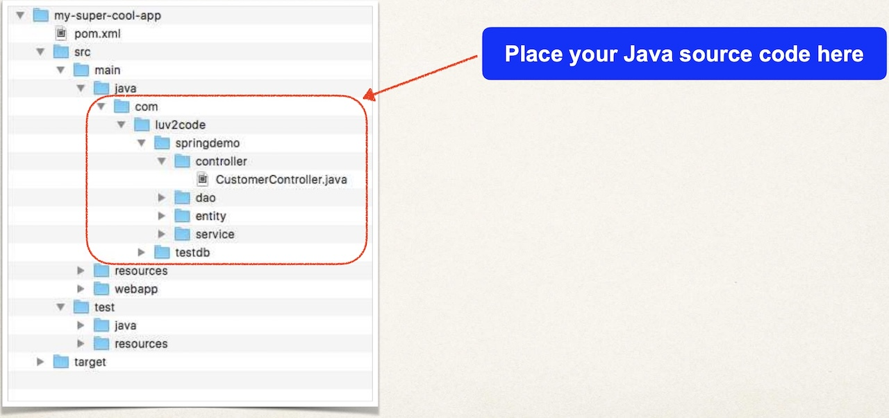
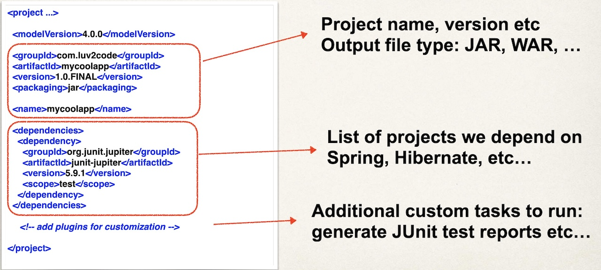
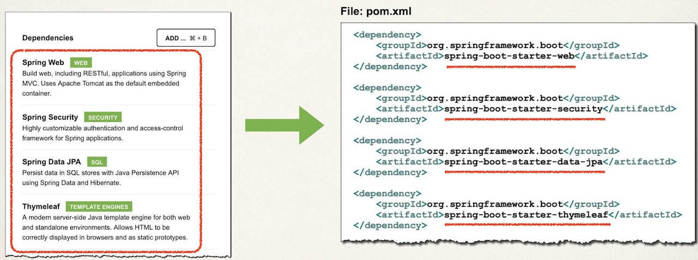
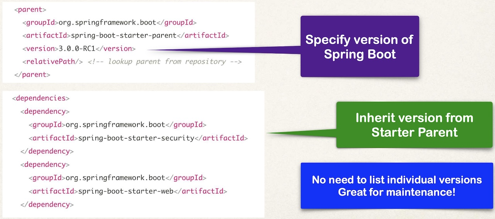
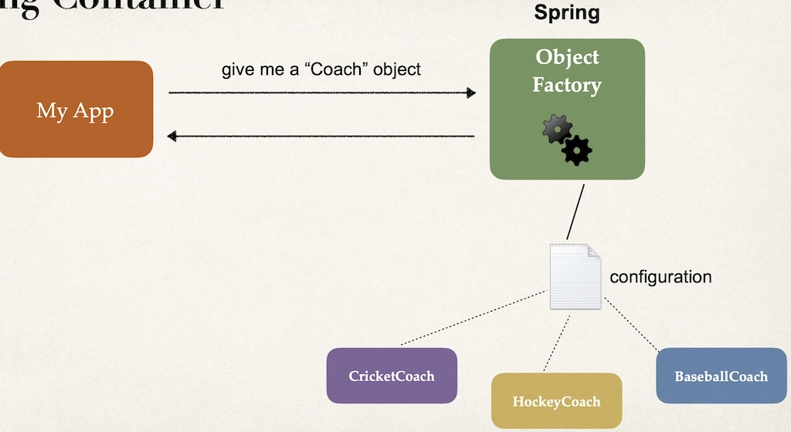
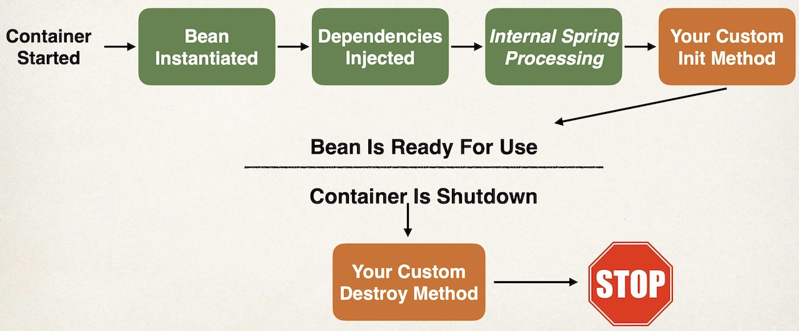

# Table of Contents

- [Table of Contents](#table-of-contents)
- [Links](#links)
  - [Part 1 - Spring Boot 3 Quick Start](#part-1---spring-boot-3-quick-start)
  - [Part 2 - Spring Core](#part-2---spring-core)
  - [Part 3 - Hibernate/JPA CRUD](#part-3---hibernatejpa-crud)
  - [Part 4 - REST CRUD APIs](#part-4---rest-crud-apis)
  - [Part 5 - REST API Security](#part-5---rest-api-security)
  - [Part 6 - Spring MVC](#part-6---spring-mvc)
  - [Part 7 - Spring MVC CRUD](#part-7---spring-mvc-crud)
  - [Part 8 - Spring MVC Security](#part-8---spring-mvc-security)
  - [Part 9 - JPA/Hibernate Advanced Mappings](#part-9---jpahibernate-advanced-mappings)
  - [Part 10 - AOP: Aspect-Oriented Programming](#part-10---aop-aspect-oriented-programming)
- [Spring Boot 3 Quick Start](#spring-boot-3-quick-start)
  - [6 - Spring Boot Initialzr Demo](#6---spring-boot-initialzr-demo)
  - [7 - Create a REST Controller (Spring Boot)](#7---create-a-rest-controller-spring-boot)
  - [8 - Spring Projects](#8---spring-projects)
  - [9 - What is Maven](#9---what-is-maven)
  - [10 - Maven Project Structure](#10---maven-project-structure)
    - [Advantages of Maven](#advantages-of-maven)
  - [11 - Maven Key Concepts](#11---maven-key-concepts)
    - [`pom.xml`](#pomxml)
    - [Project Coordinates](#project-coordinates)
    - [Dependency Coordinates](#dependency-coordinates)
  - [12,13 - Exploring Spring Boot Project Files](#1213---exploring-spring-boot-project-files)
    - [Maven Wrapper files](#maven-wrapper-files)
    - [Maven POM File](#maven-pom-file)
    - [Java Source Code](#java-source-code)
    - [`application.properties`](#applicationproperties)
    - [Static Content](#static-content)
    - [Templates](#templates)
  - [14 - `spring-boot-start-*` Dependencies](#14---spring-boot-start--dependencies)
    - [Spring Boot Starters](#spring-boot-starters)
    - [Spring MVC](#spring-mvc)
    - [Spring Boot Starter Web](#spring-boot-starter-web)
    - [Spring Boot Starters](#spring-boot-starters-1)
    - [How to View Content of Starters](#how-to-view-content-of-starters)
  - [15 - `spring-boot-starter-parent` Dependency](#15---spring-boot-starter-parent-dependency)
    - [Overriding Default Properties](#overriding-default-properties)
    - [Inheriting Parent Version](#inheriting-parent-version)
    - [Default Configuration of Spring Boot Maven Plugin](#default-configuration-of-spring-boot-maven-plugin)
    - [Advantages of `spring-boot-starter-parent`](#advantages-of-spring-boot-starter-parent)
  - [16 - `spring-boot-devtools` Dependency](#16---spring-boot-devtools-dependency)
    - [Development Process](#development-process)
  - [18 - `spring-boot-actuator` Dependency](#18---spring-boot-actuator-dependency)
    - [`actuator/health` Endpoint](#actuatorhealth-endpoint)
    - [Exposing Endpoints](#exposing-endpoints)
    - [Excluding Endpoints](#excluding-endpoints)
    - [`/actuator/info` Endpoint](#actuatorinfo-endpoint)
    - [Get A List of Beans](#get-a-list-of-beans)
    - [Development Process](#development-process-1)
  - [19,20 - Spring Boot Actuator Endpoints](#1920---spring-boot-actuator-endpoints)
  - [21,22 - `spring-boot-starter-security` Dependency - Securing Endpoints](#2122---spring-boot-starter-security-dependency---securing-endpoints)
  - [23-26 - Run Spring Boot from CLI](#23-26---run-spring-boot-from-cli)
  - [27,28 - Injecting Custom Application Properties](#2728---injecting-custom-application-properties)
    - [Development Process](#development-process-2)
  - [29,30 - Spring Boot Properties](#2930---spring-boot-properties)
    - [Logging Properties](#logging-properties)
    - [Web Properties](#web-properties)
    - [Actuator Properties](#actuator-properties)
    - [Security Properties](#security-properties)
    - [Data Properties](#data-properties)
- [Spring Core](#spring-core)
  - [31 - Inversion of Control (IOC)](#31---inversion-of-control-ioc)
    - [Spring Container](#spring-container)
    - [Ways to Configuring Spring Container](#ways-to-configuring-spring-container)
  - [32-37 - Dependency Injection](#32-37---dependency-injection)
    - [Spring AutoWiring](#spring-autowiring)
    - [Constructor Injection](#constructor-injection)
    - [Setter Injection](#setter-injection)
    - [Field Injection](#field-injection)
  - [38 - Component Scanning](#38---component-scanning)
    - [Scan Other Packages](#scan-other-packages)
    - [`@Component` Annotation](#component-annotation)
    - [`@SpringBootApplication` Annotation](#springbootapplication-annotation)
  - [44 - Qualifiers](#44---qualifiers)
    - [`@Qualifier` Annotation](#qualifier-annotation)
    - [`@Primary` Annotation](#primary-annotation)
    - [Mixing `@Primary` and `@Qualifier` Annotations](#mixing-primary-and-qualifier-annotations)
  - [49 - Lazy Initialization](#49---lazy-initialization)
    - [Lazy Initialisation](#lazy-initialisation)
    - [Advantages](#advantages)
    - [Disadvantages](#disadvantages)
    - [Global Lazy Initialisation](#global-lazy-initialisation)
  - [52 - Bean Scopes](#52---bean-scopes)
    - [Default Scope](#default-scope)
    - [Explicitly Specify Bean Scope](#explicitly-specify-bean-scope)
    - [Spring Bean Scopes](#spring-bean-scopes)
    - [Prototype Scope](#prototype-scope)
  - [54 - Bean Lifecycle Methods Annotations](#54---bean-lifecycle-methods-annotations)
    - [Bean Lifecycle](#bean-lifecycle)
    - [Bean Lifecycle Methods / Hooks](#bean-lifecycle-methods--hooks)
  - [57 - `@Bean` Annotation - Configuring Beans with Java Code](#57---bean-annotation---configuring-beans-with-java-code)
    - [Development Process](#development-process-3)
    - [Use Case for `@Bean` Annotation](#use-case-for-bean-annotation)
    - [Real-World Project Example](#real-world-project-example)
      - [Configure AWS S3 Client using `@Bean` annotation](#configure-aws-s3-client-using-bean-annotation)
      - [Inject the S3Client as a Bean](#inject-the-s3client-as-a-bean)
- [Spring Hibernate/JPA](#spring-hibernatejpa)
  - [`EntityManager` vs `JpaRepository`](#entitymanager-vs-jparepository)

# Links

[Maven Central Repository](https://mvnrepository.com/)

[Maven Central Sonatype](https://central.sonatype.com/)

https://github.com/darbyluv2code/spring-boot-3-spring-6-hibernate-for-beginners

https://www.luv2code.com/downloads/udemy-spring-boot-3/spring-boot-3-pdfs.zip

https://github.com/darbyluv2code/spring-boot-3-spring-6-hibernate-for-beginners/blob/main/11-appendix/course-links.md

## Part 1 - Spring Boot 3 Quick Start

| Name                           | Web Link                                                                                                                   |
| :----------------------------- | :------------------------------------------------------------------------------------------------------------------------- |
| IntelliJ                       | https://www.jetbrains.com/idea/                                                                                            |
| Eclipse                        | https://eclipseide.org/                                                                                                    |
| VS Code                        | https://code.visualstudio.com/                                                                                             |
| NetBeans                       | https://netbeans.apache.org/                                                                                               |
| Spring Website (main)          | https://spring.io/                                                                                                         |
| Spring Framework               | https://spring.io/projects/spring-framework/                                                                               |
| Spring Boot                    | https://spring.io/projects/spring-boot/                                                                                    |
| Spring Quickstart              | https://spring.io/quickstart/                                                                                              |
| Spring Guides                  | https://spring.io/guides/                                                                                                  |
| Spring Initializr              | https://start.spring.io/                                                                                                   |
| Spring Boot Starters           | https://docs.spring.io/spring-boot/docs/current/reference/htmlsingle/#using.build-systems.starters                         |
| Maven                          | https://maven.apache.org/                                                                                                  |
| Spring Boot Actuator Docs      | https://docs.spring.io/spring-boot/docs/current/reference/htmlsingle/#actuator                                             |
| Spring Boot Actuator Endpoints | https://docs.spring.io/spring-boot/docs/current/reference/htmlsingle/#actuator.endpoints                                   |
| Spring Boot Logging            | https://docs.spring.io/spring-boot/docs/current/reference/html/features.html#features.logging                              |
| Spring Boot Common Properties  | https://docs.spring.io/spring-boot/docs/current/reference/html/application-properties.html#appendix.application-properties |
| Install Java on MS Windows     | https://www.luv2code.com/install-java-on-ms-windows                                                                        |

## Part 2 - Spring Core

| Name                              | Web Link                                                                  |
| :-------------------------------- | :------------------------------------------------------------------------ |
| Spring Framework Reference Manual | https://docs.spring.io/spring-framework/reference/index.html              |
| Spring Boot Reference Manual      | https://docs.spring.io/spring-boot/docs/current/reference/html/index.html |

## Part 3 - Hibernate/JPA CRUD

| Name                                      | Web Link                                                         |
| :---------------------------------------- | :--------------------------------------------------------------- |
| Hibernate Object/Relational Mapping (ORM) | https://hibernate.org/orm/                                       |
| Jakarta Persistence API (JPA)             | https://jakarta.ee/specifications/persistence/                   |
| JDBC                                      | https://docs.oracle.com/javase/tutorial/jdbc/overview/index.html |
| MySQL Server Community Edition            | https://www.mysql.com/products/community/                        |
| MySQL Workbench                           | https://www.mysql.com/products/workbench/                        |

## Part 4 - REST CRUD APIs

| Name                                 | Web Link                                                     |
| :----------------------------------- | :----------------------------------------------------------- |
| Jackson JSON Databinding             | https://github.com/FasterXML/jackson-databind                |
| Spring Data JPA Reference Manual     | https://docs.spring.io/spring-data/jpa/reference/            |
| Spring Data REST Reference Manual    | https://docs.spring.io/spring-data/rest/reference/           |
| HATEOAS                              | https://spring.io/projects/spring-hateoas                    |
| Hypertext Application Language (HAL) | https://en.wikipedia.org/wiki/Hypertext_Application_Language |

## Part 5 - REST API Security

| Name                              | Web Link                                                                                  |
| :-------------------------------- | :---------------------------------------------------------------------------------------- |
| Spring Security Reference Manual  | https://docs.spring.io/spring-security/reference/index.html                               |
| Why Use Bcrypt?                   | https://danboterhoven.medium.com/why-you-should-use-bcrypt-to-hash-passwords-af330100b861 |
| Bcrypt Algorithm Analysis         | https://en.wikipedia.org/wiki/Bcrypt                                                      |
| Password Hashing - Best Practices | https://crackstation.net/hashing-security.htm                                             |
| Bcrypt Calculator                 | https://www.bcryptcalculator.com/                                                         |

## Part 6 - Spring MVC

| Name                                           | Web Link                                                                         |
| :--------------------------------------------- | :------------------------------------------------------------------------------- |
| Spring MVC Reference Manual                    | https://docs.spring.io/spring-framework/reference/web/webmvc.html                |
| Thymeleaf                                      | https://www.thymeleaf.org/                                                       |
| Thymeleaf - Creating a Form                    | https://www.thymeleaf.org/doc/tutorials/3.0/thymeleafspring.html#creating-a-form |
| Cascading Style Sheets (CSS)                   | https://developer.mozilla.org/en-US/docs/Learn/CSS                               |
| Bootstrap CSS                                  | https://getbootstrap.com/                                                        |
| Bean Validator Specification                   | https://www.beanvalidation.org                                                   |
| Hibernate Validator (Reference Implementation) | https://hibernate.org/validator/                                                 |

## Part 7 - Spring MVC CRUD

| Name                          | Web Link                                                                |
| :---------------------------- | :---------------------------------------------------------------------- |
| Spring MVC Reference Manual   | https://docs.spring.io/spring-framework/reference/web/webmvc.html       |
| Thymeleaf                     | https://www.thymeleaf.org/                                              |
| Spring Data JPA Query Methods | https://docs.spring.io/spring-data/jpa/reference/jpa/query-methods.html |

## Part 8 - Spring MVC Security

| Name                             | Web Link                                                    |
| :------------------------------- | :---------------------------------------------------------- |
| Spring Security Reference Manual | https://docs.spring.io/spring-security/reference/index.html |

## Part 9 - JPA/Hibernate Advanced Mappings

| Name                                      | Web Link                                       |
| :---------------------------------------- | :--------------------------------------------- |
| Hibernate Object/Relational Mapping (ORM) | https://hibernate.org/orm/                     |
| Jakarta Persistence API (JPA)             | https://jakarta.ee/specifications/persistence/ |

## Part 10 - AOP: Aspect-Oriented Programming

| Name                        | Web Link                                                        |
| :-------------------------- | :-------------------------------------------------------------- |
| Spring AOP Reference Manual | https://docs.spring.io/spring-framework/reference/core/aop.html |
| AspectJ                     | https://eclipse.dev/aspectj/                                    |

# Spring Boot 3 Quick Start

## 6 - Spring Boot Initialzr Demo

https://start.spring.io/

Development Process

1. Configure our project at [Spring Initializr website](https://start.spring.io/)
   - `Language: Java`
   - `Project: Maven`
   - `Spring Boot: X.Y.Z`
     - Note: AVOID the SNAPSHOT versions (which are alpha/beta Spring versions)
   - Project Metadata
     - `Group: com.example` (group = name of company/group)
     - `Artifact: demo` (artifact = name of project)
     - `Name: demo`
     - `Description: Demo project for Spring Boot`
     - `Package name: com.example.demo`
     - `Packaging: Jar`
     - `Java: 21`
   - Dependencies
     - `Spring Web`
2. Generate Project and download the zip file
3. `cd project && idea .`
4. `Shift + Shift > Add Maven Projects`
5. Run as Java Application
6. Tomcat will run on `port 8080`
7. Test with `http://localhost:8080`

## 7 - Create a REST Controller (Spring Boot)

```java
// src/main/java/com/example/demo
package com.example.demo;

import org.springframework.boot.SpringApplication;
import org.springframework.boot.autoconfigure.SpringBootApplication;

@SpringBootApplication
public class MyApplication {
  public static void main(String[] args) {
    SpringApplication.run(MyApplication.class, args);
  }
}
```

```java
// src/main/java/com/example/demo/rest
package com.example.demo.rest;

import org.springframework.web.bind.annotation.GetMapping;
import org.springframework.web.bind.annotation.RestController;

@RestController
public class RestController {
  // Expose the "/" endpoint and return "Hello World"
  @GetMapping("/")
  public String sayHello() {
    return "Hello World!";
  }
}
```

## 8 - Spring Projects

> Spring Projects = Additional Spring modules built-on top of the core Spring Framework

[Full list of Spring Projects](https://spring.io/projects)

Examples

- Spring Cloud
- Spring Data
- Spring Batch
- Spring Security
- Spring Web Services
- Spring LDAP

## 9 - What is Maven

> Maven = A Project Management tool
>
> [Maven Central Repository](https://mvnrepository.com/)
>
> [Maven Central Sonatype](https://central.sonatype.com/)

Most popular use of Maven is for build management and dependencies

When building your Java project, you may need additional JAR files e.g. Spring, Hibernate, Commons Logging, JSON etc

One approach is to download the JAR files from each project web site and manually add the JAR files to your build path / classpath

Maven Approach = Tell Maven the projects you are working with (dependencies) e.g. Spring, Hibernate etc

Maven will go out and download the JAR files for those projects for you and make those JAR files available during compile/run

## 10 - Maven Project Structure

| Directory                  | Description                                                                 |
| -------------------------- | --------------------------------------------------------------------------- |
| `myApp/src/main/java`      | Your Java source code                                                       |
| `myApp/src/main/resources` | Properties / config files used by your app                                  |
| `myApp/src/main/webapp`    | JSP files and web config files, other web assets (images, css, js, etc)     |
| `myApp/src/test`           | Unit testing code and properties                                            |
| `myApp/src/test/java`      |                                                                             |
| `myApp/src/test/resources` |                                                                             |
| `myApp/target`             | Destination directory for compiled code <br> Automatically created by Maven |



### Advantages of Maven

- Dependency Management
- Maven will find JAR files for you
- No more missing JARs
- Building and Running your Project
- No more build path / classpath issues
- Standard directory structure

## 11 - Maven Key Concepts

### `pom.xml`

> `pom.xml` = POM = Project Object Model file

- Project Metadata
  - Project name, version etc
  - Output file type: JAR, WAR
- Dependencies
  - List of projects we depend on Spring, Hibernate
- Plugins
  - Additional custom tasks to run: generate JUnit test reports, etc



```xml
<project ...>
  <modelVersion>4.0.0</modelVersion>
  <groupId>com.example</groupId>
  <artifactId>demo</artifactId>
  <version>1.0.FINAL</version>
  <packaging>jar</packaging>
  <name>demo</name>
  <dependencies>
    <dependency>
      <groupId>org.junit.jupiter</groupId>
      <artifactId>junit-jupiter</artifactId>
      <version>5.9.1</version>
      <scope>test</scope>
    </dependency>
  </dependencies>
  <!-- add plugins for customization -->
</project>
```

### Project Coordinates

```xml
<groupId>com.example</groupId> <!-- City -->
<artifactId>demo</artifactId>  <!-- Street -->
<version>1.0.0-SNAPSHOT</version>   <!-- House Number -->
```

| Name          | Description                                                                                                      |
| ------------- | ---------------------------------------------------------------------------------------------------------------- |
| `Group ID`    | Name of company, group, or organization. <br> Convention is to use reverse domain name: com.example              |
| `Artifact ID` | Name for this project: demo                                                                                      |
| `Version`     | A specific release version like: 1.0.0, 1.1.0 <br> If project is under active development then: `1.0.0-SNAPSHOT` |

### Dependency Coordinates

[Maven Central Repository](https://mvnrepository.com/)

[Maven Central Sonatype](https://central.sonatype.com/)

- `GAV` = Group ID, Artifact ID and Version

```xml
<project ...>

  <dependencies>

    <dependency>
      <groupId>org.springframework</groupId>
      <artifactId>spring-context</artifactId>
      <version>6.0.0</version>
    </dependency>

    <dependency>
      <groupId>org.hibernate.orm</groupId>
      <artifactId>hibernate-core</artifactId>
      <version>6.1.4.Final</version>
    </dependency>

  </dependencies>

</project>
```

## 12,13 - Exploring Spring Boot Project Files

| Directory            | Description                                |
| -------------------- | ------------------------------------------ |
| `src/main/java`      | Your Java source code                      |
| `src/main/resources` | Properties / config files used by your app |
| `src/test/java`      | Unit testing source code                   |

### Maven Wrapper files

- mvnw allows you to run a Maven project
- No need to have Maven installed or present on your path
- If correct version of Maven is NOT found on your computer
- Automatically downloads correct version and runs Maven

Two files are provided

- `mvnw.cmd` for MS Windows = `mvnw clean compile test`
- `mvnw.sh` for Linux/Mac = `./mvnw clean compile test`

If you already have Maven installed previously then you can ignore/delete the mvnw files

```
mvn clean compile test
mvn clean install
```

### Maven POM File

**Spring Boot Maven Plugin**

- Used to package executable jar or war archive
- Can also easily run the app

```xml
<build>
  <plugins>
    <plugin>
      <groupId>org.springframework.boot</groupId>
      <artifactId>spring-boot-maven-plugin</artifactId>
    </plugin>
  </plugins>
</build>
```

```sh
mvn package
mvn spring-boot:run
./mvnw package
./mvnw spring-boot:run
```

### Java Source Code

> Main Spring Boot Application Class (created by Spring Initializr) = `src/main/java/com/example/demo/MyApplication.java`

### `application.properties`

> By default, Spring Boot will load properties from: `src/main/resources/application.properties`

- Created by Spring Initializr
- Initially EMPTY

**Can add Spring Boot properties and/or own custom properties**

```conf
# src/main/resources/application.properties
# Configure server port
server.port=8484
# Configure custom properties
coach.name=Mario
team.name=MariosWorld
```

**Read data from: `application.properties`**

```java
import org.springframework.beans.factory.annotation.Value;
import org.springframework.web.bind.annotation.GetMapping;
import org.springframework.web.bind.annotation.RequestMapping;
import org.springframework.web.bind.annotation.RestController;

@RestController
@RequestMapping("/api")
public class RestController {

  @Value("${coach.name}")
  private String coachName;

  @Value("${team.name}")
  private String teamName;

  @GetMapping("/info")
  public String getInfo() {
    return "Coach: " + coachName + ", Team: " + teamName;
  }
}
```

### Static Content

By default, Spring Boot will load static resources from `/static` directory

Examples of static resources: HTML files, CSS, JavaScript, images, etc

Note: Do NOT use the `src/main/webapp` directory if your application is packaged as a JAR
Although this is a standard Maven directory, it works only with WAR packaging.
It is silently ignored by most build tools if you generate a JAR.

### Templates

Spring Boot includes auto-configuration for following template engines

- Thymeleaf
- FreeMarker
- Mustache

## 14 - `spring-boot-start-*` Dependencies

### Spring Boot Starters

Spring Boot Starters are:

- A curated list of Maven dependencies
- A collection of dependencies grouped together
- Tested and verified by the Spring Development team

### Spring MVC

When building a Spring MVC app, you normally need to import a lot of dependencies:

- spring-webmvc
- hibernate-validator
- thymeleaf

### Spring Boot Starter Web

> Solution: Spring Boot provides: `spring-boot-starter-web`

- It contains a collection of Maven dependencies (compatible versions) which saves developers from having to list all of the individual dependencies (by ensuring you have compatible versions)
- It contains `spring-web`, `spring-webmvc`, `hibernate-validator`, `json`, `tomcat`
- Import this by selecting the `Spring Web` dependency in Spring Initializr

```xml
<dependency>
  <groupId>org.springframework.boot</groupId>
  <artifactId>spring-boot-starter-web</artifactId>
</dependency>
```

### Spring Boot Starters



| Name                           | Description                                                                          |
| ------------------------------ | ------------------------------------------------------------------------------------ |
| `spring-boot-starter-web`      | Building web apps, includes validation, REST. Uses Tomcat as default embedded server |
| `spring-boot-starter-security` | Adding Spring Security support                                                       |
| `spring-boot-starter-data-jpa` | Spring database support with JPA and Hibernate                                       |

| Name                                         | Description                                                                                                                      |
| -------------------------------------------- | -------------------------------------------------------------------------------------------------------------------------------- |
| `spring-boot-starter`                        | Core starter, including auto-configuration support, logging, and YAML                                                            |
| `spring-boot-starter-activemq`               | Starter for JMS messaging using Apache ActiveMQ                                                                                  |
| `spring-boot-starter-amqp`                   | Starter for using Spring AMQP and Rabbit MQ                                                                                      |
| `spring-boot-starter-aop`                    | Starter for aspect-oriented programming with Spring AOP and AspectJ                                                              |
| `spring-boot-starter-artemis`                | Starter for JMS messaging using Apache Artemis                                                                                   |
| `spring-boot-starter-batch`                  | Starter for using Spring Batch                                                                                                   |
| `spring-boot-starter-cache`                  | Starter for using Spring Frameworks caching support                                                                              |
| `spring-boot-starter-cloud-connectors`       | Starter for using Spring Cloud Connectors which simplifies connecting to services                                                |
| `spring-boot-starter-data-cassandra`         | Starter for using Cassandra distributed database with Spring Data Cassandra                                                      |
| `spring-boot-starter-data-couchbase`         | Starter for using Couchbase document-oriented database and Spring Data Couchbase                                                 |
| `spring-boot-starter-data-elasticsearch`     | Starter for using Elasticsearch search and analytics engine with Spring Data Elasticsearch                                       |
| `spring-boot-starter-data-jpa`               | Starter for using Spring Data JPA with Hibernate                                                                                 |
| `spring-boot-starter-data-ldap`              | Starter for using Spring Data LDAP                                                                                               |
| `spring-boot-starter-data-mongodb`           | Starter for using MongoDB document-oriented database and Spring Data MongoDB                                                     |
| `spring-boot-starter-data-neo4j`             | Starter for using Neo4j graph database and Spring Data Neo4j                                                                     |
| `spring-boot-starter-data-r2dbc`             | Starter for using Spring Data R2DBC                                                                                              |
| `spring-boot-starter-data-redis`             | Starter for using Redis key-value data store with Spring Data Redis                                                              |
| `spring-boot-starter-data-solr`              | Starter for using Apache Solr search platform with Spring Data Solr                                                              |
| `spring-boot-starter-freemarker`             | Starter for building MVC web applications using FreeMarker views                                                                 |
| `spring-boot-starter-groovy-templates`       | Starter for building MVC web applications using Groovy Templates views                                                           |
| `spring-boot-starter-hateoas`                | Starter for building hypermedia-based RESTful web application with Spring HATEOAS                                                |
| `spring-boot-starter-integration`            | Starter for using Spring Integration                                                                                             |
| `spring-boot-starter-jdbc`                   | Starter for using JDBC with the HikariCP connection pool                                                                         |
| `spring-boot-starter-jersey`                 | Starter for building RESTful web applications using JAX-RS and Jersey                                                            |
| `spring-boot-starter-jooq`                   | Starter for using jOOQ to access SQL databases                                                                                   |
| `spring-boot-starter-json`                   | Starter for using JSON processing with Jackson                                                                                   |
| `spring-boot-starter-jta-atomikos`           | Starter for JTA transactions using Atomikos                                                                                      |
| `spring-boot-starter-jta-bitronix`           | Starter for JTA transactions using Bitronix                                                                                      |
| `spring-boot-starter-mail`                   | Starter for using Java Mail and Spring Frameworks email sending support                                                          |
| `spring-boot-starter-mustache`               | Starter for building MVC web applications using Mustache views                                                                   |
| `spring-boot-starter-oauth2-client`          | Starter for using Spring Securitys OAuth2/OpenID Connect client features                                                         |
| `spring-boot-starter-oauth2-resource-server` | Starter for using Spring Securitys OAuth2 resource server features                                                               |
| `spring-boot-starter-quartz`                 | Starter for using the Quartz scheduler                                                                                           |
| `spring-boot-starter-rsocket`                | Starter for building RSocket clients and servers                                                                                 |
| `spring-boot-starter-security`               | Starter for using Spring Security                                                                                                |
| `spring-boot-starter-test`                   | Starter for testing Spring Boot applications with libraries including JUnit, Hamcrest, and Mockito                               |
| `spring-boot-starter-thymeleaf`              | Starter for building MVC web applications using Thymeleaf views                                                                  |
| `spring-boot-starter-validation`             | Starter for using Java Bean Validation with Hibernate Validator                                                                  |
| `spring-boot-starter-web`                    | Starter for building web, including RESTful, applications using Spring MVC. Uses Tomcat as the default embedded container        |
| `spring-boot-starter-web-services`           | Starter for using Spring Web Services                                                                                            |
| `spring-boot-starter-webflux`                | Starter for building WebFlux applications using Spring Frameworks Reactive Web support                                           |
| `spring-boot-starter-websocket`              | Starter for building WebSocket applications using Spring Frameworks WebSocket support                                            |
| `spring-boot-starter-actuator`               | Starter for using Spring Boots Actuator which provides production-ready features to help you monitor and manage your application |
| `spring-boot-starter-jetty`                  | Starter for using Jetty as the embedded servlet container                                                                        |
| `spring-boot-starter-tomcat`                 | Starter for using Tomcat as the embedded servlet container                                                                       |
| `spring-boot-starter-undertow`               | Starter for using Undertow as the embedded servlet container                                                                     |

### How to View Content of Starters

> Use the `View Dependency Management` of IDEs

In IntelliJ use: `View > Tool Windows > Maven Projects > Dependencies`

## 15 - `spring-boot-starter-parent` Dependency

`spring-boot-starter-parent` is a special starter parent provided by Spring Boot

It provides Maven defaults such as:

- Default compiler level
- UTF-8 source encoding

```xml
<parent>
  <groupId>org.springframework.boot</groupId>
  <artifactId>spring-boot-starter-parent</artifactId>
  <version>3.3.4</version>
  <relativePath /> <!-- lookup parent from repository -->
</parent>
```

### Overriding Default Properties

To override a default, set as a property

```xml
<properties>
  <java.version>17</java.version>
</properties>
```

### Inheriting Parent Version

For the `spring-boot-starter-*` dependencies we do NOT need to list version as they INHERIT from the PARENT



### Default Configuration of Spring Boot Maven Plugin

`spring-boot-starter-parent` also provides default configuration of the `spring-boot-maven-plugin`

Use `mvn spring-boot:run`

```
<build>
  <plugins>
    <plugin>
      <groupId>org.springframework.boot</groupId>
      <artifactId>spring-boot-maven-plugin</artifactId>
    </plugin>
  </plugins>
</build>
```

### Advantages of `spring-boot-starter-parent`

- Default Maven configuration: Java version, UTF-encoding etc
- Dependency management
- Use version on parent only
- `spring-boot-starter-*` dependencies inherit version from parent
- Default configuration of Spring Boot plugin

## 16 - `spring-boot-devtools` Dependency

spring-boot-devtools: automatically restarts your application when code is updated

```xml
<dependency>
  <groupId>org.springframework.boot</groupId>
  <artifactId>spring-boot-devtools</artifactId>
</dependency>
```

Note: IntelliJ Community Edition does not support DevTools by default (extra configuration required)

- `Preferences > Build, Execution, Deployment > Compiler > Turn ON > Build project automatically`
- `Preferences > Advanced Settings > Turn ON > Allow auto-make to start even if developed application is currently running`

### Development Process

1. Apply IntelliJ configurations
2. Edit `pom.xml` and add `spring-boot-devtools`
   - In IntelliJ click the circle to reload Maven
3. Add new REST endpoint to our app
4. Verify the app is automatically reloaded

## 18 - `spring-boot-actuator` Dependency

[Spring Boot Actuator Docs](https://docs.spring.io/spring-boot/reference/actuator/endpoints.html#page-title)

Problem

- How can I monitor and manage my application?
- How can I check the application health?
- How can I access application metrics?

Solution: `spring-boot-actuator`

- Exposes endpoints to monitor and manage your application
- You easily get DevOps functionality out-of-the-box
- Simply add the dependency to your POM file
- REST endpoints are automatically added to your application

```xml
<dependency>
  <groupId>org.springframework.boot</groupId>
  <artifactId>spring-boot-starter-actuator</artifactId>
</dependency>
```

Automatically exposes endpoints for metrics out-of-the-box
Endpoints are prefixed with: `/actuator`

| Name               | Description                               |
| ------------------ | ----------------------------------------- |
| `/actuator/health` | Health information about your application |

### `actuator/health` Endpoint

- `/actuator/health` checks the status of your application
- Normally used by monitoring apps to see if your app is up or down

### Exposing Endpoints

By default, only `/actuator/health` is exposed

To expose all actuator endpoints over HTTP

```conf
# src/main/resources/application.properties
# Use wildcard "*" to expose all endpoints
# Can also expose individual endpoints with a comma-delimited list
management.endpoints.web.exposure.include=*
```

### Excluding Endpoints

```conf
# src/main/resources/application.properties

# Exclude individual endpoints with a comma-delimited list
management.endpoints.web.exposure.exclude=health,info
```

### `/actuator/info` Endpoint

`actuator/info` gives information about your application

Default is an EMPTY page

To expose `actuator/info` update `application.properties` with your app info

```conf
# src/main/resources/application.properties
management.endpoints.web.exposure.include=health,info
management.info.env.enabled=true
info.app.name=My App
info.app.description=A Spring Boot Application
info.app.version=1.0.0
```

[Spring Boot Endpoints](https://docs.spring.io/spring-boot/reference/actuator/endpoints.html#page-title)

| ID                           | Description                                                                                                                                                  |
| ---------------------------- | ------------------------------------------------------------------------------------------------------------------------------------------------------------ |
| `/actuator/auditevents`      | Exposes audit events information for the current application. Requires an AuditEventRepository bean                                                          |
| `/actuator/beans`            | Displays a complete list of all the Spring beans in your application                                                                                         |
| `/actuator/caches`           | Exposes available caches                                                                                                                                     |
| `/actuator/conditions`       | Shows the conditions that were evaluated on configuration and auto-configuration classes and the reasons why they did or did not match                       |
| `/actuator/configprops`      | Displays a collated list of all @ConfigurationProperties. Subject to sanitization                                                                            |
| `/actuator/env`              | Exposes properties from Springs ConfigurableEnvironment. Subject to sanitization                                                                             |
| `/actuator/flyway`           | Shows any Flyway database migrations that have been applied. Requires one or more Flyway beans                                                               |
| `/actuator/health`           | Shows application health information                                                                                                                         |
| `/actuator/httpexchanges`    | Displays HTTP exchange information (by default, the last 100 HTTP request-response exchanges). Requires an HttpExchangeRepository bean                       |
| `/actuator/info`             | Displays arbitrary application info                                                                                                                          |
| `/actuator/integrationgraph` | Shows the Spring Integration graph. Requires a dependency on spring-integration-core                                                                         |
| `/actuator/loggers`          | Shows and modifies the configuration of loggers in the application                                                                                           |
| `/actuator/liquibase`        | Shows any Liquibase database migrations that have been applied. Requires one or more Liquibase beans                                                         |
| `/actuator/metrics`          | Shows metrics information for the current application                                                                                                        |
| `/actuator/mappings`         | Displays a collated list of all @RequestMapping paths                                                                                                        |
| `/actuator/quartz`           | Shows information about Quartz Scheduler jobs. Subject to sanitization                                                                                       |
| `/actuator/scheduledtasks`   | Displays the scheduled tasks in your application                                                                                                             |
| `/actuator/sessions`         | Allows retrieval and deletion of user sessions from a Spring Session-backed session store. Requires a servlet-based web application that uses Spring Session |
| `/actuator/shutdown`         | Lets the application be gracefully shutdown. Only works when using jar packaging. Disabled by default                                                        |
| `/actuator/startup`          | Shows the startup steps data collected by the ApplicationStartup. Requires the SpringApplication to be configured with a BufferingApplicationStartup         |
| `/actuator/threaddump`       | Performs a thread dump                                                                                                                                       |

If your application is a web application (Spring MVC, Spring WebFlux, or Jersey), you can use the following additional endpoints:

| ID                     | Description                                                                                                                                                                                         |
| ---------------------- | --------------------------------------------------------------------------------------------------------------------------------------------------------------------------------------------------- |
| `/actuator/heapdump`   | Returns a heap dump file. On a HotSpot JVM, an HPROF-format file is returned. On an OpenJ9 JVM, a PHD-format file is returned.                                                                      |
| `/actuator/logfile`    | Returns the contents of the logfile (if the logging.file.name or the logging.file.path property has been set). Supports the use of the HTTP Range header to retrieve part of the log files content. |
| `/actuator/prometheus` | Exposes metrics in a format that can be scraped by a Prometheus server. Requires a dependency on micrometer-registry-prometheus.                                                                    |

### Get A List of Beans

Access via `http://localhost:8080/actuator/beans`

### Development Process

1. Edit `pom.xml` and add `spring-boot-starter-actuator`
2. View actuator endpoints for: `/health`
3. Edit `application.properties` to customize `/info`

## 19,20 - Spring Boot Actuator Endpoints

[Json Viewer Chrome Extension](https://chromewebstore.google.com/detail/json-viewer/efknglbfhoddmmfabeihlemgekhhnabb)

## 21,22 - `spring-boot-starter-security` Dependency - Securing Endpoints

Add `spring-boot-starter-security` Dependency to secure actuator endpoints

```xml
<dependency>
  <groupId>org.springframework.boot</groupId>
  <artifactId>spring-boot-starter-security</artifactId>
</dependency>
```

Default username = `user`
Default password = CHECK_LOG_OUTPUT

Override default user name and generated password

```conf
# src/main/resources/application.properties
spring.security.user.name=usr
spring.security.user.password=pwd
```

## 23-26 - Run Spring Boot from CLI

```sh
java -jar myApp.jar

mvn clean package && mvn spring-boot:run
```

## 27,28 - Injecting Custom Application Properties

### Development Process

1. Define custom properties in application.properties
2. Inject properties into Spring Boot application using @Value

**Can add Spring Boot properties and/or own custom properties**

```conf
# src/main/resources/application.properties
server.port=5432
coach.name=Seth
```

**Read data from: `application.properties`**

```conf
# src/main/resources/application.properties
server.port=5432
# configure server port
server.port=8484
# configure custom properties
coach.name=Mario
team.name=MariosWorld
```

```java
import org.springframework.beans.factory.annotation.Value;
import org.springframework.web.bind.annotation.GetMapping;
import org.springframework.web.bind.annotation.RequestMapping;
import org.springframework.web.bind.annotation.RestController;

@RestController
@RequestMapping("/api")
public class RestController {

  @Value("${coach.name}")
  private String coachName;

  @Value("${team.name}")
  private String teamName;

  @GetMapping("/info")
  public String getInfo() {
    return "Coach: " + coachName + ", Team: " + teamName;
  }
}
```

## 29,30 - Spring Boot Properties

[Spring Boot Properties List](https://docs.spring.io/spring-boot/appendix/application-properties/index.html)

The properties are roughly grouped into the following categories

- Core
- Web
- Security
- Data
- Actuator
- Integration
- DevTools
- Testing

### Logging Properties

```conf
# src/main/resources/application.properties
# Log levels severity mapping (based on package names)
logging.level.org.springframework=DEBUG
logging.level.org.hibernate=TRACE
logging.level.com.example=INFO
# Log file name
logging.file.name=log.log
logging.file.path=/Users/same/Downloads/
```

### Web Properties

```conf
# src/main/resources/application.properties
# HTTP server port
server.port=5432
# Context path of the application
server.servlet.context-path=/api # `/api` in `http://localhost:5432/api/test`
# Default HTTP session time out
server.servlet.session.timeout=15m
```

### Actuator Properties

```conf
# src/main/resources/application.properties
# Endpoints to include by name or wildcard
management.endpoints.web.exposure.include=*
# Endpoints to exclude by name or wildcard
management.endpoints.web.exposure.exclude=beans,mapping
# Base path for actuator endpoints
management.endpoints.web.base-path=/actuator # `/actuator` in `localhost:5432/actuator/health`
```

### Security Properties

```conf
# src/main/resources/application.properties
spring.security.user.name=usr
spring.security.user.password=pwd
```

### Data Properties

```conf
# src/main/resources/application.properties
# JDBC URL of the database
spring.datasource.url=jdbc:mysql://localhost:3306/ecommerce
# Login username of the database
spring.datasource.username=usr
# Login password of the database
spring.datasource.password=pwd
```

# Spring Core

## 31 - Inversion of Control (IOC)

> Inversion of Control = IOC = The approach of outsourcing the construction and management of objects

### Spring Container

Primary functions of Spring Container (Object Factory)

- Create and manage objects (Inversion of Control)
- Inject object dependencies (Dependency Injection)



### Ways to Configuring Spring Container

- XML configuration file (legacy)
- Java Annotations (modern)
- Java Source Code (modern)

## 32-37 - Dependency Injection

> The Dependency Inversion Principle = The client delegates to another service/object the responsibility of providing its dependencies

### Spring AutoWiring

For dependency injection, Spring can use autowiring with the `@Autowired` annotation

- Spring will look for a class that matches by type: class or interface
- Spring will inject it automatically hence it is autowired

**Autowiring Example**

`MyController` needs to use the `Coach` interface

- Injecting a Coach implementation
- Spring will scan files for `@Component` annotations to determine if any files implement the `Coach` interface
- If found (e.g. `SwimCoach`), it will inject them into `MyController`

```
Web Browser -> `/randomworkoutset`      -> MyController -> getRandomWorkoutSet()    -> Coach
            <- "200m Individual Medley" <-              <- "200m Individual Medley" <-
```

```java
// Coach.java
package com.example.demo;

public interface Coach {
  String getRandomWorkoutSet();
}
```

```java
// SwimCoach.java
package com.example.demo;

import org.springframework.stereotype.Component;

@Component
public class SwimCoach implements Coach {
  @Override
  public String getRandomWorkoutSet() {
    return "200m Individual Medley";
  }
}
```

### Constructor Injection

> Use Constructor Injection for REQUIRED/MANDATORY dependencies
>
> Note: Constructor injection can also be automatically handled with the `@AllArgsConstructor` annotation/decorator on the class from `import lombok.AllArgsConstructor`

Development Process

1. Define the dependency interface and class
2. Create Demo REST Controller
3. Create a constructor in your class for injections
4. Add `@GetMapping` for /randomworkoutset

```java
package com.example.demo;

import org.springframework.beans.factory.annotation.Autowired;
import org.springframework.web.bind.annotation.GetMapping;
import org.springframework.web.bind.annotation.RestController;

@RestController
public class DemoController {
  private Coach coach;

  // @Autowired annotation tells Spring to inject a dependency
  // Note: If you only have one constructor then @Autowired on constructor is optional
  @Autowired // <-- HERE (Constructor Injection)
  public DemoController(Coach coach) {
    this.coach = coach;
  }

  @GetMapping("/randomworkoutset")
  public String getRandomWorkoutSet() {
    return coach.getRandomWorkoutSet();
  }
}
```

Behind the Scenes of Constructor Injection

```java
Coach coach = new SwimCoach();
DemoController demoController = new DemoController(coach);
```

### Setter Injection

> Setter Injection = Inject dependencies by calling setter method(s) on your class
>
> Use Setter Injection for OPTIONAL dependencies
>
> If dependency is not provided, your app can provide reasonable default logic

```java
// package com.example.demo;

import org.springframework.beans.factory.annotation.Autowired;
import org.springframework.web.bind.annotation.RestController;

@RestController
public class DemoController {
  private Coach coach;

  @Autowired // <-- HERE (Setter Injection)
  public void setCoach(Coach coach) {
    this.coach = coach;
  }
}
```

Behind the Scenes of Setter Injection

```java
Coach coach = new SwimCoach();
DemoController demoController = new DemoController();
demoController.setCoach(coach);
```

### Field Injection

> Field Injection = Inject dependencies by setting field values on your class directly (even private fields)

```java
package com.example.demo;

import org.springframework.beans.factory.annotation.Autowired;
import org.springframework.web.bind.annotation.GetMapping;
import org.springframework.web.bind.annotation.RestController;

@RestController
public class DemoController {
  @Autowired // <-- HERE (Dependency Injection)
  private Coach coach;

  @GetMapping("/randomworkoutset")
  public String getRandomWorkoutSet() {
    return coach.getRandomWorkoutSet();
  }
}
```

## 38 - Component Scanning

Spring will scan your Java classes for special annotations and automatically register the beans in the Spring container

- `@Component`
- `@Service`
- `@Repository`
- `@Controller`
- `@RestController`
- `@Configuration`

Note: Spring Bean = A regular Java class that is managed by Spring

By default, Spring Boot starts component scanning

- From same package as your **main Spring Boot application**
- Also scans sub-packages recursively

This implicitly defines a base search package

- Allows you to leverage default component scanning
- No need to explicitly reference the base package name

### Scan Other Packages

Explicitly list base packages to scan

```java
package com.example.demo;

import org.springframework.boot.SpringApplication;
import org.springframework.boot.autoconfigure.SpringBootApplication;

@SpringBootApplication(scanBasePackages = {
  "com.example.demo2",
  "com.udemy.spring",
  "org.github.same",
  "unsw.edu.au"
})
public class MainApplication {
  public static void main(String[] args) {
    SpringApplication.run(MainApplication.class, args);
  }
}
```

### `@Component` Annotation

`@Component` marks the class as a Spring Bean AND makes the bean available for dependency injection

- Note: A Spring Bean is just a regular Java class that is managed by Spring

### `@SpringBootApplication` Annotation

The `@SpringBootApplication` annotation is composed of following annotations

| Annotation                 | Description                                                                      |
| -------------------------- | -------------------------------------------------------------------------------- |
| `@EnableAutoConfiguration` | Enables Spring Boot's auto-configuration support                                 |
| `@ComponentScan`           | Enables component scanning of current package and recursively scans sub-packages |
| `@Configuration`           | Able to register extra beans with `@Bean` or import other configuration classes  |

## 44 - Qualifiers

Autowiring

- Injecting a Coach implementation
- Spring will scan @Components
- What if we have multiple classes that implement the Coach interface?
  - `SwimCoach`
  - `TennisCoach`
  - `FrisbeeCoach`
  - `BadmintonCoach`

Solution 1 = `@Qualifier` Annotation

Solution 2 = `@Primary` Annotation

### `@Qualifier` Annotation

> Add `@Qualifier(camelCaseOfTargetClass)` in MAIN class
>
> Note: In the `@Qualifier` annotation we use the **same name as target class BUT USE camelCASE (i.e. FIRST character is lowercase)**

**Constructor Injection**

```java
package com.example.demo.rest;

import com.example.demo.common.Coach;
import org.springframework.beans.factory.annotation.Autowired;
import org.springframework.beans.factory.annotation.Qualifier;

@RestController
public class DemoController {
  private Coach coach;

  @Autowired
  public DemoController(@Qualifier("swimCoach") Coach coach) { // <-- HERE (note: MUST USE camelCase)
    this.coach = coach;
  }

  @GetMapping("/dailyworkout")
  public String getDailyWorkout() {
    return coach.getDailyWorkout();
  }
}
```

**Setter Injection**

```java
package com.example.demo.rest;

import com.example.demo.common.Coach;
import org.springframework.beans.factory.annotation.Autowired;
import org.springframework.beans.factory.annotation.Qualifier;

@RestController
public class DemoController {
  private Coach coach;

  @Autowired
  public void setCoach(@Qualifier("cricketCoach") Coach coach) { // <-- HERE (note: MUST USE camelCase)
    this.coach = coach;
  }

  @GetMapping("/dailyworkout")
  public String getDailyWorkout() {
    return coach.getDailyWorkout();
  }
}
```

### `@Primary` Annotation

> Add `@Primary` annotation in IMPLEMENTATION class
>
> Note: Can only add `@Primary` annotation to ONE IMPLEMENTATION class
>
> Note: If you use the `@Primary` annotation in the IMPLEMENTATION class, then we do NOT need the `@Qualifer` annotation in the MAIN class

```java
package com.example.demo.common;

import org.springframework.context.annotation.Primary;
import org.springframework.stereotype.Component;

@Component
@Primary // <-- HERE
public class TrackCoach implements Coach {
  @Override
  public String getDailyWorkout() {
    return "Run 5km";
  }
}
```

```java
package com.example.demo.rest;

import com.example.demo.common.Coach;
import org.springframework.beans.factory.annotation.Autowired;

@RestController
public class DemoController {
  private Coach coach;

  @Autowired
  public DemoController(Coach coach) {
    this.coach = coach;
  }

  @GetMapping("/dailyworkout")
  public String getDailyWorkout() {
    return coach.getDailyWorkout();
  }
}
```

### Mixing `@Primary` and `@Qualifier` Annotations

> `@Qualifier > @Primary`

If you mix `@Primary` and `@Qualifier` annotation usage, then **`@Qualifier` has HIGHER priority**

## 49 - Lazy Initialization

By default, when your application starts, all beans with annotations `@Component`, `@Service`, `@Repository`, `@Controller`, `@RestController`, `@Configuration` are initialised

- Spring will create an instance of each and make them available

Note: We can prove this by adding println diagnostics to constructors of each bean

```java
package com.example.demo.common;

import org.springframework.context.annotation.Primary;
import org.springframework.stereotype.Component;

@Component
public class CricketCoach implements Coach {
  public CricketCoach() {
    System.out.println("In constructor: " + getClass().getSimpleName());
  }
}
```

### Lazy Initialisation

Instead of creating all beans up front, we can specify lazy initialization

A bean will only be initialized in the following cases:

- It is needed for dependency injection
- Or it is explicitly requested

Achieved by adding the `@Lazy` annotation to a given class

```java
import org.springframework.context.annotation.Lazy;
import org.springframework.stereotype.Component;

@Component
@Lazy
public class TrackCoach implements Coach {
  public TrackCoach() {
    System.out.println("In constructor: " + getClass().getSimpleName());
  }
}
```

### Advantages

- Only create objects as needed
- May help with faster startup time if you have large number of components

### Disadvantages

- If you have web related components like @RestController, not created until requested
- May not discover configuration issues until too late
- Need to make sure you have enough memory for all beans once created

### Global Lazy Initialisation

```conf
# src/main/resources/application.properties
spring.main.lazy-initialization=true
```

All beans are lazy, no beans are created until needed including our DemoController

Once we access REST endpoint /dailyworkout Spring will determine dependencies for DemoController

For dependency resolution Spring creates instance of CricketCoach first then creates instance of DemoController and injects the CricketCoach

## 52 - Bean Scopes

Bean Scope refers to the lifecycle of a bean

- How long does the bean live?
- How many instances are created?
- How is the bean shared?

### Default Scope

Default Bean Scope = Singleton

This means Spring Container creates only ONE instance of the bean, by default

- **Cached in memory**
- **All dependency injections for the bean will reference the SAME bean**

```java
import org.springframework.beans.factory.annotation.Autowired;
import org.springframework.beans.factory.annotation.Qualifier;
import org.springframework.web.bind.annotation.RestController;

@RestController
public class DemoController {
  private Coach coach1;
  private Coach coach2;

  @Autowired
  public DemoController(@Qualifier("cricketCoach") Coach coach1, @Qualifier("cricketCoach") Coach coach2) { // <-- BOTH coach instances point to the SAME CricketCoach BEAN
    this.coach1 = coach1;
    this.coach2 = coach2;
  }
}
```

### Explicitly Specify Bean Scope

```java
import org.springframework.beans.factory.config.ConfigurableBeanFactory;
import org.springframework.context.annotation.Scope;
import org.springframework.stereotype.Component;

@Component
@Scope(ConfigurableBeanFactory.SCOPE_SINGLETON) // <-- HERE
// @Scope(ConfigurableBeanFactory.SCOPE_PROTOTYPE) // <-- HERE
public class SwimCoach implements Coach {
  @Override
  public String getRandomWorkoutSet() {
    return "200m Individual Medley";
  }
}
```

### Spring Bean Scopes

| Scope               | Description                                                 |
| ------------------- | ----------------------------------------------------------- |
| `SCOPE_SINGLETON`   | Create a single shared instance of the bean (DEFAULT SCOPE) |
| `SCOPE_PROTOTYPE`   | Creates a new bean instance for each container request      |
| `SCOPE_REQUEST`     | Scoped to an HTTP web request (only used for web apps)      |
| `SCOPE_SESSION`     | Scoped to an HTTP web session (only used for web apps)      |
| `SCOPE_APPLICATION` | Scoped to a web app ServletContext (only used for web apps) |
| `SCOPE_WEBSOCKET`   | Scoped to a web socket (only used for web apps)             |

### Prototype Scope

> For "PROTOTYPE" scoped beans, Spring does NOT call the destroy method

In contrast to the other scopes, Spring does NOT manage the complete lifecycle of a prototype bean: the container instantiates, configures, and otherwise assembles a prototype object, and hands it to the client, with no further record of that prototype instance.

Thus, although initialization lifecycle callback methods are called on all objects regardless of scope, in the case of prototypes, configured destruction lifecycle callbacks are NOT called.

The client code must clean up prototype-scoped objects and release expensive resources that the prototype bean(s) are holding.

## 54 - Bean Lifecycle Methods Annotations

### Bean Lifecycle



### Bean Lifecycle Methods / Hooks

- You can add custom code during Bean INITIALISATION
  - Calling custom business logic methods
  - Setting up handles to resources (db, sockets, file etc)
- You can add custom code during Bean DESTRUCTION
  - Calling custom business logic method
  - Clean up handles to resources (db, sockets, files etc)

```java
import org.springframework.beans.factory.config.ConfigurableBeanFactory;
import org.springframework.context.annotation.Scope;
import org.springframework.stereotype.Component;
// import javax.annotation.PostConstruct;
// import javax.annotation.PreDestroy;
import jakarta.annotation.PostConstruct;
import jakarta.annotation.PreDestroy;

@Component
@Scope(ConfigurableBeanFactory.SCOPE_SINGLETON)
public class SwimCoach implements Coach {
  @Override
  public String getRandomWorkoutSet() {
    return "200m Individual Medley";
  }

  @PostConstruct // <-- HERE
  public void customStartUpMethod() {
    System.out.println("In customStartUpMethod(): " + getClass().getSimpleName());
  }

  @PreDestroy // <-- HERE
  public void customCleanUpMethod() {
    System.out.println("In customCleanUpMethod(): " + getClass().getSimpleName());
  }
}
```

## 57 - `@Bean` Annotation - Configuring Beans with Java Code

### Development Process

1. Create `@Configuration` class
2. Define `@Bean` method to configure the bean
3. Inject the bean into our controller

```java
package com.example.demo.common;

// Note: There are NO annotations used on this class
public class SwimCoach implements Coach {
  @Override
  public String getRandomWorkoutSet() {
    return "200m Individual Medley";
  }
}
```

```java
package com.example.demo.config;

import com.example.demo.common.Coach;
import com.example.demo.common.SwimCoach;
import org.springframework.context.annotation.Bean;
import org.springframework.context.annotation.Configuration;

@Configuration // <-- HERE (Step 1: create a Java class and annotate as @Configuration)
public class SportConfig {
  @Bean // <-- HERE (Step 2: Define @Bean method to configure the bean) [note: The bean id defaults to the method name]
  // @Bean("swimCoachCustomId")
  public Coach swimCoach() {
    return new SwimCoach();
  }
}
```

```java
package com.example.demo.rest;

import com.example.demo.common.Coach;
import org.springframework.beans.factory.annotation.Autowired;
import org.springframework.beans.factory.annotation.Qualifier;
import org.springframework.web.bind.annotation.GetMapping;
import org.springframework.web.bind.annotation.RestController;

@RestController
public class DemoController {
  private Coach myCoach;

  @Autowired
  public DemoController(@Qualifier("swimCoach") Coach theCoach) { // <-- HERE (Step 3: Inject the bean using the bean id) [note: The bean id defaults to the method name]
  // public DemoController(@Qualifier("swimCoachCustomId") Coach theCoach) {
    System.out.println("In constructor: " + getClass().getSimpleName());
    myCoach = theCoach;
  }
}
```

### Use Case for `@Bean` Annotation

> Make an existing third-party class available to Spring framework

- You may not have access to the source code of third-party class
- However, you would like to use the third-party class as a Spring bean

### Real-World Project Example

- Our project used uses Amazon Simple Storage Service (Amazon S3) to store documents (Amazon S3 is a cloud-based storage system can store PDF documents, images, etc)
- We wanted to use the AWS S3 client as a Spring bean in our app
- The AWS S3 client code is part of AWS SDK

  - We CANNOT modify the AWS SDK source code
  - We CANNOT just add @Component
  - However, we can configure it as a Spring bean using `@Bean` annotation

- We could use the Amazon S3 Client in our Spring application
- The Amazon S3 Client class was not originally annotated with @Component
- However, we configured the S3 Client as a Spring Bean using @Bean
- It is now a Spring Bean and we can inject it into other services of our application

#### Configure AWS S3 Client using `@Bean` annotation

```java
package com.example.demo.config;

import software.amazon.awssdk.auth.credentials.ProfileCredentialsProvider;
import software.amazon.awssdk.regions.Region;
import software.amazon.awssdk.services.s3.S3Client;

@Configuration
public class DocumentsConfig {
  @Bean // <-- HERE
  public S3Client remoteClient() {
    // Create an S3 client to connect to AWS S3
    ProfileCredentialsProvider credentialsProvider = ProfileCredentialsProvider.create();
    Region region = Region.US_EAST_1;
    S3Client s3Client = S3Client.builder()
      .region(region)
      .credentialsProvider(credentialsProvider)
      .build();
    return s3Client;
  }
}
```

#### Inject the S3Client as a Bean

```java
package com.example.demo.services;

import software.amazon.awssdk.services.s3.S3Client;

@Component
public class DocumentsService {
  private S3Client s3Client;

  @Autowired // <-- HERE
  public DocumentsService(S3Client S3Client) {
    this.s3Client = S3Client;
  }

  public void processDocument(Document document) {
    // Get the document input stream and file size
    // Store document in AWS S3
    // Create a put request for the object
    PutObjectRequest putObjectRequest = PutObjectRequest.builder()
      .bucket(bucketName)
      .key(subDirectory + "/" + fileName)
      .acl(ObjectCannedACL.BUCKET_OWNER_FULL_CONTROL).build();
    // Perform the putObject operation to AWS S3 using our autowired bean
    s3Client.putObject(putObjectRequest, RequestBody.fromInputStream(fileInputStream, contentLength));
  }
}
```

# Spring Hibernate/JPA

## `EntityManager` vs `JpaRepository`

> EntityManager = If you need low-level control and flexibility
> JpaRepository = If you want high-level of abstraction

Entity Manager

- Need low-level control over the database operations and want to write custom queries
- Provides low-level access to JPA and work directly with JPA entities
- Complex queries that required advanced features such as native SQL queries or stored procedure calls
- When you have custom requirements that are not easily handled by higher-level abstractions

JpaRepository

- Provides commonly used CRUD operations out of the box, reducing the amount of code you need to write
- Additional features such as pagination, sorting
- Generate queries based on method names
- Can also create custom queries using @Query
