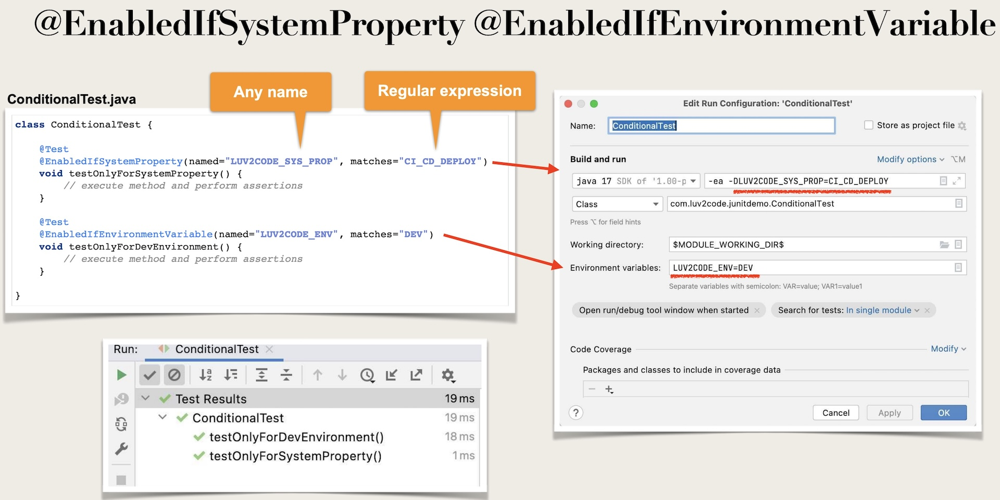
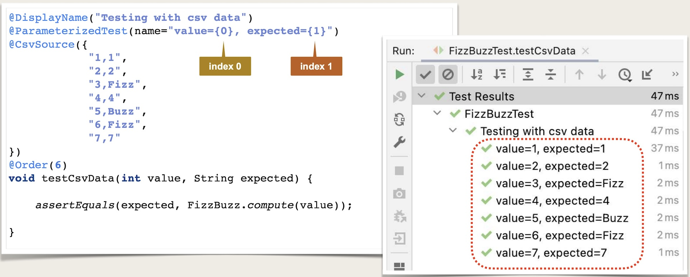
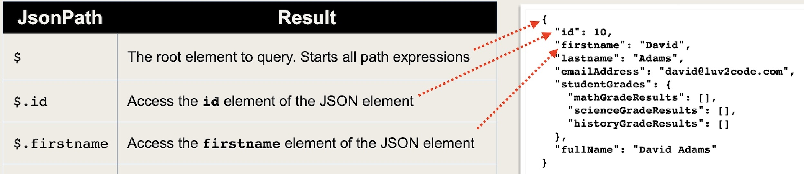

# Table of Contents

- [Table of Contents](#table-of-contents)
- [Spring Boot Unit Testing with JUnit, Mockito and MockMVC - Chad Darby](#spring-boot-unit-testing-with-junit-mockito-and-mockmvc---chad-darby)
- [Links](#links)
- [JUnit Review](#junit-review)
  - [Unit Testing](#unit-testing)
  - [Integration Testing](#integration-testing)
  - [Unit Testing Frameworks](#unit-testing-frameworks)
  - [Development Process](#development-process)
    - [1. Add Maven dependencies for JUnit](#1-add-maven-dependencies-for-junit)
    - [2. Create test package](#2-create-test-package)
    - [3. Create unit test](#3-create-unit-test)
  - [JUnit Assertioins](#junit-assertioins)
  - [Lifecycle Methods](#lifecycle-methods)
  - [Custom Display Names](#custom-display-names)
    - [`@DisplayName` Annotation](#displayname-annotation)
    - [Display Name Generators](#display-name-generators)
  - [Assertions](#assertions)
  - [Ordering JUnit Tests](#ordering-junit-tests)
    - [Specify Method Order](#specify-method-order)
  - [Code Coverage](#code-coverage)
    - [Development Process](#development-process-1)
      - [1. Configure Maven to find unit tests](#1-configure-maven-to-find-unit-tests)
      - [2. Run unit tests](#2-run-unit-tests)
      - [3. Generate unit test reports](#3-generate-unit-test-reports)
      - [4. Generate code coverage reports (JaCoCo)](#4-generate-code-coverage-reports-jacoco)
  - [Conditional Tests](#conditional-tests)
    - [Use Cases](#use-cases)
    - [Annotations](#annotations)
- [Parameterised Tests](#parameterised-tests)
  - [Custom Invocation Names](#custom-invocation-names)
  - [Read Values from CSV file](#read-values-from-csv-file)
- [Spring Boot Unit Testing](#spring-boot-unit-testing)
  - [Example Spring Boot Test](#example-spring-boot-test)
  - [`@SpringBootTest` annotation](#springboottest-annotation)
- [Mockito](#mockito)
  - [Typical Application Architecture](#typical-application-architecture)
  - [Mocking Frameworks](#mocking-frameworks)
  - [Unit testing with Mocks](#unit-testing-with-mocks)
  - [Development Process](#development-process-2)
    - [1. Create Mock for the DAO](#1-create-mock-for-the-dao)
    - [2. Inject mock into Service](#2-inject-mock-into-service)
    - [3. Set up expectations](#3-set-up-expectations)
    - [4. Call method under test and assert results](#4-call-method-under-test-and-assert-results)
    - [5. Verify method calls](#5-verify-method-calls)
  - [`@MockBean` annotation](#mockbean-annotation)
  - [Throwing Exceptions with Mocks](#throwing-exceptions-with-mocks)
    - [Consecutive Calls](#consecutive-calls)
- [Reflection Test Utils](#reflection-test-utils)
  - [Special Edge Cases during Testing](#special-edge-cases-during-testing)
  - [`ReflectionTestUtils`](#reflectiontestutils)
  - [Example](#example)
- [Testing Spring MVC Web Controllers](#testing-spring-mvc-web-controllers)
  - [Spring Testing Support](#spring-testing-support)
  - [Development Process Step-By-Step](#development-process-step-by-step)
  - [Example](#example-1)
- [REST Api Testing](#rest-api-testing)
  - [Spring Testing Support](#spring-testing-support-1)
  - [Preliminary Set Up](#preliminary-set-up)
  - [JsonPath - Verifying JSON Response Body](#jsonpath---verifying-json-response-body)
    - [Verifying Array Size](#verifying-array-size)
    - [JsonPath - Docs](#jsonpath---docs)
      - [Getting Started](#getting-started)
      - [Operators](#operators)
      - [Functions](#functions)
      - [Filter Operators](#filter-operators)
      - [Path Examples](#path-examples)
      - [Reading a Document](#reading-a-document)
      - [What is Returned When?](#what-is-returned-when)
  - [Example](#example-2)

# Spring Boot Unit Testing with JUnit, Mockito and MockMVC - Chad Darby

# Links

https://github.com/darbyluv2code/spring-boot-unit-testing

https://www.luv2code.com/downloads/udemy-spring-boot-unit-testing/spring-boot-unit-testing-pdfs.zip

# JUnit Review

## Unit Testing

- Testing an individual unit of code for correctness
- Provide fixed inputs
- Expect known output

## Integration Testing

- Test multiple components together as part of a test plan
- Determine if software units work together as expected
- Identify any negative side effects due to integration
- Can test using mocks / stubs
- Can also test using live integrations (database, file system)

## Unit Testing Frameworks

JUnit

- Supports creating test cases
- Automation of the test cases with pass / fail
- Utilities for test setup, teardown and assertions

Mockito

- Create mocks and stubs
- Minimize dependencies on external components

## Development Process

1. Add Maven dependencies for JUnit
2. Create test package
3. Create unit test
4. Run unit test

### 1. Add Maven dependencies for JUnit

```xml
<dependency>
  <groupId>org.junit.jupiter</groupId>
  <artifactId>junit-jupiter</artifactId>
  <version>5.8.2</version>
  <scope>test</scope> <!-- Ensure dependency is not included as part of jar executable build -->
</dependency>
```

### 2. Create test package

The code we are testing is located in package: `src/main/com.luv2code.junitdemo`

A convention is to create test classes in similar package structure under `src/test/com.luv2code.junitdemo`

- This helps to deal with edge case of accessing protected class members

### 3. Create unit test

> Make sure to add the `@Test` annotation ABOVE the test method

Steps

1. Setup (Create instance of class to test)
2. Execute (Call method to test)
3. Assert (Verify expected result)

```java
package com.luv2code.junitdemo;

import org.junit.jupiter.api.Test;
import org.junit.jupiter.api.Assertions;

class DemoUtilsTest {
  @Test
  void testEqualsAndNotEquals() {
    // set up
    DemoUtils demoUtils = new DemoUtils();
    int expected = 6;
    // execute
    int actual = demoUtils.add(2, 4);
    // assert
    Assertions.assertEquals(expected, actual, "2+4 must be 6");
  }
}
```

## JUnit Assertioins

JUnit Assertions

- JUnit has a collection of assertions
- Defined in class: `org.junit.jupiter.api.Assertions`

```
Assertions.assertEquals(expected, actual, "optional msg if test fails");
```

[JUnit Assertions Docs](https://junit.org/junit5/docs/current/api/org.junit.jupiter.api/org/junit/jupiter/api/Assertions.html)

## Lifecycle Methods

> Note: `@BeforeAll` and `@AfterAll` methods MUST BE STATIC

- When developing tests, we may need to perform common operations
- Before each test
  - Create objects, set up test data
- After each test
  - Release resources, clean up test data

| Annotation    | Description                                                                                                                              |
| ------------- | ---------------------------------------------------------------------------------------------------------------------------------------- |
| `@BeforeEach` | Method is executed BEFORE EACH test method <br> Useful for common setup code: creating objects, setting up test data                     |
| `@AfterEach`  | Method is executed AFTER EACH test method <br> Useful for common cleanup code: releasing resources, cleaning up test data                |
| `@BeforeAll`  | `static` method is executed only once, before all test methods <br> Useful for getting database connections, connecting to servers       |
| `@AfterAll`   | `static` method is executed only once, after all test methods <br> Useful for releasing database connections, disconnecting from servers |

```java
package com.luv2code.junitdemo;

import org.junit.jupiter.api.Test;
import org.junit.jupiter.api.BeforeEach;
import org.junit.jupiter.api.AfterEeach;
import static org.junit.jupiter.api.Assertions.*;

class DemoUtilsTest {
  DemoUtils demoUtils;

  @BeforeEach
  void setupBeforeEach() {
    // set up
    demoUtils = new DemoUtils();
    System.out.println("@BeforeEach executes before the execution of each test method");
  }

  @AfterEach
  void tearDownAfterEach() {
    System.out.println("Running @AfterEach\n");
  }

  @BeforeAll
  static void setupBeforeEachClass() {
    System.out.println("@BeforeAll executes only once before all test methods execution in the class\n");
  }

  @AfterAll
  static void tearDownAfterAll() {
    System.out.println("@AfterAll executes only once after all test methods execution in the class");
  }

  @Test
  void testEqualsAndNotEquals() {
    System.out.println("Running test: testEqualsAndNotEquals");
    // execute and assert
    assertEquals(6, demoUtils.add(2, 4), "2+4 must be 6");
    assertNotEquals(8, demoUtils.add(1, 9), "1+9 must not be 8");
  }

  @Test
  void testNullAndNotNull() {
    System.out.println("Running test: testNullAndNotNull");
    String str1 = null;
    String str2 = "luv2code";
    assertNull(demoUtils.checkNull(str1), "Object should be null");
    assertNotNull(demoUtils.checkNull(str2), "Object should not be null");
  }
}
```

## Custom Display Names

### `@DisplayName` Annotation

| Annotation     | Description                                                                                                                |
| -------------- | -------------------------------------------------------------------------------------------------------------------------- |
| `@DisplayName` | Custom display name with spaces, special characters and emojis <br> Useful for test reports in IDE or external test runner |

```java
package com.luv2code.junitdemo;

import org.junit.jupiter.api.Test;
import org.junit.jupiter.api.BeforeEach;
import org.junit.jupiter.api.DisplayName;
import static org.junit.jupiter.api.Assertions.*;

class DemoUtilsTest {
  DemoUtils demoUtils;

  @BeforeEach
  void setupBeforeEach() {
    // set up
    demoUtils = new DemoUtils();
  }

  @Test
  @DisplayName("Null and Not Null") // <-- HERE
  void testNullAndNotNull() {
    String str1 = null;
    String str2 = "luv2code";
    assertNull(demoUtils.checkNull(str1), "Object should be null");
    assertNotNull(demoUtils.checkNull(str2), "Object should not be null");
  }

  @Test
  @DisplayName("Equals and Not Equals") // <-- HERE
  void testEqualsAndNotEquals() {
    // execute and assert
    assertEquals(6, demoUtils.add(2, 4), "2+4 must be 6");
    assertNotEquals(8, demoUtils.add(1, 9), "1+9 must not be 8");
  }
}
```

### Display Name Generators

JUnit can generate display names for you

| Name                  | Description                                                     |
| --------------------- | --------------------------------------------------------------- |
| `Simple`              | Removes trailing parentheses from test method name              |
| `ReplaceUnderscores`  | Replaces underscores in test method name with spaces            |
| `IndicativeSentences` | Generate sentence based on test class name and test method name |

```java
package com.luv2code.junitdemo;

import org.junit.jupiter.api.Test;
import org.junit.jupiter.api.BeforeEach;
import org.junit.jupiter.api.DisplayNameGeneration;
import org.junit.jupiter.api.DisplayNameGenerator;
import static org.junit.jupiter.api.Assertions.*;

@DisplayNameGeneration(DisplayNameGenerator.Simple.class) // <-- HERE
class DemoUtilsTest {
  DemoUtils demoUtils;

  @BeforeEach
  void setupBeforeEach() {
    // set up
    demoUtils = new DemoUtils();
  }

  @Test
  void testNullAndNotNull() {
    String str1 = null;
    String str2 = "luv2code";
    assertNull(demoUtils.checkNull(str1), "Object should be null");
    assertNotNull(demoUtils.checkNull(str2), "Object should not be null");
  }

  @Test
  void testEqualsAndNotEquals() {
    // execute and assert
    assertEquals(6, demoUtils.add(2, 4), "2+4 must be 6");
    assertNotEquals(8, demoUtils.add(1, 9), "1+9 must not be 8");
  }
}
```

## Assertions

| Method                           | Description                                                                                                                                                                                     |
| -------------------------------- | ----------------------------------------------------------------------------------------------------------------------------------------------------------------------------------------------- |
| `assertSame()`                   | Assert that items refer to same object                                                                                                                                                          |
| `assertNotSame()`                | Assert that items do not refer to same object                                                                                                                                                   |
| `assertTrue()`                   | Assert that condition is true                                                                                                                                                                   |
| `assertFalse()`                  | Assert that condition is false                                                                                                                                                                  |
| `assertArrayEquals()`            | Assert that both object arrays are deeply equal                                                                                                                                                 |
| `assertIterableEquals()`         | Assert that both object iterables are deeply equal <br> An "iterable" is an instance of a class that implements the java.lang.Iterable interface (e.g. ArrayList, LinkedList, HashSet, TreeSet) |
| `assertLinesMatch()`             | Assert that both lists of strings match                                                                                                                                                         |
| `assertThrows(() -> v.method())` | Assert that an executable throws an exception of expected type <br> Note: We need to use lambda                                                                                                 |
| `assertTimeoutPreemptively()`    | Assert that an executable completes before given timeout is exceeded                                                                                                                            |

```java
package com.luv2code.junitdemo;

import org.junit.jupiter.api.*;
import static org.junit.jupiter.api.Assertions.*;

class DemoUtilsTest {
  DemoUtils demoUtils;

  @BeforeEach
  void setupBeforeEach() {
    // set up
    demoUtils = new DemoUtils();
  }

  @DisplayName("Same and Not Same")
  @Test
  void testSameAndNotSame() {
    String str = "luv2code";
    assertSame(demoUtils.getAcademy(), demoUtils.getAcademyDuplicate(), "Objects should refer to same object");
    assertNotSame(str, demoUtils.getAcademy(), "Objects should not refer to same object");
  }

  @DisplayName("Array Equals")
  @Test
  void testArrayEquals() {
    String[] stringArray = { "A", "B", "C" };
    assertArrayEquals(stringArray, demoUtils.getFirstThreeLettersOfAlphabet(), "Arrays should be the same");
  }

  @DisplayName("Iterable equals")
  @Test
  void testIterableEquals() {
    List<String> theList = List.of("luv", "2", "code");
    assertIterableEquals(theList, demoUtils.getAcademyInList(), "Expected list should be same as actual list");
  }

  @DisplayName("Lines match")
  @Test
  void testLinesMatch() {
    List<String> theList = List.of("luv", "2", "code");
    assertLinesMatch(theList, demoUtils.getAcademyInList(), "Lines should match");
  }

  @DisplayName("Throws and Does Not Throw")
  @Test
  void testThrowsAndDoesNotThrow() {
    assertThrows(Exception.class, () -> {
      demoUtils.throwException(-1);
    }, "Should throw exception");
    assertDoesNotThrow(() -> {
      demoUtils.throwException(5);
    }, "Should not throw exception");
  }

  @DisplayName("Timeout")
  @Test
  void testTimeout() {
    assertTimeoutPreemptively(Duration.ofSeconds(3), () -> {
      demoUtils.checkTimeout();
    }, "Method should execute in 3 seconds");
  }
}
```

## Ordering JUnit Tests

> By default, test classes and methods will be ordered using an algorithm that is deterministic but intentionally nonobvious
>
> Note: The above applies when if there are duplicate `@Order` values

| Annotation         | Description                                                                                                                        |
| ------------------ | ---------------------------------------------------------------------------------------------------------------------------------- |
| `@TestMethodOrder` | Configures the order/sort algorithm for the test methods                                                                           |
| `@Order`           | Manually specify the order with an int number <br> Order with lowest number has highest priority <br> Negative numbers are allowed |

### Specify Method Order

| Name                            | Description                                                |
| ------------------------------- | ---------------------------------------------------------- |
| `MethodOrderer.DisplayName`     | Sorts test methods alphanumerically based on display names |
| `MethodOrderer.MethodName`      | Sorts test methods alphanumerically based on method names  |
| `MethodOrderer.Random`          | Pseudo-random order based on method names                  |
| `MethodOrderer.OrderAnnotation` | Sorts test methods numerically based on @Order annotation  |

```java
package com.luv2code.junitdemo;

import org.junit.jupiter.api.*;
import static org.junit.jupiter.api.Assertions.*;

@TestMethodOrder(MethodOrderer.OrderAnnotation.class)
class DemoUtilsTest {
  @DisplayName("Equals and Not Equals")
  @Order(3)
  void testEqualsAndNotEquals() {}

  @DisplayName("Null and Not Null")
  @Order(1)
  void testNullAndNotNull() {}

  @DisplayName("Same and Not Same")
  void testSameAndNotSame() {}

  @DisplayName("True and False")
  void testTrueFalse() {}

  @DisplayName("Array Equals")
  @Order(-7)
  void testArrayEquals() {}

  @DisplayName("Iterable equals")
  void testIterableEquals() {}

  @DisplayName("Lines match")
  void testLinesMatch() {}

  @DisplayName("Throws and Does Not Throw")
  void testThrowsAndDoesNotThrow() {}

  @DisplayName("Timeout")
  void testTimeout() {}
}
```

## Code Coverage

### Development Process

1. Configure Maven to find unit tests
2. Run unit tests
3. Generate unit test reports
4. Generate code coverage reports (JaCoCo)

#### 1. Configure Maven to find unit tests

https://maven.apache.org/plugins

```xml
<build>
  <plugins>
    <plugin>
      <groupId>org.apache.maven.plugins</groupId>
      <artifactId>maven-surefire-plugin</artifactId>
      <version>3.0.0-M5</version>
    </plugin>
  </plugins>
</build>
```

#### 2. Run unit tests

Run tests and executes Surefire Report Plugin to generate HTML reports

```sh
# Run tests and executes Surefire Report Plugin to generate HTML reports
mvn clean test
mvn clean test -U
```

#### 3. Generate unit test reports

Maven SureFire-Report plugin can generate HTML unit test report

Note: By default, Maven Surefire plugin will NOT generate reports if tests fail

Note: By default, Maven Surefire plugin will NOT show @DisplayName in reports

```xml
<build>
  <plugins>
    <plugin>
      <groupId>org.apache.maven.plugins</groupId>
      <artifactId>maven-surefire-report-plugin</artifactId>
      <version>3.5.2</version>
      <configuration>
        <!-- Fix for missing jacoco.exec -->
        <argLine>${argLine}</argLine>
        <!-- Generate reports even in test failure -->
        <testFailureIgnore>true</testFailureIgnore>
        <!-- Show @DisplayName -->
        <statelessTestsetReporter implementation="org.apache.maven.plugin.surefire.extensions.junit5.JUnit5Xml30StatelessReporter">
          <usePhrasedTestCaseMethodName>true</usePhrasedTestCaseMethodName>
        </statelessTestsetReporter>
      </configuration>
      <executions>
        <execution>
          <!-- During Maven's test phase -->
          <phase>test</phase>
          <goals>
            <!-- Execute the plugin goal of "report" -> maven-surefire-report-plugin:report -->
            <goal>report</goal>
          </goals>
        </execution>
      </executions>
    </plugin>
  </plugins>
</build>
```

```sh
# Run tests and executes Surefire Report Plugin to generate HTML reports
mvn clean test
mvn clean test -U
# Add website resources images, css etc && don't overwrite existing HTML reports
mvn site -DgenerateReports=false
```

#### 4. Generate code coverage reports (JaCoCo)

> JaCoCo is a free code coverage library that provides a Maven plugin to generate code coverage reports
>
> Generated Code Coverage Report location = `target/site/jacoco/index.html`

- [JaCoCo Docs](https://www.jacoco.org/jacoco/trunk/doc/)

```xml
<build>
  <!-- ... -->
  <plugin>
    <groupId>org.jacoco</groupId>
    <artifactId>jacoco-maven-plugin</artifactId>
    <version>0.8.7</version>
    <executions>
      <execution>
        <id>jacoco-prepare</id>
        <goals>
          <!-- Prepare JaCoCo agent. This goal is bound by default to Maven's initialize phase -->
          <goal>prepare-agent</goal>
        </goals>
      </execution>
      <execution>
        <id>jacoco-report</id>
          <!-- During Maven's test phase -->
        <phase>test</phase>
        <goals>
            <!-- Execute the plugin goal of "report" -> maven-surefire-report-plugin:report -->
          <goal>report</goal>
        </goals>
      </execution>
    </executions>
  </plugin>
</build>
```

## Conditional Tests

### Use Cases

- Don't run a test because the method to test is broken ... and we are waiting on dev team to fix it
- A test should only run for a specific version of Java (Java 18) or range of versions (13 - 18)
- A test should only run on a given operating system: MS Windows, Mac, Linux
- A test should only run if specific environment variables or system properties are set

### Annotations

> The following annotations nnotations can be applied at the class level or method level

| Name                            | Description                                          |
| ------------------------------- | ---------------------------------------------------- |
| `@Disabled`                     | Disable a test method                                |
| `@EnabledOnOs`                  | Enable test when running on a given operating system |
| `@EnabledOnJre`                 | Enable test for a given Java version                 |
| `@EnabledForJreRange`           | Enable test for a given Java version range           |
| `@EnabledIfSystemProperty`      | Enable test based on system property                 |
| `@EnabledIfEnvironmentVariable` | Enable test based on environment variable            |

```java
package com.luv2code.junitdemo;

import org.junit.jupiter.api.*;
import static org.junit.jupiter.api.Assertions.*;

class ConditionalTest {
  @Test
  @Disabled("Don't run until JIRA #123 is resolved")
  void basicTest() {
    // execute method perform assertions
  }

  @Test
  @EnabledOnOs(OS.WINDOWS)
  void testForWindowsOnly() {
    // execute method and perform assertions
  }

  @Test
  @EnabledOnOs(OS.MAC)
  void testForMacOnly() {
    // execute method and perform assertions
  }

  @Test
  @EnabledOnOs({ OS.WINDOWS, OS.MAC })
  void testForWindowsAndMacOnly() {
    // execute method and perform assertions
  }

  @Test
  @EnabledOnOs(OS.LINUX)
  void testForLinuxOnly() {
    // execute method and perform assertions
  }

  @Test
  @EnabledForJreRange(min = JRE.JAVA_13, max = JRE.JAVA_18)
  void testOnlyForJavaRange() {
    // execute method and perform assertions
  }

  @Test
  @EnabledForJreRange(min = JRE.JAVA_11)
  void testOnlyForJavaRangeMin() {
    // execute method and perform assertions
  }

  @Test
  @EnabledIfSystemProperty(named = "LUV2CODE_SYS_PROP", matches = "CI_CD_DEPLOY")
  void testOnlyForSystemProperty() {
    // execute method and perform assertions
  }

  @Test
  @EnabledIfEnvironmentVariable(named = "LUV2CODE_ENV", matches = "DEV")
  void testOnlyForDevEnvironment() {
    // execute method and perform assertions
  }
}
```



# Parameterised Tests

> JUnit provides @ParameterizedTest that allows us to run a test multiple times and provide different parameter values

| Annotation       | Description                                         |
| ---------------- | --------------------------------------------------- |
| `@ValueSource`   | Array of values: Strings, ints, doubles, floats etc |
| `@CsvSource`     | Array of Comma Separated Value (CSV) String values  |
| `@CsvFileSource` | CSV values read from a file                         |
| `@EnumSource`    | Enum constant values                                |
| `@MethodSource`  | Custom method for providing values                  |

```java
package com.luv2code.junitdemo;

import org.junit.jupiter.api.*;
import static org.junit.jupiter.api.Assertions.*;

class DemoUtilsTest {
  @DisplayName("Testing with csv data")
  @ParameterizedTest
  @CsvSource({
      "1,1",
      "2,2",
      "3,Fizz",
      "4,4",
      "5,Buzz",
      "6,Fizz",
      "7,7"
  })
  @Order(6)
  void testCsvData(int value, String expected) {
    assertEquals(expected, FizzBuzz.compute(value));
  }
}
```

## Custom Invocation Names



```java
package com.luv2code.junitdemo;

import org.junit.jupiter.api.*;
import static org.junit.jupiter.api.Assertions.*;

class DemoUtilsTest {
  @DisplayName("Testing with csv data")
  @ParameterizedTest(name="value={0}, expected={1}") // <-- HERE
  @CsvSource({
      "1,1",
      "2,2",
      "3,Fizz",
      "4,4",
      "5,Buzz",
      "6,Fizz",
      "7,7"
  })
  @Order(6)
  void testCsvData(int value, String expected) {
    assertEquals(expected, FizzBuzz.compute(value));
  }
}
```

## Read Values from CSV file

```java
package com.luv2code.junitdemo;

import org.junit.jupiter.api.*;
import static org.junit.jupiter.api.Assertions.*;

class DemoUtilsTest {
  @DisplayName("Testing with csv data")
  @ParameterizedTest(name="value={0}, expected={1}")
  @CsvFileSource(resources="/test-data.csv") // <-- HERE
  @Order(6)
  void testCsvData(int value, String expected) {
    assertEquals(expected, FizzBuzz.compute(value));
  }
}
```

# Spring Boot Unit Testing

> If you are using JUnit 4, MUST add `@RunWith(SpringRunner.class)` to your test, otherwise the annotations will be ignored
>
> If you are using JUnit 5, there is NO need to add the equivalent `@ExtendWith(SpringExtension.class)` if you use `@SpringBootTest`

What do you need for Spring Boot unit testing?

- Access to the Spring Application Context
- Support for Spring dependency injection
- Retrieve data from Spring application.properties
- Mock object support for web, data, REST APIs etc

`@SpringBootTest` annotation

- Loads the application context
- Support for Spring dependency injection
- You can access data from Spring application.properties

```sh
mvn dependency:tree | grep junit
```

```xml
<dependency>
  <!-- Note: spring-boot-starter-test includes a transitive dependency on JUnit 5, Mockito -->
  <groupId>org.springframework.boot</groupId>
  <artifactId>spring-boot-starter-test</artifactId>
  <scope>test</scope>
</dependency>
```

## Example Spring Boot Test

```java
package com.luv2code.junitdemo;

import org.junit.jupiter.api.Test;
import org.springframework.boot.test.context.SpringBootTest;

// Load Spring Application Context
@SpringBootTest
public class ApplicationExampleTest {

  // Inject Spring Beans
  @Autowired
  StudentGrades studentGrades;

  // Access data from application.properties
  @Value("${info.school.name}")
  private String schoolName;
  @Value("${info.app.name}")
  private String appInfo;

  // Access Spring Application Context
  @Autowired
  ApplicationContext context;

  @Test
  void basicTest() {
    // ...
  }
}
```

```java
package com.luv2code.test;

import com.luv2code.component.MvcTestingExampleApplication;
import com.luv2code.component.models.CollegeStudent;
import com.luv2code.component.models.StudentGrades;
import org.junit.jupiter.api.BeforeEach;
import org.junit.jupiter.api.DisplayName;
import org.junit.jupiter.api.Test;
import org.springframework.beans.factory.annotation.Autowired;
import org.springframework.beans.factory.annotation.Value;
import org.springframework.boot.test.context.SpringBootTest;
import org.springframework.context.ApplicationContext;

import java.util.ArrayList;
import java.util.Arrays;

import static org.junit.jupiter.api.Assertions.*;

@SpringBootTest(classes = MvcTestingExampleApplication.class)
public class ApplicationExampleTest {

  private static int count = 0;

  @Value("${info.app.name}")
  private String appInfo;

  @Value("${info.app.description}")
  private String appDescription;

  @Value("${info.app.version}")
  private String appVersion;

  @Value("${info.school.name}")
  private String schoolName;

  @Autowired
  CollegeStudent student;

  @Autowired
  StudentGrades studentGrades;

  @Autowired
  ApplicationContext context;

  @BeforeEach
  public void beforeEach() {
    count = count + 1;
    System.out.println("Testing: " + appInfo + " which is " + appDescription + "  Version: " + appVersion + ". Execution of test method " + count);
    student.setFirstname("Eric");
    student.setLastname("Roby");
    student.setEmailAddress("eric.roby@luv2code_school.com");
    studentGrades.setMathGradeResults(new ArrayList<>(Arrays.asList(100.0, 85.0, 76.50, 91.75)));
    student.setStudentGrades(studentGrades);
  }

  @DisplayName("Add grade results for student grades not equal")
  @Test
  public void addGradeResultsForStudentGradesAssertNotEquals() {
    assertNotEquals(0, studentGrades.addGradeResultsForSingleClass(student.getStudentGrades().getMathGradeResults()));
  }

  @DisplayName("Is grade greater")
  @Test
  public void isGradeGreaterStudentGrades() {
    assertTrue(studentGrades.isGradeGreater(90, 75), "failure - should be true");
  }

  @DisplayName("Is grade greater false")
  @Test
  public void isGradeGreaterStudentGradesAssertFalse() {
    assertFalse(studentGrades.isGradeGreater(89, 92), "failure - should be false");
  }

  @DisplayName("Check Null for student grades")
  @Test
  public void checkNullForStudentGrades() {
    assertNotNull(studentGrades.checkNull(student.getStudentGrades().getMathGradeResults()), "object should not be null");
  }

  @DisplayName("Create student without grade init")
  @Test
  public void createStudentWithoutGradesInit() {
    CollegeStudent studentTwo = context.getBean("collegeStudent", CollegeStudent.class);
    studentTwo.setFirstname("Chad");
    studentTwo.setLastname("Darby");
    studentTwo.setEmailAddress("chad.darby@luv2code_school.com");
    assertNotNull(studentTwo.getFirstname());
    assertNotNull(studentTwo.getLastname());
    assertNotNull(studentTwo.getEmailAddress());
    assertNull(studentGrades.checkNull(studentTwo.getStudentGrades()));
  }

  @DisplayName("Verify students are prototypes")
  @Test
  public void verifyStudentsArePrototypes() {
    CollegeStudent studentTwo = context.getBean("collegeStudent", CollegeStudent.class);
    assertNotSame(student, studentTwo);
  }

  @DisplayName("Find Grade Point Average")
  @Test
  public void findGradePointAverage() {
    assertAll("Testing all assertEquals",
      () -> assertEquals(353.25, studentGrades.addGradeResultsForSingleClass(student.getStudentGrades().getMathGradeResults())),
      () -> assertEquals(88.31, studentGrades.findGradePointAverage(student.getStudentGrades().getMathGradeResults())));
  }
}
```

## `@SpringBootTest` annotation

> `@SpringBootTest` is meta annotated with `@ExtendWith(SpringExtension.class)`
> This means all tests are extended with SpringExtension
>
> Note: Best practice is to place your test class in test package same as your main package

- This implicitly defines a base search
- Allows you to leverage default configuration
- No need to explicitly reference the main Spring Boot application class

```sh
src/main/java/com.luv2code.demo
# BOTH "main" and "test" packages NEED TO MATCH
src/test/java/com.luv2code.demo
```

Note: If test class is in a DIFFERENT package, then we need to explicitly reference main SpringBoot class

```java
package com.luv2code.junitdemo;

import org.junit.jupiter.api.Test;
import org.springframework.boot.test.context.SpringBootTest;

@SpringBootTest(classes = MyExampleApplication.class) // <-- HERE
public class ApplicationExampleTest {
  //...
}
```

# Mockito

> Note: If using Mockito with JUnit

## Typical Application Architecture

```
Main Application <-> Service <-> Data Access Object (DAO) <-> Database (DB)
```

## Mocking Frameworks

- [Mockito](https://site.mockito.org)
- [EasyMock](https://www.easymock.org)
- [JMockit](https://jmockit.github.io)

- Mocking frameworks provide following features:
  - Minimize hand-coding of mocks by leveraging annotations
  - Set expectations for mock responses
  - Verify the calls to methods including the number of calls
  - Programmatic support for throwing exceptions

## Unit testing with Mocks

Set Up (set expectations with mock responses)
Execute (call the method you want to test)
Assert (check the result and verify that it is the expected result)
Verify (verify how many times called etc)

## Development Process

1. Create Mock for DAO
2. Inject mock into Service
3. Set up expectations
4. Call method under test and assert results
5. Verify method calls

```java
public class ApplicationService {
  @Autowired
  private ApplicationDao applicationDao;

  public double addGradeResultsForSingleClass(List<Double> grades) {}

  public double findGradePointAverage (List<Double> grades ) {}

  public Object checkNull(Object obj) {}
}
```

```java
public class ApplicationDao {
  public double addGradeResultsForSingleClass(List<Double> grades) {}

  public double findGradePointAverage (List<Double> grades ) {}

  public Object checkNull(Object obj) {}
}
```

### 1. Create Mock for the DAO

```java
import org.mockito.Mock;
import org.springframework.boot.test.context.SpringBootTest;
import org.springframework.test.context.junit.jupiter.SpringExtension;
import org.junit.jupiter.api.extension.ExtendWith;

@SpringBootTest(classes = MvcTestingExampleApplication.class)
@ExtendWith(SpringExtension.class)
public class MockAnnotationTest {

  @Mock // <-- HERE: Create Mock for the DAO
  private ApplicationDao applicationDao;
}
```

### 2. Inject mock into Service

```java
import org.mockito.Mock;
import org.springframework.boot.test.context.SpringBootTest;
import org.springframework.test.context.junit.jupiter.SpringExtension;
import org.junit.jupiter.api.extension.ExtendWith;

@SpringBootTest(classes = MvcTestingExampleApplication.class)
@ExtendWith(SpringExtension.class)
public class MockAnnotationTest {

  @Mock
  private ApplicationDao applicationDao;

  @InjectMocks // <-- HERE: Inject mock dependencies (note: only dependencies annotated with @Mock or @Spy will be injected)
  private ApplicationService applicationService;
}
```

### 3. Set up expectations

```java
import static org.mockito.Mockito.when;
import static org.junit.jupiter.api.Assertions.assertEquals;

@SpringBootTest(classes = MvcTestingExampleApplication.class)
public class MockAnnotationTest {
  @Mock
  private ApplicationDao applicationDao;
  @InjectMocks
  private ApplicationService applicationService;
  @Autowired
  private CollegeStudent studentOne;
  @Autowired
  private StudentGrades studentGrades;

  @DisplayName("When & Verify")
  @Test
  public void assertEqualsTestAddGrades() {
    when(applicationDao.addGradeResultsForSingleClass(studentGrades.getMathGradeResults())).thenReturn(100.0); // <-- HERE
  }
}
```

### 4. Call method under test and assert results

```java
import static org.mockito.Mockito.when;
import static org.junit.jupiter.api.Assertions.assertEquals;

@SpringBootTest(classes = MvcTestingExampleApplication.class)
public class MockAnnotationTest {
  @Mock
  private ApplicationDao applicationDao;
  @InjectMocks
  private ApplicationService applicationService;
  @Autowired
  private CollegeStudent studentOne;
  @Autowired
  private StudentGrades studentGrades;

  @DisplayName("When & Verify")
  @Test
  public void assertEqualsTestAddGrades() {
    when(applicationDao.addGradeResultsForSingleClass(studentGrades.getMathGradeResults())).thenReturn(100.0);
    assertEquals(100.0, applicationService.addGradeResultsForSingleClass(studentOne.getStudentGrades().getMathGradeResults())); // <-- HERE
  }
}
```

### 5. Verify method calls

```java
import static org.mockito.Mockito.when;
import static org.junit.jupiter.api.Assertions.assertEquals;

@SpringBootTest(classes = MvcTestingExampleApplication.class)
public class MockAnnotationTest {
  @Mock
  private ApplicationDao applicationDao;
  @InjectMocks
  private ApplicationService applicationService;
  @Autowired
  private CollegeStudent studentOne;
  @Autowired
  private StudentGrades studentGrades;

  @DisplayName("When & Verify")
  @Test
  public void assertEqualsTestAddGrades() {
    when(applicationDao.addGradeResultsForSingleClass(studentGrades.getMathGradeResults())).thenReturn(100.0);
    assertEquals(100.0, applicationService.addGradeResultsForSingleClass(studentOne.getStudentGrades().getMathGradeResults()));
    verify(applicationDao, times(1)).addGradeResultsForSingleClass(studentGrades.getMathGradeResults()); // <-- HERE
  }
}
```

## `@MockBean` annotation

> Instead of using Mockito: `@Mock` and `@InjectMocks`
> Use Spring Boot support: `@MockBean` and `@Autowired`

@MockBean

- Includes Mockito `@Mock` functionality
- Adds mock bean to Spring ApplicationContext
  - If existing bean is there, the mock bean will replace it
- Thus making the mock bean available for injection with `@Autowired`

> Note: When using Spring Boot `@MockBean` you need to inject mocks AND inject regular beans from application context

**Before**

```java
import org.mockito.Mock;
import org.mockito.InjectMocks;

@SpringBootTest(classes = MvcTestingExampleApplication.class)
public class MockAnnotationTest {
  @Mock
  private ApplicationDao applicationDao;
  @InjectMocks
  private ApplicationService applicationService;
}
```

**After**

```java
import org.springframework.boot.test.mock.mockito.MockBean;
import org.springframework.beans.factory.annotation.Autowired;

@SpringBootTest(classes = MvcTestingExampleApplication.class)
public class MockAnnotationTest {
  @MockBean
  private ApplicationDao applicationDao;
  @Autowired
  private ApplicationService applicationService;
}
```

**Example**

```java
package com.luv2code.test;

import com.luv2code.component.MvcTestingExampleApplication;
import com.luv2code.component.dao.ApplicationDao;
import com.luv2code.component.models.CollegeStudent;
import com.luv2code.component.models.StudentGrades;
import com.luv2code.component.service.ApplicationService;
import org.junit.jupiter.api.BeforeEach;
import org.junit.jupiter.api.DisplayName;
import org.junit.jupiter.api.Test;
import org.mockito.InjectMocks;
import org.mockito.Mock;
import org.springframework.beans.factory.annotation.Autowired;
import org.springframework.boot.test.context.SpringBootTest;
import org.springframework.boot.test.mock.mockito.MockBean;
import org.springframework.context.ApplicationContext;

import static org.junit.jupiter.api.Assertions.*;
import static org.mockito.Mockito.*;

@SpringBootTest(classes = MvcTestingExampleApplication.class)
public class MockAnnotationTest {

  @Autowired
  ApplicationContext context;

  @Autowired
  CollegeStudent studentOne;

  @Autowired
  StudentGrades studentGrades;

  // @Mock
  @MockBean
  private ApplicationDao applicationDao;

  // @InjectMocks
  @Autowired
  private ApplicationService applicationService;

  @BeforeEach
  public void beforeEach() {
    studentOne.setFirstname("Eric");
    studentOne.setLastname("Roby");
    studentOne.setEmailAddress("eric.roby@luv2code_school.com");
    studentOne.setStudentGrades(studentGrades);
  }

  @DisplayName("When & Verify")
  @Test
  public void assertEqualsTestAddGrades() {
    when(applicationDao.addGradeResultsForSingleClass(studentGrades.getMathGradeResults())).thenReturn(100.00);
    assertEquals(100, applicationService.addGradeResultsForSingleClass(studentOne.getStudentGrades().getMathGradeResults()));
    verify(applicationDao).addGradeResultsForSingleClass(studentGrades.getMathGradeResults());
    verify(applicationDao, times(1)).addGradeResultsForSingleClass(studentGrades.getMathGradeResults());
  }

  @DisplayName("Find Gpa")
  @Test
  public void assertEqualsTestFindGpa() {
    when(applicationDao.findGradePointAverage(studentGrades.getMathGradeResults())).thenReturn(88.31);
    assertEquals(88.31, applicationService.findGradePointAverage(studentOne.getStudentGrades().getMathGradeResults()));
  }

  @DisplayName("Not Null")
  @Test
  public void testAssertNotNull() {
    when(applicationDao.checkNull(studentGrades.getMathGradeResults())).thenReturn(true);
    assertNotNull(applicationService.checkNull(studentOne.getStudentGrades().getMathGradeResults()), "Object should not be null");
  }

  @DisplayName("Throw runtime error")
  @Test
  public void throwRuntimeError() {
    CollegeStudent nullStudent = (CollegeStudent) context.getBean("collegeStudent");
    doThrow(new RuntimeException()).when(applicationDao).checkNull(nullStudent);
    assertThrows(RuntimeException.class, () -> {
      applicationService.checkNull(nullStudent);
    });
    verify(applicationDao, times(1)).checkNull(nullStudent);
  }

  @DisplayName("Multiple Stubbing")
  @Test
  public void stubbingConsecutiveCalls() {
    CollegeStudent nullStudent = (CollegeStudent) context.getBean("collegeStudent");
    when(applicationDao.checkNull(nullStudent))
      .thenThrow(new RuntimeException())
      .thenReturn("Do not throw exception second time");
    assertThrows(RuntimeException.class, () -> {
      applicationService.checkNull(nullStudent);
    });
    assertEquals("Do not throw exception second time", applicationService.checkNull(nullStudent));
    verify(applicationDao, times(2)).checkNull(nullStudent);
  }
}
```

## Throwing Exceptions with Mocks

```java
import org.springframework.boot.test.context.SpringBootTest;
import org.springframework.boot.test.mock.mockito.MockBean;
import org.springframework.beans.factory.annotation.Autowired;
import org.junit.jupiter.api.DisplayName;
import org.junit.jupiter.api.Test;
import static org.junit.jupiter.api.Assertions.assertThrows;
import static org.mockito.Mockito.when;

@SpringBootTest(classes = MvcTestingExampleApplication.class)
public class MockAnnotationTest {
  @MockBean
  private ApplicationDao applicationDao; // We will mock the DAO to throw exceptions
  @Autowired
  private ApplicationService applicationService;

  @DisplayName("Thrown an Exception")
  @Test
  public void throwAnException() {
    CollegeStudent nullStudent = (CollegeStudent) context.getBean("collegeStudent");
    when(applicationDao.checkNull(nullStudent))
      .thenThrow(new RuntimeException());
    assertThrows(RuntimeException.class, () -> {
      applicationService.checkNull(nullStudent);
    });
  }
}
```

### Consecutive Calls

```java
import org.springframework.boot.test.context.SpringBootTest;
import org.springframework.boot.test.mock.mockito.MockBean;
import org.springframework.beans.factory.annotation.Autowired;
import org.junit.jupiter.api.DisplayName;
import org.junit.jupiter.api.Test;
import static org.junit.jupiter.api.Assertions.assertThrows;
import static org.mockito.Mockito.when;

@SpringBootTest(classes = MvcTestingExampleApplication.class)
public class MockAnnotationTest {
  @MockBean
  private ApplicationDao applicationDao; // We will mock the DAO to throw exceptions
  @Autowired
  private ApplicationService applicationService;

  @DisplayName("Multiple Stubbing")
  @Test
  public void stubbingConsecutiveCalls() {
    CollegeStudent nullStudent = (CollegeStudent) context.getBean("collegeStudent");
    // First call -> throw exception; consecutive calls -> return string
    when(applicationDao.checkNull(nullStudent))
      .thenThrow(new RuntimeException())
      .thenReturn("Do not throw exception second time");
    // Fist call
    assertThrows(RuntimeException.class, () -> {
      applicationService.checkNull(nullStudent);
    });
    // Second Call
    assertEquals("Do not throw exception second time", applicationService.checkNull(nullStudent));
    verify(applicationDao, times(2)).checkNull(nullStudent);
  }
}
```

# Reflection Test Utils

## Special Edge Cases during Testing

- Need to access non-public fields
  - Read the field's value
  - Set the field's value
- Invoke non-public (private) methods
- Testing legacy code
- Note: Testing non-public fields and methods is controversial (use sparingly)

## `ReflectionTestUtils`

[ReflectionTestUtils](https://docs.spring.io/spring-framework/docs/current/javadoc-api/org/springframework/test/util/ReflectionTestUtils.html)

- Spring provides a utility class: `ReflectionTestUtils`
- Allows you to get/set non-public fields directly
- Can also invoke non-public methods
- JavaDocs provide additional use cases and examples

| Modifier and Type | Method                                                                                           | Description                                                                                                |
| ----------------- | ------------------------------------------------------------------------------------------------ | ---------------------------------------------------------------------------------------------------------- |
| `static Object`   | `.getField(Class<?> targetClass, String name)`                                                   | Get the value of the static field with the given name from the provided targetClass                        |
| `static Object`   | `.getField(Object targetObject, Class<?> targetClass, String name)`                              | Get the value of the field with the given name from the provided targetObject/targetClass                  |
| `static Object`   | `.getField(Object targetObject, String name)`                                                    | Get the value of the field with the given name from the provided targetObject                              |
| `static Object`   | `.invokeGetterMethod(Object target, String name)`                                                | Invoke the getter method with the given name on the supplied target object with the supplied value         |
| `static <T> T`    | `.invokeMethod(Class<?> targetClass, String name, Object... args)`                               | Invoke the static method with the given name on the supplied target class with the supplied arguments      |
| `static <T> T`    | `.invokeMethod(Object targetObject, Class<?> targetClass, String name, Object... args)`          | Invoke the method with the given name on the provided targetObject/targetClass with the supplied arguments |
| `static <T> T`    | `.invokeMethod(Object target, String name, Object... args)`                                      | Invoke the method with the given name on the supplied target object with the supplied arguments            |
| `static void`     | `.invokeSetterMethod(Object target, String name, Object value)`                                  | Invoke the setter method with the given name on the supplied target object with the supplied value         |
| `static void`     | `.invokeSetterMethod(Object target, String name, Object value, Class<?> type)`                   | Invoke the setter method with the given name on the supplied target object with the supplied value         |
| `static void`     | `.setField(Class<?> targetClass, String name, Object value)`                                     | Set the static field with the given name on the provided targetClass to the supplied value                 |
| `static void`     | `.setField(Class<?> targetClass, String name, Object value, Class<?> type)`                      | Set the static field with the given name/type on the provided targetClass to the supplied value            |
| `static void`     | `.setField(Object targetObject, Class<?> targetClass, String name, Object value, Class<?> type)` | Set the field with the given name/type on the provided targetObject/targetClass to the supplied value      |
| `static void`     | `.setField(Object targetObject, String name, Object value)`                                      | Set the field with the given name on the provided targetObject to the supplied value                       |
| `static void`     | `.setField(Object targetObject, String name, Object value, Class<?> type)`                       | Set the field with the given name/type on the provided targetObject to the supplied value                  |

## Example

```java
// CollegeStudent.java
public class CollegeStudent implements Student {
  private String firstname;
  private int id;
  //...
  private String getFirstNameAndId() {
    return getFirstname() + " " + getId();
  }
}
```

```java
package com.luv2code.test;

import com.luv2code.component.MvcTestingExampleApplication;
import com.luv2code.component.models.CollegeStudent;
import com.luv2code.component.models.StudentGrades;
import org.junit.jupiter.api.BeforeEach;
import org.junit.jupiter.api.Test;
import org.springframework.beans.factory.annotation.Autowired;
import org.springframework.boot.test.context.SpringBootTest;
import org.springframework.context.ApplicationContext;
import org.springframework.test.util.ReflectionTestUtils;

import java.util.ArrayList;
import java.util.Arrays;

import static org.junit.jupiter.api.Assertions.assertEquals;

@SpringBootTest(classes = MvcTestingExampleApplication.class)
public class ReflectionTestUtilsTest {

  @Autowired
  ApplicationContext context;

  @Autowired
  CollegeStudent studentOne;

  @Autowired
  StudentGrades studentGrades;

  @BeforeEach
  public void studentBeforeEach() {
    studentOne.setFirstname("Eric");
    studentOne.setLastname("Roby");
    studentOne.setEmailAddress("eric.roby@luv2code_school.com");
    studentOne.setStudentGrades(studentGrades);
    ReflectionTestUtils.setField(studentOne, "id", 1); // <-- HERE: Setting Private Fields
    ReflectionTestUtils.setField(studentOne, "studentGrades", new StudentGrades(new ArrayList<>(Arrays.asList(100.0, 85.0, 76.50, 91.75)))); // <-- HERE: Setting Private Fields
  }

  @Test
  public void getPrivateField() { // <-- HERE: Reading Private Fields
    assertEquals(1, ReflectionTestUtils.getField(studentOne, "id"));
  }

  @Test
  public void invokePrivateMethod() {
    assertEquals("Eric 1",
      ReflectionTestUtils.invokeMethod(studentOne, "getFirstNameAndId"), // <-- HERE: Invoking Private Method
      "Fail private method not call");
  }
}
```

# Testing Spring MVC Web Controllers

Problem

- How can we test Spring MVC Web Controllers?
- How can we create HTTP requests and send to the controller?
- How can we verify HTTP response?
  - Status code
  - View name
  - Model attributes

## Spring Testing Support

- Mock object support for web, REST APIs etc
- For testing controllers, we can use `MockMvc`
- Provides Spring MVC processing of request / response
- There is no need to run a server (embedded or external)

## Development Process Step-By-Step

1. Add annotation `@AutoConfigureMockMvc`
2. Inject the MockMvc
3. Perform web requests
4. Define expectations
5. Assert results

## Example

```java
// GradebookController.java
@Controller
public class GradebookController {
  @RequestMapping(value = "/", method = RequestMethod.GET)
  public String getStudents(Model m) {
    return "index";
  }
}
```

```java
// GradebookControllerTest.java
import org.springframework.test.web.servlet.MockMvc;
import org.springframework.test.web.servlet.MvcResult;
import org.springframework.test.web.servlet.request.MockMvcRequestBuilders;
import org.springframework.web.servlet.ModelAndView;
import org.springframework.boot.test.autoconfigure.web.servlet.AutoConfigureMockMvc;

@AutoConfigureMockMvc // <-- Step 1: Autoconfigure
@SpringBootTest
public class GradebookControllerTest {
  @Autowired
  private MockMvc mockMvc; // <-- Step 2: Inject the MockMvc

  @Test
  public void getStudentsHttpRequest() throws Exception {
    MvcResult mvcResult = mockMvc.perform(MockMvcRequestBuilders.get("/")) // <-- Step 3: Perform web requests
      .andExpect(status().isOk()).andReturn(); // <-- Step 4: Define expectations
    ModelAndView mav = mvcResult.getModelAndView();
    ModelAndViewAssert.assertViewName(mav, "index"); // <-- Step 5: Assert results (note: Can also assert model attributes. Retrieve model attribute objects for fine-grained asserts)
  }
}
```

# REST Api Testing

Problem

- How can we test REST API developed with Spring REST Controllers?
- How can we create HTTP requests and send to the Spring REST controller?
- How can we verify HTTP response?
  - Status code
  - Content type
  - JSON response body

## Spring Testing Support

- For testing Spring REST controllers, we can use `MockMvc`
- Provides Spring REST processing of request / response

## Preliminary Set Up

- For GradebookControllerTest
- Stub out the test class
- Define fields that we'll use later: MockMvc, Service, DAOs etcs
- @BeforeAll, @BeforeEach, @AfterEach

```java
@RestController
public class GradebookController {
  @Autowired
  private StudentAndGradeService studentService;
  @Autowired
  private Gradebook gradebook;

  // http://localhost:1500/
  @RequestMapping(value = "/", method = RequestMethod.GET)
  public List<GradebookCollegeStudent> getStudents() {
    gradebook = studentService.getGradebook();
    return gradebook.getStudents();
  }
}
```

```json
[
  {
    "id": 10,
    "firstname": "David",
    "lastname": "Adams",
    "emailAddress": "david@luv2code.com",
    "studentGrades": {
      "mathGradeResults": [],
      "scienceGradeResults": [],
      "historyGradeResults": []
    },
    "fullName": "David Adams"
  },
  {
    "id": 11,
    "firstname": "John",
    "lastname": "Doe",
    "emailAddress": "john@luv2code.com",
    "studentGrades": {
      "mathGradeResults": [],
      "scienceGradeResults": [],
      "historyGradeResults": []
    },
    "fullName": "John Doe"
  }
]
```

## JsonPath - Verifying JSON Response Body

[JsonPath](https://github.com/json-path/JsonPath)

JsonPath allows you to access elements of JSON

```xml
<dependency>
  <!-- Note: spring-boot-starter-test includes a transitive dependency on JUnit 5, Mockito, JsonPath -->
  <groupId>org.springframework.boot</groupId>
  <artifactId>spring-boot-starter-test</artifactId>
  <scope>test</scope>
</dependency>
```



### Verifying Array Size

```java
import static org.springframework.test.web.servlet.result.MockMvcResultMatchers.jsonPath;
import static org.hamcrest.Matchers.hasSize;

@TestPropertySource("/application-test.properties")
@AutoConfigureMockMvc
@SpringBootTest
public class GradebookControllerTest {
  @Test
  public void getStudentsHttpRequest() throws Exception {
    mockMvc.perform(MockMvcRequestBuilders.get("/"))
      .andExpect(status().isOk())
      .andExpect(content().contentType(APPLICATION_JSON_UTF8))
      .andExpect(jsonPath("$", hasSize(2)));
  }
}
```

```json
[
  {
    "id": 10,
    "firstname": "David",
    "lastname": "Adams",
    "emailAddress": "david@luv2code.com",
    "studentGrades": {
      "mathGradeResults": [],
      "scienceGradeResults": [],
      "historyGradeResults": []
    },
    "fullName": "David Adams"
  },
  {
    "id": 11,
    "firstname": "John",
    "lastname": "Doe",
    "emailAddress": "john@luv2code.com",
    "studentGrades": {
      "mathGradeResults": [],
      "scienceGradeResults": [],
      "historyGradeResults": []
    },
    "fullName": "John Doe"
  }
]
```

### JsonPath - Docs

#### Getting Started

JsonPath is available at the Central Maven Repository. Maven users add this to your POM.

```xml
<dependency>
    <groupId>com.jayway.jsonpath</groupId>
    <artifactId>json-path</artifactId>
    <version>2.9.0</version>
</dependency>
```

JsonPath expressions always refer to a JSON structure in the same way as XPath expression are used in combination
with an XML document. The "root member object" in JsonPath is always referred to as `$` regardless if it is an
object or array.

JsonPath expressions can use the dot–notation

`$.store.book[0].title`

or the bracket–notation

`$['store']['book'][0]['title']`

#### Operators

| Operator                  | Description                                                     |
| ------------------------- | --------------------------------------------------------------- |
| `$`                       | The root element to query. This starts all path expressions.    |
| `@`                       | The current node being processed by a filter predicate.         |
| `*`                       | Wildcard. Available anywhere a name or numeric are required.    |
| `..`                      | Deep scan. Available anywhere a name is required.               |
| `.<name>`                 | Dot-notated child                                               |
| `['<name>' (, '<name>')]` | Bracket-notated child or children                               |
| `[<number> (, <number>)]` | Array index or indexes                                          |
| `[start:end]`             | Array slice operator                                            |
| `[?(<expression>)]`       | Filter expression. Expression must evaluate to a boolean value. |

#### Functions

Functions can be invoked at the tail end of a path - the input to a function is the output of the path expression.
The function output is dictated by the function itself.

| Function    | Description                                                                          | Output type          |
| ----------- | ------------------------------------------------------------------------------------ | -------------------- |
| `min()`     | Provides the min value of an array of numbers                                        | Double               |
| `max()`     | Provides the max value of an array of numbers                                        | Double               |
| `avg()`     | Provides the average value of an array of numbers                                    | Double               |
| `stddev()`  | Provides the standard deviation value of an array of numbers                         | Double               |
| `length()`  | Provides the length of an array                                                      | Integer              |
| `sum()`     | Provides the sum value of an array of numbers                                        | Double               |
| `keys()`    | Provides the property keys (An alternative for terminal tilde `~`)                   | `Set<E>`             |
| `concat(X)` | Provides a concatinated version of the path output with a new item                   | like input           |
| `append(X)` | add an item to the json path output array                                            | like input           |
| `first()`   | Provides the first item of an array                                                  | Depends on the array |
| `last()`    | Provides the last item of an array                                                   | Depends on the array |
| `index(X)`  | Provides the item of an array of index: X, if the X is negative, take from backwards | Depends on the array |

#### Filter Operators

Filters are logical expressions used to filter arrays. A typical filter would be `[?(@.age > 18)]` where `@` represents the current item being processed. More complex filters can be created with logical operators `&&` and `||`. String literals must be enclosed by single or double quotes (`[?(@.color == 'blue')]` or `[?(@.color == "blue")]`).

| Operator   | Description                                                        |
| ---------- | ------------------------------------------------------------------ |
| `==`       | left is equal to right (note that 1 is not equal to '1')           |
| `!=`       | left is not equal to right                                         |
| `<`        | left is less than right                                            |
| `<=`       | left is less or equal to right                                     |
| `>`        | left is greater than right                                         |
| `>=`       | left is greater than or equal to right                             |
| `=~`       | left matches regular expression [?(@.name =~ /foo.*?/i)]           |
| `in`       | left exists in right [?(@.size in ['S', 'M'])]                     |
| `nin`      | left does not exists in right                                      |
| `subsetof` | left is a subset of right [?(@.sizes subsetof ['S', 'M', 'L'])]    |
| `anyof`    | left has an intersection with right [?(@.sizes anyof ['M', 'L'])]  |
| `noneof`   | left has no intersection with right [?(@.sizes noneof ['M', 'L'])] |
| `size`     | size of left (array or string) should match right                  |
| `empty`    | left (array or string) should be empty                             |

#### Path Examples

Given the json

```json
{
  "store": {
    "book": [
      {
        "category": "reference",
        "author": "Nigel Rees",
        "title": "Sayings of the Century",
        "price": 8.95
      },
      {
        "category": "fiction",
        "author": "Evelyn Waugh",
        "title": "Sword of Honour",
        "price": 12.99
      },
      {
        "category": "fiction",
        "author": "Herman Melville",
        "title": "Moby Dick",
        "isbn": "0-553-21311-3",
        "price": 8.99
      },
      {
        "category": "fiction",
        "author": "J. R. R. Tolkien",
        "title": "The Lord of the Rings",
        "isbn": "0-395-19395-8",
        "price": 22.99
      }
    ],
    "bicycle": {
      "color": "red",
      "price": 19.95
    }
  },
  "expensive": 10
}
```

| JsonPath                                | Result                                                       |
| --------------------------------------- | ------------------------------------------------------------ |
| `$.store.book[*].author`                | The authors of all books                                     |
| `$..author`                             | All authors                                                  |
| `$.store.*`                             | All things, both books and bicycles                          |
| `$.store..price`                        | The price of everything                                      |
| `$..book[2]`                            | The third book                                               |
| `$..book[-2]`                           | The second to last book                                      |
| `$..book[0,1]`                          | The first two books                                          |
| `$..book[:2]`                           | All books from index 0 (inclusive) until index 2 (exclusive) |
| `$..book[1:2]`                          | All books from index 1 (inclusive) until index 2 (exclusive) |
| `$..book[-2:]`                          | Last two books                                               |
| `$..book[2:]`                           | All books from index 2 (inclusive) to last                   |
| `$..book[?(@.isbn)]`                    | All books with an ISBN number                                |
| `$.store.book[?(@.price < 10)]`         | All books in store cheaper than 10                           |
| `$..book[?(@.price <= $['expensive'])]` | All books in store that are not "expensive"                  |
| `$..book[?(@.author =~ /.*REES/i)]`     | All books matching regex (ignore case)                       |
| `$..*`                                  | Give me every thing                                          |
| `$..book.length()`                      | The number of books                                          |

#### Reading a Document

The simplest most straight forward way to use JsonPath is via the static read API.

```java
String json = "...";

List<String> authors = JsonPath.read(json, "$.store.book[*].author");
```

If you only want to read once this is OK. In case you need to read an other path as well this is not the way
to go since the document will be parsed every time you call JsonPath.read(...). To avoid the problem you can
parse the json first.

```java
String json = "...";
Object document = Configuration.defaultConfiguration().jsonProvider().parse(json);

String author0 = JsonPath.read(document, "$.store.book[0].author");
String author1 = JsonPath.read(document, "$.store.book[1].author");
```

JsonPath also provides a fluent API. This is also the most flexible one.

```java
String json = "...";

ReadContext ctx = JsonPath.parse(json);

List<String> authorsOfBooksWithISBN = ctx.read("$.store.book[?(@.isbn)].author");


List<Map<String, Object>> expensiveBooks = JsonPath
                            .using(configuration)
                            .parse(json)
                            .read("$.store.book[?(@.price > 10)]", List.class);
```

#### What is Returned When?

When using JsonPath in java its important to know what type you expect in your result.
JsonPath will automatically try to cast the result to the type expected by the invoker.

```java
// Will throw an java.lang.ClassCastException
List<String> list = JsonPath.parse(json).read("$.store.book[0].author");

// Works fine
String author = JsonPath.parse(json).read("$.store.book[0].author");
```

When evaluating a path you need to understand the concept of when a path is `definite`. A path is `indefinite` if it contains:

- `..` - a deep scan operator
- `?(<expression>)` - an expression
- `[<number>, <number> (, <number>)]` - multiple array indexes

`Indefinite` paths always returns a list (as represented by current JsonProvider).

By default a simple object mapper is provided by the MappingProvider SPI. This allows you to specify the return type you want and the MappingProvider will
try to perform the mapping. In the example below mapping between `Long` and `Date` is demonstrated.

```java
String json = "{\"date_as_long\" : 1411455611975}";

Date date = JsonPath.parse(json).read("$['date_as_long']", Date.class);
```

If you configure JsonPath to use `JacksonMappingProvider`, `GsonMappingProvider`, or `JakartaJsonProvider` you can even map your JsonPath output directly into POJO's.

```java
Book book = JsonPath.parse(json).read("$.store.book[0]", Book.class);
```

To obtain full generics type information, use TypeRef.

```java
TypeRef<List<String>> typeRef = new TypeRef<List<String>>() {};

List<String> titles = JsonPath.parse(JSON_DOCUMENT).read("$.store.book[*].title", typeRef);
```

## Example

```conf
# application-test.properties
## H2 Test Database creds
spring.datasource.url=jdbc:h2:mem:testdb
spring.datasource.driverClassName=org.h2.Driver
spring.datasource.username=sa
spring.datasource.password=password
spring.datasource.initialization-mode=always
spring.jpa.database-platform=org.hibernate.dialect.H2Dialect
spring.h2.console.enabled=true
spring.jpa.hibernate.ddl-auto=create-drop
spring.jpa.show-sql = true

## SQL Scripts

sql.script.create.student=insert into student(id,firstname,lastname,email_address) \
  values (1,'Eric', 'Roby', 'eric.roby@luv2code_school.com')
sql.script.create.math.grade=insert into math_grade(id,student_id,grade) values (1,1,100.00)
sql.script.create.science.grade=insert into science_grade(id,student_id,grade) values (1,1,100.00)
sql.script.create.history.grade=insert into history_grade(id,student_id,grade) values (1,1,100.00)

sql.script.delete.student=DELETE FROM student
sql.script.delete.math.grade=DELETE FROM math_grade
sql.script.delete.science.grade=DELETE FROM science_grade
sql.script.delete.history.grade=DELETE FROM history_grade
```

```java
package com.luv2code.springmvc;

import com.fasterxml.jackson.databind.ObjectMapper;
import com.luv2code.springmvc.models.CollegeStudent;
import com.luv2code.springmvc.models.MathGrade;
import com.luv2code.springmvc.repository.HistoryGradesDao;
import com.luv2code.springmvc.repository.MathGradesDao;
import com.luv2code.springmvc.repository.ScienceGradesDao;
import com.luv2code.springmvc.repository.StudentDao;
import com.luv2code.springmvc.service.StudentAndGradeService;
import org.junit.jupiter.api.AfterEach;
import org.junit.jupiter.api.BeforeAll;
import org.junit.jupiter.api.BeforeEach;
import org.junit.jupiter.api.Test;
import org.mockito.Mock;
import org.springframework.beans.factory.annotation.Autowired;
import org.springframework.beans.factory.annotation.Value;
import org.springframework.boot.test.autoconfigure.web.servlet.AutoConfigureMockMvc;
import org.springframework.boot.test.context.SpringBootTest;
import org.springframework.http.MediaType;
import org.springframework.jdbc.core.JdbcTemplate;
import org.springframework.mock.web.MockHttpServletRequest;
import org.springframework.test.context.TestPropertySource;
import org.springframework.test.web.servlet.MockMvc;
import org.springframework.test.web.servlet.request.MockMvcRequestBuilders;
import org.springframework.transaction.annotation.Transactional;

import javax.persistence.EntityManager;
import javax.persistence.PersistenceContext;
import java.util.Optional;

import static org.hamcrest.Matchers.hasSize;
import static org.hamcrest.Matchers.is;
import static org.junit.jupiter.api.Assertions.*;
import static org.springframework.test.web.servlet.request.MockMvcRequestBuilders.post;
import static org.springframework.test.web.servlet.result.MockMvcResultMatchers.*;

@TestPropertySource("/application-test.properties")
@AutoConfigureMockMvc
@SpringBootTest
@Transactional
public class GradebookControllerTest {

  private static MockHttpServletRequest request;

  @PersistenceContext
  private EntityManager entityManager;

  @Mock
  StudentAndGradeService studentCreateServiceMock;

  @Autowired
  private JdbcTemplate jdbc;

  @Autowired
  private StudentDao studentDao;

  @Autowired
  private MathGradesDao mathGradeDao;

  @Autowired
  private ScienceGradesDao scienceGradeDao;

  @Autowired
  private HistoryGradesDao historyGradeDao;

  @Autowired
  private StudentAndGradeService studentService;

  @Autowired
  private MockMvc mockMvc;

  @Autowired
  ObjectMapper objectMapper;

  @Autowired
  private CollegeStudent student;

  @Value("${sql.script.create.student}")
  private String sqlAddStudent;

  @Value("${sql.script.create.math.grade}")
  private String sqlAddMathGrade;

  @Value("${sql.script.create.science.grade}")
  private String sqlAddScienceGrade;

  @Value("${sql.script.create.history.grade}")
  private String sqlAddHistoryGrade;

  @Value("${sql.script.delete.student}")
  private String sqlDeleteStudent;

  @Value("${sql.script.delete.math.grade}")
  private String sqlDeleteMathGrade;

  @Value("${sql.script.delete.science.grade}")
  private String sqlDeleteScienceGrade;

  @Value("${sql.script.delete.history.grade}")
  private String sqlDeleteHistoryGrade;

  public static final MediaType APPLICATION_JSON_UTF8 = MediaType.APPLICATION_JSON;

  @BeforeAll
  public static void setup() {
    request = new MockHttpServletRequest();
    request.setParameter("firstname", "Chad");
    request.setParameter("lastname", "Darby");
    request.setParameter("emailAddress", "chad.darby@luv2code_school.com");
  }

  @BeforeEach
  public void setupDatabase() {
    jdbc.execute(sqlAddStudent);
    jdbc.execute(sqlAddMathGrade);
    jdbc.execute(sqlAddScienceGrade);
    jdbc.execute(sqlAddHistoryGrade);
  }

  @Test
  public void getStudentsHttpRequest() throws Exception {
    student.setFirstname("Chad");
    student.setLastname("Darby");
    student.setEmailAddress("chad.darby@luv2code_school.com");
    entityManager.persist(student);
    entityManager.flush();
    mockMvc.perform(MockMvcRequestBuilders.get("/"))
      .andExpect(status().isOk())
      .andExpect(content().contentType(APPLICATION_JSON_UTF8))
      .andExpect(jsonPath("$", hasSize(2)));
  }

  @Test
  public void createStudentHttpRequest() throws Exception {
    student.setFirstname("Chad");
    student.setLastname("Darby");
    student.setEmailAddress("chad_darby@luv2code_school.com");
    mockMvc.perform(post("/")
      .contentType(MediaType.APPLICATION_JSON)
      .content(objectMapper.writeValueAsString(student)))
      .andExpect(status().isOk())
      .andExpect(jsonPath("$", hasSize(2)));
    CollegeStudent verifyStudent = studentDao.findByEmailAddress("chad_darby@luv2code_school.com");
    assertNotNull(verifyStudent, "Student should be valid.");
  }

  @Test
  public void deleteStudentHttpRequest() throws Exception {
    assertTrue(studentDao.findById(1).isPresent());
    mockMvc.perform(MockMvcRequestBuilders.delete("/student/{id}", 1))
      .andExpect(status().isOk())
      .andExpect(content().contentType(APPLICATION_JSON_UTF8))
      .andExpect(jsonPath("$", hasSize(0)));
    assertFalse(studentDao.findById(1).isPresent());
  }

  @Test
  public void deleteStudentHttpRequestErrorPage() throws Exception {
    assertFalse(studentDao.findById(0).isPresent());
    mockMvc.perform(MockMvcRequestBuilders.delete("/student/{id}", 0))
      .andExpect(status().is4xxClientError())
      .andExpect(jsonPath("$.status", is(404)))
      .andExpect(jsonPath("$.message", is("Student or Grade was not found")));

  }

  @Test
  public void studentInformationHttpRequest() throws Exception {
    Optional<CollegeStudent> student = studentDao.findById(1);
    assertTrue(student.isPresent());
    mockMvc.perform(MockMvcRequestBuilders.get("/studentInformation/{id}", 1))
      .andExpect(status().isOk())
      .andExpect(content().contentType(APPLICATION_JSON_UTF8))
      .andExpect(jsonPath("$.id", is(1)))
      .andExpect(jsonPath("$.firstname", is("Eric")))
      .andExpect(jsonPath("$.lastname", is("Roby")))
      .andExpect(jsonPath("$.emailAddress", is("eric.roby@luv2code_school.com")));
  }

  @Test
  public void studentInformationHttpRequestEmptyResponse() throws Exception {
    Optional<CollegeStudent> student = studentDao.findById(0);
    assertFalse(student.isPresent());
    mockMvc.perform(MockMvcRequestBuilders.get("/studentInformation/{id}", 0))
      .andExpect(status().is4xxClientError())
      .andExpect(jsonPath("$.status", is(404)))
      .andExpect(jsonPath("$.message", is("Student or Grade was not found")));
  }

  @Test
  public void createAValidGradeHttpRequest() throws Exception {
    mockMvc.perform(post("/grades")
      .contentType(MediaType.APPLICATION_JSON)
      .param("grade", "85.00")
      .param("gradeType", "math")
      .param("studentId", "1"))
      .andExpect(status().isOk())
      .andExpect(content().contentType(APPLICATION_JSON_UTF8))
      .andExpect(jsonPath("$.id", is(1)))
      .andExpect(jsonPath("$.firstname", is("Eric")))
      .andExpect(jsonPath("$.lastname", is("Roby")))
      .andExpect(jsonPath("$.emailAddress", is("eric.roby@luv2code_school.com")))
      .andExpect(jsonPath("$.studentGrades.mathGradeResults", hasSize(2)));
  }

  @Test
  public void createAValidGradeHttpRequestStudentDoesNotExistEmptyResponse() throws Exception {
    mockMvc.perform(post("/grades")
      .contentType(MediaType.APPLICATION_JSON)
      .param("grade", "85.00")
      .param("gradeType", "math")
      .param("studentId", "0"))
      .andExpect(status().is4xxClientError())
      .andExpect(jsonPath("$.status", is(404)))
      .andExpect(jsonPath("$.message", is("Student or Grade was not found")));
  }

  @Test
  public void createANonValidGradeHttpRequestGradeTypeDoesNotExistEmptyResponse() throws Exception {
    mockMvc.perform(post("/grades")
      .contentType(MediaType.APPLICATION_JSON)
      .param("grade", "85.00")
      .param("gradeType", "literature")
      .param("studentId", "1"))
      .andExpect(status().is4xxClientError())
      .andExpect(jsonPath("$.status", is(404)))
      .andExpect(jsonPath("$.message", is("Student or Grade was not found")));
  }

  @Test
  public void deleteAValidGradeHttpRequest() throws Exception {
    Optional<MathGrade> mathGrade = mathGradeDao.findById(1);
    assertTrue(mathGrade.isPresent());
    mockMvc.perform(MockMvcRequestBuilders.delete("/grades/{id}/{gradeType}", 1, "math"))
      .andExpect(status().isOk())
      .andExpect(content().contentType(APPLICATION_JSON_UTF8))
      .andExpect(jsonPath("$.id", is(1)))
      .andExpect(jsonPath("$.firstname", is("Eric")))
      .andExpect(jsonPath("$.lastname", is("Roby")))
      .andExpect(jsonPath("$.emailAddress", is("eric.roby@luv2code_school.com")))
      .andExpect(jsonPath("$.studentGrades.mathGradeResults", hasSize(0)));
  }

  @Test
  public void deleteANonValidGradeHttpRequest() throws Exception {
    mockMvc.perform(MockMvcRequestBuilders.delete("/grades/{id}/{gradeType}", 1, "literature"))
      .andExpect(status().is4xxClientError())
      .andExpect(jsonPath("$.status", is(404)))
      .andExpect(jsonPath("$.message", is("Student or Grade was not found")));
  }

  @AfterEach
  public void setupAfterTransaction() {
    jdbc.execute(sqlDeleteStudent);
    jdbc.execute(sqlDeleteMathGrade);
    jdbc.execute(sqlDeleteScienceGrade);
    jdbc.execute(sqlDeleteHistoryGrade);
  }
}
```
