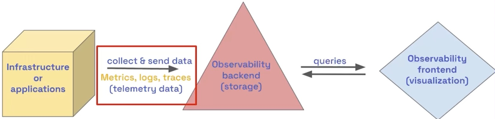
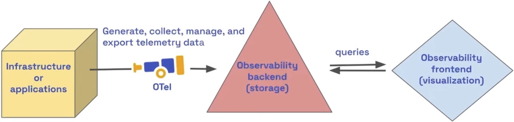

# Table of Contents

- [Table of Contents](#table-of-contents)
- [What is OpenTelemetry (OTel)?](#what-is-opentelemetry-otel)
  - [Benefits of using OTel](#benefits-of-using-otel)
  - [What is observability?](#what-is-observability)
  - [Why OpenTelemetry?](#why-opentelemetry)

# What is OpenTelemetry (OTel)?

https://opentelemetry.io/docs/what-is-opentelemetry/

> OTEl is focused on the generation, collection, management and export of telemetry data

OpenTelemetry is:

An observability framework and toolkit designed to facilitate the

- Generation
- Exportation
- Collection

of telemetry data such as traces, metrics, and logs.

It is open source, vendor and tool-agnostic and can used with observability backends, like Jaeger and Prometheus

Note: OpenTelemetry is not an observability backend itself

## Benefits of using OTel

Users

- No vendor lock in
- Learn a single set of APls and conventions
- Send the data to any observability backend vendor that adopts this standard

Vendors

- Customers may prefer to adopt open standards rather than closed and proprietary solutions.
- Reduce support and implementation costs
- Vendors can focus on their differentiating factors

## What is observability?

> Observability is the ability to understand the internal state of a system by examining its outputs.
>
> In software, this means being able to understand the internal state of a system by examining its telemetry data, which includes traces, metrics, and logs.

To make a system observable, it must be instrumented (i.e. the code must emit traces, metrics, or logs).

The instrumented data must then be sent to an observability backend.

## Why OpenTelemetry?

OpenTelemetry satisfies the need for observability while following two key principles:

1. You own the data that you generate. There's no vendor lock-in.
2. You only have to learn a single set of APIs and conventions.
