# Table of Contents

- [Table of Contents](#table-of-contents)
- [Apache Avro](#apache-avro)
- [Apache Kafka](#apache-kafka)
  - [Event Streaming](#event-streaming)
  - [Concept](#concept)
    - [Producers](#producers)
    - [Topics](#topics)
    - [Broker](#broker)
    - [Consumer](#consumer)
- [API](#api)
  - [URL](#url)
    - [Path Parameters `:id`](#path-parameters-id)
    - [Search/Query Parameters `?key1=value1&key2=value2`](#searchquery-parameters-key1value1key2value2)
  - [Spaces](#spaces)
    - [Adding Spaces in URL Paths:](#adding-spaces-in-url-paths)
    - [Adding Spaces in URL Query Parameters:](#adding-spaces-in-url-query-parameters)
- [Authentication](#authentication)
  - [Session Authentication](#session-authentication)
  - [Token Authentication](#token-authentication)
  - [Lightweight Directory Access Protocol LDAP](#lightweight-directory-access-protocol-ldap)
    - [Directory Information Tree (DIT)](#directory-information-tree-dit)
- [Authorisation](#authorisation)
  - [OAuth2](#oauth2)
    - [OAuth Flows](#oauth-flows)
      - [Authorisation Code Flow](#authorisation-code-flow)
      - [Client Credentials Flow](#client-credentials-flow)
      - [Resource Owner Password Flow](#resource-owner-password-flow)
      - [Implicit Flow](#implicit-flow)
- [CI/CD](#cicd)
  - [Continuous Integration (CI)](#continuous-integration-ci)
  - [Continuous Delivery (CD)](#continuous-delivery-cd)
  - [Continuous Deployment](#continuous-deployment)
  - [Continuous Testing](#continuous-testing)
    - [Integration Testing](#integration-testing)
    - [Unit Testing](#unit-testing)
    - [Functional Testing](#functional-testing)
    - [Regression Testing](#regression-testing)
    - [Non-Functional Testing](#non-functional-testing)
- [Database](#database)
  - [Database Internals](#database-internals)
    - [B-Trees](#b-trees)
    - [Indexing](#indexing)
  - [Database Scaling](#database-scaling)
    - [Data Consistency](#data-consistency)
      - [Strong Consistency](#strong-consistency)
      - [Eventual Consistency](#eventual-consistency)
    - [Master-slave replication](#master-slave-replication)
    - [Master-Master replication](#master-master-replication)
    - [Database Sharding](#database-sharding)
- [Dynamic Arrays](#dynamic-arrays)
  - [Growth Factor](#growth-factor)
- [Enterprise Integration Patterns (EIP)](#enterprise-integration-patterns-eip)
  - [C2 - Integration Styles](#c2---integration-styles)
  - [Remote Procecure Call/Invocation (RPI/RPC)](#remote-procecure-callinvocation-rpirpc)
  - [Messaging](#messaging)
- [Event Driven Architecture (EDA)](#event-driven-architecture-eda)
  - [When to use EDA](#when-to-use-eda)
- [Frameworks](#frameworks)
  - [Apache Camel](#apache-camel)
  - [Red Hat Fuse](#red-hat-fuse)
- [Garbage Collection](#garbage-collection)
- [Hash Tables](#hash-tables)
  - [Consistent Hashing](#consistent-hashing)
    - [Virtual Nodes](#virtual-nodes)
  - [Implementation](#implementation)
- [Java](#java)
  - [Java Key Store (JKS)](#java-key-store-jks)
  - [Java Message Service (JMS)](#java-message-service-jms)
    - [Message Delivery Models](#message-delivery-models)
      - [Point-to-Point (Queue Destination)](#point-to-point-queue-destination)
      - [Publish/Subscribe (Topic Destination)](#publishsubscribe-topic-destination)
    - [JMS Programming Model](#jms-programming-model)
      - [Header](#header)
      - [Properties](#properties)
      - [Body](#body)
  - [Java Virtual Machine (JVM)](#java-virtual-machine-jvm)
    - [JDK](#jdk)
    - [JRE](#jre)
    - [JVM](#jvm)
      - [Class Loader](#class-loader)
      - [Runtime Data Area](#runtime-data-area)
        - [Method Area](#method-area)
        - [Heap Area](#heap-area)
      - [Execution Engine](#execution-engine)
        - [Native Method Interface/Library](#native-method-interfacelibrary)
- [JavaScript](#javascript)
  - [Event Loop](#event-loop)
- [Networks](#networks)
  - [Computer Networks](#computer-networks)
    - [What is a network](#what-is-a-network)
    - [Why Computer Networks](#why-computer-networks)
  - [Cookies](#cookies)
    - [Usages of Cookies](#usages-of-cookies)
    - [Why do we need cookies](#why-do-we-need-cookies)
  - [HTTPS](#https)
  - [Multiplixing](#multiplixing)
    - [Multiplexing and Demultiplexing in UDP](#multiplexing-and-demultiplexing-in-udp)
    - [Port assignment in UDP](#port-assignment-in-udp)
  - [Network Congestion](#network-congestion)
    - [How to fix Congestion](#how-to-fix-congestion)
    - [Bandwidth Allocation Principles](#bandwidth-allocation-principles)
      - [Allocation Basis](#allocation-basis)
      - [Bursts of traffic](#bursts-of-traffic)
      - [Transmission Threshold](#transmission-threshold)
  - [OSI Model](#osi-model)
    - [OSI Model Layers](#osi-model-layers)
      - [Application Layer](#application-layer)
      - [Presentation](#presentation)
      - [Session](#session)
      - [Transport Layer](#transport-layer)
      - [Network Layer](#network-layer)
      - [Data Link Layer](#data-link-layer)
      - [Physical Layer](#physical-layer)
    - [Example](#example)
  - [Proxy Server](#proxy-server)
    - [Use cases](#use-cases)
    - [Reverse Proxy](#reverse-proxy)
      - [Use cases](#use-cases-1)
  - [Reliable Data Transfer](#reliable-data-transfer)
    - [Network Layer Imperfections](#network-layer-imperfections)
    - [Checksums](#checksums)
    - [Retransmission timers](#retransmission-timers)
      - [Limitations](#limitations)
    - [Pipelining](#pipelining)
    - [Sliding Window](#sliding-window)
    - [Go-back-n](#go-back-n)
      - [Go-back-n Receiver](#go-back-n-receiver)
      - [Go-back-n Sender](#go-back-n-sender)
      - [Advantages of Go-back-n](#advantages-of-go-back-n)
    - [Selective Repeat](#selective-repeat)
  - [Sockets](#sockets)
    - [Types of Internet Sockets](#types-of-internet-sockets)
      - [Stream Sockets](#stream-sockets)
      - [Datagram Sockets](#datagram-sockets)
      - [Raw Sockets](#raw-sockets)
    - [Data Encapsulation](#data-encapsulation)
    - [Byte Order](#byte-order)
  - [SSL](#ssl)
    - [SSL Certificate](#ssl-certificate)
      - [SSL Certificates Contents](#ssl-certificates-contents)
      - [Why do Websites need an SSL Certificate](#why-do-websites-need-an-ssl-certificate)
      - [Types of SSL Certificates](#types-of-ssl-certificates)
      - [SSL Validation Levels](#ssl-validation-levels)
  - [TCP/IP Model](#tcpip-model)
    - [Application Layer](#application-layer-1)
    - [Transport Layer](#transport-layer-1)
      - [Transport Layer Protocols](#transport-layer-protocols)
  - [TLS](#tls)
    - [TLS Components](#tls-components)
    - [TLS Certificate](#tls-certificate)
    - [How does TLS work](#how-does-tls-work)
    - [TLS Handshake](#tls-handshake)
      - [What Happens During TLS Handshake](#what-happens-during-tls-handshake)
      - [Steps of TLS Handshake](#steps-of-tls-handshake)
      - [TLS 1.3 Handshake](#tls-13-handshake)
      - [TLS 1.3 0-RTT Mode (Session Resumption)](#tls-13-0-rtt-mode-session-resumption)
- [NoSQL](#nosql)
  - [Normalisation and Denormalisation](#normalisation-and-denormalisation)
  - [Data Integrity](#data-integrity)
  - [Transaction](#transaction)
  - [Performance](#performance)
  - [When to use NoSQL](#when-to-use-nosql)
- [Object Oriented Programming (OOP)](#object-oriented-programming-oop)
  - [OOP Principles](#oop-principles)
    - [Encapsulation](#encapsulation)
    - [Abstraction](#abstraction)
    - [Inheritance](#inheritance)
    - [Polymorphism](#polymorphism)
  - [OOP Design Patterns](#oop-design-patterns)
    - [Creational](#creational)
      - [Singleton](#singleton)
    - [Factory](#factory)
    - [Structural](#structural)
      - [Composite](#composite)
      - [Adaptor](#adaptor)
      - [Decorator](#decorator)
    - [Behavioural](#behavioural)
      - [Observer](#observer)
    - [Strategy](#strategy)
- [Operating Systems](#operating-systems)
  - [Kernel](#kernel)
  - [System Calls](#system-calls)
  - [Processes](#processes)
    - [API](#api-1)
    - [Process Creation](#process-creation)
    - [Process States](#process-states)
  - [Threads](#threads)
    - [Context Switching](#context-switching)
  - [CPU](#cpu)
    - [CPU Registers](#cpu-registers)
      - [Types of Registers](#types-of-registers)
    - [CPU Scheduling](#cpu-scheduling)
      - [First In - First Out (FIFO)](#first-in---first-out-fifo)
      - [Shortest Job First (SJF)](#shortest-job-first-sjf)
      - [Shortest Time to Completion First (STCF)](#shortest-time-to-completion-first-stcf)
        - [Response Time](#response-time)
      - [Round Robin (RR)](#round-robin-rr)
    - [Incorporating I/O](#incorporating-io)
    - [Multi Level Feedback Queue (MLFQ)](#multi-level-feedback-queue-mlfq)
      - [Rules](#rules)
    - [Lottery Scheduling](#lottery-scheduling)
      - [Ticket Mechanisms](#ticket-mechanisms)
      - [The Linux Completely Fair Scheduler (CFS)](#the-linux-completely-fair-scheduler-cfs)
        - [Niceness (Weighting/Priority)](#niceness-weightingpriority)
  - [Endianness](#endianness)
    - [Big Endian](#big-endian)
    - [Little Endian](#little-endian)
- [Redis](#redis)
  - [Trade-offs:](#trade-offs)
  - [Uses](#uses)
- [Search Engine Optimisation (SEO)](#search-engine-optimisation-seo)
  - [Technical SEO](#technical-seo)
  - [Content Optimisation](#content-optimisation)
  - [Off-site Optimisation](#off-site-optimisation)
- [Serverless](#serverless)
  - [Serverless Products](#serverless-products)

# Apache Avro

> Apache Avro = Data Serialisation System

- When Avro data is read, the schema used when writing it is always present
- When Avro data is stored in a file, its schema is stored with it, so that files may be processed later by any program
- The _writer's schema_ is needed to know the order in which fields were written
- The _reader's schema_ is needed to know what fields are expected and how to fill in default values for fields added since the file was written
- Links
  - [Apache Avro Docs](https://avro.apache.org/docs/)
  - [Getting Started Java](https://avro.apache.org/docs/1.11.1/getting-started-java/)
  - [Specification](https://avro.apache.org/docs/1.11.1/specification/)
  - [Java API Reference](https://avro.apache.org/docs/1.11.1/specification/)

# Apache Kafka

> Apache Kafka is a distributed system consisting of servers and clients that communicate via a high-performance TCP network protocol. It can be deployed on hardware, virtual machines, and containers in on-premise as well as cloud environments.

- References
  - https://kafka.apache.org/intro
  - [Kafka in 100 seconds](https://youtu.be/uvb00oaa3k8)
  - [Apache Kafka in 6 minutes](https://youtu.be/Ch5VhJzaoaI)
  - [Why is Kafka so Fast](https://www.youtube.com/watch?v=UNUz1-msbOM)
  - [What is Kafka?](https://www.youtube.com/watch?v=aj9CDZm0Glc)

## Event Streaming

"Event streaming is the practice of capturing data in real-time from event sources like databases, sensors, mobile devices, cloud services, and software applications in the form of streams of events; storing these event streams durably for later retrieval; manipulating, processing, and reacting to the event streams in real-time as well as retrospectively; and routing the event streams to different destination technologies as needed. Event streaming thus ensures a continuous flow and interpretation of data so that the right information is at the right place, at the right time."

## Concept

When an event occurs the producer creates a new record/event/message

### Producers

- Receives updates and writes these 'records' into a queue
- This queue is usually referred to as a Kafka Topic

### Topics

- Messages in a Kafka topic are not delete when they are consumed/read

  - Can use various policies to manage the messages
  - Retention Policy

    - Can set a rule to delete messages older than 24hrs

  - Can also store older messages in Fault tolerant, persistent storage (Hard drive)
    - Can be useful to recover previous messages if a Broker goes down

- Topics can be organised into partitions
  - This distributed placement of your data is very important for scalability because it allows client applications to both read and write the data from/to many brokers at the same time. When a new event is published to a topic, it is actually appended to one of the topic's partitions
  - Kafka guarantees that any consumer of a given topic-partition will always read that partition's events in exactly the same order as they were written

### Broker

- Brokers are the servers that these partitions run on
- To make your data fault-tolerant and highly-available, every topic can be replicated, even across geo-regions or datacenters, so that there are always multiple brokers that have a copy of the data just in case things go wrong, you want to do maintenance on the brokers, and so on. A common production setting is a replication factor of 3

### Consumer

- Consumers consume the messages in the queue
- Listen for updates in real time
- Consumers are very lightweight and should be able to create many without affecting performance
- Use Offsets (pointers) to keep track of which latest message they have read


# API

## URL

### Path Parameters `:id`

> Path parameters are used to identify a specific resource or resources
> Referenced using placeholders preceded by `:`

Example

```
/cars/view/:id
```

### Search/Query Parameters `?key1=value1&key2=value2`

> Query parameters are used to sort/filter resources identified by path parameters
> `key=value` pairs separated by `&` that come AFTER the `?`

Example

```
/cars/view/?brand=toyota&type=sedan
```

## Spaces

- Spaces need to be encoded using specific characters to avoid ambiguity and conform to URL encoding standards
- When handling query parameters, it's important to encode the keys and values as well if they contain special characters, using URL encoding.
- Common special characters that need encoding include ampersand (&), equals (=), and question mark (?).

### Adding Spaces in URL Paths:

- Use URL encoding of `%20` to represent space character in paths
- Replace each space with `%20` in the path to encode it correctly
- Do NOT use the plus sign `+` to represent spaces in the path
- Note that if your path includes other special characters, such as slashes (/) or question marks (?), they may need to be encoded as well using the appropriate URL encoding

Example:

```
https://www.example.com/my%20path/
```

### Adding Spaces in URL Query Parameters:

- Query parameters are the key-value pairs that come after the question mark `?` in a URL (used to pass additional data to the server)
- Use URL encoding of `%20` or `+` to represent space character in query parameters

Example:

```
https://www.example.com/path?key=my%20value
https://www.example.com/path?key=my+value
```

# Authentication

> Authentication is the process of verifying the identity of a user

As HTTP is a stateless protocol, the client and server do not automatically keep track of subsequent requests.

- Resources
  - [Session-based Authentication - roadmap.sh](https://roadmap.sh/guides/session-based-authentication)
  - [JWT vs Cookies for token based authentication - StackOverflow](https://stackoverflow.com/questions/37582444/jwt-vs-cookies-for-token-based-authentication)

## Session Authentication

> Session authentication is associated with using cookies to manage sessions whereby the "cookie" holds identifying information about the user while the state is tracked on the server

The usual flow for Session based authentication is as follows

1. User submits a login request with their credentials
2. Server validates the credentials. If valid then creates a session on the database and a unique id, this unique id is sent back to the user in the form of a Cookie.
3. User saves the session id in the browser and sends this cookie back for each subsequent request to the server as a header.
4. If the session id is found in the database then it can retrieve information about the client

- Cookies should NOT be storing any important personal identifying information, only the corresponding session id in the server.
- When the user closes their browser the session cookies are automatically cleared.
  - The session information on the server will persist and be cleared until it expires or is explicitly cleared.
- Session IDs are relatively short lived and usually stored in a cache like redis to improve performance instead of being stored in the main DB.

## Token Authentication

The usual flow for token based authentication is as follows:

1. User submits login request with their credentials
2. Sever validates credentials. If valid then creates a signed token and sent back to the user.
3. User saves the token in the browser and can attach it for any future requests
4. Server can decrypt the token with its secret key to check its validity. If valid then it will authorize the request.

The difference between Session Authentication vs Token Authentication is that the server does NOT need to save anything about the user. State is stored on the token which is stored in the users browser.

[JSON Web Tokens (JWT)](https://jwt.io/) is a popular standard for creating signed data that contains a JSON payload. JWTs are often used tokens in authentication flows.

OpenID Connect (OIDC) and OAuth 2.0 are protocols commonly used in modern authentication and authorization systems.

- OAuth 2.0 is an authorization framework that allows third-party services to access resources on behalf of a resource owner (usually a user) without sharing the user's credentials.
- OIDC allows clients to verify the identity of the end user based on the authentication performed by an authorization server, as well as to obtain basic profile information about the user.

- Resources
  - [ID token vs Access Token - Auth0](https://auth0.com/blog/id-token-access-token-what-is-the-difference/)
  - [What are Refresh tokens - Auth0](https://auth0.com/blog/refresh-tokens-what-are-they-and-when-to-use-them/)
  - [An Illustrated Guide to OAuth and OIDC](https://youtu.be/t18YB3xDfXI)

## Lightweight Directory Access Protocol LDAP

Lightweight Directory Access Protocol (LDAP) is a vendor-neutral protocol used for accessing and maintaining distributed directory information services. A directory service is like a database that stores information about network resources, such as users, computers, printers, and other devices.

LDAP is commonly used to provide authentication and authorization services for networked resources. For example, when you log in to a computer that's part of a domain, the computer might use LDAP to check your username and password against the directory service to determine whether you're authorized to access the network.

LDAP is a client-server protocol, which means that there's a client application that sends requests to a server application to access the directory information. The client and server communicate using TCP/IP, and LDAP requests and responses are usually transmitted over port 389 or 636 (if using SSL).

LDAP directories are organized into a hierarchical tree structure, called [[notes/Directory Information Tree (DIT)]], where each node in the tree represents an object, such as a user or a group. Each object is identified by a unique name called a distinguished name (DN), which consists of a series of attributes separated by commas. For example, the DN for a user might be "cn=John Doe, ou=Users, dc=example, dc=com".

LDAP uses a query language called LDAP Query Language (LDAPQL) to search and retrieve information from the directory. LDAP queries are similar to SQL queries, but they use a different syntax and support different search filters and operations.

- Resources
  - https://www.onelogin.com/learn/what-is-ldap

### Directory Information Tree (DIT)

LDAP directories are organized in a hierarchical tree structure, similar to the directory structure of a file system. This structure is also known as the Directory Information Tree (DIT). At the top of the tree is the root node, and below that are branches and sub-branches that represent the various objects and attributes in the directory.

Each object in the directory is represented by an entry in the tree, and each entry is identified by a unique name called a distinguished name (DN). The distinguished name of an entry is composed of the names of all the nodes (or branches) that lead to that entry, starting from the root of the tree.

For example, suppose we have an LDAP directory that contains information about employees in a company. The top-level node in the tree might be the organization's name, followed by sub-nodes for departments, teams, and individual employees. The distinguished name for an employee named "John Smith" in the "Sales" department might look something like this:

cn=John Smith,ou=Sales,ou=Departments,o=MyCompany,c=US

Here, "cn" stands for "common name", "ou" stands for "organizational unit", "o" stands for "organization", and "c" stands for "country". These are all examples of attributes that can be used to identify and categorize entries in the directory. LDAP DNs also ascend the tree from left to right, Here the John Smith is directly under Sales and Sales is part of Departments and so on.

It is common practice to refer to the leftmost component of an entry's DN as the RDN for that entry. In the above example, the RDN would be cn=John Smith.

The distinguished name of an entry is important because it provides a unique identifier that can be used to retrieve or modify the entry. When a client application wants to access an entry in the directory, it sends a request to the LDAP server that includes the distinguished name of the entry it wants to access.

- Resources
  - https://ldap.com/ldap-dns-and-rdns/

# Authorisation

> Authorization = The process of giving an authenticated user permission to access resources (based on policies/rules)

## OAuth2

**ByteByteGo**

> OAuth 2.0 is an authorisation framework that allows different applications to securely interact with each other on behalf of users without sharing sensitive credentials

- Traditionally verification/authentication was done via username + password
- Now we give users "resource" keys to access specific information
  - We control who gets access to our data without having to share passwords
  - These "resource" keys can be revoked at anytime
- Case Study Example of OAuth2 Flow

  - Consider a photo storage application "SnapStore" that we use to upload our photos to
  - We want to print out our photos using an external 3rd party service called "PrintMagic"
  - Instead of uploading each photo to PrintMagic we can "grant" PrintMagic permission to access our photos on "SnapStore"
  - Using OAuth2 "PrintMagic" can access our SnapStore photos on our behalf without ever knowing our SnapStore login credentials
  - Deeper Analysis
    - We are the "resource owner" (because we own our photos on SnapStore)
    - SnapStore is the "resource server" that stores our photos
    - PrintMagic is the "client" that wants to access our photos
    - The authorisation service could be a part of SnapStore or an external identity provider and is responsible for handling the OAuth2 process

- Note: `clientsecret` is a private key shared only between PrintMagic and the Authorisation Server
- Note: Access tokens can be configured to expire after a certain time or be revoked by the user at anytime (providing an extra layer of security)
- OAuth2 also supports refresh tokens which can be used to obtain a new access token when the old one expires without requiring user intervention

- [ByteByteGo](https://www.youtube.com/watch?v=ZV5yTm4pT8g)

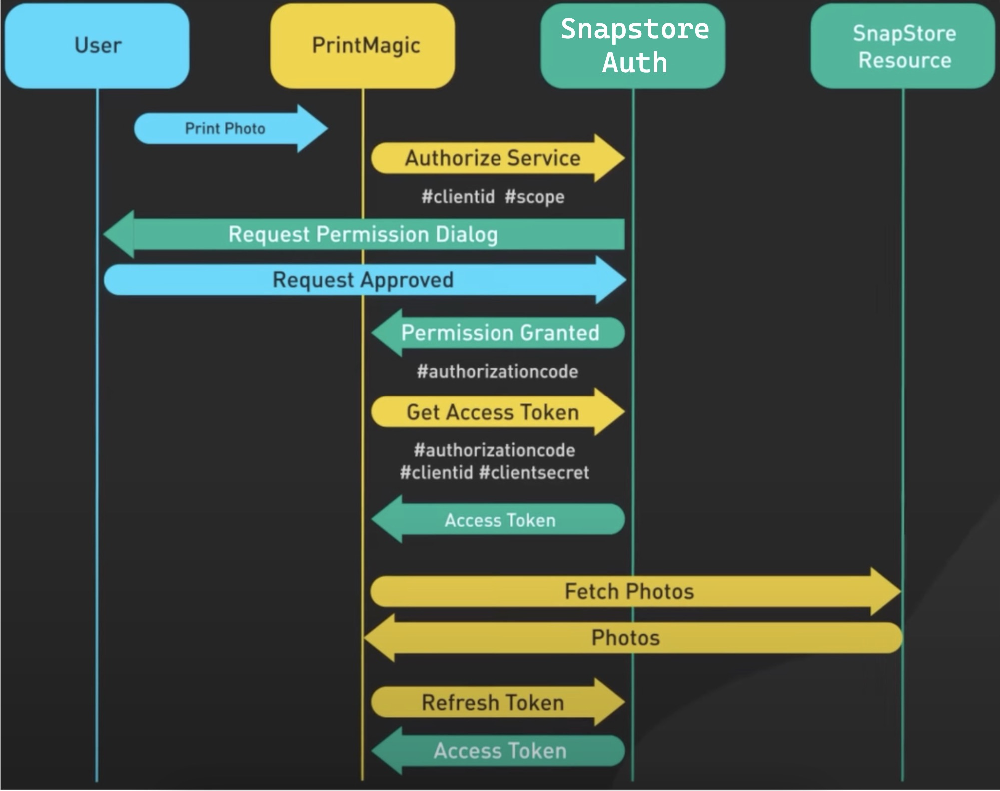


**ByteMonk**

- OAuth2 = Authorisation Framework/Method that allows for services to access protected resources on behalf of users without sharing passwords
- 3rd party client makes request to the service -> User is asked to login via external service -> redirected to internal/external authorisation server
- Authorisation server generates "access tokens" which are keys that allow services to access a user's protected resources on their behalf
- 3rd party client service then uses the access token to make request to the resource server
- Access token is normally used in conjunction with the authorisation header (added to each request made to the resource server)
- The authorisation header includes the access token, type of token, expiration time
  - `Authorisation: Bearer <token>`
- JWT can be used to represent access tokens in OAuth2
  - JWTs are self contained, space efficient, flexible and can be easily verified by the resource server
- Authorisation Server is only responsible for issuing access tokens
- Identify provider is only responsible for authenticating users
- In some OAuth2 flows, the authorisation server and identity provider roles may be combined

- [ByteMonk](https://www.youtube.com/watch?v=ZDuRmhLSLOY)

### OAuth Flows

#### Authorisation Code Flow

- Used when the application needs to access protected resources on behalf of the user

- App sends the user to the authorisation URL
- Authorisation server authenticates the user and checks for consent
- If user grants access, a temporary authorisation code is provided
- Authorisation code is exchanged for an access token
- Obtain resources using the access token via API calls

- User first authenticates with the identity provider (IDP), the IDP redirects back to the application with an authorisation code
- The application sends authorisation code to the authorisation server which validates the code and returns an access token and a refresh token to the application
- The application can then use the access token to make requests to the resource server

#### Client Credentials Flow

- Used when the application does NOT access protected resources on behalf of the user
- Instead the application needs to access its OWN protected resources

- The application authenticates with the authorisation server using its client id and client secret
- The authorisation server returns an access token back to the application
- The application then uses the access token to make requests to its resource server

#### Resource Owner Password Flow

- Used when the application needs to access protected resources on behalf of the user BUT the user does NOT want to be redirected to the IDP
- Instead the application asks the user to enter the username and password directly into the application which then sends the credentials to the authorisation server which validates the credentials and returns an access token and refresh token to the application
- The application can then use the access token to make a request to the resource server

#### Implicit Flow

- Simplified version of Authorisation Code Flow
- The authorisation server redirects the user back to the application with an access token in the URL
- The application can then use the access token to make requests to the resource server

# CI/CD

> CI/CD automates much or all of the manual human intervention traditionally needed to get code from a commit into production. With a CI/CD pipeline development teams can make changes to code that are then automatically tested and pushed out for delivery and deployment.

The aim is that progress should move forward and, if possible, never to go back to fix problems again. Problems should be identified and fixed when and where they were introduced. For this to occur, developers need fast feedback loops which is achieved through automated tests that will validate if the code works as intended before moving onto the next stage.

As applications grow larger, CI/CD can decrease development complexity and help scale applications safely.

- Resources
  - https://about.gitlab.com/topics/ci-cd/
  - https://thenewstack.io/a-primer-continuous-integration-and-continuous-delivery-ci-cd/
  - https://www.redhat.com/en/topics/devops/what-is-ci-cd
  - https://www.atlassian.com/continuous-delivery/principles/continuous-integration-vs-delivery-vs-deployment

## Continuous Integration (CI)

> Continuous Integration = The practice of integrating all code changes into the main branch early and often, automatically testing and building each change when you commit.
>
> By merging changes frequently, the risk of the possibility of code conflicts, bugs and security issues can be identified much earlier making it easier to diagnose.

## Continuous Delivery (CD)

> Continuous Delivery is the practice that automates the infrastructure provisioning and application release process.
>
> Once code has been tested and built in CI, CD ensures its releasable and able to deploy to any environment at any time. This can include provisioning infrastructure to deploying the application to the testing or production environment automatically. The purpose is to ensure that minimal effort is required to deploy new code.

## Continuous Deployment

> Continuous Deployment is the practice that every change that passes all production pipeline criteria is released to the customers.
>
> This is done automatically without human intervention. This allows code to be delivered frequently to get feedback from business teams or customers.

Common deployment approaches are:

- Blue-Green deployment
- Canary deployment


## Continuous Testing

Continuous testing is a practice where tests are automatically run during the CI/CD process in order to ensure that the application is still working as expected.

- Unit Testing = Verifies/Checks that individual units of code work as expected.
- Integration Testing = Verifies how different modules or services within an application work together
- Regression Testing = Performed after a bug is fixed to ensure that specific bug wont occur again

### Integration Testing

Integration testing is the second stage of the software testing process, following Unit Testing

Integration testing involves verifying that each individual software component can work together.

Ensuring that integrated components function correctly together helps identify incompatibilities and also may help identify introduced issues when/if requirements change.

### Unit Testing

Unit testing is a testing descrete behaviours of your program as individual units. The tests need to verify the standard, boundary and incorrect cases of input and also check any assumptions made by the code. With Test Driven Development (TDD), you create these unit tests before the code is written where all the tests are failing then code is written and refactored until the test passes. It is important that each test case is also tested independantly to verify a lack of dependancies within the code.

Once all unit tests in a program are passing, teams can then evaluate larger components of the program by means of Integration Testing

### Functional Testing

Functional testing is the process of checking that the functional requirements and specifications are satisfied by the application. Simulates system usage by providing appropriate test input and expecting correct output.

This includes

- Unit Testing
- Integration Testing
- Regression Testing
- Smoke Testing

### Regression Testing

Regression testing refers to a testing technique that runs functional and non-functional tests to ensure that the functionality of existing features works as intended. Carried out to ensure that changes such as new features or bug fixes do not affect existing functionality/behaviour.

### Non-Functional Testing

Non-functional testing is performed to assess the application in properties that are not critical to functionality but can contribute to end user experience. Factors such as performance and reliability underload are of key concern.

This includes

- Performance Testing
- Load Testing
- Soak Testing

# Database

## Database Internals

A database has the requirements of storing data and being able to retrieve that data when queried

A simple database outlined in Designing Data Intensive Applications shows a simple append only file to store key-value pairs.
A Set function appends a key-value pair to the end of the file which is a fast operation.
However the Get function needs to scan the entire file to find the latest occurrence of the key it is looking for.

In order to efficiently find the value for a particular key in the database we need an _index_ data structure. The index works similarly to a dictionary, if we need to find a word _'cat'_ we don't just read the entire dictionary from front to back. We first go to the section of the book that contains words starting with 'c', then from that look through the words that have 'a' as their second letter and so on. Searching becomes much faster which means reads become faster.

The index is an additional data structure that tracks where these keys are stored in disk. Maintaining an index incurs overhead, especially on writes as we now need to update the index file as well to keep track of additions and deletion of data. Trade off to reduce write speed to increase read speeds.

### B-Trees

The most common data structure used to keep track of indexes in SQL databases are B-trees.

Database rows are stored in fixed-size blocks or pages which closely resembles how disks are arranged. Each page can be identified by an address, just like a pointer in C but on the disk instead of in memory.


The index is stored on a B-Tree structure on disk. A page is designated as the root of the B-tree and contains several keys and references to children pages. Each child page is responsible for a continuous range of keys.

If we were to lookup user_id = 251, in the root table we find the reference that stores the pages containing the user_id's from 200 to 300. Then that table contains references for the user_ids from 200 to 300 in steps of 20. We continue through the reference containing keys from 250 to 270 which brings us to the leaf page containing the reference for the page with user_id = 251


This tree always rebalanced as required when data is inserted or deleted. A B-tree with $n$ keys will always have a depth of $O(\log n)$. Most databases can fit into a B-tree that is three or four levels deep, so you don't need to follow many page references to find the page you are looking for. (A four-level tree of 4 KB pages with a branching factor of 500 can store up to 256 TB.)

### Indexing

Indexes are commonly made for primary keys. For example if we had the following example table **Users**.

| id (PK) | name   |
| ------- | ------ |
| 1       | Alice  |
| 2       | Bob    |
| 3       | Calvin |
| 4       | Devon  |
| 5       | Edward |
| ...     | ....   |
| 1000000 | Aaron  |

For the Users table the primary key is id and we have 1,000,000 users.
For the query: _select _ from Users where id = 5;\*
The database would recognise that the id column has been indexed so it can scan the index data structure and find the correct id quickly in $O(\log n)$.

Now for the query: _select _ from Users where name = 'Aaron';\*
The name column has not been indexed, therefore the database has no idea where the table row containing a name Aaron is located. It also isn't guaranteed for the name Aaron to occur only once so it must do a linear scan, $O(n)$, of the entire database in order to find all table rows containing Aaron which takes far longer than looking up an index. To solve this we can actually create an index for the name column as well if we wanted to. The database will store and manage another B-tree in order to get faster reads for any queries filtering by name.

The trade off for having another B-tree is having higher reads for the name column but will reduce overall write speeds for any data being added or deleted from the Users table as the database now needs to also update the indexing for two B-tree structures. A table can contain many columns, introducing indexes on every single column will increase read speed but will also drastically harm write speeds. Adding indexes is part of performance tuning, it should be used to speed up common query operations that are not indexed.

- Resources
  - [Architecture of SQLite](https://www.sqlite.org/arch.html)
  - https://15445.courses.cs.cmu.edu/fall2019/notes/
  - [Write an SQLite Clone in C from Scratch - cstack](https://cstack.github.io/db_tutorial/)
  - [HelinDb - Basic Database written in Go](https://github.com/thetarby/helindb)
  - [Understanding Database Indexing](https://aws.plainenglish.io/database-indexing-secrets-d1f93e67bb1b)
  - [Database Indexing Explained (with PostgreSQL)](https://www.youtube.com/watch?v=-qNSXK7s7_w)
  - [How do SQL Indexes Work](https://www.youtube.com/watch?v=YuRO9-rOgv4)
  - Designing Data Intensive Applications

## Database Scaling

### Data Consistency

A system with data consistency strives for every service to see the same data at the same time. This is simple when you have one database but when you have multiple replica databases it becomes more difficult.

There are two main types of consistency. **Strong Consistency** and **Eventual Consistency**.

#### Strong Consistency

Strong consistency means that every read request for the data **must** return the most up to date value.
Typically used in applications where transactions occur to ensure data integrity and fairness.

There are some strategies to achieve strong consistency

- **Master Database**
  - Designate one of the database as the primary database which is the only database that accepts writes. All other databases are read replicas.
  - When data is written, updates are applied **synchronously** to all other replicas
    - While an update is occurring read/write requests will be **blocked** until the update is propagated across all replicas. This ensures that read operations only see the latest state of data.
      - This guarantees strong consistency but can reduce availability and latency of the system. Can also cause read/write timeouts
    - An alternative to that is to send all read/writes to the primary DB as it is guaranteed to be up to date and requests will not be blocked. However can cause overload to the server.
- **Two Phase Commit**
  - The process involves the following steps:
    - **Prepare phase:** The coordinating node (usually the primary replica) sends a "prepare" message to all participant nodes (secondary replicas), asking them to prepare to commit the transaction.
    - **Commit phase:** If all participants successfully prepare, the coordinating node sends a "commit" message to all participants, and they apply the updates. If any participant fails, the coordinating node sends a "rollback" message, and the participants undo the changes.

#### Eventual Consistency

Eventual consistency is when a data value is updated, eventually all the read requests will return the most up to date value. Allows for greater availability and scalability in distributed systems by relaxing the synchronization requirements between nodes.

### Master-slave replication

Pattern where only one master database is responsible for writes while remainder are read replicas. Same pattern mentioned in [[#Strong Consistency]]. If the master goes offline, the system can continue to operate in read-only mode until a slave is promoted to a master or a new master is provisioned.
**Disadvantages**

- Potential for loss of data if the master fails before any newly written data can be replicated to other nodes.
- Writes are replayed to the read replicas. If there are a lot of writes, the read replicas can get bogged down with replaying writes and can't do as many reads.
- The more read slaves, the more you have to replicate, which leads to greater replication lag.
- On some systems, writing to the master can spawn multiple threads to write in parallel, whereas read replicas only support writing sequentially with a single thread.
- Replication adds more hardware and additional complexity.

### Master-Master replication

Master-master replication is where multiple databases have read/write permissions. If either master goes down, the system can continue to operate with both reads and writes.

In addition to the master-slave replication disadvantages we also have the following disadvantages.
**Disadvantages**

- Need a load balancer or make changes to your application logic to determine where to write.
- Most master-master systems are either loosely consistent (violating ACID) or have increased write latency due to synchronization.
- Conflict resolution comes more into play as more write nodes are added and as latency increases.

### Database Sharding

Sharding is a horizontal scaling technique that separates a single database into smaller parts called shards, where each shard shares the same schema but contain a different range of data. E.g if we were sorting by name and had two databases, we could say Shard 1 is responsible for all names starting with A-M and Shard 2 is responsible for N-Z.

The data on each shard is unique. Anytime data is accessed a hash function is used to find the corresponding shard similar to a hashmap. E.g if we shard a database based on user id and have 4 total shards we can use a hash function such as $user\_id \  \% \  4$ to get the corresponding shard.

However sharding is not a perfect solution
**Resharding Data:**

- Resharding data is needed when a single shard can no longer hold more data. Certain shards may experience shard exhaustion faster than others due to uneven data distribution.
- To reshard data the hash function needs to be updated to distribute the data among shards more evenly. Updating the sharding function means that some existing data will need to be moved in order to match the hash function. A common technique to solve this is [[notes/Consistent Hashing|Consistent Hashing]].
  **Celebrity Problem:**
- Excessive access to the same shard can cause server overload. For a social application if many celebrities are on the same shard then that shard may be overwhelmed with read operations. Celebrities may need their own shard each.
  **Join and de-normalization**:
- Once a database is sharded it is harder to perform join operations across database shards. A common workaround is to de-normalise the database so that queries can be performed in a single table.

- Resources
  - [Consistency Patterns - Neo Kim](https://systemdesign.one/consistency-patterns/)
  - [Data Consistency and Tradeoffs in Distributed Systems - Gaurav Sen](https://www.youtube.com/watch?v=m4q7VkgDWrM)

# Dynamic Arrays

> A dynamic array is an array that can grow in size. In traditional arrays the size of the array is fixed based on the capacity set during initialisation. When a traditional array is full you cannot increase its size, the only way to add more items is to initialise a new array that is larger in size and copy all the items from the old array into the new array. This is how most dynamic arrays are implemented in programming languages.

Dynamic Arrays are also known as Lists or vectors in other programming languages.

## Growth Factor

When initialising a new array larger array, how much larger should we make it? The rate at which we grow the array is known as the growth factor.

Each time the array gets full and a new insertion is required then the array needs to be resized. Resizing by a large growth factor can reduce average insertion runtime but increases the amount of memory required to be allocated. Having a low growth factor reduces the amount of wasted memory however frequent insertions could mean a higher average insertion runtime.

The most common grow factors are 2 or 1.5.

A growth factor like 1.5 has another advantage compared to 2. If you were using a first-fit memory allocator then when creating a new array it will try to allocate to the first block of memory that can fit it.

To visualize, let "X" represent memory cells used by our array, and "O" represent memory cells that we can no longer use. A growth rate of 2X looks like so:

`\[X\] -> \[OXX\] -> \[OOOXXXX\] -> \[OOOOOOOXXXXXXXX\]`

Notice that for each resizing, the memory that is freed is less than the current memory that needs to be allocated.

With a 1.5X growth multiplier, the memory usage looks like:
`\[X\] -> \[OXX\] -> \[OOOXXX\] -> \[OOOOOOXXXX\] -> \[XXXXXX\]`

In the second last resizing, notice that the number of empty cells is 6, therefore during the next resizing where we have 6 items we can allocate the new array to the memory we just freed.

The actual growth factor where this utilisation of earlier freed memory is only possible with a growth factor less than $\frac{(1+sqrt(5))}{2}\approx1.618$.

- Resources
  - [Why is vector array doubled - Stack Overflow](https://stackoverflow.com/questions/1424826/why-is-vector-array-doubled/1426065#1426065)
  - [Why does dynamic array always double by a factor of 2 - Stack Overflow](https://stackoverflow.com/a/72279477)
  - [How does the capacity of stdvector grow automatically? - Stack Overflow](https://stackoverflow.com/questions/5232198/how-does-the-capacity-of-stdvector-grow-automatically-what-is-the-rate)
  - [Vector Growth factor of 1.5 discussion](https://groups.google.com/g/comp.lang.c++.moderated/c/asH_VojWKJw)

# Enterprise Integration Patterns (EIP)

- [Enterprise Integration Patterns Book](https://learning.oreilly.com/library/view/enterprise-integration-patterns/0321200683/)

**Author = djoleB**

- https://www.youtube.com/playlist?list=PLWmY-5Dfr8QBX7c5403yIcx7r93frvrfV
- https://github.com/djoleB/enterprise_integration_patterns
- Patterns Covered
  - Message Filter
  - Content Based Router
  - Splitter
  - Recipient List
  - Resequencer
  - Dynamic Router
  - Aggregator

## C2 - Integration Styles

## Remote Procecure Call/Invocation (RPI/RPC)

> Develop each application as a large-scale object or component with encapsulated data. Provide an interface to allow other applications to interact with the running application
>
> Remote Procedure Invocation applies the principle of encapsulation to integrating applications
>
> - If an application needs some information that is owned by another application, it asks that application directly
> - If one application needs to modify the data of another, it does so by making a call to the other application
> - This allows each application to maintain the integrity of the data it owns
> - Furthermore, each application can alter the format of its internal data without affecting every other application


- Note: RPC is a **SYNCHRONOUS** process
  - The caller must block and wait until the called method completes execution, and thus offers no potential for developing loosely coupled enterprise applications without the use of multiple threads
  - _RPC systems require the client and server to be available at the same time_

## Messaging

> Use Messaging to transfer packets of data frequently, immediately, reliably, and asynchronously, using customizable formats


- Asynchronous messaging is solution to the problems of distributed systems
  - Sending a message does not require both systems to be up and ready at the same time
  - Thinking about the communication in an asynchronous manner forces developers to recognize that working with a remote application is slower
    - Encourages design of components with high cohesion (lots of work locally) and low adhesion (selective work remotely)
- Messages can be transformed in transit without either the sender or receiver knowing about the transformation
  - The decoupling allows integrators to choose between broadcasting messages to multiple receivers, routing a message to one of many receivers, or other topologies
  - This separates integration decisions from the development of the applications
- FAQ
  - _How do you transfer packets of data?_
    - A sender sends data to a receiver by sending a Message (66) via a Message Channel (60) that connects the sender and receiver
  - _How do you know where to send the data?_
    If the sender does not know where to address the data, it can send the data to a Message Router (78), which will direct the data to the proper receiver
  - _How do you know what data format to use?_
    - If the sender and receiver do not agree on the data format, the sender can direct the data to a Message Translator (85) that will convert the data to the receiver's format and then forward the data to the receiver
  - _If you're an application developer, how do you connect your application to the messaging system?_
    - An application that wishes to use messaging will implement Message Endpoints (95) to perform the actual sending and receiving

# Event Driven Architecture (EDA)

> An event is a change in state, like a change in inventory volume for an e-commerce store when something has been purchased. Event driven architecture uses events to trigger and communicate between services in distributed systems.

Event driven systems typically consist of three main components.

**Event Producer**

- Detects and creates the event then forwards it to the Event Broker

**Event Broker**

- The event broker is responsible for transferring these events to the correct Event Subscribers
- Event subscribers can consist of different services so some services will not need to consume every event.

**Event Consumers**

- Event subscribers receive the event and perform some action in response

The Producer and Consumers are decoupled. The producer does not need to know anything about the Consumers or how many there are. More consumers can subscribe to the events and if consumer services go down it will not affect the events being published. This is also known as the Publisher Subscriber Model (Pub/Sub).

## When to use EDA

EDA is useful when a lot of services need to response to an event. The event broker can fanout the event to the consumers to process events in parallel.

A popular example is when a user purchases something off an e-commerce platform. The purchase event will trigger actions such as

- Payment processing service processes the transaction and checks that the sale is successful
- Database needs to update inventory value to account for sale
- Attach order invoice to customer account purchase history
  Perhaps email receipts were not implemented yet but an email service can be developed independently and listen for a customer purchase event to create this feature.

Other examples include

- Social media posting
  - Notify followers whenever new content is posted
- Logistics, Resource Monitoring and alerts
  - Postage tracking
    - Event every time a package arrives in a new location
  - Food delivery tracker
    - Food being made, food waiting for pickup, on the way, arrived etc.
- IoT devices
  - Data ingestion and analytics
    - Collect data from a variety of sensors and trigger events
  - Smart Home Automations

Popular event queues used are

- Apache Kafka
- Amazon Simple Queue System (SQS)

- Resources
  - [What is an Event-Driven Architecture - AWS](https://aws.amazon.com/event-driven-architecture/#:~:text=An%20event%2Ddriven%20architecture%20uses,on%20an%20e%2Dcommerce%20website.)
  - [Event Driven Architecture - altexsoft](https://www.altexsoft.com/blog/event-driven-architecture-pub-sub/)
  - [Pub-Sub Messaging - geekculture](https://medium.com/geekculture/system-design-basics-pub-sub-messaging-88dfd98e67b7)
  - [Complete Guide to Event Driven Architecture - seetharamugn](https://medium.com/@seetharamugn/the-complete-guide-to-event-driven-architecture-b25226594227)

# Frameworks

## Apache Camel

**Summary**

> Apache Camel = A versatile open source integration framework based on Enterprise Integration Patterns (EIP)

- Apache Camel = A complete production-ready framework for people who want to implement their solution to follow the Enterprise Integration Patterns
  - Apache Camel offers you the interfaces for the Enterprise Integration Patterns, the base objects, commonly needed implementations, debugging tools, a configuration system, and many other helpers which will save you a ton of time when you want to implement your solution to follow the Enterprise Integration Patterns
- Apache Camel = An open source Java framework based on Enterprise Integration Patterns (EIP) that provides:
  - Concrete implementations of all the widely used Enterprise Integration Patterns (EIPs)
  - Connectivity to a great variety of transports and APIs
  - Easy to use Domain Specific Languages (DSLs) to wire EIPs and transports together
- Apache Camel = Messaging technology glue with routing. It joins together messaging start and end points allowing the transference of messages from different sources to different destinations. For example: JMS -> JSON, HTTP -> JMS or funneling FTP -> JMS, HTTP -> JMS, JSON -> JMS
- Apache Camel > Red Hat Fuse

**What is Apache Camel (Video)**

- [Source](https://www.youtube.com/watch?v=Zwq8bxHnwqg&pp=ygUVd2hhdCBpcyBhcGFjaGUgY2FtbGVs)
- Problem: Companies have lots of data in different locations/services (servers, databases, cloud apps)
  - Case/Scenario: We need to move data between these locations/places (i.e. fetch a zip file from a server to be extracted or upload a folder to Dropbox)
    - This is known as "integration" = moving data between different systems
  - To integrate systems, a developer needs to know: protocols of systems (HTTPS/FTP), data formats, each service's APIs
- Apache Camel is an integration framework that provides integration libraries in Java
- The core part of Apache Camel is the engine (which runs the integrations)
  - The developer defines: where to pull data from, what Apache Camel should do with it, where the data needs to go
- Apache Camel comes with "components" that allow the user to connect to things such as web services, ftp servers, apps (e.g. Salesforce, Twitter)
- Apache Camel comes with a builtin set of patterns that user can use and configure in their integration flow
  - These patterns come from the book "Enterprise Integration Patterns"
    - Example:
      - Split message into multiple lines = Splitter Pattern
        - We can use Splitter Pattern which is implemented in Apache Camel, in integration workflow we tell Apache Camel to use the splitter pattern and how to split the message
      - Perform action based on content of message (i.e. routing/deleting) = Content Based Routing Pattern
- Steps to use Apache Camel
  - Add Apache Camel Libraries
  - Write integration flow using Apache Camel's language/domain specific language (DSL)
    - Note: In Apache Camel these "flows" are called "routes"
  - Use components and patterns
    - When writing routes decide which "components" you will need (which systems you will talk to) and which patterns to use
  - Start the Engine
    - Done either explicitly in code or by another framework such as Spring Boot

**Open Source Integration With Apache Camel and How Fuse IDE Can Help**

- [Source 1](http://dzone.com/articles/open-source-integration-apache)
- [Source 2](https://web.archive.org/web/20171029104103/https://dzone.com/articles/open-source-integration-apache)

- Take any integration project and you have multiple applications talking over multiple transports on multiple platforms. As you can imagine, in large enterprises, applications like this can get complex very fast. Much of the complexity stems from two issues:
  - _Dealing with the specifics of applications and transports_
  - _Coming up with good solutions to integration problems_
- Apache Camel = An open source Java framework that focuses on making integration easier and more accessible to developers (created with the intention of addressing these two issues above)
  - It does this by providing:
    - _Concrete implementations of all the widely used Enterprise Integration Patterns (EIPs)_
    - _Connectivity to a great variety of transports and APIs_
    - _Easy to use Domain Specific Languages (DSLs) to wire EIPs and transports together_
- - High level view of Camel's architecture
    
- **"Components"** are the extension point in Camel to add connectivity to other systems
  - The core of Camel is very small to keep dependencies low, promote embeddability, etc. and as a result contains only 13 essential components
  - There are over 80 components outside the core
  - To expose these systems to the rest of Camel, Components provide an `Endpoint` interface
  - By using URIs, you can send or receive messages on `Endpoints` in a uniform way
  - E.g. To receive messages from a JMS queue aQueue and send them to a file system directory "/tmp", you could use URIs like `jms:aQueue` and `file:/tmp`
- **"Processors"** are used to manipulate and mediate messages in between **Endpoints**
  - All of the EIPs are defined as Processors or sets of Processor
- To wire `Processors` and `Endpoints` together, Camel defines multiple DSLs in regular programming languages such as Java, Scala and Groovy

  - It also allows routing rules to be specified in XML
  - DSL examples (functionally equivalent)
    - In all the below examples we define a routing rule that will load files in the "/tmp" directory into memory, create a new JMS message with the file contents, and send that message to a JMS queue named aQueue
    - Java DSL
      ```java
      from ("file:/tmp").to("jms:aQueue");
      ```
    - Spring DSL
      ```xml
      <route>
        <from uri="file:/tmp"/>
        <to uri="jms:aQueue"/>
      </route>
      ```

- Resources

  - https://camel.apache.org/manual/faq/what-is-camel.html
  - https://stackoverflow.com/questions/8845186/what-exactly-is-apache-camel
  - http://dzone.com/articles/open-source-integration-apache
  - https://web.archive.org/web/20171029104103/https://dzone.com/articles/open-source-integration-apache

## Red Hat Fuse

- Red Hat Fuse = Red Hat Fuse is an open source distributed integration platform that provides a standardized methodology, infrastructure, and tools to integrate services, microservices, and application components (Wikipedia)
- Red Hat Fuse = Distributed, cloud-native integration platform (Red Hat)
- Red Hat Fuse 7.x EOL on June 30, 2024, it is recommended users migrate to the Red Hat build of Apache Camel
- Overview
  - Red Hat Fuse comes with a series of "connectors" (called "components" in Apache Camel) so you can programmatically tie together various external SaaS services
  - Fuse enables you to build collaborative and agile Java applications using microservices and containers
  - Fuse packages together Apache Camel with ten other open source projects into a coherent whole that will save you time in implementation, while allowing you to use a variety of specific application development tools (such as ApiCurio, Swagger, and Undertow) to build apps with your own preferences and create powerful links with these interfaces
  - Because Fuse is based on containers, you can create a distributed environment that can isolate faults, deploy consistently, allow for continuous improvement, and be extensible
- [Read more](https://developers.redhat.com/products/fuse/overview)

# Garbage Collection

Garbage collection in programming languages is a form of memory management. Garbage collection reclaims memory that has been allocated but is no longer referenced in the program.

High level programming languages like Python and Java have garbage collection built in although they may have different implementations. For low level languages like C/C++ manually allocation and deallocating memory is required.

The advantages of Garbage Collection is it helps avoid memory errors such as

- Freeing memory which still has pointers referencing it. Dereferencing these pointers can cause unexpected behaviour as the data in that memory may have be reassigned to something else.
- Freeing memory twice
- Memory Leaks

The main disadvantage of GC is performance. The process will require extra computing resources to determine which areas of memory can be freed

# Hash Tables

## Consistent Hashing

> Consistent hashing is a hashing technique such that when a Hash Table is resized, only `n/m` keys need to be remapped on average where `n` is the number of keys and `m` is the number of slots

It is a common technique in distributed systems where servers or databases can be added or removed/fail

How do we allocate load, how do we redistribute the load during a failure?

In traditional hash tables, changing the number of slots causes nearly all keys to be remapped as the mapping is usually defined by a modular operation.

Consistent hashing operates by assigning the data objects and nodes a position on a virtual ring structure (Hash Ring).

Consistent hashing minimises the number of keys that need to remapped when the total number of nodes changes.

- We hash the nodes/servers and put them on the hash rings.
- When we are putting data objects onto the hash ring we hash the key and traverse clockwise until a node is found.
- Then the data is stored on that node.


If a node goes down e.g s0 in the scenario above then k0 will map to s1 instead.
If a node is added between k0 and s0 then k0 will map to the new node.


The purpose of the hash ring is to distribute load evenly across all servers such that each server has an average number of keys equal to `k/N` where k is the number of keys and N is the number of nodes.

### Virtual Nodes

However there is a possibility that the nodes, keys or both are not distributed uniformly.
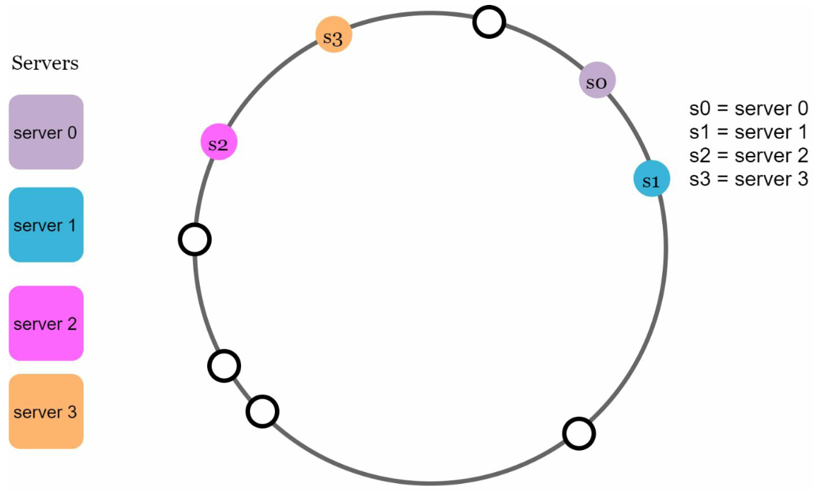

In this scenario s2 is responsible for 4 keys, s0 for 1 key and s3 and s1 responsible for 0

- To prevent overloading a single server we need to uniformly distribute the servers around the ring.
- Adding more physical servers can be expensive.
- We can instead add virtual nodes.
- A virtual node a single server assigned to multiple different positions in the ring.
- Doing this can redistribute the load more uniformly without more physical servers.


## Implementation

A self balancing [[notes/Binary Search Tree|Binary Search Tree]] is used to store the positions of the nodes on the hash ring. The BST data structure is either stored on a centralised, highly available service or stored on each node.

The insertion of a new node results in the movement of data objects that fall within the range of the new node from the successor node. Each node might store an internal or an external BST to track the keys allocated in the node. The following operations are executed to insert a node on the hash ring:

1. Insert the hash of the node ID in BST in logarithmic time
2. Identify the keys that fall within the subrange of the new node from the successor node on BST
3. Move the keys to the new node

The deletion of a node results in the movement of data objects that fall within the range of the decommissioned node to the successor node. An additional external BST can be used to track the keys allocated in the node. The following operations are executed to delete a node on the hash ring:

1. Delete the hash of the decommissioned node ID in BST in logarithmic time
2. Identify the keys that fall within the range of the decommissioned node
3. Move the keys to the successor node

- Resources
- [Consistent Hashing Explained - Neo Kim](https://systemdesign.one/consistent-hashing-explained)
- [System Design Interview: Insiders Guide - Alex Xu](https://www.amazon.com.au/System-Design-Interview-insiders-Second/dp/B08CMF2CQF)
- https://shanu95.medium.com/consistent-hashing-101-a9edbb623f1f

# Java

## Java Key Store (JKS)

> A Java KeyStore (JKS) is a repository of "security certificates" (authorization/public key certificates) + corresponding "private keys" used for instance in TLS encryption

- KeyStore is also a class which is part of the standard API
  - Essentially it is a way to load, save and generally interact with one of the "physical" keystores as described above
  - A KeyStore can also be purely in memory, if you just need the API abstraction for your application
- A KeyStore is a repository where private keys, certificates and symmetric keys can be stored (typically a file)
- [Java JKS Docs](https://docs.oracle.com/en/java/javase/17/docs/api/java.base/java/security/KeyStore.html)

## Java Message Service (JMS)

> The Java Message Service (JMS) API is an ASYNCHRONOUS Java message-oriented middleware (MOM) API (messaging standard) for sending messages between two or more clients/application components (producers & consumers) to create, send, receive, and read messages
>
> JMS provides a standard way for clients to asynchronously create, send, receive, and read messages, regardless of the messaging style used. It also provides features such as transaction support, message persistence, and message filtering
>
> It enables distributed communication that is loosely coupled, reliable, and asynchronous

- The Java Message Service (JMS) allows for asynchronous sending and receiving of data and events in business appplications
  - It provides a common way for Java applications to access such enterprise messaging systems (through a common enterprise messaging API)
  - JMS supports both messaging models: point-to-point (queuing) and publish-subscribe (topic)
- Message Delivery Models
  - JMS supports two different message delivery models:
    - Point-to-Point (Queue Destination)
    - Publish/Subscribe (Topic Destination)

### Message Delivery Models


#### Point-to-Point (Queue Destination)

- In this model, a message is delivered from a producer to one consumer
  - **One/Many Producers -> ONE Consumer**
- The messages are delivered to the destination, which is a queue, and then delivered to one of the consumers registered for the queue
- While any number of producers can send messages to the queue, each message is guaranteed to be delivered, and consumed by ONE consumer
- _If no consumers are registered to consume the messages, the queue holds them until a consumer registers to consume them_


#### Publish/Subscribe (Topic Destination)

- In this model, a message is delivered from a producer to any number of consumers
  - **One/Many Producers -> ZERO/MANY Consumers**
- Messages are delivered to the topic destination, and then to all active consumers who have subscribed to the topic
- In addition, any number of producers can send messages to a topic destination, and each message can be delivered to any number of subscribers
- _There is a "Timing Dependency" between publishers and subscribers_
  - The publisher MUST create a message topic for clients to subscribe
  - The subscriber MUST remain continuously active to receive messages, unless it has established a durable subscription
    - In that case, messages published while the subscriber is not connected will be redistributed whenever it reconnects
- _If there are no consumers registered, the topic destination does NOT hold messages unless it has durable subscription for inactive consumers_
  - A durable subscription represents a consumer registered with the topic destination that can be inactive at the time the messages are sent to the topic
- Note: A common analogy is an anonymous bulletin board
  - In this model, neither the publisher nor the subscriber knows about each other


### JMS Programming Model

> A JMS application consists of a set of application-defined messages and a set of clients that exchange them
>
> JMS clients interact by sending and receiving messages using the JMS API.
>
> A message is composed of three parts:
>
> - Header
> - Properties
> - Body


#### Header

- **The header (REQUIRED for every message), contains information that is used for routing and identifying messages**
  - Some of these fields are set automatically, by the JMS provider, during producing and delivering a message, and others are set by the client on a message by message basis.

#### Properties

- **The properties (optional), provide values that clients can use to filter messages through property name/value pairs**
- They provide additional information about the data, such as which process created it, the time it was created.
- Properties can be considered as an extension to the header, and consist of property name/value pairs.
- Using properties, clients can fine-tune their selection of messages by specifying certain values that act as selection criteria.

#### Body

- **The body (optional), contains the actual data to be exchanged**
- The JMS specification defined six type or classes of messages that a JMS provider must support:
  - `Message`: This represents a message without a message body
  - `StreamMessage`: A message whose body contains a stream of Java primitive types. It is written and read sequentially.
  - `MapMessage`: A message whose body contains a set of name/value pairs. The order of entries is NOT defined.
  - `TextMessage`: A message whose body contains a Java string (i.e. such as an XML message)
  - `ObjectMessage`: A message whose body contains a serialized Java object
  - `BytesMessage`: A message whose body contains a stream of uninterpreted bytes

## Java Virtual Machine (JVM)

> The Java Virtual Machine (JVM) serves as an abstraction layer between the Java code and the underlying hardware.
>
> When a Java program is compiled, it generates bytecode, which is then interpreted by the JVM at runtime.
>
> It follows the concept of  **WORA (_Write Once Run Anywhere_)**, where code can be written once and be used on any hardware that has a compatible JVM.

First it might be useful to differentiate the difference between the JDK, JRE and JVM.

- Resources
  - [JRE - IBM](https://www.ibm.com/topics/jre)
  - [Java Virtual Machine - Medium](https://medium.com/@sanju.skm/java-virtual-machine-a1fc9e45d9d3)
  - [Is the Java Virtual Machine the same as a VM](https://stackoverflow.com/questions/861422/is-the-java-virtual-machine-really-a-virtual-machine-in-the-same-sense-as-my-vmw)
  - [Memory footprint of the JVM](https://spring.io/blog/2019/03/11/memory-footprint-of-the-jvm)
  - [JIT Compiler - IBM](https://www.ibm.com/docs/en/sdk-java-technology/8?topic=reference-jit-compiler)

### JDK

The Java Development Kit (JDK) provides the tools necessary to write and develop Java programs. This usually contains tools like the compiler which converts Java code(.java) to Java byte code (.class), debugger and the runtime environment which is what you use to run the code (JRE in this case).

### JRE

The Java Runtime Environment (JRE) contains sets of libraries and files that the JVM uses at runtime. It has a physical location on disk. The JRE is platform dependant as it needs to have the appropriate libraries to access the correct native OS methods.

The JRE can be used to run Java byte code, the JDK is not required.


### JVM

The JVM can be thought of as 3 seperate systems: Class Loader, JVM Memory and Execution Engine.
The Java is both a [compiled and interpreted language](https://www.freecodecamp.org/news/compiled-versus-interpreted-languages/). The Java code is **compiled** into byte code and that byte code is **interpreted** by the JVM.


#### Class Loader

The class loader is responsible for loading the compiled byte code classes into the JVM. This includes the compiled classes from the application and also the standard library which includes things like Strings, Collections etc.

Linking involves verifying the bytecode is valid, then preparing by allocating and initialising memory for class variables to default values. Finally, symbolic references are transformed into direct references to memory in the Method Area.

The last step is Initialisation, static variables will be initialised to their assigned starting values now that the memory has been allocated.

#### Runtime Data Area

##### Method Area

Class data, constants and static variables are stored in the method area. There is only one method area per JVM, and it is a shared resource. This method area is logically part of the Heap but implementations may treat this memory area differently and might not [[notes/Garbage Collection|Garbage Collect]] it.

##### Heap Area

The heap memory is where all the Objects created by the application are stored. There is only one area per JVM and it is a shared resource.

#### Execution Engine

The Interpreter converts bytecode into machine code and executes it. The issue is that the interpreter will interpret all bytecode even if the same method is being called again.

The Just In Time (JIT) compiler has a Profiler which monitors the code to identify which methods are frequently executed (hotspots). The JVM identifies hotspots through keeping track of the number of times a method has been invoked. Once a threshold is exceeded, JIT compilation is triggered. The threshold for triggering JIT compilation can be configured and better performance can be achieved at the expense of higher compilation costs in terms of CPU and memory.

Methods such as loops are common hotspot areas where optimisation is possible. When a hotspot is identified the JIT compiler will compile it to native machine code. Subsequent requests of the same method will then use the machine code which does not need to be interpreted which result in significant performance improvements.

##### Native Method Interface/Library

The Native Interface and Native method library are the libraries called to interact with the host machines OS.

# JavaScript

## Event Loop

The call stack is a mechanism for keeping track of the execution context of a script. Whenever a function is called, JavaScript pushes it onto the call stack. When that function completes, JavaScript pops it off the stack, allowing the execution to continue with the next item in the stack.

JavaScript is a single threaded programming language and therefore it can only execute the function currently at the top of the stack. However when a function is processing a blocking event like a network request or file i/o would prevent other functions to be added to the call stack.

In the browser, asynchronous events like network requests are handed off to a web apis. Once those events are finished they are moved into the callback queue. The callback functions are only pushed on top of the JavaScript callstack when the callstack is empty. This way the thread is not blocked by asynchronous tasks.


The Node.js event loops operates with the same concept. Quote from the Node.js website
"_Each phase has a FIFO queue of callbacks to execute. While each phase is special in its own way, generally, when the event loop enters a given phase, it will perform any operations specific to that phase, then execute callbacks in that phase's queue until the queue has been exhausted or the maximum number of callbacks has executed. When the queue has been exhausted or the callback limit is reached, the event loop will move to the next phase, and so on._"


- Resources
  - [What the heck is the event loop anyway?](https://www.youtube.com/watch?v=8aGhZQkoFbQ)
  - [Everything you need to know about Node.js Event Loop](https://www.youtube.com/watch?v=PNa9OMajw9w)
  - https://witkesam.medium.com/solving-the-blocked-event-loop-in-node-js-abb6cac281a7
  - https://medium.com/the-node-js-collection/what-you-should-know-to-really-understand-the-node-js-event-loop-and-its-metrics-c4907b19da4c
  - https://nodejs.org/en/learn/asynchronous-work/event-loop-timers-and-nexttick

# Networks

## Computer Networks

- Resources
  - [Grokking Computer Networking](https://www.educative.io/courses/grokking-computer-networking)

### What is a network

> Computer Network = Group/System of interconnected computers (via cable)
> Internet = Global network of interconnected computer networks

- A network is defined as a group or system of interconnected people or items
- Computers connected to each other via cable make up a computer network

### Why Computer Networks

- The two main purposes of computer networks are **Communication** and **Sharing Resources**
- An 'internet' allows doing these two things across different computer networks.

## Cookies

> A cookie is data sent as a key=value pair that a server sends to a users web browser
>
> These cookies allow servers to store various **stateful** information on a users device/browser. These cookies are sent with **every** subsequent requests to the server to convey stateful information.
>
> All cookies that pass all restrictions (correct domain, path, expiry time etc) are sent with the request, this can make cookies vulnerable to attacks like [CSRF attacks](https://owasp.org/www-community/attacks/csrf).

- Resources
  - [HTTP Cookies - MDN](https://developer.mozilla.org/en-US/docs/Web/HTTP/Cookies)
  - [HTTP Cookies: Standards, Privacy and Politics - David M. Kristol](https://arxiv.org/pdf/cs/0105018.pdf)
  - [What are cookies - Cloudflare](https://www.cloudflare.com/learning/privacy/what-are-cookies/)

### Usages of Cookies

Cookies are now primarily used for three purposes:

**User Sessions**

- A session cookie will store a unique string associated with a persons user id
  - When navigating a website you do not need to login again for each new page loaded. Each HTTP request to the server for the page will include the session cookie to validate the user.
- Keep track of items in shopping carts

**Personalisation**

- Cookies help a website remember the users preferences to customise user experience
  - E.g 'Remember Me' checkboxes to store username or user id on the browser
  - Browser can store cookies for user preferences such as Dark Mode. You can easily check this with browser tools as some sites such as Twitter and Reddit store this in plaintext or easily identifiable names. Google also outlines how they use some of their cookies [here](https://policies.google.com/technologies/cookies?hl=en-US#types-of-cookies)

**Tracking**

- Session cookies can track how many unique visitors has used the website.
- Session cookies can also track how many requests are made by a user, this can be used to rate limit specific users if they have sent too many requests/sec.
- Third Party cookies
  - A cookie is often associated with a particular domain. If the domain of the cookie does not match the current domain then it is considered a third party cookie.
    - Sites cannot use cookies that do not originate from its domain. e.g it cannot read/set third party cookies
  - Often if there is a Like or Share to 'Twitter, Facebook etc' button. For the Like/Share button the browser may need to interact with the facebook.com domain in order to check you have logged in. Since it is interacting with the facebook.com domain it will be able to read any cookies originating from that domain. If you are logged into Facebook on your computer then it is probable that there is a cookie from Facebook that can identify you.
  - Similarly for pages with Google Ads embedded in them, to load the ads you would need to make a request to one of Google's domains. This request would contain a cookie that identifies you. If this cookie is passed in then Google can then send targeted advertising.

### Why do we need cookies

> Cookies make it easier to build stateful web applications. Other methods of identifying a device or user such as identifying by IP address, embedding state information in the URL or use hidden fields in HTML can be unreliable and failure prone.

Using an IP address is unreliable as if a proxy is used then the website would see the proxy's IP address and not your device's. Your ISP may also provide temporary IP addresses whenever you connect to it. Therefore your IP address could be different when you visit a website at different times.

Using the URL or hidden HTML fields to store state is unreliable as page navigation such as pressing the Back button would roll back the users state. For shopping applications it would mean a users shopping cart would be reverted.

Cookies solved these problems. Cookies are sent in the HTTP protocol as a header. A user's state is also tracked by the browser instead of the web server. Originally, cookies were created to solve the problem of pending shopping carts in e-commerce. The company did not want its servers to store all partial transaction states. Cookies allowed the state of the shopping cart to be stored in the browser and then only when the order is submitted then the cart information cookie is submitted with the request.

## HTTPS

> HTTPS = Hypertext Transfer Protocol Secure (HTTPS) is an extension of the Hypertext Transfer Protocol (HTTP)

- HTTPS transmits encrypted data using Transport Layer Security (TLS)
  - If the data is hijacked online, all the hijacker gets is binary code
- Steps
  1. The client (browser) and the server establish a TCP connection
  2. The client sends a "client hello" to the server
     - The message contains a set of necessary encryption algorithms (cipher suites) and the latest TLS version it can support
     - The server responds with a "server hello" so the browser knows whether it can support the algorithms and TLS version
     - The server then sends the SSL certificate to the client
     - The certificate contains the public key, hostname, expiry dates, etc
     - The client validates the certificate
  3. After validating the SSL certificate, the client generates a session key and encrypts it using the public key
     - The server receives the encrypted session key and decrypts it with the private key
  4. Now that both the client and the server hold the same session key (symmetric encryption), the encrypted data is transmitted in a secure bi-directional channel


## Multiplixing

End systems can run a variety of applications at the same time so how does the end system know which process to deliver packets to.

Demultiplexing is the process of delivering the packets to the correct applications from one data stream. Multiplexing allows messages to be sent to more than one destination host.
Can model it like a highway between two cities. Cars coming from different suburbs in city A all merge onto one highway. They all have a different destination in city B and need to get off at different off ramps. Similarly you don't want the server sending packets to your machine for the browser application to be routed to your Discord/Skype application.

Sockets are gateways between an application and the network. If an application wants to send something over to the network it will write the message to its socket. The transport layer is responsible for labelling packets with the port number of the application a message is from and the one it is addressed to.

### Multiplexing and Demultiplexing in UDP

- When a datagram is sent from an application, the port number of the source and destination application is appended to it in the UDP protocol header.
- When the datagram is received it will send the datagram to the relevant application socket based on the destination port number.

### Port assignment in UDP

- Common to let the port on client side to be assigned dynamically instead of choosing a particular port

  - Since client initiates connection to the server it must know the port number of the application on the server but the server does not need to know the clients port number in advance.
  - When the client sends its first datagram it will contain the client port number which the server can use to send datagrams back to the client

- Resources
  - [Transport Layer multiplexing and demultiplexing](https://www.youtube.com/watch?v=CekW6ipRrGA)

## Network Congestion

> Network Congestion = When more packets than the network has bandwidth for are sent through, some of them start getting dropped and others get delayed.

### How to fix Congestion

Congestion physically occurs at the network layer (in routers) but it is mainly caused by the transport layer sending too much data at once.

How the transport layer controls congestion:

- Send packets at a slower rate in response to congestion
- The 'slower rate' is still fast enough to make efficient use of the available capacity,
- Keep track of changes in traffic to adjust rates accordingly

### Bandwidth Allocation Principles

#### Allocation Basis

**Should bandwidth be allocated to each host or to each *connection* made by a host?**
Usually bandwidth is allocated per connection.

- Not all hosts are equal. Some can send and receive higher data rates than others.
- Allocating bandwidth equally to all hosts then some would not be able to use bandwidth to full capactiy and some would not have enough bandwidth.
  - An Internet enabled doorbell would have too much bandwidth and a busy server would have too little if both had the same bandwidth.
- Per connection allocation can be exploited by hosts opening multiple connections to the same end system

#### Bursts of traffic

Dividing bandwidth equally across multiple end systems may seem to be most efficient but in a real setting each end system would probably not use all bandwidth. Real traffic can come in bursts and a large burst in traffic may result in more than the allocated bandwidth to be needed causing congestion and subsequent drop in performance. Therefore bandwidth cannot be divided equally amongst end systems.

#### Transmission Threshold


Routers have a set input and output limit. When these limits are exceeded the excess packets are placed in a queue, when the queue becomes full the router cannot store anymore packets and that is how packets get dropped.

As the **average** transmission rate approaches the service rate, the queue may start to fill up. As the queue fills up the delay increases exponentially until we reach max capacity. Once max capacity is reached the packets will start getting dropped.

## OSI Model

The OSI model provides a standard for different computer systems to communicate with each other. However, OSI is a **theoretical model** and works very well for teaching purposes, but it's not practically used. TCP/IP is used practically.

### OSI Model Layers


#### Application Layer

- End users interact with the application layer
- Where most end-user applications such as web browsing and email live
- Where the outgoing message starts its journey so it provides data for the layer below

#### Presentation

- Presents data in a way that can be understood and displayed by the application layer
  - **Encoding** is an example. The underlying layers might use different character encoding compared to the one used by the application layer.
- Encryption is also done at this layer
- End-to-end compression: the presentation layer might also implement end to end compression to reduce traffic in the network

#### Session

- Responsibility is to take services of the transport layer and build a service on top that manages user sessions
- A session is an exchange of information between local apps and remote services on the other end systems

#### Transport Layer

- Since the application, presentation and session layers may be handing off large chunks of data, the transport layer segments it into smaller chunks
  - These are called Datagrams or segments depending on the protocol used
- Sometimes additional information is required to transmit the segment/datagram reliably.
  - Checksum - ensure message is correctly delivered without corruption
  - Header - Information at the start of the datagram
  - Trailer - Information at the end of the datagram

#### Network Layer

- Network layer messages are termed as **packets**.
- Facilitate the transportation of packets from one end system to another
- Routing protocols are apps that run on the network and exchange messages with each other to develop information that helps them route transport layer messages
  - Help determine the best routes that a message should take
- Load balancing

#### Data Link Layer

- Allows directly connected hosts to communicate
- Encapsulates packets for transmission across a single link
- Resolve transmission conflicts - when two end systems send a message at the same time across one singular link
- Handles addressing
- Multiplexing and Demultiplexing
  - Multiple data links can be multiplexed into something that appears like one to integrate their bandwidths

#### Physical Layer

- Consists largely of hardware
- Provides medium to transmit data
- Transmits bits, not logical packets, datagrams or segments

### Example


1. Application layer writes out streams of data to presentation layer
2. Presentation hands it off to session layer then to transport layer
3. Transport layer segments this data into datagrams
4. Network layer turns these datagrams/segments into packets
5. Physical layer carries each packet as bits to other end system
6. Reverse process happens from here to convert the bits back to application layer

## Proxy Server

> A proxy server is an intermediate server separating end users and the website they are browsing.
>
> This is to not expose the internal network to the public internet.
>
> When you send a web request, the request is sent to the proxy server and the proxy server will then make a request to the webserver on your behalf.

The proxy server can change your IP so that the webserver doesn't know where you are, encrypt data so it is unreadable in transit or block access to certain webpages based on IP address.

The proxy server can act as a firewall, web filter and/or cache data for common requests.

A proxy server is sometimes referred to as a forward proxy. Its to describe a server that sits in front of client machines and communicates with web servers on behalf of those clients. It is so that an origin server never directly interacts with the client.

### Use cases

- Control/monitor internet usage of employees/children
- Bandwidth savings and improved speed through caching
  - If hundreds of people want to access a specific webpage through a proxy server, the proxy server sends one request to the URL and sends the same response back to the hundreds of requests. This saves bandwidth and improves performance
- Privacy
  - Proxy servers can hide or alter identifying information in web requests.

### Reverse Proxy

> A reverse proxy is a type of Proxy Server that typically sites behind the firewall in a private network and directs requests to the appropriate backend server. Provides an additional level of abstraction and control to ensure the smooth flow of network traffic

A reverse proxy is different to a forward proxy. It sits in front of webs servers and intercepts incoming traffic to prevent any client from directly communicating with the origin server.

#### Use cases

- Load Balancing
  - Distribute traffic evenly across a group of backend servers
- Web Acceleration
  - Cache commonly requested content
  - Compress inbound/outbound data
- Security
  - Protect backend servers from attacks
- SSL Encryption

  - Encrypting and decrypting SSL or TLS communications can be computationally expensive for an origin server. Can offload these tasks to the proxy to free up resources.

- Resources
  - https://www.cloudflare.com/learning/cdn/glossary/reverse-proxy/

## Reliable Data Transfer

### Network Layer Imperfections

1. Segments can be **corrupted** by transmission errors
2. Segments can be **lost**
3. Segments can be **reordered** or **duplicated**

### Checksums

Simplest error detection scheme for corrupted or transmission errors is the checksum.

A Checksum can be based on different schemes. One scheme could be the arithmetic sum of all the bytes of a segment. Checksums are computed by the sender and attached with the segment. The receiver verifies it upon reception and can choose what to do if it is not valid. Often segments with invalid checksums are discarded.

### Retransmission timers

Since the receiver sends an acknowledgement segment after receiving a data segment, the simplest solution to dealing with lost segments is a retransmission timer.

Once the sender sends a segment the retransmission timer is triggered. The timer should be greater than the round trip time. TCP sends an acknowledgement for every segment so when the timer expires without an acknowledgement the segment is retransmitted.


#### Limitations

If the data is received but the acknowledgement is lost then the sender will resend the data as a new segment meaning this segment is duplicated

To identify duplicates, the protocol associates an ID number with each segment called the sequence number. This way the receiver can identify duplicate ids.


### Pipelining

Applications may generate data at a higher rate then the network can transport. Processor speed > network I/O speed.

Instead of waiting for acknowledgement of a message before transmitting the next one, the sender can keep transmitting messages without acknowledgement to make more efficient use of the processors time.

Pipelining allows the sender to transmit segments at a higher rate but can cause the receiver to become overloaded.

### Sliding Window

The sliding window is the set of consecutive sequence numbers that the sender can use when transmitting segments without being forced to wait for an acknowledgment. At the beginning of a session, the sender and receiver agree on a sliding window size.

If the sliding window contains three segments the sender can thus transmit three segments before being forced to wait for an acknowledgment. The sliding window moves to the higher sequence numbers upon reception of acknowledgments. When the first acknowledgment (of segment 0) is received, it allows the sender to move its sliding window to the right, and sequence number 3 becomes available.

Unfortunately, segment losses do not disappear because a transport protocol is using a sliding window. To recover from segment losses, a sliding window protocol must define:

- A heuristic to detect segment losses.
- A retransmission strategy to retransmit the lost segments.


### Go-back-n

#### Go-back-n Receiver

Intuitively, go-back-n receiver operates as follows:

1. It only accepts the segments that arrive in-sequence.
2. It discards any out-of-sequence segment that it receives.
3. When it receives a data segment, it always returns an acknowledgment containing the sequence number of the **last in-sequence segment** that it has received.

A **key advantage** of these cumulative acknowledgments is that it's **easy to recover from the loss of an acknowledgment**.

Consider for example a go-back-n receiver that received segments 1, 2 and 3.

1. It sent acknowledgments for all three segments.
2. Unfortunately, acknowledgments of the first two were lost.
3. Thanks to the cumulative acknowledgments, the receiver receives the acknowledgment for the last segment and so it knows that all three have been correctly received.
   

#### Go-back-n Sender

A go-back-n sender uses a sending buffer that can store an entire sliding window of segments.

- The segments are sent with a sending sliding window that we looked at in the last lesson.
- The sender must wait for an acknowledgment once its sending buffer is full.
- When a go-back-n sender receives an acknowledgment, it removes all the acknowledged segments from the sending buffer.

**Retransmission Timer**
A go-back-n sender uses a **retransmission timer** to detect segment losses.
It maintains one retransmission timer per connection.

1. This timer is started when the first segment is sent.
2. When the go-back-n sender receives an acknowledgment, it restarts the retransmission timer, but only if any unacknowledged segments exist in its sending window.
3. When the retransmission timer expires, the go-back-n sender assumes that all of the unacknowledged segments currently stored in its sending buffer have been lost. It thus retransmits all the unacknowledged segments in the buffer and restarts its retransmission timer.

#### Advantages of Go-back-n

The main advantage of go-back-n is that it can be easily implemented, and it can also provide good performance when only a few segments are lost. But when there are many losses, the performance of go-back-n quickly drops for two reasons:

- The go-back-n receiver does not accept out-of-sequence segments.
- The go-back-n sender retransmits all unacknowledged segments once it has detected a loss.

Since the go-back-n protocol does not accept out of order segments, it can waste a lot of bandwidth if segments are frequently lost.

The Selective Repeat protocol attempts to remedy this by accepting out of order packets and only retransmitting packets that are corrupted or lost in the network.

### Selective Repeat

- Uses a sliding window protocol just like go-back-n.
- The window size should be less than or equal to half the sequence numbers available. This avoids packets being identified incorrectly. Here's an **example**: suppose the window size is greater than half the buffer size.

  - Segment '1' is lost, hence the receiver expects a segment with sequence number 1 to be retransmitted.
  - Meanwhile, the window wraps around back to sequence number '1.'
  - The sender sends a new packet with sequence number 1 and the receiver perceives it to be the original one that it was expecting.

- Senders retransmit unacknowledged packets after a timeout or if a *NAK* (_negative acknowledgment/not acknowledged_) is received.
- The receiver acknowledges all correct packets.
- The receiver stores correct packets until they can be delivered in order to the upper application layer.

## Sockets

> A socket is a way to speak to other programs using standard Unix file descriptors.

> When Unix programs do any sort of I/O, they do it by reading or writing to a file descriptor. A file descriptor is simply an integer associated with an open file. But that file can be a network connection, a FIFO, a pipe, a terminal, a real on-the-disk file, or just about anything else. Everything in Unix *is* a file! So when you want to communicate with another program over the Internet you're gonna do it through a file descriptor.

A server/application runs on a computer and has a socket bound to a specific port number. The server waits for a client to make a connection request on this port. Sockets are identified by a combination of IP address and a 16 bit port number, each separate application will use its own port number.

For a client to make a request we need to know the hostname and the port number that the server is listening on. The client application will also need to identify itself so it binds to a local port number that it will use during this connection, this port number is usually assigned by the system.

Upon acceptance, the server gets a new socket bound to the same local port and also has its remote endpoint set to the address and port of the client. It needs a new socket so that it can continue to listen to the original socket for connection requests while tending to the needs of the connected client.

### Types of Internet Sockets

#### Stream Sockets

- _SOCK_STREAM_
- TCP (Transmission Control Protocol)
- Reliable **two-way** connected communication streams
- Data arrives sequentially and error free.

#### Datagram Sockets

- _SOCK_DGRAM_
- UDP (User Datagram Protocol)
- Unreliable. The packet may arrive and they may arrive out of order.
- Sometimes referred to as 'connectionless sockets
  - Do not need to maintain an open connection with a client
- Trade-off of using an unreliable protocol is speed.
  - Use UDP if speed is important and the order of packets and potentially dropped packets dont matter.

#### Raw Sockets

- _SOCK_RAW_
- A raw socket allow user to implement it's own Transport Layer Protocol above internet (IP) level .
  - Implementation is responsible for creating and parsing transport level headers and logic behind it.
  - Same level as TCP/UDP in [[#Data Encapsulation]]

### Data Encapsulation


Data packet is encapsulated in a header by the first protocol (TFTP in this case). Then the entire thing including the TFTP headers are encapsulated in the next protocol (UDP in this case) and so on.

When a computer receives the packet, the hardware strips the Ethernet Protocol.
The OS kernel strips the IP and UDP protocols.
The TFTP program strips the TFTP headers and finally has the data.

### Byte Order

Networks store bytes in _Network Byte Order_ or [[notes/Endianness#Big Endian|Big-Endian]].
The byte order your machine uses is referred to as _Host Byte Order_. Some computers may store bytes in reverse, [[notes/Endianness#Little Endian|Little-Endian]] or it might be Big Endian as it is dependent on the machines architecture.

- Intel microprocessors are little endian

Hence never assume the Host Byte Order, there are functions to convert to Network host order.

- Code will also be portable if using the function otherwise code will only work on specific machines

Can convert `short` (two bytes) and `long` (four bytes) numbers.

> Say you want to convert a `short` from Host Byte Order to Network Byte Order. Start with "h" for "host", follow it with "to", then "n" for "network", and "s" for "short": h-to-n-s, or `htons()` (read: "Host to Network Short").

| Function  | Description             |
| --------- | ----------------------- |
| `htons()` | host `to` network short |
| `htonl()` | host `to` network long  |
| `ntohs()` | network `to` host short |
| `ntohl()` | network `to` host long  |

- Resources
  - [Beej's Guide to Network Programming](https://beej.us/guide/bgnet/html/)
  - https://docs.python.org/3/howto/sockets.html
  - [What is a Socket?](https://docs.oracle.com/javase/tutorial/networking/sockets/definition.html)

## SSL

> Secure Socket Layer (SSL) is an encryption-based security protocol. It is the predecessor to Transport Layer Security (TLS)

- A website that uses SSL/TLS has HTTPS in its URL instead of HTTP.
- SSL encrypts data that is transmitted across the web. The data is also signed in order to provide data integrity, verifying that the data is not tampered with before it reaches its destination. SSL also initiates an authentication [[notes/Transport Layer Security (TLS)#TLS Handshake|handshake]] between two devices to ensure that both devices are really who they claim to be.
- SSL has not been updated since 1996 and now deprecated as there are several known security vulnerabilities. TLS is its successor, however there is sometimes confusion as TLS is still commonly referred to as 'SSL Encryption'.

- Overview:
  - SSL = Secure Sockets Layer
  - Secure Sockets Layer (SSL), is an encryption-based Internet security protocol
    - It was first developed by Netscape in 1995 for the purpose of ensuring privacy, authentication, and data integrity in Internet communications
  - SSL is the predecessor to the modern Transport Layer Security (TLS) encryption used today
    - A website that implements SSL/TLS has "HTTPS" in its URL instead of "HTTP"
- _TLDR: SSL encrypts data sent between user and web server_
  - Prevents spying/tampering of data in transit
- How SSL Works:

  - SSL initiates an authentication process called a handshake between two communicating devices to ensure that both devices are really who they claim to be
  - SSL also digitally signs data in order to provide data integrity, verifying that the data is not tampered with before reaching its intended recipient

- Resources
  - https://www.cloudflare.com/learning/ssl/what-is-ssl/
  - https://www.cloudflare.com/learning/ssl/what-is-an-ssl-certificate/

### SSL Certificate

SSL can only be implemented by websites that have an SSL/TLS certificate. It allows websites to use the HTTPS protocol.

> SSL certificates are a data file hosted on a websites origin server. These certificates are sent to any devices that request to load the webpage. On chrome you can view an SSL certificate by clicking on the padlock icon next to the URL.

- The certificate contains:
  - The domain name that the certificate was issued for
  - Which person, organization, or device it was issued to
  - Which certificate authority(CA) issued it
  - The certificate authority's digital signature
  - Associated subdomains
  - Issue date of the certificate
  - Expiration date of the certificate
  - The public key (the private key is kept secret)
- The public key is used to encrypt data before it is sent to the webserver. The webserver can decrypt this information using a private key.

- An SSL certificate is a data file hosted in a website's origin server
  - SSL certificates make SSL/TLS encryption possible, and they contain the website's public key and the website's identity, along with related information
- Devices attempting to communicate with the origin server will reference this file to obtain the public key and verify the server's identity
  - The private key is kept secret and secure
- TLDR
  - SSL can only be implemented by websites that have an SSL certificate (technically a "TLS certificate")
    - An SSL certificate is like an ID card or a badge that proves someone is who they say they are
    - SSL certificates are stored and displayed on the Web by a website's or application's server
  - One of the most important pieces of information in an SSL certificate is the website's public key
    - The public key makes encryption and authentication possible
    - A user's device views the public key and uses it to establish secure encryption keys with the web server
    - Meanwhile the web server also has a private key that is kept secret; the private key decrypts data encrypted with the public key
  - Certificate authorities (CA) are responsible for issuing SSL certificates
  - _Web browsers get public key from server's SSL Certificate_
  - _SSL Certificate is obtained from a Certificate Authority (CA) that digitally signs certificate (with their own private key)_

#### SSL Certificates Contents

- SSL certificates include the following information in a single data file:
  - The domain name that the certificate was issued for
  - Which person, organization, or device it was issued to
  - Which certificate authority issued it
  - The certificate authority's digital signature
  - Associated subdomains
  - Issue date of the certificate
  - Expiration date of the certificate
  - The public key (the private key is kept secret)
- The public and private keys used for SSL are essentially long strings of characters used for encrypting and signing data
  - Data encrypted with the public key can only be decrypted with the private key
- The certificate is hosted on a website's origin server, and is sent to any devices that request to load the website

#### Why do Websites need an SSL Certificate

- A website needs an SSL certificate in order to keep user data secure, verify ownership of the website, prevent attackers from creating a fake version of the site, and gain user trust
- **Encryption**: SSL/TLS encryption is possible because of the public-private key pairing that SSL certificates facilitate
  - _Clients (such as web browsers) get the public key necessary to open a TLS connection from a server's SSL certificate_
- **Authentication**: SSL certificates verify that a client is talking to the correct server that actually owns the domain
  - This helps prevent domain spoofing and other kinds of attacks
- **HTTPS**: An SSL certificate is necessary for an HTTPS web address (needed for businesses)
  - HTTPS is the secure form of HTTP, and HTTPS websites are websites that have their traffic encrypted by SSL/TLS
- _For an SSL certificate to be valid, domains need to obtain it from a certificate authority (CA)_
  - A CA is an outside organization, a trusted third party, that generates and gives out SSL certificates
  - The CA will also digitally sign the certificate with their own private key, allowing client devices to verify it

#### Types of SSL Certificates

- **Single-domain**: A single-domain SSL certificate applies to only one domain (a "domain" is the name of a website, like www.cloudflare.com)
- **Wildcard**: Like a single-domain certificate, a wildcard SSL certificate applies to only one domain. However, it also includes that domain's subdomains. For example, a wildcard certificate could cover www.cloudflare.com, blog.cloudflare.com, and developers.cloudflare.com, while a single-domain certificate could only cover the first
- **Multi-domain**: As the name indicates, multi-domain SSL certificates can apply to multiple unrelated domains

#### SSL Validation Levels

- **Domain Validation**: This is the least-stringent level of validation, and the cheapest. All a business has to do is prove they control the domain
- **Organization Validation**: This is a more hands-on process: The CA directly contacts the person or business requesting the certificate. These certificates are more trustworthy for users
- **Extended Validation**: This requires a full background check of an organization before the SSL certificate can be issued

## TCP/IP Model

The protocols in this layer are clearly defined unlike the OSI Model


The layers in the TCP/IP stack largely perform the same functions as their counterparts in the OSI model, except that the application layer in the TCP/IP model encompasses the functionalities of the top three layers of the OSI model.

### Application Layer

Main purpose to enable end users to access the Internet

- Writing data off to the network in a format that is compliant with the protocol in use
- Reading data from end user
- Providing useful applications to end users
  - Browser, email agent, music streaming service etc
- Some applications also ensure that the data is in the correct format
- Error handling and recovery is also done by some applications
- **The Post Analogy**
  - Imagine you post a package across the world.
  - Presumably, the post system would hand it off to an airplane or ship to transport it across the world.
  - However, you would take it to the post office first to be shipped off. **Carrying the package to the post office** is what the application layer does in networks, except that **it carries messages to the transport layer**!

### Transport Layer

Responsibility is to take messages from an application and hand them to network layer and vice versa. The network layer transports messages from one end system to another but the transport layer delivers the message to and from the relevant application on an end system.

- Logical app to app deliver, transport layer makes it so that applications can address other applications on other end systems directly
- Segments data, divides data into segments/datagrams
- Allow multiple conversations, track each application connection separately which can allow multiple conversations at once
- Multiplexing and demultiplexing data. Ensure that data reaches the relevant application within an end system. If multiple packets get sent to one host then each will end up at the correct application.

#### Transport Layer Protocols

Transport layer has two prominent protocols Transmission Control Protocol (TCP) and User Datagram protocol (UDP).

## TLS

> TLS is the successor to Secure Socket Layer (SSL) and changed it name however people still use the terms interchangeably
>
> Functionally they serve the same purpose which is to encrypt web requests

- TLS = Transport Layer Security
- TLS is a widely adopted security protocol designed to facilitate privacy and data security for communications over the Internet and is the successor of SSL
- A primary use case of TLS is encrypting the communication between web applications and servers, such as web browsers loading a website
  - TLS can also be used to encrypt other communications such as email, messaging, and voice over IP (VoIP)
- TLS Features
  - Encryption: hides the data being transferred from third parties
  - Authentication: ensures that the parties exchanging information are who they claim to be
  - Integrity: verifies that the data has not been forged or tampered with
- TLDR
  - TLS is an encryption and authentication protocol designed to secure Internet communications
  - A TLS handshake is the process that kicks off a communication session that uses TLS
    - During a TLS handshake, the two communicating sides exchange messages to acknowledge each other, verify each other, establish the cryptographic algorithms they will use, and agree on session keys

### TLS Components

- Encryption: Hides the data being transferred from third parties
- Authentication: Ensures that the parties exchanging information are who they claim to be
- Integrity: Verifies that the data has not been forged or tampered with

### TLS Certificate

- For a website or application to use TLS, it must have a TLS certificate installed on its origin server (the certificate is also known as an "SSL certificate" because of the naming confusion described above)
  - A TLS certificate is issued by a certificate authority to the person or business that owns a domain
  - The certificate contains important information about who owns the domain, along with the server's public key, both of which are important for validating the server's identity

### How does TLS work

- A TLS connection is initiated using a sequence known as the TLS handshake
  - When a user navigates to a website that uses TLS, the TLS handshake begins between the user's device (also known as the client device) and the web server
- During the TLS handshake, the user's device and the web server:
  - Specify which version of TLS (TLS 1.0, 1.2, 1.3, etc.) they will use
  - Decide on which cipher suites they will use
  - Authenticate the identity of the server using the server's TLS certificate
  - Generate session keys for encrypting messages between them after the handshake is complete
- The TLS handshake establishes a cipher suite for each communication session
  - The cipher suite is a set of algorithms that specifies details such as which shared encryption keys, or session keys, will be used for that particular session
  - TLS is able to set the matching session keys over an unencrypted channel using public key cryptography
- The handshake also handles authentication, which usually consists of the server proving its identity to the client
  - This is done using public keys. Public keys are encryption keys that use one-way encryption, meaning that anyone with the public key can unscramble the data encrypted with the server's private key to ensure its authenticity, but only the original sender can encrypt data with the private key
  - The server's public key is part of its TLS certificate
- Once data is encrypted and authenticated, it is then signed with a message authentication code (MAC)
  - The recipient can then verify the MAC to ensure the integrity of the data

### TLS Handshake

- A TLS handshake is the process that kicks off a communication session that uses TLS -
- During a TLS handshake, the two communicating sides exchange messages to acknowledge each other, verify each other, establish the cryptographic algorithms they will use, and agree on session keys

- When a user navigates to a website that uses TLS, the process begins

  - The user's device and webserver specify which version of TLS they are using.
  - Decide on which cipher suite to use
  - Authenticate the identity of the server using the server's TLS certificate
  - Generate session keys for encrypting messages between them after the handshake is complete

- Resources
  - [TLS Handshake](https://www.cloudflare.com/learning/ssl/what-happens-in-a-tls-handshake/)

#### What Happens During TLS Handshake

- During the course of a TLS handshake, the client and server together will do the following:
  - Specify which version of TLS (TLS 1.0, 1.2, 1.3, etc.) they will use
  - Decide on which cipher suites they will use
  - Authenticate the identity of the server via the server's public key and the SSL certificate authority's digital signature
  - Generate session keys in order to use symmetric encryption after the handshake is complete

#### Steps of TLS Handshake

- TLS handshakes are a series of datagrams, or messages, exchanged by a client and a server. A TLS handshake involves multiple steps, as the client and server exchange the information necessary for completing the handshake and making further conversation possible
- The RSA key exchange algorithm, while now considered not secure, was used in versions of TLS before 1.3. It goes roughly as follows:
  1. **The 'client hello' message**
  - The client initiates the handshake by sending a "hello" message to the server. The message will include which TLS version the client supports, the cipher suites supported, and a string of random bytes known as the "client random."
  2. **The 'server hello' message**
  - In reply to the client hello message, the server sends a message containing the server's SSL certificate, the server's chosen cipher suite, and the "server random," another random string of bytes that's generated by the server
  3. **Authentication**
  - The client verifies the server's SSL certificate with the certificate authority that issued it
  - This confirms that the server is who it says it is, and that the client is interacting with the actual owner of the domain
  4. **The premaster secret**
  - The client sends one more random string of bytes, the "premaster secret." The premaster secret is encrypted with the public key and can only be decrypted with the private key by the server. (The client gets the public key from the server's SSL certificate.)
  5. **Private key used**
  - The server decrypts the premaster secret
  6. **Session keys created**
  - Both client and server generate session keys from the client random, the server random, and the premaster secret
  - They should arrive at the same results
  7. **Client is ready**
  - The client sends a "finished" message that is encrypted with a session key
  8. **Server is ready**
  - The server sends a "finished" message encrypted with a session key
  9. Secure symmetric encryption achieved
  - The handshake is completed, and communication continues using the session keys

#### TLS 1.3 Handshake

- TLS 1.3 does not support RSA, nor other cipher suites and parameters that are vulnerable to attack
  - It also shortens the TLS handshake, making a TLS 1.3 handshake both faster and more secure
- Steps
  1. **Client "Hello"**
  - The client sends a client hello message with the protocol version, the client random, a list of cipher suites and parameters that will be used for calculating the premaster secret
    - Because support for insecure cipher suites has been removed from TLS 1.3, the number of possible cipher suites is vastly reduced
  - Essentially, the client is assuming that it knows the server's preferred key exchange method (which, due to the simplified list of cipher suites, it probably does)
  - This cuts down the overall length of the handshake (this is the key difference between TLS 1.3 handshakes and TLS 1.0, 1.1, and 1.2 handshakes)
  2. **Server Generates Master Secret**
  - At this point, the server has received the client random and the client's parameters and cipher suites
  - It already has the server random, since it can generate that on its own
  - Therefore, the server can create the master secret
  3. **Server "Hello" and "Finished"**
  - The server hello includes the server's certificate, digital signature, server random, and chosen cipher suite
  - Because it already has the master secret, it also sends a "Finished" message
  4. **Final Steps and Client "Finished"**
  - Client verifies signature and certificate, generates master secret, and sends "Finished" message
  5. Secure symmetric encryption achieved

#### TLS 1.3 0-RTT Mode (Session Resumption)

- TLS 1.3 also supports an even faster version of the TLS handshake that does not require any round trips, or back-and-forth communication between client and server, at all
- If the client and the server have connected to each other before (as in, if the user has visited the website before), they can each derive another shared secret from the first session, called the "resumption main secret."
- The server also sends the client something called a "session ticket" during this first session
  - The client can use this shared secret to send encrypted data to the server on its first message of the next session, along with that session ticket
  - And TLS resumes between client and server

# NoSQL

SQL databases store related data in tables and rows. Each row in the table represents a different record. The table columns are rigid and have defined types, e.g a name column would store Strings and you would not be able to insert a number. This is referred to as a table schema.

NoSQL databases have an equivalent to tables called collections. Each collection is filled with documents. Documents are JSON documents which have a field-value store. The benefit for this is that the document is schema-less, fields do not have any specific type and there are no guarantees that a field exists which is more flexible.

For an SQL database it is impossible to add data until you define tables, field types and relations (schema). You will need to design and implement this schema before any business logic can be created. Changing the schema later on is possible but it can be complicated depending on the changes and the number of records that need to be changed. Since a NoSQL database is schema-less, data can be added anywhere at any time.
For example, a table of Users in SQL might be represented something like this

| id (number) | name (string) | lastName (string) | email (string)  |
| ----------- | ------------- | ----------------- | --------------- |
| 1           | Aaron         | A                 | Aaron@email.com |

The same information in NoSQL might look like this

```json
{
  "id": 1,
  "name": "Aaron",
  "lastname": "A",
  "email": "Aaron@email.com"
}
```

If we get new requirements that say we need to also collect a users date of birth and middle name we would need to change the entire table before we can work on features related to the new requirements.

| id (number) | name (string) | middleName (string) | lastName (string) | email (string)  | DOB (string) |
| ----------- | ------------- | ------------------- | ----------------- | --------------- | ------------ |
| 1           | Aaron         | _null_              | A                 | Aaron@email.com | _null_       |
| 2           | Bill          | Will                | Mill              | bill@email.com  | 01/02/1999   |

Meanwhile for NoSQL we can just start incorporating the new requirements straight away,

```json
{
	id: 1,
	name: "Aaron",
	lastname: "A",
	email: "Aaron@email.com"
},
{
	id: 2,
	name: "Bill",
	middleName: "Will",
	lastname: "Mill",
	email: "bill@email.com",
	DOB: "01/02/1999"
}
```

## Normalisation and Denormalisation

Database normalisation is the process of organising data in the database to reduce data redundancy and improve data integrity. For example if we have some User table and a Company table with denormalised data,

**User Table**

| id  | name  | company  | companyPhone |
| --- | ----- | -------- | ------------ |
| 1   | Aaron | Facebook | 0123456789   |
| 2   | Bill  | Facebook | 0123456789   |
| 3   | Carl  | Google   | 9876543210   |

If Facebook wanted to change their name to Meta and their phone number then they would need to scan every record with the company Facebook and change the name and phone number. This is what is meant by redundant data as the same information is just repeated for each record.

We can move this information to another table and just store a reference to the information in the new table to minimise data redundancy. We can just update company data without changing user data.
**Company Table**

| company_id | company | companyPhone |
| ---------- | ------- | ------------ |
| F1         | Meta    | 0123123123   |
| G2         | Google  | 9876543210   |

**User Table**

| id  | name  | company_id (FK) |
| --- | ----- | --------------- |
| 1   | Aaron | F1              |
| 2   | Bill  | F1              |
| 3   | Carl  | G2              |

In SQL we can use a **JOIN** clause in order to obtain related data in multiple tables. NoSQL does not have an equivalent, if NoSQL data was normalised then we would need to fetch all Company documents and all User Documents and manually link the two in program logic. Therefore NoSQL data is usually denormalised.

## Data Integrity

SQL databases have schemas to enforce data integrity, you can think of data integrity as the assumptions we make to consider our data valid. For the previous tables we could have the rules

- Ensure all users have a company_id
- Cannot remove companies if there are users assigned to them
  An SQL database will not allow operations that could result in invalid data.

In NoSQL databases, the database does not enforce any rules.

## Transaction

In SQL databases we can execute two or more updates in a single operation referred to as a transaction. A transaction guarantees that either both updates succeed or fail.

For example, an online store if a user buys an item we create an order id as proof of purchase and then we need to decrement the amount of stock we have. If the user was provided with a proof of purchase and the stock amount was not decremented then the amount of stock in the system is now inaccurate. SQL transactions prevent this from occurring.

In NoSQL databases, modification of a **_single document_** is atomic, if you are updating multiple fields in a document then all fields are updated or it is unchanged. However there are no transaction equivalents for **_multiple documents_**.

## Performance

NoSQL is quoted as being faster than SQL, as NoSQL has denormalised data it is faster to retrieve all necessary information about a specific item in a single document request. However if data needed isn't contained in one document then SQL JOINS will be faster. This performance really depends on how the data is structured and how it is being queried.

Since all the data is also contained on a single document it is fast to insert as well. If we had a table called user which has a lot of relations we may need to insert data into all related tables which can make writes slower.

## When to use NoSQL

**Advantages**

- Fast insertion and reads as all data is contained in a blob\* ([Depends on design/query](#performance))
- Schema-less
- NoSQL databases are convenient for scale, [[notes/Database Scaling#Database Sharding|Database Scaling]] is much easier as data is self contained on each document.
- Built for metrics/aggregations. Common use in logging.

**Disadvantages**

- ACID is not guaranteed (consistency). Not suitable for transactions
- Not read optimised, read times are slower compared to SQL. If you want to read the 'date of birth' field for each user then you would need to read entirety of every user document and check if a date of birth field exists as NoSQL is schema-less. SQL can just read the specific column and ignore the other data fields.
- Joins are hard because no relations

**Projects where SQL is ideal**

- Logical related and discrete data requirements which can be identified up-front
  - Schema can be difficult to alter later on, especially at scale
- Data Integrity is essential
  - Anything where a transaction may occur.
- **Projects where NoSQL is ideal**
- non-relational, indeterminate or constantly evolving data requirements
- Speed and scalability is imperative
- Simpler or looser objectives, flexibility.

- Resources
  - [SQL vs NoSQL differences](https://www.sitepoint.com/sql-vs-nosql-differences/)
  - [Introduction to NoSQL](https://www.youtube.com/watch?v=xQnIN9bW0og)

# Object Oriented Programming (OOP)

> OOP is a programming paradigm based on the concept of objects which have **state** (attributes/fields) and **behaviours** (methods).

**Classes**
Classes are templates that define the structure and behaviour of objects. An object is an _instance_ of a class. Two objects can have the same class but are independant of each other.

## OOP Principles

### Encapsulation

Concept of data hiding and protection, exposing only necessary information through public methods. This enhances security and modularity.

```java
class Person {

  private String name;
  private int age;

  public Person(String name, int age) {
    this.name = name;
    this.age = age;
  }

  public int getAge() {
    return age;
  }

  public void setAge(int age) {
    this.Age = age;
  }
}

class Main {

  public static void main(String args[]) {
      //create an object of person
      Person p1 = new Person("Bob", 12);
      //change age using setter
      p1.setAge(21);
      // access age using getter
      System.out.println(p1 age is + p1.getAge());
    }
}
```

In this example we are able to only modify and view a persons age and have not provided a way to modify or view their name. If the name field was public then we could easily change it with p1.name = "Robert" but it could cause problems if a persons name was never meant to be changed.

### Abstraction

Focuses on the common properties and behaviours of objects. An abstract class or interface we can define behaviours of the class without actual implementation.

The principle that one should not need to know the inner details of another class to use it.
E.g we have an interface called Shape which has interface methods getArea() and getPerimeter().
We can have other classes which implement these interfaces like Square or Triangle.
The actual implementation of these methods in the Square and Triangle classes will be different but as the person using the object you do not care how it is calculated, you just want the area/perimeter.

### Inheritance

Relationship between classes where one class represents a more general class and one is more specialised.
**Is-a** relationship, a dog is-a type of pet, a surgeon is-a type of doctor.

Purpose is to reuse code and create specialised versions of classes with additional or overridden functionalities.
E.g Suppose we have a Car class with drive(), honk() methods. Then we have a RocketCar class which also drives like a car and has a horn like a car so we can inherit these methods from the Car class. RocketCar may have additional functionality such as a boost() method which uses a rocket to boost the car.

### Polymorphism

Allows objects of different classes to be treated as objects of a common superclass.
In Java, polymorphism is achieved through method overriding and method overloading.

1. **Method Overriding**:
   - Method overriding is a feature in which a subclass provides its own implementation of a method that is already defined in its superclass.
   - When a method in a subclass has the same name, return type, and parameter list as a method in its superclass, the method in the subclass overrides the method in the superclass.
   - During runtime, the appropriate method implementation is called based on the actual type of the object, not the declared type.

```java
class Animal {
  public void makeSound() {
    System.out.println("The animal makes a sound");
  }
}

class Dog extends Animal {
  @Override
  public void makeSound() {
    System.out.println("The dog barks");
  }
}

class Cat extends Animal {
  @Override
  public void makeSound() {
    System.out.println("The cat meows");
  }
}

public class Main {
  public static void main(String[] args) {
    Animal animal1 = new Animal();
    Animal animal2 = new Dog();
    Animal animal3 = new Cat();

    animal1.makeSound(); // Output: The animal makes a sound
    animal2.makeSound(); // Output: The dog barks
    animal3.makeSound(); // Output: The cat meows
  }
}
```

1. **Method Overloading**:
   - Method overloading is a feature in which a class can have multiple methods with the same name, but with different parameters.
   - The Java compiler determines which method to call based on the number, type, and order of the arguments passed during the method call.

```java
class Math {
  public static int add(int a, int b) {
    return a + b;
  }

  public static int add(int a, int b, int c) {
    return a + b + c;
  }

  public static double add(double a, double b) {
    return a + b;
  }
}

public class Main {
  public static void main(String[] args) {
    System.out.println(Math.add(2, 3)); // Output: 5
    System.out.println(Math.add(2, 3, 4)); // Output: 9
    System.out.println(Math.add(2.5, 3.7)); // Output: 6.2
  }
}
```

Polymorphism in Java enables code reuse, flexibility, and extensibility by allowing objects of different classes to be treated as objects of a common superclass.

## OOP Design Patterns

Design patterns are design solutions for problems that occur in OOP. Using patterns is considered good practice as it provides a standardized way to structure code and solve recurring design issues. This makes the code more maintainable, extensible and flexible.

These patterns can be separated into three main categories.

1. **Creational Patterns:** Object creation mechanisms
2. **Structural Patterns:** How to assemble objects and classes into larger structures
3. **Behavioural Patterns:** Responsibilities between objects

Here is a list of some common ones, find the full list at [Refactoring Guru](https://refactoring.guru/design-patterns/catalog).

### Creational

#### Singleton

A Singleton pattern ensures that a class:

- Has only one instance
- Is globally accessible

Common reasons for using this pattern is to control access to a shared resource like a database/file.

All implementations of the Singleton have these two steps in common:

- Make the default constructor **private**, to prevent other objects from using the *new* operator with the Singleton class.
- Create a static creation method that acts as a constructor. Under the hood, this method calls the private constructor to create an object and saves it in a static field. All following calls to this method return the cached object.

If your code has access to the Singleton class, then it's able to call the Singleton's static method. So whenever that method is called, the same object is always returned.

```java
public class LazySingleton {
	// initialize the instance as null.
	private static LazySingleton instance = null;

	// private constructor, so it cannot be instantiated outside this class.
	private LazySingleton() {  }

	// check if the instance is null, and if so, create the object.
	public static LazySingleton getInstance() {
		if (instance == null) {
			instance = new LazySingleton();
		}
		return instance;
	}
}
```

If concurrent access is an issue we can put the instance instantiation inside a synchronised block. [Example](<https://www.freecodecamp.org/news/the-basic-design-patterns-all-developers-need-to-know#:~:text=(Thread)%20Safety%20is%20Key>).

### Factory

Provides an interface for creating objects with the same superclass.

**Problem**: Say you have a car rental company that is starting to get successful and this is the basic application code.

```java
public class Company {
	public Car getRental() {
		return new Car();
	}
}
```

Now demand is rising for you to offer motorcycles as well.

```java
public class Company {
	public Car getRental(String type) {
		if (type.equals("motorcycle")) {
			return new Motorcycle(); // INVALID
		} else {
			return new Car();
		}
	}
}
```

We can't extend the functionality of the getRental() method as above since the method has to return a Car class and not a Motorcycle. We can fix this by creating an interface.

```java
public interface Vehicle {
	void drive();
}

public class Car implements Vehicle {
    public void drive() {
        System.out.println("Driving a car");
    }
}

public class Motorcycle implements Vehicle {
    public void drive() {
        System.out.println("Driving a motorcycle");
    }
}

public class Company {
	public Vehicle getRental(String type) {
		if (request.equals("motorcycle")) {
			Motorcyle rentalMotorcycle = new Motorcycle();
			return rentalMotorcycle;
		} else {
			Car rentalCar = new Car();
			return rentalCar;
		}
	}
}
```

Now doing this does mean we can rent out motorcycles but the code would still need to be modified in the event that we need to add or remove new vehicle types. For example if we need to introduce a Truck class then we would need to modify the if-statement to include a check for trucks or if we ever decided to stop offering motorcycles then we would need to remove that option from the if statement. If we have hundreds of vehicles then it can get more difficult to edit.

Instead we can create an interface or abstract class as the VehicleFactory. Each type of vehicle will have its own Factory class to instantiate the appropriate object.
**Advantages**

1. Factory design pattern provides approach to **code for interface** rather than implementation.
2. Factory pattern removes the instantiation of actual implementation classes from client code. Factory pattern makes our code more robust, less coupled and easy to extend. (Single Point of Responsibility)
3. Can introduce new types of products without potentially breaking existing client code.
   **Disadvantages**

- Code may become more complicated/verbose since you will need to introduce new subclasses to implement the pattern.

```java
// Vehicle interface
public interface Vehicle { void drive(); }

// Concrete vehicle implementations
public class Car implements Vehicle {
  public void drive() {
    System.out.println("Driving a car");
  }
}

public class Motorcycle implements Vehicle {
  public void drive() {
    System.out.println("Driving a motorcycle");
  }
}

public class Truck implements Vehicle {
  public void drive() {
    System.out.println("Driving a truck");
  }
}

// FACTORIES //
// Abstract factory class
public abstract class VehicleFactory { public abstract Vehicle getRental(); }

// Concrete factory classes
public class CarFactory extends VehicleFactory {
  @Override
  public Vehicle getRental() {
    return new Car();
  }
}

public class MotorcycleFactory extends VehicleFactory {
  @Override
  public Vehicle getRental() {
    return new Motorcycle();
  }
}

public class TruckFactory extends VehicleFactory {
  @Override
  public Vehicle getRental() {
    return new Truck();
  }
}

// Client code
public class Main {
  public static void main(String[] args) {
    VehicleFactory carFactory = new CarFactory();
    Vehicle car = getRental.createVehicle();
    car.drive(); // Output: Driving a car

    VehicleFactory motorcycleFactory = new MotorcycleFactory();
    Vehicle motorcycle = motorcycleFactory.getRental();
    motorcycle.drive(); // Output: Driving a motorcycle

    VehicleFactory truckFactory = new TruckFactory();
    Vehicle truck = truckFactory.getRental();
    truck.drive(); // Output: Driving a truck
  }
}
```

### Structural

#### Composite

Composite pattern is a structural design pattern that lets you compose objects into tree structures and then work with these structures as if they were individual objects.

- Using the Composite pattern makes sense only when the core model of your app can be represented as a **tree**.

For example, imagine that you have two types of objects: `Products` and `Boxes`. A Box can contain several Products as well as a number of smaller Boxes. These smaller Boxes can also hold some Products or even smaller Boxes, and so on. You can think of the Box as a node in a tree and the Products as leaf nodes.

Say you decide to create an ordering system that uses these classes. Orders could contain just a Product, as well as a Box that is stuffed with products or other boxes. How would you determine the total price of such an order?

The Composite pattern suggests that you work with `Products` and `Boxes` through a common interface which declares a method for calculating the total price.

How would this method work? For a product, it'd simply return the product's price. For a box, it'd go over each item the box contains, ask its price and then return a total for this box. If one of these items were a smaller box, that box would also start going over its contents and so on, until the prices of all inner components were calculated. A box could even add some extra cost to the final price, such as packaging cost.

You can think of this as a tree problem where we just need to find the cost of all the leaf nodes together.
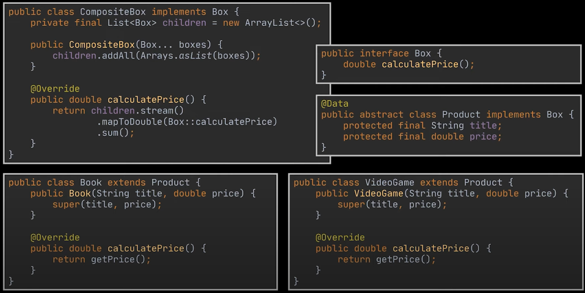

[Example from Geekific](https://www.youtube.com/watch?v=oo9AsGqnisk)

The CompositeBox object is the node of the tree, it can either contain more composite boxes or a product. Each product has its own price, therefore we can just iterate over each Box in each Composite box node to find the price.

#### Adaptor

A design pattern that allows objects with incompatible interfaces to collaborate. The adapter implements the interface of one object and wraps the other one. It can be implemented in all popular programming languages.
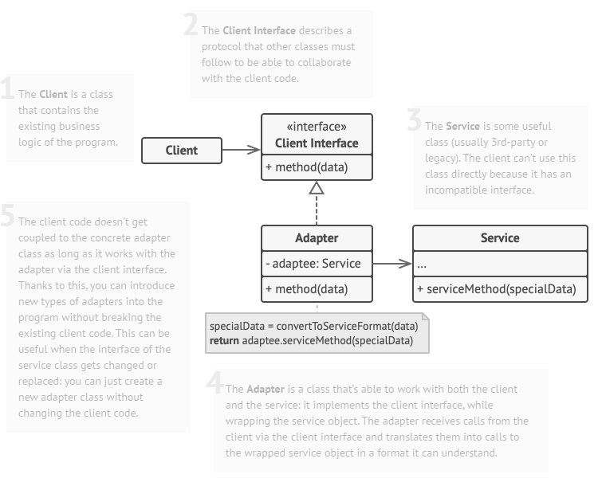

#### Decorator

**Decorator** lets you attach new behaviours to objects by placing these objects inside special wrapper objects that contain the behaviours. Decorated objects can be wrapped again, objects can be wrapped inside multiple different wrappers to increase functionality.

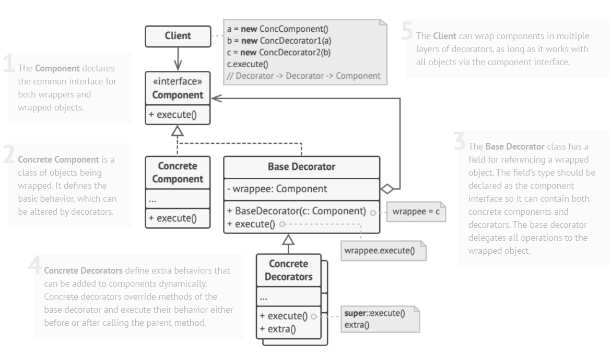
The component interface defines common behaviours for the wrapped object and wrappers. The Concrete component is the object with basic behaviour.

As the base Decorator and Concrete component share the same interface, that means any Concrete Decorators can wrap the Concrete component. To wrap components we basically call the super() method for the constructor and shared methods. Extra functionality can be called after the super methods are called. This [Video by Geekific](https://www.youtube.com/watch?v=v6tpISNjHf8) explains it well.

### Behavioural

#### Observer

The Observer pattern is suited for implementing event driven architecture.
Defines a subscription mechanism to notify objects about any events that happen to the object they're observing.

The Observer pattern consists of a Publisher and Subscriber. The Subscriber is mapped to an interface to not couple the subscriber to the publisher directly. This interface outlines a method to react to the update.

The publisher has a data structure to store subscribers and then a method that will invoke an update for all subscribers stored in the data structure.

```java
// Observer Interface
public interface StockPriceObserver { void update(Map<String, Double> stockPrices); }

// Subject (StockMarket)
public class StockMarket {
  private List<StockPriceObserver> observers = new ArrayList<>();
  private Map<String, Double> stockPrices = new HashMap<>();

  public void registerObserver(StockPriceObserver observer) {
    observers.add(observer);
  }

  public void deregisterObserver(StockPriceObserver observer) {
    observers.remove(observer);
  }

  private void notifyObservers() {
    for (StockPriceObserver observer : observers) {
      observer.update(stockPrices);
    }
  }

  public void updateStockPrice(String company, double price) {
    stockPrices.put(company, price);
    notifyObservers();
  }
}

// Observer (Investor)
public class Investor implements StockPriceObserver {
  private String name;

  public Investor(String name) {
    this.name = name;
  }

  @Override
  public void update(Map<String, Double> stockPrices) {
    System.out.println(name + " received updated stock prices: " + stockPrices);
  }
}

// Usage
public class Main {
  public static void main(String[] args) {
    StockMarket stockMarket = new StockMarket();

    StockPriceObserver investor1 = new Investor("John");
    StockPriceObserver investor2 = new Investor("Jane");

    stockMarket.registerObserver(investor1);
    stockMarket.registerObserver(investor2);

    stockMarket.updateStockPrice("Apple", 120.0);
    stockMarket.updateStockPrice("Google", 2500.0);
  }
}
```

### Strategy

Strategy patterns lets you define a family of algorithms, put each of them into a separate class, and make their objects interchangeable. This is achieved using a common interface to each strategy.

Strategy Pattern is often used when there are multiple ways to do a specific task and the implementation is decided at runtime. E,g:

- Payment Method: Credit/Debit card, cash, PayPal, gift card etc.
- Notifications: SMS or Email. However might want to use [[#Decorator| Decorator pattern]] instead if you want multiple notification methods at once, SMS **and** Email

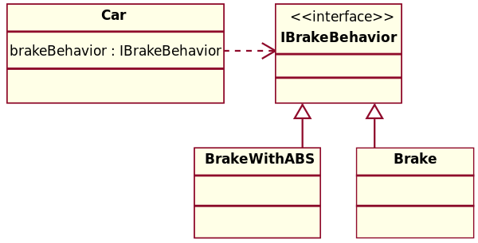
[Source - Wikipedia](https://en.wikipedia.org/wiki/Strategy_pattern#Strategy_and_open/closed_principle)

- Resources
  - [Refactoring Guru - Design Patterns Catalogue](https://refactoring.guru/design-patterns/catalog)
  - [FreeCodeCamp - Basic Design Patterns](https://www.freecodecamp.org/news/the-basic-design-patterns-all-developers-need-to-know/)
  - [Geekific - Factory Method Pattern Explained](https://www.youtube.com/watch?v=EdFq_JIThqM)

# Operating Systems

> There is a body of software, in fact, that is responsible for making it easy to run programs (even allowing you to seemingly run many at the same time), allowing programs to share memory, enabling programs to interact with devices, and other fun stuff like that. That body of software is called the operating system (OS)

The primary way is through a technique called **Virtualisation**. The OS takes a physical resource and transforms it into an easy-to-use virtual form of itself. ?

To allow users to tell the OS what to do, the OS provides some interfaces (APIs) that you can call. These are called [[notes/Operating Systems#System Calls|System Calls]] and they can run programs, access memory and devices and other related actions.

## Kernel

- The kernel is a program that has complete control over everything in the system.

  - Facilitates interactions between hardware and applications
    - Kernel controls all hardware resources
  - Kernel is one of the first programs loaded on startup

- Operating system runs in Privileged Mode/Kernel Mode
  - Only code executing in Kernel mode have direct access to all hardware and memory in the system.
  - Applications should not be able to interfere or bypass the OS
    - Enforce resource application
    - Also prevent applications from interfering with each other

## System Calls

- A System Call is is the way an application can request services from the OS.

  - Standardising the way for programs to access system resources
  - Services that the OS provides through system include:
    - Process creation and management
    - Main memory management
    - File Access, Directory, and File system management
    - Device handling(I/O)
    - Protection
    - Networking, etc.

- Systems usually provide a library/API that sits between normal programs and the OS. Usually provides wrapper functions for the actual system calls.
- When a system call is made the program is temporarily switched to Kernel Mode.
- When a system call is initiated it is usually through a special instruction called **Trap**
  - When the OS is done servicing the request it reverts back to User Mode via a special **return-from-trap** instruction

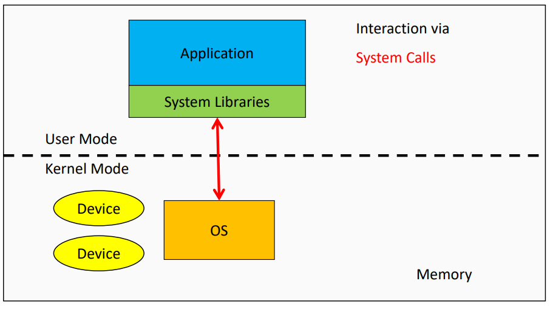

## Processes

> A process is a running program.

- A _program_ is an executable file that contains the code/set of processor instructions that is stored as a file on disk.
- When the code is loaded into memory and executed by the processor, it becomes a process
  - A **process** is an instance of the program in execution
- An active process includes the resources the program needs to run
  - Process Registers
  - Program Counters
  - Stack Pointers
  - Memory Pages
- Each process has its own memory address space

  - One process cannot corrupt the memory of another process
    - When one process malfunctions it will not influence the function of other processes

To understand what constitutes a process, we have to understand its **machine state**: what a program can read or update when it is running.

A process requires _memory_. Instructions lie in memory and so does the data that the running program reads/writes to. The memory that the process can access is called its **address space**.

Another is to keep track of the state of the registers.

- Resources
  - [University of Washington](https://courses.washington.edu/css342/zander/Notes/stack-heap.pdf)
  - [OSTEP](https://pages.cs.wisc.edu/~remzi/OSTEP/cpu-intro.pdf)

### API

The following APIs are available in some form on any modern OS

- **Create**
- **Destroy:** As there is an interface for process creation, systems also provide an interface to destroy processes forcefully. Many processes will run and exit by themselves when complete but an interface to terminate a runaway process is needed.
- **Wait**
- **Miscellaneous Control**
- **Status**

### Process Creation

OS loads code and any static data (initialised variables) from disk into memory.
In early Operating Systems, this process was done _eagerly_, entire program is moved into memory before execution. In modern OS's process creation is done **lazily**, loading pieces of code only when they are needed during execution. Research _paging_ and _swapping_ if you want to learn more about lazy loading.

Memory needs to be allocated for the runtime **stack**.

> Every time you call a function, a "stack frame" is pushed on the stack. It holds memory used for parameters, local variables, address where to return, etc. When a function finishes, the stack frame is popped off the stack, releasing the memory for the next call. If you run out of stack memory, e.g., infinite recursion, you get a stack overflow error.

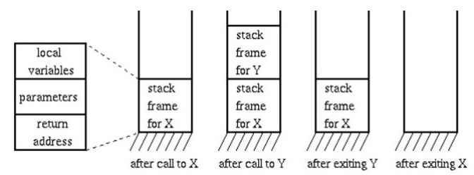

Memory also may be allocated for the **heap**.
In C/C++, the heap is used for dynamically allocated data, data that is initialised using malloc(). The heap is needed for data structures such as linked lists, hash maps, trees etc.

The OS will also need to do some other initialisation tasks particularly related to I/O. For example the file descriptors for standard input, output and error.

By loading code and static data into memory, creating initialising a stack and doing other work relating to I/O setup, the OS has finally set the stage for program execution. By jumping to the main() routine, the OS transfers control of the CPU to the newly created process and thus begins execution.

### Process States

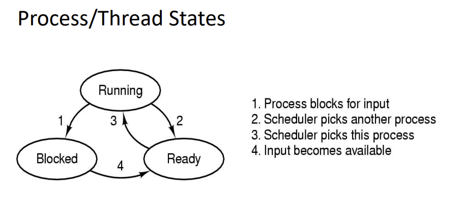

- **Running:** Process is running and executing on the processor
- **Ready:** Process is ready to run but OS has chosen it to not run.
- **Blocked:** Process has performed some event that makes it not ready to run until some other event has taken place. Common reasons a process becomes blocked is waiting for input (file I/O, network etc), Waiting for a timer/alarm signal, waiting for a resource to become available.

## Threads

> A thread is the unit of execution within a process
>
> A process always has at least one thread called the Main thread

- Each thread has its own
  - Stack
  - Registers
  - Program counters
- Threads within the same process share the same memory address space
  - Communicate between threads with that shared memory space
  - One misbehaving thread could impact the function of the entire process

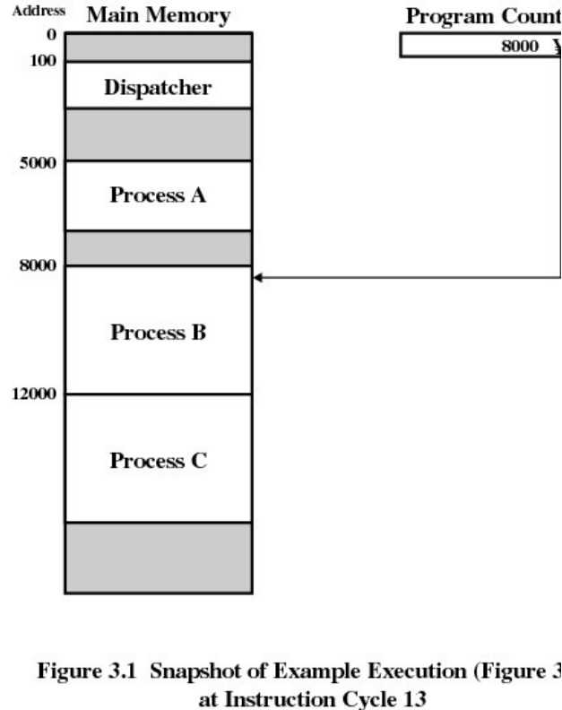

### Context Switching

- During a Context Switch, one process is switched out of the CPU so another process can run
- Operating System stores the state of the current running process so the process can resume execution at another point.
- [[notes/CPU Scheduling|CPU Scheduling]] determines what is being run next
- Context Switching is **expensive**
  - Saving and loading registers
  - Switching memory pages
  - Updating various kernel data structures
- Generally faster to switch between threads than processes

  - Fewer states to track
  - Memory address is shared so no need to switch virtual memory pages which is one of the most expensive operations

- Resources
  - [OSTEP](https://pages.cs.wisc.edu/~remzi/OSTEP/#book-chapters)

## CPU

### CPU Registers

> CPU Registers are a type of computer memory built directly into the processor that is used to store and manipulate data during the execution of instructions. Registers may hold instructions, a storage address or any kind of data.

A register is composed of multiple flip-flops, electronic circuits capable of storing a single bit of information. By combining multiple flip-flops, registers can store/represent larger binary values.

Registers also contain control logic which allow it to coordinate the flow of data and instructions within the CPU.

#### Types of Registers

- **Program Counter (PC)**: Keeps track of the memory address of the next instruction to be executed
- Instruction Register (IR): Contains current instruction being executed
- Accumulator (ACC): General purpose register used for arithmetic and logical operations. Store intermediate results during calculations
- General Purpose Registers (R0, R1, R2 ...): Store data during calculations and data manipulation
- Address Registers (AR): Store memory addresses for data access or for transferring data between different memory locations
- Stack Pointer (SP): Points to the top of the stack, a region of memory used for temporary storage during function calls and other operations.
- Data Registers (DR): Store data fetched from memory or obtained from I/O operations
- Status/ Flags Register (SR): Contains the individual buts that indicate the outcome of operations such as carry, overflow, zero result and others.
- Control Registers (CR): Handles settings relating to CPU operation such as interrupt handling, memory management and system configurations.

### CPU Scheduling

> We have yet to understand the high-level policies that an OS scheduler employs. We will now do just that, presenting a series of **scheduling policies** (sometimes called disciplines) that various smart and hard-working people have developed over the years.
> Let us first make a number of simplifying assumptions about the processes running in the system, sometimes collectively called the workload. Determining the workload is a critical part of building policies, and the more you know about workload, the more fine-tuned your policy can be

- Resources
  - [OSTEP](https://pages.cs.wisc.edu/~remzi/OSTEP/)
    - Note: Have not included Chapter 10 yet

Lets start with these unrealistic assumptions

1. Each job runs for the same amount of time.
2. All jobs arrive at the same time.
3. Once started, each job runs to completion.
4. All jobs only use the CPU (i.e., they perform no I/O)
5. The run-time of each job is known.

**Scheduling Metrics**
The turnaround time of a job is defined as the time at which the job completes minus the time at which the job arrived in the system. More formally, the turnaround time is:
$$T_{turnaround} = T_{completion} - T_{arrival}$$

#### First In - First Out (FIFO)

Imagine three jobs arrive in the system, A, B, and C, at roughly the same time ($T_{arrival} = 0$). Because FIFO has to put some job first, let's assume that while they all arrived simultaneously, A arrived just a hair before B which arrived just a hair before C. Assume also that each job runs for 10 seconds. What will the average turnaround time be for these jobs? _20 seconds._


But if we relax assumption 1 and that each job does not run for the same time then the the resulting turnaround time is much higher.
$$\frac{100 + 110 + 120}{3} = 110$$


#### Shortest Job First (SJF)


By running the shortest jobs first we can achieve a much better turnaround
$$\frac{10 + 20 + 120}{3} = 50$$
However if you relax assumption 2 and $A$ arrives at $t=0$, $B$ arrives at $t=10$ and $C$ arrives at $t=20$ then we would end up with the same issue of A executing first and blocking the subsequent jobs even though they are much shorter

#### Shortest Time to Completion First (STCF)

If we relax assumption 3 that all jobs must run to completion then the scheduler can context switch to the shortest jobs when they arrive.


At any time the scheduler receives a new job the scheduler determines which remaining jobs have the least time left.
$$\frac{120 + (20-10) + (30-20)}{3} = 50$$

##### Response Time

> Thus, if we knew job lengths, and that jobs only used the CPU, and our only metric was **turnaround time**, STCF would be a great policy. In fact, for a number of early batch computing systems, these types of scheduling algorithms made some sense. However, the introduction of time-shared machines changed all that. Now users would sit at a terminal and demand interactive performance from the system as well. And thus, a new metric was born: response time.

$$T_{response} = T_{firstrun} - T_{arrival}$$

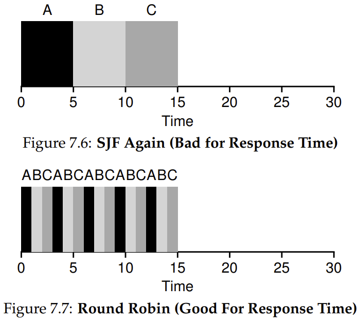

> STCF and related disciplines are not particularly good for response time. If three jobs arrive at the same time, for example, the third job has to wait for the previous two jobs to run in their entirety before being scheduled just once. While great for turnaround time, this approach is quite bad for response time and interactivity. Indeed, imagine sitting at a terminal, typing, and having to wait 10 seconds to see a response from the system just because some other job got scheduled in front of yours.
> How can we build a scheduler that is sensitive to response time?

#### Round Robin (RR)

Instead of running jobs to completion, RR runs a job for a **time slice** and then switches to the next job in the run queue. It repeatedly does so until the jobs are finished. For this reason, RR is sometimes called **time-slicing**

- The shorter the time slice, the better the performance of RR under the response-time metric.
  - However, making the time slice too short is problematic: suddenly the cost of **context switching** will dominate overall performance.
  - Length of the time slice presents a **trade-off** to a system designer, making it long enough to **amortize** the cost of switching without making it so long that the system is no longer responsive.

RR is indeed one of the worst policies if **turnaround time** is our metric.

- RR is stretching out each job as long as it can, by only running each job for a short bit before moving to the next.
- Turnaround time only cares about when jobs finish, RR is nearly pessimal, even worse than simple FIFO in many cases.

More generally, any policy (such as RR) that is **fair**, i.e., that evenly divides the CPU among active processes on a small time scale, will perform poorly on metrics such as turnaround time. Indeed, this is an inherent **trade-off**: if you are willing to be unfair, you can run shorter jobs to completion, but at the cost of response time; if you instead value fairness,

- Trade off response time vs fairness

### Incorporating I/O

When a job initiates an I/O request it is **blocked** waiting for I/O completion.

Scheduler should execute a different job on the CPU while the current job is blocked. Once the I/O is complete should the CPU

- Move the process that issued the I/O from blocked to ready
- Run the process when I/O is complete

Example:
A runs for 10 ms and then issues an I/O request (assume here that I/Os each take 10 ms), B uses the CPU for 50 ms and performs no I/O. The scheduler runs A first, then B after. Assume we are trying to build a STCF scheduler. How should such a scheduler account for the fact that A is broken up into 5 10-ms sub-jobs,

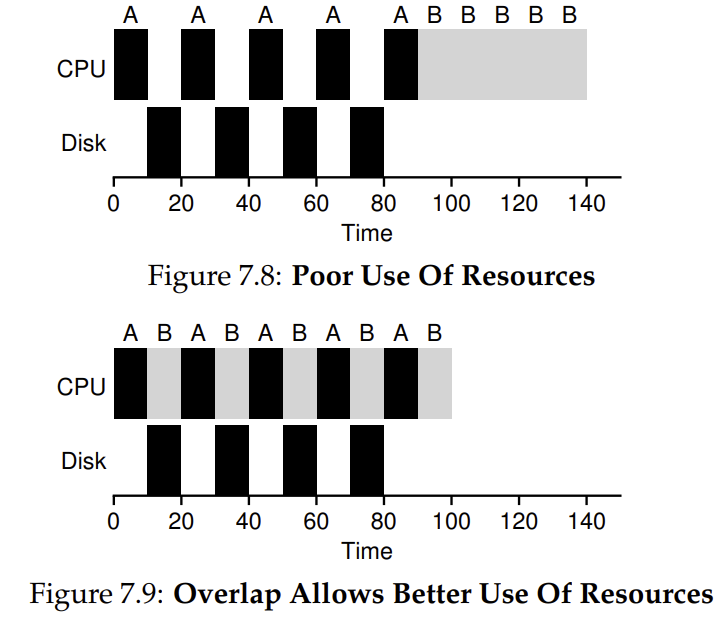

A common approach is to _treat each 10-ms sub-job of A as an independent job_. Thus, when the system starts, its choice is whether to schedule a 10-ms A or a 50-ms B. With STCF, the choice is clear: choose the shorter one, in this case A

### Multi Level Feedback Queue (MLFQ)

The worst assumption is that the OS knows the length of each job. Usually the OS knows very little about the length of each job. Thus, how can we build an approach that behaves like SJF/STCF to optimise turnaround time without such a priori knowledge? Further, how can we incorporate some of the ideas we have seen with the RR scheduler so that response time is also quite good? The MLFQ tries to address these problems.

#### Rules

The MLFQ has a number of distinct queues, each assigned a different priority level. At any given time, a job that is ready to run is on a single queue. MLFQ uses priorities to decide which job should run at a given time: a job with higher priority (i.e., a job on a higher queue) is chosen to run. More than one job may be on a given queue, and thus have the same priority. In this case, we will just use round-robin scheduling among those jobs.

- **Rule 1:** If Priority(A) > Priority(B), A runs (B doesn't).
- **Rule 2:** If Priority(A) = Priority(B), A & B run in RR.

The key to MLFQ scheduling therefore lies in how the scheduler sets priorities. Rather than giving a fixed priority to each job, MLFQ varies the priority of a job based on its observed behaviour.

- If a job repeatedly relinquishes the CPU while waiting for input from the keyboard, MLFQ will keep its priority high, as this is how an interactive process might behave.
- If a job uses the CPU intensively for long periods of time, MLFQ will reduce its priority.

The problem with just these rules is if the CPU continuously receives interactive processes then they will monopolise CPU time and thus long running jobs will never receive any CPU time.
To solve this we may just set all incomplete jobs to the highest priority after some time period $S$. If it is set too high, long-running jobs could starve; too low, and interactive jobs may not get a proper share of the CPU.

Another issue is that CPU time can be gamed by issuing an I/O operation right before the allotment time is used up to retain the priority. To solve this the scheduler needs to refine the previous rule:

- Once a job uses up its time allotment at a given level (regardless of how many times it has given up the CPU), its priority is reduced (i.e., it moves down one queue).

### Lottery Scheduling

**Tickets** are used to represent the share of a resource that a process should receive. The percent of tickets that a process has represents its share of the system resource in question. The goal is to achieve **fairness** in scheduling.

> Imagine two processes, A and B, and further that A has 75 tickets while B has only 25. Thus, what we would like is for A to receive 75% of the CPU and B the remaining 25%
> Lottery scheduling achieves this probabilistically (but not deterministically) by holding a lottery every so often (say, every time slice). Holding a lottery is straightforward: the scheduler must know how many total tickets there are (in our example, there are 100). The scheduler then picks a winning ticket from 0-99. Assuming A holds tickets 0 through 74 and B 75 through 99, the winning ticket simply determines whether A or B runs.

#### Ticket Mechanisms

**Ticket Currency**

- User can allocate tickets in their own jobs in whatever currency they like. System can then convert these to the global value.
  - User A is allocated 100 _Global_ tickets and has two jobs A1 and A2
  - A1 is allocated 500 _A_ tickets and A2 is allocated 500 _A_ tickets
  - The system can then convert these to A1 and A2 with 50 _Global_ tickets each

**Ticket Transfer**

- A process can temporarily hand off its tickets to another process
  > This ability is especially useful in a **client/server setting**, where a client process sends a message to a server asking it to do some work on the client's behalf. To speed up the work, the client can pass the tickets to the server and thus try to maximize the performance of the server while the server is handling the client's request. When finished, the server then transfers the tickets back to the client and all is as before.

**Ticket Inflation**

- A process can temporarily raise or lower the number of tickets it owns.
- If any one process knows it needs more CPU time, it can boost its ticket value as a way to reflect that need to the system, all without communicating with any other processes.
  - In a competitive scenario with processes that do not trust one another, this makes little sense; one greedy process could take over the machine.

#### The Linux Completely Fair Scheduler (CFS)

> Whereas most schedulers are based around the concept of a fixed time slice, CFS operates a bit differently. Its goal is simple: to fairly divide a CPU evenly among all competing processes. It does so through a simple counting-based technique known as **virtual runtime** (vruntime).

Each process's vruntime increases at the same rate, in proportion with physical (real) time. When a scheduling decision occurs, CFS will pick the process with the lowest vruntime to run next.

- if CFS switches too often, fairness is increased, as CFS will ensure that each process receives its share of CPU even over miniscule time windows, but at the cost of performance (too much context switching);
- if CFS switches less often, performance is increased (reduced context switching), but at the cost of near-term fairness

CFS manages this tradeoff through various parameters
**sched_latency**

- A value to determine how long one process should run before considering a switch
  - Calculate the time slice by dividing the sched_latency value by the number of processes
- Typical value is 48 milliseconds

$$\text{time slice} = \text{sched\_latency}/n $$
However when $n$ is large then the time slice would become too small and the context switching overhead will reduce performance

**min_granularity**

- The minimum length of time a time slice can be.
- Typical value is about 6 milliseconds

e.g if you have 12 processes then for a sched_latency of 48ms then the time slice length would be 4ms. This is below the minimum granularity. The minimum granularity will ensure high CPU efficiency but wont be perfectly fair.

##### Niceness (Weighting/Priority)

CFS also enables controls over process priority, enabling users or administrators to give some processes a higher share of the CPU.

It does this through a UNIX mechanism known as the _nice_ level of a process. The nice parameter can be set anywhere from -20 to +19 for a process, with a default of 0.

Positive nice values imply lower priority and negative values imply higher priority.

Niceness can be factored in to compute the time slice length.
$$\text{time\_slice}_k=\frac{\text{weight}_k}{\sum_{i=0}^{n-1} \text{weight}_i} \cdot \text{sched\_latency}$$
In addition to generalizing the time slice calculation, the way CFS calculates vruntime must also be adapted. Here is the new formula, which takes the actual run time that process _j_ has accrued and scales it inversely by the weight of the process,

$$\text{vruntime}_j=\text{vruntime}_j+\frac{\text{weight}_0}{\text{weight}_j}\cdot \text{runtime}_j$$
kv

## Endianness

Refers to the order of bytes stored in memory

### Big Endian

A Big-Endian system stores the most significant byte of a word at the smallest memory address and the least significant byte at the largest.

### Little Endian

A Little-Endian system stores the most significant byte at the largest address and least significant at the smallest.

- Reversed order

e.g for the two byte hex number `b34f`. Little endian would look like this

| 0x100 | 0x101 |
| ----- | ----- |
| 4f    | b3    |

# Redis

> Redis is a in-memory data structure store, used as a key-value database.

Because it is in-memory it can leverage efficient low level data-structures including but not limited to:

- Linked Lists
- Sets
- Hash Tables
- Streams
- JSON

## Trade-offs:

**Advantages**

- High read/write throughput because its in-memory
  - Memory access is significantly faster than random disk I/O (DB)
- Low latency
  **Disadvantages**
- Dataset cannot be larger than memory

## Uses

- Caching
- Messaging/Queues
- Real time leaderboards
- Session Storage
- Rate Limiters

- Resources
  - [Redis as an in-memory data structure quick start guide - Redis](https://redis.io/docs/get-started/data-store/)
  - [Redis For Beginners](https://youtube.com/playlist?list=PL4cUxeGkcC9h3V2eqhi8rRdIDJshP-b4P&si=p1o-f7KsAREEqTPz)
  - [AWS - Redis](https://aws.amazon.com/redis/)
  - [Top 5 Redis Use Cases - ByteByteGo](https://www.youtube.com/watch?v=a4yX7RUgTxI)
  - [Why is single-threaded Redis so fast?](https://www.youtube.com/watch?v=5TRFpFBccQM)

# Search Engine Optimisation (SEO)

> Search engine optimisation is the process of increasing visibility of your website on search engines such as Google, Bing etc. The better visibility you are the higher you will place on the search results when searching for specific keywords. The goal of SEO is to attract and bring website visitors to your website.

SEM is Search Engine Marketing which is just SEO but also driving traffice with paid search traffic.

Search is often the primary source of traffic for a business as whenever people want to buy/learn more about something they will search for it on search engines, social platforms or retailer websites.

There are three main types of SEO

- Technical SEO
- On-site SEO
- Off-site SEO

## Technical SEO

Create a website that can be crawled and indexed by search engines.
What technical elements matter here: URL structure, navigation, internal linking, and more.

User experience (UX) is also a critical element of technical optimization. Search engines stress the importance of pages that load quickly and provide a good user experience. Elements such as Core Web Vitals, mobile-friendliness and usability, HTTPS, and avoiding intrusive interstitials all matter in technical SEO.

Another area of technical optimization is structured data (a.k.a., schema). Adding this code to your website can help search engines better understand your content and enhance your appearance in the search results.

Plus, web hosting services, CMS (content management system) and site security all play a role in SEO. [SearchEngineLand](https://searchengineland.com/guide/what-is-seo)

## Content Optimisation

Optimise content for both people and search engines
For people

- Relevant topics
- Relevant keywords
- Well written/gramatically correct
- Unique/Original (Better than other competing webpages)
- Readable/Structured (Think headings, paragraphs, sub headings etc)

For search engines

- Appropriate title and header tags
- Meta descriptions
- Image alt-text
- Open graph and twitter cards metadata

## Off-site Optimisation

These may not be considered to be strictly SEO in the conventional sense

- Link Building
  - Acquire sites with similar SEO rankings and redirect to your site
- Brand building/PR
- Content marketing
- Social Media marketing, claim your brands handle and post relevant info to redirect to your site
- Claiming, verifying and optimising information about your website on other platforms
- Respond to ratings and reviews

e.g just build your brand and get the word out everywhere you can. Make yourself known.
For other platforms such as TikTok, YouTube, Facebook these will have their own ways to market based on their 'algorithm'.

# Serverless

> Serverless computing is a method of providing backend services on an "as used" basis.

Rather than allocating an entire machine or allocating resources for a server, serverless computing only allocates the necessary resources when called for.

As developers usually reserve fixed amounts of server space to be prepared for spikes in traffic there is often wasted server resources that is being paid for and not utilised. Therefore using a serverless approach results in cost saving as when the app is not being used then no computing resources are being used.

Serverless applications can also save time for developers as they do not need to manage capacity planning, configurations, maintenance, fault tolerance or scaling. Note that serverless applications are unable to persist data in memory and therefore need to store results in storage.

Serverless providers often offer Function as a Service platforms (FaaS) which often charge by compute time.

One of the drawbacks for serverless applications are cold starts. The concept of serverless involves not allocating resources when they're not needed and therefore when a function has not been called in a while the provider will shut down the function to save resources. The next call for that function will require the provider to start a server and begin hosting that function again which adds significant latency.

## Serverless Products

- Cloudflare Workers
- AWS Lambda
