# Table of Contents

- [Table of Contents](#table-of-contents)
- [Networks](#networks)
  - [Computer Networks](#computer-networks)
    - [What is a network](#what-is-a-network)
    - [Why Computer Networks](#why-computer-networks)
  - [Cookies](#cookies)
    - [Usages of Cookies](#usages-of-cookies)
    - [Why do we need cookies](#why-do-we-need-cookies)
  - [HTTPS](#https)
  - [Multiplixing](#multiplixing)
    - [Multiplexing and Demultiplexing in UDP](#multiplexing-and-demultiplexing-in-udp)
    - [Port assignment in UDP](#port-assignment-in-udp)
  - [Network Congestion](#network-congestion)
    - [How to fix Congestion](#how-to-fix-congestion)
    - [Bandwidth Allocation Principles](#bandwidth-allocation-principles)
      - [Allocation Basis](#allocation-basis)
      - [Bursts of traffic](#bursts-of-traffic)
      - [Transmission Threshold](#transmission-threshold)
  - [OSI Model](#osi-model)
    - [OSI Model Layers](#osi-model-layers)
      - [Application Layer](#application-layer)
      - [Presentation](#presentation)
      - [Session](#session)
      - [Transport Layer](#transport-layer)
      - [Network Layer](#network-layer)
      - [Data Link Layer](#data-link-layer)
      - [Physical Layer](#physical-layer)
    - [Example](#example)
  - [Proxy Server](#proxy-server)
    - [Use cases](#use-cases)
    - [Reverse Proxy](#reverse-proxy)
      - [Use cases](#use-cases-1)
  - [Reliable Data Transfer](#reliable-data-transfer)
    - [Network Layer Imperfections](#network-layer-imperfections)
    - [Checksums](#checksums)
    - [Retransmission timers](#retransmission-timers)
      - [Limitations](#limitations)
    - [Pipelining](#pipelining)
    - [Sliding Window](#sliding-window)
    - [Go-back-n](#go-back-n)
      - [Go-back-n Receiver](#go-back-n-receiver)
      - [Go-back-n Sender](#go-back-n-sender)
      - [Advantages of Go-back-n](#advantages-of-go-back-n)
    - [Selective Repeat](#selective-repeat)
  - [Sockets](#sockets)
    - [Types of Internet Sockets](#types-of-internet-sockets)
      - [Stream Sockets](#stream-sockets)
      - [Datagram Sockets](#datagram-sockets)
      - [Raw Sockets](#raw-sockets)
    - [Data Encapsulation](#data-encapsulation)
    - [Byte Order](#byte-order)
  - [SSL](#ssl)
    - [SSL Certificate](#ssl-certificate)
      - [SSL Certificates Contents](#ssl-certificates-contents)
      - [Why do Websites need an SSL Certificate](#why-do-websites-need-an-ssl-certificate)
      - [Types of SSL Certificates](#types-of-ssl-certificates)
      - [SSL Validation Levels](#ssl-validation-levels)
  - [TCP/IP Model](#tcpip-model)
    - [Application Layer](#application-layer-1)
    - [Transport Layer](#transport-layer-1)
      - [Transport Layer Protocols](#transport-layer-protocols)
  - [TLS](#tls)
    - [TLS Components](#tls-components)
    - [TLS Certificate](#tls-certificate)
    - [How does TLS work](#how-does-tls-work)
    - [TLS Handshake](#tls-handshake)
      - [What Happens During TLS Handshake](#what-happens-during-tls-handshake)
      - [Steps of TLS Handshake](#steps-of-tls-handshake)
      - [TLS 1.3 Handshake](#tls-13-handshake)
      - [TLS 1.3 0-RTT Mode (Session Resumption)](#tls-13-0-rtt-mode-session-resumption)

# Networks

## Computer Networks

- Resources
  - [Grokking Computer Networking](https://www.educative.io/courses/grokking-computer-networking)

### What is a network

> Computer Network = Group/System of interconnected computers (via cable)
> Internet = Global network of interconnected computer networks

- A network is defined as a group or system of interconnected people or items
- Computers connected to each other via cable make up a computer network

### Why Computer Networks

- The two main purposes of computer networks are **Communication** and **Sharing Resources**
- An 'internet' allows doing these two things across different computer networks.

## Cookies

> A cookie is data sent as a key=value pair that a server sends to a users web browser
>
> These cookies allow servers to store various **stateful** information on a users device/browser. These cookies are sent with **every** subsequent requests to the server to convey stateful information.
>
> All cookies that pass all restrictions (correct domain, path, expiry time etc) are sent with the request, this can make cookies vulnerable to attacks like [CSRF attacks](https://owasp.org/www-community/attacks/csrf).

- Resources
  - [HTTP Cookies - MDN](https://developer.mozilla.org/en-US/docs/Web/HTTP/Cookies)
  - [HTTP Cookies: Standards, Privacy and Politics - David M. Kristol](https://arxiv.org/pdf/cs/0105018.pdf)
  - [What are cookies - Cloudflare](https://www.cloudflare.com/learning/privacy/what-are-cookies/)

### Usages of Cookies

Cookies are now primarily used for three purposes:

**User Sessions**

- A session cookie will store a unique string associated with a persons user id
  - When navigating a website you do not need to login again for each new page loaded. Each HTTP request to the server for the page will include the session cookie to validate the user.
- Keep track of items in shopping carts

**Personalisation**

- Cookies help a website remember the users preferences to customise user experience
  - E.g 'Remember Me' checkboxes to store username or user id on the browser
  - Browser can store cookies for user preferences such as Dark Mode. You can easily check this with browser tools as some sites such as Twitter and Reddit store this in plaintext or easily identifiable names. Google also outlines how they use some of their cookies [here](https://policies.google.com/technologies/cookies?hl=en-US#types-of-cookies)

**Tracking**

- Session cookies can track how many unique visitors has used the website.
- Session cookies can also track how many requests are made by a user, this can be used to rate limit specific users if they have sent too many requests/sec.
- Third Party cookies
  - A cookie is often associated with a particular domain. If the domain of the cookie does not match the current domain then it is considered a third party cookie.
    - Sites cannot use cookies that do not originate from its domain. e.g it cannot read/set third party cookies
  - Often if there is a Like or Share to 'Twitter, Facebook etc' button. For the Like/Share button the browser may need to interact with the facebook.com domain in order to check you have logged in. Since it is interacting with the facebook.com domain it will be able to read any cookies originating from that domain. If you are logged into Facebook on your computer then it is probable that there is a cookie from Facebook that can identify you.
  - Similarly for pages with Google Ads embedded in them, to load the ads you would need to make a request to one of Google's domains. This request would contain a cookie that identifies you. If this cookie is passed in then Google can then send targeted advertising.

### Why do we need cookies

> Cookies make it easier to build stateful web applications. Other methods of identifying a device or user such as identifying by IP address, embedding state information in the URL or use hidden fields in HTML can be unreliable and failure prone.

Using an IP address is unreliable as if a proxy is used then the website would see the proxy's IP address and not your device's. Your ISP may also provide temporary IP addresses whenever you connect to it. Therefore your IP address could be different when you visit a website at different times.

Using the URL or hidden HTML fields to store state is unreliable as page navigation such as pressing the Back button would roll back the users state. For shopping applications it would mean a users shopping cart would be reverted.

Cookies solved these problems. Cookies are sent in the HTTP protocol as a header. A user's state is also tracked by the browser instead of the web server. Originally, cookies were created to solve the problem of pending shopping carts in e-commerce. The company did not want its servers to store all partial transaction states. Cookies allowed the state of the shopping cart to be stored in the browser and then only when the order is submitted then the cart information cookie is submitted with the request.

## HTTPS

> HTTPS = Hypertext Transfer Protocol Secure (HTTPS) is an extension of the Hypertext Transfer Protocol (HTTP)

- HTTPS transmits encrypted data using Transport Layer Security (TLS)
  - If the data is hijacked online, all the hijacker gets is binary code
- Steps
  1. The client (browser) and the server establish a TCP connection
  2. The client sends a "client hello" to the server
     - The message contains a set of necessary encryption algorithms (cipher suites) and the latest TLS version it can support
     - The server responds with a "server hello" so the browser knows whether it can support the algorithms and TLS version
     - The server then sends the SSL certificate to the client
     - The certificate contains the public key, hostname, expiry dates, etc
     - The client validates the certificate
  3. After validating the SSL certificate, the client generates a session key and encrypts it using the public key
     - The server receives the encrypted session key and decrypts it with the private key
  4. Now that both the client and the server hold the same session key (symmetric encryption), the encrypted data is transmitted in a secure bi-directional channel

## Multiplixing

End systems can run a variety of applications at the same time so how does the end system know which process to deliver packets to.

Demultiplexing is the process of delivering the packets to the correct applications from one data stream. Multiplexing allows messages to be sent to more than one destination host.
Can model it like a highway between two cities. Cars coming from different suburbs in city A all merge onto one highway. They all have a different destination in city B and need to get off at different off ramps. Similarly you don't want the server sending packets to your machine for the browser application to be routed to your Discord/Skype application.

Sockets are gateways between an application and the network. If an application wants to send something over to the network it will write the message to its socket. The transport layer is responsible for labelling packets with the port number of the application a message is from and the one it is addressed to.

### Multiplexing and Demultiplexing in UDP

- When a datagram is sent from an application, the port number of the source and destination application is appended to it in the UDP protocol header.
- When the datagram is received it will send the datagram to the relevant application socket based on the destination port number.

### Port assignment in UDP

- Common to let the port on client side to be assigned dynamically instead of choosing a particular port

  - Since client initiates connection to the server it must know the port number of the application on the server but the server does not need to know the clients port number in advance.
  - When the client sends its first datagram it will contain the client port number which the server can use to send datagrams back to the client

- Resources
  - [Transport Layer multiplexing and demultiplexing](https://www.youtube.com/watch?v=CekW6ipRrGA)

## Network Congestion

> Network Congestion = When more packets than the network has bandwidth for are sent through, some of them start getting dropped and others get delayed.

### How to fix Congestion

Congestion physically occurs at the network layer (in routers) but it is mainly caused by the transport layer sending too much data at once.

How the transport layer controls congestion:

- Send packets at a slower rate in response to congestion
- The 'slower rate' is still fast enough to make efficient use of the available capacity,
- Keep track of changes in traffic to adjust rates accordingly

### Bandwidth Allocation Principles

#### Allocation Basis

**Should bandwidth be allocated to each host or to each *connection* made by a host?**
Usually bandwidth is allocated per connection.

- Not all hosts are equal. Some can send and receive higher data rates than others.
- Allocating bandwidth equally to all hosts then some would not be able to use bandwidth to full capactiy and some would not have enough bandwidth.
  - An Internet enabled doorbell would have too much bandwidth and a busy server would have too little if both had the same bandwidth.
- Per connection allocation can be exploited by hosts opening multiple connections to the same end system

#### Bursts of traffic

Dividing bandwidth equally across multiple end systems may seem to be most efficient but in a real setting each end system would probably not use all bandwidth. Real traffic can come in bursts and a large burst in traffic may result in more than the allocated bandwidth to be needed causing congestion and subsequent drop in performance. Therefore bandwidth cannot be divided equally amongst end systems.

#### Transmission Threshold

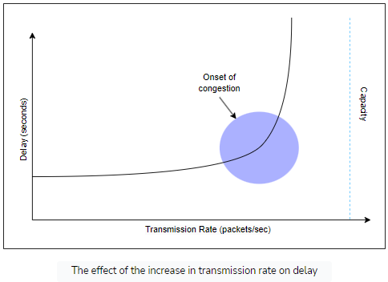

Routers have a set input and output limit. When these limits are exceeded the excess packets are placed in a queue, when the queue becomes full the router cannot store anymore packets and that is how packets get dropped.

As the **average** transmission rate approaches the service rate, the queue may start to fill up. As the queue fills up the delay increases exponentially until we reach max capacity. Once max capacity is reached the packets will start getting dropped.

## OSI Model

The OSI model provides a standard for different computer systems to communicate with each other. However, OSI is a **theoretical model** and works very well for teaching purposes, but it's not practically used. TCP/IP is used practically.

### OSI Model Layers

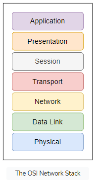

#### Application Layer

- End users interact with the application layer
- Where most end-user applications such as web browsing and email live
- Where the outgoing message starts its journey so it provides data for the layer below

#### Presentation

- Presents data in a way that can be understood and displayed by the application layer
  - **Encoding** is an example. The underlying layers might use different character encoding compared to the one used by the application layer.
- Encryption is also done at this layer
- End-to-end compression: the presentation layer might also implement end to end compression to reduce traffic in the network

#### Session

- Responsibility is to take services of the transport layer and build a service on top that manages user sessions
- A session is an exchange of information between local apps and remote services on the other end systems

#### Transport Layer

- Since the application, presentation and session layers may be handing off large chunks of data, the transport layer segments it into smaller chunks
  - These are called Datagrams or segments depending on the protocol used
- Sometimes additional information is required to transmit the segment/datagram reliably.
  - Checksum - ensure message is correctly delivered without corruption
  - Header - Information at the start of the datagram
  - Trailer - Information at the end of the datagram

#### Network Layer

- Network layer messages are termed as **packets**.
- Facilitate the transportation of packets from one end system to another
- Routing protocols are apps that run on the network and exchange messages with each other to develop information that helps them route transport layer messages
  - Help determine the best routes that a message should take
- Load balancing

#### Data Link Layer

- Allows directly connected hosts to communicate
- Encapsulates packets for transmission across a single link
- Resolve transmission conflicts - when two end systems send a message at the same time across one singular link
- Handles addressing
- Multiplexing and Demultiplexing
  - Multiple data links can be multiplexed into something that appears like one to integrate their bandwidths

#### Physical Layer

- Consists largely of hardware
- Provides medium to transmit data
- Transmits bits, not logical packets, datagrams or segments

### Example

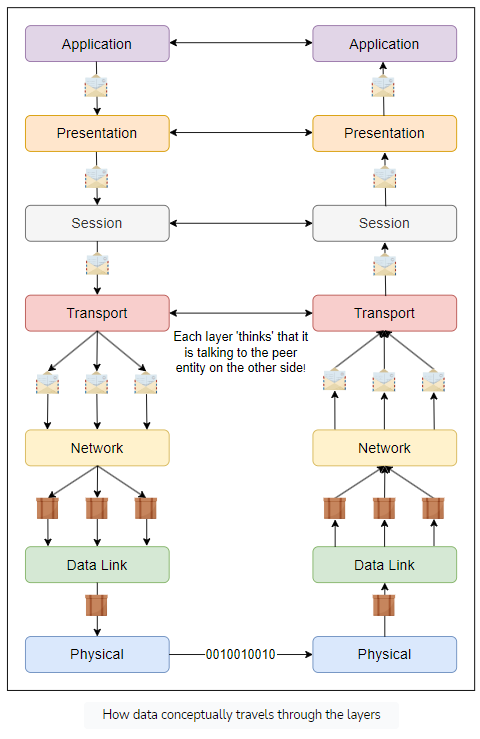

1. Application layer writes out streams of data to presentation layer
2. Presentation hands it off to session layer then to transport layer
3. Transport layer segments this data into datagrams
4. Network layer turns these datagrams/segments into packets
5. Physical layer carries each packet as bits to other end system
6. Reverse process happens from here to convert the bits back to application layer

## Proxy Server

> A proxy server is an intermediate server separating end users and the website they are browsing.
>
> This is to not expose the internal network to the public internet.
>
> When you send a web request, the request is sent to the proxy server and the proxy server will then make a request to the webserver on your behalf.

The proxy server can change your IP so that the webserver doesn't know where you are, encrypt data so it is unreadable in transit or block access to certain webpages based on IP address.

The proxy server can act as a firewall, web filter and/or cache data for common requests.

A proxy server is sometimes referred to as a forward proxy. Its to describe a server that sits in front of client machines and communicates with web servers on behalf of those clients. It is so that an origin server never directly interacts with the client.

### Use cases

- Control/monitor internet usage of employees/children
- Bandwidth savings and improved speed through caching
  - If hundreds of people want to access a specific webpage through a proxy server, the proxy server sends one request to the URL and sends the same response back to the hundreds of requests. This saves bandwidth and improves performance
- Privacy
  - Proxy servers can hide or alter identifying information in web requests.

### Reverse Proxy

> A reverse proxy is a type of Proxy Server that typically sites behind the firewall in a private network and directs requests to the appropriate backend server. Provides an additional level of abstraction and control to ensure the smooth flow of network traffic

A reverse proxy is different to a forward proxy. It sits in front of webs servers and intercepts incoming traffic to prevent any client from directly communicating with the origin server.

#### Use cases

- Load Balancing
  - Distribute traffic evenly across a group of backend servers
- Web Acceleration
  - Cache commonly requested content
  - Compress inbound/outbound data
- Security
  - Protect backend servers from attacks
- SSL Encryption

  - Encrypting and decrypting SSL or TLS communications can be computationally expensive for an origin server. Can offload these tasks to the proxy to free up resources.

- Resources
  - https://www.cloudflare.com/learning/cdn/glossary/reverse-proxy/

## Reliable Data Transfer

### Network Layer Imperfections

1. Segments can be **corrupted** by transmission errors
2. Segments can be **lost**
3. Segments can be **reordered** or **duplicated**

### Checksums

Simplest error detection scheme for corrupted or transmission errors is the checksum.

A Checksum can be based on different schemes. One scheme could be the arithmetic sum of all the bytes of a segment. Checksums are computed by the sender and attached with the segment. The receiver verifies it upon reception and can choose what to do if it is not valid. Often segments with invalid checksums are discarded.

### Retransmission timers

Since the receiver sends an acknowledgement segment after receiving a data segment, the simplest solution to dealing with lost segments is a retransmission timer.

Once the sender sends a segment the retransmission timer is triggered. The timer should be greater than the round trip time. TCP sends an acknowledgement for every segment so when the timer expires without an acknowledgement the segment is retransmitted.

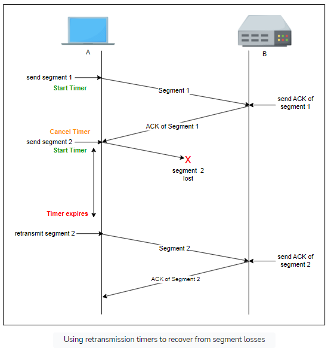

#### Limitations

If the data is received but the acknowledgement is lost then the sender will resend the data as a new segment meaning this segment is duplicated

To identify duplicates, the protocol associates an ID number with each segment called the sequence number. This way the receiver can identify duplicate ids.
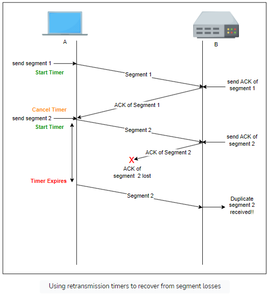

### Pipelining

Applications may generate data at a higher rate then the network can transport. Processor speed > network I/O speed.

Instead of waiting for acknowledgement of a message before transmitting the next one, the sender can keep transmitting messages without acknowledgement to make more efficient use of the processors time.

Pipelining allows the sender to transmit segments at a higher rate but can cause the receiver to become overloaded.

### Sliding Window

The sliding window is the set of consecutive sequence numbers that the sender can use when transmitting segments without being forced to wait for an acknowledgment. At the beginning of a session, the sender and receiver agree on a sliding window size.

If the sliding window contains three segments the sender can thus transmit three segments before being forced to wait for an acknowledgment. The sliding window moves to the higher sequence numbers upon reception of acknowledgments. When the first acknowledgment (of segment 0) is received, it allows the sender to move its sliding window to the right, and sequence number 3 becomes available.

Unfortunately, segment losses do not disappear because a transport protocol is using a sliding window. To recover from segment losses, a sliding window protocol must define:

- A heuristic to detect segment losses.
- A retransmission strategy to retransmit the lost segments.

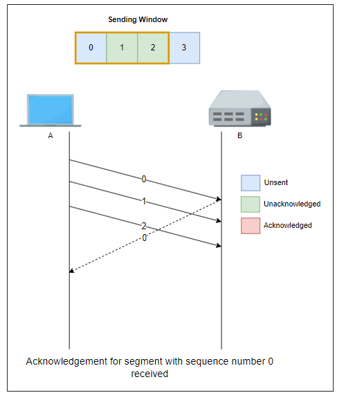
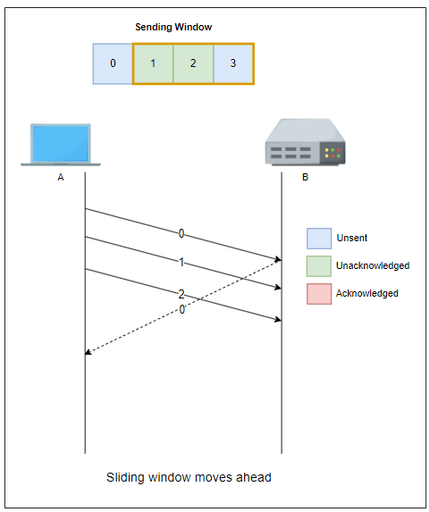

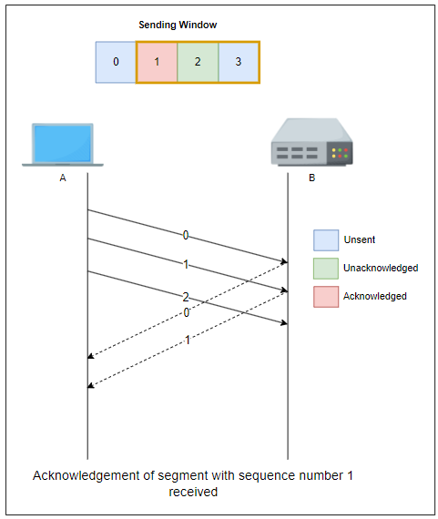

### Go-back-n

#### Go-back-n Receiver

Intuitively, go-back-n receiver operates as follows:

1. It only accepts the segments that arrive in-sequence.
2. It discards any out-of-sequence segment that it receives.
3. When it receives a data segment, it always returns an acknowledgment containing the sequence number of the **last in-sequence segment** that it has received.

A **key advantage** of these cumulative acknowledgments is that it's **easy to recover from the loss of an acknowledgment**.

Consider for example a go-back-n receiver that received segments 1, 2 and 3.

1. It sent acknowledgments for all three segments.
2. Unfortunately, acknowledgments of the first two were lost.
3. Thanks to the cumulative acknowledgments, the receiver receives the acknowledgment for the last segment and so it knows that all three have been correctly received.
   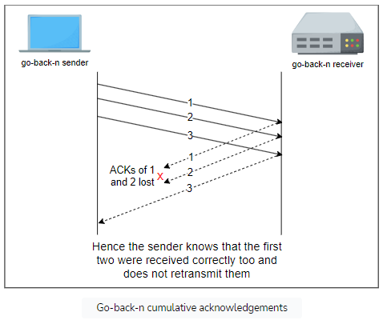

#### Go-back-n Sender

A go-back-n sender uses a sending buffer that can store an entire sliding window of segments.

- The segments are sent with a sending sliding window that we looked at in the last lesson.
- The sender must wait for an acknowledgment once its sending buffer is full.
- When a go-back-n sender receives an acknowledgment, it removes all the acknowledged segments from the sending buffer.

**Retransmission Timer**
A go-back-n sender uses a **retransmission timer** to detect segment losses.
It maintains one retransmission timer per connection.

1. This timer is started when the first segment is sent.
2. When the go-back-n sender receives an acknowledgment, it restarts the retransmission timer, but only if any unacknowledged segments exist in its sending window.
3. When the retransmission timer expires, the go-back-n sender assumes that all of the unacknowledged segments currently stored in its sending buffer have been lost. It thus retransmits all the unacknowledged segments in the buffer and restarts its retransmission timer.

#### Advantages of Go-back-n

The main advantage of go-back-n is that it can be easily implemented, and it can also provide good performance when only a few segments are lost. But when there are many losses, the performance of go-back-n quickly drops for two reasons:

- The go-back-n receiver does not accept out-of-sequence segments.
- The go-back-n sender retransmits all unacknowledged segments once it has detected a loss.

Since the go-back-n protocol does not accept out of order segments, it can waste a lot of bandwidth if segments are frequently lost.

The Selective Repeat protocol attempts to remedy this by accepting out of order packets and only retransmitting packets that are corrupted or lost in the network.

### Selective Repeat

- Uses a sliding window protocol just like go-back-n.
- The window size should be less than or equal to half the sequence numbers available. This avoids packets being identified incorrectly. Here's an **example**: suppose the window size is greater than half the buffer size.

  - Segment '1' is lost, hence the receiver expects a segment with sequence number 1 to be retransmitted.
  - Meanwhile, the window wraps around back to sequence number '1.'
  - The sender sends a new packet with sequence number 1 and the receiver perceives it to be the original one that it was expecting.

- Senders retransmit unacknowledged packets after a timeout or if a *NAK* (_negative acknowledgment/not acknowledged_) is received.
- The receiver acknowledges all correct packets.
- The receiver stores correct packets until they can be delivered in order to the upper application layer.

## Sockets

> A socket is a way to speak to other programs using standard Unix file descriptors.

> When Unix programs do any sort of I/O, they do it by reading or writing to a file descriptor. A file descriptor is simply an integer associated with an open file. But that file can be a network connection, a FIFO, a pipe, a terminal, a real on-the-disk file, or just about anything else. Everything in Unix *is* a file! So when you want to communicate with another program over the Internet you're gonna do it through a file descriptor.

A server/application runs on a computer and has a socket bound to a specific port number. The server waits for a client to make a connection request on this port. Sockets are identified by a combination of IP address and a 16 bit port number, each separate application will use its own port number.

For a client to make a request we need to know the hostname and the port number that the server is listening on. The client application will also need to identify itself so it binds to a local port number that it will use during this connection, this port number is usually assigned by the system.

Upon acceptance, the server gets a new socket bound to the same local port and also has its remote endpoint set to the address and port of the client. It needs a new socket so that it can continue to listen to the original socket for connection requests while tending to the needs of the connected client.

### Types of Internet Sockets

#### Stream Sockets

- _SOCK_STREAM_
- TCP (Transmission Control Protocol)
- Reliable **two-way** connected communication streams
- Data arrives sequentially and error free.

#### Datagram Sockets

- _SOCK_DGRAM_
- UDP (User Datagram Protocol)
- Unreliable. The packet may arrive and they may arrive out of order.
- Sometimes referred to as 'connectionless sockets
  - Do not need to maintain an open connection with a client
- Trade-off of using an unreliable protocol is speed.
  - Use UDP if speed is important and the order of packets and potentially dropped packets dont matter.

#### Raw Sockets

- _SOCK_RAW_
- A raw socket allow user to implement it's own Transport Layer Protocol above internet (IP) level .
  - Implementation is responsible for creating and parsing transport level headers and logic behind it.
  - Same level as TCP/UDP in [[#Data Encapsulation]]

### Data Encapsulation

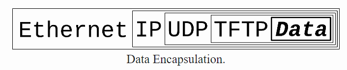

Data packet is encapsulated in a header by the first protocol (TFTP in this case). Then the entire thing including the TFTP headers are encapsulated in the next protocol (UDP in this case) and so on.

When a computer receives the packet, the hardware strips the Ethernet Protocol.
The OS kernel strips the IP and UDP protocols.
The TFTP program strips the TFTP headers and finally has the data.

### Byte Order

Networks store bytes in _Network Byte Order_ or [[notes/Endianness#Big Endian|Big-Endian]].
The byte order your machine uses is referred to as _Host Byte Order_. Some computers may store bytes in reverse, [[notes/Endianness#Little Endian|Little-Endian]] or it might be Big Endian as it is dependent on the machines architecture.

- Intel microprocessors are little endian

Hence never assume the Host Byte Order, there are functions to convert to Network host order.

- Code will also be portable if using the function otherwise code will only work on specific machines

Can convert `short` (two bytes) and `long` (four bytes) numbers.

> Say you want to convert a `short` from Host Byte Order to Network Byte Order. Start with "h" for "host", follow it with "to", then "n" for "network", and "s" for "short": h-to-n-s, or `htons()` (read: "Host to Network Short").

| Function  | Description             |
| --------- | ----------------------- |
| `htons()` | host `to` network short |
| `htonl()` | host `to` network long  |
| `ntohs()` | network `to` host short |
| `ntohl()` | network `to` host long  |

- Resources
  - [Beej's Guide to Network Programming](https://beej.us/guide/bgnet/html/)
  - https://docs.python.org/3/howto/sockets.html
  - [What is a Socket?](https://docs.oracle.com/javase/tutorial/networking/sockets/definition.html)

## SSL

> Secure Socket Layer (SSL) is an encryption-based security protocol. It is the predecessor to Transport Layer Security (TLS)

- A website that uses SSL/TLS has HTTPS in its URL instead of HTTP.
- SSL encrypts data that is transmitted across the web. The data is also signed in order to provide data integrity, verifying that the data is not tampered with before it reaches its destination. SSL also initiates an authentication [[notes/Transport Layer Security (TLS)#TLS Handshake|handshake]] between two devices to ensure that both devices are really who they claim to be.
- SSL has not been updated since 1996 and now deprecated as there are several known security vulnerabilities. TLS is its successor, however there is sometimes confusion as TLS is still commonly referred to as 'SSL Encryption'.

- Overview:
  - SSL = Secure Sockets Layer
  - Secure Sockets Layer (SSL), is an encryption-based Internet security protocol
    - It was first developed by Netscape in 1995 for the purpose of ensuring privacy, authentication, and data integrity in Internet communications
  - SSL is the predecessor to the modern Transport Layer Security (TLS) encryption used today
    - A website that implements SSL/TLS has "HTTPS" in its URL instead of "HTTP"
- _TLDR: SSL encrypts data sent between user and web server_
  - Prevents spying/tampering of data in transit
- How SSL Works:

  - SSL initiates an authentication process called a handshake between two communicating devices to ensure that both devices are really who they claim to be
  - SSL also digitally signs data in order to provide data integrity, verifying that the data is not tampered with before reaching its intended recipient

- Resources
  - https://www.cloudflare.com/learning/ssl/what-is-ssl/
  - https://www.cloudflare.com/learning/ssl/what-is-an-ssl-certificate/

### SSL Certificate

SSL can only be implemented by websites that have an SSL/TLS certificate. It allows websites to use the HTTPS protocol.

> SSL certificates are a data file hosted on a websites origin server. These certificates are sent to any devices that request to load the webpage. On chrome you can view an SSL certificate by clicking on the padlock icon next to the URL.

- The certificate contains:
  - The domain name that the certificate was issued for
  - Which person, organization, or device it was issued to
  - Which certificate authority(CA) issued it
  - The certificate authority's digital signature
  - Associated subdomains
  - Issue date of the certificate
  - Expiration date of the certificate
  - The public key (the private key is kept secret)
- The public key is used to encrypt data before it is sent to the webserver. The webserver can decrypt this information using a private key.

- An SSL certificate is a data file hosted in a website's origin server
  - SSL certificates make SSL/TLS encryption possible, and they contain the website's public key and the website's identity, along with related information
- Devices attempting to communicate with the origin server will reference this file to obtain the public key and verify the server's identity
  - The private key is kept secret and secure
- TLDR
  - SSL can only be implemented by websites that have an SSL certificate (technically a "TLS certificate")
    - An SSL certificate is like an ID card or a badge that proves someone is who they say they are
    - SSL certificates are stored and displayed on the Web by a website's or application's server
  - One of the most important pieces of information in an SSL certificate is the website's public key
    - The public key makes encryption and authentication possible
    - A user's device views the public key and uses it to establish secure encryption keys with the web server
    - Meanwhile the web server also has a private key that is kept secret; the private key decrypts data encrypted with the public key
  - Certificate authorities (CA) are responsible for issuing SSL certificates
  - _Web browsers get public key from server's SSL Certificate_
  - _SSL Certificate is obtained from a Certificate Authority (CA) that digitally signs certificate (with their own private key)_

#### SSL Certificates Contents

- SSL certificates include the following information in a single data file:
  - The domain name that the certificate was issued for
  - Which person, organization, or device it was issued to
  - Which certificate authority issued it
  - The certificate authority's digital signature
  - Associated subdomains
  - Issue date of the certificate
  - Expiration date of the certificate
  - The public key (the private key is kept secret)
- The public and private keys used for SSL are essentially long strings of characters used for encrypting and signing data
  - Data encrypted with the public key can only be decrypted with the private key
- The certificate is hosted on a website's origin server, and is sent to any devices that request to load the website

#### Why do Websites need an SSL Certificate

- A website needs an SSL certificate in order to keep user data secure, verify ownership of the website, prevent attackers from creating a fake version of the site, and gain user trust
- **Encryption**: SSL/TLS encryption is possible because of the public-private key pairing that SSL certificates facilitate
  - _Clients (such as web browsers) get the public key necessary to open a TLS connection from a server's SSL certificate_
- **Authentication**: SSL certificates verify that a client is talking to the correct server that actually owns the domain
  - This helps prevent domain spoofing and other kinds of attacks
- **HTTPS**: An SSL certificate is necessary for an HTTPS web address (needed for businesses)
  - HTTPS is the secure form of HTTP, and HTTPS websites are websites that have their traffic encrypted by SSL/TLS
- _For an SSL certificate to be valid, domains need to obtain it from a certificate authority (CA)_
  - A CA is an outside organization, a trusted third party, that generates and gives out SSL certificates
  - The CA will also digitally sign the certificate with their own private key, allowing client devices to verify it

#### Types of SSL Certificates

- **Single-domain**: A single-domain SSL certificate applies to only one domain (a "domain" is the name of a website, like www.cloudflare.com)
- **Wildcard**: Like a single-domain certificate, a wildcard SSL certificate applies to only one domain. However, it also includes that domain's subdomains. For example, a wildcard certificate could cover www.cloudflare.com, blog.cloudflare.com, and developers.cloudflare.com, while a single-domain certificate could only cover the first
- **Multi-domain**: As the name indicates, multi-domain SSL certificates can apply to multiple unrelated domains

#### SSL Validation Levels

- **Domain Validation**: This is the least-stringent level of validation, and the cheapest. All a business has to do is prove they control the domain
- **Organization Validation**: This is a more hands-on process: The CA directly contacts the person or business requesting the certificate. These certificates are more trustworthy for users
- **Extended Validation**: This requires a full background check of an organization before the SSL certificate can be issued

## TCP/IP Model

The protocols in this layer are clearly defined unlike the OSI Model

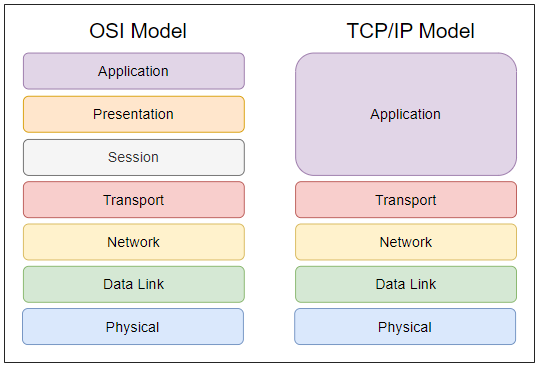

The layers in the TCP/IP stack largely perform the same functions as their counterparts in the OSI model, except that the application layer in the TCP/IP model encompasses the functionalities of the top three layers of the OSI model.

### Application Layer

Main purpose to enable end users to access the Internet

- Writing data off to the network in a format that is compliant with the protocol in use
- Reading data from end user
- Providing useful applications to end users
  - Browser, email agent, music streaming service etc
- Some applications also ensure that the data is in the correct format
- Error handling and recovery is also done by some applications
- **The Post Analogy**
  - Imagine you post a package across the world.
  - Presumably, the post system would hand it off to an airplane or ship to transport it across the world.
  - However, you would take it to the post office first to be shipped off. **Carrying the package to the post office** is what the application layer does in networks, except that **it carries messages to the transport layer**!

### Transport Layer

Responsibility is to take messages from an application and hand them to network layer and vice versa. The network layer transports messages from one end system to another but the transport layer delivers the message to and from the relevant application on an end system.

- Logical app to app deliver, transport layer makes it so that applications can address other applications on other end systems directly
- Segments data, divides data into segments/datagrams
- Allow multiple conversations, track each application connection separately which can allow multiple conversations at once
- Multiplexing and demultiplexing data. Ensure that data reaches the relevant application within an end system. If multiple packets get sent to one host then each will end up at the correct application.

#### Transport Layer Protocols

Transport layer has two prominent protocols Transmission Control Protocol (TCP) and User Datagram protocol (UDP).

## TLS

> TLS is the successor to Secure Socket Layer (SSL) and changed it name however people still use the terms interchangeably
>
> Functionally they serve the same purpose which is to encrypt web requests

- TLS = Transport Layer Security
- TLS is a widely adopted security protocol designed to facilitate privacy and data security for communications over the Internet and is the successor of SSL
- A primary use case of TLS is encrypting the communication between web applications and servers, such as web browsers loading a website
  - TLS can also be used to encrypt other communications such as email, messaging, and voice over IP (VoIP)
- TLS Features
  - Encryption: hides the data being transferred from third parties
  - Authentication: ensures that the parties exchanging information are who they claim to be
  - Integrity: verifies that the data has not been forged or tampered with
- TLDR
  - TLS is an encryption and authentication protocol designed to secure Internet communications
  - A TLS handshake is the process that kicks off a communication session that uses TLS
    - During a TLS handshake, the two communicating sides exchange messages to acknowledge each other, verify each other, establish the cryptographic algorithms they will use, and agree on session keys

### TLS Components

- Encryption: Hides the data being transferred from third parties
- Authentication: Ensures that the parties exchanging information are who they claim to be
- Integrity: Verifies that the data has not been forged or tampered with

### TLS Certificate

- For a website or application to use TLS, it must have a TLS certificate installed on its origin server (the certificate is also known as an "SSL certificate" because of the naming confusion described above)
  - A TLS certificate is issued by a certificate authority to the person or business that owns a domain
  - The certificate contains important information about who owns the domain, along with the server's public key, both of which are important for validating the server's identity

### How does TLS work

- A TLS connection is initiated using a sequence known as the TLS handshake
  - When a user navigates to a website that uses TLS, the TLS handshake begins between the user's device (also known as the client device) and the web server
- During the TLS handshake, the user's device and the web server:
  - Specify which version of TLS (TLS 1.0, 1.2, 1.3, etc.) they will use
  - Decide on which cipher suites they will use
  - Authenticate the identity of the server using the server's TLS certificate
  - Generate session keys for encrypting messages between them after the handshake is complete
- The TLS handshake establishes a cipher suite for each communication session
  - The cipher suite is a set of algorithms that specifies details such as which shared encryption keys, or session keys, will be used for that particular session
  - TLS is able to set the matching session keys over an unencrypted channel using public key cryptography
- The handshake also handles authentication, which usually consists of the server proving its identity to the client
  - This is done using public keys. Public keys are encryption keys that use one-way encryption, meaning that anyone with the public key can unscramble the data encrypted with the server's private key to ensure its authenticity, but only the original sender can encrypt data with the private key
  - The server's public key is part of its TLS certificate
- Once data is encrypted and authenticated, it is then signed with a message authentication code (MAC)
  - The recipient can then verify the MAC to ensure the integrity of the data

### TLS Handshake

- A TLS handshake is the process that kicks off a communication session that uses TLS -
- During a TLS handshake, the two communicating sides exchange messages to acknowledge each other, verify each other, establish the cryptographic algorithms they will use, and agree on session keys

- When a user navigates to a website that uses TLS, the process begins

  - The user's device and webserver specify which version of TLS they are using.
  - Decide on which cipher suite to use
  - Authenticate the identity of the server using the server's TLS certificate
  - Generate session keys for encrypting messages between them after the handshake is complete

- Resources
  - [TLS Handshake](https://www.cloudflare.com/learning/ssl/what-happens-in-a-tls-handshake/)

#### What Happens During TLS Handshake

- During the course of a TLS handshake, the client and server together will do the following:
  - Specify which version of TLS (TLS 1.0, 1.2, 1.3, etc.) they will use
  - Decide on which cipher suites they will use
  - Authenticate the identity of the server via the server's public key and the SSL certificate authority's digital signature
  - Generate session keys in order to use symmetric encryption after the handshake is complete

#### Steps of TLS Handshake

- TLS handshakes are a series of datagrams, or messages, exchanged by a client and a server. A TLS handshake involves multiple steps, as the client and server exchange the information necessary for completing the handshake and making further conversation possible
- The RSA key exchange algorithm, while now considered not secure, was used in versions of TLS before 1.3. It goes roughly as follows:
  1. **The 'client hello' message**
  - The client initiates the handshake by sending a "hello" message to the server. The message will include which TLS version the client supports, the cipher suites supported, and a string of random bytes known as the "client random."
  2. **The 'server hello' message**
  - In reply to the client hello message, the server sends a message containing the server's SSL certificate, the server's chosen cipher suite, and the "server random," another random string of bytes that's generated by the server
  3. **Authentication**
  - The client verifies the server's SSL certificate with the certificate authority that issued it
  - This confirms that the server is who it says it is, and that the client is interacting with the actual owner of the domain
  4. **The premaster secret**
  - The client sends one more random string of bytes, the "premaster secret." The premaster secret is encrypted with the public key and can only be decrypted with the private key by the server. (The client gets the public key from the server's SSL certificate.)
  5. **Private key used**
  - The server decrypts the premaster secret
  6. **Session keys created**
  - Both client and server generate session keys from the client random, the server random, and the premaster secret
  - They should arrive at the same results
  7. **Client is ready**
  - The client sends a "finished" message that is encrypted with a session key
  8. **Server is ready**
  - The server sends a "finished" message encrypted with a session key
  9. Secure symmetric encryption achieved
  - The handshake is completed, and communication continues using the session keys

#### TLS 1.3 Handshake

- TLS 1.3 does not support RSA, nor other cipher suites and parameters that are vulnerable to attack
  - It also shortens the TLS handshake, making a TLS 1.3 handshake both faster and more secure
- Steps
  1. **Client "Hello"**
  - The client sends a client hello message with the protocol version, the client random, a list of cipher suites and parameters that will be used for calculating the premaster secret
    - Because support for insecure cipher suites has been removed from TLS 1.3, the number of possible cipher suites is vastly reduced
  - Essentially, the client is assuming that it knows the server's preferred key exchange method (which, due to the simplified list of cipher suites, it probably does)
  - This cuts down the overall length of the handshake (this is the key difference between TLS 1.3 handshakes and TLS 1.0, 1.1, and 1.2 handshakes)
  2. **Server Generates Master Secret**
  - At this point, the server has received the client random and the client's parameters and cipher suites
  - It already has the server random, since it can generate that on its own
  - Therefore, the server can create the master secret
  3. **Server "Hello" and "Finished"**
  - The server hello includes the server's certificate, digital signature, server random, and chosen cipher suite
  - Because it already has the master secret, it also sends a "Finished" message
  4. **Final Steps and Client "Finished"**
  - Client verifies signature and certificate, generates master secret, and sends "Finished" message
  5. Secure symmetric encryption achieved

#### TLS 1.3 0-RTT Mode (Session Resumption)

- TLS 1.3 also supports an even faster version of the TLS handshake that does not require any round trips, or back-and-forth communication between client and server, at all
- If the client and the server have connected to each other before (as in, if the user has visited the website before), they can each derive another shared secret from the first session, called the "resumption main secret."
- The server also sends the client something called a "session ticket" during this first session
  - The client can use this shared secret to send encrypted data to the server on its first message of the next session, along with that session ticket
  - And TLS resumes between client and server
