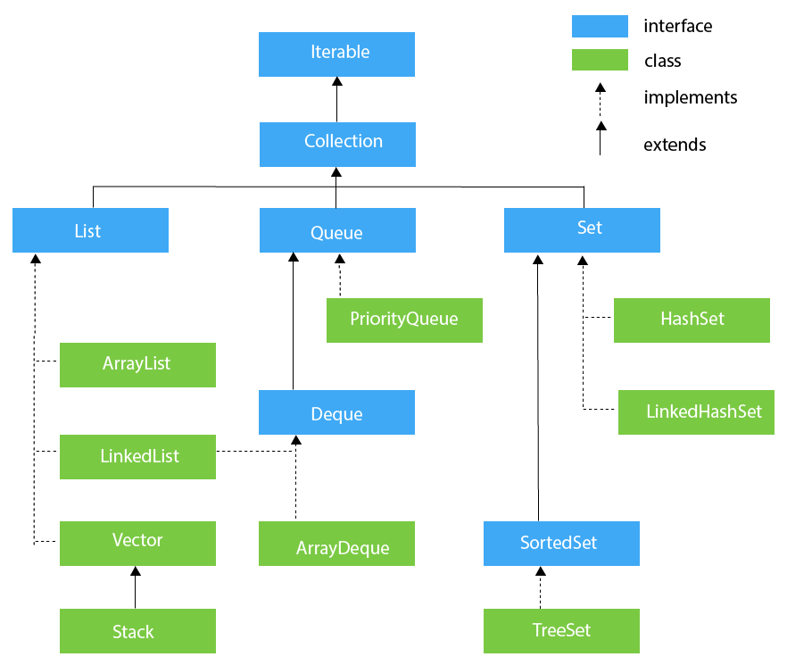
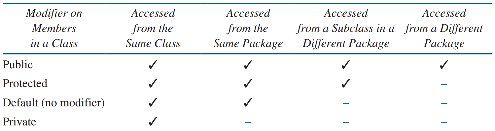

# Table of Contents

- [Table of Contents](#table-of-contents)
- [Sorting Algorithm Complexities](#sorting-algorithm-complexities)
- [Collections Complexities](#collections-complexities)
  - [List](#list)
  - [Map](#map)
  - [Queue](#queue)
  - [Set](#set)
- [Java Frameworks](#java-frameworks)
- [Character Class Methods](#character-class-methods)
- [String Type Methods](#string-type-methods)
- [StringBuilder Class](#stringbuilder-class)
  - [Constructor](#constructor)
  - [Methods](#methods)
- [Arrays Class](#arrays-class)
  - [Arrays Class Methods](#arrays-class-methods)
  - [Array Size and Default Values](#array-size-and-default-values)
  - [Array Initialisers](#array-initialisers)
  - [Copying Arrays](#copying-arrays)
    - [.arraycopy()](#arraycopy)
    - [.copyOf(), .copyOfRange()](#copyof-copyofrange)
    - [.clone()](#clone)
- [Collections (Interface)](#collections-interface)
  - [List (Interface)](#list-interface)
    - [ArrayList (Class)](#arraylist-class)
      - [Constructor](#constructor-1)
      - [Methods](#methods-1)
    - [LinkedList (Class)](#linkedlist-class)
      - [Constructor](#constructor-2)
      - [Methods](#methods-2)
    - [Vector (Class)](#vector-class)
      - [Constructor](#constructor-3)
      - [Methods](#methods-3)
      - [Stack (Class)](#stack-class)
        - [Constructor](#constructor-4)
        - [Methods](#methods-4)
  - [Queue (Interface)](#queue-interface)
    - [Methods](#methods-5)
    - [PriorityQueue (Class)](#priorityqueue-class)
      - [Constructor](#constructor-5)
      - [Methods](#methods-6)
    - [Deque (Interface)](#deque-interface)
      - [First Element (Head)](#first-element-head)
      - [Last Element (Tail)](#last-element-tail)
      - [Comparison of Queue and Deque Methods](#comparison-of-queue-and-deque-methods)
      - [Comparison of Stack and Deque methods](#comparison-of-stack-and-deque-methods)
      - [Methods](#methods-7)
      - [ArrayDeque (Class)](#arraydeque-class)
        - [Constructor](#constructor-6)
        - [Methods](#methods-8)
  - [Set (Interface)](#set-interface)
    - [Methods](#methods-9)
    - [HashSet (Class)](#hashset-class)
      - [Constructor](#constructor-7)
      - [Methods](#methods-10)
      - [LinkedHashSet (Class)](#linkedhashset-class)
        - [Constructor](#constructor-8)
        - [Methods](#methods-11)
    - [SortedSet (Interface)](#sortedset-interface)
      - [Methods](#methods-12)
      - [TreeSet (Class)](#treeset-class)
        - [Constructor](#constructor-9)
        - [Methods](#methods-13)
- [Map (Interface)](#map-interface)
  - [Methods](#methods-14)
  - [HashMap (Class)](#hashmap-class)
    - [Constructor](#constructor-10)
    - [Methods](#methods-15)
    - [LinkedHashMap (Class)](#linkedhashmap-class)
      - [Constructor](#constructor-11)
      - [Methods](#methods-16)
  - [SortedMap (Interface)](#sortedmap-interface)
    - [Methods](#methods-17)
    - [TreeMap (Class)](#treemap-class)
      - [Constructor](#constructor-12)
      - [Methods](#methods-18)
  - [Map.Entry (Interface)](#mapentry-interface)
    - [Methods](#methods-19)
  - [AbstractMap (Class)](#abstractmap-class)
    - [Constructor](#constructor-13)
    - [Methods](#methods-20)
- [Miscellaneous](#miscellaneous)
  - [Access Modifiers (Method Visibility)](#access-modifiers-method-visibility)
  - [Ascii Codes](#ascii-codes)
  - [Boolean](#boolean)
  - [Calendar Class](#calendar-class)
  - [Date Class (Deprecated)](#date-class-deprecated)
  - [For-Each Loop](#for-each-loop)
  - [Numeric Data Types](#numeric-data-types)
  - [Printing](#printing)
  - [Random Class](#random-class)
    - [Constructor](#constructor-14)
    - [Methods](#methods-21)
  - [Sorting Using Lambda Expression](#sorting-using-lambda-expression)
  - [Tuple/Pair Custom Implementation](#tuplepair-custom-implementation)
  - [Function Return Values](#function-return-values)

# Sorting Algorithm Complexities

| Algorithm      | Best       | Average      | Worst        | Space Complexity |
| -------------- | ---------- | ------------ | ------------ | ---------------- |
| Bubble Sort    | O(n)       | O(n^2)       | O(n^2)       | O(1)             |
| Bucket Sort    | O(n+k)     | O(n+k)       | O(n^2)       | O(n)             |
| Counting Sort  | O(n+k)     | O(n+k)       | O(n+k)       | O(k)             |
| Cubesort       | O(n)       | O(n log n)   | O(n log n)   | O(n)             |
| Heapsort       | O(n log n) | O(n log n)   | O(n log n)   | O(1)             |
| Insertion Sort | O(n)       | O(n^2)       | O(n^2)       | O(1)             |
| Mergesort      | O(n log n) | O(n log n)   | O(n log n)   | O(n)             |
| Quicksort      | O(n log n) | O(n log n)   | O(n^2)       | O(log n)         |
| Radix Sort     | O(nk)      | O(nk)        | O(nk)        | O(n+k)           |
| Selection Sort | O(n^2)     | O(n^2)       | O(n^2)       | O(1)             |
| Shell Sort     | O(n log n) | O(n log^2 n) | O(n log^2 n) | O(1)             |
| Timsort        | O(n)       | O(n log n)   | O(n log n)   | O(n)             |
| Tree Sort      | O(n log n) | O(n log n)   | O(n^2)       | O(n)             |

# Collections Complexities

## List

| List                 | Add  | Remove | Get  | Contains | Next | Data Structure |
| -------------------- | ---- | ------ | ---- | -------- | ---- | -------------- |
| ArrayList            | O(1) | O(n)   | O(1) | O(n)     | O(1) | Array          |
| LinkedList           | O(1) | O(1)   | O(n) | O(n)     | O(1) | Linked List    |
| CopyOnWriteArrayList | O(n) | O(n)   | O(1) | O(n)     | O(1) | Array          |

## Map

| Map                   | Get      | ContainsKey | Next     | Data Structure           |
| --------------------- | -------- | ----------- | -------- | ------------------------ |
| HashMap               | O(1)     | O(1)        | O(h/n)   | Hash Table               |
| TreeMap               | O(log n) | O(log n)    | O(log n) | Red-black tree           |
| ConcurrentHashMap     | O(1)     | O(1)        | O(h/n)   | Hash Tables              |
| ConcurrentSkipListMap | O(log n) | O(log n)    | O(1)     | Skip List                |
| EnumMap               | O(1)     | O(1)        | O(1)     | Array                    |
| IdentityHashMap       | O(1)     | O(1)        | O(h/n)   | Array                    |
| LinkedHashMap         | O(1)     | O(1)        | O(1)     | Hash Table + Linked List |
| WeakHashMap           | O(1)     | O(1)        | O(h/n)   | Hash Table               |

## Queue

| Queue                   | Offer    | Peek | Poll     | Remove | Size | Data Structure |
| ----------------------- | -------- | ---- | -------- | ------ | ---- | -------------- |
| ArrayDequeue            | O(1)     | O(1) | O(1)     | O(n)   | O(1) | Linked List    |
| LinkedList              | O(1)     | O(1) | O(1)     | O(1)   | O(1) | Array          |
| PriorityQueue           | O(log n) | O(1) | O(log n) | O(n)   | O(1) | Priority Heap  |
| ArrayBlockingQueue      | O(1)     | O(1) | O(1)     | O(n)   | O(1) | Array          |
| ConcurrentLinkedQueue   | O(1)     | O(1) | O(1)     | O(n)   | O(n) | Linked List    |
| DelayQueue              | O(log n) | O(1) | O(log n) | O(n)   | O(1) | Priority Heap  |
| LinkedBlockingQueue     | O(1)     | O(1) | O(1)     | O(n)   | O(1) | Linked List    |
| PriorirityBlockingQueue | O(log n) | O(1) | O(log n) | O(n)   | O(1) | Priority Heap  |
| SynchronousQueue        | O(1)     | O(1) | O(1)     | O(n)   | O(1) | None!          |

## Set

| Set                   | Add      | Remove   | Contains | Next     | Size | Data Structure           |
| --------------------- | -------- | -------- | -------- | -------- | ---- | ------------------------ |
| EnumSet               | O(1)     | O(1)     | O(1)     | O(1)     | O(1) | Bit Vector               |
| HashSet               | O(1)     | O(1)     | O(1)     | O(h/n)   | O(1) | Hash Table               |
| LinkedHashSet         | O(1)     | O(1)     | O(1)     | O(1)     | O(1) | Hash Table + Linked List |
| TreeSet               | O(log n) | O(log n) | O(log n) | O(log n) | O(1) | Red-black tree           |
| ConcurrentSkipListSet | O(log n) | O(log n) | O(log n) | O(1)     | O(n) | Skip List                |
| CopyOnWriteArraySet   | O(n)     | O(n)     | O(n)     | O(1)     | O(1) | Array                    |

# Java Frameworks




| Constructor | Description |
| ----------- | ----------- |

| Return | Method | Description |
| ------ | ------ | ----------- |

# Character Class Methods

- Example `System.out.println("isDigit('a') is " + Character.isDigit('a'));`
- [Read more](https://docs.oracle.com/en/java/javase/17/docs/api/java.base/java/lang/Character.html)

| Return  | Method                               | Description                                                    |
| ------- | ------------------------------------ | -------------------------------------------------------------- |
| boolean | `Character.isDigit(char ch)`         | Returns true if the specified character is a digit             |
| boolean | `Character.isLetter(char ch)`        | Returns true if the specified character is a letter            |
| boolean | `Character.isLetterOrDigit(char ch)` | Returns true if the specified character is a letter or digit   |
| boolean | `Character.isLowerCase(char ch)`     | Returns true if the specified character is a lowercase letter  |
| boolean | `Character.isUpperCase(char ch)`     | Returns true if the specified character is an uppercase letter |
| char    | `Character.toLowerCase(char ch)`     | Returns the lowercase of the specified character               |
| char    | `Character.toUpperCase(char ch)`     | Returns the uppercase of the specified character               |

# String Type Methods

- Note you cannot index into a string such as `s[i]`, you must use `s.charAt(i)`
- Examples
  - `"bye".toUpperCase();`
  - `String message = "Hello" + "World";`
  - `message.toLowerCase();`
- A String object is immutable
  - Its contents cannot be changed
    ```java
    String s = "Java";
    // NOT ALLOWED
    s = "HTML";
    ```
- [Read more](https://docs.oracle.com/en/java/javase/17/docs/api/java.base/java/lang/String.html)

| Return        | Method                                                                    | Description                                                                                                                                                                                               |
| ------------- | ------------------------------------------------------------------------- | --------------------------------------------------------------------------------------------------------------------------------------------------------------------------------------------------------- |
| char          | `charAt(int index)`                                                       | Returns the char value at the specified index                                                                                                                                                             |
| int           | `compareTo(String anotherString)`                                         | Compares two strings lexicographically                                                                                                                                                                    |
| int           | `compareToIgnoreCase(String str)`                                         | Compares two strings lexicographically, ignoring case differences                                                                                                                                         |
| String        | `concat(String str)`                                                      | Concatenates the specified string to the end of this string                                                                                                                                               |
| boolean       | `contains(CharSequence s)`                                                | Returns true if and only if this string contains the specified sequence of char values                                                                                                                    |
| static String | `copyValueOf(char[] data)`                                                | Equivalent to valueOf(char[])                                                                                                                                                                             |
| static String | `copyValueOf(char[] data, int offset, int count)`                         | Equivalent to valueOf(char[], int, int)                                                                                                                                                                   |
| boolean       | `endsWith(String suffix)`                                                 | Tests if this string ends with the specified suffix                                                                                                                                                       |
| boolean       | `equals(Object anObject)`                                                 | Compares this string to the specified object                                                                                                                                                              |
| boolean       | `equalsIgnoreCase(String anotherString)`                                  | Compares this String to another String, ignoring case considerations                                                                                                                                      |
| static String | `format(String format, Object... args)`                                   | Returns a formatted string using the specified format string and arguments                                                                                                                                |
| String        | `formatted(Object... args)`                                               | Formats using this string as the format string, and the supplied arguments                                                                                                                                |
| void          | `getChars(int srcBegin, int srcEnd, char[] dst, int dstBegin)`            | Copies characters from this string into the destination character array                                                                                                                                   |
| int           | `hashCode()`                                                              | Returns a hash code for this string                                                                                                                                                                       |
| int           | `indexOf(int ch)`                                                         | Returns the index within this string of the first occurrence of the specified character                                                                                                                   |
| int           | `indexOf(int ch, int fromIndex)`                                          | Returns the index within this string of the first occurrence of the specified character, starting the search at the specified index                                                                       |
| int           | `indexOf(String str)`                                                     | Returns the index within this string of the first occurrence of the specified substring                                                                                                                   |
| int           | `indexOf(String str, int fromIndex)`                                      | Returns the index within this string of the first occurrence of the specified substring, starting at the specified index                                                                                  |
| boolean       | `isBlank()`                                                               | Returns true if the string is empty or contains only white space codepoints, otherwise false                                                                                                              |
| boolean       | `isEmpty()`                                                               | Returns true if, and only if, length() is 0                                                                                                                                                               |
| static String | `join(CharSequence delimiter, CharSequence... elements)`                  | Returns a new String composed of copies of the CharSequence elements joined together with a copy of the specified delimiter                                                                               |
| static String | `join(CharSequence delimiter, Iterable<? extends CharSequence> elements)` | Returns a new String composed of copies of the CharSequence elements joined together with a copy of the specified delimiter                                                                               |
| int           | `lastIndexOf(int ch)`                                                     | Returns the index within this string of the last occurrence of the specified character                                                                                                                    |
| int           | `lastIndexOf(int ch, int fromIndex)`                                      | Returns the index within this string of the last occurrence of the specified character, searching backward starting at the specified index                                                                |
| int           | `lastIndexOf(String str)`                                                 | Returns the index within this string of the last occurrence of the specified substring                                                                                                                    |
| int           | `lastIndexOf(String str, int fromIndex)`                                  | Returns the index within this string of the last occurrence of the specified substring, searching backward starting at the specified index                                                                |
| int           | `length()`                                                                | Returns the length of this string                                                                                                                                                                         |
| boolean       | `matches(String regex)`                                                   | Tells whether or not this string matches the given regular expression                                                                                                                                     |
| String        | `repeat(int count)`                                                       | Returns a string whose value is the concatenation of this string repeated count times                                                                                                                     |
| String        | `replace(char oldChar, char newChar)`                                     | Returns a string resulting from replacing all occurrences of oldChar in this string with newChar                                                                                                          |
| String        | `replace(CharSequence target, CharSequence replacement)`                  | Replaces each substring of this string that matches the literal target sequence with the specified literal replacement sequence                                                                           |
| String        | `replaceAll(String regex, String replacement)`                            | Replaces each substring of this string that matches the given regular expression with the given replacement                                                                                               |
| String        | `replaceFirst(String regex, String replacement)`                          | Replaces the first substring of this string that matches the given regular expression with the given replacement                                                                                          |
| String[]      | `split(String regex)`                                                     | Splits this string around matches of the given regular expression                                                                                                                                         |
| String[]      | `split(String regex, int limit)`                                          | Splits this string around matches of the given regular expression                                                                                                                                         |
| boolean       | `startsWith(String prefix)`                                               | Tests if this string starts with the specified prefix                                                                                                                                                     |
| boolean       | `startsWith(String prefix, int offset)`                                   | Tests if the substring of this string beginning at the specified index starts with the specified prefix                                                                                                   |
| String        | `strip()`                                                                 | Returns a string whose value is this string, with all leading and trailing white space removed                                                                                                            |
| String        | `stripIndent()`                                                           | Returns a string whose value is this string, with incidental white space removed from the beginning and end of every line                                                                                 |
| String        | `stripLeading()`                                                          | Returns a string whose value is this string, with all leading white space removed                                                                                                                         |
| String        | `stripTrailing()`                                                         | Returns a string whose value is this string, with all trailing white space removed                                                                                                                        |
| CharSequence  | `subSequence(int beginIndex, int endIndex)`                               | Returns a character sequence that is a subsequence of this sequence                                                                                                                                       |
| String        | `substring(int beginIndex)`                                               | Returns a string that is a substring of this string                                                                                                                                                       |
| String        | `substring(int beginIndex, int endIndex)`                                 | Returns a string that is a substring of this string                                                                                                                                                       |
| char[]        | `toCharArray()`                                                           | Converts this string to a new character array                                                                                                                                                             |
| String        | `toLowerCase()`                                                           | Converts all of the characters in this String to lower case using the rules of the default locale                                                                                                         |
| String        | `toUpperCase()`                                                           | Converts all of the characters in this String to upper case using the rules of the default locale                                                                                                         |
| String        | `trim()`                                                                  | Returns a string whose value is this string, with all leading and trailing space removed, where space is defined as any character whose codepoint is less than or equal to 'U+0020' (the space character) |

# StringBuilder Class

- [Read More](https://docs.oracle.com/en/java/javase/17/docs/api/java.base/java/lang/StringBuilder.html)

```java
class Solution {
  public int stringBuilder() {
    StringBuilder sb = new StringBuilder();
    StringBuilder sb2 = new StringBuilder("Hello World");
  }
}
```

## Constructor

| Constructor                       | Description                                                                                                     |
| --------------------------------- | --------------------------------------------------------------------------------------------------------------- |
| `StringBuilder()`                 | Constructs a string builder with no characters in it and an initial capacity of 16 characters                   |
| `StringBuilder(int capacity)`     | Constructs a string builder with no characters in it and an initial capacity specified by the capacity argument |
| `StringBuilder(CharSequence seq)` | Constructs a string builder that contains the same characters as the specified CharSequence                     |
| `StringBuilder(String str)`       | Constructs a string builder initialised to the contents of the specified string                                 |

## Methods

| Return        | Method                                                         | Description                                                                                                                                |
| ------------- | -------------------------------------------------------------- | ------------------------------------------------------------------------------------------------------------------------------------------ |
| StringBuilder | `append(boolean b)`                                            | Appends the string representation of the boolean argument to the sequence                                                                  |
| StringBuilder | `append(char c)`                                               | Appends the string representation of the char argument to this sequence                                                                    |
| StringBuilder | `append(char[] str)`                                           | Appends the string representation of the char array argument to this sequence                                                              |
| StringBuilder | `append(char[] str, int offset, int len)`                      | Appends the string representation of a subarray of the char array argument to this sequence                                                |
| StringBuilder | `append(float f)`                                              | Appends the string representation of the float argument to this sequence                                                                   |
| StringBuilder | `append(int i)`                                                | Appends the string representation of the int argument to this sequence                                                                     |
| StringBuilder | `append(CharSequence s)`                                       | Appends the specified character sequence to this Appendable                                                                                |
| StringBuilder | `append(CharSequence s, int start, int end)`                   | Appends a subsequence of the specified CharSequence to this sequence                                                                       |
| StringBuilder | `append(Object obj)`                                           | Appends the string representation of the Object argument                                                                                   |
| StringBuilder | `append(String str)`                                           | Appends the specified string to this character sequence                                                                                    |
| StringBuilder | `append(StringBuffer sb)`                                      | Appends the specified StringBuffer to this sequence                                                                                        |
| int           | `capacity()`                                                   | Returns the current capacity                                                                                                               |
| char          | `charAt(int index)`                                            | Returns the char value in this sequence at the specified index                                                                             |
| int           | `compareTo(StringBuilder another)`                             | Compares two StringBuilder instances lexicographically                                                                                     |
| StringBuilder | `delete(int start, int end)`                                   | Removes the characters in a substring of this sequence                                                                                     |
| StringBuilder | `deleteCharAt(int index)`                                      | Removes the char at the specified position in this sequence                                                                                |
| void          | `ensureCapacity(int minimumCapacity)`                          | Ensures that the capacity is at least equal to the specified minimum                                                                       |
| void          | `getChars(int srcBegin, int srcEnd, char[] dst, int dstBegin)` | Characters are copied from this sequence into the destination character array dst                                                          |
| int           | `indexOf(String str)`                                          | Returns the index within this string of the first occurrence of the specified substring                                                    |
| int           | `indexOf(String str, int fromIndex)`                           | Returns the index within this string of the first occurrence of the specified substring, starting at the specified index                   |
| StringBuilder | `insert(int offset, char c)`                                   | Inserts the string representation of the char argument into this sequence                                                                  |
| StringBuilder | `insert(int offset, char[] str)`                               | Inserts the string representation of the char array argument into this sequence                                                            |
| StringBuilder | `insert(int index, char[] str, int offset, int len)`           | Inserts the string representation of a subarray of the str array argument into this sequence                                               |
| StringBuilder | `insert(int offset, float f)`                                  | Inserts the string representation of the float argument into this sequence                                                                 |
| StringBuilder | `insert(int offset, int i)`                                    | Inserts the string representation of the second int argument into this sequence                                                            |
| StringBuilder | `insert(int dstOffset, CharSequence s)`                        | Inserts the specified CharSequence into this sequence                                                                                      |
| StringBuilder | `insert(int dstOffset, CharSequence s, int start, int end)`    | Inserts a subsequence of the specified CharSequence into this sequence                                                                     |
| StringBuilder | `insert(int offset, Object obj)`                               | Inserts the string representation of the Object argument into this character sequence                                                      |
| StringBuilder | `insert(int offset, String str)`                               | Inserts the string into this character sequence                                                                                            |
| int           | `lastIndexOf(String str)`                                      | Returns the index within this string of the last occurrence of the specified substring                                                     |
| int           | `lastIndexOf(String str, int fromIndex)`                       | Returns the index within this string of the last occurrence of the specified substring, searching backward starting at the specified index |
| int           | `length()`                                                     | Returns the length (character count)                                                                                                       |
| StringBuilder | `replace(int start, int end, String str)`                      | Replaces the characters in a substring of this sequence with characters in the specified String                                            |
| StringBuilder | `reverse()`                                                    | Causes this character sequence to be replaced by the reverse of the sequence                                                               |
| void          | `setCharAt(int index, char ch)`                                | The character at the specified index is set to ch                                                                                          |
| void          | `setLength(int newLength)`                                     | Sets the length of the character sequence                                                                                                  |
| CharSequence  | `subSequence(int start, int end)`                              | Returns a new character sequence that is a subsequence of this sequence                                                                    |
| String        | `substring(int start)`                                         | Returns a new String that contains a subsequence of characters currently contained in this character sequence                              |
| String        | `substring(int start, int end)`                                | Returns a new String that contains a subsequence of characters currently contained in this sequence                                        |
| String        | `toString()`                                                   | Returns a string representing the data in this sequence                                                                                    |

# Arrays Class

## Arrays Class Methods

- `import java.util.Arrays;`
- [Read more](https://docs.oracle.com/en/java/javase/17/docs/api/java.base/java/util/Arrays.html)

| Return                 | Method                                                                                          | Description                                                                                                                                              |
| ---------------------- | ----------------------------------------------------------------------------------------------- | -------------------------------------------------------------------------------------------------------------------------------------------------------- |
| `static <T> List<T>`   | `asList(T... a)`                                                                                | Returns a fixed-size list backed by the specified array                                                                                                  |
| static int             | `Arrays.binarySearch(int[] a, int key)`                                                         | Searches the specified array of ints for the specified value using the binary search algorithm                                                           |
| static int             | `Arrays.binarySearch(int[] a, int fromIndex, int toIndex, int key)`                             | Searches a range of the specified array of ints for the specified value using the binary search algorithm                                                |
| static int             | `Arrays.compare(int[] a, int[] b)`                                                              | Compares two int arrays lexicographically                                                                                                                |
| static int             | `Arrays.compare(int[] a, int aFromIndex, int aToIndex, int[] b, int bFromIndex, int bToIndex)`  | Compares two int arrays lexicographically over the specified ranges                                                                                      |
| static char[]          | `Arrays.copyOf(char[] original, int newLength)`                                                 | Copies the specified array, truncating or padding with null characters (if necessary) so the copy has the specified length                               |
| static int[]           | `Arrays.copyOf(int[] original, int newLength)`                                                  | Copies the specified array, truncating or padding with zeros (if necessary) so the copy has the specified length                                         |
| static char[]          | `copyOfRange(char[] original, int from, int to)`                                                | Copies the specified range of the specified array into a new array                                                                                       |
| static int[]           | `copyOfRange(int[] original, int from, int to)`                                                 | Copies the specified range of the specified array into a new array                                                                                       |
| static boolean         | `Arrays.deepEquals(Object[] a1, Object[] a2)`                                                   | Returns true if the two specified arrays are deeply equal to one another                                                                                 |
| static String          | `Arrays.deepToString(Object[] a)`                                                               | Returns a string representation of the "deep contents" of the specified array                                                                            |
| static boolean         | `Arrays.equals(int[] a, int[] a2)`                                                              | Returns true if the two specified arrays of ints are equal to one another                                                                                |
| static boolean         | `Arrays.equals(int[] a, int aFromIndex, int aToIndex, int[] b, int bFromIndex, int bToIndex)`   | Returns true if the two specified arrays of ints, over the specified ranges, are equal to one another                                                    |
| static void            | `Arrays.fill(int[] a, int val)`                                                                 | Assigns the specified int value to each element of the specified array of ints                                                                           |
| static void            | `Arrays.fill(int[] a, int fromIndex, int toIndex, int val)`                                     | Assigns the specified int value to each element of the specified range of the specified array of ints                                                    |
| static int             | `Arrays.mismatch(int[] a, int[] b)`                                                             | Finds and returns the index of the first mismatch between two int arrays, otherwise return -1 if no mismatch is found                                    |
| static int             | `Arrays.mismatch(int[] a, int aFromIndex, int aToIndex, int[] b, int bFromIndex, int bToIndex)` | Finds and returns the relative index of the first mismatch between two int arrays over the specified ranges, otherwise return -1 if no mismatch is found |
| static void            | `Arrays.sort(int[] a)`                                                                          | Sorts the specified array into ascending numerical order                                                                                                 |
| static void            | `Arrays.sort(int[] a, int fromIndex, int toIndex)`                                              | Sorts the specified range of the array into ascending order                                                                                              |
| static IntStream       | `stream(int[] array)`                                                                           | Returns a sequential IntStream with the specified array as its source                                                                                    |
| static IntStream       | `stream(int[] array, int startInclusive, int endExclusive)`                                     | Returns a sequential IntStream with the specified range of the specified array as its source                                                             |
| `static <T> Stream<T>` | `stream(T[] array)`                                                                             | Returns a sequential Stream with the specified array as its source                                                                                       |
| `static <T> Stream<T>` | `stream(T[] array, int startInclusive, int endExclusive)`                                       | Returns a sequential Stream with the specified range of the specified array as its source                                                                |
| static String          | `Arrays.toString(char[] a)`                                                                     | Returns a string representation of the contents of the specified array                                                                                   |
| static String          | `Arrays.toString(int[] a)`                                                                      | Returns a string representation of the contents of the specified array                                                                                   |

## Array Size and Default Values

- The size of an array cannot be changed after the array is created.
- Array size using `array.length`
- When an array is created, its elements are assigned the default value of
  - `0` for the numeric primitive data types
  - `\u0000 (null)` for char types
  - `false` for boolean types

## Array Initialisers

- `elementType[] arrayRefVar = {value0, value1, ..., valuek};`

  ```java
  int[] oneDimensional = {1, 2, 3, 4, 5};
  int[][] twoDimensional = {{1,2,3}, {4,5,6}, {7,8,9}, {10,11,12}};

  oneDimensional.length = 5;

  twoDimensional.length = 4;
  twoDimensional[0].length = 3;
  ```

- The new operator is not used in the array-initialiser syntax.

  - Using an array initialiser, you have to declare, create, and initialise the array all in one statement.
  - Splitting it would cause a syntax error.

  ```java
  // WRONG
  double[] myList;
  myList = {1.9, 2.9, 3.4, 3.5};
  ```

## Copying Arrays

- `list2 = list1` DOES NOT WORK
- **There are three ways to copy arrays**:
  1. Use a loop to copy individual elements one by one
  2. Use the static `arraycopy` method in the `System` class
     - The `arraycopy` method does not allocate memory space for the target array.
     - The target array must have already been created with its memory space allocated
  3. Use the `clone` method to copy arrays; (Chapter 13, Abstract Classes and Interfaces)

### .arraycopy()

| Return      | Method                                                                           | Description                                                                                                                              |
| ----------- | -------------------------------------------------------------------------------- | ---------------------------------------------------------------------------------------------------------------------------------------- |
| static void | `System.arraycopy(Object src, int srcPos, Object dest, int destPos, int length)` | Copies an array from the specified source array, beginning at the specified position, to the specified position of the destination array |

```java
int[] sourceArray = {1, 2, 3, 4, 5};
int[] targetArray = new int[sourceArray.length];
System.arraycopy(sourceArray, 0, targetArray, 0, sourceArray.length);
```

### .copyOf(), .copyOfRange()

- `Arrays.copyOf(array, newLength)`

```java
int[] array = {0, 1, 2, 3, 4, 5};
int arrayLength = array.length;
int[] copiedArray = Arrays.copyOf(array, arrayLength);
// copiedArray = [0, 1, 2, 3, 4, 5]
```

- `Arrays.copyOfRange(array, fromIndex, toIndex)`
  - `fromIndex` is INCLUDED
  - `toIndex` is EXCLUDED

```java
int[] array = {0, 1, 2, 3, 4, 5, 6, 7, 8, 9, 10};
int[] copiedArray = Arrays.copyOfRange(array, 1, 4);
// copiedArray = [1, 2, 3]
```

### .clone()

```java
int[] sourceArray = {1, 2, 3, 4, 5};
int[] targetArray = sourceArray.clone();
```

# Collections (Interface)

- `import java.util.Collections;`
- "Collections" is a utility class
- [Read more](https://docs.oracle.com/en/java/javase/17/docs/api/java.base/java/util/Collections.html)
- [Note that there is also a "Collection" interface class](https://docs.oracle.com/en/java/javase/17/docs/api/java.base/java/util/Collection.html)

| Return                                                | Method                                                                        | Description                                                                                                                                               |
| ----------------------------------------------------- | ----------------------------------------------------------------------------- | --------------------------------------------------------------------------------------------------------------------------------------------------------- |
| `static <T> boolean`                                  | `Collections.addAll(Collection<? super T> c, T... elements)`                  | Adds all of the specified elements to the specified collection                                                                                            |
| `static <T> int`                                      | `Collections.binarySearch(List<? extends Comparable<? super T>> list, T key)` | Searches the specified list for the specified object using the binary search algorithm                                                                    |
| `static <T> void`                                     | `Collections.copy(List<? super T> dest, List<? extends T> src)`               | Copies all of the elements from one list into another                                                                                                     |
| `static boolean`                                      | `Collections.disjoint(Collection<?> c1, Collection<?> c2)`                    | Returns true if the two specified collections have no elements in common                                                                                  |
| `static <T> void`                                     | `Collections.fill(List<? super T> list, T obj)`                               | Replaces all of the elements of the specified list with the specified element                                                                             |
| static int                                            | `Collections.frequency(Collection<?> c, Object o)`                            | Returns the number of elements in the specified collection equal to the specified object                                                                  |
| static int                                            | `Collections.indexOfSubList(List<?> source, List<?> target)`                  | Returns the starting position of the first occurrence of the specified target list within the specified source list, or -1 if there is no such occurrence |
| static int                                            | `Collections.lastIndexOfSubList(List<?> source, List<?> target)`              | Returns the starting position of the last occurrence of the specified target list within the specified source list, or -1 if there is no such occurrence  |
| `static <T extends Object & Comparable<? super T>> T` | `Collections.max(Collection<? extends T> coll)`                               | Returns the maximum element of the given collection, according to the natural ordering of its elements                                                    |
| `static <T> T`                                        | `Collections.max(Collection<? extends T> coll, Comparator<? super T> comp)`   | Returns the maximum element of the given collection, according to the order induced by the specified comparator                                           |
| `static <T extends Object & Comparable<? super T>> T` | `Collections.min(Collection<? extends T> coll)`                               | Returns the minimum element of the given collection, according to the natural ordering of its elements                                                    |
| `static <T> T`                                        | `Collections.min(Collection<? extends T> coll, Comparator<? super T> comp)`   | Returns the minimum element of the given collection, according to the order induced by the specified comparator                                           |
| `static <T> boolean`                                  | `Collections.replaceAll(List<T> list, T oldVal, T newVal)`                    | Replaces all occurrences of one specified value in a list with another                                                                                    |
| static void                                           | `Collections.reverse(List<?> list)`                                           | Reverses the order of the elements in the specified list                                                                                                  |
| static void                                           | `Collections.rotate(List<?> list, int distance)`                              | Rotates the elements in the specified list by the specified distance                                                                                      |
| static void                                           | `Collections.shuffle(List<?> list)`                                           | Randomly permutes the specified list using a default source of randomness                                                                                 |
| `static <T extends Comparable<? super T>> void`       | `Collections.sort(List<T> list)`                                              | Sorts the specified list into ascending order, according to the natural ordering of its elements                                                          |
| `static <T> void`                                     | `Collections.sort(List<T> list, Comparator<? super T> c)`                     | Sorts the specified list according to the order induced by the specified comparator                                                                       |

## List (Interface)

- `import java.util.List;`
- Initialise `List` and `ArrayList` with:
  ```java
  // Method 1 - using .add()
  List<String> list1 = new ArrayList<>();
  list1.add("LeetCode");
  list1.add("HackerRank");
  list1.add("Codeforces");
  // Method 2 - using Arrays.asList()
  List<String> list2 = new ArrayList<>(Arrays.asList("LeetCode","HackerRank", "Codeforces"));
  // Method 3 - using List.of()
  List<String> list3 = new ArrayList<>(List.of("LeetCode","HackerRank", "Codeforces"));
  // Method 4 - using another collection
  List<String> list4 = newArrayList<list1>
  ```
- [Read more](https://docs.oracle.com/en/java/javase/17/docs/api/java.base/java/util/List.html)

| Return               | Method                                         | Description                                                                                                                                                                         |
| -------------------- | ---------------------------------------------- | ----------------------------------------------------------------------------------------------------------------------------------------------------------------------------------- |
| void                 | `add(int index, E element)`                    | Inserts the specified element at the specified position in this list (optional operation)                                                                                           |
| boolean              | `add(E e)`                                     | Appends the specified element to the end of this list (optional operation)                                                                                                          |
| boolean              | `addAll(int index, Collection<? extends E> c)` | Inserts all of the elements in the specified collection into this list at the specified position (optional operation)                                                               |
| boolean              | `addAll(Collection<? extends E> c)`            | Appends all of the elements in the specified collection to the end of this list, in the order that they are returned by the specified collection's iterator (optional operation)    |
| void                 | `clear()`                                      | Removes all of the elements from this list (optional operation)                                                                                                                     |
| boolean              | `contains(Object o)`                           | Returns true if this list contains the specified element                                                                                                                            |
| boolean              | `containsAll(Collection<?> c)`                 | Returns true if this list contains all of the elements of the specified collection                                                                                                  |
| `static <E> List<E>` | `copyOf(Collection<? extends E> coll)`         | Returns an unmodifiable List containing the elements of the given Collection, in its iteration order                                                                                |
| boolean              | `equals(Object o)`                             | Compares the specified object with this list for equality                                                                                                                           |
| E                    | `get(int index)`                               | Returns the element at the specified position in this list                                                                                                                          |
| int                  | `indexOf(Object o)`                            | Returns the index of the first occurrence of the specified element in this list, or -1 if this list does not contain the element                                                    |
| boolean              | `isEmpty()`                                    | Returns true if this list contains no elements                                                                                                                                      |
| `Iterator<E>`        | `iterator()`                                   | Returns an iterator over the elements in this list in proper sequence                                                                                                               |
| int                  | `lastIndexOf(Object o)`                        | Returns the index of the last occurrence of the specified element in this list, or -1 if this list does not contain the element                                                     |
| `ListIterator<E>`    | `listIterator()`                               | Returns a list iterator over the elements in this list (in proper sequence)                                                                                                         |
| `ListIterator<E>`    | `listIterator(int index)`                      | Returns a list iterator over the elements in this list (in proper sequence), starting at the specified position in the list                                                         |
| E                    | `remove(int index)`                            | Removes the element at the specified position in this list (optional operation)                                                                                                     |
| boolean              | `remove(Object o)`                             | Removes the first occurrence of the specified element from this list, if it is present (optional operation)                                                                         |
| boolean              | `removeAll(Collection<?> c)`                   | Removes from this list all of its elements that are contained in the specified collection (optional operation)                                                                      |
| default void         | `replaceAll(UnaryOperator<E> operator)`        | Replaces each element of this list with the result of applying the operator to that element                                                                                         |
| boolean              | `retainAll(Collection<?> c)`                   | Retains only the elements in this list that are contained in the specified collection (optional operation)                                                                          |
| E                    | `set(int index, E element)`                    | Replaces the element at the specified position in this list with the specified element (optional operation)                                                                         |
| int                  | `size()`                                       | Returns the number of elements in this list                                                                                                                                         |
| default void         | `sort(Comparator<? super E> c)`                | Sorts this list according to the order induced by the specified Comparator                                                                                                          |
| `List<E>`            | `subList(int fromIndex, int toIndex)`          | Returns a view of the portion of this list between the specified fromIndex, inclusive, and toIndex, exclusive                                                                       |
| Object[]             | `toArray()`                                    | Returns an array containing all of the elements in this list in proper sequence (from first to last element)                                                                        |
| `<T> T[]`            | `toArray(T[] a)`                               | Returns an array containing all of the elements in this list in proper sequence (from first to last element); the runtime type of the returned array is that of the specified array |

### ArrayList (Class)

- `import java.util.ArrayList;`
- [Read more](https://docs.oracle.com/en/java/javase/17/docs/api/java.base/java/util/ArrayList.html)

#### Constructor

| Constructor                            | Description                                                                                                                        |
| -------------------------------------- | ---------------------------------------------------------------------------------------------------------------------------------- |
| `ArrayList()`                          | Constructs an empty list with an initial capacity of ten                                                                           |
| `ArrayList(int initialCapacity)`       | Constructs an empty list with the specified initial capacity                                                                       |
| `ArrayList(Collection<? extends E> c)` | Constructs a list containing the elements of the specified collection, in the order they are returned by the collection's iterator |

#### Methods

| Return            | Method                                         | Description                                                                                                                                                                         |
| ----------------- | ---------------------------------------------- | ----------------------------------------------------------------------------------------------------------------------------------------------------------------------------------- |
| void              | `add(int index, E element)`                    | Inserts the specified element at the specified position in this list                                                                                                                |
| boolean           | `add(E e)`                                     | Appends the specified element to the end of this list                                                                                                                               |
| boolean           | `addAll(int index, Collection<? extends E> c)` | Inserts all of the elements in the specified collection into this list, starting at the specified position                                                                          |
| boolean           | `addAll(Collection<? extends E> c)`            | Appends all of the elements in the specified collection to the end of this list, in the order that they are returned by the specified collection's Iterator                         |
| void              | `clear()`                                      | Removes all of the elements from this list                                                                                                                                          |
| Object            | `clone()`                                      | Returns a shallow copy of this ArrayList instance                                                                                                                                   |
| boolean           | `contains(Object o)`                           | Returns true if this list contains the specified element                                                                                                                            |
| void              | `ensureCapacity(int minCapacity)`              | Increases the capacity of this ArrayList instance, if necessary, to ensure that it can hold at least the number of elements specified by the minimum capacity argument              |
| boolean           | `equals(Object o)`                             | Compares the specified object with this list for equality                                                                                                                           |
| void              | `forEach(Consumer<? super E> action)`          | Performs the given action for each element of the Iterable until all elements have been processed or the action throws an exception                                                 |
| E                 | `get(int index)`                               | Returns the element at the specified position in this list                                                                                                                          |
| int               | `hashCode()`                                   | Returns the hash code value for this list                                                                                                                                           |
| int               | `indexOf(Object o)`                            | Returns the index of the first occurrence of the specified element in this list, or -1 if this list does not contain the element                                                    |
| boolean           | `isEmpty()`                                    | Returns true if this list contains no elements                                                                                                                                      |
| `Iterator<E>`     | `iterator()`                                   | Returns an iterator over the elements in this list in proper sequence                                                                                                               |
| int               | `lastIndexOf(Object o)`                        | Returns the index of the last occurrence of the specified element in this list, or -1 if this list does not contain the element                                                     |
| `ListIterator<E>` | `listIterator()`                               | Returns a list iterator over the elements in this list (in proper sequence)                                                                                                         |
| `ListIterator<E>` | `listIterator(int index)`                      | Returns a list iterator over the elements in this list (in proper sequence), starting at the specified position in the list                                                         |
| E                 | `remove(int index)`                            | Removes the element at the specified position in this list                                                                                                                          |
| boolean           | `remove(Object o)`                             | Removes the first occurrence of the specified element from this list, if it is present                                                                                              |
| boolean           | `removeAll(Collection<?> c)`                   | Removes from this list all of its elements that are contained in the specified collection                                                                                           |
| boolean           | `removeIf(Predicate<? super E> filter)`        | Removes all of the elements of this collection that satisfy the given predicate                                                                                                     |
| protected void    | `removeRange(int fromIndex, int toIndex)`      | Removes from this list all of the elements whose index is between fromIndex, inclusive, and toIndex, exclusive                                                                      |
| boolean           | `retainAll(Collection<?> c)`                   | Retains only the elements in this list that are contained in the specified collection                                                                                               |
| E                 | `set(int index, E element)`                    | Replaces the element at the specified position in this list with the specified element                                                                                              |
| int               | `size()`                                       | Returns the number of elements in this list                                                                                                                                         |
| `Spliterator<E>`  | `spliterator()`                                | Creates a late-binding and fail-fast Spliterator over the elements in this list                                                                                                     |
| `List<E>`         | `subList(int fromIndex, int toIndex)`          | Returns a view of the portion of this list between the specified fromIndex, inclusive, and toIndex, exclusive                                                                       |
| Object[]          | `toArray()`                                    | Returns an array containing all of the elements in this list in proper sequence (from first to last element)                                                                        |
| `<T> T[]`         | `toArray(T[] a)`                               | Returns an array containing all of the elements in this list in proper sequence (from first to last element); the runtime type of the returned array is that of the specified array |
| void              | `trimToSize()`                                 | Trims the capacity of this ArrayList instance to be the list's current size                                                                                                         |

### LinkedList (Class)

- `import java.util.LinkedList;`
- Can be used to implement a **stack**
- [Read more](https://docs.oracle.com/en/java/javase/17/docs/api/java.base/java/util/LinkedList.html)

#### Constructor

| Constructor                             | Description                                                                                                                        |
| --------------------------------------- | ---------------------------------------------------------------------------------------------------------------------------------- |
| `LinkedList()`                          | Constructs an empty list                                                                                                           |
| `LinkedList(Collection<? extends E> c)` | Constructs a list containing the elements of the specified collection, in the order they are returned by the collection's iterator |

#### Methods

| Return    | Method                                         | Description                                                                                                                                                                         |
| --------- | ---------------------------------------------- | ----------------------------------------------------------------------------------------------------------------------------------------------------------------------------------- |
| void      | `add(int index, E element)`                    | Inserts the specified element at the specified position in this list                                                                                                                |
| boolean   | `add(E e)`                                     | Appends the specified element to the end of this list                                                                                                                               |
| boolean   | `addAll(int index, Collection<? extends E> c)` | Inserts all of the elements in the specified collection into this list, starting at the specified position                                                                          |
| boolean   | `addAll(Collection<? extends E> c)`            | Appends all of the elements in the specified collection to the end of this list, in the order that they are returned by the specified collection's iterator                         |
| void      | `addFirst(E e)`                                | Inserts the specified element at the beginning of this list                                                                                                                         |
| void      | `addLast(E e)`                                 | Appends the specified element to the end of this list                                                                                                                               |
| void      | `clear()`                                      | Removes all of the elements from this list                                                                                                                                          |
| Object    | `clone()`                                      | Returns a shallow copy of this LinkedList                                                                                                                                           |
| boolean   | `contains(Object o)`                           | Returns true if this list contains the specified element                                                                                                                            |
| E         | `element()`                                    | Retrieves, but does not remove, the head (first element) of this list                                                                                                               |
| E         | `get(int index)`                               | Returns the element at the specified position in this list                                                                                                                          |
| E         | `getFirst()`                                   | Returns the first element in this list                                                                                                                                              |
| E         | `getLast()`                                    | Returns the last element in this list                                                                                                                                               |
| int       | `indexOf(Object o)`                            | Returns the index of the first occurrence of the specified element in this list, or -1 if this list does not contain the element                                                    |
| int       | `lastIndexOf(Object o)`                        | Returns the index of the last occurrence of the specified element in this list, or -1 if this list does not contain the element                                                     |
| boolean   | `offer(E e)`                                   | Adds the specified element as the tail (last element) of this list                                                                                                                  |
| boolean   | `offerFirst(E e)`                              | Inserts the specified element at the front of this list                                                                                                                             |
| boolean   | `offerLast(E e)`                               | Inserts the specified element at the end of this list                                                                                                                               |
| E         | `peek()`                                       | Retrieves, but does not remove, the head (first element) of this list                                                                                                               |
| E         | `peekFirst()`                                  | Retrieves, but does not remove, the first element of this list, or returns null if this list is empty                                                                               |
| E         | `peekLast()`                                   | Retrieves, but does not remove, the last element of this list, or returns null if this list is empty                                                                                |
| E         | `poll()`                                       | Retrieves and removes the head (first element) of this list                                                                                                                         |
| E         | `pollFirst()`                                  | Retrieves and removes the first element of this list, or returns null if this list is empty                                                                                         |
| E         | `pollLast()`                                   | Retrieves and removes the last element of this list, or returns null if this list is empty                                                                                          |
| E         | `pop()`                                        | Pops an element from the stack represented by this list                                                                                                                             |
| void      | `push(E e)`                                    | Pushes an element onto the stack represented by this list                                                                                                                           |
| E         | `remove()`                                     | Retrieves and removes the head (first element) of this list                                                                                                                         |
| E         | `remove(int index)`                            | Removes the element at the specified position in this list                                                                                                                          |
| boolean   | `remove(Object o)`                             | Removes the first occurrence of the specified element from this list, if it is present                                                                                              |
| E         | `removeFirst()`                                | Removes and returns the first element from this list                                                                                                                                |
| boolean   | `removeFirstOccurrence(Object o)`              | Removes the first occurrence of the specified element in this list (when traversing the list from head to tail)                                                                     |
| E         | `removeLast()`                                 | Removes and returns the last element from this list                                                                                                                                 |
| boolean   | `removeLastOccurrence(Object o)`               | Removes the last occurrence of the specified element in this list (when traversing the list from head to tail)                                                                      |
| E         | `set(int index, E element)`                    | Replaces the element at the specified position in this list with the specified element                                                                                              |
| int       | `size()`                                       | Returns the number of elements in this list                                                                                                                                         |
| Object[]  | `toArray()`                                    | Returns an array containing all of the elements in this list in proper sequence (from first to last element)                                                                        |
| `<T> T[]` | `toArray(T[] a)`                               | Returns an array containing all of the elements in this list in proper sequence (from first to last element); the runtime type of the returned array is that of the specified array |

### Vector (Class)

- `import java.util.Vector;`
- [Read more](https://docs.oracle.com/en/java/javase/17/docs/api/java.base/java/util/Vector.html)

#### Constructor

| Constructor                                          | Description                                                                                                                          |
| ---------------------------------------------------- | ------------------------------------------------------------------------------------------------------------------------------------ |
| `Vector()`                                           | Constructs an empty vector so that its internal data array has size 10 and its standard capacity increment is zero                   |
| `Vector(int initialCapacity)`                        | Constructs an empty vector with the specified initial capacity and with its capacity increment equal to zero                         |
| `Vector(int initialCapacity, int capacityIncrement)` | Constructs an empty vector with the specified initial capacity and capacity increment                                                |
| `Vector(Collection<? extends E> c)`                  | Constructs a vector containing the elements of the specified collection, in the order they are returned by the collection's iterator |

#### Methods

| Return            | Method                                         | Description                                                                                                                                                   |
| ----------------- | ---------------------------------------------- | ------------------------------------------------------------------------------------------------------------------------------------------------------------- |
| void              | `add(int index, E element)`                    | Inserts the specified element at the specified position in this Vector                                                                                        |
| boolean           | `add(E e)`                                     | Appends the specified element to the end of this Vector                                                                                                       |
| boolean           | `addAll(int index, Collection<? extends E> c)` | Inserts all of the elements in the specified Collection into this Vector at the specified position                                                            |
| boolean           | `addAll(Collection<? extends E> c)`            | Appends all of the elements in the specified Collection to the end of this Vector, in the order that they are returned by the specified Collection's Iterator |
| void              | `addElement(E obj)`                            | Adds the specified component to the end of this vector, increasing its size by one                                                                            |
| int               | `capacity()`                                   | Returns the current capacity of this vector                                                                                                                   |
| void              | `clear()`                                      | Removes all of the elements from this Vector                                                                                                                  |
| Object            | `clone()`                                      | Returns a clone of this vector                                                                                                                                |
| boolean           | `contains(Object o)`                           | Returns true if this vector contains the specified element                                                                                                    |
| boolean           | `containsAll(Collection<?> c)`                 | Returns true if this Vector contains all of the elements in the specified Collection                                                                          |
| void              | `copyInto(Object[] anArray)`                   | Copies the components of this vector into the specified array                                                                                                 |
| E                 | `elementAt(int index)`                         | Returns the component at the specified index                                                                                                                  |
| `Enumeration<E>`  | `elements()`                                   | Returns an enumeration of the components of this vector                                                                                                       |
| void              | `ensureCapacity(int minCapacity)`              | Increases the capacity of this vector, if necessary, to ensure that it can hold at least the number of components specified by the minimum capacity argument  |
| boolean           | `equals(Object o)`                             | Compares the specified Object with this Vector for equality                                                                                                   |
| E                 | `firstElement()`                               | Returns the first component (the item at index 0) of this vector                                                                                              |
| void              | `forEach(Consumer<? super E> action)`          | Performs the given action for each element of the Iterable until all elements have been processed or the action throws an exception                           |
| E                 | `get(int index)`                               | Returns the element at the specified position in this Vector                                                                                                  |
| int               | `indexOf(Object o)`                            | Returns the index of the first occurrence of the specified element in this vector, or -1 if this vector does not contain the element                          |
| int               | `indexOf(Object o, int index)`                 | Returns the index of the first occurrence of the specified element in this vector, searching forwards from index, or returns -1 if the element is not found   |
| void              | `insertElementAt(E obj, int index)`            | Inserts the specified object as a component in this vector at the specified index                                                                             |
| boolean           | `isEmpty()`                                    | Tests if this vector has no components                                                                                                                        |
| E                 | `lastElement()`                                | Returns the last component of the vector                                                                                                                      |
| int               | `lastIndexOf(Object o)`                        | Returns the index of the last occurrence of the specified element in this vector, or -1 if this vector does not contain the element                           |
| int               | `lastIndexOf(Object o, int index)`             | Returns the index of the last occurrence of the specified element in this vector, searching backwards from index, or returns -1 if the element is not found   |
| `ListIterator<E>` | `listIterator()`                               | Returns a list iterator over the elements in this list (in proper sequence)                                                                                   |
| `ListIterator<E>` | `listIterator(int index)`                      | Returns a list iterator over the elements in this list (in proper sequence), starting at the specified position in the list                                   |
| E                 | `remove(int index)`                            | Removes the element at the specified position in this Vector                                                                                                  |
| boolean           | `remove(Object o)`                             | Removes the first occurrence of the specified element in this Vector If the Vector does not contain the element, it is unchanged                              |
| boolean           | `removeAll(Collection<?> c)`                   | Removes from this Vector all of its elements that are contained in the specified Collection                                                                   |
| void              | `removeAllElements()`                          | Removes all components from this vector and sets its size to zero                                                                                             |
| boolean           | `removeElement(Object obj)`                    | Removes the first (lowest-indexed) occurrence of the argument from this vector                                                                                |
| void              | `removeElementAt(int index)`                   | Deletes the component at the specified index                                                                                                                  |
| boolean           | `removeIf(Predicate<? super E> filter)`        | Removes all of the elements of this collection that satisfy the given predicate                                                                               |
| protected void    | `removeRange(int fromIndex, int toIndex)`      | Removes from this list all of the elements whose index is between fromIndex, inclusive, and toIndex, exclusive                                                |
| void              | `replaceAll(UnaryOperator<E> operator)`        | Replaces each element of this list with the result of applying the operator to that element                                                                   |
| boolean           | `retainAll(Collection<?> c)`                   | Retains only the elements in this Vector that are contained in the specified Collection                                                                       |
| E                 | `set(int index, E element)`                    | Replaces the element at the specified position in this Vector with the specified element                                                                      |
| void              | `setElementAt(E obj, int index)`               | Sets the component at the specified index of this vector to be the specified object                                                                           |
| void              | `setSize(int newSize)`                         | Sets the size of this vector                                                                                                                                  |
| int               | `size()`                                       | Returns the number of components in this vector                                                                                                               |
| `List<E>`         | `subList(int fromIndex, int toIndex)`          | Returns a view of the portion of this List between fromIndex, inclusive, and toIndex, exclusive                                                               |
| Object[]          | `toArray()`                                    | Returns an array containing all of the elements in this Vector in the correct order                                                                           |
| `<T> T[]`         | `toArray(T[] a)`                               | Returns an array containing all of the elements in this Vector in the correct order; the runtime type of the returned array is that of the specified array    |
| String            | `toString()`                                   | Returns a string representation of this Vector, containing the String representation of each element                                                          |
| void              | `trimToSize()`                                 | Trims the capacity of this vector to be the vector's current size                                                                                             |

#### Stack (Class)

- `import java.util.Stack;`
- [Read more](https://docs.oracle.com/en/java/javase/17/docs/api/java.base/java/util/Stack.html)

##### Constructor

| Constructor | Description            |
| ----------- | ---------------------- |
| `Stack()`   | Creates an empty Stack |

##### Methods

| Return  | Method             | Description                                                                                       |
| ------- | ------------------ | ------------------------------------------------------------------------------------------------- |
| boolean | `empty()`          | Tests if this stack is empty                                                                      |
| E       | `peek()`           | Looks at the object at the top of this stack without removing it from the stack                   |
| E       | `pop()`            | Removes the object at the top of this stack and returns that object as the value of this function |
| E       | `push(E item)`     | Pushes an item onto the top of this stack                                                         |
| int     | `search(Object o)` | Returns the 1-based position where an object is on this stack                                     |

## Queue (Interface)

- `import java.util.Queue;`
- Initialise `Queue` with:
  ```java
  Queue<List<String>> queue = new LinkedList<>();
  queue.offer(Arrays.asList("LeetCode", "HackerRank", "Codeforces"));
  ```
- [Read more](https://docs.oracle.com/en/java/javase/17/docs/api/java.base/java/util/Queue.html)

|         | Throws Exception | Returns Special Value |
| ------- | ---------------- | --------------------- |
| Insert  | `add(e)`         | `offer(e)`            |
| Remove  | `remove()`       | `poll()`              |
| Examine | `element()`      | `peek()`              |

### Methods

| Return  | Method       | Description                                                                                                                                                                                                                        |
| ------- | ------------ | ---------------------------------------------------------------------------------------------------------------------------------------------------------------------------------------------------------------------------------- |
| boolean | `add(E e)`   | Inserts the specified element into this queue if it is possible to do so immediately without violating capacity restrictions, returning true upon success and throwing an IllegalStateException if no space is currently available |
| E       | `element()`  | Retrieves, but does not remove, the head of this queue                                                                                                                                                                             |
| boolean | `offer(E e)` | Inserts the specified element into this queue if it is possible to do so immediately without violating capacity restrictions                                                                                                       |
| E       | `peek()`     | Retrieves, but does not remove, the head of this queue, or returns null if this queue is empty                                                                                                                                     |
| E       | `poll()`     | Retrieves and removes the head of this queue, or returns null if this queue is empty                                                                                                                                               |
| E       | `remove()`   | Retrieves and removes the head of this queue                                                                                                                                                                                       |

### PriorityQueue (Class)

- `import java.util.PriorityQueue;`
- Used to implement **heap priority queue**
- [Read more](https://docs.oracle.com/en/java/javase/17/docs/api/java.base/java/util/PriorityQueue.html)

```java
import java.util.*;
class Solution {
  public int myFunction() {
    // MIN Heap
    PriorityQueue<Integer> pq = new PriorityQueue<>((a,b) -> a - b);
    // MAX Heap
    PriorityQueue<Integer> pq = new PriorityQueue<>((a,b) -> b - a);
  }
}
```

#### Constructor

| Constructor                                                            | Description                                                                                                                    |
| ---------------------------------------------------------------------- | ------------------------------------------------------------------------------------------------------------------------------ |
| `PriorityQueue()`                                                      | Creates a PriorityQueue with the default initial capacity (11) that orders its elements according to their natural ordering    |
| `PriorityQueue(int initialCapacity)`                                   | Creates a PriorityQueue with the specified initial capacity that orders its elements according to their natural ordering       |
| `PriorityQueue(int initialCapacity, Comparator<? super E> comparator)` | Creates a PriorityQueue with the specified initial capacity that orders its elements according to the specified comparator     |
| `PriorityQueue(Collection<? extends E> c)`                             | Creates a PriorityQueue containing the elements in the specified collection                                                    |
| `PriorityQueue(Comparator<? super E> comparator)`                      | Creates a PriorityQueue with the default initial capacity and whose elements are ordered according to the specified comparator |
| `PriorityQueue(PriorityQueue<? extends E> c)`                          | Creates a PriorityQueue containing the elements in the specified priority queue                                                |
| `PriorityQueue(SortedSet<? extends E> c)`                              | Creates a PriorityQueue containing the elements in the specified sorted set                                                    |

#### Methods

| Return                  | Method                                  | Description                                                                                                                                        |
| ----------------------- | --------------------------------------- | -------------------------------------------------------------------------------------------------------------------------------------------------- |
| boolean                 | `add(E e)`                              | Inserts the specified element into this priority queue                                                                                             |
| void                    | `clear()`                               | Removes all of the elements from this priority queue                                                                                               |
| `Comparator<? super E>` | `comparator()`                          | Returns the comparator used to order the elements in this queue, or null if this queue is sorted according to the natural ordering of its elements |
| boolean                 | `contains(Object o)`                    | Returns true if this queue contains the specified element                                                                                          |
| void                    | `forEach(Consumer<? super E> action)`   | Performs the given action for each element of the Iterable until all elements have been processed or the action throws an exception                |
| boolean                 | `offer(E e)`                            | Inserts the specified element into this priority queue                                                                                             |
| E                       | `peek()`                                | Retrieves, but does not remove, the head of this queue, or returns null if this queue is empty                                                     |
| E                       | `poll()`                                | Retrieves and removes the head of this queue, or returns null if this queue is empty                                                               |
| boolean                 | `remove(Object o)`                      | Removes a single instance of the specified element from this queue, if it is present                                                               |
| boolean                 | `removeAll(Collection<?> c)`            | Removes all of this collection's elements that are also contained in the specified collection (optional operation)                                 |
| boolean                 | `removeIf(Predicate<? super E> filter)` | Removes all of the elements of this collection that satisfy the given predicate                                                                    |
| boolean                 | `retainAll(Collection<?> c)`            | Retains only the elements in this collection that are contained in the specified collection (optional operation)                                   |
| int                     | `size()`                                | Returns the number of elements in this collection                                                                                                  |
| Object[]                | `toArray()`                             | Returns an array containing all of the elements in this queue                                                                                      |
| `<T> T[]`               | `toArray(T[] a)`                        | Returns an array containing all of the elements in this queue; the runtime type of the returned array is that of the specified array               |

### Deque (Interface)

- `import java.util.Deque;`
- [Read more](https://docs.oracle.com/en/java/javase/17/docs/api/java.base/java/util/Deque.html)

#### First Element (Head)

|         | Throws Exception | Returns Special Value |
| ------- | ---------------- | --------------------- |
| Insert  | `addFirst(e)`    | `offerFirst(e)`       |
| Remove  | `removeFirst()`  | `pollFirst()`         |
| Examine | `getFirst()`     | `peekFirst()`         |

#### Last Element (Tail)

|         | Throws Exception | Returns Special Value |
| ------- | ---------------- | --------------------- |
| Insert  | `addLast(e)`     | `offerLast(e)`        |
| Remove  | `removeLast()`   | `pollLast()`          |
| Examine | `getLast()`      | `peekLast()`          |

#### Comparison of Queue and Deque Methods

| Queue Method | Equivalent Deque Method |
| ------------ | ----------------------- |
| `add(e)`     | `addLast(e)`            |
| `offer(e)`   | `offerLast(e)`          |
| `remove()`   | `removeFirst()`         |
| `poll()`     | `pollFirst()`           |
| `element()`  | `getFirst()`            |
| `peek()`     | `peekFirst()`           |

#### Comparison of Stack and Deque methods

| Stack Method | Equivalent Deque Method |
| ------------ | ----------------------- |
| `push(e)`    | `addFirst(e)`           |
| `pop()`      | `removeFirst()`         |
| `peek()`     | `getFirst()`            |

#### Methods

| Return        | Method                              | Description                                                                                                                                                                                                                                                                                             |
| ------------- | ----------------------------------- | ------------------------------------------------------------------------------------------------------------------------------------------------------------------------------------------------------------------------------------------------------------------------------------------------------- |
| boolean       | `add(E e)`                          | Inserts the specified element into the queue represented by this deque (in other words, at the tail of this deque) if it is possible to do so immediately without violating capacity restrictions, returning true upon success and throwing an IllegalStateException if no space is currently available |
| boolean       | `addAll(Collection<? extends E> c)` | Adds all of the elements in the specified collection at the end of this deque, as if by calling addLast(E) on each one, in the order that they are returned by the collection's iterator                                                                                                                |
| void          | `addFirst(E e)`                     | Inserts the specified element at the front of this deque if it is possible to do so immediately without violating capacity restrictions, throwing an IllegalStateException if no space is currently available                                                                                           |
| void          | `addLast(E e)`                      | Inserts the specified element at the end of this deque if it is possible to do so immediately without violating capacity restrictions, throwing an IllegalStateException if no space is currently available                                                                                             |
| boolean       | `contains(Object o)`                | Returns true if this deque contains the specified element                                                                                                                                                                                                                                               |
| `Iterator<E>` | `descendingIterator()`              | Returns an iterator over the elements in this deque in reverse sequential order                                                                                                                                                                                                                         |
| E             | `element()`                         | Retrieves, but does not remove, the head of the queue represented by this deque (in other words, the first element of this deque)                                                                                                                                                                       |
| E             | `getFirst()`                        | Retrieves, but does not remove, the first element of this deque                                                                                                                                                                                                                                         |
| E             | `getLast()`                         | Retrieves, but does not remove, the last element of this deque                                                                                                                                                                                                                                          |
| `Iterator<E>` | `iterator()`                        | Returns an iterator over the elements in this deque in proper sequence                                                                                                                                                                                                                                  |
| boolean       | `offer(E e)`                        | Inserts the specified element into the queue represented by this deque (in other words, at the tail of this deque) if it is possible to do so immediately without violating capacity restrictions, returning true upon success and false if no space is currently available                             |
| boolean       | `offerFirst(E e)`                   | Inserts the specified element at the front of this deque unless it would violate capacity restrictions                                                                                                                                                                                                  |
| boolean       | `offerLast(E e)`                    | Inserts the specified element at the end of this deque unless it would violate capacity restrictions                                                                                                                                                                                                    |
| E             | `peek()`                            | Retrieves, but does not remove, the head of the queue represented by this deque (in other words, the first element of this deque), or returns null if this deque is empty                                                                                                                               |
| E             | `peekFirst()`                       | Retrieves, but does not remove, the first element of this deque, or returns null if this deque is empty                                                                                                                                                                                                 |
| E             | `peekLast()`                        | Retrieves, but does not remove, the last element of this deque, or returns null if this deque is empty                                                                                                                                                                                                  |
| E             | `poll()`                            | Retrieves and removes the head of the queue represented by this deque (in other words, the first element of this deque), or returns null if this deque is empty                                                                                                                                         |
| E             | `pollFirst()`                       | Retrieves and removes the first element of this deque, or returns null if this deque is empty                                                                                                                                                                                                           |
| E             | `pollLast()`                        | Retrieves and removes the last element of this deque, or returns null if this deque is empty                                                                                                                                                                                                            |
| E             | `pop()`                             | Pops an element from the stack represented by this deque                                                                                                                                                                                                                                                |
| void          | `push(E e)`                         | Pushes an element onto the stack represented by this deque (in other words, at the head of this deque) if it is possible to do so immediately without violating capacity restrictions, throwing an IllegalStateException if no space is currently available                                             |
| E             | `remove()`                          | Retrieves and removes the head of the queue represented by this deque (in other words, the first element of this deque)                                                                                                                                                                                 |
| boolean       | `remove(Object o)`                  | Removes the first occurrence of the specified element from this deque                                                                                                                                                                                                                                   |
| E             | `removeFirst()`                     | Retrieves and removes the first element of this deque                                                                                                                                                                                                                                                   |
| boolean       | `removeFirstOccurrence(Object o)`   | Removes the first occurrence of the specified element from this deque                                                                                                                                                                                                                                   |
| E             | `removeLast()`                      | Retrieves and removes the last element of this deque                                                                                                                                                                                                                                                    |
| boolean       | `removeLastOccurrence(Object o)`    | Removes the last occurrence of the specified element from this deque                                                                                                                                                                                                                                    |
| int           | `size()`                            | Returns the number of elements in this deque                                                                                                                                                                                                                                                            |

#### ArrayDeque (Class)

- `import java.util.ArrayDeque;`
- [Read more](https://docs.oracle.com/en/java/javase/17/docs/api/java.base/java/util/ArrayDeque.html)

##### Constructor

| Constructor                             | Description                                                                                                                         |
| --------------------------------------- | ----------------------------------------------------------------------------------------------------------------------------------- |
| `ArrayDeque()`                          | Constructs an empty array deque with an initial capacity sufficient to hold 16 elements                                             |
| `ArrayDeque(int numElements)`           | Constructs an empty array deque with an initial capacity sufficient to hold the specified number of elements                        |
| `ArrayDeque(Collection<? extends E> c)` | Constructs a deque containing the elements of the specified collection, in the order they are returned by the collection's iterator |

##### Methods

| Return          | Method                                  | Description                                                                                                                                                                              |
| --------------- | --------------------------------------- | ---------------------------------------------------------------------------------------------------------------------------------------------------------------------------------------- |
| boolean         | `add(E e)`                              | Inserts the specified element at the end of this deque                                                                                                                                   |
| boolean         | `addAll(Collection<? extends E> c)`     | Adds all of the elements in the specified collection at the end of this deque, as if by calling addLast(E) on each one, in the order that they are returned by the collection's iterator |
| void            | `addFirst(E e)`                         | Inserts the specified element at the front of this deque                                                                                                                                 |
| void            | `addLast(E e)`                          | Inserts the specified element at the end of this deque                                                                                                                                   |
| void            | `clear()`                               | Removes all of the elements from this deque                                                                                                                                              |
| `ArrayDeque<E>` | `clone()`                               | Returns a copy of this deque                                                                                                                                                             |
| boolean         | `contains(Object o)`                    | Returns true if this deque contains the specified element                                                                                                                                |
| E               | `element()`                             | Retrieves, but does not remove, the head of the queue represented by this deque                                                                                                          |
| void            | `forEach(Consumer<? super E> action)`   | Performs the given action for each element of the Iterable until all elements have been processed or the action throws an exception                                                      |
| E               | `getFirst()`                            | Retrieves, but does not remove, the first element of this deque                                                                                                                          |
| E               | `getLast()`                             | Retrieves, but does not remove, the last element of this deque                                                                                                                           |
| boolean         | `isEmpty()`                             | Returns true if this deque contains no elements                                                                                                                                          |
| boolean         | `offer(E e)`                            | Inserts the specified element at the end of this deque                                                                                                                                   |
| boolean         | `offerFirst(E e)`                       | Inserts the specified element at the front of this deque                                                                                                                                 |
| boolean         | `offerLast(E e)`                        | Inserts the specified element at the end of this deque                                                                                                                                   |
| E               | `peek()`                                | Retrieves, but does not remove, the head of the queue represented by this deque, or returns null if this deque is empty                                                                  |
| E               | `peekFirst()`                           | Retrieves, but does not remove, the first element of this deque, or returns null if this deque is empty                                                                                  |
| E               | `peekLast()`                            | Retrieves, but does not remove, the last element of this deque, or returns null if this deque is empty                                                                                   |
| E               | `poll()`                                | Retrieves and removes the head of the queue represented by this deque (in other words, the first element of this deque), or returns null if this deque is empty                          |
| E               | `pollFirst()`                           | Retrieves and removes the first element of this deque, or returns null if this deque is empty                                                                                            |
| E               | `pollLast()`                            | Retrieves and removes the last element of this deque, or returns null if this deque is empty                                                                                             |
| E               | `pop()`                                 | Pops an element from the stack represented by this deque                                                                                                                                 |
| void            | `push(E e)`                             | Pushes an element onto the stack represented by this deque                                                                                                                               |
| E               | `remove()`                              | Retrieves and removes the head of the queue represented by this deque                                                                                                                    |
| boolean         | `remove(Object o)`                      | Removes a single instance of the specified element from this deque                                                                                                                       |
| boolean         | `removeAll(Collection<?> c)`            | Removes all of this collection's elements that are also contained in the specified collection (optional operation)                                                                       |
| E               | `removeFirst()`                         | Retrieves and removes the first element of this deque                                                                                                                                    |
| boolean         | `removeFirstOccurrence(Object o)`       | Removes the first occurrence of the specified element in this deque (when traversing the deque from head to tail)                                                                        |
| boolean         | `removeIf(Predicate<? super E> filter)` | Removes all of the elements of this collection that satisfy the given predicate                                                                                                          |
| E               | `removeLast()`                          | Retrieves and removes the last element of this deque                                                                                                                                     |
| boolean         | `removeLastOccurrence(Object o)`        | Removes the last occurrence of the specified element in this deque (when traversing the deque from head to tail)                                                                         |
| boolean         | `retainAll(Collection<?> c)`            | Retains only the elements in this collection that are contained in the specified collection (optional operation)                                                                         |
| int             | `size()`                                | Returns the number of elements in this deque                                                                                                                                             |
| Object[]        | `toArray()`                             | Returns an array containing all of the elements in this deque in proper sequence (from first to last element)                                                                            |
| `<T> T[]`       | `toArray(T[] a)`                        | Returns an array containing all of the elements in this deque in proper sequence (from first to last element); the runtime type of the returned array is that of the specified array     |

## Set (Interface)

- `import java.util.Set;`
- [Read more](https://docs.oracle.com/en/java/javase/17/docs/api/java.base/java/util/Set.html)

### Methods

| Return              | Method                                 | Description                                                                                                                        |
| ------------------- | -------------------------------------- | ---------------------------------------------------------------------------------------------------------------------------------- |
| boolean             | `add(E e)`                             | Adds the specified element to this set if it is not already present (optional operation)                                           |
| boolean             | `addAll(Collection<? extends E> c)`    | Adds all of the elements in the specified collection to this set if they're not already present (optional operation)               |
| void                | `clear()`                              | Removes all of the elements from this set (optional operation)                                                                     |
| boolean             | `contains(Object o)`                   | Returns true if this set contains the specified element                                                                            |
| boolean             | `containsAll(Collection<?> c)`         | Returns true if this set contains all of the elements of the specified collection                                                  |
| `static <E> Set<E>` | `copyOf(Collection<? extends E> coll)` | Returns an unmodifiable Set containing the elements of the given Collection                                                        |
| boolean             | `equals(Object o)`                     | Compares the specified object with this set for equality                                                                           |
| boolean             | `isEmpty()`                            | Returns true if this set contains no elements                                                                                      |
| boolean             | `remove(Object o)`                     | Removes the specified element from this set if it is present (optional operation)                                                  |
| boolean             | `removeAll(Collection<?> c)`           | Removes from this set all of its elements that are contained in the specified collection (optional operation)                      |
| boolean             | `retainAll(Collection<?> c)`           | Retains only the elements in this set that are contained in the specified collection (optional operation)                          |
| int                 | `size()`                               | Returns the number of elements in this set (its cardinality)                                                                       |
| Object[]            | `toArray()`                            | Returns an array containing all of the elements in this set                                                                        |
| `<T> T[]`           | `toArray(T[] a)`                       | Returns an array containing all of the elements in this set; the runtime type of the returned array is that of the specified array |

### HashSet (Class)

- `import java.util.HashSet;`
- [Read more](https://docs.oracle.com/en/java/javase/17/docs/api/java.base/java/util/HashSet.html)

#### Constructor

| Constructor                                      | Description                                                                                                                 |
| ------------------------------------------------ | --------------------------------------------------------------------------------------------------------------------------- |
| `HashSet()`                                      | Constructs a new, empty set; the backing HashMap instance has default initial capacity (16) and load factor (0.75)          |
| `HashSet(int initialCapacity)`                   | Constructs a new, empty set; the backing HashMap instance has the specified initial capacity and default load factor (0.75) |
| `HashSet(int initialCapacity, float loadFactor)` | Constructs a new, empty set; the backing HashMap instance has the specified initial capacity and the specified load factor  |
| `HashSet(Collection<? extends E> c)`             | Constructs a new set containing the elements in the specified collection                                                    |

#### Methods

| Return    | Method               | Description                                                                                                                               |
| --------- | -------------------- | ----------------------------------------------------------------------------------------------------------------------------------------- |
| boolean   | `add(E e)`           | Adds the specified element to this set if it is not already present                                                                       |
| void      | `clear()`            | Removes all of the elements from this set                                                                                                 |
| Object    | `clone()`            | Returns a shallow copy of this HashSet instance: the elements themselves are not cloned                                                   |
| boolean   | `contains(Object o)` | Returns true if this set contains the specified element                                                                                   |
| boolean   | `isEmpty()`          | Returns true if this set contains no elements                                                                                             |
| boolean   | `remove(Object o)`   | Removes the specified element from this set if it is present                                                                              |
| int       | `size()`             | Returns the number of elements in this set (its cardinality)                                                                              |
| Object[]  | `toArray()`          | Returns an array containing all of the elements in this collection                                                                        |
| `<T> T[]` | `toArray(T[] a)`     | Returns an array containing all of the elements in this collection; the runtime type of the returned array is that of the specified array |

#### LinkedHashSet (Class)

- `import java.util.LinkedHashSet;`
- [Read more](https://docs.oracle.com/en/java/javase/17/docs/api/java.base/java/util/LinkedHashSet.html)

##### Constructor

| Constructor                                            | Description                                                                                                    |
| ------------------------------------------------------ | -------------------------------------------------------------------------------------------------------------- |
| `LinkedHashSet()`                                      | Constructs a new, empty linked hash set with the default initial capacity (16) and load factor (0.75)          |
| `LinkedHashSet(int initialCapacity)`                   | Constructs a new, empty linked hash set with the specified initial capacity and the default load factor (0.75) |
| `LinkedHashSet(int initialCapacity, float loadFactor)` | Constructs a new, empty linked hash set with the specified initial capacity and load factor                    |
| `LinkedHashSet(Collection<? extends E> c)`             | Constructs a new linked hash set with the same elements as the specified collection                            |

##### Methods

- [Methods declared in class java.util.HashSet](https://docs.oracle.com/en/java/javase/17/docs/api/java.base/java/util/HashSet.html)
  - `add, clear, clone, contains, isEmpty, iterator, remove, size, toArray, toArray`
- [Methods declared in class java.util.AbstractSet](https://docs.oracle.com/en/java/javase/17/docs/api/java.base/java/util/AbstractSet.html)
  - `equals, hashCode, removeAll`
- [Methods declared in class java.util.AbstractCollection](https://docs.oracle.com/en/java/javase/17/docs/api/java.base/java/util/AbstractCollection.html)
  - `addAll, containsAll, retainAll, toArray, toArray, toString`
- [Methods declared in class java.lang.Object](https://docs.oracle.com/en/java/javase/17/docs/api/java.base/java/lang/Object.html)
  - `finalize, getClass, notify, notifyAll, wait, wait, wait`
- [Methods declared in interface java.util.Collection](https://docs.oracle.com/en/java/javase/17/docs/api/java.base/java/util/Collection.html)
  - `parallelStream, removeIf, stream, toArray`
- [Methods declared in interface java.lang.Iterable](https://docs.oracle.com/en/java/javase/17/docs/api/java.base/java/lang/Iterable.html)
  - `forEach`
- [Methods declared in interface java.util.Set](https://docs.oracle.com/en/java/javase/17/docs/api/java.base/java/util/Set.html)
  - `add, addAll, clear, contains, containsAll, equals, hashCode, isEmpty, iterator, remove, removeAll, retainAll, size, toArray, toArray`

### SortedSet (Interface)

- `import java.util.SortedSet;`
- [Read more](https://docs.oracle.com/en/java/javase/17/docs/api/java.base/java/util/SortedSet.html)

#### Methods

| Return                  | Method                               | Description                                                                                                                  |
| ----------------------- | ------------------------------------ | ---------------------------------------------------------------------------------------------------------------------------- |
| `Comparator<? super E>` | `comparator()`                       | Returns the comparator used to order the elements in this set, or null if this set uses the natural ordering of its elements |
| E                       | `first()`                            | Returns the first (lowest) element currently in this set                                                                     |
| `SortedSet<E>`          | `headSet(E toElement)`               | Returns a view of the portion of this set whose elements are strictly less than toElement                                    |
| E                       | `last()`                             | Returns the last (highest) element currently in this set                                                                     |
| `SortedSet<E>`          | `subSet(E fromElement, E toElement)` | Returns a view of the portion of this set whose elements range from fromElement, inclusive, to toElement, exclusive          |
| `SortedSet<E>`          | `tailSet(E fromElement)`             | Returns a view of the portion of this set whose elements are greater than or equal to fromElement                            |

- [Methods declared in interface java.util.Collection](https://docs.oracle.com/en/java/javase/17/docs/api/java.base/java/util/Collection.html)
  - `parallelStream, removeIf, stream, toArray`
- [Methods declared in interface java.lang.Iterable](https://docs.oracle.com/en/java/javase/17/docs/api/java.base/java/lang/Iterable.html)
  - `forEach`
- [Methods declared in interface java.util.Set](https://docs.oracle.com/en/java/javase/17/docs/api/java.base/java/util/Set.html)
  - `add, addAll, clear, contains, containsAll, equals, hashCode, isEmpty, iterator, remove, removeAll, retainAll, size, toArray, toArray`

#### TreeSet (Class)

- `import java.util.TreeSet;`
- [Read more](https://docs.oracle.com/en/java/javase/17/docs/api/java.base/java/util/TreeSet.html)

##### Constructor

| Constructor                                 | Description                                                                                                                             |
| ------------------------------------------- | --------------------------------------------------------------------------------------------------------------------------------------- |
| `TreeSet()`                                 | Constructs a new, empty tree set, sorted according to the natural ordering of its elements                                              |
| `TreeSet(Collection<? extends E> c)`        | Constructs a new tree set containing the elements in the specified collection, sorted according to the natural ordering of its elements |
| `TreeSet(Comparator<? super E> comparator)` | Constructs a new, empty tree set, sorted according to the specified comparator                                                          |
| `TreeSet(SortedSet<E> s)`                   | Constructs a new tree set containing the same elements and using the same ordering as the specified sorted set                          |

##### Methods

| Return                | Method                                                                           | Description                                                                                                                  |
| --------------------- | -------------------------------------------------------------------------------- | ---------------------------------------------------------------------------------------------------------------------------- |
| boolean               | `add(E e)`                                                                       | Adds the specified element to this set if it is not already present                                                          |
| boolean               | `addAll(Collection<? extends E> c)`                                              | Adds all of the elements in the specified collection to this set                                                             |
| E                     | `ceiling(E e)`                                                                   | Returns the least element in this set greater than or equal to the given element, or null if there is no such element        |
| void                  | `clear()`                                                                        | Removes all of the elements from this set                                                                                    |
| Object                | `clone()`                                                                        | Returns a shallow copy of this TreeSet instance                                                                              |
| Comparator<? super E> | `comparator()`                                                                   | Returns the comparator used to order the elements in this set, or null if this set uses the natural ordering of its elements |
| boolean               | `contains(Object o)`                                                             | Returns true if this set contains the specified element                                                                      |
| `Iterator<E>`         | `descendingIterator()`                                                           | Returns an iterator over the elements in this set in descending order                                                        |
| `NavigableSet<E>`     | `descendingSet()`                                                                | Returns a reverse order view of the elements contained in this set                                                           |
| E                     | `first()`                                                                        | Returns the first (lowest) element currently in this set                                                                     |
| E                     | `floor(E e)`                                                                     | Returns the greatest element in this set less than or equal to the given element, or null if there is no such element        |
| `SortedSet<E>`        | `headSet(E toElement)`                                                           | Returns a view of the portion of this set whose elements are strictly less than toElement                                    |
| `NavigableSet<E>`     | `headSet(E toElement, boolean inclusive)`                                        | Returns a view of the portion of this set whose elements are less than (or equal to, if inclusive is true) toElement         |
| E                     | `higher(E e)`                                                                    | Returns the least element in this set strictly greater than the given element, or null if there is no such element           |
| boolean               | `isEmpty()`                                                                      | Returns true if this set contains no elements                                                                                |
| `Iterator<E>`         | `iterator()`                                                                     | Returns an iterator over the elements in this set in ascending order                                                         |
| E                     | `last()`                                                                         | Returns the last (highest) element currently in this set                                                                     |
| E                     | `lower(E e)`                                                                     | Returns the greatest element in this set strictly less than the given element, or null if there is no such element           |
| E                     | `pollFirst()`                                                                    | Retrieves and removes the first (lowest) element, or returns null if this set is empty                                       |
| E                     | `pollLast()`                                                                     | Retrieves and removes the last (highest) element, or returns null if this set is empty                                       |
| boolean               | `remove(Object o)`                                                               | Removes the specified element from this set if it is present                                                                 |
| int                   | `size()`                                                                         | Returns the number of elements in this set (its cardinality)                                                                 |
| `Spliterator<E>`      | `spliterator()`                                                                  | Creates a late-binding and fail-fast Spliterator over the elements in this set                                               |
| `NavigableSet<E>`     | `subSet(E fromElement, boolean fromInclusive, E toElement, boolean toInclusive)` | Returns a view of the portion of this set whose elements range from fromElement to toElement                                 |
| `SortedSet<E>`        | `subSet(E fromElement, E toElement)`                                             | Returns a view of the portion of this set whose elements range from fromElement, inclusive, to toElement, exclusive          |
| `SortedSet<E>`        | `tailSet(E fromElement)`                                                         | Returns a view of the portion of this set whose elements are greater than or equal to fromElement                            |
| `NavigableSet<E>`     | `tailSet(E fromElement, boolean inclusive)`                                      | Returns a view of the portion of this set whose elements are greater than (or equal to, if inclusive is true) fromElement    |

- [Methods declared in class java.util.AbstractSet](https://docs.oracle.com/en/java/javase/17/docs/api/java.base/java/util/AbstractSet.html)
  - `equals, hashCode, removeAll`
- [Methods declared in class java.util.AbstractCollection](https://docs.oracle.com/en/java/javase/17/docs/api/java.base/java/util/AbstractCollection.html)
  - `containsAll, retainAll, toArray, toArray, toString`
- [Methods declared in class java.lang.Object](https://docs.oracle.com/en/java/javase/17/docs/api/java.base/java/lang/Object.html)
  - `finalize, getClass, notify, notifyAll, wait, wait, wait`
- [Methods declared in interface java.util.Collection](https://docs.oracle.com/en/java/javase/17/docs/api/java.base/java/util/Collection.html)
  - `parallelStream, removeIf, stream, toArray`
- [Methods declared in interface java.lang.Iterable](https://docs.oracle.com/en/java/javase/17/docs/api/java.base/java/lang/Iterable.html)
  - `forEach`
- [Methods declared in interface java.util.Set](https://docs.oracle.com/en/java/javase/17/docs/api/java.base/java/util/Set.html)
  - `containsAll, equals, hashCode, removeAll, retainAll, toArray, toArray`

# Map (Interface)

- `import java.util.Map;`
- [Read more](https://docs.oracle.com/en/java/javase/17/docs/api/java.base/java/util/Map.html)

## Methods

| Return                        | Method                                                                                   | Description                                                                                                                                                                                |
| ----------------------------- | ---------------------------------------------------------------------------------------- | ------------------------------------------------------------------------------------------------------------------------------------------------------------------------------------------ |
| static interface              | `Map.Entry<K,V>`                                                                         | A map entry (key-value pair)                                                                                                                                                               |
| void                          | `clear()`                                                                                | Removes all of the mappings from this map (optional operation)                                                                                                                             |
| default V                     | `compute(K key, BiFunction<? super K,? super V,? extends V> remappingFunction)`          | Attempts to compute a mapping for the specified key and its current mapped value (or null if there is no current mapping)                                                                  |
| default V                     | `computeIfAbsent(K key, Function<? super K,? extends V> mappingFunction)`                | If the specified key is not already associated with a value (or is mapped to null), attempts to compute its value using the given mapping function and enters it into this map unless null |
| default V                     | `computeIfPresent(K key, BiFunction<? super K,? super V,? extends V> remappingFunction)` | If the value for the specified key is present and non-null, attempts to compute a new mapping given the key and its current mapped value                                                   |
| boolean                       | `containsKey(Object key)`                                                                | Returns true if this map contains a mapping for the specified key                                                                                                                          |
| boolean                       | `containsValue(Object value)`                                                            | Returns true if this map maps one or more keys to the specified value                                                                                                                      |
| `static <K,V> Map<K,V>`       | `copyOf(Map<? extends K,? extends V> map)`                                               | Returns an unmodifiable Map containing the entries of the given Map                                                                                                                        |
| `static <K,V> Map.Entry<K,V>` | `entry(K k, V v)`                                                                        | Returns an unmodifiable Map.Entry containing the given key and value                                                                                                                       |
| `Set<Map.Entry<K,V>>`         | `entrySet()`                                                                             | Returns a Set view of the mappings contained in this map                                                                                                                                   |
| boolean                       | `equals(Object o)`                                                                       | Compares the specified object with this map for equality                                                                                                                                   |
| default void                  | `forEach(BiConsumer<? super K,? super V> action)`                                        | Performs the given action for each entry in this map until all entries have been processed or the action throws an exception                                                               |
| V                             | `get(Object key)`                                                                        | Returns the value to which the specified key is mapped, or null if this map contains no mapping for the key                                                                                |
| default V                     | `getOrDefault(Object key, V defaultValue)`                                               | Returns the value to which the specified key is mapped, or defaultValue if this map contains no mapping for the key                                                                        |
| boolean                       | `isEmpty()`                                                                              | Returns true if this map contains no key-value mappings                                                                                                                                    |
| `Set<K>`                      | `keySet()`                                                                               | Returns a Set view of the keys contained in this map                                                                                                                                       |
| `static <K,V> Map<K,V>`       | `of(K k1, V v1)`                                                                         | Returns an unmodifiable map containing a single mapping                                                                                                                                    |
| `static <K,V> Map<K,V>`       | `of(K k1, V v1, K k2, V v2)`                                                             | Returns an unmodifiable map containing two mappings                                                                                                                                        |
| `static <K,V> Map<K,V>`       | `of(K k1, V v1, K k2, V v2, K k3, V v3)`                                                 | Returns an unmodifiable map containing three mappings                                                                                                                                      |
| `static <K,V> Map<K,V>`       | `of(K k1, V v1, K k2, V v2, K k3, V v3, K k4, V v4)`                                     | Returns an unmodifiable map containing four mappings                                                                                                                                       |
| `static <K,V> Map<K,V>`       | `of(K k1, V v1, K k2, V v2, K k3, V v3, K k4, V v4, K k5, V v5)`                         | Returns an unmodifiable map containing five mappings                                                                                                                                       |
| V                             | `put(K key, V value)`                                                                    | Associates the specified value with the specified key in this map (optional operation)                                                                                                     |
| void                          | `putAll(Map<? extends K,? extends V> m)`                                                 | Copies all of the mappings from the specified map to this map (optional operation)                                                                                                         |
| default V                     | `putIfAbsent(K key, V value)`                                                            | If the specified key is not already associated with a value (or is mapped to null) associates it with the given value and returns null, else returns the current value                     |
| V                             | `remove(Object key)`                                                                     | Removes the mapping for a key from this map if it is present (optional operation)                                                                                                          |
| default boolean               | `remove(Object key, Object value)`                                                       | Removes the entry for the specified key only if it is currently mapped to the specified value                                                                                              |
| default V                     | `replace(K key, V value)`                                                                | Replaces the entry for the specified key only if it is currently mapped to some value                                                                                                      |
| default boolean               | `replace(K key, V oldValue, V newValue)`                                                 | Replaces the entry for the specified key only if currently mapped to the specified value                                                                                                   |
| default void                  | `replaceAll(BiFunction<? super K,? super V,? extends V> function)`                       | Replaces each entry's value with the result of invoking the given function on that entry until all entries have been processed or the function throws an exception                         |
| int                           | `size()`                                                                                 | Returns the number of key-value mappings in this map                                                                                                                                       |
| `Collection<V>`               | `values()`                                                                               | Returns a Collection view of the values contained in this map                                                                                                                              |

## HashMap (Class)

- `import java.util.HashMap;`
- [Read more](https://docs.oracle.com/en/java/javase/17/docs/api/java.base/java/util/HashMap.html)

### Constructor

| Constructor                                      | Description                                                                                           |
| ------------------------------------------------ | ----------------------------------------------------------------------------------------------------- |
| `HashMap()`                                      | Constructs an empty HashMap with the default initial capacity (16) and the default load factor (0.75) |
| `HashMap(int initialCapacity)`                   | Constructs an empty HashMap with the specified initial capacity and the default load factor (0.75)    |
| `HashMap(int initialCapacity, float loadFactor)` | Constructs an empty HashMap with the specified initial capacity and load factor                       |
| `HashMap(Map<? extends K,? extends V> m)`        | Constructs a new HashMap with the same mappings as the specified Map                                  |

### Methods

| Return                | Method                                                                                   | Description                                                                                                                                                                                |
| --------------------- | ---------------------------------------------------------------------------------------- | ------------------------------------------------------------------------------------------------------------------------------------------------------------------------------------------ |
| void                  | `clear()`                                                                                | Removes all of the mappings from this map                                                                                                                                                  |
| Object                | `clone()`                                                                                | Returns a shallow copy of this HashMap instance: the keys and values themselves are not cloned                                                                                             |
| V                     | `compute(K key, BiFunction<? super K,? super V,? extends V> remappingFunction)`          | Attempts to compute a mapping for the specified key and its current mapped value (or null if there is no current mapping)                                                                  |
| V                     | `computeIfAbsent(K key, Function<? super K,? extends V> mappingFunction)`                | If the specified key is not already associated with a value (or is mapped to null), attempts to compute its value using the given mapping function and enters it into this map unless null |
| V                     | `computeIfPresent(K key, BiFunction<? super K,? super V,? extends V> remappingFunction)` | If the value for the specified key is present and non-null, attempts to compute a new mapping given the key and its current mapped value                                                   |
| boolean               | `containsKey(Object key)`                                                                | Returns true if this map contains a mapping for the specified key                                                                                                                          |
| boolean               | `containsValue(Object value)`                                                            | Returns true if this map maps one or more keys to the specified value                                                                                                                      |
| `Set<Map.Entry<K,V>>` | `entrySet()`                                                                             | Returns a Set view of the mappings contained in this map                                                                                                                                   |
| V                     | `get(Object key)`                                                                        | Returns the value to which the specified key is mapped, or null if this map contains no mapping for the key                                                                                |
| boolean               | `isEmpty()`                                                                              | Returns true if this map contains no key-value mappings                                                                                                                                    |
| `Set<K>`              | `keySet()`                                                                               | Returns a Set view of the keys contained in this map                                                                                                                                       |
| V                     | `merge(K key, V value, BiFunction<? super V,? super V,? extends V> remappingFunction)`   | If the specified key is not already associated with a value or is associated with null, associates it with the given non-null value                                                        |
| V                     | `put(K key, V value)`                                                                    | Associates the specified value with the specified key in this map                                                                                                                          |
| void                  | `putAll(Map<? extends K,? extends V> m)`                                                 | Copies all of the mappings from the specified map to this map                                                                                                                              |
| V                     | `remove(Object key)`                                                                     | Removes the mapping for the specified key from this map if present                                                                                                                         |
| int                   | `size()`                                                                                 | Returns the number of key-value mappings in this map                                                                                                                                       |
| `Collection<V>`       | `values()`                                                                               | Returns a Collection view of the values contained in this map                                                                                                                              |

- [Methods declared in class java.util.AbstractMap](https://docs.oracle.com/en/java/javase/17/docs/api/java.base/java/util/AbstractMap.html)
  - `equals, hashCode, toString`
- [Methods declared in class java.lang.Object](https://docs.oracle.com/en/java/javase/17/docs/api/java.base/java/lang/Object.html)
  - `finalize, getClass, notify, notifyAll, wait, wait, wait`
- [Methods declared in interface java.util.Map](https://docs.oracle.com/en/java/javase/17/docs/api/java.base/java/util/Map.html)
  - `equals, forEach, getOrDefault, hashCode, putIfAbsent, remove, replace, replace, replaceAll`

### LinkedHashMap (Class)

- `import java.util.LinkedHashMap;`
- [Read more](https://docs.oracle.com/en/java/javase/17/docs/api/java.base/java/util/LinkedHashMap.html)

#### Constructor

| Constructor                                                                 | Description                                                                                                                       |
| --------------------------------------------------------------------------- | --------------------------------------------------------------------------------------------------------------------------------- |
| `LinkedHashMap()`                                                           | Constructs an empty insertion-ordered LinkedHashMap instance with the default initial capacity (16) and load factor (0.75)        |
| `LinkedHashMap(int initialCapacity)`                                        | Constructs an empty insertion-ordered LinkedHashMap instance with the specified initial capacity and a default load factor (0.75) |
| `LinkedHashMap(int initialCapacity, float loadFactor)`                      | Constructs an empty insertion-ordered LinkedHashMap instance with the specified initial capacity and load factor                  |
| `LinkedHashMap(int initialCapacity, float loadFactor, boolean accessOrder)` | Constructs an empty LinkedHashMap instance with the specified initial capacity, load factor and ordering mode                     |
| `LinkedHashMap(Map<? extends K,? extends V> m)`                             | Constructs an insertion-ordered LinkedHashMap instance with the same mappings as the specified map                                |

#### Methods

| Return                | Method                                     | Description                                                                                                 |
| --------------------- | ------------------------------------------ | ----------------------------------------------------------------------------------------------------------- |
| void                  | `clear()`                                  | Removes all of the mappings from this map                                                                   |
| boolean               | `containsValue(Object value)`              | Returns true if this map maps one or more keys to the specified value                                       |
| `Set<Map.Entry<K,V>>` | `entrySet()`                               | Returns a Set view of the mappings contained in this map                                                    |
| V                     | `get(Object key)`                          | Returns the value to which the specified key is mapped, or null if this map contains no mapping for the key |
| `Set<K>`              | `keySet()`                                 | Returns a Set view of the keys contained in this map                                                        |
| protected boolean     | `removeEldestEntry(Map.Entry<K,V> eldest)` | Returns true if this map should remove its eldest entry                                                     |
| `Collection<V>`       | `values()`                                 | Returns a Collection view of the values contained in this map                                               |

- [Methods declared in class java.util.HashMap](https://docs.oracle.com/en/java/javase/17/docs/api/java.base/java/util/HashMap.html)
  - `clear, clone, compute, computeIfAbsent, computeIfPresent, containsKey, isEmpty, merge, put, putAll, remove, size`
- [Methods declared in class java.util.AbstractMap](https://docs.oracle.com/en/java/javase/17/docs/api/java.base/java/util/AbstractMap.html)
  - `equals, hashCode, toString`
- [Methods declared in class java.lang.Object](https://docs.oracle.com/en/java/javase/17/docs/api/java.base/java/lang/Object.html)
  - `finalize, getClass, notify, notifyAll, wait, wait, wait`
- [Methods declared in interface java.util.Map](https://docs.oracle.com/en/java/javase/17/docs/api/java.base/java/util/Map.html)
  - `compute, computeIfAbsent, computeIfPresent, containsKey, equals, forEach, getOrDefault, hashCode, isEmpty, merge, put, putAll, putIfAbsent, remove, remove, replace, replace, replaceAll, size`

## SortedMap (Interface)

- `import java.util.SortedMap;`
- [Read more](https://docs.oracle.com/en/java/javase/17/docs/api/java.base/java/util/SortedMap.html)

### Methods

| Return                  | Method                       | Description                                                                                                          |
| ----------------------- | ---------------------------- | -------------------------------------------------------------------------------------------------------------------- |
| `Comparator<? super K>` | `comparator()`               | Returns the comparator used to order the keys in this map, or null if this map uses the natural ordering of its keys |
| `Set<Map.Entry<K,V>>`   | `entrySet()`                 | Returns a Set view of the mappings contained in this map                                                             |
| K                       | `firstKey()`                 | Returns the first (lowest) key currently in this map                                                                 |
| `SortedMap<K,V>`        | `headMap(K toKey)`           | Returns a view of the portion of this map whose keys are strictly less than toKey                                    |
| `Set<K>`                | `keySet()`                   | Returns a Set view of the keys contained in this map                                                                 |
| K                       | `lastKey()`                  | Returns the last (highest) key currently in this map                                                                 |
| `SortedMap<K,V>`        | `subMap(K fromKey, K toKey)` | Returns a view of the portion of this map whose keys range from fromKey, inclusive, to toKey, exclusive              |
| `SortedMap<K,V>`        | `tailMap(K fromKey)`         | Returns a view of the portion of this map whose keys are greater than or equal to fromKey                            |
| `Collection<V>`         | `values()`                   | Returns a Collection view of the values contained in this map                                                        |

- [Methods declared in interface java.util.Map](https://docs.oracle.com/en/java/javase/17/docs/api/java.base/java/util/Map.html)
  - `clear, compute, computeIfAbsent, computeIfPresent, containsKey, containsValue, equals, forEach, get, getOrDefault, hashCode, isEmpty, merge, put, putAll, putIfAbsent, remove, remove, replace, replace, replaceAll, size`

### TreeMap (Class)

- `import java.util.TreeMap;`
- [Read more](https://docs.oracle.com/en/java/javase/17/docs/api/java.base/java/util/TreeMap.html)

#### Constructor

| Constructor                                 | Description                                                                                                                    |
| ------------------------------------------- | ------------------------------------------------------------------------------------------------------------------------------ |
| `TreeMap()`                                 | Constructs a new, empty tree map, using the natural ordering of its keys                                                       |
| `TreeMap(Comparator<? super K> comparator)` | Constructs a new, empty tree map, ordered according to the given comparator                                                    |
| `TreeMap(Map<? extends K,? extends V> m)`   | Constructs a new tree map containing the same mappings as the given map, ordered according to the natural ordering of its keys |
| `TreeMap(SortedMap<K,? extends V> m)`       | Constructs a new tree map containing the same mappings and using the same ordering as the specified sorted map                 |

#### Methods

| Return                  | Method                                                                                   | Description                                                                                                                                                                                |
| ----------------------- | ---------------------------------------------------------------------------------------- | ------------------------------------------------------------------------------------------------------------------------------------------------------------------------------------------ |
| `Map.Entry<K,V>`        | `ceilingEntry(K key)`                                                                    | Returns a key-value mapping associated with the least key greater than or equal to the given key, or null if there is no such key                                                          |
| K                       | `ceilingKey(K key)`                                                                      | Returns the least key greater than or equal to the given key, or null if there is no such key                                                                                              |
| void                    | `clear()`                                                                                | Removes all of the mappings from this map                                                                                                                                                  |
| Object                  | `clone()`                                                                                | Returns a shallow copy of this TreeMap instance                                                                                                                                            |
| `Comparator<? super K>` | `comparator()`                                                                           | Returns the comparator used to order the keys in this map, or null if this map uses the natural ordering of its keys                                                                       |
| V                       | `compute(K key, BiFunction<? super K,? super V,? extends V> remappingFunction)`          | Attempts to compute a mapping for the specified key and its current mapped value (or null if there is no current mapping)                                                                  |
| V                       | `computeIfAbsent(K key, Function<? super K,? extends V> mappingFunction)`                | If the specified key is not already associated with a value (or is mapped to null), attempts to compute its value using the given mapping function and enters it into this map unless null |
| V                       | `computeIfPresent(K key, BiFunction<? super K,? super V,? extends V> remappingFunction)` | If the value for the specified key is present and non-null, attempts to compute a new mapping given the key and its current mapped value                                                   |
| boolean                 | `containsKey(Object key)`                                                                | Returns true if this map contains a mapping for the specified key                                                                                                                          |
| boolean                 | `containsValue(Object value)`                                                            | Returns true if this map maps one or more keys to the specified value                                                                                                                      |
| `NavigableSet<K>`       | `descendingKeySet()`                                                                     | Returns a reverse order NavigableSet view of the keys contained in this map                                                                                                                |
| `NavigableMap<K,V>`     | `descendingMap()`                                                                        | Returns a reverse order view of the mappings contained in this map                                                                                                                         |
| `Set<Map.Entry<K,V>>`   | `entrySet()`                                                                             | Returns a Set view of the mappings contained in this map                                                                                                                                   |
| `Map.Entry<K,V>`        | `firstEntry()`                                                                           | Returns a key-value mapping associated with the least key in this map, or null if the map is empty                                                                                         |
| K                       | `firstKey()`                                                                             | Returns the first (lowest) key currently in this map                                                                                                                                       |
| `Map.Entry<K,V>`        | `floorEntry(K key)`                                                                      | Returns a key-value mapping associated with the greatest key less than or equal to the given key, or null if there is no such key                                                          |
| K                       | `floorKey(K key)`                                                                        | Returns the greatest key less than or equal to the given key, or null if there is no such key                                                                                              |
| V                       | `get(Object key)`                                                                        | Returns the value to which the specified key is mapped, or null if this map contains no mapping for the key                                                                                |
| `SortedMap<K,V>`        | `headMap(K toKey)`                                                                       | Returns a view of the portion of this map whose keys are strictly less than toKey                                                                                                          |
| `NavigableMap<K,V>`     | `headMap(K toKey, boolean inclusive)`                                                    | Returns a view of the portion of this map whose keys are less than (or equal to, if inclusive is true) toKey                                                                               |
| `Map.Entry<K,V>`        | `higherEntry(K key)`                                                                     | Returns a key-value mapping associated with the least key strictly greater than the given key, or null if there is no such key                                                             |
| K                       | `higherKey(K key)`                                                                       | Returns the least key strictly greater than the given key, or null if there is no such key                                                                                                 |
| `Set<K>`                | `keySet()`                                                                               | Returns a Set view of the keys contained in this map                                                                                                                                       |
| `Map.Entry<K,V>`        | `lastEntry()`                                                                            | Returns a key-value mapping associated with the greatest key in this map, or null if the map is empty                                                                                      |
| K                       | `lastKey()`                                                                              | Returns the last (highest) key currently in this map                                                                                                                                       |
| `Map.Entry<K,V>`        | `lowerEntry(K key)`                                                                      | Returns a key-value mapping associated with the greatest key strictly less than the given key, or null if there is no such key                                                             |
| K                       | `lowerKey(K key)`                                                                        | Returns the greatest key strictly less than the given key, or null if there is no such key                                                                                                 |
| V                       | `merge(K key, V value, BiFunction<? super V,? super V,? extends V> remappingFunction)`   | If the specified key is not already associated with a value or is associated with null, associates it with the given non-null value                                                        |
| `NavigableSet<K>`       | `navigableKeySet()`                                                                      | Returns a NavigableSet view of the keys contained in this map                                                                                                                              |
| `Map.Entry<K,V>`        | `pollFirstEntry()`                                                                       | Removes and returns a key-value mapping associated with the least key in this map, or null if the map is empty                                                                             |
| `Map.Entry<K,V>`        | `pollLastEntry()`                                                                        | Removes and returns a key-value mapping associated with the greatest key in this map, or null if the map is empty                                                                          |
| V                       | `put(K key, V value)`                                                                    | Associates the specified value with the specified key in this map                                                                                                                          |
| void                    | `putAll(Map<? extends K,? extends V> map)`                                               | Copies all of the mappings from the specified map to this map                                                                                                                              |
| V                       | `remove(Object key)`                                                                     | Removes the mapping for this key from this TreeMap if present                                                                                                                              |
| int                     | `size()`                                                                                 | Returns the number of key-value mappings in this map                                                                                                                                       |
| `NavigableMap<K,V>`     | `subMap(K fromKey, boolean fromInclusive, K toKey, boolean toInclusive)`                 | Returns a view of the portion of this map whose keys range from fromKey to toKey                                                                                                           |
| `SortedMap<K,V>`        | `subMap(K fromKey, K toKey)`                                                             | Returns a view of the portion of this map whose keys range from fromKey, inclusive, to toKey, exclusive                                                                                    |
| `SortedMap<K,V>`        | `tailMap(K fromKey)`                                                                     | Returns a view of the portion of this map whose keys are greater than or equal to fromKey                                                                                                  |
| `NavigableMap<K,V>`     | `tailMap(K fromKey, boolean inclusive)`                                                  | Returns a view of the portion of this map whose keys are greater than (or equal to, if inclusive is true) fromKey                                                                          |
| `Collection<V>`         | `values()`                                                                               | Returns a Collection view of the values contained in this map                                                                                                                              |

- [Methods declared in class java.util.AbstractMap](https://docs.oracle.com/en/java/javase/17/docs/api/java.base/java/util/AbstractMap.html)
  - `equals, hashCode, isEmpty, toString`
- [Methods declared in class java.lang.Object](https://docs.oracle.com/en/java/javase/17/docs/api/java.base/java/lang/Object.html)
  - `finalize, getClass, notify, notifyAll, wait, wait, wait`
- [Methods declared in interface java.util.Map](https://docs.oracle.com/en/java/javase/17/docs/api/java.base/java/util/Map.html)
  - `equals, forEach, getOrDefault, hashCode, isEmpty, putIfAbsent, remove, replace, replace, replaceAll`

## Map.Entry (Interface)

- `Map.Entry<K,V>`
- `import java.util.*;`
- [Read more](https://docs.oracle.com/en/java/javase/17/docs/api/java.base/java/util/Map.Entry.html)

### Methods

| Return                                                                  | Method                                         | Description                                                                                  |
| ----------------------------------------------------------------------- | ---------------------------------------------- | -------------------------------------------------------------------------------------------- |
| `static <K extends Comparable<? super K>,V>Comparator<Map.Entry<K,V>>`  | `comparingByKey()`                             | Returns a comparator that compares Map.Entry in natural order on key                         |
| `static <K,V> Comparator<Map.Entry<K,V>>`                               | `comparingByKey(Comparator<? super K> cmp)`    | Returns a comparator that compares Map.Entry by key using the given Comparator               |
| `static <K,V extends Comparable<? super V>> Comparator<Map.Entry<K,V>>` | `comparingByValue()`                           | Returns a comparator that compares Map.Entry in natural order on value                       |
| `static <K,V> Comparator<Map.Entry<K,V>>`                               | `comparingByValue(Comparator<? super V> cmp)`  | Returns a comparator that compares Map.Entry by value using the given Comparator             |
| `static <K,V> Map.Entry<K,V>`                                           | `copyOf(Map.Entry<? extends K,? extends V> e)` | Returns a copy of the given Map.Entry                                                        |
| boolean                                                                 | `equals(Object o)`                             | Compares the specified object with this entry for equality                                   |
| K                                                                       | `getKey()`                                     | Returns the key corresponding to this entry                                                  |
| V                                                                       | `getValue()`                                   | Returns the value corresponding to this entry                                                |
| int                                                                     | `hashCode()`                                   | Returns the hash code value for this map entry                                               |
| V                                                                       | `setValue(V value)`                            | Replaces the value corresponding to this entry with the specified value (optional operation) |

```java
import java.util.*;
class mapEntryExample{
  public static void main(String args[]) {
    Map<Integer,String> map = new HashMap<Integer,String>();
    map.put(100,"Sam");
    map.put(200,"Seth");
    // Elements can traverse in any order
    for(Map.Entry m : map.entrySet()) {
      System.out.println(m.getKey() + " " + m.getValue());
    }
  }
}
```

## AbstractMap (Class)

- `import java.util.AbstractMap;`
- [Read more](https://docs.oracle.com/en/java/javase/17/docs/api/java.base/java/util/AbstractMap.html)

### Constructor

| Modifer      | Constructor                             | Description                                         |
| ------------ | --------------------------------------- | --------------------------------------------------- |
| protected    | `AbstractMap()`                         | Sole constructor                                    |
| static class | `AbstractMap.SimpleEntry<K,V>`          | An Entry maintaining a key and a value              |
| static class | `AbstractMap.SimpleImmutableEntry<K,V>` | An unmodifiable Entry maintaining a key and a value |

### Methods

| Return           | Method                                   | Description                                                                                                 |
| ---------------- | ---------------------------------------- | ----------------------------------------------------------------------------------------------------------- |
| void             | `clear()`                                | Removes all of the mappings from this map (optional operation)                                              |
| protected Object | `clone()`                                | Returns a shallow copy of this AbstractMap instance: the keys and values themselves are not cloned          |
| boolean          | `containsKey(Object key)`                | Returns true if this map contains a mapping for the specified key                                           |
| boolean          | `containsValue(Object value)`            | Returns true if this map maps one or more keys to the specified value                                       |
| boolean          | `equals(Object o)`                       | Compares the specified object with this map for equality                                                    |
| V                | `get(Object key)`                        | Returns the value to which the specified key is mapped, or null if this map contains no mapping for the key |
| int              | `hashCode()`                             | Returns the hash code value for this map                                                                    |
| boolean          | `isEmpty()`                              | Returns true if this map contains no key-value mappings                                                     |
| `Set<K>`         | `keySet()`                               | Returns a Set view of the keys contained in this map                                                        |
| V                | `put(K key, V value)`                    | Associates the specified value with the specified key in this map (optional operation)                      |
| void             | `putAll(Map<? extends K,? extends V> m)` | Copies all of the mappings from the specified map to this map (optional operation)                          |
| V                | `remove(Object key)`                     | Removes the mapping for a key from this map if it is present (optional operation)                           |
| int              | `size()`                                 | Returns the number of key-value mappings in this map                                                        |
| String           | `toString()`                             | Returns a string representation of this map                                                                 |
| `Collection<V>`  | `values()`                               | Returns a Collection view of the values contained in this map                                               |

- [Methods declared in class java.lang.Object](https://docs.oracle.com/en/java/javase/17/docs/api/java.base/java/lang/Object.html)
  - `finalize, getClass, notify, notifyAll, wait, wait, wait`
- [Methods declared in interface java.util.Map](https://docs.oracle.com/en/java/javase/17/docs/api/java.base/java/util/Map.html)
  `- `compute, computeIfAbsent, computeIfPresent, entrySet, forEach, getOrDefault, merge, putIfAbsent, remove, replace, replace, replaceAll`

- Tuple

  ```java
  Deque<Map.Entry<Integer, Integer>> queue = new ArrayDeque<>();
  queue.addFirst(new AbstractMap.SimpleEntry<Integer, Integer>(amount, 0));
  Map.Entry<Integer, Integer> tuple = queue.removeFirst();
  int key = tuple.getKey();
  int value = tuple.getValue();
  ```

  ```java
  // Full code at "314.binary-tree-vertical-order-traversal"
  Map<Integer, ArrayList> columnMap = new HashMap<>();
  Queue<Map.Entry<TreeNode, Integer>> q = new ArrayDeque<>();
  // Queue of tuples/pairs
  q.offer(new AbstractMap.SimpleEntry<TreeNode, Integer>(rootNode, 0));
  while (!q.isEmpty()) {
    Map.Entry<TreeNode, Integer> tuple = q.poll();
    TreeNode currNode = tuple.getKey();
    int currCol = tuple.getValue();

    if (currNode != null) {
      if (!columnMap.containsKey(currCol)) {
        columnMap.put(currCol, new ArrayList<Integer>());
      }
      columnMap.get(currCol).add(currNode.val);

      q.offer(new AbstractMap.SimpleEntry<TreeNode, Integer>(currNode.left, currCol - 1));
      q.offer(new AbstractMap.SimpleEntry<TreeNode, Integer>(currNode.right, currCol + 1));
    }
  }
  ```

# Miscellaneous

## Access Modifiers (Method Visibility)



## Ascii Codes

| Characters | Code Value in Decimal |
| ---------- | --------------------- |
| '0' to '9' | 48 to 57              |
| 'A' to 'Z' | 65 to 90              |
| 'a' to 'z' | 97 to 122             |

## Boolean

- `true`
- `false`

## Calendar Class

- `import java.util.Calendar;`
- [Read more](https://docs.oracle.com/en/java/javase/17/docs/api/java.base/java/util/Calendar.html)

| Return                  | Method                                                                     | Description                                                                                                                 |
| ----------------------- | -------------------------------------------------------------------------- | --------------------------------------------------------------------------------------------------------------------------- |
| abstract void           | `add(int field, int amount)`                                               | Adds or subtracts the specified amount of time to the given calendar field, based on the calendar's rules                   |
| boolean                 | `after(Object when)`                                                       | Returns whether this Calendar represents a time after the time represented by the specified Object                          |
| boolean                 | `before(Object when)`                                                      | Returns whether this Calendar represents a time before the time represented by the specified Object                         |
| Object                  | `clone()`                                                                  | Creates and returns a copy of this object                                                                                   |
| int                     | `compareTo(Calendar anotherCalendar)`                                      | Compares the time values (millisecond offsets from the Epoch) represented by two Calendar objects                           |
| protected void          | `complete()`                                                               | Fills in any unset fields in the calendar fields                                                                            |
| protected abstract void | `computeFields()`                                                          | Converts the current millisecond time value time to calendar field values in fields[]                                       |
| protected abstract void | `computeTime()`                                                            | Converts the current calendar field values in fields[] to the millisecond time value time                                   |
| boolean                 | `equals(Object obj)`                                                       | Compares this Calendar to the specified Object                                                                              |
| int                     | `get(int field)`                                                           | Returns the value of the given calendar field                                                                               |
| String                  | `getCalendarType()`                                                        | Returns the calendar type of this Calendar                                                                                  |
| String                  | `getDisplayName(int field, int style, Locale locale)`                      | Returns the string representation of the calendar field value in the given style and locale                                 |
| `Map<String,Integer>`   | `getDisplayNames(int field, int style, Locale locale)`                     | Returns a Map containing all names of the calendar field in the given style and locale and their corresponding field values |
| static Calendar         | `getInstance()`                                                            | Gets a calendar using the default time zone and locale                                                                      |
| static Calendar         | `getInstance(Locale aLocale)`                                              | Gets a calendar using the default time zone and specified locale                                                            |
| final Date              | `getTime()`                                                                | Returns a Date object representing this Calendar's time value (millisecond offset from the Epoch")                          |
| long                    | `getTimeInMillis()`                                                        | Returns this Calendar's time value in milliseconds                                                                          |
| TimeZone                | `getTimeZone()`                                                            | Gets the time zone                                                                                                          |
| int                     | `getWeekYear()`                                                            | Returns the week year represented by this Calendar                                                                          |
| void                    | `set(int field, int value)`                                                | Sets the given calendar field to the given value                                                                            |
| final void              | `set(int year, int month, int date)`                                       | Sets the values for the calendar fields YEAR, MONTH, and DAY_OF_MONTH                                                       |
| final void              | `set(int year, int month, int date, int hourOfDay, int minute, int second` | Sets the values for the fields YEAR, MONTH, DAY_OF_MONTH, HOUR_OF_DAY, MINUTE, and SECOND                                   |
| String                  | `toString()`                                                               | Return a string representation of this calendar                                                                             |

```java
public class Calendar {
  public static void main(String args[]) {
    Calendar c = Calendar.getInstance();
    System.out.println("The Current Date is: " + c.getTime());
  }
}
```

## Date Class (Deprecated)

- `import java.util.Date;`
- [Read more](https://docs.oracle.com/en/java/javase/17/docs/api/java.base/java/util/Date.html)

## For-Each Loop

```java
int[][]dp = new int[10][10];
for (int[] arr : dp) {
  Arrays.fill(arr, Integer.MAX_VALUE);
}
```

```java
String[] cars = {"Volvo", "BMW", "Ford", "Mazda"};
for (String car : cars) {
  System.out.println(car);
}
```

## Numeric Data Types

| Name   | Range                                                           | Storage Size    |
| ------ | --------------------------------------------------------------- | --------------- |
| byte   | -2^7 to 2^7 - 1 (-128 to 127)                                   | 8-bit signed    |
| short  | -2^15 to 2^15 - 1 (-32768 to 32767)                             | 16-bit signed   |
| int    | -2^31 to 2^31 - 1 (-2147483648 to 2147483647)                   | 32-bit signed   |
| long   | -2^63 to 2^63 - 1 (-9223372036854775808 to 9223372036854775807) | 64-bit signed   |
| float  | Negative range: -3.4028235E + 38 to -1.4E -45                   | 32-bit IEEE 754 |
|        | Positive range: 1.4E - 45 to 3.4028235E +38                     |                 |
|        | 6–9 significant digits                                          |                 |
| double | Negative range: - 1.7976931348623157E +308 to -4.9E -324        | 64-bit IEEE 754 |
|        | Positive range: 4.9E - 324 to 1.7976931348623157E +308          |                 |
|        | 15–17 significant digits                                        |                 |

## Printing

```java
System.out.print("Print with NO newline");
System.out.println("Print with newline");
System.out.printf("Print with formatting");
```

- Example

  ```java
  if (ch >= 'A' && ch <= 'Z') {
    System.out.println(ch + " is an uppercase letter");
  } else if (ch >= 'a' && ch <= 'z') {
    System.out.println(ch + " is a lowercase letter");
  } else if (ch >= '0' && ch <= '9') {
    System.out.println(ch + " is a numeric character");
  }
  ```

## Random Class

- `import java.util.Random;`
- [Read more](https://docs.oracle.com/en/java/javase/17/docs/api/java.base/java/util/Random.html)

### Constructor

| Constructor         | Description                                                    |
| ------------------- | -------------------------------------------------------------- |
| `Random()`          | Creates a new random number generator                          |
| `Random(long seed)` | Creates a new random number generator using a single long seed |

### Methods

| Return  | Method                       | Description                                                                                                                                                           |
| ------- | ---------------------------- | --------------------------------------------------------------------------------------------------------------------------------------------------------------------- |
| boolean | `Character.isDigit(char ch)` | Returns true if the specified character is a digit                                                                                                                    |
| void    | `nextBytes(byte[] bytes)`    | Generates random bytes and places them into a user-supplied byte array                                                                                                |
| double  | `nextDouble()`               | Returns the next pseudorandom, uniformly distributed double value between 0.0 and 1.0 from this random number generator's sequence                                    |
| float   | `nextFloat()`                | Returns the next pseudorandom, uniformly distributed float value between 0.0 and 1.0 from this random number generator's sequence                                     |
| int     | `nextInt()`                  | Returns the next pseudorandom, uniformly distributed int value from this random number generator's sequence                                                           |
| int     | `nextInt(int bound)`         | Returns a pseudorandom, uniformly distributed int value between 0 (inclusive) and the specified value (exclusive), drawn from this random number generator's sequence |
| long    | `nextLong()`                 | Returns the next pseudorandom, uniformly distributed long value from this random number generator's sequence                                                          |
| void    | `setSeed(long seed)`         | Sets the seed of this random number generator using a single long seed                                                                                                |

```java
public class Random {
  public static void main(String[] args) {
    Random random = new Random();
    Random random2 = new Random(10);
    System.out.println(random.nextInt());
    System.out.println(random.nextInt(10));

    long seed = 95;
    random.setSeed(seed);
  }
}
```

## Sorting Using Lambda Expression

- [Comparable Interface](https://docs.oracle.com/en/java/javase/17/docs/api/java.base/java/lang/Comparable.html)
- [Comparator Interface](https://docs.oracle.com/en/java/javase/17/docs/api/java.base/java/util/Comparator.html)

```java
import java.util.*;
class Solution {
  public int minMeetingRooms(int[][] intervals) { // [[0,30],[5,10],[15,20]]
    // Sort in ascendingOrder based on first value
    Arrays.sort(intervals, (a, b) -> a[0] - b[0]);
    // Sort in descendingOrder based on first value
    Arrays.sort(intervals, (a, b) -> b[0] - a[0]);
  }
}
```

```java
max(g1, g2, (o1, o2) -> o1.getArea() > o2.getArea() ? 1 : o1.getArea() == o2.getArea() ? 0 : -1);

Arrays.sort(cities, (s1, s2) -> { return s1.length() - s2.length(); });
Arrays.sort(cities,(s1, s2) -> s1.length() - s2.length());
```

- If `arr = int[]`, then `Arrays.sort(arr, (a, b) -> b - a);` will NOT work
  - Arrays.sort() cannot be used directly to sort primitive arrays (i.e. `int`) in descending order.
    - If you try to call the Arrays.sort() method by passing reverse Comparator (`Arrays.sort(myArray, Collections.reverseOrder());`) it will throw the error
- Need to do it manually
- Read More
  - https://stackoverflow.com/questions/54126952/how-to-sort-integer-array-in-ascending-and-descending-order-using-lambda-only-in
  - https://docs.oracle.com/en/java/javase/17/docs/api/java.base/java/util/stream/IntStream.html#boxed()
  - https://docs.oracle.com/en/java/javase/17/docs/api/java.base/java/util/stream/Stream.html#mapToInt(java.util.function.ToIntFunction)
  - https://docs.oracle.com/en/java/javase/17/docs/api/java.base/java/util/stream/Collectors.html

```java
void reverseArrayInPlace(int[] a) {
  for (int i = 0, j = a.length - 1; i < j; i++, j--) {
    int temp = a[i];
    a[i] = a[j];
    a[j] = temp;
  }
}
```

```java
int[] array = new int[]{1, 10, 5, 2, 4, 8, 6, 7, 3, 9};
int[] descendingArray = Arrays.stream(array).boxed().sorted(Comparator.reverseOrder()).mapToInt(Integer::intValue).toArray();
int[] ascendingArray = Arrays.stream(array).sorted().toArray();
```

```java
// Convert the array of primitive int into List of Integers
int[] array = new int[]{1, 10, 5, 2, 4, 8, 6, 7, 3, 9};
List<Integer> descendingList = Arrays.stream(array).boxed().collect(Collectors.toList());
Collections.sort(descendingList, Collections.reverseOrder());
```

## Tuple/Pair Custom Implementation

- **Note for use with HashMap, the `equals()` and `hashCode` methods MUST be overridden**

  - You can also implement a pair by converting the numbers to a `String` separated by a comma `,` (to use as a key to the hashmap)

    ```java
    HashMap<String, Integer> map = new HashMap<>();

    private int recurse(int i, int j) {
      String key = i + "," + j;
      if (map.containsKey(key)) { // if (map.containsKey(new String(i + "," + j))) {
        return map.get(key);
      }

      int result = i + j;
      map.put(key, result);
      return result;
    }
    ```

```java
public class Tuple<X, Y> {
  public final X x;
  public final Y y;

  public Tuple(X x, Y y) {
    this.x = x;
    this.y = y;
  }

  @Override
  public boolean equals(Object o) {
    if (!(o instanceof Tuple)) {
      return false;
    }
    Tuple<?, ?> p = (Tuple<?, ?>) o;
    return Objects.equals(p.x, x) && Objects.equals(p.y, y);
  }

  @Override
  public int hashCode() {
    return (x == null ? 0 : x.hashCode()) ^ (y == null ? 0 : y.hashCode()); // Bitwise XOR
    // return (x == null ? 0 : x.hashCode()) & (y == null ? 0 : y.hashCode()); // Bitwise AND
    // return (x == null ? 0 : x.hashCode()) | (y == null ? 0 : y.hashCode()); // Bitwise OR
    // return (x == null ? 0 : x.hashCode()) + (y == null ? 0 : y.hashCode()); // Addition
  }

  public static <A, B> Tuple<A, B> create(A a, B b) {
    return new Tuple<A, B>(a, b);
  }

  // If errors occur with above (uncomment below)
  // public <A, B> Pair<A, B> create(A a, B b) {
  //   return new Pair<A, B>(a, b);
  // }
}
```

## Function Return Values

- Can create helper function that returns `List<int[]>` and then loop over result

```java

for (int[] neighbour : getNeighbours(row, col)) {
  int neighbourRow = neighbour[0];
  int neighbourCol = neighbour[1];
  // if (visited[neighbourRow][neighbourCol]) {
  //   continue;
  // }
  // visited[neighbourRow][neighbourCol] = true;
  // queue.add(new int[] { neighbourRow, neighbourCol });
}

private List<int[]> getNeighbours(int row, int col) {
  List<int[]> neighbours = new ArrayList<>();
  for (int i = 0; i < directions.length; i++) {
    int newRow = row + directions[i][0];
    int newCol = col + directions[i][1];
    // if (newRow < 0 || newCol < 0 || newRow >= grid.length || newCol >= grid[0].length || grid[newRow][newCol] != 0) {
    //   continue;
    // }
    neighbours.add(new int[] { newRow, newCol });
  }
  return neighbours;
}
```
