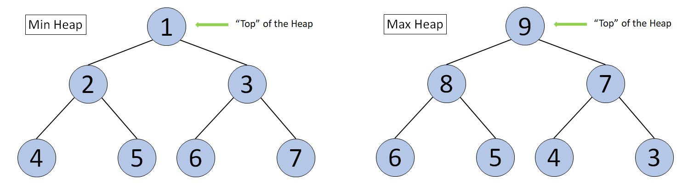

# Table of Contents

- [Table of Contents](#table-of-contents)
- [Heap](#heap)
  - [Definition and Classification of Heap](#definition-and-classification-of-heap)
    - [Priority Queues](#priority-queues)
    - [Definition of Heap](#definition-of-heap)
    - [Classification of Heap](#classification-of-heap)
      - [Max Heap](#max-heap)
      - [Min Heap](#min-heap)
- [Application of Heap](#application-of-heap)
  - [Heap Sort](#heap-sort)

# Heap

## Definition and Classification of Heap

### Priority Queues

- Before introducing a Heap, let's first talk about a Priority Queue.
- Wikipedia: a priority queue is an abstract data type similar to a regular queue or stack data structure in which each element additionally has a "priority" associated with it.
  - In a priority queue, an element with high priority is served before an element with low priority.
- In daily life, we would assign different priorities to tasks, start working on the task with the highest priority and then proceed to the task with the second highest priority.
  - This is an example of a Priority Queue.
- A common misconception is that a Heap is the same as a Priority Queue, which is not true.
  - A priority queue is an abstract data type, while a Heap is a data structure.
  - Therefore, a Heap is not a Priority Queue, but a way to implement a Priority Queue.
- There are multiple ways to implement a Priority Queue, such as array and linked list.
- However, these implementations only guarantee O(1) time complexity for either insertion or deletion, while the other operation will have a time complexity of O(N)
  - On the other hand, implementing the priority queue with Heap will allow both insertion and deletion to have a time complexity of O(log N)

### Definition of Heap

- According to Wikipedia, a Heap is a special type of binary tree.
- A heap is a binary tree that meets the following criteria:
  - Is a complete binary tree;
  - The value of each node must be no greater than (or no less than) the value of its child nodes.
- A Heap has the following properties:
  - Insertion of an element into the Heap has a time complexity of O(logN);
  - Deletion of an element from the Heap has a time complexity of O(logN);
  - The maximum/minimum value in the Heap can be obtained with O(1) time complexity.

### Classification of Heap

- There are two kinds of heaps: Max Heap and Min Heap.

#### Max Heap

- Each node in the Heap has a value no less than its child nodes.
- Root node = Largest value in the Heap.

#### Min Heap

- Each node in the Heap has a value no larger than its child nodes.
- Root node = Smallest value in the Heap

# Application of Heap

- Heap is a commonly used data structure in computer science. In this chapter, we will cover several applications of Heap.
  - Heap Sort
  - The Top-K problem
  - The K-th element

## Heap Sort

- Heap Sort sorts a group of unordered elements using the Heap data structure.

- The sorting algorithm using a Min Heap is as follows:

  1. Heapify all elements into a Min Heap.
  2. Record and delete the top element.
  3. Put the top element into an array T that stores all sorted elements. Now, the Heap will remain a Min Heap.
  4. Repeat steps 2 and 3 until the Heap is empty. The array T will contain all elements sorted in ascending order.
  5. The sorting algorithm using a Max Heap is as follows:

- The sorting algorithm using a Max Heap is as follows:

  1. Heapify all elements into a Max Heap.
  2. Record and delete the top element.
  3. Put the top element into an array T that stores all sorted elements. Now, the Heap will remain a Max Heap.
  4. Repeat steps 2 and 3 until the Heap is empty. The array T will contain all elements sorted in descending order.

- Complexity Analysis:
  - Let N be the total number of elements.
  - **Time complexity**: O(NlogN)
  - **Space complexity**: O(N)
